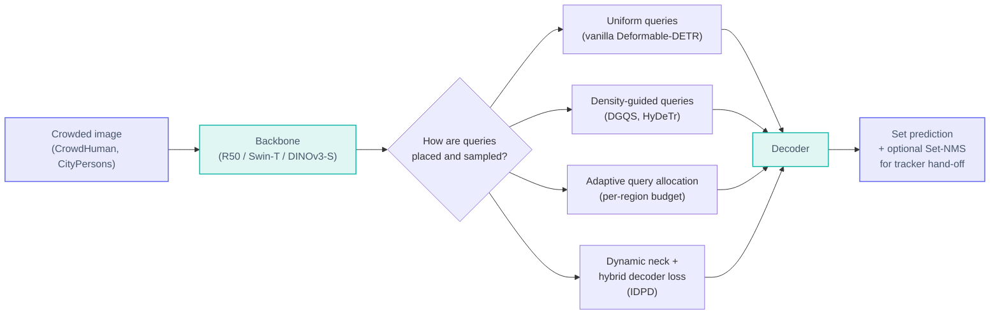
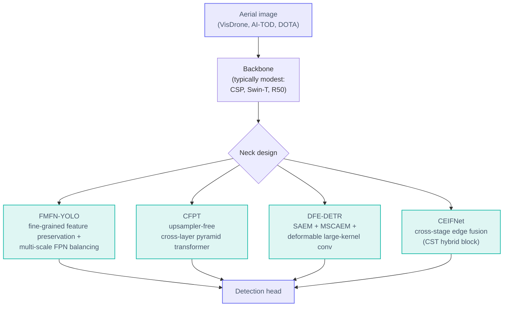
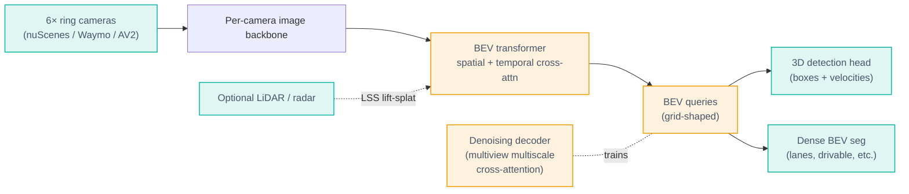
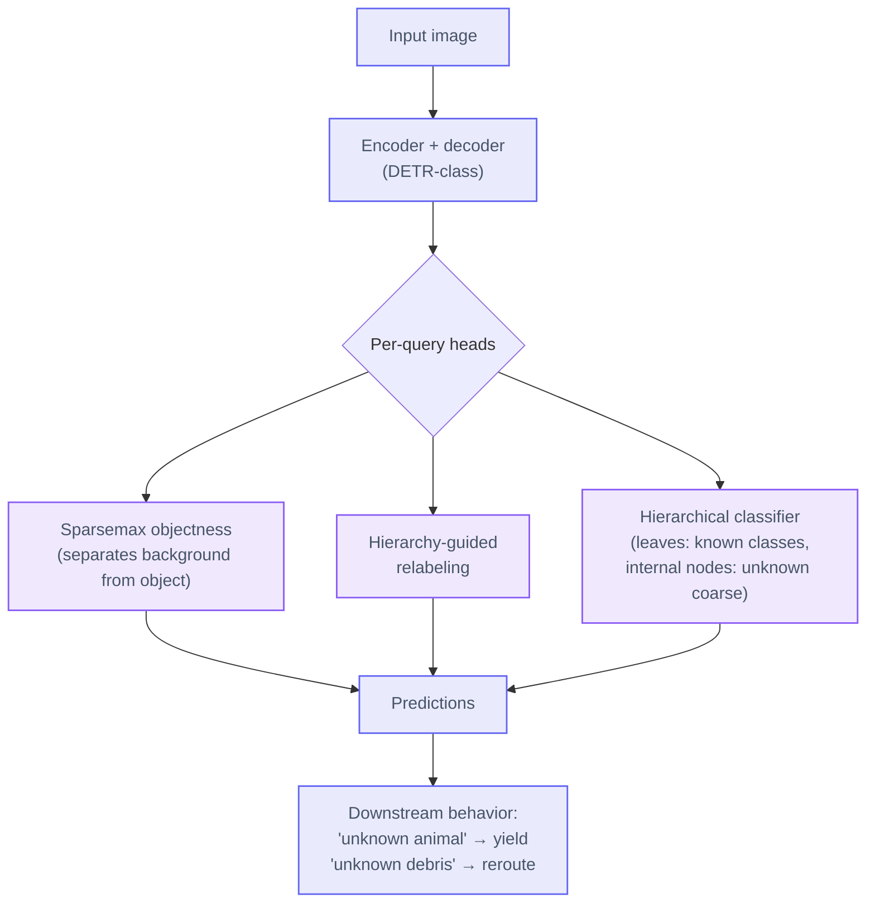

# CV Updates — Operational Tracks in Dense Detection &amp; Classification

**Date (America/Los_Angeles):** 2026-Apr-30
**Scope:** Complementary deep-dive on dense object detection & classification beyond the headline race (RF-DETR / YOLO26 / SAM 3 / DINOv3, all of which were covered in the previous report). This pass focuses on the **operational tracks** where dense perception actually ships in 2026: crowded 2D, aerial / UAV, multi-camera 3D, long-tail / open-world, dense classification heads, and edge / quantized inference.

---

## TL;DR

- **The headline detector race is converging; the interesting work has moved into specialized tracks.** A general-purpose RF-DETR-M or YOLO26-M is rarely the right answer for a *specific* dense problem (crowds, aerial, BEV, LVIS-tail). Each of those tracks has its own current SOTA recipe.
- **Dense classification ≠ detection-without-boxes.** [ML-Decoder](https://github.com/Alibaba-MIIL/ML_Decoder)-style query heads, hierarchical / taxonomy-aware heads ([BOUND, arXiv 2510.09173](https://arxiv.org/abs/2510.09173)), and open-vocabulary tagging (RAM family) outperform the legacy "global-pool + sigmoid" head on multi-label benchmarks (~88+ mAP on MS-COCO multi-label).
- **Open-world detection is leaving "flat unknown" behind.** [BOUND](https://arxiv.org/abs/2510.09173) (Mar 2026 update) treats unknown objects hierarchically — a road object you've never seen is at least an *animal* vs. *debris*, which is what downstream planners actually need.
- **Crowded scenes are still won by sparser, smarter attention.** [IDPD](https://link.springer.com/article/10.1007/s11760-023-02896-2) (improved Deformable-DETR for pedestrians, ~93% AP on CrowdHuman with R50), HyDeTr (hybrid density transformer) and [adaptive query allocation](https://www.sciencedirect.com/science/article/pii/S2590123025036163) all push DETR-class accuracy without paying the dense-attention price.
- **Aerial / small-object detection has a healthy 2026 wave**: [FMFN-YOLO](https://link.springer.com/article/10.1007/s40747-025-02126-x) (44.5/43.6 mAP50 on VisDrone/AI-TOD), [DFE-DETR](https://www.nature.com/articles/s41598-025-21134-y), [CFPT](https://arxiv.org/abs/2407.19696), [CEIFNet](https://www.nature.com/articles/s41598-026-36251-5) — almost all of them put the engineering effort in the *neck*, not the backbone.
- **3D / BEV detection has standardized around BEVFormer-derived stacks.** Recent [denoising multi-view cross-attention](https://ieeexplore.ieee.org/document/11001128/) and [LSS-based multi-modal fusion](https://ieeexplore.ieee.org/abstract/document/11087721/) variants are the active research surface.
- **Edge stack has matured.** [YOLO26 INT8](https://arxiv.org/pdf/2509.25164) preserves accuracy under FP16/INT8; the [reproducible Pi5 / Hailo / Edge TPU benchmark](https://www.nature.com/articles/s41598-026-36862-y) and the [YOLOv8/RT-DETR energy review](https://www.nature.com/articles/s41598-026-46453-6) finally make runtime selection a defensible engineering decision rather than a vibes call. NPUs like [AMD XDNA2](https://dasroot.net/posts/2026/04/amd-xdna2-ubuntu-ai-inference/) hit 3–5 ms with <1% accuracy loss.
- **DCNv4 has aged well.** [FlashInternImage with DCNv4](https://github.com/OpenGVLab/DCNv4) gives ~80% throughput uplift over DCNv3 with same/better quality (62.9 mIoU on ADE20K) — for many dense-prediction stacks it is now the default sparse operator.

---

## Operational tracks at a glance

The previous report mapped the *model* landscape. This one maps the *deployment* landscape.


---

## 1. Crowded 2D scenes (the IDPD / HyDeTr / adaptive-query line)

Crowd detection is the canonical "dense" detection task: many same-class instances, heavy occlusion, ambiguous boundaries. The 2025–2026 progress here is almost entirely in **how DETR-class models query the image**, not in backbones.



**What's actually new since the previous report:**

- [IDPD (Improved Deformable-DETR for crowd Pedestrian Detection)](https://link.springer.com/article/10.1007/s11760-023-02896-2) — adds a dynamic neck (omni-dimensional dynamic conv) so that pedestrian-relevant features survive the FPN, and a hybrid decoding loss combining Hungarian matching with a reconstruction term. ~93.22 % AP on CrowdHuman with a plain R50, beating both Deformable-DETR baseline and CNN-class detectors at matched cost.
- [Adaptive query allocation for dense object detection](https://www.sciencedirect.com/science/article/pii/S2590123025036163) — instead of a fixed query budget per image, lets the model spend more queries on dense regions. This is exactly the right fix for retail-shelf and traffic-camera deployments where the *count* of objects per image is very non-uniform.
- HyDeTr (Hybrid Density-Transformer) — explicitly conditions decoding on a coarse density map. Small accuracy jump on heavy occlusion, but a meaningful drop in failure-mode rate (the *tail* of detection-quality distribution shrinks).
- Density-guided query selection ([end-to-end small-object detection](https://www.sciencedirect.com/science/article/abs/pii/S092523122502226X)) extends the same idea to small-object regimes; the lesson generalizes — anywhere instance count per region is unbalanced, density-aware query placement helps.

**The cross-cutting lesson:** for crowded 2D, the operator that pays off is *sparse, density-aware attention* on top of a moderate backbone. Throwing a 7B ViT at it is a worse ROI than fixing the queries.

---

## 2. Aerial / UAV / remote-sensing — the neck does the work

Small objects in aerial images break two assumptions: (a) feature pyramids dilute high-frequency cues at lower levels, and (b) standard FPN upsampling is information-destructive when most objects are <32 px.



**Concrete numbers worth remembering:**

| Model | Benchmark | mAP | Why it works |
|---|---|---|---|
| [FMFN-YOLO](https://link.springer.com/article/10.1007/s40747-025-02126-x) | VisDrone2019 | 44.5 mAP50 | Preserves shallow high-resolution features end-to-end |
| FMFN-YOLO | AI-TOD | 43.6 mAP50 | Same recipe; matters more on tinier instances |
| [CFPT](https://arxiv.org/abs/2407.19696) | TinyPerson / VisDrone | +1.5–2.5 vs. FPN | No upsampling — cross-layer attention does the fusion |
| [DFE-DETR](https://www.nature.com/articles/s41598-025-21134-y) | DIOR / RSOD | +2–3 mAP vs. RT-DETR | SAEM + DLKCM specialized for remote-sensing scale |
| [CEIFNet](https://www.nature.com/articles/s41598-026-36251-5) | DOTA / VisDrone | competitive at <50% params | CNN-Transformer hybrid (CST block) |

The pattern: **none of these change the backbone.** They change the neck, sometimes the queries. That makes them deployable with off-the-shelf pretrained encoders, including frozen DINOv3 / ConvNeXt V2 if you want to avoid retraining from scratch.

See also the [survey of small-object detection 2023–2025](https://www.mdpi.com/2076-3417/15/22/11882) and the [transformers in small object detection benchmark](https://dl.acm.org/doi/10.1145/3758090) for a fuller taxonomy.

---

## 3. Multi-camera 3D / BEV detection (autonomous driving)

The previous report covered SAM 3 / DINOv3 / RF-DETR — none of those are 3D-native. For multi-camera 3D detection the active line is BEVFormer-derived:



Active 2025–2026 work:

- [Denoising Transformer for BEV 3D object detection (IEEE 2025)](https://ieeexplore.ieee.org/document/11001128/) — applies DN-DETR-style query denoising to multiview multiscale cross-attention; stable training and noticeable AP bump on nuScenes.
- [Multi-Modal BEV Enhancement Fusion (IEEE 2025)](https://ieeexplore.ieee.org/abstract/document/11087721/) — LSS-style camera lift fused with LiDAR features at BEV, with explicit gating modules that turn out to matter for nighttime and rain regimes.
- [DMformer](https://link.springer.com/article/10.1007/s40747-025-01984-9) — denoising + multi-modal fusion; addresses *both* sensor noise and modality misalignment in one decoder.
- [OCBEV (IEEE 2024)](https://ieeexplore.ieee.org/document/10550502/) — object-centric BEV queries; better at moving targets where global BEV grid loses identity over time.

The takeaway: **3D multi-camera detection is its own track.** The "real-time mAP race" coverage rarely touches it, but it's where most autonomy compute now lives. For a survey, see [Vision Transformers in Autonomous Driving (arXiv 2403.07542)](https://arxiv.org/html/2403.07542v1).

---

## 4. Long-tail and open-world

Every deployed dense-detection system fails on tail and unseen classes. Two 2026 papers worth highlighting:

### 4.1 BOUND — Beyond Flat Unknown Labels

[BOUND (arXiv 2510.09173, updated Mar 2026)](https://arxiv.org/abs/2510.09173) is the cleanest single advance in open-world object detection in the last six months. The classical OWOD framing has a single "unknown" bin; BOUND replaces that with the existing label *taxonomy*:



Reported wins: higher unknown recall on standard OWOD benchmarks **without** sacrificing known-class mAP, plus structured generalization on long-tail LVIS.

The reason it matters operationally: a planner that can act on "this is some kind of animal" makes safer decisions than one that gets a flat "unknown — confidence 0.7." Hierarchical unknowns turn open-world detection into an *actionable* signal rather than a research curio.

### 4.2 SearchDet — training-free long-tail OD

[SearchDet (IEEE 2026)](https://ieeexplore.ieee.org/document/11094398/) goes the other direction: instead of building a better head, retrieve web-image exemplars at inference time and use them as visual prompts for an open-vocabulary detector. Effective when:

- You can't fine-tune (closed-source / regulated deployment),
- New classes appear at runtime,
- You already have an open-vocab detector (Grounding DINO / SAM 3) in the loop.

It pairs naturally with the SAM-3-as-oracle pattern from the previous report.

### 4.3 The pragmatic stack for 2026

```
VLM (Qwen3-VL / PaliGemma2)                 ← noun-phrase generation
   ↓
Open-vocab detector (SAM 3 / Grounding DINO) ← initial localization
   ↓
SearchDet retrieval                          ← rare-class augmentation
   ↓
BOUND-style hierarchical head                ← graceful unknowns
   ↓
Specialist (RF-DETR / YOLO26)                ← only on the closed set
```

Most teams do *not* need a single model that does all of this; they need this *pipeline* with cheap glue.

---

## 5. Dense classification (multi-label, hierarchical, tagging)

This is the section the previous report under-covered. "Classification" in 2026 is rarely "one image → one of 1,000 ImageNet classes" — it is multi-label tagging, hierarchical taxonomies, and open-vocabulary tag prediction.


### 5.1 Heads, not backbones, are the decision

A modern multi-label classifier is best described by its *head*, with the backbone treated as commodity. Four families dominate:

| Head family | Representative models | Strength | Weakness |
|---|---|---|---|
| Global pool + sigmoid | Plain ResNet/ViT + BCE | Cheap; works for ≤20 well-localized labels | Drowns the tail; ignores spatial structure |
| Query decoder | [ML-Decoder (Alibaba-MIIL)](https://github.com/Alibaba-MIIL/ML_Decoder), [C-Tran (CVPR 2021)](https://arxiv.org/abs/2011.14027), [MlTr (arXiv 2106.06195)](https://arxiv.org/abs/2106.06195), [TSFormer (ACM MM 2022)](https://dl.acm.org/doi/abs/10.1145/3503161.3548343), [FL-Tran](https://www.sciencedirect.com/science/article/abs/pii/S0031320322006823) | ~88+ mAP on MS-COCO multi-label; sub-linear cost in number of labels via group decoding | Needs tuning of label embedding init |
| Hierarchical / taxonomy-aware | BOUND-style heads, [Hyp-OW](https://arxiv.org/abs/2306.14291), Wehrmann HMCN, [visually-consistent hierarchical classifier](https://openreview.net/forum?id=7HEMpBTb3R) | Graceful degradation on tail and unknowns; aligns with downstream business taxonomies | Requires a clean taxonomy |
| Open-vocabulary tagging | RAM / RAM++, SigLIP2-tagging, VLM-prompted | Zero-shot generalization to unseen tags; great for cold start | Lower precision on closed sets without a supervised head fused in |

### 5.2 Why the head dominates

For thousands of labels the cost is in the label-side compute, not the visual side:

- ML-Decoder uses learned label *queries* and group-decoding so cost scales sub-linearly in label count. Fitting OpenImages-V6's 9.6 K classes used to be a memory exercise; with ML-Decoder it's routine.
- C-Tran and MlTr both add **label-label dependency modeling** via attention — captures the fact that "wedding" and "bride" co-occur, and that "polar bear" and "beach" almost never do.
- Hierarchical heads share gradients between head and tail labels: rare *Hummingbird* species inherit from common *Bird* features.

### 5.3 Open-vocabulary tagging (RAM / RAM++)

The [Recognize-Anything Model](https://www.labellerr.com/blog/recognize-anything-a-strong-image-tagging-model-2/) family pushes tagging into open-vocab territory: tag from a text vocabulary using SigLIP/CLIP-aligned features. RAM outperforms ML-Decoder in zero-shot generalization to OpenImages-common categories, but the production pattern that wins is **fusion**: a small supervised head for your closed product taxonomy + RAM-style open-vocab head for catch-all coverage. The resulting system handles cold-start and long-tail without requiring frequent retraining.

---

## 6. Edge & quantization (where everything actually runs)

The previous report mentioned edge in passing. Here are the numbers and runtime decisions that matter in April 2026.


### 6.1 Concrete benchmarks

- **NPU on Pi5 / Hailo / Edge TPU.** The [reproducible Pi5 / Jetson benchmark (Sci. Reports, 2026)](https://www.nature.com/articles/s41598-026-36862-y) is the first apples-to-apples comparison across Pi5 CPU+NPU and Jetson Orin NX. Key result: Hailo-8 preserves ~93–95 % of the FP32 mAP on RT-DETR-l at INT8; Edge TPU forces 224×224 input + INT8-only and pays a meaningful accuracy cost.
- **AMD XDNA2 NPU** ([reference report](https://dasroot.net/posts/2026/04/amd-xdna2-ubuntu-ai-inference/)): ≈3–5 ms inference for object detection at &lt;1 % accuracy loss. Notable as the first widely-available laptop-class NPU competitive with discrete edge accelerators.
- **YOLO26**: explicitly designed for INT8 — drops Distribution Focal Loss for a quant-friendlier head, ships TFLite/CoreML/TensorRT exports, and shows consistent accuracy under both FP16 and INT8 ([arXiv 2509.25164](https://arxiv.org/abs/2509.25164)).
- **Energy review of YOLOv8 vs RT-DETR** ([Sci. Reports, 2026](https://www.nature.com/articles/s41598-026-46453-6)): for matched mAP, RT-DETR-l draws more energy on edge GPUs; the YOLO family is still the lower-energy default unless you specifically need the DETR query mechanism.

### 6.2 Knowledge distillation as the universal "fix"

Distilling a heavy teacher (e.g. Co-DINO, RF-DETR-2XL) into a small student that can survive INT8 is the most reliable lever:

- [Edge AI for Automotive Vulnerable Road User Safety (arXiv 2604.26857)](https://arxiv.org/html/2604.26857) — KD recovers most of the FP32 mAP after INT8 quantization, with 3.9× compression.
- [SDD-YOLO](https://arxiv.org/html/2603.25218) — small-target detection variant tuned for ground-to-air anti-UAV, edge-optimized.
- [Lightweight transformer architectures for edge devices (arXiv 2601.03290)](https://arxiv.org/pdf/2601.03290) — recipe collection; key hits are token reduction + attention-head pruning under quant-aware fine-tune.

### 6.3 Selection rule of thumb

| Constraint | Pick |
|---|---|
| ≤5 ms, NPU-class hardware | YOLO26-S/N INT8 |
| 5–15 ms, Jetson-class | YOLO26-M FP16 / RF-DETR-N FP16 |
| Edge TPU only | Distilled YOLO26 student @224 (and pay the accuracy cost) |
| Hailo-8 / Hailo-15 | RT-DETR-S/M INT8 (best DETR-class throughput) |
| Server GPU, latency >20 ms acceptable | RF-DETR-L / D-FINE / Co-DINO |

---

## 7. Cross-cutting: deformable v4, sparse attention, and TTA

Two cross-cutting techniques that show up in many of the tracks above:

### 7.1 DCNv4 → FlashInternImage

[DCNv4 (CVPR 2024, OpenGVLab)](https://github.com/OpenGVLab/DCNv4) drops softmax normalization in spatial aggregation and fixes the memory-access pattern that bottlenecked DCNv3. Plugged into [InternImage to make FlashInternImage](https://arxiv.org/html/2401.06197v1):

- ~80 % throughput uplift over DCNv3 baseline.
- 62.9 mIoU on ADE20K (semantic segmentation).
- Same operator now used in classification, segmentation, and image generation.

For dense prediction stacks where you need a strong CNN-side encoder (especially for very high resolution or heavy occlusion), FlashInternImage is the current default sparse operator. [DAT++](https://github.com/LeapLabTHU/DAT) carries the same idea over to ViT-style encoders.

### 7.2 Test-time adaptation (TTA / OTTA) — closing the train/serve gap without retraining

When your model encounters a new domain (lighting, sensor, geography) at deployment, you can either retrain (expensive) or adapt at inference. The 2025–2026 literature on [test-time adaptation](https://github.com/tim-learn/awesome-test-time-adaptation) has converged on a few patterns:

- **Selective TTA** ([Information Sciences 2023, follow-ups 2025](https://www.sciencedirect.com/science/article/abs/pii/S0020025523007338)) — only invoke TTA on uncertain inputs. Keeps the average-case cost flat, fixes the worst case.
- **On-demand TTA for edge** — adapt only when input statistics drift past a threshold; maps cleanly onto the NPU stacks above.
- **Feature-redundancy elimination (FRET)** — prune correlated features before adaptation; helps both throughput and stability.

For object detection specifically, the cheapest practical knob is *batch-norm statistic re-estimation* on a small streaming buffer — gets you most of the benefit at near-zero cost. Useful guide: [understanding TTA (arXiv 2402.06892)](https://arxiv.org/html/2402.06892v1).

---

## 8. Selection guide (Apr 2026, complementing the previous report)

| Problem | First thing to try (this report's angle) |
|---|---|
| Dense pedestrian / retail-shelf crowds | **IDPD-style** dynamic neck on Deformable-DETR; add density-guided queries |
| UAV / aerial small-object | **FMFN-YOLO** or **CFPT neck** on a modest backbone |
| Multi-camera 3D for AV | **BEVFormer-derived stack** with denoising decoder + LSS multi-modal fusion |
| Open-world detection where unknowns must be actionable | **BOUND** hierarchical-unknown head |
| Long-tail with cold-start | **SearchDet retrieval** + open-vocab detector |
| Multi-label tagging at scale | **ML-Decoder** + (optional) RAM-style open-vocab fusion head |
| INT8 on NPU laptop / Pi5 | **YOLO26-S** distilled, INT8, FP16 fallback for edge cases |
| Heavy-resolution dense seg / det | **FlashInternImage (DCNv4)** as backbone |
| Domain drift at deployment | **Selective TTA** / BN-stat re-estimation, no retraining |

---

## Sources (new for this report)

### Crowded scenes and dense queries
- [IDPD — Improved Deformable-DETR for Crowd Pedestrian Detection (Springer)](https://link.springer.com/article/10.1007/s11760-023-02896-2)
- [Adaptive query allocation for dense object detection in deformable transformers (Elsevier 2025)](https://www.sciencedirect.com/science/article/pii/S2590123025036163)
- [End-to-end transformer detection with density-guided query selection for small objects](https://www.sciencedirect.com/science/article/abs/pii/S092523122502226X)
- [Multiscale regional calibration network for crowd counting (Sci. Reports 2025)](https://www.nature.com/articles/s41598-025-86247-w)
- [Object Detection with Transformers — Review (PMC)](https://pmc.ncbi.nlm.nih.gov/articles/PMC12526829/)

### Aerial / small object
- [FMFN-YOLO — UAV aerial small object detection (Springer 2025)](https://link.springer.com/article/10.1007/s40747-025-02126-x)
- [CFPT — Cross-Layer Feature Pyramid Transformer (arXiv 2407.19696)](https://arxiv.org/abs/2407.19696)
- [DFE-DETR — Dynamic small object feature enhancement (Sci. Reports 2025)](https://www.nature.com/articles/s41598-025-21134-y)
- [CEIFNet — Cross-stage edge information fusion (Sci. Reports 2026)](https://www.nature.com/articles/s41598-026-36251-5)
- [Transformers in Small Object Detection — Benchmark & Survey (ACM CSUR 2025)](https://dl.acm.org/doi/10.1145/3758090)
- [Advancements in Small-Object Detection (2023–2025) (MDPI)](https://www.mdpi.com/2076-3417/15/22/11882)

### 3D / BEV
- [Denoising Transformer for BEV 3D Object Detection (IEEE 2025)](https://ieeexplore.ieee.org/document/11001128/)
- [Multi-Modal BEV Enhancement Fusion for 3D OD (IEEE 2025)](https://ieeexplore.ieee.org/abstract/document/11087721/)
- [OCBEV — Object-Centric BEV Transformer (IEEE 2024)](https://ieeexplore.ieee.org/document/10550502/)
- [DMformer — denoising + multi-modal fusion for BEV (Springer 2025)](https://link.springer.com/article/10.1007/s40747-025-01984-9)
- [Vision Transformers in Autonomous Driving — Survey (arXiv 2403.07542)](https://arxiv.org/html/2403.07542v1)
- [BEVFormer model card (NVIDIA)](https://build.nvidia.com/nvidia/bevformer/modelcard)
- [Dual-Modal Gated Fusion BEV 3D OD (MDPI Sustainability 2026)](https://www.mdpi.com/2071-1050/18/5/2438)

### Long-tail / open-world
- [BOUND — Beyond Flat Unknown Labels in Open-World OD (arXiv 2510.09173)](https://arxiv.org/abs/2510.09173)
- [SearchDet — training-free long-tail object detection (IEEE 2026)](https://ieeexplore.ieee.org/document/11094398/)
- [Hyp-OW — hierarchical open-world via hyperbolic distance (arXiv 2306.14291)](https://arxiv.org/abs/2306.14291)
- [Open World Object Detection in the Era of Foundation Models (arXiv 2312.05745)](https://arxiv.org/html/2312.05745)

### Dense / multi-label classification
- [ML-Decoder — Scalable, Versatile Classification Head (Alibaba-MIIL)](https://github.com/Alibaba-MIIL/ML_Decoder)
- [C-Tran — General Multi-Label Image Classification with Transformers (CVPR 2021 / arXiv)](https://arxiv.org/abs/2011.14027)
- [MlTr — Multi-label Transformer (arXiv 2106.06195)](https://arxiv.org/abs/2106.06195)
- [TSFormer — Two-Stream Transformer for multi-label (ACM MM 2022)](https://dl.acm.org/doi/abs/10.1145/3503161.3548343)
- [FL-Tran — Feature Learning network with Transformer (Pattern Recognition)](https://www.sciencedirect.com/science/article/abs/pii/S0031320322006823)
- [Visually-consistent hierarchical image classification (OpenReview)](https://openreview.net/forum?id=7HEMpBTb3R)
- [RAM — Recognize Anything Model write-up](https://www.labellerr.com/blog/recognize-anything-a-strong-image-tagging-model-2/)
- [Image Classification — 2026 picks (Label Your Data)](https://labelyourdata.com/articles/image-classification-models)

### Edge / quantization
- [Reproducible Pi5 / Jetson edge benchmark (Sci. Reports 2026)](https://www.nature.com/articles/s41598-026-36862-y)
- [Energy review of YOLOv8l & RT-DETR-l on edge (Sci. Reports 2026)](https://www.nature.com/articles/s41598-026-46453-6)
- [YOLO26 architectural enhancements (arXiv 2509.25164)](https://arxiv.org/abs/2509.25164)
- [Edge AI for Automotive Vulnerable Road User Safety — KD for INT8 (arXiv 2604.26857)](https://arxiv.org/html/2604.26857)
- [SDD-YOLO — anti-UAV small-target, edge-deployable (arXiv 2603.25218)](https://arxiv.org/html/2603.25218)
- [AMD XDNA2 NPU integration with Ubuntu — inference benchmarks](https://dasroot.net/posts/2026/04/amd-xdna2-ubuntu-ai-inference/)
- [Lightweight transformer architectures for edge (arXiv 2601.03290)](https://arxiv.org/pdf/2601.03290)
- [Quantization-optimized lightweight transformer for fruit-ripeness — fully worked example (MDPI 2026)](https://www.mdpi.com/2073-431X/15/1/69)

### Deformable v4 / sparse attention
- [DCNv4 — Efficient Deformable ConvNets (CVPR 2024, repo)](https://github.com/OpenGVLab/DCNv4)
- [DCNv4 — paper (arXiv 2401.06197)](https://arxiv.org/html/2401.06197v1)
- [InternImage repo](https://github.com/OpenGVLab/InternImage)
- [DAT / DAT++ — Vision Transformer with Deformable Attention](https://github.com/LeapLabTHU/DAT)
- [DeGMix — Efficient Multi-Task Dense Prediction (arXiv 2308.05721)](https://arxiv.org/abs/2308.05721)

### Test-time adaptation
- [Awesome Test-Time Adaptation (curated)](https://github.com/tim-learn/awesome-test-time-adaptation/blob/main/TTA-OTTA.md)
- [Selective TTA — Information Sciences 2023](https://www.sciencedirect.com/science/article/abs/pii/S0020025523007338)
- [Understanding Test-Time Augmentation (arXiv 2402.06892)](https://arxiv.org/html/2402.06892v1)
- [ICLR 2026 schedule (TTA / OTTA tracks)](https://iclr.cc/virtual/2026/calendar)

### Cross-reference (also covered in 2026-Apr-30 prior pass)
- [RF-DETR (Roboflow, ICLR 2026)](https://github.com/roboflow/rf-detr)
- [YOLO26 — Ultralytics docs](https://docs.ultralytics.com/models/yolo26/)
- [SAM 3 — Meta blog](https://ai.meta.com/blog/segment-anything-model-3/)
- [DINOv3 — Meta blog](https://ai.meta.com/blog/dinov3-self-supervised-vision-model/)
