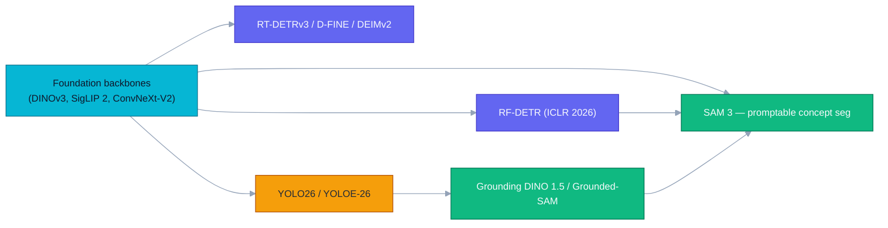
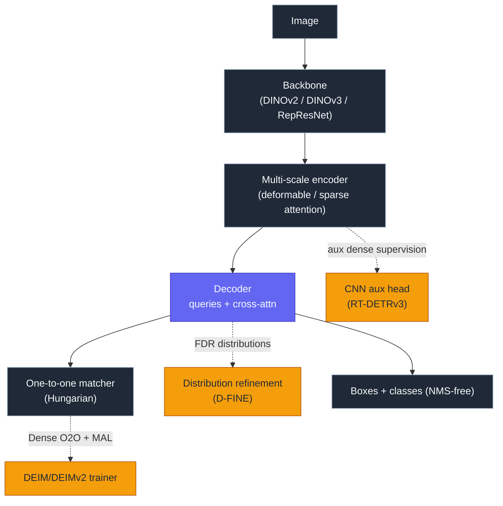
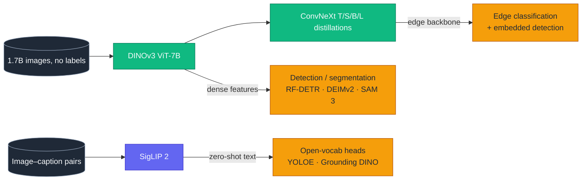
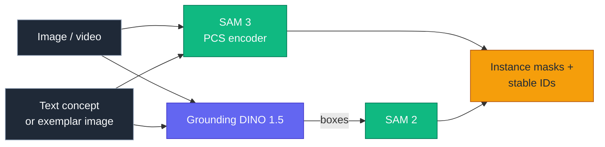
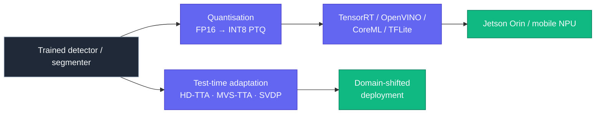

# Dense Object Detection & Classification — Recent Advances

**Report date:** 2026-Apr-30 (America/Los_Angeles)
**Scope:** Models, training tricks, and deployment patterns that are
actively reshaping dense detection and image classification in 2026.

---

## Table of contents

1. [Executive summary](#1-executive-summary)
2. [Landscape — accuracy vs. latency](#2-landscape--accuracy-vs-latency)
3. [Real-time DETR family](#3-real-time-detr-family)
4. [YOLO family in 2026](#4-yolo-family-in-2026)
5. [Foundation backbones for classification & dense prediction](#5-foundation-backbones-for-classification--dense-prediction)
6. [Promptable & open-vocabulary detection / segmentation](#6-promptable--open-vocabulary-detection--segmentation)
7. [Specialised tracks: crowds, aerial, BEV 3D, long-tail](#7-specialised-tracks-crowds-aerial-bev-3d-long-tail)
8. [Operators, edge deployment, and TTA](#8-operators-edge-deployment-and-tta)
9. [Reading list](#9-reading-list)

---

## 1. Executive summary

Three trends define dense detection and classification this cycle:

- **DETR has caught YOLO on latency.** RF-DETR (ICLR 2026) and DEIMv2
  push real-time transformer detectors past 60 AP on COCO at T4
  speeds, while D-FINE's distribution-refinement decoder and DEIM's
  *dense one-to-one* matching cut DETR training cost roughly in half.
- **Self-supervised vision foundation models close the gap with
  text-supervised ones.** DINOv3 (7B params, 1.7B images) matches or
  beats SigLIP 2 on classification and dominates dense-prediction
  benchmarks; ConvNeXt distillations bring those features to
  resource-constrained inference.
- **Promptable everything.** SAM 3 unifies points, boxes, masks, and
  *short-text concepts* under a single Promptable Concept
  Segmentation (PCS) interface, while YOLOE-26 fuses YOLO26's
  deployment story with open-vocabulary instance segmentation.

The corresponding tooling story — INT8/FP16 export pipelines, NMS-free
end-to-end inference, and DCNv4-style efficient operators — has
matured enough that "real-time on Jetson" is a default, not a goal.

---

## 2. Landscape — accuracy vs. latency

Approximate published numbers on COCO `val` with NVIDIA T4 +
TensorRT FP16; marker size encodes parameter budget.

The chart uses `currentColor` for axes and labels, so it inverts
correctly in both light and dark themes.

---

## 3. Real-time DETR family

DETR-style detectors finally have a real-time story. The 2024–2026
arc clusters around three orthogonal improvements: **denser
supervision** (DEIM), **finer-grained box parameterisation**
(D-FINE), and **NAS-tuned backbones** (RF-DETR).

### 3.1 RF-DETR (ICLR 2026)

- Roboflow's RF-DETR is built on a **DINOv2 ViT backbone** and tuned
  with neural architecture search over the encoder/decoder cost
  surface ([arXiv 2511.09554](https://arxiv.org/abs/2511.09554),
  [GitHub](https://github.com/roboflow/rf-detr)).
- RF-DETR-L hits **56.5 AP at 6.8 ms (T4 / TensorRT FP16)**;
  RF-DETR-2XL reaches **60.1 AP** — the first real-time model past
  60 on COCO.
- RF-DETR-N beats D-FINE-N by **+5.3 AP** at comparable latency, and
  the family is the first to crack **60 mAP on RF100-VL**, a
  domain-adaptation benchmark of 100 fine-tuning datasets.
- License: Apache 2.0; primary use case is **fine-tuning**, not
  out-of-the-box COCO inference.

### 3.2 D-FINE

- D-FINE replaces fixed bbox regression with **Fine-grained
  Distribution Refinement (FDR)** — the decoder iteratively refines
  per-coordinate probability distributions instead of point estimates
  ([CVPR 2024 / project page](https://www.dfine.ai/)).
- A second loss, **Global Optimal Localization Self-Distillation
  (GO-LSD)**, distils the most-refined predictions back into earlier
  layers, sharing localisation signal across the decoder stack.
- D-FINE-X is the strongest non-NAS DETR at ~59 AP on COCO and is
  still the standard baseline for the family.

### 3.3 DEIM and DEIMv2

- **DEIM** (CVPR 2025, [arXiv 2412.04234](https://arxiv.org/abs/2412.04234))
  identifies the core slowness of DETR training as *sparse one-to-one
  matching*. It introduces:
  - **Dense O2O** — augmented copies of each image are matched
    independently, giving more positive samples per step.
  - **Matchability-Aware Loss (MAL)** — re-weights matches by quality
    rather than treating all matched pairs identically.
- Plugged into RT-DETR and D-FINE, DEIM **boosts AP while halving
  training time**.
- **DEIMv2** ([Intellindust-AI-Lab/DEIM](https://github.com/Intellindust-AI-Lab/DEIM))
  swaps in **DINOv3 features** as the backbone and ships three
  ultra-light variants — **Pico (1.5M)**, **Femto (0.96M)**, and
  **Atto (0.49M)** — that hold their own against larger CNN
  detectors at the edge.

### 3.4 RT-DETRv3

- RT-DETRv3 ([review on MDPI](https://www.mdpi.com/1424-8220/25/19/6025))
  layers three forms of *dense* supervision on top of RT-DETRv2:
  a CNN auxiliary head, self-attention perturbation for diverse
  label assignment, and a shared-weight decoder branch that feeds
  one-to-many positive supervision back into the one-to-one trunk.
- These are all training-time additions — inference graph is
  unchanged — so v3 ports cleanly to existing TensorRT pipelines.

---

## 4. YOLO family in 2026

### 4.1 YOLO26

- Released late 2025 / early 2026 ([arXiv 2509.25164](https://arxiv.org/abs/2509.25164),
  [Ultralytics docs](https://docs.ultralytics.com/models/yolo26/)).
- Headline architectural changes:
  - **Drops Distribution Focal Loss (DFL)** — simpler decoder,
    cleaner export.
  - **End-to-end NMS-free inference** — closing the gap with DETR-style
    detectors on deployment ergonomics.
  - **ProgLoss + Small-Target-Aware Label Assignment (STAL)** — both
    targeted at the long-standing small-object weakness of YOLO.
  - **MuSGD optimiser** — stabilises convergence at the longer
    training schedules now common for large variants.
- Unified multi-task head: detection, instance segmentation,
  pose/keypoints, oriented detection, and classification.
- Ships with INT8/FP16 export paths to TensorRT, ONNX, CoreML,
  TFLite, and OpenVINO; benchmarked on Jetson Nano/Orin against
  YOLOv8/11/12/13 and the DETR cohort.

### 4.2 YOLOE and YOLOE-26

- **YOLOE** ([Ultralytics](https://docs.ultralytics.com/models/yoloe/))
  adds zero-shot, promptable detection to YOLO, beating YOLO-Worldv2
  by **+3.5 AP on LVIS** with a third of the training compute.
- **YOLOE-26** ([arXiv 2602.00168](https://arxiv.org/abs/2602.00168))
  fuses YOLOE's open-vocabulary head with YOLO26's deployment
  pipeline and delivers real-time open-vocabulary *instance
  segmentation* at **161 FPS on T4**. Three prompting modes share a
  single object-embedding space:
  - **Re-Parameterizable Region-Text Alignment (RepRTA)** — text
    prompts at zero deployment overhead.
  - **Semantic-Activated Visual Prompt Encoder (SAVPE)** — image-
    exemplar prompts.
  - **Lazy Region Prompt Contrast** — prompt-free fallback.

### 4.3 YOLO-World context

YOLO-World (CVPR 2024, [arXiv 2401.17270](https://arxiv.org/abs/2401.17270))
is still the reference point — vision–language pre-training fused
into a YOLOv8 trunk, hitting **35.4 AP / 52 FPS on LVIS**. The 2026
generation (YOLOE family) inherits its architecture but trains with
much less compute.

---

## 5. Foundation backbones for classification & dense prediction

### 5.1 DINOv3

- Meta's [DINOv3](https://ai.meta.com/blog/dinov3-self-supervised-vision-model/)
  scales self-supervised vision pre-training to **7B parameters /
  1.7B images** (vs. DINOv2's 1B / 142M) and is the first SSL model
  to *outperform* its weakly-supervised counterparts (CLIP/SigLIP)
  across a broad evaluation suite.
- It particularly **widens the gap on dense prediction tasks**
  (segmentation, depth, detection), making it the backbone of
  choice for downstream detectors like DEIMv2.
- Release ladder includes ViT-S/B/L/H/g and **ConvNeXt T/S/B/L
  distillations** of the ViT-7B teacher for resource-constrained
  inference.
- Code: [facebookresearch/dinov3](https://github.com/facebookresearch/dinov3);
  paper: [arXiv 2508.10104](https://arxiv.org/abs/2508.10104).

### 5.2 SigLIP 2 and hybrid stacks

- SigLIP 2 remains the strongest text-supervised backbone for
  zero-shot classification.
- Hybrid stacks like **SigLino** ([HF collection](https://huggingface.co/collections/tiiuae/siglino-vision-foundation-models-siglip2-dinov3))
  pair SigLIP 2 features (semantics) with DINOv3 features (dense
  geometry) — typical recipe for robust multimodal encoders.

---

## 6. Promptable & open-vocabulary detection / segmentation

### 6.1 SAM 3

- [SAM 3](https://github.com/facebookresearch/sam3) (paper:
  [arXiv 2511.16719](https://arxiv.org/abs/2511.16719)) introduces
  **Promptable Concept Segmentation (PCS)**: given a short text
  phrase or image exemplars, return masks for *every* matching
  instance, with stable identities across video frames.
- Unifies point/box/mask prompts (SAM 1 + 2) with text prompts
  (previously bolted on by Grounded-SAM) in a single foundation
  model.
- Companion paper **SAM3-I** ([arXiv 2512.04585](https://arxiv.org/abs/2512.04585))
  generalises prompts to free-form natural-language *instructions*.

### 6.2 Grounded-SAM and 1.5-class systems

- Even with native text in SAM 3, the modular [Grounded-SAM](https://github.com/IDEA-Research/Grounded-Segment-Anything)
  pipeline (Grounding DINO → SAM/SAM 2) remains the fastest way to
  swap detector and segmenter independently — useful when you want
  a domain-specific detector without retraining the segmenter.
- Grounding DINO 1.5 + SAM 2 is still the production default for
  many open-vocabulary instance-segmentation pipelines, and
  consistently outperforms GLIP on zero-shot benchmarks.

### 6.3 Real-time open-vocab

- **OV-DEIM** ([arXiv 2603.07022](https://arxiv.org/html/2603.07022))
  ports DEIM's dense-matching tricks to open-vocabulary detection,
  closing most of the speed gap with closed-set DETRs.
- **YOLOE-26** (above) makes open-vocab segmentation real-time on
  commodity GPUs.

---

## 7. Specialised tracks: crowds, aerial, BEV 3D, long-tail

### 7.1 Crowded scenes & occlusion

- **FEOD-YOLOv11** ([Springer](https://link.springer.com/article/10.1007/s00530-025-02083-y))
  adds fine-grained feature enhancement and an explicit occlusion
  branch on top of YOLOv11 for dense pedestrian detection.
- **DensityNet** is a lightweight augmentation block for occluded
  crowds; head-detection fine-tuning of YOLO11 (Jutif 2025) is now
  the standard recipe for people-counting on top-down cameras.
- For traffic surveillance, **IBCDet** extends CrowdDet with the
  Involution operator and BiFPN ([MDPI](https://www.mdpi.com/2076-3417/13/12/7174))
  to keep Set-NMS competitive against transformer detectors.

### 7.2 Aerial & remote-sensing small objects

- The 2025–2026 surveys ([Springer](https://link.springer.com/article/10.1007/s10462-025-11150-9),
  [MDPI](https://www.mdpi.com/2076-3417/15/22/11882)) converge on
  three recipes: high-resolution multi-scale heads, oriented bbox
  parameterisations (DOTA-style), and detection-guided slicing for
  satellite-scale frames.
- Benchmarks worth tracking: **SODA-A**, **DOTA / DOTA-CD**,
  **AIR-CD**, **UAVOD-10**, **Sod-UAV**.
- RT-DETR is a common starting point because deformable attention
  captures sub-32-pixel objects more reliably than vanilla SSD/YOLO
  heads.

### 7.3 BEV 3D for autonomous driving

- **BEVFormer** ([arXiv 2203.17270](https://arxiv.org/abs/2203.17270))
  is still the canonical multi-camera BEV transformer; it pushed
  nuScenes NDS to 56.9.
- **RetentiveBEV** ([SagePub](https://journals.sagepub.com/doi/10.1177/01423312241308367))
  swaps attention for the *retentive* mechanism from RetNet, hitting
  **60.4 NDS** without extra training data.
- **DMFormer** ([Springer](https://link.springer.com/article/10.1007/s40747-025-01984-9))
  uses a diffusion-denoising fusion module across camera+LiDAR for
  **73.6 NDS / 71.8 mAP**.
- **BEVENet** ([arXiv 2312.00633](https://arxiv.org/abs/2312.00633))
  argues that for production autonomy you can drop ViT entirely —
  a convolutional-only BEV detector has more predictable latency.

### 7.4 Long-tail classification

- **DeiT-LT** ([CVPR 2024](https://openaccess.thecvf.com/content/CVPR2024/papers/Rangwani_DeiT-LT_Distillation_Strikes_Back_for_Vision_Transformer_Training_on_Long-Tailed_CVPR_2024_paper.pdf))
  shows that ViT can be specialised for long-tailed data by routing
  the **DIST** token toward tail experts and the **CLS** token toward
  head experts via distillation.
- **VLM-driven long-tail multi-label** ([arXiv 2511.20641](https://arxiv.org/html/2511.20641v1))
  uses CLIP/SigLIP-style alignment to inject prior class semantics
  into the classifier, particularly helpful when tail classes have
  fewer than ~50 samples.
- The decoupled-head recipe ("first learn features, then re-balance
  the classifier") remains competitive and is now the default for
  industrial classification pipelines with skewed class priors.

---

## 8. Operators, edge deployment, and TTA

### 8.1 DCNv4 and FlashInternImage

- **DCNv4** ([CVPR 2024](https://openaccess.thecvf.com/content/CVPR2024/papers/Xiong_Efficient_Deformable_ConvNets_Rethinking_Dynamic_and_Sparse_Operator_for_Vision_CVPR_2024_paper.pdf),
  [code](https://github.com/OpenGVLab/DCNv4)) drops softmax
  normalisation in the spatial-aggregation step and rewrites the CUDA
  memory layout, achieving **>3× forward speedup** vs. DCNv3 with
  no quality loss.
- Drop-in replacement of DCNv3 inside InternImage produces
  **FlashInternImage** with **up to 80% speedup** at on-par accuracy
  — the cheapest "free lunch" available right now for ConvNet-based
  detectors.

### 8.2 Edge inference, INT8, and NMS-free graphs

- The combination of **NMS-free heads** (YOLO26, RT-DETR family) and
  **TensorRT INT8 PTQ** is now a single export step in most modern
  detector toolkits.
- INT8 typically gives **~3–4× throughput vs. FP32** with negligible
  AP drop on COCO; NVIDIA still recommends ~500 representative
  calibration images.
- A 2026 study on **quantisation robustness under input
  degradations** ([arXiv 2508.19600](https://arxiv.org/html/2508.19600))
  finds that INT8 detectors degrade more gracefully under
  blur/compression noise when calibration data already includes such
  artefacts — i.e., calibrate on the deployment distribution, not
  ImageNet crops.

### 8.3 Test-time adaptation for dense prediction

- **HD-TTA** (Feb 2026) reframes test-time adaptation as
  hypothesis-driven logit-space optimisation, particularly strong on
  medical segmentation domain shifts.
- **MVS-TTA** (Nov 2025) uses cross-view photometric consistency as
  the self-supervised TTA signal and meta-learns the auxiliary loss
  weights.
- **SVDP** (AAAI 2024) shows that *sparse* visual prompts at test
  time are enough to adapt frozen backbones to new dense-prediction
  domains — the analogue of LoRA for detection/segmentation
  adaptation.

---

## 9. Reading list

### Real-time detectors
- RF-DETR — [arXiv 2511.09554](https://arxiv.org/abs/2511.09554) ·
  [code](https://github.com/roboflow/rf-detr) ·
  [blog](https://blog.roboflow.com/rf-detr/)
- D-FINE — [Roboflow comparison post](https://blog.roboflow.com/best-object-detection-models/)
- DEIM — [arXiv 2412.04234](https://arxiv.org/abs/2412.04234) ·
  [code](https://github.com/Intellindust-AI-Lab/DEIM)
- RT-DETR family review — [MDPI Sensors 2025/19/6025](https://www.mdpi.com/1424-8220/25/19/6025)
- YOLO26 — [arXiv 2509.25164](https://arxiv.org/abs/2509.25164) ·
  [Ultralytics docs](https://docs.ultralytics.com/models/yolo26/) ·
  [LearnOpenCV walk-through](https://learnopencv.com/yolov26-real-time-deployment/)
- YOLOE & YOLOE-26 — [Ultralytics](https://docs.ultralytics.com/models/yoloe/) ·
  [arXiv 2602.00168](https://arxiv.org/abs/2602.00168)
- YOLO-World — [arXiv 2401.17270](https://arxiv.org/abs/2401.17270)

### Foundation models
- DINOv3 — [paper](https://arxiv.org/abs/2508.10104) ·
  [Meta blog](https://ai.meta.com/blog/dinov3-self-supervised-vision-model/) ·
  [code](https://github.com/facebookresearch/dinov3)
- SigLino (SigLIP 2 + DINOv3) — [HF collection](https://huggingface.co/collections/tiiuae/siglino-vision-foundation-models-siglip2-dinov3)
- DETR review (2025) — [PMC 12526829](https://pmc.ncbi.nlm.nih.gov/articles/PMC12526829/)

### Promptable / open-vocab
- SAM 3 — [arXiv 2511.16719](https://arxiv.org/abs/2511.16719) ·
  [code](https://github.com/facebookresearch/sam3) ·
  [Ultralytics docs](https://docs.ultralytics.com/models/sam-3/)
- SAM3-I — [arXiv 2512.04585](https://arxiv.org/abs/2512.04585)
- Grounded-SAM — [code](https://github.com/IDEA-Research/Grounded-Segment-Anything) ·
  [arXiv 2401.14159](https://arxiv.org/abs/2401.14159)
- Open-vocabulary survey — [ScienceDirect 2025](https://www.sciencedirect.com/science/article/pii/S1877050925023130)

### Specialised tracks
- Small-object detection survey — [arXiv 2503.20516](https://arxiv.org/pdf/2503.20516) ·
  [MDPI 2025](https://www.mdpi.com/2076-3417/15/22/11882)
- Aerial detection survey — [PMC 12736610](https://pmc.ncbi.nlm.nih.gov/articles/PMC12736610/)
- Crowd density survey — [Wiley IPR 2025](https://ietresearch.onlinelibrary.wiley.com/doi/10.1049/ipr2.13328)
- BEVFormer — [arXiv 2203.17270](https://arxiv.org/abs/2203.17270)
- BEVENet — [arXiv 2312.00633](https://arxiv.org/abs/2312.00633)
- DMFormer — [Springer 2025](https://link.springer.com/article/10.1007/s40747-025-01984-9)
- Long-tail systematic review — [arXiv 2408.00483](https://arxiv.org/html/2408.00483v1)
- DeiT-LT — [CVPR 2024 paper](https://openaccess.thecvf.com/content/CVPR2024/papers/Rangwani_DeiT-LT_Distillation_Strikes_Back_for_Vision_Transformer_Training_on_Long-Tailed_CVPR_2024_paper.pdf)

### Operators & deployment
- DCNv4 — [arXiv 2401.06197](https://arxiv.org/abs/2401.06197) ·
  [code](https://github.com/OpenGVLab/DCNv4)
- InternImage — [code](https://github.com/OpenGVLab/InternImage)
- Quantisation robustness — [arXiv 2508.19600](https://arxiv.org/html/2508.19600)
- TensorRT export for YOLO26 — [Ultralytics docs](https://docs.ultralytics.com/integrations/tensorrt/)
- Edge real-time considerations — [MDPI 2025](https://www.mdpi.com/2076-3417/15/13/7533)

---

*Numbers cited are taken from the linked papers, model cards, and
benchmark tables; minor deltas are expected as authors revise
checkpoints. When in doubt, treat the original repository's most
recent README as canonical.*
