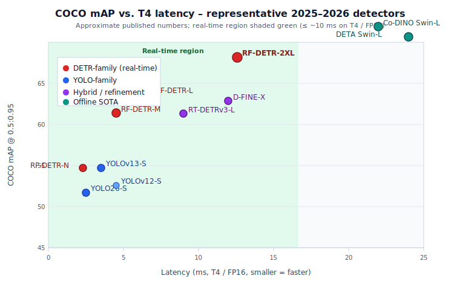
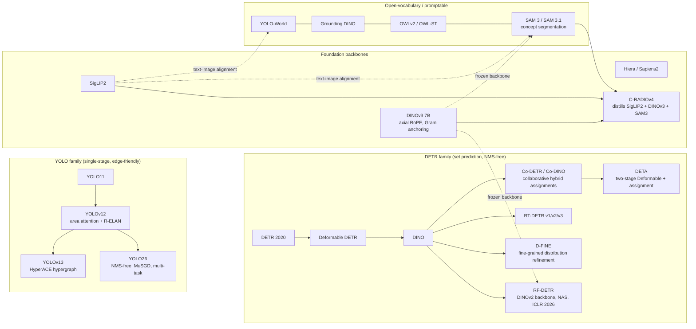
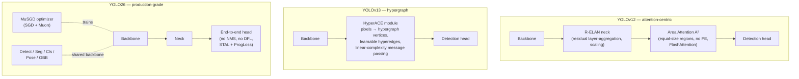
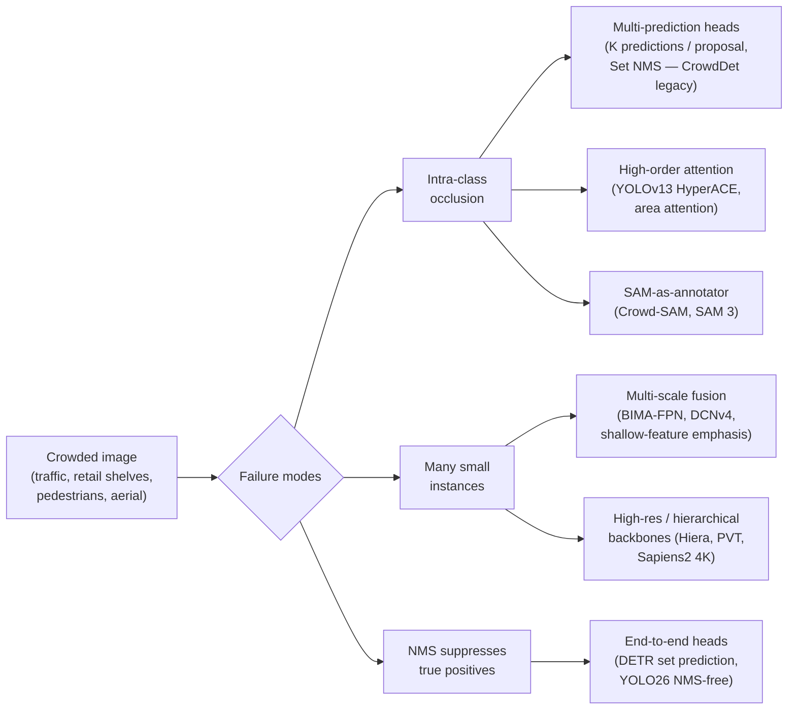
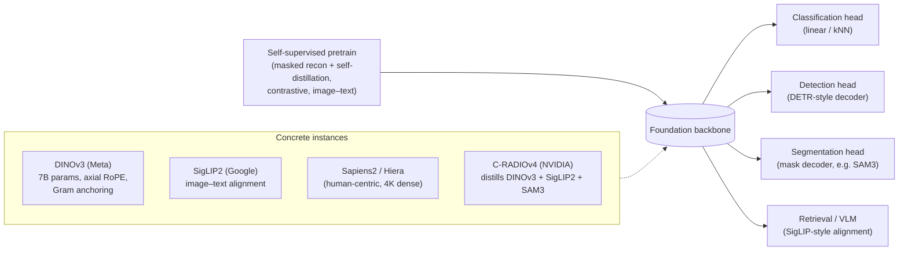
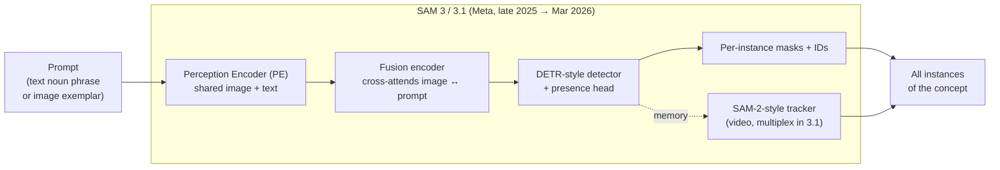

# CV Updates — Dense Object Detection & Classification

**Date (America/Los_Angeles):** 2026-Apr-30
**Scope:** Recent (late 2024 → April 2026) developments in dense object detection and image classification — models, architectures, training techniques, and foundation backbones — with a focus on what is actually shipping or has been benchmarked at scale.

---

## TL;DR

- **Real-time DETR has caught up with YOLO on COCO and pulled ahead on hard, dense data.** [RF-DETR (ICLR 2026)](https://github.com/roboflow/rf-detr) is the first real-time detector to cross **60 mAP on COCO** (RF-DETR-2XL ≈ 60.1 AP at ~12.6 ms on T4/FP16) using a **DINOv2 ViT** backbone with weight-sharing NAS.
- **YOLO is now attention-centric and NMS-free.** [YOLOv12](https://arxiv.org/abs/2502.12524) added an "area attention" (A²) block + R-ELAN, [YOLOv13](https://arxiv.org/abs/2506.17733) introduced **HyperACE** (hypergraph high-order correlation), and [YOLO26](https://arxiv.org/abs/2509.25164) (Jan 2026) drops DFL, removes NMS at inference, and ships a multi-task model family with a new **MuSGD** (SGD + Muon) optimizer.
- **Foundation backbones now do dense prediction directly.** A *frozen* [DINOv3](https://ai.meta.com/blog/dinov3-self-supervised-vision-model/) (7B, axial-RoPE ViT, "Gram anchoring") beats specialized models on detection/segmentation. [NVIDIA C-RADIOv4](https://www.marktechpost.com/2026/02/06/nvidia-ai-releases-c-radiov4-vision-backbone-unifying-siglip2-dinov3-sam3-for-classification-dense-prediction-segmentation-workloads-at-scale/) distills SigLIP2-g, DINOv3-7B, and SAM3 into one ViT encoder usable for classification, retrieval, dense prediction, and segmentation.
- **"Detection" and "segmentation" are blurring into open-vocabulary perception.** [SAM 3 / 3.1](https://ai.meta.com/blog/segment-anything-model-3/) is essentially a **DETR detector + SAM-2 tracker** sharing a Perception Encoder, doing promptable concept segmentation (text or exemplar) and reporting ~2× over prior systems on the SA-Co benchmark.
- **Dense / crowded scenes** are pushed forward by Set-NMS-style multi-prediction heads, deformable convs (DCNv4), hypergraph attention, and SAM-as-annotator pipelines (e.g. [Crowd-SAM, ECCV 2024](https://www.ecva.net/papers/eccv_2024/papers_ECCV/papers/08766.pdf)).

---

## 1. Detection landscape at a glance

The figure below positions a representative slice of the 2025–2026 detector landscape on COCO (numbers are approximate, taken from the linked papers/repos; offline SOTA models are plotted off the real-time band on the right).

### Family map

---

## 2. Real-time DETR: RF-DETR, RT-DETRv3, D-FINE

For years YOLO-class CNNs owned real-time detection. That is no longer obviously true.

### 2.1 RF-DETR (Roboflow, ICLR 2026)

[RF-DETR](https://github.com/roboflow/rf-detr) replaces LW-DETR's CAEv2 backbone with a **frozen-friendly DINOv2 ViT** and uses weight-sharing **NAS** to scale model size. Key takeaways from the paper and the [demystification write-up](https://pub.towardsai.net/demystifying-rf-detr-iclr-2026-a-real-time-transformer-pushing-the-limits-of-object-detection-f4d0a9617fdd):

- **DINOv2 backbone**: 14×14 patch tokenizer + standard transformer encoder; the lower LR + LayerNorm regime preserves DINOv2's pretraining and enables larger batch sizes — a precondition for NAS to be effective.
- **NAS over weight-sharing supernet**: lets one trained supernet be sliced into N/S/M/L/2XL variants without retraining each.
- **Reported numbers**: RF-DETR-M ≈ 54.7 AP @ 4.52 ms (T4, FP16); RF-DETR-L ≈ 56.5 AP @ 6.8 ms; **RF-DETR-2XL ≈ 60.1 AP** (first real-time COCO ≥ 60). Also first real-time model to exceed **60 mAP on RF100-VL** (the domain-adaptation benchmark).

### 2.2 RT-DETRv2 / v3

The [RT-DETR series](https://docs.ultralytics.com/models/rtdetr/) continues iterating:

- **v2** swaps `grid_sample` for a discrete sampling op and adds selective multi-scale sampling, helping multi-scale objects.
- **v3** explicitly fixes the *sparse-supervision* problem of one-to-one matching by adding a CNN auxiliary branch with **dense supervision**, plus a self-attention perturbation strategy and a shared-weight decoder branch with dense positives.

### 2.3 D-FINE: regression as iterative distribution refinement

[D-FINE (HF Transformers, 2025)](https://huggingface.co/docs/transformers/model_doc/d_fine) reframes box regression in a DETR decoder. Instead of predicting fixed coordinates, each layer **refines a probability distribution** over box edges (FDR), and a global self-distillation (GO-LSD) signal aligns intermediate refinements with the final localization. Net effect: better localization precision at no inference cost.

### 2.4 Co-DETR / Co-DINO and DETA (offline SOTA)

[Co-DETR (ICCV 2023)](https://arxiv.org/abs/2211.12860) remains the recipe behind several offline SOTA results. Its core idea: train multiple parallel auxiliary heads with **one-to-many label assignments** (ATSS, Faster R-CNN style) alongside the primary one-to-one matcher, then drop them at inference. This solves DETR's "too few positives → weak encoder features" problem.

- Co-DINO + Swin-L ≈ **60.7 AP** on COCO; with ViT-L on Object365 → COCO ≈ 66.0 AP test-dev, 67.9 AP on LVIS val.
- [DETA](https://github.com/jozhang97/DETA) (two-stage Deformable DETR + classic assignment + more queries/levels) reaches ≈ 63.5 AP on COCO test-dev with Swin-L.

These are the templates that the real-time models above are now closing in on.

---

## 3. YOLO is no longer "just a CNN"

### 3.1 YOLOv12 (Feb 2025)

[YOLOv12](https://arxiv.org/abs/2502.12524) is the first YOLO whose central feature is *attention*, not convolution. The two ideas:

- **Area Attention (A²)** — feature maps are split into equal-size regions and attention is computed over those regions, giving a near-global receptive field without the quadratic cost of full self-attention. Best variant runs **without positional embedding**.
- **R-ELAN** — a residual / scaled re-design of ELAN with a bottleneck-like aggregation that fixes the optimization issues you get when you drop attention into the older ELAN.

It uses FlashAttention to recover speed parity with prior CNN-only YOLOs.

### 3.2 YOLOv13 (Jun 2025)

[YOLOv13](https://arxiv.org/abs/2506.17733) goes one step further: pairwise attention is still pairwise. Real scenes (occluded crowds, traffic, aerial) have **multi-to-multi** relationships. **HyperACE** treats pixels in the multi-scale feature pyramid as hypergraph vertices, learns hyperedges adaptively, and uses message passing with **linear** complexity to aggregate them. YOLOv13-N achieves ≈ 1.25 ms / 1.97 ms inference on RTX 4090 / Tesla T4 with +1.5–3 mAP over YOLOv12 and YOLO11 at matched size.

### 3.3 YOLO26 (Jan 2026)

[YOLO26](https://arxiv.org/abs/2509.25164) is positioned as a "production-grade" YOLO for edge:

- **End-to-end / NMS-free** at inference (matching DETR-class behavior).
- **Drops Distribution Focal Loss (DFL)** for a hardware-friendly box parameterization — easier to quantize, fewer brittle ops across compilers/runtimes.
- **MuSGD optimizer**: hybrid of SGD + Muon (the Kimi K2 LLM optimizer), tuned for stable convergence on detection.
- **ProgLoss + Small-Target-Aware Label Assignment (STAL)** for tiny objects.
- **Multi-task family** (N/S/M/L/X) covering detection, segmentation, classification, pose, OBB, with ONNX / TensorRT / CoreML / TFLite + INT8/FP16 export.

The [Roboflow comparison post](https://blog.roboflow.com/best-object-detection-models/) is a useful side-by-side of YOLOv12, YOLOv13, YOLO26, and RF-DETR on T4 latency.

---

## 4. Dense / crowded scenes

This is where "dense object detection" stops being a benchmark game and starts being an engineering problem: occlusion, overlap, scale variance, and ambiguous boundaries between same-class instances.

### 4.1 Specific advances

- **CrowdDet legacy → modern variants.** The original [CrowdDet (CVPR 2020)](https://github.com/xg-chu/CrowdDet) idea — predict K boxes per anchor and use **Set NMS** to keep both when they come from different proposals — still shows up as a building block in 2025–2026 dense detectors.
- **DCYOLO / DFE-YOLO / SMA-YOLO.** A wave of YOLO variants targeting traffic, UAV and remote-sensing footage layer in **DCNv4 deformable convs**, dual channel-spatial attention, and FPN variants like **BIMA-FPN** that explicitly route shallow high-res features to the detection head ([Nature SR 2025/2026 papers](https://www.nature.com/articles/s41598-025-92344-7)).
- **Crowd-SAM (ECCV 2024).** Uses SAM as a smart annotator + a part-whole discrimination network, with an efficient prompt sampler, to rival fully-supervised detectors on **CrowdHuman** and **CityPersons** with only a few labeled images. Important pattern for the next year: **foundation segmenter as crowd label engine**.
- **Multi-Scale Residual Network (MSRR), Jan 2026.** A density-estimation / counting model targeting heavy occlusion and background complexity — useful pairing for detection in retail and surveillance.
- **Survey:** [A Survey of Dense Object Detection Methods, IEEE 2024](https://ieeexplore.ieee.org/iel8/6287639/10380310/10770219.pdf) is still the most comprehensive single reference for the taxonomy (anchor-free vs. anchor-based, NMS variants, label-assignment approaches in dense scenes).

---

## 5. Foundation backbones for classification *and* dense prediction

The biggest architectural shift in the last 12 months is that the same backbone now serves classification, detection, and segmentation — often **frozen**.

### 5.1 DINOv3 (Meta, 2025–2026)

[DINOv3](https://ai.meta.com/blog/dinov3-self-supervised-vision-model/) scales self-supervised ViT pretraining to **7B parameters** with two key tricks:

- **Axial RoPE** (rotary position embedding) so the same backbone handles arbitrary resolutions and aspect ratios.
- **Gram anchoring** — a regularizer that keeps dense feature maps from drifting / collapsing during very long training schedules. This is the fix that lets a single frozen backbone be SOTA on dense tasks (object detection, semantic segmentation) instead of just on linear classification.

For the first time a single **frozen** vision backbone outperforms specialized solutions on multiple dense prediction tasks. That changes the unit of work: you no longer fine-tune the backbone per task.

### 5.2 C-RADIOv4 (NVIDIA, Feb 2026)

[C-RADIOv4](https://voxel51.com/blog/c-radiov4-distilled-vision-foundation-model) **distills three teachers** — SigLIP2-g-384, DINOv3-7B, and SAM 3 — into one ViT-style encoder. Tricks:

- Stochastic multi-resolution training (covering classification crops *and* dense crops in one schedule).
- **FeatSharp** upsampling for the SigLIP2 head (compensates for SigLIP2's lower native resolution).
- C-RADIOv4-H matches DINOv3-7B on dense tasks at an order of magnitude fewer params.

### 5.3 Sapiens2 (Meta, Apr 2026)

[Sapiens2](https://www.marktechpost.com/2026/04/27/meta-ai-releases-sapiens2-a-high-resolution-human-centric-vision-model-for-pose-segmentation-normals-pointmap-and-albedo/) is a 0.4B–5B family of high-resolution transformers for **human-centric dense prediction** — pose, body-part segmentation, normals, pointmap, albedo — at 1K native resolution with hierarchical 4K variants. Trained with masked image reconstruction + self-distilled contrastive losses on ~1B human images. Reported gains over Sapiens-1: +4 mAP pose, +24.3 mIoU body-part seg, 45.6% lower normal angular error.

The pattern repeats across domains: pretrain a hierarchical / RoPE'd ViT, freeze it, hang task heads off it.

### 5.4 Pure classification: where are we?

For straight ImageNet-style classification the leaderboard is now mostly bragging rights — most production teams pick a backbone for its *downstream* behavior:

- **ConvNeXt V2** ([HF docs](https://huggingface.co/docs/transformers/model_doc/convnextv2)): modernized CNN, Atto (3.7M params, 76.7% top-1) → Huge (650M, 88.9% on public data).
- **EVA-02**: large ViT pretrained with masked image modeling; strong on dense transfer (e.g. ~59.8 mIoU semantic seg with EVA-02-L).
- **InternImage**: deformable ConvNet at scale, still competitive on segmentation/detection.
- **DINOv3 / SigLIP2 / Sapiens2** on the SSL/multimodal side.

The practical decision in 2026 is: do you need *aligned* features (use SigLIP2 / CLIP-family), *dense-clean* features (DINOv3, C-RADIOv4), or *cheap CPU* features (ConvNeXt V2 small, MobileViT-style)?

---

## 6. Open-vocabulary detection / segmentation

### 6.1 SAM 3 / 3.1

[SAM 3](https://arxiv.org/abs/2511.16719) is the headline model. Architecturally it is a **dual encoder–decoder transformer**: a DETR-style detector + a SAM-2-style tracker, both conditioned on a shared **Perception Encoder** that takes the image and a prompt (text noun phrase, image exemplar, or both).

Two design choices stand out:

1. **Presence head.** A dedicated "does this concept exist in this image?" prediction, evaluated *before* localization. This is what fixes the classic open-vocabulary failure mode — confidently boxing the wrong thing for hard negatives like "player in white" vs. "player in red".
2. **Open-vocabulary instance detection** rather than "one prompt, one mask" (SAM 1/2). SAM 3 returns *all* matching instances with unique IDs.

[SAM 3.1](https://ai.meta.com/blog/segment-anything-model-3/) (Mar 2026) adds **Object Multiplex** — a shared-memory joint multi-object tracker — which is significantly faster without sacrificing accuracy, and is the path to real-time video deployment.

Reported numbers: ~2× over prior systems on the **SA-Co** benchmark (270K unique concepts; ~50× larger than prior open-vocab benchmarks); ~75–80% of human performance on SA-Co.

### 6.2 The rest of the open-vocab stack

| Model | Strength | Trade-off |
|---|---|---|
| [YOLO-World (CVPR 2024)](https://arxiv.org/abs/2401.17270) | Real-time open-vocab via RepVL-PAN + region-text contrastive loss | Lower accuracy ceiling than DETR-class |
| [Grounding DINO](https://github.com/IDEA-Research/GroundingDINO) | Highest accuracy in this class; popular for auto-labeling | Slower, heavier |
| [OWLv2 / OWL-ST](https://arxiv.org/abs/2306.09683) | Web-scale self-training; strong zero-shot generalization | Less ergonomic API than SAM 3 |
| **SAM 3 / 3.1** | Detection + segmentation + tracking, presence head, exemplar prompts | Heavy backbone; only recently optimized for real-time |

There is now also a clean composition pattern: **VLM (Qwen3-VL / PaliGemma2) → noun phrase → SAM 3 → boxes/masks**. The [VLM survey](https://www.sciencedirect.com/science/article/pii/S1566253525006475) has good comparisons of VLMs as detection oracles.

---

## 7. What changed in training, not just architecture

A few cross-cutting techniques worth pulling out:

- **Auxiliary-head dense supervision (Co-DETR style).** Now standard. RT-DETRv3 explicitly adds a CNN auxiliary branch for dense supervision; DETA generalizes to multiple assignment heads.
- **Iterative distribution refinement (D-FINE).** Treat box edges as distributions, refine layer-by-layer, distill across layers. Free localization accuracy.
- **Set-NMS / multi-prediction heads.** Survives the move to end-to-end DETR-style models because it still helps in occluded scenes when post-processing is reintroduced (e.g. for tracking).
- **Frozen foundation backbones.** RF-DETR's design pressure (low LR, LayerNorm, large batch) is a recipe explicitly aimed at *not* destroying DINOv2 features during fine-tune.
- **NMS-free at inference.** YOLO26, RF-DETR, RT-DETRv3, and SAM 3 all converge on this; deployment graphs become simpler and quantization-friendlier.
- **Weight-sharing NAS for model-family scaling** (RF-DETR). One supernet → N/S/M/L/2XL without retraining.
- **New optimizers from LLMs leak into vision** — YOLO26's MuSGD (Muon + SGD hybrid, derived from Kimi K2's LLM training tricks) is the first prominent example.
- **SAM-as-annotator pipelines** (Crowd-SAM, SA-Co data engine for SAM 3). The training data story for dense detection is now partly generated by upstream foundation segmenters.

---

## 8. Practical guidance (April 2026)

| Use case | First thing to try |
|---|---|
| Real-time, on-device detection, stable production stack | **YOLO26-S/M** (NMS-free, easy export) |
| Real-time, want highest mAP, willing to use a ViT backbone | **RF-DETR-M / -L** |
| Crowded / occluded scenes (retail, traffic, surveillance) | **YOLOv13** (HyperACE) or **D-FINE** + Set-NMS post-process |
| Open-vocabulary detection / new categories without retraining | **SAM 3** (or YOLO-World if you need ms-level latency) |
| Human-centric dense prediction (pose, body parts, normals, etc.) | **Sapiens2** (frozen) + task heads |
| One backbone for classification + dense + retrieval | **DINOv3** or **C-RADIOv4** frozen |
| Very small dataset, need labels | **Crowd-SAM / SAM 3 as auto-annotator** → fine-tune RF-DETR or YOLO26 |
| Highest possible offline COCO accuracy | **Co-DINO Swin-L** or **DETA Swin-L** |

---

## Sources

### Detection — DETR family
- [RF-DETR (Roboflow, ICLR 2026) — repo](https://github.com/roboflow/rf-detr)
- [Demystifying RF-DETR (Towards AI, Mar 2026)](https://pub.towardsai.net/demystifying-rf-detr-iclr-2026-a-real-time-transformer-pushing-the-limits-of-object-detection-f4d0a9617fdd)
- [RF-DETR ICLR 2026 paper PDF](https://arxiv.org/pdf/2511.09554)
- [Co-DETR — DETRs with Collaborative Hybrid Assignments Training (ICCV 2023)](https://arxiv.org/abs/2211.12860)
- [DETA — Detection Transformers with Assignment](https://github.com/jozhang97/DETA)
- [D-FINE — Fine-grained Distribution Refinement (HF Transformers docs)](https://huggingface.co/docs/transformers/model_doc/d_fine)
- [D-FINE arXiv](https://arxiv.org/html/2410.13842v1)
- [Object Detection with Transformers: A Review (PMC, 2025)](https://pmc.ncbi.nlm.nih.gov/articles/PMC12526829/)
- [DETR review — Basic to Advanced (PMC)](https://pmc.ncbi.nlm.nih.gov/articles/PMC12252279/)

### Detection — YOLO family
- [YOLOv12 — Attention-Centric Real-Time Object Detectors (arXiv)](https://arxiv.org/html/2502.12524v1)
- [YOLOv12 review — attention-based vs previous versions](https://arxiv.org/html/2504.11995v1)
- [YOLO12 — Ultralytics docs](https://docs.ultralytics.com/models/yolo12/)
- [YOLOv13 — Hypergraph-Enhanced Adaptive Visual Perception (arXiv)](https://arxiv.org/abs/2506.17733)
- [YOLOv13 — repo](https://github.com/iMoonLab/yolov13)
- [YOLO26 — Architectural Enhancements (arXiv)](https://arxiv.org/abs/2509.25164)
- [YOLO26 — Ultralytics docs](https://docs.ultralytics.com/models/yolo26/)
- [Best Object Detection Models 2026 (Roboflow blog)](https://blog.roboflow.com/best-object-detection-models/)
- [Best Object Detection Models 2026 (Ultralytics blog)](https://www.ultralytics.com/blog/the-best-object-detection-models-of-2025)
- [Ultralytics YOLO Evolution overview (arXiv)](https://arxiv.org/pdf/2510.09653)

### Dense / crowded scenes
- [A Survey of Dense Object Detection Methods (IEEE, 2024)](https://ieeexplore.ieee.org/iel8/6287639/10380310/10770219.pdf)
- [CrowdDet — Detection in Crowded Scenes: One Proposal, Multiple Predictions (CVPR 2020)](https://github.com/xg-chu/CrowdDet)
- [Crowd-SAM — SAM as a Smart Annotator (ECCV 2024)](https://www.ecva.net/papers/eccv_2024/papers_ECCV/papers/08766.pdf)
- [Comprehensive survey of crowd density estimation and counting (IET, 2025)](https://ietresearch.onlinelibrary.wiley.com/doi/10.1049/ipr2.13328)
- [DCYOLO — dense object detection in congested urban streets (Sci. Rep.)](https://www.nature.com/articles/s41598-024-51868-0)
- [DFE-YOLO — Multi-Scale-Enhanced Detection for Traffic Monitoring (MDPI)](https://www.mdpi.com/2079-9292/14/11/2108)
- [SMA-YOLO — multi-scale small-object detection (Sci. Rep.)](https://www.nature.com/articles/s41598-025-92344-7)
- [MFR-YOLO — multi-scale feature refinement (Sci. Rep.)](https://www.nature.com/articles/s41598-026-45641-8)
- [Survey of small object detection in aerial images (AIR)](https://link.springer.com/article/10.1007/s10462-025-11150-9)

### Foundation backbones / classification
- [DINOv3 — Meta blog](https://ai.meta.com/blog/dinov3-self-supervised-vision-model/)
- [DINOv3 — paper](https://arxiv.org/html/2508.10104v1)
- [C-RADIOv4 — NVIDIA / MarkTechPost coverage](https://www.marktechpost.com/2026/02/06/nvidia-ai-releases-c-radiov4-vision-backbone-unifying-siglip2-dinov3-sam3-for-classification-dense-prediction-segmentation-workloads-at-scale/)
- [C-RADIOv4 — Voxel51 deep dive](https://voxel51.com/blog/c-radiov4-distilled-vision-foundation-model)
- [Sapiens2 — paper](https://arxiv.org/html/2604.21681)
- [Sapiens2 — MarkTechPost coverage](https://www.marktechpost.com/2026/04/27/meta-ai-releases-sapiens2-a-high-resolution-human-centric-vision-model-for-pose-segmentation-normals-pointmap-and-albedo/)
- [Hiera — repo](https://github.com/facebookresearch/hiera)
- [Pyramid Vision Transformer (PVT)](https://arxiv.org/abs/2102.12122)
- [ConvNeXt V2 — HF docs](https://huggingface.co/docs/transformers/model_doc/convnextv2)
- [EVA-02 — paper](https://arxiv.org/pdf/2303.11331)
- [Image Classification SOTA 2025 (HiringNet)](https://hiringnet.com/image-classification-state-of-the-art-models-in-2025)
- [Image Classification Models — 2026 picks (Label Your Data)](https://labelyourdata.com/articles/image-classification-models)

### Open-vocabulary / promptable
- [SAM 3 — Segment Anything with Concepts (arXiv)](https://arxiv.org/abs/2511.16719)
- [SAM 3 — Meta page](https://ai.meta.com/sam3/)
- [SAM 3.1 — Meta blog](https://ai.meta.com/blog/segment-anything-model-3/)
- [SAM 3 — Ultralytics docs](https://docs.ultralytics.com/models/sam-3/)
- [SAM 3 — Roboflow explainer](https://blog.roboflow.com/what-is-sam3/)
- [YOLO-World — Real-Time Open-Vocabulary Detection (arXiv)](https://arxiv.org/abs/2401.17270)
- [Grounding DINO on video (PyImageSearch, Dec 2025)](https://pyimagesearch.com/2025/12/08/grounding-dino-open-vocabulary-object-detection-on-videos/)
- [Awesome-Open-Vocabulary-Object-Detection (curated list)](https://github.com/witnessai/Awesome-Open-Vocabulary-Object-Detection)
- [Object detection with multimodal LVLMs — review (Information Fusion 2025)](https://www.sciencedirect.com/science/article/pii/S1566253525006475)
- [Qwen3-VL repo](https://github.com/QwenLM/Qwen3-VL)
- [Multimodal AI — Open-Source VLMs in 2026 (BentoML)](https://www.bentoml.com/blog/multimodal-ai-a-guide-to-open-source-vision-language-models)
