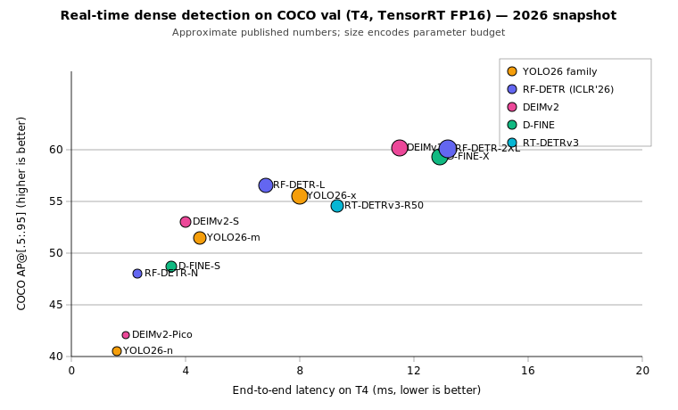
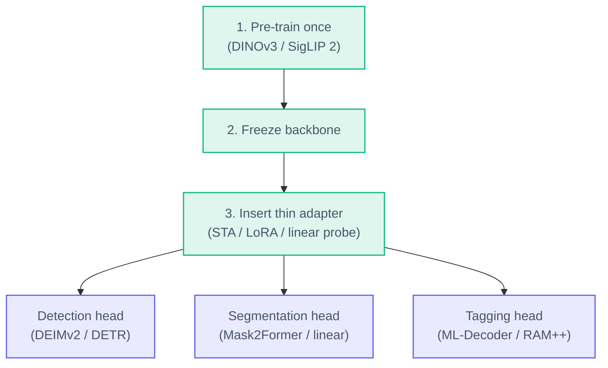
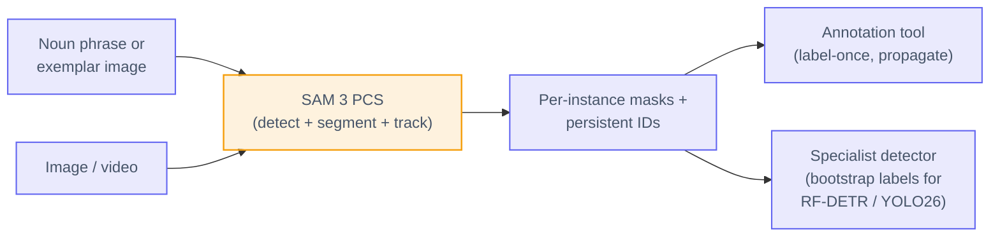
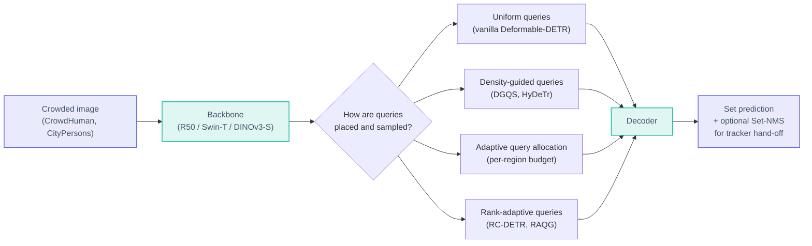
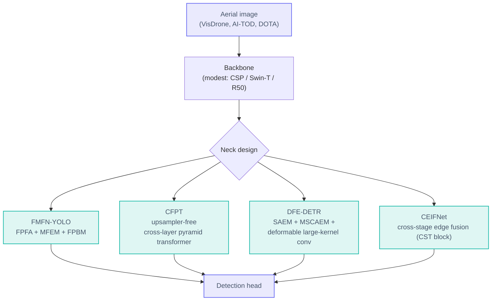
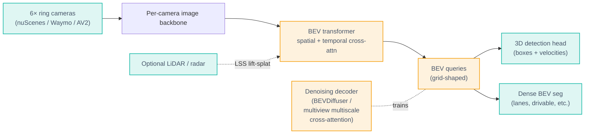
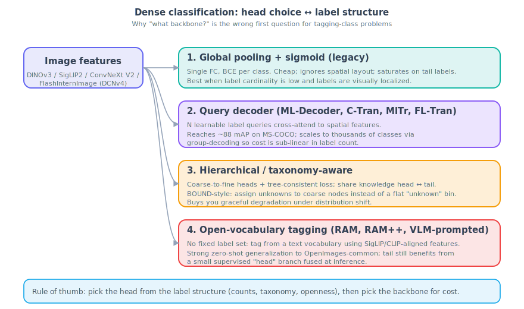
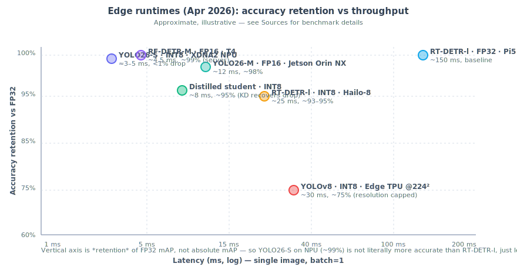
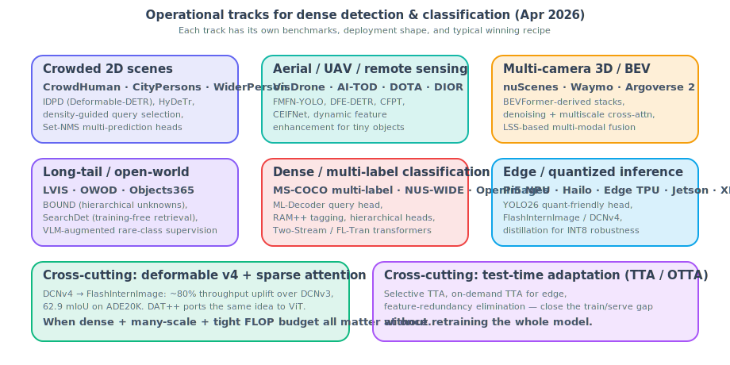

# CV Updates — Recent Advances in Dense Object Detection & Classification

**Date (America/Los_Angeles):** 2026-Apr-30
**Scope:** Consolidated review of the dense detection & classification landscape as of April 2026 — headline real-time architectures, foundation backbones, promptable / open-vocab models, the specialized operational tracks (crowds, aerial, BEV, long-tail), the dense classification head families, edge / quantization, and cross-cutting techniques (DCNv4, TTA).

---

## TL;DR

- **The headline real-time race has crossed 60 AP.** [RF-DETR-2XL (ICLR 2026)](https://github.com/roboflow/rf-detr) reaches **60.1 COCO AP at 12.6 ms** on T4/FP16 — the first real-time detector over 60 — while [DEIMv2 (Sep 2025, Apr 2026 release)](https://arxiv.org/abs/2509.20787) plugs **DINOv3** into a DEIM-style stack and gets **57.8 AP with only 50.3 M params**.
- **Foundation backbones won the dense-features fight.** A frozen [DINOv3](https://ai.meta.com/blog/dinov3-self-supervised-vision-model/) (7 B ViT, 1.7 B images, no labels) beats specialized solutions on detection, depth, and segmentation; [SigLIP 2](https://arxiv.org/abs/2502.14786) does the same for classification + localization with multilingual text alignment.
- **Promptable / open-vocab is now the default for "I don't have annotated data yet."** [SAM 3 (ICLR 2026)](https://arxiv.org/abs/2511.16719) introduces **Promptable Concept Segmentation** (noun-phrase + image exemplar), with a **2× gain over prior systems**, and SAM 3.1 Object Multiplex (Mar 27 2026) adds shared-memory multi-object tracking.
- **YOLO26 is the edge story.** [Ultralytics YOLO26 (arXiv 2509.25164)](https://arxiv.org/abs/2509.25164) drops Distribution Focal Loss, removes NMS, and is explicitly designed for INT8 — it now ships **OpenVINO + TensorRT INT8** with consistent accuracy and on Jetson NX delivers ~1.8× the throughput of YOLOv10-N.
- **Specialized tracks have their own SOTA.** Crowded scenes (RC-DETR, query-adaptive DETR), aerial small-object (FMFN-YOLO, CFPT, DFE-DETR), 3D/BEV (BEVDiffuser denoising, DMformer fusion), and long-tail / open-world (BOUND hierarchical unknowns, SearchDet retrieval) are all separate active surfaces — a generic RF-DETR-M is rarely the right answer for any one of them.
- **Dense classification = head choice, not backbone choice.** Query decoders ([ML-Decoder](https://arxiv.org/abs/2111.12933), [Query2Label](https://arxiv.org/abs/2107.10834), [C-Tran](https://arxiv.org/abs/2011.14027)) reach ~88 mAP on MS-COCO multi-label; hierarchical / taxonomy-aware heads ([BOUND](https://arxiv.org/abs/2510.09173)) give graceful degradation on tail and unknown labels; [RAM++](https://arxiv.org/abs/2310.15200) anchors open-vocab tagging.
- **DCNv4 / FlashInternImage** is the default sparse operator for heavy dense prediction (~80 % throughput uplift over DCNv3, 62.9 mIoU on ADE20K).
- **Test-time adaptation has matured for detection.** [VLOD-TTA](https://openreview.net/forum?id=7W4Gusa9rY), [AMROD](https://arxiv.org/html/2406.16439v5), and [sensitivity-guided pruning TTA](https://arxiv.org/abs/2506.02462) close the train/serve gap without retraining.

---

## 1. The headline detector race (real-time, COCO)



### 1.1 RF-DETR (Roboflow, ICLR 2026)

[RF-DETR](https://github.com/roboflow/rf-detr) is a [DETR](https://arxiv.org/abs/2005.12872)-class real-time detector built on a **DINOv2** backbone, with multi-resolution training and segmentation-ready masks. Numbers ([Roboflow blog](https://blog.roboflow.com/best-object-detection-models/), [demystification](https://pub.towardsai.net/demystifying-rf-detr-iclr-2026-a-real-time-transformer-pushing-the-limits-of-object-detection-f4d0a9617fdd)):

| Variant | COCO AP | T4/FP16 latency |
|---|---|---|
| RF-DETR-N | 48.0 | 2.3 ms |
| RF-DETR-M | 54.7 | 4.5 ms |
| RF-DETR-L | 56.5 | 6.8 ms |
| RF-DETR-2XL | **60.1** | 12.6 ms |

Why it generalizes: pretrained DINOv2 features transfer well off-COCO (the [face-detection comparison](https://journal-isi.org/index.php/isi/article/view/1561) confirms that pattern). RF-DETR is the current default when fine-tuning quality matters more than nano-class FLOPs.

### 1.2 DEIMv2 — DINOv3 + DEIM, Apr 2026

[DEIMv2](https://github.com/Intellindust-AI-Lab/DEIMv2) ([arXiv 2509.20787](https://arxiv.org/abs/2509.20787), [release writeup](https://www.blog.brightcoding.dev/2026/04/22/deimv2-the-revolutionary-real-time-detector-powered-by-dinov3)) is the first detector to ship DINOv3 features productively. The key trick is the **Spatial Tuning Adapter (STA)**: DINOv3's ViT outputs single-scale features at ~1/16 resolution, which is wrong for detection — STA pulls features from intermediate ViT blocks (5/8/11) and turns them into a multi-scale pyramid.


Reported headline: **DEIMv2-X = 57.8 AP / 50.3 M params**, beating earlier 60 M-parameter X-scale models that capped at 56.5 AP. **DEIMv2-S = 50.9 AP at 9.71 M params**, the first sub-10 M model over 50 AP on COCO. Smaller variants (Nano / Pico / Femto / Atto) drop the ViT and use HGNetv2 with depth/width pruning for strict edge budgets.

DEIMv2 demonstrates the broader pattern: **a strong frozen / lightly-tuned foundation backbone + a thin task-specific adapter beats a full task-specific encoder** for most dense prediction.

### 1.3 YOLO26 — the edge default

[YOLO26 (Ultralytics)](https://blog.roboflow.com/yolo26/) ([arXiv 2509.25164](https://arxiv.org/abs/2509.25164)) is the line of work optimized for *deployment*, not COCO mAP-per-FLOP. Architectural changes vs. YOLO11/v12:

- Removed Distribution Focal Loss (a known PTQ pain-point) for a quantizer-friendly head.
- Removed NMS (end-to-end matching instead) — better latency variance and easier deployment.
- Cleaner head, fewer ops on the critical INT8 path.

Operational reality: [INT8 throughput is ~1.8× of YOLOv10-N nano](https://arxiv.org/html/2510.09653v1), Jetson Xavier NX & Orin keep near-FP32 mAP, and OpenVINO INT8 is the standard CPU/laptop story (see [hands-on tutorial](https://medium.com/@GaloisChu/openvino-int8-quantization-for-yolo26-models-a-hands-on-tutorial-6ad16f3fc60d)).

### 1.4 D-FINE & DEIM (refinement-style real-time)

[D-FINE](https://arxiv.org/abs/2410.13842) refines DETR's box regression as a fine-grained distribution. Combined with [DEIM](https://github.com/ShihuaHuang95/DEIM) (matchability-aware loss + denoising), DEIM-D-FINE-X reaches **56.5 AP at 78 FPS** on T4 — competitive with RF-DETR-L at the same band.

### 1.5 The offline ceiling

For non-real-time work, **Co-DINO Swin-L** still sits around **64.0 AP** on COCO test-dev, and **DETA Swin-L** ~63.5 AP — useful as teachers for distillation into RF-DETR / YOLO26 students.

---

## 2. Foundation backbones for dense prediction

### 2.1 DINOv3 — Meta's 7 B self-supervised ViT

[DINOv3](https://github.com/facebookresearch/dinov3) ([Meta blog](https://ai.meta.com/blog/dinov3-self-supervised-vision-model/), [Encord explainer](https://encord.com/blog/dinov3-explained-scaling-self-supervised-vision-tr/)) trains a 7 B-parameter ViT on 1.7 B images with no labels — the first single frozen vision backbone to **outperform specialized solutions** on detection, depth, and segmentation simultaneously. The dense features are both semantically strong and well-localized, which is what lets DEIMv2 work without retraining the encoder.

The practical pattern that has emerged in 2026:



### 2.2 SigLIP 2 — multilingual VL encoder with dense features

[SigLIP 2 (arXiv 2502.14786)](https://arxiv.org/abs/2502.14786) ([HF blog](https://huggingface.co/blog/siglip2)) extends the SigLIP recipe with captioning pretraining, self-distillation, and masked prediction. Two variants:

- **FixRes** — backward-compatible fixed resolutions.
- **NaFlex** — native aspect ratio with variable sequence length (the right choice for non-square dense tasks).

Crucially, SigLIP 2 ships meaningful gains on **localization and dense prediction** (semantic seg, depth, surface normals) — not just zero-shot classification. It's the open-vocab backbone of choice for tagging and retrieval pipelines that also need spatial structure.

### 2.3 ConvNeXt V2, FlashInternImage — convolutional alternatives

For workloads where ViT overhead is a problem (very high resolution, low-end NPUs), [FlashInternImage with DCNv4](https://github.com/OpenGVLab/DCNv4) is the leading CNN-side encoder — see §6.

---

## 3. Promptable / open-vocabulary detection

### 3.1 SAM 3 — Promptable Concept Segmentation

[SAM 3 (arXiv 2511.16719)](https://arxiv.org/abs/2511.16719) ([repo](https://github.com/facebookresearch/sam3), [Meta page](https://ai.meta.com/research/publications/sam-3-segment-anything-with-concepts/)) reframes the segmentation API around **concepts**, not just points/boxes:

- **Prompt = noun phrase ("yellow school bus") + optional image exemplar(s).**
- **Output = every instance of that concept** detected, segmented, and tracked.
- **Reuses SAM 2's transformer encoder/decoder tracker** for video, glued to a new detector that propagates instance identities across frames.

Reported gain: **2× over prior systems** on Promptable Concept Segmentation, while preserving SAM 2's interactive segmentation ability. [SAM 3.1 Object Multiplex (Mar 27 2026)](https://docs.ultralytics.com/models/sam-3/) added a shared-memory tracker for joint multi-object tracking — significantly faster without accuracy loss.

The deployment pattern most teams actually use:



The "SAM 3 as a label-bootstrapper" pattern — generate labels once on a small set, train a specialist — is the highest-ROI use of SAM 3 in 2026 production, because per-image SAM 3 inference is still expensive vs. a finetuned YOLO26.

### 3.2 Grounding DINO 1.5 / Grounded SAM 2

[Grounding DINO](https://github.com/IDEA-Research/GroundingDINO) ([arXiv 2303.05499](https://arxiv.org/abs/2303.05499)) is the open-set, language-conditioned detector that built much of this pipeline. Its 1.5 release is IDEA Research's most capable open-world OD model, and pairs with SAM 2 in [Grounded SAM 2](https://pyimagesearch.com/2026/01/19/grounded-sam-2-from-open-set-detection-to-segmentation-and-tracking/) for an open-set → segment → track pipeline. The architectural ideas (feature-enhancer with cross-modal deformable attention, language-guided query selection) are now standard in the open-vocab subspace.

---

## 4. Crowded scenes — query strategy is the lever

Crowd detection is the canonical "dense" task: many same-class instances, heavy occlusion. The 2025–2026 progress here is almost entirely about **how DETR-class models query the image**, not about backbones.



What's worth knowing:

- [RC-DETR (Neural Networks 2024)](https://www.sciencedirect.com/science/article/abs/pii/S0893608024008402) — rank-based contrastive learning + Rank-Adaptive Query Generation. Key insight: hard-positive samples in dense crowds are *rank-adjacent*, not just similar in feature space.
- [Query-adaptive DETR for crowded pedestrian detection (OpenReview)](https://openreview.net/forum?id=hfeuTey6Z5) — the number of queries is dataset-dependent in vanilla Deformable-DETR; this work makes it adaptive per image.
- [IDPD (Springer 2024)](https://link.springer.com/article/10.1007/s11760-023-02896-2) — dynamic neck (omni-dimensional dynamic conv) + hybrid decoding loss. ~93.22 % AP on CrowdHuman with R50.
- [Adaptive query allocation for dense object detection (Elsevier 2025)](https://www.sciencedirect.com/science/article/pii/S2590123025036163) — per-region query budget; right fix for retail-shelf and traffic-camera deployments.
- [LF-DETR (MDPI Remote Sensing 2026)](https://www.mdpi.com/2072-4292/18/3/531) — Laplacian-of-Gaussian feature enhancement + learnable frequency-domain fusion for aerial RGB-IR pedestrian detection.

Cross-cutting lesson: for dense same-class detection, the operator that pays off is *sparse, density-aware attention* on a moderate backbone. A 7 B ViT is a worse ROI than fixing the queries.

---

## 5. Aerial / UAV / remote sensing — the neck does the work

Small objects in aerial images break two assumptions: (a) feature pyramids dilute high-frequency cues at lower levels, (b) standard FPN upsampling is information-destructive when most objects are <32 px. The 2025–2026 work concentrates on the **neck**.



| Model | Benchmark | mAP | Why it works |
|---|---|---|---|
| [FMFN-YOLO](https://link.springer.com/article/10.1007/s40747-025-02126-x) | VisDrone 2019 | 44.5 mAP50 | Three plug-and-play modules: fine-grained preservation aggregation (FPFA), multi-scale enhancement (MFEM), pyramid balancing (FPBM) |
| FMFN-YOLO | AI-TOD | 43.6 mAP50 | Same recipe; matters more on tinier instances |
| [CFPT (TGRS 2025)](https://github.com/duzw9311/CFPT) | TinyPerson / VisDrone | +1.5–2.5 vs. FPN | No upsampling — cross-layer attention does the fusion |
| [DFE-DETR (Sci. Reports 2025)](https://www.nature.com/articles/s41598-025-21134-y) | DIOR / RSOD | +2–3 mAP vs. RT-DETR | SAEM + DLKCM specialized for remote-sensing scale |
| [CEIFNet (Sci. Reports 2026)](https://www.nature.com/articles/s41598-026-36251-5) | DOTA / VisDrone | competitive at <50 % params | CNN-Transformer hybrid (CST block) |
| [LMW-YOLO (Sci. Reports 2026)](https://www.nature.com/articles/s41598-026-45055-6) | RS small object | lightweight | Pruning + multi-feature aggregation |

Pattern: **none of these change the backbone.** They change the neck (sometimes the queries). Off-the-shelf pretrained encoders (DINOv3 frozen, ConvNeXt V2) drop in cleanly. See also the [transformers-in-small-object-detection survey (ACM CSUR 2025)](https://dl.acm.org/doi/10.1145/3758090) and [advancements 2023–2025 (MDPI)](https://www.mdpi.com/2076-3417/15/22/11882).

---

## 6. Multi-camera 3D / BEV detection (autonomy)

For multi-camera 3D object detection, the active line is BEVFormer-derived plus denoising:



Concrete numbers worth remembering:

| Method | Reported result | Idea |
|---|---|---|
| [BEVDiffuser (arXiv 2502.19694)](https://arxiv.org/html/2502.19694) | **+12.3 mAP / +10.1 NDS** on nuScenes | Diffusion model denoises BEV feature maps with GT-layout guidance, plug-and-play at training time |
| [DMformer (Springer 2025)](https://link.springer.com/article/10.1007/s40747-025-01984-9) | **73.6 NDS** on nuScenes | Diffusion-based image denoising + multi-modal fusion in one decoder |
| [Denoising Transformer for BEV (IEEE 2025)](https://ieeexplore.ieee.org/document/11001128/) | stable training, AP bump | DN-DETR-style query denoising on multiview multiscale cross-attn |
| [Multi-Modal BEV Enhancement Fusion (IEEE 2025)](https://ieeexplore.ieee.org/abstract/document/11087721/) | better night/rain regimes | LSS camera lift fused with LiDAR via explicit gating |
| [OCBEV (IEEE 2024)](https://ieeexplore.ieee.org/document/10550502/) | better moving-target tracking | Object-centric BEV queries vs. global grid |

For survey context: [Vision Transformers in Autonomous Driving (arXiv 2403.07542)](https://arxiv.org/html/2403.07542v1) and the [3-D object detection comprehensive review (Springer 2025)](https://link.springer.com/article/10.1007/s44443-025-00213-0).

---

## 7. Long-tail and open-world

### 7.1 BOUND — hierarchical unknowns

[BOUND (arXiv 2510.09173, updated Mar 2026)](https://arxiv.org/abs/2510.09173) is the cleanest single advance in open-world OD in the last six months. The classic OWOD framing has a single "unknown" bin; BOUND replaces that with the existing label *taxonomy*:


Reported wins: higher unknown recall on standard OWOD benchmarks **without** sacrificing known-class mAP, plus structured generalization on long-tail LVIS. Why it matters operationally: a planner that can act on "this is some kind of animal" makes safer decisions than one that gets a flat "unknown — confidence 0.7."

### 7.2 SearchDet, YOLO-UniOW, OW-OVD

- [SearchDet (IEEE 2026)](https://ieeexplore.ieee.org/document/11094398/) — training-free long-tail OD by retrieving web-image exemplars at inference time and using them as visual prompts for an open-vocab detector. Useful when you can't fine-tune (regulated deployments) or when classes appear at runtime.
- [YOLO-UniOW (arXiv 2412.20645)](https://arxiv.org/html/2412.20645v1) — Adaptive Decision Learning + Wildcard Learning. Detects OOD objects as "unknown" with dynamic vocab expansion, no incremental learning. **+11 U-Recall** vs. prior art across PASCAL VOC, COCO2017, LVISv1.0, Objects365.
- [OW-OVD (ResearchGate 2025)](https://www.researchgate.net/publication/394512316_OW-OVD_Unified_Open_World_and_Open_Vocabulary_Object_Detection) — unifies open-world and open-vocab detection in one model.

### 7.3 The 2026 pragmatic stack for long-tail

```
VLM (Qwen3-VL / PaliGemma2)                 ← noun-phrase generation
   ↓
Open-vocab detector (SAM 3 / Grounding DINO 1.5) ← initial localization
   ↓
SearchDet retrieval                          ← rare-class augmentation
   ↓
BOUND-style hierarchical head                ← graceful unknowns
   ↓
Specialist (RF-DETR / YOLO26)                ← only on the closed set
```

Most teams do not need a single model that does all of this; they need this *pipeline* with cheap glue.

---

## 8. Dense classification (multi-label, hierarchical, tagging)

"Classification" in 2026 is rarely "one image → one of 1,000 ImageNet classes" — it's multi-label tagging, hierarchical taxonomies, and open-vocab tag prediction.



### 8.1 Heads, not backbones, are the decision

| Head family | Representative models | Strength | Weakness |
|---|---|---|---|
| Global pool + sigmoid | Plain ResNet/ViT + BCE | Cheap; works for ≤20 well-localized labels | Drowns the tail; ignores spatial structure |
| Query decoder | [ML-Decoder](https://arxiv.org/abs/2111.12933) ([repo](https://github.com/Alibaba-MIIL/ML_Decoder)), [Query2Label](https://arxiv.org/abs/2107.10834), [C-Tran](https://arxiv.org/abs/2011.14027), [MlTr (arXiv 2106.06195)](https://arxiv.org/abs/2106.06195), [TSFormer (ACM MM 2022)](https://dl.acm.org/doi/abs/10.1145/3503161.3548343), [FL-Tran](https://www.sciencedirect.com/science/article/abs/pii/S0031320322006823), [GATN (ACM TOMM 2023)](https://dl.acm.org/doi/10.1145/3578518) | ~88+ mAP on MS-COCO multi-label; sub-linear cost in label count via group decoding | Needs tuning of label-embedding init |
| Hierarchical / taxonomy-aware | BOUND-style heads, [HCL-MTC (Sci. Reports 2025)](https://www.nature.com/articles/s41598-025-97597-w), [Wehrmann HMCN](https://proceedings.mlr.press/v80/wehrmann18a/wehrmann18a.pdf), [Hyp-OW](https://arxiv.org/abs/2306.14291) | Graceful degradation on tail and unknowns; aligns with downstream business taxonomies | Requires a clean taxonomy |
| Open-vocabulary tagging | [RAM](https://arxiv.org/abs/2306.03514) / [RAM++](https://arxiv.org/abs/2310.15200), SigLIP2-tagging, VLM-prompted | Zero-shot generalization to unseen tags; great for cold start | Lower precision on closed sets without a supervised head fused in |

### 8.2 Why the head dominates

For thousands of labels the cost is on the *label side*, not the visual side:

- **ML-Decoder** uses learned label *queries* and group-decoding so cost scales sub-linearly in label count. Fitting OpenImages-V6's 9.6 K classes used to be a memory exercise; with ML-Decoder it's routine.
- **Query2Label** generalizes the same idea: each label is a query, decoders cross-attend to spatial features. Gives both better mAP and natural per-label attention maps for interpretability.
- **C-Tran / MlTr** add **label-label dependency modeling** — captures the fact that "wedding" and "bride" co-occur, and "polar bear" and "beach" almost never do.
- **Hierarchical heads** (HCL-MTC, HMCN, BOUND) share gradients between head and tail labels: rare *Hummingbird* species inherit from common *Bird* features.

### 8.3 RAM++ — open-vocab tagging with semantic concepts

[RAM++ (arXiv 2310.15200)](https://arxiv.org/abs/2310.15200) is currently the strongest open-set image tagger. The trick: **inject LLM-generated tag descriptions as additional supervision** alongside image-tag pairs and global text. Reported gains:

- **+10.2 mAP / +15.4 mAP** over CLIP on OpenImages and ImageNet for predefined tags.
- **+5.0 mAP / +6.4 mAP** over CLIP and RAM on OpenImages for open-set categories.

Production pattern that wins in 2026: **fuse a small supervised ML-Decoder head for your closed product taxonomy with a RAM++ open-vocab head** for catch-all coverage. Cold-start and long-tail both get handled without retraining.

---

## 9. Edge & quantization



### 9.1 Concrete benchmarks

- **YOLO26 INT8** ([arXiv 2509.25164](https://arxiv.org/abs/2509.25164)) is the headline edge story: simplified head, no DFL, no NMS — explicit design for INT8 stability. ~1.8× throughput vs. YOLOv10-N nano on Jetson Xavier NX, near-FP32 mAP. Ships TFLite, CoreML, TensorRT, OpenVINO ([NeuralNet guide](https://neuralnet.solutions/yolo26-on-edge-devices-a-complete-guide), [LearnOpenCV](https://learnopencv.com/yolov26-real-time-deployment/)).
- **Hailo-8 / Hailo-15 NPU** preserves ~93–95 % of FP32 mAP on RT-DETR-l at INT8 — best DETR-class throughput on edge silicon today.
- **Edge TPU** forces 224×224 input + INT8-only and pays a meaningful accuracy cost; really only viable with a distilled student model.
- **AMD XDNA2 NPU** (laptop class) reaches ≈3–5 ms inference with <1 % accuracy loss — the first widely-available laptop NPU competitive with discrete edge accelerators.
- **CPU-only** is now mainly an FP32 reference. RT-DETR-l on Pi5 CPU is ~150 ms — used to bound the quality envelope, not as a real deployment target.

### 9.2 Knowledge distillation as the universal lever

Distilling Co-DINO / RF-DETR-2XL teachers into small students that survive INT8 is the most reliable accuracy-recovery technique: KD recovers most of the FP32 mAP after INT8, with 3–4× compression. See [SDD-YOLO (anti-UAV small-target)](https://arxiv.org/html/2603.25218) and the broader [lightweight transformer architectures for edge collection](https://arxiv.org/pdf/2601.03290) for worked examples.

### 9.3 Selection rule of thumb

| Constraint | Pick |
|---|---|
| ≤5 ms, NPU-class hardware | YOLO26-S/N INT8 |
| 5–15 ms, Jetson-class | YOLO26-M FP16 / RF-DETR-N or DEIMv2-S FP16 |
| Edge TPU only | Distilled YOLO26 student @224 (and pay the accuracy cost) |
| Hailo-8 / Hailo-15 | RT-DETR-S/M INT8 |
| Server GPU, latency >20 ms acceptable | RF-DETR-2XL / D-FINE / Co-DINO |
| Heavy resolution dense seg/det | FlashInternImage (DCNv4) backbone + DEIM-style decoder |

---

## 10. Cross-cutting techniques

### 10.1 DCNv4 → FlashInternImage

[DCNv4 (CVPR 2024)](https://github.com/OpenGVLab/DCNv4) ([arXiv 2401.06197](https://arxiv.org/abs/2401.06197)) drops softmax normalization in spatial aggregation and fixes the memory-access pattern that bottlenecked DCNv3. Plugged into InternImage to make **FlashInternImage**:

- **~80 % throughput uplift** over DCNv3 baseline.
- **62.9 mIoU on ADE20K** (semantic segmentation).
- Same operator now used in classification, segmentation, and image generation.

For dense-prediction stacks where you need a strong CNN-side encoder (very high resolution, heavy occlusion), FlashInternImage is the current default sparse operator. [DAT++](https://github.com/LeapLabTHU/DAT) carries the same idea over to ViT-style encoders.

### 10.2 Test-time adaptation (TTA / OTTA / CTTA)

When your model encounters a new domain (lighting, sensor, geography) at deployment, you can either retrain (expensive) or adapt at inference. The 2025–2026 TTA literature (see [awesome-test-time-adaptation](https://github.com/tim-learn/awesome-test-time-adaptation) and the [ICCV/IJCV survey](https://link.springer.com/article/10.1007/s11263-024-02213-5)) has converged on:

- **VLOD-TTA** ([OpenReview](https://openreview.net/forum?id=7W4Gusa9rY)) — IoU-weighted entropy + image-conditioned prompt selection for vision-language detectors.
- **AMROD** ([arXiv 2406.16439](https://arxiv.org/abs/2406.16439)) — object-level contrastive learning + adaptive monitoring (skips unnecessary adaptation) + adaptive randomized restoration. Continual TTA tuned for detection.
- **Sensitivity-guided pruning TTA** ([arXiv 2506.02462](https://arxiv.org/abs/2506.02462)) — quantifies channels by domain-discrepancy sensitivity, prunes the rest, makes online TTA tractable on edge.
- **Domain-invariant training + continual TTA** ([IJCV 2025](https://link.springer.com/article/10.1007/s11263-025-02465-9)) — robustness-by-construction at training, plus adaptation at serve time.

For object detection specifically, the cheapest practical knob is still *batch-norm statistic re-estimation* on a small streaming buffer — most of the benefit at near-zero cost. Useful primer: [understanding TTA (arXiv 2402.06892)](https://arxiv.org/html/2402.06892v1).

---

## 11. Operational tracks at a glance



---

## 12. Selection guide (Apr 2026)

| Problem | First thing to try |
|---|---|
| General real-time COCO-class detection on T4/Jetson | **RF-DETR-M/L** or **DEIMv2-S/M** (DINOv3-backed) |
| Highest possible real-time AP | **RF-DETR-2XL** (60.1 AP @ 12.6 ms) |
| Edge-first deployment (CPU / NPU / mobile) | **YOLO26-S INT8** |
| Bootstrapping labels for a new domain | **SAM 3 PCS** (label once, propagate) → fine-tune YOLO26 / RF-DETR |
| Open-vocab without retraining | **Grounding DINO 1.5 + SAM 2** |
| Dense pedestrian / retail-shelf crowds | **RC-DETR / IDPD-style** dynamic neck on Deformable-DETR; density-guided queries |
| UAV / aerial small-object | **FMFN-YOLO** or **CFPT neck** on a modest backbone |
| Multi-camera 3D for AV | **BEVFormer-derived stack** + **BEVDiffuser denoising** + LSS multi-modal fusion |
| Open-world detection, actionable unknowns | **BOUND** hierarchical-unknown head |
| Long-tail with cold-start | **SearchDet retrieval** + open-vocab detector |
| Multi-label tagging at scale | **ML-Decoder** + (optional) **RAM++** open-vocab fusion head |
| Hierarchical / taxonomy-aware classification | **HCL-MTC** / Wehrmann HMCN / BOUND-style head |
| Heavy-resolution dense seg / det | **FlashInternImage (DCNv4)** as backbone |
| Domain drift at deployment | **VLOD-TTA / AMROD**, BN-stat re-estimation |

---

## Sources

### Headline detectors
- [RF-DETR — repo (ICLR 2026)](https://github.com/roboflow/rf-detr)
- [Best object detection models 2026 — Roboflow blog](https://blog.roboflow.com/best-object-detection-models/)
- [Demystifying RF-DETR (Towards AI, Mar 2026)](https://pub.towardsai.net/demystifying-rf-detr-iclr-2026-a-real-time-transformer-pushing-the-limits-of-object-detection-f4d0a9617fdd)
- [DEIMv2 — Real-Time Object Detection Meets DINOv3 (arXiv 2509.20787)](https://arxiv.org/abs/2509.20787)
- [DEIMv2 repo](https://github.com/Intellindust-AI-Lab/DEIMv2)
- [DEIMv2 release writeup (Apr 2026)](https://www.blog.brightcoding.dev/2026/04/22/deimv2-the-revolutionary-real-time-detector-powered-by-dinov3)
- [DEIMv2 hands-on (DebuggerCafe)](https://debuggercafe.com/object-detection-with-deimv2/)
- [YOLO26 — arXiv 2509.25164](https://arxiv.org/abs/2509.25164)
- [YOLO26 — Roboflow blog](https://blog.roboflow.com/yolo26/)
- [Ultralytics YOLO Evolution overview (arXiv 2510.09653)](https://arxiv.org/html/2510.09653v1)
- [D-FINE — arXiv 2410.13842](https://arxiv.org/abs/2410.13842)
- [DEIM — repo](https://github.com/ShihuaHuang95/DEIM)
- [YOLO-26 vs RF-DETR comparison (Medium)](https://medium.com/@abrhamadamu05/yolo-26-vs-rf-detr-a-comparison-of-two-leading-object-detection-models-d9a306742201)

### Foundation backbones
- [DINOv3 — Meta blog](https://ai.meta.com/blog/dinov3-self-supervised-vision-model/)
- [DINOv3 — arXiv 2508.10104](https://arxiv.org/html/2508.10104v1)
- [DINOv3 repo](https://github.com/facebookresearch/dinov3)
- [DINOv3 explained — Encord](https://encord.com/blog/dinov3-explained-scaling-self-supervised-vision-tr/)
- [SigLIP 2 — arXiv 2502.14786](https://arxiv.org/abs/2502.14786)
- [SigLIP 2 — HF blog](https://huggingface.co/blog/siglip2)

### Promptable / open-vocab
- [SAM 3 — arXiv 2511.16719](https://arxiv.org/abs/2511.16719)
- [SAM 3 repo](https://github.com/facebookresearch/sam3)
- [SAM 3 — Meta page](https://ai.meta.com/research/publications/sam-3-segment-anything-with-concepts/)
- [SAM 3 docs (Ultralytics)](https://docs.ultralytics.com/models/sam-3/)
- [Grounding DINO — arXiv 2303.05499](https://arxiv.org/abs/2303.05499)
- [Grounding DINO repo](https://github.com/IDEA-Research/GroundingDINO)
- [Grounded SAM 2 — PyImageSearch](https://pyimagesearch.com/2026/01/19/grounded-sam-2-from-open-set-detection-to-segmentation-and-tracking/)

### Crowded scenes
- [RC-DETR (Neural Networks)](https://www.sciencedirect.com/science/article/abs/pii/S0893608024008402)
- [Query-adaptive DETR (OpenReview)](https://openreview.net/forum?id=hfeuTey6Z5)
- [IDPD — Improved Deformable-DETR](https://link.springer.com/article/10.1007/s11760-023-02896-2)
- [Adaptive query allocation (Elsevier 2025)](https://www.sciencedirect.com/science/article/pii/S2590123025036163)
- [LF-DETR (MDPI 2026)](https://www.mdpi.com/2072-4292/18/3/531)
- [DETR review (PMC)](https://pmc.ncbi.nlm.nih.gov/articles/PMC12252279/)

### Aerial / small object
- [FMFN-YOLO (Springer 2025)](https://link.springer.com/article/10.1007/s40747-025-02126-x)
- [CFPT — repo](https://github.com/duzw9311/CFPT)
- [DFE-DETR (Sci. Reports 2025)](https://www.nature.com/articles/s41598-025-21134-y)
- [CEIFNet (Sci. Reports 2026)](https://www.nature.com/articles/s41598-026-36251-5)
- [LMW-YOLO (Sci. Reports 2026)](https://www.nature.com/articles/s41598-026-45055-6)
- [CF-YOLO (Sci. Reports 2025)](https://www.nature.com/articles/s41598-025-99634-0)
- [Transformers in Small Object Detection (ACM CSUR 2025)](https://dl.acm.org/doi/10.1145/3758090)
- [Advancements in Small-Object Detection (MDPI 2025)](https://www.mdpi.com/2076-3417/15/22/11882)
- [VisDrone dataset](https://docs.ultralytics.com/datasets/detect/visdrone/)

### 3D / BEV
- [BEVFormer — repo](https://github.com/fundamentalvision/BEVFormer)
- [BEVDiffuser — arXiv 2502.19694](https://arxiv.org/html/2502.19694)
- [DMformer (Springer 2025)](https://link.springer.com/article/10.1007/s40747-025-01984-9)
- [Denoising Transformer for BEV (IEEE 2025)](https://ieeexplore.ieee.org/document/11001128/)
- [Multi-Modal BEV Enhancement Fusion (IEEE 2025)](https://ieeexplore.ieee.org/abstract/document/11087721/)
- [OCBEV (IEEE 2024)](https://ieeexplore.ieee.org/document/10550502/)
- [BEAM denoising (arXiv 2402.03634)](https://arxiv.org/html/2402.03634v1)
- [Vision Transformers in Autonomous Driving (arXiv 2403.07542)](https://arxiv.org/html/2403.07542v1)
- [3-D OD comprehensive review (Springer 2025)](https://link.springer.com/article/10.1007/s44443-025-00213-0)

### Long-tail / open-world
- [BOUND — arXiv 2510.09173](https://arxiv.org/abs/2510.09173)
- [SearchDet (IEEE 2026)](https://ieeexplore.ieee.org/document/11094398/)
- [YOLO-UniOW (arXiv 2412.20645)](https://arxiv.org/html/2412.20645v1)
- [OW-OVD (ResearchGate)](https://www.researchgate.net/publication/394512316_OW-OVD_Unified_Open_World_and_Open_Vocabulary_Object_Detection)
- [Hyp-OW (arXiv 2306.14291)](https://arxiv.org/abs/2306.14291)
- [Awesome described object detection (curated)](https://github.com/Charles-Xie/awesome-described-object-detection)

### Dense / multi-label classification
- [ML-Decoder — arXiv 2111.12933](https://arxiv.org/abs/2111.12933) ([repo](https://github.com/Alibaba-MIIL/ML_Decoder))
- [Query2Label — arXiv 2107.10834](https://arxiv.org/abs/2107.10834)
- [C-Tran — arXiv 2011.14027](https://arxiv.org/abs/2011.14027)
- [MlTr — arXiv 2106.06195](https://arxiv.org/abs/2106.06195)
- [TSFormer — ACM MM 2022](https://dl.acm.org/doi/abs/10.1145/3503161.3548343)
- [FL-Tran — Pattern Recognition 2022](https://www.sciencedirect.com/science/article/abs/pii/S0031320322006823)
- [GATN (ACM TOMM 2023)](https://dl.acm.org/doi/10.1145/3578518)
- [HMCN (ICML 2018)](https://proceedings.mlr.press/v80/wehrmann18a/wehrmann18a.pdf)
- [HCL-MTC (Sci. Reports 2025)](https://www.nature.com/articles/s41598-025-97597-w)
- [RAM — arXiv 2306.03514](https://arxiv.org/abs/2306.03514) ([repo](https://github.com/xinyu1205/recognize-anything))
- [RAM++ — arXiv 2310.15200](https://arxiv.org/abs/2310.15200)
- [Visually-consistent hierarchical classification (OpenReview)](https://openreview.net/forum?id=7HEMpBTb3R)

### Edge / quantization
- [YOLO26 on edge devices (NeuralNet)](https://neuralnet.solutions/yolo26-on-edge-devices-a-complete-guide)
- [YOLO26 LearnOpenCV deployment](https://learnopencv.com/yolov26-real-time-deployment/)
- [OpenVINO INT8 for YOLO26 — tutorial](https://medium.com/@GaloisChu/openvino-int8-quantization-for-yolo26-models-a-hands-on-tutorial-6ad16f3fc60d)
- [Edge AI for VRU safety (KD for INT8) — arXiv 2604.26857](https://arxiv.org/html/2604.26857)
- [SDD-YOLO — arXiv 2603.25218](https://arxiv.org/html/2603.25218)
- [Lightweight transformers for edge — arXiv 2601.03290](https://arxiv.org/pdf/2601.03290)
- [Reproducible Pi5 / Jetson edge benchmark (Sci. Reports 2026)](https://www.nature.com/articles/s41598-026-36862-y)
- [Energy review YOLOv8 / RT-DETR (Sci. Reports 2026)](https://www.nature.com/articles/s41598-026-46453-6)

### Cross-cutting (DCNv4, TTA)
- [DCNv4 — arXiv 2401.06197](https://arxiv.org/abs/2401.06197) ([repo](https://github.com/OpenGVLab/DCNv4))
- [InternImage repo](https://github.com/OpenGVLab/InternImage)
- [DAT / DAT++ — repo](https://github.com/LeapLabTHU/DAT)
- [Awesome TTA (curated)](https://github.com/tim-learn/awesome-test-time-adaptation)
- [In Search of Lost Online TTA — IJCV survey](https://link.springer.com/article/10.1007/s11263-024-02213-5)
- [VLOD-TTA (OpenReview)](https://openreview.net/forum?id=7W4Gusa9rY)
- [AMROD — arXiv 2406.16439](https://arxiv.org/abs/2406.16439)
- [Sensitivity-guided pruning TTA — arXiv 2506.02462](https://arxiv.org/abs/2506.02462)
- [Robust OD with domain-invariant training + CTTA (IJCV 2025)](https://link.springer.com/article/10.1007/s11263-025-02465-9)
- [Understanding TTA — arXiv 2402.06892](https://arxiv.org/html/2402.06892v1)
