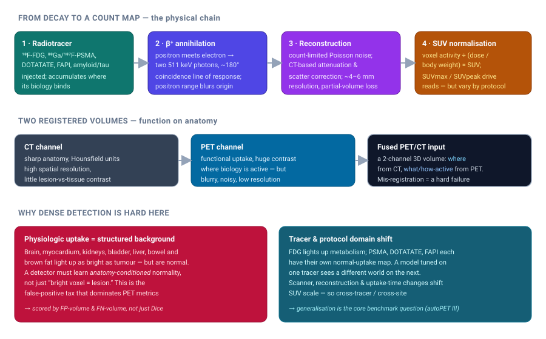
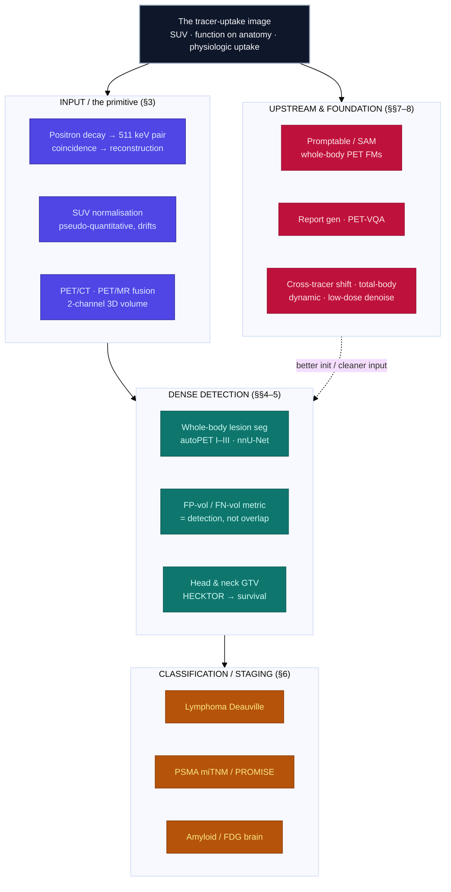

# Dense Object Detection & Classification — Recent Advances

*Compiled 2026-Aug-01 (America/Los_Angeles).*

Next installment in the running CV-updates log. Earlier entries on
`main`:
[Apr-30](../2026-Apr-30/2026-Apr-30_CV_updates.md),
[May-01](../2026-May-01/2026-May-01_CV_updates.md),
[May-02](../2026-May-02/2026-May-02_CV_updates.md),
[May-04](../2026-May-04/2026-May-04_CV_updates.md),
[May-05](../2026-May-05/2026-May-05_CV_updates.md),
[May-07](../2026-May-07/2026-May-07_CV_updates.md),
[May-08](../2026-May-08/2026-May-08_CV_updates.md),
[May-15](../2026-May-15/2026-May-15_CV_updates.md),
[May-16](../2026-May-16/2026-May-16_CV_updates.md),
[May-17](../2026-May-17/2026-May-17_CV_updates.md),
[Jun-09](../2026-Jun-09/2026-Jun-09_CV_updates.md),
[Jun-10](../2026-Jun-10/2026-Jun-10_CV_updates.md),
[Jun-12](../2026-Jun-12/2026-Jun-12_CV_updates.md),
[Jun-15](../2026-Jun-15/2026-Jun-15_CV_updates.md),
[Jun-16](../2026-Jun-16/2026-Jun-16_CV_updates.md),
[Jun-17](../2026-Jun-17/2026-Jun-17_CV_updates.md),
[Jun-19](../2026-Jun-19/2026-Jun-19_CV_updates.md),
[Jun-21](../2026-Jun-21/2026-Jun-21_CV_updates.md),
[Jun-22](../2026-Jun-22/2026-Jun-22_CV_updates.md),
[Jun-23](../2026-Jun-23/2026-Jun-23_CV_updates.md),
[Jun-24](../2026-Jun-24/2026-Jun-24_CV_updates.md),
[Jun-25](../2026-Jun-25/2026-Jun-25_CV_updates.md),
[Jun-27](../2026-Jun-27/2026-Jun-27_CV_updates.md),
[Jun-29](../2026-Jun-29/2026-Jun-29_CV_updates.md),
[Jun-30](../2026-Jun-30/2026-Jun-30_CV_updates.md),
[Jul-04](../2026-Jul-04/2026-Jul-04_CV_updates.md),
[Jul-07](../2026-Jul-07/2026-Jul-07_CV_updates.md),
[Jul-08](../2026-Jul-08/2026-Jul-08_CV_updates.md),
[Jul-10](../2026-Jul-10/2026-Jul-10_CV_updates.md),
[Jul-15](../2026-Jul-15/2026-Jul-15_CV_updates.md),
[Jul-17](../2026-Jul-17/2026-Jul-17_CV_updates.md),
[Jul-18](../2026-Jul-18/2026-Jul-18_CV_updates.md),
[Jul-21](../2026-Jul-21/2026-Jul-21_CV_updates.md),
[Jul-22](../2026-Jul-22/2026-Jul-22_CV_updates.md),
[Jul-24](../2026-Jul-24/2026-Jul-24_CV_updates.md),
[Jul-26](../2026-Jul-26/2026-Jul-26_CV_updates.md),
[Jul-27](../2026-Jul-27/2026-Jul-27_CV_updates.md),
[Jul-30](../2026-Jul-30/2026-Jul-30_CV_updates.md).

## Table of contents

1. [Why this pass: PET / molecular imaging as its own primitive](#why)
2. [Topic map](#map)
3. [The primitive — tracer uptake, SUV, and function fused onto anatomy](#primitive)
4. [Whole-body lesion detection & segmentation: the autoPET arc](#autopet)
5. [Head & neck and the tumour-volume + outcome coupling: HECKTOR](#hecktor)
6. [Classification & staging: Deauville, PSMA, and the brain](#classification)
7. [Foundation models, promptable segmentation, and PET vision-language](#foundation)
8. [Domain shift, total-body, dynamic PET, and denoising that feeds detection](#shift)
9. [Through-line and open problems](#throughline)
10. [Sources](#sources)

---

## 1. Why this pass: PET / molecular imaging as its own primitive

The running theme of this log has been to take one imaging modality at a time
and ask what dense detection and classification actually *mean* when the pixels
are not natural-image RGB. We have done the
[event camera](../2026-Jun-29/2026-Jun-29_CV_updates.md),
[thermal LWIR](../2026-Jun-30/2026-Jun-30_CV_updates.md),
[imaging radar](../2026-Jul-04/2026-Jul-04_CV_updates.md),
[radiology + pathology](../2026-Jul-07/2026-Jul-07_CV_updates.md),
[ultrasound](../2026-Jul-18/2026-Jul-18_CV_updates.md),
[SAR](../2026-Jul-22/2026-Jul-22_CV_updates.md),
[OCT](../2026-Jul-24/2026-Jul-24_CV_updates.md), and
[endoscopy](../2026-Jul-26/2026-Jul-26_CV_updates.md), among others. Positron
emission tomography (PET) has appeared only in passing — autoPET III listed as
one benchmark among many in the July-07 radiology pass. It deserves its own
entry, because PET breaks an assumption that every optical, radar, and even CT
modality shares: **that the label is written somewhere in the anatomy.**

In PET it is not. A PET voxel does not measure a surface, a density, or a
reflectance — it measures *how much of an injected molecule has accumulated
there*. The image is a map of a biological process — glucose metabolism for
¹⁸F-FDG, prostate-specific membrane antigen expression for PSMA ligands,
somatostatin-receptor density for DOTATATE, fibroblast activation for FAPI,
amyloid or tau burden for the brain tracers. The class you care about (tumour,
metastasis, active disease) is defined *functionally*, and the same voxel
intensity can mean "cancer" in one anatomical location and "completely normal"
in another. That single fact reorganizes the entire detection problem, and it
is why PET is worth treating on its own terms rather than as "another 3D
medical volume."

Three consequences run through everything below:

- **Physiologic uptake is a structured, adversarial background.** The brain,
  myocardium, kidneys, ureters, bladder, liver, bowel, and activated brown fat
  routinely light up as bright as — or brighter than — a tumour. Unlike sensor
  noise, this "background" has anatomy-locked structure a model can learn, but
  only if it reasons about *where* the bright voxel sits, not just *how* bright
  it is. The dominant failure mode of a PET lesion detector is not missing
  faint disease; it is false positives on normal physiology.
- **The output metric is a detection metric, not an overlap metric.** Because
  clinicians care about *how many* lesions exist and *whether* any were missed,
  PET-lesion challenges score volumetric false-positive and false-negative
  burden alongside Dice — segmentation quality is judged as if it were
  detection.
- **Tracer and protocol are a built-in domain shift.** Each radiotracer has its
  *own* normal-uptake map, and standardized-uptake-value (SUV) scaling drifts
  with scanner, reconstruction, and uptake time. A model trained on FDG sees a
  different world on PSMA; the field's central benchmark question is now
  cross-tracer, cross-scanner generalization.

## 2. Topic map

The six threads this pass, and how they hang off the tracer-uptake image:

## 3. The primitive — tracer uptake, SUV, and function fused onto anatomy

Start with the physical chain, because it dictates the data's statistics.

**Decay to counts.** A positron-emitting radionuclide is attached to a
biologically targeted molecule and injected. Where the molecule accumulates,
positrons are emitted; each annihilates with a nearby electron and produces two
511 keV photons flying apart at almost exactly 180°. A ring of detectors
records the *coincidence* of the two photons, defining a line of response.
Millions of such lines are reconstructed (iteratively, usually OSEM-family or,
increasingly, deep-learned) into a 3D activity volume. Two physical facts
matter for vision:

- **Resolution is coarse and blur is intrinsic.** The positron travels a short
  distance before annihilating (positron range), and the two photons are not
  perfectly collinear. Combined with detector size, clinical whole-body PET
  resolves to roughly 4–6 mm — an order of magnitude blurrier than the CT it is
  fused with. Small lesions suffer the **partial-volume effect**: their measured
  uptake is diluted by the surrounding low-activity tissue, so a true 6 mm node
  can read fainter than its biology warrants. Detection near the resolution
  limit is therefore a signal-recovery problem, not just a thresholding one.
- **Noise is count-limited (Poisson).** Image quality is governed by how many
  coincidences were collected — a function of injected dose, uptake time, patient
  size, and scan duration. Low-count PET is grainy in a way that is
  signal-dependent, which is why denoising and detection are entangled (§8).

**SUV — the field's pseudo-quantitative currency.** Raw activity concentration
is normalized to the **standardized uptake value**, roughly voxel activity
divided by (injected dose / body weight). SUVmax (the hottest voxel in a
region) and SUVpeak (a small averaged kernel) are the numbers clinicians read
off and the numbers thresholds are built on. SUV is only *pseudo*-quantitative:
it shifts with uptake time, blood glucose, reconstruction kernel, and how body
mass is accounted for. Any model that keys off absolute SUV inherits that
drift — a recurring theme in the harmonization work of §8.

**Function fused onto anatomy.** Clinically, PET almost never travels alone. It
is acquired as **PET/CT** (and, increasingly, **PET/MR**), with the CT (or MR)
providing both the attenuation map needed to correct the PET and the sharp
anatomical scaffold the PET lacks. For a network this is a naturally
**two-channel 3D input**: CT says *where* (organ boundaries, bone, the anatomy
that conditions what "normal uptake" means there), PET says *what / how active*.
The channels are co-registered by acquisition, but breathing and bowel motion
mean the registration is imperfect — and a mis-registered pair is a hard failure
mode, because the model's anatomical prior about where a hot voxel sits is
suddenly wrong. Most state-of-the-art lesion pipelines are, at their core,
3D U-Nets ingesting stacked SUV-PET and Hounsfield-CT channels — which is why the
autoPET arc below is largely a story about *data and generalization* rather than
exotic architecture.

## 4. Whole-body lesion detection & segmentation: the autoPET arc

The center of gravity for PET dense detection is the **autoPET** MICCAI
challenge series, which turned whole-body lesion segmentation into a public,
repeatable benchmark and, in the process, exposed exactly which problems in §3
actually bind.

**The dataset that started it.** The series rests on the Tübingen whole-body
FDG-PET/CT dataset ([Gatidis et al., *Scientific Data* 2022](https://www.nature.com/articles/s41597-022-01718-3)):
1,014 studies from 900 patients (melanoma, lymphoma, lung cancer, **plus
deliberately included lesion-free negative controls**), with manual voxel
annotations, released on TCIA. The negative controls are the quiet
methodological point — they force a model to be able to output *nothing*, which
is exactly what a physiologic-uptake-confused detector cannot do.

**The editions, and what each stressed.**

- **autoPET (MICCAI 2022)** — binary whole-body FDG lesion segmentation. The
  winning entry ("Blackbean", Shanghai AI Lab) was a *vanilla* 3D U-Net
  ([arXiv 2210.07490](https://arxiv.org/abs/2210.07490)), an early sign that
  the architecture race was already flat. Consolidated results later appeared
  in [*Nature Machine Intelligence* 2024](https://www.nature.com/articles/s42256-024-00912-9),
  confirming that essentially every top entry was a 3D U-Net / nnU-Net variant.
- **autoPET II (2023)** — same FDG task, robustness emphasis. The winning
  submission from MIC-DKFZ carried the deadpan title *"Look Ma, no code:
  fine-tuning nnU-Net … by only adjusting its JSON plans"*
  ([arXiv 2309.13747](https://arxiv.org/abs/2309.13747)) — near-top performance
  from editing nnU-Net's configuration, not its architecture. A parallel line of
  work made the false-positive mechanism explicit by adding TotalSegmentator
  organs (liver, kidneys, bladder, spleen, brain, heart…) as **extra labels** so
  the network is taught to *not* call them lesions
  ([arXiv 2311.01574](https://arxiv.org/abs/2311.01574)).
- **autoPET III (MICCAI 2024)** — **the multi-tracer edition, and the pivotal
  one for this entry.** Training added 597 PSMA studies (LMU Munich — the largest
  public annotated PSMA PET/CT cohort, since released as its own [data
  descriptor](https://www.nature.com/articles/s41597-026-07821-z)) to the 1,014
  FDG studies; the held-out test spanned **four tracer×center combinations, two
  of them unseen pairings** — i.e. compositional generalization. It also
  introduced a **data-centric track** (fixed baseline, only the data pipeline may
  change). The overview
  ([arXiv 2605.05775](https://arxiv.org/abs/2605.05775)) reports a top mean
  DSC ≈ 0.66 across the four conditions and, tellingly, that **compositional
  generalization to unseen tracer×center pairs remains unsolved**, driven mainly
  by systematic lesion-volume over-estimation. The overall winner, MIC-DKFZ's
  *"From FDG to PSMA: A Hitchhiker's Guide to Multitracer, Multicenter Lesion
  Segmentation"* ([arXiv 2409.09478](https://arxiv.org/abs/2409.09478)), is the
  single best encapsulation of the §3 problems: an nnU-Net **ResEncL** backbone
  with **PET/CT-misalignment augmentation** (robustness to the two channels
  drifting apart), **cross-modal pretraining**, and **auxiliary organ
  supervision** — a multi-task head that teaches the network physiologic-uptake
  anatomy so it stops flagging brain/heart/bladder/kidney/brown-fat. Companion
  entries injected TotalSegmentator anatomical priors the same way
  ([arXiv 2409.12155](https://arxiv.org/abs/2409.12155)), and the data-centric
  analysis ([arXiv 2409.10120](https://arxiv.org/abs/2409.10120)) showed gains
  from resampling/normalization/augmentation alone — a clean "data beats model"
  ablation at the frontier.
- **autoPET IV (2025)** pivots again, to **interactive human-in-the-loop**
  segmentation (simulated user clicks) and a **longitudinal** task (baseline +
  follow-up melanoma CT) ([arXiv 2509.02402](https://arxiv.org/abs/2509.02402)),
  building on DKFZ's [nnInteractive](https://arxiv.org/abs/2503.08373) promptable
  engine.

**Why the metric is the message.** autoPET scores are not Dice alone. The
ranking combines Dice on lesion-positive scans with **false-positive volume**
(uptake wrongly labeled lesion, i.e. physiologic hotspots) and
**false-negative volume** (missed disease). This is a deliberate encoding of the
§3 insight: a model that lazily lights up the bladder and myocardium is punished
even if its Dice on true lesions looks fine, and a scan with *no* disease (which
the dataset deliberately includes) can only be gotten right by segmenting
*nothing*. Segmentation is being graded as detection.

**What actually won, across editions.** The consistent lesson is
architecturally deflationary and clinically important: **self-configuring
3D U-Nets of the nnU-Net family dominate**, and the deltas come from *data-centric*
moves rather than new backbones — aggressive augmentation, careful handling of
the tracer/scanner mix, test-time augmentation, ensembling, and explicit
false-positive control (organ-aware post-processing, physiologic-uptake
suppression, and negative-scan mining). Transformer and Mamba variants have been
tried; they are competitive but have not displaced the well-tuned CNN, and the
challenge organizers' own analyses repeatedly point back to data quality and
generalization as the binding constraint.

## 5. Head & neck and the tumour-volume + outcome coupling: HECKTOR

The other long-running PET/CT benchmark is **HECKTOR** (HEad and neCK TumOR
segmentation and outcome prediction), which differs from autoPET in two
instructive ways: it is *regional* rather than whole-body, and it explicitly
couples **dense segmentation to a downstream classification/prognosis task**.

**The editions.** HECKTOR (HES-SO Valais / CHUV) ran at MICCAI 2020–2022 and
has returned for 2025:

- **2020** established the task — segment the primary gross tumour volume (GTVt)
  of oropharyngeal tumours in FDG-PET/CT — and the consolidated report
  ([*Medical Image Analysis* 2022, DOI 10.1016/j.media.2021.102336](https://doi.org/10.1016/j.media.2021.102336))
  is the reference write-up.
- **2021** ([overview, arXiv 2201.04138](https://arxiv.org/abs/2201.04138))
  added the outcome axis: 325 cases from 6 centers, with tasks for **GTVt
  segmentation and progression-free-survival prediction**.
- **2022** ([overview, Springer LNCS 13626, DOI 10.1007/978-3-031-27420-6_1](https://doi.org/10.1007/978-3-031-27420-6_1))
  scaled to **883 cases from 9 centers** and segmented **both the primary GTVp
  and metastatic lymph nodes GTVn**, alongside recurrence-free-survival
  prediction. The winning segmentation entry (NVIDIA "NVAUTO") was a MONAI
  **SegResNet** 15-model ensemble reaching aggregated Dice ≈ 0.788
  ([arXiv 2209.10809](https://arxiv.org/abs/2209.10809)).
- **[HECKTOR 2025](https://hecktor25.grand-challenge.org/)** extends to joint
  lesion segmentation, diagnosis, and prognosis.

HECKTOR matters for this log because it is the cleanest example of the
**dense-output → patient-level-label pipeline** in PET: the primary gross-tumour-
volume (and, in later editions, lymph-node) segmentation is not the end product
but the substrate for **recurrence-free-survival prediction**. The winning
recipes again lean on registered dual-channel PET/CT U-Nets for the mask, then
derive radiomic or learned features from the *predicted* volume for the outcome
head — making the segmentation quality directly load-bearing for the
classification metric, and surfacing the partial-volume and SUV-drift issues of
§3 as concrete sources of prognostic error.

## 6. Classification & staging: Deauville, PSMA, and the brain

Not every PET task is voxel-dense. A large and clinically central family is
**image- or scan-level classification**, where the "detection" has already been
done by a physician or a segmentation model and the question is a categorical
read. Three areas dominate the recent literature.

The concrete work behind each area:

- **Lymphoma.** The largest image-side effort is **LARS** (the "Lymphoma
  Artificial Reader System"), a ResNet trained on ~16,500 FDG-PET/CT studies from
  >5,000 patients and weakly labeled with the 5-point Lugano/Deauville score,
  reporting balanced accuracy ≈ 87–91% consistent across two centers
  ([Häggström et al., *Lancet Digital Health* 2023, DOI 10.1016/S2589-7500(23)00203-0](https://doi.org/10.1016/S2589-7500(23)00203-0));
  automated Lugano metabolic-response assessment has a parallel line in
  [*JCO* 2024, DOI 10.1200/JCO.23.01978](https://doi.org/10.1200/JCO.23.01978).
  A revealing *text*-side counterpoint: fine-tuned LLMs predicting the Deauville
  score directly from the free-text report reach only ≈ 76.7% five-class accuracy
  ([Hou et al., arXiv 2309.10066](https://arxiv.org/abs/2309.10066)) — evidence
  that the score is genuinely hard even when the finding is already described.
- **Prostate (PSMA).** The reporting substrate is **PROMISE / miTNM**, the
  molecular-imaging TNM framework
  ([Eiber et al., *JNM* 2018, DOI 10.2967/jnumed.117.198119](https://doi.org/10.2967/jnumed.117.198119)),
  which DL staging models target; recent work automates miTNM extraction from
  reports with LLMs (PROMISE v2, [*EJNMMI* 2026, DOI 10.1007/s00259-026-07847-w](https://doi.org/10.1007/s00259-026-07847-w)).
  The image-side lesson from §4 recurs: because PSMA has its *own* intense
  physiologic uptake (kidneys, salivary glands, liver, urinary excretion),
  FDG-trained models transfer poorly and PSMA-specific detection is needed.
- **Brain.** Amyloid, tau, and FDG-metabolism patterns drive dementia
  classification, almost always on **ADNI**-style cohorts: tau-PET CNNs
  ([*Sci. Rep.* 2023, DOI 10.1038/s41598-023-35389-w](https://doi.org/10.1038/s41598-023-35389-w)),
  amyloid-PET + MRI fusion
  ([*Sci. Rep.* 2024, DOI 10.1038/s41598-024-56001-9](https://doi.org/10.1038/s41598-024-56001-9)),
  and multimodal GNNs over sMRI + PET
  ([Zhang et al., arXiv 2307.16366](https://arxiv.org/abs/2307.16366)). Here the
  "detection" is a *diffuse spatial pattern* of uptake rather than a focal
  object — closer to texture recognition, and a reminder that "PET detection" is
  not one problem.
- **Multimodal PET/CT fusion for classification.** Beyond input-channel
  concatenation, intermediate/attention fusion is the trend, e.g. multi-stage
  intermediate fusion for NSCLC subtype classification
  ([Aksu et al., arXiv 2501.12425](https://arxiv.org/abs/2501.12425)) and
  evidential (uncertainty-aware) fusion for trustworthy tumour segmentation
  ([arXiv 2406.18327](https://arxiv.org/abs/2406.18327)).

- **Lymphoma response and the Deauville 5-point scale.** FDG-PET is the
  reference for lymphoma staging and response, scored on the ordinal **Deauville**
  scale that compares lesion uptake to mediastinal blood pool and liver. Deep
  models that predict the Deauville score (or the binary "response" derived from
  it) must implicitly localize residual disease *and* calibrate it against those
  two internal anatomical references — an on-the-nose instance of the §3 rule
  that PET labels are anatomy-conditioned.
- **PSMA-PET prostate staging (miTNM / PROMISE).** ⁶⁸Ga- and ¹⁸F-labeled PSMA
  ligands have made molecular staging of prostate cancer routine, with the
  **PROMISE / miTNM** framework standardizing lesion-level reporting. The vision
  problem is doubly hard: PSMA has its *own* intense physiologic uptake (kidneys,
  salivary glands, liver, bowel, and urinary excretion into the bladder and
  ureters), so cross-tracer transfer from FDG models is limited and PSMA-specific
  detection/classification models are an active area.
- **Brain PET for dementia.** Amyloid and tau tracers (and FDG-metabolism
  patterns) drive Alzheimer's and dementia classification, typically on
  **ADNI**-style cohorts. Here the "detection" is diffuse and pattern-based
  rather than focal — the network is classifying a spatial *distribution* of
  uptake, closer to texture/pattern recognition than object detection, which is
  why brain PET pulls in a fairly distinct methodological toolkit from the
  oncologic whole-body work.

## 7. Foundation models, promptable segmentation, and PET vision-language

The foundation-model wave that reshaped the rest of medical imaging is arriving
in PET later and with a modality-specific twist: pretraining has to contend with
the tracer/scanner domain shift *inside* the pretraining corpus, and promptable
models have to be taught that "bright" is not a sufficient prompt.

The concrete work:

- **Promptable / SAM-style, retargeted to lesions.** **SegAnyPET**
  ([ICCV 2025, arXiv 2502.14351](https://arxiv.org/abs/2502.14351)) is the first
  promptable PET segmentation foundation model, trained on a 5.7k-scan whole-body
  set (PETS-5k) with a *Cross Prompting Confident Learning* strategy to handle
  noisy annotations, and generalizing to unseen organs from a few point prompts —
  where off-the-shelf SAM keys on contrast and happily segments the bladder. The
  same group has since scaled it toward a **universal whole-body PET segmentation
  FM** on 11,041 scans / 59,831 masks
  ([arXiv 2603.11627](https://arxiv.org/abs/2603.11627)). DKFZ added
  promptability to the winning autoPET III nnU-Net by encoding clicks as extra
  channels ([arXiv 2508.21680](https://arxiv.org/abs/2508.21680)), and a
  multi-modal SAM (mmSAM) fuses PET+CT encoders for multi-tracer tumour
  segmentation ([*EJNMMI Physics* 2026, DOI 10.1186/s40658-026-00887-z](https://doi.org/10.1186/s40658-026-00887-z)).
- **Whole-body PET foundation models.** Self-supervised pretraining is arriving:
  an open multi-center FDG PET/CT FM uses a **SUV-aware, zero-mean-imputation
  masked-autoencoder** objective on ~5k harmonized scans and matches
  full-data-from-scratch downstream performance with only ~10% of labels
  ([arXiv 2605.21835](https://arxiv.org/abs/2605.21835)); **FratMAE** couples
  separate PET and CT ViT encoders through cross-attention during MAE pretraining
  ([arXiv 2503.02824](https://arxiv.org/abs/2503.02824)); and generalist
  total-body models such as SDF-HOLO pretrain on >10k patients to span
  segmentation, low-dose detection, and reporting in one model
  ([arXiv 2601.12820](https://arxiv.org/abs/2601.12820)).
- **Vision-language and reporting.** **PET2Rep**
  ([AAAI 2026, arXiv 2508.04062](https://arxiv.org/abs/2508.04062)) is the first
  PET report-generation benchmark built around *metabolic* description, and its
  headline finding is a useful reality check: **all 30 general and medical VLMs
  it benchmarks perform poorly** on PET. End-to-end 3D dual-branch report models
  (PETRG-3D, [arXiv 2511.20145](https://arxiv.org/abs/2511.20145)) and
  report-to-image **visual grounding** of positive findings
  ([ConTEXTual Net 3D, arXiv 2502.00528](https://arxiv.org/abs/2502.00528)) are
  the current state of the art, along with anatomy-conditioned per-lesion
  captioning ([MICCAI 2025](https://papers.miccai.org/miccai-2025/0508-Paper0248.html)).

Three sub-threads are worth separating:

- **Promptable / SAM-style segmentation adapted to 3D uptake.** Off-the-shelf
  SAM keys on visual edges and contrast, which in PET means it will happily
  segment the bladder. The adaptation work retargets promptable models to
  *lesion* semantics in the fused PET/CT volume, and toward whole-body promptable
  lesion localization rather than 2D-slice interaction.
- **Whole-body PET foundation models.** Self-supervised pretraining on large
  unlabeled PET/CT corpora aims to give downstream lesion detectors an
  SUV-aware, anatomy-aware initialization — the PET analogue of the CT/MR
  foundation models covered in the July-07 pass.
- **Vision-language and reporting.** Nuclear-medicine reports are highly
  structured (lesion-by-lesion, with SUV numbers and anatomical locations),
  which makes PET a natural target for report generation and PET-VQA — but also a
  demanding one, because a plausible-sounding report that misplaces or miscounts
  lesions is clinically worse than none.

## 8. Domain shift, total-body, dynamic PET, and denoising that feeds detection

The last thread collects the modality-specific engineering problems that
*upstream* of detection determine whether detection works at all.

The concrete work:

- **Cross-tracer domain generalization.** The clearest formulation treats
  FDG→PSMA as unsupervised domain adaptation for 3D lesion *detection* under
  label shift, with adaptive anchor adjustment and size-binned pseudo-label
  quotas ([arXiv 2603.13666](https://arxiv.org/abs/2603.13666)); autoPET III
  (§4) is the canonical benchmark, and its verdict — unseen tracer×center pairs
  are unsolved — sets the agenda. Weakly-/self-supervised **anomaly detection**
  sidesteps tracer-specific labels entirely: IgCONDA-PET localizes lesions via
  counterfactual "unhealthy→healthy" diffusion across 2,652 multi-tracer cases
  ([arXiv 2405.00239](https://arxiv.org/abs/2405.00239)), and AutoPaint frames
  detection as self-inpainting residual ([arXiv 2305.12358](https://arxiv.org/abs/2305.12358)).
- **SUV harmonization.** A cross-platform harmonization framework learns
  CT-anchored attenuation representations and reports >80% reduction in
  cross-platform quantitative bias with zero-shot generalization to held-out
  tracers ([*npj Digital Medicine* 2026, DOI 10.1038/s41746-026-02570-0](https://doi.org/10.1038/s41746-026-02570-0)).
- **Total-body and dynamic PET.** Long-axial-field-of-view scanners
  (uEXPLORER-class) enable ultra-low-dose or true whole-body **dynamic**
  acquisition, opening parametric tasks where the channel is a *kinetic rate*
  rather than a static SUV — e.g. self-supervised deep learning for total-body
  Patlak Kᵢ parametric imaging
  ([*EJNMMI* 2025, DOI 10.1007/s00259-024-07008-x](https://doi.org/10.1007/s00259-024-07008-x)).
- **Low-dose denoising as a detection front end.** Because PET noise is
  count-limited, dose/time reduction degrades exactly the faint-lesion regime.
  Dose-conditioned diffusion denoisers validated with reader studies
  ([arXiv 2405.12996](https://arxiv.org/abs/2405.12996)) and multi-anchor
  progressive diffusion tested on uEXPLORER cohorts
  ([arXiv 2603.02012](https://arxiv.org/abs/2603.02012)) are the current line —
  and the right way to judge them is **task-based** (does lesion detectability
  survive?), not by generic image-similarity scores. Non-FDG/non-PSMA detection
  also matters: nnU-Net automates pheochromocytoma/paraganglioma burden on
  ⁶⁸Ga-DOTATATE PET/CT
  ([*EJNMMI Research* 2024, DOI 10.1186/s13550-024-01168-5](https://doi.org/10.1186/s13550-024-01168-5)).

- **Cross-tracer and cross-scanner generalization.** This is the through-line of
  the whole entry. FDG↔PSMA↔FAPI↔DOTATATE each redraw the normal-uptake map;
  scanner, reconstruction kernel, and uptake time redraw the SUV scale. autoPET
  III's explicit multi-tracer design made this the headline research question,
  and harmonization / domain-generalization methods (SUV normalization schemes,
  tracer-conditioned models, augmentation that simulates protocol variation) are
  the response.
- **Total-body PET (uEXPLORER-class scanners).** Long-axial-field-of-view
  scanners image the entire body at once with far higher sensitivity, enabling
  ultra-low-dose or ultra-fast acquisitions and true whole-body **dynamic**
  imaging. This changes the input statistics detectors see (much lower noise, or
  a *time* axis of tracer kinetics) and opens parametric-imaging tasks where the
  "channel" is a kinetic rate, not a static SUV.
- **Low-dose denoising as a detection pre-processor.** Because PET noise is
  count-limited, reducing dose or scan time degrades exactly the faint-lesion
  regime detection cares about. Deep denoising and deep-learned reconstruction
  are therefore not cosmetic — they are the front end of the detection pipeline,
  and the right way to evaluate them is *task-based* (does lesion detectability
  survive the dose reduction?), not by generic image-similarity metrics.

## 9. Through-line and open problems

Pulling the threads together:

- **The defining property is anatomy-conditioned normality.** More than any
  modality in this series, PET punishes a detector that reasons about pixel
  intensity in isolation. Every productive idea here — organ-aware
  post-processing, PET/CT fusion, negative-scan mining, tracer-conditioned
  models — is a way of teaching the network *where* a hot voxel is allowed to be.
- **Detection metrics have quietly won.** The most influential PET benchmark
  (autoPET) scores false-positive and false-negative *volume*, not just overlap.
  The community has effectively agreed that PET segmentation is graded as
  detection, and model development follows the metric.
- **Architecture has plateaued; data and generalization are the frontier.** The
  nnU-Net family still wins, edition after edition. The open problems are not
  "what backbone" but: cross-tracer transfer, SUV harmonization across scanners,
  label scarcity for rarer tracers, task-based evaluation of denoising and
  reconstruction, and foundation models that are genuinely tracer- and
  anatomy-aware rather than contrast-chasing.
- **The foundation-model and VLM wave is early and modality-specific.** PET's
  structured reports and small-but-growing unlabeled corpora make it fertile for
  promptable and vision-language models, but the modality's own domain shift is
  baked into any pretraining set — the generalization problem does not disappear
  at scale, it moves inside the pretrained weights.

## 10. Sources

Grouped by section. Links were resolved at compile time; where a specific
identifier could not be verified it is named rather than mis-linked.

> **Verification note.** This environment's network policy blocks direct
> fetching of arxiv.org, publisher, and preprint hosts, so links below were
> confirmed by matching each identifier to its canonical title through web
> search rather than by opening the page. Peer-reviewed DOIs and the
> long-standing challenge/dataset identifiers are high-confidence; **arXiv IDs
> dated 2026 (2601–2607) should be re-resolved on an unrestricted connection
> before being relied on for exact figures.** Headline numbers are attributed to
> their source and, where they came from a challenge summary rather than a
> fetched full text, should be treated as approximate.

**The primitive & datasets (§3, §4, §5)**
- FDG-PET/CT lesion dataset — Gatidis et al., *Sci. Data* 2022: [10.1038/s41597-022-01718-3](https://www.nature.com/articles/s41597-022-01718-3)
- PSMA-PET/CT lesion dataset — *Sci. Data* 2026: [10.1038/s41597-026-07821-z](https://www.nature.com/articles/s41597-026-07821-z)
- autoPET challenge portals: [2024 (III)](https://autopet-iii.grand-challenge.org/) · [2025 (IV)](https://autopet-iv.grand-challenge.org/) · lab-midas
- HECKTOR portal: [hecktor.grand-challenge.org](https://hecktor.grand-challenge.org/) · [2025 edition](https://hecktor25.grand-challenge.org/)
- ADNI (brain PET cohort): [adni.loni.usc.edu](https://adni.loni.usc.edu/)

**Whole-body lesion detection — the autoPET arc (§4)**
- autoPET results — *Nat. Mach. Intell.* 2024: [10.1038/s42256-024-00912-9](https://www.nature.com/articles/s42256-024-00912-9)
- Vanilla U-Net winner (2022): [arXiv 2210.07490](https://arxiv.org/abs/2210.07490)
- "Look Ma, no code" nnU-Net (autoPET II, 2023): [arXiv 2309.13747](https://arxiv.org/abs/2309.13747)
- Multilabel organ suppression (2023): [arXiv 2311.01574](https://arxiv.org/abs/2311.01574)
- autoPET III overview (multitracer generalization): [arXiv 2605.05775](https://arxiv.org/abs/2605.05775)
- "From FDG to PSMA: A Hitchhiker's Guide" (autoPET III winner): [arXiv 2409.09478](https://arxiv.org/abs/2409.09478)
- Anatomical-knowledge nnU-Net (autoPET III): [arXiv 2409.12155](https://arxiv.org/abs/2409.12155)
- Data-centric strategies (autoPET III): [arXiv 2409.10120](https://arxiv.org/abs/2409.10120)
- autoPET IV interactive + longitudinal: [arXiv 2509.02402](https://arxiv.org/abs/2509.02402)
- Test-time augmentation study: [arXiv 2210.07761](https://arxiv.org/abs/2210.07761)

**Head & neck — HECKTOR (§5)**
- HECKTOR 2020 report — *Med. Image Anal.* 2022: [10.1016/j.media.2021.102336](https://doi.org/10.1016/j.media.2021.102336)
- HECKTOR 2021 overview: [arXiv 2201.04138](https://arxiv.org/abs/2201.04138)
- HECKTOR 2022 overview — LNCS 13626: [10.1007/978-3-031-27420-6_1](https://doi.org/10.1007/978-3-031-27420-6_1)
- NVAUTO SegResNet winner (2022): [arXiv 2209.10809](https://arxiv.org/abs/2209.10809)

**Classification & staging (§6)**
- LARS lymphoma classifier — *Lancet Digit. Health* 2023: [10.1016/S2589-7500(23)00203-0](https://doi.org/10.1016/S2589-7500(23)00203-0)
- Automated Lugano response — *JCO* 2024: [10.1200/JCO.23.01978](https://doi.org/10.1200/JCO.23.01978)
- LLM Deauville-from-report: [arXiv 2309.10066](https://arxiv.org/abs/2309.10066)
- PROMISE / miTNM framework — *JNM* 2018: [10.2967/jnumed.117.198119](https://doi.org/10.2967/jnumed.117.198119)
- LLM PROMISE-v2 staging — *EJNMMI* 2026: [10.1007/s00259-026-07847-w](https://doi.org/10.1007/s00259-026-07847-w)
- Tau-PET AD classifier — *Sci. Rep.* 2023: [10.1038/s41598-023-35389-w](https://doi.org/10.1038/s41598-023-35389-w)
- Amyloid-PET + MRI fusion — *Sci. Rep.* 2024: [10.1038/s41598-024-56001-9](https://doi.org/10.1038/s41598-024-56001-9)
- Multimodal GNN (sMRI + PET): [arXiv 2307.16366](https://arxiv.org/abs/2307.16366)
- Intermediate-fusion NSCLC subtyping: [arXiv 2501.12425](https://arxiv.org/abs/2501.12425)
- Evidential PET/CT fusion segmentation: [arXiv 2406.18327](https://arxiv.org/abs/2406.18327)

**Foundation models, SAM & VLMs (§7)**
- SegAnyPET — ICCV 2025: [arXiv 2502.14351](https://arxiv.org/abs/2502.14351)
- Universal whole-body PET segmentation FM: [arXiv 2603.11627](https://arxiv.org/abs/2603.11627)
- Open multi-center FDG PET/CT FM (MAE): [arXiv 2605.21835](https://arxiv.org/abs/2605.21835)
- FratMAE cross-modal MAE: [arXiv 2503.02824](https://arxiv.org/abs/2503.02824)
- SDF-HOLO generalist total-body FM: [arXiv 2601.12820](https://arxiv.org/abs/2601.12820)
- DKFZ promptable lesion segmentation: [arXiv 2508.21680](https://arxiv.org/abs/2508.21680)
- nnInteractive 3D promptable engine: [arXiv 2503.08373](https://arxiv.org/abs/2503.08373)
- mmSAM multi-tracer — *EJNMMI Physics* 2026: [10.1186/s40658-026-00887-z](https://doi.org/10.1186/s40658-026-00887-z)
- PET2Rep report benchmark — AAAI 2026: [arXiv 2508.04062](https://arxiv.org/abs/2508.04062)
- PETRG-3D report generation: [arXiv 2511.20145](https://arxiv.org/abs/2511.20145)
- ConTEXTual Net 3D visual grounding: [arXiv 2502.00528](https://arxiv.org/abs/2502.00528)
- Location-guided lesion captioning — MICCAI 2025: [papers.miccai.org](https://papers.miccai.org/miccai-2025/0508-Paper0248.html)

**Domain shift, total-body, dynamic & denoising (§8)**
- FDG→PSMA UDA for 3D detection: [arXiv 2603.13666](https://arxiv.org/abs/2603.13666)
- IgCONDA-PET counterfactual anomaly detection: [arXiv 2405.00239](https://arxiv.org/abs/2405.00239)
- AutoPaint self-inpainting anomaly detection: [arXiv 2305.12358](https://arxiv.org/abs/2305.12358)
- Cross-platform SUV harmonization — *npj Digit. Med.* 2026: [10.1038/s41746-026-02570-0](https://www.nature.com/articles/s41746-026-02570-0)
- Self-supervised total-body Patlak parametric imaging — *EJNMMI* 2025: [10.1007/s00259-024-07008-x](https://doi.org/10.1007/s00259-024-07008-x)
- Dose-aware diffusion PET denoising (reader study): [arXiv 2405.12996](https://arxiv.org/abs/2405.12996)
- MAP-Diff multi-anchor low-dose denoising (uEXPLORER): [arXiv 2603.02012](https://arxiv.org/abs/2603.02012)
- DOTATATE pheo/paraganglioma nnU-Net — *EJNMMI Res.* 2024: [10.1186/s13550-024-01168-5](https://doi.org/10.1186/s13550-024-01168-5)

*Compiled automatically as part of the CV-updates routine. Corrections and additions
welcome via PR against `main`.*
