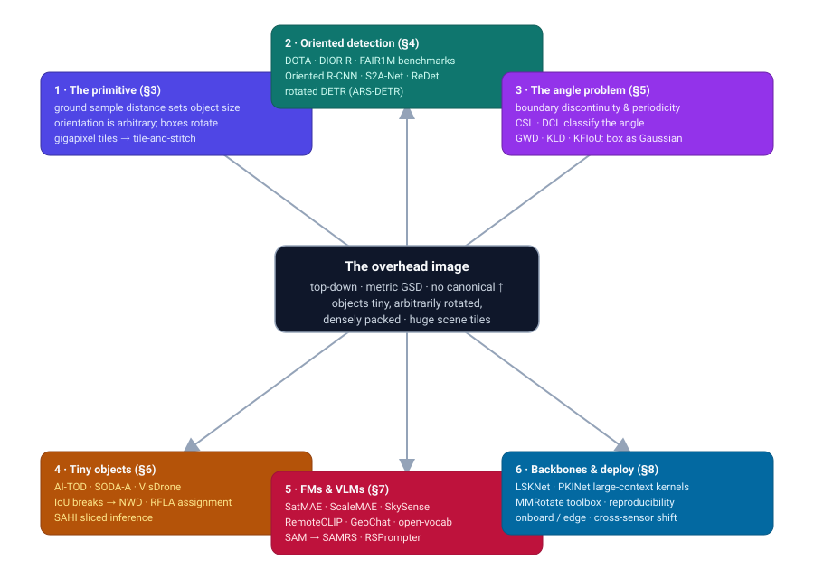
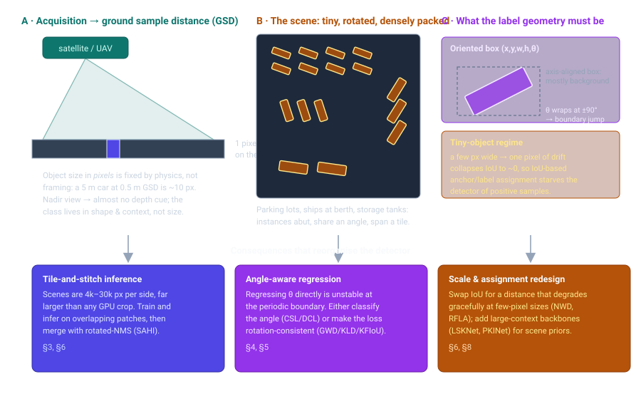
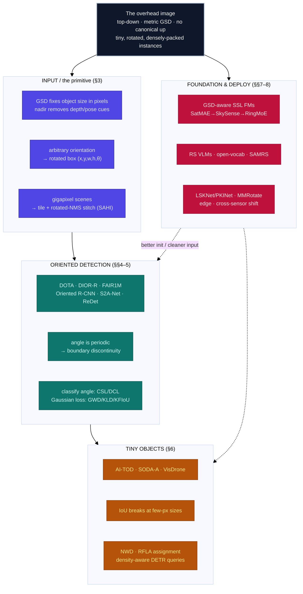

# Dense Object Detection & Classification — Recent Advances

*Compiled 2026-Aug-02 (America/Los_Angeles).*

Next installment in the running CV-updates log. Earlier entries on
`main`:
[Apr-30](../2026-Apr-30/2026-Apr-30_CV_updates.md),
[May-01](../2026-May-01/2026-May-01_CV_updates.md),
[May-02](../2026-May-02/2026-May-02_CV_updates.md),
[May-04](../2026-May-04/2026-May-04_CV_updates.md),
[May-05](../2026-May-05/2026-May-05_CV_updates.md),
[May-07](../2026-May-07/2026-May-07_CV_updates.md),
[May-08](../2026-May-08/2026-May-08_CV_updates.md),
[May-15](../2026-May-15/2026-May-15_CV_updates.md),
[May-16](../2026-May-16/2026-May-16_CV_updates.md),
[May-17](../2026-May-17/2026-May-17_CV_updates.md),
[Jun-09](../2026-Jun-09/2026-Jun-09_CV_updates.md),
[Jun-10](../2026-Jun-10/2026-Jun-10_CV_updates.md),
[Jun-12](../2026-Jun-12/2026-Jun-12_CV_updates.md),
[Jun-15](../2026-Jun-15/2026-Jun-15_CV_updates.md),
[Jun-16](../2026-Jun-16/2026-Jun-16_CV_updates.md),
[Jun-17](../2026-Jun-17/2026-Jun-17_CV_updates.md),
[Jun-19](../2026-Jun-19/2026-Jun-19_CV_updates.md),
[Jun-21](../2026-Jun-21/2026-Jun-21_CV_updates.md),
[Jun-22](../2026-Jun-22/2026-Jun-22_CV_updates.md),
[Jun-23](../2026-Jun-23/2026-Jun-23_CV_updates.md),
[Jun-24](../2026-Jun-24/2026-Jun-24_CV_updates.md),
[Jun-25](../2026-Jun-25/2026-Jun-25_CV_updates.md),
[Jun-27](../2026-Jun-27/2026-Jun-27_CV_updates.md),
[Jun-29](../2026-Jun-29/2026-Jun-29_CV_updates.md),
[Jun-30](../2026-Jun-30/2026-Jun-30_CV_updates.md),
[Jul-04](../2026-Jul-04/2026-Jul-04_CV_updates.md),
[Jul-07](../2026-Jul-07/2026-Jul-07_CV_updates.md),
[Jul-08](../2026-Jul-08/2026-Jul-08_CV_updates.md),
[Jul-10](../2026-Jul-10/2026-Jul-10_CV_updates.md),
[Jul-15](../2026-Jul-15/2026-Jul-15_CV_updates.md),
[Jul-17](../2026-Jul-17/2026-Jul-17_CV_updates.md),
[Jul-18](../2026-Jul-18/2026-Jul-18_CV_updates.md),
[Jul-21](../2026-Jul-21/2026-Jul-21_CV_updates.md),
[Jul-22](../2026-Jul-22/2026-Jul-22_CV_updates.md),
[Jul-24](../2026-Jul-24/2026-Jul-24_CV_updates.md),
[Jul-26](../2026-Jul-26/2026-Jul-26_CV_updates.md),
[Jul-27](../2026-Jul-27/2026-Jul-27_CV_updates.md),
[Jul-30](../2026-Jul-30/2026-Jul-30_CV_updates.md),
[Aug-01](../2026-Aug-01/2026-Aug-01_CV_updates.md).

## Table of contents

1. [Why this pass: overhead optical imagery as its own primitive](#why)
2. [Topic map](#map)
3. [The primitive — top-down geometry, GSD, orientation, and gigapixel tiles](#primitive)
4. [Oriented detection: the benchmarks and the detectors](#oriented)
5. [The angle problem: boundary discontinuity and how the field fixed it](#angle)
6. [Tiny objects: when IoU stops working](#tiny)
7. [Foundation models, vision-language, open-vocabulary, and SAM](#foundation)
8. [Backbones, toolboxes, and deployment](#backbones)
9. [Through-line and open problems](#throughline)
10. [Sources](#sources)

---

## 1. Why this pass: overhead optical imagery as its own primitive

The running theme of this log has been to take one imaging modality at a time
and ask what dense detection and classification actually *mean* when the pixels
are not natural-image RGB. We have done the
[event camera](../2026-Jun-29/2026-Jun-29_CV_updates.md),
[thermal LWIR](../2026-Jun-30/2026-Jun-30_CV_updates.md),
[imaging radar](../2026-Jul-04/2026-Jul-04_CV_updates.md),
[the microscope](../2026-Jul-17/2026-Jul-17_CV_updates.md),
[hyperspectral](../2026-Jul-21/2026-Jul-21_CV_updates.md),
[SAR](../2026-Jul-22/2026-Jul-22_CV_updates.md),
[polarization](../2026-Jul-27/2026-Jul-27_CV_updates.md), and
[PET](../2026-Aug-01/2026-Aug-01_CV_updates.md), among others. Two of those —
SAR and hyperspectral — are *overhead* modalities, but each was treated for its
exotic sensor physics (coherent radar; hundreds of spectral bands). The most
common overhead modality of all, **plain optical imagery shot straight down from
an aircraft or satellite**, has only ever appeared here in passing — a row in a
benchmark table, an "oriented bounding box" aside. It deserves its own entry,
because the top-down optical image is the purest instance of *dense* object
detection in the whole series, and it breaks assumptions that every
ground-level RGB modality quietly relies on.

A natural photo is taken by a photographer who framed it: the subject is near
the center, roughly upright, and occupies a sensible fraction of the frame.
None of that survives the move to nadir. An overhead scene is not composed; it
is *sampled* off a swath of the Earth. That single change reorganizes the
detection problem:

- **There is no canonical "up."** A car, a ship, a plane, a storage tank can sit
  at any angle in the image plane, because the camera has no privileged relation
  to the object's orientation. An axis-aligned box is a poor fit — for a
  diagonal ship it is mostly water — so the field's native output is the
  **oriented (rotated) bounding box**, and with it comes a subtle,
  representation-level pathology (the angle is periodic) that ground-level
  detection never has to confront.
- **Object size is set by physics, not framing.** The **ground sample distance**
  (GSD) — how many metres of ground one pixel spans — fixes how large anything can
  possibly appear. A 4.5 m car at 0.5 m GSD is nine pixels long *whether you like
  it or not*. Overhead detection is therefore chronically a **tiny-object**
  problem, in a size regime where the standard IoU machinery of modern detectors
  quietly falls apart.
- **Instances are dense, repetitive, and co-oriented.** Cars fill a parking lot,
  ships line a quay, tanks cluster in a farm, planes park in rows on an apron.
  Hundreds of near-identical, abutting, similarly-angled instances per tile is
  the *normal* case, not the hard case — which is exactly why this modality is the
  one where the word "dense" in "dense object detection" is most literal.
- **The scene is enormous.** A single satellite or aerial frame is routinely
  4,000–30,000 pixels on a side, far larger than any GPU crop. Training and
  inference happen on overlapping **tiles**, and results are stitched back with a
  rotated non-maximum-suppression — a pipeline constraint that shapes everything
  downstream.

Those four facts are the primitive. The rest of this entry is what the field has
built on top of them.

## 2. Topic map

The six threads this pass, and how they hang off the overhead image:

## 3. The primitive — top-down geometry, GSD, orientation, and gigapixel tiles

Start with the geometry, because it dictates the data's statistics and, through
them, the whole detector design.

**GSD is the master variable.** The sensor images a swath of ground, and the
optics + orbit/altitude fix the **ground sample distance** — the physical size of
one pixel's footprint, from ~0.3 m for the sharpest commercial satellites and
low aerial passes to 10 m and coarser for wide-swath public constellations like
Sentinel-2. GSD, not the object, decides how many pixels an object gets. This is
the deep reason overhead detection is a *scale* problem before it is anything
else: the same detector must find a 300 m runway and a 3 m vehicle in the same
frame, and the vehicle may be under ten pixels across. It is also why cross-GSD
generalization (train at 0.5 m, deploy at 2 m) is a first-class research
question, and why scale-aware pretraining (§7) keys its positional encodings to
GSD explicitly.

**Nadir kills the depth and pose cues.** Looking straight down, the ground is
approximately a plane and objects are approximately flat patches on it. The rich
perspective, occlusion, and support-relation cues a ground-level detector leans
on are mostly gone. What is left is *shape, texture, and spatial context* — a
rectangle in a lot of rectangles is a car; the same rectangle beside a runway is
a small aircraft. Context does more work here than in almost any other modality,
which is one reason large-receptive-field backbones (§8) matter so much.

**Orientation is a free parameter.** Because there is no canonical up, an object
appears at an arbitrary in-plane angle, and the tight enclosure is a **rotated**
rectangle `(x, y, w, h, θ)`. The gain over an axis-aligned box is large for
elongated objects (ships, planes, vehicles, bridges) and for *dense* rows of
them, where axis-aligned boxes overlap their neighbours and get suppressed by
NMS even though the objects are distinct. The cost is that `θ` lives on a circle:
the parameterization has a discontinuity at the angular boundary (and, for
near-square boxes, an exchange of width and height), which makes naive angle
regression unstable — the subject of §5.

**Scenes are tiled.** No detector ingests a 20,000² image whole. The universal
recipe is to cut the scene into overlapping patches (commonly ~1,024² with a few
hundred pixels of overlap), detect per patch, map boxes back to scene
coordinates, and merge duplicates in the overlap zones with a **rotated NMS**.
The open-source **SAHI** ("Slicing Aided Hyper Inference") package standardized
this as a detector-agnostic wrapper, with an optional slicing-aided fine-tuning
step, and reports multi-point AP gains on high-resolution sets like VisDrone and
xView ([arXiv 2202.06934](https://arxiv.org/abs/2202.06934)). Tiling interacts
with everything: it truncates large objects at patch edges, it multiplies the
effective negative background a detector sees, and it makes the tiny-object
regime even tinier relative to the patch.

The through-line: **top-down geometry converts a perception problem into a
scale-and-orientation problem.** Every thread below is a response to some
consequence of that conversion.

## 4. Oriented detection: the benchmarks and the detectors

**The benchmarks define the task.** Oriented detection in overhead imagery grew
up around a handful of public sets, and their scale is worth stating because it
explains why the field converged on rotated boxes and dense scenes.

| Dataset | Images | Instances | Categories | Notes |
|---|---:|---:|---:|---|
| **DOTA-v1.0** | 2,806 | 188,282 | 15 | The founding benchmark; tiles 800²–~20,000²; quad/OBB annotation ([CVPR 2018, arXiv 1711.10398](https://arxiv.org/abs/1711.10398)) |
| **DOTA-v1.5** | 2,806 | 403,318 | 16 | Same images, re-annotated with sub-10 px instances + "container-crane"; the tiny-object stress edition |
| **DOTA-v2.0** | 11,268 | 1,793,658 | 18 | ~1.8 M instances; adds "airport", "helipad" ([TPAMI 2021, arXiv 2102.12219](https://arxiv.org/abs/2102.12219)) |
| **DIOR-R** | 23,463 | ~192,500 | 20 | Oriented re-annotation of DIOR, from the AOPG paper ([TGRS 2022, arXiv 2110.01931](https://arxiv.org/abs/2110.01931)) |
| **FAIR1M** | >15,000 | >1,000,000 | 5 / 37 | Fine-grained (37 sub-categories), 0.3–0.8 m GSD ([ISPRS J. 2022, arXiv 2103.05569](https://arxiv.org/abs/2103.05569)) |
| **HRSC2016** | 1,061 | ~2,900 | ship | The long-standing ship-only oriented benchmark; elongated objects at arbitrary angle |

DOTA is the reference: its move from v1.0 to v1.5 to v2.0 is essentially the
field turning up the two hardest dials — *more tiny instances* and *more dense
scenes* — on purpose.

**The detectors.** The design history is a steady march from "bolt rotation onto
a horizontal detector" to "make the whole pipeline rotation-native":

- **R³Det** ([AAAI 2021, arXiv 1908.05612](https://arxiv.org/abs/1908.05612)) —
  a single-stage RetinaNet-style detector with a Feature Refinement Module that
  re-samples features to align with the coarse rotated box, plus an approximate
  SkewIoU loss; the early "refine the rotation" template.
- **S²A-Net** ([TGRS 2021, arXiv 2008.09397](https://arxiv.org/abs/2008.09397)) —
  isolates the core misalignment between axis-aligned convolutional features and
  rotated anchors with a Feature Alignment Module and an Oriented Detection
  Module. "Align deep features for oriented detection" is still the one-line
  summary of the whole problem.
- **ReDet** ([CVPR 2021, arXiv 2103.07733](https://arxiv.org/abs/2103.07733)) —
  goes rotation-*equivariant*: a backbone whose features rotate with the input,
  plus a Rotation-invariant RoI Align, so orientation is encoded in the network
  rather than learned by brute force — with far fewer parameters.
- **Oriented R-CNN** ([ICCV 2021, arXiv 2108.05699](https://arxiv.org/abs/2108.05699))
  — a lightweight oriented RPN that emits high-quality rotated proposals "nearly
  cost-free" via a midpoint-offset representation; long the accuracy/simplicity
  sweet spot and a common baseline.
- **Oriented RepPoints** ([CVPR 2022, arXiv 2105.11111](https://arxiv.org/abs/2105.11111))
  — drops boxes for an adaptive *point set* with quality-aware sample assignment,
  capturing orientation and shape without anchors.
- **RTMDet-R** — the rotated configuration of RTMDet
  ([arXiv 2212.07784](https://arxiv.org/abs/2212.07784)), a large-kernel
  depthwise one-stage detector with dynamic soft-label assignment; the modern
  real-time accuracy/speed point.
- **DETR goes rotated.** **AO²-DETR**
  ([TCSVT 2022, arXiv 2205.12785](https://arxiv.org/abs/2205.12785)) was the
  first arbitrary-oriented DETR — oriented proposals + a rotation-aware set-matching
  loss — and **ARS-DETR**
  ([arXiv 2303.04989](https://arxiv.org/abs/2303.04989)) made it
  aspect-ratio-sensitive (an AR-aware Circular Smooth Label and angle handling)
  to win back the high-IoU precision (AP₇₅) that query-based detectors tend to
  lose on elongated objects.

The arc mirrors the ground-level detection story — two-stage → one-stage →
anchor-free → query-based — but with rotation threaded through every stage, and
with a representation-level wrinkle that ground-level detection never has: the
angle itself.

## 5. The angle problem: boundary discontinuity and how the field fixed it

This is the part of overhead detection with no ground-level analogue, and it is
worth spelling out because so much recent work is a variation on it.

**Why regressing the angle directly misbehaves.** The orientation `θ` is
periodic and the box definition is not unique at the extremes: at the angular
boundary (e.g. ±90° under a long-edge definition) two representations of the
*same* box sit at opposite ends of the parameter range, and for a near-square box
a 90° rotation swaps width and height into an identical shape. A network that
regresses `θ` with a smooth loss is therefore penalized enormously for predicting
an angle that is geometrically almost correct but on the wrong side of the
boundary — a large loss for a tiny error. The gradient near the boundary points
the wrong way, and training destabilizes exactly on the elongated objects
oriented boxes are supposed to help. Two families of fix emerged.

**Family 1 — treat the angle as classification.** Discretize orientation into
bins and *classify* it, so the periodicity is handled by the label design rather
than by a regression loss.

- **CSL (Circular Smooth Label)**
  ([ECCV 2020, arXiv 2003.05597](https://arxiv.org/abs/2003.05597)) — angle
  prediction as classification with a *circular*, smooth window so that adjacent
  angles (including across the boundary) are penalized softly. The foundational
  "classify, don't regress" move.
- **DCL (Densely Coded Label)**
  ([CVPR 2021, arXiv 2011.09670](https://arxiv.org/abs/2011.09670)) — replaces
  CSL's one-hot-per-bin coding with a compact binary/gray code, keeping the
  discontinuity-free property while training several times faster and shrinking
  the head.

**Family 2 — make the loss rotation-consistent by modeling the box as a
Gaussian.** Convert an oriented box into a 2-D Gaussian distribution and measure
box similarity as a distance between Gaussians; the periodicity dissolves because
the Gaussian is invariant to the parameterization's boundary quirks, and the loss
becomes a smooth surrogate for the (non-differentiable) rotated IoU.

- **GWD (Gaussian Wasserstein Distance)**
  ([ICML 2021](http://proceedings.mlr.press/v139/yang21l/yang21l.pdf)) — uses the
  Wasserstein distance between the two Gaussians as a differentiable SkewIoU
  surrogate.
- **KLD (Kullback–Leibler Divergence)**
  ([NeurIPS 2021, arXiv 2106.01883](https://arxiv.org/abs/2106.01883)) — uses KL
  divergence instead; it is scale-invariant and self-modulates its gradient by
  object shape, which helps precisely the high-aspect-ratio objects.
- **KFIoU** ([ICLR 2023, arXiv 2201.12558](https://arxiv.org/abs/2201.12558)) —
  approximates SkewIoU itself via a Kalman-filter formulation on the Gaussians,
  mimicking the overlap mechanism rather than substituting a distance, and
  without extra hyperparameters.

The practical upshot, and the reason this section exists: for oriented detection
the *loss and label design around the angle* often matters more than the backbone
or the detection head. It is the clearest case in the whole series of a
representation choice — how you write down "a rotated rectangle" — driving the
entire optimization.

## 6. Tiny objects: when IoU stops working

The second consequence of the primitive is chronic tininess, and it breaks a
mechanism most detectors treat as bedrock: **IoU-based label assignment.**

**The benchmarks that isolate it.** A cluster of datasets exists specifically to
push objects below the size where standard detectors were tuned.

| Dataset | Images | Instances | Mean object size | Notes |
|---|---:|---:|---:|---|
| **AI-TOD** | ~28,000 | ~700 K | **~12.8 px** | Defines the "very-tiny/tiny/small" size bands (ICPR 2020) |
| **AI-TOD-v2** | 28,036 | 752,745 | ~12.7 px | ~86 % of objects <16 px; cleaned annotations ([ISPRS J. 2022, arXiv 2206.13996](https://arxiv.org/abs/2206.13996)) |
| **SODA-A** | 2,513 | 872,069 | ~14.75 px | Oriented, ~350 instances/image ([TPAMI 2023, arXiv 2207.14096](https://arxiv.org/abs/2207.14096)) |
| **TinyPerson** | 1,610 | 72,651 | <20 px | Long-range maritime persons; introduced Scale-Match pretraining ([WACV 2020, arXiv 1912.10664](https://arxiv.org/abs/1912.10664)) |
| **VisDrone** | 10,209 | >2.5 M | ~tens of px | Drone view, 10 classes, very dense scenes |
| **UAVDT** | ~80 K frames | ~0.84 M | small | UAV vehicles under camera motion ([ECCV 2018, arXiv 1804.00518](https://arxiv.org/abs/1804.00518)) |

AI-TOD-v2's average object is *under thirteen pixels* — smaller than any
general detection dataset — which is the whole point.

**Why IoU fails, precisely.** IoU between a proposal and a tiny ground-truth box
is hyper-sensitive to position: a one- or two-pixel shift of a 12-pixel box can
drop the IoU from "clearly positive" to below the assignment threshold. So during
label assignment, most anchors/points that are in fact good matches get labeled
*negative*, and the tiny object is starved of positive training samples. The
detector never learns it well, and the failure is baked in before the loss is
even computed. The fixes replace IoU with a metric that degrades *gracefully* at
small sizes.

- **NWD (Normalized Gaussian Wasserstein Distance)**
  ([arXiv 2110.13389](https://arxiv.org/abs/2110.13389)) — the same
  box-as-Gaussian idea as §5, repurposed for *assignment*: measure proposal↔GT
  similarity by Wasserstein distance, which stays meaningful even at *zero*
  overlap and is far less scale-sensitive than IoU. Drop-in for the assigner, the
  loss, and NMS.
- **NWD-RKA** ([ISPRS J. 2022, arXiv 2206.13996](https://arxiv.org/abs/2206.13996))
  — pairs NWD with a ranking-based assigner; shipped alongside AI-TOD-v2.
- **RFLA (Gaussian Receptive-Field based Label Assignment)**
  ([ECCV 2022, arXiv 2208.08738](https://arxiv.org/abs/2208.08738)) — models the
  *receptive field* of each feature location as a Gaussian and assigns via a
  Receptive-Field Distance with a hierarchical strategy, instead of IoU or
  center-sampling; a clean gain on AI-TOD.
- **SimD (Similarity Distance)**
  ([IROS 2024, arXiv 2407.02394](https://arxiv.org/abs/2407.02394)) — combines
  location and shape similarity with parameters adapted per dataset, reporting
  gains over RFLA/NWD/DotD; a recent consolidation of the distance-metric line.
  (The earlier **DotD**, "Dot Distance," CVPRW 2021, is the simple
  center-distance ancestor.)

**Query-based detectors, adapted for density.** The DETR family, which handles
dense same-class instances gracefully in principle, has been retuned for the
tiny-and-dense overhead regime by making the *query set* density-aware:

- **DQ-DETR** ([ECCV 2024, arXiv 2404.03507](https://arxiv.org/abs/2404.03507)) —
  a categorical counting module and counting-guided feature enhancement set the
  number of queries dynamically to the scene's instance density; reports SOTA on
  AI-TOD-v2.
- **Dome-DETR** ([ACM MM 2025, arXiv 2505.05741](https://arxiv.org/abs/2505.05741))
  — a density-focal extractor, masked-window attention sparsification, and
  progressive adaptive query initialization; gains on AI-TOD-v2 and VisDrone at
  lower compute. A crop of 2025–2026 successors (LGI-DETR, D³R-DETR) continues
  the density-adaptive-query line.

On the deployment side, the drone/UAV literature is dominated by lightweight
**YOLO** variants that add a high-resolution (P2) detection head, stronger
feature fusion, and attention for small objects (ST-YOLO, LRDS-YOLO, TOE-YOLO,
and many more through 2025–2026). Their single-paper mAP claims use mixed
conventions and are not directly comparable, so they are best read as a family
trend — *push resolution down to the small objects, keep the model tiny* — rather
than as a leaderboard. A 2025 MDPI survey of small-object detection (2023–2025)
is a reasonable citable overview of the whole area.

## 7. Foundation models, vision-language, open-vocabulary, and SAM

The foundation-model wave arrived in remote sensing with a modality-specific
twist: pretraining has to span sensors, resolutions, and the globe, and it keys
its representations to overhead-specific structure (GSD, multi-spectral bands,
revisit time) rather than to ImageNet-style object-centric photos.

**Self-supervised / masked-image-modeling geospatial FMs.** The line runs from
straightforward MAE adaptations to billion-parameter multimodal systems:

- **SatMAE** ([NeurIPS 2022, arXiv 2207.08051](https://arxiv.org/abs/2207.08051))
  — the first MAE tailored to satellite imagery, with temporal embeddings and
  spectral band-group encoding.
- **Scale-MAE**
  ([ICCV 2023](https://openaccess.thecvf.com/content/ICCV2023/papers/Reed_Scale-MAE_A_Scale-Aware_Masked_Autoencoder_for_Multiscale_Geospatial_Representation_Learning_ICCV_2023_paper.pdf))
  — ties the positional encoding to **GSD** and reconstructs low/high-frequency
  content, learning explicitly multiscale features. This is the primitive of §3
  (GSD as master variable) written directly into the pretext task. *(Distinct
  from "Cross-Scale MAE", [arXiv 2401.15855](https://arxiv.org/abs/2401.15855).)*
- **RingMo** ([TGRS 2022, DOI 10.1109/TGRS.2022.3194732](https://doi.org/10.1109/TGRS.2022.3194732))
  — an early generative-SSL RS FM designed to handle the dense small objects of RS
  scenes.
- **SkySense** ([CVPR 2024, arXiv 2312.10115](https://arxiv.org/abs/2312.10115))
  — a **2.09 B-parameter** multimodal (optical + SAR time series) FM with a
  factorized spatiotemporal encoder and multi-granularity contrastive learning;
  the "billion-scale" inflection for the field. Its **SkySense-O** extension
  ([CVPR 2025](https://openaccess.thecvf.com/content/CVPR2025/html/Zhu_SkySense-O_Towards_Open-World_Remote_Sensing_Interpretation_with_Vision-Centric_Visual-Language_Modeling_CVPR_2025_paper.html))
  adds open-vocabulary, open-world interpretation, and **SkySense V2**
  ([ICCV 2025, arXiv 2507.13812](https://arxiv.org/abs/2507.13812)) unifies it
  into a single backbone with a mixture-of-experts.
- **Prithvi-EO** (NASA-IBM) — an open geospatial FM on harmonized Landsat/Sentinel;
  **Prithvi-EO-2.0** ([arXiv 2412.02732](https://arxiv.org/abs/2412.02732))
  scales to ~600 M parameters and tops GEO-Bench across 0.1–15 m resolutions.
- **DOFA** ([arXiv 2403.15356](https://arxiv.org/abs/2403.15356)) — "Dynamic One
  For All": a wavelength-conditioned dynamic hypernetwork patch-embed that accepts
  *arbitrary* sensors and channel counts — the field's answer to sensor
  heterogeneity — with a vision-language extension, **DOFA-CLIP**
  ([arXiv 2503.06312](https://arxiv.org/abs/2503.06312)).
- **SpectralGPT** ([TPAMI 2024, DOI 10.1109/TPAMI.2024.3362475](https://doi.org/10.1109/TPAMI.2024.3362475))
  — a 3-D transformer purpose-built for spectral data, coupling spatial and
  spectral tokens.
- The 2025 frontier is scale and any-sensor unification: **RingMoE**
  ([arXiv 2504.03166](https://arxiv.org/abs/2504.03166)), a **14.7 B-parameter**
  mixture-of-experts multimodal FM prunable to 1 B; **Copernicus-FM**
  ([ICCV 2025, arXiv 2503.11849](https://arxiv.org/abs/2503.11849)), an
  any-Sentinel-sensor FM with an 18.7 M-image pretraining corpus and a 15-task
  benchmark; **TerraMind** (IBM/ESA), an any-to-any generative EO FM; and the
  open-source **Clay** model. A 2025 "genealogy" survey
  ([arXiv 2504.17177](https://arxiv.org/abs/2504.17177)) maps the whole family.

**Vision-language for remote sensing.** CLIP-style and chat-style models arrived
quickly, since RS captions and geospatial text are abundant:

- **RemoteCLIP** ([TGRS 2024, arXiv 2306.11029](https://arxiv.org/abs/2306.11029))
  — the first RS VL foundation model, bootstrapping training data by converting
  detection boxes and masks into captions; zero-shot classification, retrieval,
  and counting.
- **RS5M + GeoRSCLIP**
  ([TGRS 2024, arXiv 2306.11300](https://arxiv.org/abs/2306.11300)) — a 5 M
  image-text RS dataset and a CLIP fine-tuned on it.
- **GeoChat** ([CVPR 2024, arXiv 2311.15826](https://arxiv.org/abs/2311.15826)) —
  the first *grounded* RS large VLM: region-level reasoning, referring detection,
  VQA, and grounded chat over an overhead scene. **EarthGPT**, **LHRS-Bot**, and
  the 2025 EarthDial/EarthMind line extend multi-sensor conversational EO.

**Open-vocabulary aerial detection.** Detecting categories never annotated in the
overhead training set is now its own thread:

- **CastDet** ([ECCV 2024, arXiv 2311.11646](https://arxiv.org/abs/2311.11646)) —
  a CLIP-activated student–teacher open-vocabulary detector for aerial imagery,
  evaluated on DIOR/DOTA/xView.
- **LAE-DINO** ([AAAI 2025, arXiv 2408.09110](https://arxiv.org/abs/2408.09110)) —
  "Locate Anything on Earth": an open-vocabulary RS detector with dynamic
  vocabulary construction and visual-guided text-prompt learning, trained on a
  unified **LAE-1M** (>1 M images from ten datasets) and evaluated on a new
  80-class benchmark. A 2026 study,
  ["Do open-vocabulary detectors transfer to aerial imagery?"](https://arxiv.org/abs/2601.22164),
  benchmarks the gap across five RS sets — the sober counterpoint that
  ground-trained OVD does not simply drop in.

**Segment Anything, retargeted to RS.** SAM's promptable segmentation needed
adaptation, since off-the-shelf SAM keys on contrast and happily segments fields
and rooftops rather than objects of interest:

- **RSPrompter** ([TGRS 2024, arXiv 2306.16269](https://arxiv.org/abs/2306.16269))
  — learns to *generate* SAM's prompts (anchor- or query-based) for RS instance
  segmentation.
- **SAMRS** ([NeurIPS 2023 D&B, arXiv 2305.02034](https://arxiv.org/abs/2305.02034))
  — uses SAM to bootstrap a **105,090-image / 1.67 M-instance** RS segmentation
  dataset, orders of magnitude larger than prior hand-labeled sets — a concrete
  "detect-then-segment-at-scale" flywheel. **RS2-SAM2**
  ([arXiv 2503.07266](https://arxiv.org/abs/2503.07266)) carries the idea to SAM2
  and language-referred RS segmentation.

The common thread: RS foundation models cannot borrow the ImageNet prior
wholesale. Their value comes from encoding the *overhead* primitive — GSD,
spectra, sensors, revisit — into the pretraining, and their open problem is the
same domain shift, now moved inside the pretrained weights.

## 8. Backbones, toolboxes, and deployment

The last thread collects what makes oriented, tiny, dense detection actually run.

**Backbones tuned for the overhead prior.** Because context does so much work at
nadir (§3), the productive backbone idea has been *large, adaptive receptive
fields*:

- **LSKNet (Large Selective Kernel)**
  ([ICCV 2023, arXiv 2303.09030](https://arxiv.org/abs/2303.09030); journal
  extension [IJCV 2024, arXiv 2403.11735](https://arxiv.org/abs/2403.11735)) —
  dynamically adjusts a large spatial receptive field via decomposed large-kernel
  depthwise convolutions and spatial kernel selection, so the network gathers just
  as much context as each object needs. A lightweight, RS-specific backbone that
  set a strong DOTA-v1.0 bar.
- **PKINet (Poly Kernel Inception Net)**
  ([CVPR 2024, arXiv 2403.06258](https://arxiv.org/abs/2403.06258)) — multi-scale
  non-dilated inception kernels plus a Context Anchor Attention for long-range
  context; strong across DOTA/DIOR-R/HRSC2016.
- **Strip R-CNN** ([arXiv 2501.03775](https://arxiv.org/abs/2501.03775)) — a 2025
  entry replacing square large kernels with sequential orthogonal *strip*
  convolutions, matched to the elongated shapes overhead detection is full of;
  reports a new DOTA-v1.0 high with a compact model. State-space (Mamba)
  backbones for long-range RS context are an active but not-yet-consolidated
  parallel line.

**The toolbox that makes it comparable.** **MMRotate**
([ACM MM 2022, arXiv 2204.13317](https://arxiv.org/abs/2204.13317)),
OpenMMLab's rotated-detection framework, is the de-facto reproducibility
substrate: it re-implements ~15 oriented detectors (R³Det, S²A-Net, ReDet,
Oriented R-CNN, GWD, KLD, KFIoU, Oriented RepPoints, RTMDet-R, …) under one API,
and — crucially — exposes the *three* common angle conventions (the OpenCV,
long-edge-135°, and long-edge-90° definitions) as interchangeable, so results are
finally apples-to-apples across the boundary-discontinuity choices of §5. Much of
why the field can compare methods at all is that this bookkeeping got
centralized.

**Deployment realities.** Two pressures shape the applied side. First, **onboard
and edge inference**: imagery is increasingly processed on the aircraft, drone,
or satellite to avoid downlinking petabytes, which is why the lightweight
YOLO/RTMDet-R line and pruning-friendly designs (RingMoE's prune-to-1 B) matter.
Second, **cross-sensor / cross-GSD domain shift**: a detector trained on
0.5 m Google-Earth tiles degrades on 3 m public imagery or a new satellite's
spectral response, so tiling, scale-aware pretraining (§7), and augmentation that
simulates GSD and sensor variation are the practical robustness levers — the
overhead analogue of the tracer/scanner shift that dominated the
[PET pass](../2026-Aug-01/2026-Aug-01_CV_updates.md).

## 9. Through-line and open problems

Pulling the threads together:

- **The primitive is "no canonical frame."** More than any modality in this
  series, overhead optical imagery removes the photographer. There is no up, no
  privileged scale, no composed subject — just a sampled swath. Oriented boxes,
  tiny-object assignment, and gigapixel tiling are all direct consequences of that
  one removal.
- **Representation choices dominate.** The single most distinctive lesson is that
  *how you write down a rotated box* — and the loss around its angle — can matter
  more than the backbone. CSL/DCL and the Gaussian losses (GWD/KLD/KFIoU) are the
  clearest example in the whole log of a parameterization driving the
  optimization.
- **IoU is not a law of nature.** In the tiny-object regime the field quietly
  replaced the metric that anchors modern detection. NWD, RFLA, and their
  successors show that "assign by overlap" was an assumption tuned for
  COCO-sized objects, not a fundamental.
- **Foundation models must encode the overhead prior, and inherit its shift.**
  GSD-aware, multi-sensor, billion-parameter geospatial FMs are arriving fast
  (SkySense → SkySense V2, RingMoE, Copernicus-FM, TerraMind), but the
  cross-sensor/cross-resolution domain shift that defines the modality does not
  vanish at scale — it moves inside the weights, and open-vocabulary overhead
  detection still transfers poorly from ground-trained models.
- **Open problems.** Compositional generalization across GSD *and* sensor;
  oriented + open-vocabulary detection together (most OVD work is still
  axis-aligned); tiny-object detection that is calibrated, not just high-AP;
  onboard/edge deployment under real power budgets; and honest, convention-matched
  benchmarking of the flood of 2025–2026 YOLO and DETR variants.

## 10. Sources

Grouped by section. Links were resolved at compile time; where a specific
identifier could not be verified it is named rather than mis-linked.

> **Verification note.** This environment's network policy blocks direct fetching
> of arxiv.org and most publisher/preprint hosts, so the identifiers below were
> confirmed by matching each to its canonical title through web search rather than
> by opening the page. Peer-reviewed DOIs and the long-standing
> challenge/dataset/detector identifiers are high-confidence. A few arXiv IDs were
> inferred from standard references rather than a direct search-snippet match —
> flagged inline below — and **arXiv IDs dated 2026 (26xx.xxxxx) should be
> re-resolved on an unrestricted connection before being relied on for exact
> figures.** Headline numbers taken from challenge summaries or single papers
> should be treated as approximate and, for YOLO-family results, as
> not-directly-comparable across papers.

**Benchmarks — oriented (§4)**
- DOTA-v1.0 — CVPR 2018: [arXiv 1711.10398](https://arxiv.org/abs/1711.10398) · dataset: [captain-whu.github.io/DOTA](https://captain-whu.github.io/DOTA/dataset.html)
- DOTA benchmark (v2.0) — TPAMI 2021: [arXiv 2102.12219](https://arxiv.org/abs/2102.12219)
- DIOR-R / AOPG — TGRS 2022: [arXiv 2110.01931](https://arxiv.org/abs/2110.01931)
- FAIR1M — ISPRS J. 2022: [arXiv 2103.05569](https://arxiv.org/abs/2103.05569)
- HRSC2016 — ICPRAM 2017 (category/instance counts are source-dependent; cite the dataset paper for exact figures)

**Oriented detectors (§4)**
- R³Det — AAAI 2021: [arXiv 1908.05612](https://arxiv.org/abs/1908.05612)
- S²A-Net — TGRS 2021: [arXiv 2008.09397](https://arxiv.org/abs/2008.09397)
- ReDet — CVPR 2021: [arXiv 2103.07733](https://arxiv.org/abs/2103.07733)
- Oriented R-CNN — ICCV 2021: [arXiv 2108.05699](https://arxiv.org/abs/2108.05699)
- Oriented RepPoints — CVPR 2022: [arXiv 2105.11111](https://arxiv.org/abs/2105.11111) *(ID inferred; venue/authors verified)*
- RTMDet / RTMDet-R: [arXiv 2212.07784](https://arxiv.org/abs/2212.07784)
- AO²-DETR — TCSVT 2022: [arXiv 2205.12785](https://arxiv.org/abs/2205.12785)
- ARS-DETR: [arXiv 2303.04989](https://arxiv.org/abs/2303.04989)

**The angle problem (§5)**
- CSL — ECCV 2020: [arXiv 2003.05597](https://arxiv.org/abs/2003.05597)
- DCL — CVPR 2021: [arXiv 2011.09670](https://arxiv.org/abs/2011.09670)
- GWD — ICML 2021: [proceedings.mlr.press/v139/yang21l](http://proceedings.mlr.press/v139/yang21l/yang21l.pdf) *(arXiv 2101.11952; ID inferred)*
- KLD — NeurIPS 2021: [arXiv 2106.01883](https://arxiv.org/abs/2106.01883)
- KFIoU — ICLR 2023: [arXiv 2201.12558](https://arxiv.org/abs/2201.12558)

**Tiny-object benchmarks & assignment (§6)**
- AI-TOD-v2 / NWD-RKA — ISPRS J. 2022: [arXiv 2206.13996](https://arxiv.org/abs/2206.13996)
- SODA-A — TPAMI 2023: [arXiv 2207.14096](https://arxiv.org/abs/2207.14096)
- TinyPerson / Scale-Match — WACV 2020: [arXiv 1912.10664](https://arxiv.org/abs/1912.10664)
- VisDrone — dataset: [github.com/VisDrone](https://github.com/VisDrone/VisDrone-Dataset)
- UAVDT — ECCV 2018: [arXiv 1804.00518](https://arxiv.org/abs/1804.00518)
- NWD: [arXiv 2110.13389](https://arxiv.org/abs/2110.13389)
- RFLA — ECCV 2022: [arXiv 2208.08738](https://arxiv.org/abs/2208.08738)
- SimD — IROS 2024: [arXiv 2407.02394](https://arxiv.org/abs/2407.02394); DotD — CVPRW 2021 (arXiv ID unverified)
- SAHI — ICIP 2022: [arXiv 2202.06934](https://arxiv.org/abs/2202.06934) · [github.com/obss/SAHI](https://github.com/obss/SAHI)
- DQ-DETR — ECCV 2024: [arXiv 2404.03507](https://arxiv.org/abs/2404.03507)
- Dome-DETR — ACM MM 2025: [arXiv 2505.05741](https://arxiv.org/abs/2505.05741)
- Small-object detection survey — Applied Sciences 2025: [mdpi.com/2076-3417/15/22/11882](https://www.mdpi.com/2076-3417/15/22/11882)

**Foundation, vision-language, open-vocab, SAM (§7)**
- SatMAE — NeurIPS 2022: [arXiv 2207.08051](https://arxiv.org/abs/2207.08051)
- Scale-MAE — ICCV 2023: [ICCV OpenAccess PDF](https://openaccess.thecvf.com/content/ICCV2023/papers/Reed_Scale-MAE_A_Scale-Aware_Masked_Autoencoder_for_Multiscale_Geospatial_Representation_Learning_ICCV_2023_paper.pdf) (distinct from Cross-Scale MAE, [arXiv 2401.15855](https://arxiv.org/abs/2401.15855))
- RingMo — TGRS 2022: [10.1109/TGRS.2022.3194732](https://doi.org/10.1109/TGRS.2022.3194732)
- SkySense — CVPR 2024: [arXiv 2312.10115](https://arxiv.org/abs/2312.10115) · SkySense-O — [CVPR 2025](https://openaccess.thecvf.com/content/CVPR2025/html/Zhu_SkySense-O_Towards_Open-World_Remote_Sensing_Interpretation_with_Vision-Centric_Visual-Language_Modeling_CVPR_2025_paper.html) · SkySense V2 — ICCV 2025: [arXiv 2507.13812](https://arxiv.org/abs/2507.13812)
- Prithvi-EO-2.0: [arXiv 2412.02732](https://arxiv.org/abs/2412.02732)
- DOFA: [arXiv 2403.15356](https://arxiv.org/abs/2403.15356) · DOFA-CLIP: [arXiv 2503.06312](https://arxiv.org/abs/2503.06312)
- SpectralGPT — TPAMI 2024: [10.1109/TPAMI.2024.3362475](https://doi.org/10.1109/TPAMI.2024.3362475)
- RingMoE: [arXiv 2504.03166](https://arxiv.org/abs/2504.03166) · Copernicus-FM — ICCV 2025: [arXiv 2503.11849](https://arxiv.org/abs/2503.11849)
- RS FM genealogy survey: [arXiv 2504.17177](https://arxiv.org/abs/2504.17177)
- RemoteCLIP — TGRS 2024: [arXiv 2306.11029](https://arxiv.org/abs/2306.11029)
- RS5M / GeoRSCLIP — TGRS 2024: [arXiv 2306.11300](https://arxiv.org/abs/2306.11300)
- GeoChat — CVPR 2024: [arXiv 2311.15826](https://arxiv.org/abs/2311.15826)
- CastDet — ECCV 2024: [arXiv 2311.11646](https://arxiv.org/abs/2311.11646)
- LAE-DINO — AAAI 2025: [arXiv 2408.09110](https://arxiv.org/abs/2408.09110)
- OVD-to-aerial transfer study: [arXiv 2601.22164](https://arxiv.org/abs/2601.22164)
- RSPrompter — TGRS 2024: [arXiv 2306.16269](https://arxiv.org/abs/2306.16269)
- SAMRS — NeurIPS 2023 D&B: [arXiv 2305.02034](https://arxiv.org/abs/2305.02034)
- RS2-SAM2: [arXiv 2503.07266](https://arxiv.org/abs/2503.07266)

**Backbones & toolbox (§8)**
- LSKNet — ICCV 2023: [arXiv 2303.09030](https://arxiv.org/abs/2303.09030) · IJCV ext.: [arXiv 2403.11735](https://arxiv.org/abs/2403.11735)
- PKINet — CVPR 2024: [arXiv 2403.06258](https://arxiv.org/abs/2403.06258)
- Strip R-CNN — 2025: [arXiv 2501.03775](https://arxiv.org/abs/2501.03775)
- MMRotate — ACM MM 2022: [arXiv 2204.13317](https://arxiv.org/abs/2204.13317) · [github.com/open-mmlab/mmrotate](https://github.com/open-mmlab/mmrotate)

*Compiled automatically as part of the CV-updates routine. Corrections and additions
welcome via PR against `main`.*
