# Dense Object Detection & Classification — Recent Advances

*Compiled 2026-Aug-03 (America/Los_Angeles).*

Next installment in the running CV-updates log. Earlier entries on
`main`:
[Apr-30](../2026-Apr-30/2026-Apr-30_CV_updates.md),
[May-01](../2026-May-01/2026-May-01_CV_updates.md),
[May-02](../2026-May-02/2026-May-02_CV_updates.md),
[May-04](../2026-May-04/2026-May-04_CV_updates.md),
[May-05](../2026-May-05/2026-May-05_CV_updates.md),
[May-07](../2026-May-07/2026-May-07_CV_updates.md),
[May-08](../2026-May-08/2026-May-08_CV_updates.md),
[May-15](../2026-May-15/2026-May-15_CV_updates.md),
[May-16](../2026-May-16/2026-May-16_CV_updates.md),
[May-17](../2026-May-17/2026-May-17_CV_updates.md),
[Jun-09](../2026-Jun-09/2026-Jun-09_CV_updates.md),
[Jun-10](../2026-Jun-10/2026-Jun-10_CV_updates.md),
[Jun-12](../2026-Jun-12/2026-Jun-12_CV_updates.md),
[Jun-15](../2026-Jun-15/2026-Jun-15_CV_updates.md),
[Jun-16](../2026-Jun-16/2026-Jun-16_CV_updates.md),
[Jun-17](../2026-Jun-17/2026-Jun-17_CV_updates.md),
[Jun-19](../2026-Jun-19/2026-Jun-19_CV_updates.md),
[Jun-21](../2026-Jun-21/2026-Jun-21_CV_updates.md),
[Jun-22](../2026-Jun-22/2026-Jun-22_CV_updates.md),
[Jun-23](../2026-Jun-23/2026-Jun-23_CV_updates.md),
[Jun-24](../2026-Jun-24/2026-Jun-24_CV_updates.md),
[Jun-25](../2026-Jun-25/2026-Jun-25_CV_updates.md),
[Jun-27](../2026-Jun-27/2026-Jun-27_CV_updates.md),
[Jun-29](../2026-Jun-29/2026-Jun-29_CV_updates.md),
[Jun-30](../2026-Jun-30/2026-Jun-30_CV_updates.md),
[Jul-04](../2026-Jul-04/2026-Jul-04_CV_updates.md),
[Jul-07](../2026-Jul-07/2026-Jul-07_CV_updates.md),
[Jul-08](../2026-Jul-08/2026-Jul-08_CV_updates.md),
[Jul-10](../2026-Jul-10/2026-Jul-10_CV_updates.md),
[Jul-15](../2026-Jul-15/2026-Jul-15_CV_updates.md),
[Jul-17](../2026-Jul-17/2026-Jul-17_CV_updates.md),
[Jul-18](../2026-Jul-18/2026-Jul-18_CV_updates.md),
[Jul-21](../2026-Jul-21/2026-Jul-21_CV_updates.md),
[Jul-22](../2026-Jul-22/2026-Jul-22_CV_updates.md),
[Jul-24](../2026-Jul-24/2026-Jul-24_CV_updates.md),
[Jul-26](../2026-Jul-26/2026-Jul-26_CV_updates.md),
[Jul-27](../2026-Jul-27/2026-Jul-27_CV_updates.md),
[Jul-30](../2026-Jul-30/2026-Jul-30_CV_updates.md),
[Aug-01](../2026-Aug-01/2026-Aug-01_CV_updates.md),
[Aug-02](../2026-Aug-02/2026-Aug-02_CV_updates.md).

## Table of contents

1. [Why this pass: ground-penetrating radar as its own primitive](#why)
2. [Topic map](#map)
3. [The primitive — the B-scan, the hyperbola, and two-way travel time](#primitive)
4. [Detection and hyperbola localization on the radargram](#detection)
5. [Buried threats: landmines, UXO, and the false-alarm economy](#threats)
6. [Civil infrastructure: roads, bridges, tunnels, rebar, utilities](#infra)
7. [The data problem: clutter, simulation, sim-to-real, and classification](#data)
8. [Datasets, benchmarks, and deployment](#datasets)
9. [Through-line and open problems](#throughline)
10. [Sources](#sources)

---

## 1. Why this pass: ground-penetrating radar as its own primitive

The running theme of this log is to take one imaging modality at a time and ask
what dense detection and classification actually *mean* when the pixels are not
natural-image RGB. We have done the
[event camera](../2026-Jun-29/2026-Jun-29_CV_updates.md),
[thermal LWIR](../2026-Jun-30/2026-Jun-30_CV_updates.md),
[imaging radar](../2026-Jul-04/2026-Jul-04_CV_updates.md),
[hyperspectral](../2026-Jul-21/2026-Jul-21_CV_updates.md),
[SAR](../2026-Jul-22/2026-Jul-22_CV_updates.md), and
[overhead optical](../2026-Aug-02/2026-Aug-02_CV_updates.md), among others.
Three of those are radar or radar-adjacent — but all three look *along the
ground or down at it from above*, through air. This pass turns the antenna
**downward into the earth**: **ground-penetrating radar (GPR)**, the modality
that images the shallow subsurface by bouncing a wideband electromagnetic pulse
off buried interfaces and objects.

GPR is worth its own entry because almost every assumption that survives the
move from optical to SAR breaks again on the way underground. The signal is
still coherent, wideband, and complex — like SAR — but four facts make the
detection problem genuinely different:

- **The object of detection is not a blob; it is a *hyperbola*.** A GPR survey
  drags a transmit/receive antenna along a line and stacks the returns into a
  **B-scan** (radargram): a 2-D image whose horizontal axis is antenna position
  and whose vertical axis is **two-way travel time**. A compact buried reflector
  does not appear as a compact bright patch. Because the antenna "sees" the
  object from a range of positions — shortest round-trip at the apex, longer to
  either side — a point target smears into a downward-opening **hyperbola**. The
  thing a GPR detector must find is a *parametric curve*, and the natural-image
  prior that objects are roughly convex, textured regions simply does not apply.

- **Depth is time, and the shape encodes the physics.** The vertical axis is not
  distance but delay; converting it to depth requires knowing the medium's wave
  velocity, `v = c/√εr`, set by the soil's relative permittivity `εr`. The
  *curvature* of the hyperbola is itself a measurement of that velocity, so
  fitting the curve recovers depth, velocity, and (for a finite reflector like a
  pipe) radius at once. Classification here is partly a **geometry regression**:
  a wider hyperbola means a faster medium or deeper target, and the material of
  the object shifts the polarity and strength of the reflected wavelet.

- **Returns superimpose additively, over structured clutter.** GPR is a
  transmission-and-reflection modality, not a surface camera. Overlapping
  hyperbolae from nearby objects *add and interfere* rather than occlude, exactly
  as with the additive superposition seen in
  [X-ray transmission imaging](../2026-Jul-15/2026-Jul-15_CV_updates.md). Worse,
  the strongest signals in the frame are usually *not* the targets: the
  air/ground direct wave (the "ground bounce") and flat-lying soil layers form
  bright horizontal bands that dwarf a buried mine or pipe. Removing this
  structured clutter is a learned stage in its own right, not a preprocessing
  afterthought.

- **Labels require a shovel; simulation is the escape.** You cannot annotate a
  buried object by looking at it — ground truth means excavation, or a carefully
  buried test range. So the field leans harder on **physics simulation** than
  almost any other modality in this series: finite-difference time-domain (FDTD)
  solvers such as **gprMax** generate labelled synthetic radargrams by the
  thousand, and the central methodological anxiety becomes the **synthetic-to-real
  domain gap** — the same anxiety that dominates the
  [SAR](../2026-Jul-22/2026-Jul-22_CV_updates.md) pass, arrived at from the
  opposite direction (SAR has data but scarce labels; GPR simulates both).

Those four facts are the primitive. GPR sits at a useful crossroads of the
series — it shares coherence with SAR, additive superposition with security
X-ray, a hostile-adversary operating point with X-ray screening, and a
sim-to-real dependence with both — yet the combination, and the hyperbola at the
centre of it, is unique. The rest of this entry is what the field has built on
top of it, concentrating on 2023–2026 work.

## 2. Topic map

The six threads this pass, and how they hang off the radargram:

## 3. The primitive — the B-scan, the hyperbola, and two-way travel time

Start with the measurement, because it dictates the data's statistics and, through
them, the whole detector design.

**A-scan → B-scan → C-scan.** A single antenna position yields an **A-scan**: a
1-D trace of received amplitude versus two-way travel time. Move the antenna
along a line and stack the A-scans side by side and you get the **B-scan**, the
radargram that is the field's working image. Move it over a 2-D grid and you get
a **C-scan**: a data *cube* that can be sliced at constant depth into a
plan-view map, the basis for 3-D utility mapping. Most detection work lives on
the B-scan because that is where the diagnostic hyperbola appears; the 3-D
C-scan is where volumetric reconstruction and utility-network mapping happen.

**Why a point becomes a hyperbola.** As the antenna passes over a buried point
reflector, the round-trip distance traces out the classic relation
`t(x)² = t₀² + (2x/v)²`, where `t₀` is the apex delay directly above the target,
`x` the antenna offset, and `v` the medium velocity. That is the equation of a
hyperbola in the `(x, t)` plane. Its apex localizes the object in the along-track
and depth directions; its asymptotic slope is set by `v`. This is why so much of
GPR "detection" is really **hyperbola detection and fitting**: find the curve,
read off the physics.

**The vertical axis is delay, not depth.** Converting time to depth needs the
velocity, and the velocity depends on soil permittivity, which varies with
moisture, composition, and compaction — often *within a single survey*. This is
the deep reason GPR generalization is hard: the same object at the same depth
produces a differently-shaped hyperbola in wet clay versus dry sand, and a model
trained on one site's velocity regime sees a distribution shift on the next.

**The medium is dispersive and lossy.** Higher frequencies resolve finer
structure but attenuate faster, so there is a hard, physics-imposed trade-off
between resolution and penetration depth: a 2 GHz antenna images rebar in the top
few tens of centimetres of a bridge deck; a 100 MHz antenna reaches metres down
but blurs everything. There is no single "GPR image" scale — the antenna centre
frequency is a modality parameter the way GSD was for
[overhead optical](../2026-Aug-02/2026-Aug-02_CV_updates.md).

**Clutter is signal-shaped.** The direct air and ground waves arrive first and
saturate the top of every trace; horizontal soil stratigraphy, rebar meshes, and
the antenna ringing all produce strong, coherent, horizontally-extended
structure. Unlike Gaussian sensor noise, this clutter has the same statistics as
some targets (a flat pipe run *is* a horizontal event), so naïve
background subtraction erases real objects. Learned clutter removal (§7) is one of
the field's most active sub-problems for exactly this reason.

The through-line: **the subsurface converts an object-detection problem into a
curve-detection-plus-inverse-physics problem.** Every thread below is a response
to some consequence of that conversion.

## 4. Detection and hyperbola localization on the radargram

The core computer-vision task in GPR is: given a B-scan, find the hyperbolae and
turn each into a target with a position, a depth, and — increasingly — a set of
physical parameters. The 2023–2026 literature tracks the same detector genealogy
as natural-image vision, but with the hyperbola, not the box, as the true object
of interest.

**From two-stage boxes to YOLO to transformers.** The founding move was to treat
a hyperbola as an object and run a general detector on it: **Faster R-CNN** on
B-scans ([arXiv 1803.08414](https://arxiv.org/abs/1803.08414)) is the still-cited
baseline, and an **improved Mask R-CNN with a distance-guided IoU** added
pixel-level signature segmentation
([Autom. Constr. 2021](https://www.sciencedirect.com/science/article/abs/pii/S0926580520309948)).
The field then converged on the **YOLO** family for speed, with GPR-specific
surgery to catch the thin, curved hyperbola edge:

- **HFL-YOLOv8** ("hyperbolic-feature-enhanced lightweight") retools the YOLOv8
  head with attention and edge-tuned convolutions for small hyperbolae at reduced
  compute
  ([Appl. Soft Comput. 2025](https://www.sciencedirect.com/science/article/abs/pii/S1568494625017168)).
- An **improved YOLOv5s** (Dense-C3 backbone + CBAM + focal loss) for road
  defects reports mAP **96.4 % on synthetic** and **91.9 % on real** data, beating
  seven baselines — a clean illustration of the sim-to-real drop
  ([Autom. Constr. 2024](https://www.sciencedirect.com/science/article/abs/pii/S0926985124002076)).
- **YOLOv11** variants now dominate the deployable end: **YOLOv11-CAFM** for
  pavement distress
  ([Constr. Build. Mater. 2025](https://www.sciencedirect.com/science/article/abs/pii/S0950061825020586)),
  and a **YOLOv11 with Dynamic Snake Convolution + Criss-Cross Attention** for
  railway subgrade defects reporting **98.9 % mAP@50 / 76.0 % mAP@50-95 at 90 FPS**
  ([Transp. Geotech. 2026](https://www.sciencedirect.com/science/article/abs/pii/S2214391226002151))
  — the Dynamic Snake kernel literally deforms along the curvilinear signature.

Transformer detectors arrived in two forms. **Swin-Transformer + YOLOX** feeds a
transformer backbone into a detector for voids, non-compact zones, and pipelines,
trained on gprMax + real data (precision 94.2 %, recall 99.1 %, AP 94 % in the
open IJSMDO version)
([Front. Struct. Civ. Eng. 2024](https://journal.hep.com.cn/fsce/EN/10.1007/s11709-024-1076-0);
[IJSMDO 2024](https://www.ijsmdo.org/articles/smdo/full_html/2024/01/smdo230064/smdo230064.html)).
And the **evidential transformer** of Tong et al. runs on *raw 3-D GPR* via
sequential voxelization and emits **interval-valued 3-D boxes with uncertainty** —
notable because a buried-object decision needs a trustworthy confidence, not just
a point estimate
([CACAIE 2025](https://onlinelibrary.wiley.com/doi/abs/10.1111/mice.13417)).

**Hyperbola detection *is* parameter regression.** What separates GPR from box
detection is that the apex localizes the target and the legs encode velocity and
depth, so the strongest work fits the curve rather than a rectangle. Classical
pipelines cluster edge points and vote — **C3 (column-connection clustering) +
Hough** recognizes and fits hyperbolae in real time to ~0.021 m/ns velocity error
([ResearchGate](https://www.researchgate.net/publication/308487664)) — while deep
pipelines detect the hyperbola with a CNN and then regress its geometry. A modular
2023 method detects the feature and inverts pipe depth, radius, and permittivity
([Remote Sens. 2023](https://www.mdpi.com/2072-4292/15/8/2114)); **DeepMask-GPR**
folds detection, apex localization, real-world coordinate mapping, and a
curvature-enhanced geometry-regression loss into one Mask-R-CNN-based model
([Electronics 2025](https://www.mdpi.com/2079-9292/14/24/4799)); and a
**shape-aware topological representation** extracts the loop structure of the
hyperbola with topological data analysis, fuses it with the raw B-scan, and trains
Sim2Real
([IEEE Sensors J. 2025, arXiv 2506.06311](https://arxiv.org/abs/2506.06311)).

**Segmentation and clutter-as-segmentation.** A parallel line treats the task as
dense prediction: **U-Net** discriminates structural layers in heritage-structure
radargrams
([Zenodo](https://zenodo.org/records/5772558)), **T-GPRMask** segments tunnel
lining defects and components
([Underground Space 2025](https://www.sciencedirect.com/science/article/pii/S2467967425000765)),
and a **U-Net 3+** encoder-decoder segments away *rebar clutter* to expose grout
defects behind it
([CACAIE 2025](https://dl.acm.org/doi/abs/10.1111/mice.70142)) — segmentation and
clutter removal converging on the same architecture.

**3-D / C-scan detection and reconstruction.** Moving to the volumetric C-scan
buys robustness at a compute cost. A **3-D CNN + Kirchhoff migration** classifies
pipe existence and direction (~91 % accuracy, +6 % over 2-D on transverse pipes)
([IEEE TGRS 2021](https://ieeexplore.ieee.org/document/9244614/)); an early
**basis-pursuit + DCNN** on urban roads reached ~97 % classification and 100 %
cavity-detection with >95 % depth accuracy
([SHM 2020](https://journals.sagepub.com/doi/abs/10.1177/1475921719838081)); and
the 2025 **detect-then-cluster** pipeline (YOLO/Mask-R-CNN apices → 3-D DBSCAN →
RANSAC) reconstructs full utility trajectories at ~0.06 average path RMSE
([Sensors 2025](https://doi.org/10.3390/s25206414)). Multi-view methods that fuse
B-, C-, and D-scan views — **DCO-YOLO**
([arXiv 2512.20866](https://arxiv.org/abs/2512.20866)) — and radargram-inversion +
SLAM georegistration pipelines (permittivity-map R² 0.957, 96.2 % pipe precision)
([Autom. Constr. 2023](https://www.sciencedirect.com/science/article/abs/pii/S0926580523002649))
round out the 3-D thread.

## 5. Buried threats: landmines, UXO, and the false-alarm economy

The oldest and most demanding GPR detection problem is finding buried explosive
hazards — anti-personnel and anti-tank mines, and unexploded ordnance (UXO). It
is worth its own section because its operating point is unlike anything in
optical detection and closest, in the series, to
[X-ray security screening](../2026-Jul-15/2026-Jul-15_CV_updates.md): the target
is rare, deliberately hard to see, and the metric that matters is **probability
of detection (Pd) at a fixed false-alarm rate (FAR) per square metre**, not mean
accuracy. A demining robot that flags every rock cannot be fielded.

**Detection from B-scans, and the train-synthetic/test-real paradigm.** The
foundational deep result — Lameri et al.'s **CNN on B-scan patches**
([EUSIPCO 2017](https://ieeexplore.ieee.org/document/8081259/)) — classified
mine/no-mine after training only on gprMax-simulated data, reaching ~95 %
detection on real acquisitions and establishing the "simulate to train, deploy on
real" pattern the whole field now leans on. The architecture has since moved
through the detector generations: from **Faster R-CNN** boxes on hyperbolae
([arXiv 1803.08414](https://arxiv.org/abs/1803.08414)) to transformer backbones —
**GPR-Trans**, a three-branch high/low-frequency ViT with a small-target neck
([Sensors 2025](https://pmc.ncbi.nlm.nih.gov/articles/PMC11991331/)), the
DETR-style **GPR-Former** that jointly detects *and* regresses hyperbola
parameters
([OpenReview](https://openreview.net/forum?id=VtKHDxZZVV)), and an **evidential
transformer** on raw 3-D GPR that emits interval-valued 3-D boxes with
uncertainty
([CACAIE 2025](https://onlinelibrary.wiley.com/doi/abs/10.1111/mice.13417)).

**Anomaly detection: learn the ground, flag the exception.** Because mine
examples are scarce and clutter dominates, a powerful alternative framing is
**one-class**: train an autoencoder only on mine-free ground and flag high
reconstruction error. The Politecnico di Milano multi-polarization
volumetric-GPR autoencoder is the canonical DL example, with public code and a
partial dataset
([arXiv 1810.01316](https://arxiv.org/abs/1810.01316);
[code](https://github.com/polimi-ispl/landmine_detection_autoencoder)). This
inverts the usual detection problem — it is the same "model the normal, detect
the out-of-distribution" logic seen in the benign-only anomaly threads of the
[X-ray](../2026-Jul-15/2026-Jul-15_CV_updates.md) and
[OCT](../2026-Jul-24/2026-Jul-24_CV_updates.md) passes.

**Polarimetry and sensor fusion cut the false-alarm rate.** Full-polarimetric GPR
measures an object's depolarization and so discriminates targets single-pol
cannot, though DL exploitation of full-pol is still thin (the autoencoder above is
the main example). The mature humanitarian-demining answer to FAR is **dual-sensor
fusion**: a GPR (which sees plastic-cased mines) combined with an
electromagnetic-induction **metal detector** (which sees metal and deep UXO), as
in Sato's field-tested **ALIS** handheld imager
([IEEE](https://ieeexplore.ieee.org/document/8627601/)) and the MINEHOUND/HSTAMID
class of systems. Reviews find **feature-level** fusion beats decision-level for
FAR reduction, with reported field improvements up to ~7:1
([SAPUB 2017](http://article.sapub.org/10.5923.j.fs.20170704.01.html)). Newer work
pushes fusion airborne: a UAV **multispectral + drone-metal-detector** benchmark
for scatterable PFM-1 "butterfly" mines
([Remote Sens. 2023](https://pmc.ncbi.nlm.nih.gov/articles/PMC10303520/)).

**Forward-looking GPR and false-alarm rejection.** Vehicle-mounted
**forward-looking GPR (FLGPR)** trades resolution for standoff distance, and its
literature is explicitly organized around **rejecting false alarms** on top of a
CFAR pre-screener. Deep belief networks and CNNs applied downstream of the
prescreener remove a meaningful fraction of false alarms at no loss of true alarms
([SPIE 2015](https://ui.adsabs.harvard.edu/abs/2015SPIE.9454E..13B/abstract)), and
a large Duke benchmark showed *learned* features matching or beating hand-crafted
HOG/LBP on real FLGPR data
([arXiv 1702.03000](https://arxiv.org/abs/1702.03000)). Multiple-instance learning
addresses the weak, location-uncertain labels these datasets carry
([SPIE 2016](https://www.spiedigitallibrary.org/conference-proceedings-of-spie/9823/)).

**The data bottleneck, and a first public benchmark.** As with every GPR
sub-field, the wall is data — and demining data is the scarcest of all. **HoloMine**
([arXiv 2502.21054](https://arxiv.org/abs/2502.21054)) is the first public-scale
buried-landmine recognition dataset (~41,800 microwave-holographic images across
mine/clutter/pottery classes) and, tellingly, its authors report that current
SOTA models do *not* yet reach high performance — a candid signal that the task
remains open even with a benchmark in hand.

## 6. Civil infrastructure: roads, bridges, tunnels, rebar, utilities

If demining is the field's oldest driver, **civil-infrastructure NDT** is by far
its largest current one, and it is where the 2023–2026 detection literature is
thickest. The task is the same shape everywhere — find the diagnostic subsurface
event and read off its geometry — but the "object" changes with the asset.

**Pavements: voids, cracks, delamination, moisture.** The road subsurface is a
layered medium, and the defects (internal cracks, voids, delamination,
moisture-damaged zones) show up as disruptions in the layer echoes. Region-based
CNNs were the first workhorses: an early *Automation in Construction*-era
detector reported precision/recall/F1 of ~91.2 / 87.5 / **89.3 %** on subsurface
cracks and voids
([DOI](https://www.sciencedirect.com/science/article/abs/pii/S0263224120306151)),
and YOLO-family detectors on 3-D-GPR longitudinal sections followed
([Appl. Sci. 2022](https://doi.org/10.3390/app12115738)). More recent work fuses
**B-scan and C-scan views** in a multiscale network for crack recognition
([Autom. Constr. 2022](https://www.sciencedirect.com/science/article/abs/pii/S0926580522005684))
and adds **continuous-wavelet-transform + CNN** front-ends for moisture damage
([2024](https://www.sciencedirect.com/science/article/abs/pii/S0963869524000811)).
Two 2025 reviews now survey the sub-field specifically —
[*Measurement* 2025](https://www.sciencedirect.com/science/article/abs/pii/S0263224125001198)
on qualitative *and* quantitative road-distress detection, and an Oxford
[*Intelligent Transportation Infrastructure* state-of-the-art review](https://academic.oup.com/iti/article/doi/10.1093/iti/liad004/7190816).

**Bridge decks: delamination and rebar corrosion.** Reinforced-concrete decks
are the canonical GPR-NDT target because chloride-driven rebar corrosion and
delamination are safety-critical and invisible from the surface. A 2024 **1-D CNN
on A-scans**, trained on five in-service decks against the public **SDNET2021**
data, reported a weighted-F1 of **0.994** with a contextual averaging filter (up
from 0.77 on raw traces) and reached ~92.6 % accuracy fine-tuning on only 5 % of
labels
([Case Stud. Constr. Mater. 2024](https://www.sciencedirect.com/science/article/pii/S2214509524013263))
— a clean demonstration that the diagnostic content often lives in the *single
trace*, not the image. Dual-channel CNNs that take the raw and migrated B-scan as
two branches now handle automated rebar picking on decks
([Constr. Mater. 2025](https://doi.org/10.3390/constrmater5020036)), and
frequency-domain (STFT) features feed corrosivity assessment
([Sci. Rep. 2025](https://pmc.ncbi.nlm.nih.gov/articles/PMC11872417/)).

**Tunnel linings and railway trackbed.** Behind a tunnel lining the target is a
*void* or a poorly-compacted zone; **T-GPRMask** segments both voids and
structural components (rebar, steel arches) in lining radargrams
([Underground Space 2025](https://www.sciencedirect.com/science/article/pii/S2467967425000765)),
and a 2025 study compares single- vs two-stage detectors and segmentation heads
on lining GPR
([Comput.-Aided Civ. Infrastruct. Eng. 2025](https://onlinelibrary.wiley.com/doi/10.1111/mice.13528)).
On the railway side, CNN+RNN hybrids detect subgrade defects
([2023](https://pmc.ncbi.nlm.nih.gov/articles/PMC10304807/)) and attention-augmented
ResNets grade **ballast fouling** at the ballast–subgrade interface
([Measurement 2026](https://www.sciencedirect.com/science/article/abs/pii/S026322412601732X)).

**Rebar detection and cover depth — where detection meets regression.** Rebar is
the most-studied single GPR object because every hyperbola is a rebar and the
apex gives the cover depth directly. A foundational **SSD + migration** pipeline
detected hyperbola ROIs, migrated them to apices, and recovered position and
depth to within **2.67 %** error, trained on a real set of 13,026 rebar targets
([Autom. Constr. 2020](https://www.sciencedirect.com/science/article/abs/pii/S0926580519315882));
2025 work moves to **YOLOv8** across clear/interfering/blurry field data
([Information 2025](https://doi.org/10.3390/info16090750)) and even rebar
*diameter* classification
([Front. Struct. Civ. Eng. 2025](https://link.springer.com/article/10.1007/s11709-025-1177-4)).
Handheld/"smartphone-GPR" hyperbolic fitting now claims millimetre-level cover
depth
([Sensors 2024](https://pmc.ncbi.nlm.nih.gov/articles/PMC11466670/)).

**Utility detection, material classification, and 3-D mapping.** Locating buried
pipes and cables — and telling **metal from PVC from concrete** — is the
commercial heart of GPR. A YOLOv5 pipeline on 2 GHz data classifies metal and PVC
pipes, air/water voids, and boulders
([J. Pipeline Syst. 2023](https://ascelibrary.org/doi/abs/10.1061/JPSEA2.PSENG-1444)),
and the 2025 **3-D reconstruction** line detects hyperbola summits with
YOLOv8/v11/Mask-R-CNN and then clusters them across parallel B-scans with DBSCAN
+ RANSAC into 3-D utility paths, reporting a keypoint F1 of **0.822**, box F1 of
**0.867**, and an average 3-D path RMSE of ~0.06
([Sensors 2025](https://doi.org/10.3390/s25206414)). This work also released one
of the few **public labelled GPR detection datasets** (§8).

**Tree roots and archaeology round out the applications.** Root mapping uses the
same hyperbola-detection machinery — a YOLOv5s detector reaches ~96.7 % hyperbola
detection accuracy at 13 ms/image
([Agronomy 2023](https://doi.org/10.3390/agronomy13020344)) — and archaeological
prospection trains CNN bounding-box detectors on **gprMax-simulated** B-scans,
reaching IoU up to 0.93 on held-out data
([Remote Sens. 2022](https://doi.org/10.3390/rs14143377)). Both are reminders
that the primitive, not the application, is what these methods share.

## 7. The data problem: clutter, simulation, sim-to-real, and classification

Every GPR learning method runs into the same wall: **you cannot easily label the
ground truth, and the strongest signals in the frame are not the targets.** Three
intertwined responses define the methodological core of the field.

**Learned clutter removal.** The classical baseline separates a **low-rank**
clutter/direct-wave component from a **sparse** target component — RPCA, robust
NMF, weighted nuclear-norm minimization
([Sensors 2023](https://doi.org/10.3390/s23115078)). Deep learning replaces the
per-iteration SVD with a network. Convolutional **autoencoders** encode the raw
B-scan and decode a clutter-free version
([IEEE TGRS 2021](https://ieeexplore.ieee.org/document/9497517/));
**deep-unfolded RPCA** turns each optimization iteration into a CNN layer, keeping
interpretability while dropping the SVD cost
([IEEE 2023](https://ieeexplore.ieee.org/document/10197763/));
attention-based encoder-decoders add contextual feature fusion
([Remote Sens. 2023](https://doi.org/10.3390/rs15071729)); and the frontier is
**label-free**: **ULCR-Net** uses a diffusion model to augment raw B-scans and a
contrastive GAN to estimate and remove clutter with *no* clutter-free targets
([IEEE TGRS 2024](https://ieeexplore.ieee.org/document/10735359/)). The
recurring caution — because a flat pipe run has the same horizontal statistics as
a soil layer — is that clutter removal must be *target-aware*, not just
background subtraction.

**Simulation and the synthetic-to-real gap.** The FDTD solver **gprMax**
([Warren et al., *Comput. Phys. Commun.* 2016](https://github.com/gprMax/gprMax))
is the field's data engine: it produces labelled synthetic A/B/C-scans by the
thousand, but a detector trained purely on them degrades on real surveys because
real soil is heterogeneous, antennas ring, and coupling varies. The 2023–2026
response is a small industry of **domain adaptation and generative bridging**:
GAN B-scan augmentation with multiscale discrimination
([IEEE TGRS 2024](https://ieeexplore.ieee.org/document/10373883/)),
**CycleGAN** clutter-suppression/translation with residual + channel-attention
blocks
([Remote Sens. 2024](https://www.mdpi.com/2072-4292/16/6/1043)),
**Stable-Diffusion-synthesized** B-scans feeding a YOLO road-defect detector
([J. Comput. Civ. Eng.](https://ascelibrary.org/doi/10.1061/JCCEE5.CPENG-7693)),
and **symmetric adversarial domain adaptation** (**DDA-GPR**) that aligns
auto-labelled gprMax data with unlabelled real B-scans to detect urban cavities
using only ~25 % of the original training data
([Measurement 2026](https://www.sciencedirect.com/science/article/abs/pii/S0263224125026272)).
There is even a public **gprMax Deep-Learning Challenge (GDLC-1)** FWI benchmark
built entirely on synthetics
([Kaggle](https://www.kaggle.com/competitions/gpr-max-deep-learning-challenge-1-gdlc-1);
[arXiv 2410.14386](https://arxiv.org/abs/2410.14386)).

**Inversion: recovering the physics, not just the box.** The most GPR-specific
learning task is **inverse modelling** — mapping the radargram back to a
subsurface permittivity/velocity map, which subsumes detection, depth, and
material at once. **GPRInvNet** mapped B-scans to permittivity structure behind
tunnel linings
([IEEE TGRS 2021, arXiv 1912.05759](https://arxiv.org/abs/1912.05759));
**DMRF-UNet** handled heterogeneous soil in two stages
([arXiv 2205.07567](https://arxiv.org/abs/2205.07567));
**3DInvNet** denoises C-scans and inverts them to 3-D permittivity volumes
([IEEE TGRS 2023, arXiv 2305.05425](https://arxiv.org/abs/2305.05425)); and
real-time **dual-parameter full-waveform inversion** now predicts permittivity
*and* resistivity for 198 traces in under four seconds
([Geophys. J. Int. 2024](https://academic.oup.com/gji/article/238/3/1755/7713923)).
A complementary line keeps classical **reverse-time migration** but learns its
inputs — networks estimate the background response and velocity, then drive RTM
focusing without a homogeneity assumption
([NDT&E Int. 2024](https://www.sciencedirect.com/science/article/abs/pii/S0963869524000082)).
Two 2025–2026 surveys now cover DL for GPR inversion specifically
([*Measurement* 2025](https://www.sciencedirect.com/science/article/abs/pii/S0263224125027587))
and DL for urban-subsurface object detection
([*Meas. Sci. Technol.* 2026](https://iopscience.iop.org/article/10.1088/1361-6501/ae61e0)).

## 8. Datasets, benchmarks, and the model-layer frontier

**The benchmark gap is the field's defining weakness.** Unlike overhead optical
(DOTA), PET (autoPET), or OCT (RETOUCH), GPR has **no large, standard, public
labelled detection benchmark**, and nearly every survey names this explicitly.
The consequence is that cross-paper numbers are not comparable and most work
trains on private field data plus gprMax synthetics. The first real public sets
are only now appearing:

| Dataset | Size | Content | Notes |
|---|---|---|---|
| **Subsurface Utilities & Voids** ([Data in Brief 2025](https://www.sciencedirect.com/science/article/pii/S2352340925000708)) | 2,239 B-scans | buried utilities / voids / intact | 200 + 400 MHz; **YOLO + VOC** labels; Moroccan infra 2019–24 |
| **HoloMine** ([arXiv 2502.21054](https://arxiv.org/abs/2502.21054)) | 41,800 images | landmine / clutter / pottery | microwave-holographic 2-D + 3-D; SOTA models still fall short |
| **3-D-GPR road distress** ([arXiv 2507.11081](https://arxiv.org/abs/2507.11081)) | 2,134 field samples | voids / loose zones / manholes | cross-verification, recall >98.6 % |
| **Realistic synthetic GPR benchmark** ([Nature Sci. Data 2024](https://www.nature.com/articles/s41597-024-04300-1)) | synthetic | multi-offset, multi-frequency | purpose-built to test new algorithms |
| **gprHOG** ([arXiv 1806.01349](https://arxiv.org/abs/1806.01349)) | — | buried-threat HOG features | older recurring reference set |

Metrics split by task: detectors report mAP/mAP@50; classifiers report
accuracy/precision/recall/F1; anomaly and demining work reports **AUC and Pd@FAR**;
hyperbola/keypoint and segmentation work reports IoU/F1 and geometry RMSE.

**Classification and material identification.** Telling *what* is buried, not just
*where*, rests on the physics: metal returns near-total reflection, PVC/PE weak
reflection, concrete/ceramic strong — cues a YOLOv5 model uses to sort metal/PVC
pipes, air/water voids, and boulders
([J. Pipeline Syst. 2023](https://ascelibrary.org/doi/abs/10.1061/JPSEA2.PSENG-1444)).
Recent classifiers get more sophisticated about the hyperbola's structure: a
**second-order (SPD/covariance) CNN** classifies hyperbola thumbnails and holds up
better than shallow nets as labels shrink or noise rises
([arXiv 2410.07117](https://arxiv.org/abs/2410.07117)); **transfer learning** with
a Vision Transformer separates landmine signatures from clutter (ViT acc. 0.94)
([2024](https://www.researchgate.net/publication/382376363)); and, counter to
intuition, a CVPR-workshop study on **surface-terrain classification** found the
*direct wave* more informative than the reflected section
([arXiv 2404.09094](https://arxiv.org/abs/2404.09094)). **Weak-shot learning**
tackles the scarce-label classes head-on
([Signal Process. 2024](https://www.sciencedirect.com/science/article/abs/pii/S092698512400003X)).

**Self-supervision and the (absent) foundation model.** There is, as yet, **no
general-purpose GPR foundation model** — the foundation wave is happening in the
adjacent *seismic* subsurface domain, and the decade-review **CIG-Bench** names
the same three blockers that define GPR: no reliable benchmarks, scarce
annotations, and cross-survey generalization under low information density
([arXiv 2606.09094](https://arxiv.org/abs/2606.09094)). GPR-specific efforts are
task-scoped: **contrastive self-supervised pretraining** on unlabelled tunnel
A-scans before fine-tuning
([USPTO 12,535,561](https://image-ppubs.uspto.gov/dirsearch-public/print/downloadPdf/12535561)),
and transfer-learning benchmarks of pretrained CNNs on B-scans
([Traitement du Signal 2022](https://www.iieta.org/journals/ts/paper/10.18280/ts.390534)).
Self-supervised pretraining on the vast unlabelled radargram archives is one of
the clearest open opportunities in the field.

**Vision-language and anomaly detection arrive.** The newest layer borrows the
VLM playbook: a 2026 **multi-agent framework** for expert-level GPR interpretation
fine-tunes **Florence-2 via LoRA** for global semantics and pairs a CV detector
with a fine-tuned VLM for local anomaly description, reporting rock-mass F1 0.921
and anomalous-waveform mAP@50 0.928 across 3,000 profiles from three hydropower
projects
([Measurement 2026](https://www.sciencedirect.com/science/article/abs/pii/S0263224126011814))
— the first substantive VLM-on-GPR work. On the **unsupervised/OOD** side, a
depth-restricted reconstruction-scoring autoencoder detects unknown tunnels by
reconstruction error within a physically plausible depth band, reporting AUC
**0.994** and a 2.7 % miss at 1.6 % false-alarm on 1,600 field windows
([arXiv 2607.04882](https://arxiv.org/abs/2607.04882)) — the same "model the
normal, flag the exception" logic as the demining autoencoders of §5.

**Deployment.** GPR is a *field* modality: surveys run behind a vehicle or a
push-cart, often needing a live answer, so the applied literature leans
lightweight and georeferenced. The YOLOv11 railway detector's 90 FPS / 11 ms
latency ([above](https://www.sciencedirect.com/science/article/abs/pii/S2214391226002151)),
multi-view **cross-verification** cutting inspection labour ~90 %
([arXiv 2507.11081](https://arxiv.org/abs/2507.11081)), and GPS/SLAM
georegistration of detections into world coordinates
([Autom. Constr. 2023](https://www.sciencedirect.com/science/article/abs/pii/S0926580523002649))
are the practical levers — the on-platform, real-time constraint that GPR shares
with the [endoscopy](../2026-Jul-26/2026-Jul-26_CV_updates.md) and
[ultrasound](../2026-Jul-18/2026-Jul-18_CV_updates.md) passes.
## 9. Through-line and open problems

Pulling the threads together:

- **The primitive is a curve, not a blob.** More than any modality in this
  series, GPR breaks the natural-image assumption that an object is a compact,
  textured region. A buried point reflector is a *hyperbola*, and its shape is a
  measurement of the medium. Detection, depth estimation, velocity estimation,
  and material inference are not separate tasks bolted together — they are the
  same act of fitting a physically-constrained curve. This is why so much of the
  field's best work (rebar cover depth, utility radius, permittivity inversion)
  reads detection as **geometry regression**.
- **Clutter is the adversary, and it looks like the target.** The strongest
  events in a radargram — direct wave, ground bounce, flat stratigraphy — share
  statistics with real horizontal targets, so background removal cannot be a
  dumb subtraction. Learned, target-aware clutter suppression (autoencoders,
  deep-unfolded RPCA, label-free diffusion/contrastive schemes) is a first-class
  stage, and it is where a lot of the 2024–2026 novelty lives.
- **The field runs on simulation, and the whole game is the sim-to-real gap.**
  Because ground truth needs a shovel, gprMax FDTD synthetics are the training
  substrate almost everywhere, and the defining methodological question is how to
  transfer to real surveys: GAN/diffusion bridging, CycleGAN translation, and
  adversarial domain adaptation (DDA-GPR's 25 %-data result) are the current
  answers. GPR reaches the same sim-to-real anxiety as
  [SAR](../2026-Jul-22/2026-Jul-22_CV_updates.md) from the opposite side — SAR
  has abundant real data but scarce labels; GPR simulates both and must earn its
  way back to reality.
- **The operating point is recall at a fixed false-alarm rate.** In demining and
  infrastructure alike, the deployable metric is Pd@FAR or cost-of-a-miss, not
  mAP. This aligns GPR with
  [X-ray security](../2026-Jul-15/2026-Jul-15_CV_updates.md) far more than with
  COCO-style benchmarking, and it is why one-class/anomaly framings and
  false-alarm-rejection stages recur.
- **Open problems.** (1) **No standard benchmark.** Unlike DOTA for overhead or
  autoPET for PET, GPR has almost no large public labelled detection set — the
  2025 utility/void dataset (~2,239 radargrams) and HoloMine (~41,800 holographic
  images) are the first real attempts, and both show the task is unsolved. (2)
  **Cross-site/cross-antenna generalization** — a model trained in dry sand at
  400 MHz does not transfer to wet clay at 900 MHz, because permittivity and
  antenna centre-frequency both reshape the hyperbola. (3) **Foundation models
  barely exist** for GPR; self-supervised pretraining on unlabelled radargrams is
  wide open. (4) **3-D/C-scan detection and true inversion** remain compute-heavy
  and under-benchmarked relative to the mature 2-D B-scan detectors. (5)
  **Calibrated uncertainty** — evidential and Bayesian heads are appearing
  precisely because a buried-object decision is high-stakes and needs a
  trustworthy confidence, not just a box.

## 10. Sources

Grouped by section. Links were resolved at compile time; where a specific
identifier could not be verified it is named rather than mis-linked.

> **Verification note.** This environment's network policy blocks direct fetching
> of arxiv.org and most publisher/preprint hosts, so the identifiers below were
> confirmed by matching each to its canonical title through web search rather than
> by opening the page. Peer-reviewed DOIs and long-standing dataset/method
> identifiers are high-confidence. A handful of very recent (2025–2026) preprint
> IDs surfaced in only a single listing or without a crisp metric in the snippet;
> these are flagged inline and should be re-resolved on an unrestricted connection
> before being relied on for exact figures. Quantitative results are
> author-reported and, because GPR has no common benchmark, are **not comparable
> across rows** (different sites, antennas, depths, and operating points).

**Surveys & framing**
- DL for GPR (raw data), review — Appl. Sci. 2023: [10.3390/app13137992](https://doi.org/10.3390/app13137992)
- DL for GPR inversion, review — Measurement 2025: [S0263224125027587](https://www.sciencedirect.com/science/article/abs/pii/S0263224125027587)
- DL for urban subsurface object detection, review — Meas. Sci. Technol. 2026: [10.1088/1361-6501/ae61e0](https://iopscience.iop.org/article/10.1088/1361-6501/ae61e0)
- DL for road subsurface distress via GPR, review — Measurement 2025: [S0263224125001198](https://www.sciencedirect.com/science/article/abs/pii/S0263224125001198)
- ML detection of transport-infrastructure internal defects, review — Intell. Transp. Infrastruct. (Oxford) 2023: [liad004](https://academic.oup.com/iti/article/doi/10.1093/iti/liad004/7190816)
- GPR underground-pipeline B-scan data & target recognition, review — Discover Appl. Sci. 2025: [s42452-025-06791-y](https://link.springer.com/article/10.1007/s42452-025-06791-y)
- CIG-Bench / AI for subsurface imaging, decade review — [arXiv 2606.09094](https://arxiv.org/abs/2606.09094) *(2026 ID; corroborated by title, re-verify)*

**The primitive & simulation (§3, §7)**
- gprMax FDTD simulator — Warren et al., Comput. Phys. Commun. 2016: [github.com/gprMax/gprMax](https://github.com/gprMax/gprMax) (DOI 10.1016/j.cpc.2016.08.020)
- gprMax Deep-Learning Challenge (GDLC-1) — [Kaggle](https://www.kaggle.com/competitions/gpr-max-deep-learning-challenge-1-gdlc-1) · [arXiv 2410.14386](https://arxiv.org/abs/2410.14386)

**Detection & hyperbola localization (§4)**
- Faster R-CNN buried objects — [arXiv 1803.08414](https://arxiv.org/abs/1803.08414)
- Improved Mask R-CNN, distance-guided IoU — Autom. Constr. 2021: [S0926580520309948](https://www.sciencedirect.com/science/article/abs/pii/S0926580520309948)
- HFL-YOLOv8 — Appl. Soft Comput. 2025: [S1568494625017168](https://www.sciencedirect.com/science/article/abs/pii/S1568494625017168)
- Improved YOLOv5s (Dense-C3+CBAM), 96.4 %/91.9 % — Autom. Constr. 2024: [S0926985124002076](https://www.sciencedirect.com/science/article/abs/pii/S0926985124002076)
- YOLOv11-CAFM pavement — Constr. Build. Mater. 2025: [S0950061825020586](https://www.sciencedirect.com/science/article/abs/pii/S0950061825020586)
- YOLOv11 + Dynamic-Snake + Criss-Cross, 98.9 % mAP@50/90 FPS — Transp. Geotech. 2026: [S2214391226002151](https://www.sciencedirect.com/science/article/abs/pii/S2214391226002151)
- Swin-Transformer + YOLOX — Front. Struct. Civ. Eng. 2024: [10.1007/s11709-024-1076-0](https://journal.hep.com.cn/fsce/EN/10.1007/s11709-024-1076-0) · [IJSMDO 2024](https://www.ijsmdo.org/articles/smdo/full_html/2024/01/smdo230064/smdo230064.html)
- Evidential transformer, 3-D uncertainty boxes — CACAIE 2025: [mice.13417](https://onlinelibrary.wiley.com/doi/abs/10.1111/mice.13417)
- C3 + Hough real-time hyperbola fitting — [ResearchGate 308487664](https://www.researchgate.net/publication/308487664)
- Modular hyperbola detect + parameter inversion — Remote Sens. 2023: [15(8):2114](https://www.mdpi.com/2072-4292/15/8/2114)
- DeepMask-GPR — Electronics 2025: [14(24):4799](https://www.mdpi.com/2079-9292/14/24/4799)
- Shape-aware topological representation (TDA+YOLOv5) — IEEE Sensors J. 2025: [arXiv 2506.06311](https://arxiv.org/abs/2506.06311)
- U-Net structural-layer segmentation — [Zenodo 5772558](https://zenodo.org/records/5772558)
- T-GPRMask tunnel lining — Underground Space 2025: [S2467967425000765](https://www.sciencedirect.com/science/article/pii/S2467967425000765)
- U-Net 3+ rebar-clutter/grout defects — CACAIE 2025: [mice.70142](https://dl.acm.org/doi/abs/10.1111/mice.70142)
- 3-D CNN + Kirchhoff migration, pipes — IEEE TGRS 2021: [doc 9244614](https://ieeexplore.ieee.org/document/9244614/)
- Basis-pursuit + DCNN urban cavities, ~97 % — SHM 2020: [10.1177/1475921719838081](https://journals.sagepub.com/doi/abs/10.1177/1475921719838081)
- DCO-YOLO multi-view 3-D — [arXiv 2512.20866](https://arxiv.org/abs/2512.20866)
- Radargram inversion + SLAM, R² 0.957 — Autom. Constr. 2023: [S0926580523002649](https://www.sciencedirect.com/science/article/abs/pii/S0926580523002649)

**Buried threats & demining (§5)**
- CNN on B-scan patches (train-synthetic/test-real), ~95 % — EUSIPCO 2017: [doc 8081259](https://ieeexplore.ieee.org/document/8081259/) · [PDF](https://discovery.ucl.ac.uk/10059743/1/2017_Eusipco.pdf)
- GPR-Trans small-target ViT — Sensors 2025: [PMC11991331](https://pmc.ncbi.nlm.nih.gov/articles/PMC11991331/)
- GPR-Former (DETR detect+regress) — [OpenReview](https://openreview.net/forum?id=VtKHDxZZVV)
- Multi-polarization volumetric autoencoder (anomaly) — IGARSS 2018: [arXiv 1810.01316](https://arxiv.org/abs/1810.01316) · [code](https://github.com/polimi-ispl/landmine_detection_autoencoder)
- ALIS handheld GPR + metal detector — IEEE: [doc 8627601](https://ieeexplore.ieee.org/document/8627601/)
- MD + GPR handheld fusion, FAR reduction — SAPUB 2017: [10.5923.j.fs.20170704.01](http://article.sapub.org/10.5923.j.fs.20170704.01.html)
- UAV multispectral + drone-MD, scatterable mines — Remote Sens. 2023: [PMC10303520](https://pmc.ncbi.nlm.nih.gov/articles/PMC10303520/)
- Deep CNN on FLGPR B-scans (false-alarm rejection) — SPIE 9454, 2015: [ADS](https://ui.adsabs.harvard.edu/abs/2015SPIE.9454E..13B/abstract)
- Feature comparison for FLGPR classification — [arXiv 1702.03000](https://arxiv.org/abs/1702.03000)
- MIL for buried-hazard weak labels — SPIE 9823, 2016: [10.1117/12.2229085](https://www.spiedigitallibrary.org/conference-proceedings-of-spie/9823/1/)
- HoloMine dataset — [arXiv 2502.21054](https://arxiv.org/abs/2502.21054)

**Civil infrastructure (§6)**
- Region-based CNN pavement distress, F1 89.3 % — Measurement 2020: [S0263224120306151](https://www.sciencedirect.com/science/article/abs/pii/S0263224120306151)
- 3-D-GPR YOLOv3/v4 vs Faster R-CNN — Appl. Sci. 2022: [10.3390/app12115738](https://doi.org/10.3390/app12115738)
- B-scan + C-scan multiscale fusion, cracks — Autom. Constr. 2022: [S0926580522005684](https://www.sciencedirect.com/science/article/abs/pii/S0926580522005684)
- CWT + CNN moisture damage — 2024: [S0963869524000811](https://www.sciencedirect.com/science/article/abs/pii/S0963869524000811)
- 1-D CNN deck delamination, weighted-F1 0.994 (SDNET2021) — Case Stud. Constr. Mater. 2024: [S2214509524013263](https://www.sciencedirect.com/science/article/pii/S2214509524013263)
- Dual-channel CNN deck rebar — Constr. Mater. 2025: [10.3390/constrmater5020036](https://doi.org/10.3390/constrmater5020036)
- STFT + DL deck corrosivity — Sci. Rep. 2025: [PMC11872417](https://pmc.ncbi.nlm.nih.gov/articles/PMC11872417/)
- Single- vs two-stage tunnel lining — CACAIE 2025: [mice.13528](https://onlinelibrary.wiley.com/doi/10.1111/mice.13528)
- CNN+RNN railway subgrade — 2023: [PMC10304807](https://pmc.ncbi.nlm.nih.gov/articles/PMC10304807/)
- Ballast fouling, attention-ResNet — Measurement 2026: [S026322412601732X](https://www.sciencedirect.com/science/article/abs/pii/S026322412601732X)
- SSD + migration rebar, depth err ≤2.67 % — Autom. Constr. 2020: [S0926580519315882](https://www.sciencedirect.com/science/article/abs/pii/S0926580519315882)
- YOLOv8 rebar parameters — Information 2025: [10.3390/info16090750](https://doi.org/10.3390/info16090750)
- GPR+DL rebar-diameter classification — Front. Struct. Civ. Eng. 2025: [s11709-025-1177-4](https://link.springer.com/article/10.1007/s11709-025-1177-4)
- Handheld GPR mm-level cover depth — Sensors 2024: [PMC11466670](https://pmc.ncbi.nlm.nih.gov/articles/PMC11466670/)
- YOLOv5 utility material classifier — J. Pipeline Syst. 2023: [PSENG-1444](https://ascelibrary.org/doi/abs/10.1061/JPSEA2.PSENG-1444)
- DL + geometric 3-D utility reconstruction, kpF1 0.822 — Sensors 2025: [10.3390/s25206414](https://doi.org/10.3390/s25206414)
- Tree-root YOLOv5s, ~96.7 % — Agronomy 2023: [10.3390/agronomy13020344](https://doi.org/10.3390/agronomy13020344)
- Archaeology CNN B-scan, IoU 0.93 — Remote Sens. 2022: [10.3390/rs14143377](https://doi.org/10.3390/rs14143377)

**Clutter removal, migration & inversion (§7)**
- LRSD/WNNM clutter baseline — Sensors 2023: [10.3390/s23115078](https://doi.org/10.3390/s23115078)
- Convolutional-autoencoder clutter removal — IEEE TGRS 2021: [doc 9497517](https://ieeexplore.ieee.org/document/9497517/)
- Learned RPCA (deep unfolding) clutter — IEEE 2023: [doc 10197763](https://ieeexplore.ieee.org/document/10197763/)
- Context-fusion + spatial-attention clutter removal — Remote Sens. 2023: [10.3390/rs15071729](https://doi.org/10.3390/rs15071729)
- ULCR-Net (unsupervised, diffusion + contrastive) — IEEE TGRS 2024: [doc 10735359](https://ieeexplore.ieee.org/document/10735359/)
- GAN B-scan augmentation (multiscale disc.) — IEEE TGRS 2024: [doc 10373883](https://ieeexplore.ieee.org/document/10373883/)
- CycleGAN clutter suppression / translation — Remote Sens. 2024: [16(6):1043](https://www.mdpi.com/2072-4292/16/6/1043)
- Stable-Diffusion B-scans + YOLO (GCP-YOLO) — J. Comput. Civ. Eng.: [CPENG-7693](https://ascelibrary.org/doi/10.1061/JCCEE5.CPENG-7693)
- DDA-GPR adversarial domain adaptation, 25 % data — Measurement 2026: [S0263224125026272](https://www.sciencedirect.com/science/article/abs/pii/S0263224125026272)
- GPRInvNet (tunnel-lining inversion) — IEEE TGRS 2021: [arXiv 1912.05759](https://arxiv.org/abs/1912.05759)
- DMRF-UNet (heterogeneous soil inversion) — [arXiv 2205.07567](https://arxiv.org/abs/2205.07567)
- 3DInvNet (3-D C-scan inversion) — IEEE TGRS 2023: [arXiv 2305.05425](https://arxiv.org/abs/2305.05425) · [code](https://github.com/Qiqi-Dai/3DInvNet)
- Real-time dual-parameter DL-FWI, 198 traces <4 s — Geophys. J. Int. 2024: [238/3/1755](https://academic.oup.com/gji/article/238/3/1755/7713923)
- Learned-input reverse-time migration — NDT&E Int. 2024: [S0963869524000082](https://www.sciencedirect.com/science/article/abs/pii/S0963869524000082)

**Datasets, classification, SSL, VLM & anomaly (§8)**
- Subsurface Utilities & Voids dataset (2,239) — Data in Brief 2025: [S2352340925000708](https://www.sciencedirect.com/science/article/pii/S2352340925000708)
- 3-D-GPR road distress dataset (2,134) — [arXiv 2507.11081](https://arxiv.org/abs/2507.11081)
- Realistic synthetic GPR benchmark — Nature Sci. Data 2024: [s41597-024-04300-1](https://www.nature.com/articles/s41597-024-04300-1)
- gprHOG buried-threat set — [arXiv 1806.01349](https://arxiv.org/abs/1806.01349)
- Second-order (SPD) CNN classifier — [arXiv 2410.07117](https://arxiv.org/abs/2410.07117)
- ViT vs VGG-16 clutter/mine classification — 2024: [ResearchGate 382376363](https://www.researchgate.net/publication/382376363)
- Surface-terrain classification (direct wave) — CVPRW 2024: [arXiv 2404.09094](https://arxiv.org/abs/2404.09094)
- Weak-shot B-scan classification — Signal Process. 2024: [S092698512400003X](https://www.sciencedirect.com/science/article/abs/pii/S092698512400003X)
- Contrastive SSL tunnel-lining pretraining — [USPTO 12,535,561](https://image-ppubs.uspto.gov/dirsearch-public/print/downloadPdf/12535561)
- Transfer-learning CNN benchmark on B-scans — Traitement du Signal 2022: [ts.390534](https://www.iieta.org/journals/ts/paper/10.18280/ts.390534)
- Multi-agent VLM (Florence-2 LoRA) interpretation — Measurement 2026: [S0263224126011814](https://www.sciencedirect.com/science/article/abs/pii/S0263224126011814)
- Unsupervised tunnel OOD (depth-restricted AE), AUC 0.994 — [arXiv 2607.04882](https://arxiv.org/abs/2607.04882) *(2026 ID; re-verify)*

```mermaid
%%{init: {'theme':'base','themeVariables':{'fontSize':'13px'}}}%%
flowchart TB
    P["The GPR radargram (B-scan)<br/>time vs antenna position &#183; coherent, wideband<br/>point reflector &#8594; hyperbola"]:::hub

    subgraph SIG["THE PRIMITIVE (&#167;3)"]
      A1["A/B/C-scan geometry<br/>two-way time &#8594; depth via permittivity"]:::a
      A2["curvature encodes velocity/&#949;r<br/>&#8594; detection is geometry regression"]:::a
      A3["structured clutter: direct wave,<br/>ground bounce, flat layers"]:::a
    end

    subgraph DET["DETECTION (&#167;&#167;4&#8211;6)"]
      B1["hyperbola/object detection<br/>Faster R-CNN &#8594; YOLO &#8594; DETR/transformer"]:::b
      B2["apex + parameter regression<br/>depth, velocity, radius"]:::b
      B3["apps: rebar &#183; utilities &#183; voids<br/>bridges &#183; tunnels &#183; roots"]:::b
    end

    subgraph THR["BURIED THREATS (&#167;5)"]
      C1["landmine / UXO detection<br/>Pd at fixed false-alarm rate"]:::c
      C2["one-class anomaly (autoencoders)<br/>polarimetry &#183; GPR+EMI fusion"]:::c
    end

    subgraph DATA["THE DATA PROBLEM (&#167;&#167;7&#8211;8)"]
      D1["learned clutter removal<br/>AE &#183; deep-unfolded RPCA &#183; diffusion"]:::d
      D2["gprMax FDTD synthetics<br/>+ GAN/CycleGAN/DA sim-to-real"]:::d
      D3["inversion: GPRInvNet &#183; 3DInvNet<br/>DL-FWI &#8594; permittivity maps"]:::d
    end

    P --> SIG --> DET
    DET --> THR
    P --> DATA
    DATA -.->|cleaner input / better init| DET
    DATA -.-> THR

    classDef hub fill:#0f172a,stroke:#94a3b8,color:#f8fafc,stroke-width:1.5px;
    classDef a fill:#0f766e,stroke:#115e59,color:#ccfbf1;
    classDef b fill:#4f46e5,stroke:#3730a3,color:#e0e7ff;
    classDef c fill:#be123c,stroke:#9f1239,color:#ffe4e6;
    classDef d fill:#9333ea,stroke:#6b21a8,color:#f3e8ff;
```

*Compiled automatically as part of the CV-updates routine. Corrections and additions
welcome via PR against `main`.*
