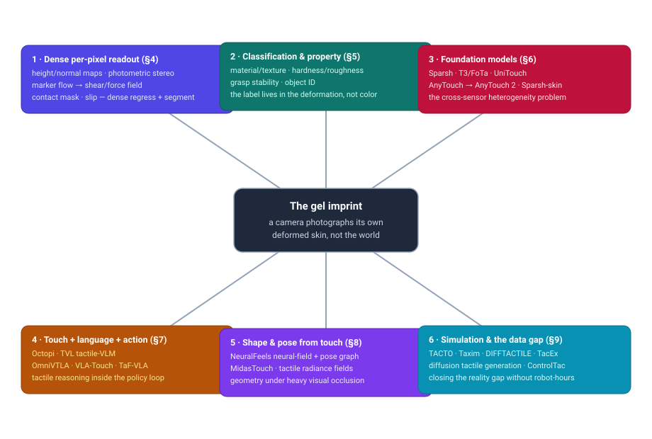
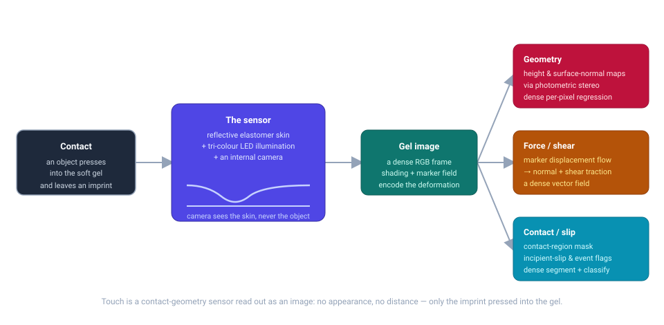
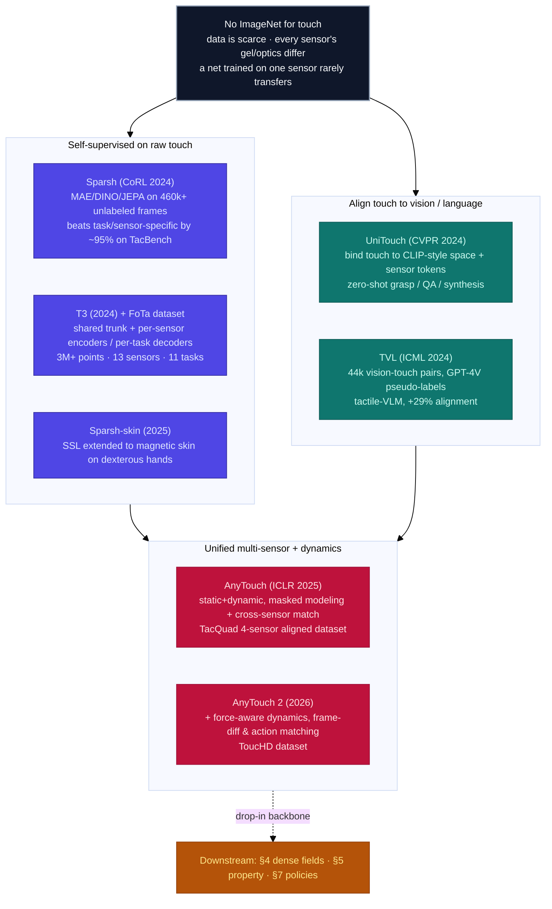

# Dense Object Detection & Classification — Recent Advances

*Compiled 2026-Aug-04 (America/Los_Angeles).*

Next installment in the running CV-updates log. Earlier entries on
`main`:
[Apr-30](../2026-Apr-30/2026-Apr-30_CV_updates.md),
[May-01](../2026-May-01/2026-May-01_CV_updates.md),
[May-02](../2026-May-02/2026-May-02_CV_updates.md),
[May-04](../2026-May-04/2026-May-04_CV_updates.md),
[May-05](../2026-May-05/2026-May-05_CV_updates.md),
[May-07](../2026-May-07/2026-May-07_CV_updates.md),
[May-08](../2026-May-08/2026-May-08_CV_updates.md),
[May-15](../2026-May-15/2026-May-15_CV_updates.md),
[May-16](../2026-May-16/2026-May-16_CV_updates.md),
[May-17](../2026-May-17/2026-May-17_CV_updates.md),
[Jun-09](../2026-Jun-09/2026-Jun-09_CV_updates.md),
[Jun-10](../2026-Jun-10/2026-Jun-10_CV_updates.md),
[Jun-12](../2026-Jun-12/2026-Jun-12_CV_updates.md),
[Jun-15](../2026-Jun-15/2026-Jun-15_CV_updates.md),
[Jun-16](../2026-Jun-16/2026-Jun-16_CV_updates.md),
[Jun-17](../2026-Jun-17/2026-Jun-17_CV_updates.md),
[Jun-19](../2026-Jun-19/2026-Jun-19_CV_updates.md),
[Jun-21](../2026-Jun-21/2026-Jun-21_CV_updates.md),
[Jun-22](../2026-Jun-22/2026-Jun-22_CV_updates.md),
[Jun-23](../2026-Jun-23/2026-Jun-23_CV_updates.md),
[Jun-24](../2026-Jun-24/2026-Jun-24_CV_updates.md),
[Jun-25](../2026-Jun-25/2026-Jun-25_CV_updates.md),
[Jun-27](../2026-Jun-27/2026-Jun-27_CV_updates.md),
[Jun-29](../2026-Jun-29/2026-Jun-29_CV_updates.md),
[Jun-30](../2026-Jun-30/2026-Jun-30_CV_updates.md),
[Jul-04](../2026-Jul-04/2026-Jul-04_CV_updates.md),
[Jul-07](../2026-Jul-07/2026-Jul-07_CV_updates.md),
[Jul-08](../2026-Jul-08/2026-Jul-08_CV_updates.md),
[Jul-10](../2026-Jul-10/2026-Jul-10_CV_updates.md),
[Jul-15](../2026-Jul-15/2026-Jul-15_CV_updates.md),
[Jul-17](../2026-Jul-17/2026-Jul-17_CV_updates.md),
[Jul-18](../2026-Jul-18/2026-Jul-18_CV_updates.md),
[Jul-21](../2026-Jul-21/2026-Jul-21_CV_updates.md),
[Jul-22](../2026-Jul-22/2026-Jul-22_CV_updates.md),
[Jul-24](../2026-Jul-24/2026-Jul-24_CV_updates.md),
[Jul-26](../2026-Jul-26/2026-Jul-26_CV_updates.md),
[Jul-27](../2026-Jul-27/2026-Jul-27_CV_updates.md),
[Jul-30](../2026-Jul-30/2026-Jul-30_CV_updates.md),
[Aug-01](../2026-Aug-01/2026-Aug-01_CV_updates.md),
[Aug-02](../2026-Aug-02/2026-Aug-02_CV_updates.md).

## Table of contents

1. [Why this pass: vision-based touch as its own primitive](#why)
2. [Topic map](#map)
3. [The primitive — the camera that photographs its own skin](#primitive)
4. [Dense per-pixel readout: geometry, force, contact and slip](#dense)
5. [Classification: material, texture, property, grasp stability](#classification)
6. [Foundation models and the cross-sensor problem](#foundation)
7. [Touch + language + action: reasoning and VLA](#tla)
8. [Shape and pose from touch: 3D reconstruction and in-hand tracking](#shape)
9. [The data problem: simulation and sim-to-real](#sim)
10. [Through-line and open problems](#throughline)
11. [Sources](#sources)

---

## 1. Why this pass: vision-based touch as its own primitive

Every prior entry in this log has been an *imaging* modality — light, sound,
microwaves, radiance from the sky, radiation through a bag. This pass steps off
that axis entirely. A **vision-based tactile sensor (VBTS)** — GelSight, DIGIT,
GelSlim, TacTip and their descendants — is a camera, but it never points at the
world. It points at the *inside of its own soft skin*. A clear elastomer pad is
coated with a reflective membrane and lit from within by coloured LEDs; a camera
sitting behind the gel watches how the membrane deforms when the sensor is
pressed against something. The output is an ordinary RGB video stream, so the
whole toolbox of dense computer vision applies — but what that stream *encodes*
is not appearance or distance. It is **contact geometry and contact force**,
sampled at the resolution of the camera.

That inversion is why touch belongs in a dense-detection log on its own terms.
The signal is dense by construction: every pixel reports a local surface height,
a local shading gradient, or a local marker displacement, and the useful outputs
are all dense maps over the contact patch — a **height/normal field** (surface
geometry via photometric stereo), a **traction field** (normal and shear force
from marker flow), a **contact-region mask**, and **slip** flags. The
classification targets — material, texture, hardness, roughness, object identity,
grasp stability — are written into that deformation pattern and *nowhere else*:
they are properties vision cannot read at all. A VBTS resolves surface features
down to tens of microns, senses forces below ~10 mN, and runs at up to hundreds
of Hz ([Classification of VBTS review, 2025](https://arxiv.org/abs/2509.02478)).

The last two years turned this from a zoo of bespoke sensors and single-task
networks into something with the shape of the rest of modern vision:
**self-supervised touch foundation models** ([Sparsh](https://arxiv.org/abs/2410.24090),
[T3](https://arxiv.org/abs/2406.13640)), **touch bound into vision-language
embedding spaces** ([UniTouch](https://arxiv.org/abs/2401.18084),
[TVL](https://arxiv.org/abs/2402.13232)), **unified multi-sensor
representations** ([AnyTouch](https://arxiv.org/abs/2502.12191) →
[AnyTouch 2](https://arxiv.org/abs/2602.09617)), and **touch inside
vision-language-action policies**. The organizing tension for the whole field
is one number: touch has *no ImageNet*. Data is expensive, every sensor's gel
and optics differ, and a network trained on one DIGIT rarely transfers to
another GelSight. Almost everything below is a response to that.

## 2. Topic map

Six threads, all hanging off the same primitive — the gel imprint. §4 is the
dense per-pixel readout (geometry, force, contact/slip). §5 is classification and
property inference. §6 is the foundation-model story and the cross-sensor problem
that dominates the field. §7 is the fusion of touch with language and action. §8
is 3D shape and pose recovered from touch. §9 is the simulation-and-data problem
underneath all of it.

## 3. The primitive — the camera that photographs its own skin

A useful recent taxonomy ([*Classification of Vision-Based Tactile Sensors: A
Review*, 2025](https://arxiv.org/abs/2509.02478)) splits the hardware by *how the
deformation is made visible*:

- **Reflective-layer-based (RLB)** sensors — GelSight, DIGIT, GelSlim, Minsight —
  coat the gel with an opaque reflective membrane and light it from several
  coloured directions. Under **photometric stereo**, the per-pixel colour then
  maps to a **surface-normal field**, which integrates to a dense **height map**
  of whatever is pressing in. These sensors are inherently geometry sensors:
  the imprint of a bolt thread or a Braille dot comes out as a literal 3D relief.
- **Marker-based / morphological (MMB)** sensors — TacTip and kin — embed a grid
  of pins or dots. They give up innate depth but are exquisitely sensitive to
  **shear**: tracking marker displacement yields a dense 2D flow field that maps
  to normal and tangential **traction**, and its onset pattern reveals incipient
  **slip** before the object actually moves.

The two encodings are complementary and increasingly combined — e.g.
[StereoTacTip (2025)](https://arxiv.org/abs/2506.18040) recovers geometry from a
marker sensor using biomimetic skin-marker arrangements and stereo, and hardware
work now *designs* the gel's optics with physically-based rendering
([Nature Communications Engineering, 2025](https://www.nature.com/articles/s44172-025-00350-4)).
The essential and awkward fact for learning is **heterogeneity**: gel thickness,
membrane reflectance, LED geometry, marker layout and camera all differ per
sensor, so the same contact produces very different images on a DIGIT, a GelSight
Mini and a TacTip. A curated meta-list of the ecosystem — sensors, datasets,
simulators, learning methods — is maintained at
[Awesome-Touch](https://github.com/linchangyi1/Awesome-Touch).

The point to carry forward: **touch is a contact-geometry-and-force sensor read
out as an image.** No appearance, no distance, no illumination of the scene —
only the imprint pressed into the gel. Every task below is decoding that imprint.

## 4. Dense per-pixel readout: geometry, force, contact and slip

These are the tactile analogues of dense prediction, and they are the tasks the
foundation-model benchmarks (§6) actually score:

- **Geometry (dense regression).** Photometric stereo converts the RGB gel image
  into a per-pixel surface-normal map and, by integration, a **height map** of
  the contact. This is the workhorse output of RLB sensors and the substrate for
  shape reconstruction (§8). Recent hardware/rendering work pushes calibration
  accuracy and cross-sensor consistency of this map
  ([PBR sensor design, 2025](https://www.nature.com/articles/s44172-025-00350-4)).
- **Force and shear (dense vector field).** Marker displacement between the
  undeformed and deformed frames is a dense flow field that decodes to a normal
  + shear **traction field** over the contact patch. This is what a policy needs
  to know whether a grasp is about to fail.
- **Contact segmentation and slip (dense classification).** Which pixels are in
  contact (the **contact mask**), and whether the contact is **slipping**, are
  the two binary dense readouts that gate manipulation. Slip in particular is a
  temporal signal — the *onset* pattern of marker motion — which is why the
  newest models treat touch as video, not a single frame (§6).

The through-line of the last two years is that these were historically solved
one sensor and one task at a time, with a small CNN per sensor. **TacBench**, the
benchmark introduced with [Sparsh](https://arxiv.org/abs/2410.24090), packages
exactly these — force estimation, slip detection, pose estimation, grasp
stability, plus textile recognition and a manipulation-policy task — as the
common yardstick a *general* touch representation now has to beat.

## 5. Classification: material, texture, property, grasp stability

Where §4 regresses physical fields, §5 reads *categories and properties* off the
same imprint — and these are the labels that are genuinely tactile-only:

- **Material and texture.** The canonical real-world benchmark is
  [**Touch-and-Go**](https://arxiv.org/abs/2211.12498) (NeurIPS 2022): ~13,900
  human-collected touches across ~4,000 object instances and 20 material classes,
  paired with egocentric video — the go-to for visuo-tactile material
  classification and cross-modal learning. [**ObjectFolder
  2.0**](https://arxiv.org/abs/2204.02389) (CVPR 2022) provides 1,000 objects as
  neural implicit "object files" rendering paired visual/acoustic/tactile signals
  for sim2real material and contact tasks.
- **Physical property inference.** [**Octopi**](https://arxiv.org/abs/2405.02794)
  (RSS 2024) collects **PhysiCLeAR** — 74 everyday objects, 408 tactile videos
  from a GelSight Mini, annotated for **hardness, roughness and bumpiness** via
  press-and-rotate procedures — precisely the properties that are invisible to a
  camera. More recent work rethinks the representation with explicit **material
  priors** ([RETRO, 2025](https://arxiv.org/abs/2505.14319)).
- **Grasp stability (dense-context binary classification).** "Will this grasp
  hold?" from the contact patch is one of the oldest tactile learning tasks and a
  standard TacBench head; it is where slip and traction fields feed directly into
  a yes/no decision, and where SSL representations show their largest gains over
  from-scratch CNNs.

The lesson mirrors the rest of vision: once a strong pretrained backbone exists,
these classification heads become small, label-efficient fine-tunes rather than
bespoke networks — which is the entire argument of §6.

## 6. Foundation models and the cross-sensor problem

This is the headline of the last ~18 months. The field converged on the idea that
touch needs pretrained, transferable representations, and split into two schools
for getting them: **self-supervision on raw touch**, and **alignment of touch to
vision/language embedding spaces**. Both are ultimately fighting sensor
heterogeneity.

**Self-supervision on raw touch.**
[**Sparsh**](https://arxiv.org/abs/2410.24090) (Meta FAIR, CoRL 2024) is the
clearest statement of the thesis: train a family of touch encoders with MAE,
DINO/DINOv2 and I-JEPA on 460k+ *unlabeled* frames from DIGIT, GelSight 2017 and
GelSight Mini, then evaluate on the six-task **TacBench**. SSL pretraining beats
task- and sensor-specific end-to-end training by ~95% on average, and — a genuinely
useful finding — the *objective* matters by task type: Sparsh (DINO) wins the
physics tasks (force, pose), while Sparsh (I-JEPA) wins the semantic tasks (slip,
grasp stability, textile ID), evidence that latent-space prediction suits tactile
images. Code and weights are open ([facebookresearch/sparsh](https://github.com/facebookresearch/sparsh)).
[**Sparsh-skin (2025)**](https://arxiv.org/abs/2505.11420) carries the same recipe
to magnetic tactile *skin* over a dexterous hand, showing the approach is not
GelSight-specific.

[**T3 — Transferable Tactile Transformers**](https://arxiv.org/abs/2406.13640)
attacks heterogeneity head-on with an architecture: a **shared trunk transformer**
flanked by **sensor-specific encoders** and **task-specific decoders**, so many
(sensor, task) pairs can be co-trained. Its **FoTa** dataset aggregates open
sources into 3M+ data points across **13 sensors and 11 tasks** — the largest
unified touch corpus to date — and yields zero-shot transfer on some pairings plus
large gains on fine multi-pin insertion.

**Aligning touch to vision and language.**
[**UniTouch**](https://arxiv.org/abs/2401.18084) (*Binding Touch to Everything*,
CVPR 2024) aligns tactile embeddings to a pretrained image space already bound to
language and sound, and adds **learnable sensor-specific tokens** so a single model
absorbs heterogeneous sensors. The payoff is **zero-shot** touch: grasp-stability
prediction, touch-image QA, and touch→image synthesis with no task-specific
training. [**TVL**](https://arxiv.org/abs/2402.13232) (*A Touch, Vision, and
Language Dataset*, ICML 2024) supplies the paired data — 44k in-the-wild
vision-touch pairs (10% human-labeled, 90% GPT-4V pseudo-labeled) — and trains a
tactile-VLM that improves tri-modal alignment by +29% and out-reasons GPT-4V on a
touch-understanding benchmark.

**Unifying static + dynamic across sensors.**
[**AnyTouch**](https://arxiv.org/abs/2502.12191) (ICLR 2025) combines pixel-level
masked modeling with semantic multi-modal alignment and **cross-sensor matching**,
learning sensor-agnostic features, and releases **TacQuad**, an aligned dataset
spanning four visuo-tactile sensors.
[**AnyTouch 2 (2026)**](https://arxiv.org/abs/2602.09617) pushes into **dynamics**:
beyond masked video reconstruction it adds frame-difference reconstruction for
temporal deformation, action matching, and **temporal force prediction** from
large-scale touch-force pairs, with the **ToucHD** dataset spanning tactile atomic
actions, real manipulations and touch-force data — explicitly a *force-aware,
dynamic* general representation. Interoperability is now enough of a concern that
there are dedicated benchmarks for **lossless/lossy tactile codecs** across five
datasets ([TaCo, 2026](https://arxiv.org/abs/2602.09893)).

## 7. Touch + language + action: reasoning and VLA

With representations in hand, 2025–2026 work pushes touch into the two most active
frontiers of embodied AI: language reasoning and action policies.

- **Tactile reasoning with LLMs.** [**Octopi**](https://arxiv.org/abs/2405.02794)
  (RSS 2024) couples a tactile encoder to a vision-language model so it can predict
  intermediate physical properties (hardness/roughness/bumpiness) from touch videos
  and then *reason* over them — zero-shot — to resolve manipulation scenarios
  ("which of these is the ripe fruit?") that vision alone cannot settle. The
  [TVL](https://arxiv.org/abs/2402.13232) tactile-VLM (§6) is the other main
  instance of touch-as-language.
- **Tactile inside vision-language-action (VLA) policies.** The clear 2025→2026
  trend is injecting touch into the generalist manipulation policy loop.
  [**OmniVTLA (2025)**](https://arxiv.org/abs/2508.08706) adds semantically-aligned
  tactile sensing to a vision-tactile-language-action model;
  [**VLA-Touch (2025)**](https://arxiv.org/abs/2507.17294) enhances a VLA with
  dual-level tactile feedback without retraining the base model; and
  [**TaF-VLA (2026)**](https://arxiv.org/abs/2601.20321) aligns tactile *force* into
  the VLA for force-aware manipulation. The common motivation is that contact-rich,
  visually-occluded steps (insertion, cable routing, in-hand reorientation) are
  exactly where vision-only policies fail and where the dense force/slip fields of
  §4 carry the decisive signal.

## 8. Shape and pose from touch: 3D reconstruction and in-hand tracking

Touch is a local sensor, so recovering *global* object geometry means
accumulating many local imprints over time — a filtering / mapping problem that
looks a lot like SLAM.

- [**NeuralFeels**](https://arxiv.org/abs/2312.13469) (*neural feels with neural
  fields*, **Science Robotics 2024**) is the standout: during in-hand manipulation
  it learns an object's geometry **online as a neural field** (an instant-NGP model)
  while jointly tracking pose via a pose-graph optimization, fusing a wrist camera
  with finger-mounted DIGITs. It reaches ~81% reconstruction F-score and 4.7 mm
  average pose drift (2.3 mm with a known CAD model), and — the headline —
  **up to 94% better tracking than vision-only under heavy occlusion**, exactly the
  regime where the hand hides the object. It ships the **FeelSight** evaluation set
  (70 experiments).
- [**MidasTouch**](https://arxiv.org/abs/2210.14210) (CoRL 2022) is the tactile-only
  precursor: Monte-Carlo particle filtering of pose over a distribution as the sensor
  slides across a surface, and the origin of the widely-used **YCB-Slide** dataset
  (DIGIT slides over 10 YCB objects with poses, meshes, heightmaps and contact masks).
- **Fusing touch into radiance/geometry fields.**
  [**Tactile-Augmented Radiance Fields**](https://arxiv.org/abs/2405.04534)
  (CVPR 2024) registers touch into a scene-level neural radiance representation, so a
  contact patch can be predicted anywhere in a captured scene — the visuo-tactile
  analogue of a NeRF. Diffusion-based reconstruction from sparse touches is an active
  2025–2026 direction (see §9).

## 9. The data problem: simulation and sim-to-real

Because collecting real touch means running a robot against physical objects for
thousands of hours, simulation is not optional — and closing the resulting reality
gap is a research area in its own right.

- **Physics/optical simulators.**
  [**TACTO**](https://arxiv.org/abs/2012.08456) (RA-L 2022) renders DIGIT/OmniTact
  images at hundreds of FPS in a rigid-body engine.
  [**Taxim**](https://arxiv.org/abs/2109.04027) (RA-L 2022) is an *example-based*
  GelSight model: a calibrated polynomial look-up maps deformed geometry to pixel
  intensity, plus a linear-elastic marker-motion model.
  [**DIFFTACTILE**](https://openreview.net/forum?id=eJHnSg783t) (ICLR 2024) is a
  fully **differentiable**, physics-based simulator supporting varied object
  materials for contact-rich manipulation. Newer entrants push into modern engines
  and speed: [**TacEx (2024)**](https://arxiv.org/abs/2411.04776) brings GelSight
  simulation into Isaac Sim, and [**FOTS (2024)**](https://arxiv.org/abs/2404.19217)
  is a fast optical tactile simulator aimed at sim2real motor-skill learning.
- **Bridging the reality gap with generative models.** Rather than model optics
  physically, a growing line *learns* the sim→real mapping.
  [**Contact-condition-guided diffusion (2024)**](https://arxiv.org/abs/2412.01639)
  generates realistic tactile images conditioned on contact; and
  [**ControlTac (2025)**](https://arxiv.org/abs/2505.20498) does force- and
  position-controlled tactile data augmentation from a *single* reference image —
  attacking the data-scarcity problem directly.
- **Multisensory datasets** such as [ObjectFolder 2.0](https://arxiv.org/abs/2204.02389)
  double as sim2real testbeds (object-scale estimation, contact localization, shape
  reconstruction transferring from virtual to real objects).

## 10. Through-line and open problems

**The through-line.** Vision-based touch spent a decade as a fragmented collection
of bespoke sensors and single-task CNNs. In the last two years it acquired the same
scaffolding as the rest of vision — self-supervised foundation models
([Sparsh](https://arxiv.org/abs/2410.24090), [T3](https://arxiv.org/abs/2406.13640)),
binding into multimodal embedding spaces
([UniTouch](https://arxiv.org/abs/2401.18084), [TVL](https://arxiv.org/abs/2402.13232)),
unified multi-sensor and now *dynamic, force-aware* representations
([AnyTouch](https://arxiv.org/abs/2502.12191) →
[AnyTouch 2](https://arxiv.org/abs/2602.09617)), and integration into
language-reasoning and VLA policies (§7). Underneath, the tasks stay resolutely
dense: height and normal maps, traction fields, contact masks, slip — decode the
imprint. Every headline advance is, in the end, a better answer to the same
question: **how do you get a transferable representation when there is no ImageNet
for touch and no two sensors agree?**

**Open problems.**

1. **Cross-sensor generalization is still the tax on everything.** Sensor tokens
   (UniTouch), shared-trunk architectures (T3) and cross-sensor matching (AnyTouch)
   mitigate but do not dissolve it; a truly sensor-agnostic backbone that a new gel
   can plug into zero-shot does not yet exist. TaCo-style interoperability
   benchmarks are early acknowledgment of the problem.
2. **Dynamics and force, not just static frames.** AnyTouch 2's force-aware,
   video-native turn signals that the field has noticed static frame benchmarks
   under-serve the real use (slip onset, in-hand dynamics). Temporal touch is
   under-benchmarked relative to how much it matters.
3. **Scale and label scarcity.** FoTa's 3M points is large for touch and tiny for
   vision. Generative augmentation (ControlTac, contact-guided diffusion) and
   better simulators (DIFFTACTILE, TacEx, FOTS) are the pragmatic bet, but the
   sim-to-real gap on *forces* (not just images) remains open.
4. **Evaluation.** TacBench and TacQuad are real progress toward a common yardstick,
   but coverage is thin next to image benchmarks, and there is no agreed protocol
   for the shape/pose (§8) or VLA-integrated (§7) settings.
5. **Full-hand and skin-scale touch.** Single-fingertip VBTS dominates the
   literature; scaling dense touch to whole-hand magnetic skin
   ([Sparsh-skin](https://arxiv.org/abs/2505.11420)) and to many contacts at once is
   only beginning.

## 11. Sources

**The primitive & sensor landscape (§3)**
- Classification of Vision-Based Tactile Sensors: A Review — 2025: [arXiv 2509.02478](https://arxiv.org/abs/2509.02478)
- StereoTacTip: biomimetic skin-marker VBTS — 2025: [arXiv 2506.18040](https://arxiv.org/abs/2506.18040)
- VBTS design via physically-based rendering — *Nature Comms. Eng.* 2025: [s44172-025-00350-4](https://www.nature.com/articles/s44172-025-00350-4)
- Awesome-Touch (ecosystem meta-list): [github.com/linchangyi1/Awesome-Touch](https://github.com/linchangyi1/Awesome-Touch)

**Dense readout & benchmarks (§§4–5)**
- Touch-and-Go dataset — NeurIPS 2022: [arXiv 2211.12498](https://arxiv.org/abs/2211.12498)
- ObjectFolder 2.0 — CVPR 2022: [arXiv 2204.02389](https://arxiv.org/abs/2204.02389)
- Octopi (PhysiCLeAR, property reasoning) — RSS 2024: [arXiv 2405.02794](https://arxiv.org/abs/2405.02794)
- RETRO: tactile representation with material priors — 2025: [arXiv 2505.14319](https://arxiv.org/abs/2505.14319)

**Foundation models & cross-sensor (§6)**
- Sparsh — CoRL 2024: [arXiv 2410.24090](https://arxiv.org/abs/2410.24090) · [facebookresearch/sparsh](https://github.com/facebookresearch/sparsh)
- Sparsh-skin (dexterous-hand skin) — 2025: [arXiv 2505.11420](https://arxiv.org/abs/2505.11420)
- T3: Transferable Tactile Transformers + FoTa — 2024: [arXiv 2406.13640](https://arxiv.org/abs/2406.13640)
- UniTouch (*Binding Touch to Everything*) — CVPR 2024: [arXiv 2401.18084](https://arxiv.org/abs/2401.18084)
- TVL (*Touch, Vision, and Language*) — ICML 2024: [arXiv 2402.13232](https://arxiv.org/abs/2402.13232)
- AnyTouch — ICLR 2025: [arXiv 2502.12191](https://arxiv.org/abs/2502.12191)
- AnyTouch 2 (dynamic, force-aware) — 2026: [arXiv 2602.09617](https://arxiv.org/abs/2602.09617)
- TaCo: tactile codec benchmark — 2026: [arXiv 2602.09893](https://arxiv.org/abs/2602.09893)

**Touch + language + action (§7)**
- OmniVTLA — 2025: [arXiv 2508.08706](https://arxiv.org/abs/2508.08706)
- VLA-Touch (dual-level tactile feedback) — 2025: [arXiv 2507.17294](https://arxiv.org/abs/2507.17294)
- TaF-VLA (tactile-force alignment) — 2026: [arXiv 2601.20321](https://arxiv.org/abs/2601.20321)

**Shape & pose from touch (§8)**
- NeuralFeels — *Science Robotics* 2024: [DOI 10.1126/scirobotics.adl0628](https://www.science.org/doi/10.1126/scirobotics.adl0628) · preprint [arXiv 2312.13469](https://arxiv.org/abs/2312.13469)
- MidasTouch (+ YCB-Slide) — CoRL 2022: [arXiv 2210.14210](https://arxiv.org/abs/2210.14210)
- Tactile-Augmented Radiance Fields — CVPR 2024: [arXiv 2405.04534](https://arxiv.org/abs/2405.04534)

**Simulation & sim-to-real (§9)**
- TACTO — RA-L 2022: [arXiv 2012.08456](https://arxiv.org/abs/2012.08456)
- Taxim — RA-L 2022: [arXiv 2109.04027](https://arxiv.org/abs/2109.04027)
- DIFFTACTILE (differentiable) — ICLR 2024: [OpenReview eJHnSg783t](https://openreview.net/forum?id=eJHnSg783t)
- TacEx (GelSight in Isaac Sim) — 2024: [arXiv 2411.04776](https://arxiv.org/abs/2411.04776)
- FOTS (fast optical tactile simulator) — 2024: [arXiv 2404.19217](https://arxiv.org/abs/2404.19217)
- Contact-condition-guided diffusion tactile generation — 2024: [arXiv 2412.01639](https://arxiv.org/abs/2412.01639)
- ControlTac (single-image tactile augmentation) — 2025: [arXiv 2505.20498](https://arxiv.org/abs/2505.20498)

*Compiled automatically as part of the CV-updates routine. Corrections and additions
welcome via PR against `main`.*
