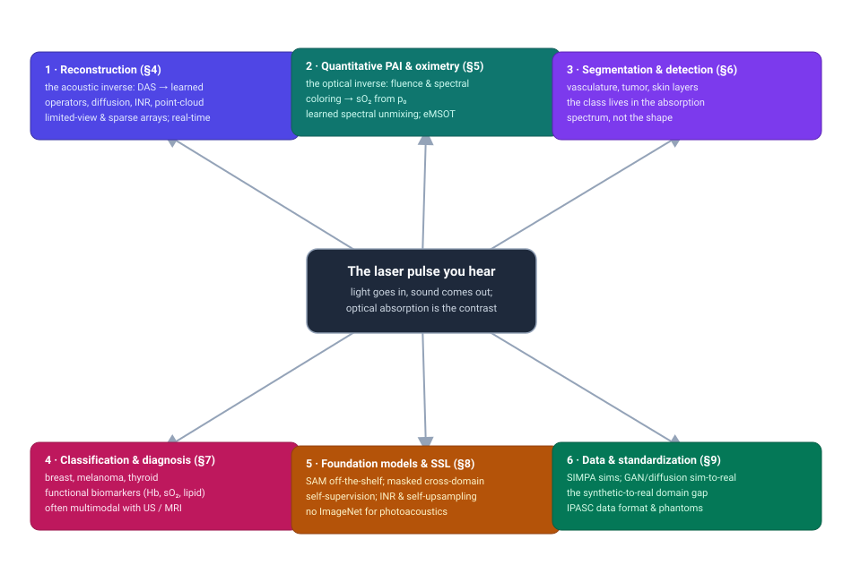
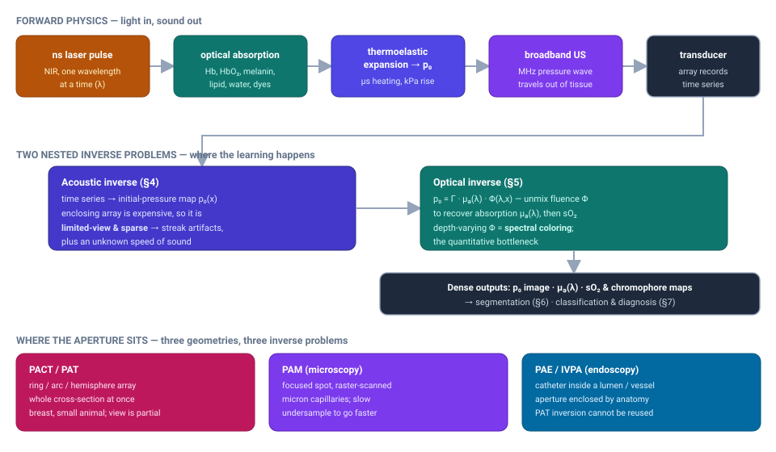

# Dense Object Detection & Classification — Recent Advances

*Compiled 2026-Aug-05 (America/Los_Angeles).*

Next installment in the running CV-updates log. Earlier entries on
`main`:
[Apr-30](../2026-Apr-30/2026-Apr-30_CV_updates.md),
[May-01](../2026-May-01/2026-May-01_CV_updates.md),
[May-02](../2026-May-02/2026-May-02_CV_updates.md),
[May-04](../2026-May-04/2026-May-04_CV_updates.md),
[May-05](../2026-May-05/2026-May-05_CV_updates.md),
[May-07](../2026-May-07/2026-May-07_CV_updates.md),
[May-08](../2026-May-08/2026-May-08_CV_updates.md),
[May-15](../2026-May-15/2026-May-15_CV_updates.md),
[May-16](../2026-May-16/2026-May-16_CV_updates.md),
[May-17](../2026-May-17/2026-May-17_CV_updates.md),
[Jun-09](../2026-Jun-09/2026-Jun-09_CV_updates.md),
[Jun-10](../2026-Jun-10/2026-Jun-10_CV_updates.md),
[Jun-12](../2026-Jun-12/2026-Jun-12_CV_updates.md),
[Jun-15](../2026-Jun-15/2026-Jun-15_CV_updates.md),
[Jun-16](../2026-Jun-16/2026-Jun-16_CV_updates.md),
[Jun-17](../2026-Jun-17/2026-Jun-17_CV_updates.md),
[Jun-19](../2026-Jun-19/2026-Jun-19_CV_updates.md),
[Jun-21](../2026-Jun-21/2026-Jun-21_CV_updates.md),
[Jun-22](../2026-Jun-22/2026-Jun-22_CV_updates.md),
[Jun-23](../2026-Jun-23/2026-Jun-23_CV_updates.md),
[Jun-24](../2026-Jun-24/2026-Jun-24_CV_updates.md),
[Jun-25](../2026-Jun-25/2026-Jun-25_CV_updates.md),
[Jun-27](../2026-Jun-27/2026-Jun-27_CV_updates.md),
[Jun-29](../2026-Jun-29/2026-Jun-29_CV_updates.md),
[Jun-30](../2026-Jun-30/2026-Jun-30_CV_updates.md),
[Jul-04](../2026-Jul-04/2026-Jul-04_CV_updates.md),
[Jul-07](../2026-Jul-07/2026-Jul-07_CV_updates.md),
[Jul-08](../2026-Jul-08/2026-Jul-08_CV_updates.md),
[Jul-10](../2026-Jul-10/2026-Jul-10_CV_updates.md),
[Jul-15](../2026-Jul-15/2026-Jul-15_CV_updates.md),
[Jul-17](../2026-Jul-17/2026-Jul-17_CV_updates.md),
[Jul-18](../2026-Jul-18/2026-Jul-18_CV_updates.md),
[Jul-21](../2026-Jul-21/2026-Jul-21_CV_updates.md),
[Jul-22](../2026-Jul-22/2026-Jul-22_CV_updates.md),
[Jul-24](../2026-Jul-24/2026-Jul-24_CV_updates.md),
[Jul-26](../2026-Jul-26/2026-Jul-26_CV_updates.md),
[Jul-27](../2026-Jul-27/2026-Jul-27_CV_updates.md),
[Jul-30](../2026-Jul-30/2026-Jul-30_CV_updates.md),
[Aug-01](../2026-Aug-01/2026-Aug-01_CV_updates.md),
[Aug-02](../2026-Aug-02/2026-Aug-02_CV_updates.md),
[Aug-04](../2026-Aug-04/2026-Aug-04_CV_updates.md).

## Table of contents

1. [Why this pass: light-in, sound-out as its own primitive](#why)
2. [Topic map](#map)
3. [The primitive — the laser pulse you hear](#primitive)
4. [Reconstruction: from delay-and-sum to learned operators](#recon)
5. [Quantitative PAI: the fluence problem and oximetry](#quant)
6. [Dense segmentation and vessel/lesion detection](#seg)
7. [Classification and diagnosis](#class)
8. [Foundation models and self-supervision](#foundation)
9. [The data problem: simulation, synthetic-to-real, standardization](#data)
10. [Through-line and open problems](#throughline)
11. [Sources](#sources)

---

## 1. Why this pass: light-in, sound-out as its own primitive

Every optical modality in this log so far has measured light that *came back
out* of the scene — reflectance, fluorescence, interferometric echo. **Photoacoustic
imaging (PAI)**, also called **optoacoustic imaging**, breaks that pattern. A
nanosecond laser pulse goes *in*; what comes *out* and is measured is **sound**.
Tissue chromophores absorb the light, heat by a few millikelvin, expand
thermoelastically, and launch a broadband megahertz ultrasound wave that an
ordinary transducer array records. The image is reconstructed from that acoustic
wave, but its **contrast is optical**: the brightness of a voxel is set by how
strongly the tissue there *absorbs light* at the illumination wavelength
([clinical translation review, *Nat. Rev. Bioeng.* 2024](https://www.nature.com/articles/s44222-024-00240-y);
[deep-tissue PA with light and sound, *npj Imaging* 2024](https://www.nature.com/articles/s44303-024-00048-w)).

That cross-over is exactly why PAI is its own dense-detection and classification
primitive and not a footnote to the ultrasound pass ([Jul-18](../2026-Jul-18/2026-Jul-18_CV_updates.md)),
the PET pass ([Aug-01](../2026-Aug-01/2026-Aug-01_CV_updates.md)), or the OCT
pass ([Jul-24](../2026-Jul-24/2026-Jul-24_CV_updates.md)). Ultrasound images the
*mechanical* echo; PAI reuses the same transducers but images *optical absorption*,
so it sees hemoglobin, melanin, lipid, and injected dyes that pulse-echo cannot.
It couples the **molecular contrast of light** to the **penetration and resolution
of sound**, reaching centimeters deep at resolutions optical imaging loses within a
millimeter ([*Vis. Comput. Ind. Biomed. Art* review 2025](https://link.springer.com/article/10.1186/s42492-025-00213-x)).

The dense-vision consequence is a chain of **two nested inverse problems**, and
almost every recent paper attacks one of them. First an **acoustic** inverse:
turn the recorded pressure time-series back into a spatial map of initial pressure
`p₀`. Then an **optical** inverse: `p₀ = Γ · μₐ(λ) · Φ(λ,x)` — the map is the
absorption coefficient `μₐ` only after you divide out the unknown, depth-varying
light fluence `Φ` and the Grüneisen parameter `Γ`. Both are ill-posed. The array
almost never surrounds the tissue, so the acoustic problem is **limited-view and
sparse**; the fluence is wavelength-dependent, so the optical problem suffers
**spectral coloring**. The class label a clinician wants — malignant vs benign,
oxygenated vs hypoxic — is written in the *spectrum* recovered at the end of that
chain, "and nowhere else." The 2024–2026 turn is that generative foundation models
and self-supervised learning have started reshaping both inverses at once
([review 2025](https://link.springer.com/article/10.1186/s42492-025-00213-x)).

## 2. Topic map

Six threads hang off one primitive — the laser pulse you hear. §4 is the acoustic
inverse (reconstruction). §5 is the optical inverse (quantitative oximetry). §6 and
§7 are the dense downstream tasks — segmentation/detection and
classification/diagnosis — that run on the recovered maps. §8 is the
foundation-model and self-supervision story. §9 is the simulation-and-data problem
underneath everything.

## 3. The primitive — the laser pulse you hear

Three facts about this primitive set up everything downstream.

**The signal is generated by absorption, not scattering.** Because `p₀ ∝ μₐ`, the
strong native absorbers — oxy- and deoxy-hemoglobin, melanin, lipid, water — become
endogenous, label-free contrast, and injected agents (ICG, methylene blue,
nanoparticles) add exogenous channels. Illuminating at several wavelengths and
unmixing the spectra yields functional maps such as blood **oxygen saturation
(sO₂)**, which is why PAI is pitched as a window on tumor hypoxia, inflammation,
and vascular disease rather than just structure
([in-vivo human imaging perspective](https://www.sciencedirect.com/science/article/pii/S2667325823000298)).

**The geometry decides the inverse problem.** The field runs in three flavors,
and a network trained for one does not transfer to another
([review 2025](https://link.springer.com/article/10.1186/s42492-025-00213-x)):
**PACT/PAT** (photoacoustic computed tomography) uses a ring, arc, or hemispherical
array to reconstruct a whole cross-section, but the array only partially surrounds
the tissue, so the reconstruction is limited-view; **PAM** (photoacoustic
microscopy) focuses a spot and raster-scans it for micron-scale capillary imaging,
so speed is bought by *undersampling*; **PAE/IVPA** (photoacoustic endoscopy /
intravascular PA) puts the aperture *inside* a lumen or vessel, so — as in the
[endoscopy pass](../2026-Jul-26/2026-Jul-26_CV_updates.md) — the aperture is
enclosed by anatomy and PAT inversions cannot be reused.

**Both inverses are ill-posed and under-supplied with ground truth.** Sparse and
limited-view sampling produce streak artifacts; the speed of sound is unknown and
spatially varying, blurring and mispositioning structures
([artifacts: origins and mitigations, 2025](https://arxiv.org/abs/2504.12772));
and there is no way to obtain a real `μₐ` map inside a living human to supervise
the optical inverse. That triad — ill-posed acoustics, ill-posed optics, and no
in-vivo labels — is the reason simulation, self-supervision, and generative priors
dominate the recent literature.

## 4. Reconstruction: from delay-and-sum to learned operators

The classical acoustic inverse is analytic — delay-and-sum (DAS), universal
back-projection, or time reversal — and it is fast but fragile: under sparse,
limited-view arrays it produces streaks and negativity artifacts. Deep learning
entered along three well-known routes, and the 2024–2026 work has added two more.

```mermaid
flowchart TD
    raw["Raw channel data<br/>(pressure time-series)"]:::src
    raw --> an["Analytic inverse<br/>DAS · back-projection · time reversal"]:::analytic
    an --> post["Route 1 · Post-processing DL<br/>CNN / U-Net cleans artifacts"]:::classical
    raw --> direct["Route 2 · Direct DL<br/>data &#8594; image"]:::classical
    raw --> mb["Route 3 · Model-based iterative"]:::classical
    mb --> lpd["learned primal-dual · model-corrected"]:::classical
    post --> gen["Route 4 · Generative &amp; self-supervised priors<br/>score/diffusion · INR · sparse transformers"]:::gen
    direct --> gen
    lpd --> gen
    gen --> scale["Route 5 · Real-time &amp; 3D at scale<br/>DeepMB · neural operators · SlingBAG point-cloud"]:::op
    classDef src fill:#1e293b,stroke:#94a3b8,color:#f8fafc;
    classDef analytic fill:#475569,stroke:#334155,color:#ffffff;
    classDef classical fill:#4f46e5,stroke:#3730a3,color:#ffffff;
    classDef gen fill:#0f766e,stroke:#115e59,color:#ffffff;
    classDef op fill:#7c3aed,stroke:#5b21b6,color:#ffffff;
```

**The three classical routes.** *Post-processing DL* reconstructs a rough image
analytically and trains a CNN (classically a fully-dense U-Net) to clean the
artifacts ([Fully-Dense U-Net for sparse PAT](https://pubmed.ncbi.nlm.nih.gov/31021809/));
*direct DL* maps raw channel data straight to an image; and *model-based / learned
iterative* methods unroll an optimization and learn its operators. The most
principled member of that last family is the **model-corrected learned
primal-dual**, which jointly learns a correction to an *approximate* (fast)
forward model alongside the image-space updates, and extends to a deep-equilibrium
form with fixed-point convergence and lower training memory
([Hauptmann & Poimala, 2023/24](https://arxiv.org/abs/2304.01963)). Model-based DL
also targets cheap hardware directly — e.g. **model-informed reconstruction for
low-element linear arrays** to keep image quality while cutting transducer count
([2025](https://pmc.ncbi.nlm.nih.gov/articles/PMC12152870/)).

**Route four — generative priors.** Instead of learning the inverse map, learn a
*prior over plausible images* and use it to regularize. **Score-based diffusion
models** trained on simulated vessel structures reconstruct PAT from very limited
measurements and, importantly, stay robust across transducer-sparsity levels
without retraining ([Caltech, ICASSP 2024](https://arxiv.org/abs/2404.00471)).
Pushing to the extreme, a **sinogram-domain prior-guided enhanced diffusion**
method does ultra-sparse-view PAT; diffusion approaches of this kind have been
reported to reconstruct from as few as ~32 projections with SSIM/PSNR gains of
~0.65 / ~5.1 dB over conventional methods
([*Photoacoustics* 2025](https://pubmed.ncbi.nlm.nih.gov/39687486/);
[review 2025](https://link.springer.com/article/10.1186/s42492-025-00213-x)).
A different, training-set-free take treats the image as an **implicit neural
representation** — a coordinate MLP with Fourier features fit *per scan* — for
high-quality limited-view reconstruction with no external ground truth
([*Photoacoustics* 2025](https://www.sciencedirect.com/science/article/pii/S2213597925000047)).
The same year brought a wave of **transformer artifact reducers**: a
**Residual-Conditioned Sparse Transformer** that suppresses sparse-sampling
artifacts while preserving fine structure
([*Photoacoustics* 2025](https://www.sciencedirect.com/science/article/pii/S2213597925000540)),
and an attention-driven conditional GAN for ring-array image restoration
([2025](https://pmc.ncbi.nlm.nih.gov/articles/PMC12008638/)).

**Route five — operators and points, for real-time and 3D scale.** Two problems
resist post-hoc cleanup: latency and 3D memory. **DeepMB** answers the first by
expressing model-based reconstruction as a network that returns a near-identical
image in ~31 ms — ~1000× faster than the iterative reference — with a
**user-adjustable speed of sound**, trained on signals synthesized from real
images so it generalizes to experimental data
([*Nat. Mach. Intell.* 2023](https://www.nature.com/articles/s42256-023-00724-3)).
**Physics-aware neural operators** learn a physics-constrained inverse *operator*
for 3D PACT, cutting the dense-array and long-scan requirements
([2025](https://arxiv.org/abs/2509.09894)), extending the older operator-learning
answer to the limited-view extension problem
([2017](https://arxiv.org/abs/1705.02698)). And **SlingBAG** ("sliding Gaussian
ball adaptive growth") sidesteps voxel memory entirely by modeling the 3D scene as
an adaptive **point cloud of Gaussian sources** that split, duplicate, and prune
during iteration — echoing the 3D-Gaussian-splatting idea seen in the
[endoscopy geometry work](../2026-Jul-26/2026-Jul-26_CV_updates.md) — enabling
large-scale 3D reconstruction where k-Wave runs out of memory
([*Nat. Commun.* 2025](https://www.nature.com/articles/s41467-025-66855-w)), with
**SlingBAG Pro** generalizing it to arbitrary array geometries
([2026, lead — verify ID](https://arxiv.org/abs/2601.00551)). Related coordinate
methods jointly recover an **aberration-correcting speed-of-sound field**
([2024](https://arxiv.org/abs/2409.10876)) and accelerate circular-geometry
optimization/DL ([2025, verify ID](https://arxiv.org/abs/2510.24687)).

## 5. Quantitative PAI: the fluence problem and oximetry

Reconstruction gives you `p₀`. Turning `p₀` into something *quantitative* — a real
`μₐ(λ)` map, and from the wavelength dependence an sO₂ map — is the hard,
distinctively-photoacoustic problem, and the one with the biggest clinical payoff.
The obstacle is **spectral coloring**: light of different wavelengths is absorbed
and scattered differently on the way in, so the fluence `Φ(λ,x)` deep in tissue no
longer matches the surface spectrum, and a naive linear unmix of `p₀` spectra
returns the *wrong* sO₂ with depth
([oximetry review](https://www.worldscientific.com/doi/10.1142/S1793545826300065)).

Learning entered here early as **deep spectral unmixing** — networks that regress
sO₂ directly, learning to approximate the eigenspectra (eMSOT) inverse rather than
solving it analytically ([DL spectral unmixing for tissue sO₂](https://ieeexplore.ieee.org/abstract/document/9115086/authors))
— and as networks that **learn vascular sO₂ in 3D**
([*J. Biomed. Opt.* 2020](https://www.spiedigitallibrary.org/journals/Journal-of-Biomedical-Optics/volume-25/issue-08/085003/Toward-accurate-quantitative-photoacoustic-imaging--learning-vascular-blood-oxygen/10.1117/1.JBO.25.8.085003.full)).
The recent work makes the fluence estimate either unnecessary or robust. **Hybrid-Net**
jointly segments vessels *and* estimates sO₂ from spectroscopic PA data **without
explicitly estimating the optical fluence**, reporting segmentation accuracy
≥0.978 (sim) / 0.998 (exp) and sO₂ mean-squared error ≤0.048 (sim) / 0.003 (exp)
([2025, verify ID](https://arxiv.org/abs/2512.15394)). **Distribution-informed,
wavelength-flexible** data-driven oximetry trains across illumination conditions
so the model is not locked to one probe or wavelength set
([2024](https://pmc.ncbi.nlm.nih.gov/articles/PMC11151660/)), and **motion
rejection combined with spectral unmixing** improves in-vivo sO₂ under real
breathing/pulsation ([2023](https://arxiv.org/abs/2309.08223)). On the real-time
axis, a **phasor** formulation makes MSOT spectral unmixing fast and interpretable
enough for live component quantification
([*Comput. Biol. Med.* 2025](https://www.sciencedirect.com/science/article/pii/S0010482525009370)).

Because there is no ground-truth `μₐ` inside a person, quantitative PAI leans hard
on **learned iterative qPAT** (robust with limited training data) and on the
synthetic-data machinery of §9 — including **generative enhancement of synthetic
training data** ([2023](https://arxiv.org/abs/2305.04714)) and **unsupervised
domain adaptation** to close the in-silico-to-in-vivo gap for quantitative
inversion ([2025](https://pmc.ncbi.nlm.nih.gov/articles/PMC12311538/)).

## 6. Dense segmentation and vessel/lesion detection

Once `p₀` (or an sO₂ map) exists, the dense-vision tasks look familiar — segment
the vasculature, delineate a tumor, find the lesion — but the input is a
low-SNR, artifact-laden, absorption-contrast image, and again there are almost no
manual labels at 3D scale. The pragmatic answer has been **generative and
self-supervised segmentation**. The **Vessel Segmentation GAN (VAN-GAN)** trains on
*synthetic* blood-vessel networks whose statistics resemble real anatomy and learns
the imaging physics, so it segments real 3D microvasculature without paired
labels; related work does **unsupervised segmentation of 3D microvascular PA
volumes with deep generative learning**
([2024](https://www.ncbi.nlm.nih.gov/pmc/articles/PMC11348209/)). Earlier,
**sparse deep learning** was used to segment human vasculature in whole-body MSOT.

The segmentation target itself carries the classification, because the class is in
the spectrum rather than the shape. In **melanoma**, a computational framework on
multispectral PA data delineates tumor borders and depth *without human input* —
directly addressing the clinical need to plan excision margins non-invasively
([*Photoacoustics* 2025](https://www.sciencedirect.com/science/article/pii/S2213597925000667)).
This is where PAI's dense readout and its classification task fuse: the same
per-voxel absorption spectrum that draws the boundary also labels what is inside it.

## 7. Classification and diagnosis

At the image or patient level, PAI is being read as a **functional biomarker
generator**, and the clinically deepest thread is **breast imaging**. Malignant
tissue shows higher microvessel density, irregular vascular patterns, and altered
hemoglobin saturation than healthy tissue, so PA contrast complements the
morphology that ultrasound and MRI already provide. Recent reviews argue the win is
**multimodal**: PA fused with US and/or MRI raises sensitivity, specificity, and
lesion-classification accuracy, and enables treatment-response monitoring
([multimodal PA breast review, *VIEW* 2025](https://onlinelibrary.wiley.com/doi/full/10.1002/VIW.20250067);
[advances in PA breast imaging, 2025](https://pmc.ncbi.nlm.nih.gov/articles/PMC12349475/)).
On the model side the pattern has been transfer learning — comparing SVMs against
fine-tuned AlexNet/GoogLeNet-style backbones — on PA and PA-multimodal images
([feasibility study](https://ieeexplore.ieee.org/document/8586863/)), a reminder
that the classifier architectures are borrowed while the *contrast* is what makes
the task tractable.

Beyond the breast, the same functional-contrast argument drives **thyroid** work —
the gland sits in the superficial 2–3 cm reachable by PAI, where microvascular and
oxygenation contrast could help stratify nodules — and other superficial soft-tissue
masses, mostly at the preclinical-to-pilot stage
([in-vivo human imaging perspective](https://www.sciencedirect.com/science/article/pii/S2667325823000298)).
Across all of these the honest status is that classification networks are the least
photoacoustic-specific part of the pipeline; the research value is upstream, in
recovering a `μₐ`/sO₂ map trustworthy enough to classify at all.

## 8. Foundation models and self-supervision

PAI has **no ImageNet** — no large, labeled, standardized image corpus — so the
2024–2026 story is the same one seen across this log's low-data modalities: borrow a
giant, or supervise yourself. Both are happening
([review 2025](https://link.springer.com/article/10.1186/s42492-025-00213-x)).

**Borrow a giant.** Off-the-shelf vision foundation models, notably the **Segment
Anything Model**, have been applied to PA segmentation and enhancement *without*
task-specific fine-tuning, working surprisingly well on a modality they never saw
in training. Parameter-efficient adaptations then specialize them: **FM-Adapt**
turns a SAM-style ViT into a resolution-agnostic, photoacoustic-supervised
segmenter for interventional ultrasound guidance.

**Supervise yourself.** Because raw channel data is plentiful while labels are not,
self-supervision is a natural fit. A **masked cross-domain self-supervised**
framework learns to reconstruct from limited measurements without ground-truth
images by masking in both signal and image domains
([*Neural Networks* 2024](https://www.sciencedirect.com/science/article/abs/pii/S0893608024004398)).
A **self-supervised upsampling** method for PACT exploits a physical regularity —
small blocks of channel data are self-similar across downsampling rates — to
generalize enhancement without paired data
([2025](https://pubmed.ncbi.nlm.nih.gov/40658576/)). And the per-scan **implicit
neural representation** reconstructions of §4 are self-supervision in the purest
sense: the only signal is the measurement itself. The through-line is that in PAI
the "foundation model" is as likely to be a physics-derived self-supervision
signal as a pretrained transformer.

## 9. The data problem: simulation, synthetic-to-real, standardization

Underneath every section is one fact: you cannot obtain large sets of real PA images
with ground-truth `p₀`, `μₐ`, or sO₂, so the field is built on **simulation** — and
on the **domain gap** that simulation opens.

**Simulate.** [**SIMPA**](https://www.spiedigitallibrary.org/journals/journal-of-biomedical-optics/volume-27/issue-8/083010/SIMPA--an-open-source-toolkit-for-simulation-and-image/10.1117/1.JBO.27.8.083010.pdf)
is the community's open-source toolkit, chaining optical (Monte-Carlo fluence) and
acoustic (k-Wave-style) forward models plus device digital-twins into one pipeline
so researchers can generate arbitrarily large labeled datasets. A **2026
benchmarking effort** proposes open, anatomically plausible **synthetic datasets and
evaluation protocols** for DL-based acoustic inversion in PACT — a first step toward
comparability the field has lacked ([verify ID](https://arxiv.org/abs/2601.17165)) —
and **virtual imaging frameworks** with stochastic numerical **breast phantoms**
push this to realistic 3D quantitative optoacoustic tomography
([2025](https://arxiv.org/abs/2510.00189)). Community
[**open-dataset lists**](https://github.com/CbinHu/Photoacoustic-Imaging-Open-Datasets)
now track what little real annotated data exists.

**Close the gap.** Methods trained purely on simulation routinely fail on in-vivo
data. Generative translation is the standard fix: **GANs synthesize more realistic
PA images** than model-based rendering
([2022](https://pubmed.ncbi.nlm.nih.gov/36281320/)), CycleGAN-style translators
such as **SEED-Net** convert simulated images into realistic-looking ones to boost
generalization, and efficient DL image synthesis subdivides the problem into
plausible tissue morphology plus per-pixel optical/acoustic property assignment
([2023](https://www.mdpi.com/1424-8220/23/16/7085)). For the quantitative task,
**unsupervised domain adaptation** directly targets the synthetic-to-real gap
([2025](https://pmc.ncbi.nlm.nih.gov/articles/PMC12311538/)).

**Standardize.** None of this is comparable across labs without shared formats, so
the [**International Photoacoustic Standardisation Consortium (IPASC)**](https://www.ipasc.science/)
has defined a consensus **HDF5-based data format** with a metadata schema and an
open conversion API ([*Photoacoustics* 2022](https://www.sciencedirect.com/science/article/pii/S2213597922000106)),
plus consensus recommendations and a **2024 tutorial** on tissue-mimicking
**phantoms** for reproducible characterization
([2024](https://pubmed.ncbi.nlm.nih.gov/39143981/)). Standardized phantoms and data
formats are the unglamorous prerequisite for benchmarking learned reconstruction at
all.

## 10. Through-line and open problems

The recurring lesson across the threads is **put the physics in the objective, and
don't trust a natural-image prior**. The methods that generalize — model-corrected
primal-dual, DeepMB, neural operators, physics-derived self-supervision — all keep
the known forward model in the loop; the ones that reconstruct from a learned image
prior alone are the ones that hallucinate.

1. **Hallucination is the new failure mode.** Generative and direct-DL
   reconstructions can invent vessels or erase real ones, and the error is *quiet* —
   the image looks plausible. This is the central caution of the recent critical
   reviews ([concepts, promises, pitfalls, futures, 2024](https://link.springer.com/chapter/10.1007/978-3-031-61411-8_5);
   [DL in PAT: current approaches and future directions](https://www.spiedigitallibrary.org/journals/journal-of-biomedical-optics/volume-25/issue-11/112903/Deep-learning-in-photoacoustic-tomography--current-approaches-and-future/10.1117/1.JBO.25.11.112903.full)),
   and it matters more in a functional modality where the output is a number a
   clinician will act on.
2. **The invisible stays invisible.** Limited-view geometry makes some structures
   fundamentally unrecoverable; learned operators can extend the data but cannot
   manufacture missing information without risking (1)
   ([artifacts: origins & mitigations, 2025](https://arxiv.org/abs/2504.12772)).
3. **Quantitative sO₂ is not solved.** Fluence-free and learned-unmixing methods
   report excellent numbers *in simulation*; validating them against invasive
   ground truth in humans remains the field's hardest gap.
4. **Evaluation is fragmented.** With no shared benchmark until the 2025–2026
   synthetic-dataset efforts, quantitative figures across papers are not comparable
   — different phantoms, arrays, wavelengths, and operating points.
5. **Clinical translation is the real test.** PAI is moving from preclinical to
   pilot clinical studies, but the depth-vs-resolution trade-off, speed, and
   standardization gaps remain the barriers to adoption
   ([*Nat. Rev. Bioeng.* 2024](https://www.nature.com/articles/s44222-024-00240-y)).

The direction of travel is clear: reconstruction is being folded into fast,
physics-constrained operators; quantification is being made fluence-robust or
fluence-free; and the whole stack is being trained on simulation and adapted to
reality. The unit of work is rising from "clean up an artifact" to "return a
trustworthy functional map," and the open problems are all versions of the same
question — how far can a learned prior go before it starts inventing the biology it
was meant to measure.

## 11. Sources

**Primitive, reviews & clinical translation (§§1,3,10)**
- Advances in PA imaging reconstruction & quantitative analysis — *Vis. Comput. Ind. Biomed. Art* 2025: [s42492-025-00213-x](https://link.springer.com/article/10.1186/s42492-025-00213-x) · preprint [arXiv 2411.02843](https://arxiv.org/abs/2411.02843)
- Clinical translation of photoacoustic imaging — *Nat. Rev. Bioeng.* 2024: [s44222-024-00240-y](https://www.nature.com/articles/s44222-024-00240-y)
- Deep-tissue PA imaging with light and sound — *npj Imaging* 2024: [s44303-024-00048-w](https://www.nature.com/articles/s44303-024-00048-w)
- Towards in-vivo PA human imaging — *J. Innov. Opt. Health Sci.*: [S2667325823000298](https://www.sciencedirect.com/science/article/pii/S2667325823000298)
- Deep learning for biomedical PA imaging: a review — *Photoacoustics* 2021: [S2213597921000033](https://www.sciencedirect.com/science/article/pii/S2213597921000033) · [arXiv 2011.02744](https://arxiv.org/abs/2011.02744)
- Artifacts in PA imaging: origins & mitigations — 2025: [arXiv 2504.12772](https://arxiv.org/abs/2504.12772)
- DL-based PA reconstruction: concepts, promises, pitfalls, futures — 2024: [chapter 978-3-031-61411-8_5](https://link.springer.com/chapter/10.1007/978-3-031-61411-8_5)
- DL in PAT: current approaches & future directions — *JBO* 25(11): [112903](https://www.spiedigitallibrary.org/journals/journal-of-biomedical-optics/volume-25/issue-11/112903/Deep-learning-in-photoacoustic-tomography--current-approaches-and-future/10.1117/1.JBO.25.11.112903.full) · [arXiv 2009.07608](https://arxiv.org/abs/2009.07608)

**Reconstruction — the acoustic inverse (§4)**
- Model-corrected learned primal-dual (deep equilibrium) — 2023/24: [arXiv 2304.01963](https://arxiv.org/abs/2304.01963)
- Model-informed DL for low-element linear arrays — 2025: [PMC12152870](https://pmc.ncbi.nlm.nih.gov/articles/PMC12152870/)
- Score-based diffusion models for PAT — ICASSP 2024: [arXiv 2404.00471](https://arxiv.org/abs/2404.00471)
- Ultra-sparse sinogram-domain prior-guided diffusion — *Photoacoustics* 2025: [PubMed 39687486](https://pubmed.ncbi.nlm.nih.gov/39687486/) · [S2213597924000879](https://www.sciencedirect.com/science/article/pii/S2213597924000879)
- Limited-view reconstruction via self-supervised neural representation (INR) — *Photoacoustics* 2025: [S2213597925000047](https://www.sciencedirect.com/science/article/pii/S2213597925000047)
- Residual-Conditioned Sparse Transformer for artifact reduction — *Photoacoustics* 2025: [S2213597925000540](https://www.sciencedirect.com/science/article/pii/S2213597925000540)
- Attention-CGAN restoration for ring-array PAT — 2025: [PMC12008638](https://pmc.ncbi.nlm.nih.gov/articles/PMC12008638/)
- Fully-Dense U-Net for 2-D sparse PAT artifact removal: [PubMed 31021809](https://pubmed.ncbi.nlm.nih.gov/31021809/)
- DeepMB: real-time model-based reconstruction, adjustable speed of sound — *Nat. Mach. Intell.* 2023: [s42256-023-00724-3](https://www.nature.com/articles/s42256-023-00724-3) · [arXiv 2206.14485](https://arxiv.org/abs/2206.14485)
- Physics-aware neural operators for direct 3D PACT inversion — 2025: [arXiv 2509.09894](https://arxiv.org/abs/2509.09894)
- Operator-learning for the limited-view problem — 2017: [arXiv 1705.02698](https://arxiv.org/abs/1705.02698)
- SlingBAG: point-cloud / sliding-Gaussian-ball 3D reconstruction — *Nat. Commun.* 2025: [s41467-025-66855-w](https://www.nature.com/articles/s41467-025-66855-w) · preprint [arXiv 2407.11781](https://arxiv.org/abs/2407.11781)
- SlingBAG Pro (arbitrary array geometries) — 2026 *[verify ID]*: [arXiv 2601.00551](https://arxiv.org/abs/2601.00551)
- Coordinate-based speed-of-sound recovery (aberration correction) — 2024: [arXiv 2409.10876](https://arxiv.org/abs/2409.10876)
- Fast algorithms for optimization & DL in circular geometry — 2025 *[verify ID]*: [arXiv 2510.24687](https://arxiv.org/abs/2510.24687)
- PA-SFM: tracker-free freehand 3D PA/US — 2026 *[lead — verify ID]*: [arXiv 2604.09643](https://arxiv.org/abs/2604.09643)

**Quantitative PAI & oximetry — the optical inverse (§5)**
- DL spectral unmixing for tissue sO₂ (eMSOT-style) — IEEE: [9115086](https://ieeexplore.ieee.org/abstract/document/9115086/authors)
- Learning vascular sO₂ in 3D — *JBO* 2020: [085003](https://www.spiedigitallibrary.org/journals/Journal-of-Biomedical-Optics/volume-25/issue-08/085003/Toward-accurate-quantitative-photoacoustic-imaging--learning-vascular-blood-oxygen/10.1117/1.JBO.25.8.085003.full)
- Hybrid-Net: joint vessel segmentation + fluence-free sO₂ — 2025 *[verify ID]*: [arXiv 2512.15394](https://arxiv.org/abs/2512.15394)
- Distribution-informed, wavelength-flexible data-driven oximetry — 2024: [PMC11151660](https://pmc.ncbi.nlm.nih.gov/articles/PMC11151660/)
- Motion rejection + spectral unmixing for in-vivo sO₂ — 2023: [arXiv 2309.08223](https://arxiv.org/abs/2309.08223)
- Phasor analysis for real-time MSOT spectral unmixing — *Comput. Biol. Med.* 2025: [S0010482525009370](https://www.sciencedirect.com/science/article/pii/S0010482525009370)
- Enhancing synthetic training data for qPAT with generative DL — 2023: [arXiv 2305.04714](https://arxiv.org/abs/2305.04714)
- Bridging the synthetic-to-real gap in qPAT via unsupervised domain adaptation — 2025: [PMC12311538](https://pmc.ncbi.nlm.nih.gov/articles/PMC12311538/)

**Segmentation, detection, classification & diagnosis (§§6,7)**
- Unsupervised segmentation of 3D microvascular PA volumes (generative) — 2024: [PMC11348209](https://www.ncbi.nlm.nih.gov/pmc/articles/PMC11348209/)
- Non-invasive melanoma diagnostics with DL + multispectral PAI — *Photoacoustics* 2025: [S2213597925000667](https://www.sciencedirect.com/science/article/pii/S2213597925000667) · [PMC12272440](https://pmc.ncbi.nlm.nih.gov/articles/PMC12272440/)
- PA integrated multimodal imaging for breast cancer — *VIEW* 2025: [VIW.20250067](https://onlinelibrary.wiley.com/doi/full/10.1002/VIW.20250067)
- Advances in PA imaging of breast cancer — 2025: [PMC12349475](https://pmc.ncbi.nlm.nih.gov/articles/PMC12349475/)
- PA image classification & segmentation of breast cancer (feasibility) — IEEE: [8586863](https://ieeexplore.ieee.org/document/8586863/)

**Foundation models & self-supervision (§8)**
- Masked cross-domain self-supervised PACT reconstruction — *Neural Networks* 2024: [S0893608024004398](https://www.sciencedirect.com/science/article/abs/pii/S0893608024004398) · preprint [arXiv 2301.06681](https://arxiv.org/abs/2301.06681)
- Self-supervised upsampling for generalized PACT enhancement — 2025: [PubMed 40658576](https://pubmed.ncbi.nlm.nih.gov/40658576/)

**Data, simulation & standardization (§9)**
- SIMPA: open-source simulation & image-processing toolkit — *JBO* 2022: [083010](https://www.spiedigitallibrary.org/journals/journal-of-biomedical-optics/volume-27/issue-8/083010/SIMPA--an-open-source-toolkit-for-simulation-and-image/10.1117/1.JBO.27.8.083010.pdf)
- Benchmarking DL reconstruction with clinically relevant synthetic datasets — 2026 *[verify ID]*: [arXiv 2601.17165](https://arxiv.org/abs/2601.17165)
- Virtual imaging framework: stochastic numerical breast phantoms for 3D qOAT — 2025: [arXiv 2510.00189](https://arxiv.org/abs/2510.00189) · application [PMC12858365](https://pmc.ncbi.nlm.nih.gov/articles/PMC12858365/)
- PA image synthesis with GANs — 2022: [PubMed 36281320](https://pubmed.ncbi.nlm.nih.gov/36281320/)
- Efficient PA image synthesis with DL — *Sensors* 2023: [23/16/7085](https://www.mdpi.com/1424-8220/23/16/7085)
- IPASC consensus data format — *Photoacoustics* 2022: [S2213597922000106](https://www.sciencedirect.com/science/article/pii/S2213597922000106) · [PMC8917284](https://www.ncbi.nlm.nih.gov/pmc/articles/PMC8917284/) · consortium [ipasc.science](https://www.ipasc.science/)
- Tutorial on phantoms for PA imaging — 2024: [PubMed 39143981](https://pubmed.ncbi.nlm.nih.gov/39143981/)
- Community open-dataset list: [github.com/CbinHu/Photoacoustic-Imaging-Open-Datasets](https://github.com/CbinHu/Photoacoustic-Imaging-Open-Datasets)

> **Sources note.** This environment's egress policy blocks direct arXiv/publisher
> fetches, so identifiers were confirmed by title-match through web search rather
> than by opening each page. A handful of very recent 2025–2026 preprint IDs are
> flagged *[verify ID]* / *[lead]* to re-confirm on an unrestricted connection.
> Quantitative figures are author-reported and are **not** comparable across rows:
> photoacoustics still lacks a common benchmark, and results differ by phantom,
> array geometry, wavelength set, and operating point. This is a computer-vision
> reading of a clinical field, not medical advice.

*Compiled automatically as part of the CV-updates routine. Corrections and additions
welcome via PR against `main`.*
