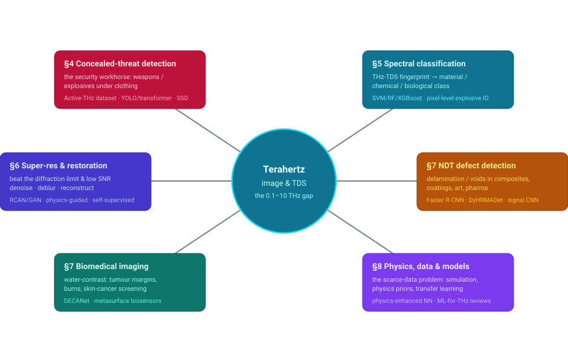
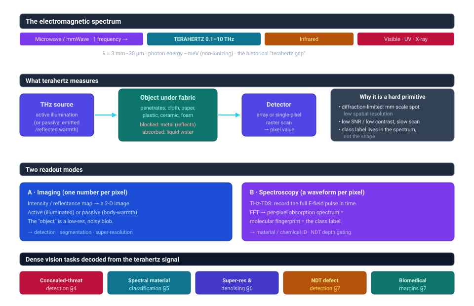
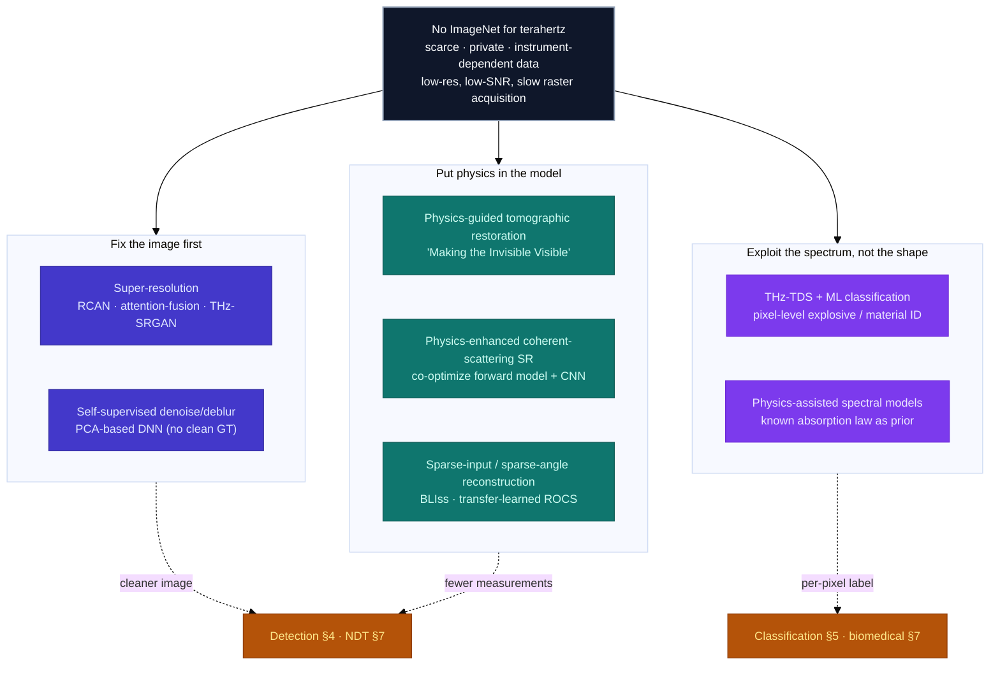

# Dense Object Detection & Classification — Recent Advances

*Compiled 2026-Aug-06 (America/Los_Angeles).*

Next installment in the running CV-updates log. Earlier entries on
`main`:
[Apr-30](../2026-Apr-30/2026-Apr-30_CV_updates.md),
[May-01](../2026-May-01/2026-May-01_CV_updates.md),
[May-02](../2026-May-02/2026-May-02_CV_updates.md),
[May-04](../2026-May-04/2026-May-04_CV_updates.md),
[May-05](../2026-May-05/2026-May-05_CV_updates.md),
[May-07](../2026-May-07/2026-May-07_CV_updates.md),
[May-08](../2026-May-08/2026-May-08_CV_updates.md),
[May-15](../2026-May-15/2026-May-15_CV_updates.md),
[May-16](../2026-May-16/2026-May-16_CV_updates.md),
[May-17](../2026-May-17/2026-May-17_CV_updates.md),
[Jun-09](../2026-Jun-09/2026-Jun-09_CV_updates.md),
[Jun-10](../2026-Jun-10/2026-Jun-10_CV_updates.md),
[Jun-12](../2026-Jun-12/2026-Jun-12_CV_updates.md),
[Jun-15](../2026-Jun-15/2026-Jun-15_CV_updates.md),
[Jun-16](../2026-Jun-16/2026-Jun-16_CV_updates.md),
[Jun-17](../2026-Jun-17/2026-Jun-17_CV_updates.md),
[Jun-19](../2026-Jun-19/2026-Jun-19_CV_updates.md),
[Jun-21](../2026-Jun-21/2026-Jun-21_CV_updates.md),
[Jun-22](../2026-Jun-22/2026-Jun-22_CV_updates.md),
[Jun-23](../2026-Jun-23/2026-Jun-23_CV_updates.md),
[Jun-24](../2026-Jun-24/2026-Jun-24_CV_updates.md),
[Jun-25](../2026-Jun-25/2026-Jun-25_CV_updates.md),
[Jun-27](../2026-Jun-27/2026-Jun-27_CV_updates.md),
[Jun-29](../2026-Jun-29/2026-Jun-29_CV_updates.md),
[Jun-30](../2026-Jun-30/2026-Jun-30_CV_updates.md),
[Jul-04](../2026-Jul-04/2026-Jul-04_CV_updates.md),
[Jul-07](../2026-Jul-07/2026-Jul-07_CV_updates.md),
[Jul-08](../2026-Jul-08/2026-Jul-08_CV_updates.md),
[Jul-10](../2026-Jul-10/2026-Jul-10_CV_updates.md),
[Jul-15](../2026-Jul-15/2026-Jul-15_CV_updates.md),
[Jul-17](../2026-Jul-17/2026-Jul-17_CV_updates.md),
[Jul-18](../2026-Jul-18/2026-Jul-18_CV_updates.md),
[Jul-21](../2026-Jul-21/2026-Jul-21_CV_updates.md),
[Jul-22](../2026-Jul-22/2026-Jul-22_CV_updates.md),
[Jul-24](../2026-Jul-24/2026-Jul-24_CV_updates.md),
[Jul-26](../2026-Jul-26/2026-Jul-26_CV_updates.md),
[Jul-27](../2026-Jul-27/2026-Jul-27_CV_updates.md),
[Jul-30](../2026-Jul-30/2026-Jul-30_CV_updates.md),
[Aug-01](../2026-Aug-01/2026-Aug-01_CV_updates.md),
[Aug-02](../2026-Aug-02/2026-Aug-02_CV_updates.md),
[Aug-04](../2026-Aug-04/2026-Aug-04_CV_updates.md).

## Table of contents

1. [Why this pass: terahertz as its own primitive](#why)
2. [Topic map](#map)
3. [The primitive — the imaging that sees through the opaque](#primitive)
4. [Concealed-threat detection: the security workhorse](#security)
5. [Spectral classification: the fingerprint is the label](#spectral)
6. [Super-resolution, denoising and reconstruction](#superres)
7. [Non-destructive testing and biomedical imaging](#ndt)
8. [Physics, data and models: the scarce-data problem](#data)
9. [Through-line and open problems](#throughline)
10. [Sources](#sources)

---

## 1. Why this pass: terahertz as its own primitive

Every imaging modality in this log has had a signal that *is* the picture:
visible radiance, ultrasound echo, X-ray transmission, microwave backscatter.
**Terahertz (THz)** sits in the one octave of the spectrum that behaves like
none of them. It occupies the "terahertz gap" — roughly **0.1–10 THz**,
wavelengths from a few millimetres down to tens of microns — squeezed between
microwaves (which electronics generate easily) and infrared (which photonics
generate easily), and historically hard to make sources and detectors for at
all. Two physical facts make it a distinct dense-vision primitive:

1. **It penetrates the opaque and stops at the interesting.** THz waves pass
   through cloth, paper, cardboard, most plastics, ceramics and foam, but are
   **strongly reflected by metal** and **strongly absorbed by liquid water**.
   So a pistol under a jacket, a delamination inside a composite panel, or the
   hydration boundary of a tumour all produce contrast that visible and IR
   cameras cannot see and X-rays see only as undifferentiated density. The
   photon energy is meV-scale — **non-ionizing**, unlike X-ray — which is why
   it is palatable for body scanning and live tissue.

2. **The class label is written in the spectrum, not the shape.** Many
   molecules — explosives, drugs, polymorphs of a pharmaceutical — have
   distinctive rotational/vibrational absorption features in the THz band. A
   THz **time-domain spectroscopy (THz-TDS)** system records the full
   electric-field pulse at each pixel; its Fourier transform is a per-pixel
   absorption spectrum, a *molecular fingerprint*. That makes THz simultaneously
   an imaging problem and a per-pixel classification problem, and it is the sense
   in which THz is a dense-detection-**and-classification** primitive on its own
   terms.

The catch — and the reason this is a machine-learning story and not just a
hardware story — is that THz images are **diffraction-limited, low-resolution,
low-contrast and noisy**, and acquisition is **slow** (often a raster scan with
a single-pixel detector). The comprehensive 2025 survey of concealed-object
detection is blunt about it: object detection on real THz imagery is *much
harder* than on natural-image benchmarks because of inferior imaging quality
([*Detection of concealed object using terahertz images: a comprehensive
review*, EAAI 2025](https://www.sciencedirect.com/science/article/abs/pii/S0952197625004324)).
The last two years of work are, almost entirely, deep learning fighting those
four handicaps — either by making the images good enough for an off-the-shelf
detector, or by building detectors and classifiers that tolerate bad images and
lean on the spectrum.

## 2. Topic map

Six threads hang off the same primitive. §4 is concealed-threat detection, the
field's economic engine. §5 is spectroscopic classification, where the per-pixel
fingerprint carries the label. §6 is image restoration — super-resolution,
denoising, reconstruction — the tax every downstream task pays because the raw
image is poor. §7 splits the application front into non-destructive testing and
biomedical imaging. §8 is the substrate under all of it: simulation, physics
priors and transfer learning, forced by chronic data scarcity.

## 3. The primitive — the imaging that sees through the opaque

Two acquisition modes dominate, and they define what a "pixel" even means:

- **Imaging (one number per pixel).** A THz beam illuminates the scene (or, in
  **passive** systems, the scene's own thermal THz emission is collected) and a
  detector records a scalar intensity/reflectance per pixel, building a 2-D
  image. **Active** systems illuminate and read reflected or transmitted power;
  they have better SNR and stability but the imaging contrast and signal-to-noise
  ratio remain the bottleneck ([Active THz dataset, 2021](https://arxiv.org/abs/2105.03677)).
  **Passive** systems (e.g. ~250 GHz body scanners) need no illumination and are
  privacy-friendly, but are noisier and lower-contrast still
  ([real-time passive detection at 250 GHz, Applied Optics](https://opg.optica.org/ao/upcoming_pdf.cfm?id=355882)).
  The "object" of detection here is a **low-resolution, low-contrast blob**, not
  a textured shape — natural-image priors transfer poorly.

- **Spectroscopy (a waveform per pixel).** **THz-TDS** records the full
  time-domain E-field pulse after it interacts with the sample. Per pixel you get
  a waveform; its FFT gives complex refractive index / absorption across the band
  — a **spectral fingerprint** that identifies the material. Scanning it over a
  raster yields a **hyperspectral THz cube** where classification is genuinely
  per-pixel. This is the mode that makes chemical/explosive identification
  possible and underpins depth-resolved NDT (each interface reflects an echo at a
  known time-of-flight).

Three consequences run through everything below. **(a) Resolution is set by
wavelength** — a spot is millimetres across, so fine structure is blurred away
and super-resolution (§6) is not cosmetic but load-bearing. **(b) SNR is low and
scans are slow**, so denoising and sparse-view / sparse-angle reconstruction are
first-class problems. **(c) The label is spectral**, so the strongest results
come from models that exploit the waveform, not just the grayscale image. A pair
of standing references frame the field: the 2021 *Sensors* review of ML for THz
imaging and TDS ([Sensors 2021](https://doi.org/10.3390/s21041186)) and the 2025
*Journal of Applied Physics* review *Unlocking Terahertz technology with machine
learning* ([JAP 137, 220701, 2025](https://pubs.aip.org/aip/jap/article/137/22/220701/3349246/Unlocking-Terahertz-technology-with-machine)).

## 4. Concealed-threat detection: the security workhorse

Standoff detection of weapons and explosives hidden under clothing is the
application that pays for most THz vision research, and it is a textbook dense
object-detection problem made hard by the sensor. The turning point for
learning-based work was a public benchmark.

- **The benchmark.** The [**Active Terahertz Imaging Dataset**
  (arXiv 2105.03677, 2021)](https://arxiv.org/abs/2105.03677) —
  [`LingLIx/THz_Dataset`](https://github.com/LingLIx/THz_Dataset) — is the first
  public THz set built to evaluate object detectors: **3,157 images** at
  **5 mm × 5 mm** resolution containing **1,347 concealed objects**. Its own
  baselines make the difficulty concrete: among **YOLOv3, YOLOv4, FRCN-OHEM and
  RetinaNet**, **RetinaNet reached the highest mAP**, and — a genuinely useful
  finding for deployment — *where* an object is hidden on the body materially
  changes detectability. On the passive side, work has leaned on classical
  clustering (**AC-SDBSCAN**, [IET Image Processing 2022](https://ietresearch.onlinelibrary.wiley.com/doi/full/10.1049/ipr2.12390))
  and an **improved SSD** for fast passive-THz recognition
  ([Sensors 2022, PMC9287380](https://www.ncbi.nlm.nih.gov/pmc/articles/PMC9287380/)).

- **2024–2025 detectors: tolerate the bad image.** The recent line is detectors
  engineered specifically for THz's noise, low contrast and low resolution rather
  than repurposed COCO detectors:
  - A **cross-feature fusion transformer** for concealed hazardous-object
    detection fuses multi-level features to recover small, low-contrast targets
    ([*Concealed hazardous object detection … cross-feature fusion transformer*,
    2024](https://www.sciencedirect.com/science/article/abs/pii/S0143816624004329)).
  - **YOLO-AMDC** rebuilds the YOLOv8s backbone/head around an **adaptive
    multi-scale decomposition convolution** for hidden dangerous objects in
    body-security images ([*Hidden dangerous object detection … adaptive
    multi-scale decomposition convolution*, Signal Processing: Image
    Communication 2025](https://www.sciencedirect.com/science/article/abs/pii/S0923596525000700)).
  - Attention-heavy backbones (a **ResNeXt** baseline with multi-scale
    contextual extraction and coordinate attention) are a recurring pattern for
    dynamically weighting the few informative regions in an otherwise flat image
    ([survey discussion, EAAI 2025](https://www.sciencedirect.com/science/article/abs/pii/S0952197625004324)).

- **The two tensions the field names.** The 2025 comprehensive review frames
  every method against two axes: **detection accuracy** on inherently poor images,
  and **model complexity** — heavy detectors work but their parameter counts make
  real-time checkpoint deployment hard, so much 2025 work is about *lightweight*
  THz detectors that keep accuracy. The review also catalogues the practical
  headache the community keeps rediscovering: THz threat data is scarce, private,
  and hard to standardize, so results across papers are not directly comparable
  ([EAAI 2025 review](https://dl.acm.org/doi/10.1016/j.engappai.2025.110432)).

Where imaging gives shape, **spectroscopy gives identity** — and the two are now
being fused, e.g. **THz-TDS plus deep learning for pixel-level identification of
hidden explosives**, which turns the security problem from "is there a blob" into
"is that blob RDX" (see §5).

## 5. Spectral classification: the fingerprint is the label

This is the thread that makes THz different from every prior modality in the log:
a large fraction of the work is **not** localizing objects but **classifying a
per-pixel spectrum**. The learning problem is a 1-D signal / chemometrics problem
sitting on top of a raster.

- **Chemicals and hidden explosives (the flagship).** A 2026 *Light: Science &
  Applications* paper integrates **THz-TDS with deep learning** into a chemical
  imaging system that performs **accurate pixel-level identification and
  classification of different explosives**, exploiting THz's ability to penetrate
  optically opaque packaging without ionization
  ([*Detection and imaging of chemicals and hidden explosives using THz-TDS and
  deep learning*, Light: Sci. Appl. 2026](https://www.nature.com/articles/s41377-026-02190-z);
  open version [PMC12824377](https://www.ncbi.nlm.nih.gov/pmc/articles/PMC12824377/)).
  This is the clearest statement of "the fingerprint is the label": each pixel's
  waveform is classified into a chemical class, and the classified map *is* the
  detection.

- **Materials, minerals and agriculture.** The same TDS-plus-ML recipe is a
  workhorse across quality-control problems where the answer is a material class
  or a scalar property:
  - **Coal vs rock identification** by fusing THz-TDS with multiple classifiers
    (SVM, LS-SVM, ANN, random forest) — relevant to automated mining
    ([*Photonics* 2025, 10.3390/photonics13050409](https://doi.org/10.3390/photonics13050409)).
  - **Wood moisture content** and **cross-species wood density** from THz-TDS
    features: an explainable-ML pipeline reports **XGBoost test R² = 0.9862** for
    density prediction ([*Cross-species wood density …*, Spectrochimica Acta A
    2025](https://www.sciencedirect.com/science/article/abs/pii/S1386142525016567)).
  - **Wheat-gluten type** discrimination via THz-TDS + ML
    ([Spectroscopy Online, 2025](https://www.spectroscopyonline.com/view/using-thz-tds-and-machine-learning-to-identify-wheat-gluten-types)),
    part of a broader food-quality literature exploiting THz penetration and low
    photon energy for non-destructive assay.

- **Physics-assisted classification.** Because labelled THz spectra are scarce
  and instrument-dependent, a growing line injects physics into the model rather
  than learning it from scratch — e.g. **physics-assisted ML for leaf-moisture
  sensing**, where a known absorption model constrains the network
  ([arXiv 2310.04056](https://arxiv.org/pdf/2310.04056)). This mirrors the
  physics-informed turn we saw in the SAR and photoacoustic passes: put the
  forward model in the objective.

The unifying observation ([Sci. Rep. 2020 on THz waveform recognition](https://www.nature.com/articles/s41598-020-80761-9))
is that THz data is *high-dimensional and structured* — a waveform, a spectrum, or
a cube — so the right inductive bias is often a 1-D/graph model over the spectral
axis, not a 2-D CNN over the spatial one.

## 6. Super-resolution, denoising and reconstruction

Because the raw THz image is diffraction-limited and noisy, **restoration is the
tax every other task pays**, and it is where the densest deep-learning activity
sits. Three sub-threads:

- **Super-resolution against the diffraction limit.** Early work applied plain
  SRCNN-style upsamplers; the current generation is attention- and
  GAN-based. A **residual channel-attention** network adaptively reweights
  channels to restore high-frequency detail
  ([Applied Optics 61(12):3363](https://opg.optica.org/ao/abstract.cfm?uri=ao-61-12-3363));
  a **multi-dimensional attention fusion network** pushes this further with
  optimized training ([Circuits, Systems & Signal Processing 2025](https://link.springer.com/article/10.1007/s00034-025-03372-7));
  and **THz-SRGAN** casts TDS-based super-resolution as adversarial image
  synthesis (IEEE Trans. Industrial Informatics). Coupling SR with **edge
  detection** lets a network break the diffraction limit specifically to sharpen
  defect boundaries for NDT.

- **Denoising / deblurring, increasingly self-supervised.** Because clean THz
  ground truth is hard to obtain, self-supervised restoration is attractive. A
  2026 method uses **PCA-based self-supervised denoising and deblurring DNNs**
  tailored to THz-TDS measurements, learning to clean images without paired
  clean references ([arXiv 2601.12149](https://arxiv.org/pdf/2601.12149))
  *[very recent — verify ID]*.

- **Reconstruction from sparse / limited data — the physics-guided turn.** The
  most interesting 2024–2026 work reconstructs high-quality THz images or volumes
  from *far less* data by co-optimizing the imaging physics with the network:
  - **Physics-guided restoration for THz tomography** — *Making the Invisible
    Visible* — folds the propagation model into the restoration to recover
    tomographic structure ([arXiv 2304.14894](https://arxiv.org/pdf/2304.14894)).
  - **BLIss** tackles **sparse-input THz super-resolution 3-D reconstruction**
    with a variational framework ([arXiv 2403.18776](https://arxiv.org/pdf/2403.18776)).
  - **Physics-enhanced networks for THz rotating coherent (forward-)scattering**
    full-field SR co-optimize the THz physical model with a CNN to reconstruct
    from significantly less data than classical methods
    ([Optik/Optics 2026](https://www.sciencedirect.com/science/article/abs/pii/S003039922600914X)),
    with a **deep-transfer-learning** variant for *sparse-angle* THz-ROCS
    ([Optik 2025](https://www.sciencedirect.com/science/article/pii/S0030399225017700)).
  - A **hybrid DL framework for single-point-scanning-detector imaging** attacks
    the slow-raster problem directly, reconstructing usable images from a cheap
    single-pixel scan ([Optik 2025](https://www.sciencedirect.com/science/article/abs/pii/S0030399225012289)).

The through-line is the same one that recurs across the harder modalities in this
log: when the sensor is data-starved and physics-constrained, **build the forward
model into the network** and you buy back resolution, speed and robustness that a
generic image-to-image net cannot.

## 7. Non-destructive testing and biomedical imaging

THz's two "killer" contrast mechanisms — transparency to dielectrics and
sensitivity to water — split the application front cleanly.

**Non-destructive testing (dielectric transparency + depth gating).** THz passes
through paint, foam, ceramics and composites and reflects at internal interfaces,
so time-gated THz reveals sub-surface **delaminations, voids, disbonds and
moisture** without cutting the part — valuable for aerospace composites, coatings,
art conservation and pharmaceutical tablet coatings. Deep learning here is mostly
detection/quantification on notoriously low-contrast imagery:

- **Faster R-CNN** adapted (backbone swaps, tuned anchors) for internal defects
  in composite THz images ([*Defect Detection of Composite Material Terahertz
  Image Based on Faster R-CNN*, Sensors 2023, PMC9822098](https://pmc.ncbi.nlm.nih.gov/articles/PMC9822098/)).
- **DyHRMADet** — a Dynamic High-Resolution Multi-level Attention Detection
  Network — targets *minor and hidden* composite defects against low-contrast,
  noisy THz backgrounds, the current SOTA-flavored entry
  ([Nondestructive Testing & Evaluation 2025](https://www.tandfonline.com/doi/full/10.1080/10589759.2025.2580403)).
- **1-D signal CNNs** quantitatively separate overlapping echoes from micro-
  defects in **glass-fibre-reinforced polymer**, working on the TDS waveform
  rather than an image ([*Non-destructive detection of thin micro-defects in
  GFRP …*, NDT&E Int. 2023](https://www.sciencedirect.com/science/article/abs/pii/S135983682300197X))
  — again, the spectral/temporal signal is where the class lives.

**Biomedical imaging (water contrast).** THz is exquisitely sensitive to tissue
water, giving contrast between healthy and diseased tissue and — because it is
non-ionizing — is safe for repeated live-tissue use. The active problems are
**tumour-margin delineation, burn assessment, and skin-cancer screening**:

- Deep-learning-assisted **THz intelligent detection and identification of cancer
  tissue** ([Infrared Physics & Technology 2025](https://www.sciencedirect.com/science/article/pii/S266732582500127X)),
  and a **dense efficient channel-attention network (DECANet)** for cancer
  pre-screening from THz responses.
- **Tunable THz sensing for early skin-cancer detection with DL-enabled image
  reconstruction** ([Photonics & Nanostructures 2025](https://www.sciencedirect.com/science/article/abs/pii/S1878778925000237)),
  part of a wave of **metasurface / metamaterial biosensor** work — e.g. an
  EIT-like THz metasurface resonance for detecting skin-cancer cells
  ([IEEE Trans. Biomedical Engineering 2024](https://www.embs.org/tbme/articles/highly-sensitive-terahertz-metasurface-based-on-electromagnetically-induced-transparency-like-resonance-in-detection-of-skin-cancer-cells/)).
- The clinical state of play is surveyed in a 2025 *iScience* review of THz
  spectroscopy and imaging in biomedicine
  ([iScience 2025](https://www.cell.com/iscience/fulltext/S2589-0042(25)02251-5)),
  which is candid that resolution, standoff distance and standardization keep THz
  short of routine clinical deployment.

## 8. Physics, data and models: the scarce-data problem

Under every thread above is one constraint: **THz data is scarce, expensive to
collect, instrument-dependent and rarely shared.** There is no ImageNet, no COCO,
no autoPET for terahertz. The responses mirror what other data-starved modalities
in this log have done, and the lineage below sketches how the field routes around
the shortage.

- **Fix the image first (§6).** Super-resolution and self-supervised denoising
  make poor images good enough for standard detectors — the pragmatic path, but
  it risks *hallucinating* structure into a low-information image, a quiet failure
  mode the field has not fully reckoned with.
- **Put physics in the model (§6).** Physics-guided and physics-enhanced
  reconstruction reduces the *amount* of data needed by encoding propagation and
  scattering, and is the most principled response to slow acquisition.
- **Exploit the spectrum (§5).** Where a fingerprint exists, classify the
  waveform; the spectral axis is far more label-rich per sample than the blurry
  spatial one, which is why TDS-plus-ML keeps outperforming image-only pipelines
  for identity tasks.
- **Transfer learning and reviews as maps.** Cross-domain transfer (natural-image
  or IR pretraining fine-tuned to THz) is common but under-validated; the 2025
  *JAP* review ([Unlocking THz with ML](https://pubs.aip.org/aip/jap/article/137/22/220701/3349246/Unlocking-Terahertz-technology-with-machine))
  and the 2021 *Sensors* review ([ML for THz imaging & TDS](https://doi.org/10.3390/s21041186))
  are the two best entry points to the whole landscape.

A true THz **foundation model** — self-supervised pretraining on large unlabelled
TDS/image corpora, transferable across instruments — does not yet exist in the way
it does for touch, SAR or retinal OCT elsewhere in this log. That absence is the
clearest open opportunity in the field.

## 9. Through-line and open problems

**The through-line.** Terahertz is the modality where the sensor fights you and
the label hides in the spectrum. Two moves define the last two years. First,
**restoration as a first-class citizen**: because the raw image is
diffraction-limited and noisy, super-resolution, self-supervised denoising and
physics-guided sparse reconstruction are not polish — they gate whether any
detector works at all. Second, **classify the fingerprint, not the blob**: the
strongest identity results (explosives, materials, tissue) come from models that
consume the THz-TDS waveform/spectrum, treating THz as a per-pixel hyperspectral
classifier rather than a grayscale camera. Detection (§4) and NDT (§7) supply the
*where*; spectroscopy (§5) supplies the *what*; and everything rests on a
data-scarcity substrate (§8) that pushes the field toward simulation, physics
priors and transfer.

**Open problems.**

1. **No foundation model, no shared benchmark.** The Active-THz dataset is the
   one widely-used public detection set; there is nothing at ImageNet scale, no
   standard TDS pretraining corpus, and cross-paper numbers are not comparable.
   A transferable, instrument-agnostic THz representation is the field's biggest
   missing piece.
2. **Cross-instrument domain shift.** Spectra and images vary with source,
   detector, standoff distance and geometry, so a model trained on one rig rarely
   transfers — the THz analogue of the sensor-heterogeneity problem that dominates
   tactile and SAR vision.
3. **Hallucination under low information.** SR/GAN restoration can invent
   plausible structure that was never measured. In a security or clinical setting
   that is a safety issue, and evaluation protocols do not yet catch it.
4. **The accuracy-vs-complexity squeeze.** Heavy detectors work but are too large
   for real-time checkpoint or bedside hardware; lightweight THz-native detectors
   that keep accuracy on bad images are an open engineering target.
5. **Acquisition speed.** Single-pixel raster scanning is slow; sparse-view /
   single-shot reconstruction and physics-enhanced imaging are the routes to
   video-rate THz, but the reality gap between simulated and measured data is
   unclosed.
6. **Standardization for the clinic.** Biomedical THz remains pre-clinical:
   resolution, penetration depth and reproducibility across systems must be pinned
   down before margin-delineation or screening tools reach patients.

## 10. Sources

**Reviews & the primitive (§§1,3,8)**
- Detection of concealed object using terahertz images: a comprehensive review — EAAI 2025: [ScienceDirect](https://www.sciencedirect.com/science/article/abs/pii/S0952197625004324) · [ACM/DOI](https://dl.acm.org/doi/10.1016/j.engappai.2025.110432)
- Unlocking Terahertz technology with machine learning — *J. Appl. Phys.* 137, 220701 (2025): [AIP](https://pubs.aip.org/aip/jap/article/137/22/220701/3349246/Unlocking-Terahertz-technology-with-machine)
- Machine Learning Techniques for THz Imaging and Time-Domain Spectroscopy — *Sensors* 2021: [DOI 10.3390/s21041186](https://doi.org/10.3390/s21041186)
- Machine learning for pattern and waveform recognition in THz image data — *Sci. Rep.* 2020: [s41598-020-80761-9](https://www.nature.com/articles/s41598-020-80761-9)
- THz spectroscopy & imaging in biomedicine (review) — *iScience* 2025: [S2589-0042(25)02251-5](https://www.cell.com/iscience/fulltext/S2589-0042(25)02251-5)

**Concealed-threat detection (§4)**
- Active Terahertz Imaging Dataset for Concealed Object Detection — 2021: [arXiv 2105.03677](https://arxiv.org/abs/2105.03677) · dataset [LingLIx/THz_Dataset](https://github.com/LingLIx/THz_Dataset)
- Concealed hazardous object detection with cross-feature fusion transformer — 2024: [ScienceDirect S0143816624004329](https://www.sciencedirect.com/science/article/abs/pii/S0143816624004329)
- Hidden dangerous object detection (YOLO-AMDC, adaptive multi-scale decomposition conv) — Signal Process. Image Commun. 2025: [S0923596525000700](https://www.sciencedirect.com/science/article/abs/pii/S0923596525000700)
- Improved SSD for fast passive-THz recognition — Sensors 2022: [PMC9287380](https://www.ncbi.nlm.nih.gov/pmc/articles/PMC9287380/)
- AC-SDBSCAN: concealed-object detection in passive THz — IET Image Process. 2022: [Wiley](https://ietresearch.onlinelibrary.wiley.com/doi/full/10.1049/ipr2.12390)
- Real-time concealed-object detection in passive imaging at 250 GHz — Applied Optics: [Optica](https://opg.optica.org/ao/upcoming_pdf.cfm?id=355882)

**Spectral classification / THz-TDS (§5)**
- Detection & imaging of chemicals and hidden explosives using THz-TDS + deep learning — *Light: Sci. Appl.* 2026: [s41377-026-02190-z](https://www.nature.com/articles/s41377-026-02190-z) · open [PMC12824377](https://www.ncbi.nlm.nih.gov/pmc/articles/PMC12824377/)
- Coal & rock identification via THz-TDS + multiple ML algorithms — *Photonics* 2025: [DOI 10.3390/photonics13050409](https://doi.org/10.3390/photonics13050409)
- Cross-species wood density (XGBoost R²=0.9862) via THz-TDS + explainable ML — Spectrochim. Acta A 2025: [S1386142525016567](https://www.sciencedirect.com/science/article/abs/pii/S1386142525016567)
- Wheat-gluten type identification with THz-TDS + ML — Spectroscopy Online 2025: [article](https://www.spectroscopyonline.com/view/using-thz-tds-and-machine-learning-to-identify-wheat-gluten-types)
- Physics-assisted ML for THz spectroscopy (leaf moisture) — 2023: [arXiv 2310.04056](https://arxiv.org/pdf/2310.04056)

**Super-resolution, denoising & reconstruction (§6)**
- Super-resolution of THz images with residual channel-attention — Applied Optics 61(12):3363: [Optica](https://opg.optica.org/ao/abstract.cfm?uri=ao-61-12-3363)
- Multi-Dimensional Attention Fusion Network for THz image SR — CSSP 2025: [Springer s00034-025-03372-7](https://link.springer.com/article/10.1007/s00034-025-03372-7)
- PCA-based self-supervised THz denoising & deblurring DNNs — 2026: [arXiv 2601.12149](https://arxiv.org/pdf/2601.12149) *[very recent — verify ID]*
- Making the Invisible Visible: physics-guided THz tomographic restoration — 2023: [arXiv 2304.14894](https://arxiv.org/pdf/2304.14894)
- BLIss: sparse-input variational THz super-resolution 3D reconstruction — 2024: [arXiv 2403.18776](https://arxiv.org/pdf/2403.18776)
- Physics-enhanced NN for THz rotating coherent forward-scattering full-field SR — 2026: [S003039922600914X](https://www.sciencedirect.com/science/article/abs/pii/S003039922600914X)
- Deep transfer learning for sparse-angle THz-ROCS super-resolution — 2025: [S0030399225017700](https://www.sciencedirect.com/science/article/pii/S0030399225017700)
- Hybrid DL framework for single-point-scanning-detector THz imaging — 2025: [S0030399225012289](https://www.sciencedirect.com/science/article/abs/pii/S0030399225012289)

**Non-destructive testing (§7)**
- DyHRMADet for composite-defect THz detection & identification — NDT&E 2025: [Taylor & Francis](https://www.tandfonline.com/doi/full/10.1080/10589759.2025.2580403)
- Defect detection of composite-material THz images via Faster R-CNN — Sensors 2023: [PMC9822098](https://pmc.ncbi.nlm.nih.gov/articles/PMC9822098/)
- Non-destructive detection of thin micro-defects in GFRP via THz + CNN — NDT&E Int. 2023: [S135983682300197X](https://www.sciencedirect.com/science/article/abs/pii/S135983682300197X)

**Biomedical (§7)**
- Deep-learning-assisted THz detection/identification of cancer tissue — 2025: [S266732582500127X](https://www.sciencedirect.com/science/article/pii/S266732582500127X)
- Tunable THz sensing for early skin-cancer detection with DL image reconstruction — 2025: [S1878778925000237](https://www.sciencedirect.com/science/article/abs/pii/S1878778925000237)
- THz metasurface (EIT-like resonance) for skin-cancer-cell detection — *IEEE TBME* 2024: [EMBS](https://www.embs.org/tbme/articles/highly-sensitive-terahertz-metasurface-based-on-electromagnetically-induced-transparency-like-resonance-in-detection-of-skin-cancer-cells/)

*Sources note: this environment's egress policy blocks direct arXiv/publisher
fetches, so identifiers were confirmed by title-match through web search rather
than by opening every page. A very recent 2026 preprint ID is flagged
`[verify ID]` to re-confirm on an unrestricted connection, and quantitative
figures are author-reported and not comparable across rows — terahertz has no
common benchmark. This is a computer-vision reading of the literature, not
security or medical advice.*

*Compiled automatically as part of the CV-updates routine. Corrections and additions
welcome via PR against `main`.*
