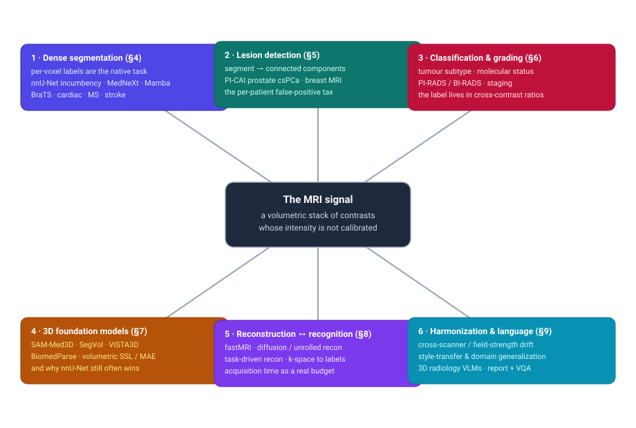
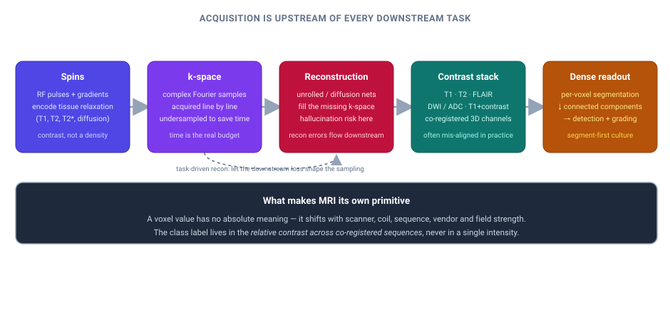
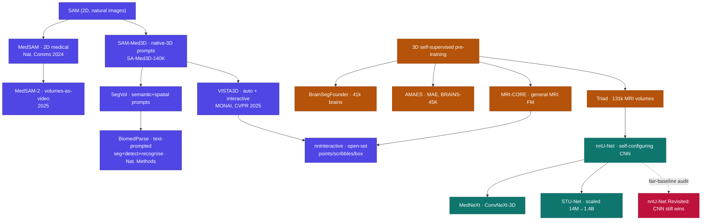

# Dense Object Detection & Classification — Recent Advances

*Compiled 2026-Aug-07 (America/Los_Angeles).*

Next installment in the running CV-updates log. Earlier entries on
`main`:
[Apr-30](../2026-Apr-30/2026-Apr-30_CV_updates.md),
[May-01](../2026-May-01/2026-May-01_CV_updates.md),
[May-02](../2026-May-02/2026-May-02_CV_updates.md),
[May-04](../2026-May-04/2026-May-04_CV_updates.md),
[May-05](../2026-May-05/2026-May-05_CV_updates.md),
[May-07](../2026-May-07/2026-May-07_CV_updates.md),
[May-08](../2026-May-08/2026-May-08_CV_updates.md),
[May-15](../2026-May-15/2026-May-15_CV_updates.md),
[May-16](../2026-May-16/2026-May-16_CV_updates.md),
[May-17](../2026-May-17/2026-May-17_CV_updates.md),
[Jun-09](../2026-Jun-09/2026-Jun-09_CV_updates.md),
[Jun-10](../2026-Jun-10/2026-Jun-10_CV_updates.md),
[Jun-12](../2026-Jun-12/2026-Jun-12_CV_updates.md),
[Jun-15](../2026-Jun-15/2026-Jun-15_CV_updates.md),
[Jun-16](../2026-Jun-16/2026-Jun-16_CV_updates.md),
[Jun-17](../2026-Jun-17/2026-Jun-17_CV_updates.md),
[Jun-19](../2026-Jun-19/2026-Jun-19_CV_updates.md),
[Jun-21](../2026-Jun-21/2026-Jun-21_CV_updates.md),
[Jun-22](../2026-Jun-22/2026-Jun-22_CV_updates.md),
[Jun-23](../2026-Jun-23/2026-Jun-23_CV_updates.md),
[Jun-24](../2026-Jun-24/2026-Jun-24_CV_updates.md),
[Jun-25](../2026-Jun-25/2026-Jun-25_CV_updates.md),
[Jun-27](../2026-Jun-27/2026-Jun-27_CV_updates.md),
[Jun-29](../2026-Jun-29/2026-Jun-29_CV_updates.md),
[Jun-30](../2026-Jun-30/2026-Jun-30_CV_updates.md),
[Jul-04](../2026-Jul-04/2026-Jul-04_CV_updates.md),
[Jul-07](../2026-Jul-07/2026-Jul-07_CV_updates.md),
[Jul-08](../2026-Jul-08/2026-Jul-08_CV_updates.md),
[Jul-10](../2026-Jul-10/2026-Jul-10_CV_updates.md),
[Jul-15](../2026-Jul-15/2026-Jul-15_CV_updates.md),
[Jul-17](../2026-Jul-17/2026-Jul-17_CV_updates.md),
[Jul-18](../2026-Jul-18/2026-Jul-18_CV_updates.md),
[Jul-21](../2026-Jul-21/2026-Jul-21_CV_updates.md),
[Jul-22](../2026-Jul-22/2026-Jul-22_CV_updates.md),
[Jul-24](../2026-Jul-24/2026-Jul-24_CV_updates.md),
[Jul-26](../2026-Jul-26/2026-Jul-26_CV_updates.md),
[Jul-27](../2026-Jul-27/2026-Jul-27_CV_updates.md),
[Jul-30](../2026-Jul-30/2026-Jul-30_CV_updates.md),
[Aug-01](../2026-Aug-01/2026-Aug-01_CV_updates.md),
[Aug-02](../2026-Aug-02/2026-Aug-02_CV_updates.md),
[Aug-04](../2026-Aug-04/2026-Aug-04_CV_updates.md).

## Table of contents

1. [Why this pass: MRI as its own primitive](#why)
2. [Topic map](#map)
3. [The primitive — spins, k-space, and the intensity that means nothing](#primitive)
4. [Dense readout: volumetric segmentation and the nnU-Net incumbency](#dense)
5. [Detection: clinically-significant lesions and the false-positive tax](#detection)
6. [Classification: grading, subtyping, and property from contrast](#classification)
7. [Foundation models and the universal-3D-segmentation push](#foundation)
8. [Reconstruction meets recognition: k-space-aware and task-driven](#recon)
9. [Harmonization, domain shift, and MRI + language](#harmon)
10. [Through-line and open problems](#throughline)
11. [Sources](#sources)

---

## 1. Why this pass: MRI as its own primitive

This log has worked through a lot of medical light and sound already —
ultrasound, endoscopy, OCT, PET, X-ray, the general radiology-plus-pathology
pass. **Magnetic resonance imaging has never had its own entry**, which is odd,
because MRI is the modality that breaks the assumption sitting quietly under
every other one: that a pixel value *means* something fixed. It does not. An
MRI voxel is not a calibrated measurement of anything. Its number depends on the
scanner, the receive coil, the pulse sequence, the vendor's reconstruction, the
field strength, and the shim — so the *same tissue* reads as two different
numbers on two machines down the hall from each other. CT has Hounsfield units;
ultrasound has echogenicity you can at least reason about; MRI has, per voxel,
an uncalibrated intensity that is meaningful only *relative to the rest of this
particular acquisition*.

That single fact reshapes what dense detection and classification even are here.
The class label — tumour vs. oedema, clinically-significant cancer vs. benign,
active lesion vs. old scar — is written not in any one intensity but in the
**contrast across co-registered sequences**: how a region behaves on T1 vs. T2
vs. FLAIR vs. diffusion-weighted (DWI/ADC) vs. post-contrast T1. The network's
real job is to read a *ratio pattern* across a stack of physically distinct 3D
acquisitions, most of which are volumetric and none of which are perfectly
aligned to the others. And underneath all of it is a second peculiarity: the raw
signal is complex-valued **k-space** (the Fourier transform of the image),
acquired line by line, so *scan time is a hard budget* and every image is already
the output of a reconstruction that could have hallucinated the lesion you are
about to detect.

So the culture is different too. MRI dense vision is **segmentation-first** — the
native output is a per-voxel label map, and "detection" is usually *segment, then
run connected components, then count and score the blobs*. Bounding boxes barely
appear. And the incumbent is not a transformer: after two years of Mamba and ViT
churn, a properly-scaled CNN U-Net inside the self-configuring **nnU-Net**
framework still wins most fair comparisons
([nnU-Net Revisited, MICCAI 2024](https://arxiv.org/abs/2404.09556)). The
interesting 2024–2026 story is what grew *around* that stubborn baseline:
promptable 3D foundation models, MRI-specific self-supervised pre-training,
recognition pushed upstream into k-space, and the harmonization-and-language work
that finally treats "the intensity means nothing" as the central problem rather
than a nuisance.

## 2. Topic map

Six threads, all hanging off the same primitive — an uncalibrated multi-contrast
volume. §4 is the dense per-voxel readout and the nnU-Net incumbency. §5 is
lesion detection and the per-patient false-positive tax that dominates screening
use. §6 is classification, grading and molecular-status inference from contrast.
§7 is the promptable-3D-foundation-model push and why it has not dethroned
nnU-Net. §8 is the reconstruction-meets-recognition frontier — segmenting from
undersampled k-space and letting the downstream task shape the scan. §9 is
harmonization, cross-scanner domain shift, and MRI bound to language.

## 3. The primitive — spins, k-space, and the intensity that means nothing

The signal chain (above) is what makes MRI its own thing. RF pulses and field
gradients manipulate proton spins so that different tissues relax at different
rates; a *sequence* is a recipe for turning one of those relaxation differences
into image contrast (T1, T2, T2\*, diffusion). The scanner never records an
image — it records **k-space**, complex Fourier coefficients sampled along a
trajectory, one readout line at a time. Because every line costs time, real
protocols **undersample** k-space and rely on a reconstruction to fill the gaps,
which is why the fastMRI-style acceleration literature sits *upstream* of every
detector and classifier (§8). The output that downstream vision finally sees is a
**stack of co-registered 3D contrasts** — and "co-registered" is aspirational:
the sequences are separate acquisitions, the patient moved, and small
misalignments are the norm.

The consequence worth internalising: because voxel intensity is not calibrated,
almost every serious MRI method spends effort on *making intensities
comparable* — z-scoring per volume, N4 bias-field correction, and increasingly
learned **harmonization** that maps scans from an unseen scanner into a reference
appearance without destroying the biology (§9). A survey this year lays out the
acquisition-, image-, and feature-level taxonomy of exactly this problem
([Harmonization in MRI survey, 2025](https://arxiv.org/abs/2507.16962)). The
raw-data reality is captured by the datasets that ship k-space rather than
pictures — **SKM-TEA** pairs raw multi-coil knee k-space with tissue
segmentations and pathology boxes
([SKM-TEA, NeurIPS 2021](https://arxiv.org/abs/2203.06823)), and **CMRxRecon2024**
does the same for multi-view cardiac k-space
([Radiology: AI 2024](https://doi.org/10.1148/ryai.240443)) — and these are what
make "recognition from k-space" (§8) testable at all.

## 4. Dense readout: volumetric segmentation and the nnU-Net incumbency

The load-bearing result of the last two years is a *negative* one.
**nnU-Net Revisited** re-ran the CNN-vs-Transformer-vs-Mamba question under a
rigorous, leakage-free protocol and found that most claimed gains from novel
architectures evaporate: a ResNet/ConvNeXt-scaled CNN U-Net, auto-configured by
nnU-Net and given modern compute, still matches or beats the transformer and
state-space challengers on 3D medical segmentation
([nnU-Net Revisited, 2024](https://arxiv.org/abs/2404.09556)). The paper doubles
as an indictment of weak baselines across the field, and it is the citation to
reach for whenever someone claims a new backbone "beats U-Net."

That does not mean nothing moved. The genuinely competitive architecture is
**MedNeXt**, a fully-ConvNeXt 3D encoder–decoder with an upsampled-kernel scaling
trick that holds up on both CT and MRI
([MedNeXt, MICCAI 2023](https://arxiv.org/abs/2303.09975)). The main *new* idea
is state-space (Mamba) modelling for long-range 3D context at lower cost than
attention: **U-Mamba** grafts a CNN–SSM block into the self-configuring U-Net
([U-Mamba, 2024](https://arxiv.org/abs/2401.04722)), **SegMamba** builds a
whole-volume Mamba encoder
([SegMamba, MICCAI 2024](https://arxiv.org/abs/2401.13560)), and **nnMamba**
folds SSMs into an nnU-Net-style framework spanning segmentation, classification
and landmark detection ([nnMamba, 2024](https://arxiv.org/abs/2402.03526)). The
honest read, consistent with the Revisited paper, is that Mamba buys *efficiency*
and long-range reach, not a clear accuracy win over a well-tuned CNN. The
transformer baseline that still shows up in ensembles is **Swin UNETR**
([Swin UNETR, 2022](https://arxiv.org/abs/2201.01266)), and the scaling
experiment worth knowing is **STU-Net**, nnU-Net-shaped models pushed from 14M to
1.4B parameters with large-scale supervised pre-training
([STU-Net, 2023](https://arxiv.org/abs/2304.06716)).

The other lesson of 2024–2026 is that **challenge winners are recipes, not
architectures.** The BraTS 2024 glioma track moved to the harder
*post-treatment* setting, where a resection cavity and therapy change confound
the sub-region labels ([BraTS 2024 post-treatment glioma](https://arxiv.org/abs/2405.18368)),
alongside a meningioma radiotherapy-planning track
([BraTS 2024 meningioma RT](https://arxiv.org/abs/2405.18383)). The winning 2023
adult-glioma entry was, in the authors' own words, mostly "faking it" — GAN- and
registration-based synthetic data plus an ensemble of nnU-Net, SwinUNETR and the
prior year's winner ([Ferreira et al., 2024](https://arxiv.org/abs/2402.17317)).
The same pattern repeats across organs: the ISLES'24 acute-stroke winner
attributed its edge to **preprocessing**, not the network
([How we won ISLES'24, 2025](https://arxiv.org/abs/2505.18424)) atop the
multimodal final-infarct benchmark
([ISLES'24, 2024](https://arxiv.org/abs/2408.10966)); a systematic evaluation
confirms plain nnU-Net is still the cardiac-cine workhorse
([nnU-Net for cardiac MRI, 2024](https://arxiv.org/abs/2408.06358)); and
fetal-brain FeTA 2024 tissue segmentation and biometry stayed in the same
nnU-Net-family territory ([FeTA 2024, 2025](https://arxiv.org/abs/2505.02784)).
Multiple-sclerosis work is where *instance* structure finally matters —
**ConfLUNet** segments confluent lesions as separate instances rather than one
merged blob ([ConfLUNet, 2025](https://arxiv.org/abs/2505.22537)), and a new
multi-centre 3T/7T cortical-lesion benchmark quantifies the in-domain vs.
out-of-domain cliff (F1 0.64 → 0.50) that §9 is all about
([Cortical MS benchmark, 2025](https://arxiv.org/abs/2507.12092)).

## 5. Detection: clinically-significant lesions and the false-positive tax

Because the native output is a label map, MRI "detection" is a pipeline:
segment candidate voxels, form connected components, and score each blob — and
the metric that actually matters is **per-patient sensitivity at a fixed
false-positive rate**, not box mAP. The reference event here is **PI-CAI**, the
prostate-MRI reader study, which showed a state-of-the-art AI system detecting
clinically-significant prostate cancer on biparametric MRI at a level
statistically non-inferior to 62 radiologists reading PI-RADS 2.1, over a
10,000-plus exam cohort ([PI-CAI, Lancet Oncology 2024](https://www.sciencedirect.com/science/article/abs/pii/S1470204524002201)
· [OpenReview](https://openreview.net/forum?id=XfXcA9-0XxR)). The winning
ingredients again generalise: a self-configuring nnU-Net detector plus
**report-guided semi-supervision**, which mines lesion locations out of free-text
radiology reports to correct pseudo-labels on thousands of un-annotated exams
([report-guided semi-supervised csPCa, 2024](https://arxiv.org/abs/2406.12177)).
A complementary line injects a *spatial prior* — **ProstAtlasDiff** conditions a
diffusion model on a population cancer atlas and reports detecting meaningfully
more csPCa than radiologists against whole-mount pathology ground truth
([ProstAtlasDiff, 2025](https://pmc.ncbi.nlm.nih.gov/articles/PMC12243626/)).

Breast MRI is the other high-volume detection setting, and 2024–2026 finally gave
it scale. **MAMA-MIA** is a 1,506-case multi-centre DCE-MRI benchmark with expert
tumour and non-mass-enhancement segmentations plus pretrained nnU-Net weights
([MAMA-MIA, 2024](https://arxiv.org/abs/2406.13844)). The hard sub-problem is
*small, early* lesions in *longitudinal* studies, where a single time-point
misses context: **LesiOnTime** models the prior-exam and clinical signal jointly
to catch small lesions that a per-scan detector drops
([LesiOnTime, 2025](https://arxiv.org/abs/2508.00496)). Across both organs the
through-line is the **false-positive tax**: dynamic contrast and vascular
enhancement light up benign tissue, so the engineering effort goes into
suppressing per-patient false marks without sacrificing the one lesion that
matters — the same false-positive-suppression story this log saw in
polyp/endoscopy and lung CADe, but with contrast dynamics as the confounder.

## 6. Classification: grading, subtyping, and property from contrast

Whole-image and per-region classification in MRI is where "the label lives in the
contrast" is most literal — and where the field is shifting from bespoke
per-disease CNNs to **pre-trained backbones fine-tuned per task.** The clearest
example is **BrainIAC**, a multiparametric brain-MRI foundation model trained
self-supervised/contrastively on tens of thousands of scans and then adapted to
seven very different downstream targets — brain age, **IDH mutation status**,
dementia, stroke and glioma — from the same representation
([BrainIAC, Nature Neuroscience 2026](https://doi.org/10.1038/s41593-026-02202-6)
· [medRxiv 2024](https://doi.org/10.1101/2024.12.02.24317992)). Predicting a
molecular label like IDH or MGMT status *from imaging alone* ("radiogenomics") is
exactly the property-inference task that has no analogue in natural images: the
genotype is not visible, only its diffuse imprint on multi-contrast appearance.

Two mechanisms recur. First, **cross-modal alignment**: a CLIP-style objective
aligning 3D MRI with tabular/clinical variables gives a label-efficient classifier
that beats training on images alone
([3D MRI + tabular CLIP, 2025](https://arxiv.org/abs/2501.14051)). Second,
**robustness to missing sequences** — real protocols drop a contrast, so a masked
-autoencoder pre-training that is explicitly trained to tolerate absent MRI
sequences keeps tumour analysis stable when, say, the post-contrast T1 is missing
([multimodal MAE with missing modalities, 2025](https://arxiv.org/abs/2505.00568)).
The clinically-facing framing of all this is the structured reporting scale —
PI-RADS for prostate, BI-RADS for breast, and tumour grade — which is why the
detection and classification stacks increasingly share a backbone and differ only
in head.

## 7. Foundation models and the universal-3D-segmentation push

The biggest visible change is the arrival of **promptable, general-purpose 3D
segmenters** — the SAM idea, dragged into volumes. The lineage below traces the
two families (the supervised-nnU-Net line and the promptable-foundation line) and
the MRI-specific self-supervised pre-training that feeds both.

On the promptable side, **MedSAM** brought SAM to 2D medical images including MRI
slices ([MedSAM, Nature Communications 2024](https://doi.org/10.1038/s41467-024-44824-z)),
and the volumetric successors either treat a volume *as video* to reuse SAM2's
memory attention — **MedSAM-2** ([2025](https://arxiv.org/abs/2504.03600)),
**Medical SAM 2** ([2024](https://arxiv.org/abs/2408.00874)) — or go natively 3D:
**SAM-Med3D** learns true 3D point prompts on a 140K-mask corpus
([SAM-Med3D, 2023](https://arxiv.org/abs/2310.15161)), **SegVol** adds semantic +
spatial prompts across 200-plus categories
([SegVol, NeurIPS 2024](https://arxiv.org/abs/2311.13385)), and NVIDIA's
**VISTA3D** does automatic (127-class) *and* interactive zero-shot segmentation in
one model ([VISTA3D, CVPR 2025](https://arxiv.org/abs/2406.05285)).
**BiomedParse** goes furthest from the box paradigm — joint segmentation,
detection and recognition of 82 object types across nine modalities driven by
*text* prompts ([BiomedParse, Nature Methods 2024](https://doi.org/10.1038/s41592-024-02499-w)) —
and **nnInteractive** is the strong open-set interactive 3D segmenter (points,
scribbles, box, lasso) trained across 120-plus datasets
([nnInteractive, 2025](https://arxiv.org/abs/2503.08373)).

The MRI-*specific* pre-training that these lean on is finally at scale: **Triad**
pre-trains on 131,170 MRI volumes — the largest 3D-MRI corpus reported — and lifts
nnU-Net/Swin backbones on downstream segmentation and classification
([Triad, 2025](https://arxiv.org/abs/2502.14064)); **BrainSegFounder** does
two-stage ViT SSL on 41,400 healthy-brain scans before disease-specific tuning
([BrainSegFounder, Medical Image Analysis 2024](https://arxiv.org/abs/2406.10395));
**AMAES** is an augmented masked-autoencoder recipe with a 45K-volume brain corpus
([AMAES, 2024](https://arxiv.org/abs/2408.00640)); and **MRI-CORE** aims to be a
general MRI image foundation model for downstream segmentation and classification
([MRI-CORE, 2025](https://arxiv.org/abs/2506.12186)).

Two caveats keep this honest. First, **supervised pre-training can beat SSL** for
transfer to novel classes — the **SuPreM** result on large annotated corpora is
the counter-narrative to "just self-supervise"
([SuPreM, ICLR 2024](https://arxiv.org/abs/2501.11253)). Second, a systematic
review of 86 foundation-model architectures finds brain MRI *under-represented*
and the field far from a single winning recipe
([Brain imaging FMs — are we there yet?, 2025](https://arxiv.org/abs/2506.13306)).
Promptable 3D models are genuinely useful for **interactive annotation and
zero-shot novel structures**, but for a fixed, well-annotated task the tuned
nnU-Net (§4) usually still wins.

## 8. Reconstruction meets recognition: k-space-aware and task-driven

This is the frontier that only MRI has, and it is where 2024–2026 got genuinely
new. Because every MRI is a reconstruction from undersampled k-space, two
questions open up that no other modality in this log faces: *can you recognise
without reconstructing?* and *should the scan itself be shaped by the downstream
task?*

On the first: yes, at least for segmentation. **Direct cardiac segmentation from
undersampled k-space** predicts the label map straight from sparse Fourier data,
skipping the image entirely ([Direct k-space cardiac seg, 2024](https://arxiv.org/abs/2406.00192)),
and follow-ups push reconstruction-free segmentation to acceleration factors where
recon-then-segment falls apart
([reconstruction-free k-space seg, 2025](https://arxiv.org/abs/2511.03762)). A
sober evaluation maps out where each pipeline (recon-then-segment vs.
direct-from-k-space) actually helps
([benefits and pitfalls, 2025](https://arxiv.org/abs/2508.18975)); the enabling
benchmark is the **K2S challenge**, which pairs undersampled multi-coil knee
k-space with automatic tissue segmentation
([K2S, 2022](https://doi.org/10.3390/bioengineering10020267)).

On the second — **task-driven acquisition** — the ideas are striking. "The MRI
scanner as a diagnostic" learns a reinforcement-learning policy that *actively
chooses which k-space lines to sample* to make a diagnosis, and can reach the
fully-sampled diagnostic answer from a fraction of the data without ever forming a
clean image ([image-less active sampling, MICCAI 2024](https://doi.org/10.1007/978-3-031-72384-1_44));
a sequel extends this to sequential, multi-objective diagnostic decisions
([active sampling for sequential decisions, 2025](https://arxiv.org/abs/2505.04586)).
**MOST** optimises a single reconstructor to serve several downstream tasks at
once via continual learning ([MOST, 2024](https://arxiv.org/abs/2409.10394)), and
"Mind the Detail" generates *semantically diverse* reconstructions that bracket
the range of downstream segmentation outcomes, surfacing clinically relevant
detail the point-estimate recon would smooth away
([Mind the Detail, 2025](https://arxiv.org/abs/2507.00670)).

Underneath sits the reconstruction machinery itself, now dominated by generative
priors: unrolled diffusion with data-consistency (**SSDiffRecon**,
[MICCAI 2023](https://arxiv.org/abs/2306.16654)), subspace diffusion for speed
(**Sub-DM**, [2024](https://arxiv.org/abs/2411.03758)), and a comprehensive
survey of the DL-reconstruction landscape
([MRI reconstruction survey, 2025](https://arxiv.org/abs/2503.07097)). The
worry that keeps this coupled to recognition is **hallucination**: a diffusion
prior can invent plausible anatomy, and if a detector runs on top, the invented
detail becomes a phantom finding — which is precisely why "recognise from
k-space" and "reconstruct diverse hypotheses" are being pursued together.

## 9. Harmonization, domain shift, and MRI + language

Everything in §§4–8 lives or dies on the intensity problem from §3, so
harmonization is not a side-quest — it *is* the deployment bottleneck. The
cortical-MS benchmark's F1 0.64 → 0.50 in-to-out-of-domain drop (§4) is the
generic story: a model tuned on one scanner degrades on the next.
2024–2026 harmonization is mostly learned image-to-image translation that changes
appearance while preserving anatomy. **IGUANe** is a many-to-one 3D CycleGAN that
maps images from unseen sites to a common reference
([IGUANe, Medical Image Analysis 2025](https://arxiv.org/abs/2402.03227));
**BlindHarmonyDiff** does *blind* harmonization across large domain gaps with an
edge-to-image 3D rectified-flow model
([BlindHarmonyDiff, 2025](https://arxiv.org/abs/2505.00133)); and **DISARM++**
disentangles the scanner effect from the anatomy so the harmonizer generalises to
scanners it never saw ([DISARM++, 2025](https://arxiv.org/abs/2505.03715)). The
[2025 harmonization survey](https://arxiv.org/abs/2507.16962) organises the field
into acquisition-, image-, and feature-level methods.

The newest layer binds MRI to **language**, which matters for dense recognition
because reports are the cheapest source of weak supervision (recall the
report-guided PI-CAI labels in §5). Generalist radiology VLMs now ingest 3D
volumes: **RadFM** trains across X-ray/CT/MRI for report generation, VQA and
diagnosis ([RadFM, Nature Communications 2025](https://arxiv.org/abs/2308.02463));
**M3D-LaMed** builds a 3D VLM with a matching data/benchmark suite spanning report
generation, VQA and *promptable segmentation* on volumes
([M3D, 2024](https://arxiv.org/abs/2404.00578)); **RadVLM** is a conversational
multitask radiology model ([RadVLM, 2025](https://arxiv.org/abs/2502.03333)); and
**3D-RAD** is a large 3D medical-VQA dataset spanning CT/MRI with multi-temporal
tasks ([3D-RAD, 2025](https://arxiv.org/abs/2506.11147)). The one built for this
modality specifically is **AutoRG-Brain**, the first brain-MRI report generator
with **pixel-level grounding** — it ties each sentence to a mask, closing the loop
between the report and the dense segmentation
([AutoRG-Brain, 2024](https://arxiv.org/abs/2407.16684)). Grounded reporting is
the natural convergence point of this whole entry: a system that both *localises*
(dense §4/§5) and *names* (classification §6), supervised by the text radiologists
already write.

## 10. Through-line and open problems

- **The intensity means nothing, and everything follows from that.** MRI's
  defining property — uncalibrated, scanner-dependent voxel values — is why the
  label lives in *cross-contrast ratios*, why harmonization is the deployment
  bottleneck rather than a footnote, and why the modality reads differently from
  every calibrated imaging primitive this log has covered.
- **The strong baseline held.** After two years of transformers and Mamba, a
  fairly-validated nnU-Net-family CNN still wins most fixed MRI segmentation tasks
  ([nnU-Net Revisited](https://arxiv.org/abs/2404.09556)). Mamba bought
  efficiency and long-range context, not a clean accuracy win; the real gains came
  from data recipes — synthetic augmentation, ensembling, report-guided
  semi-supervision, preprocessing.
- **Detection is segmentation plus counting, judged by the false-positive tax.**
  Per-patient sensitivity at a fixed false-positive rate — PI-CAI, MAMA-MIA — is
  the metric that matters, and contrast dynamics are the confounder to suppress.
- **Foundation models found their lane.** Promptable 3D models (SAM-Med3D, SegVol,
  VISTA3D, BiomedParse, nnInteractive) shine at *interactive annotation and
  zero-shot novel structures*; MRI-specific SSL at scale (Triad, BrainSegFounder,
  MRI-CORE) lifts backbones — but neither has dethroned the tuned nnU-Net for
  fixed, well-annotated tasks.
- **Recognition is climbing into k-space.** Segmenting from undersampled k-space
  and task-driven active sampling are genuinely MRI-only frontiers; the coupled
  risk is diffusion-reconstruction *hallucination* feeding phantom findings to a
  downstream detector.
- **Open problems.** Cross-scanner and cross-field-strength generalization (the
  0.64 → 0.50 cliff); robustness to *missing* sequences in real protocols;
  hallucination-safe accelerated reconstruction when a detector runs on the
  output; and grounded report generation as the unifying supervision signal that
  ties localisation to naming.

## 11. Sources

**The primitive, k-space & raw-data benchmarks (§3, §8)**
- Harmonization in MRI — a survey (acquisition/image/feature levels) — 2025: [arXiv 2507.16962](https://arxiv.org/abs/2507.16962)
- SKM-TEA (raw knee k-space + segmentation + pathology boxes) — NeurIPS 2021: [arXiv 2203.06823](https://arxiv.org/abs/2203.06823)
- CMRxRecon2024 (multi-view cardiac k-space dataset/challenge) — Radiology: AI 2024: [DOI 10.1148/ryai.240443](https://doi.org/10.1148/ryai.240443)
- K2S challenge (undersampled k-space → segmentation) — 2022: [DOI 10.3390/bioengineering10020267](https://doi.org/10.3390/bioengineering10020267)

**Dense segmentation & the nnU-Net incumbency (§4)**
- nnU-Net Revisited: a call for rigorous validation — MICCAI 2024: [arXiv 2404.09556](https://arxiv.org/abs/2404.09556)
- MedNeXt (ConvNeXt-3D encoder–decoder) — MICCAI 2023: [arXiv 2303.09975](https://arxiv.org/abs/2303.09975)
- U-Mamba (CNN–SSM U-Net) — 2024: [arXiv 2401.04722](https://arxiv.org/abs/2401.04722)
- SegMamba (whole-volume 3D Mamba) — MICCAI 2024: [arXiv 2401.13560](https://arxiv.org/abs/2401.13560)
- nnMamba (SSMs in nnU-Net-style framework) — 2024: [arXiv 2402.03526](https://arxiv.org/abs/2402.03526)
- Swin UNETR — 2022: [arXiv 2201.01266](https://arxiv.org/abs/2201.01266)
- STU-Net (scalable 14M→1.4B supervised pretraining) — 2023: [arXiv 2304.06716](https://arxiv.org/abs/2304.06716)
- BraTS 2024 post-treatment glioma — 2024: [arXiv 2405.18368](https://arxiv.org/abs/2405.18368)
- BraTS 2024 meningioma radiotherapy planning — 2024: [arXiv 2405.18383](https://arxiv.org/abs/2405.18383)
- "How we won BraTS 2023 … Just faking it!" (Ferreira et al.) — 2024: [arXiv 2402.17317](https://arxiv.org/abs/2402.17317)
- ISLES'24 final-infarct benchmark — 2024: [arXiv 2408.10966](https://arxiv.org/abs/2408.10966)
- "How we won ISLES'24 by preprocessing" — 2025: [arXiv 2505.18424](https://arxiv.org/abs/2505.18424)
- How good is nnU-Net for cardiac MRI? — 2024: [arXiv 2408.06358](https://arxiv.org/abs/2408.06358)
- FeTA 2024 (fetal brain segmentation & biometry) — 2025: [arXiv 2505.02784](https://arxiv.org/abs/2505.02784)
- ConfLUNet (confluent MS-lesion instance segmentation) — 2025: [arXiv 2505.22537](https://arxiv.org/abs/2505.22537)
- Cortical MS-lesion multi-centre 3T/7T benchmark — 2025: [arXiv 2507.12092](https://arxiv.org/abs/2507.12092)

**Lesion detection & the false-positive tax (§5)**
- PI-CAI reader study (AI vs 62 radiologists, csPCa) — Lancet Oncology 2024: [ScienceDirect](https://www.sciencedirect.com/science/article/abs/pii/S1470204524002201) · [OpenReview](https://openreview.net/forum?id=XfXcA9-0XxR)
- Report-guided semi-supervised csPCa detection — 2024: [arXiv 2406.12177](https://arxiv.org/abs/2406.12177)
- ProstAtlasDiff (atlas-guided diffusion detector) — 2025: [PMC12243626](https://pmc.ncbi.nlm.nih.gov/articles/PMC12243626/)
- MAMA-MIA (multi-centre breast DCE-MRI benchmark) — 2024: [arXiv 2406.13844](https://arxiv.org/abs/2406.13844)
- LesiOnTime (longitudinal small-lesion breast MRI) — 2025: [arXiv 2508.00496](https://arxiv.org/abs/2508.00496)

**Classification, grading & radiogenomics (§6)**
- BrainIAC (multiparametric brain-MRI foundation model, 7 tasks) — Nature Neuroscience 2026: [DOI 10.1038/s41593-026-02202-6](https://doi.org/10.1038/s41593-026-02202-6) · medRxiv 2024: [DOI 10.1101/2024.12.02.24317992](https://doi.org/10.1101/2024.12.02.24317992)
- Revisiting CLIP: 3D MRI + tabular alignment — 2025: [arXiv 2501.14051](https://arxiv.org/abs/2501.14051)
- Multimodal MAE robust to missing MRI sequences (tumour) — 2025: [arXiv 2505.00568](https://arxiv.org/abs/2505.00568)

**Foundation & promptable 3D models (§7)**
- MedSAM — Nature Communications 2024: [DOI 10.1038/s41467-024-44824-z](https://doi.org/10.1038/s41467-024-44824-z) · [arXiv 2304.12306](https://arxiv.org/abs/2304.12306)
- MedSAM-2 (volumes/video) — 2025: [arXiv 2504.03600](https://arxiv.org/abs/2504.03600)
- Medical SAM 2 (volume-as-video) — 2024: [arXiv 2408.00874](https://arxiv.org/abs/2408.00874)
- SAM-Med3D (native-3D prompts) — 2023: [arXiv 2310.15161](https://arxiv.org/abs/2310.15161)
- SegVol (semantic + spatial prompts) — NeurIPS 2024: [arXiv 2311.13385](https://arxiv.org/abs/2311.13385)
- VISTA3D (auto + interactive) — CVPR 2025: [arXiv 2406.05285](https://arxiv.org/abs/2406.05285)
- BiomedParse (text-prompted seg+detect+recognise) — Nature Methods 2024: [DOI 10.1038/s41592-024-02499-w](https://doi.org/10.1038/s41592-024-02499-w) · [arXiv 2405.12971](https://arxiv.org/abs/2405.12971)
- nnInteractive (open-set 3D interactive segmentation) — 2025: [arXiv 2503.08373](https://arxiv.org/abs/2503.08373)
- Triad (131K-volume 3D-MRI pretraining) — 2025: [arXiv 2502.14064](https://arxiv.org/abs/2502.14064)
- BrainSegFounder (41K-brain two-stage SSL) — Medical Image Analysis 2024: [arXiv 2406.10395](https://arxiv.org/abs/2406.10395)
- AMAES (augmented MAE, BRAINS-45K) — 2024: [arXiv 2408.00640](https://arxiv.org/abs/2408.00640)
- MRI-CORE (general MRI foundation model) — 2025: [arXiv 2506.12186](https://arxiv.org/abs/2506.12186)
- SuPreM (supervised pretraining beats SSL for novel classes) — ICLR 2024: [arXiv 2501.11253](https://arxiv.org/abs/2501.11253)
- Brain imaging foundation models — are we there yet? (review) — 2025: [arXiv 2506.13306](https://arxiv.org/abs/2506.13306)

**Reconstruction meets recognition (§8)**
- Direct cardiac segmentation from undersampled k-space — 2024: [arXiv 2406.00192](https://arxiv.org/abs/2406.00192)
- Reconstruction-free segmentation from undersampled k-space — 2025: [arXiv 2511.03762](https://arxiv.org/abs/2511.03762)
- Benefits and pitfalls of segmenting undersampled MRI — 2025: [arXiv 2508.18975](https://arxiv.org/abs/2508.18975)
- The MRI scanner as a diagnostic — image-less active sampling — MICCAI 2024: [DOI 10.1007/978-3-031-72384-1_44](https://doi.org/10.1007/978-3-031-72384-1_44)
- Active sampling for sequential diagnostic decisions — 2025: [arXiv 2505.04586](https://arxiv.org/abs/2505.04586)
- MOST (multi-downstream-task reconstruction, continual learning) — 2024: [arXiv 2409.10394](https://arxiv.org/abs/2409.10394)
- Mind the Detail (semantically diverse reconstructions) — 2025: [arXiv 2507.00670](https://arxiv.org/abs/2507.00670)
- SSDiffRecon (self-supervised unrolled diffusion) — MICCAI 2023: [arXiv 2306.16654](https://arxiv.org/abs/2306.16654)
- Sub-DM (subspace diffusion reconstruction) — 2024: [arXiv 2411.03758](https://arxiv.org/abs/2411.03758)
- MRI reconstruction — a comprehensive survey — 2025: [arXiv 2503.07097](https://arxiv.org/abs/2503.07097)

**Harmonization & MRI + language (§9)**
- IGUANe (3D many-to-one CycleGAN harmonizer) — Medical Image Analysis 2025: [arXiv 2402.03227](https://arxiv.org/abs/2402.03227)
- BlindHarmonyDiff (blind harmonization, rectified flow) — 2025: [arXiv 2505.00133](https://arxiv.org/abs/2505.00133)
- DISARM++ (scanner-effect disentanglement) — 2025: [arXiv 2505.03715](https://arxiv.org/abs/2505.03715)
- RadFM (generalist radiology VLM, 2D+3D) — Nature Communications 2025: [arXiv 2308.02463](https://arxiv.org/abs/2308.02463)
- M3D-LaMed (3D medical VLM + benchmark) — 2024: [arXiv 2404.00578](https://arxiv.org/abs/2404.00578)
- RadVLM (conversational multitask radiology VLM) — 2025: [arXiv 2502.03333](https://arxiv.org/abs/2502.03333)
- 3D-RAD (3D medical-VQA dataset, CT/MRI) — 2025: [arXiv 2506.11147](https://arxiv.org/abs/2506.11147)
- AutoRG-Brain (grounded brain-MRI report generation) — 2024: [arXiv 2407.16684](https://arxiv.org/abs/2407.16684)

*Compiled automatically as part of the CV-updates routine. Corrections and additions
welcome via PR against `main`.*
