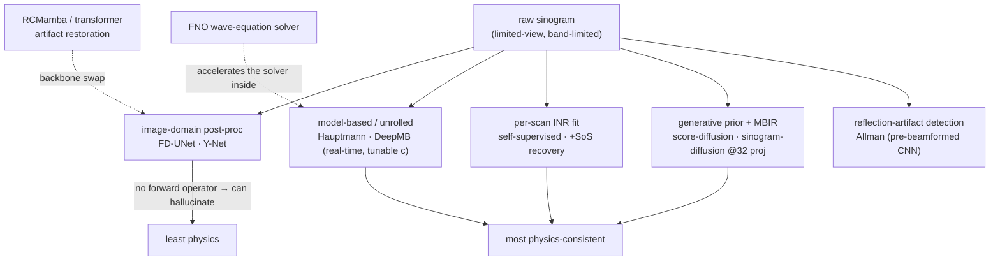

# Dense Object Detection & Classification — Recent Advances

*Compiled 2026-Aug-08 (America/Los_Angeles).*

Next installment in the running CV-updates log. Earlier entries on
`main`:
[Apr-30](../2026-Apr-30/2026-Apr-30_CV_updates.md),
[May-01](../2026-May-01/2026-May-01_CV_updates.md),
[May-02](../2026-May-02/2026-May-02_CV_updates.md),
[May-04](../2026-May-04/2026-May-04_CV_updates.md),
[May-05](../2026-May-05/2026-May-05_CV_updates.md),
[May-07](../2026-May-07/2026-May-07_CV_updates.md),
[May-08](../2026-May-08/2026-May-08_CV_updates.md),
[May-15](../2026-May-15/2026-May-15_CV_updates.md),
[May-16](../2026-May-16/2026-May-16_CV_updates.md),
[May-17](../2026-May-17/2026-May-17_CV_updates.md),
[Jun-09](../2026-Jun-09/2026-Jun-09_CV_updates.md),
[Jun-10](../2026-Jun-10/2026-Jun-10_CV_updates.md),
[Jun-12](../2026-Jun-12/2026-Jun-12_CV_updates.md),
[Jun-15](../2026-Jun-15/2026-Jun-15_CV_updates.md),
[Jun-16](../2026-Jun-16/2026-Jun-16_CV_updates.md),
[Jun-17](../2026-Jun-17/2026-Jun-17_CV_updates.md),
[Jun-19](../2026-Jun-19/2026-Jun-19_CV_updates.md),
[Jun-21](../2026-Jun-21/2026-Jun-21_CV_updates.md),
[Jun-22](../2026-Jun-22/2026-Jun-22_CV_updates.md),
[Jun-23](../2026-Jun-23/2026-Jun-23_CV_updates.md),
[Jun-24](../2026-Jun-24/2026-Jun-24_CV_updates.md),
[Jun-25](../2026-Jun-25/2026-Jun-25_CV_updates.md),
[Jun-27](../2026-Jun-27/2026-Jun-27_CV_updates.md),
[Jun-29](../2026-Jun-29/2026-Jun-29_CV_updates.md),
[Jun-30](../2026-Jun-30/2026-Jun-30_CV_updates.md),
[Jul-04](../2026-Jul-04/2026-Jul-04_CV_updates.md),
[Jul-07](../2026-Jul-07/2026-Jul-07_CV_updates.md),
[Jul-08](../2026-Jul-08/2026-Jul-08_CV_updates.md),
[Jul-10](../2026-Jul-10/2026-Jul-10_CV_updates.md),
[Jul-15](../2026-Jul-15/2026-Jul-15_CV_updates.md),
[Jul-17](../2026-Jul-17/2026-Jul-17_CV_updates.md),
[Jul-18](../2026-Jul-18/2026-Jul-18_CV_updates.md),
[Jul-21](../2026-Jul-21/2026-Jul-21_CV_updates.md),
[Jul-22](../2026-Jul-22/2026-Jul-22_CV_updates.md),
[Jul-24](../2026-Jul-24/2026-Jul-24_CV_updates.md),
[Jul-26](../2026-Jul-26/2026-Jul-26_CV_updates.md),
[Jul-27](../2026-Jul-27/2026-Jul-27_CV_updates.md),
[Jul-30](../2026-Jul-30/2026-Jul-30_CV_updates.md),
[Aug-01](../2026-Aug-01/2026-Aug-01_CV_updates.md),
[Aug-02](../2026-Aug-02/2026-Aug-02_CV_updates.md),
[Aug-04](../2026-Aug-04/2026-Aug-04_CV_updates.md),
[Aug-07](../2026-Aug-07/2026-Aug-07_CV_updates.md).

## Table of contents

1. [Why this pass: photoacoustics as its own primitive](#why)
2. [Topic map](#map)
3. [The primitive — light in, sound out, and two unknowns in the middle](#primitive)
4. [Reconstruction: the limited-view / sparse-array inverse problem](#recon)
5. [Quantitative PA: undoing spectral coloring to read sO₂](#qpai)
6. [Dense readout: vessels, tumors, and segment-then-quantify](#dense)
7. [Photoacoustic microscopy: super-resolution from undersampling](#pam)
8. [Self-supervision and the borrowed-foundation-model era](#ssl)
9. [Clinical translation and the reality check](#clinical)
10. [Through-line and open problems](#throughline)
11. [Sources](#sources)

---

## 1. Why this pass: photoacoustics as its own primitive

This log has now worked through a long shelf of medical and non-medical
imaging modalities — ultrasound, endoscopy, OCT, PET, MRI, X-ray, the general
radiology-plus-pathology pass, and on the physics side SAR, hyperspectral,
polarization, thermal, event cameras and LiDAR. **Photoacoustic imaging (PAI),
also called optoacoustic imaging, has never had its own entry**, and it belongs
here for a specific reason: it is the one modality on the list that is *two
physics at once*. You illuminate tissue with light and you listen for sound.
The contrast is optical — you see what absorbs the laser, chiefly hemoglobin,
melanin and lipid — but the resolution and depth are acoustic, because
ultrasound scatters a thousand times less than light in tissue. That hybrid is
the whole appeal: optical *specificity* (you can tell oxygenated from
deoxygenated blood by its color) delivered at ultrasound *depth* (centimeters,
not the ~1 mm that pure optical microscopy is stuck behind).

The catch — and the reason PA is a genuinely distinct computer-vision primitive
rather than "ultrasound with a laser" — is that **two unknown physical fields
sit between the image you reconstruct and the biology you actually want**.
First, the light that reaches a given depth has already been attenuated and
spectrally *reshaped* on the way in, so the measured signal is the true
absorption multiplied by an unknown, wavelength-dependent light fluence — the
"spectral coloring" problem. Get that inversion wrong and your blood-oxygen map
is confidently, quantitatively wrong. Second, reconstruction has to assume a
speed of sound to turn detected pressure waves back into a picture, and tissue's
speed of sound is heterogeneous and unknown, so a wrong or global value smears
and duplicates absorbers. Every deep-learning result below is, at bottom, a
different attack on one of those two unknowns — or an attempt to do dense
detection and classification *despite* them.

Two more properties make PA a distinctive learning problem. The detector array
is almost always **limited-view and limited-bandwidth** (you cannot surround a
patient with transducers), so the raw inverse problem is ill-posed before any
tissue physics enters. And **ground truth is essentially unmeasurable in
vivo** — you cannot biopsy a voxel to check its true sO₂ — which pushes the
whole field toward simulation-trained models, self-supervision, and a hard
sim-to-real domain gap that recurs in every section.

## 2. Topic map

The rest of the report walks the four entry points and then the two settings
(microscopy, clinic) where they land.

## 3. The primitive — light in, sound out, and two unknowns in the middle

The forward chain is worth stating precisely because every method below either
inverts a piece of it or works around a piece it cannot invert. A nanosecond
laser pulse — short enough to satisfy *stress confinement*, so the deposited
heat has no time to diffuse or relieve before it converts to pressure — is
absorbed by a chromophore with wavelength-dependent absorption coefficient
μₐ(λ). The tissue heats by a few millikelvin, expands thermoelastically, and
launches a broadband ultrasonic pressure transient. The initial pressure is

> **p₀(x) = Γ(x) · μₐ(x, λ) · Φ(x, λ)**

where Γ is the Grüneisen parameter (how efficiently absorbed heat becomes
pressure) and **Φ is the local optical fluence** — the amount of light that
actually arrived. A transducer array records the pressure waves; a
reconstruction step turns those time series ("A-scans", assembled into a
sinogram) back into an image of p₀.

Read that equation as a computer-vision person and the two hard problems fall
out immediately. **You want μₐ (it carries the biology), you measure p₀, and
Φ is unknown and depth/wavelength-dependent.** Because Φ falls off faster at
wavelengths that tissue absorbs more strongly, the *spectrum* you measure at
depth is a distorted version of the true absorption spectrum — spectral
coloring — and naïve linear spectral unmixing on p₀ gives biased chromophore
concentrations and biased sO₂. Separately, turning the sinogram into p₀ is an
acoustic inverse problem that assumes a speed-of-sound field; the array is
limited-view, so the un-regularized inverse leaves streak and split-object
artifacts even before the speed-of-sound error blurs things further. Multi-scale
review coverage of exactly this pipeline — reconstruction through quantitative
analysis — is now consolidated in 2025 survey form (Visual Computing for
Industry, Biomedicine, and Art; and the standing *Photoacoustics* deep-learning
review), which is a good sign the sub-problems have stabilized enough to name.

## 4. Reconstruction: the limited-view / sparse-array inverse problem

The oldest and most crowded DL thread in PA is **image reconstruction**: get a
clean p₀ image from few, band-limited, limited-view detectors. Several postures
have emerged along a spectrum from "least physics" to "most physics-consistent,"
and 2024–2026 work is consolidating toward the physics-aware end.

**Post-processing (image-domain) networks.** The simplest recipe: reconstruct
badly and fast with delay-and-sum (DAS) or a sparse back-projection, then hand
the artifact-ridden image to a U-Net that has learned what the artifacts look
like. This is the crowded, well-worn lane — **FD-UNet** (a densely-connected
U-Net for 2D sparse-PAT streak removal) and dual-domain designs like **Y-Net**
(which fuses raw-signal and image branches) are the reference points. Cheap,
real-time, and the baseline everything else is measured against — but it can
hallucinate structure because it never sees the raw measurement in a
physics-consistent way.

**Model-based / learned-iterative (unrolled) reconstruction.** These keep the
physics: they unroll an iterative solver for the acoustic forward operator and
learn only the regularizer or the update steps, so the result stays consistent
with what the transducers actually recorded. Hauptmann et al.'s **learned
model-based** scheme for accelerated 3D limited-view PAT is the anchor here, and
the 2025 unrolled work for limited-view breast PAT reports ~90% reconstruction-
time reductions while keeping a U-Net denoiser inside the physics loop. The
quantitative-imaging variants push this all the way to jointly estimating
optical properties, and the 2024–25 "virtual imaging framework" line uses
realistic numerical breast phantoms to *validate* learned 3D quantitative PACT
reconstruction against a known ground truth that no in-vivo experiment can
provide — an important methodological move, because it lets the field measure a
learned reconstructor's quantitative bias rather than just its prettiness. A
sobering recent benchmark finding: a learned reconstructor can score well on
PSNR/SSIM and still *miss lesions*, which is why quantitative-task validation is
now a first-class concern rather than an afterthought.

**Real-time model-based reconstruction — DeepMB.** A standout for clinical
deployment: **DeepMB** trains a network to approximate a high-quality
model-based reconstruction but run in milliseconds, and — critically — to do so
with an *adjustable speed of sound* at inference, so the operator can tune the
one physical parameter that most affects image sharpness without waiting for a
slow solver. It generalizes to in-vivo scans while trained on synthesized data,
which is the recurring sim-to-real theme in a favorable light.

**Physics-informed operator learning.** A parallel move replaces the expensive
pseudo-spectral wave solver — the thing every iterative method calls repeatedly
— with a learned operator. A **Fourier Neural Operator (FNO)** trained to solve
the PA wave equation runs orders of magnitude faster than the numerical solver
and can be dropped inside a learned-iterative loop, which is what makes the
model-based approaches above practical at 3D scale.

**Priors from generative models — diffusion and INR.** The newest and most
active sub-thread treats reconstruction as inverse-problem sampling. **Score-based
diffusion priors** trained on simulated vasculature solve the PAT inverse problem
robustly across transducer sparsity (Dey et al., ICASSP 2024); pushing further, a
**sinogram-domain diffusion prior** for ultra-sparse PAT reconstructs from as few
as ~32 projections and reports ≈21% SSIM improvement over a U-Net at that
sparsity. On the coordinate-network side, **implicit neural representations
(INR)** fit a continuous initial-pressure field to the raw measurements with a
physics forward model and no training set at all — a *self-supervised*, per-scan
reconstruction (e.g. +6.8–19.4 dB SNR for sparse-view PACT) that has been applied
specifically to the limited-view case, and extended to jointly recover the
speed-of-sound field via a coordinate network. Transformer- and **Mamba**-style
backbones have now landed in the artifact-removal role too: **RCMamba** pairs a
multi-scale state-space backbone with wavelet analysis for sparse-PAT streak
restoration at 16/32/64 projections.

**Reflection and clutter as a detection problem.** A distinct artifact thread
treats reflection clutter not as noise to denoise but as a *classification*
task: Allman, Reiter & Bell's seminal CNN operates on pre-beamformed channel
data to locate true PA sources and distinguish them from reflection artifacts —
dense detection applied to the raw waves rather than the image.

The through-line: the field has largely accepted that **a pure image-domain
U-Net is not enough** — the winning designs either keep the acoustic forward
operator in the loop (unrolled, DeepMB, FNO-accelerated, diffusion-MBIR) or fit
the raw data directly (INR), because that is the only way to avoid inventing
structure that was never measured. Shared infrastructure has finally arrived to
adjudicate the bake-off: **OADAT** (open experimental + synthetic optoacoustic
data with full/sparse/limited-view variants) and the ubiquitous **k-Wave**
acoustic simulator that generates almost all the training data.

The reconstruction lineage, as a picture of where the physics sits in each
design:

## 5. Quantitative PA: undoing spectral coloring to read sO₂

This is the task that has no analogue in any other modality this log has
covered, and it is where PA computer vision is most distinctive. The clinical
prize is a **per-pixel blood-oxygen-saturation (sO₂) map**, computed from the
absorption spectrum of hemoglobin vs. oxyhemoglobin. The obstacle is spectral
coloring: the measured multi-wavelength p₀ spectrum is the true absorption
spectrum *times* the unknown, wavelength-dependent fluence, so linear unmixing
is biased, and the bias grows with depth exactly where you most want the answer.

**Learned spectral decoloring (LSD)** — the DKFZ line (Gröhl, Maier-Hein and
colleagues) — reframes this as a supervised regression: train a network on
Monte-Carlo simulations of light transport to map a spectrally-colored pixel
spectrum directly to sO₂, learning to invert the fluence effect it has seen in
simulation. **Multiple-illumination LSD (MI-LSD)** strengthens the constraint by
acquiring the same point under several source positions — different fluence
patterns, same underlying chromophores — so the network has more physical
anchors to disentangle absorption from illumination. Alongside pointwise
oximetry, the same group's **semantic segmentation of multispectral PA**
(Schellenberg, Gröhl et al.) labels tissue classes directly from the spectral
stack, validated in healthy volunteers.

The persistent worry with all of it is **generalization out of the training
distribution**: a model trained on one simulated tissue prior can be confidently
wrong on real tissue whose optical properties it never saw. Three responses have
crystallized. The "distribution-informed, wavelength-flexible" oximetry line
makes the estimator robust to the choice of illumination wavelengths and to
shifts in the tissue distribution rather than baking in one Monte-Carlo prior.
Bench & Cox (UCL) attack the sim-to-real gap head-on with **generative domain
adaptation** — CycleGAN/AmbientGAN translation of simulated qPAT training data
toward real appearance — while the complementary "moving beyond simulation" work
trains on experimental **tissue-mimicking phantoms** to recover depth-dependent
signal loss without trusting the simulator at all. And **self-supervised fluence
correction** now embeds the light-transport diffusion equation directly into the
loss so a network can correct fluence from PAT images alone, with **FNO**-based
operators accelerating the iterative absorption-coefficient recovery underneath.
Finally, 2025 work **couples sO₂ estimation with segmentation in one network**
(the *Hybrid-Net* design — joint vessel mask + sO₂, trained on 3D Monte-Carlo
breast simulations then retrained on phantoms) on the logic that the fluence
correction a pixel needs depends on the tissue it sits in.

Two framing points worth keeping. First, qPAI is the rare dense-*regression*
task in this series — the output is a calibrated physical scalar per pixel, not
a class or a box, and it is graded on quantitative bias, not IoU. Second, its
central difficulty is **not** architecture; it is that the training signal comes
from a light-transport simulator and the test signal comes from a patient, so
the entire sub-field is a running experiment in closing a sim-to-real gap under
a ground truth you can never measure directly.

## 6. Dense readout: vessels, tumors, and segment-then-quantify

Once you have an image, the recognition tasks look more familiar — with PA's own
twist that the "objects" are defined by absorption contrast.

**Vessel / vasculature segmentation** is the workhorse, because PA's native
contrast *is* blood: segment the vascular tree in 2D or 3D and you get diameter,
density and tortuosity biomarkers directly. The label-scarcity twist shows here
too — **VAN-GAN** (Sweeney et al., Bohndiek group) segments 3D vascular networks
from mesoscopic PA volumes *without paired labels*, using a CycleGAN-style
translation trained on synthetic vessel graphs plus PA physics, sidestepping the
manual-annotation wall. **Joint reconstruction-and-segmentation** designs are
also appearing — networks that output both the cleaned image and the vessel
mask, sometimes with an explicit *error-prediction* head so a downstream user
knows which pixels to distrust, a sensible response to a modality whose
reconstructions carry structured artifacts.

**Tumor / lesion detection and classification** is the clinical payoff and rides
on the same contrast: malignancies recruit vasculature and shift oxygenation, so
a breast lesion, a thyroid nodule, an ovarian mass or a skin cancer reads
differently in multispectral optoacoustic tomography (MSOT) than benign tissue.
Concrete 2024–25 results: a **ResNet50-with-attention** classifier on
co-registered photoacoustic/ultrasound breast images (AUC ≈0.87 on a 334-patient
cohort); a **vascular graph neural network** over vessel graphs from
optical-resolution PA microscopy for ovarian-lesion classification (Zhu group);
and fully-automatic **3D melanoma border delineation** from multispectral PA
(Merdasa et al.). The recognition target is often not a single frame but the
*functional* signature — tumor sO₂, total-hemoglobin heterogeneity — which links
detection back to the qPAI section: you frequently want to **segment then
quantify**, and the two steps are increasingly one model. A striking adjacent
result pushes PA into digital pathology outright: **subcellular-resolution UV
photoacoustic microscopy plus deep learning** (Park, Wang lab) produces
label-free, stain-free histology at ~240 nm resolution — dense classification on
tissue that was never sectioned or stained.

**Tissue-type semantic segmentation** rounds it out — label skin, vessel,
muscle, background — and matters beyond cosmetics because, as noted above, the
fluence correction and the plausible sO₂ range are tissue-dependent, so a
semantic map is a useful prior for the quantitative head.

## 7. Photoacoustic microscopy: super-resolution from undersampling

Photoacoustic *microscopy* (PAM) is a different instrument — a focused
single-element transducer raster-scanned over a small field — but it has spawned
its own tightly-defined dense-prediction problem: **reconstruct a full,
high-resolution image from a sparsely-scanned one**. Scanning is the bottleneck
(every pixel is a laser shot and a mechanical move), so imaging faster,
depositing less laser dose, or covering more area all reduce to *undersample
then restore*.

The recent work is a small clinic of super-resolution ideas specialized to the
scan geometry. Networks that reconstruct PAM from as little as ~2% of pixels
have been demonstrated; **scanning-prior-guided** frameworks bias the restoration
toward vessel patches and enforce a scanning-consistency loss so the output
respects how the data was actually collected; **implicit neural representations**
fit a continuous image to the sparse samples; **diffusion models** have been used
to fill undersampled PAM; and hybrid **transformer–CNN GANs** handle the
non-uniform sampling and motion misalignment of real optical-scanning
undersampling (e.g. in photoacoustic remote sensing, PARS). There is also a
distinctive **localization** line — the PA analogue of super-resolution
localization microscopy — where deep learning accelerates the reconstruction of
super-resolved vasculature from many sparse absorber localizations. Classical
priors have not been abandoned: 2025 work still fuses **group-sparsity with a
deep denoiser prior** for acoustic-resolution PAM, a plug-and-play design that
keeps an interpretable regularizer next to the learned one.

## 8. Self-supervision and the borrowed-foundation-model era

Because in-vivo ground truth is unmeasurable and labeled PA data is scarce and
device-specific, **self-supervision is not a nicety here — it is the main road**,
and PA has adopted the same two escapes the rest of vision found.

**Ground-truth-free reconstruction.** The INR reconstructors above are already
self-supervised (they fit the measurement, not a label). Beyond them, a
**masked cross-domain self-supervised** framework for PACT learns representations
by reconstructing masked regions across both simulated and experimental domains,
explicitly to bridge sim-to-real without paired ground-truth images; and 2025
**self-supervised upsampling** for PACT reconstructions generalizes enhancement
across setups without clean targets. The common thread is designing a pretext
task whose supervision comes from physics or from the data's own structure,
because the clean image simply does not exist to be labeled.

**Borrowed foundation models.** The other escape is to not train from scratch at
all. Off-the-shelf **Segment Anything (SAM)**-family models have been applied in
a *training-free* way to a spread of PA tasks — skin-signal removal in 3D
rendering, dual-speed-of-sound reconstruction, finger-vessel segmentation — with
simple prompts and zero PA-specific fine-tuning, a pragmatic answer to label
scarcity that trades some accuracy for immediate coverage.

The honest status, and worth stating as an open problem: a *native* PA
foundation model — a "PA-MAE" or "PA-CLIP" pretrained at the scale MRI,
pathology or even ultrasound (USFM, UltraFedFM) now enjoy — **does not yet
exist**. PA is still *borrowing* foundation models and hand-building
self-supervised pretext tasks, and that gap is where a lot of the near-term
headroom sits. Part of what blocks it is the absence, until recently, of
standardized data: the **IPASC** consensus data format (Gröhl, Hacker, Cox et
al.) is the community's attempt to make cross-device raw data exchangeable —
a precondition for ever assembling the large, heterogeneous corpus a native
foundation model would need.

## 9. Clinical translation and the reality check

The 2025 clinical primer literature (npj Imaging) is a useful cold shower.
Optoacoustic imaging has real, in-human results — **MSOT** to distinguish breast
malignancy from cysts by oxy/deoxy-hemoglobin contrast, to characterize thyroid
nodules suspicious for malignancy, to grade **Crohn's disease / pediatric IBD**
activity from intestinal-wall hemoglobin and sO₂, and the landmark **Duchenne
muscular dystrophy** study (Knieling et al., *Nature Medicine* 2019) that
quantified muscle collagen as a first-in-human MSOT biomarker — and deep
learning already sits in the deployed path for tasks like electrical-noise
removal that unlock deep-tissue spectral contrast. But the same bottlenecks
recur at the bedside: **quantitative accuracy** (the sO₂ number is only as
trustworthy as the fluence correction, and most strong qPAI results are still
simulation- or phantom-validated, not in-vivo human), **cross-device
generalization** (handheld, ring-array and microscopy systems produce
different-looking data, and models transfer poorly), and **the absence of a
measurable in-vivo ground truth** to validate against, which keeps regulators
and clinicians cautious. None of these are architecture problems; all three are
the primitive asserting itself.

*Whose work this is.* Four groups recur behind most of the credible citations
above and are worth naming as the field's centers of gravity: **DKFZ /
Maier-Hein & Gröhl** (learned spectral decoloring, semantic segmentation,
IPASC), **Cox & Bohndiek** (UCL/Cambridge — qPAT theory, generative domain
adaptation, VAN-GAN), **Zhu** (WashU — ovarian/rectal PA classification,
US-enhanced qPAT), and **Ntziachristos & Knieling** (Munich/Erlangen — MSOT
clinical translation).

## 10. Through-line and open problems

The single sentence for this pass: **photoacoustic computer vision is the study
of doing detection, segmentation and quantification when two physical fields —
optical fluence and speed of sound — sit unknown between your image and your
biology, and your ground truth is unmeasurable in vivo.** Everything above is a
response to that sentence.

- **Recon has accepted physics-in-the-loop.** Pure image-domain U-Nets are out;
  unrolled model-based nets, real-time model-based emulators (DeepMB), diffusion
  priors and per-scan INR fits are in — all because a limited-view inverse
  problem punishes any model that ignores the forward operator by inventing
  structure.
- **qPAI is the field's signature and its hardest open problem.** Learned
  spectral decoloring works in simulation; making it *quantitatively trustworthy*
  on real tissue whose optical priors you never trained on — and validating it
  without a measurable ground truth — is unsolved and is where distribution-
  robust and multi-illumination methods are pushing.
- **Segment-then-quantify is converging into one model.** Tissue label, vessel
  mask and sO₂ are increasingly co-predicted because each conditions the others.
- **Self-supervision is load-bearing, foundation models are still borrowed.** A
  native, at-scale PA foundation model is the obvious missing piece; today's
  systems lean on masked/cross-domain pretext tasks and off-the-shelf SAM.
- **The open problems are shared and physical, not architectural:** the
  sim-to-real gap (train on Monte-Carlo, test in tissue), cross-device transfer,
  and quantitative validation without in-vivo ground truth. The modality that
  most needs better simulators and better self-supervision, not bigger backbones.

## 11. Sources

*Links are to arXiv abstract pages, DOIs, or PubMed/PMC records. arXiv IDs are
given where a preprint exists; some venue links point to the journal of record.
Where a fetch was blocked during compilation, the canonical identifier is still
listed so the source can be located directly.*

**Reviews, surveys & the primitive (§1, §3)**
- Deep learning for biomedical photoacoustic imaging: a review — *Photoacoustics* 2021: [ScienceDirect S2213597921000033](https://www.sciencedirect.com/science/article/pii/S2213597921000033) · [arXiv 2011.02744](https://arxiv.org/abs/2011.02744)
- Advances in Photoacoustic Imaging Reconstruction and Quantitative Analysis for Biomedical Applications — *Vis. Comput. Ind. Biomed. Art* 2025: [DOI 10.1186/s42492-025-00213-x](https://doi.org/10.1186/s42492-025-00213-x) · [arXiv 2411.02843](https://arxiv.org/abs/2411.02843)
- Segmentation and Quantitative Analysis of Photoacoustic Imaging: A Review — *Photonics* 2022: [DOI 10.3390/photonics9030176](https://doi.org/10.3390/photonics9030176)
- A primer on current status and future opportunities of clinical optoacoustic imaging — *npj Imaging* 2025: [DOI 10.1038/s44303-024-00065-9](https://www.nature.com/articles/s44303-024-00065-9)

**Reconstruction: post-processing, model-based & operator learning (§4)**
- FD-UNet — fully-dense U-Net for sparse-PAT artifact removal — Guan et al., *IEEE JBHI* 2020: [arXiv 1808.10848](https://arxiv.org/abs/1808.10848)
- Y-Net — dual-branch signal+image reconstruction — Lan et al., *Photoacoustics* 2020: [arXiv 1908.00975](https://arxiv.org/abs/1908.00975)
- Model-based learning for accelerated, limited-view 3D PAT — Hauptmann et al., *IEEE TMI* 2018: [arXiv 1708.09832](https://arxiv.org/abs/1708.09832)
- Unrolled DL for limited-view breast PAT (rBP-ADMM + U-Net denoiser, ~90% time cut) — *Med. Biol. Eng. Comput.* 2025: [DOI 10.1007/s11517-025-03302-4](https://doi.org/10.1007/s11517-025-03302-4)
- DeepMB — real-time model-based optoacoustic reconstruction with adjustable speed of sound: [arXiv 2206.14485](https://arxiv.org/abs/2206.14485)
- Model-based reconstructions for quantitative imaging in PAT — 2023: [arXiv 2311.15735](https://arxiv.org/abs/2311.15735)
- Fourier Neural Operator solver for the PA wave equation — Guan, Hsu & Chitnis, *Algorithms* 2023: [arXiv 2108.09374](https://arxiv.org/abs/2108.09374)
- Virtual imaging framework for DL 3D quantitative PACT reconstruction — 2025: [arXiv 2510.03431](https://arxiv.org/abs/2510.03431) · [PMC12858365](https://pmc.ncbi.nlm.nih.gov/articles/PMC12858365/)
- Virtual imaging framework, 3D qOAT with stochastic numerical breast phantoms — 2025: [arXiv 2510.00189](https://arxiv.org/abs/2510.00189)

**Reconstruction: generative priors, INR, transformer/Mamba (§4)**
- Score-based diffusion models for PAT — Dey et al., *ICASSP* 2024: [arXiv 2404.00471](https://arxiv.org/abs/2404.00471)
- Sinogram-domain prior-guided diffusion for ultra-sparse PAT (~21% SSIM gain @32 proj.) — Li et al., *Photoacoustics* 2024: [DOI 10.1016/j.pacs.2024.100670](https://doi.org/10.1016/j.pacs.2024.100670) · [code](https://github.com/yqx7150/PAT-Sinogram-Diffusion)
- INR for sparse-view PACT (self-supervised, +6.8–19.4 dB SNR) — Yao et al., 2024: [arXiv 2409.13696](https://arxiv.org/abs/2409.13696)
- Limited-view PA reconstruction via self-supervised neural representation — 2024 → *Photoacoustics* 2025: [arXiv 2407.03663](https://arxiv.org/abs/2407.03663) · [ScienceDirect S2213597925000047](https://www.sciencedirect.com/science/article/pii/S2213597925000047)
- Coordinate-based speed-of-sound recovery (INR) for aberration-corrected PACT — 2024: [arXiv 2409.10876](https://arxiv.org/abs/2409.10876)
- RCMamba — wavelet-enhanced residual state-space (Mamba) streak-artifact restoration — *Photoacoustics* 2025: [ScienceDirect S2213597925000722](https://www.sciencedirect.com/science/article/pii/S2213597925000722)
- PA source detection & reflection-artifact removal (pre-beamformed CNN) — Allman, Reiter & Bell, *IEEE TMI* 2018: [DOI 10.1109/TMI.2018.2829662](https://doi.org/10.1109/TMI.2018.2829662)

**Quantitative PA / sO₂ / spectral decoloring / fluence (§5)**
- Learned spectral decoloring enables photoacoustic oximetry — Gröhl et al., *Scientific Reports* 2021: [DOI 10.1038/s41598-021-83405-8](https://doi.org/10.1038/s41598-021-83405-8)
- Multiple-illumination learned spectral decoloring for quantitative optoacoustic oximetry — *J. Biomed. Opt.* 2021: [PMC8336722](https://pmc.ncbi.nlm.nih.gov/articles/PMC8336722/)
- Semantic segmentation of multispectral PA images — Schellenberg, Gröhl et al., 2021 → *Photoacoustics* 2022: [arXiv 2105.09624](https://arxiv.org/abs/2105.09624)
- Distribution-informed and wavelength-flexible data-driven photoacoustic oximetry — 2024: [PMC11151660](https://pmc.ncbi.nlm.nih.gov/articles/PMC11151660/)
- Enhancing synthetic training data for QPAT via generative DL (CycleGAN/AmbientGAN) — Bench & Cox (UCL), 2023: [arXiv 2305.04714](https://arxiv.org/abs/2305.04714)
- Moving beyond simulation: data-driven QPAT with tissue-mimicking phantoms — *Photoacoustics* 2023: [arXiv 2306.06748](https://arxiv.org/abs/2306.06748) · [PubMed 37938947](https://pubmed.ncbi.nlm.nih.gov/37938947/)
- Self-supervised light-fluence correction (diffusion-equation in the loss) — *Photoacoustics* 2025: [ScienceDirect S2213597925000035](https://www.sciencedirect.com/science/article/pii/S2213597925000035)
- FNO-accelerated iterative fluence correction — 2023: [arXiv 2312.01727](https://arxiv.org/abs/2312.01727)
- Joint spectroscopic PA segmentation + sO₂ estimation (Hybrid-Net) — 2025: [arXiv 2512.15394](https://arxiv.org/abs/2512.15394)

**Dense readout: vessels, lesions, joint recon+seg, histology (§6)**
- VAN-GAN — unpaired 3D vessel segmentation from mesoscopic PA — Sweeney et al. (Bohndiek group), *Advanced Science* 2024: [DOI 10.1002/advs.202402195](https://doi.org/10.1002/advs.202402195) · [code](https://github.com/psweens/VAN-GAN)
- Joint segmentation and reconstruction with error prediction in PAI — 2024: [arXiv 2407.02653](https://arxiv.org/abs/2407.02653)
- ResNet50-with-attention breast lesion classification on PA/US (AUC ≈0.87, n=334) — 2024: [PMC11427196](https://pmc.ncbi.nlm.nih.gov/articles/PMC11427196/)
- Vascular graph neural network for ovarian-lesion classification (OR-PAM, Zhu group) — 2025: [PMC12813362](https://pmc.ncbi.nlm.nih.gov/articles/PMC12813362/)
- 3D melanoma border delineation from multispectral PA — Merdasa et al., *Photoacoustics* 2025: [ScienceDirect S2213597925000667](https://www.sciencedirect.com/science/article/pii/S2213597925000667)
- Subcellular-resolution UV-PAM + DL for label-free histology — Park et al. (Wang lab), *Science Advances* 2025: [DOI 10.1126/sciadv.adz1820](https://doi.org/10.1126/sciadv.adz1820)

**Photoacoustic microscopy — super-resolution / undersampling (§7)**
- Resolution enhancement of under-sampled PAM images using implicit neural representations — 2024: [arXiv 2410.19786](https://arxiv.org/abs/2410.19786)
- A scanning-prior-guided super-resolution framework for PAM images — 2023/24: [arXiv 2312.07226](https://arxiv.org/abs/2312.07226)
- Hybrid transformer–CNN driven optical-scanning undersampling for PA remote-sensing microscopy — 2025: [PMC11889609](https://pmc.ncbi.nlm.nih.gov/articles/PMC11889609/)
- Reconstructing undersampled PAM images using deep learning (3D) — *Photoacoustics* 2022: [ScienceDirect S2213597922000945](https://www.sciencedirect.com/science/article/pii/S2213597922000945) · [PMC9761854](https://pmc.ncbi.nlm.nih.gov/articles/PMC9761854/)
- Deep-learning acceleration of multiscale super-resolution localization PA imaging — *Light: Sci. Appl.* 2022: [DOI 10.1038/s41377-022-00820-w](https://www.nature.com/articles/s41377-022-00820-w)
- Acoustic-resolution PAM enhancement: group sparsity with a deep denoiser prior — *IEEE TIP* 2025: [DOI 10.1109/TIP.2025.3526065](https://doi.org/10.1109/TIP.2025.3526065)

**Self-supervision, borrowed foundation models & standards (§8)**
- Streamlined PA image processing with training-free foundation models (SAM) — 2024: [arXiv 2404.07833](https://arxiv.org/abs/2404.07833)
- Masked cross-domain self-supervised framework for PACT reconstruction — *Neural Networks* 2024: [DOI 10.1016/j.neunet.2024.106515](https://doi.org/10.1016/j.neunet.2024.106515) · [arXiv 2301.06681](https://arxiv.org/abs/2301.06681)
- Self-supervised upsampling for PACT reconstructions with generalized enhancement — 2025: [PubMed 40658576](https://pubmed.ncbi.nlm.nih.gov/40658576/)
- IPASC consensus data format — Gröhl, Hacker, Cox et al., *Photoacoustics* 2022: [DOI 10.1016/j.pacs.2022.100339](https://doi.org/10.1016/j.pacs.2022.100339)

**Datasets, simulators & clinical translation (§4, §9)**
- OADAT — open optoacoustic dataset & reconstruction benchmark — Lafci et al., 2022: [arXiv 2206.08612](https://arxiv.org/abs/2206.08612) · [code](https://github.com/berkanlafci/oadat)
- k-Wave acoustic simulation toolbox — Treeby & Cox, *J. Biomed. Opt.* 2010: [DOI 10.1117/1.3360308](https://doi.org/10.1117/1.3360308)
- MSOT collagen as a biomarker for Duchenne muscular dystrophy (first-in-human) — Knieling et al., *Nature Medicine* 2019: [DOI 10.1038/s41591-019-0669-y](https://doi.org/10.1038/s41591-019-0669-y)
- MSOT for disease activity in pediatric IBD / Crohn's — *Photoacoustics* 2023: [PubMed 38144890](https://pubmed.ncbi.nlm.nih.gov/38144890/)

---

*Compiled automatically as part of the running CV-updates log. Diagrams are
standalone SVG (no external requests) with light/dark-adaptive palettes. Some
source pages could not be fetched at compile time due to network egress limits;
canonical identifiers (arXiv IDs, DOIs, PubMed/PMC IDs) are provided so every
citation can be resolved directly.*
