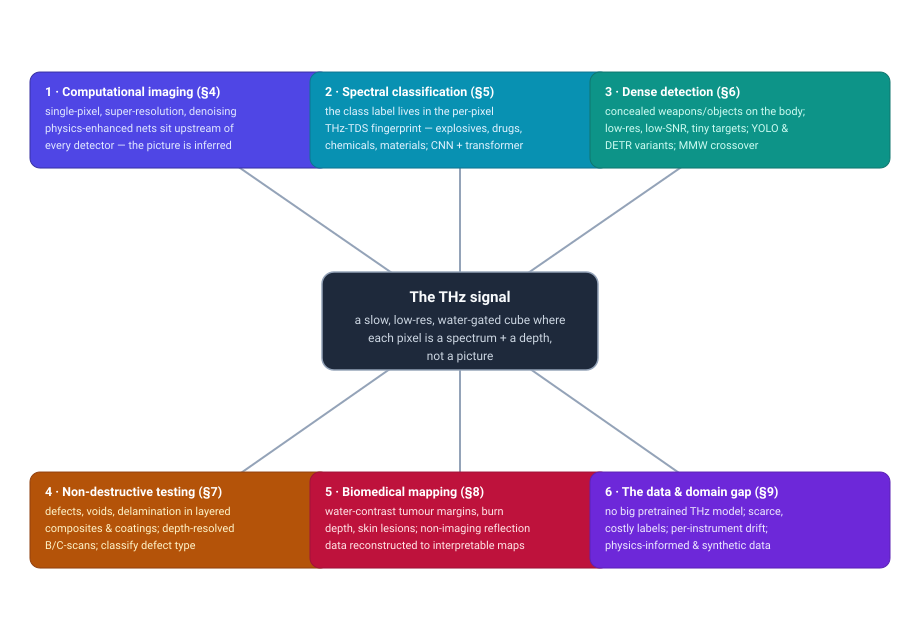
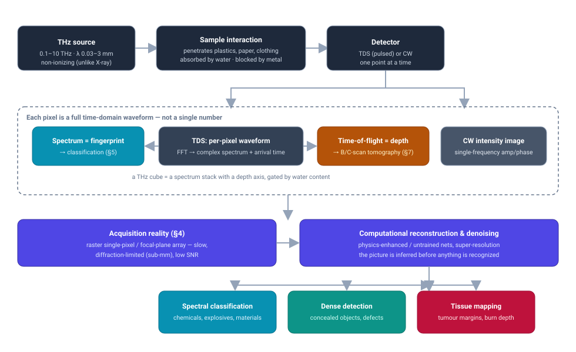

# Dense Object Detection & Classification — Recent Advances

*Compiled 2026-Aug-09 (America/Los_Angeles).*

Next installment in the running CV-updates log. Earlier entries on
`main`:
[Apr-30](../2026-Apr-30/2026-Apr-30_CV_updates.md),
[May-01](../2026-May-01/2026-May-01_CV_updates.md),
[May-02](../2026-May-02/2026-May-02_CV_updates.md),
[May-04](../2026-May-04/2026-May-04_CV_updates.md),
[May-05](../2026-May-05/2026-May-05_CV_updates.md),
[May-07](../2026-May-07/2026-May-07_CV_updates.md),
[May-08](../2026-May-08/2026-May-08_CV_updates.md),
[May-15](../2026-May-15/2026-May-15_CV_updates.md),
[May-16](../2026-May-16/2026-May-16_CV_updates.md),
[May-17](../2026-May-17/2026-May-17_CV_updates.md),
[Jun-09](../2026-Jun-09/2026-Jun-09_CV_updates.md),
[Jun-10](../2026-Jun-10/2026-Jun-10_CV_updates.md),
[Jun-12](../2026-Jun-12/2026-Jun-12_CV_updates.md),
[Jun-15](../2026-Jun-15/2026-Jun-15_CV_updates.md),
[Jun-16](../2026-Jun-16/2026-Jun-16_CV_updates.md),
[Jun-17](../2026-Jun-17/2026-Jun-17_CV_updates.md),
[Jun-19](../2026-Jun-19/2026-Jun-19_CV_updates.md),
[Jun-21](../2026-Jun-21/2026-Jun-21_CV_updates.md),
[Jun-22](../2026-Jun-22/2026-Jun-22_CV_updates.md),
[Jun-23](../2026-Jun-23/2026-Jun-23_CV_updates.md),
[Jun-24](../2026-Jun-24/2026-Jun-24_CV_updates.md),
[Jun-25](../2026-Jun-25/2026-Jun-25_CV_updates.md),
[Jun-27](../2026-Jun-27/2026-Jun-27_CV_updates.md),
[Jun-29](../2026-Jun-29/2026-Jun-29_CV_updates.md),
[Jun-30](../2026-Jun-30/2026-Jun-30_CV_updates.md),
[Jul-04](../2026-Jul-04/2026-Jul-04_CV_updates.md),
[Jul-07](../2026-Jul-07/2026-Jul-07_CV_updates.md),
[Jul-08](../2026-Jul-08/2026-Jul-08_CV_updates.md),
[Jul-10](../2026-Jul-10/2026-Jul-10_CV_updates.md),
[Jul-15](../2026-Jul-15/2026-Jul-15_CV_updates.md),
[Jul-17](../2026-Jul-17/2026-Jul-17_CV_updates.md),
[Jul-18](../2026-Jul-18/2026-Jul-18_CV_updates.md),
[Jul-21](../2026-Jul-21/2026-Jul-21_CV_updates.md),
[Jul-22](../2026-Jul-22/2026-Jul-22_CV_updates.md),
[Jul-24](../2026-Jul-24/2026-Jul-24_CV_updates.md),
[Jul-26](../2026-Jul-26/2026-Jul-26_CV_updates.md),
[Jul-27](../2026-Jul-27/2026-Jul-27_CV_updates.md),
[Jul-30](../2026-Jul-30/2026-Jul-30_CV_updates.md),
[Aug-01](../2026-Aug-01/2026-Aug-01_CV_updates.md),
[Aug-02](../2026-Aug-02/2026-Aug-02_CV_updates.md),
[Aug-04](../2026-Aug-04/2026-Aug-04_CV_updates.md),
[Aug-07](../2026-Aug-07/2026-Aug-07_CV_updates.md).

## Table of contents

1. [Why this pass: terahertz as its own primitive](#why)
2. [Topic map](#map)
3. [The primitive — the gap, the waveform, and the water](#primitive)
4. [Computational imaging: the picture is inferred before anything is recognized](#compimaging)
5. [Spectral classification: the label lives in the fingerprint](#spectral)
6. [Dense detection: concealed objects and the low-resolution, low-SNR tax](#detection)
7. [Non-destructive testing: depth-resolved defects in layered materials](#ndt)
8. [Biomedical mapping: water-contrast margins from non-imaging data](#biomed)
9. [Through-line and open problems](#throughline)
10. [Sources](#sources)

---

## 1. Why this pass: terahertz as its own primitive

This log has now worked through most of the electromagnetic spectrum that
vision cares about — visible optical, thermal LWIR ([Jun-30](../2026-Jun-30/2026-Jun-30_CV_updates.md)),
X-ray transmission ([Jul-15](../2026-Jul-15/2026-Jul-15_CV_updates.md)),
microwave SAR ([Jul-22](../2026-Jul-22/2026-Jul-22_CV_updates.md)) and 4D mmWave
radar ([Jul-04](../2026-Jul-04/2026-Jul-04_CV_updates.md)), plus the spectral
cube of hyperspectral ([Jul-21](../2026-Jul-21/2026-Jul-21_CV_updates.md)).
The band nobody has covered is the one wedged *between* microwaves and the
infrared: **terahertz** (roughly 0.1–10 THz, wavelengths 0.03–3 mm). It has
never had its own entry, and it deserves one because it violates almost every
assumption the rest of the log runs on.

Three facts make THz its own primitive:

- **There barely is a sensor.** The "terahertz gap" is a real hardware
  hole — electronic oscillators run out of steam below it, photonic emitters
  run out above it — so THz systems are slow, low-power, and historically
  raster a *single pixel* across the scene rather than expose a focal-plane
  array. The images that come out are tiny, diffraction-limited to roughly a
  millimetre, and noisy. Recognition therefore cannot start from a clean
  picture; the picture has to be *reconstructed* first (§4).
- **A pixel is not a number — it is a waveform.** The dominant modality,
  **THz time-domain spectroscopy (THz-TDS)**, launches a picosecond pulse and
  records the *entire time-domain electric field* transmitted or reflected at
  each point. One Fourier transform later, every pixel carries a full
  broadband **spectrum** (a rotational–vibrational molecular fingerprint) *and*
  a set of echo arrival times (a **depth** profile). The data object is a
  spectral cube with a time-of-flight axis — closer to a hyperspectral volume
  fused with an ultrasound A-scan than to an RGB frame.
- **Water and metal, not colour, set the contrast.** THz penetrates dry
  dielectrics — clothing, paper, cardboard, plastics, ceramics, many
  composites — but is strongly absorbed by liquid water and completely blocked
  by metal, all while being **non-ionizing**, unlike the X-ray it competes with
  on the security lane. That single absorption law is simultaneously the killer
  app (see through the packaging; read tissue water content) and the killer
  constraint (a few millimetres of skin or a soda can is opaque).

So the field splits cleanly into **two recognition regimes that share almost no
machinery**. When the question is *what is this substance*, the answer is in the
per-pixel spectrum and the work is **classification** on 1-D signals — CNNs,
1-D-transformers, and the occasional SVM on a fingerprint (§5). When the
question is *where is the thing / how deep is the flaw / where is the tumour
edge*, the answer is in the low-resolution spatial map and the work is **dense
detection and segmentation** on hard, small, noisy images (§6–§8), almost always
downstream of a learned reconstruction step (§4). The 2024–2026 story is these
two regimes each maturing, and a shared bottleneck — no large pretrained THz
model, and a savage per-instrument domain gap — that neither has solved.

## 2. Topic map

Six threads, all hanging off the same primitive — a slow, low-resolution,
water-gated cube whose every pixel is a spectrum plus a depth. §4 is the
computational-imaging layer that has to manufacture a usable picture before any
detector runs. §5 is the spectral-fingerprint classification regime. §6 is the
spatial detection regime — concealed-object screening and its low-SNR tax. §7 is
non-destructive testing, where the depth axis becomes the product. §8 is
biomedical mapping, where water contrast turns non-imaging reflection data into
tumour-margin and burn-depth maps. §9 is the shared data-and-domain gap that
caps all five.

## 3. The primitive — the gap, the waveform, and the water

The signal chain (above) is what makes THz its own thing. A source in the
0.1–10 THz band illuminates the sample; because photon energies here are
milli-electronvolt-scale, nothing is ionized — the safety argument against
X-ray. The wave passes cleanly through dry dielectrics, is absorbed in
proportion to water content, and is reflected by conductors. What the detector
records depends on the mode: **pulsed THz-TDS** captures the whole time-domain
waveform per point, while **continuous-wave (CW)** systems read amplitude (and
sometimes phase) at a single frequency. TDS is the richer object — one FFT turns
each pixel's waveform into a complex broadband spectrum, and the timing of
successive echoes gives depth, so a raster scan yields a genuine **spectral cube
with a depth axis**. This is why THz is often described as sitting at the
intersection of spectroscopy and tomography.

The consequence worth internalising is that the *acquisition itself* is the
dominant cost and the dominant noise source. Single-pixel raster scanning is
slow; focal-plane THz arrays are small, expensive and low-yield; and the
diffraction limit at these wavelengths pins native resolution near a
millimetre. Every serious THz vision pipeline therefore spends its first stage
not on recognition but on *making an image worth recognising* — compressive and
single-pixel reconstruction, super-resolution, and denoising (§4). A recent
comprehensive review of concealed-object detection lays out exactly this stack —
sources, detectors, imaging modalities, then image enhancement, feature
extraction and the machine-learning back end — and treats the enhancement stage
as inseparable from the detection stage
([Concealed-object THz review, EAAI 2025](https://www.sciencedirect.com/science/article/abs/pii/S0952197625004324)),
and a 2025 biomedicine review does the same for the tissue side
([THz in biomedicine, iScience 2025](https://www.cell.com/iscience/fulltext/S2589-0042(25)02251-5)).

## 4. Computational imaging: the picture is inferred before anything is recognized

Because the sensor is so limited, THz was one of the first imaging modalities
where **deep computational imaging became load-bearing rather than optional**.
The dominant architecture is the *physics-enhanced network*: rather than learn a
black-box map from measurements to image, the known THz forward model — the
single-pixel measurement matrix, or the near-field-to-far-field propagation
operator — is embedded directly into the network, so the learned part only has to
supply the prior.

- **Single-pixel imaging (SPI)** is the canonical case: a spatial light modulator
  encodes patterns and a single detector integrates, so an image of *N* pixels is
  recovered from *M ≪ N* measurements. A physics-enhanced network drives this to
  an **ultralow sampling ratio of ~1.56%**, collapsing the scan time that
  otherwise kills SPI
  ([high-efficiency THz SPI, Opt. Express 2023](https://pubmed.ncbi.nlm.nih.gov/37157578/)).
  The 2025 escalation is **sub-diffraction backpropagation SPI**: folding a THz
  physical propagation model into the network's output layer lets it reconstruct
  from near-field measurements to a far-field image at **~118 µm resolution
  (≈ λ₀/7)**, beating the classical diffraction limit
  ([DL sub-diffraction backpropagation SPI, arXiv 2505.07839](https://arxiv.org/abs/2505.07839)).
- **Video-rate THz** finally becomes plausible: physics-enhanced deep learning
  combined with a VCSEL-array modulator reports **real-time capture at ~50 fps**
  (32×32) and outperforms pure data-driven reconstruction and classical basis
  scanning
  ([video-rate THz SPI, APL Photonics 2026](https://pubs.aip.org/aip/app/article/11/6/066108/3394464/Video-rate-terahertz-single-pixel-imaging-via)),
  with a related **compressive optical–digital neural network** design pushing the
  reconstruction partly into optics
  ([THz compressive optical–digital NN imaging, APL Photonics 2025](https://pubs.aip.org/aip/app/article/10/9/090801/3361273/Terahertz-compressive-optical-digital-neural)).
  Sub-wavelength single-pixel *video* has also been demonstrated
  ([THz subwavelength single-pixel video, 2025](https://www.researchgate.net/publication/395911374_Terahertz_subwavelength_single-pixel_video_based_on_computational_imaging)),
  against the longer-running backdrop of high-throughput THz imaging as an
  open problem ([high-throughput THz imaging, 2023](https://phys.org/news/2023-10-high-throughput-terahertz-imaging.html)).
- **Denoising and super-resolution** are the other half. A multiscale
  hybrid-convolution residual network (**MHRNet**) predicts local residual noise
  to clean raster THz images
  ([MHRNet THz denoising, CAAI Trans. Intell. Tech. 2025](https://ietresearch.onlinelibrary.wiley.com/doi/full/10.1049/cit2.12380)),
  and — importantly for a modality with almost no labels — a **PCA-based
  self-supervised** scheme learns denoising *and* deblurring without clean
  ground truth ([PCA-based self-supervised THz DNN, arXiv 2601.12149](https://arxiv.org/pdf/2601.12149)).
  Hybrid frameworks that pair a single-point scanning detector with a learned
  reconstruction close the loop between cheap hardware and usable images
  ([hybrid single-point-scan THz DL framework, Optik 2025](https://www.sciencedirect.com/science/article/abs/pii/S0030399225012289)).

The through-line: in most modalities reconstruction and recognition are separate
literatures; in THz they are one pipeline, and the reconstruction net's job is to
hand the detector an image that a detector from any other modality would accept.

## 5. Spectral classification: the label lives in the fingerprint

This is the regime with no spatial analogue. Because a THz-TDS pixel carries a
broadband spectrum, and because many molecules have distinctive
rotational–vibrational absorption lines in this band, **the class label is
written directly in the per-pixel signal** — exactly the situation this log met
in hyperspectral, but with chemistry-grade specificity for solids like
explosives, narcotics and pharmaceuticals.

The flagship 2026 result is a chemical-imaging system pairing **THz-TDS with
deep learning** for *pixel-level* identification of explosives and other
chemicals. The hardware — plasmonic-nanoantenna THz-TDS with a reported **~96 dB
peak dynamic range and ~4.5 THz bandwidth** — is what makes stand-off spectra
clean enough to classify, and a **CNN + transformer** back end reports **~99.42%
classification accuracy across eight chemical species** on exposed samples,
holding **~88.83%** when the target is concealed under opaque paper
([chemicals & hidden explosives via THz-TDS + DL, Light: Sci. Appl. 2026](https://www.nature.com/articles/s41377-026-02190-z);
open-access mirror [PMC12824377](https://www.ncbi.nlm.nih.gov/pmc/articles/PMC12824377/),
[techXplore summary](https://techxplore.com/news/2026-01-concealed-explosives-terahertz-spectral-imaging.html)).
That concealed-vs-exposed gap is the whole ballgame — it quantifies how much
fingerprint survives a covering layer, which is the difference between a lab demo
and a checkpoint.

The same fingerprint logic is spreading into materials and agriculture. Defect
recognition in composites converts THz spectra to time–frequency images via
continuous wavelet transform and classifies with a **ResNet18–SVM** hybrid at a
reported **98.56%** across three defect types
([ResNet18-SVM composite THz, Materials 2025](https://www.mdpi.com/1996-1944/18/11/2444)),
and THz-TDS plus a CNN discriminates **transgenic corn varieties** from their
spectra
([transgenic-corn THz + CNN, 2025](https://www.sciencedirect.com/science/article/abs/pii/S0889157525005861)) —
a reminder that the "classification" here is often a chemistry question wearing a
vision paper's clothes. The methodological point is consistent across the review
literature: CNN, RNN, GAN and transformer architectures are all being ported onto
THz spectra and hyperspectral-style cubes, but the winning move is usually a
domain-aware transform (wavelet, PCA) feeding a modest network, because there is
not enough data to feed a large one.

## 6. Dense detection: concealed objects and the low-resolution, low-SNR tax

The spatial-detection regime is dominated by one application — **security
screening for concealed objects on the body** — and by one hard fact: the images
are small, blurry and noisy, so detectors tuned on natural images transfer
badly. This is the sibling problem to infrared small-target and passive-mmWave
detection the log has touched before, and THz inherits both the low-resolution
tax and the metal/water contrast quirks.

- **Real-time detectors, shrunk.** The practical line of work adapts one-stage
  detectors to THz: modified/weighted **YOLOv5** and lightweight **YOLOv7**
  variants for multi-object contraband recognition, chosen for speed on the
  screening lane and robustness to the low pixel count
  ([optimal DL for hidden weapons in THz & mmWave, Earth Sci. Inform. 2023](https://link.springer.com/article/10.1007/s12145-023-01056-x)).
  The recurring finding is that off-the-shelf anchors and NMS thresholds must be
  retuned hard for millimetre-scale blobs against cluttered body returns.
- **Transformers for the fusion problem.** A **cross-feature fusion transformer**
  targets concealed *hazardous* object detection specifically, fusing
  complementary features to pull faint threats out of body clutter
  ([cross-feature fusion transformer for concealed THz objects, 2024](https://www.sciencedirect.com/science/article/abs/pii/S0143816624004329)),
  echoing the passive-mmWave line where a **task-aligned detection transformer**
  handles the same low-contrast regime on the neighbouring band
  ([task-aligned DETR for passive mmWave, arXiv 2212.00313](https://arxiv.org/pdf/2212.00313)).
- **The band is a spectrum, not a point.** THz screening rarely stands alone —
  it is co-deployed with **millimetre-wave** body scanners, and the surveys frame
  AI-for-aviation-security as a *multi-band* problem spanning MMW, sub-THz and THz
  ([AI + MMW/THz in civil-aviation security, 2026](https://link.springer.com/chapter/10.1007/978-981-95-9626-3_49);
  [real-time sub-THz body scanner, JIMTW 2020](https://link.springer.com/article/10.1007/s10762-020-00683-5)),
  with commercial sub-THz portals already fielded
  ([Nuctech TH1800 THz imager](https://www.nuctech.com.ar/en/producto/nuctech-th1800-terahertz-infrared-imaging-instrument/)).
  The crossover with thermal is live too — concealed-weapon detectors like
  **DEF-YOLO** show the same design pressures (tiny, low-contrast targets) on the
  IR side ([DEF-YOLO, arXiv 2510.13326](https://arxiv.org/html/2510.13326v1)).

The comprehensive 2025 review is the map for this whole thread: it catalogues the
architectures, the enhancement-then-detect pipeline, and — bluntly — the fact
that public THz detection datasets are tiny and non-standard, so cross-paper
numbers are not comparable ([Concealed-object THz review, EAAI 2025](https://www.sciencedirect.com/science/article/abs/pii/S0952197625004324)).
That data problem is §9.

## 7. Non-destructive testing: depth-resolved defects in layered materials

Industrial NDT is where THz's *depth* axis stops being a curiosity and becomes
the product. Because the pulse reflects at every dielectric interface, a THz-TDS
scan of a coating, laminate or foam core returns a per-pixel **A-scan** (echoes
vs. depth) that stacks into **B-** and **C-scans** — a tomographic map of what is
buried where. It competes directly with ultrasound and X-ray CT, and its pitch is
that it needs no couplant, uses non-ionizing radiation, scatters less than
ultrasound, and sees through non-conductive materials that block or blur the
alternatives.

The 2025–2026 work is squarely detection-and-classification on these depth
volumes:

- **Attention detectors for hidden flaws.** **DyHRMADet** — a dynamic
  high-resolution multi-level attention network — targets minor and hidden
  composite defects, combining multi-scale spatial detail with high-level
  semantics to localise and identify defect *type*
  ([DyHRMADet, NDT&E Int. 2025](https://www.tandfonline.com/doi/full/10.1080/10589759.2025.2580403)).
- **Reconstruction as the accuracy lever.** A high-resolution framework pairs THz
  NDT with deep image reconstruction and reports **~96.4%** detection accuracy
  with a **~32% spatial-resolution gain**, enough to separate micro-cracks, voids
  and delamination that a raw scan smears together
  ([high-res composite defect detection via THz NDT + deep reconstruction, 2026](https://www.emerald.com/jfoen/article/doi/10.1680/jfoen.25.00031/1331628/High-resolution-defect-detection-in-composite)) —
  the same §4 lesson, that in THz the reconstruction stage *is* the detection
  improvement.
- **AI-augmented localisation and thin-defect limits.** Recent work pushes
  defect *localisation* in composites with AI-augmented THz imaging
  ([AI-augmented THz defect localisation, J. Nondestruct. Eval. 2026](https://link.springer.com/article/10.1007/s10921-026-01359-1)),
  while CNNs tackle the genuinely hard case — *thin* micro-defects in
  glass-reinforced polymer, near the axial resolution floor
  ([thin micro-defects in GRP via THz + CNN, 2023](https://www.sciencedirect.com/science/article/abs/pii/S135983682300197X)) —
  with foam-core sandwich panels a standard testbed
  ([PMI-foam sandwich THz-TDS NDT, Sensors 2024](https://www.ncbi.nlm.nih.gov/pmc/articles/PMC10974246/)).

## 8. Biomedical mapping: water-contrast margins from non-imaging data

Biomedical THz runs entirely on one contrast mechanism: **tissue water**. Tumours
and healthy tissue, or burned and viable skin, differ in bound- and free-water
content and in refractive index, and THz reflectivity reads that difference
directly — which is why the pitch is *label-free, non-ionizing* delineation of
things optical inspection cannot see. The catch is depth: THz only probes the top
few hundred micrometres to a couple of millimetres of wet tissue, so the
application is surfaces and margins, not deep organs. The 2025 reviews survey the
whole biomedical stack — cancer, wound healing, tissue engineering — and its
convergence with deep learning
([THz in biomedicine, iScience 2025](https://www.cell.com/iscience/fulltext/S2589-0042(25)02251-5);
[THz for skin detection, Photobiomodul. 2025](https://doi.org/10.1089/photob.2024.0079)).

The recognition twist, and the reason it belongs in a *dense* detection log, is
that the raw reflection signal is frequently **not an image at all** — it is a
sparse set of point measurements — so the pipeline's job is to *turn signals into
interpretable spatial maps* and then segment them:

- **Signals → maps → diagnosis.** A dual-path reconstruction pipeline transforms
  non-imaging THz reflection data into 2-D spatial maps via **PCA + U-Net**,
  explicitly bridging physical acquisition and image-based diagnosis for early
  skin-cancer detection
  ([tunable THz sensing + DL image reconstruction for skin cancer, Photonics Nanostruct. 2025](https://www.sciencedirect.com/science/article/abs/pii/S1878778925000237)).
- **Physics-based triage.** For burns, **physics-based deep-learning** models on a
  THz spectral scanner triage wound severity — depth and healing potential —
  where visual/tactile inspection is unreliable
  ([physics-based DL burn triage via THz scanner, 2025](https://www.ncbi.nlm.nih.gov/pmc/articles/PMC11958346/)).
- **Polarimetry and cross-modal grounding.** THz *polarimetry* detects
  microscopic tissue changes linked to cancer and burns, adding a
  polarization channel to the water contrast
  ([THz polarimetry for cancer/burns, SPIE 2025](https://spie.org/news/terahertz-polarimetry-detects-microscopic-tissue-changes-linked-to-cancer-and-burns);
  [ecancer summary](https://ecancer.org/en/news/26572-terahertz-polarimetry-detects-microscopic-tissue-changes-linked-to-cancer-and-burns)) —
  the same polarization primitive the log covered on [Jul-27](../2026-Jul-27/2026-Jul-27_CV_updates.md),
  now in the THz band. And because labelled THz histology is almost nonexistent,
  a pragmatic route trains macroscopic AI **segmentation on digital pathology** to
  lay foundations for future THz-imaging diagnostics
  ([macroscopic AI seg for brain tumour, foundations for THz diagnostics, 2024](https://www.ncbi.nlm.nih.gov/pmc/articles/PMC11616600/)).

## 9. Through-line and open problems

The two regimes of §5 and §6–§8 look unrelated — 1-D spectral classification vs.
2-D dense detection — but they are capped by the *same* three problems, and none
is solved.

1. **There is no ImageNet of terahertz, and there may never be one cheaply.**
   Every other modality in this log eventually got a large pretrained backbone;
   THz has none, because the sensors are slow and scarce and labelling requires
   ground truth that is itself expensive to obtain. The field's answers are all
   data-frugal by necessity: **self-supervised** denoising and pretraining
   ([PCA-based self-supervised THz DNN](https://arxiv.org/pdf/2601.12149)),
   domain-aware transforms feeding *small* networks (§5), and borrowing labels
   from adjacent modalities like digital pathology (§8). Whether a THz foundation
   model is even the right goal — versus a strong physics prior plus a little
   data — is genuinely open.
2. **Reconstruction is not a preprocessing detail; it is where the accuracy is.**
   Across §4, §7 and §8 the recurring empirical result is that the *reconstruction*
   step delivers the detection gain — the 32% resolution lift that separates
   micro-cracks, the PCA+U-Net map that makes skin lesions segmentable, the
   sub-diffraction SPI that beats the physical limit. THz is the clearest case in
   the whole log of recognition and reconstruction being one joint problem, and
   the physics-enhanced network — forward model in the loop — is the design that
   keeps winning.
3. **The domain gap is per-instrument, per-frequency, per-day.** THz systems
   differ in centre frequency, bandwidth, pulse shape, dynamic range and
   humidity sensitivity (atmospheric water absorbs THz), so a model trained on one
   scanner rarely transfers to another, and the tiny non-standard datasets mean
   cross-paper numbers are not comparable ([EAAI 2025 review](https://www.sciencedirect.com/science/article/abs/pii/S0952197625004324)).
   Until there is shared calibration and shared benchmarks, the headline
   accuracies in §5–§7 should be read as *within-instrument* ceilings, not
   deployable guarantees.

The honest summary: terahertz is a modality where the *physics* is the moat and
the *data* is the wall. The recent advances are real — pixel-level chemical
classification approaching the high-90s, sub-diffraction real-time imaging,
depth-resolved defect maps, water-contrast tumour margins from non-imaging data —
but almost every one of them is a physics-informed network compensating for a
sensor that cannot yet hand vision a clean, large, standardized picture. That is
what makes THz its own primitive, and what will decide whether it graduates from
the checkpoint and the lab bench to everywhere else.

## 10. Sources

**The primitive & review scaffolding (§1, §3)**
- Detection of concealed object using THz images — a comprehensive review — EAAI 2025: [ScienceDirect](https://www.sciencedirect.com/science/article/abs/pii/S0952197625004324) · [DOI 10.1016/j.engappai.2025.110432](https://dl.acm.org/doi/10.1016/j.engappai.2025.110432)
- Application of THz spectroscopy and imaging in biomedicine (review) — iScience 2025: [Cell Press](https://www.cell.com/iscience/fulltext/S2589-0042(25)02251-5)
- Research advances in THz technology for skin detection (review) — Photobiomodulation 2025: [DOI 10.1089/photob.2024.0079](https://doi.org/10.1089/photob.2024.0079)

**Computational imaging: single-pixel, super-resolution, denoising (§4)**
- Deep-learning sub-diffraction THz backpropagation single-pixel imaging (~118 µm, ≈λ₀/7) — 2025: [arXiv 2505.07839](https://arxiv.org/abs/2505.07839)
- High-efficiency THz single-pixel imaging via physics-enhanced network (~1.56% sampling) — Opt. Express 2023: [PubMed 37157578](https://pubmed.ncbi.nlm.nih.gov/37157578/)
- Video-rate THz single-pixel imaging via physics-enhanced DL + VCSEL-array modulation (~50 fps) — APL Photonics 2026: [AIP](https://pubs.aip.org/aip/app/article/11/6/066108/3394464/Video-rate-terahertz-single-pixel-imaging-via)
- THz compressive optical–digital neural-network imaging — APL Photonics 2025: [AIP](https://pubs.aip.org/aip/app/article/10/9/090801/3361273/Terahertz-compressive-optical-digital-neural)
- THz subwavelength single-pixel video based on computational imaging — 2025: [ResearchGate](https://www.researchgate.net/publication/395911374_Terahertz_subwavelength_single-pixel_video_based_on_computational_imaging)
- High-throughput THz imaging: progress and challenges — 2023: [phys.org](https://phys.org/news/2023-10-high-throughput-terahertz-imaging.html)
- THz image denoising via multiscale hybrid-convolution residual network (MHRNet) — CAAI Trans. Intell. Tech. 2025: [Wiley/IET](https://ietresearch.onlinelibrary.wiley.com/doi/full/10.1049/cit2.12380)
- PCA-based THz self-supervised denoising and deblurring DNNs — 2026: [arXiv 2601.12149](https://arxiv.org/pdf/2601.12149)
- Hybrid framework for THz imaging via DL using a single-point scanning detector — Optik 2025: [ScienceDirect](https://www.sciencedirect.com/science/article/abs/pii/S0030399225012289)

**Spectral classification: the fingerprint regime (§5)**
- Detection & imaging of chemicals and hidden explosives via THz-TDS + DL (CNN+transformer; ~99.42% exposed / ~88.83% concealed; 96 dB, 4.5 THz) — Light: Sci. Appl. 2026: [Nature](https://www.nature.com/articles/s41377-026-02190-z) · [PMC12824377](https://www.ncbi.nlm.nih.gov/pmc/articles/PMC12824377/) · [techXplore](https://techxplore.com/news/2026-01-concealed-explosives-terahertz-spectral-imaging.html)
- Defect recognition in composites via THz spectral imaging, ResNet18-SVM (CWT time–frequency; ~98.56%) — Materials 2025: [MDPI](https://www.mdpi.com/1996-1944/18/11/2444) · [PubMed 40508444](https://pubmed.ncbi.nlm.nih.gov/40508444/)
- Classification of transgenic corn varieties via THz spectroscopy + CNN — 2025: [ScienceDirect](https://www.sciencedirect.com/science/article/abs/pii/S0889157525005861)

**Dense detection: concealed-object screening (§6)**
- An optimal DL model for hidden hazardous weapons in THz & mmWave images (MWYOLOv5 / lightweight YOLOv7) — Earth Sci. Inform. 2023: [Springer](https://link.springer.com/article/10.1007/s12145-023-01056-x)
- Concealed hazardous object detection for THz images with cross-feature fusion transformer — 2024: [ScienceDirect](https://www.sciencedirect.com/science/article/abs/pii/S0143816624004329)
- Concealed object detection for passive mmWave imaging via task-aligned detection transformer — 2022: [arXiv 2212.00313](https://arxiv.org/pdf/2212.00313)
- AI integration with mmWave, THz and other tech in civil-aviation security (review) — 2026: [Springer](https://link.springer.com/chapter/10.1007/978-981-95-9626-3_49)
- New real-time sub-THz security body scanner — J. Infrared Millim. THz Waves 2020: [Springer](https://link.springer.com/article/10.1007/s10762-020-00683-5)
- Nuctech TH1800 THz imaging instrument (fielded sub-THz portal): [product page](https://www.nuctech.com.ar/en/producto/nuctech-th1800-terahertz-infrared-imaging-instrument/)
- DEF-YOLO: concealed-weapon detection in thermal imaging (adjacent-band crossover) — 2025: [arXiv 2510.13326](https://arxiv.org/html/2510.13326v1)

**Non-destructive testing (§7)**
- DyHRMADet: dynamic high-resolution multi-level attention detection for composite defects — NDT&E Int. 2025: [Taylor & Francis](https://www.tandfonline.com/doi/full/10.1080/10589759.2025.2580403)
- High-resolution composite defect detection via THz NDT + deep reconstruction (~96.4%, +32% resolution) — 2026: [Emerald](https://www.emerald.com/jfoen/article/doi/10.1680/jfoen.25.00031/1331628/High-resolution-defect-detection-in-composite) · [ResearchGate](https://www.researchgate.net/publication/398987218_High-resolution_defect_detection_in_composite_materials_using_terahertz_NDT_and_deep_reconstruction)
- Defect localization in composites using AI-augmented THz imaging — J. Nondestruct. Eval. 2026: [Springer](https://link.springer.com/article/10.1007/s10921-026-01359-1)
- Non-destructive detection of thin micro-defects in GRP composites via THz + CNN — 2023: [ScienceDirect](https://www.sciencedirect.com/science/article/abs/pii/S135983682300197X)
- NDT of a fiber-web-reinforced PMI foam sandwich panel with THz-TDS — Sensors 2024: [PMC10974246](https://www.ncbi.nlm.nih.gov/pmc/articles/PMC10974246/)

**Biomedical mapping (§8)**
- Tunable THz sensing for early skin-cancer detection via DL image reconstruction (PCA + U-Net) — Photonics Nanostruct. 2025: [ScienceDirect](https://www.sciencedirect.com/science/article/abs/pii/S1878778925000237)
- Physics-based DL for accurate triage of burn wounds using a THz spectral scanner — 2025: [PMC11958346](https://www.ncbi.nlm.nih.gov/pmc/articles/PMC11958346/)
- THz polarimetry detects microscopic tissue changes linked to cancer and burns — SPIE 2025: [SPIE news](https://spie.org/news/terahertz-polarimetry-detects-microscopic-tissue-changes-linked-to-cancer-and-burns) · [ecancer](https://ecancer.org/en/news/26572-terahertz-polarimetry-detects-microscopic-tissue-changes-linked-to-cancer-and-burns)
- DL macroscopic AI segmentation for brain-tumour detection via digital pathology — foundations for THz-imaging diagnostics — 2024: [PMC11616600](https://www.ncbi.nlm.nih.gov/pmc/articles/PMC11616600/)

---

### Diagram: the two recognition regimes and their shared bottleneck

```mermaid
flowchart TD
    A["THz-TDS acquisition<br/>one ps-pulse waveform per pixel"] --> B["FFT per pixel"]
    B --> C["Broadband spectrum<br/>molecular fingerprint"]
    B --> D["Echo arrival times<br/>depth / time-of-flight"]

    A -.slow, low-res, low-SNR.-> R["Computational reconstruction<br/>& denoising (physics-enhanced nets)"]
    R --> IMG["Usable low-res image / cube"]

    C --> CLS["Spectral classification<br/>chemicals · explosives · materials"]
    IMG --> DET["Dense detection<br/>concealed objects on the body"]
    D --> NDT["Depth-resolved NDT<br/>voids · cracks · delamination"]
    IMG --> BIO["Biomedical mapping<br/>water-contrast tumour margins · burn depth"]

    CLS --> GAP["Shared bottleneck:<br/>no large pretrained THz model ·<br/>scarce/costly labels ·<br/>per-instrument domain gap"]
    DET --> GAP
    NDT --> GAP
    BIO --> GAP

    classDef acq fill:#1e293b,stroke:#94a3b8,color:#f8fafc;
    classDef spec fill:#0891b2,stroke:#0e7490,color:#ffffff;
    classDef depth fill:#b45309,stroke:#92400e,color:#ffffff;
    classDef recon fill:#4f46e5,stroke:#3730a3,color:#ffffff;
    classDef det fill:#0d9488,stroke:#0f766e,color:#ffffff;
    classDef bio fill:#be123c,stroke:#9f1239,color:#ffffff;
    classDef gap fill:#6d28d9,stroke:#5b21b6,color:#ffffff;

    class A,B acq;
    class C,CLS spec;
    class D,NDT depth;
    class R,IMG recon;
    class DET det;
    class BIO bio;
    class GAP gap;
```

*Each THz-TDS pixel forks into a spectrum (→ classification) and a depth
(→ tomographic NDT); the spatial regimes (detection, biomedical mapping) ride on
a reconstructed low-resolution image; all four feed back into the same
data-and-domain bottleneck.*
