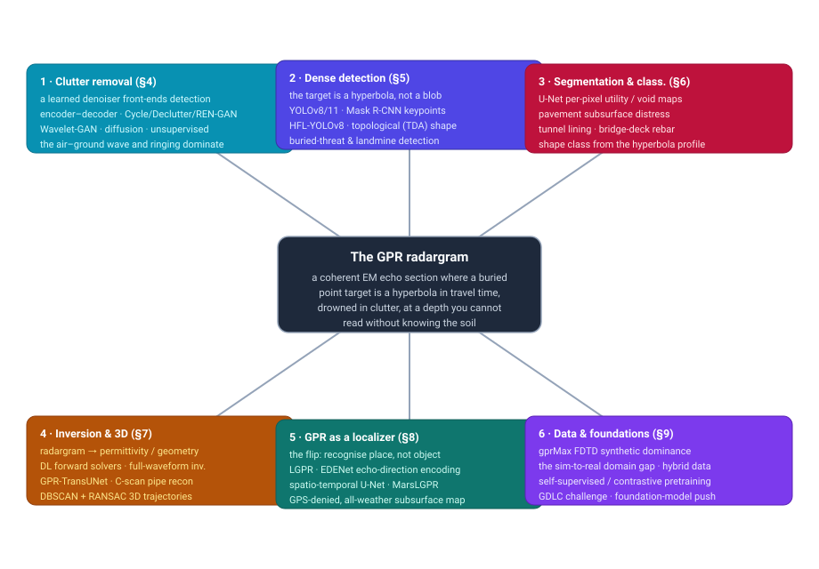
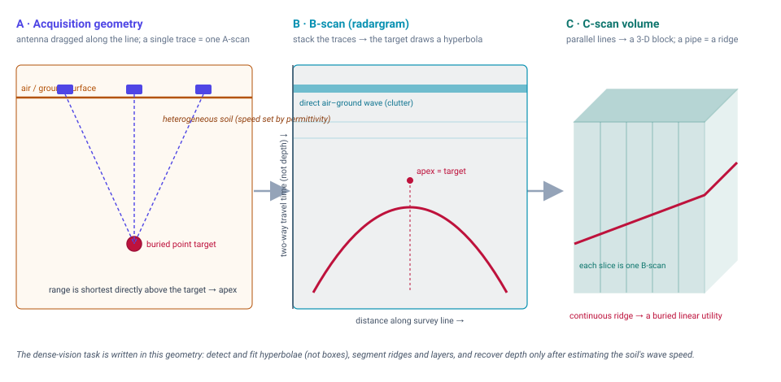
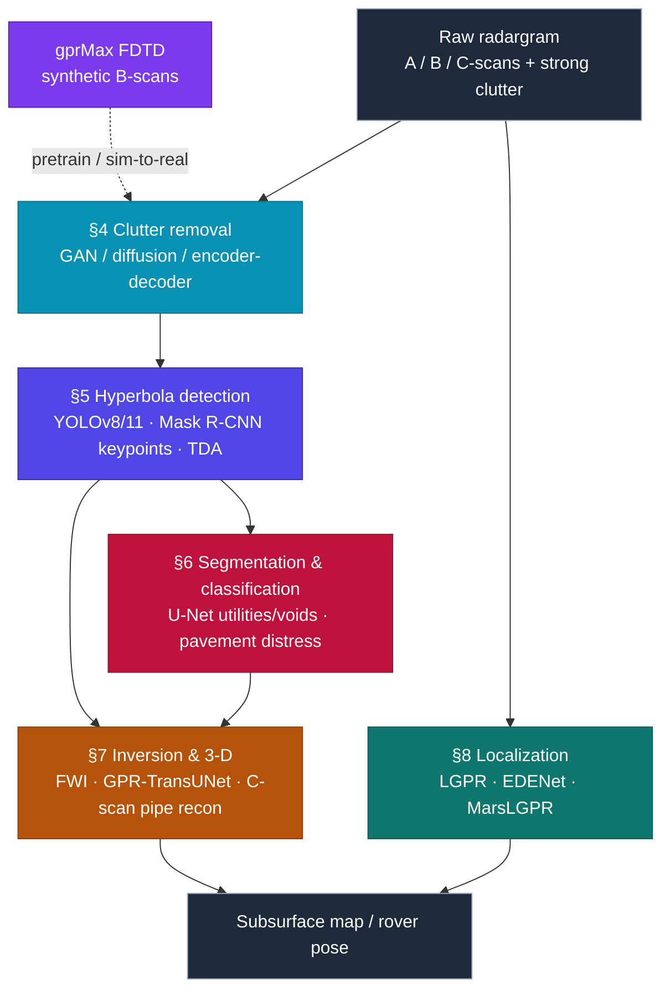

# Dense Object Detection & Classification — Recent Advances

*Compiled 2026-Aug-10 (America/Los_Angeles).*

Next installment in the running CV-updates log. Earlier entries on
`main`:
[Apr-30](../2026-Apr-30/2026-Apr-30_CV_updates.md),
[May-01](../2026-May-01/2026-May-01_CV_updates.md),
[May-02](../2026-May-02/2026-May-02_CV_updates.md),
[May-04](../2026-May-04/2026-May-04_CV_updates.md),
[May-05](../2026-May-05/2026-May-05_CV_updates.md),
[May-07](../2026-May-07/2026-May-07_CV_updates.md),
[May-08](../2026-May-08/2026-May-08_CV_updates.md),
[May-15](../2026-May-15/2026-May-15_CV_updates.md),
[May-16](../2026-May-16/2026-May-16_CV_updates.md),
[May-17](../2026-May-17/2026-May-17_CV_updates.md),
[Jun-09](../2026-Jun-09/2026-Jun-09_CV_updates.md),
[Jun-10](../2026-Jun-10/2026-Jun-10_CV_updates.md),
[Jun-12](../2026-Jun-12/2026-Jun-12_CV_updates.md),
[Jun-15](../2026-Jun-15/2026-Jun-15_CV_updates.md),
[Jun-16](../2026-Jun-16/2026-Jun-16_CV_updates.md),
[Jun-17](../2026-Jun-17/2026-Jun-17_CV_updates.md),
[Jun-19](../2026-Jun-19/2026-Jun-19_CV_updates.md),
[Jun-21](../2026-Jun-21/2026-Jun-21_CV_updates.md),
[Jun-22](../2026-Jun-22/2026-Jun-22_CV_updates.md),
[Jun-23](../2026-Jun-23/2026-Jun-23_CV_updates.md),
[Jun-24](../2026-Jun-24/2026-Jun-24_CV_updates.md),
[Jun-25](../2026-Jun-25/2026-Jun-25_CV_updates.md),
[Jun-27](../2026-Jun-27/2026-Jun-27_CV_updates.md),
[Jun-29](../2026-Jun-29/2026-Jun-29_CV_updates.md),
[Jun-30](../2026-Jun-30/2026-Jun-30_CV_updates.md),
[Jul-04](../2026-Jul-04/2026-Jul-04_CV_updates.md),
[Jul-07](../2026-Jul-07/2026-Jul-07_CV_updates.md),
[Jul-08](../2026-Jul-08/2026-Jul-08_CV_updates.md),
[Jul-10](../2026-Jul-10/2026-Jul-10_CV_updates.md),
[Jul-15](../2026-Jul-15/2026-Jul-15_CV_updates.md),
[Jul-17](../2026-Jul-17/2026-Jul-17_CV_updates.md),
[Jul-18](../2026-Jul-18/2026-Jul-18_CV_updates.md),
[Jul-21](../2026-Jul-21/2026-Jul-21_CV_updates.md),
[Jul-22](../2026-Jul-22/2026-Jul-22_CV_updates.md),
[Jul-24](../2026-Jul-24/2026-Jul-24_CV_updates.md),
[Jul-26](../2026-Jul-26/2026-Jul-26_CV_updates.md),
[Jul-27](../2026-Jul-27/2026-Jul-27_CV_updates.md),
[Jul-30](../2026-Jul-30/2026-Jul-30_CV_updates.md),
[Aug-01](../2026-Aug-01/2026-Aug-01_CV_updates.md),
[Aug-02](../2026-Aug-02/2026-Aug-02_CV_updates.md),
[Aug-04](../2026-Aug-04/2026-Aug-04_CV_updates.md),
[Aug-07](../2026-Aug-07/2026-Aug-07_CV_updates.md).

## Table of contents

1. [Why this pass: GPR as its own primitive](#why)
2. [Topic map](#map)
3. [The primitive — a hyperbola in travel time, drowned in clutter](#primitive)
4. [Clutter removal as a learned front end](#clutter)
5. [Dense detection: the target is a hyperbola, not a box](#detection)
6. [Segmentation & classification: utilities, voids, and pavement distress](#segmentation)
7. [Inversion & 3D: from radargram to geometry and permittivity](#inversion)
8. [The flip: GPR as a localization sensor](#localization)
9. [The data problem and the foundation-model horizon](#data)
10. [Through-line and open problems](#throughline)
11. [Sources](#sources)

---

## 1. Why this pass: GPR as its own primitive

This log has now worked through a long list of sensing modalities on their own
terms — optical and thermal cameras, LiDAR, automotive imaging radar, SAR,
sonar, ultrasound, X-ray/CT, MRI, PET, OCT, hyperspectral. Almost all of them
share a quiet assumption: the sensor looks **at a surface**, and the thing you
want to detect is *there in the image*, occupying pixels, castable as a box or a
mask. **Ground-penetrating radar breaks that assumption twice over.**

First, GPR looks *down*, into an opaque, heterogeneous medium — soil, concrete,
asphalt, rock, ice — and the target is buried. There is nothing to "see." What
comes back is a coherent, wide-band electromagnetic echo: a short pulse
(typically 100 MHz–2.6 GHz) is radiated into the ground, reflects off any
interface where the dielectric permittivity changes, and the two-way travel time
and amplitude of the echo are recorded. Second — and this is the part that
reshapes the whole computer-vision problem — a *compact* buried object does not
appear as a compact blob. Because the antenna is dragged along the surface and
"sees" the object at a slant range that is shortest directly above it and grows
as the antenna moves away, a point target draws a **downward-opening hyperbola**
in the resulting image. The object is *at the apex*; the two arms are the same
object seen from a distance. Dense detection here means detecting and fitting
*hyperbolae*, and classification means reading the object's material and shape
out of the hyperbola's curvature and polarity.

On top of that sits the modality's signature difficulty. The vertical axis of a
GPR image is **two-way travel time, not depth** — you can only convert it to
depth if you know the wave speed, which depends on the soil's permittivity,
which depends on moisture and composition and is usually *unknown and spatially
varying*. And the dominant signal is not the target but **clutter**: the huge
direct air–ground reflection across the top of every record, antenna ringing,
horizontal layering, and the random scattering of a heterogeneous medium, any of
which can bury a weak target return. Ground truth requires *excavation*, so
labeled real data is scarce and expensive; the field leans hard on physics
simulators ([gprMax](https://www.gprmax.com/) FDTD) for training data, which
opens a sim-to-real gap that never fully closes.

So GPR is a genuinely distinct dense-vision primitive: a coherent echo section
where the class label lives in a hyperbola's geometry, the depth axis is a
travel-time coordinate coupled to an unknown medium, and the loudest thing in
every image is the thing you must remove. The 2024–2026 literature is a
coherent response to exactly those facts — a learned clutter front end,
hyperbola-aware detectors, per-pixel utility/void/distress maps, learned
inversion, and a striking second use of the sensor as a **localizer** rather
than a detector. Two recent surveys frame the whole space:
[*Bridging Theory and Practice: A Review of AI-Driven Techniques for GPR
Interpretation*](https://www.mdpi.com/2076-3417/15/15/8177) (Applied Sciences,
2025) and a
[*Comprehensive review of deep learning applications in ground penetrating
radar*](https://www.sciencedirect.com/science/article/abs/pii/S096386952600109X)
(Measurement, 2026).

## 2. Topic map

Six threads, all hanging off the same primitive — a coherent echo section in
which a buried point target is a hyperbola in two-way travel time, drowned in
clutter, at a depth you cannot read without first knowing the soil. §4 is the
learned clutter front end that most detection pipelines now depend on. §5 is
dense detection proper: finding and fitting hyperbolae. §6 is per-pixel
segmentation and shape/material classification — utilities, voids, and pavement
distress. §7 is inversion and 3D reconstruction: turning the radargram into
subsurface geometry and permittivity. §8 is the flip — GPR used as a
GPS-denied *localization* sensor rather than a detector. §9 is the data problem
(synthetic dominance, the sim-to-real gap) and the nascent foundation-model
push.

## 3. The primitive — a hyperbola in travel time, drowned in clutter

The data model is a three-level hierarchy. A single antenna position gives an
**A-scan** — one time-vs-amplitude trace, the echo returning from directly (and
obliquely) below. Drag the antenna along a line and stack the traces
side-by-side and you get a **B-scan**, or *radargram*: a 2-D image whose
horizontal axis is distance along the line and whose vertical axis is two-way
travel time (increasing downward). Run a grid of parallel lines and you get a
**C-scan** — a 3-D volume, from which horizontal depth slices and 3-D
iso-surfaces can be cut. The dense-vision task attaches at each level: A-scan
classification, B-scan detection/segmentation, and C-scan 3-D reconstruction.

Three facts make the B-scan unlike an ordinary image, and every downstream
method is shaped by them:

- **A point target is a hyperbola.** The apex sits at the target's horizontal
  position and shallowest travel time; the two symmetric arms are the *same*
  object imaged from adjacent antenna positions at a longer slant range. The
  curvature of the hyperbola encodes the wave speed (hence the medium), and its
  width encodes depth. So a detector is really looking for a parametric curve,
  and fitting that curve yields position, depth, and a permittivity estimate in
  one shot. This is why so much of the field is *hyperbola detection and fitting*
  rather than generic object detection.
- **The vertical axis is time, not depth.** Converting travel time to depth
  requires the medium's relative permittivity ε_r (the wave speed is
  c/√ε_r). In wet soil ε_r can be several times its dry value, so the *same*
  buried pipe images at a different apparent depth and hyperbola shape after
  rain. Depth is coupled to an unknown, spatially varying medium — a nuisance
  parameter you must estimate, not a given.
- **Clutter is the loudest signal.** The direct air–ground reflection is a
  strong horizontal band across the top of every record; antenna ringing,
  flat-lying soil layers, and rebar grids add more horizontal structure; and a
  heterogeneous medium scatters energy everywhere. A weak target hyperbola can
  sit *below the clutter floor*. Unlike additive Gaussian noise, this clutter is
  structured and correlated, which is exactly why it became a learned-model
  problem rather than a filtering one (§4).

The canonical modern pipeline, and where each thread plugs in:

Note the two entry points. Detection/segmentation/inversion consume a
*cleaned* radargram and read objects out of it; localization (§8) consumes the
*raw* record as a whole-scene fingerprint and never isolates an object at all.

## 4. Clutter removal as a learned front end

The most modality-specific thing about GPR dense vision is that a **denoising
stage is a first-class part of the detector**, not an optional preprocess. The
target and the clutter overlap in both time and frequency, so classical
subspace/wavelet filters (SVD, RPCA, mean subtraction) either leave residual
clutter or scrub the target's arms. The 2024–2026 move is to learn the
clutter/target separation directly, and the reviews now treat it as its own
subfield ([*Enhancing subsurface exploration: a comprehensive review of advanced
clutter-removal techniques for GPR
imaging*](https://www.sciencedirect.com/science/article/abs/pii/S0263224124013174),
Measurement 2024).

- **Encoder–decoder / autoencoder separation.** Take the raw radargram as
  input, preserve the target reflection while reconstructing a clutter-free
  output in an encoder–decoder manner
  ([*Clutter Removal in GPR Images Using Deep Neural
  Networks*](https://ieeexplore.ieee.org/document/9998650/), IEEE). The
  attraction is that the network learns the *structure* of the air–ground wave
  and ringing rather than assuming a rank or a basis.
- **GAN-based decluttering.** The dominant family. **Declutter-GAN** casts it as
  conditional image-to-image translation
  ([IEEE, 2022](https://ieeexplore.ieee.org/document/9736999/)); **Wavelet-GAN**
  decomposes the B-scan into frequency sub-bands with a DWT and removes clutter
  per-band from *small real datasets*
  ([IEEE 2024](https://ieeexplore.ieee.org/iel8/36/10354519/10551263.pdf));
  and **REN-GAN** targets the specific case of *rebar* clutter that masks tunnel
  and bridge-deck defects, adding residual blocks and squeeze-and-excitation
  attention to a modified CycleGAN to suppress clutter while preserving target
  reflections
  ([Expert Systems with Applications,
  2024](https://www.sciencedirect.com/science/article/abs/pii/S0957417424012612)).
- **Diffusion + contrastive, unsupervised.** The newest work removes the need
  for paired clean/cluttered data: a diffusion model generates a large set of
  raw B-scans from a small real set, then a contrastive-learning GAN learns to
  predict the clutter-only component *without* supervision
  ([*Learning From Clutter: An Unsupervised Clutter-Removal Scheme for GPR
  B-Scans*](https://www.researchgate.net/publication/385258853_Learning_From_Clutter_An_Unsupervised_Learning-Based_Clutter_Removal_Scheme_for_GPR_B-Scans),
  2024). A layer-division variant separates the direct wave from deep reflections
  before suppression
  ([J. Applied Geophysics,
  2025](https://www.sciencedirect.com/science/article/abs/pii/S0926985125003040)).
- **The hybrid-data trick.** Because real clutter is hard to simulate and real
  targets are hard to obtain, a recurring recipe is to *add real
  collected non-target background to simulated clutter-free target data*, so a
  network trained on the mixture generalizes to real radargrams
  ([*Learning to Remove Clutter in Real-World GPR Images Using Hybrid
  Data*](https://arxiv.org/abs/2205.08135)). This "real clutter + synthetic
  target" composition is the field's standard workaround for the sim-to-real gap
  (§9).

The consequence for the rest of the pipeline: detection and segmentation numbers
are only meaningful *relative to the declutter stage that produced their input*,
and several detection papers now report end-to-end results with the denoiser
in the loop.

## 5. Dense detection: the target is a hyperbola, not a box

Detection is where the modality's geometry bites hardest. A generic box
detector will happily draw a box around a hyperbola, but the *useful* output is
the **apex** (horizontal position + travel time → object location and depth) and
the **curvature** (→ wave speed and material). The literature splits into three
postures.

- **Adapt the image detectors, but exploit the hyperbola.** YOLO-family models
  are the workhorses; the 2024–2026 versions specialize the architecture to the
  hyperbola's thin, curved, low-contrast signature. **HFL-YOLOv8** is a
  *hyperbolic-feature-enhanced lightweight* YOLOv8 that raises detection accuracy
  on GPR B-scans while cutting compute
  ([Applied Soft Computing,
  2025](https://www.sciencedirect.com/science/article/abs/pii/S1568494625017168)).
  A recent 3-D-utility-reconstruction study benchmarks **YOLOv8, YOLOv11, and
  Mask R-CNN** for both bounding-box and *keypoint* detection of hyperbolic
  reflections and finds Mask R-CNN keypoints strongest — F1 = 0.822 (keypoint) /
  0.867 (box) — precisely because keypoints target the apex rather than an
  ambiguous box
  ([*Deep Learning and Geometric Modeling for 3-D Reconstruction of Subsurface
  Utilities from GPR Data*](https://doi.org/10.3390/s25206414), Sensors 2025).
- **Shape-/topology-aware detection.** Because a hyperbola is a *shape*, not a
  texture, geometry-first representations help. A 2025 framework computes
  **shape-aware topological features via Topological Data Analysis (TDA)** from
  B-scans and fuses them into a YOLOv5 detector, improving localization of
  underground utilities by giving the network an explicit handle on the
  hyperbola's global form
  ([*A Novel Shape-Aware Topological Representation for GPR Data with DNN
  Integration*](https://arxiv.org/abs/2506.06311), arXiv 2506.06311).
- **The high-stakes special case: buried threats and landmines.** Here the
  clutter problem and the small-target problem compound, and false negatives are
  unacceptable. The established recipe is CNN/RNN buried-threat detectors sitting
  behind a dedicated declutter stage, with the survey literature treating clutter
  removal as the precondition for any detector at all
  ([review — *Clutter removal techniques in GPR for landmine
  detection*](https://www.igi-global.com/gateway/chapter/209813); general
  buried-target DL detector,
  [J. Applied Remote Sensing,
  2022](https://www.spiedigitallibrary.org/journals/journal-of-applied-remote-sensing/volume-16/issue-1/018503/Buried-target-detection-method-for-ground-penetrating-radar-based-on/10.1117/1.JRS.16.018503.full)).

A recurring practical point from the pipeline surveys
([data-processing & target-recognition review, Discover Applied Sciences
2025](https://link.springer.com/article/10.1007/s42452-025-06791-y)): detection
is rarely the last step. The detected apices are *clustered across parallel
lines* to recover a continuous buried object — which is why detection and 3-D
reconstruction (§7) are usually reported together.

## 6. Segmentation & classification: utilities, voids, and pavement distress

When the target is *extended* rather than point-like — a layer, a void, a crack,
a delamination — the natural output is a **per-pixel map**, and U-Net-family
segmentation dominates. Two application worlds drive most of the work.

**Subsurface utilities and voids.** The field finally has an open, labeled
real-data benchmark: an *Intelligent recognition of subsurface utilities and
voids* dataset of **2,239 radargram images** of pipes, cables, and voids
gathered across infrastructure projects (2019–2024), explicitly structured for
detection, semantic segmentation, and damage classification
([Data in Brief,
2025](https://www.sciencedirect.com/science/article/pii/S2352340925000708) ·
[PMC](https://pmc.ncbi.nlm.nih.gov/articles/PMC11847285/)). U-Nets on such data
capture the spatial hierarchy from edges to full hyperbolae even with modest
training sets; the practical differentiator is class balance between the rare
utility/void pixels and the vast "background soil" majority.

**Pavement and infrastructure NDT.** This is the largest and fastest-moving
sub-area, with its own 2025 review
([*Advances of deep-learning application in qualitative and quantitative
detection of road subsurface distress using
GPR*](https://www.sciencedirect.com/science/article/abs/pii/S0263224125001198)).
Highlights:

- **Hidden asphalt distress.** An improved YOLO detector localizes water damage,
  voids, and looseness in pavement GPR with recall above 96% across three
  distress types
  ([Construction and Building Materials,
  2024](https://www.sciencedirect.com/science/article/abs/pii/S0950061824002307)).
- **Few-shot + YOLOv11.** Because labeled distress is scarce, a 2026 method pairs
  few-shot data augmentation with YOLOv11 to identify subsurface distress from
  limited annotations
  ([J. of Road Engineering / ScienceDirect,
  2026](https://www.sciencedirect.com/science/article/pii/S2097049826000417)).
- **Attention + feature fusion.** A 2025 model adds feature-fusion and attention
  modules for GPR road-hidden-defect recognition, targeting the low-contrast,
  small-defect regime
  ([arXiv 2512.21452](https://arxiv.org/abs/2512.21452)).
- **3-D pavement distress.** With 3-D GPR arrays, DL crack segmentation and
  reconstruction outperforms 2-D methods and yields true volumetric distress
  maps (cracks, repairs, voids, poor interlayer bonding, segregation)
  ([review, above](https://www.sciencedirect.com/science/article/abs/pii/S0263224125001198)).
- **Toward vision–language interfaces.** The newest step generalizes distress
  perception into an interactive setting: **PaveBench** is a benchmark for
  pavement-distress perception *and* vision-language analysis, pointing at
  natural-language querying of GPR/pavement data
  ([arXiv 2604.02804](https://arxiv.org/abs/2604.02804)).

Classification, in the GPR sense, usually means reading **object shape or
material** out of the hyperbola/segment — cylindrical pipe vs. rectangular
conduit vs. void — from the curvature, amplitude, and *polarity* of the
reflection (a metal-to-air and air-to-metal transition flip the phase). Shape
classification from geometric hyperbola features remains an active target
recognition thread within the pipeline surveys.

## 7. Inversion & 3D: from radargram to geometry and permittivity

Detection and segmentation stop at "where is the object in the image."
**Inversion** goes further: recover the *physical* subsurface — the spatial map
of permittivity/conductivity, or the true 3-D geometry — from the echoes. This
is an ill-posed inverse problem, and it is where transformers and
physics-informed learning have landed hardest
([*Deep-learning applications in GPR inversion: a
review*](https://www.sciencedirect.com/science/article/abs/pii/S0263224125027587),
Measurement 2025).

- **Learned full-waveform inversion (FWI).** Classical FWI fits the full
  waveform to a forward EM model but is slow and gets stuck in local minima. The
  DL move is either to *replace the forward solver* with a fast neural surrogate
  ([*GPR FWI with deep-learning forward modeling*, IEEE
  2023](https://ieeexplore.ieee.org/document/10214072/)) or to learn the inverse
  map directly and robustly, e.g. **real-time dual-parameter FWI** recovering
  both permittivity and conductivity
  ([Geophysical Journal International,
  2024](https://academic.oup.com/gji/article/238/3/1755/7713923)). A 2026
  extension uses a **ViT + BiLSTM** hybrid — the transformer captures global
  waveform dependencies, the BiLSTM enforces trace-to-trace continuity — to
  jointly invert permittivity and resistivity of snowpack, hitting R² ≈ 0.98 /
  0.97 on synthetic data
  ([J. Hydrology,
  2026](https://www.sciencedirect.com/science/article/abs/pii/S0022169426004713)).
- **Segmentation-style inversion.** **GPR-TransUNet** casts inversion as a
  dense image-to-image translation, adding self-attention to a TransUNet to map
  the radargram to a subsurface-property image
  ([J. Applied Geophysics,
  2024](https://www.sciencedirect.com/science/article/abs/pii/S0926985124000491)).
- **3-D reconstruction of buried linear utilities.** The end-to-end story of the
  Sensors 2025 pipeline (§5): detect hyperbola *summit* keypoints per B-scan,
  cluster them across the survey grid with **3-D DBSCAN**, then fit each cluster
  with **RANSAC** to recover the buried pipe's 3-D trajectory — average RMSE 0.06
  across all fitted paths
  ([Sensors 2025](https://doi.org/10.3390/s25206414)). A parallel line of work
  reconstructs pipes directly from **3-D C-scan** volumes
  ([Tunnelling & Underground Space Technology,
  2024](https://www.sciencedirect.com/science/article/abs/pii/S0886779824002372))
  and from **multi-view 2-D** GPR images with a lightweight recognition +
  spatial-localization framework
  ([arXiv 2512.20866](https://arxiv.org/abs/2512.20866)). Radargram inversion has
  also been coupled with vision-based surface mapping to place detected
  infrastructure in world coordinates
  ([Automation in Construction,
  2023](https://www.sciencedirect.com/science/article/abs/pii/S0926580523002649)).

The through-line: inversion is the step that finally *decouples depth from the
unknown medium*, because estimating permittivity is either its explicit output or
a by-product of fitting the hyperbola's curvature.

## 8. The flip: GPR as a localization sensor

The most conceptually distinct thread — and the reason GPR earns a standalone
entry rather than a paragraph in the radar pass — is that the *same* sensor can
be run **backwards**. Instead of isolating a buried object, treat the entire
subsurface signature under a vehicle as a **stable, unique fingerprint of
place**, and match the live radargram against a prior map to estimate pose. The
subsurface is far more stable than the surface — it does not change with snow,
rain, lighting, lane markings, or a repaved road — so **Localizing GPR (LGPR)**
is a compelling GPS-denied, all-weather complement to cameras and LiDAR (the
idea traces to Cornick et al.'s LGPR and the *GROUNDED* inclement-weather
dataset).

Recent learning-based work:

- **Echo-direction encoding for place recognition.** **EDENet** argues prior
  learned LGPR relied on 2-D CNNs that miss the *temporal* (along-track)
  structure of the echoes, and introduces an echo-direction encoding network for
  GPR-based place recognition that captures it explicitly
  ([arXiv 2502.20643](https://arxiv.org/abs/2502.20643)).
- **Spatio-temporal 3-D CNNs.** A **spatial-temporal U-Net (STU-Net)** uses 3-D
  convolutions to jointly extract spatial and temporal features from GPR image
  *sequences* for localization, for the same reason
  ([2025](https://www.researchgate.net/publication/391972127_Spatial-Temporal_U-Net_for_Localizing_Ground_Penetrating_Radar)).
  A registration/location network, **TSVR-Net**, does end-to-end GPR image
  registration against a reference map
  ([Remote Sensing,
  2023](https://doi.org/10.3390/rs15133428)).
- **Underground mapping & SLAM.** GPR is moving from pure re-localization toward
  building the subsurface map itself
  ([*Underground Mapping and Localization Based on
  GPR*](https://openaccess.thecvf.com/content/ACCV2024/papers/Zhang_Underground_Mapping_and_Localization_Based_on_Ground-Penetrating_Radar_ACCV_2024_paper.pdf),
  ACCV 2024).
- **Off-world.** **MarsLGPR** (Sheppard & Skinner, IEEE T-Field Robotics 2025)
  ports the idea to planetary rovers, where visual odometry fails in dim or
  high-contrast light and wheels slip on sand — and where *Perseverance* and the
  upcoming *ExoMars* rover already carry GPR. A DL model predicts 1-D relative
  translation from the radargram and is fused with IMU + wheel encoders,
  outperforming wheel odometry in high-slip terrain; the paper also releases the
  first GPR-localization dataset for Mars-analog environments
  ([arXiv 2503.04944](https://arxiv.org/abs/2503.04944) ·
  [code: GPRFormer](https://github.com/umfieldrobotics/GPRFormer)). A related
  line even reads *surface terrain class* out of the GPR return
  ([arXiv 2404.09094](https://arxiv.org/abs/2404.09094)).

For a dense-vision log this thread is a useful reminder that "detection" is not
the only verb: the very same coherent echo section that hides a hyperbola is,
viewed whole, a place descriptor.

## 9. The data problem and the foundation-model horizon

Every thread above runs into the same wall: **real, labeled GPR data is scarce**,
because ground truth means digging. The field's structural response — and its
biggest open risk — is a dependence on **physics simulation**.

- **Synthetic dominance and the sim-to-real gap.** [gprMax](https://www.gprmax.com/)
  FDTD simulation generates unlimited labeled B-scans, and most detectors and
  inverters are trained partly or wholly on it. But synthetic clutter and soil
  heterogeneity never match reality, so models overfit the simulator. The
  standard mitigations are the **hybrid-data composition** of §4 (real clutter +
  synthetic target) and explicit **two-stage / domain-adaptation training** that
  fine-tunes a synthetically-pretrained model toward real data to reduce
  overfitting and improve robustness in unseen environments.
- **Benchmarks are arriving.** A **realistic 2-D multi-offset, multi-frequency
  synthetic dataset** now serves as a shared benchmark for new algorithms
  ([Scientific Data,
  2025](https://pmc.ncbi.nlm.nih.gov/articles/PMC11802766/)), and the
  **gprMax Deep-Learning Challenge (GDLC-1)** explicitly frames its goal as
  building *foundation* DL models for multi-offset FWI trained on synthetic data
  ([Kaggle](https://www.kaggle.com/competitions/gpr-max-deep-learning-challenge-1-gdlc-1)).
  There is even a numerical study of one-shot multi-offset GPR interpretation for
  *lunar and Martian* subsurfaces
  ([arXiv 2410.14386](https://arxiv.org/html/2410.14386v1)).
- **Self-supervision to escape labels.** Because annotation is the bottleneck,
  contrastive/self-supervised pretraining on *unlabeled real* radargrams is
  emerging as the pretraining backbone (e.g. contrastive pretraining on tunnel-
  lining GPR before transfer), and the reviews name *physics-consistent,
  self-supervised, generalizable GPR intelligence* — i.e. a GPR foundation model
  — as the explicit near-term goal
  ([Comprehensive DL-in-GPR review,
  2026](https://www.sciencedirect.com/science/article/abs/pii/S096386952600109X)).

The honest status: there is no GPR analogue yet of SAM or a DINOv3-scale
backbone. The pieces — large synthetic corpora, shared benchmarks, self-
supervised objectives, a challenge explicitly aimed at "foundation models" — are
being assembled, but the sim-to-real gap and the absence of a large, diverse,
*real* labeled corpus are the two things standing between the field and its
first genuine foundation model.

## 10. Through-line and open problems

**The through-line.** GPR is a dense-vision primitive whose difficulty is
front-loaded into the *representation*, not the recognizer. The class label
lives in a hyperbola's geometry; the loudest signal in every image is the one
you must delete; the depth axis is a travel-time coordinate coupled to an
unknown, moisture-dependent medium; and ground truth is buried, so training data
is overwhelmingly synthetic. The 2024–2026 literature is a disciplined response
to exactly those four facts: a *learned clutter front end* (§4) so detectors see
the target at all; *hyperbola- and topology-aware detectors* (§5) and *U-Net
segmenters* (§6) that respect the geometry; *learned inversion* (§7) that finally
decouples depth from the medium; and — uniquely — a *second life as a
localization sensor* (§8) that reads the whole echo section as a place
fingerprint. Underneath all of it is the *data problem* (§9) that shapes every
method choice.

**Open problems.**

- **Closing the sim-to-real gap for good.** Hybrid data and two-stage training
  are patches. Domain-invariant representations, better forward models, and
  large *real* labeled corpora are the durable fix, and none exists at scale yet.
- **Depth/permittivity is still a nuisance parameter.** Most detectors report
  travel-time positions and implicitly assume a homogeneous ε_r. Joint,
  spatially-varying permittivity estimation (via inversion or hyperbola-curvature
  fitting) needs to become a standard *output*, not an afterthought.
- **Clutter removal contaminates evaluation.** Detection scores depend on the
  upstream denoiser; the field needs end-to-end benchmarks that fix the declutter
  stage so detector comparisons mean something.
- **3-D is where the value is, but the data is 2-D.** Utilities and distress are
  volumetric, yet most learning happens on individual B-scans; native C-scan /
  multi-view 3-D learning (beyond detect-then-cluster) is early.
- **No foundation model yet.** The self-supervised pretraining and the "GDLC"
  challenge are the first moves; a real GPR backbone that transfers across soils,
  frequencies, and hardware is still ahead.
- **Vision–language is nascent.** PaveBench hints at natural-language querying of
  subsurface data, but grounded GPR VLMs — "show me every void deeper than 40 cm
  under lane 2" — barely exist.

## 11. Sources

**Surveys & framing (§1, §3)**
- Bridging Theory and Practice: A Review of AI-Driven Techniques for GPR Interpretation — Applied Sciences 2025: [MDPI 15/15/8177](https://www.mdpi.com/2076-3417/15/15/8177)
- Comprehensive review of deep learning applications in GPR — Measurement 2026: [ScienceDirect](https://www.sciencedirect.com/science/article/abs/pii/S096386952600109X)
- Data processing & target-recognition methods for GPR pipeline B-scan data (review) — Discover Applied Sciences 2025: [Springer](https://link.springer.com/article/10.1007/s42452-025-06791-y)
- gprMax electromagnetic simulation software: [gprmax.com](https://www.gprmax.com/)

**Clutter removal (§4)**
- Enhancing subsurface exploration: review of clutter-removal techniques — Measurement 2024: [ScienceDirect](https://www.sciencedirect.com/science/article/abs/pii/S0263224124013174)
- Clutter Removal in GPR Images Using Deep Neural Networks — IEEE: [Xplore 9998650](https://ieeexplore.ieee.org/document/9998650/)
- Declutter-GAN (conditional GAN B-scan declutter) — IEEE 2022: [Xplore 9736999](https://ieeexplore.ieee.org/document/9736999/)
- Wavelet-GAN (DWT + GAN, small real datasets) — IEEE 2024: [Xplore](https://ieeexplore.ieee.org/iel8/36/10354519/10551263.pdf)
- REN-GAN (rebar-clutter elimination, tunnel defects) — Expert Systems with Applications 2024: [ScienceDirect](https://www.sciencedirect.com/science/article/abs/pii/S0957417424012612)
- Learning From Clutter (diffusion + contrastive, unsupervised) — 2024: [ResearchGate](https://www.researchgate.net/publication/385258853_Learning_From_Clutter_An_Unsupervised_Learning-Based_Clutter_Removal_Scheme_for_GPR_B-Scans)
- Clutter suppression by layer-division processing — J. Applied Geophysics 2025: [ScienceDirect](https://www.sciencedirect.com/science/article/abs/pii/S0926985125003040)
- Learning to Remove Clutter in Real-World GPR Images Using Hybrid Data — 2022: [arXiv 2205.08135](https://arxiv.org/abs/2205.08135)
- Clutter-removal techniques in GPR for landmine detection (survey) — IGI Global: [chapter](https://www.igi-global.com/gateway/chapter/209813)

**Dense detection (§5)**
- HFL-YOLOv8 (hyperbolic-feature-enhanced lightweight detector) — Applied Soft Computing 2025: [ScienceDirect](https://www.sciencedirect.com/science/article/abs/pii/S1568494625017168)
- Shape-Aware Topological Representation (TDA + YOLOv5) — 2025: [arXiv 2506.06311](https://arxiv.org/abs/2506.06311)
- Deep Learning & Geometric Modeling for 3-D Reconstruction of Subsurface Utilities (YOLOv8/11 + Mask R-CNN keypoints) — Sensors 2025: [DOI 10.3390/s25206414](https://doi.org/10.3390/s25206414) · [PMC](https://pmc.ncbi.nlm.nih.gov/articles/PMC12567710/)
- Buried-target detection method for GPR based on deep learning — J. Applied Remote Sensing 2022: [SPIE](https://www.spiedigitallibrary.org/journals/journal-of-applied-remote-sensing/volume-16/issue-1/018503/Buried-target-detection-method-for-ground-penetrating-radar-based-on/10.1117/1.JRS.16.018503.full)

**Segmentation & classification (§6)**
- Intelligent recognition of subsurface utilities and voids — GPR dataset (2,239 images) — Data in Brief 2025: [ScienceDirect](https://www.sciencedirect.com/science/article/pii/S2352340925000708) · [PMC](https://pmc.ncbi.nlm.nih.gov/articles/PMC11847285/)
- Advances of DL in road subsurface distress detection using GPR (review) — Measurement 2025: [ScienceDirect](https://www.sciencedirect.com/science/article/abs/pii/S0263224125001198)
- Intelligent detection of hidden asphalt-pavement distress (improved YOLO, recall >96%) — Construction & Building Materials 2024: [ScienceDirect](https://www.sciencedirect.com/science/article/abs/pii/S0950061824002307)
- Few-shot augmentation + YOLOv11 for subsurface distress — 2026: [ScienceDirect](https://www.sciencedirect.com/science/article/pii/S2097049826000417)
- GPR road-hidden-defect recognition via feature fusion & attention — 2025: [arXiv 2512.21452](https://arxiv.org/abs/2512.21452)
- DL-based pavement subsurface distress detection — Automation in Construction 2022: [ScienceDirect](https://www.sciencedirect.com/science/article/abs/pii/S0926580522003892)
- PaveBench (pavement-distress perception + vision-language) — 2026: [arXiv 2604.02804](https://arxiv.org/abs/2604.02804)

**Inversion & 3-D (§7)**
- Deep-learning applications in GPR inversion (review) — Measurement 2025: [ScienceDirect](https://www.sciencedirect.com/science/article/abs/pii/S0263224125027587)
- GPR FWI with deep-learning forward modeling (NDT case study) — IEEE 2023: [Xplore 10214072](https://ieeexplore.ieee.org/document/10214072/)
- Real-time dual-parameter FWI via robust deep learning — Geophysical Journal International 2024: [Oxford Academic](https://academic.oup.com/gji/article/238/3/1755/7713923)
- DL FWI of snowpack GPR (ViT + BiLSTM, joint permittivity–resistivity) — J. Hydrology 2026: [ScienceDirect](https://www.sciencedirect.com/science/article/abs/pii/S0022169426004713)
- GPR-TransUNet (self-attention inversion) — J. Applied Geophysics 2024: [ScienceDirect](https://www.sciencedirect.com/science/article/abs/pii/S0926985124000491)
- 3-D reconstruction of underground pipes in 3-D GPR C-scan — Tunnelling & Underground Space Tech 2024: [ScienceDirect](https://www.sciencedirect.com/science/article/abs/pii/S0886779824002372)
- Lightweight multi-view 2-D GPR pipeline recognition & localization — 2025: [arXiv 2512.20866](https://arxiv.org/abs/2512.20866)
- Underground-infrastructure detection & localization via radargram inversion + vision mapping — Automation in Construction 2023: [ScienceDirect](https://www.sciencedirect.com/science/article/abs/pii/S0926580523002649)

**GPR as a localization sensor (§8)**
- EDENet (echo-direction encoding, GPR place recognition) — 2025: [arXiv 2502.20643](https://arxiv.org/abs/2502.20643)
- Spatial-Temporal U-Net for Localizing GPR (STU-Net) — 2025: [ResearchGate](https://www.researchgate.net/publication/391972127_Spatial-Temporal_U-Net_for_Localizing_Ground_Penetrating_Radar)
- TSVR-Net (GPR image registration & location) — Remote Sensing 2023: [DOI 10.3390/rs15133428](https://doi.org/10.3390/rs15133428)
- Underground Mapping and Localization Based on GPR — ACCV 2024: [CVF](https://openaccess.thecvf.com/content/ACCV2024/papers/Zhang_Underground_Mapping_and_Localization_Based_on_Ground-Penetrating_Radar_ACCV_2024_paper.pdf)
- MarsLGPR (Mars rover localization with GPR) — IEEE T-Field Robotics 2025: [arXiv 2503.04944](https://arxiv.org/abs/2503.04944) · [code](https://github.com/umfieldrobotics/GPRFormer)
- Learning Surface Terrain Classifications from GPR — 2024: [arXiv 2404.09094](https://arxiv.org/abs/2404.09094)

**Data problem & foundation-model horizon (§9)**
- Realistic 2-D multi-offset, multi-frequency synthetic GPR benchmark — Scientific Data 2025: [PMC](https://pmc.ncbi.nlm.nih.gov/articles/PMC11802766/)
- gprMax Deep-Learning Challenge (GDLC-1) — Kaggle: [competition](https://www.kaggle.com/competitions/gpr-max-deep-learning-challenge-1-gdlc-1)
- One-shot multi-offset GPR interpretation for lunar/Martian subsurfaces — 2024: [arXiv 2410.14386](https://arxiv.org/html/2410.14386v1)

*Compiled automatically as part of the CV-updates routine. Some publisher and
arXiv pages could not be fetched directly from this environment (egress
restrictions); entries below were compiled from search-surfaced metadata and
may contain minor citation errors. Corrections and additions welcome via PR
against `main`.*
