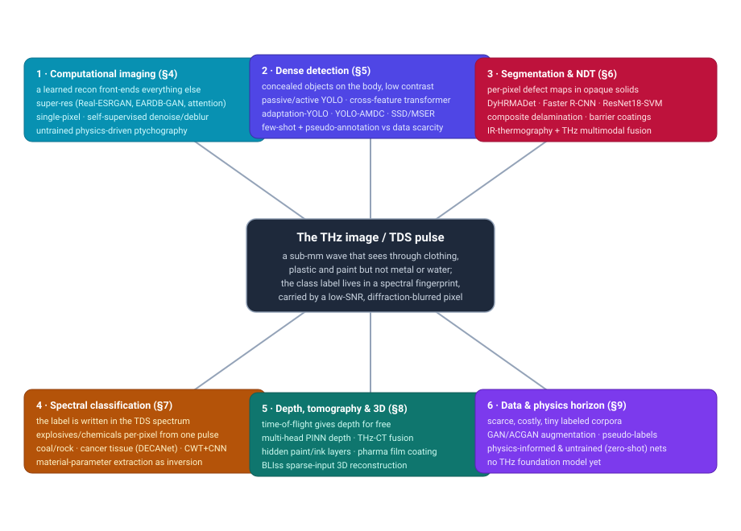
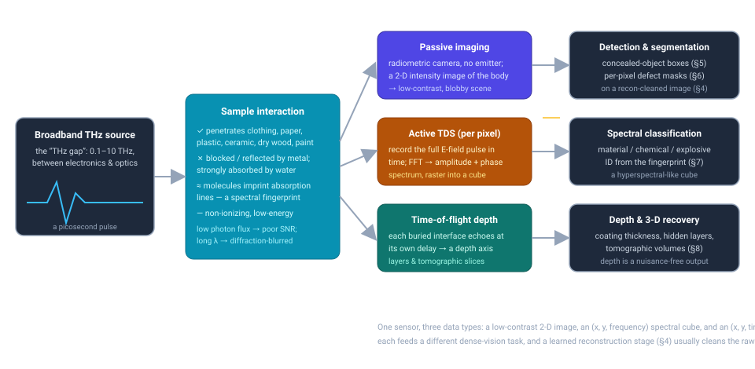
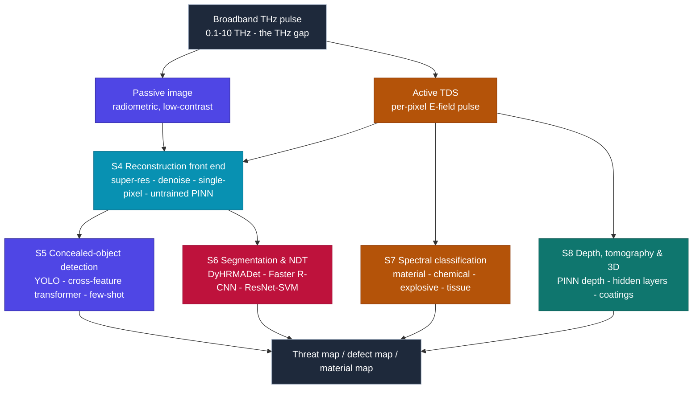

# Dense Object Detection & Classification — Recent Advances

*Compiled 2026-Aug-11 (America/Los_Angeles).*

Next installment in the running CV-updates log. Earlier entries on
`main`:
[Apr-30](../2026-Apr-30/2026-Apr-30_CV_updates.md),
[May-01](../2026-May-01/2026-May-01_CV_updates.md),
[May-02](../2026-May-02/2026-May-02_CV_updates.md),
[May-04](../2026-May-04/2026-May-04_CV_updates.md),
[May-05](../2026-May-05/2026-May-05_CV_updates.md),
[May-07](../2026-May-07/2026-May-07_CV_updates.md),
[May-08](../2026-May-08/2026-May-08_CV_updates.md),
[May-15](../2026-May-15/2026-May-15_CV_updates.md),
[May-16](../2026-May-16/2026-May-16_CV_updates.md),
[May-17](../2026-May-17/2026-May-17_CV_updates.md),
[Jun-09](../2026-Jun-09/2026-Jun-09_CV_updates.md),
[Jun-10](../2026-Jun-10/2026-Jun-10_CV_updates.md),
[Jun-12](../2026-Jun-12/2026-Jun-12_CV_updates.md),
[Jun-15](../2026-Jun-15/2026-Jun-15_CV_updates.md),
[Jun-16](../2026-Jun-16/2026-Jun-16_CV_updates.md),
[Jun-17](../2026-Jun-17/2026-Jun-17_CV_updates.md),
[Jun-19](../2026-Jun-19/2026-Jun-19_CV_updates.md),
[Jun-21](../2026-Jun-21/2026-Jun-21_CV_updates.md),
[Jun-22](../2026-Jun-22/2026-Jun-22_CV_updates.md),
[Jun-23](../2026-Jun-23/2026-Jun-23_CV_updates.md),
[Jun-24](../2026-Jun-24/2026-Jun-24_CV_updates.md),
[Jun-25](../2026-Jun-25/2026-Jun-25_CV_updates.md),
[Jun-27](../2026-Jun-27/2026-Jun-27_CV_updates.md),
[Jun-29](../2026-Jun-29/2026-Jun-29_CV_updates.md),
[Jun-30](../2026-Jun-30/2026-Jun-30_CV_updates.md),
[Jul-04](../2026-Jul-04/2026-Jul-04_CV_updates.md),
[Jul-07](../2026-Jul-07/2026-Jul-07_CV_updates.md),
[Jul-08](../2026-Jul-08/2026-Jul-08_CV_updates.md),
[Jul-10](../2026-Jul-10/2026-Jul-10_CV_updates.md),
[Jul-15](../2026-Jul-15/2026-Jul-15_CV_updates.md),
[Jul-17](../2026-Jul-17/2026-Jul-17_CV_updates.md),
[Jul-18](../2026-Jul-18/2026-Jul-18_CV_updates.md),
[Jul-21](../2026-Jul-21/2026-Jul-21_CV_updates.md),
[Jul-22](../2026-Jul-22/2026-Jul-22_CV_updates.md),
[Jul-24](../2026-Jul-24/2026-Jul-24_CV_updates.md),
[Jul-26](../2026-Jul-26/2026-Jul-26_CV_updates.md),
[Jul-27](../2026-Jul-27/2026-Jul-27_CV_updates.md),
[Jul-30](../2026-Jul-30/2026-Jul-30_CV_updates.md),
[Aug-01](../2026-Aug-01/2026-Aug-01_CV_updates.md),
[Aug-02](../2026-Aug-02/2026-Aug-02_CV_updates.md),
[Aug-04](../2026-Aug-04/2026-Aug-04_CV_updates.md),
[Aug-07](../2026-Aug-07/2026-Aug-07_CV_updates.md),
[Aug-10](../2026-Aug-10/2026-Aug-10_CV_updates.md).

## Table of contents

1. [Why this pass: terahertz as its own primitive](#why)
2. [Topic map](#map)
3. [The primitive — a sub-mm wave, a spectral fingerprint, a noisy pixel](#primitive)
4. [Computational reconstruction as a learned front end](#recon)
5. [Dense detection: concealed objects in a low-contrast scene](#detection)
6. [Segmentation & NDT: per-pixel defect maps in opaque solids](#segmentation)
7. [Spectral classification: the label is in the pulse](#spectral)
8. [Depth, tomography & 3D: time-of-flight for free](#depth)
9. [The data problem and the physics-informed horizon](#data)
10. [Through-line and open problems](#throughline)
11. [Sources](#sources)

---

## 1. Why this pass: terahertz as its own primitive

This log has now worked through a long list of sensing modalities on their own
terms — optical and thermal cameras, LiDAR, automotive imaging radar, SAR,
sonar, ultrasound, X-ray/CT, MRI, PET, OCT, hyperspectral, and most recently
ground-penetrating radar. **Terahertz (THz) imaging** sits in a genuinely
distinct spot in that lineup, and it earns a standalone entry for three reasons
that reshape the dense-vision problem.

First, THz lives in **the "terahertz gap"** — roughly 0.1–10 THz, the band
between microwave electronics and infrared optics where, until recently, neither
electronic nor photonic sources worked well. That physical awkwardness is the
whole story: the wave is long enough (sub-millimetre) to *diffract* badly and
short enough to be *hard to generate brightly*, so a THz pixel is intrinsically
**low-contrast, low-SNR, and blurred by the wavelength itself**. Second, THz has
a rare pair of material properties: it **penetrates** clothing, paper, plastic,
ceramic, dry wood and paint, but is **reflected by metal and strongly absorbed
by water** — and, crucially, is **non-ionizing** (photon energies ~meV, far
below X-rays). That combination is exactly what a body scanner or a
non-destructive-testing rig wants. Third — and this is the part that makes it a
*classification* primitive, not just a detection one — many molecules have
rotational/vibrational **absorption fingerprints in the THz band**, so a
time-domain measurement carries a per-pixel spectrum. The class label can live
in the spectrum, the way it does in [hyperspectral
imaging](../2026-Jul-21/2026-Jul-21_CV_updates.md), rather than in the pixel's
appearance.

So THz is one sensor that produces **three different data types** — a
low-contrast 2-D radiometric image (passive), an (x, y, frequency) spectral cube
(active time-domain spectroscopy), and an (x, y, time) depth stack (time-of-flight
reflection) — and each feeds a different dense-vision task. The 2024–2026
literature is a coherent response to exactly those facts: a **learned
reconstruction front end** that fights the low SNR and diffraction blur, **object
detectors** re-tuned for a blobby low-contrast scene, **U-Net/CNN defect
segmenters** for non-destructive testing, **spectral classifiers** that read
material and chemistry out of the pulse, and **physics-informed/untrained
networks** that exploit the fact that, unlike a natural image, the THz image has
a known forward model. Two recent surveys frame the whole space: a comprehensive
review, [*Unlocking Terahertz technology with machine
learning*](https://pubs.aip.org/aip/jap/article/137/22/220701/3349246/Unlocking-Terahertz-technology-with-machine)
(J. Applied Physics, 2025), and a security-focused review, [*Detection of
concealed object using terahertz images: a comprehensive
review*](https://www.sciencedirect.com/science/article/abs/pii/S0952197625004324)
(Engineering Applications of AI, 2025).

## 2. Topic map

Six threads, all hanging off the same primitive — a sub-mm wave that sees
through clothing and plastic but not metal or water, whose class label lives in a
spectral fingerprint carried by a low-SNR, diffraction-blurred pixel. §4 is the
learned reconstruction front end most pipelines now depend on. §5 is dense
detection proper: finding concealed objects in a low-contrast scene. §6 is
per-pixel segmentation and defect classification for non-destructive testing.
§7 is spectral classification: reading material, chemistry and threat class out
of the time-domain pulse. §8 is depth, tomography and 3-D, where THz's
time-of-flight gives a depth axis for free. §9 is the data problem (tiny, costly
labeled corpora) and the physics-informed/untrained-network response.

## 3. The primitive — a sub-mm wave, a spectral fingerprint, a noisy pixel

The acquisition splits into two families, and everything downstream is shaped by
which one produced the data:

- **Passive imaging** collects the ambient THz radiation a body naturally emits
  and that concealed objects block or attenuate — a **radiometric camera with no
  emitter**. The output is a 2-D intensity image, and its defining problem is
  *contrast*: a threat under clothing is a faint, soft-edged blob against a warm
  body, with no texture and no sharp boundary. This is why the classical passive
  pipeline leaned on region proposals — e.g. an [improved SSD
  network](https://pmc.ncbi.nlm.nih.gov/articles/PMC9287380/) for fast concealed
  object detection in passive THz — and why even hand-crafted [maximally-stable
  extremal
  regions](https://link.springer.com/article/10.1007/s42979-025-03983-6)
  (SN Computer Science, 2025) remain competitive proposals for the blobby target.
- **Active time-domain spectroscopy (THz-TDS)** fires a picosecond THz pulse and
  records the **full electric-field waveform** in time at each pixel; a Fourier
  transform then yields both amplitude *and phase* across a broad band. Raster the
  beam and you build a **data cube** — (x, y, frequency) — that is
  hyperspectral in spirit, plus a **time axis** that encodes depth by
  time-of-flight. This is the mode that makes THz a spectroscopic
  *classification* sensor.

Three facts make a THz image unlike an ordinary photograph, and every method in
this pass is shaped by them:

- **The pixel is intrinsically poor.** Sources are dim and detectors are noisy in
  the THz gap, so SNR is low; and because the wavelength is sub-millimetre, the
  diffraction limit blurs fine structure. A THz "image" starts life closer to a
  noisy, low-resolution thumbnail than to a photo — which is exactly why a
  **reconstruction / super-resolution stage is a first-class part of the
  pipeline** (§4), not an optional polish.
- **The label is spectral, not textural.** A metal knife and a ceramic knife look
  similar in a passive intensity image but differ in their THz reflectance and,
  for many solids, in their absorption fingerprint. Reading material and chemistry
  therefore means classifying a **spectrum per pixel** (§7), and the reviews now
  treat pre-processing, feature extraction and pattern recognition on TDS signals
  as the core ML task
  ([Sensors 2021, *ML Techniques for THz Imaging &
  TDS*](https://doi.org/10.3390/s21041186); [*Unlocking THz technology with
  ML*](https://pubs.aip.org/aip/jap/article/137/22/220701/3349246/Unlocking-Terahertz-technology-with-machine),
  2025).
- **The forward model is known.** Unlike a natural image, THz image formation is
  governed by well-understood electromagnetics (propagation, Fresnel reflection,
  material dispersion). That makes THz unusually friendly to **physics-informed
  and untrained networks** that bake the forward model in and need little or no
  labeled data (§9) — a lever that most of the modalities in this log do not have
  in such clean form.

The canonical modern pipeline, and where each thread plugs in:

Note the two entry points and the split in what they carry. Passive images enter
detection/segmentation once cleaned; the TDS pulse carries the extra spectral and
time-of-flight information that feeds classification and depth directly.

## 4. Computational reconstruction as a learned front end

The most modality-specific thing about THz dense vision is that a
**reconstruction stage is part of the recognizer**, not a preprocess you can
skip. Because the raw THz image is dim, noisy and diffraction-blurred, detection
and segmentation numbers are only meaningful relative to the reconstruction that
produced their input.

- **Super-resolution.** The dominant sub-thread. Off-the-shelf image
  super-resolvers (SRResNet, EDSR, SRGAN, ESRGAN, **Real-ESRGAN**) have been
  benchmarked on degraded THz images, with Real-ESRGAN generally best on the
  standard metrics. THz-specific designs push further: a **residual GAN with
  enhanced attention (EARDB-GAN)** restores fine detail while preserving object
  contours
  ([Sensors, PMC10047599](https://pmc.ncbi.nlm.nih.gov/articles/PMC10047599/)); a
  **residual channel-attention** network targets the same problem
  ([Applied Optics
  61(12):3363](https://opg.optica.org/ao/abstract.cfm?uri=ao-61-12-3363)); and a
  2025 **multi-dimensional attention-fusion network** with optimized deep learning
  reports state-of-the-art THz super-resolution
  ([Circuits, Systems & Signal Processing,
  2025](https://link.springer.com/article/10.1007/s00034-025-03372-7)).
- **Denoising / deblurring without clean labels.** Because paired clean/noisy THz
  data barely exists, the newest work is self-supervised: a **PCA-based
  self-supervised denoising and deblurring** network learns from the structure of
  the noisy data itself
  ([arXiv 2601.12149](https://arxiv.org/pdf/2601.12149)).
- **Single-pixel and compressive imaging.** Many THz systems raster a *single*
  detector, so acquisition is slow and undersampled; deep learning reconstructs a
  full image from few measurements. Recent work reaches **video-rate THz
  single-pixel imaging via physics-enhanced deep learning** with VCSEL-array
  modulation
  ([APL Photonics 11(6):066108,
  2026](https://pubs.aip.org/aip/app/article/11/6/066108/3394464/)) and
  **sub-diffraction backpropagation single-pixel imaging** driven by a learned
  reconstruction
  ([arXiv 2505.07839](https://arxiv.org/pdf/2505.07839)).
- **Untrained, physics-driven reconstruction.** The sharpest exploitation of the
  known forward model: **THz ptychography enabled by untrained physics-driven
  neural networks**, which needs *no* pretraining and takes a single dataset as
  input, folding the real physical model into the network
  ([iScience,
  2025](https://www.sciencedirect.com/science/article/pii/S2589004225015391)).
  This is the reconstruction analogue of the physics-informed inversion in §9.

The consequence for the rest of the pipeline mirrors GPR's clutter stage: several
detection and NDT papers now report end-to-end results with the reconstruction
network in the loop, and cross-paper comparisons are only fair when the front end
is held fixed.

## 5. Dense detection: concealed objects in a low-contrast scene

Detection in THz is dominated by one application — **security screening for
concealed objects on the body** — and the modality's poor contrast is what makes
it hard. A generic detector will happily fire on the warm torso or miss a
soft-edged threat; the useful output is a tight box (and class) around a
low-contrast blob that may be a gun, a knife, a 3-D-printed weapon, or a packet of
powder. The literature splits by acquisition mode and by how it fights data
scarcity. The security-focused review
([Engineering Applications of AI,
2025](https://www.sciencedirect.com/science/article/abs/pii/S0952197625004324))
maps the whole space.

- **Adapt the image detectors to the blobby scene.** YOLO-family models are the
  workhorses, re-tuned for low resolution and low contrast. **Adaptation-YOLO**
  adds an adaptive context-aware attention network (ACAN) that models global
  spatial/channel context to lift concealed-object detection in *active* THz
  images
  ([Scientific Reports,
  2024](https://www.nature.com/articles/s41598-024-81054-1)); **YOLO-AMDC** uses
  adaptive multi-scale decomposition convolution to find hidden dangerous objects
  in THz body-scan images and report the hazard category
  ([Signal Processing: Image Communication,
  2025](https://www.sciencedirect.com/science/article/abs/pii/S0923596525000700));
  and earlier passive-image detectors set the baseline with an [improved SSD
  network](https://pmc.ncbi.nlm.nih.gov/articles/PMC9287380/) and
  [YOLO-MSFG](https://www.researchgate.net/publication/356151222_YOLO-MSFG_Toward_Real-Time_Detection_of_Concealed_Objects_in_Passive_Terahertz_Images).
  A 2026 study extends detection to **THz video** rather than single frames
  ([Optoelectronics Letters,
  2026](https://link.springer.com/article/10.1007/s11801-026-4120-6)).
- **Transformers for cross-feature fusion.** Because the target signature is weak
  and spread across scales, attention helps: a **cross-feature fusion
  transformer** detects concealed hazardous objects in THz images by fusing
  features across levels
  ([Engineering Applications of AI,
  2024](https://www.sciencedirect.com/science/article/abs/pii/S0143816624004329)).
- **Fighting data scarcity at detection time.** Sub-THz imaging is expensive and
  labeled data is tiny, so several methods are built *around* the shortage.
  A **few-shot** framework detects concealed objects in sub-THz security images
  using **improved pseudo-annotations** — mining high-quality training samples
  from unlabeled images to detect hard cases like 3-D-printed guns and ceramic
  knives from only a handful of examples
  ([Scientific Reports,
  2024](https://www.nature.com/articles/s41598-024-53045-9)). GAN-based data
  augmentation plays the same role on the spectral side (§9).

The recurring practical point: unlike optical detection, THz detection scores are
inseparable from the reconstruction stage (§4) and the (usually tiny) dataset, so
the field increasingly reports detection *with* the front end and *with* an
explicit data-scarcity strategy rather than in isolation.

## 6. Segmentation & NDT: per-pixel defect maps in opaque solids

When the target is *extended* rather than a discrete object — a delamination, a
void, a disbond, a crack under a coating — the natural output is a **per-pixel
map**, and the driving application is **non-destructive testing (NDT)** of
materials that THz can see into but visible light and X-ray struggle with:
glass-fibre composites, ceramics, foams, and thermal-barrier coatings. The NDT
side of the ML review covers the last five years of this work
([*Unlocking THz technology with
ML*](https://pubs.aip.org/aip/jap/article/137/22/220701/3349246/Unlocking-Terahertz-technology-with-machine),
2025).

- **Attention-driven multi-scale detection of composite defects.** **DyHRMADet**
  is an attention-driven, multi-scale framework for rapid, precise detection and
  identification of small and hidden defects in composite materials from THz
  images, capturing both fine spatial detail and high-level semantics
  ([Nondestructive Testing and Evaluation,
  2025](https://www.tandfonline.com/doi/full/10.1080/10589759.2025.2580403)).
  Earlier work established the region-based baseline with a **Faster R-CNN**
  defect detector on composite THz images
  ([Sensors, PMC9822098](https://pmc.ncbi.nlm.nih.gov/articles/PMC9822098/)) and a
  **CNN** for thin micro-defects in glass-reinforced-polymer composites
  ([NDT&E
  International](https://www.sciencedirect.com/science/article/abs/pii/S135983682300197X)).
- **Spectral-image defect recognition.** Rather than work on a single intensity
  image, a 2025 method turns each pixel's TDS signal into a **time-frequency image
  via continuous wavelet transform**, then classifies with a **ResNet18 + SVM**
  hybrid — reaching ~98.6% accuracy across three defect types in composites
  ([Materials 18(11):2444,
  2025](https://www.mdpi.com/1996-1944/18/11/2444)).
- **High-resolution reconstruction + classical ML.** A 2025 NDT framework couples
  deep image reconstruction with PCA, random-forest feature ranking and k-means to
  produce high-resolution defect maps in composites
  ([ICE Forensic
  Engineering](https://www.emerald.com/jfoen/article/doi/10.1680/jfoen.25.00031/1331628/)),
  and a 2026 study localizes defects across **eighteen defect classes** from a
  ~600-image THz corpus with AI-augmented imaging
  ([J. Nondestructive Evaluation,
  2026](https://link.springer.com/article/10.1007/s10921-026-01359-1)).
- **Coatings and multimodal fusion.** THz-TDS characterizes growth stress and
  thickness in **thermal-barrier coatings** with ML
  ([Coatings 15(1):49](https://doi.org/10.3390/coatings15010049)), and a
  **simulation-assisted multimodal deep-learning (Sim-MDL)** model *fuses infrared
  thermography with THz imaging* to evaluate barrier coatings — an explicit
  cross-modality move that borrows the [thermal
  primitive](../2026-Jun-30/2026-Jun-30_CV_updates.md) to compensate for THz's
  weaknesses
  ([PMC12796296](https://www.ncbi.nlm.nih.gov/pmc/articles/PMC12796296/)).

Classification, in the NDT sense, means reading **defect type** (delamination vs
void vs crack vs disbond) out of the reflected pulse's amplitude, polarity and
time-of-flight — the phase flip on an air gap being the THz analogue of GPR's
polarity cue.

## 7. Spectral classification: the label is in the pulse

This is the thread that most distinguishes THz from a plain camera and aligns it
with [hyperspectral](../2026-Jul-21/2026-Jul-21_CV_updates.md): the class label
is written in the **THz-TDS spectrum**, so classification is done on a spectrum
per pixel rather than on appearance. Many solids — explosives, drugs, sugars,
polymers, minerals, biological tissue — have distinctive
rotational/vibrational absorption features in the THz band.

- **Chemical & explosive imaging, pixel by pixel.** The headline result couples
  **THz-TDS with deep learning to detect and image hidden explosives and
  chemicals**, achieving pixel-level identification from *individual* time-domain
  pulses in reflection mode, with a deep network that is resilient to
  environmental variation (peak dynamic range 96 dB, 4.5 THz bandwidth)
  ([*Light: Science & Applications*,
  2026](https://www.nature.com/articles/s41377-026-02190-z) ·
  [arXiv 2512.04330](https://arxiv.org/abs/2512.04330) ·
  [PMC12824377](https://www.ncbi.nlm.nih.gov/pmc/articles/PMC12824377/)). This is
  the clean statement of the primitive: a per-pixel spectral classifier turns a
  scanned scene into a chemical map.
- **Geological & industrial material ID.** THz-TDS plus a bank of classical
  learners (SVM, LS-SVM, ANN, random forest) gives high-precision **coal-vs-rock
  identification**
  ([Photonics 13(5):409](https://doi.org/10.3390/photonics13050409)), a good
  example of the "small spectral dataset, classical-ML-still-wins" regime that
  recurs whenever THz data is scarce.
- **Biomedical tissue classification.** Because water absorption is a strong THz
  contrast mechanism, hydration and tissue-density differences let THz separate
  tumour from healthy tissue. A **dense and efficient channel-attention network
  (DECANet)** provides a THz cancer-prescreening diagnosis system by combining THz
  detection with deep learning
  ([Results in Optics / ScienceDirect,
  2025](https://www.sciencedirect.com/science/article/pii/S266732582500127X)), and
  THz's non-ionizing, high-contrast character is being pushed toward **tumour
  margin delineation**
  ([IntechOpen,
  2025](https://www.intechopen.com/chapters/1199861)) and skin-cancer sensing
  ([ScienceDaily,
  2024](https://www.sciencedaily.com/releases/2024/02/240220144523.htm)).
- **Parameter extraction as inversion.** Reading a material's complex refractive
  index / permittivity out of a TDS trace is an inverse problem; recent work
  solves it with a **genetic algorithm** for parameter extraction
  ([J. Optics,
  2025](https://link.springer.com/article/10.1007/s12596-025-02991-2)) and,
  increasingly, with physics-informed networks (§9) that treat the dielectric
  constant as the network's zero-shot output.

## 8. Depth, tomography & 3D: time-of-flight for free

Because the active pulse is time-resolved, each buried interface echoes at its own
delay — so **depth comes for free**, and THz naturally produces layered and
tomographic outputs. This is where THz behaves least like a camera and most like a
gentle, non-ionizing, short-range cousin of GPR.

- **Depth estimation with a physics prior.** A **hybrid multi-head
  physics-informed neural network** estimates depth in THz imaging by folding the
  complete THz image-formation model into the network — explicitly to avoid
  needing tens of thousands of labeled examples
  ([Optics & Lasers in Engineering / ScienceDirect,
  2025](https://www.sciencedirect.com/science/article/abs/pii/S001046552500089X)).
- **Layered artworks and documents.** THz's depth resolution makes it uniquely
  able to read *hidden* layers. A 2025 study **deciphers hidden-layer images
  through THz spectral fingerprints**, reconstructing concealed text and mapping
  pigment composition beneath pictorial layers — non-destructive analysis of
  cultural-heritage objects that X-ray and IR reflectography cannot fully resolve
  ([arXiv 2505.23965](https://arxiv.org/abs/2505.23965) · Spectrochimica Acta A,
  2025).
- **Pharmaceutical coatings.** In-line THz pulsed imaging measures **film-coating
  thickness of individual tablets** in real time (sub-micron resolution, ~100
  tablets/min), and learning is used both to classify coating defects and to
  **select informative waveforms** via a recurrent network with transfer learning
  ([*THz waveform selection for a pharmaceutical film-coating process*,
  ResearchGate](https://www.researchgate.net/publication/355457518_Terahertz_waveform_selection_of_a_pharmaceutical_film_coating_process_using_a_recurrent_network)).
- **Tomography and sparse-input 3-D.** Reconstructing a THz tomographic volume is
  ill-posed and slow; deep learning helps on both counts. A multi-scale
  spatio-spectral fusion approach improves **THz tomographic imaging quality**
  ([arXiv 2103.16932](https://arxiv.org/pdf/2103.16932)), and **BLIss** tackles
  **THz super-resolution 3-D reconstruction from sparse inputs** with a
  variational framework
  ([arXiv 2403.18776](https://arxiv.org/pdf/2403.18776)). At the far frontier,
  a **metasurface-based THz 3-D holography** system is driven end-to-end by a
  physics-informed network
  ([arXiv 2601.01221](https://arxiv.org/pdf/2601.01221)).

The through-line here is the mirror image of GPR: where GPR's depth axis is a
travel-time coordinate coupled to an *unknown* medium, THz's short range and
known material models make depth a comparatively **clean, directly usable
output** — which is why layer-resolved tasks (coatings, paintings, documents)
are where THz has real, deployed products.

## 9. The data problem and the physics-informed horizon

Every thread above runs into the same wall: **real, labeled THz data is scarce
and expensive.** THz hardware is costly, acquisition is slow (often single-pixel
raster), and annotation is laborious — so datasets are small, and this is the
single biggest constraint on the field. The response comes in two shapes.

- **Manufacture data, or learn without it.** On the generative side,
  **GAN-based augmentation** synthesizes THz data to train classifiers; e.g. a
  fully-connected auxiliary-classifier GAN (**FC-ACGAN**) augments THz-TDS spectra
  for concealed-hazardous-material identification when real samples are too few
  ([Int. J. Intelligent Systems,
  2022](https://onlinelibrary.wiley.com/doi/abs/10.1002/int.23013)). On the
  label-free side, **few-shot + pseudo-annotation** detection (§5,
  [Scientific Reports,
  2024](https://www.nature.com/articles/s41598-024-53045-9)) and **self-supervised
  denoising** (§4, [arXiv 2601.12149](https://arxiv.org/pdf/2601.12149)) squeeze
  more out of unlabeled data.
- **Exploit the known physics.** This is THz's structural advantage. Because the
  forward model is EM, **physics-informed and untrained networks** can work with
  little or no labeled data:
  - **THz-PINNs** perform time-domain forward modeling of THz spectroscopy with a
    physics-informed network
    ([arXiv 2509.07161](https://arxiv.org/pdf/2509.07161));
  - a **field–material coupled neural network** is a *zero-shot* physics-informed
    inverse solver that extracts the complex dielectric constant directly in the
    THz band — no training set
    ([J. Applied Physics 139(23):235104,
    2026](https://pubs.aip.org/aip/jap/article/139/23/235104/3395654/));
  - **untrained physics-driven** networks reconstruct THz ptychography from a
    single measurement (§4,
    [iScience 2025](https://www.sciencedirect.com/science/article/pii/S2589004225015391)).

The honest status: there is **no THz foundation model** — no SAM- or
DINOv3-scale backbone — and the small, fragmented, hardware-specific datasets
make one hard to build. But THz has a lever the appearance-only modalities lack:
a clean, known forward model. The near-term trajectory is less "scrape a giant
corpus" and more "**bake the physics in**" — physics-informed, untrained, and
zero-shot networks that need almost no labels, complemented by GAN/few-shot data
strategies where labels are unavoidable.

## 10. Through-line and open problems

**The through-line.** THz is a dense-vision primitive whose difficulty is
front-loaded into the *pixel* and the *data*, not the recognizer. The pixel is
low-SNR and diffraction-blurred, so a learned reconstruction stage front-ends
everything (§4). The scene is low-contrast, so detectors are re-tuned for soft
blobs and built around tiny datasets (§5). The label is spectral, so
classification runs on a per-pixel TDS spectrum rather than on appearance (§6, §7).
The pulse is time-resolved, so depth and layered structure come almost for free
(§8). And underneath it all is a data shortage that THz answers, uniquely, by
leaning on a **known forward model** — physics-informed and untrained networks
(§9). It is, in effect, a low-contrast, non-ionizing hyperspectral-plus-depth
sensor, and the 2024–2026 literature is a disciplined response to exactly those
facts.

**Open problems.**

- **Data scarcity is the field's defining constraint.** There is no large,
  diverse, shared THz corpus; datasets are small and hardware-specific.
  GAN/few-shot/self-supervised patches help, but a real benchmark — held-fixed
  reconstruction front end included — is missing.
- **Reconstruction contaminates evaluation.** Like GPR's declutter stage,
  detection and segmentation scores depend on the upstream super-resolver/denoiser;
  end-to-end benchmarks that fix that stage are needed for comparisons to mean
  something.
- **Passive vs active is a fork, not a spectrum.** Passive gives a cheap,
  fast, low-contrast image; active gives a rich but slow spectral/depth cube.
  Few methods exploit both, and cross-mode transfer is barely explored.
- **Physics-informed learning is the most promising lever, and the least mature.**
  Zero-shot dielectric-constant extraction and untrained ptychography are striking,
  but coverage is narrow; generalizing PINNs across geometries, materials and
  hardware is open.
- **No foundation model yet — and the physics may change what one looks like.**
  A THz backbone might be less a giant pretrained ViT and more a
  physics-conditioned model; what "foundation model" even means for a
  known-forward-model modality is an open question.
- **Speed vs resolution is still a hardware-shaped trade.** Single-pixel raster is
  slow; array/video-rate systems are coarse. Learned reconstruction is closing the
  gap (video-rate single-pixel, sparse-input 3-D), but real-time high-resolution
  THz remains hard.

## 11. Sources

**Surveys & framing (§1, §3)**
- Unlocking Terahertz technology with machine learning: a comprehensive review — J. Applied Physics 137(22):220701, 2025: [AIP](https://pubs.aip.org/aip/jap/article/137/22/220701/3349246/Unlocking-Terahertz-technology-with-machine)
- Detection of concealed object using terahertz images: a comprehensive review — Engineering Applications of AI, Vol. 148, 2025: [ScienceDirect](https://www.sciencedirect.com/science/article/abs/pii/S0952197625004324) · [ACM](https://dl.acm.org/doi/10.1016/j.engappai.2025.110432)
- Machine Learning Techniques for THz Imaging and Time-Domain Spectroscopy — Sensors 21(4):1186, 2021: [DOI 10.3390/s21041186](https://doi.org/10.3390/s21041186)
- Machine Learning and Application in Terahertz Technology: A Review — IEEE Access: [Xplore 9773114](https://ieeexplore.ieee.org/document/9773114/)

**Computational reconstruction (§4)**
- Super-Resolution Reconstruction of THz Images Based on Residual GAN with Enhanced Attention (EARDB-GAN) — Sensors: [PMC10047599](https://pmc.ncbi.nlm.nih.gov/articles/PMC10047599/)
- Super-resolution reconstruction of THz images with a residual channel-attention network — Applied Optics 61(12):3363: [Optica](https://opg.optica.org/ao/abstract.cfm?uri=ao-61-12-3363)
- Multi-Dimensional Attention Fusion Network with Optimized Deep Learning for THz Image Super-Resolution — Circuits, Systems & Signal Processing, 2025: [Springer](https://link.springer.com/article/10.1007/s00034-025-03372-7)
- PCA-Based Terahertz Self-Supervised Denoising and Deblurring Deep Neural Networks — 2026: [arXiv 2601.12149](https://arxiv.org/pdf/2601.12149)
- Video-rate THz single-pixel imaging via physics-enhanced deep learning and VCSEL-array modulation — APL Photonics 11(6):066108, 2026: [AIP](https://pubs.aip.org/aip/app/article/11/6/066108/3394464/)
- Deep-Learning-Empowered Sub-Diffraction THz Backpropagation Single-Pixel Imaging — 2025: [arXiv 2505.07839](https://arxiv.org/pdf/2505.07839)
- Terahertz ptychography enabled by untrained physics-driven neural networks — iScience, 2025: [ScienceDirect](https://www.sciencedirect.com/science/article/pii/S2589004225015391)

**Concealed-object detection (§5)**
- Concealed hazardous object detection for THz images with cross-feature fusion transformer — Engineering Applications of AI, 2024: [ScienceDirect](https://www.sciencedirect.com/science/article/abs/pii/S0143816624004329)
- Enhancing concealed object detection in active THz security images with adaptation-YOLO — Scientific Reports, 2024: [Nature](https://www.nature.com/articles/s41598-024-81054-1) · [PMC11751177](https://pmc.ncbi.nlm.nih.gov/articles/PMC11751177/)
- Hidden dangerous object detection for THz body security-check images via adaptive multi-scale decomposition convolution (YOLO-AMDC) — Signal Processing: Image Communication, 2025: [ScienceDirect](https://www.sciencedirect.com/science/article/abs/pii/S0923596525000700)
- Improved SSD network for fast concealed object detection in passive THz security images — Scientific Reports: [PMC9287380](https://pmc.ncbi.nlm.nih.gov/articles/PMC9287380/)
- YOLO-MSFG: Toward Real-Time Detection of Concealed Objects in Passive THz Images: [ResearchGate](https://www.researchgate.net/publication/356151222_YOLO-MSFG_Toward_Real-Time_Detection_of_Concealed_Objects_in_Passive_Terahertz_Images)
- Maximally Stable Extremal Regions for Concealed Object Detection in Passive THz Imaging — SN Computer Science, 2025: [Springer](https://link.springer.com/article/10.1007/s42979-025-03983-6)
- Few-shot concealed object detection in sub-THz security images using improved pseudo-annotations — Scientific Reports, 2024: [Nature](https://www.nature.com/articles/s41598-024-53045-9) · [PMC10850053](https://www.ncbi.nlm.nih.gov/pmc/articles/PMC10850053/)
- Terahertz video analysis for hidden object detection using deep learning — Optoelectronics Letters, 2026: [Springer](https://link.springer.com/article/10.1007/s11801-026-4120-6)

**Segmentation & NDT (§6)**
- DyHRMADet-enabled terahertz detection and identification for composite defects — Nondestructive Testing and Evaluation, 2025: [Taylor & Francis](https://www.tandfonline.com/doi/full/10.1080/10589759.2025.2580403)
- Defect Recognition in Composite Materials Using THz Spectral Imaging with ResNet18-SVM — Materials 18(11):2444, 2025: [MDPI](https://www.mdpi.com/1996-1944/18/11/2444) · [PubMed 40508444](https://pubmed.ncbi.nlm.nih.gov/40508444/)
- Non-destructive detection of thin micro-defects in GRP composites using THz + CNN — NDT&E International: [ScienceDirect](https://www.sciencedirect.com/science/article/abs/pii/S135983682300197X)
- High-resolution defect detection in composite materials using THz NDT and deep reconstruction — ICE Forensic Engineering, 2025: [Emerald](https://www.emerald.com/jfoen/article/doi/10.1680/jfoen.25.00031/1331628/)
- Defect Localization in Composites Using AI-Augmented THz Imaging (18 defect classes) — J. Nondestructive Evaluation, 2026: [Springer](https://link.springer.com/article/10.1007/s10921-026-01359-1)
- Defect Detection of Composite Material THz Image Based on Faster R-CNN — Sensors: [PMC9822098](https://pmc.ncbi.nlm.nih.gov/articles/PMC9822098/)
- Machine Learning in THz-Based NDT of Thermal-Barrier Coatings with High-Temperature Growth Stresses — Coatings 15(1):49: [DOI 10.3390/coatings15010049](https://doi.org/10.3390/coatings15010049)
- Simulation-assisted multimodal deep learning (Sim-MDL) fusion of IR thermography + THz for barrier coatings: [PMC12796296](https://www.ncbi.nlm.nih.gov/pmc/articles/PMC12796296/)

**Spectral classification (§7)**
- Detection and imaging of chemicals and hidden explosives using THz-TDS and deep learning — Light: Science & Applications, 2026: [Nature](https://www.nature.com/articles/s41377-026-02190-z) · [arXiv 2512.04330](https://arxiv.org/abs/2512.04330) · [PMC12824377](https://www.ncbi.nlm.nih.gov/pmc/articles/PMC12824377/)
- Coal and Rock Identification integrating THz-TDS and multiple ML algorithms — Photonics 13(5):409: [DOI 10.3390/photonics13050409](https://doi.org/10.3390/photonics13050409)
- Deep-learning-assisted THz intelligent detection and identification of cancer tissue (DECANet) — Results in Optics, 2025: [ScienceDirect](https://www.sciencedirect.com/science/article/pii/S266732582500127X)
- Harnessing Terahertz Technology for Precise Margin Detection — IntechOpen, 2025: [chapter](https://www.intechopen.com/chapters/1199861)
- Terahertz biosensor detects skin cancer with high accuracy — ScienceDaily, 2024: [ScienceDaily](https://www.sciencedaily.com/releases/2024/02/240220144523.htm)
- Materials-parameter extraction in THz-TDS using a genetic algorithm — J. Optics, 2025: [Springer](https://link.springer.com/article/10.1007/s12596-025-02991-2)

**Depth, tomography & 3D (§8)**
- Hybrid multi-head physics-informed neural network for depth estimation in THz imaging — Optics & Lasers in Engineering, 2025: [ScienceDirect](https://www.sciencedirect.com/science/article/abs/pii/S001046552500089X)
- Deciphering hidden-layer images through THz spectral fingerprints — 2025: [arXiv 2505.23965](https://arxiv.org/abs/2505.23965) · Spectrochimica Acta A
- THz waveform selection for a pharmaceutical film-coating process using a recurrent network: [ResearchGate](https://www.researchgate.net/publication/355457518_Terahertz_waveform_selection_of_a_pharmaceutical_film_coating_process_using_a_recurrent_network)
- Seeing through a Black Box: High-Quality THz Tomographic Imaging via Multi-Scale Spatio-Spectral Fusion: [arXiv 2103.16932](https://arxiv.org/pdf/2103.16932)
- BLIss: Breaking the Limitations with Sparse Inputs by Variational Frameworks in THz Super-Resolution 3D Reconstruction: [arXiv 2403.18776](https://arxiv.org/pdf/2403.18776)
- Metasurface-based THz 3-D Holography Enabled by Physics-Informed Neural Network — 2026: [arXiv 2601.01221](https://arxiv.org/pdf/2601.01221)

**Data problem & physics-informed horizon (§9)**
- FC-ACGAN-based data augmentation for THz-TDS concealed-hazardous-materials identification — Int. J. Intelligent Systems, 2022: [Wiley](https://onlinelibrary.wiley.com/doi/abs/10.1002/int.23013)
- THz-PINNs: Time-Domain Forward Modeling of THz Spectroscopy with Physics-Informed Neural Networks — 2025: [arXiv 2509.07161](https://arxiv.org/pdf/2509.07161)
- Field–material coupled neural network: zero-shot physics-informed inverse solver for the complex dielectric constant in the THz band — J. Applied Physics 139(23):235104, 2026: [AIP](https://pubs.aip.org/aip/jap/article/139/23/235104/3395654/)

*Compiled automatically as part of the CV-updates routine. Some publisher and
arXiv pages could not be fetched directly from this environment (egress
restrictions); entries were compiled from search-surfaced metadata and may
contain minor citation errors (year/volume drift on in-press articles is
possible). Corrections and additions welcome via PR against `main`.*
