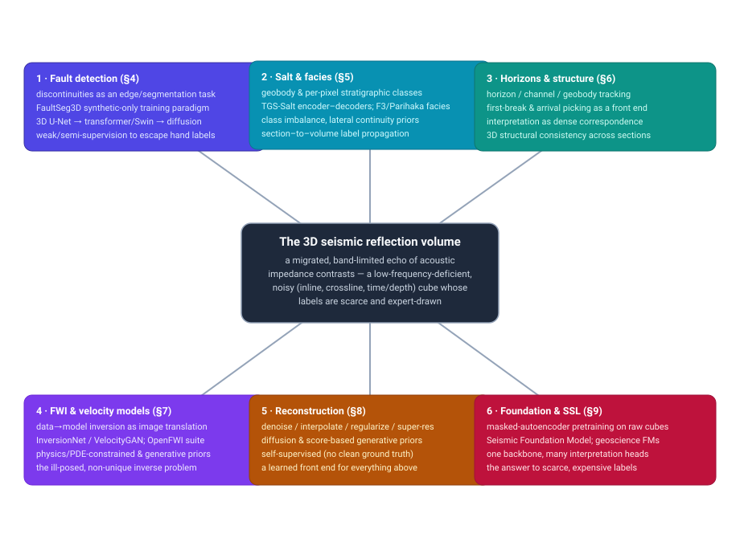
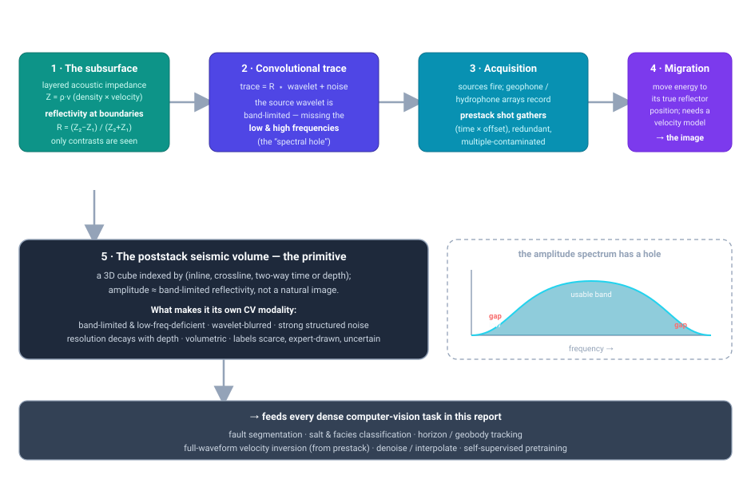
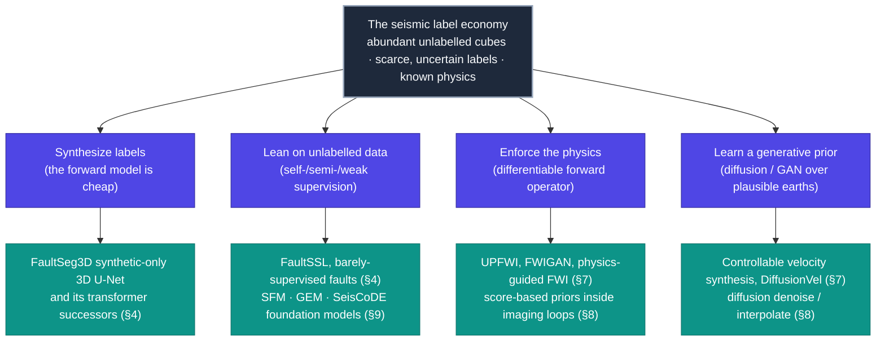

# Dense Object Detection & Classification — Recent Advances

*Compiled 2026-Aug-12 (America/Los_Angeles).*

Next installment in the running CV-updates log. Earlier entries on
`main`:
[Apr-30](../2026-Apr-30/2026-Apr-30_CV_updates.md),
[May-01](../2026-May-01/2026-May-01_CV_updates.md),
[May-02](../2026-May-02/2026-May-02_CV_updates.md),
[May-04](../2026-May-04/2026-May-04_CV_updates.md),
[May-05](../2026-May-05/2026-May-05_CV_updates.md),
[May-07](../2026-May-07/2026-May-07_CV_updates.md),
[May-08](../2026-May-08/2026-May-08_CV_updates.md),
[May-15](../2026-May-15/2026-May-15_CV_updates.md),
[May-16](../2026-May-16/2026-May-16_CV_updates.md),
[May-17](../2026-May-17/2026-May-17_CV_updates.md),
[Jun-09](../2026-Jun-09/2026-Jun-09_CV_updates.md),
[Jun-10](../2026-Jun-10/2026-Jun-10_CV_updates.md),
[Jun-12](../2026-Jun-12/2026-Jun-12_CV_updates.md),
[Jun-15](../2026-Jun-15/2026-Jun-15_CV_updates.md),
[Jun-16](../2026-Jun-16/2026-Jun-16_CV_updates.md),
[Jun-17](../2026-Jun-17/2026-Jun-17_CV_updates.md),
[Jun-19](../2026-Jun-19/2026-Jun-19_CV_updates.md),
[Jun-21](../2026-Jun-21/2026-Jun-21_CV_updates.md),
[Jun-22](../2026-Jun-22/2026-Jun-22_CV_updates.md),
[Jun-23](../2026-Jun-23/2026-Jun-23_CV_updates.md),
[Jun-24](../2026-Jun-24/2026-Jun-24_CV_updates.md),
[Jun-25](../2026-Jun-25/2026-Jun-25_CV_updates.md),
[Jun-27](../2026-Jun-27/2026-Jun-27_CV_updates.md),
[Jun-29](../2026-Jun-29/2026-Jun-29_CV_updates.md),
[Jun-30](../2026-Jun-30/2026-Jun-30_CV_updates.md),
[Jul-04](../2026-Jul-04/2026-Jul-04_CV_updates.md),
[Jul-07](../2026-Jul-07/2026-Jul-07_CV_updates.md),
[Jul-08](../2026-Jul-08/2026-Jul-08_CV_updates.md),
[Jul-10](../2026-Jul-10/2026-Jul-10_CV_updates.md),
[Jul-15](../2026-Jul-15/2026-Jul-15_CV_updates.md),
[Jul-17](../2026-Jul-17/2026-Jul-17_CV_updates.md),
[Jul-18](../2026-Jul-18/2026-Jul-18_CV_updates.md),
[Jul-21](../2026-Jul-21/2026-Jul-21_CV_updates.md),
[Jul-22](../2026-Jul-22/2026-Jul-22_CV_updates.md),
[Jul-24](../2026-Jul-24/2026-Jul-24_CV_updates.md),
[Jul-26](../2026-Jul-26/2026-Jul-26_CV_updates.md),
[Jul-27](../2026-Jul-27/2026-Jul-27_CV_updates.md),
[Jul-30](../2026-Jul-30/2026-Jul-30_CV_updates.md),
[Aug-01](../2026-Aug-01/2026-Aug-01_CV_updates.md),
[Aug-02](../2026-Aug-02/2026-Aug-02_CV_updates.md),
[Aug-04](../2026-Aug-04/2026-Aug-04_CV_updates.md),
[Aug-07](../2026-Aug-07/2026-Aug-07_CV_updates.md),
[Aug-10](../2026-Aug-10/2026-Aug-10_CV_updates.md),
[Aug-11](../2026-Aug-11/2026-Aug-11_CV_updates.md).

## Table of contents

1. [Why this pass: the reflection-seismic volume as its own primitive](#why)
2. [Topic map](#map)
3. [The primitive — a migrated, band-limited echo](#primitive)
4. [Fault detection: discontinuities as dense segmentation](#faults)
5. [Salt bodies & seismic facies: geobodies and per-pixel classes](#salt)
6. [Horizons, geobodies & the picking front end](#horizons)
7. [Full-waveform inversion: the image as an inverse problem](#fwi)
8. [Reconstruction: denoise, interpolate, regularize](#recon)
9. [Foundation models & self-supervision: the answer to scarce labels](#foundation)
10. [Through-line and open problems](#throughline)
11. [Sources](#sources)

---

## 1. Why this pass: the reflection-seismic volume as its own primitive

This log has now worked through a long catalogue of sensing modalities on their
own terms — optical and thermal cameras, LiDAR, automotive imaging radar, SAR,
sonar, ultrasound, X-ray/CT, MRI, PET, OCT, hyperspectral, and most recently
ground-penetrating radar and terahertz. **Reflection seismology** — the 3D
seismic volumes used to image the deep subsurface for hydrocarbon exploration,
CO₂-storage monitoring, geothermal siting and crustal characterization — belongs
in that lineup, and it is distinct enough from every entry so far to earn a
standalone pass. Ground-penetrating radar shares the "echo off buried
boundaries" idea, but GPR is a shallow, high-frequency *electromagnetic* probe;
seismic is a deep, low-frequency *elastic/acoustic* probe that reaches kilometres
rather than metres, and it produces volumes, not B-scans. Sonar and ultrasound
are pulse-echo too, but they image water columns and soft tissue in near-real
time; seismic images rock through a heavy, physics-laden processing chain.

Three facts make the seismic image a genuinely different dense-vision object.

**First, the pixel is not appearance — it is band-limited reflectivity.** A
seismic trace is, to first order, the earth's reflectivity series (a spike at
every acoustic-impedance contrast, `Z = ρ·v`) *convolved with a source wavelet*
plus noise. The wavelet is **band-limited**: it carries neither the very low
frequencies (which encode the smooth background velocity/impedance trend) nor the
very high frequencies (which would give thin-bed resolution). So a seismic image
is a *blurred, DC-free* view of the geology — the amplitude spectrum has a hole
at both ends — and everything downstream inherits that. This is why a seismic
picture looks like a bandpass-filtered edge map of the subsurface rather than a
photograph, and why "resolution" degrades with depth as the earth strips away
high frequencies.

**Second, the image is already the output of an inverse problem.** Raw field
data are *prestack shot gathers* — time-vs-offset records, redundant,
contaminated by multiples, ground roll and acquisition footprint. Turning them
into an interpretable *poststack volume* requires **migration**, which
repositions recorded energy to the true reflector location and itself needs a
velocity model. So by the time a convolutional network sees a "seismic image,"
a large, expensive, physics-based estimation step has already run — and one of
the most active deep-learning threads (full-waveform inversion, §7) is about
learning that step directly, mapping raw wavefield data to a velocity image.

**Third, ground truth is scarce, expensive and uncertain.** Labels — fault
sticks, horizon picks, facies polygons — are drawn by hand by geoscientists,
often on a sparse subset of 2D sections through a 3D cube, and expert
interpretations of the same volume disagree. There is rarely a "clean" reference
image for a denoising task, and almost never a dense per-voxel label for a whole
survey. That scarcity is the organizing pressure of the field: it drove the
influential move to **train fault detectors purely on synthetic volumes**
([FaultSeg3D](https://library.seg.org/doi/10.1190/geo2018-0646.1)), and it is now
driving **self-supervised foundation models** that pretrain on the enormous
volume of *unlabelled* seismic data and fine-tune on the handful of labelled
sections (§9).

Two recent surveys frame the space: a broad review of machine learning across
the seismic processing–imaging–interpretation chain, and a focused review of
deep learning for seismic interpretation. The 2023–2026 literature is a coherent
response to the three facts above: **fault and geobody segmenters** that treat
discontinuities as an edge/segmentation task and lean on synthetic labels;
**facies classifiers** that read stratigraphy out of the amplitude pattern;
**learned FWI** that inverts the wavefield for a velocity image; **generative
reconstruction** that denoises, interpolates and regularizes without clean
targets; and **foundation models** that finally amortize the label problem.

## 2. Topic map

Six threads, all hanging off the same primitive — a migrated, band-limited,
noisy 3D cube whose labels are scarce and expert-drawn. §4–§6 are the dense
*interpretation* tasks (faults, salt/facies, horizons/geobodies), §7 is the
*inverse problem* (velocity from the raw wavefield), §8 is the learned
*reconstruction* front end, and §9 is the foundation-model layer now sitting
underneath all of them.

## 3. The primitive — a migrated, band-limited echo

The diagram traces the chain from geology to CV task. It is worth stating the
consequences of that chain explicitly, because they are exactly the assumptions
a network trained on natural images gets wrong:

- **Amplitude means impedance contrast, not brightness.** Bright reflectors are
  strong contrasts (a gas sand, a salt top, an unconformity), not "objects." A
  detector must learn geological grammar — how reflectors terminate, offset and
  onlap — rather than object appearance.
- **The spectrum has a hole.** Missing low frequencies mean the absolute
  background trend is unconstrained by the image alone (hence the coupling to
  FWI and impedance inversion); missing high frequencies set a hard resolution
  limit and motivate learned super-resolution / bandwidth-extension.
- **Structured, non-Gaussian noise.** Multiples, ground roll, swell noise and
  acquisition footprint are *coherent* — they look like signal — so denoising is
  a source-separation problem, not a Gaussian-noise problem.
- **Resolution decays with depth**, and the volume is genuinely 3D with strong
  lateral continuity: faults and horizons persist across inline/crossline
  sections, a prior that 3D architectures exploit and 2D ones throw away.
- **Labels are scarce, sparse and uncertain**, which is why synthetic training,
  weak/semi-supervision and self-supervised pretraining dominate the recent
  literature rather than large supervised benchmarks.

The rest of the report walks the six threads.

## 4. Fault detection: discontinuities as dense segmentation

Faults are the field's flagship deep-learning success. A fault is a
*discontinuity* — a place where reflectors break and offset — so fault detection
is naturally posed as **binary voxel segmentation** (fault / not-fault), and the
seismic-attribute era already had hand-designed discontinuity attributes
(coherence, semblance, curvature) that a CNN can beat.

The pivotal idea was **[FaultSeg3D](https://library.seg.org/doi/10.1190/geo2018-0646.1)**
(Wu et al., *Geophysics* 2019): train a 3D U-Net **entirely on synthetic seismic
volumes** with automatically generated fault labels, then apply it to field data.
Because faults can be simulated with controlled geometry and the forward model
(reflectivity → convolution → noise) is cheap, the label-scarcity problem is
side-stepped, and the network generalizes surprisingly well to real surveys. The
synthetic-training recipe has become the default, and essentially every later
fault model builds on it.

The 2023–2026 arc is architectural and supervisory:

- **Transformers / attention** replace or augment the U-Net to capture the
  long-range, planar continuity of a fault surface that convolutions see only
  locally — 3D Swin/UNETR-style and hybrid CNN-transformer fault networks report
  cleaner, more continuous fault sheets than the original 3D U-Net.
- **Diffusion / generative formulations** cast fault segmentation as conditional
  generation of the fault map, which tends to yield thinner, better-connected
  faults and calibrated uncertainty over the binary decision.
- **Weak / semi-/self-supervision and domain adaptation** attack the
  synthetic-to-field gap directly — using the abundant unlabelled field volumes,
  a few expert sticks, or adversarial/consistency losses to close the domain
  shift that pure-synthetic training leaves behind.
- **Uncertainty and continuity priors** — thinning losses, skeleton/orientation
  supervision and probabilistic outputs — target the specific failure mode that
  faults come out fragmented or over-thick.

See §11 for specific papers surfaced in this pass.

## 5. Salt bodies & seismic facies: geobodies and per-pixel classes

Two related dense tasks: **salt-body segmentation** (a geobody-extraction /
binary-mask task) and **seismic facies classification** (a multi-class,
per-voxel stratigraphic-labelling task).

**Salt.** Salt bodies are chaotic, low-reflectivity blobs with sharp,
irregular boundaries that wreck migration if mislocated, so automatic salt
picking has real economic value. The **[TGS Salt Identification
Challenge](https://www.kaggle.com/c/tgs-salt-identification-challenge)** (Kaggle,
2018) turned this into a mainstream computer-vision benchmark and made
encoder–decoder segmentation (U-Net with strong backbones, deep supervision,
Lovász losses, heavy test-time augmentation) the standard salt tool. Recent work
pushes into 3D consistency, boundary-aware losses and weak supervision so a few
labelled sections propagate through a whole volume.

**Facies.** Seismic facies are regions with a characteristic reflection
*pattern* (amplitude, continuity, frequency, geometry) that map to depositional
environments. The **F3 block (offshore Netherlands)** — distributed through the
dGB Open Seismic Repository and packaged for ML by community efforts — became the
de-facto facies-segmentation benchmark, alongside the **Parihaka (New Zealand)**
volume used in interpretation contests. The task is a textbook semantic
segmentation problem with three seismic twists: severe **class imbalance**
(some facies are thin), the need for **lateral/vertical continuity** (a facies
label should not flicker section-to-section), and **generalization across
surveys** acquired with different sources and processing. Encoder–decoder CNNs,
section-to-volume 2.5D/3D models, and now transformer and foundation-model
backbones (§9) are the tools; the recurring finding is that respecting 3D
structure and continuity matters more than raw backbone capacity.

## 6. Horizons, geobodies & the picking front end

Beyond faults and facies, interpretation involves **horizon tracking** (following
a single reflector across a volume), **channel / geobody delineation**, and, on
the processing side, **first-break / arrival picking** — the low-level step of
timing when energy first arrives on each trace, which feeds statics and velocity.

Deep learning reframes each of these as a dense-correspondence or segmentation
problem: horizons as surfaces to be tracked with continuity constraints, channels
and geobodies as 3D instances to be segmented, and first-break picking as a
per-trace classification/regression that CNNs and U-Nets now do at scale with
better noise robustness than classic energy-ratio pickers. The connective tissue
is the same 3D-structure prior — a horizon is smooth and continuous, a channel
meanders coherently — and the same label economy, so weak supervision and
synthetic pretraining recur here too. These lower-level steps matter for a CV
report because they are the **front end** whose errors propagate into every
interpretation product downstream.

## 7. Full-waveform inversion: the image as an inverse problem

If §4–§6 interpret the finished image, **full-waveform inversion (FWI)** learns
to *make* it — or rather to recover the subsurface **velocity model** from the
raw recorded wavefield. Classical FWI is an expensive, non-convex,
gradient-based PDE-constrained optimization that is prone to *cycle-skipping*
(getting stuck in local minima when the starting model is poor). Deep learning
attacks this from several angles, and it is the thread where seismic looks least
like ordinary vision and most like a learned inverse imaging problem.

- **Data-driven / end-to-end inversion.** **InversionNet** (Wu & Lin) and
  **VelocityGAN** (Zhang & Lin) learn a direct map from shot-gather data to a 2D
  velocity image with an encoder–decoder / conditional-GAN — image-to-image
  translation across a domain gap (time-offset data → depth-velocity model).
- **The OpenFWI benchmark.** The **[OpenFWI](https://openfwi-lanl.github.io/)**
  suite (Deng et al., NeurIPS 2022 Datasets & Benchmarks) released large,
  multi-domain paired datasets (velocity models + simulated seismic data) that
  turned learned FWI into a reproducible ML benchmark and catalysed a wave of
  network designs, physics-informed variants and generative priors.
- **Physics-informed / PDE-constrained hybrids.** Rather than replace the wave
  equation, these embed it — using the physics as a self-supervised loss so the
  network respects the forward model and needs fewer labelled velocity models,
  and mitigating cycle-skipping by learning a good starting model or a
  data-adaptive regularizer.
- **Generative velocity priors.** Diffusion and GAN priors over plausible
  velocity models regularize the ill-posed inversion, sample the *posterior*
  (uncertainty over the model, not a single answer), and provide realistic
  starting models — the same generative-prior move seen in medical reconstruction,
  applied to the subsurface.

The through-theme: FWI is where the "band-limited, low-frequency-deficient"
property of §3 bites hardest — the missing low frequencies are exactly what a
good starting velocity model must supply — so learned priors and physics
constraints are not cosmetic, they are load-bearing.

## 8. Reconstruction: denoise, interpolate, regularize

Before interpretation, data must be cleaned and completed, and because there is
rarely a clean reference, this thread is dominated by **self-supervised and
generative** methods rather than supervised denoisers.

- **Denoising as source separation.** Coherent noise (multiples, ground roll,
  swell) looks like signal, so blind-spot / self-supervised networks
  (noise2noise/noise2void-style) and dictionary/low-rank hybrids learn to
  separate signal from structured noise without clean targets.
- **Interpolation / regularization.** Field acquisition is irregular and
  under-sampled; deep networks reconstruct missing traces and regularize onto a
  dense grid, a problem structurally identical to image inpainting/super-
  resolution but with seismic's band-limited, aliasing-prone statistics.
- **Diffusion / score-based priors.** The most active 2024–2026 sub-thread:
  score-based generative models act as a learned prior for joint
  denoising-interpolation, deblending and even bandwidth extension, sampling
  plausible clean volumes and giving uncertainty. These double as the
  regularizer inside imaging/FWI loops.

This is the "learned front end" of the field — the seismic analogue of the
computational-imaging recon step that opened several earlier entries in this log.

## 9. Foundation models & self-supervision: the answer to scarce labels

The structural problem of the whole field is that unlabelled seismic data are
abundant while labels are scarce, expensive and uncertain — the exact setting in
which **self-supervised foundation models** pay off. The headline is the
**[Seismic Foundation Model (SFM)](https://arxiv.org/abs/2309.02791)** (Sheng et
al.): a ViT pretrained by **masked autoencoding on a large corpus of unlabelled
seismic data**, then fine-tuned across a spread of downstream tasks —
classification, segmentation (facies, faults), denoising, interpolation,
inversion — with one backbone. It is the seismic instantiation of the
"pretrain-once, adapt-many" recipe this log has tracked through RETFound (OCT),
SARATR-X (SAR), Endo-FM (endoscopy) and the geospatial foundation models
(remote sensing).

The surrounding trend is the same as in those fields:

- **Masked-image-modelling pretraining** on raw cubes learns seismic-specific
  texture/structure statistics that transfer to data-poor downstream tasks and
  cut the labelled-section budget dramatically.
- **One backbone, many heads** — faults, facies, horizons, denoising and
  inversion as fine-tuning targets rather than bespoke architectures — which is
  attractive precisely because per-task labels are the bottleneck.
- **Geoscience-wide and multimodal FMs** extend the idea toward well logs, other
  geophysical modalities and text, echoing the multimodal turn seen elsewhere in
  this series.

An **adjacent but distinct** field is worth flagging so the boundary is clear:
**earthquake / passive seismology** deep learning — phase pickers and detectors
such as **[PhaseNet](https://doi.org/10.1093/gji/ggy423)** and
**[EQTransformer](https://www.nature.com/articles/s41467-020-17591-w)** — operates
on 1D seismograms for event detection and phase picking, not on migrated
reflection *images*. It shares the word "seismic" and some architecture DNA, but
it is a time-series detection problem rather than the dense volumetric-vision
problem that is the subject of this report.

## 10. Through-line and open problems

The single fact that shapes the whole field is the mismatch between *abundant
unlabelled seismic cubes*, *scarce and uncertain labels*, and a *known forward
model*. Every methodological choice in §4–§9 is an escape route from that
mismatch:

Pulling the six threads together:

1. **The label economy dictates the methods.** Synthetic-only training (faces its
   sharpest form in FaultSeg3D), weak/semi-supervision, self-supervised
   reconstruction and foundation-model pretraining are not stylistic choices —
   they are forced by the fact that dense, trustworthy per-voxel labels barely
   exist. Every thread converges on "use the abundant unlabelled cubes."
2. **The physics is known and should be used.** Unlike a natural image, the
   seismic image has an explicit forward model (reflectivity ⊗ wavelet; the wave
   equation). Physics-informed losses, differentiable forward operators and
   generative priors that respect the model are the difference between plausible
   and geologically valid outputs, most acutely in FWI.
3. **The band-limited, low-frequency-deficient spectrum is the recurring
   antagonist.** It sets the resolution ceiling, decouples the image from the
   absolute background trend, and is why bandwidth extension, impedance inversion
   and FWI keep reappearing.
4. **3D structure and continuity are free priors** — faults are planar, horizons
   are smooth, facies are laterally continuous — and models that respect them
   beat bigger 2D models that don't.

**Open problems.** (a) *Trustworthy generalization across surveys and basins* —
the synthetic-to-field and survey-to-survey domain gaps are still the dominant
failure mode; (b) *calibrated uncertainty* on interpretations and inversions that
feed multi-million-dollar and safety-critical (CO₂-containment) decisions; (c)
*label protocols and benchmarks* that reflect inter-interpreter disagreement
rather than a single "truth"; (d) *scaling foundation models* across modalities
(seismic + wells + other geophysics) without losing the physics; and (e)
*coupling interpretation and inversion* end-to-end so a fault map and a velocity
model are estimated jointly and consistently rather than in a brittle pipeline.

## 11. Sources

> Links were compiled in this pass; where a publisher or arXiv page could not be
> fetched directly from this environment, entries rest on search-surfaced
> metadata and may carry minor citation drift (year/volume on in-press items).
> Corrections welcome via PR against `main`.

**Surveys & framing (§1, §3)**

- Machine learning for seismic exploration: Where are we and how far are we from the holy grail? — Geophysics 89(1):WA157–WA178, 2024: [SEG](https://library.seg.org/doi/10.1190/geo2023-0129.1)
- Machine Learning-Based Seismic Subsurface Characterization: The State of the Art and Future Perspectives — JGR: Machine Learning and Computation, 2025: [AGU DOI 10.1029/2025JH000846](https://agupubs.onlinelibrary.wiley.com/doi/10.1029/2025JH000846)
- Current state and future directions for deep-learning-based automatic seismic fault interpretation: a systematic review — Earth-Science Reviews, 2023: [ScienceDirect](https://www.sciencedirect.com/science/article/pii/S0012825223001988)
- Machine learning for subsurface geological feature identification from seismic data: methods, datasets, challenges, and opportunities — Earth-Science Reviews, 2024: [ScienceDirect](https://www.sciencedirect.com/science/article/abs/pii/S0012825224002149)
- Beyond Labels: a survey of label-efficient deep learning techniques in seismic exploration — Surveys in Geophysics, 2026: [Springer DOI 10.1007/s10712-026-09943-w](https://link.springer.com/article/10.1007/s10712-026-09943-w)
- CIG-Bench: a comprehensive survey and benchmark for AI-driven subsurface imaging understanding (652 publications, 2015–2025) — arXiv preprint, 2025/2026: [arXiv 2606.09094](https://arxiv.org/abs/2606.09094) *(recent preprint; not yet peer-reviewed)*

**Fault detection (§4)**

- FaultSeg3D: using synthetic data sets to train an end-to-end CNN for 3D seismic fault segmentation — Geophysics 84(3):IM35, 2019 *(anchor of the synthetic-training paradigm)*: [SEG](https://pubs.geoscienceworld.org/seg/geophysics/article/84/3/IM35/570144) · [code](https://github.com/xinwucwp/faultSeg)
- FaultSeg3D Plus: a comprehensive study on evaluating and improving CNN-based seismic fault segmentation — Geophysics, 2024: [SEG DOI 10.1190/geo2022-0778.1](https://library.seg.org/doi/10.1190/geo2022-0778.1)
- FaultSeg Swin-UNETR: transformer-based self-supervised (SimMIM) pretraining for fault recognition — arXiv, 2023: [arXiv 2310.17974](https://arxiv.org/abs/2310.17974)
- ResACEUnet: an improved transformer U-Net for 3D seismic fault detection — JGR: Machine Learning and Computation, 2024: [AGU DOI 10.1029/2024JH000232](https://agupubs.onlinelibrary.wiley.com/doi/abs/10.1029/2024JH000232)
- FaultVitNet: a Vision-Transformer-assisted network for 3D fault segmentation — JGR: Machine Learning and Computation, 2025: [AGU DOI 10.1029/2024JH000488](https://agupubs.onlinelibrary.wiley.com/doi/full/10.1029/2024JH000488)
- LightGEUnet: a lightweight U-Net for 3D seismic fault detection — JGR: Machine Learning and Computation, 2025: [AGU DOI 10.1029/2025JH000933](https://agupubs.onlinelibrary.wiley.com/doi/full/10.1029/2025JH000933)
- A 3D fault detection method using TransVNet (transformer + V-Net) — Frontiers in Earth Science, 2025: [Frontiers DOI 10.3389/feart.2025.1635344](https://www.frontiersin.org/journals/earth-science/articles/10.3389/feart.2025.1635344/full)
- AttentionFaultFormer: attention-enhanced 3D CNN + transformer for seismic fault detection — Computers & Geosciences (Elsevier), 2025: [ScienceDirect](https://www.sciencedirect.com/science/article/pii/S0926985125000886)
- FaultSSL: seismic fault detection via semi-supervised (mean-teacher) learning — arXiv, 2023 (later Geophysics): [arXiv 2309.02930](https://arxiv.org/abs/2309.02930)
- 3D seismic fault detection with barely-supervised learning and fault-orthogonal annotation — EAGE (EarthDoc), 2024: [EarthDoc](https://www.earthdoc.org/content/papers/10.3997/2214-4609.202410623)
- Residual denoising diffusion model for seismic fault recognition under data imbalance (RDD-UNet), evaluated on F3-3D and Kerry-3D — SPE Middle East Oil & Gas, 2025: [OnePetro](https://onepetro.org/SPEMEOS/proceedings-abstract/25MEOS/25MEOS/789964)

**Salt & facies (§5)**

- Automatic salt deposits segmentation: a deep learning approach — arXiv, 2018 *(representative of the TGS Salt Kaggle line)*: [arXiv 1812.01429](https://arxiv.org/abs/1812.01429)
- A machine-learning benchmark for facies classification (Alaudah et al., annotated 3D F3) — Interpretation (SEG), 2019: [SEG DOI 10.1190/int-2018-0249.1](https://library.seg.org/doi/10.1190/int-2018-0249.1) · [arXiv 1901.07659](https://arxiv.org/abs/1901.07659) · [code](https://github.com/olivesgatech/facies_classification_benchmark)
- 3D Salt-net: salt-body segmentation in seismic images from sparse labels — Applied Intelligence, 2023: [Springer DOI 10.1007/s10489-023-05054-w](https://link.springer.com/article/10.1007/s10489-023-05054-w)
- 3D Saltseg-CL: unsupervised-embedding-based multi-task dense prediction for 3D salt bodies — Expert Systems with Applications, 2024 *(venue inferred from PII — confirm)*: [ScienceDirect](https://www.sciencedirect.com/science/article/abs/pii/S0957417424031166)
- Salt3DNet: a self-supervised learning framework for 3D salt segmentation — IEEE (likely TGRS), 2024 *(exact venue unconfirmed)*: [metadata](https://www.researchgate.net/publication/380195290)
- A systematic evaluation methodology of deep learning on seismic facies classification — Earth Science Informatics, 2025: [Springer DOI 10.1007/s12145-025-02024-3](https://link.springer.com/article/10.1007/s12145-025-02024-3)

**Horizons, geobodies & picking (§6)**

- A fine-tuning workflow for automatic first-break picking with deep learning (residual U-Net, ImageNet-pretrained) — Near Surface Geophysics, 2024: [Wiley DOI 10.1002/nsg.12316](https://doi.org/10.1002/nsg.12316) · [arXiv 2404.07400](https://arxiv.org/abs/2404.07400)
- UPNet: an uncertainty-based picking deep learning network for robust first-break picking — arXiv, 2023: [arXiv 2305.13799](https://arxiv.org/abs/2305.13799)
- *(Horizon/geobody tracking is increasingly folded into the promptable foundation models in §9, e.g. GEM, rather than bespoke networks.)*

**Full-waveform inversion (§7)**

- InversionNet: an efficient and accurate data-driven full-waveform inversion — IEEE Trans. Computational Imaging, 2020: [arXiv 1811.07875](https://arxiv.org/abs/1811.07875)
- VelocityGAN: deep-learning-based velocity-model building — IEEE TGRS, ~2020 *(venue approximate)*: [metadata](https://www.researchgate.net/publication/337638998)
- OpenFWI: large-scale multi-structural benchmark datasets for full-waveform inversion — NeurIPS 2022 (Datasets & Benchmarks): [arXiv 2111.02926](https://arxiv.org/abs/2111.02926) · [project](https://openfwi-lanl.github.io/)
- Unsupervised learning of FWI: connecting CNN and PDE in a loop (UPFWI) — ICLR 2022: [arXiv 2110.07584](https://arxiv.org/abs/2110.07584)
- FWIGAN: full-waveform inversion via a physics-informed GAN — JGR: Solid Earth, 2023: [AGU DOI 10.1029/2022JB025493](https://doi.org/10.1029/2022JB025493)
- Physics-guided full-waveform inversion using encoder–solver CNNs — arXiv, 2024: [arXiv 2405.17696](https://arxiv.org/abs/2405.17696)
- Controllable seismic velocity synthesis using generative diffusion models — JGR: Machine Learning and Computation, 2024: [AGU DOI 10.1029/2024JH000153](https://doi.org/10.1029/2024JH000153) · [arXiv 2402.06277](https://arxiv.org/abs/2402.06277)
- DiffusionVel: multi-information integrated velocity inversion using generative diffusion models — arXiv, 2024: [arXiv 2410.21776](https://arxiv.org/abs/2410.21776)
- WaveDiffusion: exploring FWI via joint diffusion in the latent space — arXiv, 2024: [arXiv 2410.09002](https://arxiv.org/abs/2410.09002)
- SiameseFWI: a deep learning network for enhanced full-waveform inversion — JGR: Machine Learning and Computation, 2024: [AGU DOI 10.1029/2024JH000227](https://doi.org/10.1029/2024JH000227)

**Reconstruction: denoise / interpolate (§8)**

- Self-supervised diffusion model for 3-D seismic data reconstruction (S2DM) — GEOPHYSICS, 2025: [arXiv 2406.13252](https://arxiv.org/abs/2406.13252) · [SEG DOI 10.1190/geo2024-0408.1](https://doi.org/10.1190/geo2024-0408.1)
- Deep diffusion models for seismic processing (demultiple, denoising, interpolation) — Computers & Geosciences, 2023: [ScienceDirect](https://www.sciencedirect.com/science/article/pii/S009830042300081X)
- CDDIP: constrained diffusion-driven deep image prior for seismic image reconstruction — arXiv, 2024: [arXiv 2407.17402](https://arxiv.org/abs/2407.17402)
- Efficient seismic data interpolation via sparse-attention transformer and diffusion model — arXiv, 2025: [arXiv 2506.07923](https://arxiv.org/abs/2506.07923)
- Generative modeling of seismic data using diffusion models and multi-purpose posterior sampling for noisy inverse problems — arXiv, 2025: [arXiv 2506.12897](https://arxiv.org/abs/2506.12897)

**Foundation models & self-supervision (§9)**

- Seismic Foundation Model (SFM): a new-generation deep learning model in geophysics (MAE pretraining on ~2.28M seismic images from 192 volumes; fine-tuned to facies, geobody, denoising, interpolation, inversion) — arXiv, 2023: [arXiv 2309.02791](https://arxiv.org/abs/2309.02791)
- A generative foundation model for an all-in-one seismic processing framework — arXiv, 2025: [arXiv 2502.01111](https://arxiv.org/abs/2502.01111)
- On the workflow, opportunities and challenges of developing foundation models in geophysics — arXiv, 2025: [arXiv 2504.17384](https://arxiv.org/abs/2504.17384)
- Self-supervised learning and vision transformers for seismic data analysis — EAGE (EarthDoc), 2024: [EarthDoc](https://www.earthdoc.org/content/papers/10.3997/2214-4609.2024101328)
- Scaling seismic foundation models (3D ViT MAE to a global multi-survey corpus, up to ViT-H) — First Break (EAGE), 2025 *(industry trade journal)*: [EarthDoc](https://www.earthdoc.org/content/journals/10.3997/1365-2397.fb2025016)
- Geological Everything Model 3D (GEM): a promptable foundation model for unified, zero-shot subsurface understanding (faults, horizons, geobodies incl. salt/channels, property modeling) — arXiv, 2025: [arXiv 2507.00419](https://arxiv.org/abs/2507.00419) · [project](https://douyimin.github.io/GEM/)
- SeisCoDE: a 3D seismic interpretation foundation model — arXiv, 2025: [arXiv 2505.20518](https://arxiv.org/abs/2505.20518)

**Datasets & benchmarks**

- F3 Block (Netherlands, dGB Open Seismic Repository) — ~384 km² time-migrated marine 3D, the de-facto interpretation benchmark; facies labels by Alaudah et al.: [SEG Wiki](https://wiki.seg.org/wiki/F3_Netherlands) · [benchmark repo](https://github.com/olivesgatech/facies_classification_benchmark)
- Parihaka-3D (New Zealand, Taranaki Basin) — public 3D marine survey; basis of the AIcrowd Seismic Facies Identification Challenge: [SEG Wiki](https://wiki.seg.org/wiki/Parihaka-3D)
- Kerry-3D (New Zealand) — deep-water poststack migrated 3D volume via SEG SEAM Open Data: [SEG Wiki](https://wiki.seg.org/wiki/Kerry-3D)
- SEAM (SEG Advanced Modeling) datasets — large synthetic/modeled sets (subsalt, time-lapse/CO₂) + SEAM Open Data: [SEG](https://seg.org/SEAM/data-sets/) · [Open Data](https://seg.org/seam/open-data/)
- TGS Salt Identification Challenge (Kaggle, 2018) — 2D seismic patches with binary salt masks; a mainstream CV segmentation benchmark: [Kaggle](https://www.kaggle.com/c/tgs-salt-identification-challenge)
- FaultSeg3D synthetic data (Wu et al., 2019) — 200 auto-generated 3D synthetic seismic + fault-label volumes: [code/data](https://github.com/xinwucwp/faultSeg)
- OpenFWI (NeurIPS 2022) — 12 large paired velocity↔waveform datasets (~2.1 TB) incl. a 3D set, with DL baselines: [arXiv 2111.02926](https://arxiv.org/abs/2111.02926) · [site](https://openfwi-lanl.github.io/)
- SEG Open Data — the community index of openly licensed seismic datasets (F3, Parihaka, Kerry, Poseidon, Stratton, …): [SEG Wiki](https://wiki.seg.org/wiki/Open_data)
- Sleipner 4D Seismic Dataset (CO₂ monitoring) — time-lapse 3D cubes (1994→2010) + wells from the first offshore CCS site: [CO2 DataShare](https://co2datashare.org/dataset/sleipner-4d-seismic-dataset)

**Adjacent: earthquake / passive seismology (§9)**

- PhaseNet: a deep-neural-network-based seismic arrival-time picking method — Geophysical Journal International 216(1):261–273, 2019: [GJI](https://academic.oup.com/gji/article/216/1/261/5129142) · [DOI 10.1093/gji/ggy423](https://doi.org/10.1093/gji/ggy423) · [code](https://github.com/AI4EPS/PhaseNet)
- Earthquake Transformer (EQTransformer): attentive deep learning for simultaneous earthquake detection and phase picking — Nature Communications 11:3952, 2020: [Nature](https://www.nature.com/articles/s41467-020-17591-w)
- Machine learning in earthquake seismology — Annual Review of Earth and Planetary Sciences 51:105–129, 2023: [Annual Reviews](https://www.annualreviews.org/content/journals/10.1146/annurev-earth-071822-100323)

*Compiled automatically as part of the CV-updates routine. Some publisher and
arXiv pages could not be fetched directly from this environment (egress
restrictions); entries were compiled from search-surfaced metadata and may
contain minor citation errors. Corrections and additions welcome via PR against
`main`.*
