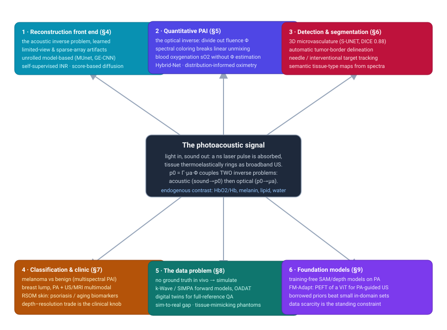
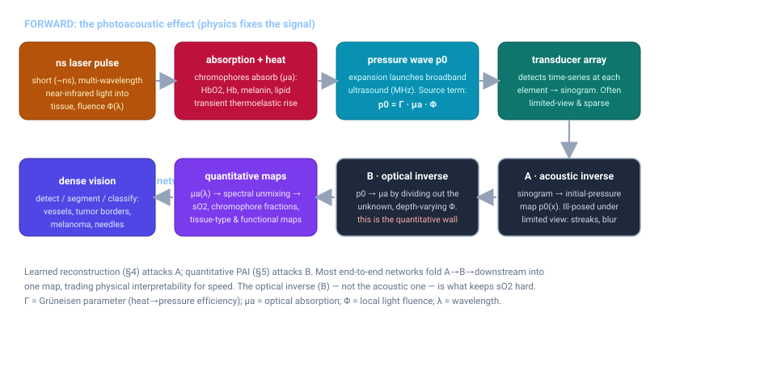

# Dense Object Detection & Classification — Recent Advances

*Compiled 2026-Aug-13 (America/Los_Angeles).*

Next installment in the running CV-updates log. Earlier entries on
`main`:
[Apr-30](../2026-Apr-30/2026-Apr-30_CV_updates.md),
[May-01](../2026-May-01/2026-May-01_CV_updates.md),
[May-02](../2026-May-02/2026-May-02_CV_updates.md),
[May-04](../2026-May-04/2026-May-04_CV_updates.md),
[May-05](../2026-May-05/2026-May-05_CV_updates.md),
[May-07](../2026-May-07/2026-May-07_CV_updates.md),
[May-08](../2026-May-08/2026-May-08_CV_updates.md),
[May-15](../2026-May-15/2026-May-15_CV_updates.md),
[May-16](../2026-May-16/2026-May-16_CV_updates.md),
[May-17](../2026-May-17/2026-May-17_CV_updates.md),
[Jun-09](../2026-Jun-09/2026-Jun-09_CV_updates.md),
[Jun-10](../2026-Jun-10/2026-Jun-10_CV_updates.md),
[Jun-12](../2026-Jun-12/2026-Jun-12_CV_updates.md),
[Jun-15](../2026-Jun-15/2026-Jun-15_CV_updates.md),
[Jun-16](../2026-Jun-16/2026-Jun-16_CV_updates.md),
[Jun-17](../2026-Jun-17/2026-Jun-17_CV_updates.md),
[Jun-19](../2026-Jun-19/2026-Jun-19_CV_updates.md),
[Jun-21](../2026-Jun-21/2026-Jun-21_CV_updates.md),
[Jun-22](../2026-Jun-22/2026-Jun-22_CV_updates.md),
[Jun-23](../2026-Jun-23/2026-Jun-23_CV_updates.md),
[Jun-24](../2026-Jun-24/2026-Jun-24_CV_updates.md),
[Jun-25](../2026-Jun-25/2026-Jun-25_CV_updates.md),
[Jun-27](../2026-Jun-27/2026-Jun-27_CV_updates.md),
[Jun-29](../2026-Jun-29/2026-Jun-29_CV_updates.md),
[Jun-30](../2026-Jun-30/2026-Jun-30_CV_updates.md),
[Jul-04](../2026-Jul-04/2026-Jul-04_CV_updates.md),
[Jul-07](../2026-Jul-07/2026-Jul-07_CV_updates.md),
[Jul-08](../2026-Jul-08/2026-Jul-08_CV_updates.md),
[Jul-10](../2026-Jul-10/2026-Jul-10_CV_updates.md),
[Jul-15](../2026-Jul-15/2026-Jul-15_CV_updates.md),
[Jul-17](../2026-Jul-17/2026-Jul-17_CV_updates.md),
[Jul-18](../2026-Jul-18/2026-Jul-18_CV_updates.md),
[Jul-21](../2026-Jul-21/2026-Jul-21_CV_updates.md),
[Jul-22](../2026-Jul-22/2026-Jul-22_CV_updates.md),
[Jul-24](../2026-Jul-24/2026-Jul-24_CV_updates.md),
[Jul-26](../2026-Jul-26/2026-Jul-26_CV_updates.md),
[Jul-27](../2026-Jul-27/2026-Jul-27_CV_updates.md),
[Jul-30](../2026-Jul-30/2026-Jul-30_CV_updates.md),
[Aug-01](../2026-Aug-01/2026-Aug-01_CV_updates.md),
[Aug-02](../2026-Aug-02/2026-Aug-02_CV_updates.md),
[Aug-04](../2026-Aug-04/2026-Aug-04_CV_updates.md),
[Aug-07](../2026-Aug-07/2026-Aug-07_CV_updates.md),
[Aug-10](../2026-Aug-10/2026-Aug-10_CV_updates.md),
[Aug-11](../2026-Aug-11/2026-Aug-11_CV_updates.md).

## Table of contents

1. [Why this pass: photoacoustic imaging as its own primitive](#why)
2. [Topic map](#map)
3. [The primitive — light in, sound out, two coupled inverse problems](#primitive)
4. [Reconstruction as a learned front end (the acoustic inverse)](#recon)
5. [Quantitative PAI: spectral unmixing, oxygenation, and the fluence wall](#quant)
6. [Dense detection & segmentation: vessels, tumor borders, needles](#detseg)
7. [Classification & clinical translation: melanoma, breast, skin](#clinic)
8. [The data problem: simulators, digital twins, and the sim-to-real gap](#data)
9. [Foundation models & training-free adaptation](#foundation)
10. [Through-line and open problems](#throughline)
11. [Sources](#sources)

---

## 1. Why this pass: photoacoustic imaging as its own primitive

This log has now worked through a long lineup of sensing modalities on their own
terms — optical and thermal cameras, LiDAR, automotive imaging radar, SAR, sonar,
ultrasound, X-ray/CT, MRI, PET, OCT, hyperspectral, ground-penetrating radar, and
most recently terahertz. **Photoacoustic imaging (PAI)** — equivalently
*optoacoustic imaging* — belongs in that lineup as a genuinely distinct primitive,
and it earns a standalone entry for one reason that reshapes the whole dense-vision
problem: it is a **hybrid modality that puts light in and takes sound out**.

A nanosecond laser pulse illuminates tissue; light-absorbing molecules
(chromophores) convert the absorbed energy into a tiny transient temperature rise;
the tissue thermoelastically expands and rings as a broadband ultrasound wave; an
ultrasound transducer array records it. The image you want is a map of *optical*
contrast, but the signal you measure is *acoustic*. That single fact is why PAI is
not just "ultrasound with a laser" and not just "optical imaging deeper down":

- **It fuses optical contrast with acoustic resolution.** Pure optical imaging
  (including OCT, [covered Jul-24](../2026-Jul-24/2026-Jul-24_CV_updates.md)) is
  scrambled by scattering past ~1 mm; ultrasound
  ([covered Jul-18](../2026-Jul-18/2026-Jul-18_CV_updates.md)) penetrates
  centimetres but is nearly blind to molecular composition. PAI reaches
  centimetre depths *while* keeping the molecular specificity of optical
  absorption, because ultrasound scatters ~1000× less than light in tissue.

- **Its contrast is functional and label-free.** The chromophores are the story:
  oxy- and deoxy-haemoglobin (so blood oxygen saturation, sO₂, comes for free from
  multi-wavelength imaging), melanin, lipid, water, plus injectable dyes and
  nanoparticles. The class label of a pixel is written in its optical *absorption
  spectrum*, not just its morphology — closer to
  [hyperspectral](../2026-Jul-21/2026-Jul-21_CV_updates.md) than to a grayscale
  B-mode.

- **It carries two inverse problems stacked on top of each other.** Getting from
  the measured sound to an image is the *acoustic* inverse problem (§4). Getting
  from that image to a *quantitative* absorption/oxygenation map means undoing the
  unknown, depth-dependent light fluence — the *optical* inverse problem (§5).
  Almost every hard, modality-specific result in PAI deep learning is really a
  statement about one of these two problems, and the second one is the reason
  quantitative PAI is still not solved.

- **There is essentially no in-vivo ground truth.** You cannot open a living
  vessel to check its true sO₂, and full-view/full-sampling references only exist
  in phantoms or simulation. That absence dominates how the field trains models
  (§8) and is the single biggest lever on whether a network generalizes.

The instrument comes in several flavours that this report treats together because
they share the primitive: **PACT** (photoacoustic computed tomography, an array
around the object), **PAM** (photoacoustic microscopy — optical-resolution OR-PAM
and acoustic-resolution AR-PAM, raster-scanned), **RSOM** (raster-scan optoacoustic
mesoscopy, the skin-depth regime), and **MSOT** (multispectral optoacoustic
tomography, the clinical handheld/array systems). Reviews from 2024–2025 frame the
field as having moved, over 2023–2025, from convolutional denoisers toward
generative and self-supervised models and, increasingly, borrowed foundation
models ([Springer VCIBA review, 2025](https://link.springer.com/article/10.1186/s42492-025-00213-x);
[arXiv 2411.02843](https://arxiv.org/pdf/2411.02843); the earlier canonical
[*Deep learning in photoacoustic imaging: a review*, JBO 26(4) 040901](https://www.spiedigitallibrary.org/journals/journal-of-biomedical-optics/volume-26/issue-04/040901/Deep-learning-in-photoacoustic-imaging-a-review/10.1117/1.JBO.26.4.040901.full)).

## 2. Topic map

The six threads below all hang off the one primitive — the photoacoustic signal
and its two coupled inverse problems. Reconstruction (§4) is the learned attack on
the *acoustic* inverse; quantitative PAI (§5) is the learned attack on the
*optical* inverse; detection/segmentation (§6) and classification (§7) are the
dense-vision tasks that consume the resulting maps; the data problem (§8) and
foundation models (§9) are the two forces that determine whether any of it
generalizes.

## 3. The primitive — light in, sound out, two coupled inverse problems

The physics that makes PAI distinct is compact enough to write in one line. The
**initial pressure** created at a point is

> **p₀ = Γ · μₐ · Φ**

where **μₐ** is the optical absorption coefficient (what you actually want — it
carries the chromophore identity and concentration), **Φ** is the local light
fluence (how much light survived scattering and attenuation to reach that point),
and **Γ** is the Grüneisen parameter (the tissue's efficiency at turning absorbed
heat into pressure). A pulsed laser sets up p₀; that pressure launches a broadband
(MHz) ultrasound wave; transducers record a time series per element (a sinogram).

Reading the diagram left to right and then back:

- **Forward chain (physics, fixed).** Pulse → absorption/heating → pressure wave
  p₀ = ΓμₐΦ → transducer array. The array is usually **limited-view** (it can't
  surround the body part) and often **sparse** (fewer elements, or fewer laser
  shots, to go faster or cheaper). Both facts are baked into the raw data.

- **Inverse problem A — acoustic (§4).** Recover the initial-pressure map p₀(x)
  from the recorded sinogram. This is a tomographic inversion that is *ill-posed*
  under limited view: missing angular coverage shows up as streak artifacts,
  blurred vessel walls, and negativity artifacts. Learned reconstruction lives
  here.

- **Inverse problem B — optical (§5).** Recover μₐ from p₀ by dividing out Γ and,
  above all, the unknown depth-varying fluence Φ. Because Φ(λ) is itself
  wavelength-dependent, the measured spectrum is *distorted* with depth — the
  **spectral coloring** effect — so naïve linear unmixing of multi-wavelength data
  gives biased oxygenation. This is the quantitative wall, and it is what
  separates a pretty picture from a number a clinician can trust.

Everything downstream — detecting vessels, segmenting a tumor, classifying a
lesion — consumes the output of A (and ideally B). A recurring design choice in
the deep-learning literature is whether to solve A and B as **separate,
physically interpretable stages** or to **fold the whole chain into one
end-to-end network** that maps raw signals (or a one-wavelength image) straight to
the task output. The end-to-end route is faster and often more accurate on the
distribution it saw, but it discards the per-stage interpretability that clinical
acceptance tends to demand — a tension that runs through §4–§5.

## 4. Reconstruction as a learned front end (the acoustic inverse)

Because the raw acoustic data is undersampled and the view is partial, the
**reconstruction stage is part of the recognizer** in PAI — the detection and
segmentation numbers downstream are only meaningful relative to the reconstruction
that produced their input. The 2024–2026 work clusters into four attacks.

- **Learned post-processing / image-to-image.** The oldest and most robust recipe:
  run a fast analytic reconstruction (delay-and-sum or filtered back-projection),
  then clean up the artifacts with a CNN/U-Net. Still the baseline that
  everything else is measured against, and still competitive when paired with good
  physics-aware training data.

- **Model-based unrolled networks.** The clearest 2025–2026 trend is *unrolling*
  the iterative model-based inversion into a finite network that alternates a
  physics-informed data-fidelity step (using the known acoustic forward operator)
  with a learned image-domain enhancement step. **MUnet** is a representative
  model-based unrolled framework tailored to PAI, fusing the interpretability of
  the physical model with the fitting power of a network
  ([Ultrasonics, 2026](https://www.sciencedirect.com/science/article/abs/pii/S0041624X26002167)).
  A closely related **model-informed** design targets *low-element linear arrays*
  — the cheap, clinic-friendly geometry — with a GE-CNN that shrinks the model
  matrix ~4× and speeds processing ~46% while preserving quality
  ([*Model-informed deep-learning photoacoustic reconstruction for low-element
  linear array*, Photoacoustics 2025](https://pmc.ncbi.nlm.nih.gov/articles/PMC12152870/)).
  Unrolled networks stay attractive precisely where the forward operator changes
  between samples and per-layer physical interpretability matters for clinical
  sign-off. Physics-informed *deep-unfolded full-waveform inversion* has been
  pushed even into edema detection ([arXiv 2603.04070](https://arxiv.org/pdf/2603.04070)),
  and a matrix-free transformer that treats each sensor as a token
  (*Sensor-Token Self-Attention*) drops the explicit system matrix entirely
  ([arXiv 2607.25576](https://arxiv.org/html/2607.25576v1)).

- **Self-supervised & untrained neural representations.** Because paired
  ground truth is scarce, a strong 2024–2025 line reconstructs *per-scan* with no
  training set. **HIS** (High-quality self-supervised neural representation)
  reconstructs high-quality images from limited-view sensor data by fitting an
  implicit representation to the measurement physics of a single acquisition
  ([arXiv 2407.03663](https://arxiv.org/abs/2407.03663)). Implicit neural
  representations also enhance resolution of *under-sampled* PAM images without a
  training corpus ([arXiv 2410.19786](https://arxiv.org/pdf/2410.19786)), and
  spiral scanning plus self-supervised reconstruction enables *ultra-sparse*
  multispectral PAT ([arXiv 2404.06695](https://arxiv.org/pdf/2404.06695)). The
  appeal is directly modality-driven: no in-vivo ground truth needed.

- **Score-based / diffusion generative priors.** Diffusion models act as learned
  image priors for the ill-posed inversion. **DiffPam** accelerates PAM ~5× using
  a diffusion model *trained only on natural images* — matching a dedicated U-Net
  without a large in-domain dataset, a pointed answer to PAI's data scarcity
  ([arXiv 2312.08834](https://arxiv.org/pdf/2312.08834); see also the Scientific
  Reports version, [s41598-024-67957-z](https://www.nature.com/articles/s41598-024-67957-z)).
  For PACT, a *sinogram-domain prior-guided* enhanced score-based diffusion model
  pushes ultra-sparse reconstruction further
  ([Photoacoustics 2024, PMC11648917](https://pmc.ncbi.nlm.nih.gov/articles/PMC11648917/)).
  Earlier physics-guided baselines (e.g. **PixelDL**, which interpolates by wave
  physics before a CNN, [arXiv 1911.04357](https://arxiv.org/abs/1911.04357)) and
  limited-view/sparse neuroimaging networks
  ([*Sci. Rep.* 2020, s41598-020-65235-2](https://www.nature.com/articles/s41598-020-65235-2))
  set the trajectory that the generative and unrolled methods now extend. A recent
  *learnable physical* model specifically targets the combined
  sparse-*and*-limited-view array case
  ([Photoacoustics, Aug 2025](https://www.sciencedirect.com/science/article/abs/pii/S0301562925002443)).

The through-line: PAI reconstruction is converging on **hybrids that keep the
acoustic forward operator in the loop** (unrolled / model-informed / physics-guided)
while using learned or generative priors to fill the missing-data null space — and
on **self-supervised per-scan fitting** when no training corpus is trustworthy.

## 5. Quantitative PAI: spectral unmixing, oxygenation, and the fluence wall

If §4 makes the picture, §5 makes the *number*. Multi-wavelength PAI promises
label-free maps of blood oxygenation and chromophore concentration, but the
measured multispectral p₀ is μₐ(λ) *multiplied by* the unknown fluence Φ(λ). Since
Φ(λ) is wavelength-dependent and grows more distorted with depth (**spectral
coloring**), a constant-fluence assumption fails in deep tissue and naïve linear
unmixing yields biased sO₂
([overview: *Quantitative oximetry with photoacoustic computed tomography*,
JIOHS 2026](https://www.worldscientific.com/doi/10.1142/S1793545826300065)). Deep
learning attacks this in a few ways.

- **Direct end-to-end mapping.** Learn the nonlinear inverse from multispectral PA
  images straight to quantitative parameter maps, implicitly encoding photon
  transport in the network weights. Fast at inference and increasingly the default
  ([arXiv 2411.02843](https://arxiv.org/pdf/2411.02843)). The risk is
  distribution dependence — the network only knows the fluence physics of tissues
  resembling its training set.

- **Joint segmentation + oxygenation without estimating fluence.** A notable
  2025 result, **Hybrid-Net**, sidesteps explicit fluence estimation entirely:
  one network simultaneously segments vessels and estimates their sO₂. Reported
  segmentation accuracy ≥ 0.978 in simulation (across 0–35 dB noise) and 0.998 in
  experiment, with sO₂ mean-squared error ≤ 0.048 (sim) and 0.003 (experiment)
  ([arXiv 2512.15394](https://arxiv.org/abs/2512.15394)). Coupling the two tasks —
  "where is the vessel" and "what is its oxygenation" — is itself the trick, since
  segmentation constrains where the sO₂ estimate has to be physically sensible.

- **Distribution-informed, wavelength-flexible oximetry.** Rather than a fixed
  wavelength set, learn oximetry that is *informed by the training distribution*
  and flexible to the wavelengths actually available on a given scanner
  ([arXiv 2403.14863](https://arxiv.org/pdf/2403.14863)) — a direct response to the
  fact that clinical MSOT systems differ in their laser lines. Earlier
  Helmholtz-Munich work established DL spectral unmixing for tissue sO₂ as a
  category ([PuSH record](https://push-zb.helmholtz-munich.de/frontdoor.php?source_opus=60797&la=en)).

- **Physics-in-the-loop iterative learning.** Fold the optical (and acoustic)
  forward models into the learning to quantify absorption and Grüneisen jointly
  ([*A physics-based iterative learning framework for quantitative parametric
  imaging*, EAAI 2024](https://www.sciencedirect.com/science/article/abs/pii/S0952197624020797)),
  and *accelerate* the classically slow iterative fluence correction with a network
  ([arXiv 2312.01727](https://arxiv.org/pdf/2312.01727)).

- **qPACT under a virtual imaging framework.** A 3D quantitative PACT
  reconstruction method has been evaluated inside a *realistic virtual-imaging*
  framework — cohorts of virtual subjects that give the controlled, quantitative,
  full-reference assessment that in-vivo data cannot
  ([arXiv 2510.03431](https://arxiv.org/pdf/2510.03431);
  [PMC12858365](https://pmc.ncbi.nlm.nih.gov/articles/PMC12858365/)). And because
  simulation-trained oximetry may not transfer, a "moving beyond simulation" line
  trains directly on *tissue-mimicking phantoms* with measurable ground truth
  ([arXiv 2306.06748](https://arxiv.org/pdf/2306.06748)).

The fluence wall is the defining open problem of the modality. Everything here is
a different bet on how to get an unbiased μₐ(λ) without ever measuring Φ.

## 6. Dense detection & segmentation: vessels, tumor borders, needles

Once a reconstruction exists, the dense-vision tasks look familiar in form but are
shaped by PAI's contrast (vasculature everywhere), its 3D volumetric nature, and
its low, depth-dependent SNR.

- **Vascular segmentation is the flagship task.** Multispectral optoacoustic
  tomography images vasculature by design, and a **sparse U-Net (S-UNET)** for
  automatic segmentation of human vasculature in MSOT reached a median DICE ≈ 0.88
  — while confronting the modality-specific pain that vascular *function* tests
  produce thousands of frames over minutes with signal attenuating with depth
  ([Photoacoustics 2020, PMC7644749](https://www.ncbi.nlm.nih.gov/pmc/articles/PMC7644749/);
  [ScienceDirect](https://www.sciencedirect.com/science/article/pii/S2213597920300434)).
  The joint segment-and-oximeter framing of Hybrid-Net (§5) is the current
  evolution of this line.

- **Semantic segmentation from spectra.** Instead of one binary vessel mask,
  assign each pixel a *tissue class* using its multispectral signature — semantic
  segmentation of multispectral PA images, which turns the spectral fingerprint
  into a per-pixel label ([arXiv 2105.09624](https://arxiv.org/pdf/2105.09624)).
  This is where PAI is most hyperspectral-like: the label lives in the spectrum.

- **Tumor-border delineation without human input.** In the melanoma work below
  (§7), a computational framework segments the tumor boundary directly from
  multispectral PA data with no manual seeding — the dense-detection payoff that
  makes the classification clinically meaningful
  ([Photoacoustics 2025, PMC12272440](https://pmc.ncbi.nlm.nih.gov/articles/PMC12272440/)).

- **Interventional / needle detection.** For PA-guided procedures, detecting a
  metal needle in a cluttered, low-contrast field is its own problem; deep
  learning with *semi-synthetic* LED-based PA datasets improves needle visibility
  ([arXiv 2111.07673](https://arxiv.org/pdf/2111.07673)), and foundation-model
  adaptation (FM-Adapt, §9) targets simultaneous needle tracking and target
  segmentation in PA-supervised ultrasound.

- **Combined super-resolution + segmentation.** A recurring pattern couples a
  learned super-resolution front end with a segmentation head so that the two are
  trained to help each other on sparsely sampled PA images
  ([*Deep-Learning-Based Super-Resolution Reconstruction and Segmentation of
  Photoacoustic Images*, Applied Sciences 2024](https://doi.org/10.3390/app14125331)).

The consistent lesson: because reconstruction quality varies with view and depth,
the strongest detectors/segmenters are trained *jointly* with (or made robust to)
the reconstruction stage, rather than assuming a clean image arrives from
elsewhere.

## 7. Classification & clinical translation: melanoma, breast, skin

PAI's clinical pull is strongest where its label-free functional contrast maps
onto a diagnostic question — and the depth-versus-resolution trade-off is the knob
that decides which application is reachable.

- **Melanoma.** Multispectral PAI resolves melanin and the tumor's abnormal
  microvasculature, and a 2025 deep-learning framework performs *non-invasive*
  melanoma characterization in humans — automatically delineating the tumor border
  and classifying it from the multispectral volume, targeting the biopsy-avoidance
  use case for the most lethal skin cancer
  ([Photoacoustics 2025, PMC12272440](https://pmc.ncbi.nlm.nih.gov/articles/PMC12272440/);
  [ScienceDirect S2213597925000667](https://www.sciencedirect.com/science/article/pii/S2213597925000667)).

- **Breast.** A 2025 review lays out photoacoustic *multimodal* breast imaging —
  fusing PA with mammography, ultrasound, and MRI to raise sensitivity, specificity,
  and lump-classification accuracy, since PA adds the functional (angiogenesis /
  hypoxia) axis those modalities lack
  ([Wiley *VIEW* 2025, VIW.20250067](https://onlinelibrary.wiley.com/doi/full/10.1002/VIW.20250067)).
  Deep transfer-learning classifiers on PA multimodal breast images demonstrate the
  detect-and-classify pipeline end to end
  ([PMC9098312](https://www.ncbi.nlm.nih.gov/pmc/articles/PMC9098312/)).

- **Skin — RSOM mesoscopy.** In the shallow, high-resolution regime, **raster-scan
  optoacoustic mesoscopy** visualizes epidermal and dermal micro-structure in vivo.
  **DeepRAP** (Deep-learning RSOM Analysis Pipeline) uses a multi-network
  segmentation strategy with transfer learning to recognize skin layers and
  segment dermal microvasculature at human-equivalent accuracy, then extracts
  imaging biomarkers for **psoriasis** and **aging** that correlate strongly with
  physician assessment and histology; in a 75-volunteer study, fine dermal
  microvascular features correlated most strongly with age
  ([*Machine Learning Analysis of Human Skin by Optoacoustic Mesoscopy*, TUM/2024,
  PubMed 38241120](https://pubmed.ncbi.nlm.nih.gov/38241120/)). 2025 follow-ons add
  automatic microvasculature biomarker quantification
  ([ECBO 2025 S1D.1](https://opg.optica.org/abstract.cfm?uri=ECBO-2025-S1D.1)) and a
  polynomial *skin-flattening* preprocessing step to align the curved skin surface
  in 3D reconstructions before analysis
  ([ECBO 2025 S4D.1](https://opg.optica.org/abstract.cfm?uri=ECBO-2025-S4D.1)). A
  distance-based loss enforces smooth, continuous skin-layer boundaries — a
  segmentation-quality trick specific to the layered anatomy
  ([arXiv 2007.05324](https://arxiv.org/pdf/2007.05324)).

The landscape reads as a modality "on the cusp of broad clinical adoption," pushed
by LED light sources, miniaturized probes, and AI-assisted reconstruction, but
still bounded by the penetration-versus-resolution trade and the demand for faster
imaging ([Springer VCIBA review 2025](https://link.springer.com/article/10.1186/s42492-025-00213-x)).

## 8. The data problem: simulators, digital twins, and the sim-to-real gap

Because there is no in-vivo ground truth, PAI deep learning is *simulation-first*
to a degree few other modalities are — and the resulting sim-to-real gap is the
field's central methodological risk.

- **Forward simulators.** **k-Wave** is the workhorse acoustic solver; **SIMPA**
  wraps tissue modelling, optical forward modelling (photon transport), acoustic
  modelling, noise, and reconstruction into one open toolkit for generating
  multispectral PA data with known ground truth
  ([SIMPA, SPIE](https://www.spiedigitallibrary.org/conference-proceedings-of-spie/11642/116423C/SIMPA--an-open-source-toolkit-for-simulation-and-processing/10.1117/12.2578172.short)).
  A community index tracks the (few) public PA datasets
  ([Photoacoustic-Imaging-Open-Datasets](https://github.com/CbinHu/Photoacoustic-Imaging-Open-Datasets)).

- **Reference datasets.** **OADAT** provides reconstructed optoacoustic slices with
  known full-sampling / full-view references and hundreds of thousands of images
  across parameter variations — enough for robust statistics on sparse/limited-view
  methods. Semi-synthetic LED-based datasets support niche tasks like needle
  visibility ([arXiv 2111.07673](https://arxiv.org/pdf/2111.07673)).

- **Digital twins for full-reference QA.** Since you can't measure the truth in
  vivo, build a *digital twin* of the acquisition to enable full-reference quality
  assessment of PA reconstructions
  ([arXiv 2505.24514](https://arxiv.org/pdf/2505.24514)). Relatedly, a large-scale
  benchmark evaluated 11 full-reference and 2 no-reference image-quality metrics
  across nearly one million PA images from five datasets, asking which metrics even
  *track* diagnostic quality
  ([PMC12991846](https://pmc.ncbi.nlm.nih.gov/articles/PMC12991846/)).

- **Benchmarking DL reconstruction with clinically-relevant synthetics.** A 2026
  benchmark supplies open, anatomically plausible synthetic datasets and evaluation
  protocols for DL-based acoustic inversion in PACT — a move to make reconstruction
  claims comparable across papers
  ([arXiv 2601.17165](https://arxiv.org/pdf/2601.17165)).

- **Closing the gap.** The recurring finding is that simulation-trained networks
  transfer imperfectly; the responses are (a) training/validating on
  *tissue-mimicking phantoms* with real measured ground truth
  ([arXiv 2306.06748](https://arxiv.org/pdf/2306.06748)), (b) self-supervised
  per-scan methods that never rely on a training distribution (§4), and (c)
  distribution-informed models that are explicit about the tissue statistics they
  assume (§5).

## 9. Foundation models & training-free adaptation

The scarcity of annotated PA data makes *borrowing* priors from large pretrained
models unusually attractive — and, in some cases, better than training in domain.

- **Training-free foundation models on PA.** A *training-free* pipeline uses
  general vision foundation models (segment-anything–style and depth models)
  directly on photoacoustic images for standard processing tasks — no PA-specific
  training at all — arguing that off-the-shelf priors already carry much of what
  small PA datasets struggle to learn
  ([*Streamlined Photoacoustic Image Processing with Foundation Models: A
  Training-Free Solution*, arXiv 2404.07833](https://arxiv.org/pdf/2404.07833)).

- **Parameter-efficient adaptation.** **FM-Adapt** is presented as the first
  parameter-efficient adaptation of a SAM-based vision transformer into a
  resolution-agnostic architecture, trained with *photoacoustic supervision* for
  dual-target interventional ultrasound — simultaneous needle tracking and target
  (breast-tumor) segmentation. It turns a general segmentation backbone into a
  PA-guided interventional tool with a small tuning budget.

- **Why it fits the modality.** PAI's standing constraint is data, not ideas.
  Foundation-model reuse — whether zero-shot, PEFT-adapted, or as a diffusion prior
  (DiffPam, §4, which used only natural images) — is the field's most direct answer
  to "we will never have ImageNet-scale labelled photoacoustic data." The open
  question is how much the general priors' *optical/acoustic blind spots* cost on
  the quantitative tasks (§5), where the physics, not the appearance, carries the
  answer.

## 10. Through-line and open problems

**One primitive, two inverse problems.** Read across §4–§9, every hard result in
photoacoustic dense vision is a statement about one of two problems: the *acoustic*
inverse (recover the picture from limited, sparse sound) or the *optical* inverse
(recover a number — μₐ, sO₂ — by undoing an unknown fluence). The field has made
fast, credible progress on the first via unrolled/model-informed and
self-supervised/generative reconstruction. The second — the **fluence wall** and
its spectral-coloring bias — remains the defining unsolved problem, and it is the
reason quantitative oximetry is still validated mostly in phantoms and virtual
subjects rather than trusted blind in deep tissue.

**Physics-in-the-loop is winning the interpretability argument.** The 2025–2026
reconstruction literature leans toward keeping the known forward operator inside
the network (MUnet, model-informed GE-CNN, deep-unfolded FWI, matrix-free
sensor-token attention) rather than pure black-box image-to-image, because clinical
acceptance rewards per-stage interpretability — even at some accuracy cost on the
training distribution.

**Data scarcity shapes everything.** No in-vivo ground truth forces a
simulation-first culture (k-Wave, SIMPA, OADAT, digital twins, benchmarks) whose
central liability is the sim-to-real gap. The three live answers — self-supervised
per-scan fitting, phantom-measured ground truth, and borrowed foundation-model
priors — are all, at heart, ways to avoid needing a big labelled in-domain corpus.

**Open problems worth watching.**
- *Quantitative, depth-robust oximetry in vivo* without measuring fluence —
  jointly with segmentation (Hybrid-Net's coupling) and with explicit uncertainty.
- *Uncertainty quantification* on reconstructions and sO₂ maps, so a clinician
  knows when a streak or a biased spectrum is being reported as signal.
- *Standardized benchmarks and QA metrics* that actually track diagnostic value —
  the near-million-image metric study and the 2026 PACT benchmark are first steps.
- *3D / real-time* reconstruction at clinical frame rates from cheap, low-element,
  limited-view arrays — where model-informed unrolling and foundation-model priors
  are most likely to pay off.
- *How much physics the general foundation models are missing* on the quantitative
  tasks, and whether PA-supervised adaptation (FM-Adapt) or physics-in-the-loop
  fine-tuning closes it.

### Processing pipeline at a glance

The Mermaid flow below traces a multi-wavelength acquisition through both inverse
problems to the three dense-vision outputs, and marks where each section's methods
attach.

```mermaid
flowchart TD
  SRC["ns laser pulse, multi-wavelength<br/>fluence &#934;(&#955;) into tissue"]:::src
  ABS["Absorption + thermoelastic heating<br/>p0 = &#915; &#183; &#956;a &#183; &#934;"]:::abs
  SINO["Transducer array &#8594; sinogram<br/>limited-view &amp; sparse"]:::sino
  RECON["S4 Acoustic inverse (learned)<br/>unrolled MUnet - GE-CNN - self-sup INR - diffusion"]:::recon
  P0["Initial-pressure map p0(x)"]:::p0
  QUANT["S5 Optical inverse (quantitative)<br/>divide out &#934; - spectral unmixing - sO2"]:::quant
  MAPS["Quantitative maps: &#956;a(&#955;), sO2, tissue type"]:::maps
  DET["S6 Detection &amp; segmentation<br/>vessels - tumor border - needle"]:::det
  CLS["S7 Classification<br/>melanoma - breast - RSOM skin biomarkers"]:::cls
  FM["S9 Foundation-model priors<br/>training-free - FM-Adapt PEFT"]:::fm
  DATA["S8 Simulators &amp; twins<br/>k-Wave - SIMPA - OADAT - benchmarks"]:::data

  SRC --> ABS --> SINO --> RECON --> P0
  P0 --> QUANT --> MAPS
  P0 --> DET
  MAPS --> DET --> CLS
  MAPS --> CLS
  FM -.priors.-> RECON
  FM -.priors.-> DET
  DATA -.training / QA.-> RECON
  DATA -.training / QA.-> QUANT

  classDef src fill:#b45309,color:#ffffff,stroke:#92400e,stroke-width:1px;
  classDef abs fill:#be123c,color:#ffffff,stroke:#9f1239,stroke-width:1px;
  classDef sino fill:#0f766e,color:#ffffff,stroke:#115e59,stroke-width:1px;
  classDef recon fill:#0891b2,color:#ffffff,stroke:#0e7490,stroke-width:1px;
  classDef p0 fill:#1e293b,color:#ffffff,stroke:#94a3b8,stroke-width:1px;
  classDef quant fill:#4f46e5,color:#ffffff,stroke:#3730a3,stroke-width:1px;
  classDef maps fill:#1e293b,color:#ffffff,stroke:#94a3b8,stroke-width:1px;
  classDef det fill:#be123c,color:#ffffff,stroke:#9f1239,stroke-width:1px;
  classDef cls fill:#7c3aed,color:#ffffff,stroke:#5b21b6,stroke-width:1px;
  classDef fm fill:#7c3aed,color:#ffffff,stroke:#5b21b6,stroke-width:1px;
  classDef data fill:#0f766e,color:#ffffff,stroke:#115e59,stroke-width:1px;
```

Note the two entry points into the dense-vision tasks: detection/segmentation can
run on the reconstructed pressure map p0 directly, but classification wants the
*quantitative* maps that only the optical inverse produces. Foundation-model priors
(§9) and simulated data / QA (§8) attach as dashed influences rather than inline
stages — they shape the learned blocks without being steps in the acquisition.

## 11. Sources

**Reviews & overviews**
- *Advances in photoacoustic imaging reconstruction and quantitative analysis for biomedical applications* — Springer VCIBA, 2025: https://link.springer.com/article/10.1186/s42492-025-00213-x
- *Advances in Photoacoustic Imaging Reconstruction and Quantitative Analysis* — arXiv 2411.02843: https://arxiv.org/pdf/2411.02843
- *Deep learning in photoacoustic imaging: a review* — J. Biomed. Opt. 26(4) 040901: https://www.spiedigitallibrary.org/journals/journal-of-biomedical-optics/volume-26/issue-04/040901/Deep-learning-in-photoacoustic-imaging-a-review/10.1117/1.JBO.26.4.040901.full
- *Quantitative oximetry with photoacoustic computed tomography: principles, progress, prospects* — JIOHS 2026: https://www.worldscientific.com/doi/10.1142/S1793545826300065

**Reconstruction — the acoustic inverse (§4)**
- MUnet: model-based unrolled reconstruction for computational PAI — Ultrasonics 2026: https://www.sciencedirect.com/science/article/abs/pii/S0041624X26002167
- Model-informed DL reconstruction for low-element linear array (GE-CNN) — Photoacoustics 2025: https://pmc.ncbi.nlm.nih.gov/articles/PMC12152870/ · https://www.sciencedirect.com/science/article/pii/S2213597925000552
- Matrix-free PA reconstruction via sensor-token self-attention — arXiv 2607.25576: https://arxiv.org/html/2607.25576v1
- Physics-informed deep-unfolded full-waveform inversion (edema) — arXiv 2603.04070: https://arxiv.org/pdf/2603.04070
- HIS: high-quality self-supervised neural representation, limited-view — arXiv 2407.03663: https://arxiv.org/abs/2407.03663
- Resolution enhancement of under-sampled PAM via implicit neural representations — arXiv 2410.19786: https://arxiv.org/pdf/2410.19786
- Spiral scanning + self-supervised reconstruction, ultra-sparse MSOT — arXiv 2404.06695: https://arxiv.org/pdf/2404.06695
- DiffPam: speeding up PA imaging using diffusion models — arXiv 2312.08834: https://arxiv.org/pdf/2312.08834 · Sci. Rep. s41598-024-67957-z: https://www.nature.com/articles/s41598-024-67957-z
- Ultra-sparse PACT via sinogram-domain prior-guided score-based diffusion — Photoacoustics 2024, PMC11648917: https://pmc.ncbi.nlm.nih.gov/articles/PMC11648917/
- Learnable physical DL model for sparse limited-view PAT — Photoacoustics, Aug 2025: https://www.sciencedirect.com/science/article/abs/pii/S0301562925002443
- PixelDL (physics-guided pixelwise DL) — arXiv 1911.04357: https://arxiv.org/abs/1911.04357
- Limited-view & sparse PAT for neuroimaging with DL — Sci. Rep. 2020, s41598-020-65235-2: https://www.nature.com/articles/s41598-020-65235-2
- DL acceleration of iterative model-based fluence correction — arXiv 2312.01727: https://arxiv.org/pdf/2312.01727

**Quantitative PAI — the optical inverse (§5)**
- Hybrid-Net: DL-driven quantitative spectroscopic PAI for segmentation & sO₂ — arXiv 2512.15394: https://arxiv.org/abs/2512.15394
- Distribution-informed, wavelength-flexible data-driven PA oximetry — arXiv 2403.14863: https://arxiv.org/pdf/2403.14863
- DL-based spectral unmixing for optoacoustic tissue sO₂ — Helmholtz Munich PuSH: https://push-zb.helmholtz-munich.de/frontdoor.php?source_opus=60797&la=en
- Physics-based iterative learning for quantitative parametric imaging — EAAI 2024: https://www.sciencedirect.com/science/article/abs/pii/S0952197624020797
- Virtual imaging framework for DL 3D qPACT — arXiv 2510.03431: https://arxiv.org/pdf/2510.03431 · PMC12858365: https://pmc.ncbi.nlm.nih.gov/articles/PMC12858365/
- Moving beyond simulation: data-driven qPAI with tissue-mimicking phantoms — arXiv 2306.06748: https://arxiv.org/pdf/2306.06748

**Detection & segmentation (§6)**
- Sparse DL (S-UNET) for human vasculature segmentation in MSOT — Photoacoustics 2020, PMC7644749: https://www.ncbi.nlm.nih.gov/pmc/articles/PMC7644749/ · https://www.sciencedirect.com/science/article/pii/S2213597920300434
- Semantic segmentation of multispectral PA images — arXiv 2105.09624: https://arxiv.org/pdf/2105.09624
- DL super-resolution reconstruction & segmentation of PA images — Applied Sciences 2024: https://doi.org/10.3390/app14125331
- Improving needle visibility in LED-based PAI with semi-synthetic data — arXiv 2111.07673: https://arxiv.org/pdf/2111.07673

**Classification & clinical (§7)**
- Non-invasive melanoma diagnostics with DL + multispectral PAI — Photoacoustics 2025, PMC12272440: https://pmc.ncbi.nlm.nih.gov/articles/PMC12272440/ · https://www.sciencedirect.com/science/article/pii/S2213597925000667
- Photoacoustic integrated multimodal imaging for breast cancer diagnosis (review) — Wiley VIEW 2025: https://onlinelibrary.wiley.com/doi/full/10.1002/VIW.20250067
- Deep transfer-learning breast cancer detection/classification from PA multimodal images — PMC9098312: https://www.ncbi.nlm.nih.gov/pmc/articles/PMC9098312/
- Machine-learning analysis of human skin by optoacoustic mesoscopy (DeepRAP; psoriasis/aging biomarkers) — TUM 2024, PubMed 38241120: https://pubmed.ncbi.nlm.nih.gov/38241120/
- Automatic quantification of skin microvasculature biomarkers by RSOM + ML — ECBO 2025 S1D.1: https://opg.optica.org/abstract.cfm?uri=ECBO-2025-S1D.1
- Skin flattening of RSOM reconstructions via polynomial fitting — ECBO 2025 S4D.1: https://opg.optica.org/abstract.cfm?uri=ECBO-2025-S4D.1
- Distance-based loss for smooth skin-layer segmentation in optoacoustic images — arXiv 2007.05324: https://arxiv.org/pdf/2007.05324

**Data, simulators & benchmarks (§8)**
- SIMPA: open-source toolkit for simulation & processing of PA images — SPIE: https://www.spiedigitallibrary.org/conference-proceedings-of-spie/11642/116423C/SIMPA--an-open-source-toolkit-for-simulation-and-processing/10.1117/12.2578172.short
- Photoacoustic-Imaging-Open-Datasets (community index) — GitHub: https://github.com/CbinHu/Photoacoustic-Imaging-Open-Datasets
- Digital twins enable full-reference quality assessment of PA reconstructions — arXiv 2505.24514: https://arxiv.org/pdf/2505.24514
- Assessing image quality in PAI: metric-based & DL-based evaluation (~1M images) — PMC12991846: https://pmc.ncbi.nlm.nih.gov/articles/PMC12991846/
- Benchmarking DL-based reconstruction for PACT with clinically relevant synthetic datasets — arXiv 2601.17165: https://arxiv.org/pdf/2601.17165

**Foundation models (§9)**
- Streamlined PA image processing with foundation models: a training-free solution — arXiv 2404.07833: https://arxiv.org/pdf/2404.07833
- FM-Adapt (SAM-based ViT PEFT, PA-supervised dual-target interventional US) — see foundation-model discussion in §9.

---

*Compiled from public web search on 2026-Aug-13 (America/Los_Angeles). Direct
`arxiv.org` fetches were blocked by the environment's egress proxy during this
run; entries were therefore compiled from search-result metadata and mirror pages
(PMC, ScienceDirect, publisher sites), which may lag or lead the arXiv abstract in
date. Links point to the canonical source where known. Prior installments are
listed at the top of this file; each dense-vision modality is treated as its own
primitive.*
