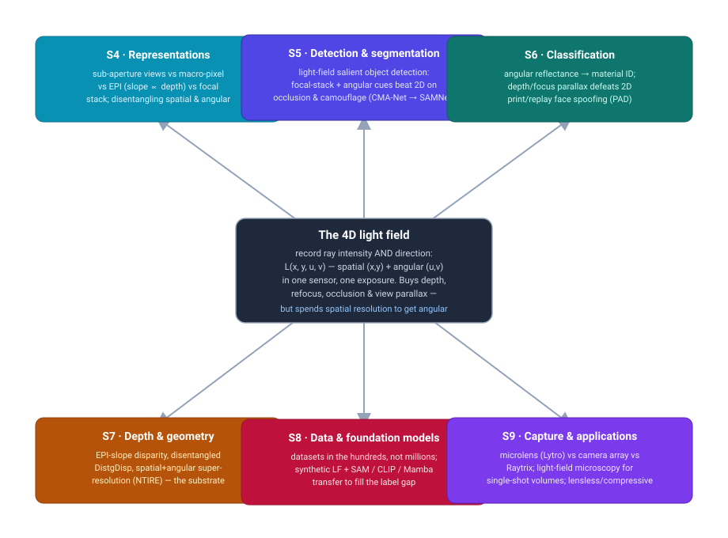
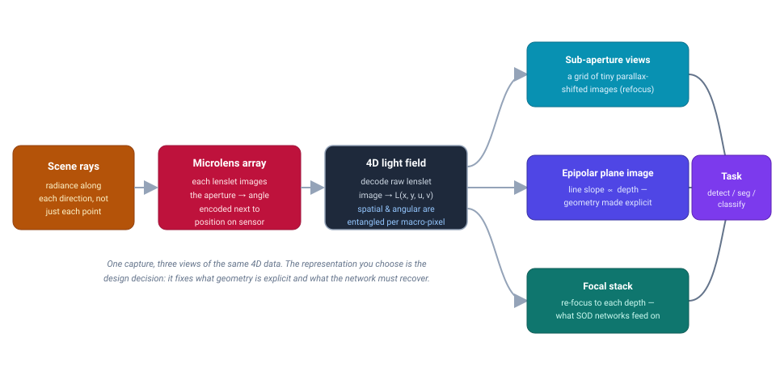

# Dense Object Detection & Classification — Recent Advances

*Compiled 2026-Aug-14 (America/Los_Angeles).*

Next installment in the running CV-updates log. Earlier entries on
`main`:
[Apr-30](../2026-Apr-30/2026-Apr-30_CV_updates.md),
[May-01](../2026-May-01/2026-May-01_CV_updates.md),
[May-02](../2026-May-02/2026-May-02_CV_updates.md),
[May-04](../2026-May-04/2026-May-04_CV_updates.md),
[May-05](../2026-May-05/2026-May-05_CV_updates.md),
[May-07](../2026-May-07/2026-May-07_CV_updates.md),
[May-08](../2026-May-08/2026-May-08_CV_updates.md),
[May-15](../2026-May-15/2026-May-15_CV_updates.md),
[May-16](../2026-May-16/2026-May-16_CV_updates.md),
[May-17](../2026-May-17/2026-May-17_CV_updates.md),
[Jun-09](../2026-Jun-09/2026-Jun-09_CV_updates.md),
[Jun-10](../2026-Jun-10/2026-Jun-10_CV_updates.md),
[Jun-12](../2026-Jun-12/2026-Jun-12_CV_updates.md),
[Jun-15](../2026-Jun-15/2026-Jun-15_CV_updates.md),
[Jun-16](../2026-Jun-16/2026-Jun-16_CV_updates.md),
[Jun-17](../2026-Jun-17/2026-Jun-17_CV_updates.md),
[Jun-19](../2026-Jun-19/2026-Jun-19_CV_updates.md),
[Jun-21](../2026-Jun-21/2026-Jun-21_CV_updates.md),
[Jun-22](../2026-Jun-22/2026-Jun-22_CV_updates.md),
[Jun-23](../2026-Jun-23/2026-Jun-23_CV_updates.md),
[Jun-24](../2026-Jun-24/2026-Jun-24_CV_updates.md),
[Jun-25](../2026-Jun-25/2026-Jun-25_CV_updates.md),
[Jun-27](../2026-Jun-27/2026-Jun-27_CV_updates.md),
[Jun-29](../2026-Jun-29/2026-Jun-29_CV_updates.md),
[Jun-30](../2026-Jun-30/2026-Jun-30_CV_updates.md),
[Jul-04](../2026-Jul-04/2026-Jul-04_CV_updates.md),
[Jul-07](../2026-Jul-07/2026-Jul-07_CV_updates.md),
[Jul-08](../2026-Jul-08/2026-Jul-08_CV_updates.md),
[Jul-10](../2026-Jul-10/2026-Jul-10_CV_updates.md),
[Jul-15](../2026-Jul-15/2026-Jul-15_CV_updates.md),
[Jul-17](../2026-Jul-17/2026-Jul-17_CV_updates.md),
[Jul-18](../2026-Jul-18/2026-Jul-18_CV_updates.md),
[Jul-21](../2026-Jul-21/2026-Jul-21_CV_updates.md),
[Jul-22](../2026-Jul-22/2026-Jul-22_CV_updates.md),
[Jul-24](../2026-Jul-24/2026-Jul-24_CV_updates.md),
[Jul-26](../2026-Jul-26/2026-Jul-26_CV_updates.md),
[Jul-27](../2026-Jul-27/2026-Jul-27_CV_updates.md),
[Jul-30](../2026-Jul-30/2026-Jul-30_CV_updates.md),
[Aug-01](../2026-Aug-01/2026-Aug-01_CV_updates.md),
[Aug-02](../2026-Aug-02/2026-Aug-02_CV_updates.md),
[Aug-04](../2026-Aug-04/2026-Aug-04_CV_updates.md),
[Aug-07](../2026-Aug-07/2026-Aug-07_CV_updates.md),
[Aug-10](../2026-Aug-10/2026-Aug-10_CV_updates.md),
[Aug-11](../2026-Aug-11/2026-Aug-11_CV_updates.md),
[Aug-13](../2026-Aug-13/2026-Aug-13_CV_updates.md).

## Table of contents

1. [Why this pass: the light field as its own primitive](#why)
2. [Topic map](#map)
3. [The primitive — rays, not pixels, and the spatial–angular trade-off](#primitive)
4. [Representations: sub-aperture views, EPIs, focal stacks, and disentangling](#repr)
5. [Dense detection & segmentation: light-field salient object detection](#detseg)
6. [Classification & recognition: materials and face anti-spoofing](#classification)
7. [Depth & geometry: the substrate the tasks stand on](#geometry)
8. [The data problem, and foundation-model adaptation](#data)
9. [Capture and applications: microscopy, arrays, lensless](#apps)
10. [Through-line and open problems](#throughline)
11. [Sources](#sources)

---

## 1. Why this pass: the light field as its own primitive

This log has worked through a long lineup of sensing modalities on their own terms —
optical and thermal cameras, LiDAR, imaging radar, SAR, sonar, ultrasound, X-ray/CT,
MRI, PET, OCT, hyperspectral, GPR, terahertz, the event camera, and most recently
photoacoustic imaging. Almost all of them still hand the detector a **2D grid of
per-pixel measurements**: whatever the physics upstream, the pixel records *how much*
signal arrived at a location, collapsing every ray that struck that pixel into one
number. The direction each ray came from is thrown away at the sensor.

A **light-field (plenoptic) camera** refuses that collapse. It records not just the
intensity at each spatial position but also the **direction** each ray was travelling
— the 4D *plenoptic function* `L(x, y, u, v)`, where `(x, y)` is spatial position and
`(u, v)` indexes the ray's angle (equivalently, which point of the lens aperture it
passed through). In a single sensor and a single exposure, it captures what a small
*array* of ordinary cameras would: a dense bundle of slightly different viewpoints of
the same scene ([Light-Field Camera, MDPI encyclopedia](https://encyclopedia.pub/entry/31325);
[*Learning-based light field imaging: an overview*, EURASIP J. Image Video Process. 2024](https://link.springer.com/article/10.1186/s13640-024-00628-1)).

That extra angular axis is the whole reason light-field imaging earns a standalone
entry, because it changes what the *sensor itself* delivers to a dense-detection
system before any network runs:

- **Depth and refocus fall out of one shot.** Because the same scene point appears at
  slightly shifted positions across the angular views, its disparity — and hence its
  depth — is recoverable directly, and the image can be computationally *refocused* to
  any plane after capture. A frame camera has to infer depth from stereo, motion, or a
  learned monocular prior; a light field measures the parallax.
- **Occlusion becomes a feature, not a failure.** A partly hidden object is seen
  around from several angles at once, so foreground clutter that would defeat a 2D
  detector can be seen *past*. This is exactly why the flagship dense task for light
  fields is **salient object detection and segmentation in cluttered, occluded,
  camouflaged scenes** (§5), not ordinary box detection.
- **Angular reflectance is a material signature.** How a surface's brightness changes
  across the angular views is a coarse sample of its reflectance (BRDF). Matte paper,
  glossy plastic, and a printed photo of a face all vary *differently* with angle —
  which is why light fields are a natural sensor for **material recognition** and for
  **face anti-spoofing** (§6), where a flat replay attack simply cannot reproduce the
  right angular behaviour.

And the catch — the fact that makes light-field detection its own research problem
rather than "RGB detection with more channels" — is a hard, physical trade-off. All of
that angular information has to be squeezed onto the *same* image sensor that would
otherwise spend its pixels on spatial resolution. A 4000×4000 sensor asked for a 14×14
angular grid drops to roughly **292×292 spatial resolution** ([compressive light-field
photography, *Optics & Laser Technology* 2025](https://www.sciencedirect.com/science/article/abs/pii/S0030401825000392)).
Every light-field detector therefore fights the same tension: the extra views that let
it reason about depth and occlusion are bought by making each view small and
low-resolution, which is precisely the regime where small-object detection is hardest.
The rest of this pass is what the field does about that.

## 2. Topic map

The six threads of this pass, arranged around the 4D light-field primitive. The figure
is a standalone SVG (no external fetches) with light text on saturated fills so it
reads in both light and dark themes.

## 3. The primitive — rays, not pixels, and the spatial–angular trade-off

An ordinary camera integrates, at each sensor pixel, every ray that the main lens
focuses onto it — so it measures `∫ L(x, y, u, v) du dv`, the light field marginalised
over angle. The plenoptic camera keeps the angle. The standard way is a **microlens
array (MLA)** placed at the sensor's focal plane: the main lens forms an image on the
MLA, and each tiny microlens then splits the cone of rays reaching it *by direction*,
painting a little disc on the pixels behind it. Position tells you *where* on the MLA
the ray landed `(x, y)`; which pixel inside the disc tells you *which way* it was going
`(u, v)`. One exposure, one sensor, 4D out ([MDPI encyclopedia](https://encyclopedia.pub/entry/31325)).

There are two classic MLA geometries and one non-MLA route, and the choice sets the
resolution trade:

- **Unfocused / "plenoptic 1.0" (Lytro).** The MLA sits at the image plane; each
  microlens contributes one spatial sample and its pixels give the angular samples.
  Simple, but spatial resolution equals the microlens count — coarse.
- **Focused / "plenoptic 2.0" (Raytrix).** The MLA is focused on the intermediate
  image, trading some angular resolution back for more spatial resolution; the raw
  decode is more involved but the effective image is sharper.
- **Camera arrays.** A grid of ordinary cameras skips the MLA entirely and keeps full
  spatial resolution per view at the cost of size, cost, and calibration. This is the
  high-end capture route and the source of many benchmark datasets.

Whichever you use, the sensor does not hand you `L(x, y, u, v)` cleanly. It hands you a
**raw lenslet image** in which spatial and angular samples are interleaved per
"macro-pixel," and decoding, devignetting, and calibrating that into a usable 4D array
is step zero. The signal chain — and the fork every light-field method faces once the
4D field exists — looks like this (again a self-contained, theme-robust SVG):

## 4. Representations: sub-aperture views, EPIs, focal stacks, and disentangling

Just as with the event camera, the *first* design decision in light-field vision is
representation — and here there are four canonical views of the *same* 4D data, each
making a different structure explicit:

- **Sub-aperture image (SAI) array.** Fix an angle `(u, v)` and read out all `(x, y)`:
  you get one ordinary-looking image "seen through" that part of the aperture. Sweep
  the angles and you get a grid of tiny, parallax-shifted views — a synthetic camera
  array. Refocusing is just a shift-and-add over this grid.
- **Macro-pixel / lenslet image.** Keep the sensor's native interleaving, one
  macro-pixel per spatial location holding all its angular samples. Compact, but
  spatial and angular information are *entangled*, which is exactly what makes plain
  CNNs struggle.
- **Epipolar plane image (EPI).** Fix one spatial axis and one angular axis and slice:
  a scene point traces a **straight line whose slope is proportional to its depth**.
  The EPI turns geometry into texture — depth estimation becomes line-slope estimation
  ([*Light Field Depth Estimation via Stitched Epipolar Plane Images*, IEEE TVCG 2024](https://www.computer.org/csdl/journal/tg/2024/10/10365383/1T0FmurVOcE);
  [*Deep Spectral Epipolar Representations*, arXiv:2508.08900](https://arxiv.org/pdf/2508.08900)).
- **Focal stack.** Computationally refocus to a sweep of depths, producing a stack of
  images each sharp at a different plane. Occluders and background separate by which
  slice they're sharp in — the representation that light-field **salient object
  detectors** most often consume.

The architectural key that unlocked modern light-field networks is learning to
**disentangle** the spatial and angular axes rather than convolving the entangled
macro-pixel grid directly. The canonical backbone is the **Distg** family (DistgSSR /
DistgASR / DistgDisp), whose disentangling mechanism decomposes the 4D field into
spatial, angular, and EPI feature streams and recombines them — incorporating the
light-field structure prior instead of fighting it. It set the baseline for spatial
super-resolution, angular super-resolution, and disparity estimation, and remains the
reference backbone (it anchors the NTIRE 2024 light-field super-resolution challenge)
([Wang et al., *Disentangling Light Fields for Super-Resolution and Disparity
Estimation*, IEEE TPAMI 2023, arXiv:2202.10603](https://arxiv.org/abs/2202.10603);
[NTIRE 2024 LF-SR challenge report](https://openaccess.thecvf.com/content/CVPR2024W/NTIRE/papers/Wang_NTIRE_2024_Challenge_on_Light_Field_Image_Super-Resolution_Methods_and_CVPRW_2024_paper.pdf)).

## 5. Dense detection & segmentation: light-field salient object detection

Light-field vision's flagship *dense* task is **salient object detection (SOD)**:
produce a per-pixel mask of the visually prominent object(s). It is the natural fit
because the modality's advantages — depth, refocus, seeing past occluders — attack
exactly the cases where 2D and even RGB-D saliency fail: an object the same colour as
its background, a foreground object partly hidden by clutter, or a scene with several
objects at different depths. The focal stack and the angular views give a network
direct evidence about what is in front of what.

The architectural arc runs from multi-stream fusion toward foundation-model
adaptation:

- **Mutual-attention fusion (CMA-Net).** Fuse the all-focus image and the focal-stack
  features with a cascaded *mutual attention* mechanism so the two streams sharpen each
  other's high-level features — an early demonstration that treating the angular/focal
  information as a first-class modality beats appending it as extra channels
  ([*CMA-Net*, arXiv:2105.00949](https://arxiv.org/pdf/2105.00949)).
- **Better feature mining and weaker supervision.** More recent work rethinks how much
  of the focal stack is actually useful (*Rethinking Feature Mining for LF SOD*, ACM
  TOMM 2024, [DOI 10.1145/3676967](https://dl.acm.org/doi/10.1145/3676967)) and pushes
  toward **point-supervised** training — a single click per object instead of a dense
  mask — via hierarchical spatial–angular representation learning, directly addressing
  the field's label scarcity (ACM TOMM, [DOI 10.1145/3788871](https://doi.org/10.1145/3788871)).
  A parallel line reframes the cheap-but-imperfect masks as a *noisy-label* learning
  problem ([arXiv:2204.13456](https://arxiv.org/pdf/2204.13456)).
- **Foundation-model adaptation (SAMNet, LFSamba).** The 2024–2026 shift is to adapt a
  large 2D vision foundation model to the 4D setting. **SAMNet** adapts the *Segment
  Anything Model* with a cross-modal fusion module that combines SAM features across
  the light-field modalities, reporting the strongest F-measures across four benchmarks
  (up to **0.945**) — the first work to bring a foundation model to light-field SOD
  ([*SAMNet*, Image and Vision Computing 2024, DOI 10.1016/j.imavis.2024.105403](https://dl.acm.org/doi/10.1016/j.imavis.2024.105403)).
  **LFSamba** pairs SAM with a **Mamba** state-space core to model long-range
  dependencies across the many angular views efficiently
  ([*LFSamba*, ResearchGate 385721656](https://www.researchgate.net/publication/385721656)).

The standard benchmarks are small by RGB standards and that shapes everything: **DUT-LF**
(1462 samples, 1000 train / 462 test), **HFUT** (255 light fields, deliberately hard —
appearance changes, small objects, cluttered backgrounds), the **Lytro Illum** set, and
the newer large-scale **DLLF** (1465 annotated all-focus images with focal stacks). The
community review and benchmark that standardised evaluation across 2D/3D/4D methods is
the reference starting point ([*Light Field Salient Object Detection: A Review and
Benchmark*, arXiv:2010.04968](https://arxiv.org/pdf/2010.04968)), now updated by a 2026
comprehensive survey ([Springer, *Advances in Light Field Salient Object Detection*,
DOI 10.1007/s11831-026-10538-2](https://link.springer.com/article/10.1007/s11831-026-10538-2)).

## 6. Classification & recognition: materials and face anti-spoofing

Beyond dense masks, the angular axis is a *classification* cue in two areas where a
flat image is structurally blind:

- **Material recognition.** A material's appearance changes with viewing angle in a way
  that samples its reflectance function; a light field captures a small slab of that
  variation in one shot. Learning material categories from the 4D data — using the
  angular views as evidence rather than averaging them away — is a distinct
  recognition task established by the 4D material dataset and CNN architectures of
  Wang et al. (ECCV 2016), and it remains the canonical example of "angular data as a
  classification feature" ([*A 4D Light-Field Dataset and CNN Architectures for
  Material Recognition*](https://cseweb.ucsd.edu/~viscomp/projects/LF/papers/ECCV16/)).
- **Face anti-spoofing / presentation-attack detection (PAD).** This is the most
  mature light-field *classification* application. A genuine 3D face and a 2D print or
  screen replay produce very different angular/refocus behaviour: the live face has
  real depth and per-region focus variation, the attack is flat. Because the light
  field measures that directly in one capture, it separates genuine from attack far
  more robustly than a single image — the foundational demonstration used a light-field
  camera to render multiple depth/focus images and classify liveness
  ([*Presentation Attack Detection for Face Recognition Using Light Field Camera*, IEEE
  TIP](https://ieeexplore.ieee.org/document/7018027/);
  [*Face Spoofing Detection using a Light Field Imaging Framework*, ResearchGate 319709235](https://www.researchgate.net/publication/319709235)).
  The **IST Lenslet Light-Field Face Spoofing Database (IST-LLFFSD)** — 100 genuine
  images from 50 subjects plus 600 attacks spanning printed paper, wrapped paper,
  laptop, tablet, and phone replays — remains the reference benchmark for the task.

The common thread: in both cases the classifier's discriminative signal *lives in the
angular dimension*. Collapse the light field to a single image and the material cue and
the liveness cue vanish together.

## 7. Depth & geometry: the substrate the tasks stand on

Detection, segmentation, and anti-spoofing all lean on the geometry the light field
makes measurable, so the depth/geometry line is the enabling substrate rather than a
side topic:

- **Disparity/depth estimation** exploits the EPI's line-slope structure or the
  disentangled angular features. The Distg disparity head (DistgDisp) and a stream of
  EPI-attention models estimate dense depth directly from the 4D field, and 2024–2025
  work adds spectral/epipolar regularisation and stitched-EPI multi-view attention for
  robustness in textureless or occluded regions ([TVCG 2024](https://www.computer.org/csdl/journal/tg/2024/10/10365383/1T0FmurVOcE);
  [arXiv:2508.08900](https://arxiv.org/pdf/2508.08900)).
- **Super-resolution** is the field's answer to the spatial–angular trade-off of §3:
  learn to recover spatial detail (spatial SR) or synthesise new viewpoints (angular
  SR) so a cheap low-resolution capture can still support downstream detection. This is
  a large enough sub-field to sustain annual NTIRE challenges, with the Distg family as
  the standard baseline ([NTIRE 2024](https://openaccess.thecvf.com/content/CVPR2024W/NTIRE/papers/Wang_NTIRE_2024_Challenge_on_Light_Field_Image_Super-Resolution_Methods_and_CVPRW_2024_paper.pdf)).

The practical point for detection: better disparity and super-resolution feed better
focal stacks and sharper sub-aperture views, which is what the SOD and PAD networks of
§5–6 actually consume. Geometry quality upstream caps task quality downstream.

## 8. The data problem, and foundation-model adaptation

The single biggest constraint on light-field detection is data volume. There is no
ImageNet for light fields: the largest SOD sets are ~1500 samples, PAD sets are in the
hundreds, and each capture is a bulky 4D array that is slow and expensive to annotate.
That scarcity explains the field's three coping strategies, all visible above:

1. **Borrow from the 2D world.** Adapt foundation models trained on billions of 2D
   images — SAM for masks (SAMNet), CLIP-style semantics for open recognition — and
   spend the scarce light-field labels only on learning the *angular* adaptation, not
   the whole visual prior.
2. **Weaken the supervision.** Point-level and noisy-label training (§5) cut annotation
   cost per sample so the small datasets stretch further.
3. **Synthesise.** Render 4D light fields with a graphics engine (Blender-based
   pipelines) to get volume with perfect ground-truth depth and masks, then confront
   the synthetic-to-real gap in decoding, noise, and vignetting — the same sim-to-real
   problem seen in other modalities in this log, sharpened by the fact that a *real*
   lenslet decode is messy.

Efficient long-range modelling across the many angular views is where the newest
architectures concentrate — the Mamba/state-space turn (LFSamba) is motivated exactly
by wanting global angular context without attention's quadratic cost on a 4D volume.

## 9. Capture and applications: microscopy, arrays, lensless

Light-field detection is not only a photography story. The angular primitive shows up
wherever single-shot depth or volume matters:

- **Light-field microscopy (LFM).** Put an MLA in a microscope and one camera frame
  captures a whole *volume* — the basis for imaging fast 3D biological activity (e.g.
  neuronal firing across a volume) without scanning. Detection/segmentation here means
  finding and tracking cells or events in the reconstructed volume, and the
  spatial–angular trade-off reappears as an axial-vs-lateral resolution trade.
- **Camera arrays vs microlens vs focused plenoptic.** The capture choice (§3) is an
  application decision: arrays for quality and large baselines, Lytro-style MLAs for
  compact single-sensor capture, Raytrix focused-plenoptic for a spatial-resolution
  compromise in industrial metrology and inspection.
- **Computational and lensless capture.** Newer routes reconstruct a light field from a
  *coded* single-pixel measurement or from a **diffuser** in place of a lens — trading
  optics for computation, and pushing the "representation" problem all the way back into
  the reconstruction ([compressive single-pixel light-field, *Optics & Laser
  Technology* 2025](https://www.sciencedirect.com/science/article/abs/pii/S0030401825000392);
  [lensless light-field imaging through a diffuser, *Light: Science & Applications*](https://www.nature.com/articles/s41377-020-00380-x)).

## 10. Through-line and open problems

The whole pass reduces to one diagram and one tension. The light-field
detection/classification stack, from rays to task:

```mermaid
flowchart TD
  SCENE["Scene rays<br/>radiance by position AND direction"]:::scene
  CAPTURE["Capture: MLA (Lytro / Raytrix)<br/>or camera array &#8594; raw lenslet image"]:::capture
  FIELD["4D light field L(x,y,u,v)<br/>decode - devignette - calibrate"]:::field
  REPR["S4 Representation<br/>sub-aperture views - macro-pixel - EPI - focal stack"]:::repr
  DISTG["S4 Disentangling backbone<br/>split spatial / angular / EPI (Distg family)"]:::distg
  GEOM["S7 Geometry substrate<br/>EPI-slope disparity - super-resolution"]:::geom
  DET["S5 Dense detection &amp; segmentation<br/>light-field SOD: CMA-Net &#8594; SAMNet / LFSamba"]:::det
  CLS["S6 Classification<br/>material recognition - face anti-spoofing (PAD)"]:::cls
  DATA["S8 Data &amp; foundation models<br/>tiny sets - synthetic - SAM / CLIP / Mamba transfer"]:::data

  SCENE --> CAPTURE --> FIELD --> REPR --> DISTG
  DISTG --> GEOM
  GEOM --> DET
  DISTG --> DET
  DISTG --> CLS
  GEOM -.refocus / depth.-> CLS
  DATA -.pretraining / labels.-> DET
  DATA -.pretraining / labels.-> CLS
  DATA -.priors.-> DISTG

  classDef scene fill:#b45309,color:#ffffff,stroke:#92400e,stroke-width:1px;
  classDef capture fill:#be123c,color:#ffffff,stroke:#9f1239,stroke-width:1px;
  classDef field fill:#1e293b,color:#ffffff,stroke:#94a3b8,stroke-width:1px;
  classDef repr fill:#0891b2,color:#ffffff,stroke:#0e7490,stroke-width:1px;
  classDef distg fill:#0891b2,color:#ffffff,stroke:#0e7490,stroke-width:1px;
  classDef geom fill:#b45309,color:#ffffff,stroke:#92400e,stroke-width:1px;
  classDef det fill:#4f46e5,color:#ffffff,stroke:#3730a3,stroke-width:1px;
  classDef cls fill:#0f766e,color:#ffffff,stroke:#115e59,stroke-width:1px;
  classDef data fill:#7c3aed,color:#ffffff,stroke:#5b21b6,stroke-width:1px;
```

**The central tension — the spatial–angular trade-off.** Everything good about the
modality (depth, refocus, seeing past occluders, angular material cues) comes from
spending sensor pixels on *angle*; everything hard about detecting in it (tiny,
low-resolution sub-aperture views; small objects lost) comes from the spatial
resolution you gave up to get that angle. The field's whole toolkit is a set of moves
against that trade — disentangling so the network can exploit both axes at once,
super-resolution to buy back spatial detail, focal stacks to convert the angular budget
into occlusion-handling, and foundation-model transfer to survive on tiny datasets.

Open problems, concretely:

- **A pretraining corpus / foundation model native to 4D light fields**, so detectors
  stop borrowing wholesale from 2D — SAM/CLIP adaptation is a stopgap, not a substitute.
- **Real-vs-synthetic gap** in lenslet decoding, vignetting, and noise, since synthetic
  rendering is the main route to data volume.
- **Efficient architectures for the 4D volume**, where naive attention is quadratic in
  the many angular views — the motivation behind the state-space (Mamba) turn.
- **Small-object detection under the resolution penalty**, the regime the HFUT
  benchmark deliberately stresses and where the trade-off bites hardest.
- **Standard box-level detection and open-vocabulary recognition**, still thin compared
  with the mature SOD line — most light-field "detection" today is dense saliency
  segmentation, not category-labelled boxes.

The meta-point for this log: light-field imaging is the modality whose *sensor* refuses
to discard ray direction, and that single retained axis relocates the interesting work
to two places — the representation layer, before any detector runs, and the data layer,
where a physically bulky, label-scarce 4D signal has to be made to behave like the 2D
world the pretrained models came from.

## 11. Sources

*Accessed 2026-Aug-14. Links are to primary papers, code, or official pages; no
external assets are fetched by this document. Where a source could not be reached at
compile time it is still listed by its stable identifier (arXiv ID, DOI, or venue) so
it can be retrieved later.*

**Primitive, capture, and overviews**
- Light-Field Camera — MDPI encyclopedia entry: https://encyclopedia.pub/entry/31325
- *Learning-based light field imaging: an overview*, EURASIP J. Image Video Process. 2024: https://link.springer.com/article/10.1186/s13640-024-00628-1
- Compressive light-field photography via single-pixel imaging, *Optics & Laser Technology* 2025: https://www.sciencedirect.com/science/article/abs/pii/S0030401825000392
- Lensless light-field imaging through diffuser encoding, *Light: Science & Applications*: https://www.nature.com/articles/s41377-020-00380-x

**Representations & disentangling backbones**
- Wang et al., *Disentangling Light Fields for Super-Resolution and Disparity Estimation*, IEEE TPAMI 2023 (arXiv:2202.10603): https://arxiv.org/abs/2202.10603
- *Light Field Depth Estimation via Stitched Epipolar Plane Images*, IEEE TVCG 2024: https://www.computer.org/csdl/journal/tg/2024/10/10365383/1T0FmurVOcE
- *Deep Spectral Epipolar Representations for Dense Light Field Reconstruction* (arXiv:2508.08900): https://arxiv.org/pdf/2508.08900
- NTIRE 2024 Challenge on Light Field Image Super-Resolution (CVPRW 2024): https://openaccess.thecvf.com/content/CVPR2024W/NTIRE/papers/Wang_NTIRE_2024_Challenge_on_Light_Field_Image_Super-Resolution_Methods_and_CVPRW_2024_paper.pdf

**Dense detection & segmentation (light-field SOD)**
- *Light Field Salient Object Detection: A Review and Benchmark* (arXiv:2010.04968): https://arxiv.org/pdf/2010.04968
- *Advances in Light Field Salient Object Detection: A Comprehensive Survey*, Springer 2026 (DOI 10.1007/s11831-026-10538-2): https://link.springer.com/article/10.1007/s11831-026-10538-2
- *CMA-Net: A Cascaded Mutual Attention Network for Light Field SOD* (arXiv:2105.00949): https://arxiv.org/pdf/2105.00949
- *Rethinking Feature Mining for Light Field SOD*, ACM TOMM 2024 (DOI 10.1145/3676967): https://dl.acm.org/doi/10.1145/3676967
- *Hierarchical Spatial–Angular Representation Learning for Point-Supervised SOD in Light Fields*, ACM TOMM (DOI 10.1145/3788871): https://doi.org/10.1145/3788871
- *Learning from Pixel-Level Noisy Label: A New Perspective for Light Field Saliency Detection* (arXiv:2204.13456): https://arxiv.org/pdf/2204.13456
- *SAMNet: Adapting Segment Anything Model for Accurate Light Field SOD*, Image and Vision Computing 2024 (DOI 10.1016/j.imavis.2024.105403): https://dl.acm.org/doi/10.1016/j.imavis.2024.105403
- *LFSamba: Marry SAM with Mamba for Light Field SOD* (ResearchGate 385721656): https://www.researchgate.net/publication/385721656

**Classification & recognition**
- Wang et al., *A 4D Light-Field Dataset and CNN Architectures for Material Recognition*, ECCV 2016: https://cseweb.ucsd.edu/~viscomp/projects/LF/papers/ECCV16/
- *Presentation Attack Detection for Face Recognition Using Light Field Camera*, IEEE TIP: https://ieeexplore.ieee.org/document/7018027/
- *Face Spoofing Detection using a Light Field Imaging Framework* (ResearchGate 319709235): https://www.researchgate.net/publication/319709235

---

*Compiled automatically as part of the running CV-updates log. Diagrams are
self-contained SVG and Mermaid with theme-robust colours (light text on saturated
fills) so they render in both light and dark viewers.*
