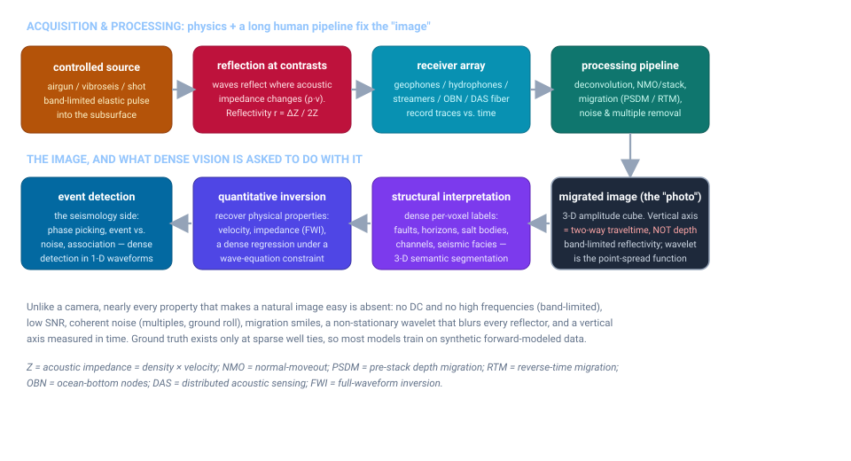
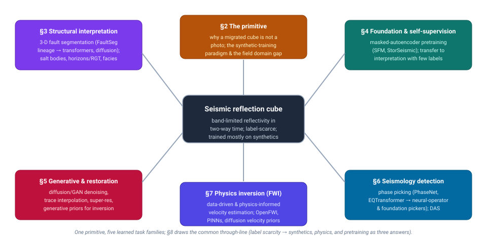
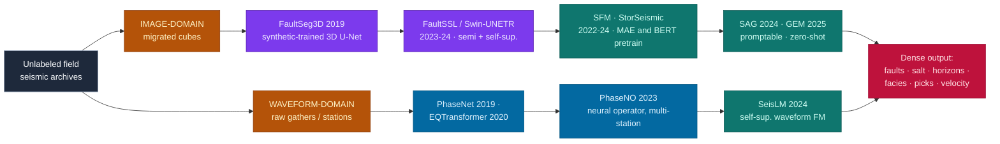

# Dense Object Detection & Classification — Recent Advances

*Compiled 2026-Aug-15 (America/Los_Angeles).*

Next installment in the running CV-updates log. Earlier entries on
`main`:
[Apr-30](../2026-Apr-30/2026-Apr-30_CV_updates.md),
[May-01](../2026-May-01/2026-May-01_CV_updates.md),
[May-02](../2026-May-02/2026-May-02_CV_updates.md),
[May-04](../2026-May-04/2026-May-04_CV_updates.md),
[May-05](../2026-May-05/2026-May-05_CV_updates.md),
[May-07](../2026-May-07/2026-May-07_CV_updates.md),
[May-08](../2026-May-08/2026-May-08_CV_updates.md),
[May-15](../2026-May-15/2026-May-15_CV_updates.md),
[May-16](../2026-May-16/2026-May-16_CV_updates.md),
[May-17](../2026-May-17/2026-May-17_CV_updates.md),
[Jun-09](../2026-Jun-09/2026-Jun-09_CV_updates.md),
[Jun-10](../2026-Jun-10/2026-Jun-10_CV_updates.md),
[Jun-12](../2026-Jun-12/2026-Jun-12_CV_updates.md),
[Jun-15](../2026-Jun-15/2026-Jun-15_CV_updates.md),
[Jun-16](../2026-Jun-16/2026-Jun-16_CV_updates.md),
[Jun-17](../2026-Jun-17/2026-Jun-17_CV_updates.md),
[Jun-19](../2026-Jun-19/2026-Jun-19_CV_updates.md),
[Jun-21](../2026-Jun-21/2026-Jun-21_CV_updates.md),
[Jun-22](../2026-Jun-22/2026-Jun-22_CV_updates.md),
[Jun-23](../2026-Jun-23/2026-Jun-23_CV_updates.md),
[Jun-24](../2026-Jun-24/2026-Jun-24_CV_updates.md),
[Jun-25](../2026-Jun-25/2026-Jun-25_CV_updates.md),
[Jun-27](../2026-Jun-27/2026-Jun-27_CV_updates.md),
[Jun-29](../2026-Jun-29/2026-Jun-29_CV_updates.md),
[Jun-30](../2026-Jun-30/2026-Jun-30_CV_updates.md),
[Jul-04](../2026-Jul-04/2026-Jul-04_CV_updates.md),
[Jul-07](../2026-Jul-07/2026-Jul-07_CV_updates.md),
[Jul-08](../2026-Jul-08/2026-Jul-08_CV_updates.md),
[Jul-10](../2026-Jul-10/2026-Jul-10_CV_updates.md),
[Jul-15](../2026-Jul-15/2026-Jul-15_CV_updates.md),
[Jul-17](../2026-Jul-17/2026-Jul-17_CV_updates.md),
[Jul-18](../2026-Jul-18/2026-Jul-18_CV_updates.md),
[Jul-21](../2026-Jul-21/2026-Jul-21_CV_updates.md),
[Jul-22](../2026-Jul-22/2026-Jul-22_CV_updates.md),
[Jul-24](../2026-Jul-24/2026-Jul-24_CV_updates.md),
[Jul-26](../2026-Jul-26/2026-Jul-26_CV_updates.md),
[Jul-27](../2026-Jul-27/2026-Jul-27_CV_updates.md),
[Jul-30](../2026-Jul-30/2026-Jul-30_CV_updates.md),
[Aug-01](../2026-Aug-01/2026-Aug-01_CV_updates.md),
[Aug-02](../2026-Aug-02/2026-Aug-02_CV_updates.md),
[Aug-04](../2026-Aug-04/2026-Aug-04_CV_updates.md),
[Aug-07](../2026-Aug-07/2026-Aug-07_CV_updates.md),
[Aug-10](../2026-Aug-10/2026-Aug-10_CV_updates.md),
[Aug-11](../2026-Aug-11/2026-Aug-11_CV_updates.md),
[Aug-13](../2026-Aug-13/2026-Aug-13_CV_updates.md).

## Table of contents

1. [Why this pass: seismic reflection imaging as its own primitive](#why)
2. [The primitive — a migrated cube is not a photograph](#primitive)
3. [Structural interpretation: faults, salt, horizons, facies](#structural)
4. [Foundation models & self-supervision](#foundation)
5. [Generative & restoration: denoising, interpolation, super-resolution](#generative)
6. [The seismology side: phase picking, detection, association, DAS](#seismology)
7. [Physics inversion: FWI, velocity, PINNs](#inversion)
8. [Through-line and open problems](#throughline)
9. [Sources](#sources)

---

## 1. Why this pass: seismic reflection imaging as its own primitive

This log has now worked through a long lineup of sensing modalities on their own
terms — optical and thermal cameras, LiDAR, automotive imaging radar, SAR, sonar,
ultrasound, X-ray/CT, MRI, PET, OCT, hyperspectral, and most recently the
subsurface / stand-off electromagnetic trio of ground-penetrating radar
([Aug-10](../2026-Aug-10/2026-Aug-10_CV_updates.md)), terahertz
([Aug-11](../2026-Aug-11/2026-Aug-11_CV_updates.md)) and photoacoustics
([Aug-13](../2026-Aug-13/2026-Aug-13_CV_updates.md)). **Seismic reflection imaging**
belongs in that lineup as a genuinely distinct primitive — and it is emphatically
*not* a rerun of GPR. GPR sends a stand-off electromagnetic pulse a few metres into
the shallow ground; seismic sends an **elastic (acoustic) wave kilometres down**,
reconstructs a 3-D volume from it, and then asks a network to label that volume
voxel-by-voxel. The physics, the depth scale, the processing chain, and the
downstream tasks are all different, and the field has its own decade-long deep-
learning literature that rarely touches mainstream CV venues.

Seismic earns a standalone entry because it inverts almost every assumption a
convolutional network was designed around:

- **The "image" is a band-limited reflectivity field, not a picture of objects.**
  A migrated seismic section shows where *acoustic impedance* (density × velocity)
  changes — reflectors, not surfaces. It has **no DC component and no high
  frequencies**: the earth acts as a low-pass filter and the source wavelet has a
  finite band (roughly 5–80 Hz), so every reflector is smeared by the wavelet,
  which behaves as a signed, oscillating point-spread function. There are no sharp
  edges to detect in the natural-image sense.

- **The vertical axis is time, not space.** For time-migrated data the depth axis
  is **two-way traveltime**, warped by the (unknown) velocity field. A "vertical"
  convolution therefore mixes samples that are not equidistant in the earth, and
  the same geological body looks different depending on what sits above it.

- **Coherent noise looks exactly like signal.** Multiples, ground roll,
  diffractions, and migration "smiles" are all wave-like, band-matched, and
  spatially organized — the opposite of the i.i.d. Gaussian noise most denoisers
  assume. Telling a real reflector from a migration artifact is itself a learned
  classification problem.

- **Ground truth barely exists.** The subsurface is opaque; the only hard labels
  come from the handful of wells that were drilled, plus expensive expert
  interpretation. This is the defining constraint of the field and the reason so
  much of its deep learning **trains on synthetic, forward-modeled data** and then
  fights a synthetic-to-field domain gap (§2, §8).

The dense-vision tasks fall into five families that this report treats together
because they share the primitive: **structural interpretation** (faults, horizons,
salt, facies — 3-D semantic segmentation; §3), **foundation-model pretraining** to
beat the label problem (§4), **generative restoration** (denoise / interpolate /
super-resolve; §5), the adjacent **seismology detection** problem on raw waveforms
(phase picking and event detection; §6), and **physics inversion** (recovering
velocity/impedance under a wave-equation constraint; §7). Figure 1 traces the signal
chain that produces the cube and the three things dense vision is then asked to do
with it.

<em>Figure 1 — The seismic reflection signal chain. A controlled elastic source, an
array of receivers, and a long human processing pipeline produce a migrated amplitude
cube whose vertical axis is two-way traveltime. Dense vision is then asked to
segment structure, invert for physical properties, or detect events — none of which
resembles putting boxes on a photograph.</em>

---

## 2. The primitive — a migrated cube is not a photograph

**Acquisition.** A seismic survey fires a repeatable, band-limited elastic source —
airguns towed behind a vessel offshore, vibroseis trucks or dynamite onshore — and
records the returning wavefield on a dense array of receivers: hydrophones on towed
streamers, geophones planted on land, nodes on the seabed (OBN), or, increasingly,
strain along a fiber-optic cable via **distributed acoustic sensing (DAS)**. Each
receiver records a *trace*: amplitude versus time. A modern 3-D survey stacks
millions of traces into a volume indexed by inline, crossline, and time.

**From field records to an image.** The raw records are not interpretable. A long
processing chain turns them into the migrated cube:
deconvolution to compress the wavelet, velocity analysis, **normal-moveout (NMO)
correction and stacking** to collapse many source–receiver offsets into a
zero-offset trace, multiple and ground-roll suppression, and finally **migration**
(pre-stack time or depth migration, or reverse-time migration, RTM) to move dipping
reflectors and diffractions back to their true positions. The output approximates
the earth's **reflectivity** convolved with a band-limited wavelet — a signed,
oscillating quantity, positive on a hard-over-soft interface and negative on the
reverse, with a polarity convention that is itself a source of ambiguity.

**Why standard CV struggles.** The consequences for a network trained on natural
images are severe and specific:

- *Band-limited, non-stationary wavelet.* Every reflector is a wavelet, not an edge;
  the wavelet stretches with depth as high frequencies are absorbed, so a feature's
  appearance is depth-dependent. Vertical resolution is set by the **tuning
  thickness** (~¼ wavelength) and lateral resolution by the **Fresnel zone**, both
  much coarser than a camera's pixel grid.
- *Anisotropic, non-Euclidean sampling.* Sample spacing is fine in time (milliseconds)
  and coarse and often unequal in the two spatial directions; the time axis is not a
  length. Isotropic 3-D convolutions are a physical mismatch.
- *Structured, signal-like noise.* Multiples, ground roll, acquisition footprint, and
  migration smiles are coherent and band-matched. "Denoising" here means separating
  two wavefields, not removing speckle.
- *Amplitude is physics.* Amplitude-versus-offset (AVO/AVA) trends carry the fluid and
  lithology information; a contrast-normalizing preprocessing step that a photo
  pipeline would apply blindly can destroy the very signal of interest.

**The synthetic-training paradigm.** Because dense labels are so scarce, the field's
signature move — most visible in fault detection (§3) — is to **train entirely on
synthetic data**: procedurally generate a geological model with known faults,
horizons, and velocities; forward-model a realistic seismic response; and train the
network on perfectly-labeled synthetics before applying it to field data. This
sidesteps the labeling bottleneck but creates the central tension of the whole field
— the **synthetic-to-field domain gap** — which recurs in every section below and is
the subject of the through-line in §8.

**Public datasets and benchmarks.** A small set of open surveys and benchmarks
anchors the literature: the Netherlands **F3 block** and New Zealand **Parihaka** and
**Kerry-3D** volumes (facies and horizon interpretation), the **SEAM** and SEG/EAGE
synthetic models, the **Thebe** and FaultSeg synthetic fault datasets, **OpenFWI**
for learned full-waveform inversion, the **STEAD** waveform archive for earthquake
detection, and the **TGS Salt** Kaggle challenge for salt-body segmentation. Their
scarcity relative to ImageNet-scale corpora is itself a defining feature of the
primitive.

**Why it matters now.** The economic center of gravity is shifting from hydrocarbon
exploration toward the **energy transition**: time-lapse ("4-D") seismic monitoring
of **CO₂ storage (CCS)** reservoirs, **geothermal** and **critical-mineral**
exploration, induced-seismicity **hazard** monitoring, and subsurface **hydrogen**
storage all lean on exactly the dense detection, segmentation, and inversion tasks
below — often with tighter accuracy, uncertainty, and monitoring-cadence
requirements than exploration ever imposed.

Figure 2 maps the five task families onto the shared primitive.

<em>Figure 2 — Topic map. One label-scarce, band-limited primitive feeds five families
of learned tasks. The through-line (§8): synthetics, physics constraints, and
self-supervised pretraining are three different answers to the same missing-labels
problem.</em>

---

## 3. Structural interpretation: faults, salt, horizons, facies

This is the closest analogue to mainstream dense vision — 3-D **semantic segmentation** of a
volume — and it is where the field's signature idea, *training on synthetics*, was proven.

**Faults: the FaultSeg3D lineage.** The reference result is **FaultSeg3D**
(Wu, Liang, Shi & Fomel, *Geophysics* 2019): procedurally generate ~200 synthetic 3-D
seismic/fault-label pairs with random folding, faulting, and noise, train an end-to-end 3-D
U-Net on them alone, and generalize to multiple field surveys — turning a labeling problem
into a *simulation* problem. Its companion **FaultNet3D** (Wu, Shi, Fomel et al., *IEEE TGRS*
2019) made the task multi-task, predicting fault probability **plus strike and dip** from one
image, which is still the template for orientation-aware fault nets. The last three years have
pushed on the two weaknesses of pure-synthetic training — the synthetic-to-field gap and the
cost of any field labels at all:

- **Label-frugal supervision.** Dou et al. (arXiv:2105.03857, 2021) train a full 3-D fault
  segmenter from *a few 2-D annotated slices* using an attention mechanism and a tailored loss.
  **FaultSSL** (Dou, Li et al., arXiv:2309.02930 → *Geophysics* 2024) is a mean-teacher
  **semi-supervised** framework that combines synthetics and a few 2-D labels with two
  unsupervised consistency proxy tasks ("panning" and "patching"), so large *unlabeled field*
  volumes contribute to training.
- **Transformer backbones + self-supervised pretraining.** **FaultSeg Swin-UNETR**
  (Zhang, Chen et al., arXiv:2310.17974, 2023) swaps in a Swin-Transformer/Swin-UNETR backbone
  with SimMIM masked-image pretraining on unlabeled field data and an edge-inspired multi-scale
  decoder, reporting state-of-the-art OIS/ODS on the **Thebe** benchmark. **ResACEUnet**
  (Zu et al., *JGR: Machine Learning & Computation* 2024, DOI 10.1029/2024JH000232) is a
  residual/attention Transformer-U-Net in the same vein. Contrastive-plus-reconstruction
  pretext tasks (*Expert Systems with Applications* 2024) and global-local pretrain/fine-tune
  frameworks continue this label-efficiency push, and **active-learning** work is now targeting
  the peculiar, thin, elongated geometry of faults to spend annotation budget where uncertainty
  is highest.

The one visibly *thin* niche: dedicated **diffusion-model fault segmentation** has not really
materialized — diffusion has gone almost entirely into denoising, interpolation, and velocity
synthesis (§5) rather than structural labeling.

**Salt bodies.** Salt is the other canonical segmentation target — it is acoustically fast,
mobile, and casts imaging shadows, so delineating it drives depth-migration velocity models.
Two lineages met here: the geophysics-native **SaltSeg** (Shi, Wu & Fomel, *Interpretation*
2019), a 3-D encoder-decoder trained with labels thresholded from velocity models, and the
mainstream-CV influx from the **TGS Salt Identification Challenge** (Kaggle 2018). The
Kaggle-winning ensemble (Babakhin, Sanakoyeu & Kitamura, *GCPR* 2019) is a compact catalogue of
what segmentation tricks transfer to seismic — a ResNeXt-U-Net with spatial-channel
squeeze-excitation, the Lovász-hinge loss, CoordConv, hypercolumns, and pseudo-label
self-training. Follow-ons (e.g. Milosavljević, *ISPRS IJGI* 2020; sparse-label 3-D salt nets;
EfficientNet transfer-learning ensembles, 2025) mostly refine backbones and label efficiency.

**Horizons and relative geologic time (RGT).** Rather than track reflectors one at a time,
the modern framing regresses a **relative-geologic-time volume** whose iso-surfaces *are* the
horizons. **DL-RGT** (Geng, Wu, Shi & Fomel, *Geophysics* 2020) learns a globally consistent
RGT volume that respects faults and unconformities as discontinuities; **Deep-RGT**
(Bi, Wu, Geng & Li, *JGR: Solid Earth* 2021) extends it to interpret 3-D horizons **and** faults
simultaneously; and a multi-task Transformer with prior constraints (Yang, Wu, Bi & Geng,
*IEEE TGRS* 2023) shares features across an RGT branch and a fault branch. State-space (Mamba)
backbones are now appearing for horizon interpretation, mirroring the SSM trend seen elsewhere
in this log.

**Seismic facies.** The dense per-voxel *classification* task — labeling stratigraphic/
depositional units — is anchored by the open **Netherlands-F3 six-facies benchmark**
(Alaudah, Michałowicz, Alfarraj & AlRegib, *Interpretation* 2019; arXiv:1901.07659) with fixed
splits and reference code, and by the **Parihaka** SEAM/AIcrowd Seismic Facies Identification
Challenge. Recent work is squarely about label efficiency and cross-survey generalization:
volumetric supervised-contrastive pretraining (arXiv:2206.08158), self-supervised pretraining
reaching supervised accuracy at ~5–10% of labels (*Geophysics* 2024), and **AdaSemSeg**
(arXiv:2501.16760, 2025), an adaptive **few-shot** segmenter that generalizes across F3,
Parihaka, and Penobscot from a handful of support slices. Systematic multi-model, multi-survey
evaluations (*Earth Science Informatics* 2025) are starting to standardize how these are
compared.

---

## 4. Foundation models & self-supervision

If the field's problem is missing labels, the 2023–2026 answer that most resembles the rest of
this log is **pretrain once, adapt everywhere**. Two families have emerged, split by what they
ingest — the *image-domain* cube versus the *raw-waveform* trace (the latter covered in §6).

- **SFM — Seismic Foundation Model** (Sheng et al., arXiv:2309.02791, 2023; *Geophysics* 2024,
  DOI 10.1190/geo2024-0262.1) is the image-domain anchor: a **masked-autoencoder ViT**
  pretrained on ~2.3 million 2-D seismic patches drawn from 192 field volumes, whose frozen or
  fine-tuned features transfer to facies classification, denoising, interpolation, and inversion.
- **StorSeismic** (Harsuko & Alkhalifah, *IEEE TGRS* 2022, DOI 10.1109/TGRS.2022.3216660) took
  the **BERT** route earlier, self-supervising over sequences of traces in a shot gather so that
  attention captures wave-move-out geometry, then fine-tuning for denoising, velocity estimation,
  first-arrival picking, and NMO.
- **Promptable / universal interpretation.** **SAG** ("Segment Any Geobodies";
  Gao, Wu, Liang, Sheng et al., arXiv:2409.04962, 2024) couples a pretrained vision foundation
  model to a **multi-modal prompt engine**, delivering promptable geobody segmentation that
  generalizes across surveys and scales 2-D→3-D by recursively feeding predictions back as
  prompts. **GEM — Geological Everything Model 3D** (Dou, Wu, Bangs et al., arXiv:2507.00419,
  2025) is the most ambitious: one promptable architecture, self-supervised on **500+ field
  seismic volumes** then adversarially fine-tuned, that takes well logs, masks, or structural
  sketches as prompts and returns **zero-shot** faults, horizons, RGT, channels, salt, and
  property models — even transferring to Martian radar stratigraphy. It is the SAM-moment analogue
  for the subsurface.
- **Consolidation.** Reviews and roadmaps are already appearing — an extensive review of
  transferring natural-image foundation models to seismic *processing* (demultiple, interpolation,
  denoising) (Fuchs, Fernandez, Ettrich & Keuper, arXiv:2503.24166, 2025), community
  foundation-model checkpoints (e.g. the *thinkonward* geophysical foundation model on Hugging
  Face), and position papers on the workflow, opportunities, and challenges of geoscience
  foundation models.

The through-line: these models convert the field's *one* abundant resource — enormous archives
of **unlabeled** field seismic — into the pretraining signal that supervised interpretation never
had. Figure 3 traces the two lineages — the image-domain cube and the raw-waveform trace — from
their task-specific roots to today's promptable and foundation models.

<em>Figure 3 — Two foundation-model lineages from the same unlabeled-archive root: the
image-domain track (FaultSeg3D → semi/self-supervised → SFM/StorSeismic → promptable SAG/GEM) and
the waveform-domain track (PhaseNet/EQTransformer → PhaseNO → SeisLM). They have not yet merged
into one multimodal model — the obvious next target (§8).</em>

---

## 5. Generative & restoration: denoising, interpolation, super-resolution

Before a cube can be interpreted it must be *processed*, and this is where generative models and
self-supervision have landed hardest — precisely because clean ground truth is unavailable, so
supervised denoising is a non-starter and self-supervision is a necessity, not a preference.

**Self-supervised denoising without clean data.** The dominant idea is to train a network to
map noise to noise, or to hide the pixel it must predict, so no clean target is needed. **Blind-spot**
networks with transfer learning (Birnie & Alkhalifah, *Frontiers in Earth Science* 2022,
DOI 10.3389/feart.2022.1053279) attenuate random noise; **recorrupted-to-recorrupted /
Noise2Noise** schemes (Li, Trad & Liu, *Geophysics* 2024, DOI 10.1190/geo2023-0762.1) generate
two independent noisy versions of a single record and train between them. The harder problem —
**coherent** noise that is itself signal-like — is attacked with structured masking that forbids
the network from learning the noise: **blind-trace** masking for trace-wise coherent noise
(Liu, Birnie & Alkhalifah, 2023) and directional **"blind-fan"** masking for **ground roll**
(Liu et al., *Geophysical Prospecting* 2024, DOI 10.1111/1365-2478.13522). The same self-supervised
philosophy has moved to **DAS**, whose two co-located fiber channels give a natural
Noise2Noise pair (**DAS-N2N**, *Geophysical Journal International* 2023/2024), now with diffusion
variants.

**Diffusion and GANs for reconstruction.** Trace **interpolation** — filling missing or aliased
traces — is recast as progressive denoising by a diffusion probabilistic model (Liu & Ma,
*Geophysics* 2024, DOI 10.1190/geo2023-0182.1), which handles large gaps better than direct
regression; latent-diffusion and sparse-attention-transformer + diffusion variants have followed
in 2025. GAN/MAE hybrids do joint **super-resolution and denoising** of post-stack profiles
(MAE-GAN, arXiv:2405.19767, 2024), and GAN-supervised training improves reconstruction
generalization to unseen sampling patterns.

**Generative priors for inversion.** The most consequential move is using a diffusion model as a
learned *prior* on plausible earth models. **Controllable velocity synthesis** (Wang et al.,
*JGR: Machine Learning & Computation* 2024, DOI 10.1029/2024JH000153) generates geologically
realistic velocity models for augmentation, and **prior-regularized FWI** (Wang, Huang &
Alkhalifah, arXiv:2306.12776, 2023) embeds such a diffusion prior *inside* the full-waveform-
inversion loop to constrain solutions to a realistic-model manifold and fight cycle-skipping —
the bridge into §7.

---

## 6. The seismology side: phase picking, detection, association, DAS

Reflection imaging's sibling is **passive seismology**: instead of a migrated cube, the data are
continuous multi-station waveforms, and the dense task is **1-D temporal detection** — mark where
each P- and S-wave arrives, decide whether a window contains an event, and associate picks across
stations into earthquakes. It is included here because it is the same primitive rotated 90°
(dense labeling of a band-limited, low-SNR, physics-generated signal) and because its
foundation-model curve now runs *ahead* of the image-domain one.

- **The segmentation-style pickers.** **PhaseNet** (Zhu & Beroza, *GJI* 2019) reframed picking as
  U-Net image segmentation, mapping 3-component waveforms to per-sample P/S/noise probability
  masks; **EQTransformer** (Mousavi et al., *Nature Communications* 2020) added attention and a
  single-encoder/three-decoder design for simultaneous detection and P/S picking. These remain the
  field's baselines and ship inside **SeisBench** (Woollam et al., *SRL* 2022), the common API and
  benchmark layer.
- **Association as learning.** **PhaseLink** (Ross et al., *JGR* 2019) used an LSTM to link picks;
  **GaMMA** (Zhu et al., *JGR* 2022) treats association as unsupervised Bayesian
  Gaussian-mixture clustering that jointly estimates location, time, and magnitude with no
  supervised training.
- **Neural operators and foundation models.** **PhaseNO** (Sun et al., *GRL* 2023;
  arXiv:2305.03269) stacks Fourier- and graph-neural-operator layers into a *network-wide*
  multi-station picker that accepts arbitrary array geometry. **SeisLM** (Liu et al.,
  arXiv:2410.15765, 2024) is the waveform-domain foundation model — a Wav2Vec2/BERT-style
  encoder self-supervised by contrastive loss on large unlabeled archives, then fine-tuned for
  detection, picking, onset regression, and foreshock-aftershock classification — the raw-waveform
  counterpart to SFM.
- **DAS.** **PhaseNet-DAS** (Zhu et al., *Nature Communications* 2023) transfers picking to 2-D
  spatio-temporal DAS gathers via a teacher-PhaseNet-plus-GaMMA weak-labeling scheme; recurrent
  and transfer-learning models now push toward real-time volcano-tectonic and microseismic
  monitoring.
- **Event *classification*/discrimination** rounds out the dense-labeling story: earthquake vs.
  explosion vs. collapse ternary classifiers (e.g. on the DiTing 2.0 archive), first-motion
  **polarity** networks that feed focal-mechanism inversion, and cross-volcano spectrogram CNNs
  (VOISS-Net) that classify tremor, long-period events, and explosions.

---

## 7. Physics inversion: FWI, velocity, PINNs

The deepest departure from natural-image CV is that here the **forward operator is known** — the
wave equation — so learning can be fused with physics. The dense task is **regression**: recover a
continuous velocity or impedance field from waveforms.

- **Data-driven FWI.** **InversionNet** (Wu & Lin, *IEEE TCI* 2020) maps raw shot gathers
  directly to a velocity model with a fully-convolutional encoder-decoder; **VelocityGAN**
  (Zhang & Lin, 2020) adds an adversarial discriminator for sharper models. The community
  standard is **OpenFWI** (Deng et al., *NeurIPS 2022 Datasets & Benchmarks*, arXiv:2111.02926),
  a ~2.1 TB suite of 12 synthetic multi-structural benchmarks (including a CO₂-reservoir family
  and a 3-D set) with these baselines built in.
- **Operator learning.** Because a single trained operator can replace an expensive PDE solve,
  **Fourier-DeepONet** (Zhu, Feng, Lin & Lu, *CMAME* 2023) and neural-operator forward/inverse
  surrogates give fast, source-robust, differentiable inversion — the operator-learning wave that
  also produced PhaseNO in §6.
- **Generative priors and uncertainty.** Diffusion priors (§5) are increasingly the regularizer
  of choice inside FWI (prior-regularized FWI, arXiv:2306.12776; conditional velocity synthesis,
  DOI 10.1029/2024JH000153), addressing FWI's classic ill-posedness and cycle-skipping while
  offering a route to posterior *uncertainty*.
- **Physics-informed neural networks.** Where data are absent entirely, PINNs solve the governing
  equations directly: **PINNeik** (bin Waheed et al., *Computers & Geosciences* 2021) solves the
  factored eikonal equation for mesh-free traveltimes; PINN formulations of the acoustic wave
  equation do forward modeling and FWI with automatic absorbing boundaries (Rasht-Behesht et al.,
  *JGR: Solid Earth* 2022); Fourier-feature and frequency-domain (Helmholtz) wavefield PINNs
  overcome spectral bias, and multi-phase extensions (PINNPStomo) handle joint P/S tomography.

---

## 8. Through-line and open problems

Strip away the sub-fields and one constraint organizes the entire literature: **there are almost
no dense labels**, because the subsurface is opaque and truth exists only at a few boreholes. Every
family above is a different answer to that one problem:

1. **Manufacture the labels from physics.** Forward-model synthetic volumes with known faults,
   horizons, and velocities (FaultSeg3D, OpenFWI). Answer's cost: the **synthetic-to-field domain
   gap**, now the field's most-studied failure mode.
2. **Constrain with the known forward operator.** Fold the wave equation into training (FWI
   surrogates, PINNs, differentiable modeling) so the network cannot stray from physics.
3. **Pretrain on the one thing that is abundant — unlabeled field data.** Masked-autoencoder and
   BERT-style foundation models (SFM, StorSeismic, SeisLM) and promptable universal models
   (SAG, GEM) turn archives into representations.

The 2025–2026 frontier is where these three converge: **diffusion priors** that are simultaneously
generative augmentation, learned regularizers, and uncertainty engines (§5, §7); and **promptable
foundation models** (GEM) that fold structural interpretation, geobody segmentation, and property
modeling into a single zero-shot interface. The image-domain and waveform-domain foundation-model
tracks (SFM vs. SeisLM) are still separate; a genuinely multimodal seismic model spanning raw
gathers, migrated cubes, well logs, and text is the obvious next target.

**Open problems that keep this from being "solved segmentation":**

- **Domain gap and generalization.** Cross-survey, cross-vintage, and synthetic-to-field shift is
  still the dominant deployment risk; dedicated generalization benchmarks are only now appearing.
- **Anisotropic, time-axis geometry.** Isotropic 3-D convolutions remain a physical mismatch to a
  cube whose vertical axis is two-way time and whose crossline sampling differs from inline.
- **Calibrated uncertainty.** Monitoring roles (CCS, induced seismicity) need trustworthy
  confidence, not just a mask — where the diffusion-posterior and Bayesian directions matter most.
- **Evaluation.** Facies and fault benchmarks are small and few; label noise from expert
  disagreement caps measurable accuracy.
- **The energy-transition mandate.** The economically ascendant task is **4-D change detection** —
  time-lapse monitoring of CO₂ plumes (Sleipner-style), geothermal, and hydrogen storage — which
  demands repeated, automated, quantitative interpretation at a cadence humans cannot sustain,
  raising the bar on exactly the robustness and uncertainty problems above.

The one-line summary for this log: seismic is the modality where **the training set is
forward-modeled from physics and the labels live down a borehole**, and its deep-learning story is
the search for primitives that survive the trip from synthetic cube to field earth.

---

## 9. Sources

Grouped by section. Links are to the most authoritative landing page found (DOI, publisher, or
arXiv abstract). A few very recent (2025–2026) items are cited by title/venue where an exact
identifier could not be independently confirmed at compile time; these are marked *(preprint;
verify ID)*.

**Framing, datasets & benchmarks (§1–2)**
- Wu, Liang, Shi & Fomel, *FaultSeg3D*, **Geophysics** 84(3), 2019 — https://library.seg.org/doi/10.1190/geo2018-0646.1
- Alaudah, Michałowicz, Alfarraj & AlRegib, *A ML benchmark for facies classification*, **Interpretation** 7(3), 2019 — https://library.seg.org/doi/10.1190/int-2018-0249.1 · arXiv:1901.07659 — https://arxiv.org/abs/1901.07659
- An et al., *A gigabyte interpreted seismic dataset for automatic fault recognition* (**Thebe**), **Data in Brief**, 2021 — https://www.sciencedirect.com/science/article/pii/S2352340921005035
- Deng et al., *OpenFWI*, **NeurIPS Datasets & Benchmarks** 2022 — https://arxiv.org/abs/2111.02926 · project: https://openfwi-lanl.github.io/
- SEAM Open Data (SEG) — https://seg.org/SEAM/open-data/ · Kerry-3D (SEG Wiki) — https://wiki.seg.org/wiki/Kerry-3D · TGS Salt Identification Challenge (Kaggle 2018) — https://www.kaggle.com/competitions/tgs-salt-identification-challenge
- Parihaka Seismic Facies Identification Challenge (SEAM/AIcrowd) — https://www.aicrowd.com/challenges/seismic-facies-identification-challenge
- Chadwick et al., *Time-lapse seismic monitoring at the Sleipner CO₂ storage operation*, **The Leading Edge**, 2010 — https://library.seg.org/doi/abs/10.1190/1.3304820
- Review: *Current state and future directions for DL-based automatic seismic fault interpretation*, **Earth-Science Reviews**, 2023 — https://www.sciencedirect.com/science/article/pii/S0012825223001988

**Structural interpretation (§3)**
- Wu, Shi, Fomel, Liang et al., *FaultNet3D* (fault + strike + dip), **IEEE TGRS** 57(11), 2019 — https://ieeexplore.ieee.org/document/8721952
- Dou et al., *Attention-based 3D fault segmentation from few 2D slice labels*, arXiv:2105.03857, 2021 — https://arxiv.org/abs/2105.03857
- Dou, Li et al., *FaultSSL* (semi-supervised), arXiv:2309.02930, 2023 → **Geophysics** 2024 — https://arxiv.org/abs/2309.02930
- Zhang, Chen et al., *FaultSeg Swin-UNETR* (SimMIM pretraining), arXiv:2310.17974, 2023 — https://arxiv.org/abs/2310.17974
- Zu et al., *ResACEUnet*, **JGR: Machine Learning & Computation**, 2024 — https://agupubs.onlinelibrary.wiley.com/doi/full/10.1029/2024JH000232
- Shi, Wu & Fomel, *SaltSeg*, **Interpretation** 7(3), 2019 — https://library.seg.org/doi/10.1190/int-2018-0235.1
- Babakhin, Sanakoyeu & Kitamura, *Semi-supervised salt segmentation ensemble* (TGS winner), **GCPR** 2019 — https://link.springer.com/chapter/10.1007/978-3-030-33676-9_15
- Milosavljević, *Salt-deposit identification via semantic segmentation*, **ISPRS IJGI** 9(1):24, 2020 — https://www.mdpi.com/2220-9964/9/1/24
- Geng, Wu, Shi & Fomel, *DL for relative geologic time and horizons*, **Geophysics** 85(4), 2020 — https://library.seg.org/doi/10.1190/geo2019-0252.1
- Bi, Wu, Geng & Li, *Deep relative geologic time*, **JGR: Solid Earth** 126, 2021 — https://agupubs.onlinelibrary.wiley.com/doi/full/10.1029/2021JB021882
- Yang, Wu, Bi & Geng, *Multi-task RGT/horizons/faults with a Transformer*, **IEEE TGRS** 61, 2023 — https://ieeexplore.ieee.org/document/10098896
- *Volumetric supervised contrastive learning for seismic segmentation*, arXiv:2206.08158, 2022 — https://arxiv.org/abs/2206.08158
- *AdaSemSeg: adaptive few-shot seismic facies segmentation*, arXiv:2501.16760, 2025 — https://arxiv.org/abs/2501.16760

**Foundation models & self-supervision (§4)**
- Sheng et al., *Seismic Foundation Model (SFM)*, arXiv:2309.02791, 2023 → **Geophysics** 2024 (DOI 10.1190/geo2024-0262.1) — https://arxiv.org/abs/2309.02791 · https://library.seg.org/doi/10.1190/geo2024-0262.1 · code: https://github.com/shenghanlin/SeismicFoundationModel
- Harsuko & Alkhalifah, *StorSeismic*, **IEEE TGRS** 60, 2022 (DOI 10.1109/TGRS.2022.3216660) — https://doi.org/10.1109/TGRS.2022.3216660
- Gao, Wu, Liang, Sheng et al., *SAG — foundation model with a multi-modal prompt engine for universal geobody interpretation*, arXiv:2409.04962, 2024 — https://arxiv.org/abs/2409.04962
- Dou, Wu, Bangs et al., *Geological Everything Model 3D (GEM)*, arXiv:2507.00419, 2025 — https://arxiv.org/abs/2507.00419 · project: https://douyimin.github.io/GEM/
- Fuchs, Fernandez, Ettrich & Keuper, *Foundation Models for Seismic Data Processing: A Review*, arXiv:2503.24166, 2025 — https://arxiv.org/abs/2503.24166
- *thinkonward* geophysical foundation model (Hugging Face) — https://huggingface.co/thinkonward/geophysical-foundation-model

**Generative & restoration (§5)**
- Birnie & Alkhalifah, *Transfer learning for self-supervised blind-spot denoising*, **Frontiers in Earth Science**, 2022 — https://www.frontiersin.org/articles/10.3389/feart.2022.1053279/full
- Li, Trad & Liu, *Robust seismic denoising via self-supervised (recorrupted-to-recorrupted) learning*, **Geophysics** 89(5), 2024 — https://doi.org/10.1190/geo2023-0762.1
- Liu et al., *Self-supervised ground-roll suppression (blind-fan masking)*, **Geophysical Prospecting**, 2024 — https://onlinelibrary.wiley.com/doi/abs/10.1111/1365-2478.13522
- *DAS-N2N: DAS denoising without clean data*, **Geophysical Journal International** 236, 2023/2024 — https://academic.oup.com/gji/article/236/2/1026/7453669
- Liu & Ma, *Generative interpolation via a diffusion probabilistic model*, **Geophysics** 89(1), 2024 — https://doi.org/10.1190/geo2023-0182.1
- Wang et al., *Controllable seismic velocity synthesis using generative diffusion models*, **JGR: ML & Computation**, 2024 — https://doi.org/10.1029/2024JH000153
- Wang, Huang & Alkhalifah, *Prior-regularized FWI using generative diffusion models*, arXiv:2306.12776, 2023 — https://arxiv.org/abs/2306.12776
- *MAE-GAN: joint super-resolution and denoising of post-stack seismic*, arXiv:2405.19767, 2024 — https://arxiv.org/abs/2405.19767

**Seismology detection (§6)**
- Zhu & Beroza, *PhaseNet*, **Geophysical Journal International** 216(1), 2019 — https://doi.org/10.1093/gji/ggy423 · arXiv:1803.03211 — https://arxiv.org/abs/1803.03211
- Mousavi et al., *EQTransformer*, **Nature Communications** 11:3952, 2020 — https://doi.org/10.1038/s41467-020-17591-w
- Ross et al., *PhaseLink*, **JGR: Solid Earth** 124(1), 2019 — https://doi.org/10.1029/2018JB016674
- Zhu et al., *GaMMA (GMM phase association)*, **JGR: Solid Earth** 127(5), 2022 — https://doi.org/10.1029/2021JB023249
- Sun et al., *PhaseNO (Phase Neural Operator)*, **Geophysical Research Letters** 50(24), 2023 — https://doi.org/10.1029/2023GL106434 · arXiv:2305.03269 — https://arxiv.org/abs/2305.03269
- Liu et al., *SeisLM: a Foundation Model for Seismic Waveforms*, arXiv:2410.15765, 2024 — https://arxiv.org/abs/2410.15765 · code: https://github.com/liutianlin0121/seisLM
- Woollam et al., *SeisBench*, **Seismological Research Letters** 93(3), 2022 — https://doi.org/10.1785/0220210324 · arXiv:2111.00786 — https://arxiv.org/abs/2111.00786
- Zhu et al., *PhaseNet-DAS*, **Nature Communications** 14:8192, 2023 — https://doi.org/10.1038/s41467-023-43355-3 · arXiv:2302.08747 — https://arxiv.org/abs/2302.08747

**Physics inversion (§7)**
- Wu & Lin, *InversionNet*, **IEEE Transactions on Computational Imaging** 6, 2020 — https://doi.org/10.1109/TCI.2019.2956866
- Deng et al., *OpenFWI*, arXiv:2111.02926, 2022 — https://arxiv.org/abs/2111.02926
- Zhu, Feng, Lin & Lu, *Fourier-DeepONet for FWI*, **CMAME** 416, 2023 *(verify volume/DOI)* — https://doi.org/10.1016/j.cma.2023.116300
- bin Waheed, Haghighat, Alkhalifah, Song & Hao, *PINNeik*, **Computers & Geosciences** 155, 2021 — https://doi.org/10.1016/j.cageo.2021.104833 · arXiv:2007.08330 — https://arxiv.org/abs/2007.08330
- Rasht-Behesht et al., *PINNs for wave propagation and FWI*, **JGR: Solid Earth** 127(5), 2022 — https://doi.org/10.1029/2021JB023120

---

*Compiled automatically as part of the running CV-updates log. Method: five parallel literature
sweeps (structural interpretation; foundation models & self-supervision; generative/restoration;
seismology detection; physics inversion) plus a physics/framing pass, cross-checked against
publisher and arXiv landing pages. Where a 2025–2026 identifier could not be independently
confirmed, the item is cited by title and venue and flagged. Diagrams are original, theme-aware
SVGs (no external assets). Corrections welcome in follow-up entries.*
