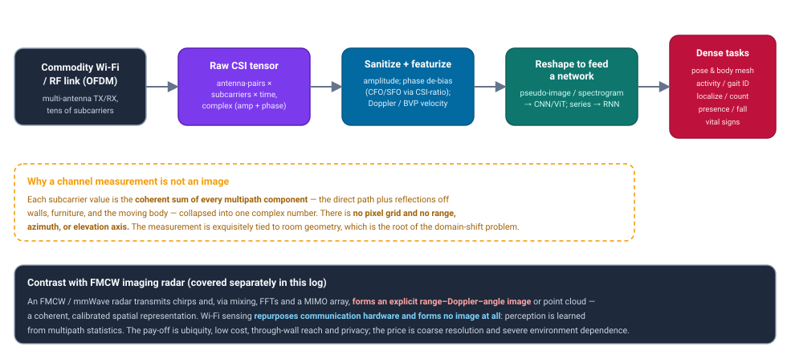
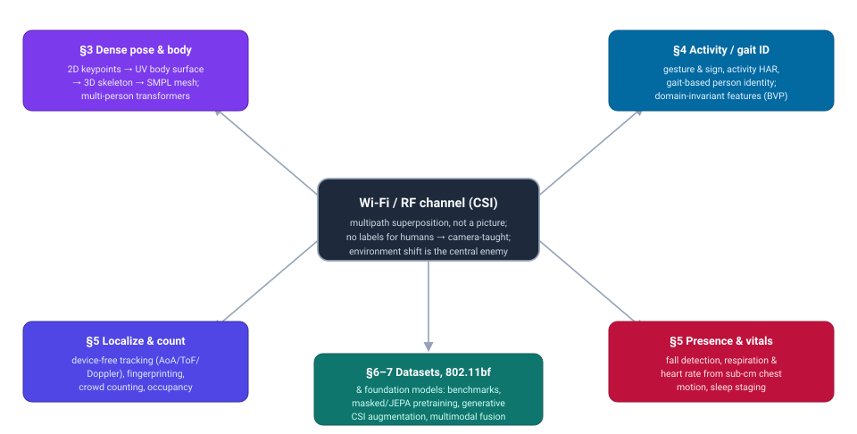
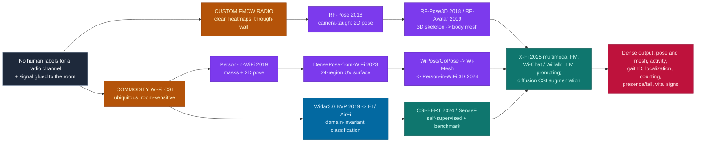

# Dense Object Detection & Classification — Recent Advances

*Compiled 2026-Aug-16 (America/Los_Angeles).*

Next installment in the running CV-updates log. Earlier entries on
`main`:
[Apr-30](../2026-Apr-30/2026-Apr-30_CV_updates.md),
[May-01](../2026-May-01/2026-May-01_CV_updates.md),
[May-02](../2026-May-02/2026-May-02_CV_updates.md),
[May-04](../2026-May-04/2026-May-04_CV_updates.md),
[May-05](../2026-May-05/2026-May-05_CV_updates.md),
[May-07](../2026-May-07/2026-May-07_CV_updates.md),
[May-08](../2026-May-08/2026-May-08_CV_updates.md),
[May-15](../2026-May-15/2026-May-15_CV_updates.md),
[May-16](../2026-May-16/2026-May-16_CV_updates.md),
[May-17](../2026-May-17/2026-May-17_CV_updates.md),
[Jun-09](../2026-Jun-09/2026-Jun-09_CV_updates.md),
[Jun-10](../2026-Jun-10/2026-Jun-10_CV_updates.md),
[Jun-12](../2026-Jun-12/2026-Jun-12_CV_updates.md),
[Jun-15](../2026-Jun-15/2026-Jun-15_CV_updates.md),
[Jun-16](../2026-Jun-16/2026-Jun-16_CV_updates.md),
[Jun-17](../2026-Jun-17/2026-Jun-17_CV_updates.md),
[Jun-19](../2026-Jun-19/2026-Jun-19_CV_updates.md),
[Jun-21](../2026-Jun-21/2026-Jun-21_CV_updates.md),
[Jun-22](../2026-Jun-22/2026-Jun-22_CV_updates.md),
[Jun-23](../2026-Jun-23/2026-Jun-23_CV_updates.md),
[Jun-24](../2026-Jun-24/2026-Jun-24_CV_updates.md),
[Jun-25](../2026-Jun-25/2026-Jun-25_CV_updates.md),
[Jun-27](../2026-Jun-27/2026-Jun-27_CV_updates.md),
[Jun-29](../2026-Jun-29/2026-Jun-29_CV_updates.md),
[Jun-30](../2026-Jun-30/2026-Jun-30_CV_updates.md),
[Jul-04](../2026-Jul-04/2026-Jul-04_CV_updates.md),
[Jul-07](../2026-Jul-07/2026-Jul-07_CV_updates.md),
[Jul-08](../2026-Jul-08/2026-Jul-08_CV_updates.md),
[Jul-10](../2026-Jul-10/2026-Jul-10_CV_updates.md),
[Jul-15](../2026-Jul-15/2026-Jul-15_CV_updates.md),
[Jul-17](../2026-Jul-17/2026-Jul-17_CV_updates.md),
[Jul-18](../2026-Jul-18/2026-Jul-18_CV_updates.md),
[Jul-21](../2026-Jul-21/2026-Jul-21_CV_updates.md),
[Jul-22](../2026-Jul-22/2026-Jul-22_CV_updates.md),
[Jul-24](../2026-Jul-24/2026-Jul-24_CV_updates.md),
[Jul-26](../2026-Jul-26/2026-Jul-26_CV_updates.md),
[Jul-27](../2026-Jul-27/2026-Jul-27_CV_updates.md),
[Jul-30](../2026-Jul-30/2026-Jul-30_CV_updates.md),
[Aug-01](../2026-Aug-01/2026-Aug-01_CV_updates.md),
[Aug-02](../2026-Aug-02/2026-Aug-02_CV_updates.md),
[Aug-04](../2026-Aug-04/2026-Aug-04_CV_updates.md),
[Aug-07](../2026-Aug-07/2026-Aug-07_CV_updates.md),
[Aug-10](../2026-Aug-10/2026-Aug-10_CV_updates.md),
[Aug-11](../2026-Aug-11/2026-Aug-11_CV_updates.md),
[Aug-13](../2026-Aug-13/2026-Aug-13_CV_updates.md),
[Aug-15](../2026-Aug-15/2026-Aug-15_CV_updates.md).

## Table of contents

1. [Why this pass: Wi-Fi / commodity-RF human sensing as its own primitive](#why)
2. [The primitive — a channel measurement is not an image](#primitive)
3. [Dense human pose & body reconstruction](#pose)
4. [Classification: activity, gesture, gait & identity](#classification)
5. [Localization, counting, presence/fall & vital signs](#localization)
6. [Datasets, toolkits & the 802.11bf turning point](#datasets)
7. [The through-line: cross-modal supervision, foundation models & generative augmentation](#foundation)
8. [Open problems](#throughline)
9. [Sources](#sources)

---

## 1. Why this pass: Wi-Fi / commodity-RF human sensing as its own primitive

This log has now worked through a long lineup of sensing modalities on their own terms —
optical and thermal cameras, LiDAR, automotive imaging radar, SAR, sonar, ultrasound,
X-ray/CT, MRI, PET, OCT, hyperspectral, event cameras, and the subsurface / stand-off
electromagnetic set (GPR, terahertz, photoacoustics, seismic). Every one of those produces,
in the end, *an image or a volume* — a grid of samples with a spatial geometry a convolution
can crawl over. **Wi-Fi / commodity-RF human sensing is the odd one out: it does dense human
perception with no image at all.** It reads the *channel* — how a radio signal was distorted
on its way from a transmitter to a receiver — and asks a network to recover where the people
are, how their bodies are posed, what they are doing, and even how they are breathing. It
earns a standalone entry precisely because it inverts the one assumption every previous entry
shared: that dense vision starts from a picture.

It is emphatically **not** a rerun of the automotive-imaging-radar entry. That modality is a
purpose-built FMCW radar that *forms* a coherent range–Doppler–angle image (or a point cloud)
with a MIMO array. Wi-Fi sensing instead **repurposes the communication hardware already in the
room** — a laptop's Wi-Fi card, a router, an ESP32 — and never forms an image; it only ever
sees the multipath-scrambled channel. Different hardware, different physics, different failure
modes, and a largely disjoint literature that lives in networking and mobile-systems venues
(MobiCom, SenSys, MobiSys, IMWUT) rather than in CVPR/ICCV — though, tellingly, the two
communities have started to meet (RF-Pose landed at CVPR 2018; Person-in-WiFi 3D at CVPR 2024).

The modality inverts nearly every convolutional assumption:

- **The "image" is a coherent superposition, not a projection of a scene.** Each channel
  sample is the summed interference of the direct path plus every reflection off walls,
  furniture, and the body — a single complex number, not a pixel that looks at one patch of
  the world. There is no range, azimuth, or elevation axis to begin with.
- **There are no human labels — a camera has to teach the radio.** Nobody can annotate a
  keypoint on a CSI trace. The field's signature move is **cross-modal supervision**: point a
  camera at the same scene, run an image model to generate labels, and train the radio to
  reproduce them (§7). It is the RF analogue of the seismic field's "labels live down a
  borehole" problem, solved with a teacher instead of a well.
- **The signal is glued to the room.** Because the measurement *is* the room's multipath
  geometry, a model trained in one environment, on one person, at one orientation collapses in
  the next. **Domain shift is not a nuisance here; it is the defining problem** of the entire
  literature (§4, §7, §8).
- **The phase is a lie until you fix it.** Raw CSI phase is corrupted by transceiver clock and
  frequency offsets that have nothing to do with the human. Sanitizing it — or sidestepping it
  with antenna-ratio tricks and Doppler features — is a mandatory first step with no analogue
  in camera vision (§2).

The dense tasks fall into families this report treats together because they share the
primitive: **pose & body reconstruction** (§3), **activity / gesture / gait classification and
identification** (§4), **localization, counting, presence/fall detection and vital-sign
monitoring** (§5), the **datasets, toolkits and the new IEEE 802.11bf standard** that make the
field reproducible and, for the first time, standardized (§6), and the **cross-modal /
foundation-model / generative** machinery that is the field's answer to its missing-labels and
domain-shift problems (§7). Figure 1 traces the signal chain from a Wi-Fi link to those tasks
and shows exactly where it stops resembling an image.

<em>Figure 1 — The Wi-Fi CSI signal chain. A commodity link yields a complex channel tensor
that is a coherent sum of all multipath, not a picture; it is sanitized (phase de-biased),
turned into amplitude / Doppler features, reshaped into a pseudo-image or time series, and only
then handed to a network. Unlike an FMCW radar, no image is ever formed — perception is learned
from multipath statistics.</em>

---

## 2. The primitive — a channel measurement is not an image

**What CSI is.** In an OFDM Wi-Fi link the receiver estimates the channel frequency response
`H` for **each subcarrier** and **each transmit–receive antenna pair**, as a complex number
carrying amplitude and phase. This is far richer than the scalar **RSSI** (total received
power): CSI resolves the channel at the granularity of individual subcarriers and antenna
pairs. The idea became practical with the **Intel 5300 CSI Tool** (Halperin et al., *SIGCOMM
CCR* 2011), which exposes 30 subcarrier groups with signed 8-bit real/imaginary parts; later
tools (Atheros/`ath9k`, `nexmon_csi`, ESP32, PicoScenes) expose more subcarriers and wider
bands. A CSI "frame" is therefore a complex tensor of shape roughly *(antenna-pairs ×
subcarriers × time)*.

**Why it is not an image.** CSI has **no spatial pixel grid**. Each subcarrier value is the
coherent superposition of *all* multipath components — the direct path plus reflections off the
walls, the furniture, and the human body — collapsed into one complex sum. There is no explicit
range, azimuth, or elevation axis to convolve over, and the measurement is extraordinarily
**sensitive to the exact geometry** of transmitter, receiver, target and room. That sensitivity
is the physical root of the domain-shift problem that organizes the rest of this report.

**Amplitude vs. phase, and the sanitization tax.** Amplitude is usable fairly directly. **Raw
phase is not:** it is corrupted by transceiver non-idealities unrelated to the target —
**carrier-frequency offset (CFO)**, which adds a near-constant phase across subcarriers;
**sampling/timing offset (SFO/STO)**, which adds a phase that grows *linearly* with subcarrier
index; and random per-packet offsets. Standard fixes — a **linear fit across subcarriers**, or
**conjugate multiplication / the CSI ratio between two receive antennas** (which cancels the
common offset), or explicit calibration — are a mandatory preprocessing step with no camera-vision
analogue (see the Tsinghua *Hands-on Wireless Sensing* tutorial and its CSI-sanitization docs).

**Doppler as the motion primitive.** With no imaging geometry, motion is read out in the
frequency domain: **Doppler frequency shift (DFS) spectrograms** from time-varying CSI, and
features derived from them. Widar3.0's **Body-coordinate Velocity Profile (BVP)** is the
canonical example — a body-centric velocity grid computed from the DFS that is deliberately
engineered to be *invariant* to the user's location, orientation and environment.

**Why networks need reshaping.** Because CSI is not an image, deep pipelines either (a) reshape
amplitude/phase into **pseudo-images** (subcarrier × time heatmaps) for 2D CNNs/ViTs, (b)
convert to **spectrograms** via STFT, or (c) treat CSI as a **multivariate time series** for
RNN/Transformer models. The **SenseFi** benchmark evaluates exactly this spread (MLP, CNN,
ResNet, RNN/GRU/LSTM/BiLSTM, CNN+GRU, ViT), which is why it has become the field's common ground.

Figure 2 maps the five families onto the shared primitive.

<em>Figure 2 — Topic map. One image-less, label-less, room-glued primitive feeds five families of
learned tasks. The through-line (§7–8): camera-teaching supplies the missing labels, and
domain-invariant features, foundation-model pretraining and generative augmentation are three
different answers to the environment-shift problem.</em>

---

## 3. Dense human pose & body reconstruction

This is the family that most directly proves the modality can do *dense* vision, and it splits
cleanly by **hardware** — a distinction worth keeping straight because the two lines have
different capabilities.

**The MIT-CSAIL custom-FMCW-radio line (through walls).** These systems use a purpose-built
FMCW radio (a T-shaped antenna array sweeping ~5–7 GHz), not a Wi-Fi card, which buys clean
spatial heatmaps and through-wall reach:

- **RF-Pose** (Zhao, Li, Abu Alsheikh, Tian, Zhao, Torralba & Katabi, **CVPR 2018**) is the
  foundational result and the origin of cross-modal supervision: a vision teacher labels
  synchronized RGB frames with 2D keypoints, and an RF student learns to reproduce them from
  radio heatmaps alone — so at test time it estimates pose *through walls and occlusion* despite
  never having been trained on occluded images.
- **RF-Pose3D** (Zhao et al., **SIGCOMM 2018**) was the first to infer full **3-D** multi-person
  skeletons from radio, using a 4-D CNN factorized into low-dimensional convolutions (~4 cm
  per-joint error).
- **RF-Avatar** ("Through-Wall Human Mesh Recovery Using Radio Signals," Zhao et al.,
  **ICCV 2019**) is the dense endpoint: full dynamic **3-D body meshes** (SMPL surface, not just
  keypoints) via weak+strong supervision, temporal self-attention, and an adversarial
  motion-dynamics prior.

**The commodity-Wi-Fi-CSI line (in the router you already own).** Here the climb from sparse to
dense, and from 2-D to 3-D, is a clean ladder:

- **Person-in-WiFi** (Wang, Zhou, Panev, Han & Huang, **ICCV 2019**) was first to produce body
  **segmentation masks + 2-D pose end-to-end from raw commodity Wi-Fi** (3×3 antennas, standard
  802.11n), image-supervised. **WiSPPN** (Wang et al., arXiv:1904.00277, 2019) regresses a
  keypoint adjacency-matrix pose embedding encoding limb-length constraints.
- **DensePose From WiFi** (Geng, Huang & De la Torre, CMU, arXiv:2301.00250, 2023) is the
  dense-surface headline: it maps commodity-Wi-Fi CSI amplitude+phase to **DensePose UV
  coordinates over 24 body regions** for multiple people — a full body-surface correspondence,
  not sparse joints. *(It attracted outsized media attention but appears to remain a preprint;
  we flag it as such.)*
- 3-D skeletons on commodity Wi-Fi arrived with **WiPose** (Jiang, Xue, Miao et al.,
  **MobiCom 2020**; a skeleton-prior RNN on a 3-D velocity profile, ~2.8 cm error), then
  **Winect** (Ren et al., **IMWUT 2021**) for *free-form* activity in NLoS, and **GoPose**
  (Ren et al., **IMWUT 2022**; arXiv:2204.07878) which uses the **2-D angle-of-arrival spectrum**
  of body reflections for environment-independent 3-D pose.
- Full **3-D meshes** on commodity Wi-Fi came with **Wi-Mesh** (Wang, Ren, Chen & Yang,
  **SenSys 2022**) — pose *and* shape via 2-D-AoA + CNN/GRU/self-attention, the commodity-CSI
  analogue of RF-Avatar — extended to **multi-subject** mesh construction in **IMWUT 2024**.
- **Person-in-WiFi 3D** (Yan, Wang, Qian, Ding, Han & Wei, **CVPR 2024**) is the current
  frontier: the first **multi-person 3-D** pose from commodity Wi-Fi, fully end-to-end with a
  DETR-style **Transformer** (Wi-Fi encoder → pose decoder → refine decoder), with a unified
  journal extension in **IEEE TPAMI (2025)**.

**Metaverse-avatar and cross-site variants.** **MetaFi** (Zhou et al., IEEE WF-IoT 2022) and its
Transformer successor **MetaFi++** (IEEE IoT-J 2023) map CSI to pose landmarks to drive avatars;
**AdaPose** (Zhou, Yang, Huang & Xie, IEEE IoT-J 2024) is a weakly-supervised **domain-adaptation**
method aimed squarely at cross-site generalization.

**The 2024–2026 thrust is generalization, not one big model.** A visible cluster of recent
preprints attacks **cross-environment / cross-layout** pose with domain-consistent representation
learning (**DT-Pose**, arXiv:2501.09411, 2025, with released code), geometry-aware conditioning,
and **state-space (Mamba)** backbones ("C-MambaPose" and related 2026 entries) — mirroring the
SSM trend seen elsewhere in this log. These are cited by title in §9 and flagged as early-stage;
no released, dedicated Wi-Fi-pose *foundation model* exists yet.

---

## 4. Classification: activity, gesture, gait & identity

The per-window **classification** tasks — what activity, which gesture, whose gait — are where
the modality's central adversary is starkest: a classifier trained in one room, on one person,
at one orientation, collapses in the next, because raw CSI is entangled with the multipath
geometry of the setting it was recorded in. The literature is essentially a chronology of
increasingly principled answers to that one problem.

- **Domain-invariant *physics* (the reference idea).** **Widar3.0** (Zheng, Zhang, Yang et al.,
  **MobiSys 2019**, extended in **IEEE TPAMI 2022**) classifies not raw CSI but the
  **body-coordinate velocity profile (BVP)** — a physical feature derived from Doppler shifts
  across links and projected into a body-centric frame — so a model trained *once* generalizes
  across environments, locations and orientations with "zero effort" (~82–92% cross-domain). Its
  dataset (≈258K instances, 75 domains) is a de-facto benchmark. Its predecessor **Widar2.0**
  (MobiSys 2018) established the single-link AoA/ToF/Doppler modeling that BVP builds on.
- **Documenting the problem: SignFi.** **SignFi** (Ma, Zhou, Wang, Zhao & Jung, **IMWUT 2018**)
  classifies **276 sign gestures** from CSI with a 9-layer CNN — far more classes than earlier
  systems — and in doing so surfaces the **cross-subject** collapse (~98% within a user, ~87%
  across five) that motivates the domain-generalization work below.
- **Adversarial domain-invariance.** **EI** (Jiang, Miao, Ma et al., **MobiCom 2018**) is the
  seminal adversarial approach: an encoder trained with a domain-discriminator loss plus
  confidence-control and smoothing constraints learns features *independent* of environment and
  subject — the RF analogue of DANN. **AirFi** (Wang et al., IEEE TMC 2022/2023, arXiv:2209.10285)
  goes further to **domain generalization**, requiring *no* target-environment data at all by
  minimizing distributional divergence across several training environments.
- **Few-shot / meta-learning.** **RF-Net** (Ding, Chen, Zheng & Luo, **SenSys 2020**) is a
  metric-based **one-shot** meta-learner (dual time/frequency encoder + attention) that adapts to
  a new environment from a *single* labeled example per class — the few-shot answer to domain
  shift, spanning Wi-Fi, UWB and mmWave.
- **Gait-based identity.** RF gait signatures are person-discriminative: **WiWho** (IPSN 2016)
  and **WiFiU** (UbiComp 2016) identify a person from a few metres of walking; **WiGait** (Hsu et
  al., MIT, **CHI 2017**) extracts walking speed and stride length from ambient RF; and later
  **GaitID / GaitSense** (Widar group, 2020–2021) port Widar-style domain-independent features to
  cross-walking-direction person ID.
- **Scale, compression and the benchmark layer.** **EfficientFi** (Yang, Chen, Zou et al.,
  **IEEE IoT-J 2022**, arXiv:2204.04138) compresses CSI from ~1.4 Mb/s to under 1 Kb/s with a
  vector-quantized autoencoder while keeping >98% activity accuracy — and its discrete codebook
  doubles as a transferable representation. **SenseFi** (Yang et al., **Patterns** 2023) is the
  standard open benchmark/library and ships the NTU-Fi HAR and Human-ID datasets.

**2024–2026.** The frontier is self-supervision and language. **CSI-BERT / CSI-BERT2** (Zhao et
al., arXiv:2403.12400 / 2412.06861, 2024) do BERT-style masked modeling over CSI for
label-efficient downstream classification and packet-loss recovery; systematic SSL studies
(arXiv:2308.02412 → ACM TOSN 2025) and masked-autoencoder / JEPA variants continue the push. See
§7 for the foundation-model and generative directions that unify these.

---

## 5. Localization, counting, presence/fall & vital signs

Beyond pose and activity, the modality supports a spread of **spatial and physiological** dense
tasks — the ones driving actual products (smart homes, elder-care, occupancy analytics).

**Device-free localization & tracking.** The MIT **WiTrack** (Adib, Kabelac, Katabi & Miller,
**NSDI 2014**) and **WiTrack2.0** (**NSDI 2015**) use a dedicated FMCW radio to localize people
(even through walls, even multiple static people via breathing motion) to ~10–13 cm from the
**time-of-flight of body reflections**. On *commodity* Wi-Fi, **IndoTrack** (Li, Zhang et al.,
**IMWUT 2017**) recovers absolute trajectories from **Doppler-MUSIC + Doppler-AoA**, **Widar2.0**
(**MobiSys 2018**) does passive tracking from a *single* link by jointly modeling AoA/ToF/Doppler,
and **SpotFi** (Kotaru, Joshi, Bharadia & Katti, **SIGCOMM 2015**) reaches decimeter accuracy with
super-resolution **AoA + ToF** on 3-antenna APs. The deep-learning fingerprinting line —
**DeepFi** (amplitude), **PhaseFi** (calibrated phase) and **CiFi** (AoA-as-image CNN), all
Wang/Mao et al. — learns CSI→location maps directly.

**People counting / crowd density.** The model-based **Electronic Frog Eye** (Xi et al.,
**INFOCOM 2014**) relates a "percentage of nonzero elements" in a dilated CSI matrix to crowd
size; deep learners followed — **WiCount** and **DeepCount** (CNN+LSTM with an online
enter/leave-correction loop, arXiv:1903.05316), and **CrossCount** (IEEE Sensors J. 2019), which
learns from temporal link-blockage patterns with explicit cross-environment generalization.

**Presence & fall detection.** **WiFall** (Wang, Wu & Ni, **INFOCOM 2014** → **IEEE TMC 2017**)
uses CSI amplitude time-variability with SVM/Random-Forest classifiers; **FallDeFi** (Palipana et
al., **IMWUT 2018**) extracts environment-robust **STFT spectrogram** features; the MIT **Aryokee**
RF-fall system (Tian, Lee, He, Hsu & Katabi, **IMWUT 2018**) runs a CNN over RF spectrograms with
a governing state machine and generalizes across 140+ people and 57 rooms (~94% recall). Newer
**SiFall** (Ji et al., **MobiCom 2022**) casts online fall detection as anomaly detection.

**Contactless vital signs & sleep.** By tracking **sub-centimeter chest motion (breathing) and
skin vibration (heartbeat)** as phase/amplitude variation, RF becomes a contactless vital-sign
monitor: MIT's **Vital-Radio** (Adib, Mao, Kabelac, Katabi & Miller, **CHI 2015**) hits ~99%
median accuracy for breathing and heart rate up to 8 m for multiple people; on commodity Wi-Fi,
**PhaseBeat** (Wang, Yang & Mao, **ICDCS 2017**) uses CSI phase-difference between antennas, and
**TensorBeat** (**ACM TIST 2017**) separates multiple people's breathing via CP tensor
decomposition. **RF-Sleep** (Zhao, Yue, Katabi, Jaakkola & Bianchi, **ICML 2017**) predicts sleep
stages from radio with a CNN+RNN and an adversarial term that discards subject/environment
nuisance — an early, influential use of adversarial domain-invariance for a physiological task.
A fast-growing **mmWave FMCW** vital-signs line (2023–2025) pushes multi-point, deep-learning
heart-rate estimation further.

---

## 6. Datasets, toolkits & the 802.11bf turning point

The field's reproducibility rests on a small stack of **CSI-extraction tools** and a growing set
of open datasets — and, as of 2024, on a genuine standard.

**Toolkits (the enabling substrate).** The **Intel 5300 CSI Tool** (Halperin et al., 2011) started
it; the **Atheros CSI Tool** (Xie & Li, tied to *"Precise Power Delay Profiling,"* MobiCom 2015)
exposes more subcarriers; **nexmon_csi** (Gringoli et al., WiNTECH 2019) brings CSI to Broadcom
chips including the **Raspberry Pi**; the low-cost **ESP32 CSI Toolkit** (Hernandez) puts it on a
$5 MCU; and **PicoScenes** (Jiang et al., IEEE IoT-J 2021) unifies many NICs including modern Intel
AX200/AX210 and 6 GHz. `CSIKit` is a common cross-format Python parser.

**Datasets & benchmarks.** **SignFi** (276 signs), **Widar3.0** (the cross-domain gesture
benchmark with BVP), **FallDeFi**, **WiAR**, and **UT-HAR** anchor the classic tasks;
**SenseFi** (Yang et al., **Patterns** 2023) standardizes them into one DL benchmark and library
and adds NTU-Fi. The multimodal turn is captured by **XRF55** (Wang et al., **IMWUT 2024**;
55 actions across RFID + Wi-Fi + mmWave + Kinect RGB-D) and, most importantly, **MM-Fi**
(Yang, Huang, Zhou et al., **NeurIPS 2023 Datasets & Benchmarks**): 40 subjects, 27 actions,
>320K synchronized frames across **five modalities** — RGB, depth, LiDAR, mmWave point cloud and
**Wi-Fi CSI** — with 2-D/3-D pose labels, the reference dataset for cross-modal and fusion work.

**IEEE 802.11bf — WLAN Sensing.** The inflection point is standardization. **802.11bf**
("Enhancements for WLAN Sensing," Task Group TGbf) was **finalized in 2024**, making sensing a
first-class, standardized Wi-Fi capability — with defined measurement/feedback procedures,
waveforms, and privacy/security considerations across sub-7 GHz and 60 GHz bands — rather than a
research hack layered on communication hardware. The authoritative primer is Meneghello, Chen,
Cordeiro & Restuccia, *"An Overview on IEEE 802.11bf: WLAN Sensing"* (**IEEE COMST 2024**,
arXiv:2207.04859); NIST's white paper frames its adoption path. Together with the multimodal
datasets and the foundation-model recipes below, this is why **2024–2026 is the field's turning
point.**

---

## 7. The through-line: cross-modal supervision, foundation models & generative augmentation

Strip away the tasks and two constraints organize everything: **there are no human labels for a
radio channel**, and **the channel is glued to the room**. The 2018–2026 arc is three
compounding answers.

- **Camera-teaching (the missing-labels answer).** Because nobody can annotate CSI, a **vision
  teacher** generates labels on synchronized RGB and an RF student learns to reproduce them. This
  is the mechanism behind RF-Pose (CVPR 2018), Person-in-WiFi (ICCV 2019), DensePose From WiFi
  (2023) and Person-in-WiFi 3D (CVPR 2024). It is the RF counterpart to the seismic field's
  synthetic-label trick — here the "simulator" is a camera plus an off-the-shelf image model.
- **Self-supervised pretraining (the label-efficiency answer).** Masked-modeling on abundant
  *unlabeled* CSI — **CSI-BERT/CSI-BERT2** (2024), masked-autoencoder variants, and
  **CSI-JEPA**-style joint-embedding prediction (2025–2026) — plus systematic SSL studies
  (arXiv:2308.02412 → ACM TOSN 2025) turn archives into representations, cutting the per-domain
  labeling that domain shift otherwise demands.
- **Foundation & multimodal models (the generalization answer).** **X-Fi** (Chen & Yang,
  **ICLR 2025**, arXiv:2410.10167) is a **modality-invariant** transformer that accepts any subset
  of {RGB, depth, LiDAR, mmWave, Wi-Fi CSI} at inference without retraining, reaching SOTA on
  MM-Fi and XRF55 — the closest thing to a foundation model spanning the modality. Language has
  arrived too: **Wi-Chat** (arXiv:2502.12421) prompts an LLM with CSI-derived context for
  zero-shot activity recognition, and **WiTalk** (arXiv:2504.14621) shows hierarchical *text
  prompts* boost Wi-Fi HAR and temporal localization.
- **Generative augmentation (the domain-shift answer, directly).** Since the enemy is
  environment sensitivity, the dominant fix is to *synthesize* CSI for unseen conditions. GAN-era
  work (CsiGAN, CrossGR, CycleGAN domain translation) has given way, in 2024–2026, to
  **diffusion models** as SOTA for synthetic CSI and cross-domain augmentation — the same
  generative-prior move this log traced in the seismic and medical entries, applied to the
  channel.

Figure 3 traces the two hardware lineages from their task-specific roots up to the promptable,
multimodal present.

<em>Figure 3 — Two hardware lineages from the same twin constraint. The custom-FMCW line peaks at
through-wall 3-D mesh recovery; the commodity-CSI line climbs 2-D pose → UV surface → 3-D mesh →
multi-person transformers, alongside a domain-invariant classification track. Camera-teaching,
self-supervision, multimodal foundation models and generative augmentation are the convergence
point — no single released Wi-Fi foundation model dominates yet (§8).</em>

---

## 8. Open problems

- **Domain shift is still the deployment bottleneck.** Cross-environment, cross-subject, and
  cross-orientation generalization remains the dominant failure mode. Domain-invariant physics
  (BVP), adversarial invariance (EI), few-shot meta-learning (RF-Net), and generative
  augmentation each help, but none has "solved" it; the 2025 generalizability survey
  (arXiv:2503.08008) exists precisely because the problem is open.
- **Labels come from a camera — with a camera's blind spots.** Cross-modal supervision inherits
  the teacher's errors and needs a synchronized camera at training time, which limits training
  data to camera-observable scenes and complicates the through-wall promise.
- **No native, image-less architecture.** Most pipelines still bend CSI into a pseudo-image or
  spectrogram to reuse CNN/ViT machinery; complex-valued and state-space (Mamba) models that
  respect the channel's true structure are only now emerging.
- **Coarse resolution and few, small benchmarks.** Commodity Wi-Fi's narrow bandwidth and few
  antennas cap spatial resolution; datasets, though growing (MM-Fi, XRF55), are far smaller and
  less standardized than ImageNet-scale corpora, and evaluation protocols vary.
- **Privacy is now a first-class design constraint.** Sensing people through walls with the
  router they already own is powerful and unsettling; 802.11bf's privacy/security provisions are
  a start, but the field has not settled norms for consent and opt-out.
- **The foundation-model gap.** Unlike the image and language worlds — and unlike the seismic
  entry's GEM — there is **no dominant released Wi-Fi sensing foundation model**. X-Fi (multimodal)
  and CSI-BERT (self-supervised) point the way; a genuinely large, promptable, cross-environment
  model trained on standardized 802.11bf data is the obvious next target.

The one-line summary for this log: Wi-Fi sensing is the modality where **there is no image and no
label** — a camera teaches a radio to read the room from the way it scrambles a signal — and its
deep-learning story is the search for representations that survive being carried from one room to
the next.

---

## 9. Sources

Grouped by section. Links are to the most authoritative landing page found (DOI, publisher, arXiv
abstract, or official project/tool page). Several very recent (2025–2026) items are cited by
title/venue where an exact identifier could not be independently confirmed at compile time; these
are marked *(preprint; verify ID)*. arXiv IDs shown were surfaced in search results and not
invented; a few 2026-dated IDs are early-stage and flagged.

**Framing, primitive & toolkits (§1–2, §6)**
- Halperin, Hu, Sheth & Wetherall, *Tool Release: Gathering 802.11n Traces with CSI (Intel 5300)*, **ACM SIGCOMM CCR** 41(1), 2011 — https://dl.acm.org/doi/10.1145/1925861.1925870 · tool: https://dhalperi.github.io/linux-80211n-csitool/
- Yang et al., *Hands-on Wireless Sensing with Wi-Fi* (tutorial), arXiv:2206.09532, 2022 — https://arxiv.org/abs/2206.09532 · sanitization docs: https://tns.thss.tsinghua.edu.cn/wst/docs/sanitization/
- Ma, Yang & Wang, *WiFi Sensing with Channel State Information: A Survey*, **ACM Computing Surveys**, 2019 — https://dl.acm.org/doi/fullHtml/10.1145/3310194
- Xie & Li, *Precise Power Delay Profiling with Commodity WiFi* (Atheros CSI Tool), **MobiCom** 2015 — https://www.sigmobile.org/mobicom/2015/papers/p53-xieA.pdf · tool: https://github.com/xieyaxiongfly/Atheros-CSI-Tool
- Gringoli, Schulz, Link & Hollick, *Free Your CSI (nexmon_csi)*, **WiNTECH** 2019 — https://dl.acm.org/doi/10.1145/3349623.3355477 · code: https://github.com/seemoo-lab/nexmon_csi
- Hernandez, *ESP32 CSI Toolkit* — https://stevenmhernandez.github.io/ESP32-CSI-Tool/ · https://github.com/espressif/esp-csi
- Jiang et al., *PicoScenes Wi-Fi Sensing Platform*, **IEEE IoT-J** 2021, arXiv:2010.10233 — https://arxiv.org/abs/2010.10233 · parser: https://github.com/Gi-z/CSIKit

**Dense pose & body reconstruction (§3)**
- Zhao et al., *RF-Pose: Through-Wall Human Pose Estimation Using Radio Signals*, **CVPR 2018** — https://openaccess.thecvf.com/content_cvpr_2018/html/Zhao_Through-Wall_Human_Pose_CVPR_2018_paper.html · project: https://rfpose.csail.mit.edu/
- Zhao et al., *RF-Pose3D (RF-Based 3D Skeletons)*, **SIGCOMM 2018** — https://dl.acm.org/doi/10.1145/3230543.3230579 · project: https://rfpose3d.csail.mit.edu/
- Zhao et al., *RF-Avatar: Through-Wall Human Mesh Recovery Using Radio Signals*, **ICCV 2019** — https://ieeexplore.ieee.org/document/9009491/
- Wang, Zhou, Panev, Han & Huang, *Person-in-WiFi*, **ICCV 2019** — https://openaccess.thecvf.com/content_ICCV_2019/html/Wang_Person-in-WiFi_Fine-Grained_Person_Perception_Using_WiFi_ICCV_2019_paper.html
- Wang et al., *Can WiFi Estimate Person Pose? (WiSPPN)*, arXiv:1904.00277, 2019 — https://arxiv.org/abs/1904.00277
- Geng, Huang & De la Torre, *DensePose From WiFi*, arXiv:2301.00250, 2023 *(preprint)* — https://arxiv.org/abs/2301.00250
- Jiang et al., *WiPose: Towards 3D Human Pose Construction Using WiFi*, **MobiCom 2020** — https://dl.acm.org/doi/10.1145/3372224.3380900
- Ren et al., *Winect: 3D Human Pose Tracking for Free-form Activity*, **IMWUT 2021** — https://dl.acm.org/doi/abs/10.1145/3494973
- Ren et al., *GoPose: 3D Human Pose Estimation Using WiFi*, **IMWUT 2022**, arXiv:2204.07878 — https://dl.acm.org/doi/abs/10.1145/3534605
- Wang, Ren, Chen & Yang, *Wi-Mesh: 3D Human Mesh Construction*, **SenSys 2022** — https://dl.acm.org/doi/10.1145/3560905.3568536 · multi-subject extension, **IMWUT 2024** — https://dl.acm.org/doi/10.1145/3643504
- Yan, Wang, Qian, Ding, Han & Wei, *Person-in-WiFi 3D*, **CVPR 2024** — https://openaccess.thecvf.com/content/CVPR2024/html/Yan_Person-in-WiFi_3D_End-to-End_Multi-Person_3D_Pose_Estimation_with_Wi-Fi_CVPR_2024_paper.html · project: https://aiotgroup.github.io/Person-in-WiFi-3D/
- Zhou et al., *MetaFi*, IEEE WF-IoT 2022, arXiv:2208.10414 — https://arxiv.org/abs/2208.10414 · *MetaFi++*, **IEEE IoT-J** 2023 — https://ieeexplore.ieee.org/document/10086600/
- Zhou, Yang, Huang & Xie, *AdaPose*, **IEEE IoT-J** 2024, arXiv:2309.16964 — https://arxiv.org/abs/2309.16964
- *DT-Pose: Robust and Realistic WiFi Human Pose Estimation*, arXiv:2501.09411, 2025 *(preprint)* — https://arxiv.org/abs/2501.09411 · recent cross-environment cluster *(preprints; verify ID)*: VST-Pose arXiv:2507.09672, graph-based WiFi 3D pose arXiv:2511.19105, C-MambaPose arXiv:2606.13700

**Activity, gesture, gait & identity (§4)**
- Zheng, Zhang, Yang et al., *Widar3.0: Zero-Effort Cross-Domain Gesture Recognition*, **MobiSys 2019** → **IEEE TPAMI 2022** — https://dl.acm.org/doi/10.1145/3307334.3326081 · https://ieeexplore.ieee.org/document/9516988/ · project: https://tns.thss.tsinghua.edu.cn/widar3.0/
- Qian, Wu et al., *Widar2.0: Passive Human Tracking with a Single Wi-Fi Link*, **MobiSys 2018** — https://dl.acm.org/doi/10.1145/3210240.3210314
- Ma, Zhou, Wang, Zhao & Jung, *SignFi*, **IMWUT** 2(1):23, 2018 — https://dl.acm.org/doi/10.1145/3191755 · code: https://yongsen.github.io/SignFi/
- Jiang et al., *EI: Environment Independent Device-Free HAR*, **MobiCom 2018** — https://dl.acm.org/doi/10.1145/3241539.3241548
- Wang et al., *AirFi: Empowering WiFi-based Gesture Recognition to Unseen Environments*, **IEEE TMC** 2022/23, arXiv:2209.10285 — https://arxiv.org/abs/2209.10285
- Ding, Chen, Zheng & Luo, *RF-Net (one-shot RF HAR)*, **SenSys 2020**, arXiv:2111.04566 — https://arxiv.org/abs/2111.04566 · code: https://github.com/di0002ya/RFNet
- Zeng, Pathak & Mohapatra, *WiWho*, **IPSN 2016** — https://dl.acm.org/doi/10.5555/2959355.2959359 · Wang et al., *WiFiU (gait recognition)*, **UbiComp 2016** — https://dl.acm.org/doi/10.1145/2971648.2971670
- Hsu et al., *WiGait*, **CHI 2017** — https://dl.acm.org/doi/10.1145/3025453.3025678 *(verify DOI)*
- Yang, Chen, Zou et al., *EfficientFi*, **IEEE IoT-J** 2022, arXiv:2204.04138 — https://arxiv.org/abs/2204.04138 · code: https://github.com/NTU-AIoT-Lab/EfficientFi

**Localization, counting, presence/fall & vital signs (§5)**
- Adib, Kabelac, Katabi & Miller, *WiTrack*, **NSDI 2014** — https://www.usenix.org/conference/nsdi14/technical-sessions/presentation/adib · Adib, Kabelac & Katabi, *WiTrack2.0*, **NSDI 2015** — https://www.usenix.org/conference/nsdi15/technical-sessions/presentation/adib
- Li, Zhang et al., *IndoTrack*, **IMWUT 2017** — https://dl.acm.org/doi/abs/10.1145/3130940
- Kotaru, Joshi, Bharadia & Katti, *SpotFi*, **SIGCOMM 2015** — https://dl.acm.org/doi/10.1145/2829988.2787487
- Wang, Gao, Mao & Pandey, *DeepFi / CSI-fingerprinting deep learning*, **IEEE WCNC 2015** / **IEEE TVT 2017**, arXiv:1603.07080 — https://arxiv.org/abs/1603.07080 · *CiFi*, **IEEE TNSE 2018** — https://www.eng.auburn.edu/~szm0001/papers/CIFI_TNSE18.pdf
- Xi et al., *Electronic Frog Eye: Counting Crowd Using WiFi*, **INFOCOM 2014** — https://ieeexplore.ieee.org/document/6847958/
- *DeepCount: Crowd Counting with WiFi via Deep Learning*, arXiv:1903.05316, 2019 *(preprint)* — https://arxiv.org/abs/1903.05316 · Ibrahim et al., *CrossCount*, **IEEE Sensors J.** 2019 — https://ieeexplore.ieee.org/document/8760508/
- Wang, Wu & Ni, *WiFall*, **INFOCOM 2014** → **IEEE TMC 2017** — https://doi.org/10.1109/TMC.2016.2557792 · Palipana et al., *FallDeFi*, **IMWUT 2018** — https://doi.org/10.1145/3161183
- Tian, Lee, He, Hsu & Katabi, *RF-Based Fall Monitoring (Aryokee)*, **IMWUT 2018** — https://dl.acm.org/doi/10.1145/3264947 · Ji et al., *SiFall*, **MobiCom 2022**, arXiv:2301.03773 — https://arxiv.org/abs/2301.03773
- Adib, Mao, Kabelac, Katabi & Miller, *Vital-Radio*, **CHI 2015** — https://dl.acm.org/doi/10.1145/2702123.2702200
- Wang, Yang & Mao, *PhaseBeat*, **ICDCS 2017** — https://ieeexplore.ieee.org/document/7980063/ · *TensorBeat*, **ACM TIST** 2017, arXiv:1702.02046 — https://arxiv.org/abs/1702.02046
- Zhao, Yue, Katabi, Jaakkola & Bianchi, *RF-Sleep: Learning Sleep Stages from Radio Signals*, **ICML 2017** — http://proceedings.mlr.press/v70/zhao17d.html

**Datasets, standard, foundation models & generative (§6–7)**
- Yang et al., *SenseFi: A Library and Benchmark on DL-Empowered WiFi Human Sensing*, **Patterns (Cell Press)** 2023, arXiv:2207.07859 — https://www.cell.com/patterns/fulltext/S2666-3899(23)00040-5 · code: https://github.com/xyanchen/WiFi-CSI-Sensing-Benchmark
- Wang et al., *XRF55: A Radio Frequency Dataset for Human Indoor Action Analysis*, **IMWUT 2024** — https://dl.acm.org/doi/10.1145/3643543 · project: https://aiotgroup.github.io/XRF55/
- Yang, Huang, Zhou et al., *MM-Fi: Multi-Modal Non-Intrusive 4D Human Dataset*, **NeurIPS 2023 Datasets & Benchmarks**, arXiv:2305.10345 — https://arxiv.org/abs/2305.10345 · project: https://ntu-aiot-lab.github.io/mm-fi
- Meneghello, Chen, Cordeiro & Restuccia, *An Overview on IEEE 802.11bf: WLAN Sensing*, **IEEE COMST** 2024, arXiv:2207.04859 — https://ieeexplore.ieee.org/document/10547188/ · IEEE SA: https://standards.ieee.org/ieee/802.11bf/11574/
- Zhao et al., *CSI-BERT*, arXiv:2403.12400, 2024 — https://arxiv.org/abs/2403.12400 · *CSI-BERT2*, arXiv:2412.06861, 2024 — https://arxiv.org/abs/2412.06861
- *Self-Supervised Learning for WiFi CSI-Based HAR (systematic study)*, arXiv:2308.02412 → **ACM TOSN** 2025 — https://arxiv.org/abs/2308.02412
- Chen & Yang, *X-Fi: A Modality-Invariant Foundation Model for Multimodal Human Sensing*, **ICLR 2025**, arXiv:2410.10167 — https://arxiv.org/abs/2410.10167 · project: https://xyanchen.github.io/X-Fi/
- *Wi-Chat: LLM-Powered Wi-Fi Sensing*, arXiv:2502.12421, 2025 *(preprint)* — https://arxiv.org/abs/2502.12421 · *WiTalk: text prompts for wireless sensing*, arXiv:2504.14621, 2025 *(preprint)* — https://arxiv.org/abs/2504.14621
- *A Survey on Wi-Fi Sensing Generalizability*, arXiv:2503.08008, 2025 — https://arxiv.org/abs/2503.08008 · curated index: https://github.com/NTUMARS/Awesome-WiFi-CSI-Sensing

---

*Compiled automatically as part of the running CV-updates log. Method: four parallel literature
sweeps (pose & body reconstruction; activity / gesture / gait & identity; localization, counting,
presence & vital signs; physics/primitive framing, datasets & foundation models) plus a
cross-check against publisher, arXiv, and official project/tool pages. Where a 2025–2026
identifier could not be independently confirmed, the item is cited by title and venue and flagged
*(preprint; verify ID)*; no identifiers were fabricated. Diagrams are original, theme-aware SVGs
and a Mermaid flowchart (no external assets). Corrections welcome in follow-up entries.*
