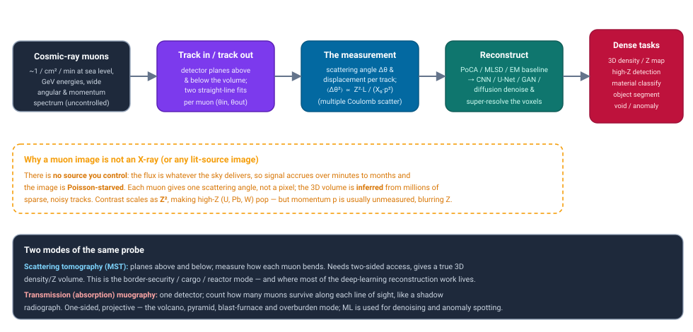
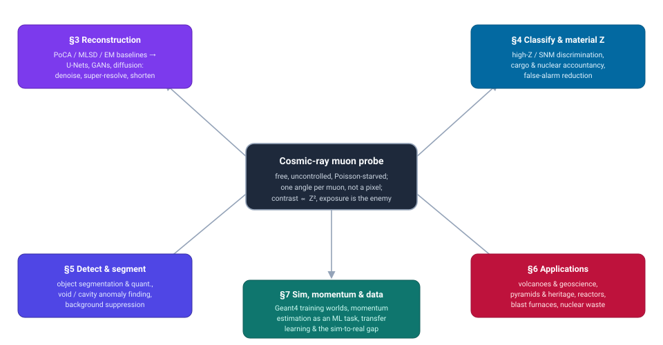
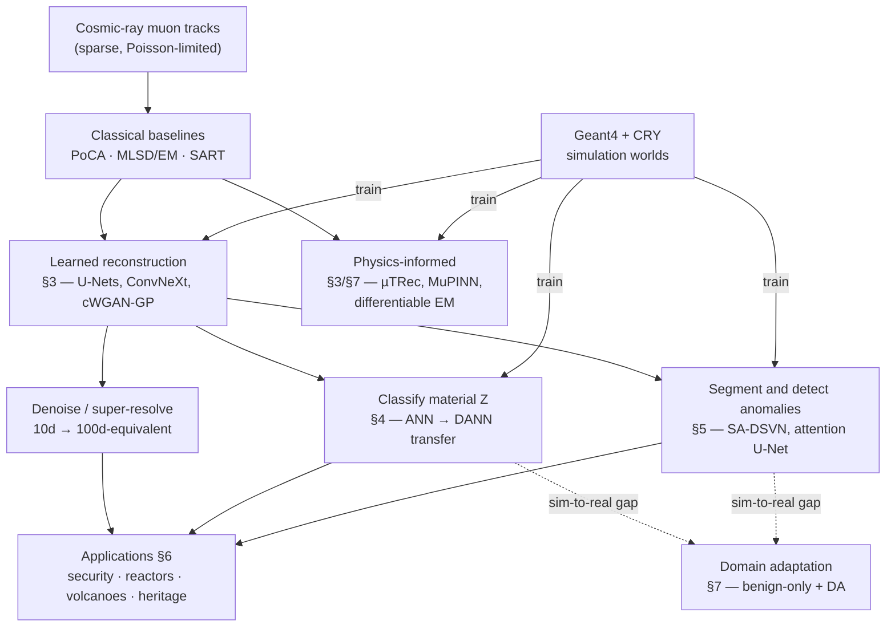

# Dense Object Detection & Classification — Recent Advances

*Compiled 2026-Aug-17 (America/Los_Angeles).*

Next installment in the running CV-updates log. Earlier entries on
`main`:
[Apr-30](../2026-Apr-30/2026-Apr-30_CV_updates.md),
[May-01](../2026-May-01/2026-May-01_CV_updates.md),
[May-02](../2026-May-02/2026-May-02_CV_updates.md),
[May-04](../2026-May-04/2026-May-04_CV_updates.md),
[May-05](../2026-May-05/2026-May-05_CV_updates.md),
[May-07](../2026-May-07/2026-May-07_CV_updates.md),
[May-08](../2026-May-08/2026-May-08_CV_updates.md),
[May-15](../2026-May-15/2026-May-15_CV_updates.md),
[May-16](../2026-May-16/2026-May-16_CV_updates.md),
[May-17](../2026-May-17/2026-May-17_CV_updates.md),
[Jun-09](../2026-Jun-09/2026-Jun-09_CV_updates.md),
[Jun-10](../2026-Jun-10/2026-Jun-10_CV_updates.md),
[Jun-12](../2026-Jun-12/2026-Jun-12_CV_updates.md),
[Jun-15](../2026-Jun-15/2026-Jun-15_CV_updates.md),
[Jun-16](../2026-Jun-16/2026-Jun-16_CV_updates.md),
[Jun-17](../2026-Jun-17/2026-Jun-17_CV_updates.md),
[Jun-19](../2026-Jun-19/2026-Jun-19_CV_updates.md),
[Jun-21](../2026-Jun-21/2026-Jun-21_CV_updates.md),
[Jun-22](../2026-Jun-22/2026-Jun-22_CV_updates.md),
[Jun-23](../2026-Jun-23/2026-Jun-23_CV_updates.md),
[Jun-24](../2026-Jun-24/2026-Jun-24_CV_updates.md),
[Jun-25](../2026-Jun-25/2026-Jun-25_CV_updates.md),
[Jun-27](../2026-Jun-27/2026-Jun-27_CV_updates.md),
[Jun-29](../2026-Jun-29/2026-Jun-29_CV_updates.md),
[Jun-30](../2026-Jun-30/2026-Jun-30_CV_updates.md),
[Jul-04](../2026-Jul-04/2026-Jul-04_CV_updates.md),
[Jul-07](../2026-Jul-07/2026-Jul-07_CV_updates.md),
[Jul-08](../2026-Jul-08/2026-Jul-08_CV_updates.md),
[Jul-10](../2026-Jul-10/2026-Jul-10_CV_updates.md),
[Jul-15](../2026-Jul-15/2026-Jul-15_CV_updates.md),
[Jul-17](../2026-Jul-17/2026-Jul-17_CV_updates.md),
[Jul-18](../2026-Jul-18/2026-Jul-18_CV_updates.md),
[Jul-21](../2026-Jul-21/2026-Jul-21_CV_updates.md),
[Jul-22](../2026-Jul-22/2026-Jul-22_CV_updates.md),
[Jul-24](../2026-Jul-24/2026-Jul-24_CV_updates.md),
[Jul-26](../2026-Jul-26/2026-Jul-26_CV_updates.md),
[Jul-27](../2026-Jul-27/2026-Jul-27_CV_updates.md),
[Jul-30](../2026-Jul-30/2026-Jul-30_CV_updates.md),
[Aug-01](../2026-Aug-01/2026-Aug-01_CV_updates.md),
[Aug-02](../2026-Aug-02/2026-Aug-02_CV_updates.md),
[Aug-04](../2026-Aug-04/2026-Aug-04_CV_updates.md),
[Aug-07](../2026-Aug-07/2026-Aug-07_CV_updates.md),
[Aug-10](../2026-Aug-10/2026-Aug-10_CV_updates.md),
[Aug-11](../2026-Aug-11/2026-Aug-11_CV_updates.md),
[Aug-13](../2026-Aug-13/2026-Aug-13_CV_updates.md),
[Aug-15](../2026-Aug-15/2026-Aug-15_CV_updates.md),
[Aug-16](../2026-Aug-16/2026-Aug-16_CV_updates.md).

## Table of contents

1. [Why this pass: muon tomography / muography as its own primitive](#why)
2. [The primitive — a probe you do not control](#primitive)
3. [Reconstruction: from PoCA to deep networks](#reconstruction)
4. [Classification & material-Z discrimination](#classification)
5. [Detection, segmentation & anomaly finding](#detection)
6. [Applications: volcanoes, heritage, reactors & infrastructure](#applications)
7. [Simulation, momentum, datasets & the sim-to-real gap](#simulation)
8. [Open problems](#open)
9. [Sources](#sources)

---

## 1. Why this pass: muon tomography / muography as its own primitive

This log has now worked through a long lineup of sensing modalities on their own terms —
optical and thermal cameras, LiDAR, automotive imaging radar, SAR, sonar, ultrasound, X-ray/CT,
MRI, PET, OCT, hyperspectral, event cameras, and a subsurface / stand-off electromagnetic set
(GPR, terahertz, photoacoustics, seismic, Wi-Fi/RF). Almost every one of those, in the end,
either *forms an image* with a source it controls or *reads a field* it can sample on demand.
**Muon tomography is the odd one out on the source side: the illumination is the sky.** Cosmic
rays rain secondary muons onto every square metre of the planet at roughly one per square
centimetre per minute, and the technique's entire job is to turn that faint, uncontrollable,
never-repeatable drizzle of charged particles into a dense 3D map of *what a large, dense object
is made of.*

It earns a standalone entry because it inverts the assumption behind most of the previous
modalities in a second way, too. An X-ray machine, a CT gantry, an ultrasound probe — each fires
a known, dense, repeatable signal and measures the response. A muon detector waits. It cannot
raise the flux, cannot choose the muons' energies or angles, and cannot re-illuminate the same
voxel a second time under identical conditions. Every muon delivers a *single scalar* — a
scattering angle, or a survived/absorbed bit — and the volume has to be inferred from millions of
these sparse, noisy, Poisson-limited measurements. That is a reconstruction-and-classification
problem in the most literal sense, and it is exactly why the field has, over the last three years,
leaned hard on deep learning: to squeeze a usable dense image out of far fewer muons, far faster,
than the classical geometry-only algorithms allow.

The pay-off is a probe that does what no other on this list can: it sees *through metres of steel,
rock, and concrete*, with no radiation dose to add and no source to license, and it reads atomic
number directly because the physics of scattering scales as **Z²**. That is why the same primitive
shows up imaging a shielded uranium block inside a cargo truck, the molten fuel debris inside a
wrecked reactor, the density anomaly that turned out to be a hidden chamber in the Great Pyramid,
and the magma conduit inside an active volcano. The price is the flux: exposures run from minutes
to *months*, resolution is coarse, and the atomic-number readout is blurred by the one quantity
the cheap detectors usually cannot measure — each muon's momentum. Modern muography is, to a
striking degree, the study of how to beat those three costs, and machine learning has become the
main lever.

## 2. The primitive — a probe you do not control

**What arrives.** Primary cosmic rays hitting the upper atmosphere produce showers whose surviving
charged component at ground level is dominated by muons: heavy (~207× the electron mass), highly
penetrating, arriving with a broad energy spectrum (GeV-scale) and a roughly cos²θ angular
distribution about the vertical. The flux is low and fixed — you get what the sky gives — which
makes **exposure time**, not photon budget, the fundamental currency of the modality.

**What is measured — two modes.** The same particle supports two imaging geometries, and the
distinction organizes the whole field:

- **Scattering tomography (MST).** Position-sensitive detector planes sit *above and below* the
  object. Each muon's incoming and outgoing straight-line tracks are fitted, and the **scattering
  angle Δθ** and lateral displacement are recorded. Multiple Coulomb scattering makes the variance
  of that angle grow with atomic number and thickness, roughly
  ⟨Δθ²⟩ ∝ Z²·L / (X₀·p²) — so dense, high-Z material bends muons more. MST yields a genuine 3D
  density/Z volume but needs **two-sided access**. This is the border-security, cargo, and
  reactor-imaging mode, and it is where most deep-learning *reconstruction* research lives.
- **Transmission (absorption) muography.** A single detector counts how many muons *survive*
  along each line of sight, exactly like a shadow radiograph: more mass along a ray means fewer
  muons through it. It is **one-sided and projective** (2D per viewpoint; 3D needs multiple
  viewpoints and inversion). This is the volcano, pyramid, blast-furnace, and overburden mode;
  here ML shows up mostly for denoising, background suppression, and anomaly detection.

**Why it is hard for a network.** Three properties make muon data unlike a camera image:

1. **Sparsity / Poisson noise.** The signal is a handful to millions of discrete tracks, not a
   filled pixel grid. Short exposures give speckled, holey reconstructions; the classical fix is
   simply *to wait longer*, which is exactly what applications cannot afford.
2. **One scalar per muon.** A muon does not paint a pixel — it reports one angle (MST) or one
   survival bit (transmission). The spatial image is an *inverse problem* over the full track set,
   and the naive geometric estimator (below) throws most of the information away.
3. **The momentum blur.** Scattering depends on Z *and* on the muon's momentum p, but commodity
   trackers rarely measure p. Averaging over the spectrum smears the Z estimate — so recovering or
   inferring momentum is itself a live ML sub-task (§7).

**The classical baseline: PoCA.** Point-of-Closest-Approach, introduced at Los Alamos alongside
the first cosmic-ray scattering demonstrations (Borozdin *et al.*, *Nature* 2003), approximates
each muon's whole scattering history as a *single* kink at the point where the in- and out-tracks
come closest, and bins the scattering angle there. It is fast and needs no training, but it
discards the multi-scatter structure, blurs badly under low statistics, and leaves streaks and
holes. Everything in §3 is, in one way or another, an attempt to do better than PoCA — either by
better statistics (maximum-likelihood / EM estimators) or by learning the inverse map from data.

## 3. Reconstruction: from PoCA to deep networks

**The classical ladder.** Before the networks, three geometry/statistics estimators define the
baseline. **PoCA** (Point of Closest Approach) bins each muon's scattering as a single kink and is
the fast, training-free default — but it wastes information and collapses under low statistics.
**Maximum-Likelihood / Expectation-Maximization (MLSD/EM)** methods (Schultz *et al.*) model the
full per-voxel scattering density and iterate to a likelihood optimum, trading compute for markedly
better images at the same muon count. **Algebraic reconstruction** (SART and relatives) casts the
problem as a linear system over voxels and is common on the transmission side. A 2025 *Journal of
Applied Physics* review, *Image reconstruction techniques in muography*, is the current map of this
territory and the right entry point.

**Learning the inverse map.** The last three years have moved from "post-process PoCA" to
"replace the reconstructor." **μ-Net** (arXiv:2312.17265) is the cleanest example: a two-stage
pipeline where an MLP first predicts each muon's trajectory and a **ConvNeXt-based U-Net** turns the
scattering points into a voxel volume, reporting state-of-the-art fidelity (≈17 PSNR at only 1,024
muons) and beating classical algorithms in the low-count regime that matters. *A new method for
structural diagnostics with muon tomography and deep learning* (arXiv:2502.03339) pushes the same
idea for infrastructure, using **U-Nets with residual-in-residual dense blocks (RRDB)** to
reconstruct high-resolution images from far fewer muon events. An **iterative deep-learning**
scheme (IEEE) frames reconstruction as semantic segmentation with atrous convolutions and feeds the
network's own output back as input for self-refinement.

**Denoise and super-resolve — buy back exposure time.** Because exposure is the fundamental cost,
a large fraction of the work is explicitly about *getting the long-exposure image from a
short-exposure scan*. *U-Net based image enhancement for short-time Muon Scattering Tomography*
(NIM A) and *A new algorithm to improve imaging quality for muon tomography* (NIM A) both learn to
map noisy, low-statistics reconstructions onto their long-run targets. The most striking number
comes from *2D and 3D analysis improvements with machine learning for muography* (NIM A 2024):
a denoising network makes **10 days of muography equivalent to 100 days without it**, and the same
work slots a **diffusion model** and 3D regularization on top of a SART pipeline to repair
per-image defects — a 10× exposure saving is exactly the lever the field needs. *Muographic Image Upsampling
with Machine Learning for Built Infrastructure Applications* (O'Donnell *et al.*, MDPI *Particles*
2025) is the strongest generative example: a **conditional Wasserstein GAN with gradient penalty
(cWGAN-GP)** predictively upsamples undersampled muographs, recovering rebar grids and tendon ducts
in concrete (Dice ≈0.82–0.87) and removing z-plane smearing — shorter acquisition plus de-blurring
in one model.

**Physics back in the loop.** A parallel line keeps the scattering physics explicit rather than
learning it blind. **μTRec** (Ughade & Chatzidakis, *J. Appl. Phys.* 138(6), 064909, 2025;
arXiv:2505.04821) replaces PoCA's single-kink assumption with a per-muon *curved* trajectory from a
bivariate-Gaussian multiple-scattering model updated in a Bayesian scheme, and reports large
detectability gains over PoCA for spent-fuel casks; a **physics-informed NN (MuPINN)** variant
embeds the same scattering model as a network prior. The unifying infrastructure is Sattler
*et al.*'s **end-to-end differentiable, GPU-accelerated framework** (*J. Appl. Phys.* 138(14),
144904, 2025) that puts geometric reconstructors and an optimized EM solver in one autograd
pipeline — the 2025 *Journal of Applied Physics* argument that ML should be *a stage inside* a
physics-aware reconstructor, not a post-hoc filter. *Research on rapid imaging with cosmic-ray
muon scattering tomography* (*Scientific Reports* 2023) targets the same low-count speed-up.

## 4. Classification & material-Z discrimination

This is the modality's oldest and highest-stakes task: decide *what a hidden object is made of* —
specifically, is there high-Z **special nuclear material (SNM)** (uranium, plutonium) or heavy
shielding (lead, tungsten) inside a cargo container, vehicle, or waste drum. Because scattering
scales as Z², a dense high-Z lump is exactly what the physics makes visible; the ML job is to turn a
noisy scattering-angle distribution into a calibrated material class under short exposures and
adversarial concealment. The founding demonstrations are classical — Los Alamos showed high-Z
detection via multiple scattering (Priedhorsky/Borozdin, *Rev. Sci. Instrum.* 2003) and material-Z
discrimination in the first cargo-imaging papers — and the ML story is the steady climb up the model
ladder from there.

**The ladder.** Early work used **multivariate / boosted-tree discriminants**: Weekes *et al.*
(*JINST* 2021, arXiv:2012.01554) locate and identify high-Z objects in nuclear-waste drums,
separating uranium, iron and lead and reporting ~0.90 uranium sensitivity at ~0.12 false-positive
rate. **Shallow ANNs on scattering angles** followed: He *et al.* (*Radiat. Detect. Technol.
Methods* 2022) trained a network on Geant4 scattering angles and tested on real Micromegas data,
hitting **98% discrimination among Al/Cu/W** on 4 cm blocks in a **5-minute** exposure — an early
clean sim-trained/real-tested result. The current frontier is **deep nets plus domain adaptation
for shielded/coated materials**: Wang *et al.*'s *Transfer learning empowers material Z
classification* (arXiv:2504.12305; *Nucl. Sci. Tech.* 2026) uses fine-tuning and a
**domain-adversarial network (DANN)** so that networks trained on bare materials still classify
*coated/shielded* targets — >96% overall, ~99% for high-Z, roughly +10% over direct prediction.
Bao *et al.* (arXiv:2606.30028, 2026) attack the same problem from the nuisance side, combining
**coarse momentum encoding with unsupervised domain adaptation** to learn scattering
representations that survive the sim-to-real jump.

**Cargo, contraband & throughput.** A prolific line (Georgadze, Tartu) reframes classification as
a **fast screening / false-alarm** problem: *Automated object detection for muon tomography data
analysis* (*JINST* 2024, arXiv:2312.10733) flags dangerous items hidden in legal cargo via PoCA +
nearest-neighbour filtering; *Muon Imaging for Illicit Cargo Detection* (arXiv:2505.18851, 2025)
uses a **Random Forest** on rapid-scan features (ROC AUC ≈0.997 for benign-vs-contraband) with
DBSCAN localization; and *Rapid cargo verification with cosmic-ray muon scattering and absorption
tomography* (*JINST* 2024, arXiv:2407.01020) shows that **fusing scattering with absorption** gives
3.5σ–5.5σ material separation in a **10-second** scan — the throughput regime real ports need.

**Nuclear accountancy.** For safeguards, the task is verifying that fuel is where it should be.
Bae, Montgomery & Chatzidakis (*Scientific Reports* 2024) show **momentum-informed MST** lifts
missing-assembly detection in dry-storage casks from 79%→98% (one assembly) and 51%→88% (half
assembly), and the physics-informed μTRec line (§3) extends this to sealed microreactor cores
(arXiv:2603.05712). **Commercial systems** sit on top of this literature — Decision Sciences
(passive muon+electron scattering/stopping with ML 3D reconstruction; Blanpied *et al.*, *NIM A*
2015), Lingacom (muon+X-ray fusion), and GScan (CERN spin-out, "muonFLUX" ML material ID) — though
their model details are largely proprietary.

## 5. Detection, segmentation & anomaly finding

Once a volume is reconstructed, the dense-vision tasks are the familiar ones — **segment the
objects, quantify them, and flag what shouldn't be there** — but with a twist unique to muography:
often you do not have labels for "what's there," only a prior for "what should be there," so the
problem is naturally posed as **anomaly detection against an expected structure**.

**Voxel segmentation.** *Shower-Aware Dual-Stream Voxel Networks (SA-DSVN)* (Dasgupta *et al.*,
arXiv:2604.03741, 2026) is the most architecturally interesting: a 3D CNN with **two encoder
streams** — one for scattering kinematics (9 channels), one for muon-induced EM-shower
multiplicities (40 channels) — fused by **cross-attention** for voxel-level segmentation of concrete
defects, trained on 4.5M Geant4 events and benchmarked against PoCA/MLSD (96.3% voxel accuracy).
Using secondary showers as an input channel is a genuinely muography-specific feature idea. On the
classical-vision side, *Robust object segmentation and quantification in muon tomography*
(Springer *SIViP*, 2026) shows a deterministic multi-stage pipeline still competes for isolating and
measuring objects — a useful reminder that not every gain here needs a network.

**Anomaly detection against a prior.** The reactor work is the cleanest example. Procureur *et al.*
imaged a whole decommissioned reactor in 3D from transmission projections (*Science Advances* 2023),
and the follow-up *3D Reconstruction of a Nuclear Reactor by Muon Tomography: Structure Validation
and Anomaly Detection* (*PRX Energy* 4, 013002, 2025) pairs reconstruction with a **denoising
diffusion probabilistic model** to beat the limited-statistics noise and then explicitly *detects
undocumented structural anomalies* — validate-the-model-then-flag-the-deviation, which is exactly
the safeguards/monitoring use case. The maritime-cargo counterpart, *From Simulation to Real Scans*
(Bueno Rodríguez *et al.*, arXiv:2608.12068, 2026, DLR + GScan), trains an **attention U-Net on
benign synthetic scenes only** and scores real scans with a "Homogeneity Index" that suppresses
uniform cosmic-ray statistical noise and amplifies coherent anomalies — anomaly detection as the
route around the impossibility of labelling every threat.

**Void / cavity finding & background suppression.** For geoscience and civil work the "object" is
often *absence* — a void, cavity, or tunnel. Paccagnella *et al.* (*AIP Conf. Proc.* 3308, 030005,
2025) train a **U-Net for automatic cavity/anomaly detection** in muon radiography, validated on
real data from the Temperino mine. And because low-energy scattered muons are a dominant background
in transmission muography, DNN-based **background suppression** — learning to reject the soft,
non-ballistic component — has become a standard preprocessing step for volcano-scale imaging.

## 6. Applications: volcanoes, heritage, reactors & infrastructure

The applications read like nothing else in this log because the "objects" are geological and
architectural: mountains, monuments, reactors. Almost all of these use *transmission* muography
(one-sided, projective), and ML enters as denoising, inversion, and anomaly spotting.

**Volcanoes & geoscience.** The landmark "ML directly on muograms" result is Nomura *et al.*'s
*Pilot study of eruption forecasting with muography using a convolutional neural network*
(*Scientific Reports* 2020): a CNN fed seven consecutive daily muograms of **Sakurajima** predicts
next-day eruption at ROC AUC ≈0.73. Beyond forecasting, ML now does **joint inversion** — Cosburn &
Nishiyama's machine-learning joint gravity+muon density inversion at Mt Usu (*Geophys. J. Int.*
2022) — and **background rejection** via DNNs trained on Geant4 detector models. Simulation
toolboxes like **MUYSC** (arXiv:2303.02627) generate the synthetic muograms these models train on,
and 2025 perspectives push toward fusing muography with **InSAR ground deformation** for
multi-month volcanic-unrest assessment.

**Archaeology & heritage.** The field's most famous result is the **ScanPyramids "Big Void"** — a
~30 m cavity above the Grand Gallery of Khufu's Pyramid, found with nuclear-emulsion films and
scintillator/gas detectors (Morishima *et al.*, *Nature* 552, 386, 2017; arXiv:1711.01576) — with
the 2023 follow-up precisely characterizing the **North-Face Chevron corridor** (~9 m) by combining
Nagoya emulsions and CEA Micromegas detectors (Procureur *et al.*, *Nature Communications* 2023).
These campaigns are the canonical example of the **nuclear-emulsion** data modality: extraordinarily
high angular resolution, but *offline scanned-track* data with no timing — a different beast for
any learning pipeline than a real-time scintillator hit map.

**Reactors, fuel debris & blast furnaces.** Muography's ability to see through metres of steel makes
it the tool of choice for wrecked or sealed nuclear plant. The **Fukushima Daiichi** imaging effort
(Miyadera *et al.*, *AIP Advances* 2013; Toshiba/IRID 2015) used muon scattering to locate melted
fuel to ~0.3 m; drift-tube trackers were built specifically for Unit 2. On the reconstruction side,
the CEA reactor-imaging program (Procureur *et al.*, *Science Advances* 2023; *PRX Energy* 2025) is
where much of the transmission-side ML denoising and diffusion work was proven. Industrial
muography now images the **cohesive zone and hearth erosion of an operating blast furnace** (the
European **BLEMAB** project at ArcelorMittal Bremen; *J. Appl. Phys.* 138(8), 084902, 2025), and
extends to **nuclear-waste drums**, tunnels, overburden, and reinforced-concrete infrastructure —
each a density-anomaly problem the ML pipelines of §3–§5 are increasingly aimed at.

## 7. Simulation, momentum, datasets & the sim-to-real gap

**Everything is trained on simulation.** With no way to stage millions of labelled real scans, the
field runs on **Geant4** (Agostinelli *et al.*, 2003) — usually with the **CRY** cosmic-ray shower
library as the muon-flux source — to synthesize training worlds. The near-total reliance on
simulation makes the **sim-to-real gap** muography's defining ML problem, and 2026 is when it became
an explicitly named target: benign-only synthetic training plus domain adaptation, validated on real
GScan maritime scans (Bueno Rodríguez *et al.*, arXiv:2608.12068), and coarse-momentum + unsupervised
domain adaptation for material ID (Bao *et al.*, arXiv:2606.30028). Transfer/adversarial-transfer
learning (Wang *et al.*, arXiv:2504.12305) is the same instinct applied to shielded-material classes.

**The momentum problem as an ML task.** The single biggest physical confound is that scattering
depends on both Z and the muon's momentum p, yet commodity trackers don't measure p — so the broad
natural spectrum blurs the Z estimate. Two responses: **measure it** (dedicated momentum-measurement
schemes; Yu *et al.*, arXiv:2509.12800) or **infer it** — *Scattering-Based Machine Learning
Algorithms for Momentum Estimation in Muon Tomography* (*Particles* 8(2), 43, 2025) regresses
per-muon momentum from its scattering, and momentum-informed reconstruction (Bae *et al.*, 2024)
then feeds that estimate back into the density inversion.

**Datasets & open resources — still thin.** Unlike the camera-vision modalities in this log,
muography has **no shared benchmark or leaderboard**. The closest to an open asset is the **μ-Net**
release (Lim & Qiu, arXiv:2312.17265) — a large Geant4-generated scattering→voxel dataset (on Kaggle)
plus code — and named Geant4 pipelines such as the cloud-native "Vega" framework behind SA-DSVN's
4.5M-event set. *Three-dimensional cosmic-muon tomography of reinforced concrete using Geant4 and
ML event reduction* (*JINST* 2025) is representative of the standard recipe: Geant4 + a cosmic-muon
source emulator + a network that performs "event reduction" to cut exposure without losing
resolution. Detector-side ML also feeds the data quality upstream — networks for **demultiplexing
and particle ID** in Micromegas/TPC readout (Lefevre *et al.*, *NIM A* 2024; 0.11° stripped-detector
resolution, 94–99% PID) and **subpixel trajectory reconstruction** in discretized detectors
(arXiv:2512.20645).

**A visible gap: no generative fast-sim, no foundation model.** Across all three sweeps, **no
muography-specific GAN/diffusion/normalizing-flow *fast simulator*** and **no foundation-model
effort** surfaced — the generative fast-simulation wave that reshaped collider/calorimeter physics
has not reached muography, and the generative models that do exist here (the cWGAN-GP upsampler, the
PRX-Energy diffusion denoiser) are *image-enhancement*, not data synthesis. Given how simulation-bound
the field is, that is the most obvious open opportunity — and, for a security modality, the most
obvious hazard (§8).

### Method lineage at a glance

## 8. Open problems

- **Exposure vs. resolution is still the wall.** Deep reconstructions cut the muon count needed
  for a usable image, but the honest question — *how few real muons, over how few minutes, for a
  given detection confidence?* — is answered mostly on simulation. Field validation at low counts
  is thin.
- **The momentum problem.** Without per-muon momentum, Z discrimination saturates. Momentum
  estimation from scattering (an ML regression task) and momentum-informed reconstruction are
  promising but add detector cost or model risk; neither is standard yet.
- **Sim-to-real.** Networks are trained almost entirely on Geant4 worlds. Detector inefficiencies,
  misalignment, backgrounds, and the true cosmic spectrum differ from simulation, and the gap is
  rarely quantified. Transfer/adversarial-transfer learning is the emerging patch, not a cure.
- **No shared benchmarks.** Unlike the camera-vision modalities in this log, muography has no
  common dataset, no leaderboard, and idiosyncratic detector geometries — so "state of the art"
  claims are hard to compare across groups.
- **Generative augmentation is double-edged.** GAN/diffusion models that fabricate plausible muon
  data to shorten exposures or balance classes risk hallucinating structure the muons never
  supported — a serious concern for a *security* modality where a false negative is a smuggled
  threat.
- **Explainability for high-stakes calls.** Cargo alarms and nuclear-material accountancy are
  adversarial, regulated decisions; a black-box "high-Z here" verdict needs calibrated
  uncertainty and an audit trail the classical estimators provided for free.

## 9. Sources

Citations were assembled from arXiv listings, publisher/index metadata, and project pages. arXiv
IDs and DOIs are transcribed from source URLs and not invented; where an exact author list, ID, or
journal-vs-preprint status could not be independently confirmed at compile time it is flagged
*(verify)*. Several 2026 (26xx) arXiv IDs are legitimately recent preprints given the compile date.

**Foundations, primitive & PoCA baseline (§1–2)**
- Borozdin, Hogan, Morris, Priedhorsky, Saunders, Schultz & Teasdale, *Radiographic imaging with cosmic-ray muons*, **Nature** 422, 277 (2003) — https://www.nature.com/articles/422277a
- Priedhorsky, Borozdin *et al.*, *Detection of high-Z objects using multiple scattering of cosmic ray muons*, **Rev. Sci. Instrum.** 74, 4294 (2003) — https://pubs.aip.org/aip/rsi/article-abstract/74/10/4294/453710
- Schultz *et al.*, *Statistical reconstruction for cosmic ray muon tomography (MLSD/EM)*, **IEEE Trans. Image Processing** 16(8), 1985 (2007) — https://ieeexplore.ieee.org/document/4267947
- Morris *et al.*, *A new method for imaging nuclear threats using cosmic ray muons*, arXiv:1306.0523 (2013) — https://arxiv.org/abs/1306.0523
- Agostinelli *et al.*, *Geant4—a simulation toolkit*, **NIM A** 506, 250 (2003) — https://doi.org/10.1016/S0168-9002(03)01368-8

**Reviews & surveys (§1, §3)**
- Luo, Feng, Zeng *et al.*, *Image reconstruction techniques in muography: A review of algorithms and physical principles*, **J. Appl. Phys.** 138(4), 041101 (2025) — https://pubs.aip.org/aip/jap/article/138/4/041101/3355478
- Bonechi, D'Alessandro & Giammanco, *Atmospheric muons as an imaging tool*, **Reviews in Physics** 5, 100038 (2020), arXiv:1906.03934 — https://arxiv.org/abs/1906.03934
- *Muography* primer, **Nature Reviews Methods Primers** (2023) — https://doi.org/10.1038/s43586-023-00270-7 *(author list verify)*
- *Cosmic-ray muography*, theme issue, **Phil. Trans. R. Soc. A** 377(2137) (2019) — https://royalsocietypublishing.org/toc/rsta/2019/377/2137
- *Muography: Discoveries, Innovations, and Applications*, special topic, **J. Appl. Phys.** (2025) — https://pubs.aip.org/aip/collection/566803

**Reconstruction — deep networks, denoising, super-resolution (§3)**
- Lim & Qiu, *μ-Net: ConvNeXt-Based U-Nets for Cosmic Muon Tomography*, arXiv:2312.17265 (2023) — https://arxiv.org/abs/2312.17265 · code/dataset: https://github.com/jedlimlx/Muon-Tomography-AI
- *A new method for structural diagnostics with muon tomography and deep learning* (U-Net + RRDB), arXiv:2502.03339 (2025) — https://arxiv.org/abs/2502.03339
- Ruta & Ruta, *Iterative Deep Learning for Muon Scattering Tomography*, **IEEE BigData 2023**, pp. 6076–6083 — https://ieeexplore.ieee.org/document/10386973
- Wang, Yu, Chen *et al.*, *U-Net based image enhancement for short-time Muon Scattering Tomography*, **NIM A** (2026), arXiv:2602.07060 — https://arxiv.org/abs/2602.07060 · https://www.sciencedirect.com/science/article/abs/pii/S0168900226005231
- O'Donnell, Mahon, Yang & Gardner, *Muographic Image Upsampling with Machine Learning for Built Infrastructure Applications* (cWGAN-GP), **Particles** 8(1), 33 (2025), arXiv:2502.02624 — https://www.mdpi.com/2571-712X/8/1/33
- Lefevre, Attié, Bajou & Gomez, *2D and 3D analysis improvements with machine learning for muography applications*, **NIM A** 1068, 169755 (2024) — https://www.sciencedirect.com/science/article/pii/S0168900224006818
- Vinodkumar, Avots, Ozcinar *et al.*, *3D reconstruction and denoising of high-Z materials from muon tomography using 3D CNN*, **Signal, Image and Video Processing** 19, 378 (2025) — https://doi.org/10.1007/s11760-025-03992-1
- Ughade & Chatzidakis, *μTRec: A muon trajectory reconstruction algorithm for enhanced scattering tomography*, **J. Appl. Phys.** 138(6), 064909 (2025), arXiv:2505.04821 — https://arxiv.org/abs/2505.04821
- Sattler, Alameddine, Bueno Rodríguez, Stephan & Barnes, *A comprehensive framework toward the seamless integration of muon reconstruction algorithms with machine learning*, **J. Appl. Phys.** 138(14), 144904 (2025) — https://pubs.aip.org/aip/jap/article/138/14/144904
- Cai, Li, Liu *et al.*, *A new algorithm to improve imaging quality for muon tomography*, **NIM A** (2024) — https://www.sciencedirect.com/science/article/abs/pii/S0168900224005424
- *Research on rapid imaging with cosmic ray muon scattering tomography*, **Scientific Reports** 13 (2023) — https://www.nature.com/articles/s41598-023-47023-w
- *A muon trajectory reconstruction algorithm based on physics-informed neural network (MuPINN)*, **Nuclear Techniques** (2026) — https://doi.org/10.3724/j.0253-3219.2026.hjs.49.250317 *(authors verify)*
- *Raw-Hit Muon Tomography: A Measurement-Domain Formulation for Cosmic-Ray Muon Imaging*, arXiv:2606.20180 (2026) — https://arxiv.org/abs/2606.20180

**Classification & material-Z discrimination (§4)**
- Weekes, Alrheli, Barker *et al.*, *Material Identification in Nuclear Waste Drums using Muon Scattering Tomography and Multivariate Analysis*, **JINST** 16, P05007 (2021), arXiv:2012.01554 — https://arxiv.org/abs/2012.01554
- He *et al.*, *Material discrimination using cosmic ray muon scattering tomography with an artificial neural network*, **Radiat. Detect. Technol. Methods** 6, 254 (2022) — https://doi.org/10.1007/s41605-022-00319-3
- Wang, Zhang, Yu *et al.*, *Transfer learning empowers material Z classification with muon tomography*, arXiv:2504.12305 (2025); **Nucl. Sci. Tech.** (2026) — https://arxiv.org/abs/2504.12305
- Bao, Zhang, Yu *et al.*, *Improving Muon-Scattering Material Identification via Coarse Momentum Encoding and Unsupervised Domain Adaptation*, arXiv:2606.30028 (2026) — https://arxiv.org/abs/2606.30028
- Georgadze, *Automated object detection for muon tomography data analysis*, **JINST** 19, C07004 (2024), arXiv:2312.10733 — https://arxiv.org/abs/2312.10733
- Georgadze, *Muon Imaging for Illicit Cargo Detection: A Simulation-Based Study*, arXiv:2505.18851 (2025) — https://arxiv.org/abs/2505.18851 *(preprint; verify)*
- Georgadze, *Rapid cargo verification with cosmic ray muon scattering and absorption tomography*, **JINST** 19, P10033 (2024), arXiv:2407.01020 — https://arxiv.org/abs/2407.01020
- Georgadze, *Rapid muon tomography for border security*, arXiv:2504.01525 (2025) — https://arxiv.org/abs/2504.01525 *(preprint; verify)*
- Yang, Ireland, Kaiser & Mahon, *Machine Learning for Muon Imaging*, **BICS 2018**, LNCS 10989 — https://doi.org/10.1007/978-3-030-00563-4_79
- Bae, Montgomery & Chatzidakis, *Momentum informed muon scattering tomography for monitoring spent nuclear fuels in dry storage cask*, **Scientific Reports** 14 (2024) — https://doi.org/10.1038/s41598-024-57105-y
- Blanpied *et al.*, *Material discrimination using scattering and stopping of cosmic ray muons and electrons*, **NIM A** 784, 352 (2015) — https://doi.org/10.1016/j.nima.2014.11.027

**Detection, segmentation & anomaly finding (§5)**
- Dasgupta, Agarwal, Dutta, Karmakar & Goswami, *Shower-Aware Dual-Stream Voxel Networks for Structural Defect Detection in Cosmic-Ray Muon Tomography*, arXiv:2604.03741 (2026) — https://arxiv.org/abs/2604.03741
- *Robust object segmentation and quantification in muon tomography using a multi-stage deterministic image processing pipeline*, **Signal, Image and Video Processing** (2026) — https://doi.org/10.1007/s11760-026-05326-1
- Procureur, Attié, Bajou *et al.*, *3D imaging of a nuclear reactor using muography measurements*, **Science Advances** 9, eabq8431 (2023) — https://doi.org/10.1126/sciadv.abq8431
- *3D Reconstruction of a Nuclear Reactor by Muon Tomography: Structure Validation and Anomaly Detection* (diffusion model), **PRX Energy** 4, 013002 (2025) — https://journals.aps.org/prxenergy/abstract/10.1103/PRXEnergy.4.013002
- Bueno Rodríguez, Hrytsiuk, Perez Prada *et al.*, *From Simulation to Real Scans: Anomaly Detection in Maritime Cargo with Muon Scattering Tomography*, arXiv:2608.12068 (2026) — https://arxiv.org/abs/2608.12068 *(preprint; verify)*
- Paccagnella, Ciulli, D'Alessandro *et al.*, *Exploring novel machine learning applications in muography: A promising frontier*, **AIP Conf. Proc.** 3308, 030005 (2025) — https://pubs.aip.org/aip/acp/article-abstract/3308/1/030005

**Applications — volcanoes, heritage, reactors & infrastructure (§6)**
- Nomura, Nemoto, Hayashi *et al.*, *Pilot study of eruption forecasting with muography using convolutional neural network*, **Scientific Reports** 10, 5272 (2020) — https://www.nature.com/articles/s41598-020-62342-y
- Cosburn, Roy & Nishiyama, *A machine learning approach to joint gravity and cosmic-ray muon inversion at Mt Usu*, **Geophys. J. Int.** 233(2), 1081 (2022) — https://doi.org/10.1093/gji/ggac504 *(DOI verify)*
- Peña Rodríguez *et al.*, *MUYSC: an end-to-end muography simulation toolbox*, **Geophys. J. Int.** 237(1), 540 (2024), arXiv:2303.02627 — https://arxiv.org/abs/2303.02627
- Morishima, Kuno, Nishio *et al.*, *Discovery of a big void in Khufu's Pyramid by observation of cosmic-ray muons*, **Nature** 552, 386 (2017), arXiv:1711.01576 — https://www.nature.com/articles/nature24647 · https://arxiv.org/abs/1711.01576
- Procureur, Morishima, Kuno *et al.*, *Precise characterization of a corridor-shaped structure in Khufu's Pyramid by observation of cosmic-ray muons*, **Nature Communications** 14, 1144 (2023) — https://doi.org/10.1038/s41467-023-36351-0
- Miyadera, Borozdin, Greene *et al.*, *Imaging Fukushima Daiichi reactors with muons*, **AIP Advances** 3(5), 052133 (2013) — https://doi.org/10.1063/1.4808210
- *Muon trackers for imaging a nuclear reactor*, **JINST** 11(09), P09008 (2016) — https://doi.org/10.1088/1748-0221/11/09/P09008
- Borselli, Ambrosino, Andreetto *et al.*, *Muon imaging of a blast furnace: The European project BLEMAB*, **J. Appl. Phys.** 138(8), 084902 (2025); early: arXiv:2110.10327 — https://arxiv.org/abs/2110.10327
- *Toward joint muography and ground deformation monitoring for volcanic unrest assessment*, **J. Appl. Phys.** 138(6), 060701 (2025) — https://doi.org/10.1063/5.0275038
- *Muography and Its Potential Applications to Mining and Rock Engineering*, **Rock Mech. Rock Eng.** (2020) — https://doi.org/10.1007/s00603-020-02199-9

**Simulation, momentum, datasets & sim-to-real (§7)**
- *Scattering-Based Machine Learning Algorithms for Momentum Estimation in Muon Tomography*, **Particles** 8(2), 43 (2025) — https://www.mdpi.com/2571-712X/8/2/43 *(authors verify)*
- Yu *et al.*, *Improving Muon Scattering Tomography Performance With A Muon Momentum Measurement Scheme*, arXiv:2509.12800 (2025) — https://arxiv.org/abs/2509.12800
- Ughade & Chatzidakis, *Non-intrusive Monitoring of Sealed Microreactor Cores Using Physics-Informed Muon Scattering Tomography With Momentum Measurements*, arXiv:2603.05712 (2026) — https://arxiv.org/abs/2603.05712
- Pezzotti *et al.*, *Three-dimensional cosmic muon tomography reconstruction of reinforced concrete using Geant4 simulations and machine learning event reduction*, **JINST** 20, P09038 (2025) — https://doi.org/10.1088/1748-0221/20/09/P09038
- *Machine learning methods for subpixel trajectory reconstruction in discretized position detectors*, arXiv:2512.20645 — https://arxiv.org/abs/2512.20645 *(preprint; verify)*
- *Cherenkov detector with wavelength-shifting fiber readout for muon tomography applications*, arXiv:2503.04213 (2025) — https://arxiv.org/abs/2503.04213

---

*Compiled automatically as part of the running CV-updates log. Method: three parallel literature
sweeps (deep-learning reconstruction; security / material-Z classification; applications, detectors
& reviews) plus independent cross-checks against publisher, arXiv, and official project pages.
Where a 2025–2026 identifier could not be independently confirmed, the item is cited by title and
venue and flagged *(verify ID)*; no identifiers were fabricated. Diagrams are original, theme-aware
SVGs (no external assets). Corrections welcome in follow-up entries.*
