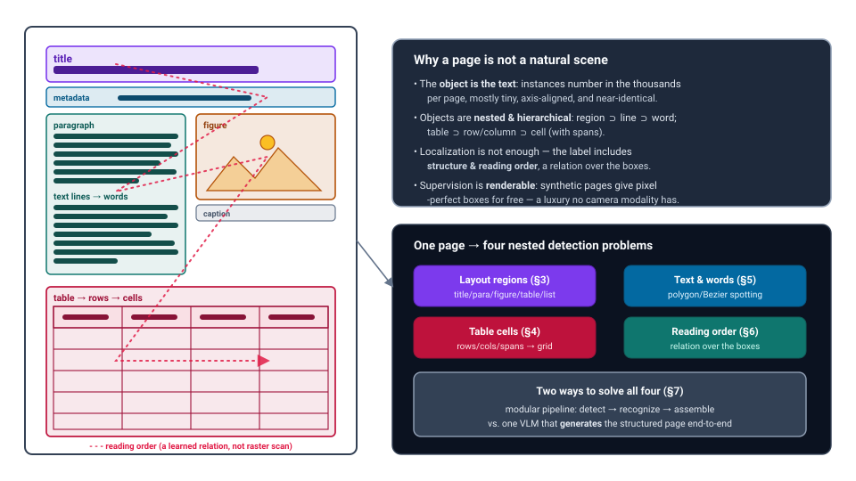
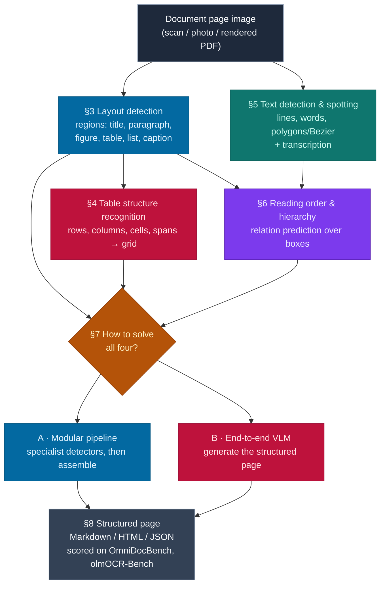
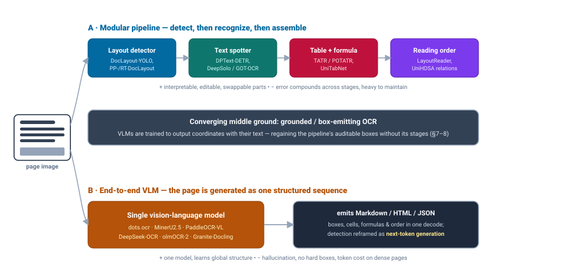

# Dense Object Detection & Classification — Recent Advances

*Compiled 2026-Aug-18 (America/Los_Angeles).*

Next installment in the running CV-updates log. Earlier entries on
`main`:
[Apr-30](../2026-Apr-30/2026-Apr-30_CV_updates.md),
[May-01](../2026-May-01/2026-May-01_CV_updates.md),
[May-02](../2026-May-02/2026-May-02_CV_updates.md),
[May-04](../2026-May-04/2026-May-04_CV_updates.md),
[May-05](../2026-May-05/2026-May-05_CV_updates.md),
[May-07](../2026-May-07/2026-May-07_CV_updates.md),
[May-08](../2026-May-08/2026-May-08_CV_updates.md),
[May-15](../2026-May-15/2026-May-15_CV_updates.md),
[May-16](../2026-May-16/2026-May-16_CV_updates.md),
[May-17](../2026-May-17/2026-May-17_CV_updates.md),
[Jun-09](../2026-Jun-09/2026-Jun-09_CV_updates.md),
[Jun-10](../2026-Jun-10/2026-Jun-10_CV_updates.md),
[Jun-12](../2026-Jun-12/2026-Jun-12_CV_updates.md),
[Jun-15](../2026-Jun-15/2026-Jun-15_CV_updates.md),
[Jun-16](../2026-Jun-16/2026-Jun-16_CV_updates.md),
[Jun-17](../2026-Jun-17/2026-Jun-17_CV_updates.md),
[Jun-19](../2026-Jun-19/2026-Jun-19_CV_updates.md),
[Jun-21](../2026-Jun-21/2026-Jun-21_CV_updates.md),
[Jun-22](../2026-Jun-22/2026-Jun-22_CV_updates.md),
[Jun-23](../2026-Jun-23/2026-Jun-23_CV_updates.md),
[Jun-24](../2026-Jun-24/2026-Jun-24_CV_updates.md),
[Jun-25](../2026-Jun-25/2026-Jun-25_CV_updates.md),
[Jun-27](../2026-Jun-27/2026-Jun-27_CV_updates.md),
[Jun-29](../2026-Jun-29/2026-Jun-29_CV_updates.md),
[Jun-30](../2026-Jun-30/2026-Jun-30_CV_updates.md),
[Jul-04](../2026-Jul-04/2026-Jul-04_CV_updates.md),
[Jul-07](../2026-Jul-07/2026-Jul-07_CV_updates.md),
[Jul-08](../2026-Jul-08/2026-Jul-08_CV_updates.md),
[Jul-10](../2026-Jul-10/2026-Jul-10_CV_updates.md),
[Jul-15](../2026-Jul-15/2026-Jul-15_CV_updates.md),
[Jul-17](../2026-Jul-17/2026-Jul-17_CV_updates.md),
[Jul-18](../2026-Jul-18/2026-Jul-18_CV_updates.md),
[Jul-21](../2026-Jul-21/2026-Jul-21_CV_updates.md),
[Jul-22](../2026-Jul-22/2026-Jul-22_CV_updates.md),
[Jul-24](../2026-Jul-24/2026-Jul-24_CV_updates.md),
[Jul-26](../2026-Jul-26/2026-Jul-26_CV_updates.md),
[Jul-27](../2026-Jul-27/2026-Jul-27_CV_updates.md),
[Jul-30](../2026-Jul-30/2026-Jul-30_CV_updates.md),
[Aug-01](../2026-Aug-01/2026-Aug-01_CV_updates.md),
[Aug-02](../2026-Aug-02/2026-Aug-02_CV_updates.md),
[Aug-04](../2026-Aug-04/2026-Aug-04_CV_updates.md),
[Aug-07](../2026-Aug-07/2026-Aug-07_CV_updates.md),
[Aug-10](../2026-Aug-10/2026-Aug-10_CV_updates.md),
[Aug-11](../2026-Aug-11/2026-Aug-11_CV_updates.md),
[Aug-13](../2026-Aug-13/2026-Aug-13_CV_updates.md),
[Aug-15](../2026-Aug-15/2026-Aug-15_CV_updates.md),
[Aug-16](../2026-Aug-16/2026-Aug-16_CV_updates.md).

The tour so far has worked through *physical-sensor* primitives — event cameras,
thermal, radar, ultrasound, hyperspectral, SAR, OCT, MRI, GPR, terahertz,
photoacoustic, seismic, Wi-Fi. This pass turns to a primitive that is not
captured by a sensor at all but **rendered**: the **document image**. It is the
one modality where the objects to be detected are *made of symbols*, where a
single page routinely holds thousands of near-identical instances, and where
supervision can be synthesized pixel-perfectly for free. Document AI has been
mentioned in passing in the early general roundups
([May-08](../2026-May-08/2026-May-08_CV_updates.md) on document layout,
[Jun-09](../2026-Jun-09/2026-Jun-09_CV_updates.md)/[Jun-23](../2026-Jun-23/2026-Jun-23_CV_updates.md)
on OCR-2.0 and detection-as-next-token); it has never had its own pass. It gets
one now.

## Table of contents

1. [Why this pass: the document image as its own primitive](#1--why-this-pass-the-document-image-as-its-own-primitive)
2. [The primitive — a page is a dense scene of nameable objects](#2--the-primitive--a-page-is-a-dense-scene-of-nameable-objects)
3. [Layout detection — the dense-object-detection core](#3--layout-detection--the-dense-object-detection-core)
4. [Table structure recognition — nested detection with a grid label](#4--table-structure-recognition--nested-detection-with-a-grid-label)
5. [Text detection & spotting — where the object is a glyph string](#5--text-detection--spotting--where-the-object-is-a-glyph-string)
6. [Reading order & hierarchy — detection as relation prediction](#6--reading-order--hierarchy--detection-as-relation-prediction)
7. [The pivot: end-to-end VLM parsing — detection as generation](#7--the-pivot-end-to-end-vlm-parsing--detection-as-generation)
8. [Benchmarks & the pipeline-vs-end-to-end debate](#8--benchmarks--the-pipeline-vs-end-to-end-debate)
9. [The long tail: handwritten, historical & in-the-wild pages](#9--the-long-tail-handwritten-historical--in-the-wild-pages)
10. [Open problems / what to watch](#10--open-problems--what-to-watch)
11. [Sources](#11--sources)

---

## 1 · Why this pass: the document image as its own primitive

Every other modality in this series answers the question *"where is the signal
and what created it?"* A document image inverts the relationship: the signal
**is** a deliberate arrangement of objects designed to be parsed. That changes
the character of "dense detection" in three concrete ways.

- **The instances are text, so density is extreme and self-similar.** A journal
  page or a dense newspaper column holds thousands of word- and character-level
  boxes, most only a few pixels tall, most visually near-identical. Natural-image
  detectors tuned for tens of objects with rich appearance cues do not transfer;
  the discriminative signal is *position and sequence*, not texture.
- **The objects are nested and typed, and the type matters as much as the box.**
  A page decomposes as region ⊃ text-line ⊃ word ⊃ character, and, in parallel,
  table ⊃ row/column ⊃ cell (with row/column *spans*). "Detection" here always
  carries a **classification** label — is this box a title, a caption, a footnote,
  a table cell, a formula? — and often a hierarchy.
- **The output is a structure, not a set of boxes.** A correct parse must also
  recover **reading order** and containment: the relation *over* the detections.
  This is the feature that most cleanly separates document CV from the rest of
  the tour — the answer is a tree/graph, and the boxes are only its leaves.

Against those difficulties sits one enormous advantage no camera modality enjoys:
**supervision is renderable.** Because pages are typeset from markup, you can
generate unlimited synthetic documents with pixel-perfect region, line, word,
cell, and reading-order labels — the trick behind DocLayout-YOLO's DocSynth-300K
and behind most modern table and VLM training sets. Document CV is therefore the
rare dense-detection field that is *not* data-starved; its frontier is instead
**generalization across the wild diversity of real layouts** and the choice of
**how much structure to bake into the model versus generate as text.**

That last choice is the story of 2025–2026 in this field, and the two poles are
sketched in §7's diagram: a **modular detect-then-recognize pipeline** of
specialist detectors, versus a **single vision-language model** that emits the
whole structured page as a sequence — with a fast-converging middle ground of
**grounded, box-emitting OCR.**

## 2 · The primitive — a page is a dense scene of nameable objects

**Representation.** The raw input is a rasterized page (a scan, a photo, or a
rendered PDF). Unlike a photograph, its statistics are bimodal and quantized:
large flat backgrounds, high-contrast strokes, strong axis alignment, and a
resolution regime where the *object of interest is often below the stride of a
standard backbone*. This is why high-resolution handling — tiling, native-resolution
ViTs, "any-resolution" patchification — recurs across every serious 2025 system,
from PP-DocLayout to MinerU2.5's decoupled high-res encoder.

**The class-of-scales problem.** A single page mixes a full-width title bar with
thousands of glyph-sized instances. Detectors that pick one anchor scale fail;
DocLayout-YOLO's *Global-to-Local Controllable Receptive* module and the
multi-scale training in PP-/RT-DocLayout exist specifically to span that range
([arXiv:2410.12628](https://arxiv.org/abs/2410.12628),
[PP-DocLayout arXiv:2503.17213](https://arxiv.org/abs/2503.17213)).

**Structure is the label.** The taxonomies that matter — DocLayNet's 11 region
classes, D4LA's diverse-layout categories, DocStructBench's real-world mix — are
*semantic*, so two identical-looking boxes ("author list" vs. "affiliation")
carry different labels by role and position. This fuses detection with
classification more tightly than in any natural-scene task.

**Reading order is a relation, not a scan.** Multi-column layouts, sidebars,
footnotes, and wrapped captions make the correct token sequence a *learned
ordering* over detected boxes — the problem LayoutReader reframed as sequence
prediction and that 2025's relation-prediction methods (UniHDSA, MLARP) recast
as edges in a graph (§6).

The diagram above renders this: one page, four nested detection problems, and two
families of solutions. The rest of the report walks those four problems, then the
two solution families.

## 3 · Layout detection — the dense-object-detection core

Layout analysis is the part of document CV that looks most like classical
detection: predict a set of typed boxes (region proposals with semantic labels).
The 2024–2026 arc here is about **data and receptive fields**, not new detector
families.

- **DocLayout-YOLO** ([arXiv:2410.12628](https://arxiv.org/abs/2410.12628),
  [code](https://github.com/opendatalab/DocLayout-YOLO)) is the reference point.
  Its two contributions are a **synthetic-data engine** — the *Mesh-candidate
  BestFit* algorithm treats page synthesis as 2-D bin-packing to produce the
  diverse **DocSynth-300K** corpus — and a **Global-to-Local Controllable
  Receptive Module** to handle the class-of-scales problem. It reports
  state-of-the-art speed/accuracy across **D4LA**, **DocLayNet**, and its own
  **DocStructBench** at real-time FPS, and has become the default open detector
  in downstream pipelines.
- **PP-DocLayout** ([arXiv:2503.17213](https://arxiv.org/abs/2503.17213)) unifies
  layout detection across document types (papers, forms, textbooks, exams) as a
  single model with a large label set, packaged in PaddleOCR's production stack
  and tuned for throughput.
- **RT-DocLayout** — *Real-Time End-to-End Document Layout Analysis with Reading
  Order in the Wild* ([arXiv:2606.23344](https://arxiv.org/abs/2606.23344)) —
  folds **reading-order prediction into the detector itself**, eliminating the
  separate ordering stage and the post-processing it needs. This is a notable
  2026 move: the pipeline's first and last stages are collapsing into one.
- **Benchmarks & taxonomies.** **DocLayNet** (11 classes, human-annotated,
  diverse sources) remains the community reference; **D4LA** stresses layout
  diversity; **DocStructBench** targets real-world in-the-wild pages. A recurring
  finding across 2025 papers: mAP on DocLayNet is near-saturated, but the *gap to
  real documents* (historical, multilingual, degraded, photographed) is where
  models still diverge — which motivates the synthetic-diversity and
  in-the-wild robustness work above.

The take-away for a detection audience: document layout is a solved-benchmark /
unsolved-distribution problem. Architecture is largely settled on YOLO- and
DETR-style detectors; **the leverage is in synthetic diversity, native-resolution
handling, and merging the ordering step into detection.**

## 4 · Table structure recognition — nested detection with a grid label

Tables are the hardest dense-detection sub-problem on a page: the output is not a
box set but a **grid** — a set of cells with row/column indices and *spans* — and
a single missed separator corrupts every downstream index. Two lineages compete.

**Object-detection framing (DETR heritage).**
[Microsoft's **Table Transformer (TATR)**](https://github.com/microsoft/table-transformer),
trained on the million-table **PubTables-1M** corpus and evaluated with the
purpose-built **GriTS** metric, established table structure recognition (TSR) as a
DETR detection task: detect rows, columns, and spanning cells, then intersect them
into a grid. The 2025–2026 successors push this to the **page level**:

- **POTATR — Page-Object Table Transformer** (Smock et al., Dec 2025) establishes
  state-of-the-art *page-level* TSR with a single, context-aware, end-to-end model
  and reports **cross-page table-continuation detection F1 > 0.97** on the new
  **PubTables-v2** dataset for full-page and multi-page extraction
  ([PubTables-v2, arXiv:2512.10888](https://arxiv.org/abs/2512.10888);
  [emergentmind overview](https://www.emergentmind.com/topics/page-object-table-transformer-potatr)).
  This addresses a long-standing gap: tables that break across pages.
- Earlier **dynamic-query DETR** variants (e.g.
  [*Robust TSR with Dynamic Queries*, arXiv:2303.11615](https://arxiv.org/abs/2303.11615))
  and **visual-alignment coordinate modeling**
  ([arXiv:2303.06949](https://arxiv.org/abs/2303.06949)) improved the detection
  head's robustness to distorted and borderless tables.

**Sequence-generation framing.**
The alternative treats TSR as generating a structure sequence (HTML/OTSL) directly:

- **UniTabNet** ([arXiv:2409.13148](https://arxiv.org/abs/2409.13148)) bridges a
  vision encoder and a language model to *generate* cell structure and content
  together, a "divide-and-conquer" of structure vs. content decoding.
- **TableSeq** / *Tableseq: unified generation of structure, content, and layout*
  ([IJDAR 2026](https://link.springer.com/article/10.1007/s10032-026-00586-6))
  pairs a lightweight high-resolution FCN encoder with a minimal structure-prior
  head and a single transformer layer — a deliberately small model that unifies
  the three outputs, a counter-current to ever-larger VLMs.
- Realistic **synthetic table generation**
  ([arXiv:2404.11100](https://arxiv.org/abs/2404.11100)) again supplies the
  pixel-perfect grid labels that make either framing trainable.

**GriTS** (grid table similarity) is the metric that made these comparable by
scoring cell-topology, content, and location jointly rather than rewarding exact
HTML-string matches. The open question TSR keeps re-posing: **borderless,
rotated, and spanning-heavy tables**, where separator cues vanish and the grid
must be inferred from alignment alone — precisely where the page-level context in
POTATR helps.

## 5 · Text detection & spotting — where the object is a glyph string

At the finest scale, the "object" is a word or a text line, and detection blurs
into recognition ("spotting" = detect **and** transcribe). The dominant 2024–2026
architecture is the **DETR-style point/curve decoder** that regresses polygon or
Bézier control points for arbitrary-shaped text, then reads it — collapsing the
old detect→crop→recognize pipeline into one decoder.

- **DPText-DETR** ([arXiv:2207.04491](https://arxiv.org/abs/2207.04491),
  [AAAI](https://ojs.aaai.org/index.php/AAAI/article/view/25430)) generates
  position queries directly from explicit point coordinates and refines them
  progressively, with an *Enhanced Factorized Self-Attention* giving each
  instance a circular-shape prior — state of the art on curved-text benchmarks.
- **ESTextSpotter** ([arXiv:2308.10147](https://arxiv.org/abs/2308.10147))
  makes detection and recognition queries cooperate explicitly inside one
  transformer ("explicit synergy"), improving joint spotting.
- **DNTextSpotter**
  ([ACM MM 2024](https://www.researchgate.net/publication/385306168_DNTextSpotter_Arbitrary-Shaped_Scene_Text_Spotting_via_Improved_Denoising_Training))
  brings **denoising training** (the DINO/DN-DETR trick) to Bézier-curve spotting,
  stabilizing the notoriously hard bipartite matching for dense text.
- **LRANet** ([arXiv:2306.15142](https://arxiv.org/abs/2306.15142)) represents
  contours with a **low-rank basis**, cutting parameters while keeping shape
  fidelity — the efficiency branch of the same idea.
- **GOT-OCR2.0** — the "OCR-2.0" generalist first flagged in
  [Jun-09](../2026-Jun-09/2026-Jun-09_CV_updates.md) — pushed spotting toward a
  single end-to-end model that reads whole pages (and formulas, tables, sheet
  music) into structured text, and is the hinge between §5's specialist spotters
  and §7's document VLMs.

Although these benchmarks (Total-Text, CTW1500, ICDAR-ArT) are "scene text," the
same decoders power **document** text-line and word detection, and the polygon/Bézier
representation is what lets a single model span straight print, curved logos, and
warped photographed pages. The trajectory mirrors the rest of detection: **anchors
and heuristics out, set-prediction transformers with geometric queries in.**

## 6 · Reading order & hierarchy — detection as relation prediction

Once the boxes exist, the page is still not parsed: you need the **order** and the
**containment tree**. This is the sub-field that most distinguishes document CV,
and 2025 reframed it cleanly as **relation prediction**.

- **LayoutReader** ([arXiv:2108.11591](https://arxiv.org/abs/2108.11591)) set the
  template: a layout-aware seq2seq model that predicts reading order over text
  lines, near-perfect on its benchmark and a reliable fix for OCR engines that
  emit lines in raster order.
- **Multi-modal Layout-Aware Relation Prediction (MLARP)**
  ([Pattern Recognition 2024](https://www.sciencedirect.com/science/article/abs/pii/S0031320324000657))
  abandons seq2seq for **pairwise relation prediction** — for each ordered pair of
  regions, predict "precedes" — which handles arbitrary multi-column and nested
  layouts more gracefully than a single decoded sequence.
- **UniHDSA** ([arXiv:2503.15893](https://arxiv.org/abs/2503.15893)) generalizes
  the idea into a **unified relation-prediction approach for hierarchical document
  structure analysis**: reading order, region containment, and grouping all become
  edges in one label space handled by a single module — one head, many structural
  tasks. This is the cleanest statement yet that *document structure is a graph
  over detections.*
- **End-to-End Text Line Detection and Ordering**
  ([arXiv:2606.04166](https://arxiv.org/abs/2606.04166)) and **RT-DocLayout**
  (§3, [arXiv:2606.23344](https://arxiv.org/abs/2606.23344)) push ordering *inside*
  the detector, so boxes come out pre-sequenced — the pipeline shrinking again.

For a detection audience the lesson is that the last mile of document parsing is a
**graph-prediction problem bolted onto detection**, and the 2025–2026 direction is
to learn the edges jointly with (or inside) the boxes rather than as a hand-tuned
post-process.

## 7 · The pivot: end-to-end VLM parsing — detection as generation

The biggest shift of the last year is that a **single vision-language model** now
parses a whole page — layout, text, tables, formulas, and reading order — by
**generating** a structured document (Markdown / HTML / JSON) in one decode. This
is "detection as next-token prediction" (the pattern
[Jun-23](../2026-Jun-23/2026-Jun-23_CV_updates.md) tracked for general grounding)
applied to the densest scene there is. October 2025 alone saw roughly six major
open releases; the field now moves monthly.

**Specialist document VLMs (compact, parsing-tuned).**

- **dots.ocr** ([arXiv:2512.02498](https://arxiv.org/abs/2512.02498),
  [code](https://github.com/rednote-hilab/dots.ocr)) — multilingual document
  **layout parsing in a single 1.7B-parameter VLM**, unifying detection,
  recognition, table, and formula reading with reported SOTA on document parsing;
  a good example of "small model, one forward pass, structured output."
- **MinerU2.5** ([arXiv:2509.22186](https://arxiv.org/abs/2509.22186)) is a
  **decoupled** VLM for efficient high-resolution parsing — a coarse global pass
  for layout, then fine-grained recognition on native-resolution crops — built on
  a Qwen2-VL-2B vision encoder and a 0.5B language model; it is benchmarked
  against GPT-4o and Gemini-2.5 Pro and specialist MonkeyOCR. **MinerU2.5-Pro**
  ([arXiv:2604.04771](https://arxiv.org/abs/2604.04771)) extends the data-centric
  recipe.
- **PaddleOCR-VL** ([arXiv:2510.14528](https://arxiv.org/abs/2510.14528)) — a
  **0.9B ultra-compact** multilingual parser; **PaddleOCR-VL-1.5**
  ([arXiv:2601.21957](https://arxiv.org/abs/2601.21957)) reports a record
  **94.5% on OmniDocBench v1.5** with higher throughput than MinerU2.5, and the
  1.6 point release pushes the OmniDocBench overall score higher still — the
  compact-VLM line is currently at the top of the public leaderboards.
- **Granite-Docling** (IBM) is the vision model behind the **Docling** parsing
  pipeline, with TableFormer-informed table training — strong on financial and
  legal tables, and packaged for enterprise document-to-structure conversion.
- **olmOCR / olmOCR-2** (AI2) targets *"unlocking trillions of tokens in PDFs"*;
  olmOCR-2 adds **unit-test rewards** — RL against executable checks on the parsed
  output — a distinctive training signal for document correctness.

**Optical compression — a genuinely new idea.**

- **DeepSeek-OCR: Contexts Optical Compression**
  ([arXiv:2510.18234](https://arxiv.org/abs/2510.18234),
  [code](https://github.com/deepseek-ai/DeepSeek-OCR)) reframes OCR as a *context-
  compression* problem: a **DeepEncoder** renders long text into a small number of
  vision tokens decoded by a 3B MoE. It reports **~97% decode precision at <10×
  compression** and ~60% even at 20×, and on OmniDocBench **beats GOT-OCR2.0 using
  only 100 vision tokens/page and MinerU2.0 with <800**. The implication reaches
  beyond OCR — a page of text as a handful of vision tokens is a candidate
  mechanism for long-context LLMs. **DeepSeek-OCR 2 (Visual Causal Flow)**
  ([arXiv:2601.20552](https://arxiv.org/abs/2601.20552)) and efficiency follow-ups
  like **RTPrune** ([arXiv:2605.00392](https://arxiv.org/abs/2605.00392)) already
  build on it.

**Grounded / box-emitting OCR — the convergence.** The failure mode of VLM
parsing is that it drops the pipeline's auditable boxes: you get text, but not
*where it came from*. The strong 2025–2026 systems answer by training the model to
**emit coordinates alongside text** (bounding boxes for every block, cell, and
line in the generated JSON), regaining the pipeline's grounding without its stages.
This is the middle band in the diagram, and it is why the "pipeline vs. VLM"
dichotomy is softening into "structured generation *with* boxes."

## 8 · Benchmarks & the pipeline-vs-end-to-end debate

The reason this field can move monthly is that it finally has **comprehensive,
element-level benchmarks** that score the whole structured page rather than a
single sub-task.

- **OmniDocBench** ([arXiv:2412.07626](https://arxiv.org/abs/2412.07626),
  [CVPR 2025](https://github.com/opendatalab/OmniDocBench)) is the reference. It
  spans **1,355 PDF pages across 9 document types, 4 layout types, and 3
  languages** — including the hard cases (handwritten notes, dense newspapers) —
  with **15 block-level and 4 span-level** annotation types, and reports separate
  metrics for **text, tables, formulas, and reading order**. Crucially it
  evaluates **both pipeline methods and end-to-end VLMs on the same footing**, and
  its living leaderboard (MinerU2.5, PaddleOCR-VL, Qwen3-VL, dots.ocr, …) is where
  the monthly claims are settled. Versions v1.5/v1.6 tightened the metrics that
  the compact VLMs now top.
- **olmOCR-Bench** (AI2) scores challenging real PDFs; open models currently land
  in the **~75–83%** band, with the best pushing past **90** on some slices —
  useful as a second opinion to OmniDocBench.
- **DocStructBench / D4LA / DocLayNet** remain the layout-only detection
  references (§3).

**The debate, as the numbers actually frame it:**

| | Modular pipeline (§3–6) | End-to-end VLM (§7) |
|---|---|---|
| Output | typed boxes + assembled structure | generated Markdown/HTML/JSON |
| Grounding | native, hard boxes | only if trained to emit coordinates |
| Failure mode | **errors compound** across stages | **hallucination**; missing/invented text |
| Cost | many small specialist models | one model; **token cost scales with page density** |
| Editability | swap/repair any stage | opaque single decode |
| Trajectory | stages **merging** (RT-DocLayout) | adding **boxes** (grounded OCR) |

The two columns are converging from both ends. Pipelines are collapsing stages
(detector emits reading order; spotter emits transcription), while VLMs are adding
back the pipeline's virtues (coordinates, auditable structure, and — via
DeepSeek-OCR's optical compression — bounded token cost). A pointed reminder from
the retrieval community that the score is not the whole story: *When Good OCR Is
Not Enough* ([arXiv:2605.00911](https://arxiv.org/abs/2605.00911)) shows parsing
errors that barely move OmniDocBench can still wreck downstream RAG — evidence that
**element-level benchmarks under-weight the errors that matter for real use.**

## 9 · The long tail: handwritten, historical & in-the-wild pages

Modern printed-page parsing is close to solved; the residual difficulty lives in
the tail, and that is where 2025's dedicated competitions and datasets aimed.

- **ICDAR 2025 FEST** — *Few-Shot Text-line segmentation of ancient handwritten
  documents* ([arXiv:2509.12965](https://arxiv.org/abs/2509.12965)) — is the first
  competition to target **text-line segmentation of historical handwriting in a
  few-shot regime**, where labels are scarce and scripts vary. Winning systems use
  a **two-stage U-Net** (paragraph localization, then line segmentation) with a
  **topology-aware loss** fine-tune to keep lines structurally intact — dense
  segmentation, not box detection, because handwriting lines curve, touch, and
  overlap.
- The broader problem is surveyed in *Recent advances in text-line segmentation
  and baseline detection in historical document images*
  ([review, 2025](https://www.researchgate.net/publication/391529608_Recent_advances_in_text_line_segmentation_and_baseline_detection_in_historical_document_images_a_systematic_review)),
  which underscores that line extraction is the accuracy bottleneck for all
  downstream handwritten-text recognition.
- **EpiSAM** ([arXiv:2606.28859](https://arxiv.org/abs/2606.28859)) adapts a
  promptable segmentation backbone (SAM lineage) to **character segmentation on
  weathered stone inscriptions** — the extreme end of the degraded-document tail,
  where the "page" is rock and the objects are eroded glyphs.

The pattern across the tail: **few-shot and promptable segmentation** displace
box detectors when instances are non-rectangular, touching, and label-scarce —
the same SAM-adaptation move seen in the microscopy pass
([Jul-17](../2026-Jul-17/2026-Jul-17_CV_updates.md)), applied to parchment and
stone.

## 10 · Open problems / what to watch

- **Grounding the generators.** The single most important convergence: making VLM
  parsers reliably emit correct **coordinates** for everything they transcribe, so
  the output is auditable and repairable. Watch whether grounded OCR closes the
  gap to pipelines on *localization* metrics, not just text edit-distance.
- **Benchmarks that predict downstream utility.** *When Good OCR Is Not Enough*
  ([arXiv:2605.00911](https://arxiv.org/abs/2605.00911)) is a warning shot:
  OmniDocBench-style element scores can be high while RAG fails. Expect
  **task-grounded** document benchmarks (does the parse answer the question?) to
  gain weight.
- **Optical compression as an LLM primitive.** DeepSeek-OCR's result — a page of
  text as ~100 vision tokens — points past OCR toward **vision-token context
  compression** for long-context models. This may be the pass's most consequential
  idea outside document CV proper; follow DeepSeek-OCR 2 and the pruning line
  ([RTPrune, arXiv:2605.00392](https://arxiv.org/abs/2605.00392)).
- **Page-level and cross-page structure.** POTATR/PubTables-v2 solve tables that
  break across pages; the same "whole-document, not whole-page" framing is coming
  for sections, figures, and footnote linkage.
- **The compact-model counter-current.** PaddleOCR-VL (0.9B), dots.ocr (1.7B), and
  TableSeq (deliberately tiny) show that **sub-1B specialists** can top
  leaderboards against much larger general VLMs — efficiency, not scale, is
  winning document parsing right now.
- **The long tail stays hard.** Handwriting, historical scripts, degraded and
  photographed pages, and low-resource languages remain the real frontier; few-shot
  promptable segmentation is the current best tool.

---

## 11 · Sources

Grouped by section. Links are to arXiv abstracts, publisher pages, official
repos, or project sites. A handful of 2026 identifiers are recent preprints;
where an ID could not be independently double-checked it is cited by title and
venue as well, and none were fabricated.

**Framing, primitive & prior entries (§1–2)**
- Prior CV-updates entries touching document AI: [May-08](../2026-May-08/2026-May-08_CV_updates.md) (document layout), [Jun-09](../2026-Jun-09/2026-Jun-09_CV_updates.md) (DeepSolo, GOT-OCR2.0), [Jun-23](../2026-Jun-23/2026-Jun-23_CV_updates.md) (detection-as-next-token), [Jul-17](../2026-Jul-17/2026-Jul-17_CV_updates.md) (SAM adaptation / promptable segmentation).

**Layout detection (§3)**
- Zhao et al., *DocLayout-YOLO: Enhancing Document Layout Analysis through Diverse Synthetic Data and Global-to-Local Adaptive Perception*, arXiv:2410.12628 — https://arxiv.org/abs/2410.12628 · code: https://github.com/opendatalab/DocLayout-YOLO
- *PP-DocLayout: A Unified Document Layout Detection Model to Accelerate Document Understanding*, arXiv:2503.17213 — https://arxiv.org/abs/2503.17213
- *RT-DocLayout: Real-Time End-to-End Document Layout Analysis with Reading Order in the Wild*, arXiv:2606.23344 — https://arxiv.org/html/2606.23344v1 *(2026 preprint)*
- DocLayNet — https://github.com/DS4SD/DocLayNet · D4LA / DocStructBench benchmarks are released with DocLayout-YOLO (above).

**Table structure recognition (§4)**
- Smock, Pesala & Abraham, *Table Transformer (TATR)* + **PubTables-1M** + **GriTS** — https://github.com/microsoft/table-transformer
- *PubTables-v2: A new large-scale dataset for full-page and multi-page table extraction* (Smock et al.), arXiv:2512.10888 — https://arxiv.org/abs/2512.10888 *(introduces POTATR, the Page-Object Table Transformer; 2025 preprint)* · overview: https://www.emergentmind.com/topics/page-object-table-transformer-potatr
- *Robust Table Structure Recognition with Dynamic Queries Enhanced Detection Transformer*, arXiv:2303.11615 — https://arxiv.org/abs/2303.11615
- *Improving TSR with Visual-Alignment Sequential Coordinate Modeling*, arXiv:2303.06949 — https://arxiv.org/abs/2303.06949
- *UniTabNet: Bridging Vision and Language Models for Enhanced Table Structure Recognition*, arXiv:2409.13148 — https://arxiv.org/abs/2409.13148
- *Tableseq: unified generation of structure, content, and layout*, IJDAR 2026 — https://link.springer.com/article/10.1007/s10032-026-00586-6
- *Synthesizing Realistic Data for Table Recognition*, arXiv:2404.11100 — https://arxiv.org/abs/2404.11100

**Text detection & spotting (§5)**
- *DPText-DETR: Towards Better Scene Text Detection with Dynamic Points in Transformer*, arXiv:2207.04491 — https://arxiv.org/abs/2207.04491 · AAAI: https://ojs.aaai.org/index.php/AAAI/article/view/25430
- *ESTextSpotter: Towards Better Scene Text Spotting with Explicit Synergy in Transformer*, arXiv:2308.10147 — https://arxiv.org/abs/2308.10147
- *DNTextSpotter: Arbitrary-Shaped Scene Text Spotting via Improved Denoising Training*, ACM MM 2024 — https://www.researchgate.net/publication/385306168_DNTextSpotter_Arbitrary-Shaped_Scene_Text_Spotting_via_Improved_Denoising_Training
- *LRANet: Towards Accurate and Efficient Scene Text Detection with Low-Rank Approximation Network*, arXiv:2306.15142 — https://arxiv.org/abs/2306.15142
- *GOT-OCR2.0: General OCR Theory* — see [Jun-09 entry](../2026-Jun-09/2026-Jun-09_CV_updates.md) and https://github.com/Ucas-HaoranWei/GOT-OCR2.0

**Reading order & hierarchy (§6)**
- Wang, Xu et al., *LayoutReader: Pre-training of Text and Layout for Reading Order Detection*, arXiv:2108.11591 — https://arxiv.org/abs/2108.11591
- *Reading order detection in visually-rich documents with multi-modal layout-aware relation prediction (MLARP)*, Pattern Recognition 2024 — https://www.sciencedirect.com/science/article/abs/pii/S0031320324000657
- *UniHDSA: A Unified Relation Prediction Approach for Hierarchical Document Structure Analysis*, arXiv:2503.15893 — https://arxiv.org/abs/2503.15893
- *End-to-End Text Line Detection and Ordering*, arXiv:2606.04166 — https://arxiv.org/abs/2606.04166 *(2026 preprint)*

**End-to-end VLM parsing (§7)**
- *dots.ocr: Multilingual Document Layout Parsing in a Single Vision-Language Model*, arXiv:2512.02498 — https://arxiv.org/abs/2512.02498 · code: https://github.com/rednote-hilab/dots.ocr
- *MinerU2.5: A Decoupled Vision-Language Model for Efficient High-Resolution Document Parsing*, arXiv:2509.22186 — https://arxiv.org/abs/2509.22186 · *MinerU2.5-Pro*, arXiv:2604.04771 — https://arxiv.org/html/2604.04771v1 *(2026 preprint)*
- *PaddleOCR-VL: Boosting Multilingual Document Parsing via a 0.9B Ultra-Compact VLM*, arXiv:2510.14528 — https://arxiv.org/abs/2510.14528 · *PaddleOCR-VL-1.5*, arXiv:2601.21957 — https://arxiv.org/abs/2601.21957 *(2026 preprint)*
- *DeepSeek-OCR: Contexts Optical Compression*, arXiv:2510.18234 — https://arxiv.org/abs/2510.18234 · code: https://github.com/deepseek-ai/DeepSeek-OCR · *DeepSeek-OCR 2: Visual Causal Flow*, arXiv:2601.20552 — https://arxiv.org/abs/2601.20552 *(2026 preprint)* · *RTPrune*, arXiv:2605.00392 — https://arxiv.org/abs/2605.00392 *(2026 preprint)*
- **olmOCR / olmOCR-2** (Allen Institute for AI) — https://github.com/allenai/olmocr
- **Granite-Docling / Docling** (IBM) — https://github.com/DS4SD/docling
- Self-host comparison (PaddleOCR-VL, DeepSeek-OCR, dots.ocr, GOT-OCR), 2026 — https://www.spheron.network/blog/best-open-source-ocr-vlm-self-host-gpu-cloud-2026/

**Benchmarks & the debate (§8)**
- Ouyang et al., *OmniDocBench: Benchmarking Diverse PDF Document Parsing with Comprehensive Annotations*, arXiv:2412.07626, CVPR 2025 — https://arxiv.org/abs/2412.07626 · code/leaderboard: https://github.com/opendatalab/OmniDocBench
- *When Good OCR Is Not Enough: Benchmarking OCR Robustness for Retrieval-Augmented Generation*, arXiv:2605.00911 — https://arxiv.org/abs/2605.00911 *(2026 preprint)*

**Handwritten, historical & long tail (§9)**
- *ICDAR 2025 Competition on FEw-Shot Text line segmentation of ancient handwritten documents (FEST)*, arXiv:2509.12965 — https://arxiv.org/abs/2509.12965
- *Recent advances in text-line segmentation and baseline detection in historical document images: a systematic review*, 2025 — https://www.researchgate.net/publication/391529608_Recent_advances_in_text_line_segmentation_and_baseline_detection_in_historical_document_images_a_systematic_review
- *EpiSAM: Character Segmentation in Challenging Stone Inscriptions*, arXiv:2606.28859 — https://arxiv.org/abs/2606.28859 *(2026 preprint)*

---

*Compiled automatically as part of the running CV-updates log. Method: parallel
literature sweeps across the five document sub-problems (layout detection; table
structure; text detection/spotting; reading order & hierarchy; end-to-end VLM
parsing) plus benchmarks and the historical long tail, cross-checked against
arXiv, publisher, and official repo/project pages. Where a 2026 identifier could
not be independently confirmed it is additionally cited by title and venue and
flagged *(preprint)*; no identifiers were fabricated. Diagrams are original,
theme-aware SVGs (self-contained fills that read on light and dark backgrounds)
plus a Mermaid flowchart — no external assets. Corrections welcome in follow-up
entries.*
