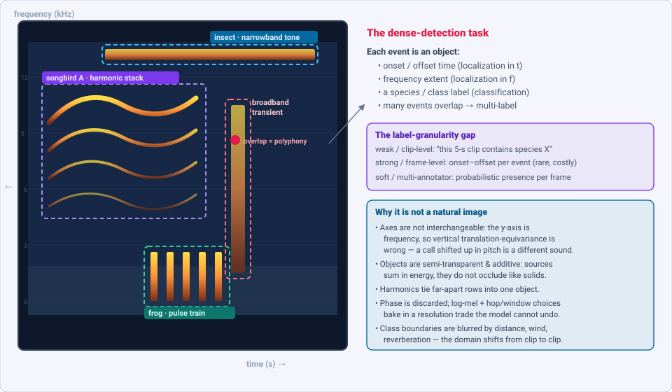
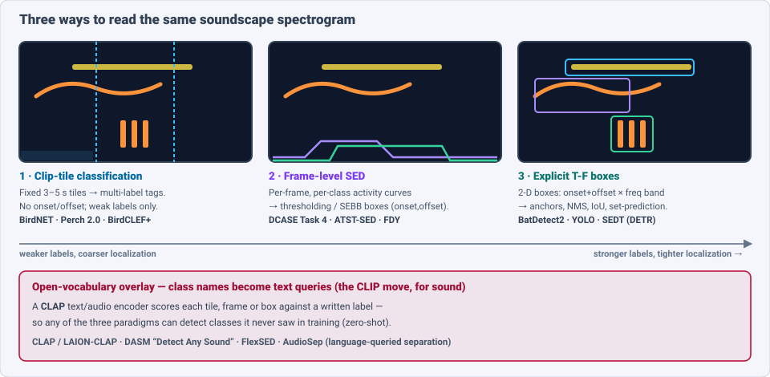
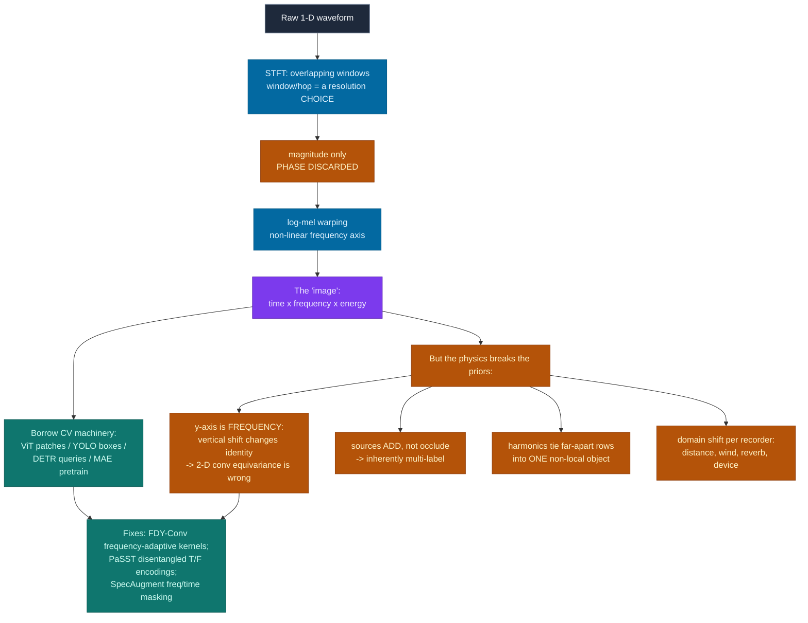

# Dense Object Detection & Classification — Recent Advances

*Compiled 2026-Aug-19 (America/Los_Angeles).*

Next installment in the running CV-updates log. Earlier entries on
`main`:
[Apr-30](../2026-Apr-30/2026-Apr-30_CV_updates.md),
[May-01](../2026-May-01/2026-May-01_CV_updates.md),
[May-02](../2026-May-02/2026-May-02_CV_updates.md),
[May-04](../2026-May-04/2026-May-04_CV_updates.md),
[May-05](../2026-May-05/2026-May-05_CV_updates.md),
[May-07](../2026-May-07/2026-May-07_CV_updates.md),
[May-08](../2026-May-08/2026-May-08_CV_updates.md),
[May-15](../2026-May-15/2026-May-15_CV_updates.md),
[May-16](../2026-May-16/2026-May-16_CV_updates.md),
[May-17](../2026-May-17/2026-May-17_CV_updates.md),
[Jun-09](../2026-Jun-09/2026-Jun-09_CV_updates.md),
[Jun-10](../2026-Jun-10/2026-Jun-10_CV_updates.md),
[Jun-12](../2026-Jun-12/2026-Jun-12_CV_updates.md),
[Jun-15](../2026-Jun-15/2026-Jun-15_CV_updates.md),
[Jun-16](../2026-Jun-16/2026-Jun-16_CV_updates.md),
[Jun-17](../2026-Jun-17/2026-Jun-17_CV_updates.md),
[Jun-19](../2026-Jun-19/2026-Jun-19_CV_updates.md),
[Jun-21](../2026-Jun-21/2026-Jun-21_CV_updates.md),
[Jun-22](../2026-Jun-22/2026-Jun-22_CV_updates.md),
[Jun-23](../2026-Jun-23/2026-Jun-23_CV_updates.md),
[Jun-24](../2026-Jun-24/2026-Jun-24_CV_updates.md),
[Jun-25](../2026-Jun-25/2026-Jun-25_CV_updates.md),
[Jun-27](../2026-Jun-27/2026-Jun-27_CV_updates.md),
[Jun-29](../2026-Jun-29/2026-Jun-29_CV_updates.md),
[Jun-30](../2026-Jun-30/2026-Jun-30_CV_updates.md),
[Jul-04](../2026-Jul-04/2026-Jul-04_CV_updates.md),
[Jul-07](../2026-Jul-07/2026-Jul-07_CV_updates.md),
[Jul-08](../2026-Jul-08/2026-Jul-08_CV_updates.md),
[Jul-10](../2026-Jul-10/2026-Jul-10_CV_updates.md),
[Jul-15](../2026-Jul-15/2026-Jul-15_CV_updates.md),
[Jul-17](../2026-Jul-17/2026-Jul-17_CV_updates.md),
[Jul-18](../2026-Jul-18/2026-Jul-18_CV_updates.md),
[Jul-21](../2026-Jul-21/2026-Jul-21_CV_updates.md),
[Jul-22](../2026-Jul-22/2026-Jul-22_CV_updates.md),
[Jul-24](../2026-Jul-24/2026-Jul-24_CV_updates.md),
[Jul-26](../2026-Jul-26/2026-Jul-26_CV_updates.md),
[Jul-27](../2026-Jul-27/2026-Jul-27_CV_updates.md),
[Jul-30](../2026-Jul-30/2026-Jul-30_CV_updates.md),
[Aug-01](../2026-Aug-01/2026-Aug-01_CV_updates.md),
[Aug-02](../2026-Aug-02/2026-Aug-02_CV_updates.md),
[Aug-04](../2026-Aug-04/2026-Aug-04_CV_updates.md),
[Aug-07](../2026-Aug-07/2026-Aug-07_CV_updates.md),
[Aug-10](../2026-Aug-10/2026-Aug-10_CV_updates.md),
[Aug-11](../2026-Aug-11/2026-Aug-11_CV_updates.md),
[Aug-13](../2026-Aug-13/2026-Aug-13_CV_updates.md),
[Aug-15](../2026-Aug-15/2026-Aug-15_CV_updates.md),
[Aug-16](../2026-Aug-16/2026-Aug-16_CV_updates.md),
[Aug-18](../2026-Aug-18/2026-Aug-18_CV_updates.md).

The tour so far has worked through *optical* scenes (natural images, aerial,
overhead, endoscopic, microscopy, document pages) and a long run of
non-optical **sensor** primitives — event cameras, thermal, radar, SAR,
ultrasound, hyperspectral, OCT, MRI, PET, GPR, terahertz, photoacoustic,
seismic, Wi-Fi. Every one of them ends up as a 2-D array a convolution or a
patch-transformer can chew on. This pass turns to the primitive that gets
there by the strangest route: **the audio spectrogram**. There is no camera
and no scene — a microphone records a 1-D pressure wave, a Short-Time Fourier
Transform slices it into overlapping windows, and the result is plotted as a
**time–frequency image**: time on the x-axis, frequency on the y-axis,
energy as brightness. Once that picture exists, the entire dense-detection
toolkit — ViT patching, YOLO boxes, DETR set-prediction, CLIP-style
open-vocabulary heads, masked-autoencoder pretraining — ports over almost
verbatim.

The reason it belongs in a *dense* detection log is that a real recording is
almost never one sound. A dawn-chorus soundscape, a coral reef at night, a
factory floor, a city street — each is a scene of **many overlapping events**
stacked in time and frequency: a bird's harmonic song crossing an insect's
narrowband whine crossing a frog's pulse train crossing a broadband door
slam. The task is to draw a box around each one — *when* it starts and ends,
*what* band it occupies — and name it, while the events **sum** rather than
occlude. That is object detection, on a canvas whose physics is subtly wrong
for the CV machinery we bring to it.

## Table of contents

1. [Why this pass: the spectrogram as its own primitive](#1--why-this-pass-the-spectrogram-as-its-own-primitive)
2. [The primitive — a soundscape is a dense scene of overlapping T-F objects](#2--the-primitive--a-soundscape-is-a-dense-scene-of-overlapping-tf-objects)
3. [The backbone lineage — ViT → AST → the spectrogram-as-image transformer](#3--the-backbone-lineage--vit--ast--the-spectrogram-as-image-transformer)
4. [Foundation models & the "transfer beats in-domain" law of bioacoustics](#4--foundation-models--the-transfer-beats-in-domain-law-of-bioacoustics)
5. [Polyphonic Sound Event Detection — the dense-detection core](#5--polyphonic-sound-event-detection--the-dense-detection-core)
6. [Literal boxes — object detection on the time–frequency plane](#6--literal-boxes--object-detection-on-the-timefrequency-plane)
7. [Open-vocabulary — CLAP and "detect any sound" as class-names-as-text](#7--open-vocabulary--clap-and-detect-any-sound-as-class-names-as-text)
8. [Applied: passive acoustic monitoring, BirdCLEF+ & marine mammals](#8--applied-passive-acoustic-monitoring-birdclef--marine-mammals)
9. [Why a spectrogram is *not* a natural image](#9--why-a-spectrogram-is-not-a-natural-image)
10. [Open problems / what to watch](#10--open-problems--what-to-watch)
11. [Sources](#11--sources)

## 1 · Why this pass: the spectrogram as its own primitive

Three properties make the spectrogram worth treating as a first-class
dense-vision modality rather than a footnote to audio classification:

- **The objects are made of physics, not paint.** A single bird call is a
  *harmonic stack* — a fundamental plus copies at 2×, 3×, 4× the frequency,
  tied together as one object even though they sit on far-apart rows. An
  insect stridulation is a razor-thin horizontal band; a frog is a vertical
  pulse train; an impulsive transient (a clap, a click) is a full-height
  vertical smear. The "shape language" of the scene is dictated by acoustics,
  and it maps onto detector priors (aspect ratios, anchor shapes) very
  differently from cars-and-pedestrians.
- **Everything overlaps and adds.** Two visual objects occlude — the nearer
  hides the farther. Two sounds **sum in energy**: where a bird and an insect
  cross, you see *both*, blended. Detection is therefore inherently
  multi-label and the "background" is a live, structured signal (wind, rain,
  reverberation), not empty space.
- **The label economy is brutal.** Strong, frame-level onset/offset labels
  are expensive and rare; the field runs mostly on **weak, clip-level tags**
  ("this 5-second clip contains a Cerulean Warbler") and, increasingly,
  **soft/multi-annotator** labels. This is the same weak-supervision problem
  that dominates medical and remote-sensing detection, in an acute form.

Add the deployment context — continuous, autonomous **passive acoustic
monitoring (PAM)** of ecosystems, machinery, and infrastructure produces
petabytes of audio nobody will ever listen to — and you have exactly the
setting dense detectors were built for: too much data, too few labels, tiny
objects, heavy overlap, distribution shift from recorder to recorder.

## 2 · The primitive — a soundscape is a dense scene of overlapping T-F objects

The figure lays out the mapping. A raw waveform is windowed by the STFT and
rendered as log-magnitude energy on a (usually mel-warped) frequency axis.
Each acoustic **event** becomes a region of the plane with an onset/offset in
time and an extent in frequency — a *box* — carrying a class label. Several
consequences follow immediately for anyone bringing a detector:

- **Localization is 2-D but asymmetric.** Time localization (onset/offset) is
  what downstream ecology and diagnostics actually need; frequency extent is
  informative but the axes are *not* interchangeable (see §9). Much of SED
  therefore predicts *1-D* boxes (time only, full-band), while the newer
  object-detection framings predict full *2-D* boxes.
- **Multi-label, not multi-class.** Because events sum, a frame can belong to
  several classes at once; the output is a set of per-class activity curves,
  not a single softmax.
- **The label-granularity ladder** — weak (clip) → strong (frame) → soft
  (probabilistic, multi-annotator) — decides which loss and which architecture
  are even applicable, and is the axis along which most 2024–2026 progress is
  organized.

## 3 · The backbone lineage — ViT → AST → the spectrogram-as-image transformer

The clearest evidence that a spectrogram *is* treated as an image is that the
backbone family is a direct fork of the vision-transformer lineage.

- **AST — Audio Spectrogram Transformer** (Gong, Chung & Glass, Interspeech
  2021) took the ViT template — split into overlapping 16×16 patches, add
  positional embeddings, feed a pure transformer — and applied it to log-mel
  spectrograms, even **initializing from an ImageNet-pretrained DeiT**. It hit
  0.485 mAP on AudioSet and 95.6% on ESC-50, retiring convolutional audio
  tagging almost overnight. The cross-modal weight transfer is the tell: the
  early layers a network learns on cats and cars are useful on spectrograms.
- **PaSST** (Koutini et al., Interspeech 2022) made it fast and, crucially,
  made it *respect the axes*: it disentangles time and frequency positional
  encodings and introduces **Patchout** — dropping whole patches, time-frames
  or frequency-bins during training (SpecAugment lifted into token space) —
  reaching 0.496 mAP AudioSet at ~4× the speed.
- **HTS-AT** (Chen et al., ICASSP 2022) went hierarchical (Swin-style windowed
  attention) with a token-semantic module that emits class **feature maps over
  time** — i.e., localization, not just a clip label — at 30M params. It later
  became the audio encoder inside CLAP (§7).
- The **self-supervised** branch — **SSAST** (masked patch modeling),
  **MAE-AST** and Meta's **Audio-MAE** (*Masked Autoencoders that Listen*,
  NeurIPS 2022, 80% patch masking + a locality-aware decoder) — is a
  line-for-line port of masked-image-modeling to the T-F plane, and supplies
  the pretraining recipe the bioacoustic models in §4 argue about.
- Most recently the **state-space** wave reached spectrograms: **Audio Mamba /
  AuM** (Erol et al., 2024) and **SSAMBA** (Shams et al., SLT 2024) replace
  quadratic attention with linear bidirectional SSMs over spectrogram patches,
  matching AST while scaling to minute-long clips where AST runs out of
  memory — the same efficiency pressure that pushed vision toward Mamba.

## 4 · Foundation models & the "transfer beats in-domain" law of bioacoustics

The most striking result in spectrogram land — and the one with the clearest
lesson for other dense-detection modalities — is that **a big supervised bird
classifier is the best general-purpose feature extractor for almost any
acoustic scene**, including scenes that contain no birds.

- **Perch** (Ghani, Denton, Kahl & Klinck, *Scientific Reports* 2023) trained
  an EfficientNet on ~10k species of Xeno-Canto birdsong and then threw away
  the classifier: its penultimate **embeddings** transfer, few-shot, to new
  tasks and *beat* general-audio self-supervised models (AudioMAE, YAMNet,
  VGGish, PSLA). "Bird-trained features generalize" became the field's
  organizing empirical fact.
- **Perch 2.0** (Google DeepMind, *"The Bittern Lesson for Bioacoustics,"*
  Aug 2025) pushed this to **~14,500 species across birds, mammals, amphibians
  and insects (~1.5M recordings)**, trained with self-distillation, a
  prototype-learning classifier and a novel **source-prediction** objective —
  deliberately *simple, large, supervised*. It is SOTA on **both BirdSet and
  BEANS**, and, remarkably, its embeddings **beat specialized marine models on
  underwater/cetacean transfer tasks despite ~zero marine audio in training**
  (Burns et al., Dec 2025, benchmarked on DCLDE orca-ecotype data). The
  "bittern lesson" — the audio echo of Sutton's *bitter lesson* — is that
  scale-plus-supervision beats clever in-domain SSL recipes.
- **SurfPerch** (Williams et al., 2024/2025) adapts Perch to coral-reef audio
  with a tiny **ReefSet** (~2% the size of the bird libraries) and finds that
  **mixing unrelated domains** (bird + reef + generic audio) in pretraining
  gives the best transfer (AUC-ROC 0.933).
- **BirdNET** (Kahl et al., 2021) remains the *deployed* baseline — an
  EfficientNet-B0-class CNN over 3-second clips, recognizing thousands of
  species — and the reference embedding extractor in field ecology.

The counter-current is **in-domain masked-autoencoder SSL**, which wins *only
when it is pretrained in-domain*: **Bird-MAE** (Rauch et al., 2025) shows that
an MAE pretrained on **BirdSet** (not AudioSet) beats Audio-MAE on
fine-grained birdsong and gives strong few-shot results via prototypical
probing — while a generic AudioSet MAE underperforms. And the field is
sprouting **audio–language** foundation models that mirror CLIP/VLM trends
elsewhere in this log: **BioLingual** (Robinson et al., ICASSP 2024), a
CLAP-style model on >1M audio–caption pairs (~25k species) reaching **68.9%
zero-shot top-1** across 1,143 species; and **NatureLM-audio** (Earth Species
Project, ICLR 2025) — **BEATs encoder + Q-Former + Llama-3.1-8B** — the first
*generative, promptable* bioacoustic model, doing species ID, detection,
captioning, call-type and individual-ID, and generalizing to unseen taxa on
the new BEANS-Zero benchmark. The two standard yardsticks behind all these
claims are **BEANS** (12 datasets, classification + detection across taxa) and
**BirdSet** (~520k recordings, ~10k species, eight strongly-labeled soundscape
test sets built to measure the focal→soundscape domain shift).

## 5 · Polyphonic Sound Event Detection — the dense-detection core

Sound Event Detection (SED) is the task that most directly mirrors dense
object detection: given a spectrogram, output, for **every overlapping event**,
its class and its onset/offset. The community's proving ground is the annual
**DCASE Challenge**, and its trajectory tells the story. Before diving in, it
helps to see how SED sits between the two neighboring paradigms — coarse
clip-tile classification and explicit boxes — over the very same soundscape:

- **The task and its data.** DCASE 2024 **Task 4** ("SED with a Heterogeneous
  Training Dataset and Potentially Missing Labels") trains one model jointly
  on **DESED** (strong, timestamped labels) and **MAESTRO Real** (1-second
  **soft**, multi-annotator labels, 17 classes) — the essence of the label
  economy from §1: mixed granularity, disjoint label sets, missing labels. The
  long-standing baseline is a **CRNN trained with mean-teacher** semi-supervised
  consistency on the mostly-unlabeled DESED pool.
- **The 2024→2025 pivot.** Tellingly, DCASE **2025** did *not* re-run the
  soft-label SED task standalone; the frontier energy moved to **Task 4 "Spatial
  Semantic Segmentation of Sound Scenes" (S5)** — jointly detect, **separate**
  and label sources from multichannel audio (18 target classes, 94 non-target)
  — and to **stereo SELD** (below). Dense SED is being absorbed into
  separation-coupled and spatial formulations.
- **The architectural shift that mattered: pretrained-transformer embeddings
  feeding SED heads.** The CNN/CRNN era gave way to **frozen or fine-tuned
  self-supervised transformers**. **BEATs** (Microsoft, ICML 2023 — acoustic
  tokenizer + masked-label SSL, 50.6% mAP AudioSet) became the default encoder;
  **ATST-Frame** (Li et al., TASLP 2024) provides *frame-level* self-supervised
  embeddings purpose-built for SED, and **ATST-SED** (Shao et al., ICASSP 2024)
  fine-tunes it to a reference **PSDS1/PSDS2 = 0.587 / 0.812** on DESED. JKU
  Linz's **multi-stage fine-tuning** recipes (Schmid et al., 2024) topped
  DCASE 2024 Task 4, and their **PretrainedSED** release (ICASSP 2025) ships
  frame-level AudioSet-pretrained checkpoints (ATST, BEATs, fPaSST) as drop-in
  SED backbones.
- **The CNN counter-line respects the frequency axis.** **Frequency Dynamic
  Convolution (FDY-Conv / FDY-SED)** (Nam et al., Interspeech 2022) replaces
  frequency-shared kernels with frequency-adaptive ones — removing the
  physically-wrong assumption that a pattern means the same thing at every
  pitch — and its multi-dilated successor (MDFD, 2024) is a CNN-side SOTA on
  DESED. This is the single most important "spectrograms aren't images" fix
  (see §9).
- **Post-processing became a first-class object — and it is literally a
  bounding box.** **Sound Event Bounding Boxes (SEBBs)** (Ebbers et al.,
  Interspeech 2024) represent each detection as a **1-D box (onset, offset,
  class, confidence)** and *decouple duration from confidence*, so a single
  threshold no longer distorts the boundaries — raising DCASE-2023-SOTA PSDS1
  from **0.644 to 0.703** and giving adopters ~+4 pp on average. The companion
  **piPSDS** metric (Ebbers et al., 2023) evaluates SED scores *independent of
  the post-processing choice*, which is exactly the "detector vs. NMS" split
  familiar from CV.

The scoring vocabulary is worth internalizing because it is the acoustic
analogue of mAP@IoU: **PSDS1** rewards tight temporal localization (the "dense
localization" metric), **PSDS2** rewards correct classification with loose
localization, and **event-based F1** uses a 200 ms onset collar — an IoU-like
tolerance on the time axis.

**SELD — adding *where* to *what* and *when*.** DCASE **Task 3** (Sound Event
Localization and Detection) predicts class + direction-of-arrival + distance,
via ACCDOA-style regression; 2024 added an **audio-visual** track and source
**distance estimation**, and 2025 moved to **stereo** SELD in real video
content with **onscreen/offscreen** classification. Architectures such as
**CST-Former** (channel–spectro–temporal attention) and **SELD-Mamba**
carry the backbone trends of §3 into the spatial setting.

## 6 · Literal boxes — object detection on the time–frequency plane

Beyond frame-level SED, a distinct line takes the analogy at face value and
draws **actual 2-D boxes** on the spectrogram with standard detectors.

- **DETR on audio.** **SEDT** (Sound Event Detection Transformer) ports DETR to
  audio: a 1-D-DETR with an audio-query branch predicts a *set* of events
  (class + normalized center/duration) with bipartite matching — set-prediction
  SED, no frame thresholding.
- **YOLO / Faster-R-CNN on the T-F plane.** For bird calls, recent work
  (2026) trains **YOLO11** to localize vocalizations in *both* time and
  frequency, introducing an **Intersection-over-Minimum (IoMin)** matching
  metric for the fuzzy boundaries of acoustic objects, and the BirdNET team's
  **BirdBox** tool does the same with full-height frequency boxes.
  **BatDetect2** (Mac Aodha et al.) is the cleanest exemplar of the whole
  primitive: a **U-Net with mid-network self-attention that emits a per-call
  bounding box + species** over the spectrogram, hitting **mAP 0.88 on 17 UK
  bat species**. In the marine world, **WhaleMoanDetector** (Faster-R-CNN)
  boxes blue/fin-whale moans and multi-species detectors box dolphin clicks,
  buzzes and whistles as T-F regions. The same recipe even localizes
  **machinery faults**: a 2025 system runs YOLOv11 over CWT scalograms to box
  bearing-fault transients at mAP@0.5 ≈ 0.99.

The value of the explicit-box framing is that it inherits three decades of CV
detection machinery — anchors, NMS, IoU losses, FPNs, set prediction — and,
via SEBBs, even reframes SED's post-processing as detection post-processing.

## 7 · Open-vocabulary — CLAP and "detect any sound" as class-names-as-text

The open-vocabulary turn that reshaped image detection (CLIP → GLIP →
open-vocab DETR, covered in earlier entries) has an exact audio mirror.

- **CLAP — Contrastive Language–Audio Pretraining** is CLIP for sound:
  Microsoft's **MS-CLAP** (ICASSP 2023) and **LAION-CLAP** (HTS-AT audio
  encoder + RoBERTa text encoder; releases **LAION-Audio-630K**) learn a shared
  audio–text space, enabling **zero-shot classification by writing class names
  as text**. This is the backbone the bioacoustic audio–language models (§4)
  build on.
- **From tags to dense open-vocab detection.** **DASM ("Detect Any Sound")**
  (ACM MM 2025) casts SED as **frame-level retrieval** against text *or* audio
  query vectors, with a dual-stream decoder decoupling recognition from
  localization — **+7.8 PSDS over CLAP-based open-vocab baselines** and a
  **zero-shot DESED PSDS1 of 42.2** that beats a supervised CRNN. **FlexSED**
  and **open-vocabulary SELD** extend the idea to flexible label sets and to
  the spatial task.
- **Language-queried separation as detection's twin.** **AudioSep** ("Separate
  Anything You Describe") and **CLAPSep** predict T-F masks for a
  natural-language-described source — the audio analogue of open-vocabulary
  *segmentation* — and text-queried SED-via-separation pipelines close the loop
  back to detection.

## 8 · Applied: passive acoustic monitoring, BirdCLEF+ & marine mammals

The deployment reality is where the dense-detection framing earns its keep, and
where the field's hardest open problem — **domain shift from clean *focal*
recordings to messy *soundscape* audio** — lives.

- **BirdCLEF+ (LifeCLEF/Kaggle)** is the annual bellwether. **BirdCLEF+ 2025**
  broke out of birds-only into **multi-taxa** (birds + amphibians + mammals +
  insects), **206 classes** in Colombian **El Silencio** soundscapes, training
  on ~28–38k **weakly-labeled focal** clips (Xeno-Canto/iNaturalist) and testing
  on **705 one-minute soundscapes** scored by macro **ROC-AUC**. The winning
  recipe crystallized the field's playbook: **cosine-embedding distillation from
  Perch 2.0**, **noisy-student pseudo-labeling / self-training**, and
  EfficientNet-B0/B1 CNNs on mel-spectrograms, ensembled to fight the extreme
  class imbalance and domain gap (1st ≈ 0.930 ROC-AUC). The 2023 (Kenya, 264
  species) and 2024 (Western Ghats, 182 species) editions established the
  focal→soundscape transfer problem the 2025 methods are tuned for.
- **Marine mammals.** The lineage runs from Google + NOAA's **humpback-whale
  CNN** (187,000 hours across 13 North-Pacific sites; AP 0.97 / AUC 0.992)
  through the **Google Multispecies Whale Model** to Perch-2.0-as-marine-encoder.
  The **DCLDE** challenge (Detection, Classification, Localization, Density
  Estimation) now ships its largest corpus yet — an orca-ecotype set of
  **>225,000 bounding-box annotations across 23 sites (1.6 TB)** — and real-time
  edge detectors for the endangered **North Atlantic right whale** are moving to
  buoy-based deployment.
- **Beyond birds and whales.** **BatDetect2** (bat echolocation, §6),
  **HawkEars** (a *regional* CNN for 314 birds + 13 amphibians that beats global
  Perch/BirdNET ~2× on recall at P=0.9 — arguing regional > global), and
  **AnuraSet** (42 Neotropical frog species, dense choruses) round out the taxa.
- **The tooling shift: embedding search + active learning.** Because labels are
  the bottleneck, deployment has moved to **vector search over precomputed
  foundation embeddings**. **"The Search for Squawk: Agile Modeling in
  Bioacoustics"** (Google/QUT, 2025) builds a novel-class recognizer in **under
  an hour** via active learning over Perch/SurfPerch embeddings, and **A2O
  Search** indexes **>2 PB** of the Australian Acoustic Observatory's continental
  audio for similarity search. This is the practical answer to petabyte-scale
  dense detection: don't label everything — embed everything, then search.

## 9 · Why a spectrogram is *not* a natural image

The whole enterprise rests on a productive lie: that the T-F plane is an image.
It is worth being precise about where the lie leaks, because every leak is an
active research direction.

The four structural departures:

1. **The frequency axis is not translation-equivariant.** A 2-D convolution
   assumes a pattern means the same thing wherever it appears — true along
   time, **false along frequency**: the same shape shifted up in pitch is a
   *different* sound. This is why **FDY-Conv** (frequency-adaptive kernels) and
   **PaSST** (disentangled time/frequency positional encodings) exist, and why
   naive ImageNet transfer, while a great initializer, is not the end state.
2. **Objects add rather than occlude.** Overlapping sources sum in energy, so
   the scene is transparent and inherently **multi-label**; "background" (wind,
   rain, reverberation) is a structured, live signal, not empty space.
3. **Harmonic non-locality.** One object (a voiced call) is spread across a comb
   of far-apart rows; a patch- or box-based detector must integrate evidence
   that a natural-image object would never scatter that way.
4. **Representation choices are baked in and irreversible.** Phase is discarded;
   the window/hop length fixes a time-vs-frequency resolution trade (the STFT
   uncertainty principle) the model cannot undo; log-mel warping is a fixed
   non-linear re-gridding. And the class boundary itself drifts with distance,
   device and weather — the **domain shift** that dominates deployment (§8).

## 10 · Open problems / what to watch

- **Strong labels at scale remain the bottleneck.** The whole field runs on
  weak/soft labels; SEBB-style boxes and foundation-embedding active learning
  are the current escape hatches, but *cheap frame-level supervision* is
  unsolved.
- **Focal→soundscape domain shift** is the central deployment gap: models
  trained on clean single-source clips degrade on dense, low-SNR, multi-source
  field audio. Domain-invariant representation learning, adversarial training,
  mixup and distillation-from-foundation-models are the active mitigations.
- **Separation-coupled detection.** DCASE 2025's S5 signals a move from "detect
  events" to "detect, **separate** and label sources" — dense detection and
  source separation converging into one task.
- **Open-world / open-vocabulary sound.** DASM and 2026 "open-world SED" /
  "audio diarization with unknown classes" push toward detectors that name
  events they were never trained on — the audio frontier of open-vocab
  detection.
- **Frequency-faithful architectures.** FDY-Conv and disentangled-axis
  transformers are early; the "right" inductive bias for a plane whose two axes
  mean different things is not settled.
- **Efficiency for continuous, on-device PAM.** State-space models (Audio
  Mamba, SSAMBA, SELD-Mamba) target minute-to-hour context on edge recorders —
  the practical constraint for petabyte-scale monitoring.
- **Generative audio–language models as universal detectors.** NatureLM-audio
  points at a promptable "ask it anything about this recording" interface;
  whether generative models can match specialized dense detectors on tight
  localization is the open question.

## 11 · Sources

Grouped by section. Links are to arXiv abstracts, publisher pages, official
repos, project sites or competition pages. A handful of identifiers are recent
2025–2026 preprints; several arXiv IDs were confirmed only from search
snippets/listing pages because arXiv, Kaggle and some publisher hosts were
egress-blocked in the build environment — where an ID could not be
independently double-checked it is cited by title and venue as well, and none
were fabricated. Exact metric figures are quoted as reported in abstracts and
should be verified against the primary PDF before formal citation.

**Framing & prior entries (§1–2)**
- Prior CV-updates entries where spectrograms appear incidentally: [Aug-15](../2026-Aug-15/2026-Aug-15_CV_updates.md) (seismic spectrogram CNNs), [Aug-16](../2026-Aug-16/2026-Aug-16_CV_updates.md) (Wi-Fi Doppler/STFT spectrograms). This is the first entry to treat the audio spectrogram as the primitive.

**Backbone lineage — ViT → AST → spectrogram transformers (§3)**
- Dosovitskiy et al., *An Image is Worth 16×16 Words (ViT)*, ICLR 2021, arXiv:2010.11929 — https://arxiv.org/abs/2010.11929
- Gong, Chung & Glass, *AST: Audio Spectrogram Transformer*, Interspeech 2021, arXiv:2104.01778 — https://arxiv.org/abs/2104.01778
- Koutini et al., *Efficient Training of Audio Transformers with Patchout (PaSST)*, Interspeech 2022, arXiv:2110.05069 — https://arxiv.org/abs/2110.05069
- Chen et al., *HTS-AT: A Hierarchical Token-Semantic Audio Transformer*, ICASSP 2022, arXiv:2202.00874 — https://arxiv.org/abs/2202.00874
- Gong et al., *SSAST: Self-Supervised Audio Spectrogram Transformer*, AAAI 2022, arXiv:2110.09784 — https://arxiv.org/abs/2110.09784
- Baade, Peng & Harwath, *MAE-AST*, Interspeech 2022, arXiv:2203.16691 — https://arxiv.org/abs/2203.16691
- Huang et al., *Masked Autoencoders that Listen (Audio-MAE)*, NeurIPS 2022, arXiv:2207.06405 — https://arxiv.org/abs/2207.06405
- Erol et al., *Audio Mamba (AuM)*, IEEE SPL 2024, arXiv:2406.03344 — https://arxiv.org/abs/2406.03344
- Shams et al., *SSAMBA: Self-Supervised Audio Mamba*, IEEE SLT 2024, arXiv:2405.11831 — https://arxiv.org/abs/2405.11831 · code: https://github.com/SiavashShams/ssamba

**Foundation models & the transfer law (§4)**
- Ghani, Denton, Kahl & Klinck, *Global birdsong embeddings enable superior transfer learning (Perch)*, Sci. Rep. 2023, arXiv:2307.06292 — https://www.nature.com/articles/s41598-023-49989-z
- *Perch 2.0: The Bittern Lesson for Bioacoustics*, Google DeepMind, 2025, arXiv:2508.04665 — https://arxiv.org/abs/2508.04665 · model: https://www.kaggle.com/models/google/bird-vocalization-classifier
- Burns et al., *Perch 2.0 embeddings transfer to underwater tasks*, 2025, arXiv:2512.03219 — https://arxiv.org/abs/2512.03219
- Williams et al., *SurfPerch: leveraging reef, bird and unrelated sounds for marine transfer*, 2024, arXiv:2404.16436 — https://arxiv.org/abs/2404.16436 · Phil. Trans. R. Soc. B 380:20240280
- Kahl et al., *BirdNET*, Ecological Informatics 61:101236, 2021 — https://www.sciencedirect.com/science/article/pii/S1574954121000273 · tooling: https://github.com/birdnet-team/BirdNET-Analyzer
- Rauch et al., *Can Masked Autoencoders Also Listen to Birds? (Bird-MAE)*, 2025, arXiv:2504.12880 — https://arxiv.org/abs/2504.12880 · code: https://github.com/DBD-research-group/Bird-MAE
- Robinson et al., *BioLingual: Transferable Models for Bioacoustics with Human Language Supervision*, ICASSP 2024, arXiv:2308.04978 — https://arxiv.org/abs/2308.04978
- Robinson, Miron, Hagiwara & Pietquin, *NatureLM-audio: an Audio-Language Foundation Model for Bioacoustics*, ICLR 2025, arXiv:2411.07186 — https://arxiv.org/abs/2411.07186
- Hagiwara et al., *BEANS: The Benchmark of Animal Sounds*, 2022, arXiv:2210.12300 — https://arxiv.org/abs/2210.12300 · code: https://github.com/earthspecies/beans
- Rauch et al., *BirdSet: A Multi-Task Benchmark for Avian Bioacoustics*, ICLR 2025, arXiv:2403.10380 — https://arxiv.org/abs/2403.10380
- (SSL context) Chen et al., *BEATs*, ICML 2023, arXiv:2212.09058 — https://arxiv.org/abs/2212.09058 · Dinkel et al., *CED*, ICASSP 2024, arXiv:2308.11957 · Dinkel et al., *Dasheng*, Interspeech 2024, arXiv:2406.06992 · Hagiwara, *AVES*, ICASSP 2023, arXiv:2210.14493

**Polyphonic SED & SELD (§5)**
- Turpault et al., *SED in Domestic Environments with Weakly Labeled Data (DESED)*, DCASE Workshop 2019 — https://hal.science/hal-02160855
- Cornell, Ebbers, Serizel et al., *DCASE 2024 Task 4 (heterogeneous training, missing labels)*, MERL TR2024-146 — https://www.merl.com/publications/docs/TR2024-146.pdf
- *DCASE 2025 Task 4: Spatial Semantic Segmentation of Sound Scenes (S5)*, 2025, arXiv:2506.10676 — https://arxiv.org/abs/2506.10676
- Li, Shao & Li, *ATST-Frame: Self-Supervised Audio Teacher-Student Transformer*, IEEE/ACM TASLP 2024, arXiv:2306.04186 — https://arxiv.org/abs/2306.04186
- Shao, Li & Li, *ATST-SED: Fine-Tune the Pretrained ATST for SED*, ICASSP 2024, arXiv:2309.08153 — https://arxiv.org/abs/2309.08153 · code: https://github.com/Audio-WestlakeU/ATST-SED
- Schmid et al., *Effective Pre-Training of Audio Transformers for SED (PretrainedSED)*, ICASSP 2025, arXiv:2409.09546 — https://arxiv.org/abs/2409.09546 · code: https://github.com/fschmid56/PretrainedSED
- Schmid et al., *Multi-Stage Training of ASTs for SED* (DCASE 2024 Task 4 top system), arXiv:2408.00791 / 2407.12997 — https://arxiv.org/abs/2408.00791
- Nam et al., *Frequency Dynamic Convolution (FDY-SED)*, Interspeech 2022, arXiv:2203.15296 — https://arxiv.org/abs/2203.15296 · code: https://github.com/frednam93/FDY-SED · Multi-Dilated FDY, arXiv:2406.13312
- Ebbers, Germain, Wichern & Le Roux, *Sound Event Bounding Boxes (SEBBs)*, Interspeech 2024, arXiv:2406.04212 — https://arxiv.org/abs/2406.04212 · code: https://github.com/merlresearch/sebbs
- Ebbers, Serizel & Haeb-Umbach, *Post-Processing Independent Evaluation of SED (piPSDS)*, 2023, arXiv:2306.15440 — https://arxiv.org/abs/2306.15440 · tooling: https://github.com/fgnt/sed_scores_eval
- Bilen et al., *A Framework for the Robust Evaluation of SED (PSDS)*, ICASSP 2020, arXiv:1910.08440 — https://arxiv.org/abs/1910.08440
- *DCASE 2025 Task 3: Stereo SELD with Onscreen/Offscreen Classification*, 2025, arXiv:2507.12042 — https://arxiv.org/abs/2507.12042
- Shul et al., *CST-Former: Channel-Spectro-Temporal Transformer for SELD*, ICASSP 2024 / journal 2025, arXiv:2312.12821, arXiv:2504.12870 — https://arxiv.org/abs/2504.12870 · *SELD-Mamba*, arXiv:2408.05057

**Literal boxes on the T-F plane (§6)**
- Carion et al., *DETR: End-to-End Object Detection with Transformers*, ECCV 2020, arXiv:2005.12872 — https://arxiv.org/abs/2005.12872
- Ye et al., *Sound Event Detection Transformer (SEDT)* / hybrid for DCASE 2022 Task 4, arXiv:2210.09529 — https://arxiv.org/abs/2210.09529
- *Time-frequency localization of bird calls in dense soundscapes* (YOLO11 + IoMin), 2026, arXiv:2606.10407 — https://arxiv.org/abs/2606.10407 *(recent preprint; venue to verify)* · BirdNET-team **BirdBox**: https://github.com/birdnet-team/BirdBox
- Mac Aodha et al., *BatDetect2: Towards a General Approach for Bat Echolocation Detection and Classification*, bioRxiv 2022.12.14.520490 — https://www.biorxiv.org/content/10.1101/2022.12.14.520490v1 · code: https://github.com/macaodha/batdetect2
- Alksne, *WhaleMoanDetector* (Faster-R-CNN on spectrograms) — https://github.com/m1alksne/WhaleMoanDetector
- *YOLO-based bearing fault diagnosis with CWT time-frequency images*, 2025, arXiv:2509.03070 — https://arxiv.org/abs/2509.03070

**Open-vocabulary — CLAP & text-queried detection (§7)**
- Radford et al., *CLIP: Learning Transferable Visual Models from Natural Language Supervision*, ICML 2021, arXiv:2103.00020 — https://arxiv.org/abs/2103.00020
- Elizalde et al., *CLAP: Learning Audio Concepts from Natural Language Supervision (MS-CLAP)*, ICASSP 2023, arXiv:2206.04769 — https://arxiv.org/abs/2206.04769
- Wu et al., *Large-Scale Contrastive Language-Audio Pretraining (LAION-CLAP)*, ICASSP 2023, arXiv:2211.06687 — https://arxiv.org/abs/2211.06687 · code: https://github.com/LAION-AI/CLAP
- Cai et al., *DASM: Detect Any Sound — Open-Vocabulary SED with Multi-Modal Queries*, ACM MM 2025, arXiv:2507.16343 — https://arxiv.org/abs/2507.16343 *(recent preprint; venue to verify)*
- Liu et al., *AudioSep: Separate Anything You Describe*, IEEE TASLP 2024, arXiv:2308.05037 — https://arxiv.org/abs/2308.05037 · *CLAPSep*, arXiv:2402.17455

**Applied PAM, competitions & marine (§8)**
- *BirdCLEF+ 2025 (LifeCLEF/Kaggle)* — https://www.kaggle.com/competitions/birdclef-2025 · overview: https://www.imageclef.org/BirdCLEF2025 · working note *Distilling Spectrograms into Tokens*, arXiv:2507.08236 — https://arxiv.org/abs/2507.08236
- *BirdCLEF 2024* (Western Ghats) — https://www.kaggle.com/competitions/birdclef-2024 · *BirdCLEF 2023* 1st place code: https://github.com/VSydorskyy/BirdCLEF_2023_1st_place
- *A CNN for Automated Detection of Humpback Whale Song* (Google + NOAA PIFSC), Frontiers in Marine Science 2021 — https://www.frontiersin.org/articles/10.3389/fmars.2021.607321/full · https://research.google/pubs/pub50318
- *DCLDE* challenge — https://www.dclde.org/ · *A Public Dataset of Annotated Orcinus orca Acoustic Signals*, Scientific Data 2025 — https://www.nature.com/articles/s41597-025-05281-5 · code: https://github.com/JPalmerK/DCLDE_Dataset
- Huus et al., *HawkEars*, Ecological Informatics 2025 — https://www.sciencedirect.com/science/article/pii/S1574954125001311
- Cañas et al., *AnuraSet*, Scientific Data 2023 — https://www.nature.com/articles/s41597-023-02666-2
- *The Search for Squawk: Agile Modeling in Bioacoustics*, 2025, arXiv:2505.03071 — https://arxiv.org/abs/2505.03071 · *A2O Search*: https://search.acousticobservatory.org/ · write-up: https://developmentseed.org/projects/google-a2o-search/
- DeepMind bioacoustics program overview — https://deepmind.google/blog/how-ai-is-helping-advance-the-science-of-bioacoustics-to-save-endangered-species/
- (domain shift) *Domain-Invariant Representation Learning of Bird Sounds*, arXiv:2409.08589 · *Adversarial Training Improves Generalization Under Distribution Shifts in Bioacoustics*, arXiv:2507.13727

**Not a natural image (§9)**
- Park et al., *SpecAugment*, Interspeech 2019, arXiv:1904.08779 — https://arxiv.org/abs/1904.08779
- Nam et al., *FDY-Conv* (as §5) and *survey of Frequency Dynamic Convolutions for SED*, arXiv:2506.12785 — https://arxiv.org/abs/2506.12785
- PaSST disentangled time/frequency encodings — arXiv:2110.05069 (as §3)

