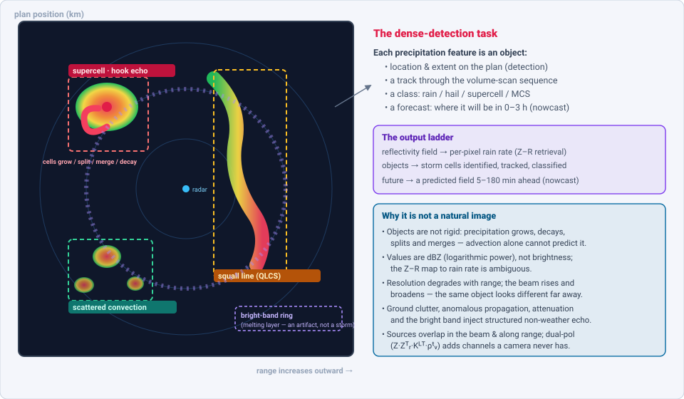
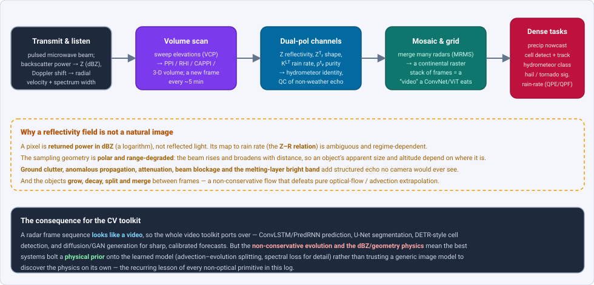
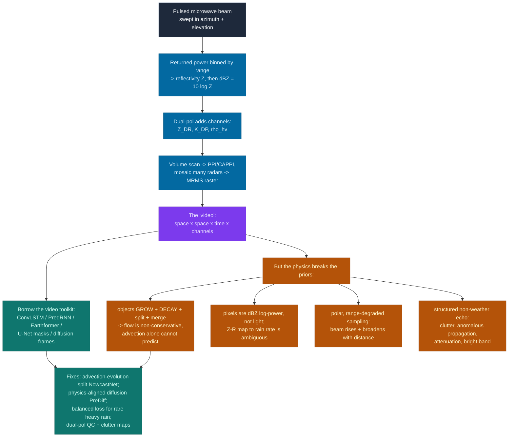

# Dense Object Detection & Classification — Recent Advances

*Compiled 2026-Aug-20 (America/Los_Angeles).*

Next installment in the running CV-updates log. Earlier entries on
`main`:
[Apr-30](../2026-Apr-30/2026-Apr-30_CV_updates.md),
[May-01](../2026-May-01/2026-May-01_CV_updates.md),
[May-02](../2026-May-02/2026-May-02_CV_updates.md),
[May-04](../2026-May-04/2026-May-04_CV_updates.md),
[May-05](../2026-May-05/2026-May-05_CV_updates.md),
[May-07](../2026-May-07/2026-May-07_CV_updates.md),
[May-08](../2026-May-08/2026-May-08_CV_updates.md),
[May-15](../2026-May-15/2026-May-15_CV_updates.md),
[May-16](../2026-May-16/2026-May-16_CV_updates.md),
[May-17](../2026-May-17/2026-May-17_CV_updates.md),
[Jun-09](../2026-Jun-09/2026-Jun-09_CV_updates.md),
[Jun-10](../2026-Jun-10/2026-Jun-10_CV_updates.md),
[Jun-12](../2026-Jun-12/2026-Jun-12_CV_updates.md),
[Jun-15](../2026-Jun-15/2026-Jun-15_CV_updates.md),
[Jun-16](../2026-Jun-16/2026-Jun-16_CV_updates.md),
[Jun-17](../2026-Jun-17/2026-Jun-17_CV_updates.md),
[Jun-19](../2026-Jun-19/2026-Jun-19_CV_updates.md),
[Jun-21](../2026-Jun-21/2026-Jun-21_CV_updates.md),
[Jun-22](../2026-Jun-22/2026-Jun-22_CV_updates.md),
[Jun-23](../2026-Jun-23/2026-Jun-23_CV_updates.md),
[Jun-24](../2026-Jun-24/2026-Jun-24_CV_updates.md),
[Jun-25](../2026-Jun-25/2026-Jun-25_CV_updates.md),
[Jun-27](../2026-Jun-27/2026-Jun-27_CV_updates.md),
[Jun-29](../2026-Jun-29/2026-Jun-29_CV_updates.md),
[Jun-30](../2026-Jun-30/2026-Jun-30_CV_updates.md),
[Jul-04](../2026-Jul-04/2026-Jul-04_CV_updates.md),
[Jul-07](../2026-Jul-07/2026-Jul-07_CV_updates.md),
[Jul-08](../2026-Jul-08/2026-Jul-08_CV_updates.md),
[Jul-10](../2026-Jul-10/2026-Jul-10_CV_updates.md),
[Jul-15](../2026-Jul-15/2026-Jul-15_CV_updates.md),
[Jul-17](../2026-Jul-17/2026-Jul-17_CV_updates.md),
[Jul-18](../2026-Jul-18/2026-Jul-18_CV_updates.md),
[Jul-21](../2026-Jul-21/2026-Jul-21_CV_updates.md),
[Jul-22](../2026-Jul-22/2026-Jul-22_CV_updates.md),
[Jul-24](../2026-Jul-24/2026-Jul-24_CV_updates.md),
[Jul-26](../2026-Jul-26/2026-Jul-26_CV_updates.md),
[Jul-27](../2026-Jul-27/2026-Jul-27_CV_updates.md),
[Jul-30](../2026-Jul-30/2026-Jul-30_CV_updates.md),
[Aug-01](../2026-Aug-01/2026-Aug-01_CV_updates.md),
[Aug-02](../2026-Aug-02/2026-Aug-02_CV_updates.md),
[Aug-04](../2026-Aug-04/2026-Aug-04_CV_updates.md),
[Aug-07](../2026-Aug-07/2026-Aug-07_CV_updates.md),
[Aug-10](../2026-Aug-10/2026-Aug-10_CV_updates.md),
[Aug-11](../2026-Aug-11/2026-Aug-11_CV_updates.md),
[Aug-13](../2026-Aug-13/2026-Aug-13_CV_updates.md),
[Aug-15](../2026-Aug-15/2026-Aug-15_CV_updates.md),
[Aug-16](../2026-Aug-16/2026-Aug-16_CV_updates.md),
[Aug-18](../2026-Aug-18/2026-Aug-18_CV_updates.md),
[Aug-19](../2026-Aug-19/2026-Aug-19_CV_updates.md).

The tour so far has worked through *optical* scenes (natural images, aerial,
overhead, endoscopic, microscopy, document pages) and a long run of
non-optical **sensor** primitives — event cameras, thermal, radar (automotive
4-D mmWave, SAR), ultrasound, hyperspectral, OCT, MRI, PET, GPR, terahertz,
photoacoustic, seismic, Wi-Fi, and the audio spectrogram. This pass turns to a
sensor that most people literally watch on the evening news without ever
thinking of it as a computer-vision problem: the **weather radar**. A ground
station sends out a pulsed microwave beam, sweeps it around the sky through a
stack of elevation angles, and listens for the power scattered back by
raindrops, snow, hail and insects. Bin that returned power by range and
azimuth, take its logarithm, paint it green-to-red, and you have the
**reflectivity field** — the familiar radar "picture" of a storm. Stack the
sweeps into a volume, and stitch dozens of radars into a continental mosaic,
and you have a live, national-scale **video** whose frames arrive every few
minutes forever.

The reason it belongs in a *dense* detection log is that a radar frame is
never one storm. A summer afternoon over the Plains is a scene of **many
precipitation objects at once** — an isolated rotating supercell with a
tell-tale hook, a 300-km squall line, a field of scattered pop-up cells, a
ring of bright-band contamination where snow melts into rain — each with a
location, an extent, a class, a track, and a *future*. The tasks are exactly
the ones this log keeps circling: **detect** each cell and draw its box,
**track** it across the volume-scan sequence, **classify** what it is made of
(rain? hail? a tornado?), and — the task with no clean analogue in ordinary
vision — **predict the next frame**: where will this field be, and how intense,
0–3 hours from now. That last task, *precipitation nowcasting*, is where the
field's center of gravity sits, and where the machinery of video prediction,
generative models and diffusion has arrived almost verbatim from the rest of
computer vision — colliding, productively, with atmospheric physics that the
image models do not know.

## Table of contents

1. [Why this pass: the reflectivity field as its own primitive](#1--why-this-pass-the-reflectivity-field-as-its-own-primitive)
2. [The primitive — a radar scene is a dense field of evolving precipitation objects](#2--the-primitive--a-radar-scene-is-a-dense-field-of-evolving-precipitation-objects)
3. [The backbone lineage — ConvLSTM → space-time transformers → diffusion](#3--the-backbone-lineage--convlstm--space-time-transformers--diffusion)
4. [Nowcasting — the dense-prediction core](#4--nowcasting--the-dense-prediction-core)
5. [Storm-cell detection, tracking & the object view](#5--storm-cell-detection-tracking--the-object-view)
6. [Classification — hydrometeors, hail & severe-weather signatures](#6--classification--hydrometeors-hail--severe-weather-signatures)
7. [Foundation & generalist weather models — where radar sits](#7--foundation--generalist-weather-models--where-radar-sits)
8. [Why a reflectivity field is *not* a natural image](#8--why-a-reflectivity-field-is-not-a-natural-image)
9. [Open problems / what to watch](#9--open-problems--what-to-watch)
10. [Sources](#10--sources)

## 1 · Why this pass: the reflectivity field as its own primitive

Three properties make the weather-radar field worth treating as a first-class
dense-vision modality rather than a footnote to remote sensing:

- **The objects are alive.** A car in a video is a rigid body that translates
  and rotates; a storm cell **grows, decays, splits and merges** between one
  scan and the next. A convective updraft can double a cell's reflectivity in
  ten minutes; a line can bow, a supercell can spawn and shed a hook. This is
  the single fact that separates radar from ordinary video: the flow field is
  **non-conservative**, so the optical-flow assumption at the heart of classical
  nowcasting — "advect the last frame forward" — is provably insufficient, and
  the best modern systems (NowcastNet, §4) build the growth/decay term in
  explicitly.
- **It is a live, national, forever stream.** Networks like the U.S. WSR-88D
  (NEXRAD), merged into the **Multi-Radar Multi-Sensor (MRMS)** mosaic, produce
  a fresh continental reflectivity raster every ~2 minutes, indefinitely. This
  is the same too-much-data-too-few-labels regime that has motivated
  dense-detection methods throughout this log — except the "label" you most
  want (what the sky will do next) *arrives on its own* a few minutes later,
  which makes radar an almost uniquely clean setting for **self-supervised**
  spatiotemporal learning.
- **The physics is legible but wrong for the toolkit.** A pixel is returned
  power in **dBZ**, a logarithm; its mapping to rain rate (the **Z–R relation**)
  is ambiguous and regime-dependent; the sampling geometry is polar and
  **range-degraded**; and the frame is shot through with structured
  non-meteorological echo — ground clutter, anomalous propagation, attenuation,
  the melting-layer bright band. Every one of these is a place where a generic
  image model's priors are subtly false (see §8), and each is an active research
  direction.

Add the stakes — nowcasts drive flash-flood warnings, aviation routing,
severe-storm and tornado alerts, and renewable-grid balancing — and you have
exactly the setting dense detectors were built for: a high-rate spatial stream,
tiny-to-huge objects, heavy overlap and evolution, and a hard real-time
deadline.

## 2 · The primitive — a radar scene is a dense field of evolving precipitation objects

The figure lays out the mapping. A pulsed beam is swept through azimuth and a
stack of elevation angles; returned power is binned by range and rendered as
log-reflectivity on a plan-position (PPI) display, and the sweeps are assembled
into a 3-D volume and mosaicked across radars. Each precipitation **feature**
becomes a region of the plane — a *box*, or better a mask — with an extent, a
track through the scan sequence, and a class. Several consequences follow
immediately for anyone bringing a detector:

- **The scene is dense and multi-scale.** A single national frame simultaneously
  contains sub-km pop-up showers and 500-km organized systems (a mesoscale
  convective system, a squall line, a hurricane's rainbands). The detector's
  anchor/scale priors have to span three orders of magnitude at once — the
  small-object and huge-object problems in the *same* image.
- **Localization is 3-D and time-extended.** What downstream users need is not
  one box but a **trajectory**: the cell's identity maintained across a
  volume-scan sequence, so growth and motion can be measured and extrapolated.
  Detection and tracking are inseparable here in a way they are not for a photo.
- **The label ladder** runs from *pixels* (per-pixel rain rate from a
  Z–R retrieval, or a QC mask separating weather from clutter), through
  *objects* (storm cells identified, tracked, and classified as rain / hail /
  supercell / MCS), to *the future* (a predicted field 5–180 minutes ahead).
  Most of the 2021–2026 progress is organized along the last rung — nowcasting —
  precisely because the supervision for it is free.

## 3 · The backbone lineage — ConvLSTM → space-time transformers → diffusion

The clearest evidence that a radar sequence *is* treated as video is that the
backbone family is a direct fork of the video-prediction lineage — and that
lineage was, famously, *invented on radar in the first place*. The signal chain
below shows how the "video" is formed, and why its physics resists the toolkit
it invites:

- **ConvLSTM** (Shi et al., NeurIPS 2015) was introduced **for precipitation
  nowcasting**: it replaces the fully-connected LSTM's matrix multiplies with
  convolutions in the input-to-state and state-to-state transitions, so a
  recurrent net can carry a spatial feature map through time. It beat the
  operational optical-flow nowcaster (ROVER) on Hong Kong radar and became the
  canonical spatiotemporal-sequence model across all of video prediction. The
  field's most-used backbone was born on this exact primitive.
- **TrajGRU** (Shi et al., NeurIPS 2017) added *location-variant* recurrence —
  learning a warping structure that behaves like a learned optical flow instead
  of a fixed convolution — and shipped the **HKO-7** benchmark with a
  balanced-MSE loss that penalizes missing rare heavy-rain pixels, the first
  serious attempt to fight the field's brutal class imbalance.
- **The PredRNN family** (Wang et al., NeurIPS 2017; PredRNN++ ICML 2018;
  journal PredRNN, TPAMI 2022) generalized the recurrent memory with a
  spatiotemporal LSTM carrying a second, zigzag memory flow across layers, and
  remains a standard radar-echo-extrapolation backbone.
- **Space-time transformers** arrived with **Earthformer** (Gao et al., NeurIPS
  2022), whose **cuboid attention** decomposes the space-time tensor into local
  cuboids with a few global vectors, cutting attention to near-linear cost and
  setting SOTA on the SEVIR radar benchmark — the ViT moment for radar.
- The **state-space / efficient-attention** and **diffusion** waves then hit
  radar exactly as they hit the rest of vision (§4): the generative turn
  (GAN → latent diffusion) is the current frontier, motivated by the same
  complaint that drove it in image synthesis — regression-trained models
  produce **blurry** forecasts that fade out precisely the extreme rain that
  matters.

## 4 · Nowcasting — the dense-prediction core

Precipitation nowcasting — predicting the reflectivity/rain field 0–6 hours
ahead — is the task that most directly stresses dense spatiotemporal
prediction, and its trajectory is a compressed replay of generative modeling in
vision. It helps to see the four paradigms as a ladder, each fixing the failure
of the last:

- **Rung 1 — Lagrangian extrapolation (the physics-free baseline).** Estimate a
  motion field by optical flow and advect the last frame forward, optionally
  with stochastic perturbations for an ensemble. **pySTEPS** (Pulkkinen et al.,
  GMD 2019) is the open, operational reference implementation and the comparator
  in essentially every paper below. It is skilful for ~30–60 min in stratiform
  rain and **fails on convection**, because it cannot represent growth or decay —
  only motion.
- **Rung 2 — deterministic deep learning (sharp gains, then blur).** The
  ConvLSTM/TrajGRU/PredRNN/Earthformer line (§3) learns motion *and* some
  growth/decay from data and beats extrapolation at short leads. Its
  characteristic failure is the flip side of its MSE/MAE training: to minimize
  average error under uncertainty it **hedges by blurring**, smearing out
  high-reflectivity cores and under-forecasting extremes at longer leads — the
  regression-to-the-mean pathology.
- **Rung 3 — generative (restore the sharpness, quantify the uncertainty).**
  DeepMind's **DGMR** (Ravuri et al., *Nature* 2021) cast nowcasting as a
  conditional **GAN**, producing spatiotemporally coherent, sharp,
  *probabilistic* nowcasts; in a blind trial, Met Office forecasters preferred
  it to a strong axial-attention model and to pySTEPS in **~88–89%** of cases.
  The **diffusion** generation then followed, trading GAN instability for
  stable, better-calibrated ensembles: **LDCast** (Leinonen et al., 2023, latent
  diffusion + Fourier-operator forecaster), **PreDiff** (Gao et al., NeurIPS
  2023, latent diffusion with an explicit *knowledge-alignment* step nudging
  each denoising toward a physical constraint), **DiffCast** (Yu et al., CVPR
  2024, a *global-motion-plus-stochastic-residual* decomposition that plugs onto
  any deterministic backbone), and **CasCast** (Gong et al., ICML 2024, a
  deterministic mesoscale predictor cascaded with a frame-guided diffusion
  transformer in latent space for the small scales).
- **Rung 4 — physics-conditioned generative (put the atmosphere back in).**
  **NowcastNet** (Zhang et al., *Nature* 2023) is the emblem of the whole
  primitive: it unifies a **differentiable advection–evolution decomposition** —
  a neural evolution network that predicts motion *and* intensity-change fields
  under a mass-continuity-style constraint — with a conditional-GAN generator,
  end-to-end. It is skilful to 3 h for light-to-extreme rain over 2048×2048 km
  and was ranked first by 62 meteorologists in **71%** of cases against the
  leading methods, including DGMR and pySTEPS. This is the radar instance of the
  lesson this log keeps rediscovering: for a non-optical primitive, **bolting the
  known physics onto the learned model beats asking a generic image model to
  rediscover it**.

Two orthogonal lines round out the picture. **Google's MetNet family** attacks
longer leads and sensor fusion rather than sharpness: MetNet (2020) reached 8 h
over CONUS by combining a spatial downsampler, ConvLSTM and axial attention;
MetNet-2 (*Nat. Commun.* 2022) pushed to 12 h and beat the HRRR physical model;
**MetNet-3** (2023) reached a full **24 h** and, tellingly for this log, learns
jointly from *dense* radar and *sparse* station observations — **densifying the
sparse sensor** into a full field, the same weak-supervision move seen in medical
and remote-sensing entries — and is deployed in Google's consumer weather
products. And a **transformer/foundation** line is emerging on top of the
generative one: **GPTCast** (2024) tokenizes radar fields with a VQ autoencoder
and runs GPT-style autoregressive generation, and a run of 2024–2026 latent- and
spectral-diffusion preprints (DiffCast, CasCast and successors) keep pushing
high-resolution extreme-rain skill. The scoring vocabulary to internalize is the
acoustic/medical analogue of mAP@IoU: **CSI** (Critical Success Index at a
reflectivity threshold — the detection F1 of nowcasting), **FSS** (Fractions
Skill Score, a neighborhood-tolerant CSI), and, for the ensembles, **CRPS** and
rank-histogram calibration.

## 5 · Storm-cell detection, tracking & the object view

Nowcasting predicts the whole field; the *object* view asks the detection
question directly — **which discrete storms are in this scene, where are they
going, and are they the same storm as last scan?** This is the task the field
solved by hand decades before deep learning, and the hand-built solutions are
exactly the object-detection-plus-tracking pipeline this log keeps meeting.

- **The classical object lineage is a detector-plus-tracker.** **TITAN**
  (Dixon & Wiener, *J. Atmos. Oceanic Technol.* 1993) defines a storm as a
  contiguous region of the volume exceeding a reflectivity *and* size threshold
  — a connected-components detector — then matches storms between successive
  scans by an optimization with explicit **merge/split** logic, and
  extrapolates them forward. **SCIT** (Johnson et al., *Weather and
  Forecasting* 1998), the algorithm that shipped operationally in the WSR-88D,
  is a centroid identifier-and-tracker that correctly identified 68% of >40 dBZ
  cells and 96% of ≥50 dBZ cells and tracked >90% of cells across scans. Read
  with modern eyes, these are hand-engineered region proposals + a Hungarian-style
  data-association tracker — the pre-deep-learning ancestor of the MOT stacks
  covered in earlier entries.
- **The deep-learning object view splits two ways.** One line keeps the *mask*
  framing — U-Net and 3-D convolutional networks segment and extrapolate cells
  as evolving regions (e.g., Google's U-Net radar nowcaster, Agrawal et al.
  2019, which beat optical flow; multi-channel 3-D-cube successive-convolution
  networks for convective-storm nowcasting) — and inherits the nowcasting
  verification metrics of §4. The other keeps the *object* framing — identify,
  classify and track discrete cells — and is where object-based verification
  (does the *cell* exist, roughly there, with the right intensity?) matters more
  than pixel error, because a sharp forecast displaced by one grid box is
  double-penalized by pixel loss but is operationally correct.
- **Benchmarks made the object view reproducible.** **SEVIR** (Veillette, Samsi
  & Mattioli, NeurIPS 2020) is the field's COCO-analogue: >10,000 storm events,
  each a 384×384 km, 4-hour sequence *spatiotemporally aligned across five
  sensors* — GOES-16 visible/IR channels, NEXRAD vertically-integrated-liquid
  radar mosaic, and GLM lightning — supporting nowcasting and synthetic-radar
  generation from one curated set. Alongside it, the older echo-extrapolation
  datasets (**HKO-7**, Shanghai, TAASRAD19, MeteoNet) and the tornado benchmark
  **TorNet** (§6) give the object and prediction tasks their leaderboards.

The through-line is the one from the MOT and video-detection entries:
detection and tracking are inseparable on radar, the "boxes" are evolving masks
rather than rigid rectangles, and honest evaluation has to score the *object*,
not just the pixel.

## 6 · Classification — hydrometeors, hail & severe-weather signatures

Classification on radar happens at two scales, and both were being done —
by hand, from image features — long before the deep-learning era, which makes
them a clean case study in what learning does and does not add.

- **Per-gate: hydrometeor classification (HCA) is hand-built semantic
  segmentation.** Dual-polarization gives every range gate a small vector —
  reflectivity Z, differential reflectivity Z_DR (drop shape/oblateness),
  specific differential phase K_DP (liquid-water content, immune to attenuation
  and miscalibration), and correlation coefficient ρ_hv (target uniformity) —
  and the operational **Hydrometeor Classification Algorithm** assigns each gate
  a class (rain, snow, graupel, hail, big drops, biological, ground clutter, …)
  by **fuzzy-logic membership functions**. The lineage runs Straka, Zrnić &
  Ryzhkov (2000) and the neuro-fuzzy Liu & Chandrasekar (2000) to the WSR-88D
  operational HCA of **Park et al.** (*Weather and Forecasting* 2009). This is
  pixel-wise classification with hand-designed features on a multi-channel image
  — and it is now being reproduced and extended by **CNNs on the dual-pol
  channel stack** (e.g., Oak Ridge's convolutional HCA, Lu et al.), the exact
  hand-crafted-to-learned transition this log has traced in every other
  modality. The fuzzy-logic incumbent is strong precisely because its "features"
  encode real scattering physics.
- **Per-object: severe-weather signatures are learnable image patterns.** The
  forecaster's visual vocabulary is explicitly morphological — the **hook echo**
  and **bounded weak-echo region** of a supercell, the **bow echo** of a
  damaging wind event, the **three-body scatter spike** of large hail, and, in
  dual-pol, the **tornado debris signature** (a ρ_hv dropout co-located with
  rotation, i.e. lofted debris). These are textbook cases of class-defining
  shape/texture features, which is why CNNs took to them so readily.
- **Hail.** The physical proxy **MESH** (Maximum Estimated Size of Hail) from
  vertically integrated reflectivity is the operational baseline; machine
  learning moved to storm-based probabilistic hail *forecasting* (Gagne et al.,
  *Weather and Forecasting* 2017, ML on convection-allowing ensembles) and to
  radar-plus-environment **hail-damage** estimation (Copernicus AMT 2024), with
  recent diffusion models even doing probabilistic hail *nowcasting* by radar-echo
  extrapolation.
- **Tornado & mesocyclone detection is where the object view got a benchmark.**
  **Lagerquist et al.** (*Monthly Weather Review* 2020) trained 3-D multiscale
  CNNs on storm-centered radar plus a proximity sounding for next-hour tornado
  prediction, hitting AUC >0.9 — while explainable-AI analysis exposed a real
  weakness on **QLCS** (squall-line) tornadoes, the hard, low-signal class.
  **Xie et al.** (*Geophys. Res. Lett.* 2024) added multi-task learning for
  tornado identification from Doppler data. The step-change for reproducibility
  is **TorNet** (Veillette, Kurdzo et al., *Artificial Intelligence for the
  Earth Systems* 2024; arXiv:2401.16437): a public benchmark of full-resolution,
  polarimetric, Level-II WSR-88D samples over 10 years of storm reports, with
  six radar products per sample and released baseline models — turning tornado
  detection from a proprietary, un-benchmarkable task into an open one, exactly
  as ImageNet and COCO did for their fields.
- **Detecting a storm before it exists.** **Convective initiation** nowcasting
  predicts *where a cell will first form* from geostationary satellite (and
  radar) cues; the object-based, physically-explainable GOES-16 deep model
  (*Artificial Intelligence for the Earth Systems* 2024; arXiv:2310.16015)
  beats a logistic baseline out to 1 h, mostly by cutting the false-alarm ratio
  — detection pushed *before* the object is visible, the ultimate small-object
  problem.

## 7 · Foundation & generalist weather models — where radar sits

The most-hyped machine-learning weather story of the last three years is the
rise of **data-driven global forecasting** — and it is important to place radar
correctly against it, because the two live at opposite ends of the same
timeline and are only now meeting.

- **The global foundation models do not use radar.** **FourCastNet** (Pathak
  et al. 2022, adaptive Fourier neural operators), **Pangu-Weather** (Bi et al.,
  *Nature* 2023, 3-D transformer), **GraphCast** (Lam et al., *Science* 2023,
  mesh GNN, beating the ECMWF physical model on ~90% of targets), **GenCast**
  (Price et al., *Nature* 2025, a diffusion *ensemble* beating ECMWF-ENS on
  ~97% of targets), **Aurora** (Bodnar et al., *Nature* 2025, a 1.3-B-parameter
  Earth-system foundation model) and NASA/IBM's **Prithvi WxC** (2024) are all
  trained on **reanalysis** (ERA5, MERRA-2) — gridded, physically-balanced
  model-analysis fields — and forecast the synoptic state **days** ahead. They
  are spectacular, and they are *not* radar nowcasters: their inputs are not
  observations at all, and their resolution and lead time are the wrong scale
  for a thunderstorm.
- **The radar-native models are the nowcasting family.** MetNet-3 (§4) is the
  clearest bridge: it trains on **direct observations including the MRMS radar
  mosaic**, and its whole contribution is *densifying sparse station data* into
  a full field — a foundation-model move applied to observations rather than
  reanalysis. DGMR and NowcastNet are radar-native by construction. The
  substrate they stand on is **MRMS** (Zhang et al., *BAMS* 2016) — ~180 U.S.
  radars plus gauges and models merged into a seamless national grid at ~1 km,
  33 vertical levels, 2-minute updates — the closest thing radar has to a
  gigapixel canvas, and the natural pretraining corpus for a *radar* foundation
  model that does not yet really exist.
- **The seam is closing from both ends.** Short-range radar nowcasting reaches
  up toward ~6 h; data-driven NWP reaches down toward ~12 h; the 0–12 h window
  is where they now overlap, and hybrids have started to appear — e.g. coupling
  Prithvi-WxC's learned physical evolution with NowcastNet's generative detail.
  A single model skilful from minutes to days, blending live observations with
  forecast physics, is the visible horizon (§9).
- **The open-vocabulary / SAM gap is real and worth naming.** The promptable and
  open-vocabulary segmentation wave that reshaped optical vision — SAM, SAM 2's
  video memory, SAM 3's concept prompts, and the remote-sensing open-vocab line
  (RemoteSAM, SegEarth-OV) — has **not** meaningfully transferred to radar
  reflectivity. There is, as of this writing, no established "segment any storm
  from a text prompt" model. The reason is precisely the §8 physics: the field
  is multi-channel and non-RGB, its sampling geometry is non-stationary, and its
  objects are non-conservative — so a model pretrained on natural-image (or even
  optical-satellite) semantics has little to grab onto. That gap is one of the
  clearer open opportunities in the whole log.

## 8 · Why a reflectivity field is *not* a natural image

The whole enterprise rests on the same productive lie that ran through the
spectrogram, SAR and seismic entries: that the sensor field is an image. It is
worth being precise about where the lie leaks, because every leak is an active
research direction.

The four structural departures:

1. **The objects are non-conservative.** Ordinary video motion is (mostly)
   mass-preserving translation; precipitation is *created and destroyed* in
   place as air rises and condenses or descends and evaporates. Pure
   optical-flow extrapolation therefore has a hard skill ceiling on exactly the
   convective storms that matter, which is why NowcastNet separates an evolution
   field from an advection field and why deterministic regressors blur.
2. **Pixels are dBZ, not brightness.** Reflectivity is returned power on a
   logarithmic scale; converting it to the quantity people care about (rain
   rate) runs through the **Z–R relation**, which is empirical and varies with
   drop-size distribution, so the same dBZ can mean very different rainfall.
   Losses and metrics live in a warped, heavy-tailed space, not a linear one.
3. **The sampling grid is polar and range-degraded.** The beam **rises and
   broadens** with distance, so resolution falls off with range, the radar sees
   higher in the atmosphere far away than near, and a "cone of silence" sits
   overhead. The same physical object looks different depending on where in the
   domain it is — a translation-*in*equivariance the opposite of a camera's.
4. **The background is a live, structured non-signal.** Ground clutter,
   anomalous propagation, partial beam blockage, attenuation (severe at C/X
   band), and the melting-layer **bright band** all inject echo that looks like
   weather and is not. Quality control — increasingly with dual-pol ρ_hv and
   learned clutter maps — is a first-class task, the radar analogue of the
   "background is not empty" theme from the spectrogram entry.

## 9 · Open problems / what to watch

- **Extremes are the point and the weak spot.** The heaviest rain, largest
  hail and rotating storms are the rarest pixels and the ones nowcasts most
  under-forecast; balanced losses, generative sharpness and physics constraints
  all attack this, but calibrated skill on the tail remains the central open
  metric.
- **Verification beyond pixel error.** CSI/FSS/CRPS reward different things and
  can disagree; "double-penalty" issues punish a sharp forecast that is slightly
  displaced worse than a blurry one. Object- and event-based verification (does
  the *cell* exist, with the right intensity, roughly there?) is the honest
  target and is still maturing.
- **Physics-conditioned generation.** NowcastNet's advection–evolution split and
  PreDiff's knowledge alignment are early; how much atmospheric prior to bake in
  versus learn — and how to do it without sacrificing the generative sharpness —
  is unsettled.
- **Fusion and the sparse/dense gap.** MetNet-3's densification of station data,
  and satellite+radar convective-initiation models, point at multi-sensor
  nowcasting; getting radar, satellite, lightning, surface stations and NWP into
  one dense predictor is wide open.
- **The nowcasting-to-NWP seam.** Data-driven medium-range models (GraphCast,
  GenCast, Aurora) and short-range radar nowcasters are converging on the 0–12 h
  window from opposite ends; a single model skilful from minutes to days —
  blending observations and forecast physics — is the visible horizon.
- **Foundation models for radar.** Tokenized/autoregressive (GPTCast) and
  self-supervised pretraining on the free, forever radar stream are nascent;
  whether a single pretrained radar backbone can serve nowcasting, detection,
  classification and QC at once is the open bet.
- **Trust, deployment and rare-event operations.** Warnings are life-safety
  decisions; forecaster-in-the-loop evaluation (as DGMR and NowcastNet both ran),
  calibrated uncertainty, and robustness to radar outages and domain shift across
  networks are what stand between a good benchmark number and an operational
  system.

## 10 · Sources

Grouped by section. Links are to arXiv abstracts, publisher pages, official
repos, project sites or competition pages. Several identifiers are recent
2024–2026 preprints; arXiv, some publisher hosts and Kaggle were intermittently
egress-blocked in the build environment, so a handful of finer details (exact
peer-reviewed venue, full author lists) were confirmed only from listing
pages/snippets — where an ID could not be independently double-checked it is
cited by title and venue as well, and none were fabricated. Exact metric figures
are quoted as reported in abstracts and should be verified against the primary
PDF before formal citation.

**Framing & the backbone lineage (§1–3)**
- Shi et al., *Convolutional LSTM Network: A Machine Learning Approach for Precipitation Nowcasting (ConvLSTM)*, NeurIPS 2015, arXiv:1506.04214 — https://arxiv.org/abs/1506.04214
- Shi et al., *Deep Learning for Precipitation Nowcasting: A Benchmark and A New Model (TrajGRU + HKO-7)*, NeurIPS 2017, arXiv:1706.03458 — https://arxiv.org/abs/1706.03458
- Wang et al., *PredRNN: Recurrent Neural Networks for Predictive Learning using Spatiotemporal LSTMs*, NeurIPS 2017; journal version *PredRNN*, IEEE TPAMI 2022, arXiv:2103.09504 — https://arxiv.org/abs/2103.09504 · *PredRNN++*, ICML 2018, arXiv:1804.06300 — https://arxiv.org/abs/1804.06300
- Gao et al., *Earthformer: Exploring Space-Time Transformers for Earth System Forecasting*, NeurIPS 2022, arXiv:2207.05833 — https://arxiv.org/abs/2207.05833 · code: https://github.com/amazon-science/earth-forecasting-transformer
- (survey) *Deep learning for precipitation nowcasting: A survey from the perspective of time series forecasting*, 2024, arXiv:2406.04867 — https://arxiv.org/abs/2406.04867 · living list: https://github.com/tyui592/awesome-precipitation-nowcasting

**Nowcasting — extrapolation, generative & physics-conditioned (§4)**
- Pulkkinen et al., *Pysteps: an open-source Python library for probabilistic precipitation nowcasting (v1.0)*, Geosci. Model Dev. 12:4185–4219, 2019, doi:10.5194/gmd-12-4185-2019 — https://gmd.copernicus.org/articles/12/4185/2019/ · project: https://pysteps.github.io/
- Ravuri, Lenc, Willson, Kangin et al., *Skilful precipitation nowcasting using deep generative models of radar (DGMR)*, Nature 597:672–677, 2021, doi:10.1038/s41586-021-03854-z — https://www.nature.com/articles/s41586-021-03854-z · arXiv:2104.00954 — https://arxiv.org/abs/2104.00954
- Zhang, Long, Chen, Xing, Jin, Jordan, Wang, *Skilful nowcasting of extreme precipitation with NowcastNet*, Nature 619:526–532, 2023, doi:10.1038/s41586-023-06184-4 — https://www.nature.com/articles/s41586-023-06184-4
- Sønderby, Espeholt et al., *MetNet: A Neural Weather Model for Precipitation Forecasting*, 2020, arXiv:2003.12140 — https://arxiv.org/abs/2003.12140
- Espeholt, Agrawal, Sønderby et al., *Deep learning for twelve hour precipitation forecasts (MetNet-2)*, Nature Communications 13:5145, 2022, doi:10.1038/s41467-022-32483-x — https://www.nature.com/articles/s41467-022-32483-x
- Andrychowicz, Espeholt, Li, Merchant, Merose, Zyda, Agrawal, Kalchbrenner et al., *Deep Learning for Day Forecasts from Sparse Observations (MetNet-3)*, 2023, arXiv:2306.06079 — https://arxiv.org/abs/2306.06079 *(peer-reviewed venue to verify)* · blog: https://research.google/blog/metnet-3-a-state-of-the-art-neural-weather-model-available-in-google-products/
- Leinonen, Hamann, Nerini, Germann, Franch, *Latent diffusion models for generative precipitation nowcasting with accurate uncertainty quantification (LDCast)*, 2023, arXiv:2304.12891 — https://arxiv.org/abs/2304.12891
- Gao, Shi, Wang, Zhu, Wang, Li, Yeung, *PreDiff: Precipitation Nowcasting with Latent Diffusion Models*, NeurIPS 2023, arXiv:2307.10422 — https://arxiv.org/abs/2307.10422 · code: https://github.com/gaozhihan/PreDiff
- Yu, Li et al., *DiffCast: A Unified Framework via Residual Diffusion for Precipitation Nowcasting*, CVPR 2024, arXiv:2312.06734 — https://arxiv.org/abs/2312.06734 · code: https://github.com/DeminYu98/DiffCast
- Gong, Bai, Ye, Xu, Liu, Dai, Yang, Ouyang, *CasCast: Skillful High-resolution Precipitation Nowcasting via Cascaded Modelling*, ICML 2024, arXiv:2402.04290 — https://arxiv.org/abs/2402.04290 · code: https://github.com/OpenEarthLab/CasCast
- *GPTCast: a weather language model for precipitation nowcasting*, 2024, arXiv:2407.02089 — https://arxiv.org/abs/2407.02089
- (additional recent diffusion nowcasters, IDs confirmed from arXiv listings, metrics to verify) *DuoCast*, arXiv:2412.01091 · *Precipitation Nowcasting Using Diffusion Transformer with Causal Attention*, arXiv:2410.13314 · *Extreme Precipitation Nowcasting using Multi-Task Latent Diffusion Models*, arXiv:2410.14103 · Asperti et al., *Precipitation nowcasting with generative diffusion models (GED)*, Applied Intelligence 2025, doi:10.1007/s10489-024-06048-y

**Storm-cell detection, tracking & benchmarks (§5)**
- Dixon & Wiener, *TITAN: Thunderstorm Identification, Tracking, Analysis, and Nowcasting — A Radar-based Methodology*, J. Atmos. Oceanic Technol. 10(6):785–797, 1993, doi:10.1175/1520-0426(1993)010<0785:TTITAA>2.0.CO;2 — https://journals.ametsoc.org/view/journals/atot/10/6/1520-0426_1993_010_0785_ttitaa_2_0_co_2.xml
- Johnson et al., *The Storm Cell Identification and Tracking Algorithm (SCIT): An Enhanced WSR-88D Algorithm*, Weather and Forecasting 13(2):263–276, 1998, doi:10.1175/1520-0434(1998)013<0263:TSCIAT>2.0.CO;2 — https://journals.ametsoc.org/view/journals/wefo/13/2/1520-0434_1998_013_0263_tsciat_2_0_co_2.xml
- Veillette, Samsi & Mattioli, *SEVIR: A Storm Event Imagery Dataset for Deep Learning Applications in Radar and Satellite Meteorology*, NeurIPS 2020 — https://papers.nips.cc/paper/2020/hash/fa78a16157fed00d7a80515818432169-Abstract.html · code: https://github.com/MIT-AI-Accelerator/neurips-2020-sevir
- Agrawal et al., *Machine Learning for Precipitation Nowcasting from Radar Images (U-Net)*, Google, 2019, arXiv:1912.12132 — https://arxiv.org/abs/1912.12132
- Shi et al., *Multi-channel 3D-cube Successive Convolution Network for Convective Storm Nowcasting*, 2017, arXiv:1702.04517 — https://arxiv.org/abs/1702.04517
- (echo-extrapolation datasets) HKO-7 (arXiv:1706.03458, as §3); TAASRAD19 — https://www.nature.com/articles/s41597-020-0574-8 · MeteoNet (Météo-France) — https://meteonet.umr-cnrm.fr/

**Classification — hydrometeors, hail & severe-weather signatures (§6)**
- Straka, Zrnić & Ryzhkov, *Bulk Hydrometeor Classification and Quantification Using Polarimetric Radar Data*, J. Appl. Meteorol. 39(8):1341–1372, 2000 — https://journals.ametsoc.org/view/journals/apme/39/8/1520-0450_2000_039_1341_bhcaqu_2.0.co_2.xml
- Liu & Chandrasekar, *Classification of Hydrometeors Based on Polarimetric Radar Measurements: Development of a Fuzzy Logic and Neuro-Fuzzy System*, J. Atmos. Oceanic Technol. 17(2):140–164, 2000 — https://journals.ametsoc.org/view/journals/atot/17/2/1520-0426_2000_017_0140_cohbop_2_0_co_2.xml
- Park et al., *The Hydrometeor Classification Algorithm for the Polarimetric WSR-88D: Description and Application to an MCS*, Weather and Forecasting 24(3):730–748, 2009, doi:10.1175/2008WAF2222205.1 — https://journals.ametsoc.org/view/journals/wefo/24/3/2008waf2222205_1.xml
- Kumjian, *Principles and Applications of Dual-Polarization Weather Radar. Part I: Description of the Polarimetric Radar Variables*, J. Operational Meteorol. 1(19):226–242, 2013, doi:10.15191/nwajom.2013.0119 — http://nwafiles.nwas.org/jom/articles/2013/2013-JOM19/2013-JOM19.pdf
- Lu et al., *Convolutional Neural Networks for Hydrometeor Classification using Dual Polarization Doppler Radars*, Oak Ridge National Laboratory — https://www.osti.gov/biblio/1855700
- Gagne et al., *Storm-Based Probabilistic Hail Forecasting with Machine Learning Applied to Convection-Allowing Ensembles*, Weather and Forecasting, 2017 — https://journals.ametsoc.org/view/journals/wefo/32/5/waf-d-17-0010_1.xml · (hail damage) *Radar and environment-based hail damage estimates using machine learning*, Atmos. Meas. Tech. 17:407, 2024 — https://amt.copernicus.org/articles/17/407/2024/
- Lagerquist et al., *Deep Learning on Three-Dimensional Multiscale Data for Next-Hour Tornado Prediction*, Monthly Weather Review 148(7):2837–2861, 2020 — https://journals.ametsoc.org/view/journals/mwre/148/7/mwrD190372.xml
- Xie et al., *Multi-Task Learning for Tornado Identification Using Doppler Radar Data*, Geophys. Res. Lett., 2024, doi:10.1029/2024GL108809 — https://agupubs.onlinelibrary.wiley.com/doi/10.1029/2024GL108809
- Veillette, Kurdzo et al., *A Benchmark Dataset for Tornado Detection and Prediction using Full-Resolution Polarimetric Weather Radar Data (TorNet)*, Artificial Intelligence for the Earth Systems, 2024, arXiv:2401.16437 — https://arxiv.org/abs/2401.16437 · dataset/models: https://github.com/mit-ll/tornet
- Lee et al., *Physically Explainable Deep Learning for Convective Initiation Nowcasting Using GOES-16 Satellite Observations*, Artificial Intelligence for the Earth Systems 3(3), 2024, arXiv:2310.16015 — https://arxiv.org/abs/2310.16015
- (survey) McGovern et al. / NOAA, *A Review of Machine Learning for Convective Weather* — https://repository.library.noaa.gov/view/noaa/52401/noaa_52401_DS1.pdf

**Foundation & generalist weather models; the SAM/open-vocab gap (§7)**
- Zhang, Howard, Langston et al., *Multi-Radar Multi-Sensor (MRMS) Quantitative Precipitation Estimation: Initial Operating Capabilities*, Bull. Amer. Meteor. Soc. 97(4):621–638, 2016, doi:10.1175/BAMS-D-14-00173.1 — https://journals.ametsoc.org/view/journals/bams/97/9/bams-d-14-00173.1.xml · program: https://www.nssl.noaa.gov/projects/mrms/
- Pathak et al., *FourCastNet: A Global Data-driven High-resolution Weather Model using Adaptive Fourier Neural Operators*, 2022, arXiv:2202.11214 — https://arxiv.org/abs/2202.11214
- Bi et al., *Accurate medium-range global weather forecasting with 3D neural networks (Pangu-Weather)*, Nature 619:533–538, 2023, doi:10.1038/s41586-023-06185-3 · arXiv:2211.02556 — https://arxiv.org/abs/2211.02556
- Lam et al., *Learning skillful medium-range global weather forecasting (GraphCast)*, Science 382:1416–1421, 2023, doi:10.1126/science.adi2336 · arXiv:2212.12794 — https://arxiv.org/abs/2212.12794 · code: https://github.com/google-deepmind/graphcast
- Price et al., *Probabilistic weather forecasting with machine learning (GenCast)*, Nature 637:84–90, 2025, doi:10.1038/s41586-024-08252-9 · arXiv:2312.15796 — https://arxiv.org/abs/2312.15796 *(medium-range global ensemble, not a radar nowcaster — included as the diffusion-ensemble reference)*
- Bodnar et al., *A foundation model for the Earth system (Aurora)*, Nature, 2025, doi:10.1038/s41586-025-09005-y — https://www.nature.com/articles/s41586-025-09005-y · code: https://github.com/microsoft/aurora *(arXiv:2405.13063, to verify)*
- Schmude et al., *Prithvi WxC: Foundation Model for Weather and Climate*, 2024, arXiv:2409.13598 — https://arxiv.org/abs/2409.13598
- (SAM line & RS open-vocab, adjacent not direct) Kirillov et al., *Segment Anything (SAM)*, ICCV 2023, arXiv:2304.02643 — https://arxiv.org/abs/2304.02643 · *SAM 3: Segment Anything with Concepts*, 2025, arXiv:2511.16719 · *RemoteSAM*, arXiv:2505.18022 · *SegEarth-OV*, CVPR 2025. **No established SAM/open-vocab model for weather radar reflectivity was found — a genuine open gap (§7).**

**Radar physics — why it is not a natural image (§8)**
- NOAA JetStream, *Dual Polarization* — https://www.noaa.gov/jetstream/dual-polarization · *Volume Coverage Patterns* — https://www.noaa.gov/jetstream/vcp_max · *Anomalous Propagation* — https://www.noaa.gov/jetstream/anomalous-propagation
- Marshall & Palmer, *The distribution of raindrops with size*, J. Meteorol. 5(4):165–166, 1948 (origin of the Z–R power law) · NWS, *Reflectivity–Rainfall Rate Relationships* — https://www.weather.gov/tae/research-zrpaper
- Brown, Wood & Sirmans, *Improved WSR-88D Scanning Strategies for Convective Storms*, Weather and Forecasting 15(2):208–220, 2000 — https://journals.ametsoc.org/view/journals/wefo/15/2/1520-0434_2000_015_0208_iwssfc_2_0_co_2.pdf
- Stull, *Practical Meteorology*, §8.2 *Weather Radars* (open textbook; beam broadening & height with range, PPI/RHI/CAPPI) — https://geo.libretexts.org/Bookshelves/Meteorology_and_Climate_Science/Practical_Meteorology_(Stull)/08%3A_Satellites_and_Radar/8.02%3A_Weather_Radars
- NowcastNet (as §4) — the load-bearing reference for the non-conservative advection-vs-evolution argument. *Note:* arXiv:2311.17961 is a separate reproduction report, not the original *Nature* paper.

**Prior entries where radar appears in a different guise (context)**
- [Jul-04](../2026-Jul-04/2026-Jul-04_CV_updates.md) (automotive 4-D mmWave imaging radar) and the SAR entry treat *radar* as a sensor; this is the first entry to treat the *weather-radar reflectivity field* as the dense-vision primitive.
