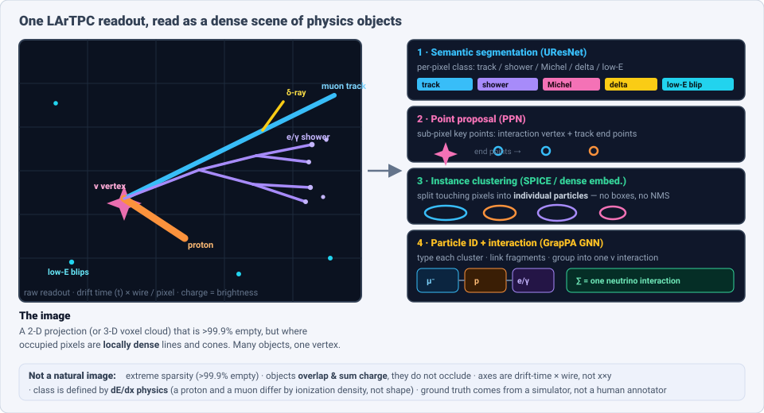
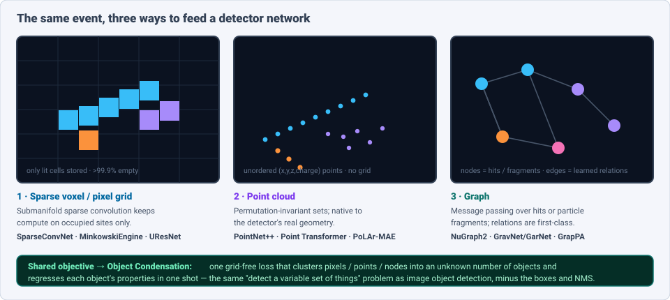
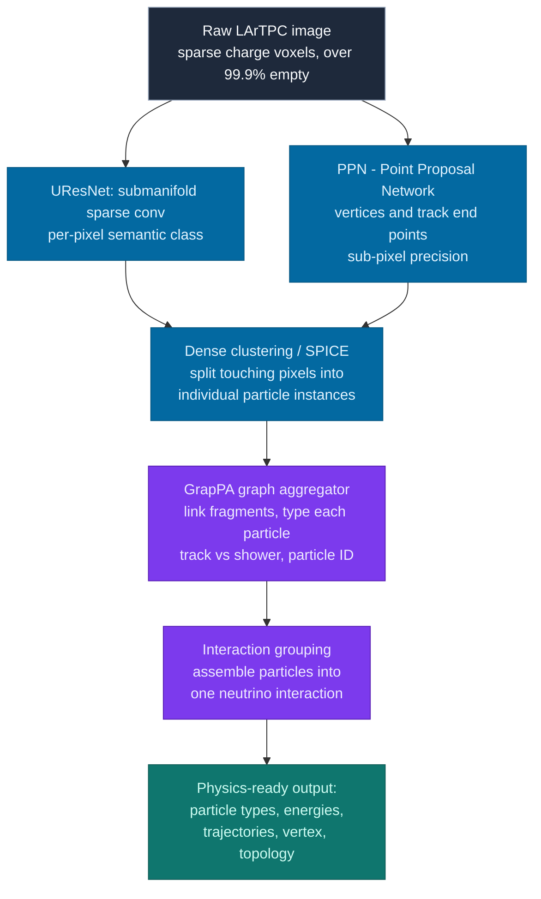
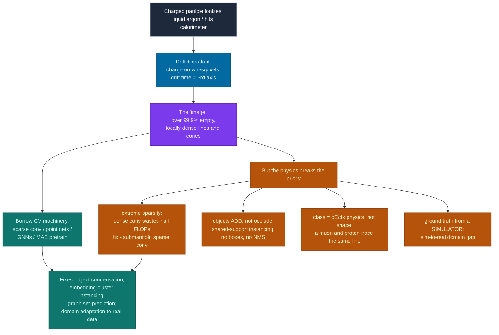

# Dense Object Detection & Classification — Recent Advances

*Compiled 2026-Aug-21 (America/Los_Angeles).*

Next installment in the running CV-updates log. Earlier entries on
`main`:
[Apr-30](../2026-Apr-30/2026-Apr-30_CV_updates.md),
[May-01](../2026-May-01/2026-May-01_CV_updates.md),
[May-02](../2026-May-02/2026-May-02_CV_updates.md),
[May-04](../2026-May-04/2026-May-04_CV_updates.md),
[May-05](../2026-May-05/2026-May-05_CV_updates.md),
[May-07](../2026-May-07/2026-May-07_CV_updates.md),
[May-08](../2026-May-08/2026-May-08_CV_updates.md),
[May-15](../2026-May-15/2026-May-15_CV_updates.md),
[May-16](../2026-May-16/2026-May-16_CV_updates.md),
[May-17](../2026-May-17/2026-May-17_CV_updates.md),
[Jun-09](../2026-Jun-09/2026-Jun-09_CV_updates.md),
[Jun-10](../2026-Jun-10/2026-Jun-10_CV_updates.md),
[Jun-12](../2026-Jun-12/2026-Jun-12_CV_updates.md),
[Jun-15](../2026-Jun-15/2026-Jun-15_CV_updates.md),
[Jun-16](../2026-Jun-16/2026-Jun-16_CV_updates.md),
[Jun-17](../2026-Jun-17/2026-Jun-17_CV_updates.md),
[Jun-19](../2026-Jun-19/2026-Jun-19_CV_updates.md),
[Jun-21](../2026-Jun-21/2026-Jun-21_CV_updates.md),
[Jun-22](../2026-Jun-22/2026-Jun-22_CV_updates.md),
[Jun-23](../2026-Jun-23/2026-Jun-23_CV_updates.md),
[Jun-24](../2026-Jun-24/2026-Jun-24_CV_updates.md),
[Jun-25](../2026-Jun-25/2026-Jun-25_CV_updates.md),
[Jun-27](../2026-Jun-27/2026-Jun-27_CV_updates.md),
[Jun-29](../2026-Jun-29/2026-Jun-29_CV_updates.md),
[Jun-30](../2026-Jun-30/2026-Jun-30_CV_updates.md),
[Jul-04](../2026-Jul-04/2026-Jul-04_CV_updates.md),
[Jul-07](../2026-Jul-07/2026-Jul-07_CV_updates.md),
[Jul-08](../2026-Jul-08/2026-Jul-08_CV_updates.md),
[Jul-10](../2026-Jul-10/2026-Jul-10_CV_updates.md),
[Jul-15](../2026-Jul-15/2026-Jul-15_CV_updates.md),
[Jul-17](../2026-Jul-17/2026-Jul-17_CV_updates.md),
[Jul-18](../2026-Jul-18/2026-Jul-18_CV_updates.md),
[Jul-21](../2026-Jul-21/2026-Jul-21_CV_updates.md),
[Jul-22](../2026-Jul-22/2026-Jul-22_CV_updates.md),
[Jul-24](../2026-Jul-24/2026-Jul-24_CV_updates.md),
[Jul-26](../2026-Jul-26/2026-Jul-26_CV_updates.md),
[Jul-27](../2026-Jul-27/2026-Jul-27_CV_updates.md),
[Jul-30](../2026-Jul-30/2026-Jul-30_CV_updates.md),
[Aug-01](../2026-Aug-01/2026-Aug-01_CV_updates.md),
[Aug-02](../2026-Aug-02/2026-Aug-02_CV_updates.md),
[Aug-04](../2026-Aug-04/2026-Aug-04_CV_updates.md),
[Aug-07](../2026-Aug-07/2026-Aug-07_CV_updates.md),
[Aug-10](../2026-Aug-10/2026-Aug-10_CV_updates.md),
[Aug-11](../2026-Aug-11/2026-Aug-11_CV_updates.md),
[Aug-13](../2026-Aug-13/2026-Aug-13_CV_updates.md),
[Aug-15](../2026-Aug-15/2026-Aug-15_CV_updates.md),
[Aug-16](../2026-Aug-16/2026-Aug-16_CV_updates.md),
[Aug-18](../2026-Aug-18/2026-Aug-18_CV_updates.md),
[Aug-19](../2026-Aug-19/2026-Aug-19_CV_updates.md).

The tour so far has worked through *optical* scenes (natural images, aerial,
overhead, endoscopic, microscopy, document pages, omnidirectional), a long run
of non-optical **sensor** primitives — event cameras, thermal, radar, SAR,
ultrasound, hyperspectral, OCT, MRI, PET, X-ray, GPR, terahertz, photoacoustic,
seismic, Wi-Fi — the strange case of the **audio spectrogram**, and the
sensor-side of **3-D**. Almost every one shared a saving grace: it reduces to a
reasonably *dense* 2-D (or 3-D) array a convolution can chew on. This pass turns
to a primitive that breaks that assumption on purpose — the **particle-physics
detector readout**, in its two great families: the **Liquid Argon Time
Projection Chamber (LArTPC)** that photographs neutrino interactions, and the
**collider calorimeter** that photographs the debris of an LHC collision.

Why it belongs in a *dense* detection log is easy to see once you look at one
event. A neutrino strikes an argon nucleus and sprays out a fan of secondary
particles: a long straight muon, a stubby proton, an electromagnetic shower
blooming into a cone of sub-tracks, a scatter of low-energy blips. Each is an
**object** with a class (particle type), an extent (its trajectory), and a
membership (which interaction it came from), and the whole fan overlaps in a
single readout where the pieces **add charge** rather than occlude. The job is
exactly object detection and instance segmentation — *find every particle, draw
its extent, name it, group it* — on a canvas that is simultaneously **>99.9%
empty** and, along each trajectory, **locally dense**. It is the most extreme
"sparse scene of many small objects" in this whole series, and the field that
solves it has quietly become one of the most sophisticated users of
sparse-convolution, point-cloud and graph detectors anywhere.

## Table of contents

1. [Why this pass: the particle-physics detector image as its own primitive](#1--why-this-pass-the-particle-physics-detector-image-as-its-own-primitive)
2. [The primitive — a readout is a dense scene of tracks, showers & vertices](#2--the-primitive--a-readout-is-a-dense-scene-of-tracks-showers--vertices)
3. [The backbone lineage — sparse-submanifold CNNs, point clouds & graphs](#3--the-backbone-lineage--sparse-submanifold-cnns-point-clouds--graphs)
4. [The full chain — end-to-end LArTPC reconstruction (MLReco → SPINE)](#4--the-full-chain--end-to-end-lartpc-reconstruction-mlreco--spine)
5. [Instance segmentation & particle aggregation — objects without boxes](#5--instance-segmentation--particle-aggregation--objects-without-boxes)
6. [Graphs as the native structure — NuGraph and hit-level GNNs](#6--graphs-as-the-native-structure--nugraph-and-hit-level-gnns)
7. [The collider mirror — calorimeters, particle flow & jet tagging](#7--the-collider-mirror--calorimeters-particle-flow--jet-tagging)
8. [Foundation models & self-supervision for detector data](#8--foundation-models--self-supervision-for-detector-data)
9. [Why a detector image is *not* a natural image](#9--why-a-detector-image-is-not-a-natural-image)
10. [Open problems / what to watch](#10--open-problems--what-to-watch)
11. [Sources](#11--sources)

## 1 · Why this pass: the particle-physics detector image as its own primitive

Three properties make a detector readout worth treating as a first-class
dense-vision modality rather than a curiosity:

- **The scene is defined by physics, and the classes are physical processes.**
  A muon and a proton can trace the *same* line on the readout; what separates
  them is **ionization density (dE/dx)** — how much charge they deposit per unit
  length — and how that profile evolves as they slow and stop. A track and a
  shower differ because one particle ionizes along a path while another cascades
  into an exponentially branching bloom. "Class" here is not appearance; it is a
  particle's identity inferred from the *shape of energy deposition*. That makes
  it a fine-grained classification problem with a physics prior baked into every
  label.
- **Everything overlaps and adds; nothing occludes.** Like the spectrogram of
  the last entry, a detector image is **transparent**: two particles crossing
  the same pixel sum their charge, they do not hide one another. Detection is
  therefore inherently multi-object *and* the objects share support — the hard
  part is not finding the fan, it is **splitting** the overlapping pieces into
  the right number of instances and deciding which vertex they share.
- **The labels are free, and perfectly dense.** This is the inversion of every
  other modality in the log. Where medical, remote-sensing and bioacoustic
  detection starve for annotations, particle physics has a **high-fidelity
  simulator** (GEANT4) that emits *pixel-perfect, particle-level* ground truth
  for as many events as compute allows. The bottleneck flips from "too few
  labels" to "the labels are only as good as the simulation" — a **sim-to-real
  domain gap** that dominates the field (§9) exactly the way the label economy
  dominated the last one.

Add the deployment context — **DUNE**, the flagship US neutrino experiment, will
instrument tens of kilotonnes of liquid argon and stream detector images
continuously for a decade; the **LHC** already triggers on collision images at
40 MHz — and the setting is unmistakable: enormous throughput, tiny objects,
heavy overlap, extreme sparsity, and a reconstruction chain that has to run
*fast* and *whole-event*.

## 2 · The primitive — a readout is a dense scene of tracks, showers & vertices

A LArTPC works like a giant electronic bubble chamber. A charged particle drifts
through liquid argon, ionizing it; the freed electrons drift in an electric
field to a readout plane of wires or pixels, and the **drift time** supplies the
third coordinate. The result is a 2-D image (per wire plane) or a 3-D voxel
cloud where **brightness is deposited charge**. Onto that canvas the
reconstruction stack lays a ladder of dense-detection tasks, each a direct
analogue of a computer-vision primitive:

- **Semantic segmentation** — label every non-empty pixel by class: **track**
  (muon/pion/proton), **shower** (electron/photon), **Michel electron** (the
  decay of a stopping muon), **delta ray** (a knocked-out electron), **low-energy
  blip**. This is per-pixel classification, U-Net-style, and it is the base of
  the ladder.
- **Point / key-point proposal** — find the **interaction vertex** and each
  track's **end points** to sub-pixel precision. This is landmark detection, and
  it anchors everything downstream.
- **Instance segmentation** — split the segmented pixels into **individual
  particles**, even where two tracks cross or a shower overlaps a track. Because
  the objects share support, this is the crux, and it is done *without boxes*.
- **Classification & aggregation** — assign a **particle type** to each instance
  from its dE/dx profile, then **group fragments** (a shower is many
  disconnected pieces) into whole particles and whole **interactions**.

The figure lays out the ladder over one simulated neutrino event. Several
consequences follow immediately for anyone bringing a detector:

- **Localization is metric, not box-shaped.** The output that physics needs is a
  particle's **trajectory and stopping point**, not an axis-aligned rectangle.
  Bounding boxes — the currency of natural-image detection — are almost useless
  here; a diagonal muon's box is mostly empty argon. The field went straight to
  **per-pixel / per-point instance masks**, skipping the box era entirely.
- **Multi-object, shared-support, variable-count.** A frame holds an unknown
  number of particles that overlap; the output is a *set* of masks with types
  and a grouping — set prediction, the DETR problem, but grid-free.
- **The label ladder is inverted.** Dense, exact supervision is available for
  every task at once, which is why the field's signature architecture is a
  **single end-to-end chain** trained jointly on all rungs (§4), rather than the
  weakly-supervised, one-task-at-a-time pipelines the label-starved modalities
  are forced into.

## 3 · The backbone lineage — sparse-submanifold CNNs, point clouds & graphs

Because the readout is extreme-sparse, a dense convolution would spend
essentially all of its FLOPs multiplying zeros. The field's backbone lineage is
the story of three ways around that, and it maps cleanly onto three data
structures (figure above).

- **Sparse-submanifold convolutions — the workhorse.** **Submanifold Sparse
  Convolutional Networks** (Graham, Engelcke & van der Maaten, CVPR 2018) and
  their engine successor **MinkowskiEngine** (Choy et al., CVPR 2019) compute
  only on occupied sites and, crucially, *keep the activation sparsity fixed*
  through depth, so a line stays a line rather than dilating into a blob. Ported
  to LArTPC by **Dominé & Terao** ("Scalable deep CNNs for sparse, locally dense
  LArTPC data", *Phys. Rev. D* 102, 012005, 2020) — cutting inference memory and
  wall-time by roughly **364×** and **33×** versus a dense CNN at no loss of
  accuracy — a submanifold **UResNet** became the standard
  semantic-segmentation backbone and the front end of the whole chain, the direct
  analogue of a ResNet/FPN backbone in image detection. (The CNN era on LArTPCs
  opened earlier, with **MicroBooNE** first applying CNNs to neutrino images in
  2017, then pixel-level EM particle-ID and the sparse **SparseSSNet**
  segmentation that fed a real νe-appearance analysis.)
- **Point clouds — the geometry-faithful branch.** A readout is, physically, a
  set of `(x, y, z, charge)` energy depositions with no natural grid. The
  **PointNet++ → Point Transformer** family treats it as exactly that: a
  permutation-invariant point set, which sidesteps the arbitrary voxel size and
  respects the detector's true resolution. This is the representation the newest
  self-supervised models (§8) build on.
- **Graphs — the relation-first branch.** Make each hit (or each reconstructed
  fragment) a node and let a **graph neural network** learn the edges — "these
  two hits belong to the same particle", "this fragment feeds that vertex".
  **GravNet / GarNet** (Qasim et al., 2019) learn the graph *dynamically* in a
  latent space, which is how the collider side handles calorimeter hits; on the
  neutrino side the same idea runs hit-level in **NuGraph** (§6) and
  fragment-level in the chain's **GrapPA** aggregator (§5).

The three representations are not rivals so much as a spectrum, and — this is the
unifying idea of the whole modality — they can share a **single clustering
objective**. **Object Condensation** (Kieseler, *EPJC* 2020) is a grid-free loss
that works identically on pixels, points or graph nodes: it elects a
representative "condensation point" per object, pulls the object's other
constituents toward it in a learned latent space, and regresses the object's
properties there — detecting a *variable, unknown* number of objects in one
shot, with **no anchors, no NMS, no box regression**. It is the field's answer
to the same question DETR answered for images, arrived at independently and from
the physics side.

## 4 · The full chain — end-to-end LArTPC reconstruction (MLReco → SPINE)

The signature system of the modality is the **end-to-end, deep-learning
reconstruction chain** built by the **DeepLearnPhysics / SLAC** group: one
network stack that ingests a raw LArTPC image and emits a *complete* physics
interpretation — every pixel classified, every particle instanced and typed,
every interaction assembled — trained jointly.

- **`lartpc_mlreco3d` — the reference chain.** Its defining paper, *Scalable,
  End-to-End, Deep-Learning-Based Data Reconstruction Chain for Particle Imaging
  Detectors* (Drielsma, Terao et al., 2021, arXiv:2102.01033), wires the rungs of
  §2 into one differentiable stack: a submanifold **UResNet** for semantic
  segmentation, a **Point Proposal Network (PPN)** for vertices and end points, a
  dense-clustering stage for instances, and **GrapPA** graph aggregators that
  build particles and interactions. The whole thing is trained together, so the
  early tasks are optimized for what the late tasks need.
- **SPINE — the current successor.** *Scalable Particle Imaging with Neural
  Embeddings* (DeepLearnPhysics) is the production framework that supersedes
  `lartpc_mlreco3d`, reorganizing the chain around **CNN pixel-feature extraction
  feeding GNN superstructure formation** with **physics-informed inductive
  biases** in each stage, and reporting end-to-end dense **track / shower**
  labeling around **97.7% / 99.5%**. It is deployed across the **Short-Baseline
  Neutrino** program (**ICARUS**, **SBND**), **ProtoDUNE**, and the **DUNE**
  near and far detectors — the same code running across wildly different detector
  geometries, which is itself the payoff of a learned, geometry-agnostic stack.
  (SPINE has no standalone journal paper yet; its method of record is the
  full-chain paper below, with the framework documented in its repository.)
- **Why "chain" is the right unit.** In natural-image detection you can bolt a
  detector head onto a frozen backbone. Here the tasks are *causally* stacked —
  you cannot type a particle before you have instanced it, and you cannot instance
  it well without the vertex — so the field converged on **joint end-to-end
  training of the whole ladder**, with uncertainty propagated between stages
  (Douglas et al., *Uncertainty Propagation within Chained Models for ML
  Reconstruction of Neutrino–LAr Interactions*, arXiv:2411.09864). This is the
  cleanest example in the series
  of "detection is a pipeline, so train the pipeline."

## 5 · Instance segmentation & particle aggregation — objects without boxes

The heart of the chain is turning a class-labeled pixel map into the right *set*
of particles. Two ideas carry it, and both are grid-free by design.

- **Proposal-free dense instance segmentation.** *Scalable, Proposal-free
  Instance Segmentation for 3-D Pixel Clustering and Particle Trajectory
  Reconstruction* (SPICE; Koh, Drielsma, Terao et al., arXiv:2007.03083)
  abandons the anchor-and-box machinery of Mask R-CNN entirely. It learns a
  **per-pixel embedding** such that pixels of the same particle cluster together
  in latent space and different particles push apart, then reads instances off by
  clustering — the same "learn an embedding, cluster it" recipe that dense
  embedding-based segmentation uses in vision, but native to a sparse 3-D scene
  and scalable to whole events. There are no proposals to enumerate, which
  matters when the object count is unknown and large.
- **Sub-pixel key points anchor the split.** The **Point Proposal Network**
  (*Point Proposal Network for Reconstructing 3-D Particle Endpoints with
  Sub-Pixel Precision*, arXiv:2006.14745) predicts vertices and track end points
  more precisely than the voxel grid, giving the clustering stage reliable
  seeds — landmark detection in service of instance splitting.
- **Graph aggregation assembles whole particles and interactions.** A shower is
  not one connected object; it is a spray of fragments. **GrapPA** (Graph
  Particle Aggregator; Drielsma et al., *Clustering of EM Showers and Particle
  Interactions with GNNs in LArTPC Data*, *Phys. Rev. D* 104, 072004, 2021)
  treats each fragment as a node and runs a GNN to (a) merge fragments into whole
  particles, (b) classify each particle, and (c) group particles into
  interactions by predicting the parent–child edges of the event's decay tree.
  This is **detection-as-relation-prediction**, the same move the document-layout
  entry (Aug-18) made for reading order — here it recovers the physical hierarchy
  of an interaction.

The refusal of the box is a deliberate choice, not a lack of trying: the field
has *tested* the natural-image transplant — e.g. a **Mask R-CNN** variant
("sMask-RCNN") for cosmic-muon instance segmentation in MicroBooNE — and still
found the grid-free, embedding-and-graph route the better fit for thin,
overlapping, diagonal objects.

The through-line is that **every stage refuses the bounding box**. A detector
scene is made of thin diagonal lines and diffuse cones; the only useful
localization is a per-pixel/per-point mask plus a set of relations. The field
skipped a decade of box-based detection and went straight to embedding-clustering
and graph set-prediction — arguably a preview of where grid-free vision
detection is heading.

## 6 · Graphs as the native structure — NuGraph and hit-level GNNs

A parallel line argues that even the *pixelization* is an artifact: the raw data
are wire "hits", and forcing them onto an image grid throws away resolution and
invents empty pixels. **NuGraph** takes the data in their native form.

- **NuGraph2** (*A Graph Neural Network for Neutrino Physics Event
  Reconstruction*, Hewes et al. / Exa.TrkX–DUNE, arXiv:2403.11872) builds a
  **heterogeneous graph**: 2-D nodes are hits in each wire plane, tied across
  planes through shared 3-D space-point nodes, with a **multi-head-attention
  message-passing** core. On DUNE-simulated data it **filters background hits at
  98.0% efficiency** and **labels the survivors by particle type at 94.9%**, all
  **without any voxelization, truncation or downsizing** — the explicit selling
  point being that it operates on the detector observables as they actually are.
- **Explainability arrives.** *NuGraph2 with Explainability* (arXiv:2509.10676,
  2025) adds post-hoc attribution to the GNN's hit-level decisions — a sign the
  approach is maturing from "does it work" to "can a physicist trust and audit
  it", which is exactly the pressure any detection system faces when its outputs
  feed a measurement.
- **The tracking heritage.** The graph approach grew out of **Exa.TrkX**, the
  program that reframed charged-particle *tracking* at the LHC as edge
  classification on a hit graph — connect-the-dots as a GNN — and it is the same
  intellectual root as the calorimeter GNNs of §7.

Hit-level graphs and voxel chains are the two poles of the LArTPC field:
grid-free fidelity versus the mature, whole-event convenience of an image stack.
The interesting recent motion is convergence — SPINE itself is a **CNN front end
feeding a GNN back end**, taking the pixel grid where density helps and the graph
where relations do.

## 7 · The collider mirror — calorimeters, particle flow & jet tagging

The LHC solves the same dense-detection problem on a different detector, and its
solutions rhyme exactly with the neutrino side.

- **Calorimeter reconstruction as one-shot object condensation.** The CMS **High
  Granularity Calorimeter (HGCAL)** will have millions of channels and many
  overlapping showers per collision. *End-to-end multi-particle reconstruction in
  high-occupancy imaging calorimeters with graph neural networks* (Qasim,
  Chernyavskaya, Kieseler et al., *EPJC* 82, 753, 2022, arXiv:2204.01681) does
  clustering, classification and energy regression **in a single pass** with a
  **GravNet** GNN trained by **object condensation**, reconstructing **O(1000)
  particles at 200 pile-up** — the collider twin of SPICE's proposal-free
  instancing.
- **Machine-Learned Particle Flow (MLPF).** Traditional particle-flow
  reconstruction combines tracker and calorimeter signals with hand-tuned logic
  to reconstruct every particle in an event. **MLPF** (Pata, Duarte et al.)
  reframes it as **set-to-set** prediction — a graph/transformer maps the set of
  detector elements to the set of output particles, scalably and end-to-end — the
  calorimeter analogue of the LArTPC full chain.
- **Jet tagging is fine-grained classification on a point cloud.** The debris of
  a collision forms a **jet** — a spray of particles — and identifying the parent
  (quark, gluon, top, W/Z, Higgs) is a classification problem over an unordered
  set. **ParticleNet** (Qu & Gouskos, 2019, arXiv:1902.08570) treated a jet as a
  point cloud and ran **DGCNN**-style dynamic graph convolutions; **Particle
  Transformer (ParT)** (Qu, Li, Qian, 2022, arXiv:2202.03772, ICML) added
  pairwise-interaction attention and, trained on the new **JetClass** dataset
  (**100 million jets**, ~2 orders of magnitude larger than prior public sets),
  set the state of the art. **LorentzNet** and other **Lorentz-equivariant**
  networks fold in the physical symmetry, the collider version of the
  "respect the axis" fixes seen across this series.

The collider and neutrino communities converged on the *same* toolkit — sparse
grids, point clouds, dynamic graphs, object condensation, set prediction — from
opposite ends, which is the strongest evidence that "dense detection on a
physics detector" is one primitive, not two.

## 8 · Foundation models & self-supervision for detector data

The pretraining wave that reshaped every other modality in this log has now
reached detector images, and it lands on the point-cloud representation.

- **Masked point modeling for LArTPC.** *Particle Trajectory Representation
  Learning with Masked Point Modeling* (Young, Jwa & Terao, 2025,
  arXiv:2502.02558) ports **masked-autoencoder** pretraining (the Point-MAE /
  Audio-MAE recipe) to LArTPC point clouds: with volumetric tokenization and an
  energy-prediction auxiliary task, mask a fraction of the energy-deposition
  points and learn to reconstruct them, yielding a self-supervised backbone
  (**PoLAr-MAE**) that hits **99.4% track / 97.7% shower F-score with *no*
  labels**, and where **fine-tuning on just 100 events matches a 100 000-event
  supervised baseline** — the label-efficiency payoff pretraining promises
  everywhere. Its companion release, **PILArNet-M**, is the largest open LArTPC
  ML dataset to date — **>1.2 million events and ~5.2 billion individually
  labeled energy depositions** — the "ImageNet moment" the field needed.
- **Standardized benchmarks arrive.** The earlier **PILArNet** (Adams, Terao et
  al., 2020, arXiv:2006.01993) first gave the community a public 2-D/3-D LArTPC
  image set; **PILArNet-M** scales it by orders of magnitude. On the collider
  side, **JetClass** (§7) plays the same role — a large, public, standardized
  benchmark is the precondition for the pretrained-transformer era, exactly as it
  was for images.
- **Cross-task and cross-experiment foundation models are now real.** The
  collider community moved first and fastest. **Masked Particle Modeling**
  (Golling, Heinrich, Kagan et al., MLST 2024, arXiv:2401.13537) does BERT-style
  masked pretraining over particle *sets* via a learned token vocabulary;
  **OmniJet-α** (Birk, Hallin & Kasieczka, MLST 2024, arXiv:2403.05618) was the
  first model to demonstrate transfer **between a generative task and a
  supervised one**; and **OmniLearned** (Bhimji, Harris, Mikuni & Nachman, 2025,
  arXiv:2510.24066), trained on **>1 billion jets**, spans top-tagging, ATLAS
  b-tagging and CMS anomaly detection with one backbone. Reconstruction itself is
  being reframed as a backbone: *MLPF as a Foundation Model for Collider Physics*
  (Mokhtar, Pata, Kagan & Duarte, 2026, arXiv:2606.14373) reuses the
  particle-flow network's per-particle latents for jet-flavor ID and energy/MET
  regression **with no retraining**. The bet is the same one CLIP made — pretrain
  once on the raw primitive, adapt cheaply downstream — and the newest,
  lightly-verified preprints (see Sources) are already pushing the boldest claim:
  **transfer from collider jets to neutrino interactions**, a single encoder
  spanning genuinely different detectors bound by one shared physics.

## 9 · Why a detector image is *not* a natural image

The whole enterprise rests, as ever, on a productive lie: that a detector
readout is an image. It leaks in four places, and every leak is a live research
direction.

The four structural departures:

1. **Extreme sparsity inverts the compute problem.** A natural image is dense;
   a detector image is **>99.9% empty**, so a standard convolution multiplies
   almost nothing but zeros. **Submanifold sparse convolutions** exist precisely
   to keep compute on occupied sites *and* to stop the sparsity pattern from
   dilating with depth — an efficiency constraint with no analogue in ordinary
   vision.
2. **Objects add rather than occlude.** Overlapping trajectories sum charge, so
   the scene is transparent and inherently **shared-support**: the challenge is
   *splitting* co-located objects, which is why the field went to
   embedding-clustering and object condensation rather than boxes and NMS.
3. **Class is ionization physics, not appearance.** Two particles can draw the
   identical line; their identity is written in **dE/dx** — how charge is
   deposited along and at the end of the path. A detector's "classifier" is
   really a physics estimator, and it must be calibrated, not just accurate.
4. **Ground truth is simulated, so the gap is sim-to-real.** Labels are free and
   pixel-perfect because they come from **GEANT4**, but a model trained on
   simulation must survive the **domain shift** to real detector data —
   mis-modeled noise, dead channels, space-charge distortions, calibration drift.
   This is the field's dominant risk and the reason domain adaptation, on-real
   fine-tuning, and simulation-uncertainty propagation are central rather than
   afterthoughts.

## 10 · Open problems / what to watch

- **Sim-to-real is the central deployment gap.** Every model is born on
  simulation; the measurement it feeds lives on real argon. Domain-adaptive
  training, calibration-aware losses, and propagating simulation uncertainty
  through the chain (arXiv:2411.09864) are the active mitigations, and none is
  settled.
- **Grid vs. graph is converging, not resolved.** Voxel chains (SPINE) are
  mature and whole-event; hit graphs (NuGraph2) are fidelity-faithful and
  grid-free. The productive systems are hybrids — CNN front end, GNN back end —
  and the right division of labor is an open design question.
- **Foundation models for detector data are just starting.** PoLAr-MAE and
  masked-particle modeling show self-supervision works on the primitive; whether
  one pretrained encoder can transfer *across experiments and detectors* — the
  genuine "foundation model" claim — is unproven and being chased hard.
- **Real-time reconstruction at trigger rates.** DUNE and the HL-LHC need dense
  detection to run in the trigger, at streaming rates on FPGAs/GPUs. Efficient
  sparse and graph inference (the same efficiency pressure that pushed vision to
  Mamba and distillation) is a hard constraint here, not a nicety.
- **Explainability and trust.** When a detector's output *is* the physics
  measurement, an uninterpretable detection is a liability. NuGraph2's
  explainability work is an early move; calibrated uncertainty per object is the
  bar the field is setting for itself.
- **Generative simulation closing the loop.** Fast generative surrogates
  (CaloDiffusion / CaloScore-style calorimeter shower generators, and learned
  LArTPC simulators) are becoming good enough to *shrink* the sim-to-real gap
  from the simulation side — detection and generation co-evolving on the same
  primitive, as they are everywhere else in this log.

## 11 · Sources

Grouped by section. Links are to arXiv abstracts, journal pages, official repos
or dataset pages. A handful of identifiers are recent 2025–2026 preprints;
several arXiv IDs were confirmed only from search snippets / listing pages
because arXiv and some publisher hosts were egress-limited in the build
environment — where an ID could not be independently double-checked it is cited
by title, authors and venue as well, and none were fabricated. Exact metric
figures are quoted as reported in abstracts and should be verified against the
primary PDF before formal citation.

**Framing & prior entries (§1–2)**
- Prior CV-updates entries where 3-D sensing and sparse scenes appear: [Aug-04](../2026-Aug-04/2026-Aug-04_CV_updates.md) (the sensor-side of 3-D / point clouds), [Aug-19](../2026-Aug-19/2026-Aug-19_CV_updates.md) (spectrograms as transparent, additive scenes). This is the first entry to treat the particle-physics detector readout as the primitive.

**Backbone lineage — sparse conv, point clouds, graphs, object condensation (§3)**
- Graham, Engelcke & van der Maaten, *3D Semantic Segmentation with Submanifold Sparse Convolutional Networks*, CVPR 2018, arXiv:1711.10275 — https://arxiv.org/abs/1711.10275 · code (SparseConvNet): https://github.com/facebookresearch/SparseConvNet
- Choy, Gwak & Savarese, *4D Spatio-Temporal ConvNets: Minkowski Convolutional Neural Networks*, CVPR 2019, arXiv:1904.08755 — https://arxiv.org/abs/1904.08755 · engine: https://github.com/NVIDIA/MinkowskiEngine
- Dominé & Terao, *Scalable deep convolutional neural networks for sparse, locally dense LArTPC data*, Phys. Rev. D 102, 012005 (2020), arXiv:1903.05663 — https://arxiv.org/abs/1903.05663 · https://journals.aps.org/prd/abstract/10.1103/PhysRevD.102.012005
- Qi et al., *PointNet++: Deep Hierarchical Feature Learning on Point Sets in a Metric Space*, NeurIPS 2017, arXiv:1706.02413 — https://arxiv.org/abs/1706.02413
- Kieseler, *Object condensation: one-stage grid-free multi-object reconstruction in physics detectors, graph and image data*, EPJC 80:886 (2020), arXiv:2002.03605 — https://arxiv.org/abs/2002.03605
- Qasim, Kieseler, Iiyama & Pierini, *Learning representations of irregular particle-detector geometry with distance-weighted graph networks (GravNet / GarNet)*, EPJC 79:608 (2019), arXiv:1902.07987 — https://arxiv.org/abs/1902.07987

**Early LArTPC deep learning — MicroBooNE (§3, history)**
- MicroBooNE Collaboration (Acciarri et al.), *Convolutional Neural Networks Applied to Neutrino Events in a LArTPC*, JINST 12, P03011 (2017), arXiv:1611.05531 — https://arxiv.org/abs/1611.05531
- MicroBooNE Collaboration (Adams et al.), *A Deep Neural Network for Pixel-Level EM Particle Identification in the MicroBooNE LArTPC*, Phys. Rev. D 99, 092001 (2019), arXiv:1808.07269 — https://arxiv.org/abs/1808.07269
- MicroBooNE Collaboration, *Semantic Segmentation with a Sparse CNN for Event Reconstruction in MicroBooNE (SparseSSNet)*, Phys. Rev. D 103, 052012 (2021), arXiv:2012.08513 — https://arxiv.org/abs/2012.08513

**Full-chain LArTPC reconstruction — MLReco / SPINE (§4)**
- Drielsma, Terao, Dominé, Koh, *Scalable, End-to-End, Deep-Learning-Based Data Reconstruction Chain for Particle Imaging Detectors*, ML4PS @ NeurIPS 2021, arXiv:2102.01033 — https://arxiv.org/abs/2102.01033 · code (lartpc_mlreco3d): https://github.com/DeepLearnPhysics/lartpc_mlreco3d
- **SPINE (Scalable Particle Imaging with Neural Embeddings)** — successor framework to lartpc_mlreco3d; no standalone paper as of this writing, method of record is arXiv:2102.01033 · code: https://github.com/DeepLearnPhysics/spine
- Douglas, Mishra, Ratner, Petersen & Terao, *Uncertainty Propagation within Chained Models for ML Reconstruction of Neutrino–LAr Interactions*, 2024/2025, arXiv:2411.09864 — https://arxiv.org/abs/2411.09864

**Instance segmentation & aggregation (§5)**
- Koh, Côte de Soux, Dominé, Drielsma, Terao et al., *Scalable, Proposal-free Instance Segmentation Network for 3D Pixel Clustering and Particle Trajectory Reconstruction in LArTPCs (SPICE)*, 2020, arXiv:2007.03083 — https://arxiv.org/abs/2007.03083 *(adjusted Rand index >92%, clustering purity/efficiency >96%)*
- Dominé et al., *Point Proposal Network for Reconstructing 3D Particle Endpoints with Sub-Pixel Precision in LArTPCs (PPN)*, Phys. Rev. D 104, 032004 (2021), arXiv:2006.14745 — https://arxiv.org/abs/2006.14745
- Drielsma, Lin, Côte de Soux, Dominé, Koh, Terao et al., *Clustering of Electromagnetic Showers and Particle Interactions with Graph Neural Networks in LArTPC Data (GrapPA)*, Phys. Rev. D 104, 072004 (2021), arXiv:2007.01335 — https://arxiv.org/abs/2007.01335
- (natural-image transplant) *Cosmic Ray Muon Clustering for MicroBooNE using sMask-RCNN*, 2022, arXiv:2201.05705 — https://arxiv.org/abs/2201.05705

**Hit-level graph reconstruction — NuGraph / Exa.TrkX (§6)**
- Hewes, Aurisano, Cerati et al. (Exa.TrkX / DUNE), *NuGraph2: A Graph Neural Network for Neutrino Physics Event Reconstruction*, Phys. Rev. D 110, 032008 (2024), arXiv:2403.11872 — https://arxiv.org/abs/2403.11872 · overview: https://larsoft.org/nugraph-gnn/ *(98.0% filter, 94.9% semantic-labeling efficiency)*
- *NuGraph2 with Explainability: Post-hoc Explanations for Geometric Neural Network Predictions*, 2025, arXiv:2509.10676 — https://arxiv.org/abs/2509.10676
- DeZoort et al. (Exa.TrkX), *Charged Particle Tracking via Edge-Classifying Interaction Networks*, Comput. Softw. Big Sci. 5, 26 (2021), arXiv:2103.16701 — https://arxiv.org/abs/2103.16701

**Collider calorimeters, particle flow & jet tagging (§7)**
- Qasim, Chernyavskaya, Kieseler, Long, Viazlo, Pierini & Nawaz, *End-to-end multi-particle reconstruction in high-occupancy imaging calorimeters with graph neural networks*, EPJC 82, 753 (2022), arXiv:2204.01681 — https://arxiv.org/abs/2204.01681
- Qasim et al., *Multi-particle reconstruction in the High Granularity Calorimeter using object condensation and graph neural networks*, CHEP 2021, arXiv:2106.01832 — https://arxiv.org/abs/2106.01832 *(earlier HGCAL object-condensation application)*
- Pata, Duarte, Vlimant, Pierini & Spiropulu, *MLPF: Efficient machine-learned particle-flow reconstruction using graph neural networks*, EPJC 81, 381 (2021), arXiv:2101.08578 — https://arxiv.org/abs/2101.08578
- Qu & Gouskos, *ParticleNet: Jet Tagging via Particle Clouds*, Phys. Rev. D 101, 056019 (2020), arXiv:1902.08570 — https://arxiv.org/abs/1902.08570
- Qu, Li & Qian, *Particle Transformer for Jet Tagging (ParT + JetClass dataset, 100M jets)*, ICML 2022, arXiv:2202.03772 — https://arxiv.org/abs/2202.03772 · code/data: https://github.com/jet-universe/particle_transformer
- Gong, Meng, Zhang, Qu, Li, Qian et al., *An Efficient Lorentz-Equivariant Graph Neural Network for Jet Tagging (LorentzNet)*, JHEP 07 (2022) 030, arXiv:2201.08187 — https://arxiv.org/abs/2201.08187

**Foundation models, self-supervision & benchmarks (§8)**
- Young, Jwa & Terao, *Particle Trajectory Representation Learning with Masked Point Modeling (PoLAr-MAE)*, 2025, arXiv:2502.02558 — https://arxiv.org/abs/2502.02558 · code: https://github.com/DeepLearnPhysics/PoLAr-MAE *(introduces PILArNet-M: >1.2M events, ~5.2B labeled energy depositions; 99.4% track / 97.7% shower F-score with no labels)*
- Adams, Terao, Wongjirad et al., *PILArNet: Public Dataset for Particle Imaging Liquid Argon Detectors in High Energy Physics*, 2020, arXiv:2006.01993 — https://arxiv.org/abs/2006.01993
- Golling, Heinrich, Kagan, Klein, Leigh et al., *Masked Particle Modeling on Sets: Towards Self-Supervised HEP Foundation Models*, MLST 5, 035074 (2024), arXiv:2401.13537 — https://arxiv.org/abs/2401.13537
- Birk, Hallin & Kasieczka, *OmniJet-α: The First Cross-Task Foundation Model for Particle Physics*, MLST 5, 035031 (2024), arXiv:2403.05618 — https://arxiv.org/abs/2403.05618
- Bhimji, Harris, Mikuni & Nachman, *OmniLearned: A Foundation Model Framework for All Tasks Involving Jet Physics*, 2025, arXiv:2510.24066 — https://arxiv.org/abs/2510.24066
- Mokhtar, Pata, Kagan & Duarte, *Machine-Learned Particle Flow as a Foundation Model for Collider Physics*, 2026, arXiv:2606.14373 — https://arxiv.org/abs/2606.14373
- (recent, lightly verified — confirm before formal citation) cross-domain jets→neutrinos transfer, arXiv:2604.12364; self-supervised pre-training for heterogeneous neutrino detectors, arXiv:2604.07037; *Panda: Self-Distillation of Reusable Sensor-Level Representations for HEP*, arXiv:2512.01324. *(IDs from listing snippets; author lists not independently confirmed.)*

**Not a natural image (§9) & generative surrogates (§10)**
- Submanifold sparse convolution (as §3, arXiv:1711.10275); object condensation (as §3, arXiv:2002.03605); uncertainty propagation (as §4, arXiv:2411.09864).
- Mikuni & Nachman, *Score-based Generative Models for Calorimeter Shower Simulation (CaloScore)*, Phys. Rev. D 106, 092009 (2022), arXiv:2206.11898 — https://arxiv.org/abs/2206.11898 · *CaloScore v2* (diffusion, single-shot), JINST 19, P02001 (2024). "CaloDiffusion" is a separate model whose arXiv ID was not verified here.
