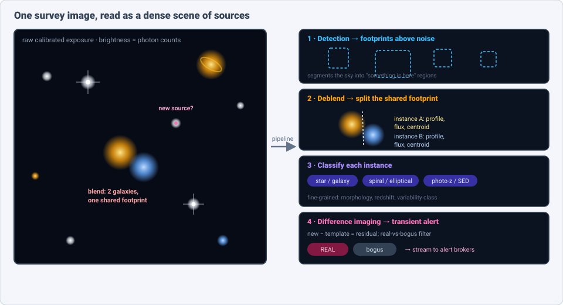
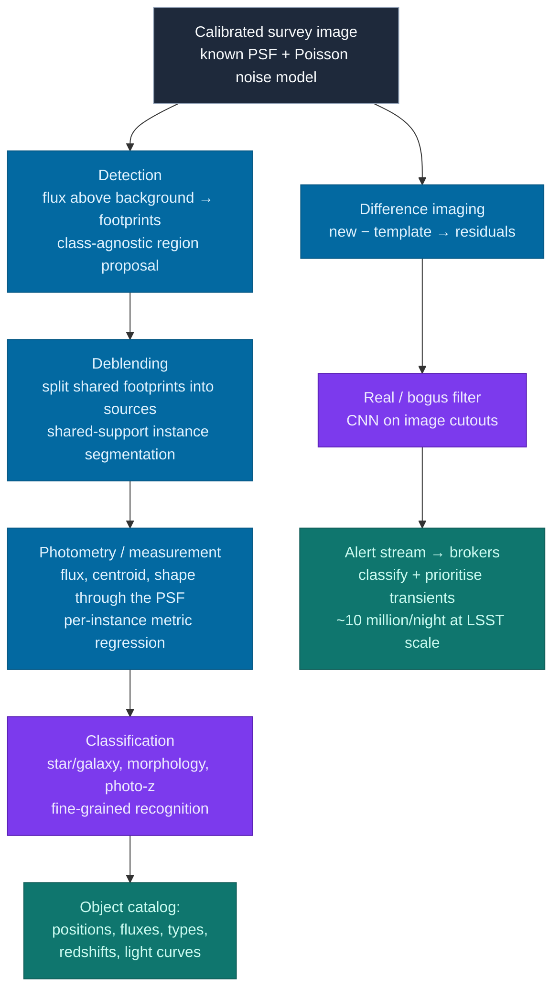
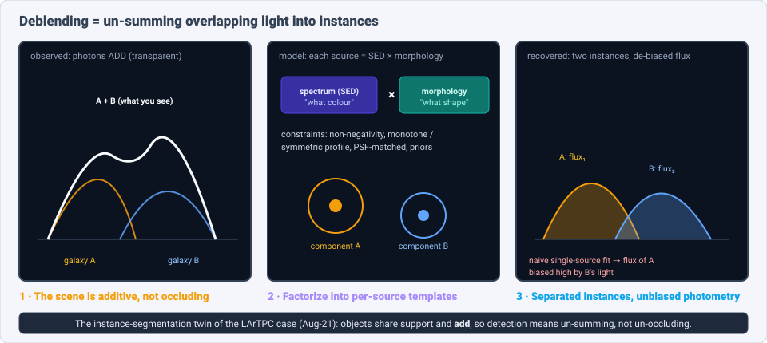
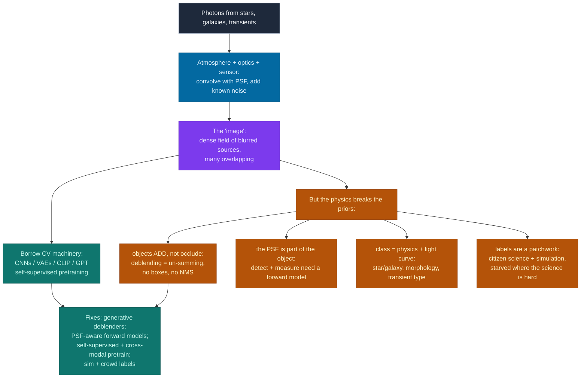

# Dense Object Detection & Classification — Recent Advances

*Compiled 2026-Aug-22 (America/Los_Angeles).*

Next installment in the running CV-updates log. Earlier entries on
`main`:
[Apr-30](../2026-Apr-30/2026-Apr-30_CV_updates.md),
[May-01](../2026-May-01/2026-May-01_CV_updates.md),
[May-02](../2026-May-02/2026-May-02_CV_updates.md),
[May-04](../2026-May-04/2026-May-04_CV_updates.md),
[May-05](../2026-May-05/2026-May-05_CV_updates.md),
[May-07](../2026-May-07/2026-May-07_CV_updates.md),
[May-08](../2026-May-08/2026-May-08_CV_updates.md),
[May-15](../2026-May-15/2026-May-15_CV_updates.md),
[May-16](../2026-May-16/2026-May-16_CV_updates.md),
[May-17](../2026-May-17/2026-May-17_CV_updates.md),
[Jun-09](../2026-Jun-09/2026-Jun-09_CV_updates.md),
[Jun-10](../2026-Jun-10/2026-Jun-10_CV_updates.md),
[Jun-12](../2026-Jun-12/2026-Jun-12_CV_updates.md),
[Jun-15](../2026-Jun-15/2026-Jun-15_CV_updates.md),
[Jun-16](../2026-Jun-16/2026-Jun-16_CV_updates.md),
[Jun-17](../2026-Jun-17/2026-Jun-17_CV_updates.md),
[Jun-19](../2026-Jun-19/2026-Jun-19_CV_updates.md),
[Jun-21](../2026-Jun-21/2026-Jun-21_CV_updates.md),
[Jun-22](../2026-Jun-22/2026-Jun-22_CV_updates.md),
[Jun-23](../2026-Jun-23/2026-Jun-23_CV_updates.md),
[Jun-24](../2026-Jun-24/2026-Jun-24_CV_updates.md),
[Jun-25](../2026-Jun-25/2026-Jun-25_CV_updates.md),
[Jun-27](../2026-Jun-27/2026-Jun-27_CV_updates.md),
[Jun-29](../2026-Jun-29/2026-Jun-29_CV_updates.md),
[Jun-30](../2026-Jun-30/2026-Jun-30_CV_updates.md),
[Jul-04](../2026-Jul-04/2026-Jul-04_CV_updates.md),
[Jul-07](../2026-Jul-07/2026-Jul-07_CV_updates.md),
[Jul-08](../2026-Jul-08/2026-Jul-08_CV_updates.md),
[Jul-10](../2026-Jul-10/2026-Jul-10_CV_updates.md),
[Jul-15](../2026-Jul-15/2026-Jul-15_CV_updates.md),
[Jul-17](../2026-Jul-17/2026-Jul-17_CV_updates.md),
[Jul-18](../2026-Jul-18/2026-Jul-18_CV_updates.md),
[Jul-21](../2026-Jul-21/2026-Jul-21_CV_updates.md),
[Jul-22](../2026-Jul-22/2026-Jul-22_CV_updates.md),
[Jul-24](../2026-Jul-24/2026-Jul-24_CV_updates.md),
[Jul-26](../2026-Jul-26/2026-Jul-26_CV_updates.md),
[Jul-27](../2026-Jul-27/2026-Jul-27_CV_updates.md),
[Jul-30](../2026-Jul-30/2026-Jul-30_CV_updates.md),
[Aug-01](../2026-Aug-01/2026-Aug-01_CV_updates.md),
[Aug-02](../2026-Aug-02/2026-Aug-02_CV_updates.md),
[Aug-04](../2026-Aug-04/2026-Aug-04_CV_updates.md),
[Aug-07](../2026-Aug-07/2026-Aug-07_CV_updates.md),
[Aug-10](../2026-Aug-10/2026-Aug-10_CV_updates.md),
[Aug-11](../2026-Aug-11/2026-Aug-11_CV_updates.md),
[Aug-13](../2026-Aug-13/2026-Aug-13_CV_updates.md),
[Aug-15](../2026-Aug-15/2026-Aug-15_CV_updates.md),
[Aug-16](../2026-Aug-16/2026-Aug-16_CV_updates.md),
[Aug-18](../2026-Aug-18/2026-Aug-18_CV_updates.md),
[Aug-19](../2026-Aug-19/2026-Aug-19_CV_updates.md),
[Aug-21](../2026-Aug-21/2026-Aug-21_CV_updates.md).

The last entry closed on the **particle-physics detector readout** — a canvas
that is >99.9% empty, where objects *add* charge rather than occlude, and where
labels come free from a simulator. This pass stays with that "transparent,
additive scene" idea but crosses to the opposite end of the size scale and to a
modality that has, this very summer, become the largest live source of detection
work anywhere: the **astronomical survey image** — the telescope's photograph of
a patch of sky. On **2026-June-30** the NSF–DOE **Vera C. Rubin Observatory**
began its ten-year **Legacy Survey of Space and Time (LSST)**; its 3.2-gigapixel
camera images the entire southern sky every few nights and is expected to issue
on the order of **~10 million transient alerts per night** and catalog **billions
of objects**. Every one of those alerts is a detection, every catalog row a
classified object, and the pipeline that produces them is — structurally — a
computer-vision detector.

Why the sky belongs in a *dense* detection log is clear the moment you look at a
deep exposure. A single frame holds thousands of **stars** (point sources) and
**galaxies** (extended sources), many overlapping so their light **blends** into
a shared footprint; a scatter of faint background sources at the noise floor;
cosmic-ray hits and satellite streaks that are the field's "hard negatives"; and,
compared against a template, the occasional **transient** — a supernova, a
variable star, an asteroid — that was not there last night. The job is exactly
detection, instance segmentation, and fine-grained classification: *find every
source, separate the overlapping ones, measure each, name it, and flag what
changed* — at survey throughput, on images with a precisely known noise model and
a point-spread function that is itself part of the physics.

## Table of contents

1. [Why this pass: the survey image as its own primitive](#1--why-this-pass-the-survey-image-as-its-own-primitive)
2. [The primitive — a survey image is a dense field of sources](#2--the-primitive--a-survey-image-is-a-dense-field-of-sources)
3. [Classical baselines — SExtractor, DAOPHOT & the deblending wall](#3--classical-baselines--sextractor-daophot--the-deblending-wall)
4. [Deblending as shared-support instance segmentation](#4--deblending-as-shared-support-instance-segmentation)
5. [Morphological classification — Galaxy Zoo → Zoobot](#5--morphological-classification--galaxy-zoo--zoobot)
6. [Foundation models & self-supervision for the sky](#6--foundation-models--self-supervision-for-the-sky)
7. [The time domain — real/bogus & the alert stream](#7--the-time-domain--realbogus--the-alert-stream)
8. [Why a survey image is *not* a natural image](#8--why-a-survey-image-is-not-a-natural-image)
9. [Open problems / what to watch](#9--open-problems--what-to-watch)
10. [Sources](#10--sources)

## 1 · Why this pass: the survey image as its own primitive

Four properties make a survey image worth treating as a first-class
dense-vision modality rather than "just photographs of space":

- **The scene is additive and transparent, exactly like the last two entries.**
  A survey image obeys the same rule as the spectrogram (Aug-19) and the LArTPC
  readout (Aug-21): overlapping objects **sum their light**, they do not hide one
  another. Two galaxies at the same sky position produce one blob whose flux is
  the sum of theirs. So detection is not about un-*occluding* a foreground object
  from a background — it is about **un-summing** a shared footprint into the right
  number of instances, each with its own flux. That is instance segmentation with
  a physics twist, and it has its own name here: **deblending**.
- **The point-spread function is part of the object model.** Every source is
  convolved with the atmosphere-plus-optics **PSF** before it hits the sensor, so
  a "point source" is a little blur whose shape is *known* and *measured* from the
  stars in the same frame. Detection and measurement are therefore inseparable
  from a **forward model** (source ⊛ PSF + known noise), which is why the field's
  best deblenders are *generative* — they render a hypothesis and compare — rather
  than purely discriminative box-predictors.
- **The noise model is known and the classes are physical.** Unlike a natural
  image, a survey frame comes with a calibrated, near-Poisson noise model per
  pixel; "detection" has a precise statistical meaning (flux significant above
  background). And the classes are physical categories — star vs. galaxy, spiral
  vs. elliptical, supernova vs. variable star vs. moving asteroid — several of
  them **fine-grained** and defined by morphology and light-curve shape rather
  than appearance alone.
- **The labels come from three uneven sources.** Bright, isolated objects are
  labeled cheaply by classical algorithms; morphologies come from **citizen
  science** (Galaxy Zoo) at the scale of tens of millions of volunteer
  classifications; and the hard, faint, blended regime is labeled by
  **simulation** (as in the LArTPC case) because no human can. The label economy
  is a patchwork — abundant where the science is easy, starved exactly where it
  is hard — and that shapes every method choice below.

Add the deployment context — Rubin/LSST now live and streaming, **Euclid**
delivering space-based imaging of billions of galaxies, and a decade of data
releases ahead — and the setting is unmistakable: enormous throughput, tiny
overlapping objects, a known forward model, and a detection-and-classification
pipeline that must run *fast* and *whole-survey*.

## 2 · The primitive — a survey image is a dense field of sources

The classical survey pipeline lays a ladder of dense-detection tasks over the
calibrated image, each a direct analogue of a computer-vision primitive
(figure above):

- **Detection** — find every region where flux rises significantly above the
  background noise, and group the connected pixels into a **footprint**. This is
  class-agnostic region proposal / foreground segmentation, thresholded against a
  *known* noise level rather than learned objectness.
- **Deblending** — split a footprint that contains more than one object into
  **individual sources**. Because the light adds, this is shared-support instance
  segmentation (§4) and it is the crux of the whole pipeline.
- **Measurement (photometry)** — for each deblended source, fit its **flux,
  centroid, and shape** through the PSF. This is metric regression per instance,
  not a bounding box — a galaxy's useful "localization" is its light profile and
  centroid, not a rectangle.
- **Classification** — assign each source a type: **star vs. galaxy** first, then
  **morphology** (spiral / elliptical / merger / irregular), **photometric
  redshift**, and, in the time domain, a **variability / transient class**. This
  is the fine-grained rung, and it is where deep learning has taken over most
  completely.

Two consequences follow immediately, and both echo the LArTPC entry:

- **Localization is a profile, not a box.** As with a diagonal muon track, a
  galaxy's axis-aligned rectangle is mostly empty sky. The field never adopted
  box-based detection; it went straight to **per-source light profiles and
  segmentation footprints**, fitting each object's flux and morphology directly.
- **Detection is a pipeline of causally-stacked tasks.** You cannot measure a
  source before you have deblended it, and you cannot classify morphology before
  you have measured. The classical pipeline hard-codes this ladder; the modern
  research question is how much of it to replace with a single learned,
  end-to-end model versus surgical deep-learning modules dropped into the proven
  chain (§4).

## 3 · Classical baselines — SExtractor, DAOPHOT & the deblending wall

Astronomical source detection is one of the oldest "computer vision" pipelines in
science, and the classical tools are still the workhorses that every deep method
is measured against.

- **SExtractor — the canonical detector.** *Source Extractor* (Bertin & Arnouts,
  *A&AS* 1996) is the field's Hough-transform-era classic: background estimation,
  thresholding, connected-component grouping into footprints, then a
  **multi-thresholding** deblender that walks the flux contours and splits a
  footprint wherever a saddle separates two peaks. Its modern reimplementation
  **SEP** exposes the same algorithm as a library. It is fast, robust, and
  effectively the "SIFT + selective search" baseline of the sky: everywhere,
  reliable on isolated sources, and the thing to beat.
- **DAOPHOT — crowded-field PSF photometry.** For dense **stellar** fields (think
  a globular cluster where PSFs overlap heavily), *DAOPHOT* (Stetson, *PASP* 1987)
  iteratively fits and subtracts scaled copies of the PSF, peeling stars off the
  image one significance level at a time. It is the point-source analogue of
  deblending and the ancestor of every "forward-model then subtract" method.
- **Where the wall is.** Classical multi-thresholding deblending fails exactly
  where the science gets interesting: **faint, heavily overlapping galaxies** at
  the survey depth limit. Rubin/LSST estimates that a large fraction of its
  detected objects will be **blended** to some degree; a saddle-point splitter has
  no notion of what a galaxy *should* look like, so it cannot decide whether one
  irregular blob is a single merger or two overlapping disks, and it systematically
  **mis-assigns flux** between neighbours. This "blending crisis" is the single
  motivation behind almost all the deep-learning deblending work of the last five
  years.

The classical stack thus plays the role the box-based detectors played in the
natural-image entries: a strong, ubiquitous baseline that is *good enough* on the
easy majority and *structurally wrong* on the hard, overlapping minority that
dominates the error budget.

## 4 · Deblending as shared-support instance segmentation

Deblending is the heart of the pipeline and the clearest instance-segmentation
analogue in the whole series after the LArTPC case. Because two sources at the
same position **add their light**, the task is to un-sum one observed blob into
the right number of instances, each with its own flux and shape (figure above).
Three lines of attack have emerged.

- **Constrained matrix factorization — the physical workhorse.** **SCARLET**
  (Melchior et al., *Astronomy and Computing* 2018, arXiv:1802.10157) models the
  scene as a sum of components, each factorized as a **spectrum (SED) × spatial
  morphology**, and fits them under physically-motivated constraints —
  **non-negativity**, **monotonicity** and **symmetry** about each peak,
  PSF-matching across bands. It is a generative forward model solved by
  proximal optimization, and it became the **deblender of record for the Rubin/LSST
  science pipeline**. Its successor **Scarlet2** re-implements the idea in a
  differentiable (JAX) framework and swaps hand-built constraints for **learned
  data-driven priors** on galaxy morphology — the bridge from optimization to deep
  generative deblending.
- **Deep generative deblenders.** If the hard part is a prior on "what a galaxy
  looks like," learn it. A **variational-autoencoder** family (Arcelin et al.,
  *MNRAS* 2021; Boucaud et al. 2020) trains a VAE on isolated galaxies, then uses
  its decoder as a learned prior to explain a blend, yielding **probabilistic**
  deblending with per-pixel uncertainty. **MADNESS** (Maximum A posteriori with
  Deep NEural networks for Source Separation) extends this to a
  latent-space MAP fit that reconstructs the deblended scene. Earlier proofs of
  concept — a branched **GAN** deblender (Reiman & Göhre 2019) and CNN
  segmentation into per-source masks — established that networks *could* beat
  multi-thresholding on overlapping pairs; the generative and probabilistic
  variants are what made the output trustworthy enough to feed photometry.
- **Detection + deblending + classification as one learned pass.** The newest
  systems fold the rungs together. **DeepDISC** (Merz et al., *MNRAS* 2023,
  arXiv:2307.05826) makes the analogy explicit in its title — *Detection, Instance
  Segmentation, and Classification for astronomical surveys* — by porting
  **Mask R-CNN / Detectron2** to Hyper Suprime-Cam data: one network detects,
  emits a **per-source instance mask** (its deblended footprint), and classifies
  star vs. galaxy in a single pass, later extended to per-object photometric
  redshift (**DeepDISC-photoz**, arXiv:2411.18769). This is the survey's direct
  transplant of natural-image instance segmentation — and, tellingly, it keeps the
  *mask* while discarding the *box* as the useful output. The frontier beyond it is
  **generative set-prediction**: emit a variable number of deblended source models
  from the raw cutout, because the objects are thin, overlapping, and share
  support, and a rectangle plus NMS was never the right target — the same lesson
  the LArTPC entry reached from the physics side.

The through-line is identical to Aug-21: **every good method refuses the bounding
box** and instead learns a per-source *profile* plus a *separation*, because the
scene is additive. Deblending is un-summing; detection here is set prediction over
a transparent scene.

## 5 · Morphological classification — Galaxy Zoo → Zoobot

Once a galaxy is detected and deblended, naming its **morphology** — spiral,
elliptical, merger, bar, irregular — is a fine-grained classification problem, and
it is the one rung of the ladder where a huge, human-labeled dataset exists.

- **Galaxy Zoo — the label engine.** For nearly two decades the **Galaxy Zoo**
  citizen-science project has crowdsourced morphological classifications, with
  volunteers contributing on the order of **hundreds of millions of individual
  votes** across successive surveys (SDSS, DECaLS, and now Euclid- and
  Rubin-scale campaigns). It is the ImageNet of galaxy morphology — the labeled
  base that made supervised deep learning possible here.
- **Bayesian CNNs and active learning.** Because volunteer votes are a
  *distribution* (ten people, seven say "spiral"), the natural model outputs a
  **posterior**, not a point label. Walmsley et al. (*MNRAS* 2020,
  arXiv:1905.07424) trained **Bayesian CNNs** that predict the full vote
  distribution and use the resulting uncertainty to drive **active learning** —
  asking humans only about the galaxies the model is unsure of, the label-economy
  fix that recurs across this whole log.
- **Zoobot — the morphology foundation model.** **Zoobot** (Walmsley et al.,
  arXiv:2110.12735; software paper *JOSS* 2023) is a pretrained model trained on
  ~**100 million** Galaxy Zoo answers spanning multiple surveys, released for the
  community to **fine-tune** on new morphology tasks. It behaves like a foundation
  model: fine-tuning Zoobot beats both training from scratch and fine-tuning an
  **ImageNet**-pretrained network, and it needs far fewer labels to reach a given
  accuracy — a domain-specific pretraining win directly analogous to PoLAr-MAE for
  LArTPC (Aug-21) and the medical-imaging backbones earlier in the series.

Morphology classification is thus the survey modality's "mature supervised rung":
a real labeled corpus, a probabilistic output that respects human disagreement,
and a pretrained backbone the community now treats as a default starting point.

## 6 · Foundation models & self-supervision for the sky

The pretraining wave has reached astronomy hard in the last three years, and —
because labels are scarce exactly where the science is hard — **self-supervised**
learning on unlabeled imaging is arguably a more natural fit here than in any
other modality in this log.

- **Self-supervised similarity search.** Stein et al. (2021–2022) trained a
  **self-supervised contrastive** model (a SimCLR-style network with astronomical
  augmentations) on ~42 million **DECaLS** galaxy cutouts, producing embeddings
  good enough for **similarity search** — "find me galaxies that look like this
  one" — and for finding rare objects (strong lenses, mergers) with a handful of
  labels. Hayat et al. (2021) showed the same self-supervised representations
  transfer to redshift estimation and morphology with a fraction of the labels a
  supervised model needs.
- **AstroCLIP — cross-modal image ⊗ spectrum.** **AstroCLIP** (Parker, Lanusse et
  al., *MNRAS* 2024, arXiv:2310.03024) is a **CLIP**-style model that embeds
  **galaxy images** (DESI Legacy Survey) and **optical spectra** (DESI) into one
  shared latent space by contrastive alignment. The embeddings are physically
  meaningful zero-shot: they support cross-modal retrieval (image → spectrum),
  match a supervised ResNet18 on **photometric redshift**, and **beat** the
  supervised baseline by ~19% (R²) on physical-property estimation — the first
  cross-modal foundation model for galaxies, and a direct import of the CLIP recipe
  that reshaped natural-image classification.
- **AstroPT — the GPT recipe on galaxy images.** **AstroPT** (Smith et al. 2024,
  arXiv:2405.14930) is an **autoregressive** transformer trained on **8.6 million**
  DESI Legacy Survey galaxy postage stamps, scaled from 1 M to 2.1 B parameters,
  and it exhibits **LLM-like log-log scaling laws**: downstream linear-probe
  performance improves smoothly with model size up to a saturation point. It is
  the clearest evidence yet that the "scale the observation model" bet transfers
  from text and natural images to raw survey pixels. Its multi-modal successor was
  trained on ~300 k **Euclid** Q1 images plus SEDs (arXiv:2503.15312).
- **AION-1 — one frozen encoder across surveys.** The 2025 leap is **AION-1**
  (Polymathic AI, arXiv:2510.17960), an *omnimodal* foundation model that tokenizes
  ~39 heterogeneous data types — images, spectra, photometry, catalogs — across the
  Legacy Survey, HSC, SDSS, DESI and Gaia (>200 M observations), and exposes a
  **single frozen encoder** that feeds morphology classification, segmentation,
  property estimation, retrieval and spectral super-resolution. It is the clearest
  "one model, many surveys, many tasks" system yet, and the astronomy answer to the
  cross-experiment foundation-model bet the collider community made on Aug-21.
- **Why self-supervision fits the sky.** Every other modality had to argue for
  pretraining against a label shortage; here the argument is structural. The sky is
  **enormous and mostly unlabeled**, the augmentations are physically principled
  (rotate, flip, re-noise to a fainter depth — the sky has no up), and the
  downstream tasks are many and label-poor. Pretrain once on the raw primitive,
  adapt cheaply — the same bet CLIP made, and the same one the collider foundation
  models made on Aug-21.

## 7 · The time domain — real/bogus & the alert stream

The most operationally intense detection problem in astronomy is not on a static
image at all; it is on the **difference** between tonight's image and a template,
at survey cadence. This is where Rubin/LSST's ~10 million alerts a night come
from, and it is a detection-and-classification pipeline running against the clock.

- **Difference imaging produces candidates.** Align tonight's exposure to a deep
  template and subtract; anything that **changed** — a supernova brightening, a
  variable star, a moving asteroid — leaves a residual. But so does every
  imperfectly-subtracted star, bad pixel, cosmic ray, and satellite streak. The
  raw candidate stream is dominated by these artifacts.
- **Real/bogus is a hard-negative CNN classifier.** The first triage — **"real"
  astrophysical source vs. "bogus" subtraction artifact** — is a binary image
  classification on small cutouts, and it was one of the earliest wins for CNNs in
  astronomy (building on the braai/ZTF real-bogus classifiers). It is a textbook
  **hard-negative** problem: the bogus class is enormous, structured, and
  adversarial (a dipole residual looks a lot like a real transient), so the whole
  game is precision at extreme class imbalance — the same shape as the cosmic-ray
  and streak rejection the LArTPC and remote-sensing entries faced.
- **Alert brokers classify and prioritize at scale.** Because no team can eyeball
  10 M alerts, the survey emits a public **alert stream** and community **brokers**
  — **ALeRCE**, **ANTARES**, **Fink**, **Lasair**, **AMPEL** — ingest it and run
  ML classifiers (light-curve + image + context features) to label each alert
  (supernova type, variable-star class, AGN, moving object) and surface the few
  worth a telescope's time. These brokers, battle-tested on **ZTF**'s ~hundreds of
  thousands of alerts per night, are now scaling to LSST's ~10 M/night — real-time,
  streaming, multi-object detection-and-classification, the survey twin of
  trigger-rate reconstruction at the LHC (Aug-21 §10).

The time domain is where the modality's throughput pressure is most extreme: the
detection has to be made, classified, and prioritized in **seconds**, because a
young supernova or a near-Earth asteroid is only useful if you catch it tonight.

## 8 · Why a survey image is *not* a natural image

The enterprise rests, as always, on a productive lie — that a survey frame is a
photograph. It leaks in four places, and each leak is a live research direction.

The four structural departures:

1. **Objects add rather than occlude.** Overlapping sources sum their flux, so the
   scene is **transparent** and inherently **shared-support**. Detection means
   *splitting* co-located light (deblending), which is why the field went to
   generative factorization and set prediction, not boxes and NMS — the same move
   the spectrogram and LArTPC entries made.
2. **The PSF is part of the object model.** A point source is a *known* blur;
   measurement is a deconvolution-flavored fit through the PSF against a calibrated
   noise model. Detection and measurement are inseparable from a **forward model**,
   which is why the strongest deblenders render-and-compare rather than regress a
   label. There is no analogue of this in ordinary vision, where the "camera" is
   not part of the object.
3. **Class is physics and time, not appearance.** Star vs. galaxy, spiral vs.
   elliptical, supernova vs. variable vs. asteroid — several classes are defined by
   **morphology through a PSF** or by **light-curve shape over nights**, not by a
   single frame's texture. The classifier is a physics estimator, and it must be
   **calibrated** (a photometric redshift with the wrong error bar is worse than
   none).
4. **Labels are a patchwork of crowd and simulation.** Easy objects are labeled by
   classical tools and citizen science; the hard blended/faint regime is labeled by
   **simulation**, importing the LArTPC **sim-to-real** gap wholesale — a deblender
   trained on simulated galaxy profiles must survive real, messy, PSF-varying sky.
   The label economy is abundant where the science is easy and starved exactly
   where it is hard.

## 9 · Open problems / what to watch

- **Blending is the LSST-era error budget.** As surveys go deeper, a growing
  fraction of objects overlap; unbiased deblended photometry and shapes are the
  gate on weak-lensing and dark-energy cosmology. Generative, uncertainty-aware
  deblenders (Scarlet2, VAE/MADNESS families) are the frontier, and validating
  them on real Rubin data — not just simulations — is the immediate test.
- **Detection + deblending as one learned pass.** The classical detect→deblend
  split is a convenience, not a law. Set-prediction models that emit a variable
  number of deblended sources from the raw cutout in one shot are the survey twin
  of proposal-free instance segmentation, and whether they can replace the proven
  pipeline at survey scale is open.
- **Foundation models across surveys.** Zoobot, AstroCLIP and AstroPT each work
  within a survey or two; a single encoder that transfers **across instruments**
  (ground vs. space, Rubin vs. Euclid vs. Roman, different PSFs and bands) is the
  genuine "foundation model" claim. **AION-1** (§6) is the strongest move yet —
  one frozen encoder over many surveys and modalities — but whether such a model
  holds up on the faint, blended, out-of-distribution regime that dominates the
  science error budget is unproven, the same open question the collider foundation
  models face on Aug-21.
- **Real-time classification at 10 M alerts/night.** LSST's stream is now live and
  the brokers are scaling from ZTF's throughput by ~1–2 orders of magnitude.
  Latency, calibrated uncertainty, and robustness to never-before-seen artifact
  classes are the hard constraints — trigger-rate detection, astronomy edition.
- **Calibration, trust, and out-of-distribution alarms.** When a detection feeds a
  cosmology measurement or triggers a worldwide follow-up campaign, an
  uninterpretable or miscalibrated classifier is a liability. Uncertainty
  quantification (Bayesian morphology, probabilistic deblending) and
  anomaly/novelty detection — catching the object no training set contained — are
  the bar the field is setting for itself.
- **Sim-to-real, again.** Every deep deblender and many classifiers are born on
  simulated sky; the science lives on real, PSF-varying, artifact-ridden data.
  Domain adaptation and simulation-based calibration are as central here as they
  were for the particle detector.

## 10 · Sources

Grouped by section. Links are to arXiv abstracts, journal pages, official repos or
dataset/mission pages. A few 2025–2026 items are recent preprints or data-release
notes; where an arXiv ID or exact metric could not be independently double-checked
in the build environment it is cited by title, authors and venue as well, and none
were fabricated. Headline metrics are quoted as reported in abstracts and should be
verified against the primary PDF before formal citation.

**Framing & prior entries (§1–2)**
- Prior CV-updates entries with the closest structural rhymes: [Aug-19](../2026-Aug-19/2026-Aug-19_CV_updates.md) (spectrograms as transparent, additive scenes) and [Aug-21](../2026-Aug-21/2026-Aug-21_CV_updates.md) (particle-physics detectors: shared-support, additive, box-free, sim-labeled). This is the first entry to treat the astronomical survey image as the primitive.
- Vera C. Rubin Observatory / LSST — mission & status (survey began 2026-Jun-30): https://rubinobservatory.org/explore/how-rubin-works/lsst · "Rubin begins the LSST": https://rubinobservatory.org/news/action-rubin-lsst-begins · scale (3.2-gigapixel camera, ~10 M alerts/night, billions of objects) as reported in Rubin/press coverage, e.g. https://www.astronomy.com/science/vera-c-rubin-observatory-begins-its-legacy-survey-of-space-and-time/

**Classical detection & photometry baselines (§3)**
- Bertin & Arnouts, *SExtractor: Software for source extraction*, A&AS 117, 393 (1996) — https://ui.adsabs.harvard.edu/abs/1996A%26AS..117..393B · SEP (Python/C reimplementation), Barbary, JOSS 1, 58 (2016) — https://github.com/kbarbary/sep
- Stetson, *DAOPHOT: A Computer Program for Crowded-Field Stellar Photometry*, PASP 99, 191 (1987) — https://ui.adsabs.harvard.edu/abs/1987PASP...99..191S

**Deblending — shared-support instance segmentation (§4)**
- Melchior, Moolekamp, Jerdee, Armstrong, Sun, Bosch & Lupton, *SCARLET: Source separation in multi-band images by Constrained Matrix Factorization*, Astronomy and Computing 24, 129 (2018), arXiv:1802.10157 — https://arxiv.org/abs/1802.10157 · code: https://github.com/pmelchior/scarlet
- Sampson, Melchior, Ward & Birmingham, *Score-matching neural networks for improved multi-band source separation (Scarlet2)*, Astronomy and Computing 49, 100875 (2024), arXiv:2401.07313 — https://arxiv.org/abs/2401.07313 · code: https://github.com/pmelchior/scarlet2 *(replaces hand-built constraints with a diffusion/score-matching morphology prior; JAX)*
- Merz, Liu, Burke, Aleo, Liu, Carrasco Kind, Kindratenko et al., *DeepDISC: Detection, Instance Segmentation, and Classification for Astronomical Surveys with Deep Learning (Detectron2 / Mask R-CNN on Hyper Suprime-Cam)*, MNRAS 526, 1122 (2023), arXiv:2307.05826 — https://arxiv.org/abs/2307.05826 · code: https://github.com/grantmerz/deepdisc
- *DeepDISC-photoz: Deep-Learning-Based Photometric Redshift Estimation for Rubin LSST*, 2024, arXiv:2411.18769 — https://arxiv.org/abs/2411.18769
- Arcelin, Doux, Aubourg, Roucelle et al. (LSST DESC), *Deblending galaxies with variational autoencoders: A joint multi-band, multi-instrument approach*, MNRAS 500, 531 (2021), arXiv:2005.12039 — https://arxiv.org/abs/2005.12039
- Boucaud, Huertas-Company, Heneka et al., *Photometry of high-redshift blended galaxies using deep learning*, MNRAS 491, 2481 (2020), arXiv:1905.01324 — https://arxiv.org/abs/1905.01324
- Reiman & Göhre, *Deblending galaxy superpositions with branched generative adversarial networks*, MNRAS 485, 2617 (2019), arXiv:1810.10098 — https://arxiv.org/abs/1810.10098
- Biswas, Aubourg, Boucaud et al., *MADNESS Deblender: Maximum A posteriori with Deep NEural networks for Source Separation*, 2024, arXiv:2408.15236 — https://arxiv.org/abs/2408.15236 *(VAE + normalizing-flow priors, evaluated with BTK)*
- Guinot, Farrens et al. (CosmoStat), *BlendHunter: Deep transfer learning for blended-source identification in galaxy survey data*, A&A 657, A85 (2022), arXiv:2110.08180 — https://arxiv.org/abs/2110.08180 · code: https://github.com/CosmoStat/BlendHunter
- Mendoza, Sanchez et al. (LSST DESC), *The Blending ToolKit (BTK): A simulation framework for evaluation of galaxy detection and deblending*, The Open Journal of Astrophysics (2025), arXiv:2409.06986 — https://arxiv.org/abs/2409.06986 · docs: https://lsstdesc.org/BlendingToolKit/

**Morphological classification — Galaxy Zoo → Zoobot (§5)**
- Walmsley et al., *Galaxy Zoo: Probabilistic Morphology through Bayesian CNNs and Active Learning*, MNRAS 491, 1554 (2020), arXiv:1905.07424 — https://arxiv.org/abs/1905.07424
- Walmsley, Lintott, Géron et al., *Galaxy Zoo DECaLS: Detailed Visual Morphology Measurements from Volunteers and Deep Learning for 314,000 Galaxies*, MNRAS 509, 3966 (2022), arXiv:2102.08414 — https://arxiv.org/abs/2102.08414 *(7.5 M volunteer classifications; Bayesian CNN ensemble ~99% vs. confident volunteers)*
- Walmsley et al., *Practical Galaxy Morphology Tools from Deep Supervised Representation Learning*, MNRAS 513, 1581 (2022), arXiv:2110.12735 — https://arxiv.org/abs/2110.12735
- Walmsley et al., *Zoobot: Adaptable Deep Learning Models for Galaxy Morphology*, JOSS 8(85), 5312 (2023) — https://doi.org/10.21105/joss.05312 · code: https://github.com/mwalmsley/zoobot

**Foundation models & self-supervision (§6)**
- Parker, Lanusse, Golkar, Sarra, Cranmer, Ho et al., *AstroCLIP: a cross-modal foundation model for galaxies*, MNRAS 531, 4990 (2024), arXiv:2310.03024 — https://arxiv.org/abs/2310.03024 · code: https://github.com/PolymathicAI/AstroCLIP *(matches supervised ResNet18 on photo-z; +~19% R² on physical properties)*
- Smith, Roberts, Walmsley, Fortson et al., *AstroPT: Scaling Large Observation Models for Astronomy*, 2024, arXiv:2405.14930 — https://arxiv.org/abs/2405.14930 · code: https://github.com/Smith42/astroPT *(8.6 M DESI-LS stamps; LLM-like scaling laws, 1 M–2.1 B params)*
- Euclid Collaboration, *Euclid Quick Data Release (Q1) — XIII. Exploring galaxy properties with a multi-modal foundation model*, 2025/2026, A&A, arXiv:2503.15312 — https://arxiv.org/abs/2503.15312
- Polymathic AI, *AION-1: Omnimodal Foundation Model for Astronomical Sciences*, 2025, arXiv:2510.17960 — https://arxiv.org/abs/2510.17960 · https://polymathic-ai.org/blog/aion-1/ *(one frozen encoder over ~39 data types across Legacy Survey, HSC, SDSS, DESI, Gaia; >200 M observations)*
- Stein, Blaum, Harrington, Medan & Lukić, *Self-supervised similarity search for large scientific datasets*, NeurIPS 2021 ML4PS workshop, arXiv:2110.13151 — https://arxiv.org/abs/2110.13151 · (SSL on ~42 M DESI Legacy galaxies; follow-on: *Enabling unsupervised discovery…*, MNRAS 530, 1274 (2024), doi:10.1093/mnras/stae926)
- Hayat, Stein, Harrington, Lukić & Mustafa, *Self-supervised Representation Learning for Astronomical Images*, ApJL 911, L33 (2021), doi:10.3847/2041-8213/abf2c7 — https://doi.org/10.3847/2041-8213/abf2c7 *(arXiv:2012.13083; ID from search snippet, confirm before formal citation)*

**Time domain — real/bogus & alert brokers (§7)**
*(Broker survey papers below are cited primarily by journal DOI/venue; several of their arXiv identifiers could not be independently confirmed in the build environment and are omitted rather than guessed.)*
- Duev, Mahabal et al., *Real-bogus classification for the Zwicky Transient Facility using deep learning (braai)*, MNRAS 489, 3582 (2019), arXiv:1907.11259 — https://arxiv.org/abs/1907.11259 · code: https://github.com/dmitryduev/braai
- Carrasco-Davis, Reyes et al., *Alert Classification for the ALeRCE Broker System: The Real-time Stamp Classifier*, AJ 162, 231 (2021), doi:10.3847/1538-3881/ac0ef1 — https://doi.org/10.3847/1538-3881/ac0ef1 *(CNN on first-detection stamps → SN/AGN/VS/asteroid/bogus)*
- Sánchez-Sáez, Reyes et al., *Alert Classification for the ALeRCE Broker System: The Light Curve Classifier*, AJ 161, 141 (2021), doi:10.3847/1538-3881/abd5c1 — https://doi.org/10.3847/1538-3881/abd5c1 · broker: https://alerce.science
- Matheson, Stubens, Wolf et al., *The ANTARES Astronomical Time-Domain Event Broker*, AJ 161, 107 (2021), doi:10.3847/1538-3881/abd703 — https://antares.noirlab.edu
- Möller, Peloton, Ishida et al., *Fink, a new generation of broker for the LSST community*, MNRAS 501, 3272 (2021), doi:10.1093/mnras/staa3602 — https://fink-broker.org
- Smith, Williams et al., *Lasair: The Transient Alert Broker for LSST:UK*, RNAAS 3, 26 (2019), doi:10.3847/2515-5172/ab020f — https://lasair.roe.ac.uk · Rubin-era: *Enabling Science from the Rubin Alert Stream with Lasair*, 2024, arXiv:2404.08315 — https://arxiv.org/abs/2404.08315
- Nordin, Brinnel et al., *AMPEL: real-time analysis and integration of heterogeneous data streams*, A&A 631, A147 (2019) — https://www.aanda.org
- Ridgway et al. / LSST Transients & Variable Stars, *Rubin Observatory LSST Transients and Variable Stars Roadmap*, 2022, arXiv:2208.04499 — https://arxiv.org/abs/2208.04499 *(lists the seven full-stream LSST brokers: ALeRCE, AMPEL, ANTARES, Babamul, Fink, Lasair, Pitt-Google)*
- Bellm et al., *The Zwicky Transient Facility: System Overview, Performance, and First Results*, PASP 131, 018002 (2019), arXiv:1902.01932 — https://arxiv.org/abs/1902.01932

**Why a survey image is not a natural image (§8), blending-as-systematic & Rubin status**
- *DB-Bench: Benchmarking Deblenders for LSST DESC Using the Blending ToolKit*, 2026, arXiv:2607.28475 — https://arxiv.org/abs/2607.28475 *(head-to-head of SourceExtractor, SCARLET, DeepDISC; focuses on unrecognized blends as a cosmology systematic; ID from listing snippet, confirm before formal citation)*
- Blending ToolKit (BTK), arXiv:2409.06986 (as §4) — the standardized simulation + metrics harness that makes "blending is the error budget" a measurable claim.
- NSF–DOE Vera C. Rubin Observatory Team, *The Vera C. Rubin Observatory Data Preview 1 (DP1)*, AJ (2026), arXiv:2603.23786 — https://arxiv.org/abs/2603.23786 · https://dp1.lsst.io *(LSSTComCam commissioning data: images, coadds, difference images, detection catalogs; ID from listing snippet)*
- LSST DESC science requirements & blending discussions: https://lsstdesc.org
