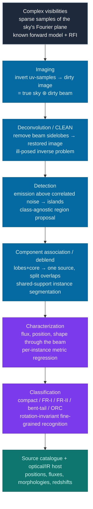
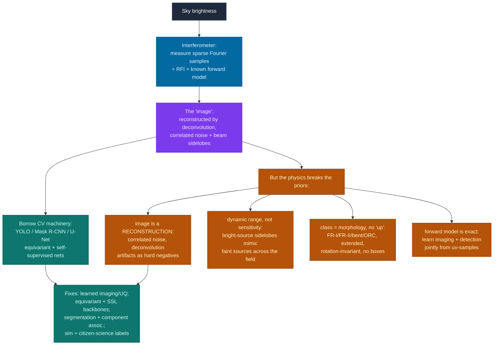

# Dense Object Detection & Classification — Recent Advances

*Compiled 2026-Aug-23 (America/Los_Angeles).*

Next installment in the running CV-updates log. Earlier entries on
`main`:
[Apr-30](../2026-Apr-30/2026-Apr-30_CV_updates.md),
[May-01](../2026-May-01/2026-May-01_CV_updates.md),
[May-02](../2026-May-02/2026-May-02_CV_updates.md),
[May-04](../2026-May-04/2026-May-04_CV_updates.md),
[May-05](../2026-May-05/2026-May-05_CV_updates.md),
[May-07](../2026-May-07/2026-May-07_CV_updates.md),
[May-08](../2026-May-08/2026-May-08_CV_updates.md),
[May-15](../2026-May-15/2026-May-15_CV_updates.md),
[May-16](../2026-May-16/2026-May-16_CV_updates.md),
[May-17](../2026-May-17/2026-May-17_CV_updates.md),
[Jun-09](../2026-Jun-09/2026-Jun-09_CV_updates.md),
[Jun-10](../2026-Jun-10/2026-Jun-10_CV_updates.md),
[Jun-12](../2026-Jun-12/2026-Jun-12_CV_updates.md),
[Jun-15](../2026-Jun-15/2026-Jun-15_CV_updates.md),
[Jun-16](../2026-Jun-16/2026-Jun-16_CV_updates.md),
[Jun-17](../2026-Jun-17/2026-Jun-17_CV_updates.md),
[Jun-19](../2026-Jun-19/2026-Jun-19_CV_updates.md),
[Jun-21](../2026-Jun-21/2026-Jun-21_CV_updates.md),
[Jun-22](../2026-Jun-22/2026-Jun-22_CV_updates.md),
[Jun-23](../2026-Jun-23/2026-Jun-23_CV_updates.md),
[Jun-24](../2026-Jun-24/2026-Jun-24_CV_updates.md),
[Jun-25](../2026-Jun-25/2026-Jun-25_CV_updates.md),
[Jun-27](../2026-Jun-27/2026-Jun-27_CV_updates.md),
[Jun-29](../2026-Jun-29/2026-Jun-29_CV_updates.md),
[Jun-30](../2026-Jun-30/2026-Jun-30_CV_updates.md),
[Jul-04](../2026-Jul-04/2026-Jul-04_CV_updates.md),
[Jul-07](../2026-Jul-07/2026-Jul-07_CV_updates.md),
[Jul-08](../2026-Jul-08/2026-Jul-08_CV_updates.md),
[Jul-10](../2026-Jul-10/2026-Jul-10_CV_updates.md),
[Jul-15](../2026-Jul-15/2026-Jul-15_CV_updates.md),
[Jul-17](../2026-Jul-17/2026-Jul-17_CV_updates.md),
[Jul-18](../2026-Jul-18/2026-Jul-18_CV_updates.md),
[Jul-21](../2026-Jul-21/2026-Jul-21_CV_updates.md),
[Jul-22](../2026-Jul-22/2026-Jul-22_CV_updates.md),
[Jul-24](../2026-Jul-24/2026-Jul-24_CV_updates.md),
[Jul-26](../2026-Jul-26/2026-Jul-26_CV_updates.md),
[Jul-27](../2026-Jul-27/2026-Jul-27_CV_updates.md),
[Jul-30](../2026-Jul-30/2026-Jul-30_CV_updates.md),
[Aug-01](../2026-Aug-01/2026-Aug-01_CV_updates.md),
[Aug-02](../2026-Aug-02/2026-Aug-02_CV_updates.md),
[Aug-04](../2026-Aug-04/2026-Aug-04_CV_updates.md),
[Aug-07](../2026-Aug-07/2026-Aug-07_CV_updates.md),
[Aug-10](../2026-Aug-10/2026-Aug-10_CV_updates.md),
[Aug-11](../2026-Aug-11/2026-Aug-11_CV_updates.md),
[Aug-13](../2026-Aug-13/2026-Aug-13_CV_updates.md),
[Aug-15](../2026-Aug-15/2026-Aug-15_CV_updates.md),
[Aug-16](../2026-Aug-16/2026-Aug-16_CV_updates.md),
[Aug-18](../2026-Aug-18/2026-Aug-18_CV_updates.md),
[Aug-19](../2026-Aug-19/2026-Aug-19_CV_updates.md),
[Aug-21](../2026-Aug-21/2026-Aug-21_CV_updates.md),
[Aug-22](../2026-Aug-22/2026-Aug-22_CV_updates.md).

The last entry closed on the **optical astronomical survey image** — the
telescope's photograph of a patch of sky, where objects *add* their light,
overlapping sources must be *deblended* rather than un-occluded, and the
point-spread function is part of the object model. This pass stays on the same
sky but crosses to a modality that breaks the "image" assumption far more deeply
than optics ever did: the **radio-interferometric image**. A radio array does not
photograph anything. It measures a **sparse set of samples of the sky's Fourier
transform**, and an image only exists after a half-century-old **ill-posed
deconvolution** is solved. Detection, then, runs not on a measurement but on a
*reconstruction* — with spatially correlated noise, beam sidelobes that mimic
sources, and a dynamic range, not a sensitivity, that sets the faint-source limit.

The timing is deliberate. **2025–2026 is the year the Square Kilometre Array came
alive**: SKA-Low returned its [first images of the deep sky in March 2025](https://www.skao.int/en/news/621/ska-low-first-glimpse-universe),
SKA-Mid recorded its ["first fringes" in January 2026](https://earthsky.org/space/ska-telescope-radio-south-africa-australia/),
and — with [less than 1% of the array built](https://theconversation.com/less-than-1-of-the-worlds-biggest-radio-telescope-is-complete-but-its-first-image-reveals-a-sky-dotted-with-ancient-galaxies-252382) —
the instrument is already resolving ancient galaxies. Its precursors are already
at survey scale: the **EMU** survey on **ASKAP** is on track for [~20 million radio
sources](https://arxiv.org/abs/2509.19787) and classified ~3 million in its first
year; MeerKAT, LOFAR and the VLA feed continuous streams. Every one of those
sources is a detection, every morphology a class, and the pipeline that produces
them is — structurally — a computer-vision detector operating on a reconstructed,
physically strange image.

## Table of contents

1. [Why this pass: the radio image as its own primitive](#1--why-this-pass-the-radio-image-as-its-own-primitive)
2. [The primitive — an image you must reconstruct before you can search it](#2--the-primitive--an-image-you-must-reconstruct-before-you-can-search-it)
3. [Classical baselines — CLEAN, PyBDSF, Aegean, SoFiA](#3--classical-baselines--clean-pybdsf-aegean-sofia)
4. [Deep source finding & the interferometric twist](#4--deep-source-finding--the-interferometric-twist)
5. [Morphological classification — FR-I/FR-II, ClaRAN & equivariance](#5--morphological-classification--fr-ifr-ii-claran--equivariance)
6. [Self-supervision & foundation models for the radio sky](#6--self-supervision--foundation-models-for-the-radio-sky)
7. [Structured noise — RFI flagging as segmentation](#7--structured-noise--rfi-flagging-as-segmentation)
8. [Learned imaging — detection that reaches into the uv-plane](#8--learned-imaging--detection-that-reaches-into-the-uv-plane)
9. [Why a radio image is *not* a natural image](#9--why-a-radio-image-is-not-a-natural-image)
10. [Open problems / what to watch](#10--open-problems--what-to-watch)
11. [Sources](#11--sources)

## 1 · Why this pass: the radio image as its own primitive

Four properties make a radio-interferometric image worth treating as a
first-class dense-vision modality rather than "an astronomy photo at a longer
wavelength" — and each one distinguishes it sharply from the optical survey image
of the last entry:

- **The image is a reconstruction, not a measurement.** An interferometer
  correlates pairs of dishes/stations to measure **complex visibilities**, which
  by the van Cittert–Zernike theorem are **samples of the Fourier transform** of
  the sky brightness. The array samples the Fourier ("uv") plane only along sparse
  arcs, so most spatial frequencies are simply **never measured**. Forming an
  image is an **ill-posed inverse problem**, and detection happens on its solution
  — with all the correlated noise and reconstruction artifacts that implies.
- **The PSF has enormous sidelobes, and dynamic range is the real limit.** Because
  the uv-coverage is incomplete, the effective point-spread function — the **dirty
  beam** — has large, structured sidelobes. A single bright source rings the whole
  field with beam artifacts that look exactly like faint sources. What limits
  faint-source detection is therefore **dynamic range** (how well you can subtract
  the bright things) far more than raw sensitivity — a failure mode with no analogue
  in ordinary photography.
- **Class is morphology at arbitrary orientation.** The canonical radio-source
  classes — compact, **Fanaroff-Riley I** (core-brightened), **FR-II**
  (edge-brightened with terminal hotspots), bent-tail, and the newly-recognized
  **odd radio circles** — are defined by the *shape* of extended, often
  multi-component emission. There is no "up" on the sky, so the classifier must be
  **rotation-invariant**, and a source's useful description is a segmentation of
  its components, not an axis-aligned box.
- **The forward model is exact, and the labels are scarce.** Sky → visibilities is
  known linear physics, which is why the frontier folds imaging and detection into
  one differentiable model (§8). But *labels* are as patchy as anywhere in this
  log: bright, isolated sources are cheap; extended morphologies come from
  **citizen science** (Radio Galaxy Zoo); and the faint, blended, SKA-scale regime
  is labeled by **simulation** (the SKA Science Data Challenges), importing the
  sim-to-real problem wholesale.

Add the deployment context — SKA now switching on, EMU/ASKAP and LOFAR/LoTSS
already at multi-million-source scale, and a decade of exabyte-class data ahead —
and the setting is unmistakable: enormous throughput, faint overlapping sources on
a reconstructed canvas, a known forward model, and a detection-and-classification
pipeline that must run *fast* and *whole-survey*.

## 2 · The primitive — an image you must reconstruct before you can search it

The radio pipeline lays a ladder of dense-detection tasks over the reconstructed
image, each a direct analogue of a computer-vision primitive — but with an extra
rung, **imaging**, that has no counterpart in ordinary vision (figure above):

- **Imaging** — invert the sparsely-sampled visibilities into a **dirty image**
  (true sky ⊛ dirty beam), then **deconvolve** the beam response to get a
  restored image. This step *is* the "camera," and it is a learned or optimized
  inverse problem, not a lens.
- **Detection** — find every region of significant emission above the (correlated)
  noise floor and group connected pixels into an **island**. This is
  class-agnostic region proposal against a noise model complicated by residual
  sidelobes.
- **Component association / deblending** — an extended source can appear as
  several disjoint islands (two lobes plus a core); the task is to **associate**
  them into one physical object, and to split blended overlaps. This is the radio
  version of shared-support instance segmentation.
- **Characterization (photometry)** — fit each source's **flux, position, and
  shape** (often as a sum of Gaussians) through the restored beam. Per-instance
  metric regression, not a bounding box.
- **Classification** — assign a **morphology** (compact / FR-I / FR-II / bent-tail
  / ORC), and, cross-matched with optical/IR, a host and redshift. The fine-grained
  rung, and where deep learning has taken over most completely.

Two consequences follow immediately, and both echo the optical entry while
sharpening it:

- **Localization is a set of components, not a box.** As with a diagonal muon
  track (Aug-21) or a blended galaxy (Aug-22), an extended radio galaxy's
  axis-aligned rectangle is mostly empty sky and, worse, its lobes may not even
  touch. The field went straight to **segmentation + component association**,
  never box-based detection.
- **Detection is causally downstream of a reconstruction.** You cannot detect
  before you image, and you cannot image without choosing a deconvolution. The
  classical pipeline hard-codes this chain; the modern research question (§8) is how
  much of it to replace with a single learned model that reaches all the way back to
  the visibilities.

## 3 · Classical baselines — CLEAN, PyBDSF, Aegean, SoFiA

Radio source finding is one of the oldest imaging pipelines in science, and its
classical tools are the workhorses every deep method is measured against.

- **CLEAN — the deconvolution baseline.** Högbom's **CLEAN** (1974) and its
  descendants (Clark, Cotton-Schwab, **multi-scale CLEAN**, MEM) iteratively find
  the brightest peak in the dirty image, subtract a scaled copy of the dirty beam,
  and repeat, accumulating a model of point (and, for multi-scale, extended)
  components. It is the "camera" of radio astronomy — ubiquitous, robust on compact
  sources, and structurally limited exactly where the sky is extended and
  high-dynamic-range.
- **PyBDSF — the canonical source finder.** The *Python Blob Detector and Source
  Finder* thresholds the restored image, groups pixels into **islands**, and fits
  each with a set of **Gaussians**, decomposing multi-component sources. It is the
  SExtractor of the radio sky: everywhere, reliable on isolated sources, the thing
  to beat.
- **Aegean, ProFound, Selavy, Caesar.** *Aegean* (Hancock et al.) uses a
  Laplacian-of-Gaussian "floodfill" to find and characterize compact sources at
  survey speed; *Selavy* is ASKAP's production finder; *Caesar* targets extended
  Galactic emission; *ProFound* brings source-adaptive segmentation from optical
  astronomy. Each is a hand-built segmentation + fitting pipeline.
- **SoFiA — the 3D (spectral-line) finder.** For **neutral-hydrogen (H I)** surveys
  the data is a **position–position–frequency cube**, and detection is a genuinely
  3D task. *SoFiA 2* (Westmeier et al. 2021) is the automated, parallel H I finder
  built for the **WALLABY** survey — smooth-and-clip in 3D, then link and reliably
  filter. It is the direct analogue of 3D volumetric detection in the medical/LArTPC
  entries.

**Where the wall is.** Classical finders fail exactly where the science gets
interesting and the SKA gets expensive: **faint, extended, multi-component sources**
and **high-dynamic-range fields** where sidelobe residuals masquerade as sources.
A Gaussian-fitting islander has no notion of what a radio galaxy *should* look
like, so it systematically **fragments** one physical source into several islands
(or merges two), and it cannot tell a real faint source from a deconvolution
artifact. Comparisons on EMU show the finders disagree most on exactly the extended
population that matters ([Extended radio galaxies in EMU: a comparative look at
source-finding techniques](https://arxiv.org/pdf/2603.10579)). This is the
"blending/association crisis" that motivates almost all the deep work below.

## 4 · Deep source finding & the interferometric twist

*(figure: the two radio-only dense tasks, §5 and §7)*

Deep learning entered radio source finding to solve exactly the association and
artifact problems classical finders cannot, and the winning systems have converged
on **segmentation and object detection**, not box regression.

- **YOLO for radio — SDC winners.** **YOLO-CIANNA** (Cornu et al., *A&A* 2024,
  [aa49548-24](https://www.aanda.org/articles/aa/full_html/2024/10/aa49548-24/aa49548-24.html))
  is a regression-based detector applied to the SKAO **Science Data Challenge 1**
  (SDC1) 2D continuum images; using the challenge metric it **improved the winning
  score by +139%** at **94% purity**, detecting 40–60% more sources than the prior
  top result. Its successor generalizes the architecture to a **3D-YOLO** and
  **won SDC2** (H I cubes) as the MINERVA team's method
  ([arXiv:2509.12082](https://arxiv.org/pdf/2509.12082)) — the same detector,
  extended from images to spectral-line volumes.
- **Segmentation & Mask R-CNN finders.** A parallel line treats detection as
  **instance segmentation**: U-Net / V-Net masks for islands and, for H I cubes, a
  **3D V-Net** that reconstructs sources directly with no preprocessing
  ([Barkai et al., *A&A* 2023](https://arxiv.org/pdf/2211.12809), with a classical
  ML classifier as a false-positive filter). Recent surveys catalogue the whole
  zoo — YOLO, Mask R-CNN, SAM, U-Net and ViTs — as pixel-level finders that
  outperform classical algorithms precisely at **associating disjoint emission
  regions** and **identifying multi-lobed sources** ([Machine-learning frameworks
  for large-scale radio surveys](https://arxiv.org/pdf/2510.11145);
  [Detection and classification of radio sources with deep learning](https://arxiv.org/pdf/2411.08519);
  [Automated source detection with DNNs, *MNRAS* 2025](https://academic.oup.com/mnras/article/547/3/stag376/8497450)).
- **Discovery as detection.** Run at survey scale, an object detector does not just
  reproduce the catalogue — it finds **new classes**. Object detection over the
  first year of EMU surfaced **odd radio circles (ORCs)** and other peculiars at a
  rate no human scan could match ([Discovery of ORCs and other peculiars in EMU
  using object detection, *PASA* 2024](https://www.cambridge.org/core/journals/publications-of-the-astronomical-society-of-australia/article/discovery-of-odd-radio-circles-and-other-peculiars-in-the-first-year-of-the-emu-survey-using-object-detection/C3953892A2843AD8B5E2F0F7B721ADFC)) —
  the same "anomaly detection = science" argument the LArTPC and survey entries made.
- **Agentic pipelines.** The newest twist wraps the *classical* finder in an LLM
  agent that tunes and iterates it: **an AI agent for source finding by SoFiA-2 for
  SKA-SDC2** ([arXiv:2512.00769](https://arxiv.org/html/2512.00769)) automates the
  parameter search a human expert would otherwise perform — a preview of how the
  SKA's throughput forces automation up the stack.

The through-line is identical to the last two entries: **every good method refuses
the bounding box** and learns a per-source *mask* plus a *component association*,
because radio sources are extended, multi-part, and sit on a reconstructed canvas
where a rectangle plus NMS was never the right target.

## 5 · Morphological classification — FR-I/FR-II, ClaRAN & equivariance

Once a source is detected and associated, naming its **morphology** is a
fine-grained classification problem — and it is the rung with a real, human-labeled
corpus.

- **The taxonomy.** The **Fanaroff-Riley** dichotomy (1974) splits extended radio
  galaxies into **FR-I** (brightest toward the core, fading outward) and **FR-II**
  (edge-brightened, with terminal hotspots), joined by compact sources, **bent-tail**
  sources (lobes swept back by intracluster gas), and rarer classes. These are
  defined by *shape at arbitrary orientation* (figure, §4).
- **CNN classifiers.** Aniyan & Thorat (2017) did the groundwork — CNNs
  distinguishing FR-I / FR-II / bent-tail — and the field has iterated steadily
  since, including the recent **RGC** radio-AGN classifier
  ([arXiv:2510.22190](https://arxiv.org/html/2510.22190)) and supervised
  classification of **compact** sources in the Galactic plane
  ([arXiv:2402.15232](https://arxiv.org/pdf/2402.15232)).
- **ClaRAN — detection + classification in one pass.** **ClaRAN** (Wu et al.,
  *MNRAS* 2019, [482, 1211](https://academic.oup.com/mnras/article/482/1/1211/5142869))
  ports **Faster R-CNN** to Radio Galaxy Zoo (FIRST radio + WISE infrared),
  becoming the first open-source, end-to-end classifier that **locates and
  associates** discrete and extended components and labels morphology in **<200 ms
  per image at ≥90% accuracy** — the radio transplant of natural-image detection,
  and (tellingly) one that fuses radio and IR channels.
- **Equivariance — because the sky has no up.** The single most modality-specific
  architectural idea here is **rotational symmetry**. **Group-equivariant CNNs**
  for FR classification (Scaife & Porter, *MNRAS* 2021,
  [503, 2369](https://academic.oup.com/mnras/article/503/2/2369/6152263)) bake
  rotation/reflection invariance into the network, improving accuracy and
  data-efficiency; semi-supervised equivariant variants extend the idea to scarce
  labels. This is the radio answer to the augmentation-heavy training the optical
  survey entry used — but built into the weights rather than the data.

Morphology classification is thus the modality's "mature supervised rung": a real
labeled corpus (Radio Galaxy Zoo), a symmetry the architecture can exploit, and
detectors that classify and associate in one pass.

## 6 · Self-supervision & foundation models for the radio sky

Because labels are scarce exactly where the science is hard, **self-supervised**
learning on unlabeled radio imaging is arguably a more natural fit here than in any
optical modality — the sky is enormous, mostly uncatalogued, and its augmentations
(rotate, flip, re-noise) are physically principled.

- **Contrastive backbones.** Slijepcevic, Scaife et al. trained **BYOL** on
  ~10⁵ unlabeled **VLA FIRST** images and fine-tuned for FR-I/FR-II, matching or
  **beating** the fully-supervised model (up to ~8% on MIGHTEE) with far fewer
  labels — the first evidence of a **radio-astronomy foundation model**
  ([*RASTI* 2024, "towards the first multipurpose foundation model for radio
  astronomy"](https://academic.oup.com/rasti/article/doi/10.1093/rasti/rzag037/8676723)).
- **SSL for detection, classification & discovery.** Gupta et al.
  ([*PASA* 2024, arXiv:2404.18462](https://arxiv.org/pdf/2404.18462)) apply
  self-supervised contrastive learning to radio data for **source detection,
  classification and peculiar-object discovery** in one representation, then
  fine-tune on small labeled sets from several surveys — the label-economy fix that
  recurs across this whole log.
- **Radio Galaxy Zoo, foundation-model edition.** The 2025 line makes the citizen-
  science + self-supervision marriage explicit: **FR classification by
  self-supervised pre-training** ([*MNRAS* 2025](https://dx.doi.org/10.1093/mnras/staf1942),
  [arXiv:2509.11988](https://arxiv.org/html/2509.11988v1)); **classification of
  radio sources through SSL** ([*A&A* 2025](https://www.aanda.org/articles/aa/full_html/2025/07/aa54735-25/aa54735-25.html));
  and **Radio Galaxy Zoo: EMU**, which couples volunteer labels with AI to build
  open-science catalogues at EMU scale ([arXiv:2509.19787](https://arxiv.org/html/2509.19787v1)).
- **Vision-language for radio.** **radio-llava**
  ([arXiv:2503.23859](https://arxiv.org/pdf/2503.23859)) adapts a vision-language
  model to radio-astronomical source analysis — captioning and answering questions
  about source morphology — importing the CLIP/LLaVA recipe that reshaped
  natural-image understanding into the radio domain, the analogue of AstroCLIP for
  the optical sky (Aug-22).

The bet is the same one CLIP and the collider/optical foundation models made:
**pretrain once on the raw primitive, adapt cheaply** — and in radio the argument is
structural, because the unlabeled sky dwarfs every catalogue.

## 7 · Structured noise — RFI flagging as segmentation

The most operationally intense dense task in radio is not on the sky image at all;
it is on the **raw dynamic spectrum**, *before* imaging. **Radio-frequency
interference (RFI)** — satellites, aircraft, phones, radar, the observatory's own
electronics — contaminates the visibilities, and every corrupted time–frequency
pixel must be **flagged** or it corrupts the whole image (figure, §4, left).

- **The task is per-pixel segmentation at extreme imbalance.** RFI appears as
  **horizontal** stripes (persistent narrow-band transmitters), **vertical** stripes
  (broadband bursts), and **diagonal/blob** tracks (satellites), against a faint
  astronomical background. Flagging is a **binary segmentation** of the
  time–frequency plane — and, like real/bogus in the optical time domain (Aug-22),
  a textbook **hard-negative, class-imbalanced** problem where precision at the
  boundary is everything.
- **Classical baseline: AOFlagger.** Offringa's **AOFlagger** (SumThreshold on the
  dynamic spectrum) is the ubiquitous, fast baseline — the "SExtractor of RFI" that
  the deep methods must beat.
- **Deep flaggers.** CNN and **U-Net** segmentation of the dynamic spectrum began
  with Akeret et al. (2017); **Mesarcik et al.** ([*MNRAS* 2020,
  arXiv:2005.08992](https://arxiv.org/abs/2005.08992)) showed deep learning
  **improves RFI identification** over classical flaggers. A **ResNet-based R-Net**
  reportedly outperforms the default MeerKAT flagger and U-Nets across AUC/F1/MCC —
  ~90% better precision at 80% recall — and demonstrates **transfer learning** from
  simulated MeerKAT data to real, human-flagged KAT-7 data. A 2024 **comparison
  framework** ([*MNRAS* 530, 613](https://academic.oup.com/mnras/article/530/1/613/7637224))
  systematizes FCN architectures, losses and regularization for the task.

RFI flagging is where the modality's throughput pressure bites first: at SKA data
rates the flag mask must be computed **streaming**, on data that never fully lands
on disk — trigger-rate segmentation, radio edition.

## 8 · Learned imaging — detection that reaches into the uv-plane

The deepest departure from natural-image vision is that in radio, the "camera" is
itself a learnable inverse problem. If detection is downstream of a reconstruction,
why not **learn the reconstruction** — or fold it into the detector?

- **Neural deconvolution / super-resolution.** **POLISH** (Connor et al.,
  *MNRAS* 2022, [514, 2614; arXiv:2111.03249](https://arxiv.org/abs/2111.03249)) is
  a high-dynamic-range residual network that learns the mapping from **dirty image →
  true sky**, treating deconvolution as **single-image super-resolution** and
  reaching resolution **below the array's diffraction limit** — designed for the
  feed-forward speed the DSA-2000 will demand. It beats CLEAN on reconstruction
  quality while running in one forward pass.
- **End-to-end frameworks.** The **radionets** project
  ([Schmidt et al., *A&A* 2022](https://www.aanda.org/articles/aa/full_html/2022/08/aa42113-21/aa42113-21.html);
  [code](https://github.com/radionets-project/radionets)) reconstructs calibrated
  visibilities into high-resolution images with CNNs, an open framework for
  simulating and learning the imaging step directly.
- **Uncertainty-aware imaging.** Because the image feeds science measurements,
  reconstruction must come with error bars: **scalable Bayesian uncertainty
  quantification with data-driven priors for radio-interferometric imaging**
  ([arXiv:2312.00125](https://arxiv.org/pdf/2312.00125)) learns a prior and returns
  calibrated per-pixel uncertainty — so a "detection" carries a probability, not
  just a peak.
- **Why this is the frontier.** The forward operator (sky → visibilities) is *known
  and differentiable*, so a single model can, in principle, run detection **against
  the raw uv-samples** — jointly imaging, deconvolving, and finding sources, with
  the sidelobe response handled inside the network instead of by a separate CLEAN.
  That collapses the entire §2 ladder into one learned pass, and it is the radio
  twin of the "generative set-prediction from raw data" frontier the LArTPC and
  optical-survey entries both reached.

## 9 · Why a radio image is *not* a natural image

The enterprise rests, as always, on a productive lie — that a radio map is a
photograph. It leaks in four places, and each leak is a live research direction.

The four structural departures:

1. **The image is a reconstruction, not a measurement.** It is the solution to an
   ill-posed inverse problem from incomplete Fourier samples, so its noise is
   **spatially correlated** and its **deconvolution artifacts are structured hard
   negatives**. There is no analogue in ordinary vision, where the sensor delivers
   the scene directly.
2. **Dynamic range, not sensitivity, sets the limit.** A bright source rings the
   field with **beam sidelobes** that imitate faint sources; the faint-source
   detection floor is set by how well the bright things are subtracted, not by raw
   noise. Detection and deconvolution are inseparable.
3. **Class is morphology at arbitrary orientation.** FR-I vs. FR-II vs. bent-tail
   vs. ORC are defined by the **shape** of extended, multi-component emission with
   **no preferred orientation** — which is why the field adopted segmentation,
   component association, and **group-equivariant** networks rather than boxes.
4. **The forward model is exact and the labels are a patchwork.** Sky →
   visibilities is known physics, inviting **learned end-to-end imaging+detection**;
   meanwhile labels come from **citizen science** (Radio Galaxy Zoo) and
   **simulation** (SKA SDCs), importing the **sim-to-real** gap the particle-detector
   entry made central.

## 10 · Open problems / what to watch

- **Source finding at SKA throughput.** The SKA will produce data faster than any
  catalogue can be built by hand; the open question is whether learned finders
  (YOLO-CIANNA-class detectors, 3D V-Nets, agentic SoFiA wrappers) can run
  **streaming, at survey scale, with controlled purity and completeness** on real —
  not simulated — data. The SDC leaderboard is the proving ground; real SKA
  commissioning data is the test.
- **Detection that reaches into the uv-plane.** Folding imaging, deconvolution and
  detection into one differentiable model (POLISH, radionets, and their successors)
  is the radio twin of proposal-free instance segmentation. Whether such models can
  replace the proven CLEAN→PyBDSF chain at survey scale, with trustworthy dynamic
  range, is open.
- **Foundation models across arrays.** BYOL/contrastive backbones and radio-llava
  each work within a survey or two; a single encoder that transfers **across
  instruments** (VLA vs. MeerKAT vs. LOFAR vs. SKA-Low vs. SKA-Mid — different
  beams, frequencies and uv-coverage) is the genuine "foundation model" claim, and
  the faint, extended, out-of-distribution regime that dominates the science is
  where it will be stress-tested.
- **Calibration, uncertainty & OOD discovery.** When a detection feeds a cosmology
  measurement or a multi-wavelength follow-up, a miscalibrated classifier is a
  liability. Bayesian imaging (arXiv:2312.00125), equivariant uncertainty, and
  **anomaly detection** — the pathway that surfaced ORCs — are the bar the field is
  setting for itself.
- **RFI in an ever-noisier sky.** Satellite mega-constellations are making the radio
  environment worse every year; streaming, transfer-learnable RFI segmentation that
  generalizes across sites and to never-before-seen interference is a permanent,
  escalating arms race.
- **Sim-to-real, again.** Every deep finder and many classifiers are born on
  **simulated** sky (the SDCs) or one survey's FIRST/EMU images; the science lives
  on real, RFI-ridden, beam-varying data. Domain adaptation and simulation-based
  calibration are as central here as they were for the particle detector (Aug-21).

## 11 · Sources

Grouped by section. Links are to journal pages, arXiv abstracts/PDFs, official
project repos, or observatory/mission pages. A few 2025–2026 items are recent
preprints or news posts; where an arXiv ID or exact metric could not be
independently double-checked in the build environment it is cited by title, venue
and (where known) authors, and none were fabricated. Headline metrics are quoted as
reported in the abstracts/pages and should be verified against the primary PDF
before formal citation.

**Framing & prior entries (§1–2)**
- Closest structural rhymes in this log: [Aug-22](../2026-Aug-22/2026-Aug-22_CV_updates.md) (optical survey image: additive, deblending, PSF-as-object), [Aug-21](../2026-Aug-21/2026-Aug-21_CV_updates.md) (particle detectors: additive, box-free, sim-labeled), [Aug-19](../2026-Aug-19/2026-Aug-19_CV_updates.md) (spectrograms). This is the first entry to treat the **radio-interferometric** image as the primitive.
- SKAO construction journey & status: https://www.skao.int/en/explore/construction-journey · SKA-Low first images (Mar 2025): https://www.skao.int/en/news/621/ska-low-first-glimpse-universe · SKA-Mid "first fringes" (Jan 2026): https://earthsky.org/space/ska-telescope-radio-south-africa-australia/ · "<1% complete, first image": https://theconversation.com/less-than-1-of-the-worlds-biggest-radio-telescope-is-complete-but-its-first-image-reveals-a-sky-dotted-with-ancient-galaxies-252382 · SKA 2025 year in review: https://www.atnf.csiro.au/daily-picture/2026/01/19/ska-2025-year-in-review/
- EMU (Evolutionary Map of the Universe) on ASKAP — scale (~20 M sources; ~3 M classified in year one): *Radio Galaxy Zoo: EMU*, 2025, arXiv:2509.19787 — https://arxiv.org/html/2509.19787v1

**Classical baselines — CLEAN, PyBDSF, Aegean, SoFiA (§3)**
- Högbom, *Aperture Synthesis with a Non-Regular Distribution of Interferometer Baselines (CLEAN)*, A&AS 15, 417 (1974) — https://ui.adsabs.harvard.edu/abs/1974A%26AS...15..417H
- Mohan & Rafferty, *PyBDSF: Python Blob Detection and Source Finder* — https://pybdsf.readthedocs.io · ascl:1502.007
- Hancock, Murphy, Gaensler, Hopkins & Curran, *Compact continuum source finding for next generation radio surveys (Aegean)*, MNRAS 422, 1812 (2012), arXiv:1202.4500 — https://arxiv.org/abs/1202.4500 · Hancock, Trott & Hurley-Walker, *Source Finding in the Era of the SKA (Aegean 2.0)*, PASA 35, e011 (2018), arXiv:1801.05548 — https://arxiv.org/abs/1801.05548
- Westmeier et al., *SoFiA 2 — an automated, parallel H I source finding pipeline for the WALLABY survey*, MNRAS 506, 3962 (2021), arXiv:2109.11735 — https://arxiv.org/abs/2109.11735 · code: https://github.com/SoFiA-Admin/SoFiA-2
- *Extended Radio Galaxies in EMU: A Comparative Look at Source-Finding Techniques*, 2026, arXiv:2603.10579 — https://arxiv.org/pdf/2603.10579 *(ID from listing snippet; confirm before formal citation)*

**Deep source finding & the interferometric twist (§4)**
- Cornu et al., *YOLO-CIANNA: Galaxy detection with deep learning in radio data — I. A new YOLO-inspired source detection method applied to the SKAO SDC1*, A&A 690, A211 (2024) — https://www.aanda.org/articles/aa/full_html/2024/10/aa49548-24/aa49548-24.html *(+139% over SDC1 winning score; 94% purity)*
- Cornu et al., *YOLO-CIANNA … II. Winning the SKA SDC2 using a generalized 3D-YOLO network*, 2025, arXiv:2509.12082 — https://arxiv.org/pdf/2509.12082
- Barkai, Verheijen, Talavera & Wilkinson, *A comparative study of source-finding techniques in H I emission line cubes using SoFiA, MTObjects, and supervised deep learning (3D V-Net)*, A&A 670, A55 (2023), arXiv:2211.12809 — https://arxiv.org/pdf/2211.12809 · code: https://github.com/Jbarkai/HISourceFinder
- *Machine Learning Frameworks for Large-Scale Radio Surveys: A Summary of Recent Studies*, 2025, arXiv:2510.11145 — https://arxiv.org/pdf/2510.11145
- *Detection and classification of radio sources with deep learning*, 2024, arXiv:2411.08519 — https://arxiv.org/pdf/2411.08519
- *Automated source detection in radio astronomy images using deep neural networks*, MNRAS 2025 — https://academic.oup.com/mnras/article/547/3/stag376/8497450
- Yu et al., *A deep learning framework for Square Kilometre Array Science Data Challenge 1*, MNRAS 511, 4305 (2022) — https://ui.adsabs.harvard.edu/abs/2022MNRAS.511.4305Y/abstract
- Lochner et al. (EMU), *Discovery of odd radio circles and other peculiars in the first year of the EMU survey using object detection*, PASA (2024) — https://www.cambridge.org/core/journals/publications-of-the-astronomical-society-of-australia/article/discovery-of-odd-radio-circles-and-other-peculiars-in-the-first-year-of-the-emu-survey-using-object-detection/C3953892A2843AD8B5E2F0F7B721ADFC
- *An AI Agent for Source Finding by SoFiA-2 for SKA-SDC2*, 2025, arXiv:2512.00769 — https://arxiv.org/html/2512.00769
- *3D Detection and Characterisation of ALMA Sources through Deep Learning*, 2022, arXiv:2211.11462 — https://arxiv.org/pdf/2211.11462

**Morphological classification — FR-I/FR-II, ClaRAN & equivariance (§5)**
- Fanaroff & Riley, *The morphology of extragalactic radio sources of high and low luminosity*, MNRAS 167, 31P (1974) — https://ui.adsabs.harvard.edu/abs/1974MNRAS.167P..31F
- Aniyan & Thorat, *Classifying Radio Galaxies with the Convolutional Neural Network*, ApJS 230, 20 (2017), arXiv:1705.03413 — https://arxiv.org/abs/1705.03413
- Wu, Wong, Rudnick, Shabala et al., *Radio Galaxy Zoo: ClaRAN — a deep learning classifier for radio morphologies*, MNRAS 482, 1211 (2019), arXiv:1805.12008 — https://academic.oup.com/mnras/article/482/1/1211/5142869 · code: https://github.com/chenwuperth/rgz_rcnn
- Scaife & Porter, *Fanaroff–Riley classification of radio galaxies using group-equivariant convolutional neural networks*, MNRAS 503, 2369 (2021), arXiv:2102.08252 — https://academic.oup.com/mnras/article/503/2/2369/6152263
- *RGC: a radio AGN classifier based on deep learning*, 2025, arXiv:2510.22190 — https://arxiv.org/html/2510.22190
- *Classification of compact radio sources in the Galactic plane with supervised machine learning*, 2024, arXiv:2402.15232 — https://arxiv.org/pdf/2402.15232

**Self-supervision & foundation models (§6)**
- Slijepcevic, Scaife, Walmsley, Bowles et al., *Radio Galaxy Zoo: Towards building the first multipurpose foundation model for radio astronomy with self-supervised learning*, RASTI 3, 19 (2024), arXiv:2305.16127 — https://academic.oup.com/rasti/article/doi/10.1093/rasti/rzag037/8676723 · (earlier: *Learning useful representations for radio astronomy "in the wild" with contrastive learning*, arXiv:2207.08666)
- Gupta et al., *Self-supervised contrastive learning of radio data for source detection, classification and peculiar object discovery*, PASA (2024), arXiv:2404.18462 — https://arxiv.org/pdf/2404.18462
- *Radio Galaxy Zoo: Morphological classification by Fanaroff-Riley designation using self-supervised pre-training*, MNRAS 2025 — https://dx.doi.org/10.1093/mnras/staf1942 · arXiv:2509.11988 — https://arxiv.org/html/2509.11988v1
- *Classification of radio sources through self-supervised learning*, A&A 2025 — https://www.aanda.org/articles/aa/full_html/2025/07/aa54735-25/aa54735-25.html
- *Variational views for self-supervised learning in radio astronomy*, RASTI 2025 — https://academic.oup.com/rasti/article/doi/10.1093/rasti/rzag037/8676723
- *radio-llava: Advancing Vision-Language Models for Radio Astronomical Source Analysis*, 2025, arXiv:2503.23859 — https://arxiv.org/pdf/2503.23859

**Structured noise — RFI flagging (§7)**
- Offringa, van de Gronde & Roerdink, *A morphological algorithm for improving radio-frequency interference detection (AOFlagger / SumThreshold)*, A&A 539, A95 (2012), arXiv:1201.3364 — https://arxiv.org/abs/1201.3364
- Akeret, Chang, Lucchi & Refregier, *Radio frequency interference mitigation using deep convolutional neural networks (U-Net)*, Astronomy and Computing 18, 35 (2017), arXiv:1609.09077 — https://arxiv.org/abs/1609.09077
- Mesarcik, Boonstra, Meijer, Jansen, Ranguelova & van Nieuwpoort, *Deep learning improves identification of Radio Frequency Interference*, MNRAS 499, 379 (2020), arXiv:2005.08992 — https://arxiv.org/abs/2005.08992
- *A comparison framework for deep learning RFI detection algorithms*, MNRAS 530, 613 (2024) — https://academic.oup.com/mnras/article/530/1/613/7637224
- R-Net (ResNet RFI flagger; transfer learning simulated MeerKAT → real KAT-7) — reported via the 2024 comparison-framework and MeerKAT flagging literature above; confirm the primary reference before formal citation.

**Learned imaging & uncertainty (§8)**
- Connor, Bouman, Ravi & Hallinan, *Deep radio-interferometric imaging with POLISH: DSA-2000 and weak lensing*, MNRAS 514, 2614 (2022), arXiv:2111.03249 — https://arxiv.org/abs/2111.03249
- Schmidt, Geyer, Fröse, Blomenkamp et al., *Deep learning-based imaging in radio interferometry (radionets)*, A&A 664, A134 (2022) — https://www.aanda.org/articles/aa/full_html/2022/08/aa42113-21/aa42113-21.html · code: https://github.com/radionets-project/radionets
- *Scalable Bayesian uncertainty quantification with data-driven priors for radio interferometric imaging*, 2023, arXiv:2312.00125 — https://arxiv.org/pdf/2312.00125

**SKA Science Data Challenges & surveys (context, §1/§4/§10)**
- SKAO Science Data Challenges — overview: https://www.skao.int/en/science-users/160/ska-science-data-challenges · HI-FRIENDS SDC2 solution docs: https://hi-friends-sdc2.readthedocs.io/en/latest/introduction.html
- WALLABY (ASKAP H I survey), LoTSS (LOFAR Two-metre Sky Survey), MIGHTEE (MeerKAT) — the precursor surveys these methods are trained and validated on; see survey pages via the SKAO and respective observatory sites.
