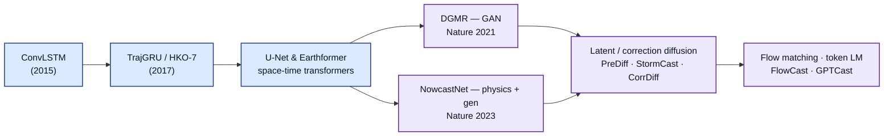

# Dense Object Detection & Classification — Recent Advances

*Compiled 2026-Aug-25 (America/Los_Angeles).*

Next installment in the running CV-updates log. Earlier entries on
`main`:
[Apr-30](../2026-Apr-30/2026-Apr-30_CV_updates.md),
[May-01](../2026-May-01/2026-May-01_CV_updates.md),
[May-02](../2026-May-02/2026-May-02_CV_updates.md),
[May-04](../2026-May-04/2026-May-04_CV_updates.md),
[May-05](../2026-May-05/2026-May-05_CV_updates.md),
[May-07](../2026-May-07/2026-May-07_CV_updates.md),
[May-08](../2026-May-08/2026-May-08_CV_updates.md),
[May-15](../2026-May-15/2026-May-15_CV_updates.md),
[May-16](../2026-May-16/2026-May-16_CV_updates.md),
[May-17](../2026-May-17/2026-May-17_CV_updates.md),
[Jun-09](../2026-Jun-09/2026-Jun-09_CV_updates.md),
[Jun-10](../2026-Jun-10/2026-Jun-10_CV_updates.md),
[Jun-12](../2026-Jun-12/2026-Jun-12_CV_updates.md),
[Jun-15](../2026-Jun-15/2026-Jun-15_CV_updates.md),
[Jun-16](../2026-Jun-16/2026-Jun-16_CV_updates.md),
[Jun-17](../2026-Jun-17/2026-Jun-17_CV_updates.md),
[Jun-19](../2026-Jun-19/2026-Jun-19_CV_updates.md),
[Jun-21](../2026-Jun-21/2026-Jun-21_CV_updates.md),
[Jun-22](../2026-Jun-22/2026-Jun-22_CV_updates.md),
[Jun-23](../2026-Jun-23/2026-Jun-23_CV_updates.md),
[Jun-24](../2026-Jun-24/2026-Jun-24_CV_updates.md),
[Jun-25](../2026-Jun-25/2026-Jun-25_CV_updates.md),
[Jun-27](../2026-Jun-27/2026-Jun-27_CV_updates.md),
[Jun-29](../2026-Jun-29/2026-Jun-29_CV_updates.md),
[Jun-30](../2026-Jun-30/2026-Jun-30_CV_updates.md),
[Jul-04](../2026-Jul-04/2026-Jul-04_CV_updates.md),
[Jul-07](../2026-Jul-07/2026-Jul-07_CV_updates.md),
[Jul-08](../2026-Jul-08/2026-Jul-08_CV_updates.md),
[Jul-10](../2026-Jul-10/2026-Jul-10_CV_updates.md),
[Jul-15](../2026-Jul-15/2026-Jul-15_CV_updates.md),
[Jul-17](../2026-Jul-17/2026-Jul-17_CV_updates.md),
[Jul-18](../2026-Jul-18/2026-Jul-18_CV_updates.md),
[Jul-21](../2026-Jul-21/2026-Jul-21_CV_updates.md),
[Jul-22](../2026-Jul-22/2026-Jul-22_CV_updates.md),
[Jul-24](../2026-Jul-24/2026-Jul-24_CV_updates.md),
[Jul-26](../2026-Jul-26/2026-Jul-26_CV_updates.md),
[Jul-27](../2026-Jul-27/2026-Jul-27_CV_updates.md),
[Jul-30](../2026-Jul-30/2026-Jul-30_CV_updates.md),
[Aug-01](../2026-Aug-01/2026-Aug-01_CV_updates.md),
[Aug-02](../2026-Aug-02/2026-Aug-02_CV_updates.md),
[Aug-04](../2026-Aug-04/2026-Aug-04_CV_updates.md),
[Aug-07](../2026-Aug-07/2026-Aug-07_CV_updates.md),
[Aug-10](../2026-Aug-10/2026-Aug-10_CV_updates.md),
[Aug-11](../2026-Aug-11/2026-Aug-11_CV_updates.md),
[Aug-13](../2026-Aug-13/2026-Aug-13_CV_updates.md),
[Aug-15](../2026-Aug-15/2026-Aug-15_CV_updates.md),
[Aug-16](../2026-Aug-16/2026-Aug-16_CV_updates.md),
[Aug-18](../2026-Aug-18/2026-Aug-18_CV_updates.md),
[Aug-19](../2026-Aug-19/2026-Aug-19_CV_updates.md),
[Aug-21](../2026-Aug-21/2026-Aug-21_CV_updates.md),
[Aug-22](../2026-Aug-22/2026-Aug-22_CV_updates.md),
[Aug-24](../2026-Aug-24/2026-Aug-24_CV_updates.md).

The last entry turned a buried telecom fiber into a dense **strain image** via
distributed acoustic sensing — a geophysical, image-shaped stream where cars,
earthquakes and whales each draw a recognizable shape to detect and classify.
This pass stays with geophysics but moves to the sky and to the oldest, most
operational dense image in all of Earth observation: the **weather-radar scan**.
A rotating antenna sweeps a fan beam, samples the returned power (and Doppler
velocity, and polarization) in range–azimuth bins, and grids them into a
two-dimensional **reflectivity image** — a national mosaic refreshed every couple
of minutes. In that image *thunderstorms, squall lines, supercells, hail cores
and melting layers each have a recognizable signature*. But this modality carries
a twist the log has not met head-on before: the marquee task is not to label a
frozen scene, it is to **predict the next frames** — *nowcasting* — and the events
that matter most (a tornado, a hail core, an extreme rain rate) are exactly the
ones a mean-squared-error forecast blurs into nothing. That single pressure is
why weather radar has become one of the most active proving grounds for
**generative video models** in all of science, and why it earns its own
installment.

> A note on scope. This is deliberately **not** the [Jul-04 automotive imaging
> radar](../2026-Jul-04/2026-Jul-04_CV_updates.md) pass (sparse, Doppler-rich,
> 77 GHz, car-scale) nor the [Aug-10 ground-penetrating radar](../2026-Aug-10/2026-Aug-10_CV_updates.md)
> pass (subsurface). Meteorological radar is a different beast: S/C/X-band,
> hundreds of kilometres of range, a *continent-scale mosaic* whose objects are
> storms that **grow and decay** on the time axis.

## Table of contents

1. [Why this pass: the radar mosaic as its own primitive](#1--why-this-pass-the-radar-mosaic-as-its-own-primitive)
2. [The primitive — a radar scan is a dense reflectivity image](#2--the-primitive--a-radar-scan-is-a-dense-reflectivity-image)
3. [The learning stack — from moments to a prediction](#3--the-learning-stack--from-moments-to-a-prediction)
4. [Nowcasting as conditional video generation](#4--nowcasting-as-conditional-video-generation)
5. [Detection & classification beyond nowcasting](#5--detection--classification-beyond-nowcasting)
6. [Datasets, benchmarks & the rare-event problem](#6--datasets-benchmarks--the-rare-event-problem)
7. [Why a radar mosaic is *not* a natural image](#7--why-a-radar-mosaic-is-not-a-natural-image)
8. [Open problems / what to watch](#8--open-problems--what-to-watch)
9. [Sources](#9--sources)

## 1 · Why this pass: the radar mosaic as its own primitive

Five properties make a weather-radar record worth treating as a first-class
dense-detection modality rather than "a picture of rain":

- **The native output is a dense, multi-channel image — and always has been.**
  A single scan grids returned power into a **reflectivity field** (dBZ); modern
  dual-polarization radars add differential reflectivity (Z_DR), specific
  differential phase (K_DP) and copolar correlation (ρ_hv), plus **Doppler radial
  velocity**. Stack the tilts and you have a volume; stitch the radars and you
  have a **national mosaic**. Detection, segmentation, tracking and classification
  in that field are exactly computer-vision problems, and the meteorology
  community has treated them that way since the ConvLSTM era.
- **The objects grow and decay — so the headline task is *prediction*.** Unlike a
  survey image or a strain waterfall, a storm is not a static object to be
  localized once. It **initiates, intensifies, splits, merges and dissipates**
  over minutes. The operational question is "what will the field look like in
  0–3 hours?", which makes the canonical task **spatiotemporal forecasting** — a
  video-prediction problem conditioned on the last few frames. Everything else
  (detection, classification) feeds it or reads out of it.
- **The distribution is heavy-tailed, and the tail is the point.** Ordinary light
  rain dominates the pixels; the decisions that matter — flash-flood rain rates,
  hail, tornadoes — live in the rare, bright extremes. A model trained to minimize
  average error learns to **hedge by blurring**, smearing tomorrow's squall line
  into a gray smudge. This "double-penalty / mean-regression" failure is the
  defining pressure of the field and is exactly what pushed it toward
  **generative** models ([DGMR](https://www.nature.com/articles/s41586-021-03854-z),
  [NowcastNet](https://www.nature.com/articles/s41586-023-06184-4)).
- **Ground truth is dense but *borrowed and noisy*.** The radar rarely labels
  itself cleanly. Rain-rate labels come from **gauges and disdrometers**;
  storm-type and severe labels come from the **NOAA Storm Events database**,
  **spotter reports** and post-event **damage surveys**; hydrometeor labels come
  from fuzzy-logic algorithms or in-situ probes. The labels are spatially sparse,
  temporally lagged, and biased toward populated areas — the same
  borrowed-supervision story the log met in DAS and the LArTPC.
- **It is already operational, at national scale, in your pocket.** This is not a
  research curiosity: **MetNet-3** runs live in Google products for the US and
  Europe at 1 km / 2-minute resolution
  ([Google Research](https://research.google/blog/metnet-3-a-state-of-the-art-neural-weather-model-available-in-google-products/)),
  DGMR was evaluated by 50+ Met Office forecasters, and NowcastNet was ranked by
  62 meteorologists across China. The deployment stakes — aviation, flood warning,
  severe-weather alerts, energy — are why the modality attracts so much method
  work.

Add the momentum of the last two years — two *Nature* nowcasting papers, the
first full-resolution polarimetric **tornado benchmark** (TorNet), a wave of
**diffusion** and **flow-matching** nowcasters, and generative **convection-allowing
model emulators** (StormCast, CorrDiff) — and the setting is unmistakable: a
continent-scale, image-shaped, refreshed-every-two-minutes stream where the job is
dense detection, fine-grained classification, and — above all — *prediction* under
a punishing heavy tail.

## 2 · The primitive — a radar scan is a dense reflectivity image

![A weather-radar scan shown as a dense detection scene: a rotating antenna sweeps a fan beam and samples returned power in range-azimuth bins, which are gridded into a reflectivity image in which an isolated thunderstorm is a compact blob, a squall line a long band, a supercell a hook echo with a Doppler velocity couplet and a tornado-debris signature, a hail core a high-reflectivity low-differential-reflectivity patch, the melting layer a bright-band ring, and ground clutter or birds echoes to be rejected](assets/radar-scan-as-dense-scene.svg)

The forward picture is short. A magnetron or klystron launches a pulse; targets
(raindrops, hail, snow, insects, the ground) **backscatter** some power; the
receiver times the echo (range) and measures its strength, its Doppler shift
(radial velocity), and — on a dual-pol radar — how the horizontal and vertical
polarizations differ. Repeat across azimuth and elevation and you fill a volume;
project or composite it and you get the familiar 2-D image:

- **Rows/columns = a spatial grid** — after gridding the polar (range, azimuth)
  bins to a Cartesian map, each pixel is a patch of sky over a patch of ground.
- **Pixel value(s) = the moments** — reflectivity Z (dBZ, a *log* scale spanning
  ~ –30 to +75), radial velocity v (signed, and **aliased**), and the dual-pol
  trio (Z_DR, K_DP, ρ_hv). A multi-channel image, not RGB.
- **The time axis = a stack of frames** — one mosaic every ~2–5 minutes.

Read as an image, the object grammar is remarkably clean — and richer than a
single blob detector would suggest:

| World phenomenon | Signature in the radar image |
|---|---|
| Isolated thunderstorm cell | A **compact high-dBZ blob**, often with a vertical column of high VIL (vertically integrated liquid) |
| Squall line / mesoscale convective system | A **long, quasi-linear band** of high reflectivity, sometimes with a trailing stratiform region |
| Supercell / tornado | A **hook echo** on the storm's rear flank + a **gate-to-gate velocity couplet** (adjacent inbound/outbound) + often a **tornado-debris signature** (a ρ_hv hole where lofted debris depolarizes the beam) |
| Hail core | Very **high Z with low/near-zero Z_DR** (tumbling, near-spherical stones), high VIL, sometimes a three-body scatter "flare" |
| Melting layer (bright band) | A **ring/band of enhanced reflectivity** at the freezing level in stratiform rain |
| Ground clutter / AP / birds & insects | Non-meteorological echo — typically **low ρ_hv** — to be **rejected**, not detected |

So the tasks are the familiar dense-vision quartet plus a forecasting head:
**detect** the storm cell / convective initiation, **segment** its footprint (and
precip-type regions), **classify** the hydrometeor type and storm mode (and the
binary severe question: tornado? hail?), and **predict** the next frames while
**regressing** motion and growth. Sections 3–5 walk that pipeline; Section 7 says
why none of it is quite computer-vision-as-usual.

## 3 · The learning stack — from moments to a prediction

![The weather-radar deep-learning stack in four layers over five verticals: raw moments gridded to a mosaic; preprocessing and quality control; a model family split into deterministic spatiotemporal predictors (ConvLSTM/TrajGRU, U-Net, Earthformer) and generative models (GAN DGMR, hybrid NowcastNet, diffusion PreDiff/StormCast/CorrDiff, flow matching, token LM GPTCast); and the tasks of nowcasting, storm-cell detection and tracking, hydrometeor and storm-mode classification, and severe-weather detection; running over aviation, flood/hydrology, severe-weather warning, energy and agriculture](assets/radar-nowcasting-stack.svg)

The community has converged on a four-layer stack, with the model layer split by
**how the frames are presented *and generated*** — the design choice that decides
whether the extremes survive:

- **Layer 1 — raw record.** Reflectivity, velocity and dual-pol moments gridded
  into a multi-radar mosaic; a spatiotemporal image stack.
- **Layer 2 — preprocessing / QC.** Clutter and non-meteorological-echo removal,
  velocity **dealiasing**, attenuation correction, log-dBZ/VIL normalization, and
  advection/optical-flow priors. On this modality QC is not optional: a bird roost
  or anomalous-propagation ground return looks like rain to a naive network.
- **Layer 3 — model family.** This is the crux, and it splits cleanly:
  - **Deterministic spatiotemporal predictors.** The lineage starts with
    **ConvLSTM** (Shi et al., NeurIPS 2015 — the paper that framed nowcasting as
    ML, [arXiv:1506.04214](https://arxiv.org/abs/1506.04214)) and **TrajGRU**
    (Shi et al., NeurIPS 2017, which added learned, location-variant motion and
    shipped the **HKO-7** benchmark, [arXiv:1706.03458](https://arxiv.org/abs/1706.03458)),
    runs through **U-Net / encoder–decoder** frame-regressors, and lands on
    **space-time transformers** — most notably **Earthformer's** cuboid attention,
    now a standard SEVIR baseline. These are sharp near t+0 but **blur and wash out
    the extremes** as lead time grows.
  - **Generative models.** GANs, hybrid physics+generative nets, diffusion, flow
    matching and tokenized language models — the layer that keeps the tail sharp,
    and the subject of §4.
- **Layer 4 — tasks.** Precipitation nowcasting, storm-cell detection & tracking,
  hydrometeor/storm-mode classification, and severe-weather (tornado/hail)
  detection.

A useful recent finding on layer 3: the *presentation* still dominates.
["Physical Scales Matter"](https://arxiv.org/pdf/2504.09994) shows that a
convolutional thunderstorm nowcaster's skill is governed by its **receptive field
relative to storm advection** — too small a field and the network literally cannot
see far enough upstream to know what is arriving — a concrete reminder that on this
modality the geometry handed to the net is half the battle. A 2024–2026 survey
frames the whole design space [from the perspective of time-series
forecasting](https://arxiv.org/pdf/2406.04867).

## 4 · Nowcasting as conditional video generation

This is the modality's defining storyline and the reason it belongs in a
dense-vision log: precipitation nowcasting has become one of the highest-profile
applications of **conditional generative video models** anywhere in science. The
arc:

- **The blur problem, stated precisely.** Minimizing per-pixel error over an
  uncertain future yields the **conditional mean** — a physically impossible,
  ever-smoother field that under-forecasts every extreme. Meteorologists reject it
  because it fails the "double penalty": a slightly displaced sharp forecast is
  scored worse than a blurry non-committal one, so MSE training *rewards*
  blurring. Every method below is a way out.
- **GANs — DGMR.** DeepMind's **Deep Generative Model of Radar** (Ravuri et al.,
  *Nature* 2021) generates **ensembles of spatiotemporally consistent, sharp** rain
  fields for 0–90 min. In a systematic study, **50+ Met Office meteorologists ranked
  it first for accuracy and usefulness in ~89% of cases** against
  optical-flow and deterministic-deep-learning baselines — the result that made the
  generative framing mainstream ([Nature](https://www.nature.com/articles/s41586-021-03854-z)).
- **Hybrid physics + generative — NowcastNet.** Zhang et al. (*Nature* 2023) unify
  a physical **advection-evolution** scheme with a conditional generative network,
  end-to-end, producing physically plausible extreme-precipitation nowcasts over
  **2,048 × 2,048 km** to 3 h; **62 meteorologists across China ranked it first in
  71% of cases** ([Nature](https://www.nature.com/articles/s41586-023-06184-4)).
- **Diffusion — the current front.** Latent-diffusion nowcasters (PreDiff, LDCast)
  and correction-diffusion downscalers now dominate the method literature:
  **CorrDiff** decomposes the problem into a deterministic UNet regression plus a
  **stochastic diffusion** correction for km-scale detail
  ([NVIDIA PhysicsNeMo](https://docs.nvidia.com/physicsnemo/latest/physicsnemo/examples/weather/corrdiff/README.html));
  **StormCast** follows that recipe to **emulate NOAA's 3 km HRRR
  convection-allowing model**, autoregressively predicting 99 state variables with
  competitive 1–6 h **composite-reflectivity** skill and physically realistic cold
  pools and convective clusters ([arXiv:2408.10958](https://arxiv.org/pdf/2408.10958),
  [PMC](https://pmc.ncbi.nlm.nih.gov/articles/PMC12857735/)); and a
  **spatiotemporal probabilistic diffusion** model targets the hardest tail of all —
  **hail** — via reliable radar-echo extrapolation
  ([arXiv:2503.22724](https://arxiv.org/pdf/2503.22724)). Attention-in-the-denoiser
  variants such as a [causal-attention diffusion
  transformer](https://arxiv.org/pdf/2410.13314) push resolution and lead time.
- **Beyond diffusion — flow matching and language models.** **FlowCast** casts
  nowcasting as **conditional flow matching**, trading diffusion's many sampling
  steps for a straighter probability path ([arXiv:2511.09731](https://arxiv.org/pdf/2511.09731)),
  while **GPTCast** tokenizes radar frames with a VQ autoencoder and runs an
  **autoregressive GPT** over the tokens — a "weather language model" for
  precipitation ([GMD 2025](https://gmd.copernicus.org/articles/18/5351/2025/)).
  Adversarial architectures continue in parallel (e.g. **GA-SmaAt-GNet** for extreme
  precipitation, [arXiv:2401.09881](https://arxiv.org/pdf/2401.09881)).
- **Physics is coming back into the loss.** A 2026 model adds a **self-consistency
  constraint among polarimetric variables** and 3-D structure to keep convective
  nowcasts physically admissible ([GRL 2026](https://agupubs.onlinelibrary.wiley.com/doi/pdf/10.1029/2025GL120431)),
  and [IMPA-Net](https://arxiv.org/pdf/2604.24224) folds meteorology-aware
  multi-scale attention and a dynamic loss into extreme-convective nowcasting. The
  newest twist merges **radar with foundation-model priors** to extend the useful
  horizon by [spectral fusion](https://arxiv.org/pdf/2603.21768).

The through-line: nowcasting migrated from *regress-the-next-frame* to
*sample-a-plausible-future*, and the whole generative-video toolkit — GANs,
latent diffusion, flow matching, autoregressive token models — arrived here within
a few years of arriving in natural-image generation, because on this modality the
sharp tail is the entire product.

## 5 · Detection & classification beyond nowcasting

Prediction gets the headlines, but the static dense-vision tasks are where the
label-classification action is:

- **Storm-cell detection & tracking.** Classical **cell identification and
  tracking** (thresholding + fuzzy logic, the tobac/TITAN lineage) is giving way to
  **object-based deep detection** of convective cells and **mesoscale convective
  systems**, evaluated with object metrics rather than pixel scores — see an
  [object-based evaluation of a DL thunderstorm nowcaster](https://journals.ametsoc.org/view/journals/aies/4/4/AIES-D-24-0071.1.xml)
  (AMS AIES 2025) and a broad 2025 review of [objective nowcasting of severe
  convective weather](https://link.springer.com/article/10.1007/s13351-025-4907-6).
  The task pairs naturally with tracking: detect cells per frame, associate across
  time, and read off motion — the MOT problem in a reflectivity field.
- **Convective initiation (CI) — detecting a storm before it exists on radar.**
  The hardest detection problem here is *anticipatory*: flag the pixels where a
  cell is about to form. Recent work brings **Bayesian deep learning** to CI so the
  model reports **calibrated uncertainty** on that call
  ([arXiv:2507.16219](https://arxiv.org/pdf/2507.16219)), and a new open **CI
  dataset (CIDS)** standardizes the task for ML
  ([Scientific Data 2026](https://www.nature.com/articles/s41597-026-06902-3)).
- **Hydrometeor classification — the per-pixel label problem.** Dual-pol radar
  encodes *what* is falling (rain, snow, graupel, hail, biological scatterers) in
  the joint (Z, Z_DR, K_DP, ρ_hv) signature. Operational algorithms are fuzzy-logic;
  **CNNs** now learn the mapping end-to-end, reaching high accuracy with modified
  ResNets on NEXRAD moments ([ORNL / Lu et al.](https://www.ornl.gov/publication/convolutional-neural-networks-hydrometeor-classification-using-dual-polarization),
  [code](https://github.com/YupingLu/Radar)). The downstream payoff is concrete:
  hydrometeor-classification-conditioned **dual-pol data assimilation** measurably
  improves severe-weather prediction ([JGR: Atmospheres 2025](https://agupubs.onlinelibrary.wiley.com/doi/abs/10.1029/2024JD042797)).
- **Severe-weather detection — tornado & hail as rare-event classification.** This
  is the modality's marquee *classification* problem and its hardest, because
  positives are vanishingly rare. **TorNet** (below) supplies full-resolution
  polarimetric WSR-88D snapshots with a **CNN baseline that beats the operational
  tornado-detection algorithm without any hand-engineered features**
  ([arXiv:2401.16437](https://arxiv.org/abs/2401.16437), [AMS AIES 2025](https://journals.ametsoc.org/view/journals/aies/4/1/AIES-D-24-0006.1.xml)),
  and follow-on two-stage detectors refine the precision/recall trade-off. The
  headline metric here is not accuracy but the **probability of detection vs.
  false-alarm-ratio** curve at warning lead times — the same false-alarm economics
  the DAS security vertical faced.

## 6 · Datasets, benchmarks & the rare-event problem

The field's progress tracks its benchmarks, and both defining ones are
*deliberately engineered around the heavy tail*:

- **SEVIR — Storm EVent ImageRy** (Veillette et al., NeurIPS 2020). The reference
  multi-sensor benchmark: **10,000+ weather events**, each a **384 × 384 km**,
  4-hour sequence, **spatiotemporally aligned across five sources** — three GOES-16
  ABI channels, the **NEXRAD VIL mosaic**, and GOES GLM lightning. It ships baseline
  models and metrics for **nowcasting** and **synthetic-radar generation**, and is
  the common yardstick for Earthformer-class predictors
  ([NeurIPS 2020](https://proceedings.neurips.cc/paper/2020/hash/fa78a16157fed00d7a80515818432169-Abstract.html),
  [open data](https://registry.opendata.aws/sevir/)).
- **TorNet** (MIT Lincoln Laboratory, 2024–25). The first **full-resolution,
  polarimetric, Level-II** tornado benchmark: WSR-88D snapshots sampled from **nine
  years** of storm events, curated specifically because **tornadoes are absurdly
  rare** in the corpus of all scans — the paper is as much about *how to build a
  training set for a needle-in-a-haystack detector* as about the model. Dataset,
  code and DL baseline are open ([arXiv:2401.16437](https://arxiv.org/abs/2401.16437),
  [github/mit-ll/tornet](https://github.com/mit-ll/tornet)).
- **HKO-7** (Hong Kong Observatory, via TrajGRU) — the long-standing radar-echo
  nowcasting benchmark with rainfall-weighted loss.
- **CIDS** — the new convective-initiation dataset for anticipatory detection
  ([Scientific Data 2026](https://www.nature.com/articles/s41597-026-06902-3)).

The rare-event problem is the connective tissue: whether the target is a tornado,
a hail core, or a flash-flood rain rate, the positives are a tiny fraction of the
pixels, the labels are borrowed and lagged, and **average-case metrics reward
ignoring exactly the events the system exists to catch**. Every serious benchmark
in the field is therefore built around class imbalance and tail-weighted scoring —
the same label-efficiency-over-peak-accuracy theme the log tracked in the LArTPC,
survey and DAS passes.

## 7 · Why a radar mosaic is *not* a natural image

Reusing an ImageNet-shaped detector naively fails, for reasons specific to the
primitive — the same "know your modality" caution that ran through the SAR,
ultrasound and DAS passes:

- **The pixels are calibrated physics, not color.** Values are **log-scaled dBZ**,
  **signed and aliased** Doppler velocity, and dual-pol ratios with their own
  dynamic ranges and noise. Brightness/contrast/color augmentations that are free
  on photographs are meaningless or harmful; the channels are not interchangeable
  and must be normalized per-variable.
- **The geometry is a cone, not a plane.** The beam **broadens with range**, so
  spatial resolution degrades outward; the earth's curvature makes the beam
  **overshoot** distant storms (it samples higher and higher aloft); there is a
  **cone of silence** directly overhead; and stitching many radars into a mosaic
  introduces seams and range-dependent sensitivity. A translation-invariant CNN
  quietly assumes none of this is true.
- **There is genuine occlusion-like attenuation.** At C/X band especially, heavy
  rain **attenuates the beam**, casting a radar "shadow" that *weakens or erases*
  storms behind it — an occlusion the network must reason about, not an artifact to
  ignore. (This is the opposite of the additive-transparent scenes — spectrogram,
  survey, DAS — the log has emphasized; here the medium can hide its own objects.)
- **Non-meteorological echoes mimic real objects.** Ground clutter, anomalous
  propagation, wind turbines, chaff, and **biological scatterers** (birds, bats,
  insect blooms) all produce echoes that a naive detector reads as weather. The
  low-ρ_hv cue that separates them is a *modality-specific* feature no natural-image
  backbone knows to look for — which is why QC is a first-class layer.
- **The task is prediction under a heavy tail, scored by meteorology.** Success is
  measured with **CSI/FSS/CRPS** and the **double-penalty**-aware, neighborhood and
  ensemble metrics of the field, not IoU or top-1. A model that is excellent by
  pixel-MSE can be operationally useless, and vice-versa — the single biggest
  reason methods from natural-image land have to be re-validated here before anyone
  trusts them.

## 8 · Open problems / what to watch

- **A radar/weather foundation model that transfers across radars & regions.** The
  dream is one encoder that works across S/C/X-band, across the US mosaic and a
  single tropical radar, with a handful of local labels — the ImageNet-features
  moment for weather. Spectral-fusion-with-foundation-priors
  ([2603.21768](https://arxiv.org/pdf/2603.21768)) and CAM-emulators
  (StormCast/CorrDiff) are early steps; cross-radar generalization, not
  in-distribution skill, is the real benchmark.
- **Calibrated, decision-ready uncertainty.** Generative ensembles produce
  *samples*; turning them into **calibrated probabilities** a forecaster or an
  automated warning system can act on — for CI, for tornadoes, for a flood
  threshold — is the open operational gap
  ([Bayesian CI](https://arxiv.org/pdf/2507.16219) is a start).
- **Longer skilful horizons without blurring.** Pure nowcasting decays by ~2–3 h;
  bridging cleanly to NWP/foundation-model forecasts while keeping storm-scale
  sharpness is unsolved. Flow matching and hybrid physics losses are the current
  bets.
- **Physics-consistent generation.** Sampled futures should obey mass continuity,
  advection and **polarimetric self-consistency**; baking those into the generator
  ([GRL 2026](https://agupubs.onlinelibrary.wiley.com/doi/pdf/10.1029/2025GL120431))
  rather than checking them afterward is an active frontier.
- **Standardized severe-event reporting.** As in the DAS security vertical, the
  field needs shared cross-region test sets and a norm of reporting **POD vs. FAR at
  fixed lead time** — TorNet is the model to build on.

## 9 · Sources

**Foundation nowcasting (the *Nature* line)**
- DGMR — Ravuri et al., *Skilful precipitation nowcasting using deep generative models of radar*, *Nature* 597:672 (2021) — https://www.nature.com/articles/s41586-021-03854-z
- NowcastNet — Zhang et al., *Skilful nowcasting of extreme precipitation with NowcastNet*, *Nature* 619:526 (2023) — https://www.nature.com/articles/s41586-023-06184-4
- MetNet-3 — Andrychowicz et al., *Deep Learning for Day Forecasts from Sparse Observations*, arXiv:2306.06079 — https://arxiv.org/pdf/2306.06079 · Google Research blog — https://research.google/blog/metnet-3-a-state-of-the-art-neural-weather-model-available-in-google-products/

**Recurrent / transformer lineage & surveys**
- ConvLSTM — Shi et al., *Convolutional LSTM Network: A Machine Learning Approach for Precipitation Nowcasting*, NeurIPS 2015 — arXiv:1506.04214 — https://arxiv.org/abs/1506.04214
- TrajGRU + HKO-7 — Shi et al., *Deep Learning for Precipitation Nowcasting: A Benchmark and A New Model*, NeurIPS 2017 — arXiv:1706.03458 — https://arxiv.org/abs/1706.03458
- *Deep learning for precipitation nowcasting: A survey from the perspective of time series forecasting* — arXiv:2406.04867 — https://arxiv.org/pdf/2406.04867
- *Physical Scales Matter: Receptive Fields and Advection in Satellite-Based Thunderstorm Nowcasting* — arXiv:2504.09994 — https://arxiv.org/pdf/2504.09994
- IMPA-Net — *Meteorology-Aware Multi-Scale Attention and Dynamic Loss for Extreme Convective Radar Nowcasting* — arXiv:2604.24224 — https://arxiv.org/pdf/2604.24224

**Generative nowcasting — diffusion / flow / LM / GAN**
- StormCast — *Kilometer-Scale Convection-Allowing Model Emulation using Generative Diffusion Modeling* — arXiv:2408.10958 — https://arxiv.org/pdf/2408.10958 · PMC — https://pmc.ncbi.nlm.nih.gov/articles/PMC12857735/
- CorrDiff — *Generative Correction Diffusion Model for Km-scale Atmospheric Downscaling* — NVIDIA PhysicsNeMo — https://docs.nvidia.com/physicsnemo/latest/physicsnemo/examples/weather/corrdiff/README.html
- *A Spatial-temporal Deep Probabilistic Diffusion Model for Reliable Hail Nowcasting with Radar Echo Extrapolation* — arXiv:2503.22724 — https://arxiv.org/pdf/2503.22724
- FlowCast — *Advancing Precipitation Nowcasting with Conditional Flow Matching* — arXiv:2511.09731 — https://arxiv.org/pdf/2511.09731
- GPTCast — *A weather language model for precipitation nowcasting*, *Geosci. Model Dev.* 18:5351 (2025) — https://gmd.copernicus.org/articles/18/5351/2025/
- *Precipitation Nowcasting Using Diffusion Transformer with Causal Attention* — arXiv:2410.13314 — https://arxiv.org/pdf/2410.13314
- GA-SmaAt-GNet — *Generative Adversarial Small Attention GNet for Extreme Precipitation Nowcasting* — arXiv:2401.09881 — https://arxiv.org/pdf/2401.09881
- *Extending Precipitation Nowcasting Horizons via Spectral Fusion of Radar Observations and Foundation Model Priors* — arXiv:2603.21768 — https://arxiv.org/pdf/2603.21768
- *Advancing Convective Precipitation Nowcasting via 3D Polarimetric Radar Data and Physics-Constrained Deep Learning*, *Geophys. Res. Lett.* (2026) — https://agupubs.onlinelibrary.wiley.com/doi/pdf/10.1029/2025GL120431

**Detection, classification & severe weather**
- TorNet — *A Benchmark Dataset for Tornado Detection and Prediction using Full-Resolution Polarimetric Weather Radar Data* — arXiv:2401.16437 — https://arxiv.org/abs/2401.16437 · *AMS AIES* 4(1) (2025) — https://journals.ametsoc.org/view/journals/aies/4/1/AIES-D-24-0006.1.xml · code — https://github.com/mit-ll/tornet
- *An Object-Based Evaluation of Output from a Deep Learning Model for Thunderstorm Nowcasting*, *AMS AIES* 4(4) (2025) — https://journals.ametsoc.org/view/journals/aies/4/4/AIES-D-24-0071.1.xml
- *Objective Nowcasting of Severe Convective Weather: Technological Progress and Outlook*, *J. Meteorol. Res.* (2025) — https://link.springer.com/article/10.1007/s13351-025-4907-6
- *Bayesian Deep Learning for Convective Initiation Nowcasting Uncertainty Estimation* — arXiv:2507.16219 — https://arxiv.org/pdf/2507.16219
- Hydrometeor classification CNN — *Convolutional Neural Networks for Hydrometeor Classification using Dual Polarization Doppler Radars* (ORNL) — https://www.ornl.gov/publication/convolutional-neural-networks-hydrometeor-classification-using-dual-polarization · code — https://github.com/YupingLu/Radar
- *Dual-Polarization Radar Data Assimilation Based on Hydrometeor Classification and Its Impact on Severe Weather Prediction*, *JGR: Atmospheres* (2025) — https://agupubs.onlinelibrary.wiley.com/doi/abs/10.1029/2024JD042797

**Datasets & benchmarks**
- SEVIR — Veillette, Samsi & Mattioli, *A Storm Event Imagery Dataset for Deep Learning Applications in Radar and Satellite Meteorology*, NeurIPS 2020 — https://proceedings.neurips.cc/paper/2020/hash/fa78a16157fed00d7a80515818432169-Abstract.html · open data — https://registry.opendata.aws/sevir/
- CIDS — *A dataset for machine learning model to convective initiation detection and nowcasting over southeastern China*, *Scientific Data* (2026) — https://www.nature.com/articles/s41597-026-06902-3

*Diagrams in this entry are hand-authored standalone SVG plus one inline Mermaid
flowchart (no external URLs), with explicit light-card / dark-panel fills and
dark-on-light node text so they render legibly in both light and dark viewers.
Some links were gathered under scraping/API limits and are provided best-effort;
where a landing page was unreachable, an arXiv or DOI mirror is listed alongside.
PreDiff and LDCast are named in-text as representative latent-diffusion nowcasters;
the concrete diffusion links given (StormCast, CorrDiff, hail-diffusion) are the
verified ones.*
