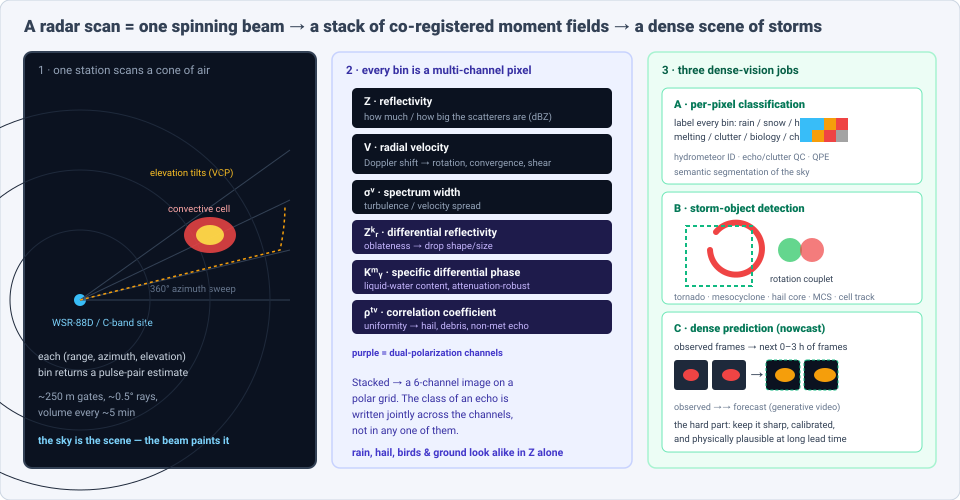
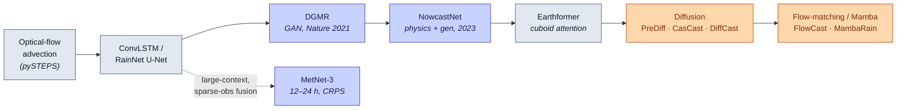

# Dense Object Detection & Classification — Recent Advances

*Compiled 2026-Aug-26 (America/Los_Angeles).*

Next installment in the running CV-updates log. Earlier entries on
`main`:
[Apr-30](../2026-Apr-30/2026-Apr-30_CV_updates.md),
[May-01](../2026-May-01/2026-May-01_CV_updates.md),
[May-02](../2026-May-02/2026-May-02_CV_updates.md),
[May-04](../2026-May-04/2026-May-04_CV_updates.md),
[May-05](../2026-May-05/2026-May-05_CV_updates.md),
[May-07](../2026-May-07/2026-May-07_CV_updates.md),
[May-08](../2026-May-08/2026-May-08_CV_updates.md),
[May-15](../2026-May-15/2026-May-15_CV_updates.md),
[May-16](../2026-May-16/2026-May-16_CV_updates.md),
[May-17](../2026-May-17/2026-May-17_CV_updates.md),
[Jun-09](../2026-Jun-09/2026-Jun-09_CV_updates.md),
[Jun-10](../2026-Jun-10/2026-Jun-10_CV_updates.md),
[Jun-12](../2026-Jun-12/2026-Jun-12_CV_updates.md),
[Jun-15](../2026-Jun-15/2026-Jun-15_CV_updates.md),
[Jun-16](../2026-Jun-16/2026-Jun-16_CV_updates.md),
[Jun-17](../2026-Jun-17/2026-Jun-17_CV_updates.md),
[Jun-19](../2026-Jun-19/2026-Jun-19_CV_updates.md),
[Jun-21](../2026-Jun-21/2026-Jun-21_CV_updates.md),
[Jun-22](../2026-Jun-22/2026-Jun-22_CV_updates.md),
[Jun-23](../2026-Jun-23/2026-Jun-23_CV_updates.md),
[Jun-24](../2026-Jun-24/2026-Jun-24_CV_updates.md),
[Jun-25](../2026-Jun-25/2026-Jun-25_CV_updates.md),
[Jun-27](../2026-Jun-27/2026-Jun-27_CV_updates.md),
[Jun-29](../2026-Jun-29/2026-Jun-29_CV_updates.md),
[Jun-30](../2026-Jun-30/2026-Jun-30_CV_updates.md),
[Jul-04](../2026-Jul-04/2026-Jul-04_CV_updates.md),
[Jul-07](../2026-Jul-07/2026-Jul-07_CV_updates.md),
[Jul-08](../2026-Jul-08/2026-Jul-08_CV_updates.md),
[Jul-10](../2026-Jul-10/2026-Jul-10_CV_updates.md),
[Jul-15](../2026-Jul-15/2026-Jul-15_CV_updates.md),
[Jul-17](../2026-Jul-17/2026-Jul-17_CV_updates.md),
[Jul-18](../2026-Jul-18/2026-Jul-18_CV_updates.md),
[Jul-21](../2026-Jul-21/2026-Jul-21_CV_updates.md),
[Jul-22](../2026-Jul-22/2026-Jul-22_CV_updates.md),
[Jul-24](../2026-Jul-24/2026-Jul-24_CV_updates.md),
[Jul-26](../2026-Jul-26/2026-Jul-26_CV_updates.md),
[Jul-27](../2026-Jul-27/2026-Jul-27_CV_updates.md),
[Jul-30](../2026-Jul-30/2026-Jul-30_CV_updates.md),
[Aug-01](../2026-Aug-01/2026-Aug-01_CV_updates.md),
[Aug-02](../2026-Aug-02/2026-Aug-02_CV_updates.md),
[Aug-04](../2026-Aug-04/2026-Aug-04_CV_updates.md),
[Aug-07](../2026-Aug-07/2026-Aug-07_CV_updates.md),
[Aug-10](../2026-Aug-10/2026-Aug-10_CV_updates.md),
[Aug-11](../2026-Aug-11/2026-Aug-11_CV_updates.md),
[Aug-13](../2026-Aug-13/2026-Aug-13_CV_updates.md),
[Aug-15](../2026-Aug-15/2026-Aug-15_CV_updates.md),
[Aug-16](../2026-Aug-16/2026-Aug-16_CV_updates.md),
[Aug-18](../2026-Aug-18/2026-Aug-18_CV_updates.md),
[Aug-19](../2026-Aug-19/2026-Aug-19_CV_updates.md),
[Aug-21](../2026-Aug-21/2026-Aug-21_CV_updates.md),
[Aug-22](../2026-Aug-22/2026-Aug-22_CV_updates.md),
[Aug-24](../2026-Aug-24/2026-Aug-24_CV_updates.md).

The last entry closed on **distributed acoustic sensing** — a telecom fiber
turned into thousands of virtual strain sensors whose traces stack into a
channel × time image. Way back on [Jul-04](../2026-Jul-04/2026-Jul-04_CV_updates.md)
the log met a *radar* — but that was **automotive imaging radar**, a sparse
4D mmWave point cloud bolted to a car. This pass turns to radar's oldest and
most operationally consequential dense-vision surface: the **weather-radar
volume**. A single ground station spins a beam through 360° of azimuth and
steps up in elevation, and every range-azimuth-elevation bin returns not one
number but a *stack* of co-registered moments — reflectivity, Doppler
velocity, spectrum width, and the dual-polarization trio (differential
reflectivity Z\_DR, specific differential phase K\_DP, correlation coefficient
ρ\_HV). Stacked, they form a **multi-channel image on a polar grid**, refreshed
every few minutes, and in that image *supercells, hook echoes, mesocyclone
velocity couplets, hail cores, melting layers, bird roosts and chaff each draw
a recognizable signature.* This entry treats that radar volume as its own
first-class dense-vision modality with three coupled jobs: **classify** what
every echo is (hydrometeor ID, clutter QC, rain-rate), **detect** the
storm-scale objects that matter (tornado, mesocyclone, hail, MCS), and
**predict** the next 0–3 h of frames (nowcasting) — all at whole-domain,
all-day throughput, and all under a hard public-safety deadline.

## Table of contents

1. [Why this pass: the radar volume as its own primitive](#1--why-this-pass-the-radar-volume-as-its-own-primitive)
2. [The primitive — a radar sweep is a dense multi-channel scene](#2--the-primitive--a-radar-sweep-is-a-dense-multi-channel-scene)
3. [Dense prediction — nowcasting as generative video](#3--dense-prediction--nowcasting-as-generative-video)
4. [Detection — tornadoes, mesocyclones, hail, convective systems](#4--detection--tornadoes-mesocyclones-hail-convective-systems)
5. [Dense classification — hydrometeors, clutter QC, and QPE](#5--dense-classification--hydrometeors-clutter-qc-and-qpe)
6. [Foundation models, benchmarks & the data problem](#6--foundation-models-benchmarks--the-data-problem)
7. [Why a radar volume is *not* a natural image](#7--why-a-radar-volume-is-not-a-natural-image)
8. [Open problems / what to watch](#8--open-problems--what-to-watch)
9. [Sources](#9--sources)

## 1 · Why this pass: the radar volume as its own primitive

Five properties make the weather-radar volume worth treating as a first-class
dense-vision surface rather than "a noisy grayscale image of rain":

1. **It is inherently multi-channel, and the label lives across channels.**
   Reflectivity alone cannot separate heavy rain from hail from a flock of
   birds — they all light up in dBZ. The *class* of an echo is written jointly
   across Z, V, spectrum width and the dual-pol variables: hail collapses
   ρ\_HV, biological scatterers show near-zero ρ\_HV with erratic Z\_DR, a
   tornado shows a debris ball of low ρ\_HV co-located with a velocity couplet.
   This is fundamentally a *multi-spectral per-pixel classification* problem,
   the closest cousin to the hyperspectral cube of
   [Jul-21](../2026-Jul-21/2026-Jul-21_CV_updates.md).

2. **The geometry is polar and volumetric, not Cartesian.** Range gates,
   sweeping rays, and stacked elevation tilts (a "volume coverage pattern")
   mean resolution degrades and the beam rises with range — a storm at 150 km
   is under-sampled and its base is invisible. Learning on this grid is not the
   same as learning on a photo.

3. **It is a video, and the objects move.** Storms advect, rotate, split,
   merge and decay between 5-minute volumes. Detection and forecasting are
   spatiotemporal, and the single most valuable product — the *nowcast* — is
   literally frame-to-frame video prediction.

4. **There is a hard, asymmetric decision deadline.** A tornado-warning lead
   time is measured in minutes and a missed detection has a human cost, so the
   POD/FAR trade-off, calibration, and latency are first-order design
   constraints, not afterthoughts.

5. **The archive is enormous and *self-labeling* in useful ways.** Decades of
   NEXRAD Level-II volumes exist; storm reports, gauge networks, and the
   next-frame itself provide supervision at scale. That is exactly the setting
   where generative and self-supervised vision has recently made its biggest
   gains.

## 2 · The primitive — a radar sweep is a dense multi-channel scene

**The moment stack.** A modern dual-polarization Doppler radar (the US
WSR-88D/NEXRAD network; C-band systems elsewhere) emits horizontally- and
vertically-polarized pulses and, per range gate, estimates:

- **Z (reflectivity, dBZ)** — scatterer number × size⁶; the "how much rain"
  channel, but ambiguous by itself.
- **V (radial velocity)** — the Doppler channel; reveals rotation
  (mesocyclones), convergence, divergence, and gust fronts.
- **σ\_v (spectrum width)** — velocity spread within a gate; turbulence and
  shear.
- **Z\_DR (differential reflectivity)** — horizontal-vs-vertical reflectivity
  ratio; drop oblateness → size. Big positive Z\_DR = large oblate rain drops.
- **K\_DP (specific differential phase)** — phase shift accumulated through
  liquid water; nearly immune to attenuation and partial beam blockage, prized
  for rain-rate.
- **ρ\_HV (correlation coefficient)** — how alike the H and V returns are;
  ~0.99 in uniform rain, and it *drops* for hail, melting particles, debris,
  and non-meteorological scatterers.

Stacked on the range-azimuth grid (per elevation tilt), these six fields are a
multi-channel image. Everything downstream — quality control, hydrometeor
classification, storm detection, rain-rate, nowcasting — is a dense,
multi-channel, spatiotemporal vision operation on that stack. The
[MDPI 2025 QPE review](https://www.mdpi.com/2072-4292/17/21/3619) is a good
recent primer on how the dual-pol channels combine.

**The three jobs, made concrete.** The right panel of the figure above splits
the modality into (A) *per-pixel classification* — label every bin as a
hydrometeor type or a non-meteorological echo, which is semantic segmentation
of the sky; (B) *object detection* — find storm-scale objects and their
extents (tornado signature, mesocyclone couplet, hail core, mesoscale
convective system, tracked cell); and (C) *dense prediction* — extrapolate the
whole field forward. The learning landscape below places these as stages over
one volume, with the nowcasting model family drawn as a time-arc.

## 3 · Dense prediction — nowcasting as generative video

Nowcasting — predicting the radar field 0–6 h ahead — is where radar vision has
produced its highest-profile results, and its history is a clean case study in
the **blur-vs-sharpness** problem that afflicts all dense video prediction.

**The arc (deterministic → generative → physics-hybrid → diffusion).**

- **Advection baselines.** Optical-flow extrapolation (Lagrangian
  persistence, as in the operational `pySTEPS` library) advects echoes along an
  estimated motion field. Skilful for ~30 min, but cannot grow or decay storms.
- **ConvLSTM / U-Net regressors.** ConvLSTM and **RainNet** (Ayzel et al.,
  a U-Net trained to predict the next frames) learn nonlinear evolution, but
  training against a pixelwise MSE/MAE loss makes them **progressively blurry**
  at longer lead times — they hedge by smearing, destroying exactly the sharp
  convective cores that matter. The
  [2024 nowcasting survey](https://arxiv.org/pdf/2406.04867) frames this as the
  central tension of the field.
- **DGMR (the pivot to generative).** DeepMind + the UK Met Office's **Deep
  Generative Model of Radar** (Ravuri et al., *Nature* 597:672, 2021) trains a
  ConvGRU encoder-decoder with two adversarial discriminators (spatial +
  temporal) plus a grid-regularizer, producing sharp, spatiotemporally
  consistent *ensembles* over 5–90 min. In a blind trial, **56 Met Office
  forecasters ranked it first in ~89% of cases** against competing methods —
  the study that convinced the field generative models were the way forward
  ([Nature](https://www.nature.com/articles/s41586-021-03854-z),
  [arXiv:2104.00954](https://arxiv.org/abs/2104.00954)).
- **NowcastNet (physics + learning).** Zhang et al., *Nature* 619:526 (2023)
  unify a physics **evolution operator** (advection obeying a continuity-style
  constraint) with a conditional generative net, producing physically
  plausible extreme-rain nowcasts with sharp multiscale structure over
  2048 × 2048 km domains and 3-h lead times
  ([Nature](https://www.nature.com/articles/s41586-023-06184-4)).
- **Transformers.** **Earthformer** (NeurIPS 2022) introduced *cuboid
  attention* for Earth-system spatiotemporal forecasting, factorizing 3D
  attention into efficient cuboids — a general backbone widely used as a
  nowcasting baseline.
- **MetNet-3 (large-context, probabilistic).** Google's MetNet-3 extends the
  neural-weather line to 12–24 h at 1–4 km / 2-min resolution, and its key
  trick — **densification**, jointly assimilating sparse station observations
  and dense radar (MRMS) inside the network — lets it beat physics-based ENS on
  CRPS for precipitation. It runs in production behind Google's precipitation
  forecasts
  ([Google Research](https://research.google/blog/metnet-3-a-state-of-the-art-neural-weather-model-available-in-google-products/),
  [arXiv:2111.07470](https://arxiv.org/pdf/2111.07470)).

**The current frontier: diffusion, flow-matching, and state-space.** The
generative baton has passed to diffusion and its faster successors, usually in
a **two-stage "macro trend + micro detail"** design:

- **PreDiff** casts nowcasting as latent diffusion with knowledge-alignment for
  physically consistent samples; **DiffCast** frames precipitation as a global
  deterministic trend *plus* a **residual diffusion** for local stochastic
  detail (a unified framework wrapping any backbone); **CasCast** uses a
  *cascaded* diffusion (a deterministic model for the blob, a diffusion model
  for fine-scale echoes) to sharpen extremes
  ([DiffCast](https://www.researchgate.net/publication/384236945_DiffCast_A_Unified_Framework_via_Residual_Diffusion_for_Precipitation_Nowcasting)).
- Recent (2025–2026) entries push **fidelity + speed**: a
  [multi-task latent diffusion](https://arxiv.org/html/2410.14103) for extreme
  precipitation, a
  [diffusion transformer with causal attention](https://arxiv.org/pdf/2410.13314),
  [FADiff](https://www.mdpi.com/2072-4292/18/7/1061) (a frequency-aware
  CNN–transformer diffusion), and domain-specific
  [RadarDiT](https://www.sciencedirect.com/science/article/pii/S2214581825005324).
- **Flow-matching / mean-flow** models chase diffusion quality at a fraction of
  the sampling cost:
  [FlowCast](https://arxiv.org/pdf/2511.09731) (conditional flow matching) and
  [PixelFlowCast](https://arxiv.org/html/2605.10046) (latent-free pixel
  mean-flow).
- **State-space (Mamba)** models attack the cost head-on:
  [MambaRain](https://arxiv.org/pdf/2605.14606) reports **~320 ms/sample at
  20.4M params vs DiffCast's ~6.3 s at 50.5M** for comparable 0–3 h skill —
  the efficiency argument for linear-time backbones in an operational,
  every-few-minutes setting.
- Reliability itself is now a research target:
  [Stable Attention Response](https://arxiv.org/pdf/2605.13181) tackles the
  brittleness of attention-based nowcasters, and
  [cross-modal fusion](https://arxiv.org/html/2603.13298) folds satellite/NWP
  priors into radar extrapolation.

The through-line: MSE regressors are *accurate-but-blurry*; generative models
(GAN → diffusion → flow/Mamba) are *sharp-and-calibrated* but must be pinned to
physics and verified with care, because a beautiful sample can still be a
confident hallucination.

*Lineage of the nowcasting model family: slate = deterministic baselines,
indigo = generative / large-context milestones, orange = the current
fidelity-plus-speed frontier. Fills carry explicit text colors so the flowchart
stays legible in light and dark viewers.*

## 4 · Detection — tornadoes, mesocyclones, hail, convective systems

If nowcasting is dense prediction, the warning-decision layer is **object
detection and classification** on the same volume.

**Tornado & mesocyclone detection — and the benchmark that unlocked it.** The
long-standing operational algorithms (NSSL's MDA/TDA) are hand-engineered
velocity-shear detectors. The bottleneck to learned detectors was a clean,
full-resolution, labeled corpus — supplied in 2024 by **TorNet**, a benchmark
of full-resolution polarimetric Level-II WSR-88D samples drawn from nine years
of storm events, released with source, weights, and a CNN baseline that
**beats non-DL and operational baselines without hand-crafted features**
(Veillette et al., MIT Lincoln Laboratory,
[AIES 2025](https://journals.ametsoc.org/view/journals/aies/4/1/AIES-D-24-0006.1.xml),
[arXiv:2401.16437](https://arxiv.org/abs/2401.16437)). It has already spawned
follow-ups: **TDA-DARKNet**, a dual-pol tornado detector combining dual
attention, dense residual connections and a Kolmogorov–Arnold network
([Remote Sensing 2026](https://www.mdpi.com/2072-4292/18/8/1124)); a two-stage
refinement, **TorDet**
([2026](https://www.researchgate.net/publication/399025412_TorDet_A_Refined_Two-Stage_Deep_Learning_Approach_for_Radar-Based_Tornado_Detection));
and multi-modal short-term prediction work layering environment fields on top
of the radar tensor
([AMS 2025](https://ui.adsabs.harvard.edu/abs/2025AMS...10552932V/abstract)).

**Hail.** Hail lowers ρ\_HV and produces Z\_DR "columns" of lofted supercooled
drops. Learned severe-hail likelihood from combined satellite + reanalysis +
radar-cell features is a maturing product
([AIES 2023](https://journals.ametsoc.org/view/journals/aies/2/4/AIES-D-22-0042.1.xml)),
and probabilistic **hail nowcasting via a spatiotemporal diffusion model** on
radar echo extrapolation is a 2025 example of generative methods crossing from
rain into hazard classes
([arXiv:2503.22724](https://arxiv.org/pdf/2503.22724)).

**Mesoscale convective systems & storm tracking.** **MCSDNet** detects MCS via
multi-scale spatiotemporal features across a sequence of frames — object
detection/segmentation on the storm *system* scale rather than the pixel scale
([arXiv:2404.17186](https://arxiv.org/pdf/2404.17186)). Cell identification,
tracking and life-cycle staging (split/merge) is the temporal-association layer
that turns per-frame detections into trajectories a forecaster can act on.

**Convective initiation (CI).** Catching the *first* echo — predicting where a
storm will be born before it exists on radar — is a detection problem on the
edge of the observable. A 2026 *Scientific Data* release provides an ML corpus
for CI detection/nowcasting over southeastern China
([Nature SciData](https://www.nature.com/articles/s41597-026-06902-3)), and
**Bayesian deep learning** has been applied to attach calibrated uncertainty to
CI nowcasts — essential when the base rate is low and false alarms are costly
([arXiv:2507.16219](https://arxiv.org/pdf/2507.16219)). A 2025 study on
satellite-based thunderstorm nowcasting makes the CV point explicitly: the
**receptive field and how advection is represented** are what determine skill —
a purely architectural, computer-vision-flavored finding
([arXiv:2504.09994](https://arxiv.org/pdf/2504.09994)). The
[Frontiers 2026 review](https://www.frontiersin.org/journals/earth-science/articles/10.3389/feart.2026.1787965/full)
surveys the DL-for-severe-convection landscape (rainstorms, hail, wind,
tornadoes) end to end.

## 5 · Dense classification — hydrometeors, clutter QC, and QPE

Beneath detection sits the per-pixel classification layer that decides *what
each echo is* — and it is where the dual-pol channels earn their keep.

**Hydrometeor classification (HCA).** Operational HCA has long been
**fuzzy-logic** over the polarimetric variables, assigning each bin a class
(light/heavy rain, big drops, graupel, hail, rain-hail mix, wet/dry snow, ice
crystals, biological, ground clutter). The move to learned classifiers —
neural networks trained on dual-pol measurements — improves boundaries and
melting-layer handling; a 2025 study shows that a **better HCA feeding data
assimilation** measurably improves severe-weather prediction downstream, i.e.
the classification map is not an end product but an input to forecasting
([JGR Atmospheres 2025](https://agupubs.onlinelibrary.wiley.com/doi/abs/10.1029/2024JD042797)).
The [dual-pol classification review](https://www.sciencedirect.com/science/article/abs/pii/S0169809511002821)
remains the reference for the variable-to-class logic.

**Echo / clutter quality control.** Before anything else, non-meteorological
echoes must be segmented out: ground clutter, sea clutter, anomalous
propagation, wind-turbine clutter, RF interference, and **biological scatterers**
(the nightly bird/insect "bloom"). At short wavelengths (Ka-band) clear-air
clutter can be a large fraction of returns — one study reports clear-air echoes
at **16.7% of returns within 0–15 km**, a major error source if left unlabeled.
Recent QC datasets pair radar with lidar and expert manual correction to train
learned classifiers that jointly handle data quality, echo type and
hydrometeor class — a segmentation problem with a heavy class imbalance and a
domain-shift tail (see the dual-pol/Ka-band classification threads in the
[2025 QPE review](https://www.mdpi.com/2072-4292/17/21/3619)).

**Quantitative precipitation estimation (QPE).** Converting reflectivity to
rain rate via a fixed Z–R power law is the classic weak link; dual-pol
(especially attenuation-robust K\_DP) and learning both help. Recent work
learns radar→rain mappings and **corrects biases against gauge networks** —
including a 2025 study using **citizen-science rain gauges** to bias-correct
Doppler-radar surface rates at high temporal resolution
([PMC 2025](https://pmc.ncbi.nlm.nih.gov/articles/PMC12197204/)), and a
[deep-learning radar-QPE approach](https://arxiv.org/abs/2402.09846) that
regresses precipitation directly from the moment stack. QPE is the bridge from
the classified image to a physical field, and it inherits every problem above:
attenuation, beam geometry, and the melting layer.

## 6 · Foundation models, benchmarks & the data problem

**Benchmarks.** The field's shared surfaces are now concrete:
- **SEVIR** (Storm EVent ImagERy) — the large-scale multi-sensor
  (radar + GOES) benchmark that most nowcasting papers report on.
- **TorNet** — the full-resolution polarimetric tornado benchmark (§4), the
  first to make learned tornado detection reproducible.
- **MRMS** (Multi-Radar/Multi-Sensor) — NOAA's mosaicked, gauge-corrected
  national radar grid, the dense-image substrate behind MetNet-3 and much QPE
  work.
- CI datasets (§4) and dual-pol QC corpora (§5) are filling in the classes that
  SEVIR/TorNet don't cover.

**Toward radar/weather foundation models.** The broader "AI weather" wave —
GraphCast, Pangu-Weather, FuXi, Aurora, and the survey line collected in the
[IJCAI'26 DL-and-foundation-models-for-weather survey](https://github.com/jimengshi/dl-foundation-models-weather)
— is mostly *global NWP* on reanalysis grids, not radar. But the pull toward a
**pretrain-once, adapt-many** recipe for the radar volume specifically is
visible: densification-style multi-source fusion (MetNet-3), residual-diffusion
frameworks that wrap *any* backbone (DiffCast), and self-supervised
spatiotemporal pretraining on the vast NEXRAD archive are the pieces. The
recurring lesson from the modality entries in this log — DAS, SAR, OCT,
hyperspectral — holds here too: the raw archive is enormous and cheap, the
*labels* (verified tornadoes, hydrometeor ground truth, gauge-matched QPE) are
scarce and expensive, so **self-supervision on next-frame / masked-moment
prediction is the natural lever.**

**The data problems that are specific to radar:**
- **Cross-radar / cross-band domain shift.** S-band NEXRAD ≠ C-band ≠ X-band;
  calibration, beam width and attenuation differ, so a model trained on one
  network degrades on another — the same station-to-station generalization gap
  seen in every sensor modality here.
- **Extreme class imbalance.** Tornadoes, giant hail and flash-flood rain rates
  are rare; naive training optimizes the common case and misses the events that
  justify the system.
- **Label latency and noise.** Storm reports are spatially/temporally imprecise
  and biased toward populated areas; "ground truth" is itself uncertain.

## 7 · Why a radar volume is *not* a natural image

Pulling the modality's peculiarities together — the reasons off-the-shelf RGB
vision transfers only partially:

- **Polar, range-degrading geometry.** Resolution and beam height grow with
  range; a distant storm is coarser and its low levels are unseen. A CNN's
  translation invariance is only approximately valid on this grid.
- **The channels are physical, not R/G/B.** Z, V, σ\_v, Z\_DR, K\_DP, ρ\_HV have
  different units, dynamic ranges, noise models and *meanings*; naive
  normalization or borrowing 3-channel ImageNet stems throws away the joint
  polarimetric signal that defines the classes.
- **Additive/attenuating physics.** Beams attenuate through heavy rain and hail
  (worse at shorter wavelengths), get blocked by terrain, and fold velocity and
  range — structured, physics-driven corruptions, not Gaussian noise.
- **The bright band and melting layer.** A ring of enhanced Z and depressed
  ρ\_HV at the freezing level masquerades as heavy precipitation — a systematic
  false structure the model must learn to discount.
- **Non-meteorological "objects" everywhere.** Birds, insects, bats, chaff,
  wind turbines, aircraft and AP are ever-present distractors; the sky is never
  empty and rarely clean.
- **A moving, growing, decaying scene.** Unlike a photographed object, storms
  are born and die within the prediction window — pure advection is provably
  insufficient, which is exactly why generative and physics-hybrid models won.
- **Asymmetric, deadline-bound costs.** A false tornado warning and a missed one
  are not symmetric errors, and the decision must be made in minutes — so
  calibration, uncertainty and latency are part of the model spec, not the
  eval afterthought.

## 8 · Open problems / what to watch

- **Verification beyond CSI.** Pixelwise CSI/POD/FAR punish sharp generative
  forecasts for small displacement errors ("double penalty"). The
  **Fractions Skill Score** (neighborhood-based) and **CRPS** (for ensembles)
  are better, and forecaster preference studies (à la DGMR) remain the
  gold standard — but the field still lacks a single score that rewards *sharp,
  physically plausible, well-placed* forecasts. Watch for verification that
  scores *objects and events*, not pixels.
- **Fidelity + speed at operational cadence.** Diffusion quality at
  flow-matching / Mamba latency (FlowCast, PixelFlowCast, MambaRain) is the
  active race; a nowcast that arrives late is worthless.
- **Calibrated, hazard-specific uncertainty.** Bayesian CI nowcasting and
  ensemble diffusion are early steps; warning decisions need per-event
  probabilities a forecaster can trust.
- **From single-radar to network-native models.** Learning directly on the
  MRMS-style national mosaic (and fusing satellite, lightning, gauges, NWP)
  rather than one station at a time — the densification idea generalized.
- **A radar foundation model.** Self-supervised pretraining on the NEXRAD
  archive (masked-moment / next-frame objectives), then light adaptation to
  tornado, hail, QC and QPE heads — the recipe every other modality in this log
  has converged on, not yet consolidated for radar.
- **Physics-constrained generation as the default.** NowcastNet showed that a
  continuity-style evolution operator inside a generative net buys plausibility;
  expect physical constraints to become standard scaffolding rather than an
  ablation.
- **Cross-band / cross-region generalization & fairness.** Robustness across
  S/C/X-band and across the data-sparse tropics, and the populated-area label
  bias, are unsolved and consequential.

## 9 · Sources

**Nowcasting — generative milestones**
- DGMR — Ravuri et al., *Skilful precipitation nowcasting using deep generative models of radar*, *Nature* 597:672–677 (2021) — https://www.nature.com/articles/s41586-021-03854-z · arXiv:2104.00954 — https://arxiv.org/abs/2104.00954 · PubMed — https://pubmed.ncbi.nlm.nih.gov/34588668/
- NowcastNet — Zhang et al., *Skilful nowcasting of extreme precipitation with NowcastNet*, *Nature* 619:526–532 (2023) — https://www.nature.com/articles/s41586-023-06184-4
- MetNet-3 — *Deep Learning for Day Forecasts from Sparse Observations* — arXiv:2306.06079 · Google Research blog — https://research.google/blog/metnet-3-a-state-of-the-art-neural-weather-model-available-in-google-products/
- MetNet(-2) lineage — *Skillful Twelve Hour Precipitation Forecasts using Large Context Neural Networks* — arXiv:2111.07470 — https://arxiv.org/pdf/2111.07470 · original MetNet — arXiv:2003.12140 — https://arxiv.org/abs/2003.12140

**Nowcasting — diffusion / flow / state-space frontier**
- Deep learning for precipitation nowcasting: a survey (time-series view) — arXiv:2406.04867 — https://arxiv.org/pdf/2406.04867
- DiffCast — *A Unified Framework via Residual Diffusion for Precipitation Nowcasting* (CVPR 2024) — https://www.researchgate.net/publication/384236945_DiffCast_A_Unified_Framework_via_Residual_Diffusion_for_Precipitation_Nowcasting
- Extreme Precipitation Nowcasting using Multi-Task Latent Diffusion Models — arXiv:2410.14103 — https://arxiv.org/html/2410.14103
- Precipitation Nowcasting Using Diffusion Transformer with Causal Attention — arXiv:2410.13314 — https://arxiv.org/pdf/2410.13314
- Latent diffusion for generative nowcasting with uncertainty quantification — arXiv:2304.12891 — https://arxiv.org/pdf/2304.12891
- FADiff — *Frequency-Aware Diffusion on a Hybrid CNN–Transformer Network for Radar-Based Nowcasting*, *Remote Sensing* 18(7):1061 (2026) — https://www.mdpi.com/2072-4292/18/7/1061
- RadarDiT — *Radar echo extrapolation via diffusion transformer* — https://www.sciencedirect.com/science/article/pii/S2214581825005324
- FlowCast — *Advancing Precipitation Nowcasting with Conditional Flow Matching* — arXiv:2511.09731 — https://arxiv.org/pdf/2511.09731
- PixelFlowCast — *Latent-Free Precipitation Nowcasting via Pixel Mean Flows* — arXiv:2605.10046 — https://arxiv.org/html/2605.10046
- MambaRain — *Multi-Scale Mamba-Attention Framework for 0–3 Hour Precipitation Nowcasting* — arXiv:2605.14606 — https://arxiv.org/pdf/2605.14606
- Stable Attention Response for Reliable Precipitation Nowcasting — arXiv:2605.13181 — https://arxiv.org/pdf/2605.13181
- FusionCast — *Asymmetric Cross-Modal Fusion and Future Radar Priors* — arXiv:2603.13298 — https://arxiv.org/html/2603.13298

**Detection — tornado / mesocyclone / hail / MCS / convective initiation**
- TorNet — Veillette et al., *A Benchmark Dataset for Tornado Detection and Prediction using Full-Resolution Polarimetric Weather Radar Data*, *AIES* 4(1) (2025) — https://journals.ametsoc.org/view/journals/aies/4/1/AIES-D-24-0006.1.xml · arXiv:2401.16437 — https://arxiv.org/abs/2401.16437
- TDA-DARKNet — *A Deep Learning Model Based on Dual-Polarization Radar Data for Tornado Detection*, *Remote Sensing* 18(8):1124 (2026) — https://www.mdpi.com/2072-4292/18/8/1124
- TorDet — *A Refined Two-Stage Deep Learning Approach for Radar-Based Tornado Detection* (2026) — https://www.researchgate.net/publication/399025412_TorDet_A_Refined_Two-Stage_Deep_Learning_Approach_for_Radar-Based_Tornado_Detection
- Short-Term Tornado Prediction and Detection using Multi-Modal Datasets — AMS 2025 — https://ui.adsabs.harvard.edu/abs/2025AMS...10552932V/abstract
- MCSDNet — *Mesoscale Convective System Detection Network via Multi-scale Spatiotemporal Information* — arXiv:2404.17186 — https://arxiv.org/pdf/2404.17186
- Severe-hail likelihood from satellite + reanalysis via DNN — *AIES* 2(4) (2023) — https://journals.ametsoc.org/view/journals/aies/2/4/AIES-D-22-0042.1.xml
- Spatial-temporal Deep Probabilistic Diffusion for Hail Nowcasting via Radar Echo Extrapolation — arXiv:2503.22724 — https://arxiv.org/pdf/2503.22724
- Dataset for convective-initiation detection & nowcasting over SE China — *Scientific Data* (2026) — https://www.nature.com/articles/s41597-026-06902-3
- Bayesian Deep Learning for Convective Initiation Nowcasting Uncertainty — arXiv:2507.16219 — https://arxiv.org/pdf/2507.16219
- *Physical Scales Matter: Receptive Fields and Advection in Satellite-Based Thunderstorm Nowcasting* — arXiv:2504.09994 — https://arxiv.org/pdf/2504.09994
- *Four-hour thunderstorm nowcasting using a deep diffusion model for satellite data*, *PNAS* (2025) — https://www.pnas.org/doi/10.1073/pnas.2517520122
- Frontiers review — *Advances in deep learning applications to severe convective weather forecasting* (2026) — https://www.frontiersin.org/journals/earth-science/articles/10.3389/feart.2026.1787965/full · NOAA review PDF — https://repository.library.noaa.gov/view/noaa/52401/noaa_52401_DS1.pdf

**Classification — hydrometeors, clutter QC, QPE**
- Dual-Polarization Radar QPE: Principles, Operations, and Challenges, *Remote Sensing* 17(21):3619 (2025) — https://www.mdpi.com/2072-4292/17/21/3619
- Dual-Pol Radar Data Assimilation Based on Hydrometeor Classification, *JGR: Atmospheres* (2025) — https://agupubs.onlinelibrary.wiley.com/doi/abs/10.1029/2024JD042797
- Deep-learning identification of hydrometeors from dual-pol Doppler radar, *EURASIP J. Wireless Comm. Netw.* (2017) — https://jwcn-eurasipjournals.springeropen.com/articles/10.1186/s13638-017-0965-5
- Recent advances in classification of observations from dual-pol weather radars (review) — https://www.sciencedirect.com/science/article/abs/pii/S0169809511002821
- Improving Doppler-radar precipitation with citizen-science rain gauges and deep learning, *PMC* (2025) — https://pmc.ncbi.nlm.nih.gov/articles/PMC12197204/
- A Deep Learning Approach to Radar-based QPE — arXiv:2402.09846 — https://arxiv.org/abs/2402.09846
- Key factors for quantitative precipitation nowcasting using ground radar & deep learning, *GMD* 16:5895 (2023) — https://gmd.copernicus.org/articles/16/5895/2023/

**Foundation models, backbones & benchmarks**
- Earthformer — *Exploring Space-Time Attention for Earth System Forecasting* (NeurIPS 2022) — arXiv:2207.05833
- RainNet v1.0 — Ayzel et al., a CNN for radar-based nowcasting, *GMD* (2020) — https://gmd.copernicus.org/articles/13/2631/2020/
- Deep Learning and Foundation Models for Weather Prediction — survey (IJCAI'26) — https://github.com/jimengshi/dl-foundation-models-weather
- *How to derive skill from the Fractions Skill Score* — arXiv:2311.11985 — https://arxiv.org/pdf/2311.11985

*Diagrams in this entry are hand-authored standalone SVG (no external URLs),
with explicit light-card / dark-panel fills so they render legibly in both
light and dark viewers. Some links were gathered under scraping/API limits and
are provided best-effort; where a landing page was unreachable, an arXiv or DOI
mirror is listed alongside. A few pre-2023 works (RainNet, the 2017 dual-pol DL
study, the dual-pol classification review) are included as lineage anchors for
otherwise-recent threads.*
