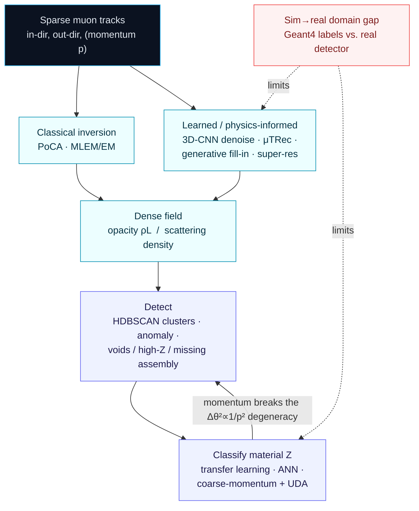

# Dense Object Detection & Classification — Recent Advances

*Compiled 2026-Aug-27 (America/Los_Angeles).*

Next installment in the running CV-updates log. Earlier entries on
`main`:
[Apr-30](../2026-Apr-30/2026-Apr-30_CV_updates.md),
[May-01](../2026-May-01/2026-May-01_CV_updates.md),
[May-02](../2026-May-02/2026-May-02_CV_updates.md),
[May-04](../2026-May-04/2026-May-04_CV_updates.md),
[May-05](../2026-May-05/2026-May-05_CV_updates.md),
[May-07](../2026-May-07/2026-May-07_CV_updates.md),
[May-08](../2026-May-08/2026-May-08_CV_updates.md),
[May-15](../2026-May-15/2026-May-15_CV_updates.md),
[May-16](../2026-May-16/2026-May-16_CV_updates.md),
[May-17](../2026-May-17/2026-May-17_CV_updates.md),
[Jun-09](../2026-Jun-09/2026-Jun-09_CV_updates.md),
[Jun-10](../2026-Jun-10/2026-Jun-10_CV_updates.md),
[Jun-12](../2026-Jun-12/2026-Jun-12_CV_updates.md),
[Jun-15](../2026-Jun-15/2026-Jun-15_CV_updates.md),
[Jun-16](../2026-Jun-16/2026-Jun-16_CV_updates.md),
[Jun-17](../2026-Jun-17/2026-Jun-17_CV_updates.md),
[Jun-19](../2026-Jun-19/2026-Jun-19_CV_updates.md),
[Jun-21](../2026-Jun-21/2026-Jun-21_CV_updates.md),
[Jun-22](../2026-Jun-22/2026-Jun-22_CV_updates.md),
[Jun-23](../2026-Jun-23/2026-Jun-23_CV_updates.md),
[Jun-24](../2026-Jun-24/2026-Jun-24_CV_updates.md),
[Jun-25](../2026-Jun-25/2026-Jun-25_CV_updates.md),
[Jun-27](../2026-Jun-27/2026-Jun-27_CV_updates.md),
[Jun-29](../2026-Jun-29/2026-Jun-29_CV_updates.md),
[Jun-30](../2026-Jun-30/2026-Jun-30_CV_updates.md),
[Jul-04](../2026-Jul-04/2026-Jul-04_CV_updates.md),
[Jul-07](../2026-Jul-07/2026-Jul-07_CV_updates.md),
[Jul-08](../2026-Jul-08/2026-Jul-08_CV_updates.md),
[Jul-10](../2026-Jul-10/2026-Jul-10_CV_updates.md),
[Jul-15](../2026-Jul-15/2026-Jul-15_CV_updates.md),
[Jul-17](../2026-Jul-17/2026-Jul-17_CV_updates.md),
[Jul-18](../2026-Jul-18/2026-Jul-18_CV_updates.md),
[Jul-21](../2026-Jul-21/2026-Jul-21_CV_updates.md),
[Jul-22](../2026-Jul-22/2026-Jul-22_CV_updates.md),
[Jul-24](../2026-Jul-24/2026-Jul-24_CV_updates.md),
[Jul-26](../2026-Jul-26/2026-Jul-26_CV_updates.md),
[Jul-27](../2026-Jul-27/2026-Jul-27_CV_updates.md),
[Jul-30](../2026-Jul-30/2026-Jul-30_CV_updates.md),
[Aug-01](../2026-Aug-01/2026-Aug-01_CV_updates.md),
[Aug-02](../2026-Aug-02/2026-Aug-02_CV_updates.md),
[Aug-04](../2026-Aug-04/2026-Aug-04_CV_updates.md),
[Aug-07](../2026-Aug-07/2026-Aug-07_CV_updates.md),
[Aug-10](../2026-Aug-10/2026-Aug-10_CV_updates.md),
[Aug-11](../2026-Aug-11/2026-Aug-11_CV_updates.md),
[Aug-13](../2026-Aug-13/2026-Aug-13_CV_updates.md),
[Aug-15](../2026-Aug-15/2026-Aug-15_CV_updates.md),
[Aug-16](../2026-Aug-16/2026-Aug-16_CV_updates.md),
[Aug-18](../2026-Aug-18/2026-Aug-18_CV_updates.md),
[Aug-19](../2026-Aug-19/2026-Aug-19_CV_updates.md),
[Aug-21](../2026-Aug-21/2026-Aug-21_CV_updates.md),
[Aug-22](../2026-Aug-22/2026-Aug-22_CV_updates.md),
[Aug-24](../2026-Aug-24/2026-Aug-24_CV_updates.md),
[Aug-26](../2026-Aug-26/2026-Aug-26_CV_updates.md).

The last entry treated the **weather-radar volume** — an active beam a station
sends out and listens for. Back on [Aug-21](../2026-Aug-21/2026-Aug-21_CV_updates.md)
the log looked *inside* a particle detector, where a collision sprays tracks
across silicon. This pass fuses those two instincts and turns them on the
built world: **muography**, imaging with the *cosmic-ray muons that already
rain through everything, for free.* Roughly one muon per square centimetre per
minute streams down from the upper atmosphere; they punch through hundreds of
metres of rock, a metre of steel, a loaded shipping container. Put a tracking
detector where those muons come out and you have an image-forming instrument
with **no source of its own** — the sky is the beam, and matter is the only
thing that modulates it. Two things happen to a muon in matter: some are
**absorbed** (transmission muography — count the survivors along each line of
sight and you get a density-length map, the way an X-ray shadow works but for
a *mountain*); and all of them are **deflected** by multiple Coulomb scattering
(muon scattering tomography — measure the kink between the in-track and the
out-track and its size grows with atomic number **Z**, so uranium screams and
water whispers). Either way the output is the same kind of object a vision
system likes: **a dense 3-D field in which voids, dense cores, high-Z contraband
and missing fuel assemblies are objects to *find*, and material Z is a label to
*assign* per voxel** — reconstructed from a Poisson-starved shower of noisy
tracks, sometimes over months of exposure. This entry treats that muon image as
its own first-class dense-vision modality.

## Table of contents

1. [Why this pass: the muon image as its own primitive](#1--why-this-pass-the-muon-image-as-its-own-primitive)
2. [The primitive — free illumination, two geometries, one starved image](#2--the-primitive--free-illumination-two-geometries-one-starved-image)
3. [Reconstruction — from PoCA/MLEM to learned, physics-informed inversion](#3--reconstruction--from-pocamlem-to-learned-physics-informed-inversion)
4. [Detection — voids, high-Z cores, missing assemblies](#4--detection--voids-high-z-cores-missing-assemblies)
5. [Dense classification — material Z and the momentum-informed thread](#5--dense-classification--material-z-and-the-momentum-informed-thread)
6. [The application heads that supply the labels](#6--the-application-heads-that-supply-the-labels)
7. [Why a muon image is *not* a natural image](#7--why-a-muon-image-is-not-a-natural-image)
8. [Open problems / what to watch](#8--open-problems--what-to-watch)
9. [Sources](#9--sources)

## 1 · Why this pass: the muon image as its own primitive

Five properties make the muon image worth treating as a first-class
dense-vision surface rather than "a fuzzy X-ray of a big thing":

1. **The illumination is free, uncontrollable, and one-sided.** There is no
   tube to turn up, no dose to raise. Flux is fixed at ~1 muon/cm²/min at sea
   level and falls roughly as cos²θ from the zenith, so a horizontally-viewing
   geometry (a volcano flank) is starved far worse than a downward one. You
   cannot brighten the scene — you can only *expose longer* or *denoise
   smarter*, which is exactly the regime where learned priors earn their keep
   ([muography image-reconstruction review, *J. Appl. Phys.* 2025](https://pubs.aip.org/aip/jap/article/138/4/041101/3355478/Image-reconstruction-techniques-in-muography-A)).

2. **The label lives in a physical modulation, not in appearance.** In
   transmission mode the observable is *survival probability* along a ray →
   integrated density (ρL). In scattering mode it is the *variance of the
   deflection angle*, and Highland's formula ties Δθ² to `(1/p²)·(L/X₀)` with
   the radiation length X₀ shrinking as Z rises — so the class of a voxel
   (lead vs. steel vs. water vs. void) is written in *how much it scatters*,
   not in how it looks. This is a per-voxel physical-parameter regression, the
   same shape as the hyperspectral cube of
   [Jul-21](../2026-Jul-21/2026-Jul-21_CV_updates.md) but with a scattering
   channel instead of a spectral one.

3. **The image is born Poisson-starved.** Counts are the signal, and counts
   are few: a dense-lab object may need minutes, a cargo container tens of
   minutes to an hour, a volcano or a pyramid **days to months**. Every
   reconstruction fights shot noise, and the single most valuable capability is
   *getting a usable image out of fewer muons* — a denoising/super-resolution
   problem in disguise
   ([3D-CNN denoising of high-Z materials, *SIViP* 2025](https://link.springer.com/article/10.1007/s11760-025-03992-1)).

4. **The forward model is non-local and stochastic.** A single muon's path is a
   random walk of small deflections; the "point of closest approach" of its in-
   and out-tracks is only a proxy for where it scattered. The point-spread
   function is a *scattering kernel*, not a lens blur, so classical inversion is
   ill-posed and slow — the setting where physics-informed and generative nets
   have started to help
   ([μTRec, *J. Appl. Phys.* 2025](https://pubs.aip.org/aip/jap/article/138/6/064909/3358779/TRec-A-muon-trajectory-reconstruction-algorithm)).

5. **Ground truth is almost never available, and simulation carries the day.**
   You rarely open a volcano, a sealed cask, or a loaded container to label it.
   So **Geant4 Monte-Carlo** supplies nearly all training labels, and the
   *simulation-to-measurement gap* — detector response, flux modeling,
   backgrounds — becomes the central obstacle, exactly the domain-adaptation
   problem the rest of this log keeps hitting
   ([coarse-momentum encoding + UDA, arXiv:2606.30028](https://arxiv.org/abs/2606.30028)).

## 2 · The primitive — free illumination, two geometries, one starved image

**Where the muons come from.** Primary cosmic rays hit the upper atmosphere and
produce pions and kaons that decay to muons. Muons are ~200× heavier than
electrons, so they radiate little and penetrate deeply — a few GeV muon crosses
metres of rock; the tail of the spectrum crosses *kilometres*. That penetration
is the whole point: muography sees through objects that stop every other probe.
The cost is that the useful, high-energy flux is small and steeply
angle-dependent, which sets the exposure times above. Reviews in 2025 organize
the field into **three families** — muon *transmission* (absorption) imaging,
muon *scattering* tomography, and imaging via muon-induced *secondary* particles
— and it is the first two that produce the dense fields we care about here
([*Recent research progress on cosmic-ray muon imaging*, *NIM A* 2025](https://www.sciencedirect.com/science/article/pii/S173857332500659X);
[*NIM A* ML-for-muography, 2024](https://www.sciencedirect.com/science/article/pii/S0168900224006818)).

**Geometry A — transmission / absorption.** One detector (or an emulsion film,
or a gas hodoscope) sits below or beside a very large object and histograms
*how many muons arrive from each direction* (θ, φ). Divide observed by expected
open-sky flux and you get, per line of sight, the integrated opacity — a
density-length map. A low-density **void** lets *extra* muons through and shows
up as a bright patch against the dense body; this is literally how the
ScanPyramids "Big Void" was found
([*Nature* 2017](https://www.nature.com/articles/nature24647)). It is a
projection modality — a single viewpoint gives you a 2-D angular image, and 3-D
needs multiple stations or fusion with other geophysics.

**Geometry B — scattering tomography.** Two tracking planes above and two below
a smaller object record each muon's incoming and outgoing trajectory. The angle
between them is the accumulated multiple-Coulomb-scattering deflection; a
high-Z, high-density object bends muons much more than air or water. The classic
inversion assigns the whole deflection to the **Point of Closest Approach
(PoCA)** of the two track segments and bins it into voxels — cheap, but it
smears the scattering out and wastes information about muons that clearly
scattered *somewhere along* the path. Adding a **momentum** measurement per
muon (via a magnetic spectrometer or the detector's own scattering) sharpens
everything, because Δθ depends on p — the momentum-informed thread in §5.

Both geometries hand the same object to a vision system: a **dense 3-D scalar
field** (opacity, or scattering density) reconstructed from a sparse, noisy,
one-sidedly-illuminated set of tracks. The three CV jobs — *reconstruct*,
*detect*, *classify* — are drawn in the figure above, and the learning stack
that now attaches to each is the subject of the next three sections and the
pipeline figure below.

![The muography learning pipeline: sparse muon tracks feed reconstruction (classical PoCA/MLEM increasingly refined by 3D-CNN denoisers, physics-informed trajectory models, generative low-statistics fill-in, and super-resolution), then detection (clustering and anomaly detection for voids, high-Z cores, and missing fuel assemblies), then dense material-Z classification (transfer learning, ANN, coarse momentum encoding with unsupervised domain adaptation), feeding application heads in nuclear security, volcanology, archaeology, industry, and cargo screening — with Geant4 simulation supplying most labels and the sim-to-real gap as the central obstacle.](assets/muography-pipeline-landscape.svg)

## 3 · Reconstruction — from PoCA/MLEM to learned, physics-informed inversion

Reconstruction is where muography most resembles a classic imaging
inverse-problem, and where 2024–2026 learning has moved fastest. The 2025 review
of image-reconstruction techniques lays out the classical spine — back-projection
and PoCA for scattering, **Maximum-Likelihood Expectation-Maximization
(MLEM/EM)** and its variants for both modes, plus algebraic and Bayesian
inversion — and then argues that the field's next gains come from *intelligent
reconstruction algorithms* and *multi-modal fusion*
([review, *J. Appl. Phys.* 2025](https://pubs.aip.org/aip/jap/article/138/4/041101/3355478/Image-reconstruction-techniques-in-muography-A)).
Four learned threads stand out:

- **CNN denoising on the reconstructed grid.** The most immediately practical
  move: run cheap PoCA to get a noisy voxel grid, then hand it to a **3-D CNN
  denoiser** that suppresses shot noise while preserving edges. A 2025 pipeline
  reports >98% target-identification accuracy for high-Z objects from
  **30-minute** scans on a limited scanner — i.e., the network buys back the
  statistics you didn't have time to collect
  ([*SIViP* 2025](https://link.springer.com/article/10.1007/s11760-025-03992-1)).

- **Physics-informed trajectory reconstruction.** Rather than trusting the
  straight-line/PoCA proxy, model the multiple-Coulomb-scattering random walk
  and estimate a *maximum-likelihood path*. **μTRec** (and the earlier
  Generalized Muon Trajectory Estimation, GMTE) reports ~38–50% precision gains
  over PoCA/straight-line path and 10–35% better muon-flux utilization for
  medium/high-Z materials — meaning fewer muons wasted, shorter exposures for
  the same image
  ([μTRec, *J. Appl. Phys.* 2025](https://pubs.aip.org/aip/jap/article/138/6/064909/3358779/TRec-A-muon-trajectory-reconstruction-algorithm); [arXiv:2505.04821](https://arxiv.org/abs/2505.04821)).

- **Generative fill-in at low statistics.** GAN-style data augmentation and
  learned priors are being used to hallucinate plausible detail into
  low-count images and to raise SNR, with the stated goal of cutting
  reconstruction time by *orders of magnitude* — the same generative-prior logic
  the nowcasting and OCT entries relied on, ported to a count-starved 3-D field
  ([*NIM A* 2025 review](https://www.sciencedirect.com/science/article/pii/S173857332500659X)).

- **Super-resolution and subpixel tracking.** Detector pixels are coarse and
  finite, so angular resolution is quantized. **Projection-shifted transmission
  tomography** pushes toward millimetre-scale imaging by combining sub-detector
  projection shifts ([arXiv:2512.19747](https://arxiv.org/abs/2512.19747)), and
  ML methods for **subpixel trajectory reconstruction in discretized position
  detectors** recover track angle below the native pixel pitch
  ([arXiv:2512.20645](https://arxiv.org/abs/2512.20645)) — resolution bought in
  software rather than hardware.

A useful synthesis is the 2025 **framework paper** that argues for a *seamless*
coupling of muon reconstruction and ML across the whole chain (tracking →
momentum → voxel inversion → classification), rather than bolting a network onto
the end ([*J. Appl. Phys.* 2025](https://pubs.aip.org/aip/jap/article/138/14/144904/3367674/A-comprehensive-framework-toward-the-seamless)),
and the AIP conference survey *Exploring novel ML applications in muography*
([2025](https://pubs.aip.org/aip/acp/article-abstract/3308/1/030005/3345777/Exploring-novel-machine-learning-applications-in))
plus a *2D and 3D analysis improvements with ML* study
([*NIM A* 2024](https://www.sciencedirect.com/science/article/pii/S0168900224006818))
map where learning is being slotted in.

## 4 · Detection — voids, high-Z cores, missing assemblies

Once a dense field exists, detection is object-finding against a Poisson-noisy,
low-contrast background — closer to weak-signal astronomy
([Aug-22](../2026-Aug-22/2026-Aug-22_CV_updates.md)) than to natural-image
detection. Three flavors recur:

- **Multi-object separation by clustering.** A recent full-system design pairs
  six scintillator-strip tracking stations with a four-station magnetic
  spectrometer and applies **HDBSCAN** clustering to the reconstructed
  scattering points to *separate multiple objects*, then extracts cluster-level
  scattering and geometric features to localize each, estimate its volume and
  shape, and rank its material — a genuinely end-to-end *detect-then-characterize*
  muon pipeline ([arXiv:2608.23141](https://arxiv.org/abs/2608.23141)).

- **Anomaly detection against an expected model.** For known geometries the job
  flips to "what changed?" A **3-D reconstruction of a nuclear reactor** by muon
  tomography validates the as-built structure and flags deviations as anomalies
  ([*PRX Energy* 2025](https://journals.aps.org/prxenergy/abstract/10.1103/PRXEnergy.4.013002)),
  and for **spent-fuel casks** the detection target is a *missing fuel assembly*
  — momentum-informed scattering tomography reports finding a missing assembly
  at **98% confidence vs. 79%** for standard scattering tomography
  ([momentum-informed MST, *Sci. Rep.* 2024](https://www.nature.com/articles/s41598-024-57105-y)).

- **Void / high-Z blob detection.** Whether the object is an archaeological void
  (a flux *excess*) or a contraband high-Z core (a scattering *excess*), the
  learned denoiser + threshold/segment recipe of §3 doubles as a detector: the
  *SIViP* 3D-CNN work frames its >98% number as *target identification within
  cluttered volumes*, i.e., detection under clutter, not just image cleanup
  ([*SIViP* 2025](https://link.springer.com/article/10.1007/s11760-025-03992-1)).

The recurring lesson matches every other count-limited modality in this log:
detection quality is set less by a fancy head than by how well reconstruction
and momentum information have already concentrated the sparse signal.

## 5 · Dense classification — material Z and the momentum-informed thread

Classification in muography means **estimating material Z per region**, because
Z (through radiation length) is what sets the scattering strength. This is the
sharpest current ML front:

- **Transfer learning for Z classes.** Pretrained image backbones adapted to
  reconstructed scattering maps classify voxels/objects into material Z bins,
  with transfer learning cutting the labeled-simulation budget needed to reach a
  given accuracy ([*Transfer learning empowers material-Z classification with
  muon tomography*, arXiv:2504.12305](https://arxiv.org/abs/2504.12305)).

- **ANNs on scattering features.** Straight neural-net classifiers on
  per-object scattering statistics have been validated experimentally for
  material discrimination (e.g., at the TUMUTY facility), establishing that the
  Z-signal is learnable from real, not just simulated, deflection distributions
  ([ANN material discrimination, 2022](https://www.researchgate.net/publication/360112836_Material_discrimination_using_cosmic_ray_muon_scattering_tomography_with_an_artificial_neural_network)),
  with 2025 extensions to **building-material discrimination** from muography
  ([2025](https://www.sciopen.com/article/10.16791/j.cnki.sjg.2025.03.001)).

- **Momentum is the missing variable.** Because Δθ² scales as 1/p², a muon's
  momentum is a confound: a low-momentum muon through steel can mimic a
  high-momentum muon through lead. Measuring or *encoding* momentum breaks the
  degeneracy. The **coarse momentum encoding + unsupervised domain adaptation**
  work is the cleanest 2026 statement of this: feed a quantized momentum band as
  an input feature *and* adapt from simulation to measurement without target
  labels, improving material identification on real data
  ([arXiv:2606.30028](https://arxiv.org/abs/2606.30028)). **Physics-informed
  scattering tomography with momentum** for sealed **microreactor** cores shows
  the same lever raising defect detectability
  ([arXiv:2603.05712](https://arxiv.org/abs/2603.05712)), and the full-system
  spectrometer design above uses ML-based momentum measurement precisely to
  enable per-object *material ranking*
  ([arXiv:2608.23141](https://arxiv.org/abs/2608.23141)).

The through-line: **momentum-informed, physics-aware, domain-adapted**
classification is displacing momentum-blind PoCA histogramming, because it
turns an ambiguous scattering count into a calibrated per-voxel material label.

## 6 · The application heads that supply the labels

Muography has no ImageNet; each application defines its own objects, classes,
and (mostly simulated) ground truth. Five heads dominate, and they are where the
detection/classification advances above are actually validated:

- **Nuclear security & safeguards.** The richest thread. **Spent-fuel dry-storage
  casks**: detect diversion (missing assemblies) non-invasively — the MUTOMCA
  project reports re-verification tests distinguishing dummy from real
  assemblies by density
  ([*J. Appl. Phys.* 2025](https://pubs.aip.org/aip/jap/article/138/12/124903/3364781/Results-on-re-verification-tests-of-spent-fuel)),
  backed by high-statistics Geant4 studies of thick-walled casks
  ([*J. Appl. Phys.* 2025](https://pubs.aip.org/aip/jap/article/138/23/234901/3374892/Multiple-scattering-muography-of-a-thick-walled))
  and LANL GMT-detector simulations for content verification
  ([*J. Appl. Phys.* 2025](https://pubs.aip.org/aip/jap/article/138/18/184502/3371749/Simulations-of-muon-imaging-with-the-LANL-GMT)).
  **Reactors & microreactors**: as-built validation and anomaly detection
  ([*PRX Energy* 2025](https://journals.aps.org/prxenergy/abstract/10.1103/PRXEnergy.4.013002); [arXiv:2603.05712](https://arxiv.org/abs/2603.05712)).

- **Volcanology.** Near-horizontal muography maps the density of a volcanic
  conduit, and — most relevant here — a **CNN on sequences of daily muographic
  images** was used to *forecast eruptions*, reaching AUC ≈ 0.73 on Sakurajima
  ([*Sci. Rep.* 2020](https://www.nature.com/articles/s41598-020-62342-y)),
  a genuinely predictive vision task on this modality. Fusion with gravimetry via
  ML joint inversion sharpens the density image (Mt Usu,
  [*GJI* 2023](https://academic.oup.com/gji/article/233/2/1081/6948323)), and a
  2024 **DNN background-suppression** method cleans up volcano muograms
  (also applicable to large geological structures).

- **Archaeology.** The headline demonstrations of the whole field:
  ScanPyramids' discovery of a large void above the Grand Gallery of Khufu's
  Pyramid ([*Nature* 2017](https://www.nature.com/articles/nature24647)) and the
  later precise characterization of a corridor-shaped structure behind the North
  face ([*Nature Communications* 2023](https://www.nature.com/articles/s41467-023-36351-0)) —
  void-detection at monument scale.

- **Industrial process monitoring.** The **BLEMAB** European project images the
  interior burden line and wear of a **blast furnace** by muon absorption for
  continuous, contactless monitoring
  ([*J. Appl. Phys.* 2025](https://pubs.aip.org/aip/jap/article/138/8/084902/3360431/Muon-imaging-of-a-blast-furnace-The-European);
  [first 3-D blast-furnace muography, arXiv:2301.04354](https://arxiv.org/abs/2301.04354);
  [2026 review, *Steel Research Int.*](https://onlinelibrary.wiley.com/doi/10.1002/srin.202500672)).

- **Cargo & border screening.** Muon scattering tomography as a
  no-radiation-source scanner for maritime containers, flagging shielded high-Z
  material — now being discussed as fit for the customs data ecosystem
  ([WCO 2024](https://mag.wcoomd.org/magazine/wco-news-105-issue-3-2024/muon-tomography/))
  and the driving use-case behind the reconstruction/ML framework of §3
  ([*J. Appl. Phys.* 2025](https://pubs.aip.org/aip/jap/article/138/14/144904/3367674/A-comprehensive-framework-toward-the-seamless)).

## 7 · Why a muon image is *not* a natural image

Collecting the ways the modality violates natural-image assumptions — the reason
off-the-shelf detectors/classifiers transfer poorly and physics-aware, label-
efficient methods win:

- **No controllable source.** Illumination is fixed by the cosmos and falls as
  cos²θ; you buy signal only with time. Data augmentation that assumes you can
  "get more photons" is meaningless here.
- **Counts *are* the image, and they are few.** Shot noise dominates; contrast
  is low; a "pixel" may hold single-digit muon counts. The native regime is
  extreme-low-photon imaging, not megapixel RGB.
- **The PSF is a scattering random walk.** Blur is non-local and stochastic, set
  by multiple Coulomb scattering, not by a lens — so deconvolution priors from
  optics do not apply, and the forward model is intrinsic to the loss.
- **Momentum is a hidden confound.** The same deflection can mean different
  (Z, path-length, momentum) triples. Without momentum, material Z is
  fundamentally ambiguous — a variable natural images simply do not have.
- **Resolution is angular, not spatial, and quantized by detector pitch.** Good
  angular resolution far from the detector still means coarse spatial resolution
  deep in the object; super-resolution is about geometry, not sharpening.
- **Exposures span minutes to months.** Time is a first-class axis: the same
  scene is a different SNR at hour 1 vs. month 3, and change-detection has to be
  robust to accumulating statistics.
- **Ground truth is simulated.** Almost all labels come from Geant4, so the
  sim→real gap — not model capacity — is usually the binding constraint, which
  is why domain adaptation and physics-informed priors keep showing up.

## 8 · Open problems / what to watch

- **Close the sim→real gap explicitly.** Nearly every learned result trains on
  Geant4 and hopes it transfers. Unsupervised domain adaptation
  ([arXiv:2606.30028](https://arxiv.org/abs/2606.30028)) and physics-informed
  priors are early steps; expect measured-data self-supervision and
  calibration-aware training to become standard, not optional.
- **Momentum everywhere.** The cleanest accuracy lever is per-muon momentum, via
  spectrometers or the detector's own scattering. Watch cheap, deployable
  momentum estimation (learned, from multi-layer scattering) migrate from lab
  rigs to field scanners.
- **End-to-end detect-and-characterize.** The HDBSCAN + feature pipeline
  ([arXiv:2608.23141](https://arxiv.org/abs/2608.23141)) points at a single
  network that goes tracks → objects → material, but a unified, differentiable
  reconstruction-to-classification stack (with the scattering forward model in
  the loop) does not yet exist for muography.
- **Generative reconstruction that respects physics.** GAN/diffusion fill-in can
  raise SNR but risks hallucinating voids or cores that are not there — a
  safety-critical failure in a security or safeguards setting. Physics-constrained
  generation and calibrated uncertainty are the needed guardrails.
- **A muography foundation model.** Self-supervised pretraining on the growing
  archives of simulated (and some measured) scattering/transmission volumes, then
  light adaptation to cask, reactor, cargo, volcano and void heads — the recipe
  every other modality in this log has converged on, not yet built for muons.
- **Multi-modal fusion as default.** Muon + gravimetry (volcanoes), muon + prior
  CAD/geometry (reactors, casks), muon + other geophysics — the 2025 reviews call
  fusion the clearest path past single-viewpoint, count-starved limits.
- **Standard benchmarks & shared data.** The field has no common dataset or
  leaderboard; results are reported on bespoke simulations and one-off rigs,
  making methods hard to compare. A shared Geant4 benchmark with held-out
  measured scans would accelerate everything.

## 9 · Sources

**Reviews, surveys & ML-integration frameworks**
- *Image reconstruction techniques in muography: A review of algorithms and physical principles* — *J. Appl. Phys.* 138(4):041101 (2025) — https://pubs.aip.org/aip/jap/article/138/4/041101/3355478/Image-reconstruction-techniques-in-muography-A
- *Recent research progress on cosmic-ray muon imaging technology* — *NIM A* (2025) — https://www.sciencedirect.com/science/article/pii/S173857332500659X · mirror — https://www.researchgate.net/publication/398900808_Recent_research_progress_on_cosmic_ray_muon_imaging_technology
- *A comprehensive framework toward the seamless integration of muon reconstruction algorithms with machine learning* — *J. Appl. Phys.* 138(14):144904 (2025) — https://pubs.aip.org/aip/jap/article/138/14/144904/3367674/A-comprehensive-framework-toward-the-seamless
- *2D and 3D analysis improvements with machine learning for muography applications* — *NIM A* (2024) — https://www.sciencedirect.com/science/article/pii/S0168900224006818
- *Exploring novel machine learning applications in muography: A promising frontier* — *AIP Conf. Proc.* 3308:030005 (2025) — https://pubs.aip.org/aip/acp/article-abstract/3308/1/030005/3345777/Exploring-novel-machine-learning-applications-in

**Reconstruction — learned, physics-informed & super-resolution**
- 3D reconstruction and denoising of high-Z materials from muon tomography using 3D CNN — *Signal, Image and Video Processing* (2025) — https://link.springer.com/article/10.1007/s11760-025-03992-1
- μTRec — *A muon trajectory reconstruction algorithm for enhanced scattering tomography* — *J. Appl. Phys.* 138(6):064909 (2025) — https://pubs.aip.org/aip/jap/article/138/6/064909/3358779/TRec-A-muon-trajectory-reconstruction-algorithm · arXiv:2505.04821 — https://arxiv.org/abs/2505.04821
- *Millimeter-Resolution Cosmic-Ray Imaging via Projection-Shifted Muon Transmission Tomography* — arXiv:2512.19747 — https://arxiv.org/abs/2512.19747
- *Machine learning methods for subpixel trajectory reconstruction in discretized position detectors* — arXiv:2512.20645 — https://arxiv.org/abs/2512.20645
- Deep CNNs applied to muon tomography images (IFIC) — https://indico.ific.uv.es/event/3825/contributions/11374/attachments/7269/8590/MuonTomographyCNN.pdf

**Detection & multi-object systems**
- *A Cosmic Muon Tomography System with Machine Learning based Momentum Measurement for Multi-Object Reconstruction and Material Characterization* — arXiv:2608.23141 — https://arxiv.org/abs/2608.23141
- *3D Reconstruction of a Nuclear Reactor by Muon Tomography: Structure Validation and Anomaly Detection* — *PRX Energy* 4:013002 (2025) — https://journals.aps.org/prxenergy/abstract/10.1103/PRXEnergy.4.013002

**Material-Z classification & the momentum-informed thread**
- *Transfer learning empowers material-Z classification with muon tomography* — arXiv:2504.12305 — https://arxiv.org/abs/2504.12305
- *Improving Muon-Scattering Material Identification via Coarse Momentum Encoding and Unsupervised Domain Adaptation* — arXiv:2606.30028 — https://arxiv.org/abs/2606.30028
- *Non-intrusive Monitoring of Sealed Microreactor Cores Using Physics-Informed Muon Scattering Tomography With Momentum Measurements* — arXiv:2603.05712 — https://arxiv.org/abs/2603.05712
- Material discrimination using cosmic-ray muon scattering tomography with an artificial neural network (2022) — https://www.researchgate.net/publication/360112836_Material_discrimination_using_cosmic_ray_muon_scattering_tomography_with_an_artificial_neural_network
- Preliminary study on building-material discrimination based on cosmic-ray muography (2025) — https://www.sciopen.com/article/10.16791/j.cnki.sjg.2025.03.001

**Nuclear security & safeguards**
- Momentum-informed muon scattering tomography for monitoring spent nuclear fuels in dry-storage cask — *Sci. Rep.* 14 (2024) — https://www.nature.com/articles/s41598-024-57105-y · PMC — https://www.ncbi.nlm.nih.gov/pmc/articles/PMC11350125/
- Results on re-verification tests of spent-fuel casks with muon tomography: the MUTOMCA project — *J. Appl. Phys.* 138(12):124903 (2025) — https://pubs.aip.org/aip/jap/article/138/12/124903/3364781/Results-on-re-verification-tests-of-spent-fuel
- Multiple-scattering muography of a thick-walled spent-fuel cask: a high-statistics Geant4 simulation — *J. Appl. Phys.* 138(23):234901 (2025) — https://pubs.aip.org/aip/jap/article/138/23/234901/3374892/Multiple-scattering-muography-of-a-thick-walled
- Simulations of muon imaging with the LANL GMT detector for spent-fuel cask content verification — *J. Appl. Phys.* 138(18):184502 (2025) — https://pubs.aip.org/aip/jap/article/138/18/184502/3371749/Simulations-of-muon-imaging-with-the-LANL-GMT
- Application of muon tomography to fuel-cask monitoring — *Phil. Trans. R. Soc. A* (2018, lineage) — https://royalsocietypublishing.org/doi/10.1098/rsta.2018.0052

**Volcanology & geoscience**
- Pilot study of eruption forecasting with muography using a convolutional neural network — *Sci. Rep.* 10 (2020) — https://www.nature.com/articles/s41598-020-62342-y · PMC — https://www.ncbi.nlm.nih.gov/pmc/articles/PMC7093437/
- Machine-learning approach to joint gravity and cosmic-ray muon inversion at Mt Usu, Japan — *Geophys. J. Int.* 233(2):1081 (2023) — https://academic.oup.com/gji/article/233/2/1081/6948323

**Archaeology (void detection at monument scale)**
- Discovery of a big void in Khufu's Pyramid by observation of cosmic-ray muons — *Nature* 552 (2017) — https://www.nature.com/articles/nature24647
- Precise characterization of a corridor-shaped structure in Khufu's Pyramid — *Nature Communications* 14 (2023) — https://www.nature.com/articles/s41467-023-36351-0

**Industrial process monitoring**
- Muon imaging of a blast furnace: the European project BLEMAB — *J. Appl. Phys.* 138(8):084902 (2025) — https://pubs.aip.org/aip/jap/article/138/8/084902/3360431/Muon-imaging-of-a-blast-furnace-The-European
- First 3D reconstruction of a blast furnace using muography — arXiv:2301.04354 — https://arxiv.org/abs/2301.04354
- Research progress and prospect of muon imaging in blast-furnace internal-structure detection — *Steel Research Int.* (2026) — https://onlinelibrary.wiley.com/doi/10.1002/srin.202500672

**Cargo / border screening & outreach**
- How Muon Tomography can fit into the Customs data ecosystem — WCO News 105 (2024) — https://mag.wcoomd.org/magazine/wco-news-105-issue-3-2024/muon-tomography/

*Diagrams in this entry are hand-authored standalone SVG (no external URLs) plus
one inline Mermaid flowchart, all with explicit light-card / dark-panel fills so
they render legibly in both light and dark viewers. Some links were gathered
under scraping/API limits and are provided best-effort; where a publisher landing
page was unreachable, an arXiv or mirror is listed alongside. A few pre-2023 works
(the 2017/2023 ScanPyramids papers, the 2018 fuel-cask study, the 2020 volcano-CNN
and 2022 ANN discrimination studies) are included as lineage anchors for
otherwise-recent threads.*
