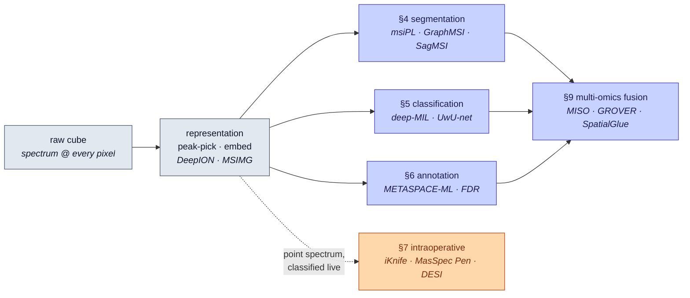

# Dense Object Detection & Classification — Recent Advances

*Compiled 2026-Aug-28 (America/Los_Angeles).*

Next installment in the running CV-updates log. Earlier entries on
`main`:
[Apr-30](../2026-Apr-30/2026-Apr-30_CV_updates.md),
[May-01](../2026-May-01/2026-May-01_CV_updates.md),
[May-02](../2026-May-02/2026-May-02_CV_updates.md),
[May-04](../2026-May-04/2026-May-04_CV_updates.md),
[May-05](../2026-May-05/2026-May-05_CV_updates.md),
[May-07](../2026-May-07/2026-May-07_CV_updates.md),
[May-08](../2026-May-08/2026-May-08_CV_updates.md),
[May-15](../2026-May-15/2026-May-15_CV_updates.md),
[May-16](../2026-May-16/2026-May-16_CV_updates.md),
[May-17](../2026-May-17/2026-May-17_CV_updates.md),
[Jun-09](../2026-Jun-09/2026-Jun-09_CV_updates.md),
[Jun-10](../2026-Jun-10/2026-Jun-10_CV_updates.md),
[Jun-12](../2026-Jun-12/2026-Jun-12_CV_updates.md),
[Jun-15](../2026-Jun-15/2026-Jun-15_CV_updates.md),
[Jun-16](../2026-Jun-16/2026-Jun-16_CV_updates.md),
[Jun-17](../2026-Jun-17/2026-Jun-17_CV_updates.md),
[Jun-19](../2026-Jun-19/2026-Jun-19_CV_updates.md),
[Jun-21](../2026-Jun-21/2026-Jun-21_CV_updates.md),
[Jun-22](../2026-Jun-22/2026-Jun-22_CV_updates.md),
[Jun-23](../2026-Jun-23/2026-Jun-23_CV_updates.md),
[Jun-24](../2026-Jun-24/2026-Jun-24_CV_updates.md),
[Jun-25](../2026-Jun-25/2026-Jun-25_CV_updates.md),
[Jun-27](../2026-Jun-27/2026-Jun-27_CV_updates.md),
[Jun-29](../2026-Jun-29/2026-Jun-29_CV_updates.md),
[Jun-30](../2026-Jun-30/2026-Jun-30_CV_updates.md),
[Jul-04](../2026-Jul-04/2026-Jul-04_CV_updates.md),
[Jul-07](../2026-Jul-07/2026-Jul-07_CV_updates.md),
[Jul-08](../2026-Jul-08/2026-Jul-08_CV_updates.md),
[Jul-10](../2026-Jul-10/2026-Jul-10_CV_updates.md),
[Jul-15](../2026-Jul-15/2026-Jul-15_CV_updates.md),
[Jul-17](../2026-Jul-17/2026-Jul-17_CV_updates.md),
[Jul-18](../2026-Jul-18/2026-Jul-18_CV_updates.md),
[Jul-21](../2026-Jul-21/2026-Jul-21_CV_updates.md),
[Jul-22](../2026-Jul-22/2026-Jul-22_CV_updates.md),
[Jul-24](../2026-Jul-24/2026-Jul-24_CV_updates.md),
[Jul-26](../2026-Jul-26/2026-Jul-26_CV_updates.md),
[Jul-27](../2026-Jul-27/2026-Jul-27_CV_updates.md),
[Jul-30](../2026-Jul-30/2026-Jul-30_CV_updates.md),
[Aug-01](../2026-Aug-01/2026-Aug-01_CV_updates.md),
[Aug-02](../2026-Aug-02/2026-Aug-02_CV_updates.md),
[Aug-04](../2026-Aug-04/2026-Aug-04_CV_updates.md),
[Aug-07](../2026-Aug-07/2026-Aug-07_CV_updates.md),
[Aug-10](../2026-Aug-10/2026-Aug-10_CV_updates.md),
[Aug-11](../2026-Aug-11/2026-Aug-11_CV_updates.md),
[Aug-13](../2026-Aug-13/2026-Aug-13_CV_updates.md),
[Aug-15](../2026-Aug-15/2026-Aug-15_CV_updates.md),
[Aug-16](../2026-Aug-16/2026-Aug-16_CV_updates.md),
[Aug-18](../2026-Aug-18/2026-Aug-18_CV_updates.md),
[Aug-19](../2026-Aug-19/2026-Aug-19_CV_updates.md),
[Aug-21](../2026-Aug-21/2026-Aug-21_CV_updates.md),
[Aug-22](../2026-Aug-22/2026-Aug-22_CV_updates.md),
[Aug-24](../2026-Aug-24/2026-Aug-24_CV_updates.md),
[Aug-26](../2026-Aug-26/2026-Aug-26_CV_updates.md).

The last entry closed on the **weather-radar volume** — a spinning beam that
paints a multi-channel image of the sky, where the *class* of an echo is
written jointly across reflectivity, Doppler and the dual-polarization
variables rather than in any single channel. Way back on
[Jul-21](../2026-Jul-21/2026-Jul-21_CV_updates.md) the log met the
**hyperspectral cube**, where the label lives in the per-pixel *optical*
spectrum. This pass follows that same "the label is in the spectrum, not the
morphology" idea to its most extreme, most chemically literal incarnation:
**mass spectrometry imaging (MSI)** — spatial metabolomics, lipidomics and
proteomics. A laser or solvent probe rasters across a tissue section, and at
**every pixel** it desorbs and ionizes molecules and records a *full mass
spectrum* — hundreds to tens of thousands of mass-to-charge (m/z) channels.
Stack those spectra and you get a data cube whose depth axis is not
wavelength or radar moment but **the molecular inventory of the tissue itself**.
In that cube, *tumor and normal, one metabolic state and another, one cell
phenotype and its neighbor each draw a recognizable spectral signature* — and
the three computer-vision jobs fall out naturally: **segment** the tissue into
molecular regions, **classify** what each region/pixel is, and **detect** which
of the thousands of raw m/z peaks are real molecules and what they are. This
entry treats the mass-spectrum image as its own first-class dense-vision
modality — a hyperspectral cube whose channels are chemistry, mostly *unknown*
chemistry, acquired *destructively*, on very few tissue sections, sometimes
under a live surgical deadline.

## Table of contents

1. [Why this pass: the mass-spectrum image as its own primitive](#1--why-this-pass-the-mass-spectrum-image-as-its-own-primitive)
2. [The primitive — a pixel is a full mass spectrum](#2--the-primitive--a-pixel-is-a-full-mass-spectrum)
3. [Preprocessing & representation — peak picking, ion images, dimensionality](#3--preprocessing--representation--peak-picking-ion-images-dimensionality)
4. [Dense classification I — unsupervised spatial segmentation](#4--dense-classification-i--unsupervised-spatial-segmentation)
5. [Dense classification II — supervised tissue/tumor & weak supervision](#5--dense-classification-ii--supervised-tissuetumor--weak-supervision)
6. [Detection — metabolite annotation with FDR control](#6--detection--metabolite-annotation-with-fdr-control)
7. [Real-time & intraoperative MS — the deadline-bound cousin](#7--real-time--intraoperative-ms--the-deadline-bound-cousin)
8. [Imaging mass cytometry & spatial proteomics — the targeted, single-cell side](#8--imaging-mass-cytometry--spatial-proteomics--the-targeted-single-cell-side)
9. [Foundation models, multi-omics fusion & the data problem](#9--foundation-models-multi-omics-fusion--the-data-problem)
10. [Why a mass-spectrum image is *not* a natural image](#10--why-a-mass-spectrum-image-is-not-a-natural-image)
11. [Open problems / what to watch](#11--open-problems--what-to-watch)
12. [Sources](#12--sources)

## 1 · Why this pass: the mass-spectrum image as its own primitive

Six properties make MSI worth treating as a first-class dense-vision surface
rather than "a stack of grayscale ion images":

1. **The depth axis is chemistry, and it is (mostly) unknown.** Unlike a
   hyperspectral optical cube where the axis is a calibrated physical
   wavelength, an untargeted MALDI or DESI cube has 10³–10⁵ m/z channels whose
   *molecular identity is not known a priori.* Deciding which peaks are real
   molecules and naming them — **annotation** — is itself a detection problem,
   not a preprocessing footnote.
2. **The label lives across many correlated channels.** A single molecule
   spreads across isotope peaks and multiple adducts; a tissue class is defined
   by a *pattern* over dozens of co-varying ions. This is per-pixel
   multi-spectral classification in the same family as the hyperspectral cube
   of [Jul-21](../2026-Jul-21/2026-Jul-21_CV_updates.md) and the dual-pol radar
   volume of [Aug-26](../2026-Aug-26/2026-Aug-26_CV_updates.md), but with
   thousands of channels and no clean band structure.
3. **It is extremely high-dimensional and sparse.** Each pixel is a long, mostly
   empty vector; a slide is gigabytes to terabytes. Naïvely feeding the raw cube
   to an ImageNet-shaped CNN is hopeless — representation learning and
   dimensionality reduction are the first, load-bearing step.
4. **Labels are scarce, weak, and morphology-mediated.** Ground truth usually
   comes from a co-registered H&E section annotated by a pathologist at the
   *region* level, not the pixel level — which pushes the field toward
   unsupervised segmentation and **weakly-supervised / multiple-instance**
   classification.
5. **Acquisition is destructive and low-n.** You image a section *once*; there
   is no re-scan, no test-time augmentation by re-acquiring, and a "dataset" is
   often a handful of sections. Batch and instrument effects loom large
   relative to sample size.
6. **One dialect of it runs under a surgical deadline.** Rapid-evaporative and
   ambient variants (the iKnife, the MasSpec Pen, DESI margin tools) classify a
   *point* spectrum in seconds to guide a scalpel — the same asymmetric,
   deadline-bound decision problem that made calibration and latency
   first-order for radar nowcasting.

## 2 · The primitive — a pixel is a full mass spectrum

**The acquisition.** A sample-preparation step fixes a thin tissue section to a
slide; then an ionization source is rastered across it on a regular grid. At
each grid point ("pixel") the source liberates ions from the surface and a mass
analyzer records their m/z spectrum. The dominant modalities differ in *how*
they ionize and at *what* resolution:

- **MALDI-MSI** (matrix-assisted laser desorption/ionization) — a UV laser
  fires into a chemical matrix co-deposited on the tissue; the workhorse for
  lipids, metabolites, peptides and glycans. Typical spatial resolution ~10–100 µm
  (down to single-cell with modern instruments and MALDI-2 post-ionization).
- **DESI-MSI** (desorption electrospray ionization) — an ambient, matrix-free
  charged solvent spray; gentle, requires little prep, favored for lipids and
  the clinical margin work in §7.
- **SIMS** (secondary ion mass spectrometry) — a focused ion beam; reaches
  *sub-micron / subcellular* resolution at the cost of heavier fragmentation.
- **Imaging mass cytometry (IMC)** and **MIBI** — a *targeted* twist: instead of
  scanning all m/z, tissue is stained with ~40 metal-isotope-tagged antibodies,
  then ablated/scanned so each pixel reports the abundances of a fixed, *known*
  protein panel at single-cell resolution. This is the spatial-proteomics arm
  (§8) and behaves more like a labelled multiplex-fluorescence stack than an
  untargeted metabolomic cube.

**The data structure.** Stack every pixel's spectrum on the spatial grid and
you have a cube of shape (x, y, m/z). Slice it at a fixed m/z and you get an
**ion image**: the spatial distribution of one molecular species. The catch
that defines the field:

- **Untargeted (MALDI/DESI/SIMS):** thousands of *unlabeled* m/z channels. The
  cube is enormous, sparse, and high-dynamic-range; the identity of most peaks
  is unknown; and one molecule occupies several correlated channels (isotopes,
  adducts, in-source fragments). Peak-picking, alignment and annotation are part
  of the vision problem.
- **Targeted (IMC/MIBI):** ~40 *known* channels, single-cell resolution — a
  clean, labelled, but still high-plex stack where the hard part is cell
  segmentation and phenotyping.

Everything downstream — segmentation, tissue/tumor classification, metabolite
annotation, multi-omics fusion — is a dense, multi-channel operation on this
cube. The reference framing for MSI-as-spatial-omics is the 2024–2026 review
literature ([npj Imaging 2024](https://www.nature.com/articles/s44303-024-00025-3),
[*J. Biomed. Sci.* 2026 human-spatial-omics review](https://pmc.ncbi.nlm.nih.gov/articles/PMC12879364/),
and the [2024 MALDI-MSI advances mini-review](https://www.ncbi.nlm.nih.gov/pmc/articles/PMC12065102/)).

The same flow, as a lineage the rest of this entry follows section by section:

*Task lineage over the cube: slate = the cube and its representation, indigo =
the three dense tasks and their fusion, orange = the deadline-bound
intraoperative branch. Fills carry explicit text colors so the flowchart stays
legible in light and dark viewers.*

## 3 · Preprocessing & representation — peak picking, ion images, dimensionality

Because the raw cube is unusable as-is, the first modeling decisions are about
**representation** — and this is where deep learning first bit into MSI.

**Peak picking as a learned, spatial task.** Classic pipelines pick peaks per
spectrum, ignoring the fact that *real* molecular signals are spatially
coherent while noise is not. Recent work reframes peak detection as a spatial,
self-supervised problem: the
[Spatial self-supervised Peak Learning](https://arxiv.org/pdf/2603.10487) method
learns which m/z bins carry spatially-structured signal and evaluates
peak-picking by spatial-correlation rather than intensity alone — a cleaner,
more reproducible front end than intensity-threshold heuristics.

**Density-aware image representation.** Turning a sparse spectrum into something
a CNN can consume is non-trivial. [MSIMG](https://doi.org/10.3390/s25206363)
(Sensors 2025) proposes a **density-aware multi-channel image representation**
that preserves signal integrity for high-dimensional MS data, explicitly
targeting the information loss that hobbles downstream deep models.

**Learned ion-image embeddings.** [DeepION](https://pubs.acs.org/doi/10.1021/acs.analchem.3c05002)
(Anal. Chem. 2024) uses a **SimSiam self-supervised contrastive** model to
compress tens of thousands of ion images into a ~20-dimensional space,
automatically clustering *colocalized* molecules and isotope peaks — i.e. it
learns the redundancy structure (isotopes/adducts of the same molecule map
together), which is exactly the correlated-channel problem of §1. Contrastive
and self-supervised recipes are a recurring theme: an earlier
[self-supervised contrastive clustering of MSI](https://www.ncbi.nlm.nih.gov/pmc/articles/PMC8694357/)
established the pattern, and 2025's
[MSInet](https://www.researchgate.net/publication/396992835_MSInet_A_Self-Supervised_CNN_Framework_Integrating_Global_and_Local_Context_for_Robust_Mass_Spectrometry_Imaging_Segmentation)
integrates global and local context in a self-supervised CNN for robust
segmentation. The [ACS Measurement Science Au review](https://pubs.acs.org/doi/10.1021/acsmeasuresciau.3c00060)
is a good survey of ML-for-MS representation choices.

## 4 · Dense classification I — unsupervised spatial segmentation

Because pixel-level labels rarely exist, the *first* dense task is usually
**unsupervised segmentation**: compartmentalize the tissue into regions of
similar molecular composition, then hand those regions to a pathologist to
interpret. This is semantic segmentation of the sky's chemical analog.

**The manifold-learning pivot — msiPL.** [msiPL](https://www.nature.com/articles/s41467-020-20321-x)
learns and visualizes the underlying *non-linear* spectral manifold with a
fully-connected **variational autoencoder** (a probabilistic generative model),
revealing biologically relevant clusters of tissue anatomy and tumor
heterogeneity *and* identifying the underlying m/z peaks that define them —
scaling to whole datasets without manual peak preselection. It is the reference
point for "let the network find the molecular regions."

**Graph- and context-aware successors.** A cluster of methods now attack the
same problem while injecting spatial structure and dropping manual peak
selection:

- **dc-DeepMSI** and **GraphMSI** — fully unsupervised segmentation that fuses
  spectral similarity with spatial neighborhood information (no manual peaks).
- **SagMSI** ([Anal. Chim. Acta 2025](https://www.sciencedirect.com/science/article/abs/pii/S0003267025004921))
  — a **graph convolutional network** framework for precise spatial
  segmentation, the current graph-native entry, continuing the GNN drift also
  seen in radar and remote-sensing passes.
- **iSegMSI** — interactive segmentation that still relies on preselected peaks
  and external knowledge for ROI boundaries, useful when a human wants to steer.

The trajectory mirrors every other modality in this log: **classical clustering
(k-means, spatial-DGMM) → VAE manifolds (msiPL) → graph neural nets
(GraphMSI/SagMSI)**, with self-supervision doing the heavy lifting because
labels are scarce.

## 5 · Dense classification II — supervised tissue/tumor & weak supervision

When labels *do* exist they are usually **weak** — a pathologist annotates a
whole section or region as "tumor" or "normal," not each pixel. That makes MSI a
natural home for **multiple-instance learning (MIL)** and other
weak-supervision recipes.

- **Deep MIL for subtissue localization.** [Deep multiple-instance
  learning](https://pmc.ncbi.nlm.nih.gov/articles/PMC7355295/) classifies
  *subtissue locations* in MS images from *tissue-level* annotations only —
  learning where within a "tumor-labelled" section the tumor actually is,
  without pixel labels. This is the canonical weak-supervision framing for the
  modality.
- **UwU-net and mi-CNN.** **UwU-net** adapts U-net to *high-channel* MSI for
  joint segmentation and classification; **mi-CNN** combines multiple-instance
  learning with CNNs for classification and segmentation of subtissue elements.
- **Deep learning vs classical on mass spectra.** For per-spectrum tumor typing,
  [deep learning outperforms classical ML in pediatric brain-tumor
  classification](https://www.biorxiv.org/content/10.1101/2024.01.24.577095.full.pdf)
  (2024) — evidence that learned representations beat hand-engineered spectral
  features even at modest sample sizes. The
  [2017 tumor-classification study](https://pubmed.ncbi.nlm.nih.gov/29126286/)
  is the lineage anchor for DL on imaging-MS tumor typing.
- **Beyond oncology.** [DL-assisted MSI for preliminary screening and
  pre-classification of psychoactive substances](https://www.sciencedirect.com/science/article/abs/pii/S003991402400136X)
  (2024) and forensic/plant applications show the same detect-and-classify
  template generalizes past tissue pathology.

The overarching pattern: MSI classification is **label-starved**, so the winning
recipes are the ones that squeeze supervision out of weak, region-level, or
morphology-mediated labels.

## 6 · Detection — metabolite annotation with FDR control

Here is the job with no clean analog in ordinary vision: in an *untargeted*
cube, before you can classify anything you must decide **which of the thousands
of raw m/z peaks correspond to real molecules, and what those molecules are.**
This is detection with a hard statistical-reliability requirement.

**METASPACE and decoy-based FDR.** The community engine
[METASPACE](https://metaspace2020.org/) annotates metabolites by scoring
candidate ions against a database and estimating a **false-discovery rate (FDR)
by ranking real candidates against implausible "decoy" ions** — the same
target-decoy idea used in proteomics search, adapted to the spatial setting so
that an ion's spatial pattern contributes to its score.

**METASPACE-ML.** The 2024 machine-learning successor
([*Nature Communications* 2024](https://www.nature.com/articles/s41467-024-52213-9))
replaces rule-based scoring with a learned model, adds new scores and a
**computationally-efficient FDR estimation plus a reliability score** that helps
users pick the FDR threshold optimizing precision *and* recall. Trained and
evaluated on **1,710 datasets from 159 researchers across 47 labs** (animal and
plant contexts), it beats its rule-based predecessor on precision, throughput,
and — critically — recovery of *low-intensity, biologically-relevant*
metabolites that the old engine missed. It is the closest thing MSI has to a
shared, benchmarked "detector," and its decoy-FDR framing is the modality's
answer to the precision/recall calibration problem that dogs every detection
task in this log.

## 7 · Real-time & intraoperative MS — the deadline-bound cousin

A whole dialect of the modality trades the dense image for a *single point
spectrum* acquired live, and classifies it in seconds to guide surgery — the
same asymmetric, latency-bound decision problem that made calibration
first-order for radar nowcasting.

- **The iKnife / REIMS.** Rapid evaporative ionization MS reads the ionized
  smoke from an electrosurgical blade; it is the only such device applied
  **in vivo on human cancer patients**, delivering real-time tissue diagnosis
  since REIMS was introduced in 2009, with classification classically by
  PCA-LDA over the lipid profile (the
  [REI-EXCISE iKnife trial, NCT03432429](https://clinicaltrials.gov/study/NCT03432429);
  [colorectal in-vivo endoscopic lipidome phenotyping](https://www.ncbi.nlm.nih.gov/pmc/articles/PMC5315709/)).
- **The MasSpec Pen.** A handheld probe places a water droplet on the tissue for
  a few seconds, withdraws the dissolved metabolites/lipids, and a **machine-
  learning classifier** returns a healthy/tumor call — demonstrated across
  brain, breast, GI and urogenital cancers, with
  [next-generation instrumentation and medical-device development](https://www.sciencedirect.com/science/article/abs/pii/S1387380625001198)
  reported in 2025.
- **DESI for margins.** DESI-MSI is maturing for cancer margin evaluation,
  grading and prognosis; a 2025 [npj Digital Medicine
  study](https://www.nature.com/articles/s41746-025-02202-z) pairs fast
  multimodal imaging with ML and identifies **taurine** as a candidate marker
  for breast-cancer margin assessment, and a
  [DESI-MSI cancer-diagnosis overview](https://link.springer.com/chapter/10.1007/978-981-96-2088-3_9)
  and [intraoperative-MS-in-oncology review](https://pubmed.ncbi.nlm.nih.gov/42075965/)
  survey the clinical landscape.

The unifying constraint: a slow answer is a useless answer, and a false call has
a human cost — so latency, calibration and out-of-distribution robustness are
part of the model spec, not the eval afterthought.

## 8 · Imaging mass cytometry & spatial proteomics — the targeted, single-cell side

The *targeted* arm — IMC and MIBI — was recognized when *Nature Methods* named
**spatial proteomics its [Method of the Year 2024](https://www.nature.com/articles/s41592-024-02565-3)**.
Here each pixel carries ~40 known protein channels at single-cell resolution, so
the dense-vision problem shifts from "what are the channels" to **cell
segmentation and phenotyping** on a high-plex stack — the direct cousin of the
microscopy pass ([Jul-17](../2026-Jul-17/2026-Jul-17_CV_updates.md)).

- **Cell segmentation.** Generalist deep segmenters — **Mesmer** (DeepCell),
  **Cellpose**, **nucleAIzer** — define cell/nucleus boundaries across IMC and
  related platforms; [pushing the limits of cell-segmentation models for
  IMC](https://arxiv.org/html/2402.04446v1) (2024) benchmarks and stress-tests
  them on the modality's peculiar noise.
- **Resolution & phenotyping.** [SpiDe-Sr](https://www.ncbi.nlm.nih.gov/pmc/articles/PMC10978886/)
  is a blind **super-resolution + denoising** network that sharpens IMC images
  for more precise segmentation and clustering; **segmentation-aware
  probabilistic phenotyping** ([*Nat. Commun.* 2024](https://www.nature.com/articles/s41467-024-55214-w))
  jointly models segmentation uncertainty and single-cell protein expression so
  phenotype calls degrade gracefully when boundaries are fuzzy.
- **Panel completion and cell "language."** [Expanding the coverage of spatial
  proteomics](https://academic.oup.com/bioinformatics/article/40/2/btae062/7600423)
  (Bioinformatics 2024) learns a minimal predictive marker subset that
  reconstructs larger panels; [Spatial Coordinates as a Cell
  Language](https://arxiv.org/html/2506.01918v1) casts IMC analysis as a
  multi-sentence framework, importing sequence-model machinery into spatial
  single-cell proteomics.

## 9 · Foundation models, multi-omics fusion & the data problem

**Toward MSI/spectral foundation models.** Self-supervised, pretrain-once
recipes are arriving on the spectral side. The
[MALDI Transformer](https://pubmed.ncbi.nlm.nih.gov/39847945/) (2025) adapts the
transformer with the **first self-supervised pretraining designed for mass
spectra** — demonstrated on MALDI-TOF microbial prediction rather than imaging,
but a clear template for spectrum foundation models, and DeepION/MSInet (§3)
supply the self-supervised representation half for the imaging cube. The pull is
the same one seen for DAS, SAR, OCT and radar in this log: **the raw archive is
huge and cheap; the labels are scarce and expensive; so self-supervision on the
spectrum is the natural lever.**

**Multi-omics fusion — the cube is one modality among several.** MSI's metabolic
layer is most powerful *combined* with histology and other spatial omics on the
same (or serial) sections, which turns the problem into **cross-modal
registration + fusion**:

- **MISO** (Coleman et al., 2025) folds H&E histology into a multimodal
  integration pipeline via **outer-product interactions**, part of a wave of
  methods that **predict spatially-resolved omics directly from H&E** — cheap
  morphology standing in for expensive molecular measurement.
- **SpatialGlue** (2024) uses a **dual-attention graph neural network** to
  integrate spatial location with each modality's measurements before combining
  modalities — the graph-fusion pattern.
- **GROVER** ([arXiv:2511.11730](https://arxiv.org/pdf/2511.11730)) —
  graph-guided representation of omics *and* vision with expert regulation for
  adaptive spatial multi-omics fusion.
- **Multiscale morphology + omics.** A [deep-learning multiscale integration of
  spatial omics with tumor morphology](https://www.biorxiv.org/content/10.1101/2024.07.22.604083.full.pdf)
  (2024) ties molecular fields to histological structure across scales.

Recent reviews map the whole integration stack:
[multimodal spatial omics from acquisition to computational integration](https://www.sciencedirect.com/science/article/pii/S2666389926001017)
([arXiv mirror 2601.12381](https://arxiv.org/pdf/2601.12381)),
[deep learning for integrating spatial transcriptomics with other modalities](https://academic.oup.com/bib/article/26/1/bbae719/7952009),
and [MSI for spatially-resolved multi-omics molecular mapping](https://pubmed.ncbi.nlm.nih.gov/39036554/).

**The data problems specific to MSI:**
- **No molecular ground truth (untargeted).** Peak identity is often unknown, so
  "labels" are annotations with an FDR, not certainties — supervision is
  intrinsically noisy.
- **Cross-instrument / cross-lab domain shift.** m/z calibration, matrix effects,
  ionization efficiency and normalization differ across machines and labs, so a
  model trained on one platform degrades on another — the same
  station-to-station gap seen in every sensor modality here.
- **Registration is load-bearing.** Labels ride in from an adjacent H&E or a
  serial section; sub-optimal co-registration corrupts supervision and fusion
  alike.
- **Low n, huge p, heavy batch effects.** Few sections, millions of pixels ×
  thousands of channels, and batch/run effects that rival the biological signal.

## 10 · Why a mass-spectrum image is *not* a natural image

Pulling the peculiarities together — the reasons off-the-shelf RGB vision
transfers only partially:

- **The channels are physical m/z, thousands of them, mostly unlabeled.** The
  "color" of a pixel is a molecular fingerprint whose identity is itself
  unknown; there is no ImageNet 3-channel stem that makes sense, and annotation
  is part of the task.
- **Correlated, redundant channel structure.** One molecule spreads across
  isotopes, adducts and fragments; the informative axis is a *pattern* over
  co-varying ions, not independent bands.
- **Sparse, high-dynamic-range spectra.** Most bins are empty; a few dominate by
  orders of magnitude — nothing like the smooth statistics of natural images.
- **Destructive, single-shot acquisition.** No re-scan, no re-acquisition
  augmentation; you get the section once.
- **Coarse, variable spatial resolution.** 10–100 µm for MALDI/DESI (subcellular
  only for SIMS), so morphology is blurry and the molecular signal, not the
  shape, carries the class.
- **Labels arrive by registration to morphology.** Supervision is mediated by an
  H&E section and a pathologist's region call — weak, spatially imprecise, and
  registration-dependent.
- **Structured, non-Gaussian artifacts.** Matrix heterogeneity, ion
  suppression, analyte delocalization and batch/run effects are physics- and
  chemistry-driven corruptions, not additive noise.
- **Tiny n, enormous p.** A "dataset" is a handful of sections; the risk of
  learning batch effects instead of biology is ever-present.
- **A deadline-bound dialect.** The intraoperative variants must classify a
  point spectrum in seconds, making latency and calibration part of the spec.

## 11 · Open problems / what to watch

- **A real MSI foundation model.** Self-supervised pretraining on the growing
  public archive (METASPACE, EMBL/METASPACE-community datasets) with
  masked-spectrum / next-region objectives, then light adaptation to
  segmentation, tumor-typing, annotation and QC heads — the recipe every other
  modality in this log has converged on, not yet consolidated for the imaging
  cube.
- **Annotation you can trust.** METASPACE-ML made FDR learnable; the frontier is
  calibrated, *per-metabolite* reliability that holds across instruments and
  matrices, and joint annotation-plus-segmentation so identity and spatial
  pattern are inferred together.
- **Cross-instrument / cross-lab generalization.** Domain adaptation and
  harmonization across MALDI/DESI/SIMS platforms and across labs is the
  deployment bottleneck; without it, published accuracy does not travel.
- **Registration-native multi-omics.** End-to-end models that co-register and
  fuse MSI with H&E and spatial transcriptomics inside the network (MISO,
  GROVER, SpatialGlue) rather than as a brittle preprocessing step — and cheap
  H&E→omics prediction where the molecular measurement is unaffordable.
- **Single-cell and 3D MSI.** Pushing MALDI-2/SIMS toward subcellular resolution
  and stacking serial sections into 3D metabolic volumes turns the 2D dense
  problem into a volumetric one, with all the registration and compute costs
  that implies.
- **Weak-supervision that respects the biology.** Better MIL and
  self-/semi-supervised recipes that exploit region-level pathology labels and
  spatial coherence without overfitting batch effects on tiny n.
- **Clinical translation under the deadline.** For the intraoperative branch:
  prospective validation, calibrated uncertainty, and OOD detection so a live
  tumor/normal call is trustworthy — the margin between a useful surgical aid and
  a confident wrong answer.

## 12 · Sources

**Primitive, reviews & the modality on its own terms**
- MSI for spatially resolved multi-omics molecular mapping — *npj Imaging* (2024) — https://www.nature.com/articles/s44303-024-00025-3 · PubMed — https://pubmed.ncbi.nlm.nih.gov/39036554/
- Mass spectrometry-based human spatial omics: fundamentals, innovations, applications — *J. Biomed. Sci.* (2026) — https://pmc.ncbi.nlm.nih.gov/articles/PMC12879364/ · Springer — https://link.springer.com/article/10.1186/s12929-026-01219-0
- Highlight of Recent Advances and Applications of MALDI-MSI in 2024 (mini-review) — *Analytical Science Advances* (2025) — https://www.ncbi.nlm.nih.gov/pmc/articles/PMC12065102/ · Wiley — https://chemistry-europe.onlinelibrary.wiley.com/doi/10.1002/ansa.70016
- Recent Developments in Machine Learning for Mass Spectrometry — *ACS Meas. Sci. Au* — https://pubs.acs.org/doi/10.1021/acsmeasuresciau.3c00060

**Preprocessing & representation**
- Spatial self-supervised Peak Learning and correlation-based Evaluation of peak picking in MSI — arXiv:2603.10487 — https://arxiv.org/pdf/2603.10487
- MSIMG: A Density-Aware Multi-Channel Image Representation Method for Mass Spectrometry — *Sensors* 25(20):6363 (2025) — https://doi.org/10.3390/s25206363
- DeepION: A Deep Learning-Based Low-Dimensional Representation Model of Ion Images for MSI — *Anal. Chem.* 96(9):3829 (2024) — https://pubs.acs.org/doi/10.1021/acs.analchem.3c05002
- Self-supervised clustering of MSI data using contrastive learning — *PMC* (2021) — https://www.ncbi.nlm.nih.gov/pmc/articles/PMC8694357/
- MSInet: A Self-Supervised CNN Framework Integrating Global and Local Context for Robust MSI Segmentation — https://www.researchgate.net/publication/396992835_MSInet_A_Self-Supervised_CNN_Framework_Integrating_Global_and_Local_Context_for_Robust_Mass_Spectrometry_Imaging_Segmentation

**Unsupervised spatial segmentation**
- msiPL — Probabilistic deep-learning (VAE) for MSI segmentation & peak identification — *Nature Communications* (2021) — https://www.nature.com/articles/s41467-020-20321-x
- SagMSI — A graph convolutional network framework for precise spatial segmentation in MSI — *Anal. Chim. Acta* (2025) — https://www.sciencedirect.com/science/article/abs/pii/S0003267025004921

**Supervised / weakly-supervised classification**
- Deep multiple instance learning classifies subtissue locations in MS images from tissue-level annotations — *Bioinformatics* / *PMC* (2020) — https://pmc.ncbi.nlm.nih.gov/articles/PMC7355295/
- Deep Learning Outperforms Classical ML Methods in Pediatric Brain Tumor Classification through Mass Spectra — bioRxiv (2024) — https://www.biorxiv.org/content/10.1101/2024.01.24.577095.full.pdf
- Deep learning for tumor classification in imaging mass spectrometry (lineage) — *Bioinformatics* / PubMed (2017) — https://pubmed.ncbi.nlm.nih.gov/29126286/
- Deep learning-assisted MSI for preliminary screening and pre-classification of psychoactive substances — *Talanta* (2024) — https://www.sciencedirect.com/science/article/abs/pii/S003991402400136X

**Detection — metabolite annotation & FDR**
- METASPACE-ML: Context-specific metabolite annotation for imaging MS using machine learning — *Nature Communications* 15:9110 (2024) — https://www.nature.com/articles/s41467-024-52213-9 · PMC — https://www.ncbi.nlm.nih.gov/pmc/articles/PMC11496635/ · bioRxiv — https://www.biorxiv.org/content/10.1101/2023.05.29.542736v3
- METASPACE community engine — https://metaspace2020.org/

**Real-time / intraoperative MS**
- Intraoperative Mass Spectrometry in Oncology: Technologies, Clinical Applications, and Challenges (review) — PubMed (2025) — https://pubmed.ncbi.nlm.nih.gov/42075965/
- Mass Spectrometry-Based Intraoperative Tumor Diagnostics (iKnife/REIMS/MasSpec Pen overview) — *Future Sci. OA* — https://www.tandfonline.com/doi/full/10.4155/fsoa-2018-0087
- REI-EXCISE iKnife Study — real-time tissue characterisation — ClinicalTrials NCT03432429 — https://clinicaltrials.gov/study/NCT03432429
- In-vivo endoscopic phenotyping of colorectal cancer via real-time mucosal lipidome (iKnife) — *PMC* — https://www.ncbi.nlm.nih.gov/pmc/articles/PMC5315709/
- Next-generation MasSpec Pen: innovations in instrumentation & medical-device development for intraoperative use — *Int. J. Mass Spectrom.* (2025) — https://www.sciencedirect.com/science/article/abs/pii/S1387380625001198
- Fast multimodal imaging + ML identifying taurine as a marker for breast-cancer margin assessment — *npj Digital Medicine* (2025) — https://www.nature.com/articles/s41746-025-02202-z
- Desorption Electrospray Ionization MSI for Cancer Diagnosis — Springer chapter (2025) — https://link.springer.com/chapter/10.1007/978-981-96-2088-3_9

**Imaging mass cytometry & spatial proteomics**
- Method of the Year 2024: spatial proteomics — *Nature Methods* — https://www.nature.com/articles/s41592-024-02565-3
- Pushing the limits of cell segmentation models for imaging mass cytometry — arXiv:2402.04446 — https://arxiv.org/html/2402.04446v1
- SpiDe-Sr: blind super-resolution for precise cell segmentation & clustering in spatial-proteomics imaging — *PMC* — https://www.ncbi.nlm.nih.gov/pmc/articles/PMC10978886/
- Segmentation-aware probabilistic phenotyping of single-cell spatial protein expression — *Nature Communications* (2024) — https://www.nature.com/articles/s41467-024-55214-w
- Expanding the coverage of spatial proteomics: a machine learning approach — *Bioinformatics* 40(2):btae062 (2024) — https://academic.oup.com/bioinformatics/article/40/2/btae062/7600423
- Spatial Coordinates as a Cell Language: a multi-sentence framework for IMC analysis — arXiv:2506.01918 — https://arxiv.org/html/2506.01918v1

**Foundation models & multi-omics fusion**
- Pre-trained MALDI Transformers improve MALDI-TOF MS-based prediction (self-supervised pretraining for mass spectra) — PubMed (2025) — https://pubmed.ncbi.nlm.nih.gov/39847945/
- GROVER: Graph-guided Representation of Omics and Vision with Expert Regulation for Adaptive Spatial Multi-omics Fusion — arXiv:2511.11730 — https://arxiv.org/pdf/2511.11730
- A deep learning-based multiscale integration of spatial omics with tumor morphology — bioRxiv (2024) — https://www.biorxiv.org/content/10.1101/2024.07.22.604083.full.pdf
- Multimodal spatial omics: from data acquisition to computational integration — *Cell Genomics/ScienceDirect* — https://www.sciencedirect.com/science/article/pii/S2666389926001017 · arXiv mirror 2601.12381 — https://arxiv.org/pdf/2601.12381
- Deep learning in integrating spatial transcriptomics with other modalities — *Briefings in Bioinformatics* 26(1):bbae719 (2025) — https://academic.oup.com/bib/article/26/1/bbae719/7952009

### How this connects to earlier passes

MSI is the chemistry-axis endpoint of a line this log keeps returning to: the
class lives in the **spectrum**, not the shape. The
[hyperspectral cube (Jul-21)](../2026-Jul-21/2026-Jul-21_CV_updates.md) put an
*optical* spectrum at every pixel; the
[dual-pol radar volume (Aug-26)](../2026-Aug-26/2026-Aug-26_CV_updates.md)
spread the label across physical radar moments; MSI replaces both with an
*unlabeled molecular inventory* and adds annotation as a first-class detection
job. Its weak-supervision / MIL core and H&E-mediated labels tie it to the
[microscopy & cellular bioimaging pass (Jul-17)](../2026-Jul-17/2026-Jul-17_CV_updates.md)
(which touched IMC and cryo briefly), and to the gigapixel-pathology thread in
[medical imaging (Jul-07)](../2026-Jul-07/2026-Jul-07_CV_updates.md). The
intraoperative branch (§7) shares the asymmetric, deadline-bound decision
posture that made calibration and latency first-order for the
[radar-nowcasting pass (Aug-26)](../2026-Aug-26/2026-Aug-26_CV_updates.md), and
its self-supervision-on-a-huge-unlabeled-archive lever is the same one seen for
[SAR (Jul-22)](../2026-Jul-22/2026-Jul-22_CV_updates.md),
[OCT (Jul-24)](../2026-Jul-24/2026-Jul-24_CV_updates.md) and
[DAS (Aug-24)](../2026-Aug-24/2026-Aug-24_CV_updates.md).

*Diagrams in this entry are hand-authored standalone SVG (no external URLs),
with a light outer card and dark/colored inner panels carrying explicit text
fills so they render legibly in both light and dark viewers. Some links were
gathered under scraping/API limits and are provided best-effort; where a landing
page was unreachable, an arXiv, PMC or DOI mirror is listed alongside. A few
pre-2023 works (the 2017 tumor-classification study, the 2021 msiPL and
contrastive-clustering papers) are included as lineage anchors for
otherwise-recent threads. arXiv identifiers dated 2506/2511/2601/2603 follow the
newer numbering in use through 2026.*
