# Dense Object Detection & Classification — Recent Advances

*Compiled 2026-Aug-31 (America/Los_Angeles).*

Next installment in the running CV-updates log. Earlier entries on
`main`:
[Apr-30](../2026-Apr-30/2026-Apr-30_CV_updates.md),
[May-01](../2026-May-01/2026-May-01_CV_updates.md),
[May-02](../2026-May-02/2026-May-02_CV_updates.md),
[May-04](../2026-May-04/2026-May-04_CV_updates.md),
[May-05](../2026-May-05/2026-May-05_CV_updates.md),
[May-07](../2026-May-07/2026-May-07_CV_updates.md),
[May-08](../2026-May-08/2026-May-08_CV_updates.md),
[May-15](../2026-May-15/2026-May-15_CV_updates.md),
[May-16](../2026-May-16/2026-May-16_CV_updates.md),
[May-17](../2026-May-17/2026-May-17_CV_updates.md),
[Jun-09](../2026-Jun-09/2026-Jun-09_CV_updates.md),
[Jun-10](../2026-Jun-10/2026-Jun-10_CV_updates.md),
[Jun-12](../2026-Jun-12/2026-Jun-12_CV_updates.md),
[Jun-15](../2026-Jun-15/2026-Jun-15_CV_updates.md),
[Jun-16](../2026-Jun-16/2026-Jun-16_CV_updates.md),
[Jun-17](../2026-Jun-17/2026-Jun-17_CV_updates.md),
[Jun-19](../2026-Jun-19/2026-Jun-19_CV_updates.md),
[Jun-21](../2026-Jun-21/2026-Jun-21_CV_updates.md),
[Jun-22](../2026-Jun-22/2026-Jun-22_CV_updates.md),
[Jun-23](../2026-Jun-23/2026-Jun-23_CV_updates.md),
[Jun-24](../2026-Jun-24/2026-Jun-24_CV_updates.md),
[Jun-25](../2026-Jun-25/2026-Jun-25_CV_updates.md),
[Jun-27](../2026-Jun-27/2026-Jun-27_CV_updates.md),
[Jun-29](../2026-Jun-29/2026-Jun-29_CV_updates.md),
[Jun-30](../2026-Jun-30/2026-Jun-30_CV_updates.md),
[Jul-04](../2026-Jul-04/2026-Jul-04_CV_updates.md),
[Jul-07](../2026-Jul-07/2026-Jul-07_CV_updates.md),
[Jul-08](../2026-Jul-08/2026-Jul-08_CV_updates.md),
[Jul-10](../2026-Jul-10/2026-Jul-10_CV_updates.md),
[Jul-15](../2026-Jul-15/2026-Jul-15_CV_updates.md),
[Jul-17](../2026-Jul-17/2026-Jul-17_CV_updates.md),
[Jul-18](../2026-Jul-18/2026-Jul-18_CV_updates.md),
[Jul-21](../2026-Jul-21/2026-Jul-21_CV_updates.md),
[Jul-22](../2026-Jul-22/2026-Jul-22_CV_updates.md),
[Jul-24](../2026-Jul-24/2026-Jul-24_CV_updates.md),
[Jul-26](../2026-Jul-26/2026-Jul-26_CV_updates.md),
[Jul-27](../2026-Jul-27/2026-Jul-27_CV_updates.md),
[Jul-30](../2026-Jul-30/2026-Jul-30_CV_updates.md),
[Aug-01](../2026-Aug-01/2026-Aug-01_CV_updates.md),
[Aug-02](../2026-Aug-02/2026-Aug-02_CV_updates.md),
[Aug-04](../2026-Aug-04/2026-Aug-04_CV_updates.md),
[Aug-07](../2026-Aug-07/2026-Aug-07_CV_updates.md),
[Aug-10](../2026-Aug-10/2026-Aug-10_CV_updates.md),
[Aug-11](../2026-Aug-11/2026-Aug-11_CV_updates.md),
[Aug-13](../2026-Aug-13/2026-Aug-13_CV_updates.md),
[Aug-15](../2026-Aug-15/2026-Aug-15_CV_updates.md),
[Aug-16](../2026-Aug-16/2026-Aug-16_CV_updates.md),
[Aug-18](../2026-Aug-18/2026-Aug-18_CV_updates.md),
[Aug-19](../2026-Aug-19/2026-Aug-19_CV_updates.md),
[Aug-21](../2026-Aug-21/2026-Aug-21_CV_updates.md),
[Aug-22](../2026-Aug-22/2026-Aug-22_CV_updates.md),
[Aug-24](../2026-Aug-24/2026-Aug-24_CV_updates.md),
[Aug-26](../2026-Aug-26/2026-Aug-26_CV_updates.md),
[Aug-29](../2026-Aug-29/2026-Aug-29_CV_updates.md).

The last entry pointed an antenna array at the sky and synthesized a picture
from correlations — the **radio-interferometric image**, a sparsely
Fourier-sampled scene you must deconvolve before you can find anything in it.
This one keeps the "image is a reconstruction, not a measurement" theme but
shrinks the scale by ten orders of magnitude and swaps photons for electrons.
The **cryo-EM particle image** is the primitive: a single micrograph is a
low-dose electron *projection* of hundreds of near-identical protein molecules,
frozen in random orientations in a film of vitreous ice, sitting in so much
noise that no individual particle is visible to the eye. The core computer-vision
job — **particle picking** — is a dense detection problem in its purest form:
find every one of 10⁵–10⁶ true particles across a dataset while rejecting ice,
carbon film, and aggregates, because the resolution of the final 3-D structure
is bounded by how completely and cleanly you did it. Its 3-D sibling,
**cryo-electron tomography (cryo-ET)**, turns the crowded interior of a whole
cell into a 3-D scene where the same detect-and-classify job runs on subvolumes.

> **Scope note & honest caveats.** This is a corner of ML that lives mostly in
> structural-biology and bioinformatics venues (*Nature Communications*,
> *Nature Methods*, *Bioinformatics*, *Briefings in Bioinformatics*, *IUCrJ*,
> *Journal of Structural Biology*) and at MICCAI/CVPR-adjacent workshops rather
> than in mainstream detection benchmarks. Links were gathered best-effort under
> scraping/API limits; where a landing page was flaky, an arXiv/bioRxiv or DOI
> mirror is given. A few foundational tools (Topaz, crYOLO, RELION/cryoSPARC,
> DeePiCt, EMPIAR) predate 2023 and are included as lineage anchors for
> otherwise-recent threads. Reported F1/resolution numbers are quoted from each
> paper's own protocol and are **not** cross-comparable across differing test
> splits — treat them as within-study evidence, not a leaderboard. A couple of
> very recent 2026 identifiers I could not fully re-verify are flagged inline.

---

## Table of contents

1. [Why this pass: the cryo-EM particle image as its own primitive](#1--why-this-pass-the-cryo-em-particle-image-as-its-own-primitive)
2. [The primitive — projections, dose-limited noise, unknown pose, CTF](#2--the-primitive--projections-dose-limited-noise-unknown-pose-ctf)
3. [Dense detection I — 2-D single-particle picking](#3--dense-detection-i--2-d-single-particle-picking)
4. [Foundation models & the unlabeled-particle surplus](#4--foundation-models--the-unlabeled-particle-surplus)
5. [Dense detection II — 3-D picking & segmentation in cryo-ET](#5--dense-detection-ii--3-d-picking--segmentation-in-cryo-et)
6. [The CZII challenge as a community benchmark](#6--the-czii-challenge-as-a-community-benchmark)
7. [Downstream classification — 2-D class sorting, junk removal, heterogeneity](#7--downstream-classification--2-d-class-sorting-junk-removal-heterogeneity)
8. [Why a cryo-EM image is *not* a natural image](#8--why-a-cryo-em-image-is-not-a-natural-image)
9. [Open problems / what to watch](#9--open-problems--what-to-watch)
10. [Sources](#10--sources)

---

## 1 · Why this pass: the cryo-EM particle image as its own primitive

Cryo-electron microscopy earned the 2017 Nobel Prize in Chemistry and has since
become the dominant method for determining the 3-D structures of proteins and
molecular machines at near-atomic resolution. The pipeline that turns a
microscope session into a structure is, at its heart, a stack of
computer-vision problems — and the one that gates everything downstream is
**particle picking**: locating every instance of the target molecule in
thousands of noisy micrographs.

Why treat it as its own primitive rather than "just detection on grayscale
images"? Because almost every assumption a COCO-trained detector relies on is
violated at once:

- **The object is invisible at the instance level.** Signal-to-noise is roughly
  0.1 or worse; a single particle cannot be seen by eye. Only after aligning and
  *averaging* thousands of copies does a recognizable shape emerge. The detector
  must find what a human annotator can only see in aggregate.
- **All objects are (nearly) the same object.** A micrograph is not a scene of
  diverse categories; it is one molecule repeated in every 3-D orientation. The
  "classes" are *poses*, not semantic categories — and getting a uniform sample
  of poses is what makes reconstruction possible.
- **Recall is worth more than precision.** A missed particle is lost signal that
  directly lowers final resolution; a false particle is cheap — it gets sorted
  out in a later 2-D/3-D classification step. This asymmetry (formalized as an
  Fβ with β≫1 in the CZII benchmark, §6) reshapes what "good" means.
- **The confounders are structured, not random.** Ice contamination, carbon-film
  edges, ethane blobs, and aggregates are the hard negatives — high-contrast
  features far more eye-catching than the true, faint particles.

That combination — dense, recall-critical detection of a single near-invisible
repeated object among structured distractors — is a distinctive enough regime
that the field has grown its own detector lineage rather than importing YOLO
wholesale. This entry walks that lineage in 2-D (single-particle analysis, SPA)
and 3-D (tomography), then the foundation-model and benchmark developments of
2024–2026 that are reshaping both.

![A cryo-EM experiment shown as a dense detection-and-classification scene: many copies of a protein frozen in random orientations in vitreous ice are projected by the electron beam into a single very noisy micrograph; particle picking boxes every true particle while rejecting ice and carbon confounders; the picks are aligned into 2-D class averages by pose, junk is removed, and the posed particles are back-projected into a 3-D density map. The tomography variant tilts the stage and runs the same picking-and-classification job on 3-D subvolumes of a whole cell.](assets/cryoem-as-dense-scene.svg)

---

## 2 · The primitive — projections, dose-limited noise, unknown pose, CTF

A few pieces of physics explain why the CV problem looks the way it does.

**Projection, not slice.** Each micrograph is a 2-D *line integral* of the
Coulomb potential of everything in the ice slab (a projection under the weak-phase
approximation), taken at whatever orientation each molecule happened to freeze
in. Reconstruction is therefore a tomography-like inverse problem — the
Fourier-slice theorem relates each 2-D projection to a central slice of the 3-D
transform — but with the added twist that **the projection angles are unknown**
and must be estimated from the data itself.

**Dose-limited noise.** Electrons destroy the specimen, so total exposure is
strictly rationed. The result is the defining feature of the modality: an SNR
near or below 0.1, dominated by shot noise. Detection and denoising are
inseparable here in a way they are not for natural images.

**The CTF.** The microscope's contrast-transfer function modulates and
sign-flips spatial frequencies as a function of defocus, convolving every
micrograph with an oscillating, defocus-dependent point-spread function that
must be estimated and corrected. A picker either has to be robust to it or
benefit from prior CTF correction.

**Cryo-ET adds the missing wedge.** In tomography the stage is tilted through a
limited range (typically ±60°), so a wedge of directions in Fourier space is
never sampled. Reconstructed tomograms are consequently anisotropic and smeared
along the beam axis — a structured, direction-dependent degradation that 3-D
pickers must tolerate.

The upshot: cryo-EM CV methods almost always couple **denoising/restoration**
with **detection**, lean on **weak or self-supervision** because dense
voxel/box labels are punishing to produce, and are judged by whether the picks
yield a **high-resolution 3-D map**, not by box IoU alone.

---

## 3 · Dense detection I — 2-D single-particle picking

The 2-D picking lineage is the clearest "detection lineage grown in-house"
story in structural biology. It runs from hand-tuned matched filters to
foundation-model-adapted detectors, and every jump is about escaping either
hand-tuning or annotation cost.

**The CNN-detector baselines (still the field's workhorses).**
[**Topaz**](https://www.nature.com/articles/s41592-019-0575-8) (Bepler et al.,
*Nature Methods* 2019) reframed picking as **positive-unlabeled (PU) learning**:
annotators mark a handful of true particles and everything else is treated as
unlabeled, letting a CNN learn a particle-vs-background score without exhaustive
negative labels — a direct response to the "you can't see the negatives" problem.
[**crYOLO**](https://www.nature.com/articles/s42003-019-0437-z) (Wagner et al.,
*Communications Biology* 2019) adapted a single-shot **YOLO** grid detector,
giving fast, generalizable, real-time picking that shipped inside SPHIRE. These
two remain the de-facto baselines every new method reports against.

**Transformers arrive.**
[**CryoTransformer**](https://academic.oup.com/bioinformatics/article/40/3/btae109/7614090)
(Dhakal et al., *Bioinformatics* 2024) brought a DETR-style transformer with a
ResNet backbone and attention to capture long-range context, trained on a large
hand-labeled micrograph corpus; it reported F1 in the 0.65–0.85 range and 3-D
reconstructions in the 4–6 Å band, competitive with or better than Topaz/crYOLO
on its splits.
[**UPicker**](https://academic.oup.com/bib/article/26/1/bbae636/7919967) (Wang
et al., *Briefings in Bioinformatics* 2025) is a **semi-supervised** transformer
(deformable-DETR family) with a two-stage recipe — unsupervised pretraining on
unlabeled micrographs (via an automatic reference-free particle proposal), then
supervised fine-tuning — cutting the labeled-data requirement while keeping
transformer accuracy.

**Borrowing a general segmentation foundation model.**
The Segment Anything Model (SAM) can't segment particles out of the box — its
training data contains nothing like a cryo-EM micrograph — so the productive
pattern is *adapt, don't apply*.
[**CryoSegNet**](https://academic.oup.com/bib/article/25/4/bbae282/7690949) (Gyawali
et al., *Briefings in Bioinformatics* 2024) trains an **attention-gated U-Net**
on cryo-EM data to produce prompts/masks that a fine-tuned SAM then refines,
reporting F1 ≈ 0.761 (vs 0.729 Topaz, 0.751 crYOLO, 0.747 CryoTransformer on the
same benchmark) and, more importantly, better *downstream* maps — a mean
resolution of 3.33 Å, ~7% better than Topaz and ~14% better than crYOLO.
[**CryoPromptSeg**](https://academic.oup.com/bioinformatics/article/42/6/btag327/8690925)
(2026) folds **integrated denoising** into a prompt-guided segmentation picker
and reports further gains (recall 0.794, F1 0.738, Dice 0.708) over crYOLO,
Topaz, CryoTransformer, and CryoSegNet on its protocol — a nice illustration of
the denoise-and-detect coupling from §2.

**Self-supervised & few-shot, to kill the labels.** The frontier is
label-efficiency and cross-dataset generalization: a
[**self-supervised, generalizable picker**](https://www.cell.com/cell-reports-methods/fulltext/S2667-2375(25)00125-0)
(*Cell Reports Methods* 2025) learns representations from unlabeled micrographs
so a picker transfers to unseen proteins, and **cryoMAE**-style masked-autoencoder
pretraining supports few-shot picking from a handful of examples. The through-line
across the whole 2-D track: move the human from "draw every box" to "confirm a few,"
then to "confirm nothing."

A recent survey,
[*AI in cryo-EM protein particle picking: recent advances and remaining
challenges*](https://academic.oup.com/bib/article/26/1/bbaf011/7958312)
(*Briefings in Bioinformatics* 2025), is the best single map of this lineage.

![The deep-learning landscape for cryo-EM and cryo-ET particle detection, drawn as two parallel tracks. The 2-D single-particle picking track runs template matching to CNN detectors Topaz and crYOLO to transformer detectors CryoTransformer and UPicker to SAM-adapted pickers CryoSegNet and CryoPromptSeg to self-supervised and few-shot pickers and to particle-image foundation models such as Cryo-IEF. The 3-D cryo-ET track runs 3-D template matching to supervised segmentation with DeePiCt to weakly supervised 3-D detection with DeepETPicker and PickYOLO to reference-free metric-learning localizers TomoTwin and MiLoPYP to training-free foundation-model segmentation with CryoSAM and membrane tool MemBrain, with the CZII Kaggle challenge as a benchmark across the track. A time arc beneath runs from template matching before 2018 through CNN and YOLO detectors around 2019 to 2021, transformers and SAM adaptation around 2023 to 2024, to self-supervised and foundation models in 2025 to 2026.](assets/cryoem-method-landscape.svg)

---

## 4 · Foundation models & the unlabeled-particle surplus

Cryo-EM has an enormous surplus of exactly the resource foundation models feed
on: **raw, unlabeled particle images and micrographs**, deposited publicly at
scale in [EMPIAR](https://www.ebi.ac.uk/empiar/) and
[EMDB](https://www.ebi.ac.uk/emdb/). 2025–2026 saw the first serious attempts to
turn that surplus into pretrained backbones.

- [**Cryo-IEF**](https://academic.oup.com/bib/article/26/1/bbaf011/7958312) is a
  particle-image foundation model pretrained self-supervised on **~65 million
  particle images**; a single frozen encoder transfers to classifying particles
  from different structures, clustering particles by pose, and — crucially —
  **image-quality assessment / junk detection**, the classification half of the
  pipeline (§7). It is the clearest demonstration that one representation can
  serve picking, sorting, and QC.
- [**CryoCRAB / CryoDATA**](https://www.nature.com/articles/s41597-025-05179-2) —
  *A large-scale curated and filterable dataset for cryo-EM foundation-model
  pre-training* (*Scientific Data* 2025) — assembles **746 proteins / 152,385
  raw movie sets (~116.8 TB)** into a filterable pretraining corpus, the
  ImageNet-scale substrate the field lacked.
- [**CryoLVM**](https://arxiv.org/abs/2602.02620) (2026, best-effort ID) pushes
  self-supervised large-vision-model pretraining onto **3-D density maps**
  themselves, aiming at map-space understanding rather than raw micrographs.

The pattern mirrors what earlier entries saw in
[radio astronomy](../2026-Aug-29/2026-Aug-29_CV_updates.md),
[SAR](../2026-Jul-22/2026-Jul-22_CV_updates.md), and
[OCT](../2026-Jul-24/2026-Jul-24_CV_updates.md): a modality with a giant
unlabeled archive and a chronic labeling bottleneck is a near-ideal setting for
self-supervised pretraining, and the first cryo foundation models are landing on
the *classification/QC* side even faster than on picking.

---

## 5 · Dense detection II — 3-D picking & segmentation in cryo-ET

Tomography is where the "dense detection" framing is most literal: a tomogram of
a cell is a crowded 3-D scene containing thousands of *different* macromolecular
complexes in their native context, and the job is to find and label each — under
even lower SNR than SPA and a missing wedge that smears everything along the
beam axis.

**Supervised segmentation.**
[**DeePiCt**](https://www.nature.com/articles/s41592-022-01746-2) (de Teresa-Trueba
et al., *Nature Methods* 2023) pairs a 2-D U-Net for organelle/membrane
segmentation with a 3-D U-Net for particle localization — strong when voxel-level
labels exist, but brittle across tomograms of differing contrast/SNR, and
expensive to annotate.

**Weakly supervised 3-D detection.**
[**DeepETPicker**](https://www.nature.com/articles/s41467-024-46041-0) (Liu et al.,
*Nature Communications* 2024) is the standout: it needs only **weak, simplified
labels** (coarse 3-D dots rather than dense masks), and with a lightweight 3-D
architecture plus accelerated pooling it reaches the highest reported accuracy
*and* speed on its benchmarks — directly attacking the annotation-cost wall.
[**PickYOLO**](https://www.sciencedirect.com/science/article/abs/pii/S1047847723000539)
(*J. Struct. Biol.* 2023) ports a fast YOLO-style detector to tomogram slices for
rapid annotation.

**Reference-free, metric-learning localization.** The most conceptually
interesting shift is away from needing a known template or per-dataset labels at
all. [**TomoTwin**](https://www.nature.com/articles/s41592-023-01878-z) (Rice et al.,
*Nature Methods* 2023) embeds subvolumes into a learned metric space with
contrastive training so that picking a new protein means *pointing at one example*
and retrieving its neighbors — open-set, reference-free picking. **MiLoPYP**
(Huang et al., *Nature Methods* 2024) does self-supervised exploration then
few-shot localization in the same spirit.

**Foundation models & training-free segmentation.**
[**CryoSAM**](https://link.springer.com/chapter/10.1007/978-3-031-72111-3_12)
(Zhao et al., MICCAI 2024) is a **training-free** tomogram segmenter: a single
click prompts a SAM-style foundation model, with cross-plane self-prompting to
propagate through the volume — no cryo-specific training required.
[**MemBrain v2**](https://www.biorxiv.org/content/10.1101/2024.01.05.574336v2) and
[**MemBrain-seg**](https://teamtomo.org/membrain-seg/) provide generalizable
membrane segmentation (trained on a collaboratively pooled dataset) plus
*MemBrain-pick* for data-efficient localization of membrane-bound proteins using
geometric priors. A 2025 review,
[*Segmenting cryo-electron tomography data*](https://www.sciencedirect.com/science/article/pii/S0959440X25001320)
(*Curr. Opin. Struct. Biol.*), surveys the fully-supervised → self-supervised →
foundation-model arc that mirrors the 2-D track almost step for step.

---

## 6 · The CZII challenge as a community benchmark

The single biggest community event in this space was the
[**CZII — CryoET Object Identification** Kaggle challenge](https://www.kaggle.com/competitions/czii-cryo-et-object-identification)
(Chan Zuckerberg Imaging Institute), which ran **Nov 2024 → Feb 2025** and drew
**over 6,800 participants from 76 countries** and ~28,000 submissions — an
unusual injection of mainstream ML-competition energy into structural biology.

- **Task.** Annotate six particle types (apo-ferritin, β-amylase,
  β-galactosidase, ribosome, thyroglobulin, virus-like particle) in 3-D
  tomograms, given only **seven** labeled training tomograms — a deliberately
  low-annotation regime that rewards data efficiency and generalization.
- **Metric.** A **weighted Fβ with β = 4**, i.e. recall weighted 16× over
  precision, with extra weight on the hardest particles (thyroglobulin,
  β-galactosidase). This is the recall-over-precision asymmetry of §1 written
  directly into the leaderboard.
- **What won.** The top solutions were **ensembles of 3-D semantic segmentation
  and object detection** (U-Net-family voxel segmentation feeding a detection/
  peak-finding head), with the winning score ≈ **0.787**. The community write-ups
  — [*Lessons Learned*](https://academic.oup.com/mam/article/31/Supplement_1/ozaf048.496/8212398)
  (*Microscopy & Microanalysis* 2025) and the CZI
  [*Designing a ML Competition for CryoET*](https://virtualcellmodels.cziscience.com/micro-pub/cryo-et-ml-competition)
  micro-publication — are candid that segmentation-then-detection beat pure
  detection here, and that generalization from seven tomograms was the binding
  constraint.
- **Legacy.** The [benchmarking dataset](https://virtualcellmodels.cziscience.com/dataset/czii-cryoet)
  and a resulting [Biological Particle Detector (BPD)](https://virtualcellmodels.cziscience.com/model/bpd)
  model are now hosted on CZI's Virtual Cells platform, alongside
  [**MotorBench**](https://www.biorxiv.org/content/10.1101/2025.04.23.650258)
  (2025), a bacterial-flagellar-motor detection benchmark — giving the subfield
  the standardized, ML-ready targets it historically lacked.

---

## 7 · Downstream classification — 2-D class sorting, junk removal, heterogeneity

Detection is only the first half; the second is **classification of the picked
particles**, and it is where "recall over precision" pays for itself.

- **2-D classification / class averaging.** Picked particles are aligned and
  clustered into **2-D class averages** — clean, high-SNR views grouped by
  orientation. This is simultaneously a denoiser, a pose-sorter, and the first
  **junk filter**: false positives from picking, damaged particles, and
  contaminants fall into recognizable "bad" classes and are discarded. Foundation
  encoders like **Cryo-IEF** (§4) now do this sorting/QC directly on particle
  embeddings, and image-quality-assessment heads flag low-quality particles
  before they ever enter reconstruction.
- **Heterogeneity as fine-grained classification.** Real specimens contain
  *mixtures* — multiple compositional or conformational states. Separating them
  is a fine-grained classification problem in its own right, and the deep-learning
  wave here (continuous heterogeneity via neural fields such as cryoDRGN, and the
  many methods that followed) is what turns a single "average structure" into a
  distribution of states. The picking/sorting quality upstream sets a ceiling on
  what heterogeneity analysis can recover.
- **Model building as dense labeling.** At the far end, converting a 3-D density
  map into an atomic model is itself a dense per-voxel detection/classification
  task (backbone tracing, residue identification), and 2025 reviews frame
  [automated model building](https://www.frontiersin.org/journals/molecular-biosciences/articles/10.3389/fmolb.2025.1613399/full)
  and [Cryo-EM + AI trends](https://www.frontiersin.org/journals/molecular-biosciences/articles/10.3389/fmolb.2025.1688455/full)
  as the last link in the same detect-then-classify chain.

The **lineage flowchart** below ties the two tracks together end-to-end.

```mermaid
flowchart TD
    A["Micrograph / tomogram<br/>SNR &#8776; 0.1, unknown pose"] --> B{2-D SPA or 3-D cryo-ET?}

    B -->|2-D SPA| C["Particle picking (dense detection)"]
    C --> C1["CNN: Topaz PU-learning, crYOLO YOLO"]
    C --> C2["Transformer: CryoTransformer, UPicker"]
    C --> C3["SAM-adapted: CryoSegNet, CryoPromptSeg"]
    C --> C4["Self-sup / few-shot: cryoMAE, SSL pickers"]
    C1 --> D["2-D classification &amp; junk removal<br/>(class averages, Cryo-IEF QC)"]
    C2 --> D
    C3 --> D
    C4 --> D
    D --> E["Pose estimation &amp; 3-D refinement"]

    B -->|3-D cryo-ET| F["Subtomogram picking / segmentation"]
    F --> F1["Supervised: DeePiCt"]
    F --> F2["Weak-sup 3-D: DeepETPicker, PickYOLO"]
    F --> F3["Reference-free: TomoTwin, MiLoPYP"]
    F --> F4["Foundation / free: CryoSAM, MemBrain"]
    F1 --> G["Subtomogram averaging &amp; classification"]
    F2 --> G
    F3 --> G
    F4 --> G

    E --> H["3-D density map"]
    G --> H
    H --> I["Heterogeneity sorting + atomic model building<br/>(dense per-voxel labeling)"]

    classDef prim fill:#0b1220,stroke:#38bdf8,stroke-width:1.5px,color:#e2e8f0;
    classDef det fill:#052e2b,stroke:#34d399,stroke-width:1.5px,color:#d1fae5;
    classDef cls fill:#2e1065,stroke:#a78bfa,stroke-width:1.5px,color:#ede9fe;
    classDef out fill:#3a2a05,stroke:#f59e0b,stroke-width:1.5px,color:#fef3c7;
    class A,B prim;
    class C,C1,C2,C3,C4,F,F1,F2,F3,F4 det;
    class D,E,G cls;
    class H,I out;
```

---

## 8 · Why a cryo-EM image is *not* a natural image

Pulling the threads together — the ways this modality breaks standard detection
assumptions, and what the field built in response:

| Natural-image detector assumes… | Cryo-EM reality | Response in the literature |
|---|---|---|
| Objects are visible in a single image | SNR ≈ 0.1; a particle is only "seen" after averaging thousands | Denoise-and-detect coupling; PU-learning (Topaz); average-then-label |
| Diverse semantic categories | One molecule, repeated in every 3-D pose | "Classes" = poses; uniform pose sampling is the real objective |
| Precision and recall traded evenly | Missed particle = lost resolution; false particle = cheap | Fβ with β = 4 (CZII); recall-first pickers + downstream junk sorting |
| Plentiful box/mask labels | Voxel/box annotation is punishing; experts scarce | Weak (DeepETPicker), semi- (UPicker), self- (cryoMAE, SSL) supervision |
| Isotropic, fully-sampled image | Cryo-ET missing wedge → anisotropic, beam-axis smear | Missing-wedge-aware 3-D nets; wedge-robust training |
| A generic foundation model transfers | SAM sees nothing like a micrograph | *Adapt* SAM (CryoSegNet, CryoSAM) + cryo-native foundation models (Cryo-IEF) |
| Success = box IoU | Success = resolution of the final 3-D map | Methods report Å resolution downstream, not just detection F1 |

---

## 9 · Open problems / what to watch

- **Generalization from a handful of tomograms.** CZII's binding constraint was
  learning from seven labeled tomograms. Data-efficient, domain-robust 3-D
  detection — not another architecture — is the real frontier.
- **Cryo-native foundation models maturing past QC.** Cryo-IEF and CryoCRAB show
  the substrate exists; the open question is whether one pretrained backbone can
  serve picking, pose, heterogeneity sorting, *and* QC across proteins and
  microscopes, the way DINOv3/SAM do for natural images.
- **End-to-end differentiable pipelines.** Picking, CTF, pose, and reconstruction
  are still mostly separate stages; jointly-trained systems where the map-quality
  signal flows back into the picker are an obvious but unrealized target.
- **In-situ cryo-ET at scale.** As tomography moves from purified particles to
  crowded native cells, dense detection of *many different* complexes in one
  scene — open-vocabulary, reference-free, missing-wedge-robust — becomes the
  core problem, and metric-learning/foundation approaches (TomoTwin, CryoSAM) are
  the current best bets.
- **Standardized, cross-comparable benchmarks.** Reported F1/resolution numbers
  still come from incompatible splits. CZII, MotorBench, and the CZI Virtual
  Cells hosting are the start of a real, shared leaderboard; the field needs more.
- **Denoising honesty.** Learned denoisers (Topaz-Denoise, Noise2Noise variants)
  make particles visible but can hallucinate; keeping restoration from biasing
  the downstream structure remains an active, cautionary thread.

---

## 10 · Sources

*Grouped by theme. Reported metrics are per each paper's own protocol and are
not cross-comparable across studies. Where a landing page was flaky, an arXiv/
bioRxiv or DOI mirror is given. Pre-2023 items are lineage anchors.*

**Surveys & orientation**

- AI in cryo-EM protein particle picking: recent advances and remaining challenges — *Briefings in Bioinformatics* (2025) — https://academic.oup.com/bib/article/26/1/bbaf011/7958312
- High-resolution protein modeling through Cryo-EM and AI: current trends and future perspectives — *Frontiers Mol. Biosci.* (2025) — https://www.frontiersin.org/journals/molecular-biosciences/articles/10.3389/fmolb.2025.1688455/full
- Deep-learning-based automated model building in cryo-EM (review) — *Frontiers Mol. Biosci.* (2025) — https://www.frontiersin.org/journals/molecular-biosciences/articles/10.3389/fmolb.2025.1613399/full
- Segmenting cryo-electron tomography data: extracting models from cellular landscapes — *Curr. Opin. Struct. Biol.* (2025) — https://www.sciencedirect.com/science/article/pii/S0959440X25001320

**2-D single-particle picking**

- Topaz — positive-unlabeled CNN particle picking — Bepler et al., *Nature Methods* 16:1153 (2019) — https://www.nature.com/articles/s41592-019-0575-8
- crYOLO — YOLO-based particle picking — Wagner et al., *Communications Biology* 2:218 (2019) — https://www.nature.com/articles/s42003-019-0437-z
- CryoTransformer — transformer (DETR-style) picker — Dhakal et al., *Bioinformatics* 40(3):btae109 (2024) — https://academic.oup.com/bioinformatics/article/40/3/btae109/7614090 · PMC — https://pmc.ncbi.nlm.nih.gov/articles/PMC10634673/
- UPicker — semi-supervised transformer picker — Wang et al., *Briefings in Bioinformatics* 26(1):bbae636 (2025) — https://academic.oup.com/bib/article/26/1/bbae636/7919967
- CryoSegNet — SAM + attention-gated U-Net — Gyawali et al., *Briefings in Bioinformatics* 25(4):bbae282 (2024) — https://academic.oup.com/bib/article/25/4/bbae282/7690949 · PMC — https://www.ncbi.nlm.nih.gov/pmc/articles/PMC11165428/
- CryoPromptSeg — prompt-guided segmentation with integrated denoising — *Bioinformatics* 42(6):btag327 (2026) — https://academic.oup.com/bioinformatics/article/42/6/btag327/8690925
- Self-supervised learning for generalizable particle picking — *Cell Reports Methods* (2025) — https://www.cell.com/cell-reports-methods/fulltext/S2667-2375(25)00125-0

**Foundation models & datasets**

- Cryo-IEF — particle-image foundation model (~65M particles) — discussed in the 2025 picking survey above — https://academic.oup.com/bib/article/26/1/bbaf011/7958312
- CryoCRAB / CryoDATA — curated, filterable dataset for cryo-EM foundation-model pretraining (746 proteins, 152,385 movie sets, ~116.8 TB) — *Scientific Data* (2025) — https://www.nature.com/articles/s41597-025-05179-2
- CryoLVM — self-supervised large vision models from cryo-EM density maps — arXiv:2602.02620 (2026, best-effort ID) — https://arxiv.org/abs/2602.02620
- EMPIAR (raw image archive) — https://www.ebi.ac.uk/empiar/ · EMDB (map archive) — https://www.ebi.ac.uk/emdb/

**3-D cryo-ET picking & segmentation**

- DeepETPicker — weakly-supervised 3-D particle picking — Liu et al., *Nature Communications* 15:2090 (2024) — https://www.nature.com/articles/s41467-024-46041-0 · PMC — https://www.ncbi.nlm.nih.gov/pmc/articles/PMC11258139/
- DeePiCt — supervised segmentation + macromolecule localization — de Teresa-Trueba et al., *Nature Methods* 20:284 (2023) — https://www.nature.com/articles/s41592-022-01746-2
- PickYOLO — fast deep-learning particle detector for tomograms — *J. Struct. Biol.* (2023) — https://www.sciencedirect.com/science/article/abs/pii/S1047847723000539
- TomoTwin — reference-free, metric-learning subvolume picking — Rice et al., *Nature Methods* 20:871 (2023) — https://www.nature.com/articles/s41592-023-01878-z
- CryoSAM — training-free cryo-ET tomogram segmentation with foundation models — Zhao et al., MICCAI (2024) — https://link.springer.com/chapter/10.1007/978-3-031-72111-3_12 · arXiv:2407.06833 — https://arxiv.org/pdf/2407.06833
- MemBrain v2 — end-to-end membrane analysis in cryo-ET — bioRxiv (2024) — https://www.biorxiv.org/content/10.1101/2024.01.05.574336v2 · membrain-seg — https://teamtomo.org/membrain-seg/
- Advancing particle identification in cryo-electron tomograms with deep learning — PMC (2025) — https://www.ncbi.nlm.nih.gov/pmc/articles/PMC12585609/

**Benchmarks / community challenge**

- CZII — CryoET Object Identification (Kaggle, Nov 2024 – Feb 2025) — https://www.kaggle.com/competitions/czii-cryo-et-object-identification
- Lessons Learned from CZII's Kaggle CryoET challenge — *Microscopy & Microanalysis* 31(S1) (2025) — https://academic.oup.com/mam/article/31/Supplement_1/ozaf048.496/8212398
- Designing a ML Competition for CryoET Data with Limited Annotations — CZI Virtual Cells micro-pub — https://virtualcellmodels.cziscience.com/micro-pub/cryo-et-ml-competition
- CZII benchmarking dataset v1.0 — https://virtualcellmodels.cziscience.com/dataset/czii-cryoet · Biological Particle Detector (BPD) model — https://virtualcellmodels.cziscience.com/model/bpd
- MotorBench — flagellar-motor cryo-ET detection benchmark — bioRxiv (2025) — https://www.biorxiv.org/content/10.1101/2025.04.23.650258.full.pdf

*Diagrams in this entry are hand-authored standalone SVG (`assets/*.svg`, no
external URLs) plus one inline Mermaid flowchart, all using an explicit
light-card / dark-panel palette so they render legibly in both light and dark
viewers without depending on the page theme. Some links were gathered under
scraping/API limits and are provided best-effort; where a landing page was
unreachable, an arXiv/bioRxiv or DOI mirror is listed alongside. Very recent
2026 arXiv identifiers (2601–2608 range = Jan–Aug 2026) I could not fully
re-verify are flagged inline and should be sanity-checked against the abstract
page before citing downstream. A few pre-2023 works (Topaz, crYOLO, DeePiCt,
TomoTwin, PickYOLO, EMPIAR/EMDB) are included as lineage anchors for
otherwise-recent threads. Metrics are quoted from each paper's own protocol and
are not a cross-method leaderboard.*
