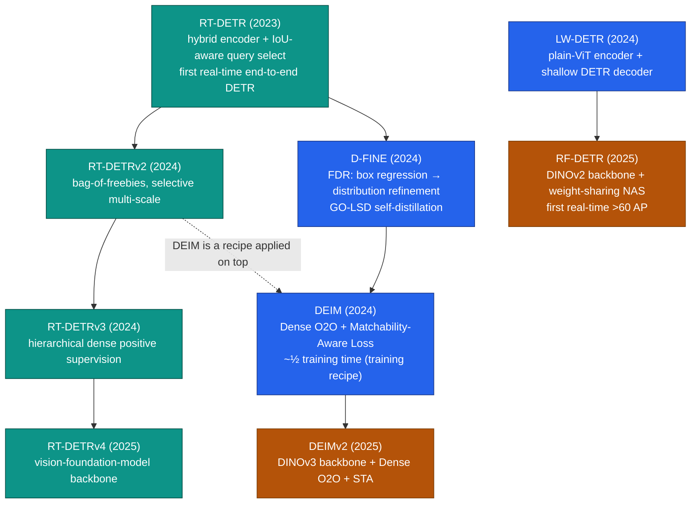
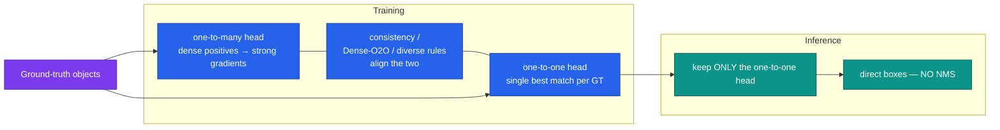
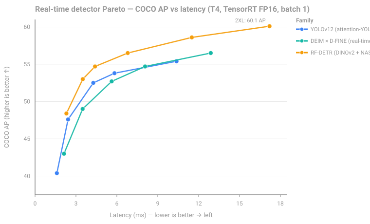

# Dense Object Detection & Classification — Recent Advances

*Compiled 2026-Jul-01 (America/Los_Angeles).*

Next installment in the running CV-updates log. Earlier entries on
`main`:
[Apr-30](../2026-Apr-30/2026-Apr-30_CV_updates.md),
[May-01](../2026-May-01/2026-May-01_CV_updates.md),
[May-02](../2026-May-02/2026-May-02_CV_updates.md),
[May-04](../2026-May-04/2026-May-04_CV_updates.md),
[May-05](../2026-May-05/2026-May-05_CV_updates.md),
[May-07](../2026-May-07/2026-May-07_CV_updates.md),
[May-08](../2026-May-08/2026-May-08_CV_updates.md),
[May-15](../2026-May-15/2026-May-15_CV_updates.md),
[May-16](../2026-May-16/2026-May-16_CV_updates.md),
[May-17](../2026-May-17/2026-May-17_CV_updates.md),
[Jun-09](../2026-Jun-09/2026-Jun-09_CV_updates.md),
[Jun-10](../2026-Jun-10/2026-Jun-10_CV_updates.md),
[Jun-12](../2026-Jun-12/2026-Jun-12_CV_updates.md),
[Jun-15](../2026-Jun-15/2026-Jun-15_CV_updates.md),
[Jun-16](../2026-Jun-16/2026-Jun-16_CV_updates.md),
[Jun-17](../2026-Jun-17/2026-Jun-17_CV_updates.md),
[Jun-19](../2026-Jun-19/2026-Jun-19_CV_updates.md),
[Jun-21](../2026-Jun-21/2026-Jun-21_CV_updates.md),
[Jun-22](../2026-Jun-22/2026-Jun-22_CV_updates.md),
[Jun-23](../2026-Jun-23/2026-Jun-23_CV_updates.md),
[Jun-24](../2026-Jun-24/2026-Jun-24_CV_updates.md),
[Jun-25](../2026-Jun-25/2026-Jun-25_CV_updates.md),
[Jun-27](../2026-Jun-27/2026-Jun-27_CV_updates.md),
[Jun-29](../2026-Jun-29/2026-Jun-29_CV_updates.md),
[Jun-30](../2026-Jun-30/2026-Jun-30_CV_updates.md).

## Why this pass: the RGB real-time detector *core* — the engine every other modality adapts

The last two weeks worked sensor primitives **on their own terms** —
camera-3D / occupancy ([Jun-24](../2026-Jun-24/2026-Jun-24_CV_updates.md)),
remote sensing ([Jun-25](../2026-Jun-25/2026-Jun-25_CV_updates.md)), the LiDAR
point cloud ([Jun-27](../2026-Jun-27/2026-Jun-27_CV_updates.md)), the event
stream ([Jun-29](../2026-Jun-29/2026-Jun-29_CV_updates.md)), and the thermal
image ([Jun-30](../2026-Jun-30/2026-Jun-30_CV_updates.md)). Every one of those
passes eventually pointed back at the same place: *"…adapts a YOLO / RT-DETR
head,"* *"…swaps in a DETR decoder,"* *"…re-uses one-to-one assignment to go
NMS-free."* The **plain-RGB 2D real-time detector** is the shared substrate all
of them borrow from — and across the ~200 sections of this log it has never had
a pass **as a primitive in its own right**. Names show up scattered as
building blocks (RT-DETR in 11 prior files, DEIM in 14), but the *engine itself*
— its 2024→2026 architecture race, its assignment mechanics, its backbone
swap — has never been the subject. The very latest YOLO line (**v12, v13**)
does not appear in a single prior entry. That is the gap this entry fills.

It earns its own pass because three things happened in the last ~18 months that
changed what the core detector *is*:

1. **The real-time band cleared 60 AP on COCO.** RF-DETR-2XL reports **60.1 AP**
   at 17.2 ms on a T4 — the first *real-time* model past 60 — collapsing most of
   the gap to the ~66 AP academic ceiling held by huge non-real-time models
   ([RF-DETR](https://github.com/roboflow/rf-detr);
   [Co-DETR](https://github.com/Sense-X/Co-DETR)). Peak AP stopped being the
   interesting axis; **position on the latency–accuracy Pareto front** is the
   whole game.
2. **NMS-free finally works at the top of the board.** The one-to-one vs
   one-to-many assignment tension — DETR's clean end-to-end inference vs the YOLO
   world's fast-converging redundant boxes — got resolved from *both* sides:
   YOLOv10's dual assignments ([2405.14458](https://arxiv.org/abs/2405.14458))
   and DEIM's "Dense O2O" ([2412.04234](https://arxiv.org/abs/2412.04234))
   independently gave real-time detectors NMS-free heads without losing recall.
3. **Detectors stopped training their own backbones.** The frontier is now a
   **frozen or distilled self-supervised foundation backbone** (DINOv3) feeding a
   **lightweight DETR head**. DEIMv2 (DINOv3 + DEIM,
   [2509.20787](https://arxiv.org/abs/2509.20787)) and RF-DETR (DINOv2 + a
   LW-DETR/Deformable-DETR head, [2511.09554](https://arxiv.org/abs/2511.09554))
   are the concrete embodiments.

The through-line of this pass: **the YOLO branch and the DETR branch have
converged.** They now share a backbone philosophy (foundation features), a head
philosophy (NMS-free, one-to-one at inference), and a scorecard (the T4 Pareto
front). What used to be a tribal split is now two points on one curve.

> **Scope & boundaries.** This is the *2D RGB* detector core. Modality-specific
> adaptations live in their own passes (event [Jun-29](../2026-Jun-29/2026-Jun-29_CV_updates.md),
> thermal [Jun-30](../2026-Jun-30/2026-Jun-30_CV_updates.md), LiDAR
> [Jun-27](../2026-Jun-27/2026-Jun-27_CV_updates.md), 3D/occupancy
> [Jun-24](../2026-Jun-24/2026-Jun-24_CV_updates.md)). Open-vocabulary /
> grounding detection was surveyed for the *agent/GUI* angle on
> [Jun-23](../2026-Jun-23/2026-Jun-23_CV_updates.md); here it appears only as the
> *real-time* variants (§6). Promptable segmentation is
> [Jun-21](../2026-Jun-21/2026-Jun-21_CV_updates.md)'s territory.

---

## 1. The three axes of a modern detector

A 2026 real-time detector is a choice on three near-orthogonal axes. Almost
every model below is a specific point in this cube.

```mermaid
flowchart LR
  subgraph A["① Backbone (features)"]
    A1["CNN: CSP/ELAN, HGNetv2"]
    A2["ViT / plain-ViT"]
    A3["Frozen SSL foundation:<br/>DINOv2 / DINOv3, EVA-02"]
  end
  subgraph B["② Head (decode)"]
    B1["Dense conv head<br/>(YOLO / FCOS lineage)"]
    B2["DETR decoder<br/>(query-based, set prediction)"]
  end
  subgraph C["③ Assignment (supervision)"]
    C1["One-to-many<br/>+ NMS at inference"]
    C2["One-to-one<br/>NMS-free, end-to-end"]
    C3["Dual / dense / diverse<br/>o2m in training, o2o at inference"]
  end
  A --> B --> C
  classDef box fill:#2563eb,stroke:#1e3a8a,color:#ffffff,stroke-width:1px;
  classDef box2 fill:#0d9488,stroke:#064e46,color:#ffffff,stroke-width:1px;
  classDef box3 fill:#b45309,stroke:#7c3f08,color:#ffffff,stroke-width:1px;
  class A1,A2,A3 box;
  class B1,B2 box2;
  class C1,C2,C3 box3;
```

The interesting recent history is the **diagonal collapse**: the best real-time
models increasingly pick `A3 + B2 + C3` (foundation backbone → DETR head →
dense/diverse one-to-one). §2–§3 walk the two branches; §4 is axis ③; §5 is
axis ①.

---

## 2. The YOLO branch: from CSP to attention to hypergraphs

The single-stage dense-conv lineage kept its edge-latency crown by absorbing,
one generation at a time, the ideas that made transformers strong — while
staying convolution-first and TensorRT-friendly.

| Model | Yr | Core contribution | COCO AP (N→X) | Venue |
|---|---|---|---|---|
| **YOLOv9** | 2024 | **PGI** (reversible aux branch fights the information bottleneck; free at deploy) + **GELAN** (any-block generalized ELAN) | C 53.0 / E 55.6 | ECCV 2024 |
| **YOLOv10** | 2024 | **Consistent dual assignments** → **NMS-free** end-to-end (see §4) | 38.5 → 54.4 | NeurIPS 2024 |
| **YOLO11** | 2024 | **C3k2** block (cheaper CSP) + **C2PSA** spatial-attention after SPPF; ~22% fewer params than v8m at higher AP | 39.5 → 54.7 | Ultralytics |
| **YOLOv12** | 2025 | **Area Attention (A2)** — split feature map into *l* regions, attend within each (big receptive field, linear-ish cost) + **R-ELAN** (residual-scaled ELAN to stabilize attention training) | 40.4 → 55.4 | NeurIPS 2025 |
| **YOLOv13** | 2025 | **HyperACE** — model *high-order* (beyond-pairwise) correlations via a learnable hypergraph over multi-scale pixels + **FullPAD** (distribute enhanced features across the *whole* pipeline, not just the neck) | 41.6 → 54.8 | iMoonLab (THU) |

**Reading the trend.** v9 was the last "pure conv" flagship; v10 changed the
*head* (NMS-free); v11 quietly injected attention (C2PSA); v12 made attention
the *backbone* organizing principle (Area Attention); v13 pushed past pairwise
attention to hypergraph high-order correlation. Note the AP numbers barely move
at the top (v10-X 54.4 → v12-X 55.4 → v13-X 54.8) — **the YOLO branch is
latency-bound, not accuracy-bound**, which is exactly why the DETR branch (§3)
took the high-AP real-time band.

- YOLOv9 — [arXiv 2402.13616](https://arxiv.org/abs/2402.13616) · [repo](https://github.com/WongKinYiu/yolov9)
- YOLOv10 — [arXiv 2405.14458](https://arxiv.org/abs/2405.14458) · [repo](https://github.com/THU-MIG/yolov10)
- YOLO11 — [overview 2410.17725](https://arxiv.org/abs/2410.17725) · [docs](https://docs.ultralytics.com/models/yolo11/)
- YOLOv12 — [arXiv 2502.12524](https://arxiv.org/abs/2502.12524) · [repo](https://github.com/sunsmarterjie/yolov12)
- YOLOv13 — [arXiv 2506.17733](https://arxiv.org/abs/2506.17733) · [repo](https://github.com/iMoonLab/yolov13)

> All YOLO AP/latency figures above are **COCO val2017 mAP@50-95** with **T4 GPU
> TensorRT FP16**, per each model's own table. Also surfaced but out of this
> pass's scope: **YOLO26** (Ultralytics), which carries a *native* NMS-free
> end-to-end head into the YOLO line (§4).

---

## 3. The real-time DETR branch: DETRs that beat YOLOs

Set-prediction transformers were long considered too slow for real-time. Baidu's
RT-DETR broke that in 2023; the 2024–2026 line then attacked DETR's two classic
weaknesses — **slow convergence** and **coarse box regression** — and bolted on
**foundation backbones + NAS**.

**RT-DETR & successors (Baidu line).**
- **RT-DETR** — efficient **hybrid encoder** (AIFI intra-scale + CCFF cross-scale)
  decouples the two interactions; **IoU-aware query selection** seeds better
  decoder queries; no NMS. R50 **53.1 AP @ 108 FPS**, R101 54.3 @ 74 FPS (T4).
  [arXiv 2304.08069](https://arxiv.org/abs/2304.08069) · [repo](https://github.com/lyuwenyu/RT-DETR)
- **RT-DETRv2** — "bag-of-freebies": selective multi-scale sampling, a
  deployment-friendly discrete sampling operator (drops `grid_sample`), dynamic
  augmentation. **+1.4/+1.0/+0.3 AP** (S/M/L) at identical latency.
  [arXiv 2407.17140](https://arxiv.org/abs/2407.17140)
- **RT-DETRv3** — **hierarchical dense positive supervision** (CNN aux branch +
  self-attention perturbation + shared-weight decoder branch); training-only, no
  latency cost. R18 **48.1 AP** (+1.6 over RT-DETR-R18). WACV 2025 Oral.
  [arXiv 2409.08475](https://arxiv.org/abs/2409.08475) · [repo](https://github.com/clxia12/RT-DETRv3)
- **RT-DETRv4** (Oct 2025) — latest in the line, pulls in vision-foundation-model
  backbones. [arXiv 2510.25257](https://arxiv.org/abs/2510.25257) *(numbers not
  independently verified in this pass)*.

**D-FINE — fixing box regression.** Recasts bounding-box regression as
**Fine-grained Distribution Refinement (FDR)**: instead of directly predicting
four coordinates, it *iteratively refines probability distributions* over box
edges in a residual manner; **GO-LSD** (Global Optimal Localization
Self-Distillation) then transfers this localization knowledge from deep decoder
layers back to shallow ones. **N 42.8 @ 2.12 ms → X 55.8 @ 12.89 ms** (T4); with
Objects365 pretraining L/X reach **57.3 / 59.3 AP**. ICLR 2025 Spotlight.
[arXiv 2410.13842](https://arxiv.org/abs/2410.13842) · [repo](https://github.com/Peterande/D-FINE)

**DEIM — fixing convergence.** A *training recipe* (not a new net) layered onto
RT-DETR/D-FINE: **Dense O2O** packs more objects per image (mosaic/mixup-style)
so each one-to-one step yields more positive matches, curing the sparse-supervision
slowdown; **Matchability-Aware Loss (MAL)** weights matches by quality. Roughly
**halves training time** — RT-DETRv2+DEIM hits 53.2 AP in ~1 day on a single
4090. DEIM×D-FINE: **N 43.0 → X 56.5 AP** (same T4 latency as D-FINE). CVPR 2025.
[arXiv 2412.04234](https://arxiv.org/abs/2412.04234) · [repo](https://github.com/ShihuaHuang95/DEIM)

**LW-DETR & RF-DETR — the ViT/NAS wing.**
- **LW-DETR** — "a transformer replacement to YOLO": plain-**ViT** encoder +
  projector + shallow DETR decoder, interleaved window/global attention, ViT
  pretrained with MIM on Objects365. tiny **42.6 AP @ ~500 FPS** → xlarge 58.3 AP;
  uses group-wise one-to-many as auxiliary supervision. **It is the architectural
  base of RF-DETR.** [arXiv 2406.03459](https://arxiv.org/abs/2406.03459) · [repo](https://github.com/Atten4Vis/LW-DETR)
- **RF-DETR** (Roboflow) — **DINOv2 ViT backbone** + **weight-sharing NAS** that
  sweeps one trained network for the whole Pareto frontier; family of six sizes.
  **Nano 48.4 AP @ 2.3 ms → 2XL 60.1 AP @ 17.2 ms** (T4). The **60.1** figure is
  the authors' "first real-time model past 60 AP on COCO" claim — widely repeated,
  vendor-stated, not independently audited. Also strong out-of-domain (RF100-VL
  Medium ~61.2 AP). ICLR 2026; first weights Mar 2025.
  [arXiv 2511.09554](https://arxiv.org/abs/2511.09554) · [repo](https://github.com/roboflow/rf-detr) · [blog](https://blog.roboflow.com/rf-detr/)

See the [Pareto chart](#7-the-scorecard-latencyaccuracy-pareto--benchmark-reality-check)
in §7 for how these stack against the YOLO branch.

---

## 4. Axis ③ in depth: label assignment & the road to NMS-free

This is the mechanism that unified the two branches, so it's worth its own
diagram. The core tension:

- **One-to-many (o2m)** — each ground truth supervises *many* predictions
  (anchor/point YOLO, RetinaNet). Rich signal, fast convergence, **but redundant
  overlapping boxes → needs NMS** (non-differentiable, adds latency, breaks true
  end-to-end, and *fails in crowds* — see §6).
- **One-to-one (o2o)** — each ground truth supervises *exactly one* prediction
  (DETR's Hungarian matching). **NMS-free & end-to-end, but sparse supervision →
  slow convergence, weaker recall.**

The 2024–2026 answer, from both branches: **train with o2m richness, infer with
o2o cleanliness.**

- **YOLOv10 — consistent dual assignments.** Two heads during training (o2m for
  signal, o2o for NMS-free decode) plus a **consistent matching metric** so the
  o2o branch inherits the o2m branch's best-sample choices. At inference only the
  o2o head runs. This is what made a YOLO end-to-end.
  [arXiv 2405.14458](https://arxiv.org/abs/2405.14458)
- **DEIM — Dense O2O.** Keeps DETR's o2o but *densifies* it via augmentation so
  each step sees more positives — solving sparse-supervision from the DETR side
  rather than the YOLO side. [arXiv 2412.04234](https://arxiv.org/abs/2412.04234)
- **The DETR-matching antecedents** (2023, but the direct lineage): **Rank-DETR**
  (rank-oriented loss prioritizing high-IoU) [2310.08854](https://arxiv.org/abs/2310.08854);
  **Align-DETR** (IoU-aware classification target to fix conf↔localization
  misalignment) [2304.07527](https://arxiv.org/abs/2304.07527); **Stable-DINO /
  Stable Matching** (position-supervised loss + position-modulated cost to
  stabilize matching across decoder layers) [2304.04742](https://arxiv.org/abs/2304.04742).
- **2025–2026 frontier.** **LoRA-DETR** ("Integrating Diverse Assignment
  Strategies into DETRs") reports that o2m's benefit comes from the **diversity of
  assignment *rules*, not the sheer volume** of positives — it adds several LoRA
  auxiliary branches, each with a different o2m rule, dropped at inference
  ([arXiv 2601.09247](https://arxiv.org/abs/2601.09247), *snippet-only, unverified*).
  **YOLO26** (Ultralytics) makes the NMS-free o2o head *native* to the YOLO line
  and adds small-target-aware label assignment (STAL) + progressive loss
  ([docs](https://docs.ultralytics.com/models/yolo26/), *numbers unverified here*).

---

## 5. Axis ① in depth: foundation backbones now feed detectors

Detectors have largely stopped training their own backbones from scratch. The
pattern is **big self-supervised pretrain → frozen or distilled features →
lightweight detection head.**

- **DINOv3 (Meta, Aug 2025)** — SSL ViT at extreme scale: up to **ViT-7B/16**
  (~6.7B params) on **LVD-1689M** (~1.69B unlabeled web images). Its headline
  trick is **Gram anchoring** — a regularizer that keeps *dense patch features*
  from degrading over long training by aligning the feature Gram matrix to an
  earlier stable checkpoint, which is what makes DINOv3 usable as a **frozen dense
  backbone** for detection/segmentation. Ships distilled ViT-S→H+ and ConvNeXt
  T→L variants. Reported ~**66 mAP** COCO with a frozen backbone + Plain-DETR
  decoder (*snippet-only, unverified*). [arXiv 2508.10104](https://arxiv.org/abs/2508.10104) · [repo](https://github.com/facebookresearch/dinov3)
  - Predecessor **DINOv2** ([2304.07193](https://arxiv.org/abs/2304.07193))
    established the "frozen features + light head" paradigm and added *registers*
    to clean attention artifacts; it is the backbone **RF-DETR** builds on.
- **ConvNeXt V2** — **FCMAE** (fully-conv masked autoencoder, MAE-style SSL for
  ConvNets) + **GRN** (Global Response Normalization fixes feature collapse). Still
  a common detection backbone; DINOv3 even distills into ConvNeXt.
  [arXiv 2301.00808](https://arxiv.org/abs/2301.00808) · [repo](https://github.com/facebookresearch/ConvNeXt-V2)
- **EVA-02** — plain ViT pretrained by MIM that *reconstructs EVA-CLIP features*
  (CLIP-as-teacher); a 304M model hits 90.0% ImageNet-1K and it's a favorite
  high-AP COCO detection backbone (via Cascade/DINO heads), available in `timm`.
  [arXiv 2303.11331](https://arxiv.org/abs/2303.11331)
- **Vision Mamba (VMamba / Vim)** — linear-complexity state-space backbones.
  VMamba's 2D selective scan gives Mask-R-CNN **47.3–49.2 box AP** on COCO
  ([2401.10166](https://arxiv.org/abs/2401.10166)); Vim
  ([2401.09417](https://arxiv.org/abs/2401.09417)). **Verdict: still a niche for
  mainstream 2D COCO detection** as of 2026 — SSM backbones have traction in
  long-sequence / 3D / remote-sensing / medical settings, while the 2D detection
  SOTA remains ViT (DINOv2/v3, EVA-02) + DETR heads or attention-CNN hybrids.

**The convergence made concrete — DEIMv2 ("Real-Time Object Detection Meets
DINOv3", Sep 2025).** It is the literal `A3 + B2 + C3` model: a **DINOv3-distilled
ViT backbone**, DEIM's **Dense O2O** training, plus a **Spatial Tuning Adapter
(STA)** that turns DINOv3's single-scale output into the multi-scale features a
detector needs. Ultra-light sizes fall back to HGNetv2; S/M/L/X use DINOv3.
**Pico 1.5M → 38.5 AP** (matches YOLOv10-N at ~half the params); **S 9.7M → 50.9
AP**; **X 50.3M → 57.8 AP**. [arXiv 2509.20787](https://arxiv.org/abs/2509.20787) · [repo](https://github.com/Intellindust-AI-Lab/DEIMv2)

---

## 6. "Dense" in the literal sense — crowds, packed shelves, tiny objects

Beyond the architectural core, the *hardest* dense-detection settings are where
many objects overlap. These stress exactly the NMS problem §4 removes.

- **Crowds & the NMS-in-crowds failure.** In heavy overlap, correct-but-highly-
  overlapping boxes get suppressed: a low NMS threshold kills recall, a high one
  adds false positives. **CrowdHuman** (avg 22.6 persons/image;
  [1805.00123](https://arxiv.org/abs/1805.00123)) is the canonical testbed;
  **CrowdDet** predicts an *instance set* per proposal with **Set-NMS**
  ([2003.09163](https://arxiv.org/abs/2003.09163)). This is a structural argument
  for the o2o / NMS-free detectors above.
- **Crowd-SAM (ECCV 2024)** — uses SAM as a *few-shot* annotator for crowded /
  occluded scenes (efficient prompt sampler + part-whole discrimination),
  reporting **~78.4% AP on CrowdHuman with only 10 support images**.
  [arXiv 2407.11464](https://arxiv.org/abs/2407.11464) · [repo](https://github.com/FelixCaae/CrowdSAM)
- **Densely-packed retail.** **SKU-110K** (~147 objects/image, tight packing;
  [1904.00853](https://arxiv.org/abs/1904.00853)) replaced NMS with Soft-IoU +
  EM-Merger; 2025 work adds semi-supervised co-training (Faster R-CNN + YOLO,
  [2509.09750](https://arxiv.org/abs/2509.09750), *numbers unverified*).
- **Tiny objects in dense scenes.** **SODA** (SODA-D driving / SODA-A aerial;
  [2207.14096](https://arxiv.org/abs/2207.14096)) is the small-object benchmark;
  **SAHI** (Slicing-Aided Hyper Inference; [2202.06934](https://arxiv.org/abs/2202.06934))
  is the detector-agnostic tiling trick that keeps small objects detectable at
  high resolution — now built into Ultralytics.

---

## 7. The scorecard: latency–accuracy Pareto & benchmark reality-check

*Figure: representative frontiers of the two branches plus the DINOv2/NAS wing,
COCO val AP vs T4 (TensorRT FP16, batch 1). RF-DETR's curve sits up-and-left of
both the YOLO and DEIM×D-FINE curves across most of the range, and is the only
one to reach 60 AP — the practical statement of "the real-time band cleared 60."*

**Is COCO saturating? Yes.** The academic ceiling is compressed near the top:

| Model | COCO | Notes |
|---|---|---|
| **Co-DETR / Co-DINO** | **~66.0 AP** (test-dev) | collaborative hybrid assignment, ViT-L; the widely-cited ceiling. [2211.12860](https://arxiv.org/abs/2211.12860) |
| **InternImage-G** | ~65.4–65.8 AP (test-dev) | ~3B-param deformable-conv foundation model ([2211.05778](https://arxiv.org/abs/2211.05778)); *sources disagree on exact AP* |
| **EVA-02** | ~64.5–65.2 AP (val) | MIM-distilled ViT + Co-DETR-style head ([2303.11331](https://arxiv.org/abs/2303.11331)) |
| **RF-DETR-2XL** | **60.1 AP** @ 17.2 ms | the *real-time* number — the gap to the ceiling has largely collapsed |

**Newer benchmarks that actually still hurt** (because COCO doesn't):

- **RF100-VL** (May 2025) — 100 real-world out-of-distribution datasets (X-ray,
  thermal, aerial, industrial). Killer stat: **Grounding-DINO zero-shot falls from
  49.2% (ODinW-13) to 16.0% (RF100-VL)**; most methods score **<10% mAP**. This is
  the field's current honesty check on "detection in the wild."
  [arXiv 2505.20612](https://arxiv.org/abs/2505.20612) · [site](https://rf100-vl.org/)
- **LVIS** — 1,203-category long-tail (rare/common/frequent AP split). [site](https://www.lvisdataset.org/)
- **V3Det** — vast-vocabulary detection, **13,204 categories**; supervised +
  open-vocab tracks. [challenge 2406.11739](https://arxiv.org/abs/2406.11739)
- **ODinW** — the older zero/few-shot transfer suite (GLIP era;
  [2112.03857](https://arxiv.org/abs/2112.03857)), now largely superseded in
  difficulty by RF100-VL.

**Practical 2026 takeaway.** Because the real-time band now clears 60 AP, model
choice is driven by **where you sit on the Pareto front**, not peak AP:
- **High-accuracy real-time band** → DETR family (RF-DETR, DEIMv2, DEIM×D-FINE,
  RT-DETRv4).
- **Ultra-low-latency / edge / quantized band** → YOLO line (v12/v13, YOLO26) —
  transformer detectors still degrade more sharply under INT8.
- **Out-of-domain / few-shot** → the story is unsolved; RF100-VL says even strong
  open-vocab models mostly fail. This is where the next year of work goes.

---

## 8. Real-time open-vocabulary detection (the promptable wing)

Full open-vocabulary / grounding detection was covered for the *agent/GUI* angle
on [Jun-23](../2026-Jun-23/2026-Jun-23_CV_updates.md); here only the **real-time**
variants, which fold back into the core:

- **YOLO-World** (CVPR 2024) — real-time open-vocab via **RepVL-PAN**
  (re-parameterizable vision-language path aggregation) + region-text contrastive
  training; at inference the text encoder is dropped and embeddings re-parameterized
  into weights. Zero-shot LVIS S 18.5 → X 28.6 AP; ~35.4 AP @ 52 FPS (V100) for a
  large config. [arXiv 2401.17270](https://arxiv.org/abs/2401.17270) · [repo](https://github.com/AILab-CVC/YOLO-World)
- **YOLOE** ("Real-Time Seeing Anything", ICCV 2025) — unifies **text / visual /
  prompt-free** detection + instance segmentation in one model (RepRTA, SAVPE,
  LRPC). LVIS minival: v8-S 27.9 AP @ 305.8 FPS → v8-L 35.9 @ 102.5 FPS (T4);
  **+3.5 AP, ~3× cheaper training, ~1.4× faster** than YOLO-Worldv2.
  [arXiv 2503.07465](https://arxiv.org/abs/2503.07465) · [repo](https://github.com/THU-MIG/yoloe)
- **Grounding DINO 1.5 Edge** — real-time open-set DETR variant: **45.0 zero-shot
  COCO AP, >10 FPS @ 640×640 on Orin NX** (TensorRT).
  [arXiv 2405.10300](https://arxiv.org/abs/2405.10300). (Base
  [Grounding-DINO](https://arxiv.org/abs/2303.05499) / [MM-Grounding-DINO](https://arxiv.org/abs/2401.02361)
  are the non-real-time parents.)

---

## 9. Takeaways

1. **The two branches merged.** YOLO and DETR now share a backbone philosophy
   (frozen SSL foundation features), a head philosophy (NMS-free one-to-one at
   inference), and a scorecard (the T4 Pareto front). "YOLO vs DETR" is now two
   points on one curve, not two camps.
2. **NMS-free is solved for real-time.** From the YOLO side (dual assignments,
   v10) and the DETR side (Dense O2O, DEIM) — both keep o2m training richness and
   o2o inference cleanliness. The next refinement is *diverse* assignment rules
   (LoRA-DETR) over sheer positive volume.
3. **Detectors don't train backbones anymore.** DINOv3's Gram-anchored dense
   features are good enough frozen; DEIMv2 and RF-DETR are the concrete
   "foundation-backbone + light DETR head" models, and DEIMv2's Pico matches a
   whole YOLO-N at half the parameters.
4. **COCO is done as a discriminator; RF100-VL is the new pain.** Real-time cleared
   60 AP, the top of the board is compressed at ~66, and the honest question moved
   to out-of-distribution / few-shot, where even strong open-vocab models collapse
   below 20% mAP.
5. **Pick by latency budget, not peak AP.** DETR family for the high-accuracy
   real-time band; YOLO for ultra-low-latency and INT8 edge.

---

### Sources & verification notes

- All arXiv IDs and repos above were cross-checked across web search + official
  GitHub READMEs. **`arxiv.org` abstract pages, `docs.ultralytics.com`,
  `ai.meta.com`, and `huggingface.co` returned HTTP 403 through this
  environment's egress proxy**, so numbers were taken from the (reachable) GitHub
  repos and corroborating search snippets rather than rendered abstract pages. The
  arXiv links are still the correct citations.
- **Explicitly flagged as unverified / vendor-stated in this pass:** RF-DETR's
  "first real-time >60 AP" (authors' claim, not independently audited); RF-DETR's
  exact arXiv submission date (Nov 2025 inferred from the `2511.` ID vs a March
  2025 first code release); DINOv3's frozen-backbone COCO/ADE numbers; YOLO26 and
  RT-DETRv4 numbers; LoRA-DETR specifics; the 2023 Rank/Align/Stable-DETR figures;
  InternImage's exact test-dev AP (sources give 65.4 vs 65.8); and 2025 SKU/SOD
  headline gains. Treat these as directional.
- COCO AP figures mix **val2017** and **test-dev** and different hardware where a
  single convention wasn't available; the split is noted inline where it matters
  (§7).

*Diagrams: Mermaid (lineage, assignment, axes) + one standalone SVG
([`assets/pareto.svg`](assets/pareto.svg)); all use theme-neutral mid-tone fills
with white text / neutral-gray axes to stay legible in both light and dark
readers, and contain no external URLs.*
