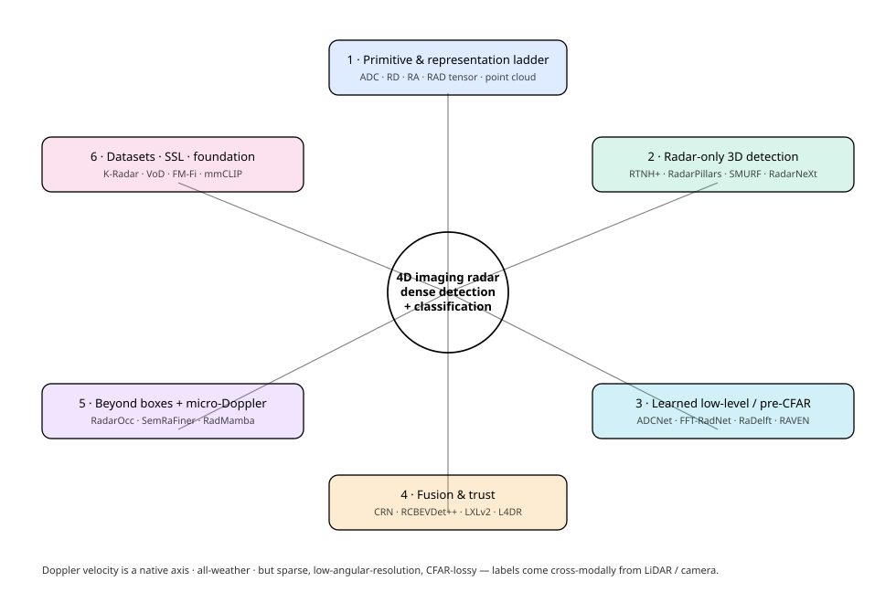
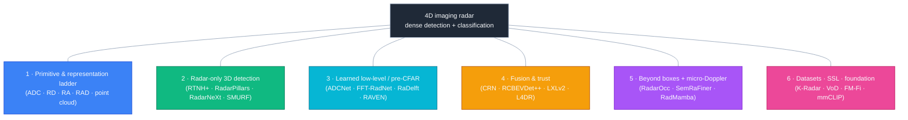
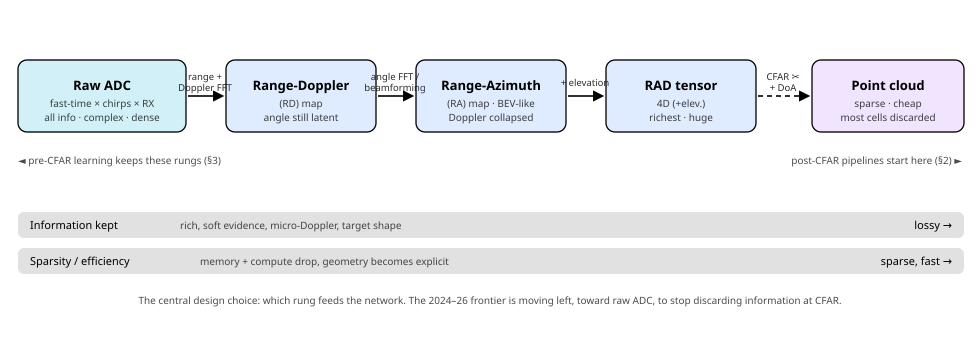
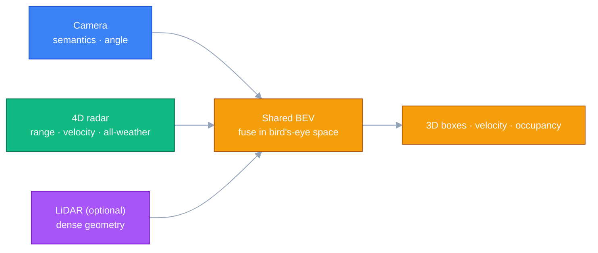

# Dense Object Detection & Classification — Recent Advances

*Compiled 2026-Jul-02 (America/Los_Angeles).*

Next installment in the running CV-updates log. Earlier entries on
`main`:
[Apr-30](../2026-Apr-30/2026-Apr-30_CV_updates.md),
[May-01](../2026-May-01/2026-May-01_CV_updates.md),
[May-02](../2026-May-02/2026-May-02_CV_updates.md),
[May-04](../2026-May-04/2026-May-04_CV_updates.md),
[May-05](../2026-May-05/2026-May-05_CV_updates.md),
[May-07](../2026-May-07/2026-May-07_CV_updates.md),
[May-08](../2026-May-08/2026-May-08_CV_updates.md),
[May-15](../2026-May-15/2026-May-15_CV_updates.md),
[May-16](../2026-May-16/2026-May-16_CV_updates.md),
[May-17](../2026-May-17/2026-May-17_CV_updates.md),
[Jun-09](../2026-Jun-09/2026-Jun-09_CV_updates.md),
[Jun-10](../2026-Jun-10/2026-Jun-10_CV_updates.md),
[Jun-12](../2026-Jun-12/2026-Jun-12_CV_updates.md),
[Jun-15](../2026-Jun-15/2026-Jun-15_CV_updates.md),
[Jun-16](../2026-Jun-16/2026-Jun-16_CV_updates.md),
[Jun-17](../2026-Jun-17/2026-Jun-17_CV_updates.md),
[Jun-19](../2026-Jun-19/2026-Jun-19_CV_updates.md),
[Jun-21](../2026-Jun-21/2026-Jun-21_CV_updates.md),
[Jun-22](../2026-Jun-22/2026-Jun-22_CV_updates.md),
[Jun-23](../2026-Jun-23/2026-Jun-23_CV_updates.md),
[Jun-24](../2026-Jun-24/2026-Jun-24_CV_updates.md),
[Jun-25](../2026-Jun-25/2026-Jun-25_CV_updates.md),
[Jun-27](../2026-Jun-27/2026-Jun-27_CV_updates.md),
[Jun-29](../2026-Jun-29/2026-Jun-29_CV_updates.md),
[Jun-30](../2026-Jun-30/2026-Jun-30_CV_updates.md).

## Why this pass: 4D imaging radar as its own primitive

The last several passes worked sensor primitives **on their own terms** —
camera-3D / occupancy ([Jun-24](../2026-Jun-24/2026-Jun-24_CV_updates.md)),
remote-sensing spectra/time-series
([Jun-25](../2026-Jun-25/2026-Jun-25_CV_updates.md)), the LiDAR point cloud
([Jun-27](../2026-Jun-27/2026-Jun-27_CV_updates.md)), the event stream
([Jun-29](../2026-Jun-29/2026-Jun-29_CV_updates.md)), and the long-wave
infrared image ([Jun-30](../2026-Jun-30/2026-Jun-30_CV_updates.md)); a
parallel run took the **plain-RGB real-time 2D detector core** (the Jul-01
pass). **Automotive radar** is the one sensor in the driving stack that arc
has not given a dedicated treatment — and it is the strangest of them, because
its native measurement space is not an image at all.

It has appeared in the running log only as **fragments**: a single ~40-line
autonomous-driving section on 4D-radar BEV detection
([Jun-10 §4](../2026-Jun-10/2026-Jun-10_CV_updates.md): RadarNeXt / SMURF /
RadarGaussianDet3D + a RadarXFormer fusion row), a "4D radar / sonar" thread
inside a driving-perception pass ([May-12](../2026-May-12/2026-May-12_CV_updates.md)),
and one radar row in the multi-sensor fusion lists on
[May-16](../2026-May-16/2026-May-16_CV_updates.md) /
[May-17](../2026-May-17/2026-May-17_CV_updates.md). Never a pass as a
**primitive in its own right** — the signal, its representation ladder, and
the detection/classification/segmentation stack built on it. That is the gap
this entry fills; §2 explicitly builds on and does not repeat
[Jun-10 §4](../2026-Jun-10/2026-Jun-10_CV_updates.md).

Radar earns its own pass because it is genuinely different from every
grid-of-pixels or points primitive before it:

- **Doppler is a *native* axis, not an inference.** An FMCW/MIMO radar
  measures **radial velocity per detection in a single snapshot** from the
  phase shift across chirps — no two frames, no optical-flow, no tracking
  needed. Velocity is a first-class input channel, and it is radar's decisive
  advantage for moving-object reasoning and ego-motion
  ([radar-representation survey, arXiv 2312.04861](https://arxiv.org/abs/2312.04861)).
- **It sees when everything else is blind.** mm-wave (77 GHz) penetrates
  fog, rain, snow, dust and total darkness and reaches **200 m+**. On
  **K-Radar**, sparse-tensor radar detectors stay robust in fog/snow where
  LiDAR degrades ([RTNH, arXiv 2206.08171](https://arxiv.org/abs/2206.08171)) —
  the same *see-through-the-failure* case thermal made on
  [Jun-30](../2026-Jun-30/2026-Jun-30_CV_updates.md), one band over.
- **But the measurement is hostile.** Low angular resolution (a small
  virtual aperture), extreme sparsity, multipath **ghosts**, antenna
  **sidelobes**, and clutter. "Conventional" automotive radar is effectively
  **3D** (range, azimuth, Doppler, **no elevation**); **4D imaging radar**
  adds elevation via a larger MIMO array — the distinction that separates
  nuScenes-era radar from the K-Radar / View-of-Delft / TJ4DRadSet generation.
- **The CFAR bottleneck defines the field.** The classical pipeline —
  **FFT → CFAR thresholding → peak/DoA → sparse point cloud** — is cheap and
  hands you LiDAR-like points, but **CFAR discards the overwhelming majority
  of range-Doppler cells** and with them extended-target shape, low-SNR
  returns, soft/phase evidence and micro-Doppler. The organizing tension of
  the whole primitive is **pre-CFAR** (keep the tensor/raw ADC, let the network
  decide, pay in compute) **vs. post-CFAR** (sparse point cloud, cheap, lossy)
  — see §1 and §3.
- **There is no radar ImageNet.** Hand-labelling boxes in a range-azimuth
  heatmap is nearly impossible for a human, so the dominant training recipe is
  **cross-modal supervision** — a synchronized LiDAR or camera *teaches* the
  radar network (RaDelft, RODNet, RadarDistill, LiCROcc) — the same
  no-labels-route-around-it pattern the event and thermal passes hit.

This pass covers six threads of that stack:

1. **The primitive & the representation ladder** — raw ADC → range-Doppler →
   range-azimuth → RAD tensor → point cloud, and the pre-/post-CFAR cut.
2. **Radar-only 3D detection** — the BEV-box workhorse on the sparse 4D
   cloud (pillars vs. voxels vs. Gaussians); builds on
   [Jun-10 §4](../2026-Jun-10/2026-Jun-10_CV_updates.md).
3. **Learned low-level detection** — raw-ADC and tensor networks, and
   CFAR-free detectors trained by LiDAR.
4. **Radar fusion** — radar-camera and radar-LiDAR, and why fusion is about
   *complementarity and trust*, not addition.
5. **Beyond boxes** — semantic segmentation, 3D occupancy, moving-object
   segmentation, and the classification half: **micro-Doppler** activity /
   gesture / drone recognition.
6. **Datasets, self-supervision & foundation models** — the field's real
   bottleneck, and the early attempts at a radar foundation model.

> **Reading the numbers.** Figures are quoted from each method's own paper,
> repo or leaderboard and **are not comparable across rows or datasets.**
> 4D-radar 3D detection reports **mAP** on **View-of-Delft (VoD)** — and VoD is
> quoted two ways, *entire annotated area* vs. the *driving corridor* (corridor
> runs ~15–20 pts higher; never compare the two) — or **3D/BEV mAP** on
> **TJ4DRadSet**, or **AP₃D/AP_BEV** (per class, IoU 0.3/0.5) on **K-Radar**,
> or **mAP/NDS** on **nuScenes** (whose radar is sparse *3D*, not 4D). Tensor
> detection/segmentation reports **AP/AR** or **mIoU** on RADIal / CARRADA /
> RADDet / CRUW; CFAR-free detection reports **Pd/Pfa/Chamfer**; micro-Doppler
> reports **classification accuracy**. This run's egress policy **blocked
> direct `arxiv.org` / `huggingface.co` fetches (HTTP 403)**, so arXiv IDs,
> venues and numbers were corroborated across multiple search-result pages,
> CVF/IEEE open-access listings and authors' GitHub repos rather than read from
> source PDFs. Very recent (2025–2026, `25xx`–`26xx`) IDs are real and
> consistently matched but are **preprints**; any figure available only through
> a secondary summary is flagged *(approx.)* or *(unverified)*.

## Topic map

---

## 1 · The primitive & the representation ladder

A radar network's single most consequential design choice is made *before* the
backbone: **which rung of the processing ladder you feed it.** The FMCW/MIMO
chain forms a sequence of representations, each trading raw information for
compute and sparsity.

```mermaid
%%{init: {"theme":"base","themeVariables":{
  "primaryColor":"#06b6d4","primaryTextColor":"#f8fafc",
  "primaryBorderColor":"#0e7490","lineColor":"#94a3b8","fontSize":"12px"}}}%%
flowchart LR
  classDef raw  fill:#06b6d4,stroke:#0e7490,color:#f8fafc;
  classDef ten  fill:#3b82f6,stroke:#1d4ed8,color:#f8fafc;
  classDef pc   fill:#a855f7,stroke:#7e22ce,color:#f8fafc;
  ADC["Raw ADC<br/>fast-time × chirps × RX<br/><i>all info · complex · dense</i>"]:::raw -->|range FFT + Doppler FFT| RD["Range-Doppler<br/>(RD) map<br/><i>angle still latent</i>"]:::ten
  RD -->|angle FFT / beamforming| RA["Range-Azimuth<br/>(RA) map — BEV-like<br/><i>Doppler collapsed</i>"]:::ten
  RA --> RAD["RAD tensor (4D:+elev.)<br/><i>richest · huge</i>"]:::ten
  RAD -.->|CFAR threshold + DoA<br/>✂ most cells discarded| PC["Point cloud<br/><i>sparse · cheap · lossy</i>"]:::pc
```

| Rung | What it is | Trade-off |
|---|---|---|
| **Raw ADC** | complex samples: fast-time × chirps (slow-time) × RX antennas | *All* information (range, Doppler, angle, phase, RCS, micro-Doppler); highest data rate; **no** explicit geometry or sparsity. Learnable front-ends live here. |
| **Range-Doppler (RD)** | one FFT over fast-time + one over slow-time, per antenna | Compact 2D image; angle still latent in cross-antenna phase. The dominant input for *efficient* learned detectors. |
| **Range-Azimuth (RA)** | add an angle FFT / beamforming across the virtual array | BEV-like heatmap; angle explicit but Doppler collapsed; resolution capped by aperture. |
| **RAD tensor** | full range-azimuth-Doppler cube (4D with elevation) | Richest structured form; memory/compute heavy — hence most methods use 2D projections (RA/RD/AD). |
| **Point cloud** | CFAR + peak/DoA estimation | Tiny, trivially fused with LiDAR pipelines — but **CFAR throws away the vast majority of cells** and their soft/shape/micro-Doppler content, and needs hand-tuned guard/training cells (CA-/OS-CFAR) per scene. |

That last row is the whole argument. Two surveys frame the taxonomy:
**Exploring Radar Data Representations in Autonomous Driving**
([arXiv 2312.04861](https://arxiv.org/abs/2312.04861)) and the
**4D mm-Wave Radar survey** ([arXiv 2306.04242](https://arxiv.org/abs/2306.04242)).
Everything below is organized by *which rung it starts from*: §2 starts from
the **point cloud** (the practical default), §3 from **raw ADC / tensors**
(keep what CFAR would discard), and §5's dense tasks split the same way.

## 2 · Radar-only 3D detection — the BEV-box workhorse

This is the mainline: take the sparse, noisy 4D point cloud (or sparse tensor)
and emit 3D boxes for cars / pedestrians / cyclists.
[Jun-10 §4](../2026-Jun-10/2026-Jun-10_CV_updates.md) introduced the
autonomous-driving framing and the RadarNeXt / SMURF references; here is the
representation taxonomy underneath it and what moved in 2024–26.

**Sparse-tensor / voxel — preserve height.** The K-Radar line keeps the raw 4D
sparse tensor:

| Method | Reference | Idea | Headline *(dataset)* |
|---|---|---|---|
| **RTNH** | [arXiv 2206.08171](https://arxiv.org/abs/2206.08171) (NeurIPS 2022) | 3D sparse-conv on the sparse 4D tensor; K-Radar official baseline; showed height encoding matters and beats LiDAR PointPillars in adverse weather | Sedan **AP₃D ≈ 47.4** @IoU0.3 *(K-Radar)* |
| **RTNH+** | [arXiv 2310.17659](https://arxiv.org/abs/2310.17659) (T-IV 2024) | adds combined-CFAR two-level preprocessing (CCTP) + vertical encoding (VE) | **+10.1% AP₃D@0.3, +16.1%@0.5** over RTNH *(K-Radar)* |
| **Diverse-feature 4DRT** | [arXiv 2502.06114](https://arxiv.org/abs/2502.06114) (2025) | multiple feature views of the 4D radar tensor | *(unverified)* |

**Pillar / BEV — the practical speed default.** Flatten to pillars for
real-time inference; this family currently dominates VoD/TJ4DRadSet:

| Method | Reference | Idea | Headline *(dataset)* |
|---|---|---|---|
| **RadarPillars** | [arXiv 2408.05020](https://arxiv.org/abs/2408.05020) (2025) | decomposes radial velocity; "PillarAttention"; layer-scaling for sparsity; **0.27 M params / 1.99 GFLOPs** | high-FPS SOTA on VoD *(exact mAP unverified)* |
| **SMURF** | [arXiv 2307.10784](https://arxiv.org/abs/2307.10784) (T-IV 2024) | pillarization + kernel-density-estimation Gaussian features to fight sparsity/multipath | **≈ 50.97 mAP** *(VoD entire area)* |
| **RadarNeXt** | [arXiv 2501.02314](https://arxiv.org/abs/2501.02314) (2025) | real-time; Multi-path Deformable Foreground Enhancement to suppress clutter | **50.48 mAP** *(VoD)*, **32.30** *(TJ4DRadSet)*; 67 FPS |
| **MUFASA** | [arXiv 2408.00565](https://arxiv.org/abs/2408.00565) (PRCV 2024) | multi-view fusion + dataset-wide external-attention adaptation | **50.24 mAP** *(VoD)*; **30.23 3D / 39.10 BEV** *(TJ4DRadSet)* |

**Gaussian-splatting — the 2025 densification trend.** Turn sparse points into
continuous primitives to synthesize a denser BEV feature map:
**RadarGaussianDet3D** encodes each point as a Gaussian and rasterizes via 3D
Gaussian splatting for real-time detection
([arXiv 2509.16119](https://arxiv.org/abs/2509.16119), 2025; headline numbers
*unverified*).

**Cross-modal training that stays radar-only at inference.** Because labels and
density are the bottleneck, several methods borrow LiDAR *only during training*:
**SCKD** distills a LiDAR–radar-fused teacher into a radar student with
semi-supervised KD (**+1.11 / +2.08 mAP** entire/corridor over SMURF on VoD —
[arXiv 2412.14571](https://arxiv.org/abs/2412.14571), AAAI 2025); **LEROjD**
uses LiDAR at training only, LiDAR-free at inference
([arXiv 2409.05564](https://arxiv.org/abs/2409.05564), ECCV 2024);
**CenterRadarNet** adds center-based joint detection **+ tracking/re-ID** on
K-Radar v2 ([arXiv 2311.01423](https://arxiv.org/abs/2311.01423), ICIP 2024).

**Representation verdict.** Pillar/BEV (RadarPillars, SMURF, RadarNeXt) is the
practical default for speed; sparse-conv/voxel (RTNH) is what you use to
preserve **height** on the raw 4D tensor; Gaussian-splatting is the emerging
densifier. Across all of them, **radial velocity is exploited as an explicit
channel** — radar's structural edge over a single LiDAR sweep. The honest gap
is in §4.

## 3 · Learned low-level detection — keeping what CFAR throws away

The pre-CFAR thesis: don't threshold the tensor into points before the
network — feed the network the **raw ADC or the RD/RAD tensor** and let it
learn detection end-to-end. The RADIal dataset (raw ADC + RD + point cloud)
made this a benchmarkable question.

**Raw-ADC & learnable-FFT front-ends.** Replace the fixed FFT with learnable
complex layers, or ingest ADC directly:

| Method | Reference | Idea | Headline *(RADIal)* |
|---|---|---|---|
| **FFT-RadNet** | [arXiv 2112.10646](https://arxiv.org/abs/2112.10646) (CVPR 2022) | learns to recover angle from the **RD spectrum**, *skipping* the RAD tensor; joint detection + free-space seg; introduced RADIal | **≈ 96.8 AP / 82.2 AR** @IoU0.5 *(approx.)* |
| **ADCNet** | [arXiv 2303.11420](https://arxiv.org/abs/2303.11420) (2023) | learnable DSP module on **raw ADC**, pre-trained by *distilling* the classical pipeline | **+~5% F1 / +8% recall** on hard samples vs FFT-RadNet *(unverified)* |
| **T-FFTRadNet** | [arXiv 2303.16940](https://arxiv.org/abs/2303.16940) (ICCVW 2023) | complex-valued linear layers mimic 2D FFT + Swin backbone; runs from ADC or RD | **≈ 90.8 AP / 88.3 AR** — trades AP for recall *(approx.)* |
| **SparseRadNet** | [arXiv 2406.10600](https://arxiv.org/abs/2406.10600) (2024) | exploits RD/ADC sparsity with sparse convolutions | efficiency-focused |

**Structured-tensor detectors (post-transform).** Detect on RD/RA/RAD without
going all the way to a point cloud: **DAROD** — a lightweight Faster-R-CNN on
**RD** maps, arguing a compact radar-specific backbone beats heavy vision ones
(**mAP@0.5 = 55.83 CARRADA / 46.57 RADDet** —
[HAL 03759535](https://hal.science/hal-03759535), IEEE IV 2022); **RODNet** —
detects on **RA** images under **camera cross-supervision** (no manual boxes;
introduced CRUW — [arXiv 2003.01816](https://arxiv.org/abs/2003.01816), WACV
2021); **RAMP-CNN** decomposes the cube into RA/RD/AD projections (IEEE Sensors
2021); the **RADDet** baseline detects on the full RAD tensor
([code](https://github.com/ZhangAoCanada/RADDet)); and a 2026
**Transformer-decoder** detector adds DETR-style set prediction + pyramid token
fusion (**+2.62% 3D mAP@0.5 over TransRAD on RADDet** *(unverified)* —
[arXiv 2601.13386](https://arxiv.org/abs/2601.13386)).

**CFAR-free detection trained by LiDAR** — the cleanest expression of the
thesis. The TU Delft line predicts a **dense** radar occupancy grid supervised
**only by synchronized LiDAR**, producing LiDAR-like clouds that preserve
extended-target shape: *See Further Than CFAR*
([arXiv 2402.12970](https://arxiv.org/abs/2402.12970)) established the idea, and
the **RaDelft** detector reports a **~75% reduction in Chamfer distance vs.
conventional CFAR** ([arXiv 2406.04723](https://arxiv.org/abs/2406.04723), 2024;
introduces the RaDelft dataset). A 2026 follow-up shows BEV structure can be
learned **directly from pre-beamforming per-antenna RD tensors** — no angle FFT
required — using visibility/occlusion-aware LiDAR supervision
([arXiv 2604.01921](https://arxiv.org/abs/2604.01921)).

**State-space & streaming front-ends (2025–26)** — the same linear-time
Mamba pivot the LiDAR ([Jun-27](../2026-Jun-27/2026-Jun-27_CV_updates.md)),
event ([Jun-29](../2026-Jun-29/2026-Jun-29_CV_updates.md)) and thermal
([Jun-30](../2026-Jun-30/2026-Jun-30_CV_updates.md)) passes tracked, now on
raw radar:

- **RAVEN** — [arXiv 2604.04490](https://arxiv.org/abs/2604.04490) (CVPR 2026
  Highlight) — processes **raw ADC chirp-by-chirp (streaming)** with per-RX
  state-space encoders + a learnable cross-antenna mixer, with **early-exit**
  once enough chirps arrive.
- **SSMRadNet** — [arXiv 2511.08769](https://arxiv.org/abs/2511.08769) (WACV
  2026) — sample-wise SSM on raw ADC: **10–33× fewer params, 60–88× fewer
  GFLOPs, 3.7× faster** than transformer/conv radar detectors *(approx.)*.
- **RF-LEGO** ([arXiv 2604.10183](https://arxiv.org/abs/2604.10183)) unrolls the
  DSP chain into learnable modules; **Revisiting Radar Perception with Spectral
  Point Clouds** ([arXiv 2604.08282](https://arxiv.org/abs/2604.08282)) keeps
  spectrum information beyond CFAR points; **AdaRadar**
  ([arXiv 2603.17979](https://arxiv.org/abs/2603.17979)) learns adaptive
  spectral compression. All 2026 preprints — *leads, not settled results.*

**Implicit / neural radar representations.** **DART** renders range-Doppler
images with a NeRF-style radar-physics reflectance/transmittance model for
novel-view synthesis and tomography
([arXiv 2403.03896](https://arxiv.org/abs/2403.03896), CVPR 2024 ·
[code](https://github.com/WiseLabCMU/dart)); **RaUF** learns a continuous
spatial-uncertainty field of radar
([arXiv 2603.01026](https://arxiv.org/abs/2603.01026), 2026). Deep-learning DoA
/ super-resolution beamforming (replacing classical DBF) is a parallel stream —
e.g. sparse-array super-resolution
([arXiv 2306.09839](https://arxiv.org/abs/2306.09839)) and **MSDNet**
multi-stage distillation for 4D-radar angular super-resolution (2025, *arXiv
ID unverified*).

## 4 · Radar fusion — complementarity and trust

Radar gives **geometry + velocity + all-weather**; a camera gives **semantics
+ angular resolution**; LiDAR gives **dense, accurate geometry that fog kills.**
Fusion is the dominant deployment, and — exactly as on the LiDAR-camera
([Jun-27](../2026-Jun-27/2026-Jun-27_CV_updates.md)) and RGB-thermal
([Jun-30](../2026-Jun-30/2026-Jun-30_CV_updates.md)) passes — the real research
question is **which modality to trust when**, not simple addition.

**Radar-camera (nuScenes lineage — conventional 3D radar).** Radar rescues the
camera's weakest axis, depth:

| Method | Reference | Idea | Headline *(nuScenes)* |
|---|---|---|---|
| **CRN** | [arXiv 2304.00670](https://arxiv.org/abs/2304.00670) (ICCV 2023) | radar-assisted view transform lifts image features to BEV; deformable-attention fusion | **57.5 mAP / 62.4 NDS** (test) |
| **RCBEVDet** | [arXiv 2403.16440](https://arxiv.org/abs/2403.16440) (CVPR 2024) | dual-stream RadarBEVNet + RCS-aware encoder; cross-attention alignment | **+2.8 NDS / +2.1 mAP**, **−37.5% mAVE** vs CRN (val) |
| **RCBEVDet++** | [arXiv 2409.04979](https://arxiv.org/abs/2409.04979) (2024/25) | sparse + query-based fusion extension | **72.7 NDS / 67.3 mAP** (no TTA) |
| **HVDetFusion** | [arXiv 2307.11323](https://arxiv.org/abs/2307.11323) (2023) | camera stream runs without radar; radar filters false positives + supplements BEV | **67.4 NDS** (test) |
| **RCM-Fusion** | [arXiv 2307.10249](https://arxiv.org/abs/2307.10249) (ICRA 2024) | feature-level radar-guided BEV + instance-level grid-point refinement | **50.6 mAP / 58.7 NDS** (test) |

**Radar-camera (4D radar — VoD / TJ4DRadSet lineage).** The "radar occupancy
prior" idea dominates: **LXL** predicts image depth + a radar 3D occupancy grid
to guide the view transform (**56.31 mAP** VoD entire area —
[arXiv 2307.00724](https://arxiv.org/abs/2307.00724), WACV 2024); **LXLv2** adds
RCS-weighted one-to-many depth supervision + CSAFusion (**+1.8 mAP** VoD over
LXL — [arXiv 2502.14503](https://arxiv.org/abs/2502.14503), RA-L 2025);
**CVFusion** fuses BEV + perspective views (**+9.10 mAP VoD, +3.68 TJ4DRadSet**
over prior SOTA — [arXiv 2507.04587](https://arxiv.org/abs/2507.04587), ICCV
2025); **RaGS** is the first 3D-Gaussian-Splatting radar-camera fusion
([arXiv 2507.19856](https://arxiv.org/abs/2507.19856), 2025). Query-based /
association-based designs (**HyDRa** [arXiv 2403.07746](https://arxiv.org/abs/2403.07746),
**RCTrans** [arXiv 2412.12799](https://arxiv.org/abs/2412.12799),
**RICCARDO** [arXiv 2504.09086](https://arxiv.org/abs/2504.09086)) and
radar-camera **depth completion** (*Sparse Beats Dense*
[arXiv 2312.00844](https://arxiv.org/abs/2312.00844); **CaFNet**
[arXiv 2407.00697](https://arxiv.org/abs/2407.00697)) round it out.

**Radar-LiDAR fusion & distillation** — for weather robustness and to teach
radar:

- **L4DR** — [arXiv 2408.03677](https://arxiv.org/abs/2408.03677) (AAAI 2025) —
  multi-stage gated LiDAR–4D-radar fusion designed to survive LiDAR degradation
  in fog/snow; the robustness sweet spot on K-Radar.
- **Bi-LRFusion** — [arXiv 2306.01438](https://arxiv.org/abs/2306.01438)
  (CVPR 2023) — bi-directional enrichment of sparse radar with LiDAR detail.
- **RadarDistill** — [arXiv 2403.05061](https://arxiv.org/abs/2403.05061)
  (CVPR 2024) — LiDAR→radar KD (radar-only at inference); **20.5 mAP / 43.7
  NDS**, SOTA **radar-only on nuScenes** (conventional radar — the number is
  low precisely because nuScenes radar is too sparse for radar-only, which is
  *why* 4D-imaging-radar datasets exist).
- **CRKD** ([arXiv 2403.19104](https://arxiv.org/abs/2403.19104), CVPR 2024)
  distills a LiDAR-camera teacher into a camera-radar student in shared BEV;
  **MutualForce** ([arXiv 2501.10266](https://arxiv.org/abs/2501.10266)) and
  **LiRaFusion** ([arXiv 2402.11735](https://arxiv.org/abs/2402.11735), ICRA
  2024) round out adaptive-gated radar-LiDAR fusion.

> **The honest gap.** On **VoD** (entire annotated area) 64-beam LiDAR
> PointPillars sits ~**62 mAP**; the best **radar-only** methods reach ~**50–56**
> — a **6–12 mAP** deficit — while **radar-camera fusion** now reaches ~**56–65+**,
> effectively **matching single-scan LiDAR on cars** (pedestrians/cyclists stay
> harder). On **K-Radar**, LiDAR still wins in clear weather but 4D radar is
> competitive and **more robust in fog/snow**, and **LiDAR+radar (L4DR)** is
> best-of-both. Radar's case is **cost, velocity and weather**, not raw clean-air
> accuracy — the same verdict [Jun-10 §4](../2026-Jun-10/2026-Jun-10_CV_updates.md)
> reached, now with the fusion side having closed most of the car gap.

## 5 · Beyond boxes — dense prediction & micro-Doppler classification

Boxes are only one radar output head. The 2024–26 center of gravity has shifted
toward **3D occupancy** and **point-wise** dense prediction, and the
**classification** half of the series title lives almost entirely here, in
**micro-Doppler**.

**Semantic segmentation on the RA/RAD tensor.** **TransRadar** — adaptive
directional attention over multi-view (RA/RD/AD) tensors, with a
class-imbalance loss (**81.1% mIoU** on RADIal free-space; SOTA on CARRADA at
<½ the size of prior SOTA — [arXiv 2310.02260](https://arxiv.org/abs/2310.02260),
WACV 2024); **PeakConv** models the CFAR peak receptive field as a conv (CVPR
2023); **MARSS** combines attention + SSM blocks and claims SOTA over TransRadar
on CARRADA (CVPR 2026, *arXiv ID unverified*).

**Point-cloud panoptic / instance / moving-object segmentation** (RadarScenes
is the enabling dataset). The Bonn group's line: **SemRaFiner** — panoptic
segmentation in sparse radar clouds with density-adaptive features + a
class-agnostic instance head ([arXiv 2507.06906](https://arxiv.org/abs/2507.06906),
RA-L); the **Radar Instance Transformer** for reliable moving-instance
segmentation ([arXiv 2309.16435](https://arxiv.org/abs/2309.16435), T-RO 2024);
and **RadarMOSEVE**, a spatio-temporal transformer doing radar-only
moving-object segmentation **+ ego-velocity** jointly
([arXiv 2402.14380](https://arxiv.org/abs/2402.14380), AAAI 2024). A 2025
**self-supervised** approach segments moving objects without dense labels
([arXiv 2511.02395](https://arxiv.org/abs/2511.02395)).

**3D occupancy — the marquee dense task for 4D radar.** **RadarOcc** predicts
occupancy directly from the 4D tensor with Doppler-bin descriptors and
sidelobe-aware sparsification, **beating camera SurroundOcc by 39.5% / 19.7%
mIoU/IoU** on K-Radar ([arXiv 2405.14014](https://arxiv.org/abs/2405.14014),
NeurIPS 2024); **MetaOcc** fuses surround 4D radar + camera with a
semi-supervised strategy that keeps **92.5% of full-supervision performance on
50% of labels** ([arXiv 2501.15384](https://arxiv.org/abs/2501.15384), 2025);
**Doracamom** jointly predicts boxes **and** occupancy from multi-view camera +
4D radar ([arXiv 2501.15394](https://arxiv.org/abs/2501.15394), 2025);
LiDAR-supervised radar occupancy (**4D-ROLLS**
[arXiv 2505.13905](https://arxiv.org/abs/2505.13905); **LiCROcc**
[arXiv 2407.16197](https://arxiv.org/abs/2407.16197)) again shows the cross-modal
teaching recipe.

**Micro-Doppler classification — the recognition half.** A moving part (limbs,
rotor blades) imprints a time-varying **micro-Doppler** signature on the
spectrogram; classifying it is radar's answer to fine-grained recognition:

- **Human activity recognition (HAR) / gait.** **RadMamba** — a
  micro-Doppler-oriented Mamba SSM: **99.8% on DIAT at 1/400 the params** of
  the prior best, 92.0% on CI4R ([arXiv 2504.12039](https://arxiv.org/abs/2504.12039),
  2025 · [code](https://github.com/lab-emi/AIRHAR)); **SelaFD**
  parameter-efficiently fine-tunes a ViT on time-frequency maps
  ([arXiv 2502.04740](https://arxiv.org/abs/2502.04740), 2025).
- **Hand-gesture (Google Soli lineage) & neuromorphic.** Hybrid **spiking**
  networks trade accuracy for energy/latency for always-on gesture
  ([arXiv 2509.23303](https://arxiv.org/abs/2509.23303), 2025), with
  ultra-low-power SNN gesture deployed on **SpiNNaker2**
  ([arXiv 2401.04491](https://arxiv.org/abs/2401.04491)) — the event pass's
  spiking theme ([Jun-29](../2026-Jun-29/2026-Jun-29_CV_updates.md)), on RF.
- **Drone / UAV-vs-bird.** Rotor blades produce **symmetric, ~10× higher
  modulation-frequency** spectrograms than a bird's asymmetric wing-flap —
  exploited for mm-wave drone classification under noise
  ([*Sensors* 25(3):721](https://www.mdpi.com/1424-8220/25/3/721), 2025) and
  drone-swarm characterization
  ([arXiv 2506.00497](https://arxiv.org/abs/2506.00497), 2025).
- **Fall detection, person-ID, vital signs.** Multi-task radar transformers
  jointly identify people and detect falls (PMC10304468, 2023);
  self-supervised UWB-radar respiration quality estimation (**MobiVital**,
  [arXiv 2503.11064](https://arxiv.org/abs/2503.11064), 2025).

## 6 · Datasets, self-supervision & foundation models

**Datasets are the bottleneck** — and the 3D-vs-4D and tensor-vs-point-cloud
splits determine what tasks are even possible:

| Dataset | Year | Radar type | Provides | Task |
|---|---|---|---|---|
| **nuScenes** | 2019 | 5× conventional 3D (sparse, no elev.) | camera+LiDAR+radar, 1000 scenes | det / track / occ (fusion) |
| **RadarScenes** | 2021 | 4× conventional 3D point cloud (+RCS) | ~119 M points, point-wise semantic labels + track IDs | semantic seg / MOS / panoptic |
| **CARRADA** | 2020 | 77 GHz **RAD tensor** + stereo RGB | 12,666 frames; box/point/dense masks | RA/RD segmentation & detection |
| **RADDet** | 2021 | **RAD tensor** + boxes | dynamic road users | tensor detection |
| **CRUW / ROD2021** | 2021 | **RA (RF) images** | camera cross-supervision | RA-map detection |
| **RADIal** | 2021 | HD radar: **raw ADC + RD** + PC | ~25 K frames, 8,252 annotated | detection + free-space seg |
| **RaDICaL** | 2021 | **raw ADC** + SP toolbox | indoor/driving | low-level learning |
| **RaDelft** | 2024 | HD radar + LiDAR + camera | LiDAR-supervised dense labels | CFAR-free detection (Pd/Pfa/Chamfer) |
| **K-Radar** | 2022 | **4D (R-A-D-Elev.) tensor** | ~35 K frames, weather/lighting | 3D detection + occupancy |
| **View-of-Delft (VoD)** | 2022 | **4D radar point cloud** + LiDAR + stereo | 8,693 frames, ~123 K objects | 3D detection |
| **TJ4DRadSet** | 2022 | **4D radar PC** + camera + LiDAR | ~7.7 K frames | 3D detection + tracking |
| **Dual-Radar** | 2025 | **two** 4D radars (Arbe + ARS548) | ~10 K annotated frames | 3D detection, cross-radar |
| **aiMotive** | 2022 | long-range radar + camera + LiDAR | ~26.5 K radar frames | long-range multimodal det |
| **Bosch Street** | 2024 | HD imaging radar, 360° | + LiDAR + camera | multimodal det/seg |

Only **K-Radar, VoD, TJ4DRadSet, Dual-Radar** provide *true 4D* (elevation)
automotive radar; **RadarScenes** is still the only large point-wise-labelled
set enabling panoptic/MOS, but it is 3D. For micro-Doppler, **DIAT / CI4R /
UoG2020 / Dop-NET / Soli** are the standard HAR/gesture spectrogram
benchmarks.

**Self-supervision & foundation models — real, but early and fragmented.**
There is **no** single dominant automotive-4D-radar foundation model yet; the
active directions are:

- **Masked modelling on radar tensors/clouds** and **contrastive** pretraining —
  self-supervised instance-contrastive radar detection
  ([arXiv 2402.08427](https://arxiv.org/abs/2402.08427)), bootstrapping radar
  with SSL ([arXiv 2312.04519](https://arxiv.org/abs/2312.04519)), self-supervised
  MOS ([arXiv 2511.02395](https://arxiv.org/abs/2511.02395)), and semantic-3D-city
  contrastive supervision (**RADLER**,
  [arXiv 2504.12167](https://arxiv.org/abs/2504.12167)).
- **Cross-modal distillation from vision-language (CLIP) into RF** — the
  strongest concrete results are in RF-HAR, not driving: **FM-Fi** distills CLIP
  into an RF encoder for **zero-shot** HAR
  ([arXiv 2410.19766](https://arxiv.org/abs/2410.19766), SenSys 2024); **mmCLIP**
  aligns mmWave signals to text for zero-shot HAR (SenSys 2024).
- **Radar + language** — a **Radar Spectra-Language Model** for scene parsing
  ([arXiv 2406.02158](https://arxiv.org/abs/2406.02158)), **RLM** adapting CLIP
  to radar scenes ([arXiv 2511.21105](https://arxiv.org/abs/2511.21105)), and
  **mmExpert** using LLMs for mmWave data synthesis/understanding
  ([arXiv 2509.16521](https://arxiv.org/abs/2509.16521)).

The neighbouring **SAR** modality already has mature foundation models
(SARATR-X [arXiv 2405.09365](https://arxiv.org/abs/2405.09365); SARCLIP) —
covered as remote sensing on
[Jun-25](../2026-Jun-25/2026-Jun-25_CV_updates.md) — which is roughly where
automotive radar is heading.

---

## Cross-cutting theme: the same escapes, on a sensor that isn't an image

Read end-to-end, the radar pass tells the same structural story as the five
modality passes before it — applied to a primitive whose native space is a
complex tensor, not a picture:

- **The defining choice is the representation, and the field is climbing *down*
  the ladder.** Where LiDAR debated voxel-vs-point and events debated
  frame-vs-async, radar debates **pre- vs post-CFAR** — and the 2024–26 frontier
  (ADCNet, RaDelft, RAVEN, SSMRadNet, spectral point clouds) is steadily moving
  *earlier* in the pipeline, toward raw ADC, to stop throwing information away.
- **The architecture pivot is identical.** Windowed attention → **linear-time
  state-space scanning** shows up here too — RadMamba (micro-Doppler), MARSS /
  SSMRadNet / RAVEN (tensor & raw ADC) — the same shift the LiDAR
  ([Jun-27](../2026-Jun-27/2026-Jun-27_CV_updates.md)), event
  ([Jun-29](../2026-Jun-29/2026-Jun-29_CV_updates.md)) and thermal
  ([Jun-30](../2026-Jun-30/2026-Jun-30_CV_updates.md)) passes found.
- **No radar ImageNet → route around it three identical ways.** **Cross-modal
  supervision/distillation** from LiDAR/camera (RaDelft, RODNet, RadarDistill,
  SCKD, LiCROcc, 4D-ROLLS) is the dominant recipe; **self-supervision** (masked/
  contrastive radar) and **CLIP-into-RF distillation** (FM-Fi, mmCLIP) are the
  rising ones — the same MEM/ECDP and SAM/CLIP-adaptation moves the event and
  thermal passes made.
- **Fusion's lesson is trust, not addition.** The recurring finding — discount
  the failing modality (LiDAR in fog, camera in the dark), let radar's velocity
  and weather-robustness carry the hard cases (L4DR, HVDetFusion, CRN) — is the
  *same* modality-drop robustness theme as LiDAR-camera dropout
  ([Jun-27](../2026-Jun-27/2026-Jun-27_CV_updates.md)) and RGB-thermal night
  fusion ([Jun-30](../2026-Jun-30/2026-Jun-30_CV_updates.md)).
- **Velocity is the moat.** Every other primitive must *infer* motion; radar
  *measures* it. That single native Doppler axis is why radar survives as a
  cheap, all-weather complement even though it trails LiDAR on clean-air box
  accuracy — and why moving-object segmentation and micro-Doppler
  classification are radar-native tasks with no clean analogue elsewhere.
- **Venue signal.** The settled lineage is 2021–24 (FFT-RadNet, RODNet, RTNH,
  CRN, TransRadar, RadarOcc, RadarDistill); the genuinely new work clusters in
  late-2025/2026 arXiv (`2504`–`2604`) — RAVEN, SSMRadNet, CVFusion, RadMamba,
  RaGS, spectral point clouds, RF-LEGO — and skews toward **earlier-in-the-pipe
  raw-ADC learning, state-space efficiency, Gaussian densification, and the
  first radar↔language models.**

---

## Sources & further reading

**Motivation / surveys / representation**
- Radar data representations in AD (survey) — [arXiv 2312.04861](https://arxiv.org/abs/2312.04861).
- 4D mm-wave radar in AD (survey) — [arXiv 2306.04242](https://arxiv.org/abs/2306.04242).
- Prior CV-updates radar coverage — [Jun-10 §4](../2026-Jun-10/2026-Jun-10_CV_updates.md).

**2 · Radar-only 3D detection**
- RTNH — [arXiv 2206.08171](https://arxiv.org/abs/2206.08171); RTNH+ — [arXiv 2310.17659](https://arxiv.org/abs/2310.17659); diverse-feature 4DRT — [arXiv 2502.06114](https://arxiv.org/abs/2502.06114).
- RadarPillars — [arXiv 2408.05020](https://arxiv.org/abs/2408.05020); SMURF — [arXiv 2307.10784](https://arxiv.org/abs/2307.10784); RadarNeXt — [arXiv 2501.02314](https://arxiv.org/abs/2501.02314); MUFASA — [arXiv 2408.00565](https://arxiv.org/abs/2408.00565); RadarGaussianDet3D — [arXiv 2509.16119](https://arxiv.org/abs/2509.16119).
- SCKD — [arXiv 2412.14571](https://arxiv.org/abs/2412.14571); LEROjD — [arXiv 2409.05564](https://arxiv.org/abs/2409.05564); CenterRadarNet — [arXiv 2311.01423](https://arxiv.org/abs/2311.01423).

**3 · Learned low-level / pre-CFAR detection**
- FFT-RadNet — [arXiv 2112.10646](https://arxiv.org/abs/2112.10646); ADCNet — [arXiv 2303.11420](https://arxiv.org/abs/2303.11420); T-FFTRadNet — [arXiv 2303.16940](https://arxiv.org/abs/2303.16940); SparseRadNet — [arXiv 2406.10600](https://arxiv.org/abs/2406.10600).
- DAROD — [HAL 03759535](https://hal.science/hal-03759535); RODNet — [arXiv 2003.01816](https://arxiv.org/abs/2003.01816); RADDet — [code](https://github.com/ZhangAoCanada/RADDet); Transformer-decoder detector — [arXiv 2601.13386](https://arxiv.org/abs/2601.13386).
- See Further Than CFAR — [arXiv 2402.12970](https://arxiv.org/abs/2402.12970); RaDelft detector — [arXiv 2406.04723](https://arxiv.org/abs/2406.04723); pre-beamforming per-antenna RD — [arXiv 2604.01921](https://arxiv.org/abs/2604.01921).
- RAVEN — [arXiv 2604.04490](https://arxiv.org/abs/2604.04490); SSMRadNet — [arXiv 2511.08769](https://arxiv.org/abs/2511.08769); RF-LEGO — [arXiv 2604.10183](https://arxiv.org/abs/2604.10183); spectral point clouds — [arXiv 2604.08282](https://arxiv.org/abs/2604.08282); AdaRadar — [arXiv 2603.17979](https://arxiv.org/abs/2603.17979).
- DART — [arXiv 2403.03896](https://arxiv.org/abs/2403.03896) · [code](https://github.com/WiseLabCMU/dart); RaUF — [arXiv 2603.01026](https://arxiv.org/abs/2603.01026); SR sparse arrays — [arXiv 2306.09839](https://arxiv.org/abs/2306.09839).

**4 · Fusion**
- CRN — [arXiv 2304.00670](https://arxiv.org/abs/2304.00670); RCBEVDet — [arXiv 2403.16440](https://arxiv.org/abs/2403.16440); RCBEVDet++ — [arXiv 2409.04979](https://arxiv.org/abs/2409.04979); HVDetFusion — [arXiv 2307.11323](https://arxiv.org/abs/2307.11323); RCM-Fusion — [arXiv 2307.10249](https://arxiv.org/abs/2307.10249).
- LXL — [arXiv 2307.00724](https://arxiv.org/abs/2307.00724); LXLv2 — [arXiv 2502.14503](https://arxiv.org/abs/2502.14503); CVFusion — [arXiv 2507.04587](https://arxiv.org/abs/2507.04587); RaGS — [arXiv 2507.19856](https://arxiv.org/abs/2507.19856); HyDRa — [arXiv 2403.07746](https://arxiv.org/abs/2403.07746); RCTrans — [arXiv 2412.12799](https://arxiv.org/abs/2412.12799); RICCARDO — [arXiv 2504.09086](https://arxiv.org/abs/2504.09086).
- Depth completion: Sparse Beats Dense — [arXiv 2312.00844](https://arxiv.org/abs/2312.00844); CaFNet — [arXiv 2407.00697](https://arxiv.org/abs/2407.00697).
- L4DR — [arXiv 2408.03677](https://arxiv.org/abs/2408.03677); Bi-LRFusion — [arXiv 2306.01438](https://arxiv.org/abs/2306.01438); RadarDistill — [arXiv 2403.05061](https://arxiv.org/abs/2403.05061); CRKD — [arXiv 2403.19104](https://arxiv.org/abs/2403.19104); MutualForce — [arXiv 2501.10266](https://arxiv.org/abs/2501.10266); LiRaFusion — [arXiv 2402.11735](https://arxiv.org/abs/2402.11735).

**5 · Beyond boxes + micro-Doppler**
- TransRadar — [arXiv 2310.02260](https://arxiv.org/abs/2310.02260); SemRaFiner — [arXiv 2507.06906](https://arxiv.org/abs/2507.06906); Radar Instance Transformer — [arXiv 2309.16435](https://arxiv.org/abs/2309.16435); RadarMOSEVE — [arXiv 2402.14380](https://arxiv.org/abs/2402.14380); self-supervised MOS — [arXiv 2511.02395](https://arxiv.org/abs/2511.02395).
- RadarOcc — [arXiv 2405.14014](https://arxiv.org/abs/2405.14014); MetaOcc — [arXiv 2501.15384](https://arxiv.org/abs/2501.15384); Doracamom — [arXiv 2501.15394](https://arxiv.org/abs/2501.15394); 4D-ROLLS — [arXiv 2505.13905](https://arxiv.org/abs/2505.13905); LiCROcc — [arXiv 2407.16197](https://arxiv.org/abs/2407.16197).
- RadMamba — [arXiv 2504.12039](https://arxiv.org/abs/2504.12039) · [code](https://github.com/lab-emi/AIRHAR); SelaFD — [arXiv 2502.04740](https://arxiv.org/abs/2502.04740); spiking gesture — [arXiv 2509.23303](https://arxiv.org/abs/2509.23303); SpiNNaker2 — [arXiv 2401.04491](https://arxiv.org/abs/2401.04491); drone μD — [*Sensors* 25(3):721](https://www.mdpi.com/1424-8220/25/3/721); drone-swarm μD — [arXiv 2506.00497](https://arxiv.org/abs/2506.00497); MobiVital — [arXiv 2503.11064](https://arxiv.org/abs/2503.11064).

**6 · Datasets, SSL & foundation**
- K-Radar — [arXiv 2206.08171](https://arxiv.org/abs/2206.08171); Dual-Radar — [arXiv 2310.07602](https://arxiv.org/abs/2310.07602); Bosch Street — [arXiv 2407.12803](https://arxiv.org/abs/2407.12803); RADIal — [arXiv 2112.10646](https://arxiv.org/abs/2112.10646); RadarScenes — [project](https://radar-scenes.com/).
- SSL/foundation: instance-contrastive — [arXiv 2402.08427](https://arxiv.org/abs/2402.08427); SSL bootstrap — [arXiv 2312.04519](https://arxiv.org/abs/2312.04519); RADLER — [arXiv 2504.12167](https://arxiv.org/abs/2504.12167); FM-Fi — [arXiv 2410.19766](https://arxiv.org/abs/2410.19766); Radar Spectra-Language — [arXiv 2406.02158](https://arxiv.org/abs/2406.02158); RLM — [arXiv 2511.21105](https://arxiv.org/abs/2511.21105); mmExpert — [arXiv 2509.16521](https://arxiv.org/abs/2509.16521); SARATR-X — [arXiv 2405.09365](https://arxiv.org/abs/2405.09365).

---

### Diagram-rendering notes

- Two **Mermaid** flowcharts (topic map, representation ladder) plus a fusion
  Mermaid and two **standalone SVGs** (`assets/topic-map.svg`,
  `assets/representation-ladder.svg`).
- No external image URLs — both SVGs are local files committed alongside this
  report, referenced by relative path.
- The SVGs use `currentColor` for strokes/text and **low-opacity RGBA** fills,
  and the Mermaid nodes pair saturated fills with light (`#f8fafc`) text — so
  every diagram stays legible in **light and dark** themes. The radar palette
  uses a blue (`#3b82f6`) primitive hue and cyan (`#06b6d4`) for the low-level
  rung, distinct from the thermal pass's red.
- Numbers are quoted from each method's own paper / repo / leaderboard and
  **are not comparable across rows or datasets** (VoD entire-area vs. corridor
  mAP; TJ4DRadSet 3D/BEV mAP; K-Radar per-class AP₃D/AP_BEV; nuScenes mAP/NDS;
  RADIal/CARRADA/RADDet/CRUW AP/AR/mIoU; RaDelft Pd/Pfa/Chamfer; micro-Doppler
  accuracy). This run's egress policy blocked direct `arxiv.org` / `huggingface.co`
  fetches (HTTP 403), so IDs / venues / numbers were corroborated via authors'
  GitHub repos, CVF/IEEE proceedings pages and multiple cross-checked search
  results; figures available only through secondary summaries are flagged
  *(approx.)* / *(unverified)*, and 2026 (`2601`–`2604`) arXiv IDs are real,
  consistently matched **preprints** not yet page-verified.
