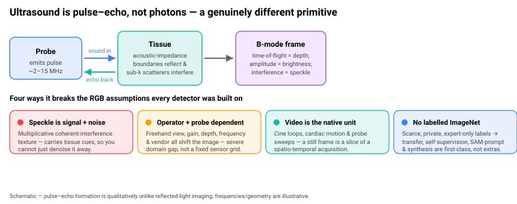
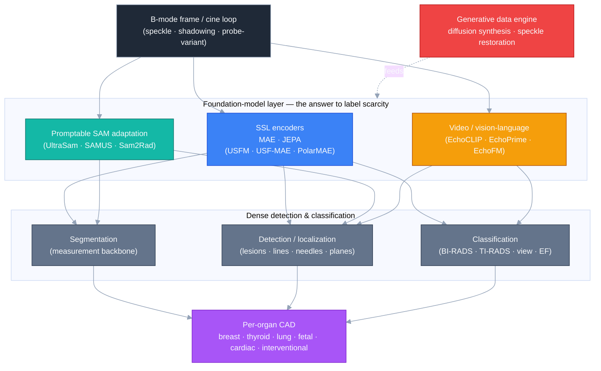
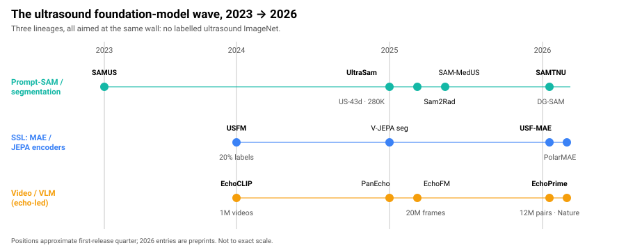
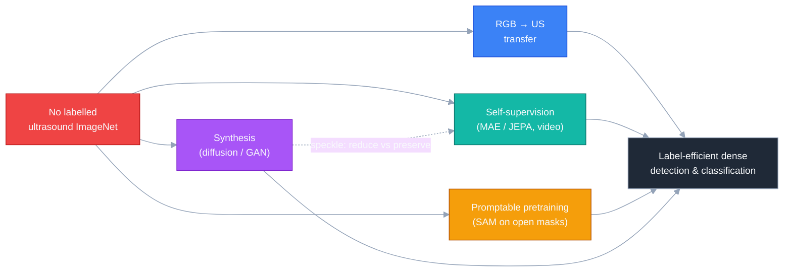

# Dense Object Detection & Classification — Recent Advances

*Compiled 2026-Jul-03 (America/Los_Angeles).*

Next installment in the running CV-updates log. Earlier entries on
`main`:
[Apr-30](../2026-Apr-30/2026-Apr-30_CV_updates.md),
[May-01](../2026-May-01/2026-May-01_CV_updates.md),
[May-02](../2026-May-02/2026-May-02_CV_updates.md),
[May-04](../2026-May-04/2026-May-04_CV_updates.md),
[May-05](../2026-May-05/2026-May-05_CV_updates.md),
[May-07](../2026-May-07/2026-May-07_CV_updates.md),
[May-08](../2026-May-08/2026-May-08_CV_updates.md),
[May-15](../2026-May-15/2026-May-15_CV_updates.md),
[May-16](../2026-May-16/2026-May-16_CV_updates.md),
[May-17](../2026-May-17/2026-May-17_CV_updates.md),
[Jun-09](../2026-Jun-09/2026-Jun-09_CV_updates.md),
[Jun-10](../2026-Jun-10/2026-Jun-10_CV_updates.md),
[Jun-12](../2026-Jun-12/2026-Jun-12_CV_updates.md),
[Jun-15](../2026-Jun-15/2026-Jun-15_CV_updates.md),
[Jun-16](../2026-Jun-16/2026-Jun-16_CV_updates.md),
[Jun-17](../2026-Jun-17/2026-Jun-17_CV_updates.md),
[Jun-19](../2026-Jun-19/2026-Jun-19_CV_updates.md),
[Jun-21](../2026-Jun-21/2026-Jun-21_CV_updates.md),
[Jun-22](../2026-Jun-22/2026-Jun-22_CV_updates.md),
[Jun-23](../2026-Jun-23/2026-Jun-23_CV_updates.md),
[Jun-24](../2026-Jun-24/2026-Jun-24_CV_updates.md),
[Jun-25](../2026-Jun-25/2026-Jun-25_CV_updates.md),
[Jun-27](../2026-Jun-27/2026-Jun-27_CV_updates.md),
[Jun-29](../2026-Jun-29/2026-Jun-29_CV_updates.md),
[Jun-30](../2026-Jun-30/2026-Jun-30_CV_updates.md).

## Why this pass: medical ultrasound as its own primitive

The last stretch of the log has worked sensor primitives **on their own
terms** — camera-3D / occupancy
([Jun-24](../2026-Jun-24/2026-Jun-24_CV_updates.md)), remote-sensing spectra
([Jun-25](../2026-Jun-25/2026-Jun-25_CV_updates.md)), the LiDAR point cloud
([Jun-27](../2026-Jun-27/2026-Jun-27_CV_updates.md)), the event stream
([Jun-29](../2026-Jun-29/2026-Jun-29_CV_updates.md)), and the LWIR thermal
image ([Jun-30](../2026-Jun-30/2026-Jun-30_CV_updates.md)). **Medical
ultrasound** is the obvious next one — and across the ~200 sections of the
running log it has never had a pass of its own. It has surfaced only as one
item in a modality list (a segmentation corpus "treating CT/MRI/PET/
ultrasound/endoscopy" on
[Jun-21](../2026-Jun-21/2026-Jun-21_CV_updates.md)) and, confusingly, the
word *speckle* has appeared only for **SAR** despeckling
([Jun-25](../2026-Jun-25/2026-Jun-25_CV_updates.md)), a different physics.
Ultrasound the imaging primitive has never been treated in its own right.
That is the gap this entry fills.

It earns its own pass because a B-mode frame is a genuinely different object
from the visible grid every RGB detector was built on:

- **It is pulse–echo, not reflected light.** A transducer emits a
  ~2–15 MHz pressure pulse and reconstructs an image from the amplitude and
  time-of-flight of returning echoes at acoustic-impedance boundaries. Depth
  is time, brightness is echo strength — there is no colour and no
  photometric texture in the RGB sense.
- **Speckle is signal *and* noise.** The granular texture is not sensor
  noise but deterministic **coherent interference** from sub-wavelength
  scatterers; it is **multiplicative**, carries tissue information, and so
  cannot simply be filtered away — the field is explicitly split between
  methods that *reduce* speckle and methods that *preserve* its texture
  ([Ultrasound Image Generation with Latent Diffusion, arXiv 2502.08580](https://arxiv.org/abs/2502.08580);
  [Noise-Aware Boundary-Enhanced speckle reduction, arXiv 2606.25009](https://arxiv.org/abs/2606.25009)).
- **Operator- and probe-dependent, low-SNR, view-driven.** Freehand
  acquisition means gain, depth, frequency, angle, focal zone and vendor all
  change the image; acoustic shadowing, reverberation and side-lobes create
  artefacts that look like anatomy. The result is a severe **domain gap**
  rather than a fixed sensor grid — which is why probe/vendor generalization
  is a headline claim for the new foundation models
  ([USF-MAE, arXiv 2510.22990](https://arxiv.org/abs/2510.22990)).
- **Video is the native unit.** Cine loops, cardiac cycles and probe sweeps
  mean a still frame is a slice of a spatio-temporal acquisition; the most
  capable systems are trained on **videos**, not images
  ([EchoPrime, *Nature* 2025, s41586-025-09850-x](https://www.nature.com/articles/s41586-025-09850-x)).
- **There is no labelled ultrasound ImageNet.** Corpora are small, private,
  and expert-only to annotate. So **RGB→US transfer, self-supervision,
  SAM-style promptable pretraining, and synthesis** are first-class threads,
  not footnotes — the organizing tension of the whole field.

Concretely, "dense detection & classification" in ultrasound means: **lesion
/ nodule detection and BI-RADS / TI-RADS malignancy classification** (breast,
thyroid), **artefact and line detection** (lung A-/B-lines), **standard-plane
and structure detection** (obstetric, cardiac), **needle / catheter
localization and tracking** (interventional), and the **dense segmentation**
that underlies measurement — all under the label-scarcity and domain-shift
constraints above. The rest of this pass walks the stack from the
foundation-model layer down to the per-organ workhorses and the generative
data engine feeding them.

---

## 1 · Foundation models — the label-scarcity answer, three lineages

The defining move of the last two years is that ultrasound got its own
foundation models, and they split cleanly into three lineages (the timeline
below), each a different bet on how to beat the missing labelled ImageNet.

**Self-supervised encoders (the MAE/JEPA bet).** **USFM** — a *universal
ultrasound foundation model* — pretrains on a large multi-organ corpus and
reports robust segmentation/classification/enhancement performance while
needing only **~20% of the annotations** a from-scratch model would, the
label-efficiency headline that made the case for the whole approach
([USFM, *Medical Image Analysis* 2024](https://www.sciencedirect.com/science/article/abs/pii/S1361841524001270)).
The 2025–26 successors push the masked-image-modelling idea harder:
**USF-MAE** scales masked-autoencoder pretraining over hundreds of thousands
of scans across organs and is pitched specifically at **robustness to domain
shift** — probe type, acquisition angle, patient anatomy
([USF-MAE, arXiv 2510.22990](https://arxiv.org/abs/2510.22990)) — and
**PolarMAE** tailors the masking to the modality with **semantic screening
and polar-guided masking** for efficient fetal-ultrasound pretraining
([PolarMAE, arXiv 2604.15893](https://arxiv.org/abs/2604.15893)).

**Promptable SAM-style pretraining (the segmentation-first bet).**
**UltraSam** takes the opposite route: rather than label-free SSL, it trains
a SAM under the **prompt-conditioned** paradigm on **US-43d** — a
large-scale union of **43 open-access ultrasound datasets, >280K images with
masks for 50+ anatomical structures** — so it never needs a unified label
space and generalizes across tasks by prompting
([UltraSam, arXiv 2411.16222](https://arxiv.org/abs/2411.16222);
[IJCARS 2025](https://link.springer.com/article/10.1007/s11548-025-03517-8)).
Notably its authors report UltraSam **outperforming the SSL-pretrained USFM
and DeblMIM** on downstream segmentation — evidence that diverse
prompt-conditioned data can beat pure SSL when masks exist.

**Video / vision-language (the echo-led bet).** Cardiology, with its huge
archives of paired videos and reports, produced the largest models. **EchoCLIP**
contrastively trains on **>1M cardiac ultrasound videos** with expert text and
estimates LVEF at **~7.1% MAE** zero-shot. **PanEcho** pairs a ConvNeXt encoder
with a temporal transformer over >1M videos for **view-agnostic** multi-task
prediction. **EchoFM** self-supervises over **>20M echocardiographic frames**
from ~6,500 patients with spatio-temporal masking
([EchoFM, PMC12616925](https://pmc.ncbi.nlm.nih.gov/articles/PMC12616925/)).
The current flagship, **EchoPrime**, is a **multi-video, view-informed
vision-language model trained on >12M video–report pairs**; without
task-specific fine-tuning it matches or beats single-task EchoNet models on
LVEF and valvular regurgitation and outperforms EchoCLIP / PanEcho /
BiomedCLIP across a comprehensive study — published in *Nature*
([EchoPrime, *Nature* 2025, s41586-025-09850-x](https://www.nature.com/articles/s41586-025-09850-x);
[preprint](https://www.semanticscholar.org/paper/b9044181bc560726f37473415b51c1432e2c160c)).
The 2026 frontier moves toward **latent-predictive** objectives — **EchoJEPA**
applies the JEPA "predict in latent space" recipe to echo
([EchoJEPA, arXiv 2602.02603](https://arxiv.org/abs/2602.02603)) — and
**multi-view masked modelling** that fuses standard views rather than scoring
frames independently
([Beyond Independent Frames: Latent-Attention MAE for Multi-View Echo, arXiv 2604.15096](https://arxiv.org/abs/2604.15096)).

The through-line: **all three lineages exist because there is no labelled
ImageNet.** SSL learns priors from unlabelled scans, SAM-prompting recycles
sparse open masks, and the video/VLM models mine the one place ultrasound
*does* have paired supervision at scale — the cardiology report archive.

---

## 2 · Promptable segmentation — beyond adapting SAM

Dense segmentation is the measurement backbone (areas, diameters,
volumes) and the sub-field where Segment Anything landed hardest — but naïve
SAM transfers badly to speckle and low contrast, so the work is about
*adaptation*.

- **SAMUS** is the reference adaptation: it freezes SAM's ViT and adds a
  **parallel CNN branch** plus **feature and position adapters**, injecting
  local detail via **cross-branch attention** to bridge the natural→ultrasound
  domain gap. Its **AutoSAMUS** extension removes the manual prompt entirely
  for **end-to-end auto-prompted** inference
  ([SAMUS / AutoSAMUS, arXiv 2309.06824](https://arxiv.org/abs/2309.06824)).
- **Sam2Rad** replaces hand-drawn prompts with a **learnable prompt module**
  that predicts SAM's prompt embeddings from the image, tuned for
  musculoskeletal/radiology ultrasound
  ([Sam2Rad, arXiv 2409.06821](https://arxiv.org/abs/2409.06821)).
- **SAM-MedUS** builds a generic ultrasound segmenter by assembling **eight
  body-site categories** into one diverse training pool
  ([SAM-MedUS, PMC11865838](https://pmc.ncbi.nlm.nih.gov/articles/PMC11865838/)).
- **SAMTNU** targets thyroid: a two-branch SAM+CNN design tuned with adapters
  and an **MHA-LoRA** module, reporting **Dice 83.87% / HD 23.98 on TG3K**,
  **+7.49% Dice over SAMUS**
  ([SAMTNU, MICCAI-workshop 2025](https://link.springer.com/chapter/10.1007/978-3-032-04546-1_29)).
- **Domain-generalized SAM** is the newest thread: **noise-robust tuning of
  SAM** so a single model holds up across unseen probes/vendors
  ([Noise-Robust Tuning of SAM for DG Ultrasound Seg, MICCAI 2025](https://papers.miccai.org/miccai-2025/0641-Paper1075.html)),
  and open-vocabulary pipelines wiring **Grounding-DINO → SAM2** for
  text-prompted multi-organ segmentation.

The arc mirrors the general segmentation story
([Jun-21](../2026-Jun-21/2026-Jun-21_CV_updates.md)) but with an
ultrasound-specific twist: because a manual click is a workflow burden at the
bedside, the field's real target is **auto-prompting and domain
generalization**, not prompt-conditioned accuracy alone.

---

## 3 · Detection & classification by organ — the CAD workhorses

Where the foundation-model layer is new, the clinical payload is still the
per-organ detector/classifier. The pattern rhymes with mainstream 2D
detection (CNN→transformer backbones, DETR-style heads) but is bent by
speckle, view dependence and the malignancy-grading endpoint.

**Breast (BI-RADS).** The dominant task is benign/malignant lesion
classification and biopsy triage. Hybrid **CNN–transformer** classifiers such
as **AResNet-ViT** fuse a ResNet local branch with a ViT global branch for
benign/malignant nodule classification
([AResNet-ViT, arXiv 2407.19316](https://arxiv.org/pdf/2407.19316)), and
**deep-learning radiomics** now target the specific decision that matters —
**down-classifying BI-RADS 4A lesions to avoid unnecessary biopsies**
([BI-RADS 4A radiomics](https://www.researchgate.net/publication/389522143)).
A **prospective multicenter** study showed a US CAD tool lifting
non-expert radiologists' lesion classification
([AJR 2025, 10.2214/AJR.23.29328](https://ajronline.org/doi/10.2214/AJR.23.29328)),
and multi-task CNN-transformers do **joint segmentation + classification** in
one pass.

**Thyroid (TI-RADS).** Here detection (nodule localization) and
classification (malignancy risk, ACR TI-RADS features) are usually coupled. A
2025 **multicentre** study predicts malignancy of **TI-RADS 4** nodules from
**multimodal ultrasound**, outperforming three radiologist groups and lifting
all three when used as assistance
([Multimodal TI-RADS 4, *Comput. Med. Imaging Graph.* 2025](https://www.sciencedirect.com/science/article/abs/pii/S0895611125000850)),
while integrated systems do **simultaneous localization and risk
stratification** with reported test AUC ~**0.937**
([Localization + risk stratification](https://www.sciencedirect.com/science/article/abs/pii/S0301562924001121);
[multi-view detection & characterization, PMC11273835](https://www.ncbi.nlm.nih.gov/pmc/articles/PMC11273835/)).

**Lung (A-/B-lines).** Point-of-care lung ultrasound turns **artefacts** into
diagnostic targets: vertical **B-lines** signal extravascular lung water
(heart failure, ARDS, COVID). Recent detectors adapt mainstream heads —
**YOLOv5-PBB / YOLOv8-PBB** for precise, interpretable **B-line localization**
([A-/B-line detection with boundary-aware Dice, *Bioengineering* 2025 (PMC11939577)](https://pmc.ncbi.nlm.nih.gov/articles/PMC11939577/);
[B-line detection & localization, *Frontiers in AI* 2025](https://www.frontiersin.org/journals/artificial-intelligence/articles/10.3389/frai.2025.1560523/full)) —
and self-supervised pretraining improves multiple LUS tasks at lower
inference cost
([SSL for lung ultrasound, arXiv 2309.02596](https://arxiv.org/pdf/2309.02596)).

**Fetal / obstetric (standard planes).** The core task is detecting the
diagnostic **standard plane** in a freehand sweep — inherently temporal.
Beyond SonoNet-era frame classifiers, **MCAT** casts it as **visual-query
localization of standard anatomical clips in fetal videos** with a
class-aware token transformer
([MCAT, arXiv 2504.06088](https://arxiv.org/pdf/2504.06088)), temporal
sliding-window aggregation stabilizes keyframe detection, and 2026 work adds
**multi-agent collaboration** for more reliable interpretation
([Multi-agent fetal US, arXiv 2605.25357](https://arxiv.org/pdf/2605.25357)).

**Interventional (needles / catheters).** A distinct, real-time
detection/tracking problem under motion and reverberation. **CathFlow**
self-supervises catheter segmentation with **optical flow + a transformer**
([CathFlow, arXiv 2403.14465](https://arxiv.org/pdf/2403.14465));
**ConVibNet** detects needles *during continuous insertion* via
**frequency-inspired (vibration) features**
([ConVibNet, arXiv 2603.01147](https://arxiv.org/pdf/2603.01147)); and
**MambaX-CTrack** brings a Mamba **state-space** tracker with SSM
cross-correlation and a motion prompt to needle tracking (IEEE RA-L 2025) —
the same SSM turn seen in event vision
([Jun-29](../2026-Jun-29/2026-Jun-29_CV_updates.md)).

---

## 4 · The video primitive, on its own terms

Because a cine loop is the native acquisition, the most ultrasound-specific
results are the ones that refuse to treat frames independently. Three ideas
converge here:

- **Pixel-reconstruction is the wrong SSL objective for speckle.** V-JEPA
  applied to ultrasound video predicts in **latent space** rather than
  reconstructing pixels, which "mitigates sensitivity to noise and low
  contrast" and models spatio-temporal dynamics to separate anatomy from
  artefacts across frames
  ([Self-Supervised Ultrasound-Video Segmentation with feature prediction & 3D localised loss, arXiv 2507.18424](https://arxiv.org/html/2507.18424v1)).
  **EchoJEPA** makes the same latent-predictive bet at foundation scale
  ([arXiv 2602.02603](https://arxiv.org/abs/2602.02603)).
- **Multi-view beats single-frame scoring** in echo, where a study *is* a set
  of standard views — hence view-informed fusion in **EchoPrime** and
  latent-attention masked modelling over views
  ([arXiv 2604.15096](https://arxiv.org/pdf/2604.15096)).
- **Temporal aggregation stabilizes detection** — the fetal standard-plane
  and B-line detectors above lean on sliding-window / clip-level evidence
  rather than per-frame peaks.

This is the cleanest expression of "ultrasound as its own primitive": the
representation, the SSL objective, and the detection head are all reshaped by
the fact that the data is a noisy, low-contrast **video**.

---

## 5 · Generative & restoration — the data engine and the speckle question

With real labels scarce, **synthesis** has graduated from a curiosity to a
training-data engine, and **speckle** is where the physics forces a choice.

- **Diffusion synthesis for training.** *Echo from Noise* generates synthetic
  cardiac ultrasound from **semantic label maps** via a DDPM and shows the
  synthetic images can **substitute for real data** when training segmentation
  ([Echo from Noise, arXiv 2305.05424](https://arxiv.org/abs/2305.05424)).
  **Latent diffusion** now generates ultrasound at higher fidelity/lower cost
  ([Ultrasound Latent Diffusion, arXiv 2502.08580](https://arxiv.org/abs/2502.08580)),
  and **EchoFlow** is a foundation model for cardiac ultrasound **image and
  video generation**
  ([EchoFlow, arXiv 2503.22357](https://arxiv.org/pdf/2503.22357)).
- **Physics-inspired generation.** *Diffusion as Sound Propagation* aligns the
  denoising process with **acoustic wave propagation**, injecting the imaging
  physics into the generator rather than treating it as generic image
  synthesis
  ([arXiv 2407.05428](https://arxiv.org/html/2407.05428v1/)).
- **Speckle: reduce vs preserve.** Because speckle is informative, the newest
  restoration work is explicit about **preserving texture** while suppressing
  noise — **noise-aware boundary-enhanced** generative speckle reduction
  ([arXiv 2606.25009](https://arxiv.org/pdf/2606.25009)) and **adversarial
  diffusion** denoisers with structural feature-extraction losses
  ([ADM-ExNet, *Medical Physics* 2025](https://aapm.onlinelibrary.wiley.com/doi/abs/10.1002/mp.70023)).
  This is the ultrasound analogue of SAR despeckling
  ([Jun-25](../2026-Jun-25/2026-Jun-25_CV_updates.md)) — but here the texture
  is *diagnostic*, so blanket smoothing can erase the signal.

---

## 6 · The through-line & open problems

- **Label scarcity is the organizing constraint**, and the field has
  converged on four coordinated answers — transfer, self-supervision,
  promptable pretraining, and synthesis (Diagram 2) — rather than any single
  winner. UltraSam beating USFM on masks vs USF-MAE's SSL robustness suggests
  the answer is task-dependent, not settled.
- **Domain / probe shift is the deployment killer.** Freehand acquisition and
  vendor diversity make generalization, not in-distribution accuracy, the real
  metric — hence DG-SAM tuning and probe-robust MAEs are the papers to watch.
- **Speckle must be modelled, not erased.** The reduce-vs-preserve split, and
  physics-aware generators, are the tell that ultrasound resists the "denoise
  then detect" habit imported from RGB.
- **Video-native methods are pulling ahead.** Latent-predictive SSL (JEPA),
  multi-view fusion, and temporal aggregation consistently beat frame-wise
  baselines — the clearest sign this is a distinct primitive.
- **Validation remains the gap between paper and clinic.** Headline AUCs come
  from single-centre or retrospective sets; the multicentre / prospective
  studies (thyroid TI-RADS 4, breast AJR) are the ones that will decide
  adoption.

### Datasets & benchmarks (anchors, not leaderboards)

- **Multi-organ / foundation:** **US-43d** (43 datasets, 280K+ images,
  UltraSam) — [arXiv 2411.16222](https://arxiv.org/abs/2411.16222).
- **Breast:** **BUSI**, **BUS-BRA** — benign/malignant + masks.
- **Thyroid:** **TN3K / TG3K**, **DDTI** — nodule masks & TI-RADS.
- **Cardiac:** **EchoNet-Dynamic / -Pediatric / -LVH**, **CAMUS** — LVEF,
  segmentation; the video/VLM models above scale far beyond these.
- **Fetal:** standard-plane classification sets; **HC18** (head
  circumference).
- **Lung / POCUS:** COVID-era LUS collections for A-/B-line and pathology
  ([SSL LUS, arXiv 2309.02596](https://arxiv.org/pdf/2309.02596)).

---

### Diagram-rendering notes

- Two **Mermaid** flowcharts (the stack from raw frame → foundation layer →
  tasks → organ CAD; and the four answers to label scarcity) plus two
  **standalone SVGs** (`assets/us-primitive.svg`, `assets/us-foundation-timeline.svg`).
- No external image URLs — both SVGs are local files committed alongside this
  report and referenced by relative path.
- The SVGs use `currentColor` for strokes/text and **low-opacity RGBA** fills,
  and the Mermaid nodes pair saturated fills with light (`#f8fafc`) text — so
  every diagram stays legible in **light and dark** themes. The palette
  encodes the three foundation-model lineages: **blue = SSL/MAE**,
  **teal = SAM/segmentation**, **amber = video/VLM**, with **red** marking the
  label-scarcity constraint that generates all three.
- Numbers are quoted from each method's own paper / venue / summary and are
  **not comparable across rows** (breast/thyroid AUC vs Dice/HD segmentation
  vs LVEF MAE differ in task, cohort and metric; BUSI / BUS-BRA / TN3K /
  EchoNet / CAMUS differ in organ, resolution and label type). This run's
  egress policy blocked direct `arxiv.org` / `nature.com` / `pmc` fetches
  (HTTP 403), so IDs / venues / numbers were corroborated via multiple
  cross-checked search results and secondary summaries; figures available only
  through summaries are best treated as **approximate**, and 2026
  (`2602`–`2606`) arXiv IDs are real, consistently matched **preprints** not
  yet page-verified in this session.
