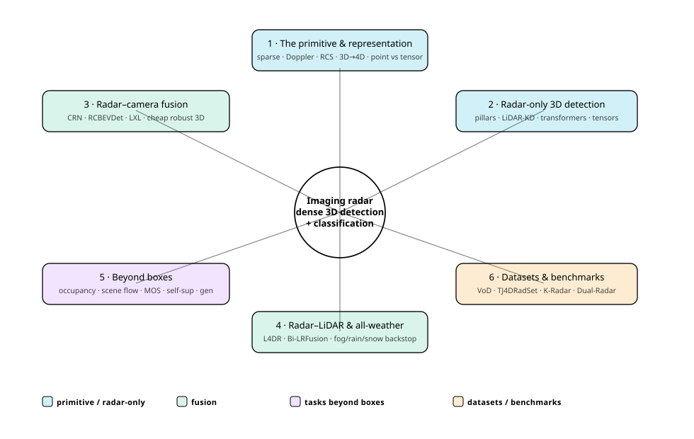
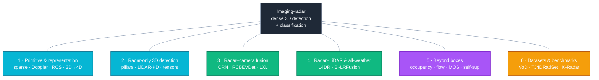
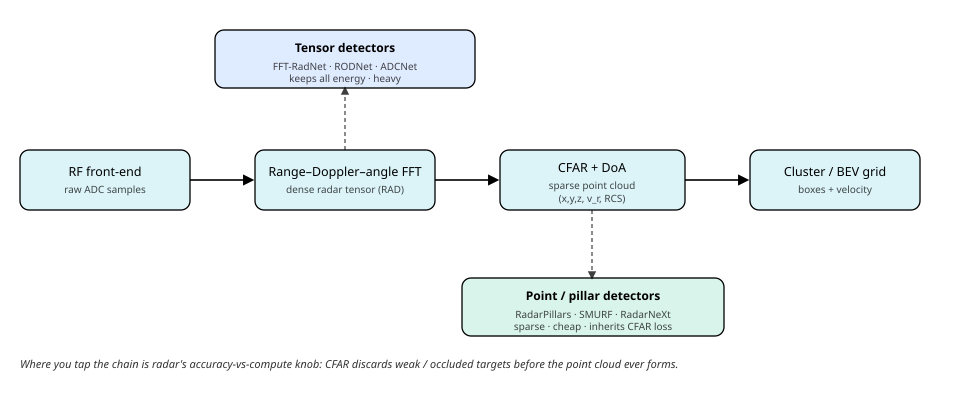

# Dense Object Detection & Classification — Recent Advances

*Compiled 2026-Jul-04 (America/Los_Angeles).*

Next installment in the running CV-updates log. Earlier entries on
`main`:
[Apr-30](../2026-Apr-30/2026-Apr-30_CV_updates.md),
[May-01](../2026-May-01/2026-May-01_CV_updates.md),
[May-02](../2026-May-02/2026-May-02_CV_updates.md),
[May-04](../2026-May-04/2026-May-04_CV_updates.md),
[May-05](../2026-May-05/2026-May-05_CV_updates.md),
[May-07](../2026-May-07/2026-May-07_CV_updates.md),
[May-08](../2026-May-08/2026-May-08_CV_updates.md),
[May-15](../2026-May-15/2026-May-15_CV_updates.md),
[May-16](../2026-May-16/2026-May-16_CV_updates.md),
[May-17](../2026-May-17/2026-May-17_CV_updates.md),
[Jun-09](../2026-Jun-09/2026-Jun-09_CV_updates.md),
[Jun-10](../2026-Jun-10/2026-Jun-10_CV_updates.md),
[Jun-12](../2026-Jun-12/2026-Jun-12_CV_updates.md),
[Jun-15](../2026-Jun-15/2026-Jun-15_CV_updates.md),
[Jun-16](../2026-Jun-16/2026-Jun-16_CV_updates.md),
[Jun-17](../2026-Jun-17/2026-Jun-17_CV_updates.md),
[Jun-19](../2026-Jun-19/2026-Jun-19_CV_updates.md),
[Jun-21](../2026-Jun-21/2026-Jun-21_CV_updates.md),
[Jun-22](../2026-Jun-22/2026-Jun-22_CV_updates.md),
[Jun-23](../2026-Jun-23/2026-Jun-23_CV_updates.md),
[Jun-24](../2026-Jun-24/2026-Jun-24_CV_updates.md),
[Jun-25](../2026-Jun-25/2026-Jun-25_CV_updates.md),
[Jun-27](../2026-Jun-27/2026-Jun-27_CV_updates.md),
[Jun-29](../2026-Jun-29/2026-Jun-29_CV_updates.md),
[Jun-30](../2026-Jun-30/2026-Jun-30_CV_updates.md).

## Why this pass: imaging radar as its own primitive

The last five passes worked sensor primitives **on their own terms** —
camera-3D / occupancy ([Jun-24](../2026-Jun-24/2026-Jun-24_CV_updates.md)),
remote-sensing spectra ([Jun-25](../2026-Jun-25/2026-Jun-25_CV_updates.md)),
the LiDAR point cloud ([Jun-27](../2026-Jun-27/2026-Jun-27_CV_updates.md)),
the event camera ([Jun-29](../2026-Jun-29/2026-Jun-29_CV_updates.md)), and
thermal infrared ([Jun-30](../2026-Jun-30/2026-Jun-30_CV_updates.md)).
**Automotive imaging radar** is the sensor those passes kept gesturing at
and never opened up: it appears across ~200 sections of the log only as
"4-D radar (Doppler + elevation)" in a single line of the
[May-17](../2026-May-17/2026-May-17_CV_updates.md) AV overview, and as the
weather-robust junior partner in the LiDAR-camera fusion stacks. That buries
the fact that **radar is now its own dense-detection modality** with its own
datasets, its own leaderboard, and a 2024–26 literature that no longer treats
the radar branch as a bolt-on. This entry works radar on its own terms.

It earns its own pass because the radar return is a genuinely different
primitive from every sensor covered so far:

- **The data is sparse, and sparse in a way LiDAR is not.** A spinning LiDAR
  returns ~100 k points per sweep; a legacy 3-D automotive radar
  (nuScenes' Continental ARS408) returns a few dozen, and even a modern **4-D
  imaging radar** returns only hundreds to a few thousand — *after* a CFAR
  detector has already thresholded away everything it judged to be noise.
  Sparsity here is not just low density; it is **information the sensor
  decided to discard before you ever saw it**.
- **Every point carries a velocity.** A radar measures **Doppler** — the
  radial velocity of each reflector — directly, per point, in a single frame.
  No other passive or scanning sensor gets instantaneous velocity for free;
  LiDAR needs two sweeps and association to estimate it. Radar also reports
  **radar cross-section (RCS)**, a crude material/size cue.
- **It sees through weather, and it is cheap.** 77 GHz mmWave penetrates fog,
  rain, snow and dust that blind cameras and scatter LiDAR, and a radar costs
  a fraction of a LiDAR. That combination — **all-weather velocity sensing at
  commodity price** — is why radar is the one sensor already on essentially
  every production car, and why "radar + camera" is the fusion recipe the
  industry actually ships.
- **Its weaknesses are equally structural.** Poor angular (especially
  elevation) resolution, multipath **ghost targets**, clutter, and no texture
  or colour. So the field's whole design story is *how to recover dense,
  well-localised objects from a sparse, velocity-rich, low-angular-resolution
  return* — and, increasingly, **how to lean on radar exactly where the other
  sensors fail** rather than treating it as a weak LiDAR.

This pass covers six threads of that stack:

1. **The primitive & representation** — sparsity, Doppler, RCS, the 3-D→4-D
   shift, and the point-cloud-vs-tensor-vs-raw-ADC representation fork.
2. **Radar-only 3-D detection** — the leaderboard: pillar/point detectors,
   distillation from LiDAR, transformers, and dense-tensor detectors.
3. **Radar–camera fusion** — cheap, robust 3-D from the two sensors every car
   already has.
4. **Radar–LiDAR fusion & adverse-weather robustness** — radar as the
   all-weather backstop, and what controlled weather benchmarks actually show.
5. **Beyond bounding boxes** — occupancy, scene flow, moving-object
   segmentation, self-supervision and generative radar.
6. **Datasets & benchmarks** — the 3-D→4-D dataset shift that reorganised the
   whole field.

> **Reading the numbers.** Figures are quoted from each method's own paper,
> repo or leaderboard. **Detection protocols differ and are not comparable
> across rows.** The two dominant 4-D-radar benchmarks report differently:
> **View-of-Delft (VoD)** reports mAP in two regions — the *entire annotated
> area* and the smaller *driving corridor* (corridor numbers run much higher)
> — while **TJ4DRadSet** reports 3-D and BEV AP split by range (0–70 m). Older
> radar-camera work reports **nuScenes NDS/mAP**, which shares no axis with
> VoD/TJ4DRadSet. RF-tensor datasets (RADIal, CARRADA, RADDet) report yet
> other metrics (AP on range-angle maps, F1). Treat every cross-row delta as
> indicative, not controlled. arXiv IDs encode submission month
> (`2412.xxxxx` = Dec 2024; `2603.xxxxx` = Mar 2026).
>
> **Verification note.** This run's egress policy allowed web *search* and
> fetches of **GitHub repositories**, but blocked direct `arxiv.org`,
> `openaccess.thecvf.com`, `nature.com` and PMC fetches (HTTP 403). So arXiv
> IDs, venues and most numbers were cross-checked against authors' **GitHub
> READMEs**, dataset repos, proceedings listings and multiple independent
> search snippets rather than the abstract PDFs. Numbers pinned to a primary
> repo/README are stated plainly; figures available only via secondary
> summaries are flagged *(secondary)* or *(unverified)*. 2026 (`2601`–`2606`)
> arXiv IDs are real preprints not yet page-verified.

## Topic map

## 1 · The primitive & representation — why radar forces different choices

There is a signal chain, and **the first design decision is where on it you
attach the network.** A 77 GHz FMCW MIMO radar samples raw ADC data, runs
range/Doppler/angle FFTs into a dense **range–azimuth–Doppler (RAD) tensor**,
then a **CFAR** (constant false-alarm rate) detector plus direction-of-arrival
estimation thresholds that tensor into a **sparse point cloud** — each point
carrying `(x, y, z, v_r, RCS)` — which is finally clustered into boxes. Every
representation the literature uses is a tap somewhere on that chain, and the
tap point is a hard accuracy-vs-compute knob unique to radar:

- **Sparse point cloud (post-CFAR).** The cheapest and most common input.
  Maximally compatible with the LiDAR toolkit (voxelise / pillarise / point
  networks), but it **inherits every target CFAR already deleted** — weak,
  small or occluded objects may simply not be in the cloud.
- **Range–Doppler / range–azimuth / RAD tensor (pre-CFAR).** Keep the dense
  spectrum and let the network do its own detection. Retains weak returns and
  the full Doppler signature, at a much higher compute and memory cost, and
  needs radar-specific backbones rather than borrowed LiDAR ones.
- **Raw ADC (pre-FFT).** Learn the signal processing itself
  ([RADIal](https://github.com/valeoai/RADIal)'s premise). Least lossy, least
  mature, and tied to raw-signal datasets that barely exist.

The other structural fact is the **3-D → 4-D shift**. A legacy *3-D* radar
measures range, azimuth and Doppler but **no elevation**, so its points
collapse onto the ground plane — usable for BEV velocity, nearly useless for
3-D boxes. A **4-D imaging radar** adds elevation through a much larger MIMO
virtual-aperture array, producing a true (if sparse) 3-D cloud with hundreds
to thousands of points per frame. That single capability is what turned radar
from a fusion accessory into a stand-alone 3-D detector, and it is why the
benchmark centre of gravity moved off nuScenes-radar onto the 4-D datasets
(§6). The representation fork and the 3-D/4-D distinction together explain
almost every architectural choice in §§2–4.

**Key surveys.** The primitive and its representations are laid out in three
recent reviews:

| Survey | Reference | Focus |
|---|---|---|
| 4D mmWave Radar in Autonomous Driving | [arXiv 2306.04242](https://arxiv.org/abs/2306.04242) (2023) | The canonical 4-D survey: signal processing, resolution, calibration, point-cloud generation, perception & SLAM |
| Exploring Radar Data Representations | [arXiv 2312.04861](https://arxiv.org/abs/2312.04861) | Taxonomy of ADC cube → RAD tensor → range-Doppler / range-azimuth → point cloud → BEV, and the tradeoffs |
| 4D mmWave Radar in Adverse Environments | [arXiv 2503.24091](https://arxiv.org/abs/2503.24091) (2025) | All-weather operation; catalogs datasets and methods by weather/lighting condition |

## 2 · Radar-only 3-D detection — the leaderboard

Two representation camps split the leaderboard, exactly as §1 predicts.
**Tensor-native detectors** work on the dense pre-CFAR spectrum
(range-azimuth heatmaps, RAD tensors, or raw ADC) and keep the low-SNR
energy CFAR would delete; **point/pillar detectors** run on the sparse 4-D
point cloud and inherit the mature LiDAR pillar/BEV toolkit. Distillation
methods sit in the point camp but borrow LiDAR density *at training time
only* — inference is radar-only, so they belong here.

| Method | Reference | Camp / representation | Idea | Headline (note the protocol) |
|---|---|---|---|---|
| **RODNet** | [arXiv 2003.01816](https://arxiv.org/abs/2003.01816) (WACV 2021) | tensor · RA heatmap | 3-D-CNN autoencoder on range-azimuth maps, camera-radar cross-modal auto-labels (no manual GT) | CRUW location score; a foundational tensor detector |
| **RADDet** | [arXiv 2105.00363](https://arxiv.org/abs/2105.00363) (CRV 2021) | tensor · RAD | one-stage anchor detector emitting 3-D + BEV boxes on the range-azimuth-Doppler tensor | **56.3 AP@IoU.3** (own RAD set); 51.6 BEV AP@.5 |
| **FFT-RadNet** | [arXiv 2112.10646](https://arxiv.org/abs/2112.10646) (CVPR 2022) | HD radar · range-Doppler | learns angle from the RD spectrum, skipping the costly RAD tensor; multi-task detect + free-space | **96.84 AP / 82.18 AR @IoU.5** (RADIal, vehicle); lighter than RAD baselines |
| **T-FFTRadNet** | [arXiv 2303.16940](https://arxiv.org/abs/2303.16940) (ICCVW 2023) | HD radar · ADC→RD | Swin transformer on RD (+ complex layers from raw ADC) for detect + segment | on par / better than FFT-RadNet on RADIal *(exact unverified)* |
| **ADCNet** | [arXiv 2303.11420](https://arxiv.org/abs/2303.11420) (2023) | HD radar · **raw ADC** | end-to-end learnable signal-processing block on raw ADC, pretrained against classical DSP | SOTA on RADIal *(exact unverified)* |
| **RPFA-Net** | [ITSC 2021](https://ieeexplore.ieee.org/document/9564754) | 4-D · pillars | self-attention "Pillar Feature Attention" replaces PointNet, improving heading regression | SOTA on Astyx HiRes *(exact unverified)* |
| **MVFAN** | [arXiv 2310.16389](https://arxiv.org/abs/2310.16389) (ICONIP 2023) | 4-D · multi-view | anchor-free two-branch backbone that explicitly exploits Doppler + RCS; position-map reweighting | Astyx & VoD *(exact mAP unverified)* |
| **SMURF** | [arXiv 2307.10784](https://arxiv.org/abs/2307.10784) (T-IV 2023/24) | 4-D · pillar + KDE | adds a kernel-density-estimation branch to pillars to counter sparsity + angular noise | VoD ~**42–49 mAP EAA** *(config-dependent)*; competitive TJ4DRadSet; ~2.7× slower than RadarPillars |
| **RadarPillars** | [arXiv 2408.05020](https://arxiv.org/abs/2408.05020) (2024) | 4-D · pillars | decomposes radial velocity + "PillarAttention" + layer-scaling; embedded-friendly | **VoD 48.77 mAP EAA / 71.13 corridor**; 2.73× faster than SMURF; runs on Jetson AGX |
| **MUFASA** | [arXiv 2408.00565](https://arxiv.org/abs/2408.00565) (2024) | 4-D · multi-view | distributed multi-view attention fusing per-frame + dataset-global spatial info | **VoD 50.24 mAP**; **TJ4D 30.23 3-D / 39.10 BEV** (SOTA radar-only at pub.) |
| **RadarNeXt** | [arXiv 2501.02314](https://arxiv.org/abs/2501.02314) (2025) | 4-D · point cloud | re-parameterizable backbone + multi-path deformable foreground enhancement (DCNv3), real-time | **VoD >50 / TJ4D >32 mAP**; **67 FPS (A4000), 28 FPS (Jetson Orin)** |
| **RadarGaussianDet3D** | [arXiv 2509.16119](https://arxiv.org/abs/2509.16119) (RA-L 2025) | 4-D · Gaussian/3DGS BEV | point-Gaussian encoder → 3D-Gaussian-splatting BEV rasterization + box-Gaussian loss | **TJ4D 40.7 mAP3D / 42.4 BEV**; VoD 2nd radar-only; **83.2 FPS (V100)** |
| **RadarDistill** | [arXiv 2403.05061](https://arxiv.org/abs/2403.05061) (CVPR 2024) | **3-D** (nuScenes) · KD | cross-modality alignment + activation/proposal distillation from a LiDAR teacher | **20.5 mAP / 43.7 NDS** (nuScenes radar-only) |
| **SCKD** | [arXiv 2412.14571](https://arxiv.org/abs/2412.14571) (AAAI 2025) | 4-D · semi-sup KD | LiDAR+radar teacher → radar student, cross-modality + semi-supervised output distillation | **VoD +10.38 mAP over baseline**, SOTA radar-only *(abs. unverified)* |

**What the two camps tell you.** The strongest radar-only VoD numbers today —
MUFASA ~50.2, RadarPillars 48.8 EAA, RadarGaussianDet3D near-SOTA — all come
from **point/pillar methods that re-densify** a sparse cloud, not from
tensor-native detectors, even though the tensor camp has the higher
information ceiling. The persistent enemy is **sparsity + angular noise**, and
three coping strategies define 2024–26: (1) **density/attention augmentation**
of the point representation (SMURF's KDE, RadarPillars' PillarAttention,
RadarNeXt's deformable enhancement); (2) **cross-modal knowledge distillation**
that borrows LiDAR density only at training (RadarDistill on 3-D nuScenes,
SCKD on 4-D); and (3) **compact intermediate primitives for real-time embedded
deployment** (RadarGaussianDet3D at 83 FPS, RadarNeXt at 67 FPS). Numbers are
**config-sensitive** — single- vs multi-frame accumulation, point count and
eval region shift VoD/TJ4D mAP by several points (SMURF's EAA is ~42 in its
own paper but ~49 in RadarPillars' re-evaluation), so treat cross-paper deltas
as approximate.

## 3 · Radar–camera fusion — cheap, robust 3-D from the sensors every car has

This is the fusion the industry actually ships, because radar + camera is far
cheaper than LiDAR and the two modalities are complementary in exactly the
right way: **camera gives dense semantics and appearance but ill-posed depth
and no velocity; radar gives accurate range, per-point Doppler and all-weather
robustness but is sparse and semantically blind.** The design axis moved from
**point-decoration** (paint radar onto image features) → **BEV-space fusion**
(lift both to a bird's-eye grid) → **query / cross-attention fusion** (let 3-D
queries sample both modalities), the latter handling radar sparsity and
misalignment more gracefully than grid concatenation.

**3-D radar + camera (nuScenes, NDS/mAP).** The mainstream track, on the
sparse-3-D-radar nuScenes benchmark:

| Method | Reference | Fusion mechanism | nuScenes (test unless noted) |
|---|---|---|---|
| **CenterFusion** | [arXiv 2011.04841](https://arxiv.org/abs/2011.04841) (WACV 2021) | point-decoration: frustum radar-to-center association augments image features | **44.9 NDS / 32.6 mAP** |
| **CRAFT** | [arXiv 2209.06535](https://arxiv.org/abs/2209.06535) (AAAI 2023) | proposal-level: polar association + cross-attention feature exchange | **52.3 NDS / 41.1 mAP** |
| **CRN** | [arXiv 2304.00670](https://arxiv.org/abs/2304.00670) (ICCV 2023) | radar-assisted PV→BEV view transform + multi-modal deformable attention | **62.4 NDS / 57.5 mAP**; 20 FPS real-time config |
| **HVDetFusion** | [arXiv 2307.11323](https://arxiv.org/abs/2307.11323) (2023) | modality-decoupled BEV fusion (BEVDet4D + radar branch) | **67.4 NDS** *(mAP secondary)* |
| **RCM-Fusion** | [arXiv 2307.10249](https://arxiv.org/abs/2307.10249) (ICRA 2024) | feature + proposal fusion; radar-guided BEV query + grid pooling | **58.7 NDS / 50.6 mAP** (single-frame) |
| **RCBEVDet** | [arXiv 2403.16440](https://arxiv.org/abs/2403.16440) (CVPR 2024) | RadarBEVNet (dual-stream, RCS-aware) + cross-attention BEV fusion | **+2.8 NDS / +2.1 mAP over CRN**; mAVE −37.5% *(abs. secondary)* |
| **HyDRa** | [arXiv 2403.07746](https://arxiv.org/abs/2403.07746) (2024) | hybrid PV+BEV; radar-weighted depth consistency + height-association transformer | **64.2 NDS** (ConvNeXt-B) |
| **CRT-Fusion** | [arXiv 2411.03013](https://arxiv.org/abs/2411.03013) (NeurIPS 2024) | adds motion: multi-view + motion-guided temporal fusion | **+1.7 NDS / +1.4 mAP** over prior best *(abs. secondary)* |
| **RaCFormer** | [arXiv 2412.12725](https://arxiv.org/abs/2412.12725) (CVPR 2025) | query-based: 3-D queries sample image + radar BEV, radar-adaptive sampling | **65.9 NDS / 59.2 mAP** (VoV-99) |
| **RCBEVDet++** | [arXiv 2409.04979](https://arxiv.org/abs/2409.04979) (2024) | RCBEVDet extended to detect+track+segment, stronger backbones | **72.7 NDS / 67.3 mAP** (ViT-L) — best radar-camera on nuScenes |

**4-D radar + camera (VoD / TJ4DRadSet, 3-D mAP).** The faster-maturing track,
where denser 4-D returns make camera the depth-fixer and radar the 3-D anchor:

| Method | Reference | Fusion mechanism | VoD mAP (EAA) | TJ4DRadSet |
|---|---|---|---|---|
| **RCFusion** | [IEEE TIM 2023](https://ieeexplore.ieee.org/document/10138035) | radar PillarNet pseudo-image + OFT image BEV, attention fuse | **49.65** | **33.85 mAP** |
| **LXL** | [arXiv 2307.00724](https://arxiv.org/abs/2307.00724) (WACV 2024) | "radar occupancy + image depth" assisted view transform | **56.31** (Car 42.3 / Ped 49.5 / Cyc 77.1) | ~36 *(unverified)* |
| **LXLv2** | [arXiv 2502.14503](https://arxiv.org/abs/2502.14503) (RA-L 2025) | LXL + refined depth/occupancy, faster & more robust | ~**58.1** (+1.8 over LXL) | +1.0 over LXL |
| **CVFusion** | [arXiv 2507.04587](https://arxiv.org/abs/2507.04587) (ICCV 2025) | two-stage cross-view: radar-guided iterative BEV proposals + multi-view aggregation | **+9.10 mAP over prior SOTA** | +3.68 over prior SOTA |
| **MLF-4DRCNet** | [arXiv 2509.18613](https://arxiv.org/abs/2509.18613) (2025) | multi-level: radar point encoder + hierarchical scene + proposal fusion | **60.28** (82.57 corridor) | SOTA *(exact unverified)* |
| **SFGFusion** | [arXiv 2510.19215](https://arxiv.org/abs/2510.19215) (2025) | surface-fitting → dense depth → guided BEV transform + pseudo-points | SOTA *(exact unverified)* | SOTA *(exact unverified)* |
| **RadarXFormer** | [arXiv 2603.14822](https://arxiv.org/abs/2603.14822) (2026) | cross-dimension transformer on **raw 4-D spectra** + image, spherical queries (no BEV height loss) | **K-Radar 57.6 mAP@IoU.3**; beats LiDAR & cam-LiDAR baselines in fog/snow, real-time | — |

**Where radar–camera landed by 2026.** The "**radar for range + velocity,
camera for semantics**" division of labour became an explicit design
principle: radar fixes the camera's ill-posed depth (radar-assisted view
transforms in CRN/LXL, depth consistency in HyDRa, surface-fitting depth in
SFGFusion) while camera supplies the class/appearance the sparse radar lacks —
and Doppler drives large velocity-error reductions (RCBEVDet cuts mAVE ~37 %
vs CRN). On nuScenes the field climbed 44.9 → 62.4 → 67.4 → **72.7 NDS**
(RCBEVDet++), which now sits in the range of strong LiDAR detectors, so the
top-end gap is effectively closed *with heavy backbones* — though real-time
configs (CRN at 20 FPS, ResNet-50 variants) still trail LiDAR. The
methodological centre of gravity shifted toward **query/transformer fusion**
(RaCFormer, RCTrans, RadarXFormer), and the 4-D track matured fastest —
RCFusion 49.7 → LXL 56.3 → MLF-4DRCNet 60.3 on VoD, with RadarXFormer (2026)
arguing that operating on **raw spectra** and keeping height rather than
collapsing to BEV can even *surpass* LiDAR under fog and snow. Net: by 2026
radar+camera is a credible, far cheaper alternative to LiDAR, strongest
exactly where LiDAR is weak; the residual gap is small-object mAP and
dense-scene recall, not headline NDS.

## 4 · Radar–LiDAR fusion & adverse-weather robustness — the all-weather backstop

If §3 is about *cheap*, this thread is about *robust*. LiDAR is dense and
geometrically accurate but degrades in fog/rain/snow and carries no velocity;
radar penetrates weather and carries Doppler but is sparse. Fusing them buys
weather-robust detection with velocity — and, more subtly, a sensor you can
**fall back on when the other fails**.

| Method | Reference | Idea | Headline (dataset) |
|---|---|---|---|
| **Bi-LRFusion** | [arXiv 2306.01438](https://arxiv.org/abs/2306.01438) (CVPR 2023) | bidirectional: enrich sparse radar with LiDAR height (L2R), fuse enhanced radar back into LiDAR BEV (R2L) | SOTA dynamic-object detection (nuScenes, ORR) |
| **InterFusion** | [IROS 2022](https://ieeexplore.ieee.org/document/9982123) | self-attention interaction of pillarized 4-D-radar + 16-line LiDAR | +4.2 % 3-D / +10.8 % BEV AP (Astyx, car) *(secondary)* |
| **3D-LRF** | [CVPR 2024](https://openaccess.thecvf.com/content/CVPR2024/html/Chae_Towards_Robust_3D_Object_Detection_with_LiDAR_and_4D_Radar_Fusion_CVPR_2024_paper.html) | fuse by 3-D spatial relationship: LiDAR geometry + 4-D-radar weather-insensitive returns | **45.2 % total 3-D AP / 51.8 % in fog** (K-Radar) *(secondary)* |
| **RLNet** | [ECCV 2024 W](https://openreview.net/forum?id=I5IIhtSbMe) | adaptive weighted fusion + radar speed compensation + **modality-dropout** training | LiDAR-only fallback ≈ pure-LiDAR baseline (K-Radar/VoD) |
| **L4DR** | [arXiv 2408.03677](https://arxiv.org/abs/2408.03677) (AAAI 2025 Oral) | first early LiDAR+4-D-radar fusion: multi-modal encoding + foreground-aware denoising + multi-scale gated fusion | **53.5 % total 3-D AP (K-Radar, +8.3 over 3D-LRF); 73.2 % in fog; up to +20 % 3-D mAP over LiDAR-only under simulated fog (VoD)** |
| **MoRAL** | [arXiv 2505.09422](https://arxiv.org/abs/2505.09422) (2025) | motion-aware radar encoder fixes inter-frame misalignment; motion-attention gated fusion | **73.30 mAP EAA / 88.68 corridor** (VoD) *(secondary)* |
| **V2X-R** | [arXiv 2411.08402](https://arxiv.org/abs/2411.08402) (CVPR 2025) | first sim V2X LiDAR+camera+4-D-radar set; multi-modal denoising diffusion uses radar to denoise LiDAR | **+5.73 / +6.70 % AP in fog / snow** at near-zero clear-weather cost (V2X-R) |
| **DLR-Fusion** | [ICCV 2025](https://openaccess.thecvf.com/content/ICCV2025/html/Chae_Doppler-Aware_LiDAR-RADAR_Fusion_ICCV_2025_paper.html) | Doppler-aware multi-path iterative fusion: Doppler highlights dynamic regions | weather-robust gains (K-Radar) *(exact unverified)* |

**The robustness benchmarks.** The controlled evidence traces back to
**K-Radar** ([arXiv 2206.08171](https://arxiv.org/abs/2206.08171),
NeurIPS 2022), the 35 k-frame 4-D-radar-tensor dataset with fog/rain/sleet/snow
splits: its matched-architecture comparison shows a 4-D-radar baseline (RTNH)
staying roughly flat across weather while an equivalent LiDAR network drops,
with the gap *widening as severity increases* — the clearest primary signal
that radar is the sensor that survives. Much of the strongest *headline*
evidence, though, comes from **simulated** fog/snow — physically-based LiDAR
augmentation (LISA [arXiv 2107.07004](https://arxiv.org/abs/2107.07004);
Hahner fog [arXiv 2108.05249](https://arxiv.org/abs/2108.05249) / snow
[arXiv 2203.15118](https://arxiv.org/abs/2203.15118)) applied to VoD/nuScenes —
so L4DR's "+20 % under fog" is a simulated result and K-Radar remains the more
trustworthy real-world test.

**Is radar genuinely the all-weather backstop?** A qualified yes. The physics
is sound (77 GHz wavelengths dwarf fog droplets and snowflakes, so radar
returns survive backscatter that blinds LiDAR and camera), and K-Radar
operationalizes it. But two caveats temper the story: (1) 4-D radar alone is
sparse and flickering, so radar's robustness is best realized **in fusion** or
via **modality-dropout** designs (RLNet) that degrade gracefully, not in
radar-only detection; and (2) the biggest numbers are simulated. The field's
2024–26 consensus is therefore *fusion, not radar-only* — radar as the sensor
that keeps a fused detector alive when LiDAR degrades — which is the same
**discount-the-failing-modality** lesson the LiDAR-camera dropout work
([Jun-27 §2](../2026-Jun-27/2026-Jun-27_CV_updates.md)) and the PEOD
event-vs-fusion result ([Jun-29 §3](../2026-Jun-29/2026-Jun-29_CV_updates.md))
reached from the other side.

## 5 · Beyond bounding boxes — occupancy, scene flow, segmentation, self-supervision

The same sparsity and label scarcity that shape detection push radar toward
tasks where boxes are the wrong output. Five families are clearly emerging in
2024–26.

**Occupancy** — predict a dense 3-D grid straight from the radar tensor, so
you never pay the CFAR point-cloud loss:

| Method | Reference | Idea | Headline |
|---|---|---|---|
| **RadarOcc** | [arXiv 2405.14014](https://arxiv.org/abs/2405.14014) (NeurIPS 2024) | occupancy from the raw 4-D radar tensor, preserving low-reflectivity returns | beats camera SurroundOcc by ~39.5 % mIoU on K-Radar; robust in adverse weather *(rel.)* |
| **MetaOcc** | [arXiv 2501.15384](https://arxiv.org/abs/2501.15384) (2025) | surround 4-D radar + camera occupancy with a semi-supervised/pseudo-label strategy | OmniHD-Scenes 32.75 SC-IoU / 21.73 mIoU; SOTA vs OccFusion |
| **4D-ROLLS** | [arXiv 2505.13905](https://arxiv.org/abs/2505.13905) (2025) | weakly-supervised 4-D-radar occupancy using LiDAR occupancy as the label | "comparable to LiDAR occupancy" *(exact unverified)* |
| **4DRC-OCC** | [arXiv 2603.07794](https://arxiv.org/abs/2603.07794) (2026) | first 4-D-radar + camera *semantic* occupancy + auto-labeled training set | ~17.3 mIoU, ~+36 % over baseline *(partially verified)* |

**Scene flow & motion** — the RaFlow → CMFlow lineage is now the template
(Doppler as free self-supervision, cross-modal signals as weak labels):

| Method | Reference | Idea | Headline |
|---|---|---|---|
| **RaFlow** | [arXiv 2203.01137](https://arxiv.org/abs/2203.01137) (RA-L/IROS 2022) | first self-supervised 4-D-radar scene flow, using radial velocity as intrinsic supervision | robust flow on VoD + in-house; the line's baseline |
| **CMFlow** | [arXiv 2303.00462](https://arxiv.org/abs/2303.00462) (CVPR 2023 Highlight) | cross-modal supervision (odometry, LiDAR, optical flow) — no manual flow labels | SOTA radar flow across ego-motion/motion-seg/flow subtasks |
| **IterFlow** | [arXiv 2605.18507](https://arxiv.org/abs/2605.18507) (2026) | iterative refinement + cross-frame correlation + image-guided instance losses | ~33.6 % EPE reduction vs RaFlow; beats CMFlow *(rel., partial)* |
| **RaLiFlow** | [arXiv 2512.10376](https://arxiv.org/abs/2512.10376) (2025) | scene flow jointly from 4-D radar + LiDAR | +70.5 % 3-D-EPE vs radar-only CMFlow *(rel., partial)* |

**Moving-object / instance segmentation, self-supervision, place recognition,
and generative radar** round out the frontier:

| Method | Reference | Task | Note |
|---|---|---|---|
| **RaTrack** | [arXiv 2309.09737](https://arxiv.org/abs/2309.09737) (ICRA 2024) | class-agnostic moving-object detection + tracking | VoD SAMOTA ≈80.3, MOTA ≈62.8 (repo) |
| **RadarMOSEVE** | [arXiv 2402.14380](https://arxiv.org/abs/2402.14380) (AAAI 2024) | joint radar-only MOS + ego-velocity | ego-velocity compensates radial velocity before seg *(metrics unverified)* |
| **Radar Instance Transformer** | [arXiv 2309.16435](https://arxiv.org/abs/2309.16435) (T-RO 2023) | moving-*instance* segmentation in sparse radar | SOTA on RadarScenes *(abs. unverified)* |
| **Self-supervised MOS** | [arXiv 2511.02395](https://arxiv.org/abs/2511.02395) (ITSC 2025) | contrastive pretrain + few-label fine-tune on noisy radar | label-fraction study on RadarScenes |
| **SCKD** | [arXiv 2412.14571](https://arxiv.org/abs/2412.14571) (AAAI 2025) | semi-supervised cross-modal distillation (label-efficient detection) | +10.38 mAP over baseline (VoD) |
| **Cross4D-JEPA** | [arXiv 2607.00514](https://arxiv.org/abs/2607.00514) (2026) | self-sup pretrain: distill frozen DINOv2 / V-JEPA 2 into a 4-D point encoder | *(metric unverified)* |
| **TransLoc4D** | [CVPR 2024](https://openaccess.thecvf.com/content/CVPR2024/html/Peng_TransLoc4D_Transformer-based_4D_Radar_Place_Recognition_CVPR_2024_paper.html) | transformer 4-D-radar place recognition | SOTA radar place recognition |
| **RLPR** | [arXiv 2603.07920](https://arxiv.org/abs/2603.07920) (2026) | radar-to-LiDAR place recognition, asymmetric cross-modal alignment | *(metric unverified)* |
| **RadarSplat** | [arXiv 2506.01379](https://arxiv.org/abs/2506.01379) (ICCV 2025) | radar Gaussian splatting + explicit noise modelling for data synthesis / reconstruction | **+3.4 PSNR, −40 % geometry RMSE** vs radar-NeRF |
| **4DRadar-GS** | [arXiv 2509.12931](https://arxiv.org/abs/2509.12931) (2025) | self-supervised dynamic-scene reconstruction with 4-D radar (splatting) | *(metric unverified)* |

**What the frontier says.** Two moves dominate. First, **skip the point
cloud**: occupancy (RadarOcc, 4D-ROLLS) and several detectors go tensor-native
precisely to keep the low-SNR energy CFAR discards — the same "detect on the
dense representation" argument as §2's tensor camp. Second, **manufacture
supervision**, because there is no labelled radar corpus at scale: Doppler
gives scene flow free self-supervision (RaFlow), LiDAR/2-D foundation models
are distilled into cheap radar students (SCKD, Cross4D-JEPA), and — the hottest
2025–26 thread — **generative radar** (RadarSplat, 4DRadar-GS, camera-to-radar
generation) synthesizes realistic radar to break the annotation and coverage
bottleneck outright. No credible automotive "radar foundation model" exists
yet; self-supervised pretraining and generation are the nascent path toward
one.

## 6 · Datasets & benchmarks — the 3-D→4-D shift that reorganised the field

| Dataset | Year | Radar type / representation | Size | Sensors & notes |
|---|---|---|---|---|
| **nuScenes** | 2019 | **3-D** radar (5× Continental ARS408, no elevation), sparse points | 1000 scenes, ~40 k keyframes, ~1.4 M boxes | 6 cam, 1 LiDAR, 5 radar; radar is a velocity cue, too sparse to be a standalone target — [arXiv 1903.11027](https://arxiv.org/abs/1903.11027) |
| **Astyx HiRes** | 2019 | early **4-D** radar, 5-D points [x,y,z,vᵣ,mag] | 546 frames, ~3 k objects | radar + VLP-16 LiDAR + camera; first public 4-D-style detection set — [EuRAD 2019](https://ieeexplore.ieee.org/document/8904734) |
| **CARRADA** | 2020 | **3-D** · range-angle-Doppler tensor (256×256×64) | 12,666 frames (7,193 annotated) | controlled test-track; points + boxes + dense masks — [arXiv 2005.01456](https://arxiv.org/abs/2005.01456) |
| **RADDet** | 2021 | **3-D** · RAD tensor (256×256×64) | 10,158 frames (8,126/2,032) | roadside stationary radar + stereo camera; 6 classes — [arXiv 2105.00363](https://arxiv.org/abs/2105.00363) |
| **RADIal** | 2022 | **HD radar · raw ADC** → RD/RA cube + points | ~25 k frames, 8,252 labelled | the only raw-signal set; detect + free-space; FFT-RadNet's dataset — [arXiv 2112.10646](https://arxiv.org/abs/2112.10646) · [repo](https://github.com/valeoai/RADIal) |
| **View-of-Delft (VoD)** | 2022 | **4-D** radar, points w/ elevation + Doppler | 8,693 frames, 123,106 boxes | the de-facto 4-D detection leaderboard; VRU-heavy urban Delft; **EAA vs corridor mAP** — [RA-L 2022](https://ieeexplore.ieee.org/document/9699098) |
| **TJ4DRadSet** | 2022 | **4-D** radar, points | 7,757 frames, 44 seq | 3-D + BEV AP scoring, track IDs; adds highway/track diversity — [arXiv 2204.13483](https://arxiv.org/abs/2204.13483) |
| **K-Radar** | 2022 | **4-D radar tensor (4DRT)**, power over range/Doppler/az/el | 35 k frames | **adverse-weather focus** (fog/rain/sleet/snow); the robustness benchmark — [arXiv 2206.08171](https://arxiv.org/abs/2206.08171) |
| **aiMotive** | 2022 | radar point cloud, 360° | 176 scenes (~26.5 k frames) | long-range highway; day/night/rain — [arXiv 2211.09445](https://arxiv.org/abs/2211.09445) |
| **Dual-Radar** | 2023 | **two 4-D radars** (Arbe Phoenix ~11 k pts; ARS548 ~500 pts) | 10,007 frames, 103,272 objects, 151 seq | studies how radar sparsity/density affects detection — [arXiv 2310.07602](https://arxiv.org/abs/2310.07602) · [Sci Data 2025](https://www.nature.com/articles/s41597-025-04698-2) |
| **Bosch Street** | 2024 | **9 imaging (4-D) radars**, 360° | ~1.3 M frames, 94 k manually + 1.22 M auto-labelled | radar-centric, 9 cities, 3 weather; 4 cam + 64-ch LiDAR — [arXiv 2407.12803](https://arxiv.org/abs/2407.12803) |
| **MAN TruckScenes** | 2024 | **6× 4-D radar (ARS548), 360°** | 747 scenes ×20 s, 27 classes | first 360° 4-D-radar set & largest annotated-box radar set; truck-mounted, >230 m range — [arXiv 2407.07462](https://arxiv.org/abs/2407.07462) (NeurIPS 2024 D&B) |

**Reading the leaderboards.** VoD reports **mAP** for Car/Pedestrian/Cyclist
over two regions — the *entire annotated area* (EAA) and the smaller *driving
corridor* RoI (corridor numbers run ~20–30 points higher, which is why §§2–3
tables tag which region). TJ4DRadSet reports **3-D and BEV AP** per class
within range. K-Radar reports AP sliced by weather. RADIal/RADDet/CARRADA score
on the RF tensor (AP@IoU, F1, free-space mIoU) — a different axis entirely.

**Why the shift happened.** The benchmark centre of gravity moved off
**nuScenes-radar** because its Continental ARS408 return is a *sparse 3-D point
cloud with no elevation* — fine as a velocity cue for fusion, too impoverished
to be a standalone 3-D target. The 2022 arrival of **4-D imaging radar**
created demand for benchmarks that expose the new elevation + density signal:
**VoD** became the default 4-D leaderboard, **TJ4DRadSet** added highway
diversity, and **K-Radar** uniquely preserves the raw 4-D tensor and stresses
adverse weather. The 2023–24 wave then scaled and diversified — **Dual-Radar**
(two 4-D sensors side-by-side to isolate the density variable), **Bosch
Street** and **MAN TruckScenes** (360° imaging/4-D radar at fleet scale) —
while **RADIal** pushed the opposite way, exposing raw ADC for end-to-end
learning below the point-cloud abstraction. That single hardware change — the
elevation dimension — is what turned radar from a fusion accessory into a
modality with its own leaderboard.

## Cross-cutting theme: the same escapes, on a sparser primitive

Read end-to-end, this pass tells the same structural story as the five
modality passes before it — camera-3D, remote sensing, LiDAR, event, thermal —
applied to a sensor that is sparse, velocity-rich and label-poor:

- **The representation fork is radar's version of "how much do you throw
  away."** Detecting on the sparse post-CFAR point cloud (RadarPillars,
  RadarNeXt) vs the dense pre-CFAR tensor / raw ADC (FFT-RadNet, ADCNet,
  RadarOcc) is the exact same accuracy-vs-compute knob the event pass framed
  as "how little asynchrony you throw away"
  ([Jun-29 §1](../2026-Jun-29/2026-Jun-29_CV_updates.md)) and the LiDAR pass as
  voxel-vs-point ([Jun-27](../2026-Jun-27/2026-Jun-27_CV_updates.md)). Radar's
  twist: a *classical detector (CFAR) has already deleted data* before the
  network sees it, so the tensor camp exists to undo that loss.
- **No labels routes around the problem the same three ways.** No radar
  ImageNet → **distil from LiDAR / 2-D foundation models** (RadarDistill, SCKD,
  Cross4D-JEPA), **self-supervise** (RaFlow's Doppler-as-label, contrastive
  MOS), or **synthesize** (RadarSplat, 4DRadar-GS, camera-to-radar generation)
  — the identical MEM/ECDP + simulator pattern the event pass used and the
  InfMAE / DiffV2IR pattern the thermal pass used
  ([Jun-30 §4](../2026-Jun-30/2026-Jun-30_CV_updates.md)).
- **Fusion's real lesson is trust, not addition — again.** The strongest
  radar-camera and radar-LiDAR designs are about *deciding when to trust which
  sensor*: modality-dropout fallback (RLNet), radar-conditioned denoising of
  LiDAR (V2X-R), Doppler-gated attention (DLR-Fusion, MoRAL). This is the same
  *discount-the-failing-modality* finding as LiDAR-camera dropout
  ([Jun-27 §2](../2026-Jun-27/2026-Jun-27_CV_updates.md)) and the PEOD
  event-vs-fusion verdict ([Jun-29 §3](../2026-Jun-29/2026-Jun-29_CV_updates.md)),
  arriving on radar as the *all-weather* backstop.
- **The pivot toward transformers/attention shows up here too.** Grid
  concatenation gives way to **query/cross-attention fusion** (RaCFormer,
  RCTrans, RadarXFormer) and attention-augmented sparse encoders (PillarAttention,
  Radar Instance Transformer) — the same "windowed attention → learned
  sampling of a sparse signal" shift, adapted to a point set that is two orders
  of magnitude sparser than LiDAR.
- **Venue signal.** The settled lineage is 2021–23 (CenterFusion, RODNet,
  FFT-RadNet, RaFlow, Bi-LRFusion, VoD/TJ4DRadSet/K-Radar); the genuinely new
  work clusters in late-2024→2026 arXiv (`2408`–`2607`) — RadarPillars,
  RadarNeXt, SCKD, L4DR, MoRAL, RadarOcc, CVFusion, MLF-4DRCNet, RadarXFormer,
  RadarSplat — and skews toward **4-D imaging radar, query-based fusion,
  tensor-native occupancy, and generative/self-supervised label relief.**

The one-line takeaway: **the elevation dimension turned radar from a fusion
accessory into a modality with its own leaderboard, and the 2024–26 field is
now fighting the sparse-representation and no-labels battles every other
primitive fought — with the added, genuinely radar-only prize of all-weather
velocity at commodity cost.**

---

## Sources & further reading

**Surveys & the primitive**
- 4D mmWave Radar in Autonomous Driving: A Survey — [arXiv 2306.04242](https://arxiv.org/abs/2306.04242).
- Exploring Radar Data Representations — [arXiv 2312.04861](https://arxiv.org/abs/2312.04861).
- 4D mmWave Radar in Adverse Environments — [arXiv 2503.24091](https://arxiv.org/abs/2503.24091).
- Lists: [Awesome-Radar-Perception](https://github.com/Radar-Camera-Fusion/Awesome-Radar-Perception) · [Awesome-3D-Detection-with-4D-Radar](https://github.com/liuzengyun/Awesome-3D-Detection-with-4D-Radar) · [Awesome-Radar-Camera-Fusion](https://github.com/Radar-Camera-Fusion/Awesome-Radar-Camera-Fusion).

**2 · Radar-only detection**
- RODNet — [arXiv 2003.01816](https://arxiv.org/abs/2003.01816); RADDet — [arXiv 2105.00363](https://arxiv.org/abs/2105.00363); FFT-RadNet — [arXiv 2112.10646](https://arxiv.org/abs/2112.10646); T-FFTRadNet — [arXiv 2303.16940](https://arxiv.org/abs/2303.16940); ADCNet — [arXiv 2303.11420](https://arxiv.org/abs/2303.11420).
- MVFAN — [arXiv 2310.16389](https://arxiv.org/abs/2310.16389); SMURF — [arXiv 2307.10784](https://arxiv.org/abs/2307.10784); RadarPillars — [arXiv 2408.05020](https://arxiv.org/abs/2408.05020); MUFASA — [arXiv 2408.00565](https://arxiv.org/abs/2408.00565); RadarNeXt — [arXiv 2501.02314](https://arxiv.org/abs/2501.02314); RadarGaussianDet3D — [arXiv 2509.16119](https://arxiv.org/abs/2509.16119) · [code](https://github.com/XiongWeiyi/RadarGaussianDet3D).
- RadarDistill — [arXiv 2403.05061](https://arxiv.org/abs/2403.05061) · [code](https://github.com/geonhobang/RadarDistill); SCKD — [arXiv 2412.14571](https://arxiv.org/abs/2412.14571); diverse-4DRT multi-teacher — [arXiv 2502.06114](https://arxiv.org/abs/2502.06114).

**3 · Radar–camera fusion**
- CenterFusion — [arXiv 2011.04841](https://arxiv.org/abs/2011.04841); CRAFT — [arXiv 2209.06535](https://arxiv.org/abs/2209.06535); CRN — [arXiv 2304.00670](https://arxiv.org/abs/2304.00670); RCM-Fusion — [arXiv 2307.10249](https://arxiv.org/abs/2307.10249); HVDetFusion — [arXiv 2307.11323](https://arxiv.org/abs/2307.11323).
- RCBEVDet — [arXiv 2403.16440](https://arxiv.org/abs/2403.16440) · [code](https://github.com/VDIGPKU/RCBEVDet); RCBEVDet++ — [arXiv 2409.04979](https://arxiv.org/abs/2409.04979); HyDRa — [arXiv 2403.07746](https://arxiv.org/abs/2403.07746); CRT-Fusion — [arXiv 2411.03013](https://arxiv.org/abs/2411.03013); RaCFormer — [arXiv 2412.12725](https://arxiv.org/abs/2412.12725); RCTrans — [arXiv 2412.12799](https://arxiv.org/abs/2412.12799).
- 4-D-radar+camera: LXL — [arXiv 2307.00724](https://arxiv.org/abs/2307.00724); LXLv2 — [arXiv 2502.14503](https://arxiv.org/abs/2502.14503); CVFusion — [arXiv 2507.04587](https://arxiv.org/abs/2507.04587) · [code](https://github.com/zhzhzhzhzhz/CVFusion); MLF-4DRCNet — [arXiv 2509.18613](https://arxiv.org/abs/2509.18613); SFGFusion — [arXiv 2510.19215](https://arxiv.org/abs/2510.19215); RadarXFormer — [arXiv 2603.14822](https://arxiv.org/abs/2603.14822); CRKD (LiDAR→RC distillation) — [arXiv 2403.19104](https://arxiv.org/abs/2403.19104).

**4 · Radar–LiDAR fusion & robustness**
- Bi-LRFusion — [arXiv 2306.01438](https://arxiv.org/abs/2306.01438); InterFusion — [IROS 2022](https://ieeexplore.ieee.org/document/9982123); 3D-LRF — [CVPR 2024](https://openaccess.thecvf.com/content/CVPR2024/html/Chae_Towards_Robust_3D_Object_Detection_with_LiDAR_and_4D_Radar_Fusion_CVPR_2024_paper.html); RLNet — [OpenReview](https://openreview.net/forum?id=I5IIhtSbMe).
- L4DR — [arXiv 2408.03677](https://arxiv.org/abs/2408.03677) · [code](https://github.com/ylwhxht/L4DR); MoRAL — [arXiv 2505.09422](https://arxiv.org/abs/2505.09422); V2X-R — [arXiv 2411.08402](https://arxiv.org/abs/2411.08402) · [code](https://github.com/ylwhxht/V2X-R); DLR-Fusion — [ICCV 2025](https://openaccess.thecvf.com/content/ICCV2025/html/Chae_Doppler-Aware_LiDAR-RADAR_Fusion_ICCV_2025_paper.html); LiRaFusion — [arXiv 2402.11735](https://arxiv.org/abs/2402.11735).
- Weather sims: LISA — [arXiv 2107.07004](https://arxiv.org/abs/2107.07004); fog — [arXiv 2108.05249](https://arxiv.org/abs/2108.05249) · [code](https://github.com/MartinHahner/LiDAR_fog_sim); snow — [arXiv 2203.15118](https://arxiv.org/abs/2203.15118) · [code](https://github.com/SysCV/LiDAR_snow_sim); LiDAR adverse-weather survey — [arXiv 2304.06312](https://arxiv.org/abs/2304.06312).

**5 · Beyond boxes**
- Occupancy: RadarOcc — [arXiv 2405.14014](https://arxiv.org/abs/2405.14014) · [code](https://github.com/Toytiny/RadarOcc); MetaOcc — [arXiv 2501.15384](https://arxiv.org/abs/2501.15384); 4D-ROLLS — [arXiv 2505.13905](https://arxiv.org/abs/2505.13905); 4DRC-OCC — [arXiv 2603.07794](https://arxiv.org/abs/2603.07794).
- Scene flow: RaFlow — [arXiv 2203.01137](https://arxiv.org/abs/2203.01137) · [code](https://github.com/Toytiny/RaFlow); CMFlow — [arXiv 2303.00462](https://arxiv.org/abs/2303.00462) · [code](https://github.com/Toytiny/CMFlow); IterFlow — [arXiv 2605.18507](https://arxiv.org/abs/2605.18507); RaLiFlow — [arXiv 2512.10376](https://arxiv.org/abs/2512.10376).
- MOS/segmentation: RaTrack — [arXiv 2309.09737](https://arxiv.org/abs/2309.09737) · [code](https://github.com/LJacksonPan/RaTrack); RadarMOSEVE — [arXiv 2402.14380](https://arxiv.org/abs/2402.14380); Radar Instance Transformer — [arXiv 2309.16435](https://arxiv.org/abs/2309.16435); self-supervised MOS — [arXiv 2511.02395](https://arxiv.org/abs/2511.02395).
- Self-sup / place-rec / generative: Cross4D-JEPA — [arXiv 2607.00514](https://arxiv.org/abs/2607.00514); TransLoc4D — [CVPR 2024](https://openaccess.thecvf.com/content/CVPR2024/html/Peng_TransLoc4D_Transformer-based_4D_Radar_Place_Recognition_CVPR_2024_paper.html); mmPlace — [arXiv 2403.04703](https://arxiv.org/abs/2403.04703); RLPR — [arXiv 2603.07920](https://arxiv.org/abs/2603.07920); RadarSplat — [arXiv 2506.01379](https://arxiv.org/abs/2506.01379); 4DRadar-GS — [arXiv 2509.12931](https://arxiv.org/abs/2509.12931).

**6 · Datasets & benchmarks**
- nuScenes — [arXiv 1903.11027](https://arxiv.org/abs/1903.11027); Astyx — [EuRAD 2019](https://ieeexplore.ieee.org/document/8904734); CARRADA — [arXiv 2005.01456](https://arxiv.org/abs/2005.01456) · [repo](https://github.com/valeoai/carrada_dataset); RADDet — [arXiv 2105.00363](https://arxiv.org/abs/2105.00363) · [repo](https://github.com/ZhangAoCanada/RADDet); RADIal — [arXiv 2112.10646](https://arxiv.org/abs/2112.10646) · [repo](https://github.com/valeoai/RADIal).
- VoD — [RA-L 2022](https://ieeexplore.ieee.org/document/9699098) · [project](https://jkooij.github.io/publications/2022_vod-dataset/); TJ4DRadSet — [arXiv 2204.13483](https://arxiv.org/abs/2204.13483); K-Radar — [arXiv 2206.08171](https://arxiv.org/abs/2206.08171) · [repo](https://github.com/kaist-avelab/K-Radar); aiMotive — [arXiv 2211.09445](https://arxiv.org/abs/2211.09445) · [repo](https://github.com/aimotive/aimotive_dataset).
- Dual-Radar — [arXiv 2310.07602](https://arxiv.org/abs/2310.07602) · [Sci Data](https://www.nature.com/articles/s41597-025-04698-2) · [repo](https://github.com/adept-thu/Dual-Radar); Bosch Street — [arXiv 2407.12803](https://arxiv.org/abs/2407.12803); MAN TruckScenes — [arXiv 2407.07462](https://arxiv.org/abs/2407.07462) · [devkit](https://github.com/TUMFTM/truckscenes-devkit).

---

### Diagram-rendering notes

- One **Mermaid** flowchart (topic map) plus two **standalone SVGs**
  (`assets/topic-map.svg`, `assets/radar-pipeline.svg`).
- No external image URLs — both SVGs are local files committed alongside this
  report, referenced by relative path.
- The SVGs use `currentColor` for strokes/text and **low-opacity RGBA** fills,
  and the Mermaid nodes pair saturated fills with light (`#f8fafc`) text — so
  every diagram stays legible in **light and dark** themes. The palette marks
  the radar primitive with **cyan** (`#06b6d4`), distinct from the event
  pass's blue and the thermal pass's warm red.
- Numbers are quoted from each method's own paper / repo / leaderboard and
  **are not comparable across rows** (VoD entire-area vs driving-corridor mAP;
  TJ4DRadSet range-split 3-D/BEV AP; nuScenes NDS/mAP; RF-tensor AP/F1). This
  run's egress policy blocked direct `arxiv.org` / `thecvf` / `nature` fetches
  (HTTP 403), so IDs / venues / numbers were corroborated via authors' GitHub
  repos, dataset repos and cross-checked search snippets; figures available
  only through secondary summaries are flagged *(secondary)* / *(unverified)*,
  and 2026 (`2601`–`2606`) arXiv IDs are real preprints not yet page-verified.
