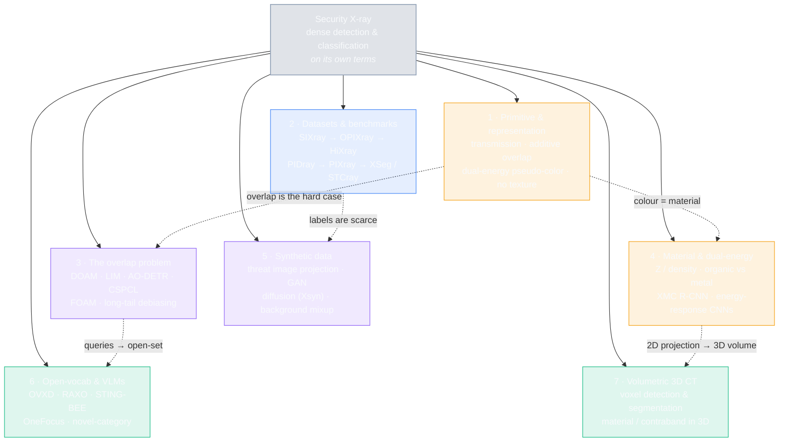
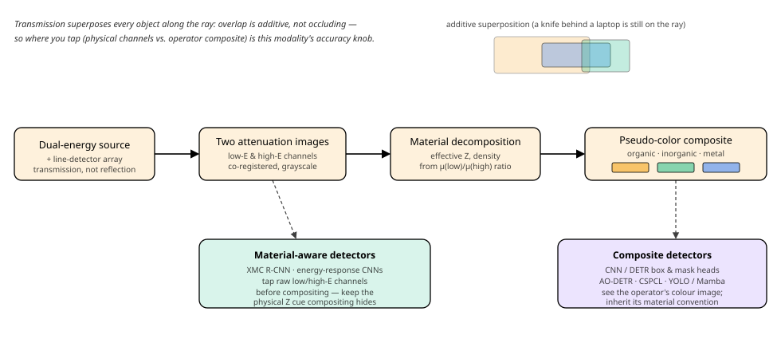

# Dense Object Detection & Classification — Recent Advances

*Compiled 2026-Jul-05 (America/Los_Angeles).*

Next installment in the running CV-updates log. Earlier entries on
`main`:
[Apr-30](../2026-Apr-30/2026-Apr-30_CV_updates.md),
[May-01](../2026-May-01/2026-May-01_CV_updates.md),
[May-02](../2026-May-02/2026-May-02_CV_updates.md),
[May-04](../2026-May-04/2026-May-04_CV_updates.md),
[May-05](../2026-May-05/2026-May-05_CV_updates.md),
[May-07](../2026-May-07/2026-May-07_CV_updates.md),
[May-08](../2026-May-08/2026-May-08_CV_updates.md),
[May-15](../2026-May-15/2026-May-15_CV_updates.md),
[May-16](../2026-May-16/2026-May-16_CV_updates.md),
[May-17](../2026-May-17/2026-May-17_CV_updates.md),
[Jun-09](../2026-Jun-09/2026-Jun-09_CV_updates.md),
[Jun-10](../2026-Jun-10/2026-Jun-10_CV_updates.md),
[Jun-12](../2026-Jun-12/2026-Jun-12_CV_updates.md),
[Jun-15](../2026-Jun-15/2026-Jun-15_CV_updates.md),
[Jun-16](../2026-Jun-16/2026-Jun-16_CV_updates.md),
[Jun-17](../2026-Jun-17/2026-Jun-17_CV_updates.md),
[Jun-19](../2026-Jun-19/2026-Jun-19_CV_updates.md),
[Jun-21](../2026-Jun-21/2026-Jun-21_CV_updates.md),
[Jun-22](../2026-Jun-22/2026-Jun-22_CV_updates.md),
[Jun-23](../2026-Jun-23/2026-Jun-23_CV_updates.md),
[Jun-24](../2026-Jun-24/2026-Jun-24_CV_updates.md),
[Jun-25](../2026-Jun-25/2026-Jun-25_CV_updates.md),
[Jun-27](../2026-Jun-27/2026-Jun-27_CV_updates.md),
[Jun-29](../2026-Jun-29/2026-Jun-29_CV_updates.md),
[Jun-30](../2026-Jun-30/2026-Jun-30_CV_updates.md),
[Jul-04](../2026-Jul-04/2026-Jul-04_CV_updates.md).

## Why this pass: security X-ray as its own primitive

The last six passes worked sensor primitives **on their own terms** —
camera-3D / occupancy ([Jun-24](../2026-Jun-24/2026-Jun-24_CV_updates.md)),
remote-sensing spectra ([Jun-25](../2026-Jun-25/2026-Jun-25_CV_updates.md)),
the LiDAR point cloud ([Jun-27](../2026-Jun-27/2026-Jun-27_CV_updates.md)),
the event camera ([Jun-29](../2026-Jun-29/2026-Jun-29_CV_updates.md)),
thermal infrared ([Jun-30](../2026-Jun-30/2026-Jun-30_CV_updates.md)), and
imaging radar ([Jul-04](../2026-Jul-04/2026-Jul-04_CV_updates.md)). Every one
of those is a sensor that *reflects* or *emits* — the ray bounces off a
surface, or the surface radiates, and the geometry you recover is the geometry
of a **skin**. **Security X-ray is the one dense-detection modality where the
ray goes *through*.** It has appeared in the log only as one row in the
multi-domain surveys ([May-05](../2026-May-05/2026-May-05_CV_updates.md)'s
"multi-modal fusion" section, the vertical-application tours of
[Jun-15](../2026-Jun-15/2026-Jun-15_CV_updates.md) /
[Jun-16](../2026-Jun-16/2026-Jun-16_CV_updates.md)) — never opened up. That
buries the fact that **baggage X-ray is its own dense-detection field** with a
decade of purpose-built datasets, its own leaderboards, and a 2024–26
literature that has just pivoted twice: first to DETR-family detectors built
specifically for *overlap*, then to vision-language models built for
*open-vocabulary threats*. This entry works it on its own terms.

It earns its own pass because the transmission X-ray image is a genuinely
different primitive from every sensor covered so far:

- **Objects superpose; they do not occlude.** In an RGB or thermal image, a
  knife behind a laptop is *gone* — the laptop's surface is opaque. In a
  transmission X-ray, the knife is **still on the ray**: its attenuation adds
  to the laptop's. Overlap here is **additive, not occluding**. That inverts
  the usual detector intuition — the signal you need is not hidden, it is
  *summed into* a cluttered pixel, and the whole subfield of "de-occlusion"
  and "anti-overlapping" attention exists to *un-mix* it rather than to guess
  behind an opaque edge.
- **Colour encodes material, not appearance.** A dual-energy scanner takes two
  attenuation images (a low- and a high-energy channel); their ratio estimates
  **effective atomic number and density**, which is rendered as the
  now-universal **orange = organic, green = inorganic, blue = metal**
  pseudo-color the operator sees. The "colour" of an object is a *physical
  measurement*, not a reflectance — a cue no natural-image detector has, and
  one that compositing can *throw away* before the detector ever sees it.
- **There is almost no texture and no fixed pose.** Contents are dumped into a
  bag at arbitrary 3-D orientation and imaged in projection, so a pistol can
  arrive at any angle, folded, or nested inside a hair-dryer. Shape priors that
  work on upright pedestrians collapse; the field leans hard on **edges,
  boundaries, and material** instead of texture.
- **Positives are vanishingly rare and long-tailed.** [SIXray][sixray] is ~1M
  images with **<1%** carrying any prohibited item; real threat categories
  (detonators, specific blades) are rarer still. This is a **needle-in-clutter
  detection regime** where the base rate, not the model, is often the binding
  constraint — and it drives an unusually large synthetic-data subfield.

Everything downstream — the datasets, the anti-overlap DETRs, the
material-aware heads, the diffusion augmentation, the open-vocabulary VLMs, the
3-D CT extension — is a response to those four facts. The map:

## Topic map

A standalone SVG version of this map is at
[`assets/topic-map.svg`](assets/topic-map.svg), and the dual-energy pipeline —
showing where the two detector families tap the chain — is at
[`assets/xray-pipeline.svg`](assets/xray-pipeline.svg).

## 1 · The primitive & representation — why transmission forces different choices

The image-formation model is the root of everything. A source fires X-rays
through the bag onto a line-detector array; each pixel measures the
*line integral* of attenuation along the ray (Beer–Lambert). Two consequences
drive the whole field:

- **Dual-energy → material, not just density.** Modern checkpoint scanners
  read out **two spectra** (a low- and a high-energy image). Because the
  attenuation coefficient's energy dependence is a function of atomic number
  *Z*, the ratio of the two channels separates **organic (low Z, orange),
  inorganic/mixed (green), and metallic (high Z, blue)** materials — the colour
  convention every human screener is trained on and the reason a plastic-cased
  threat still "lights up" differently from clothing. Surveys of the physics
  and of dual-energy material decomposition
  ([Signal, Image & Video Processing 2021][mscnn]; the energy-response study
  [arXiv 2108.12505][energyresp]) show that **which representation you feed the
  detector — the operator's RGB composite, the raw two channels, or an explicit
  *Z*/density map — is itself a design decision** with measurable accuracy
  consequences.

- **Additive overlap is the signature hard case.** Because attenuation *sums*
  along the ray, cluttered bags produce pixels that are mixtures of many
  objects. This is why the field's flagship papers are organized around
  *overlap* rather than around scale or small-object size (the axes that
  dominate natural-image detection). The de-occlusion / anti-overlapping
  methods in §3 are the direct answer to this primitive.

The pipeline diagram above makes the fork explicit: **composite detectors**
(the vast majority — YOLO/DETR heads on the pseudo-color image) inherit
whatever the scanner's colour mapping decided, while **material-aware
detectors** tap the raw energy channels *before* compositing to keep the
physical cue. The two comprehensive 2024–25 surveys frame the same taxonomy —
the Springer *IJMIR* survey **"Advancements in machine learning techniques for
threat item detection in X-ray images"** ([2024][survey1]) and the arXiv
comparative evaluation **"Illicit object detection in X-ray imaging using deep
learning techniques"** ([2025, arXiv 2507.17508][survey2]) — and both flag
occlusion, class imbalance, and cross-scanner domain shift as the three
recurring walls. A continually-maintained paper/dataset index lives at the
[NeelBhowmik/xray][ghlist] GitHub list.

## 2 · Datasets & benchmarks — the SIXray→XSeg arc

Unlike natural-image detection, this field is **dataset-gated**: threat imagery
is sensitive, so the public benchmarks *are* the field, and each new one
targets a specific weakness of the last.

| Dataset | Scale | What it added | Link |
|---|---|---|---|
| **GDXray** (2015) | ~19.4k grayscale | first public baggage set; single-energy, no colour | [MTAP][gdxray] |
| **SIXray** (2019) | **1.06M** images, <1% positive, 6 classes | *scale* + the **overlap** framing; class-imbalance realism | [arXiv 1901.00303][sixray] |
| **OPIXray** (2020) | 8.9k, 5 cutter classes | *occlusion* as an explicit axis (3 occlusion levels) + DOAM | [arXiv 2004.08656][opixray] |
| **HiXray** (2021) | **102.9k**, 8 classes | *high-quality* real airport data + Lateral Inhibition Module | [arXiv 2108.09917][hixray] |
| **PIDray** (2021) | 47.7k scans, 12 classes | a **deliberately-hidden** subset (adversarial concealment) | [arXiv 2211.10763][pidray] |
| **CLCXray** (2022) | 9.6k (real + simulated), 12 classes | **cutters & liquid containers**; overlapping liquids | [IEEE TIP][clcxray] |
| **PIXray** (2022) | 5.0k, 15 classes | dense, tightly-packed items for **segmentation** | via [AO-DETR][aodetr] |
| **EDS** (2022) | 14.2k imgs, 10 classes, 3 scanners | **endogenous domain shift** — same items, different machines | [CVPR 2022][eds] |
| **STCray / STING-BEE** (2025) | **46.6k** image-caption pairs, 21 threats | first **multimodal** (vision-language) baggage set | [arXiv 2504.02823][stingbee] |
| **XSeg** (2026) | **98.6k** images, **295.9k** instance masks, 30 classes | largest **instance-segmentation** benchmark | [arXiv 2604.03706][xseg] |
| **MMXray / OneFocus** (2026) | **52.1k** image-caption pairs, 28 classes | VLM benchmark for VQA + localization | [arXiv 2606.15663][onefocus] |

Two arcs are visible. First, a **task escalation**: image-level → boxes
(SIXray/HiXray/PIDray) → pixel-accurate masks (PIXray → **XSeg's ~296k
masks**) → free-text understanding (STCray, MMXray). Second, a shift in what
"hard" means: SIXray made it *scale + imbalance*, OPIXray/HiXray made it
*overlap*, PIDray made it *adversarial concealment*, and EDS made it
*cross-scanner generalization* — the wall that now blocks deployment, since a
detector trained on one vendor's scanner degrades on another's colour mapping.
EDS names this **endogenous domain shift** (differences caused by the imaging
hardware itself, not the scene), and the domain-adaptation response has begun
to arrive — e.g. **ALDI-ray** ([arXiv 2512.02696][aldiray], 2025) adapts a
general detection-domain-adaptation framework specifically to security X-ray.
The 2025 **Dual-view** benchmark (CVPR 2025, [Tao et al.][dualview]) adds a
further axis: real checkpoints increasingly capture **two orthogonal views**,
and the paper asks whether a detector can fuse them the way a human operator
rotates a bag — a natural partial answer to additive overlap, since an object
buried on one projection is often clear on the other.

## 3 · The overlap problem — de-occlusion, anti-overlapping, and long tails

This is the modality's defining research thread, and it has moved from
*attention add-ons* to *DETR redesigns*.

**Attention-module era (plug-and-play).** The first wave bolted overlap-aware
attention onto existing detectors:

- **DOAM** (De-Occlusion Attention Module, with OPIXray, [arXiv 2004.08656][opixray])
  fuses edge and material appearance to generate an attention map that
  sharpens the detector's features on occluded prohibited items — a
  general-purpose module droppable into SSD/FCOS/etc.
- **LIM** (Lateral Inhibition Module, with HiXray, [arXiv 2108.09917][hixray])
  is biologically motivated: a **Bidirectional Propagation** sub-module
  suppresses noisy neighbouring activations and a **Boundary Activation**
  sub-module reinforces the item's boundary from four directions — the human
  trick of ignoring clutter and locking onto identifiable edges.

**DETR era (architecture-level).** The 2024–26 wave rebuilds the detector's
*query mechanism* around overlap:

- **AO-DETR** (Anti-Overlapping DETR, [arXiv 2403.04309][aodetr], IEEE TNNLS
  2024) builds on DINO with two ideas: **Category-Specific one-to-one
  Assignment (CSA)** pins object queries to fixed categories so each query
  learns to pull *its* item out of an additive mixture, and **Look-Forward
  Densely (LFD)** stabilizes reference-box localization across decoder layers
  against blurred overlapping edges. It reports **+15.2 AP₅₀ on PIXray** and
  **+1.5 AP₅₀ on PIDray** over the prior best *(figures per the paper)*.
- **CSPCL** (Category Semantic Prior Contrastive Learning,
  [arXiv 2501.16665][cspcl], 2025) aligns Deformable-DETR content queries with
  a **class semantic prior**, correcting the query-to-category drift that
  overlap induces — a contrastive complement to CSA.
- **FOAM** (Frequency-Optimized Anti-overlapping,
  [arXiv 2506.13501][foam], 2025) attacks overlap in the **frequency domain**,
  arguing that additively-summed objects separate more cleanly in spectral
  bands than in RGB space — a general "overlapping object perception"
  framework, not X-ray-only.
- **GADet** ([geometry-aware detector][gadet]) and the segmentation-side
  **Dense De-overlap Attention Snake** (with PIXray) round out the toolbox for
  boundary-precise separation.

**The long tail underneath.** Overlap co-occurs with extreme class imbalance,
so a parallel thread debiases the head directly: **PAD-F** (Prior-Aware
Debiasing Framework for long-tailed X-ray detection,
[arXiv 2411.18078][padf], with an "X-ray-specific augmentation + contextual
feature integration" v2) rebalances rare-threat gradients, and
weakly/semi-supervised approaches such as **BCR-Net** (Boundary-Category
Refinement with *point* supervision, [arXiv 2412.18918][bcrnet]) cut the
annotation cost that makes rare classes scarce in the first place — the same
"box → point" annotation-cost collapse the
[Jun-25](../2026-Jun-25/2026-Jun-25_CV_updates.md) remote-sensing pass tracked,
now arriving in security X-ray.

## 4 · Material & dual-energy detection — using the cue only this modality has

Most detectors throw away the physics by consuming the operator's RGB
composite. A smaller, distinctive thread keeps it:

- **Material-classifier detection.** **XMC R-CNN** (X-ray Material Classifier
  R-CNN) couples a Faster-R-CNN detector with a **material-classification
  branch** and an **organic/inorganic stripping** step, so detection is
  conditioned on estimated material rather than colour alone — directly useful
  when a threat and its clutter share an apparent hue but differ in *Z*.
  Multi-scale-CNN material classification on dual-energy devices
  ([SIViP 2021][mscnn]) and robust cross-device material classification
  studies show the same lesson: material is a *stabler* label than colour
  across scanners.
- **Energy-response as input.** "On the impact of using X-ray energy response
  imagery for object detection via CNNs" ([arXiv 2108.12505][energyresp])
  quantifies what the composite discards — feeding a CNN the **raw
  low/high-energy response** instead of (or alongside) the pseudo-color image
  changes detection accuracy, making representation choice a first-class knob
  rather than a preprocessing afterthought.
- **Cross-modal synthesis between energies.** "Cross-Modal Image Synthesis
  within Dual-Energy X-ray Security Imagery" ([CVPRW 2022][crossmodal],
  Isaac-Medina et al.) learns to translate between the low- and high-energy
  channels — both a data-efficiency tool (recover a missing channel) and a
  probe of how much material information each channel actually carries.

This is the thread most specific to the primitive: no camera, LiDAR, radar,
event, or thermal sensor covered in this series delivers a *per-pixel material*
estimate for free, and the open question is whether the VLMs in §6 should be
grounded on that physical channel rather than on the operator RGB they
currently ingest.

## 5 · Synthetic data — because positives are rare and sensitive

With <1% positive rates and privacy-restricted collection, **synthetic threat
imagery is not a nicety here — it is core infrastructure.** Three generations:

- **Threat Image Projection (TIP).** The classic, still-deployed approach:
  composite a segmented threat onto a real benign bag using
  attenuation-consistent (multiplicative, log-domain) fusion so the insertion
  obeys the additive-overlap physics. TIP is the operationally-trusted baseline
  because it preserves real backgrounds.
- **GAN-based synthesis** enriches *foreground* diversity — generating threats
  in novel poses/shapes ([Optoelectronics Letters 2020][ganaug]) — addressing
  TIP's limitation that it can only re-use threats you already have.
- **Diffusion / text-to-image (2025–26).** The current frontier. **Xsyn**
  ("Taming Generative Synthetic Data for X-ray Prohibited Item Detection",
  [arXiv 2511.15299][xsyn]) is a one-stage text-to-image pipeline with a
  **Cross-Attention Refinement (CAR)** step that reads the diffusion model's
  own cross-attention maps to *auto-refine bounding-box labels* on generated
  images, and a **Background Occlusion Modeling (BOM)** step that injects
  realistic clutter in latent space — synthesizing not just the threat but the
  *overlap* that makes it hard. **BGM** (Background Mixup,
  [arXiv 2412.00460][bgm], 2024) is a lighter-weight cousin: an X-ray-specific
  mixup that respects the log-attenuation domain instead of naive pixel
  averaging.

The through-line: each generation targets a different scarcity — TIP fixes
*background* realism, GANs fix *foreground* diversity, diffusion+CAR/BOM fixes
*label cost and overlap realism together* — and the 2025–26 work is measured by
downstream detector mAP, not by image fidelity.

## 6 · Open-vocabulary & vision-language models — the 2025–26 pivot

The largest recent shift mirrors the rest of computer vision but hits a hard
**modality gap**: CLIP was pretrained on natural images, and dropping it onto
X-ray collapses. The responses split into three strategies.

- **Fine-tune CLIP into the X-ray domain.** **OVXD** (Open-Vocabulary X-ray
  Detection via fine-tuning CLIP, [arXiv 2406.10961][ovxd]) adapts CLIP's
  visual encoder so open-vocabulary detection works on *novel* prohibited
  categories beyond the base set — the first serious attempt to detect threats
  the detector was never trained on, essential because attackers invent new
  concealments faster than datasets update.
- **Training-free RGB→X-ray transfer.** **RAXO** ("Superpowering
  Open-Vocabulary Object Detectors for X-ray Vision",
  [arXiv 2503.17071][raxo], ICCV 2025) needs **no X-ray training**: it builds
  class descriptors from **web-retrieved RGB images** and passes them through a
  novel **X-ray material-transfer** step to bridge the modality gap, lifting
  off-the-shelf OvOD detectors by **up to +17.0 mAP** *(paper figures)*. It is
  the cleanest statement that the material physics of §4 is exactly what the
  transfer must model. [Code][raxocode] is public.
- **Full vision-language models.** **STING-BEE** (CVPR 2025,
  [arXiv 2504.02823][stingbee]) is the first baggage-security VLM — trained on
  the STCray captions, it does scene comprehension, **referring threat
  localization**, visual grounding, and VQA, and is pitched at generalizing to
  unseen threats and scanners. **OneFocus** ("Enabling Real-World X-ray
  Security Screening with a Unified VLM", [arXiv 2606.15663][onefocus], 2026)
  unifies VQA + localization + classification + image understanding on the
  MMXray benchmark, reporting SOTA cross-domain generalization. Alongside,
  dedicated **novel-category detection** work for real-world inspection
  ([Engineering Applications of AI 2025][novelcat]) tackles the same open-set
  problem from the closed-set side.

The tension worth watching: VLMs currently ingest the **operator RGB
composite**, i.e. they inherit the colour convention and *discard the raw
material channel* the §4 thread fought to keep. Grounding an X-ray VLM on
dual-energy *Z*/density rather than pseudo-color is the obvious un-taken step.

## 7 · Beyond the 2-D projection — volumetric 3-D CT screening

Checkpoint hardware is itself moving from single-view projection to
**reconstructed 3-D CT** (the same machines that let travellers leave laptops
and liquids in the bag), which changes the detection primitive again: from a
line-integral projection to a **voxel volume** where objects no longer
superpose. The Durham/Breckon line established the baselines —
**classification & detection in volumetric 3-D CT** ([arXiv 2003.12625][ct1]),
**multi-class 3-D object detection** with 3-D RetinaNet/Faster-R-CNN
([arXiv 2008.01218][ct2]), and **contraband *materials* detection in 3-D CT**
([arXiv 2012.11753][ct3]) — plus a two-stage *segment-then-classify* pipeline
that first splits the volume by material-intensity band, then uses shape
descriptors to decide whether a segment is a clean single object. 3-D CT
trades the additive-overlap problem for **cost**: volumes are huge, annotation
is even scarcer than in 2-D, and the synthetic-data thread of §5 becomes
correspondingly more important. It is the clearest example of the field's
recurring pattern — *when the sensor changes, the hard case moves but does not
disappear.*

## Cross-cutting theme: the same escapes, on a see-through primitive

Read against the rest of this series, security X-ray is the modality that
inverts the field's core assumption and then recovers the *same* toolkit:

- **Occlusion → superposition.** Every other pass treats occlusion as
  *missing* information. X-ray makes it *summed* information — and the whole
  DOAM→LIM→AO-DETR→FOAM arc is machinery to *un-sum* it. The lesson generalizes
  back: additive mixtures may be a friendlier target than opaque occlusion.
- **Appearance → material.** The one cue no other sensor in this series
  provides for free is per-pixel *Z*. The field keeps re-discovering that
  **material is the stabler label than colour** — across scanners (EDS),
  across energies (cross-modal synthesis), and for open-vocabulary transfer
  (RAXO's material-transfer step is the crux of a training-free win).
- **Scarcity → synthesis.** With <1% positives and privacy locks, this field
  reached for **diffusion-generated labelled data** earlier and harder than
  most, and its 2025–26 methods (Xsyn's CAR/BOM) synthesize the *overlap*, not
  just the object — the same "generate the hard case, not the easy one"
  instinct showing up across the log.
- **Closed-set → open-vocabulary.** The DETR-query redesigns of §3 (queries
  pinned to categories) and the VLMs of §6 (free-text threats) are the same
  convergence toward language-grounded, open-set detection this series has
  tracked in every modality — arriving here under the unusually sharp pressure
  that *adversaries invent new concealments on purpose.*

The open frontier is the join of §4 and §6: an **open-vocabulary VLM grounded
on the dual-energy material channel** rather than the operator's RGB composite
— using the one physical cue this primitive uniquely provides to close the
modality gap the language models still stumble on.

## Sources & further reading

*This run's egress policy blocked direct `arxiv.org` / `thecvf` fetches
(HTTP 403), so arXiv IDs, venues and quoted numbers were corroborated across
multiple secondary search results (publisher pages, GitHub repos, dataset
pages, review sites) rather than page-verified. Numbers are quoted from each
method's own paper/abstract and **are not comparable across rows** (different
datasets, splits, and AP conventions). 2026 arXiv IDs (`2604`/`2606`) are
recent preprints; figures reachable only through secondary summaries are marked
*(paper figures)*.*

**Surveys & indices**
- ML for threat-item detection in X-ray — survey — [Springer IJMIR 2024][survey1]
- Illicit object detection in X-ray imaging: a comparative evaluation — [arXiv 2507.17508][survey2]
- Curated dataset/paper list — [NeelBhowmik/xray (GitHub)][ghlist]

**Datasets & benchmarks**
- GDXray — [MTAP 2015][gdxray]; SIXray — [arXiv 1901.00303][sixray]; OPIXray — [arXiv 2004.08656][opixray]; HiXray — [arXiv 2108.09917][hixray].
- PIDray — [arXiv 2211.10763][pidray]; CLCXray — [IEEE TIP][clcxray]; PIXray — via [AO-DETR][aodetr]; EDS (endpoint domain shift) — [CVPR 2022][eds].
- Dual-view X-ray — [CVPR 2025][dualview]; STCray (STING-BEE) — [arXiv 2504.02823][stingbee]; XSeg — [arXiv 2604.03706][xseg]; MMXray (OneFocus) — [arXiv 2606.15663][onefocus].
- Cross-scanner domain adaptation — ALDI-ray — [arXiv 2512.02696][aldiray].

**Overlap / de-occlusion / long-tail**
- DOAM — [arXiv 2004.08656][opixray]; LIM — [arXiv 2108.09917][hixray]; AO-DETR — [arXiv 2403.04309][aodetr]; CSPCL — [arXiv 2501.16665][cspcl].
- FOAM — [arXiv 2506.13501][foam]; GADet — [ResearchGate][gadet]; PAD-F — [arXiv 2411.18078][padf]; BCR-Net (point-supervised) — [arXiv 2412.18918][bcrnet].

**Material & dual-energy**
- Multi-scale-CNN material classification — [SIViP 2021][mscnn]; energy-response for detection — [arXiv 2108.12505][energyresp]; cross-modal dual-energy synthesis — [CVPRW 2022][crossmodal].

**Synthetic data**
- GAN augmentation — [Optoelectronics Letters 2020][ganaug]; Background Mixup (BGM) — [arXiv 2412.00460][bgm]; Xsyn (diffusion + CAR/BOM) — [arXiv 2511.15299][xsyn].

**Open-vocabulary & VLMs**
- OVXD (fine-tune CLIP) — [arXiv 2406.10961][ovxd]; RAXO (training-free) — [arXiv 2503.17071][raxo] · [code][raxocode]; STING-BEE — [arXiv 2504.02823][stingbee]; OneFocus — [arXiv 2606.15663][onefocus]; novel-category detection — [EAAI 2025][novelcat].

**Volumetric 3-D CT**
- 3-D CT classification/detection eval — [arXiv 2003.12625][ct1]; multi-class 3-D detection — [arXiv 2008.01218][ct2]; contraband materials in 3-D CT — [arXiv 2012.11753][ct3].

**Lightweight / real-time (edge deployment)**
- Real-time CNN detector (CSP-Darknet + SPP/PANet) — [Radiation Physics & Chemistry 2025][rtcnn]; Xray-YOLO-Mamba (selective state-space) — [Scientific Reports 2025][mamba].

[survey1]: https://link.springer.com/article/10.1007/s13735-024-00348-2
[survey2]: https://arxiv.org/abs/2507.17508
[ghlist]: https://github.com/NeelBhowmik/xray
[gdxray]: https://link.springer.com/article/10.1007/s10921-015-0315-7
[sixray]: https://arxiv.org/abs/1901.00303
[opixray]: https://arxiv.org/abs/2004.08656
[hixray]: https://arxiv.org/abs/2108.09917
[pidray]: https://arxiv.org/abs/2211.10763
[clcxray]: https://ieeexplore.ieee.org/document/9722843
[eds]: https://github.com/DIG-Beihang/PSN
[aldiray]: https://arxiv.org/abs/2512.02696
[dualview]: https://openaccess.thecvf.com/content/CVPR2025/papers/Tao_Dual-view_X-ray_Detection_Can_AI_Detect_Prohibited_Items_from_Dual-view_CVPR_2025_paper.pdf
[stingbee]: https://arxiv.org/abs/2504.02823
[xseg]: https://arxiv.org/abs/2604.03706
[onefocus]: https://arxiv.org/abs/2606.15663
[aodetr]: https://arxiv.org/abs/2403.04309
[cspcl]: https://arxiv.org/abs/2501.16665
[foam]: https://arxiv.org/abs/2506.13501
[gadet]: https://www.researchgate.net/publication/375729285_GADet_A_Geometry-Aware_X-ray_Prohibited_Items_Detector
[padf]: https://arxiv.org/abs/2411.18078
[bcrnet]: https://arxiv.org/abs/2412.18918
[mscnn]: https://link.springer.com/article/10.1007/s11760-021-01859-9
[energyresp]: https://arxiv.org/abs/2108.12505
[crossmodal]: https://openaccess.thecvf.com/content/CVPR2022W/PBVS/papers/Isaac-Medina_Cross-Modal_Image_Synthesis_Within_Dual-Energy_X-Ray_Security_Imagery_CVPRW_2022_paper.pdf
[ganaug]: https://link.springer.com/article/10.1007/s11801-020-9116-z
[bgm]: https://arxiv.org/abs/2412.00460
[xsyn]: https://arxiv.org/abs/2511.15299
[ovxd]: https://arxiv.org/abs/2406.10961
[raxo]: https://arxiv.org/abs/2503.17071
[raxocode]: https://github.com/PAGF188/RAXO
[novelcat]: https://www.sciencedirect.com/science/article/abs/pii/S0952197625001101
[ct1]: https://arxiv.org/abs/2003.12625
[ct2]: https://arxiv.org/abs/2008.01218
[ct3]: https://arxiv.org/abs/2012.11753
[rtcnn]: https://www.sciencedirect.com/science/article/abs/pii/S0969806X25001732
[mamba]: https://www.nature.com/articles/s41598-025-96035-1

---

### Diagram-rendering notes

- One **Mermaid** flowchart (topic map) plus two **standalone SVGs**
  ([`assets/topic-map.svg`](assets/topic-map.svg),
  [`assets/xray-pipeline.svg`](assets/xray-pipeline.svg)).
- No external image URLs — both SVGs are local files committed alongside this
  report and referenced by relative path.
- The SVGs use `currentColor` for strokes/text and **low-opacity RGBA** fills,
  and the Mermaid nodes pair saturated fills with light (`#f8fafc`) text — so
  every diagram stays legible in **light and dark** themes. The palette marks
  the X-ray primitive with **amber** (`#f59e0b`, echoing the dual-energy
  "organic" colour), distinct from the radar pass's cyan, the event pass's
  blue, and the thermal pass's warm red; material swatches in the pipeline use
  the operator convention (orange/green/blue = organic/inorganic/metal).
- Numbers are quoted from each method's own paper / abstract / dataset page and
  **are not comparable across rows** (different datasets, splits and AP
  conventions). This run's egress policy blocked direct `arxiv.org` / `thecvf`
  / publisher fetches (HTTP 403), so IDs, venues and figures were corroborated
  via multiple secondary search results (publisher pages, GitHub repos, dataset
  pages); figures reachable only through secondary summaries are flagged
  *(paper figures)*, and 2026 (`2604`/`2606`) arXiv IDs are recent preprints
  not page-verified this run.
