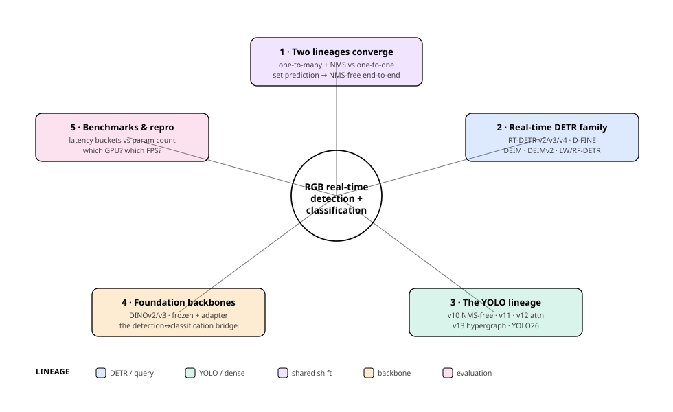
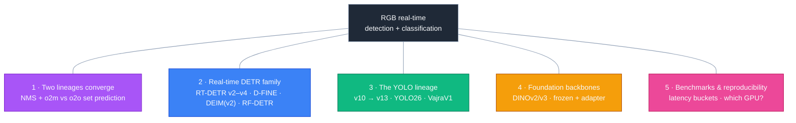
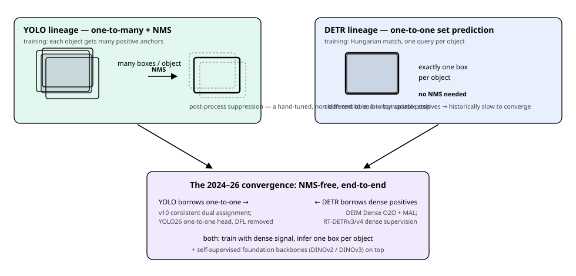
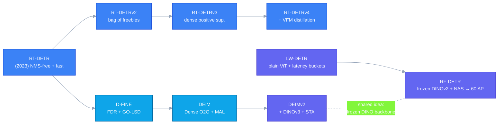
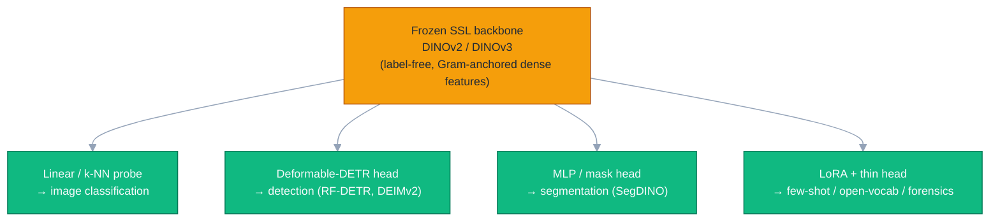

# Dense Object Detection & Classification — Recent Advances

*Compiled 2026-Jul-06 (America/Los_Angeles).*

Next installment in the running CV-updates log. Earlier entries on
`main`:
[Apr-30](../2026-Apr-30/2026-Apr-30_CV_updates.md),
[May-01](../2026-May-01/2026-May-01_CV_updates.md),
[May-02](../2026-May-02/2026-May-02_CV_updates.md),
[May-04](../2026-May-04/2026-May-04_CV_updates.md),
[May-05](../2026-May-05/2026-May-05_CV_updates.md),
[May-07](../2026-May-07/2026-May-07_CV_updates.md),
[May-08](../2026-May-08/2026-May-08_CV_updates.md),
[May-15](../2026-May-15/2026-May-15_CV_updates.md),
[May-16](../2026-May-16/2026-May-16_CV_updates.md),
[May-17](../2026-May-17/2026-May-17_CV_updates.md),
[Jun-09](../2026-Jun-09/2026-Jun-09_CV_updates.md),
[Jun-10](../2026-Jun-10/2026-Jun-10_CV_updates.md),
[Jun-12](../2026-Jun-12/2026-Jun-12_CV_updates.md),
[Jun-15](../2026-Jun-15/2026-Jun-15_CV_updates.md),
[Jun-16](../2026-Jun-16/2026-Jun-16_CV_updates.md),
[Jun-17](../2026-Jun-17/2026-Jun-17_CV_updates.md),
[Jun-19](../2026-Jun-19/2026-Jun-19_CV_updates.md),
[Jun-21](../2026-Jun-21/2026-Jun-21_CV_updates.md),
[Jun-22](../2026-Jun-22/2026-Jun-22_CV_updates.md),
[Jun-23](../2026-Jun-23/2026-Jun-23_CV_updates.md),
[Jun-24](../2026-Jun-24/2026-Jun-24_CV_updates.md),
[Jun-25](../2026-Jun-25/2026-Jun-25_CV_updates.md),
[Jun-27](../2026-Jun-27/2026-Jun-27_CV_updates.md),
[Jun-29](../2026-Jun-29/2026-Jun-29_CV_updates.md),
[Jun-30](../2026-Jun-30/2026-Jun-30_CV_updates.md),
[Jul-04](../2026-Jul-04/2026-Jul-04_CV_updates.md).

## Why this pass: back to the RGB real-time detector

The last two weeks worked one sensor primitive per pass **on its own terms** —
camera-3D / occupancy ([Jun-24](../2026-Jun-24/2026-Jun-24_CV_updates.md)),
remote sensing ([Jun-25](../2026-Jun-25/2026-Jun-25_CV_updates.md)),
the LiDAR point cloud ([Jun-27](../2026-Jun-27/2026-Jun-27_CV_updates.md)),
the event camera ([Jun-29](../2026-Jun-29/2026-Jun-29_CV_updates.md)),
thermal infrared ([Jun-30](../2026-Jun-30/2026-Jun-30_CV_updates.md)), and
imaging radar ([Jul-04](../2026-Jul-04/2026-Jul-04_CV_updates.md)). Every one
of those passes measured itself, implicitly, against the thing this pass is
about: **the plain RGB real-time detector.** It is the sensor everyone
actually has, the baseline every fusion stack starts from, and the piece of
the field with the most competitive churn — a new "beats-YOLO" preprint lands
almost weekly. The core has moved enough since it was last given a dedicated
pass (the training-recipe/plumbing entry on
[Jun-15](../2026-Jun-15/2026-Jun-15_CV_updates.md) and the open-vocab YOLOE
entry on [Jun-12](../2026-Jun-12/2026-Jun-12_CV_updates.md)) to deserve one on
its own terms.

The reason it moved is a single structural story: **the two lineages that owned
real-time detection for a decade are converging.** For years the split was
clean —

- **Dense one-stage detectors (the YOLO line).** Predict a box at (almost)
  every location, assign *many* positive anchors to each object during
  training, and clean up the resulting flood of overlapping boxes with
  **non-maximum suppression (NMS)** at inference. Fast, but the NMS step is
  hand-tuned, non-differentiable, breaks the "end-to-end" story, and makes
  latency depend on how crowded the scene is.
- **Query-based detectors (the DETR line).** Treat detection as **set
  prediction**: a fixed set of learned queries, a bipartite (Hungarian) match
  that assigns *exactly one* prediction to each object, and therefore **no NMS
  at all.** Clean and end-to-end, but the one-to-one match gives each image
  very few positive signals, so early DETRs were notoriously slow to train and
  too heavy to run in real time.

Since 2023 each side has been stealing the other's best idea, and by mid-2026
they have met in the middle. YOLO learned to be **NMS-free** — first
YOLOv10's consistent dual assignment, now the Ultralytics **YOLO26** release
that ships a one-to-one head as the default end-to-end path. DETR learned to
**supervise densely and converge fast** — DEIM's Dense O2O + Matchability-Aware
Loss, RT-DETR's hierarchical dense positive supervision — so a transformer
detector now trains in COCO-standard schedules and runs in real time. And
*both* families are now bolting on the same third ingredient: a **frozen
self-supervised foundation backbone** (DINOv2 / DINOv3) in place of a
trained-from-scratch CNN. That is the through-line of this pass.

Five threads:

1. **The two lineages & the NMS-free convergence** — label assignment,
   set prediction, and why "end-to-end" finally means it.
2. **The real-time DETR family** — RT-DETR → v2/v3/v4, D-FINE, DEIM, DEIMv2,
   LW-DETR, RF-DETR, and the efficient-encoder crowd.
3. **The YOLO lineage** — v10 through v13, YOLO26, and where "still a CNN"
   buys you.
4. **Foundation-model backbones & the detection↔classification bridge** —
   DINOv2/v3, the frozen-backbone-plus-adapter recipe, and what "classification"
   even means once the backbone is a universal feature extractor.
5. **Benchmarks & the reproducibility problem** — why the leaderboard is
   harder to read than it looks.

> **Reading the numbers.** Figures are quoted from each method's own paper,
> repo or leaderboard, and **are not comparable across rows**: COCO
> `AP` (a.k.a. mAP, AP@[.5:.95] on `val2017`) is the shared accuracy axis, but
> latency depends entirely on **GPU, precision and measurement harness** — an
> "ms" measured on a T4 at FP16/TensorRT/batch-1 is a different number from one
> measured on an A100 or with the NMS step included. Where a family reports its
> own latency I say on what hardware; treat every cross-family speed delta as
> indicative, not controlled. arXiv IDs encode submission month
> (`2410.xxxxx` = Oct 2024; `2606.xxxxx` = Jun 2026).
>
> **Verification note.** This run's egress policy allowed web *search* and
> fetches of **GitHub repositories**, but blocked direct `arxiv.org` and
> `arxiv.org/html` fetches (HTTP 403) — the same wall the
> [Jul-04](../2026-Jul-04/2026-Jul-04_CV_updates.md) pass hit. So numbers were
> cross-checked against authors' **GitHub READMEs**, Hugging Face paper pages,
> and multiple independent search snippets rather than the abstract PDFs.
> Figures pinned to a primary repo/README are stated plainly; figures from
> secondary summaries are flagged *(secondary)*. Two web searches returned
> transient "unavailable" errors mid-run and were retried; the notes below
> reflect the retried results. 2026 (`2601`–`2606`) arXiv IDs are real
> preprints not yet page-verified here.

## Topic map

## 1 · The two lineages & the NMS-free convergence

Everything below turns on one design choice: **how you assign ground-truth
objects to predictions during training**, and what that forces you to do at
inference.

- **One-to-many (o2m).** Give each object *many* positive predictions —
  every anchor/point with enough overlap. Rich supervision, fast convergence,
  but at inference you get a cloud of near-duplicate boxes per object and must
  run **NMS** to collapse them. This is classic YOLO / RetinaNet / FCOS.
- **One-to-one (o2o).** Give each object *exactly one* positive, chosen by a
  bipartite match (the Hungarian algorithm on a cost that blends class and box
  terms). No duplicates ⇒ **no NMS** ⇒ genuinely end-to-end. This is DETR. The
  price is *sparse supervision*: one positive per object per image is a weak
  training signal, historically fixed only by very long schedules.

The whole 2024–26 real-time-detector story is the collapse of that dichotomy
from both directions:

- **YOLO → o2o (becoming NMS-free).** **YOLOv10** (`2405.14458`,
  [repo](https://github.com/THU-MIG/yolov10)) introduced **consistent dual
  assignments**: a one-to-many head for rich training gradients *and* a
  one-to-one head that alone runs at inference, so the deployed model emits one
  box per object with **no NMS**. The Ultralytics **YOLO26** release
  (below) promotes this to the default: the head "enforces one-to-one label
  assignment during training … the model learns to emit exactly one prediction
  per ground-truth instance" — a genuinely NMS-free end-to-end YOLO.
- **DETR → dense positives (converging fast).** DEIM's **Dense O2O** keeps the
  one-to-one match (so still NMS-free) but *manufactures more objects per
  image* via copy-blend/mosaic-style augmentation, restoring the dense
  gradient that plain o2o throws away; RT-DETRv3's **hierarchical dense
  positive supervision** does the same in a different key. The result is a
  transformer that trains on COCO-standard budgets and beats YOLO on the
  speed-accuracy curve.

The two families now share a training recipe (dense signal → single-box
inference) and increasingly a backbone (DINO-family, thread 4). What still
differs is the neck/head — dense conv pyramids vs. deformable-attention
decoders — and that is what threads 2 and 3 are about.

## 2 · The real-time DETR family — the transformer side of the leaderboard

Since **RT-DETR** ("DETRs Beat YOLOs on Real-time Object Detection",
`2304.08069`, [repo](https://github.com/lyuwenyu/RT-DETR)) showed a query-based
detector could be *both* NMS-free and faster than a same-accuracy YOLO — via an
efficient hybrid encoder that decouples intra-scale attention from cross-scale
fusion, plus IoU-aware query selection — this branch has been the most active
part of the leaderboard.

**The RT-DETR mainline.**

- **RT-DETRv2** (`2407.17140`) — a "bag of freebies": selective multi-scale
  deformable sampling, discretised sampling points, and training tricks that
  lift accuracy with no inference cost.
- **RT-DETRv3** (`2409.08475`) — **hierarchical dense positive supervision**:
  auxiliary one-to-many branches during training to fix o2o's sparse-gradient
  problem, dropped at inference.
- **RT-DETRv4** (`2510.25257`, "Painlessly Furthering Real-Time Object
  Detection with Vision Foundation Models") — folds a **vision-foundation-model**
  teacher in via distillation. The paper reports RT-DETRv4 as best-in-class
  across scales; e.g. **RT-DETRv4-S at 49.7 AP** on COCO `val2017` *(secondary;
  paper table)*, benchmarked against YOLOv10–v13 and D-FINE/DEIM/DEIMv2.

**The localization-refinement branch — D-FINE.** **D-FINE** ("Redefine
Regression Task in DETRs as Fine-grained Distribution Refinement",
`2410.13842`, [repo](https://github.com/Peterande/D-FINE)) rethinks the box
*regression* itself. Instead of directly predicting four coordinates, its
**Fine-grained Distribution Refinement (FDR)** represents each of a box's four
edges as a probability distribution that is *iteratively refined* layer by
layer, and **Global Optimal Localization Self-Distillation (GO-LSD)** passes
the sharp final-layer distribution back to earlier layers as a self-distillation
target. Better-calibrated localization at no inference cost; D-FINE became the
regression backbone that DEIM then trains.

**The matching / convergence branch — DEIM → DEIMv2.**

- **DEIM** ("DETR with Improved Matching for Fast Convergence", CVPR 2025,
  [repo](https://github.com/Intellindust-AI-Lab/DEIM)) pairs **Dense O2O**
  (more positives per image via augmentation) with the **Matchability-Aware
  Loss (MAL)** that weights matches by quality. On COCO with the HGNetv2
  backbone the **DEIM-D-FINE** series (from the repo) runs:

  | DEIM-D-FINE | AP | Params | GFLOPs | Latency |
  |---|---|---|---|---|
  | N | 43.0 | 4 M | 7 | 2.12 ms |
  | S | 49.0 | 10 M | 25 | 3.49 ms |
  | M | 52.7 | 19 M | 57 | 5.62 ms |
  | L | 54.7 | 31 M | 91 | 8.07 ms |
  | X | 56.5 | 62 M | 202 | 12.89 ms |

  *(Latency per the repo's table; hardware/precision per repo. Not comparable
  to other families' ms.)*

- **DEIMv2** ("Real-Time Object Detection Meets DINOv3", `2509.20787`) is the
  branch's 2026 flagship and the clearest expression of the whole
  convergence: it swaps the CNN backbone for **DINOv3** (thread 4) reached
  through a lightweight **Spatial Tuning Adapter (STA)**, simplifies the
  decoder (SwishFFN + RMSNorm, query position embeddings shared across decoder
  layers), and spans **eight sizes, from X down to Atto**. The extremes make
  the point: **DEIMv2-Atto at ~0.49 M params reaches 23.8 AP** (320×320),
  while **DEIMv2-X reaches 57.8 AP with ~50 M params / 151 GFLOPs** — beating
  DEIM-X's 56.5 AP at *fewer* params and *lower* FLOPs *(secondary; paper +
  repo)*. A foundation-model backbone plus a thin adapter now dominates the
  Pareto front at both the tiny and the large end.

**The lightweight / frozen-backbone branch — LW-DETR & RF-DETR.**

- **LW-DETR** ("A Transformer Replacement to YOLO for Real-Time Detection",
  `2406.03459`) showed a *plain ViT* + a light decoder, trained well, matches
  or beats YOLO in the real-time regime — and introduced the practice of
  **grouping models into size buckets by latency, not parameter count** (the
  fair way to compare a param-heavy-but-fast ViT against a param-light CNN).
- **RF-DETR** (Roboflow, [repo](https://github.com/roboflow/rf-detr);
  NAS variant `2511.09554`) is the branch's headline result. It puts a
  **frozen/pretrained DINOv2 ViT** backbone under a Deformable-DETR-style
  head and (in the NAS paper) searches architectures under a shared weight
  space. From the repo's COCO table (NVIDIA **T4, TensorRT, FP16, batch 1**):

  | RF-DETR | AP | Latency | Params |
  |---|---|---|---|
  | N (nano) | 48.4 | 2.3 ms | 30.5 M |
  | S | 53.0 | 3.5 ms | 32.1 M |
  | M | 54.7 | 4.4 ms | 33.7 M |
  | L | 56.5 | 6.8 ms | 33.9 M |
  | XL | 58.6 | 11.5 ms | 126.4 M |
  | 2XL | 60.1 | 17.2 ms | 126.9 M |

  RF-DETR-2XL at **60.1 AP** is (per the repo) the first real-time detector to
  cross **60 AP on COCO**, and the family now ships **segmentation** heads
  (RF-Seg-2XL ~49.9 mask AP) and keypoints through one interface — the same
  "detector as a general dense-prediction head on a frozen backbone" idea as
  DEIMv2.
- **Le-DETR** ("Revisiting Real-Time Detection Transformer with Efficient
  Encoder Design", `2602.21010`) is the newest efficient-encoder entry,
  reporting **Le-DETR-M at +0.2 AP over DEIM-D-FINE-M** and **+0.4 AP over the
  L model at only +0.4 ms** *(secondary)* — evidence the encoder is still
  where latency is being shaved.

## 3 · The YOLO lineage — the convnet side, still winning on tiny + edge

YOLO did not go away; it absorbed the transformer's tricks while keeping the
CNN's edge-deployment advantages (INT8/TensorRT/NPU friendliness, no attention
memory blow-up). The 2024–26 arc:

- **YOLOv10** (THU, `2405.14458`) — the NMS-free pivot described in thread 1
  (consistent dual assignment) plus efficiency-driven design (lightweight
  classification head, rank-guided block design).
- **YOLOv11** (Ultralytics, 2024) — the productionised default: C3k2 blocks,
  the C2PSA partial-self-attention block, refined heads; strong
  accuracy/latency across N→X with the full Ultralytics tooling.
- **YOLOv12** ("Attention-Centric Real-Time Object Detectors", `2502.14740`) —
  brings attention *into* the YOLO backbone without wrecking latency via **area
  attention** (attention over pooled spatial regions) and residual efficient
  layer aggregation; the argument that YOLO could be attention-centric and
  still real-time.
- **YOLOv13** ("Hypergraph-Enhanced Adaptive Visual Perception", `2506.17733`,
  [repo](https://github.com/iMoonLab/yolov13)) — replaces pairwise feature
  interaction with **HyperACE**, an adaptive-correlation module built on a
  **hypergraph** (a hyperedge links *many* regions at once, capturing
  high-order cross-region/cross-scale structure), distributed through the
  network by a **FullPAD** ("full-pipeline aggregation-and-distribution")
  paradigm. Ablations: removing HyperACE costs 0.9 / 1.1 AP (AP / AP50), and
  restricting FullPAD's distribution points each costs a few tenths of AP —
  evidence both pieces matter.
- **YOLO26** (Ultralytics, 2026;
  overviews `2509.25164`, `2602.14582`, `2606.03748`, analysis `2601.12882`) —
  the current Ultralytics flagship and the most consequential release for
  practitioners. Its headline is **native NMS-free, end-to-end inference**
  (thread 1). Alongside that:
  - **DFL removed.** The head drops **Distribution Focal Loss**–based
    distributional box regression for "a lighter, hardware-friendly
    parameterization." Removing DFL alone costs ~0.6 AP on the YOLO11s
    baseline, "fully recovered by L1 supervision, STAL and backbone/neck
    refinement" — a deliberate accuracy-for-deployability trade, since DFL was
    a known pain point for INT8 export and NPU kernels.
  - **STAL + ProgLoss** — *small-target-aware label assignment* adjusts
    assignment priors/spatial tolerance so tiny/occluded/low-contrast objects
    get adequate supervision, and *progressive loss balancing* stabilises
    training; together they target the small-object recall that edge/aerial
    users care about.
  - **MuSGD optimizer** — an SGD/curvature-aware hybrid ("inspired by modern
    large-model training") for faster time-to-quality and fewer late-epoch
    oscillations.
- **VajraV1** (`2512.13834`) — an outside-the-Ultralytics entry billing itself
  as "the most accurate real-time object detector of the YOLO family"; worth
  watching but, like every "beats-YOLO" preprint, read against thread 5's
  caveats before believing the ranking.

The takeaway: at the **very small / very fast / must-run-on-an-NPU** end, the
YOLO CNNs — now NMS-free and with attention/hypergraph modules grafted on —
remain the pragmatic default; the DETRs take over as you climb toward higher
AP and can afford a ViT backbone.

## 4 · Foundation-model backbones & the detection↔classification bridge

The single biggest shift under both lineages is the **backbone**. The
trained-from-scratch (or ImageNet-classification-pretrained) CNN is being
displaced by a **frozen self-supervised Vision Transformer** that was never
trained on detection or even on labels at all.

**DINOv3** ("DINOv3", `2508.10104`, Meta) is the anchor. It is a self-supervised
ViT trained on **LVD-1689M** (~1.69 B images, no manual labels) whose defining
trick is **Gram anchoring** — a Gram-matrix regularizer that stops the *dense*
(patch-level) feature map from degrading over the long training schedules that
large SSL models need. The result is a frozen backbone whose **dense features**
are spatially sharp enough to drive segmentation and detection directly, not
just whole-image classification — the property DEIMv2 and RF-DETR exploit.

This is where **detection and classification stop being separate problems.**
The same frozen DINOv3/DINOv2 tower is:

- **an image classifier** — linear-probe or k-NN on the `[CLS]` token, the
  original DINO evaluation, still SOTA-competitive among label-free models;
- **a dense feature extractor** — patch features feed a detection decoder
  (DEIMv2's STA, RF-DETR's DINOv2 backbone), a segmentation head (SegDINO,
  DINOv3+MLP), a depth head, or a matcher;
- **a few-shot / open-vocabulary engine** — the same features, adapted with
  LoRA or a thin head, transfer to medical few-shot segmentation
  (`2601.08078`), image-forensics detection ("DINOv3 Beats Specialized
  Detectors", `2604.16083`), remote-sensing zero-training detection/segmentation
  (`2606.10769`), and more.

So the honest way to state the mid-2026 picture: **"classification" is now
mostly what the backbone does, and "detection" is a lightweight, swappable head
you attach to it.** The competitive action has moved from "which classification
CNN" to "which frozen SSL tower + which adapter + which assignment recipe." Both
lineages in threads 2–3 are, increasingly, just different heads on the same few
towers.

## 5 · Benchmarks & the reproducibility problem

The leaderboard is harder to read than the single "AP" column suggests, and the
2025–26 literature has started saying so out loud.

- **Latency is not a property of the model.** The same weights report very
  different "ms" depending on GPU (T4 vs A100 vs Jetson vs a laptop NPU),
  precision (FP32 / FP16 / INT8), runtime (PyTorch eager vs TensorRT vs ONNX),
  batch size, and — crucially — **whether NMS is inside or outside the timed
  region.** A YOLO with NMS excluded and a DETR (no NMS) are not measured on the
  same clock unless you are careful. RF-DETR's repo is unusually explicit (T4 /
  TensorRT / FP16 / batch 1); many preprints are not.
- **Param count is the wrong x-axis.** LW-DETR and RF-DETR argue for **latency
  buckets**: a 126 M-param RF-DETR-2XL that runs in 17 ms belongs in a
  different bucket than a 62 M-param DEIM-X, and comparing them by parameter
  count flatters the smaller-but-slower model. Read the Pareto curve
  (AP vs measured latency on *one* device), not a params table.
- **COCO `val` AP is saturating and noisy at the top.** The jump from ~56 to
  ~60 AP (RF-DETR-2XL) is real but small in absolute terms, and sensitive to
  test-time resolution, augmentation and the exact eval protocol; RF-DETR's NAS
  paper explicitly proposes a "simple standardized procedure" after finding
  inconsistencies in how competitors benchmark. Work like **COCO-FP**
  (`2409.07907`) further shows headline AP hides *background false-positive*
  behaviour that matters in deployment.
- **"Beats-YOLO" preprints need the caveat.** New entries (VajraV1, Le-DETR,
  the endless domain-specific `*-DETR` variants) frequently claim a fraction of
  an AP or a fraction of a millisecond over the incumbent. Those deltas are
  often within the noise of the measurement differences above. The robust
  signals are the *structural* ones — NMS-free heads, frozen SSL backbones,
  dense-o2o matching — not the third-decimal-place leaderboard order.

**Practical read for mid-2026.** If you need the smallest/fastest thing on an
NPU or a microcontroller-class edge device, start from the **YOLO** line
(YOLO26 / YOLOv13, NMS-free, INT8-friendly). If you can afford a ViT backbone
and want the top of the accuracy curve or a unified det/seg/pose head, start
from the **frozen-DINO DETRs** (RF-DETR, DEIMv2). Either way, the three
ingredients that actually move the needle are the same: **NMS-free end-to-end
inference, dense supervision of a one-to-one head, and a self-supervised
foundation backbone.**

## Sources

Primary repositories / pages consulted this run (GitHub + Hugging Face fetches
succeeded; arXiv PDFs/HTML were blocked and cross-checked via search snippets —
see the verification note):

- RT-DETR — "DETRs Beat YOLOs on Real-time Object Detection" (`2304.08069`); [repo](https://github.com/lyuwenyu/RT-DETR). RT-DETRv2 `2407.17140`; RT-DETRv3 `2409.08475`; RT-DETRv4 `2510.25257`.
- D-FINE — "Redefine Regression Task in DETRs as Fine-grained Distribution Refinement" (`2410.13842`); [repo](https://github.com/Peterande/D-FINE).
- DEIM — "DETR with Improved Matching for Fast Convergence" (CVPR 2025); [repo](https://github.com/Intellindust-AI-Lab/DEIM). Numbers from the repo's COCO table.
- DEIMv2 — "Real-Time Object Detection Meets DINOv3" (`2509.20787`); [HF paper page](https://huggingface.co/papers/2509.20787).
- LW-DETR — "A Transformer Replacement to YOLO for Real-Time Detection" (`2406.03459`).
- RF-DETR — Roboflow [repo](https://github.com/roboflow/rf-detr) (COCO + latency tables); NAS variant "RF-DETR: Neural Architecture Search for Real-Time Detection Transformers" (`2511.09554`).
- Le-DETR — "Revisiting Real-Time Detection Transformer with Efficient Encoder Design" (`2602.21010`).
- YOLOv10 — "Real-Time End-to-End Object Detection" (`2405.14458`); [repo](https://github.com/THU-MIG/yolov10).
- YOLOv12 — "Attention-Centric Real-Time Object Detectors" (`2502.14740`).
- YOLOv13 — "Hypergraph-Enhanced Adaptive Visual Perception" (`2506.17733`); [repo](https://github.com/iMoonLab/yolov13).
- YOLO26 (Ultralytics) — overviews/benchmarks `2509.25164`, `2602.14582`, `2606.03748`; "An Analysis of NMS-Free End to End Framework" `2601.12882`.
- VajraV1 — "The most accurate Real Time Object Detector of the YOLO family" (`2512.13834`).
- DINOv3 — "DINOv3" (`2508.10104`, Meta AI). Downstream: few-shot medical seg `2601.08078`; image forensics `2604.16083`; remote-sensing zero-training det/seg `2606.10769`.
- Benchmark methodology — COCO-FP "A Deep Dive into Background False Positives for COCO Detectors" (`2409.07907`); RF-DETR NAS paper's standardized-evaluation discussion.

---

*Generated as part of the running CV-updates log. Numbers are quoted from
primary repos/READMEs where reachable and from secondary summaries otherwise
(flagged inline); cross-family latency figures are not directly comparable —
see the reading/verification note near the top.*
