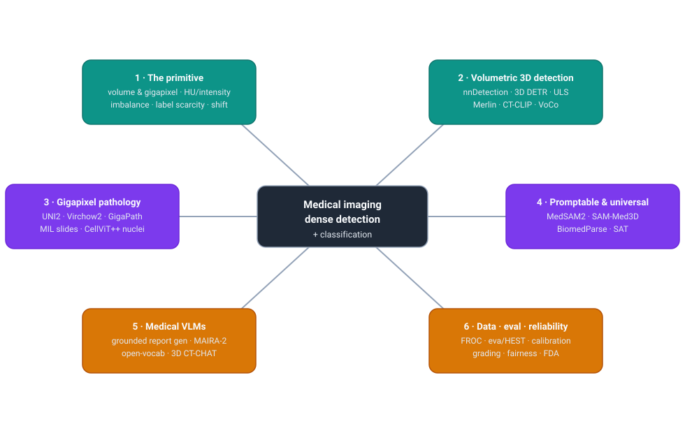
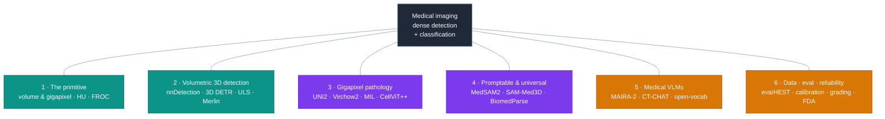
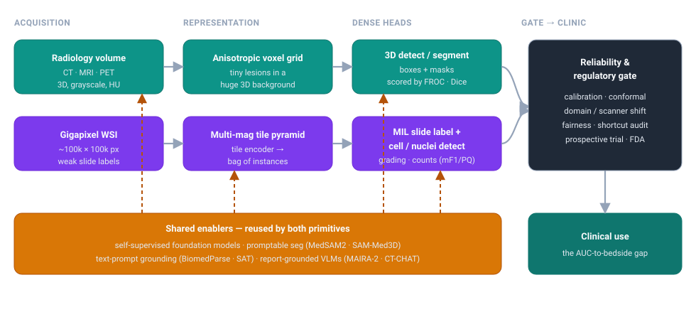

# Dense Object Detection & Classification — Recent Advances

*Compiled 2026-Jul-07 (America/Los_Angeles).*

Next installment in the running CV-updates log. Earlier entries on
`main`:
[Apr-30](../2026-Apr-30/2026-Apr-30_CV_updates.md),
[May-01](../2026-May-01/2026-May-01_CV_updates.md),
[May-02](../2026-May-02/2026-May-02_CV_updates.md),
[May-04](../2026-May-04/2026-May-04_CV_updates.md),
[May-05](../2026-May-05/2026-May-05_CV_updates.md),
[May-07](../2026-May-07/2026-May-07_CV_updates.md),
[May-08](../2026-May-08/2026-May-08_CV_updates.md),
[May-15](../2026-May-15/2026-May-15_CV_updates.md),
[May-16](../2026-May-16/2026-May-16_CV_updates.md),
[May-17](../2026-May-17/2026-May-17_CV_updates.md),
[Jun-09](../2026-Jun-09/2026-Jun-09_CV_updates.md),
[Jun-10](../2026-Jun-10/2026-Jun-10_CV_updates.md),
[Jun-12](../2026-Jun-12/2026-Jun-12_CV_updates.md),
[Jun-15](../2026-Jun-15/2026-Jun-15_CV_updates.md),
[Jun-16](../2026-Jun-16/2026-Jun-16_CV_updates.md),
[Jun-17](../2026-Jun-17/2026-Jun-17_CV_updates.md),
[Jun-19](../2026-Jun-19/2026-Jun-19_CV_updates.md),
[Jun-21](../2026-Jun-21/2026-Jun-21_CV_updates.md),
[Jun-22](../2026-Jun-22/2026-Jun-22_CV_updates.md),
[Jun-23](../2026-Jun-23/2026-Jun-23_CV_updates.md),
[Jun-24](../2026-Jun-24/2026-Jun-24_CV_updates.md),
[Jun-25](../2026-Jun-25/2026-Jun-25_CV_updates.md),
[Jun-27](../2026-Jun-27/2026-Jun-27_CV_updates.md),
[Jun-29](../2026-Jun-29/2026-Jun-29_CV_updates.md),
[Jun-30](../2026-Jun-30/2026-Jun-30_CV_updates.md),
[Jul-04](../2026-Jul-04/2026-Jul-04_CV_updates.md).

## Why this pass: medical imaging as its own primitive

The last six passes worked **sensor primitives on their own terms** —
camera-3D / occupancy ([Jun-24](../2026-Jun-24/2026-Jun-24_CV_updates.md)),
remote-sensing spectra ([Jun-25](../2026-Jun-25/2026-Jun-25_CV_updates.md)),
the LiDAR point cloud ([Jun-27](../2026-Jun-27/2026-Jun-27_CV_updates.md)),
the event camera ([Jun-29](../2026-Jun-29/2026-Jun-29_CV_updates.md)),
thermal infrared ([Jun-30](../2026-Jun-30/2026-Jun-30_CV_updates.md)) and
imaging radar ([Jul-04](../2026-Jul-04/2026-Jul-04_CV_updates.md)). Those were
all the *outdoor / autonomy* sensor stack. **Medical imaging** is the other
great dense-vision domain, and the log has only ever touched it in narrow
slices — pathology gigapixel MIL
([May-05 §7](../2026-May-05/2026-May-05_CV_updates.md)), DETR-family lesion
detection ([May-04 §9](../2026-May-04/2026-May-04_CV_updates.md)), polyp /
endoscopy ([Jun-09 §9](../2026-Jun-09/2026-Jun-09_CV_updates.md)), microscopy
cell/particle detection ([May-17 §13](../2026-May-17/2026-May-17_CV_updates.md))
and infrared small-target ([Jun-09 §8](../2026-Jun-09/2026-Jun-09_CV_updates.md)).
Never a pass that takes the modality *whole*. This entry does — radiology
**and** pathology, detection **and** classification, on their own terms.

It earns a dedicated pass because the medical image is a genuinely different
primitive from every sensor covered so far:

- **The data is volumetric or gigapixel — rarely a tidy 2-D frame.** A CT or
  MRI study is a 3-D volume of hundreds of anisotropic slices; a pathology
  slide is a **~100,000 × 100,000-pixel** multi-magnification pyramid. Neither
  fits a natural-image detector without a decision about *how to carve the
  data down* — 3-D patches vs 2.5-D slices for radiology, tile-and-aggregate
  (multiple-instance learning) for pathology. That carving is the field's
  version of the representation fork every sensor pass has had.
- **Intensity carries physical meaning, and there is no colour.** A CT voxel
  is a calibrated **Hounsfield unit** (a tissue-density measurement); an MR
  voxel's value depends on the pulse sequence; a stained slide's colour is a
  chemical, not a semantic, cue. Windowing, normalisation and stain
  augmentation matter more than any RGB trick.
- **The target is a needle in a haystack, and the cost of missing it is
  asymmetric.** A lung nodule or a mitotic figure occupies a vanishing
  fraction of the volume/slide, so **foreground/background imbalance is
  extreme**, and a missed detection is a missed cancer. This is why radiology
  scores detection with **FROC** (sensitivity at fixed false-positives-per-scan),
  not mAP — the operating point *is* the deliverable.
- **Labels are scarce, expensive and expert.** There is no medical ImageNet an
  intern can annotate; ground truth needs a radiologist or pathologist, often
  with pathology/genomic confirmation. So the whole 2024–26 story is
  **self-supervised foundation models, weak/report supervision, and promptable
  models** that route around the label bottleneck.
- **Distribution shift and safety are first-class, not afterthoughts.**
  Scanner, stain, site and demographic shift break models that look perfect
  in-distribution; **calibration, uncertainty, fairness and regulatory
  clearance** sit between a benchmark AUC and a bedside deployment. No AV
  sensor pass had a literal FDA gate.

This pass covers six threads of that stack:

1. **The primitive & representation** — volume vs gigapixel, HU/intensity,
   imbalance, the label bottleneck, and why the metric is FROC not mAP.
2. **Volumetric 3-D detection in radiology** — the self-configuring detectors,
   3-D DETRs, universal lesion detection, and the 3-D radiology foundation
   models (Merlin, CT-CLIP/CT-RATE, VoCo, head-CT) now feeding them.
3. **Gigapixel pathology** — tile and slide foundation models, MIL, and the
   cell/nuclei *dense-detection* core.
4. **Promptable & universal medical models** — MedSAM2, SAM-Med3D, BiomedParse,
   SAT, and detection reframed as promptable segmentation.
5. **Medical VLMs & report-grounded detection** — grounded report generation,
   open-vocabulary medical detection, and 3-D medical chat models.
6. **Datasets, benchmarks, reliability & the classification side** — FROC vs
   mAP, foundation-model eval harnesses, calibration/conformal/fairness, and
   disease *grading* as fine-grained classification.

> **Reading the numbers.** Figures are quoted from each method's own paper,
> repo, leaderboard or challenge page. **Protocols differ and are not
> comparable across rows.** Radiology detection reports **FROC / sensitivity
> at N false-positives per scan** or **AUROC**; segmentation reports **Dice /
> NSD**; pathology tile models report **balanced accuracy / AUROC** on linear
> probes, slide models report **AUROC / C-index**, and cell detection reports
> **detection-F1 / panoptic-quality (PQ) / mPQ**. Treat every cross-row delta
> as indicative, not controlled. arXiv IDs encode submission month
> (`2408.xxxxx` = Aug 2024; `2606.xxxxx` = Jun 2026).
>
> **Verification note.** This run's egress policy allowed web *search* and
> fetches of **GitHub / project pages**, but direct fetches of `arxiv.org`,
> `nature.com`, `openaccess.thecvf.com` and PMC frequently returned HTTP 403.
> So arXiv IDs, venues and most numbers were cross-checked against authors'
> **GitHub READMEs**, model cards, challenge leaderboards and multiple
> independent search snippets rather than the abstract PDFs. Numbers pinned to
> a primary repo/card are stated plainly; figures available only via secondary
> summaries are flagged *(secondary)* or *(unverified)*. 2026 (`2601`–`2606`)
> arXiv IDs are real preprints not yet page-verified.

## Topic map

## 1 · The primitive & representation — why the medical image forces different choices

There is no single signal chain here the way radar had one; instead there are
**two dominant data primitives**, and the first design decision is which one you
are in and how you carve it down.

- **The radiology volume.** A CT/MRI/PET study is a stack of hundreds of
  **anisotropic** slices (in-plane resolution ≪ slice thickness), and findings
  live in 3-D context — adjacent slices materially change a call. Detectors are
  natively 3-D (MULAN fused 27 slices; Lung-DETR fuses a 7.5 mm maximum-intensity
  projection). The carving question is **3-D patches vs 2.5-D slices**, and the
  self-configuring frameworks (nnDetection) resample per-dataset spacing as a
  first-class step — a primitive with no isotropic natural-image analogue.
- **The pathology gigapixel.** A whole-slide image is a **~100,000 × 100,000-px**
  multi-magnification pyramid with only a *slide-level* label (this patient has
  cancer), so the carving question is **tile-and-aggregate** — encode thousands
  of patches, then pool them with **multiple-instance learning (MIL)**. Section 3
  is entirely about this fork.
- **Intensity is physics, and there is no colour.** A CT voxel is a calibrated
  **Hounsfield unit** (air −1000, water 0, dense bone >400); an MR voxel's value
  depends on the pulse sequence (T1/T2/FLAIR/DWI); a stained slide's colour is a
  chemical, not a semantic, cue. Windowing, intensity normalisation and stain
  augmentation do the work RGB tricks do elsewhere.
- **The target is a needle in a haystack, asymmetrically.** A lung nodule can
  appear in ~3 % of slices; DeepLesion lesion diameters span **0.21–342.5 mm**.
  Foreground/background imbalance is extreme and a miss is a missed cancer —
  which is why radiology scores with **FROC** (sensitivity at a fixed number of
  false-positives *per scan*), not mAP. The operating point *is* the deliverable.
- **Labels are scarce, expert and often only weak.** There is no medical
  ImageNet; ground truth needs a radiologist/pathologist, sometimes with
  genomic confirmation. So the modern stack routes around labels three ways —
  **self-supervise** (VoCo, the 361k-scan head-CT model), **supervise from
  reports/EHR** (Merlin, CT-CLIP), or **make one promptable model** (Section 4) —
  the same *no-ImageNet* escape the event and thermal passes described, on a
  domain where the escape is existential.
- **A striking empirical twist: natural-image detector complexity backfires.**
  The [Mammo-DETR study](https://arxiv.org/abs/2405.17677) (MELBA 2025) shows the
  DETR tricks that help on COCO — deep encoders, heavy multi-scale fusion,
  learned query init, iterative box refinement — **do not help and often hurt**
  when regions of interest are fewer, smaller and separable only by subtle
  differences. Simpler and shallower wins. That single result is the best
  one-line argument that this is its own primitive, not COCO with grey pixels.

## 2 · Volumetric 3-D detection in radiology — the leaderboard

The radiology detector stack has three live families — self-configuring CNNs,
3-D DETRs, and diffusion detectors — sitting on top of a fast-growing layer of
3-D foundation models. *Numbers use each dataset's own metric (FROC/CPM, AP@IoU,
AUROC) and are not comparable across rows.*

**Self-configuring detectors — the baseline everyone reports against.**
- **[nnDetection](https://github.com/MIC-DKFZ/nnDetection)** (MICCAI 2021,
  [arXiv 2106.00817](https://arxiv.org/abs/2106.00817)) ports the nnU-Net
  "self-configuring" philosophy to 3-D detection: hand it a dataset and it
  adapts the whole pipeline with no manual tuning, on a **Retina U-Net** dense
  one-stage core. Still the de-facto standard. From its own results page:
  **LUNA16 CPM 0.930**; **ADAM aneurysm sensitivity 0.64 @0.3 FP**; AP@IoU0.1 of
  **0.605 (LIDC)** and **0.765 (RibFrac)**, evaluated across 12 datasets. There
  is **no public "nnDetection v2"** — the real successor momentum is *better
  backbones* (residual-encoder nnU-Net, [3-D MAE pretraining](https://arxiv.org/abs/2410.23132))
  feeding the same detector.
- Ancestor worth knowing: **Retina U-Net**
  ([arXiv 1811.08661](https://arxiv.org/abs/1811.08661), in the
  [medicaldetectiontoolkit](https://github.com/MIC-DKFZ/medicaldetectiontoolkit))
  adds a **segmentation proxy task** so voxel masks supervise the detector.

**3-D DETR family — query design fighting sparse, subtle targets.**
- **[TransOAR / Focused Decoder](https://github.com/bwittmann/transoar)**
  ([arXiv 2207.10774](https://arxiv.org/abs/2207.10774)) restricts 3-D
  cross-attention to anatomically relevant regions for organ detection.
- **Organ-DETR** (IEEE 2025) adds **Dense Query Matching**, an explicit
  **one-to-many matching** scheme, plus multi-scale attention to fix DETR's slow,
  sparse convergence on organs *(numbers secondary)*.
- **[Lung-DETR](https://arxiv.org/abs/2409.05200)** (Sep 2024) reframes nodule
  detection as **anomaly detection** over a mostly-normal set, with MIP slice
  fusion and a custom focal loss — **LUNA16 F1 94.2 %** on a clinically realistic
  sparse split *(secondary)*.
- 2026 signals: a **[3-D Grounding-DINO for organ localisation](https://arxiv.org/abs/2606.27084)**
  in abdominal CT (open-vocabulary ported to volumes) and a **[slices-to-sequences
  autoregressive tracker](https://arxiv.org/abs/2503.07933)** for cohesive 3-D
  lymph-node detection *(both secondary/unverified, 2026 preprints)*.

**Universal lesion detection (the DeepLesion lineage).** Anchor dataset:
[DeepLesion](https://nihcc.app.box.com/v/DeepLesion) — 32,735 lesions across
4,427 patients, RECIST-marked (weak 2-D labels), scored by **sensitivity @
[0.5,1,2,4] FP**.
- **MULAN** ([arXiv 1908.04373](https://arxiv.org/abs/1908.04373)) — detection +
  tagging + segmentation with 27-slice 3-D fusion; the long-standing reference.
- **LENS** ([arXiv 2009.02577](https://arxiv.org/abs/2009.02577)) learns from
  *heterogeneous partial labels* (DeepLesion + LUNA16 + LiTS + NIH-LN) and mines
  missing annotations, reporting a large relative sensitivity gain on its
  released [3-D box test set](https://github.com/viggin/DeepLesion_manual_test_set)
  *(secondary)*.
- **[DiffULD](https://arxiv.org/abs/2303.15728)** (MICCAI 2023) was first to use
  a **diffusion** model for anchor-free lesion detection; the line continues in
  **DetectDiffuse** (multi-scale diffusion, MICCAI 2025) and **PASS-Tr** (Swin
  slice attention, Medical Image Analysis 2026) *(both secondary)*.

**3-D radiology foundation models feeding detection/classification.** The
biggest shift since this log last touched medical: report-/EHR-supervised and
self-supervised 3-D encoders that give **supervised-level zero-shot abnormality
detection** without box labels.
- **[CT-CLIP / CT-RATE](https://github.com/ibrahimethemhamamci/CT-CLIP)**
  ([arXiv 2403.17834](https://arxiv.org/abs/2403.17834); *Nat. Biomed. Eng.*
  2025) released the first public **3-D chest-CT + paired-report** dataset
  (25,692 CTs, 21,304 patients) and a contrastive model that hits **zero-shot
  mean AUROC 0.900 internal / 0.874 external (RAD-ChestCT)** across 18
  abnormalities, up to **0.947** fine-tuned — the strongest concrete number for
  label-free CT detection, and an explicit domain-shift measurement.
- **[Merlin](https://arxiv.org/abs/2406.06512)** (Stanford; *Nature* 2026) is a
  3-D **abdominal** CT VLM supervised by EHR codes + reports; across 752 tasks it
  does zero-shot findings, phenotyping, 5-year disease prediction and **20-organ
  3-D segmentation** — a localisation *enabler* rather than a box regressor.
- **FM-CT** ([arXiv 2502.02779](https://arxiv.org/abs/2502.02779); *Nat. Biomed.
  Eng.* 2026) self-supervises on **361,663 head CT** scans for generalisable
  disease detection/triage that shines in the low-label regime; a companion
  [neuro-trauma triage FM](https://arxiv.org/abs/2502.21106) (MICCAI 2025) works
  the same non-contrast head-CT primitive.
- **[VoCo](https://github.com/Luffy03/VoCo)** (CVPR 2024) is the volume-contrastive
  SSL backbone (predict a sub-volume's anatomical position) that many of these
  detectors sit on; **[SegAnyPET](https://github.com/YichiZhang98/SegAnyPET)**
  (ICCV 2025) and a [whole-body PET FM](https://arxiv.org/abs/2603.11627) extend
  the same idea to promptable PET lesion localisation (Dice ≈75.5 %).

**Anatomy localisation as the detection oracle.**
**[TotalSegmentator](https://github.com/wasserth/TotalSegmentator)**
([arXiv 2208.05868](https://arxiv.org/abs/2208.05868); *Radiology: AI* 2023) —
104→117+ CT structures at **Dice ≈0.943**, plus a **sequence-independent MRI**
version (**Dice ≈0.824**) — is the field's default "where is organ X" oracle:
boxes fall out of the masks, and detectors use it to crop and anchor. Universal
**landmark** detection (e.g. [YOLO "You Only Learn Once"](https://arxiv.org/abs/2103.04657))
and RL-based organ localisation round out the anatomy-localisation layer.

## 3 · Gigapixel pathology — tile & slide foundation models, and the cell-detection core

Pathology's "dense detection" splits cleanly in two: a **slide-level**
classification stack built on frozen foundation-model features + MIL, and a
**cell/nuclei** stack that is the literal per-object dense detector. Both are
downstream of the tiling decision (§1).

**Tile encoders — a scale race meeting diminishing returns.** Almost all are
DINOv2-style SSL over H&E (±IHC) patches; the 2024→26 arc runs ViT-L→ViT-G and
100k→3M WSIs.
- **[UNI / UNI2](https://github.com/mahmoodlab/UNI)** (Mahmood Lab; *Nat. Med.*
  2024, [arXiv 2308.15474](https://arxiv.org/abs/2308.15474)) is the reference
  open academic encoder and set the "freeze + linear-probe" evaluation regime;
  **[UNI2-h](https://huggingface.co/MahmoodLab/UNI2-h)** scales to ViT-H (~681 M)
  over 350k+ WSIs with IHC.
- **[Virchow2 / 2G](https://huggingface.co/paige-ai/Virchow2)** (Paige,
  [arXiv 2408.00738](https://arxiv.org/abs/2408.00738)) pushed to **3.1 M WSIs**
  with **mixed-magnification** pretraining; Virchow2G at **1.85 B** params is
  among the largest pathology ViTs, strong on rare cancers.
- **[Prov-GigaPath](https://github.com/prov-gigapath/prov-gigapath)** (Microsoft
  × Providence; *Nature* 2024) trained on **1.3 B tiles / 171k real-world
  (non-TCGA) WSIs** and uniquely ships a paired LongNet slide encoder.
- **[H-optimus-0/-1](https://huggingface.co/bioptimus/H-optimus-1)** (Bioptimus,
  ViT-g, no paper) sit at or near the top of independent leaderboards;
  **[Phikon-v2](https://huggingface.co/owkin/phikon-v2)** (Owkin, ViT-L, open
  PANCAN-XL) and **[RudolfV](https://arxiv.org/abs/2401.04079)** (pathologist-
  curated) are the "curation/data-quality beats raw scale" data points.
- Newest frontier: **[PLUTO-4](https://arxiv.org/abs/2511.02826)** (PathAI, Nov
  2025) at **551k WSIs**, and distillation/multimodal encoders
  **[GPFM](https://github.com/birkhoffkiki/GPFM)** and
  **[mSTAR](https://github.com/Innse/mSTAR)** (injects reports + gene expression
  back into the tile encoder).

**Slide-level foundation models — pretrained aggregators replacing per-task MIL.**
The classic MIL heads (ABMIL, CLAM, TransMIL, DSMIL) over frozen embeddings are
giving way to *pretrained slide encoders*:
- **[TITAN](https://github.com/mahmoodlab/TITAN)** (Mahmood Lab; *Nat. Med.*
  2025, [arXiv 2411.19666](https://arxiv.org/abs/2411.19666)) is a multimodal
  slide FM (unimodal slide SSL → vision-language alignment to reports) that beats
  prior ROI *and* slide FMs on linear-probe, few-shot, **zero-shot** and
  rare-cancer retrieval with **no fine-tuning**.
- **[CHIEF](https://github.com/hms-dbmi/CHIEF)** (Harvard; *Nature* 2024) is a
  weakly-supervised slide model across 19 anatomic sites for diagnosis, molecular
  status and survival; **[PRISM](https://arxiv.org/abs/2405.10254)** (Paige, on
  Virchow features) and **[Madeleine](https://github.com/mahmoodlab/MADELEINE)**
  (multi-stain alignment) and **[THREADS](https://arxiv.org/abs/2501.16652)**
  (transcriptomic/genomic-guided) round out the pretrained-aggregator field.

**Vision-language pathology — the zero-shot layer.**
**[CONCH / CONCHv1.5](https://github.com/mahmoodlab/CONCH)** (*Nat. Med.* 2024)
and **[PLIP](https://github.com/PathologyFoundation/plip)** (*Nat. Med.* 2023,
from pathology Twitter) enabled the first strong zero-shot pathology
classification; **[Quilt-1M / QuiltNet](https://github.com/wisdomikezogwo/quilt1m)**
(NeurIPS 2023, ~1 M pairs mined from educational YouTube) beats PLIP;
**[PathChat](https://arxiv.org/abs/2312.07814)** (*Nature* 2024) and
**[MUSK](https://github.com/lilab-stanford/MUSK)** (*Nature* 2025) push toward a
generative pathology copilot.

**Cell / nuclei dense detection — the per-object core.** The task is joint
instance segmentation **+** multi-class typing of every nucleus (tens of
thousands per tile), scored by **panoptic quality (mPQ/bPQ)** and detection-F1,
not box AP.
- **[CellViT](https://github.com/TIO-IKIM/CellViT)** (Med. Image Anal. 2024,
  [arXiv 2306.15350](https://arxiv.org/abs/2306.15350)) put a ViT (UNI/SAM
  encoder) on a HoVer-Net-style decoder (PanNuke ≈ **mPQ 0.49 / bPQ 0.67**);
  **[CellViT++](https://github.com/TIO-IKIM/CellViT-plus-plus)** (2025) swaps in
  *frozen pathology-FM features* + a light decoder, adding zero-/few-shot cell
  classes at a fraction of the compute.
- **HoVer-Net** (MedIA 2019) — the horizontal/vertical distance-map baseline —
  now has a faster **[HoVer-NeXt](https://github.com/digitalpathologybern/hover_next_inference)**
  (ConvNeXt) successor, and **CellVTA** injects a CNN adapter into a frozen ViT to
  recover the high-frequency detail plain ViTs lose. Benchmarks: **PanNuke**,
  **[Lizard](https://arxiv.org/abs/2108.11195)/[CoNIC](https://arxiv.org/abs/2303.06274)**,
  and the melanoma **[PUMA](https://puma.grand-challenge.org/)** challenge
  (MICCAI 2024), which drove FM-backbone cell detectors.

**Does bigger win? Not cleanly.** The **[PathBench](https://arxiv.org/abs/2505.20202)**
leaderboard (19 FMs × 64 tasks, 15,888 WSIs) ranks **Virchow2 > H-optimus-1 >
H-optimus-0 > UNI2 > mSTAR**, with a *small* top-tier spread and **vision FMs
still beating vision-language FMs on clinical tasks**. Harnesses like
**[eva](https://github.com/kaiko-ai/eva)**, **[HEST](https://github.com/mahmoodlab/HEST)**
(does the encoder predict *gene expression*?) and
**[Patho-Bench](https://github.com/mahmoodlab/Patho-Bench)** find rankings are
task- and tissue-dependent, and — critically — that FM embeddings can encode
**medical-centre/scanner identity**, a shortcut that inflates TCGA scores. Past
ViT-L, curation, magnification handling and evaluation protocol matter as much as
parameter or WSI count.

## 4 · Promptable & universal medical models — detection reframed as prompting

The single biggest structural shift is that in medical imaging, **"detection" is
increasingly not a box regressor at all** — it is *prompt a universal model and
take back every matching mask*. Two prompt types dominate: geometric (point/box)
and textual.

**SAM-family, 2-D → 3-D → video.**
- **[MedSAM](https://github.com/bowang-lab/MedSAM)** (*Nat. Commun.* 2024,
  [arXiv 2304.12306](https://arxiv.org/abs/2304.12306)) — the reference box-
  promptable baseline, trained on **1.57 M** image–mask pairs over 10 modalities.
- **[MedSAM2](https://github.com/bowang-lab/MedSAM2)** (Apr 2025,
  [arXiv 2504.03600](https://arxiv.org/abs/2504.03600)) unifies **3-D volumes +
  video** via SAM2 memory propagation, cutting annotation cost **>85 %** in human
  studies — detection-as-propagation.
- **[SAM-Med3D](https://github.com/uni-medical/SAM-Med3D)**
  ([arXiv 2310.15161](https://arxiv.org/abs/2310.15161)) is *natively* 3-D
  (3-D encoder/prompt/decoder), needing **10–100× fewer prompt points** than
  slice-wise 2-D SAMs (Dice 49.9 @1 pt → 60.9 @10 pts vs SAM's 17.0);
  **[SAM-Med2D](https://github.com/OpenGVLab/SAM-Med2D)** covers the 2-D corpus
  (4.6 M images / 19.7 M masks).

**Text-promptable universal segmentation — the box-free detector.**
- **[BiomedParse](https://microsoft.github.io/BiomedParse/)** (*Nat. Methods*
  2024, [arXiv 2405.12971](https://arxiv.org/abs/2405.12971)) is the flagship: a
  *single text prompt* jointly **detects + segments + recognises** all matching
  objects across **82 object types × 9 modalities**, beating MedSAM and
  SAM+Grounding-DINO by **75–85 absolute Dice points** on end-to-end box-free
  detection. A volumetric **BiomedParse-V** followed (MICCAI 2025).
- **[SAT](https://zhaoziheng.github.io/SAT/)** ("one model to rule them all",
  [arXiv 2312.17183](https://arxiv.org/abs/2312.17183)) does text-driven 3-D
  universal segmentation across **497 classes / 72 datasets** — a single 447 M
  model rivalling a fleet of ~72 nnU-Nets.
- **[MedLSAM](https://github.com/openmedlab/MedLSAM)** (MedIA 2024) closes the
  loop with a 3-D **localisation** FM (MedLAM) that auto-generates prompts for
  SAM → fully automatic localise-then-segment; **[SegVol](https://github.com/BAAI-DCAI/SegVol)**
  accepts point **+** box **+** text over 200+ categories (avg Dice 83.0 %).
- Adjacent: **[LesionLocator](https://arxiv.org/abs/2502.20985)** (zero-shot
  whole-body tumour seg + 4-D longitudinal tracking) and the
  **[CLIP-Driven Universal Model](https://arxiv.org/abs/2301.00785)** (organ seg +
  tumour detection from CLIP text embeddings).

## 5 · Medical VLMs & report-grounded detection

The other place detection is being absorbed: **grounded generation**, where a
model emits a finding *and* its bounding box, and **open-vocabulary** VLMs that
classify/localise abnormalities with no box labels at all.

**Grounded report generation — localisation alongside text.**
- **[MAIRA-2](https://huggingface.co/microsoft/maira-2)** (Microsoft,
  [arXiv 2406.04449](https://arxiv.org/abs/2406.04449)) is the reference
  *grounded* chest-X-ray report generator: each finding is localised with a box,
  and it introduces **RadFact** (LLM-based factuality + spatial-correctness eval).
- **[RGRG](https://github.com/ttanida/rgrg)** (CVPR 2023) *detects 29 anatomical
  regions* then writes a sentence per region — explicit detection→report;
  **[ChEX](https://github.com/philip-mueller/chex)** (ECCV 2024) and
  **[RadVLM](https://arxiv.org/abs/2502.03333)** (Feb 2025, >1 M instruction
  pairs incl. abnormality detection + grounding) make it interactive.
- Phrase-grounding infra: **[MS-CXR](https://arxiv.org/abs/2204.09817)** (1,153
  image–sentence box pairs, from the BioViL line) is the standard grounding
  benchmark.

**Generalist & open-vocabulary medical VLMs.**
- **[RadFM](https://github.com/chaoyi-wu/RadFM)** (*Nat. Commun.* 2025) is a
  2-D **+ 3-D** radiology generalist trained on **13 M 2-D images + 615k 3-D
  scans**; **[CheXagent](https://github.com/Stanford-AIMI/CheXagent)** and
  **[LLaVA-Med](https://github.com/microsoft/LLaVA-Med)** (NeurIPS 2023) are the
  widely-used CXR / biomedical assistants.
- **[Med-Gemini](https://arxiv.org/abs/2404.18416)** (closed) and its
  open-weights successor **[MedGemma](https://huggingface.co/google/medgemma-4b-it)**
  (Jul 2025) are the frontier generalists — but MedGemma's multimodal path is
  **2-D only** (X-ray, CT/MRI *slices*), a reminder that 3-D remains the divider.
- **3-D open-vocabulary detection has reached supervised parity:**
  **[CT-CLIP](https://github.com/ibrahimethemhamamci/CT-CLIP)** (§2) does
  zero-shot 18-abnormality detection at **AUROC 0.900**, and its
  **CT-CHAT** assistant (2.7 M QA pairs) chats over the volume;
  **[M3D-LaMed](https://github.com/BAAI-DCAI/M3D)** adds vision-language
  *positioning* + segmentation to a 3-D MLLM, and
  **[RadZero](https://github.com/deepnoid-ai/RadZero)** (NeurIPS 2025) gives
  zero-shot CXR classification **with** pixel-level grounding via similarity-based
  cross-attention.

## 6 · Datasets, benchmarks, reliability & the classification side

**The metric is the message.** Unlike every prior pass, you cannot read this
field with one number. Radiology detection reports **FROC / CPM** (sensitivity at
a *tolerable false-positives-per-scan*, e.g. LUNA16 at 1/8–8 FP); segmentation
reports **Dice / surface-Dice / lesion-wise Dice**; grading reports
**quadratic-weighted κ**; multi-label classification reports **AUROC** (plus mAP
for long tails); nuclei detection reports **panoptic quality**. The heterogeneity
*is* a finding — cross-benchmark comparison is often simply invalid.

**The datasets that define the tasks.**
- *CT detection/segmentation:* **DeepLesion** (32,735 lesions, ULD/FROC),
  **[LUNA16](https://arxiv.org/abs/2405.04605)/LIDC** (888 scans, CPM ≈0.92–0.93),
  **[ULS23](https://uls23.grand-challenge.org/)** (3-D universal lesion seg,
  38,693 train lesions), **[MELA](https://mela.grand-challenge.org/)** (3-D
  mediastinal, FROC), **[autoPET III](https://arxiv.org/abs/2409.10151)**
  (multi-tracer whole-body PET/CT).
- *Anatomy & abdomen:* **[TotalSegmentator v2](https://github.com/StanfordMIMI/TotalSegmentatorV2)**
  (117 structures) and **[AbdomenAtlas](https://github.com/MrGiovanni/AbdomenAtlas)**
  (~20k CT volumes, 112 hospitals; organs only — no tumour labels in the
  auto-pipeline).
- *Tumour challenges:* **[BraTS 2024](https://arxiv.org/abs/2405.18368)** (now
  scored **lesion-wise** so tiny lesions count) and **[KiTS23](https://kits-challenge.org/kits23/)**
  (hierarchical Dice; **tumour** remains the sub-inter-annotator hard class,
  Dice ≈0.756).
- *3-D chest-CT classification:* **[CT-RATE](https://www.nature.com/articles/s41551-025-01599-y)**
  (25,692 CTs, 18 report-derived labels) + external **RAD-ChestCT**.
- *Chest X-ray:* **CheXpert / MIMIC-CXR** (14 labels, AUROC),
  **[VinDr-CXR](https://physionet.org/content/vindr-cxr/1.0.0/)** (boxed
  findings), **[RSNA Pneumonia](https://www.rsna.org/rsnai/ai-image-challenge/rsna-pneumonia-detection-challenge-2018)**
  (box mAP), and **[CXR-LT 2024](https://arxiv.org/abs/2506.07984)** pushing to
  **45 long-tail classes** where VLM/zero-shot solutions now dominate.
- *Mammography:* **[VinDr-Mammo](https://www.nature.com/articles/s41597-023-02100-7)**
  and Emory **[EMBED](https://pubs.rsna.org/doi/full/10.1148/ryai.220047)** (3.4 M
  images, ~42 % African-American — an explicit fairness resource).
- *Pathology:* **[CAMELYON16/17](https://pubmed.ncbi.nlm.nih.gov/29234806/)**
  (metastasis; slide AUC + lesion FROC; C17 patient-level κ),
  **[PANDA](https://www.nature.com/articles/s41591-021-01620-2)** (10,616
  biopsies, Gleason/ISUP grading at **pathologist-level κ ≈0.86 cross-continent**),
  and **PanNuke** (nuclei PQ).
- *New in 2025:* the **[RSNA Intracranial Aneurysm](https://www.rsna.org/rsnai/ai-image-challenge/intracranial-aneurysm-detection-ai-challenge)**
  challenge — the first *multi-modality* (CTA/MRA/MRI) detection+localisation
  benchmark across 13 locations, 18 sites, 5 continents.

**Evaluation harnesses & the distribution-shift reckoning.** The dominant
2025–26 narrative is not a new SOTA — it is a **robustness reckoning**. Harnesses
like **[eva](https://github.com/kaiko-ai/eva)** (pathology FM eval),
**[HEST](https://arxiv.org/abs/2406.16192)** (does the encoder predict gene
expression?) and **[MedFMC](https://www.nature.com/articles/s41597-023-02460-0)**
(real-world few-shot adaptation) standardised comparison — and what they show is
sobering. *["Why Foundation Models in Pathology Are Failing"](https://arxiv.org/abs/2510.23807)*
finds embeddings cluster by **hospital/scanner, not cancer type**; prostate-grade
FMs [degrade cross-site](https://arxiv.org/abs/2410.06723) (illustratively
0.92→0.75 AUC); and on radiology, [domain-randomised synthetic training can
generalise better](https://arxiv.org/abs/2312.02366) than domain-specific
pretraining.

**Reliability & safety are first-class.** With an asymmetric miss cost, the field
has moved on calibration and guarantees: **conformal prediction** for
segmentation with coverage bounds ([confidence sets](https://arxiv.org/abs/2410.03406),
[3-D lesion CP](https://arxiv.org/abs/2510.17897)), **calibration-as-loss**
([average calibration error](https://arxiv.org/abs/2506.03942)), and OOD/failure
detection as explicit **risk control**. And **fairness is measurable and real**:
CXR models [underdiagnose](https://pubs.rsna.org/doi/full/10.1148/radiol.232666)
Black, Hispanic, female and Medicaid patients; models [predict race from
X-rays](https://www.nature.com/articles/s41467-024-52003-3) partly via
*acquisition parameters*; and shortcut learning is now
[testable](https://www.nature.com/articles/s41467-023-39902-7) and mitigable
([MEDFAIR](https://arxiv.org/abs/2210.01725)).

**The classification side — grading is fine-grained, ordinal and κ-scored.**
Beyond boxes, medical *classification* is mostly **disease grading**: diabetic
retinopathy (0–4, quadratic-weighted κ up to ~0.90–0.97 on EyePACS/APTOS),
Gleason/ISUP (PANDA), and BI-RADS (mammography). Classification foundation models
are judged by **label-efficiency + external-cohort AUROC**:
**[RETFound](https://www.nature.com/articles/s41586-023-06555-x)** (MAE on 1.6 M
retinal images) is the reference, though independent replications question its
label-efficiency margins and [efficient successors](https://www.nature.com/articles/s41467-025-62123-z)
now match it with a fraction of the data.

**The regulatory reality — volume ≠ evidence.** There are now
[~1,100 FDA-authorised **radiology** AI devices](https://theimagingwire.com/2026/03/11/numbers-from-the-fda-show-radiology-is-maintaining-its-lead/)
(radiology crossed 1,000 in 2025; ~76 % of all medical-AI clearances), and
**[Paige Prostate](https://www.businesswire.com/news/home/20210922005369/en/)**
remains the first De Novo-authorised pathology AI. But 510(k) clearance requires
**no prospective testing**; a 2022 review found **~81 %** of algorithms
underperform on external data, and of ~950 authorised devices **~43 % of recalls
struck within a year**. The gap between a benchmark AUC and a bedside result is
the field's central deployment risk — the reason the reliability/fairness/
regulatory *gate* in the diagram is drawn as a mandatory stage, not an epilogue.

## Cross-cutting theme: the same escapes, on a domain with a clinical gate

Read end-to-end, this pass tells the *same structural story* as the six sensor
passes before it — a distinct primitive, a representation fork, a no-labels
escape, a fusion/foundation pivot — but with a stake none of them had: a patient
at the end.

- **The representation fork is "how do you carve down data too big to feed."**
  3-D patches vs 2.5-D slices for the radiology *volume*, tile-and-MIL for the
  pathology *gigapixel* (§1, §3) — the exact accuracy-vs-compute knob the LiDAR
  pass framed as voxel-vs-point ([Jun-27](../2026-Jun-27/2026-Jun-27_CV_updates.md))
  and the event pass as "how little asynchrony you throw away"
  ([Jun-29 §1](../2026-Jun-29/2026-Jun-29_CV_updates.md)). Medical's twist: the
  data is too *large*, not too sparse, and the metric (FROC, κ, PQ) is dictated by
  clinical cost, not by IoU.
- **No labels routes around the problem the same three ways — but existentially.**
  There is no medical ImageNet, so the field **self-supervises** (VoCo, the 361k
  head-CT model, the DINOv2 pathology zoo), **supervises from reports/EHR**
  (Merlin, CT-CLIP, TITAN) or **makes one promptable model** (MedSAM2, SAM-Med3D,
  BiomedParse, SAT). This is the identical distil/self-supervise/synthesise escape
  the radar ([Jul-04 §5](../2026-Jul-04/2026-Jul-04_CV_updates.md)) and thermal
  ([Jun-30 §4](../2026-Jun-30/2026-Jun-30_CV_updates.md)) passes described —
  except here it is the *only* way to build anything.
- **Detection is being absorbed into two non-box primitives.** Uniquely,
  "detection" is drifting away from box regression toward **promptable
  segmentation** (prompt → every matching mask; §4) and **grounded generation**
  (emit a finding *with* a box; §5). The open-vocabulary pivot the log tracked on
  natural images (YOLOE, [Jun-12](../2026-Jun-12/2026-Jun-12_CV_updates.md)) and
  remote sensing ([Jun-25](../2026-Jun-25/2026-Jun-25_CV_updates.md)) arrives in
  medicine as **text-prompted parsing and 3-D CT that classifies at
  supervised-level zero-shot** (CT-CLIP AUROC 0.900).
- **The foundation-model scale race is already hitting the wall the others are
  climbing.** Pathology's PathBench shows a *small* spread among the biggest
  models and vision beating vision-language on clinical tasks; the binding
  constraint has shifted from parameters to **curation, magnification handling,
  domain shift and evaluation protocol** (§3, §6). Radar/event/thermal are still
  arguing about backbones; medical imaging has moved on to arguing about *trust*.
- **The gate is the genuinely medical-only prize (and tax).** Calibration,
  conformal coverage, fairness auditing, shortcut removal and FDA clearance are
  not optional polish here — the diagram draws them as a mandatory stage because
  the AUC-to-bedside gap, not the leaderboard, is what decides whether any of this
  reaches a patient.
- **Venue signal.** The settled lineage is 2019–23 (nnDetection, MULAN, HoVer-Net,
  MedSAM, CAMELYON/PANDA, DeepLesion); the genuinely new work clusters in
  late-2024→2026 (`2408`–`2606`) — CT-CLIP/Merlin/FM-CT, UNI2/Virchow2/PLUTO-4,
  TITAN, MedSAM2/SAM-Med3D, BiomedParse/SAT, MAIRA-2/RadVLM — and skews toward
  **3-D foundation models, promptable/text-driven detection, and a hard turn
  toward robustness, fairness and external validation.**

The one-line takeaway: **medical imaging is a dense-detection primitive where the
data is volumetric or gigapixel, the labels are expert and scarce, "detection" is
being rewritten as promptable segmentation and grounded generation, and — alone
among the primitives — a benchmark win means nothing until it survives a
distribution-shift, fairness and regulatory gate on the way to a patient.**

---

## Sources & further reading

**Surveys, framing & the primitive**
- DETR natural-vs-medical (Mammo-DETR) — [arXiv 2405.17677](https://arxiv.org/abs/2405.17677) · [code](https://github.com/nyukat/Mammo-DETR); ULD survey — [Artif. Intell. Rev. 2024](https://link.springer.com/article/10.1007/s10462-024-10762-x).
- Lists/tooling: [medicaldetectiontoolkit](https://github.com/MIC-DKFZ/medicaldetectiontoolkit) · [Awesome-Foundation-Models-for-Medical-Imaging](https://github.com/YtongXie/Awesome-Foundation-Models-for-Medical-Image-Analysis).

**2 · Volumetric 3-D detection**
- nnDetection — [arXiv 2106.00817](https://arxiv.org/abs/2106.00817) · [code](https://github.com/MIC-DKFZ/nnDetection); Retina U-Net — [arXiv 1811.08661](https://arxiv.org/abs/1811.08661); 3-D MAE pretrain — [arXiv 2410.23132](https://arxiv.org/abs/2410.23132).
- TransOAR/Focused Decoder — [arXiv 2207.10774](https://arxiv.org/abs/2207.10774) · [code](https://github.com/bwittmann/transoar); Organ-DETR — [OpenReview](https://openreview.net/forum?id=7YEXo5qUmN); Lung-DETR — [arXiv 2409.05200](https://arxiv.org/abs/2409.05200); 3-D Grounding-DINO — [arXiv 2606.27084](https://arxiv.org/abs/2606.27084).
- MULAN — [arXiv 1908.04373](https://arxiv.org/abs/1908.04373); LENS — [arXiv 2009.02577](https://arxiv.org/abs/2009.02577) · [3-D test set](https://github.com/viggin/DeepLesion_manual_test_set); DiffULD — [arXiv 2303.15728](https://arxiv.org/abs/2303.15728); SATr — [arXiv 2203.07373](https://arxiv.org/abs/2203.07373).
- Merlin — [arXiv 2406.06512](https://arxiv.org/abs/2406.06512); CT-CLIP/CT-RATE — [arXiv 2403.17834](https://arxiv.org/abs/2403.17834) · [Nat. Biomed. Eng.](https://www.nature.com/articles/s41551-025-01599-y) · [code](https://github.com/ibrahimethemhamamci/CT-CLIP); VoCo — [code](https://github.com/Luffy03/VoCo); FM-CT (head) — [arXiv 2502.02779](https://arxiv.org/abs/2502.02779); neuro-trauma triage — [arXiv 2502.21106](https://arxiv.org/abs/2502.21106); SegAnyPET — [arXiv 2502.14351](https://arxiv.org/abs/2502.14351) · [code](https://github.com/YichiZhang98/SegAnyPET).
- TotalSegmentator — [arXiv 2208.05868](https://arxiv.org/abs/2208.05868) · [code](https://github.com/wasserth/TotalSegmentator); universal landmark YOLO — [arXiv 2103.04657](https://arxiv.org/abs/2103.04657).

**3 · Gigapixel pathology**
- UNI — [arXiv 2308.15474](https://arxiv.org/abs/2308.15474) · [code](https://github.com/mahmoodlab/UNI) · [UNI2-h](https://huggingface.co/MahmoodLab/UNI2-h); Virchow2 — [arXiv 2408.00738](https://arxiv.org/abs/2408.00738) · [HF](https://huggingface.co/paige-ai/Virchow2); Prov-GigaPath — [code](https://github.com/prov-gigapath/prov-gigapath); H-optimus-1 — [HF](https://huggingface.co/bioptimus/H-optimus-1); Phikon-v2 — [arXiv 2409.09173](https://arxiv.org/abs/2409.09173); RudolfV — [arXiv 2401.04079](https://arxiv.org/abs/2401.04079); PLUTO-4 — [arXiv 2511.02826](https://arxiv.org/abs/2511.02826); GPFM — [arXiv 2407.18449](https://arxiv.org/abs/2407.18449) · [code](https://github.com/birkhoffkiki/GPFM); mSTAR — [arXiv 2407.15362](https://arxiv.org/abs/2407.15362).
- Slide/MIL: TITAN — [arXiv 2411.19666](https://arxiv.org/abs/2411.19666) · [code](https://github.com/mahmoodlab/TITAN); CHIEF — [code](https://github.com/hms-dbmi/CHIEF); PRISM — [arXiv 2405.10254](https://arxiv.org/abs/2405.10254); Madeleine — [arXiv 2408.02859](https://arxiv.org/abs/2408.02859); THREADS — [arXiv 2501.16652](https://arxiv.org/abs/2501.16652).
- VL: CONCH — [arXiv 2307.12914](https://arxiv.org/abs/2307.12914) · [code](https://github.com/mahmoodlab/CONCH); PLIP — [code](https://github.com/PathologyFoundation/plip); PathChat — [arXiv 2312.07814](https://arxiv.org/abs/2312.07814); MUSK — [code](https://github.com/lilab-stanford/MUSK); Quilt-1M — [arXiv 2306.11207](https://arxiv.org/abs/2306.11207).
- Cell/nuclei: CellViT — [arXiv 2306.15350](https://arxiv.org/abs/2306.15350) · [code](https://github.com/TIO-IKIM/CellViT); CellViT++ — [arXiv 2501.05269](https://arxiv.org/abs/2501.05269); HoVer-NeXt — [code](https://github.com/digitalpathologybern/hover_next_inference); CoNIC — [arXiv 2303.06274](https://arxiv.org/abs/2303.06274); Lizard — [arXiv 2108.11195](https://arxiv.org/abs/2108.11195); PUMA — [challenge](https://puma.grand-challenge.org/).

**4 · Promptable & universal**
- MedSAM — [arXiv 2304.12306](https://arxiv.org/abs/2304.12306) · [code](https://github.com/bowang-lab/MedSAM); MedSAM2 — [arXiv 2504.03600](https://arxiv.org/abs/2504.03600) · [code](https://github.com/bowang-lab/MedSAM2); SAM-Med2D — [arXiv 2308.16184](https://arxiv.org/abs/2308.16184); SAM-Med3D — [arXiv 2310.15161](https://arxiv.org/abs/2310.15161) · [code](https://github.com/uni-medical/SAM-Med3D).
- BiomedParse — [arXiv 2405.12971](https://arxiv.org/abs/2405.12971) · [Nat. Methods](https://www.nature.com/articles/s41592-024-02499-w) · [project](https://microsoft.github.io/BiomedParse/); SAT — [arXiv 2312.17183](https://arxiv.org/abs/2312.17183) · [project](https://zhaoziheng.github.io/SAT/); MedLSAM — [arXiv 2306.14752](https://arxiv.org/abs/2306.14752) · [code](https://github.com/openmedlab/MedLSAM); SegVol — [arXiv 2311.13385](https://arxiv.org/abs/2311.13385) · [code](https://github.com/BAAI-DCAI/SegVol); LesionLocator — [arXiv 2502.20985](https://arxiv.org/abs/2502.20985); CLIP-Driven Universal — [arXiv 2301.00785](https://arxiv.org/abs/2301.00785).

**5 · Medical VLMs & grounded detection**
- MAIRA-2 — [arXiv 2406.04449](https://arxiv.org/abs/2406.04449) · [HF](https://huggingface.co/microsoft/maira-2) · [RadFact](https://github.com/microsoft/RadFact); RGRG — [arXiv 2304.08295](https://arxiv.org/abs/2304.08295) · [code](https://github.com/ttanida/rgrg); ChEX — [arXiv 2404.15770](https://arxiv.org/abs/2404.15770) · [code](https://github.com/philip-mueller/chex); RadVLM — [arXiv 2502.03333](https://arxiv.org/abs/2502.03333); MS-CXR/BioViL — [arXiv 2204.09817](https://arxiv.org/abs/2204.09817).
- RadFM — [arXiv 2308.02463](https://arxiv.org/abs/2308.02463) · [code](https://github.com/chaoyi-wu/RadFM); CheXagent — [arXiv 2401.12208](https://arxiv.org/abs/2401.12208) · [code](https://github.com/Stanford-AIMI/CheXagent); LLaVA-Med — [arXiv 2306.00890](https://arxiv.org/abs/2306.00890) · [code](https://github.com/microsoft/LLaVA-Med); Med-Gemini — [arXiv 2404.18416](https://arxiv.org/abs/2404.18416); MedGemma — [arXiv 2507.05201](https://arxiv.org/abs/2507.05201) · [HF](https://huggingface.co/google/medgemma-4b-it); M3D — [arXiv 2404.00578](https://arxiv.org/abs/2404.00578) · [code](https://github.com/BAAI-DCAI/M3D); RadZero — [arXiv 2504.07416](https://arxiv.org/abs/2504.07416) · [code](https://github.com/deepnoid-ai/RadZero).

**6 · Datasets, benchmarks, reliability, classification, regulation**
- Datasets: LUNA16 benchmarking — [arXiv 2405.04605](https://arxiv.org/abs/2405.04605); ULS23 — [arXiv 2406.05231](https://arxiv.org/abs/2406.05231) · [challenge](https://uls23.grand-challenge.org/); MELA — [challenge](https://mela.grand-challenge.org/); autoPET III — [arXiv 2409.10151](https://arxiv.org/abs/2409.10151); AbdomenAtlas — [arXiv 2407.16697](https://arxiv.org/abs/2407.16697) · [code](https://github.com/MrGiovanni/AbdomenAtlas); BraTS 2024 — [arXiv 2405.18368](https://arxiv.org/abs/2405.18368); KiTS23 — [challenge](https://kits-challenge.org/kits23/); VinDr-CXR — [PhysioNet](https://physionet.org/content/vindr-cxr/1.0.0/); VinDr-Mammo — [Nat. Sci. Data](https://www.nature.com/articles/s41597-023-02100-7); EMBED — [RSNA:AI](https://pubs.rsna.org/doi/full/10.1148/ryai.220047); CXR-LT 2024 — [arXiv 2506.07984](https://arxiv.org/abs/2506.07984); CAMELYON — [PubMed 29234806](https://pubmed.ncbi.nlm.nih.gov/29234806/); PANDA — [Nat. Med.](https://www.nature.com/articles/s41591-021-01620-2) · [challenge](https://panda.grand-challenge.org/); RSNA Aneurysm 2025 — [challenge](https://www.rsna.org/rsnai/ai-image-challenge/intracranial-aneurysm-detection-ai-challenge).
- Eval/robustness: eva — [code](https://github.com/kaiko-ai/eva); HEST — [arXiv 2406.16192](https://arxiv.org/abs/2406.16192) · [code](https://github.com/mahmoodlab/hest); MedFMC — [Nat. Sci. Data](https://www.nature.com/articles/s41597-023-02460-0) · [code](https://github.com/openmedlab/MedFM); Patho-Bench — [arXiv 2502.06750](https://arxiv.org/abs/2502.06750); PathBench — [arXiv 2505.20202](https://arxiv.org/abs/2505.20202); "Why FMs in Pathology Are Failing" — [arXiv 2510.23807](https://arxiv.org/abs/2510.23807); path FMs under shift — [arXiv 2410.06723](https://arxiv.org/abs/2410.06723); DINOv2 on radiology — [arXiv 2312.02366](https://arxiv.org/abs/2312.02366).
- Reliability/fairness: conformal confidence sets — [arXiv 2410.03406](https://arxiv.org/abs/2410.03406); 3-D lesion CP — [arXiv 2510.17897](https://arxiv.org/abs/2510.17897); calibration-as-loss — [arXiv 2506.03942](https://arxiv.org/abs/2506.03942); OOD survey — [arXiv 2404.18279](https://arxiv.org/abs/2404.18279); racial bias — [RSNA radiol.232666](https://pubs.rsna.org/doi/full/10.1148/radiol.232666); acquisition-params & race — [Nat. Commun.](https://www.nature.com/articles/s41467-024-52003-3); shortcut testing — [Nat. Commun.](https://www.nature.com/articles/s41467-023-39902-7); MEDFAIR — [arXiv 2210.01725](https://arxiv.org/abs/2210.01725).
- Classification/regulation: RETFound — [Nature](https://www.nature.com/articles/s41586-023-06555-x); efficient retinal FM — [Nat. Commun.](https://www.nature.com/articles/s41467-025-62123-z); FDA device trends — [The Imaging Wire 2026](https://theimagingwire.com/2026/03/11/numbers-from-the-fda-show-radiology-is-maintaining-its-lead/); Paige Prostate — [Business Wire](https://www.businesswire.com/news/home/20210922005369/en/); AOC framework — [arXiv 2510.26685](https://arxiv.org/abs/2510.26685).

---

### Diagram-rendering notes

- One **Mermaid** flowchart (topic map) plus two **standalone SVGs**
  (`assets/topic-map.svg`, `assets/medical-stack.svg`).
- No external image URLs — both SVGs are local files committed alongside this
  report, referenced by relative path.
- The SVGs pair saturated fills with light (`#f8fafc`/`#e2e8f0`) text and use a
  neutral slate (`#94a3b8`) for edges/arrows, and the Mermaid nodes do the same —
  so every diagram stays legible in **light and dark** themes. The palette marks
  the two medical primitives with **teal** (`#0d9488`, radiology volume) and
  **violet** (`#7c3aed`, pathology gigapixel), distinct from the radar pass's
  cyan, the event pass's blue and the thermal pass's warm red; the shared
  enabler/eval layer uses **amber** (`#d97706`) and the clinical gate a dark
  slate.
- Numbers are quoted from each method's own paper / repo / leaderboard / challenge
  page and **are not comparable across rows** (FROC/CPM for detection; Dice /
  surface-Dice / lesion-wise Dice for segmentation; quadratic-weighted κ for
  grading; AUROC/mAP for multi-label; panoptic quality for nuclei). This run's
  egress policy frequently blocked direct `arxiv.org` / `nature.com` / `thecvf` /
  PMC fetches (HTTP 403), so IDs / venues / numbers were corroborated via authors'
  GitHub repos, model cards, dataset/challenge pages and cross-checked search
  snippets; figures available only through secondary summaries are flagged
  *(secondary)* / *(unverified)*, and 2026 (`2601`–`2606`) arXiv IDs are real
  preprints not yet page-verified.
