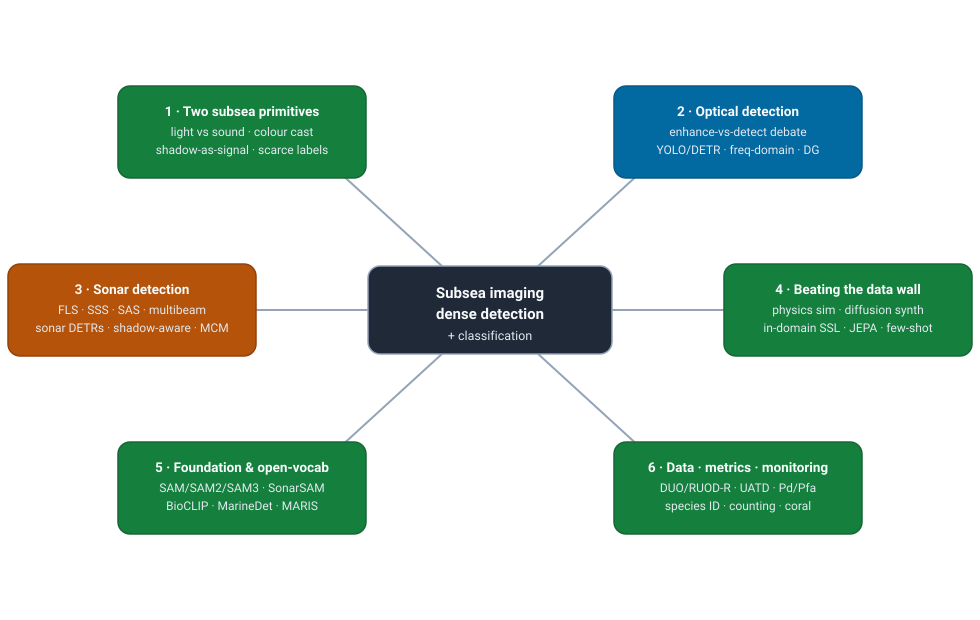
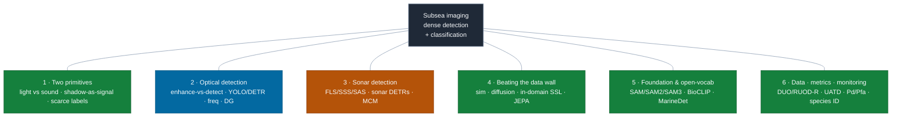
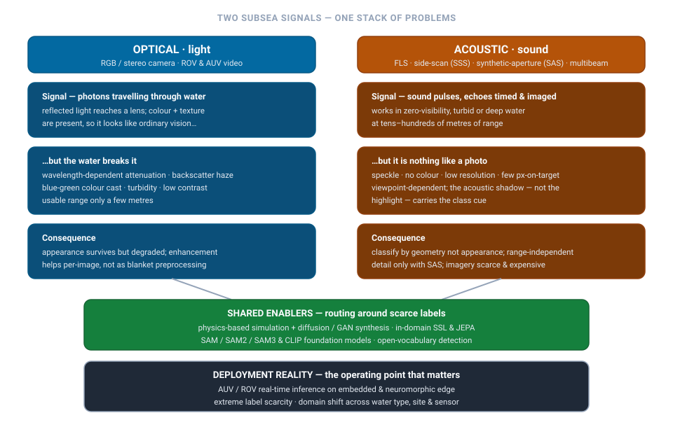

# Dense Object Detection & Classification — Recent Advances

*Compiled 2026-Jul-08 (America/Los_Angeles).*

Next installment in the running CV-updates log. Earlier entries on
`main`:
[Apr-30](../2026-Apr-30/2026-Apr-30_CV_updates.md),
[May-01](../2026-May-01/2026-May-01_CV_updates.md),
[May-02](../2026-May-02/2026-May-02_CV_updates.md),
[May-04](../2026-May-04/2026-May-04_CV_updates.md),
[May-05](../2026-May-05/2026-May-05_CV_updates.md),
[May-07](../2026-May-07/2026-May-07_CV_updates.md),
[May-08](../2026-May-08/2026-May-08_CV_updates.md),
[May-15](../2026-May-15/2026-May-15_CV_updates.md),
[May-16](../2026-May-16/2026-May-16_CV_updates.md),
[May-17](../2026-May-17/2026-May-17_CV_updates.md),
[Jun-09](../2026-Jun-09/2026-Jun-09_CV_updates.md),
[Jun-10](../2026-Jun-10/2026-Jun-10_CV_updates.md),
[Jun-12](../2026-Jun-12/2026-Jun-12_CV_updates.md),
[Jun-15](../2026-Jun-15/2026-Jun-15_CV_updates.md),
[Jun-16](../2026-Jun-16/2026-Jun-16_CV_updates.md),
[Jun-17](../2026-Jun-17/2026-Jun-17_CV_updates.md),
[Jun-19](../2026-Jun-19/2026-Jun-19_CV_updates.md),
[Jun-21](../2026-Jun-21/2026-Jun-21_CV_updates.md),
[Jun-22](../2026-Jun-22/2026-Jun-22_CV_updates.md),
[Jun-23](../2026-Jun-23/2026-Jun-23_CV_updates.md),
[Jun-24](../2026-Jun-24/2026-Jun-24_CV_updates.md),
[Jun-25](../2026-Jun-25/2026-Jun-25_CV_updates.md),
[Jun-27](../2026-Jun-27/2026-Jun-27_CV_updates.md),
[Jun-29](../2026-Jun-29/2026-Jun-29_CV_updates.md),
[Jun-30](../2026-Jun-30/2026-Jun-30_CV_updates.md),
[Jul-04](../2026-Jul-04/2026-Jul-04_CV_updates.md),
[Jul-07](../2026-Jul-07/2026-Jul-07_CV_updates.md).

## Why this pass: subsea imaging as its own primitive

The last seven passes worked **sensor primitives on their own terms** —
camera-3D / occupancy ([Jun-24](../2026-Jun-24/2026-Jun-24_CV_updates.md)),
remote-sensing spectra ([Jun-25](../2026-Jun-25/2026-Jun-25_CV_updates.md)),
the LiDAR point cloud ([Jun-27](../2026-Jun-27/2026-Jun-27_CV_updates.md)),
the event camera ([Jun-29](../2026-Jun-29/2026-Jun-29_CV_updates.md)),
thermal infrared ([Jun-30](../2026-Jun-30/2026-Jun-30_CV_updates.md)),
imaging radar ([Jul-04](../2026-Jul-04/2026-Jul-04_CV_updates.md)) and
medical imaging ([Jul-07](../2026-Jul-07/2026-Jul-07_CV_updates.md)). Those
covered the outdoor-autonomy sensor stack, remote sensing and the clinic.
**Subsea imaging** — dense detection & classification *underwater*, in both
its optical and its acoustic (sonar) forms — is the last great dense-vision
domain the log has only ever touched in narrow slices: a single underwater
YOLO variant and one sonar DETR distillation
([May-05 §3.4](../2026-May-05/2026-May-05_CV_updates.md)), an underwater
domain-generalization section ([Jun-12 §10](../2026-Jun-12/2026-Jun-12_CV_updates.md)),
and a passing mention of a spiking underwater detector
([Jun-12](../2026-Jun-12/2026-Jun-12_CV_updates.md)). Never a pass that takes
the modality *whole*. This entry does — optical **and** sonar, detection
**and** classification, on their own terms.

It earns a dedicated pass because water makes the image a genuinely different
primitive from every sensor covered so far — and because there are, in fact,
**two** subsea primitives that break natural-image vision in opposite ways:

- **Light and sound fail differently, and most subsea work commits to one.**
  Optical underwater imaging keeps colour and texture but loses them to
  **wavelength-dependent attenuation, backscatter haze, a blue-green colour
  cast and turbidity**, with a usable range of only a few metres. Sonar sees
  through zero-visibility, turbid or deep water at tens-to-hundreds of metres
  — but returns **no colour, low resolution, heavy speckle and only a handful
  of pixels on target**, and the object's **acoustic *shadow*, not its
  highlight, carries the discriminative signal.** A camera detector and a
  side-scan-sonar detector share almost no inductive bias.
- **The target is small and the background is everything.** A sea-urchin in a
  hazy reef frame or a mine-like object in a side-scan swath occupies a
  vanishing fraction of the image, so **foreground/background imbalance is
  extreme** and small-object recall — not aggregate mAP — is the number that
  moves.
- **Labels are scarce, expensive and expert, and there is no ImageNet.**
  Optical sets top out in the low tens of thousands of frames; sonar sets
  often number in the *hundreds*. Ground truth needs a marine biologist, a
  hydrographer or a mine-warfare analyst. So the whole 2024–26 story is
  **physics-based simulation, diffusion/GAN synthesis, in-domain
  self-supervision, and foundation models** that route around the label
  bottleneck.
- **Domain shift is the default, not the exception.** Water type, turbidity,
  site, depth, illumination and — for sonar — the specific transducer all
  shift the distribution, and a model tuned in a clear-water tank collapses in
  a turbid harbour. **Domain generalization is a first-class research thread
  here**, not an afterthought.
- **The deployment target is an AUV/ROV, and the metric is often not mAP.**
  Inference runs on an embedded or neuromorphic edge budget on a robot with no
  uplink, in real time. And where the work is mine countermeasures or marine
  security, the community scores it with **probability-of-detection at a fixed
  false-alarm rate (an ATR operating point)**, not COCO mAP — the operating
  point *is* the deliverable, exactly as FROC was for radiology last pass.

This pass covers six threads of that stack:

1. **The two primitives & representation** — light vs sound, what each breaks,
   imbalance, the label wall, and why the metric is sometimes P_d/P_fa, not mAP.
2. **Optical underwater detection** — the enhancement-vs-detection debate,
   domain generalization, the detector zoo (YOLO / DETR / frequency-domain),
   and the 2026 benchmark-integrity reckoning.
3. **Sonar detection** — FLS / side-scan / synthetic-aperture / multibeam as
   distinct sub-primitives, sonar DETRs and YOLOs, shadow-aware design, and the
   mine-countermeasures / shipwreck / seabed target problem.
4. **Beating the data wall** — physics-based sonar & underwater simulation,
   diffusion/GAN synthesis and optical→sonar style transfer, in-domain SSL /
   JEPA, and few-/zero-shot.
5. **Foundation, open-vocabulary & promptable models** — SAM/SAM2/SAM3 and
   SonarSAM adaptations, open-vocabulary marine detection, and the
   BioCLIP/AquaticCLIP/marine-VLM line.
6. **Datasets, metrics, and the classification / monitoring side** — the
   optical and sonar benchmark landscape, the mAP-vs-ATR metric split and its
   pitfalls, fine-grained species ID, and monitoring at scale (fish counting,
   coral, plankton, debris).

> **Reading the numbers.** Figures are quoted from each method's own paper,
> repo, leaderboard or challenge page. **Protocols differ and are not
> comparable across rows.** Optical underwater detection reports **COCO-style
> mAP@50 and mAP@[.5:.95]** (plus params/FLOPs/FPS for edge work); sonar mine
> countermeasures reports **P_d vs. false-alarm density** (an ATR operating
> point); segmentation reports **AP / Dice**; classification reports
> **top-1 / balanced accuracy**. A YOLO paper's `mAP@50 ≈ 0.85` and a
> transformer paper's `AP@[.5:.95] ≈ 0.67` are *not* the same axis — treat
> every cross-row delta as indicative, not controlled. arXiv IDs encode
> submission month (`2408.xxxxx` = Aug 2024; `2606.xxxxx` = Jun 2026).
>
> **Verification note.** This run's egress policy allowed web *search* and
> fetches of **GitHub / project pages**, but direct fetches of `arxiv.org`,
> `openaccess.thecvf.com`, journal PDFs and `paperswithcode.com` frequently
> returned HTTP 403/407. So arXiv IDs, venues and most numbers were
> cross-checked against authors' **GitHub READMEs**, model cards, dataset
> pages and multiple independent search snippets rather than the abstract
> PDFs. Figures pinned to a primary repo/card (SU-YOLO, USIS-SAM/USIS10K,
> BioCLIP) are stated plainly; figures available only via secondary summaries
> are flagged *(secondary)* / *(unverified)*, and 2026 (`2601`–`2606`) arXiv
> IDs are real preprints not yet page-verified here.

## 1 · The two primitives & representation — why water forces different choices

There is no single subsea signal chain the way radar had one; there are **two
dominant data primitives**, and the first design decision is which one you are
in and how you carve the world down.

- **The optical frame.** Reflected light reaches an RGB or stereo camera on a
  ROV/AUV, so colour and texture are *present* — the image looks like ordinary
  vision, which is a trap. Water imposes **wavelength-dependent attenuation**
  (red is gone within metres, so scenes go blue-green), **backscatter haze**
  from suspended particles, a **colour cast** that shifts with depth and water
  body, and **turbidity** that collapses contrast. The carving question is
  whether to *restore first or detect on raw* — and, as §2 shows, the 2025
  answer is "mostly detect on raw / jointly," which overturns a decade of
  enhance-then-detect pipelines.
- **The acoustic frame.** A sonar transmits sound and images the returning
  echoes; it works where light cannot — zero-visibility, turbid or deep water,
  at tens-to-hundreds of metres. But the resulting image is nothing like a
  photo: **no colour, low resolution, heavy multiplicative speckle, and only a
  few pixels on the target.** The single most important representational fact
  is that **the acoustic shadow behind an object — its silhouette cast on the
  seabed — often carries more class information than the bright highlight**
  (shadow length scales with object height). A sonar detector that ignores the
  shadow is throwing away its best feature. And there are *four* acoustic
  sub-primitives (§3) that differ as much from each other as from a camera.

Two facts cut across both primitives and shape every method in this pass:

- **The label wall.** There is no medical-ImageNet-scale corpus and nothing
  close for the sea. The cleanest optical detection benchmark (DUO) is ~7.8k
  images over **4 classes**; the de-facto forward-looking-sonar set (UATD) is
  ~7.6–9.2k images; many sonar sets number in the **hundreds** (AI4Shipwrecks:
  286 labelled side-scan images over 28 wrecks). This is why threads 4 and 5
  — simulation, synthesis, self-supervision and foundation models — are not
  side-shows but the center of gravity.
- **The metric fork.** Optical underwater detection is scored almost entirely
  with **COCO-style mAP**; there is *no* established operating-point (recall at
  fixed false-positive-rate) convention on the vision side. But the moment the
  work becomes **mine countermeasures (MCM)** it inherits the marine-defense
  **Automatic Target Recognition (ATR)** convention — **probability of
  detection-and-classification P_dc vs. false-alarm rate P_fa** (per km² or per
  image), reported as an ROC / operating point, with modern systems quoting
  P_d well above 99% at low false alarm. If a subsea result is autonomy- or
  security-facing, mAP alone will not satisfy that community — the operating
  point is the deliverable.

## 2 · Optical underwater detection — the enhance-vs-detect reckoning, DG, and the detector zoo

### 2.1 Does enhancement actually help detection? (Mostly: not as blanket preprocessing)

The oldest reflex in underwater vision is *enhance the image, then detect*. The
2024–26 literature has turned sharply skeptical, and the debate is now the
organizing question of the optical sub-field.

- **"Is Underwater Image Enhancement All Object Detectors Need?"**
  ([arXiv 2311.18814](https://arxiv.org/abs/2311.18814)) is the foundational
  skeptical study — broadly, enhancement as generic preprocessing does not
  reliably improve, and can hurt, detection.
- **"Beneath the Surface: The Role of Underwater Image Enhancement in Object
  Detection"** ([arXiv 2411.14626](https://arxiv.org/abs/2411.14626), v3 Apr
  2025) applied nine enhancement models (physical, non-physical, learning-based)
  across two datasets and found the benefit is **image-level, not
  dataset-level** — arguing for *selective, per-image* enhancement rather than
  a blanket front-end.
- **"Understanding the Influence of Image Enhancement on Underwater Object
  Detection: A Quantitative and Qualitative Study"** (*Remote Sensing* 2025,
  [doi:10.3390/rs17020185](https://doi.org/10.3390/rs17020185)) documents the
  gap between **visual-quality metrics and detection utility** — images that
  look better to a human can be worse for a detector. The **WACV 2025 MaCVi**
  workshop line ("poor object detectors are not fixed by enhancement")
  reinforces the point.
- The constructive responses fold enhancement *inside* the detector or reframe
  it as **domain alignment**: **frequency-level refinement** ("Refining
  features for underwater object detection at the frequency level," *Front.
  Mar. Sci.* 2025,
  [fmars.2025.1544839](https://doi.org/10.3389/fmars.2025.1544839)); a
  **data-centric enhancement-as-domain-alignment** framing; and the recurring
  2026 pattern of **joint enhance-and-detect** — e.g. **"A Dual-Branch
  Collaborative Framework for Joint Optimization of Underwater Image
  Enhancement and Object Detection"**
  ([arXiv 2606.15857](https://arxiv.org/abs/2606.15857)).

**Takeaway.** The 2025–26 consensus: enhancement as a generic front-end is not
a reliable win; if used, apply it *selectively*, fold it into the backbone
(frequency-domain / dual-branch), or treat it as *domain alignment* — not as a
human-quality objective. *(Numbers in this thread are secondary/snippet-level;
the qualitative consensus is well-supported across multiple 2025 studies.)*

### 2.2 The detector zoo — YOLO, DETR and frequency-domain

Optical UOD is dominated by **efficient YOLO derivatives** (edge/AUV-facing)
with a growing **DETR/RT-DETR** and **Mamba** contingent. All numbers below are
*(secondary/snippet)* unless noted, and the mAP@50 vs AP@[.5:.95] axes are not
comparable.

| Method | Family / idea | Reported headline | Where |
|---|---|---|---|
| **MAS-YOLOv11** | YOLOv11 + multi-attention | DUO mAP@50 77.4, mAP@[.5:.95] 55.1; RUOD mAP@50 76 | *Sensors* 2025 (25/11/3433) |
| **AGS-YOLO** | small-object, low-resource | RUOD mAP@0.5 86.4, mAP@[.5:.95] 63.5 | *JMSE* 2025 (13/8/1465) |
| **CEH-YOLO** | composite-enhanced YOLO | DUO 88.4, UTDAC2020 87.7 mAP | *Ecol. Inf.* 2024 |
| **UOD-YOLO** | lightweight YOLOv11n, edge | +3.5 mAP@50 vs YOLOv11n, −36% params, ~279.8 FPS | *Front. Mar. Sci.* 2025 |
| **DyAqua-YOLO** | dynamic-adaptive, real-time | 85.35% acc on **Raspberry Pi 4B** | *Front. Mar. Sci.* 2025 |
| **YOLOv12 + physics aug** | ELAN + area-attention + turbulence/occlusion aug | Brackish 98.30 mAP @142 FPS | [arXiv 2506.23505](https://arxiv.org/abs/2506.23505) |
| **YSOOB** ("You Sense Only Once Beneath") | ultra-light real-time | — | [arXiv 2504.15694](https://arxiv.org/abs/2504.15694) |
| **SPMamba-YOLO** | YOLOv8 + SPPELAN + Mamba SSM | +4.9% mAP@0.5 over YOLOv8n, strong on small/dense | [arXiv 2602.22674](https://arxiv.org/abs/2602.22674) |
| **UWNet** | Mamba+YOLO, robot-facing | DUO 87.1 mAP@50 / 69.5 mAP@[.5:.95] | *(secondary)* |
| **RP-DETR / RT-DETR (blur)** | re-param pyramid / blur-robust DETR | — | Springer 2026 / *CCPE* 2025 |
| **EDB-Net** (dual-branch) | joint enhance + detect | DUO **67.8 AP** (COCO-style; beats TOOD 65.1) | *(secondary)* |

Cross-cutting design axes that recur: **frequency-domain enhancement inside the
backbone** ("Real-time underwater object detection via frequency-domain
dynamics," *Sci. Reports* 2026, s41598-026-44628-9); **small-object losses**
(Normalized Wasserstein Distance, multi-scale heads); **channel/color-cast
stabilization** ([arXiv 2408.01293](https://arxiv.org/abs/2408.01293)); and
**underwater salient / camouflaged object detection** as a hard sub-task
("Learning Dynamic Structural Specialization for Underwater Salient Object
Detection," [arXiv 2605.15535](https://arxiv.org/abs/2605.15535)).

### 2.3 Domain generalization & the 2026 benchmark reckoning

Because water-type/turbidity/site shift is the default failure mode, **domain
generalization (DG)** is a first-class thread:

- **Physics-Coupled Frequency Dynamic Adaptation Network for Domain-Generalized
  UOD** — the sub-field's first top-venue DG paper, **ACM MM 2025**
  ([doi:10.1145/3746027.3755829](https://doi.org/10.1145/3746027.3755829)).
- Foundational DG line: **"Achieving Domain Generalization in Underwater Object
  Detection by Domain Mixup and Contrastive Learning"**
  ([arXiv 2104.02230](https://arxiv.org/abs/2104.02230), *Neurocomputing* 2023);
  **"Why Domain Matters: A Preliminary Study of Domain Effects in Underwater
  Object Detection"** ([arXiv 2604.26174](https://arxiv.org/abs/2604.26174),
  2026).

The most important 2026 development is a **benchmark-integrity reckoning**.
**RUOD-R** (*IEEE Access* 2026, doc 11483160) re-annotates the RUOD images with
**~3.5× more total instances and ~140× more small-object annotations** (mean
IoU 0.83 vs the original loose boxes) — on the *same images*, so it isolates
label quality. The finding: **prior UOD mAP scores rested on incomplete
small-object labels**, so pre-2026 headline numbers should be read with
caution. This mirrors DUO's earlier fix for **URPC domain leakage** (URPC2019 ⊃
2018, URPC2020 ⊃ 2019 — later versions embed earlier images, so naive splits
leak; DUO applied perceptual-hash deduplication and a fixed test split).
Complementarily, **"Are All Marine Species Created Equal? Performance
Disparities in Underwater Object Detection"**
([arXiv 2508.18729](https://arxiv.org/abs/2508.18729)) shows aggregate mAP masks
severe per-class disparities.

## 3 · Sonar detection — four sub-primitives, shadow-aware design, and mine countermeasures

Sonar is not one modality. The 2024–26 surveys ("Sonar-based Deep Learning in
Underwater Robotics," [arXiv 2412.11840](https://arxiv.org/abs/2412.11840);
"Sonar Image Datasets: A Comprehensive Survey,"
[arXiv 2510.03353](https://arxiv.org/abs/2510.03353), SIBGRAPI 2025) organize
the field by four acoustic sub-primitives:

- **Forward-looking sonar (FLS / imaging sonar)** — ARIS, DIDSON, Oculus,
  BlueView. 2-D fan-shaped images for close-range inspection, diver/ROV work
  and marine-debris detection; the de-facto detection benchmark (UATD) is FLS.
- **Side-scan sonar (SSS)** — towfish/AUV swath strips, the classic for MCM,
  shipwreck and seabed survey; **highlight+shadow geometry is the cue** and
  resolution degrades with range.
- **Synthetic-aperture sonar (SAS)** — coherent multi-ping processing yields
  **range-independent high resolution across a wide swath**, the key enabler
  for mine, UXO and infrastructure detection; coherent speckle is its
  signature artifact.
- **Multibeam (MBES)** — bathymetric fans, used with FLS-style CNN pipelines
  for structural/seabed inspection.

### 3.1 The sonar detector zoo (2024–2026)

A rapid proliferation of **lightweight, shadow-aware YOLO/DETR variants and
knowledge distillation** for embedded AUV deployment. All numbers
*(secondary/unverified)*.

| Method | Family / idea | Modality | Where |
|---|---|---|---|
| **BTS-DETR** | KD framework (prediction/memory/query distillation) for DETR; zero inference cost | SSS/FLS | *Knowl.-Based Syst.* 2026 ([S0950705126003679](https://www.sciencedirect.com/science/article/abs/pii/S0950705126003679)) |
| **T2C-DETR** | Transformer+Conv dual-channel backbone + noise-filtering; AP50 97.8–98.5 @72–73 FPS | sonar | *Algorithms* 2026 ([a19040281](https://doi.org/10.3390/a19040281)) |
| **NAS-DETR** | first DETR + zero-shot NAS for sonar | sonar | [arXiv 2505.06694](https://arxiv.org/abs/2505.06694) |
| **FS2-DETR** | few-shot DETR, enhanced feature perception | sonar | *JMSE* 14(3):304 (2026) |
| **LS-DETR** | lightweight hybrid encoder for FLS | FLS | IEEE Xplore 11020690 (2025) |
| **MSF-DETR** | spatial-frequency small-target DETR | SSS | PMC12617901 (2025) |
| **SSGA-YOLO** | acoustic/shadow-aware attention (LSGA), edge; mAP50 0.983 | FLS | *IET Image Proc.* 2026 |
| **YOLO-SONAR / Sonar-YOLO** | YOLOv7 semantic-spatial / freq-channel attention | FLS | *Front. Mar. Sci.* / *MST* 2025 |
| **SPTF-YOLO** | injects sonar acquisition parameters into detection | FLS | WUWNet 2024 |
| **DyLA-YOLO** | linear attention + dynamic upsampling | sonar | *Signal Process.* 2026 |
| **RSOD** | reliability-guided detection with *extremely limited labels* | sonar | [arXiv 2601.12715](https://arxiv.org/abs/2601.12715) |

**Shadow-aware detection is now an explicit design axis** (SSGA-YOLO's LSGA
attends to shadow boundaries; the classic shadow–highlight geometrical feature
space for mine-like objects is carried forward). There is even **training-free
3-D detection from sonar point clouds**
([arXiv 2508.18293](https://arxiv.org/abs/2508.18293)) and an acoustic-tracking
benchmark, **SonarT165 + STFTrack**
([arXiv 2504.15609](https://arxiv.org/abs/2504.15609)).

### 3.2 Mine countermeasures, shipwrecks, and seabed targets

This is where sonar detection meets a hard operational metric (P_d/P_fa, §1/§6):

- **Syn2Real Domain Generalization for Underwater Mine-like Object Detection
  Using Side-Scan Sonar** ([arXiv 2410.12953](https://arxiv.org/abs/2410.12953))
  — DDPM/DDIM synthetic augmentation for MLO; Mask R-CNN gains **~60% AP** from
  synthetic+real vs real-only *(secondary)*.
- **Object Detection in SAS Images Using a Deep Neural Network** (IEEE Xplore
  11104669, 2025) — CNN detection on SAS for seabed/mine-like targets;
  SAS's range-independent resolution is the enabler.
- **AI4Shipwrecks** ([arXiv 2401.14546](https://arxiv.org/abs/2401.14546),
  *IJRR* 2025) — 28 wrecks / **286 labelled** high-res SSS images, AUV-collected
  in Lake Huron; a shipwreck-segmentation benchmark and a cautionary example of
  how *tiny* sonar test sets are. **Unsupervised SSS shipwreck detection** via
  domain adaptation (*Sci. Reports* 2024, s41598-024-63501-1) rounds out the
  line.

## 4 · Beating the data wall — simulation, synthesis, and in-domain self-supervision

With labels this scarce, the center of gravity is *manufacturing* or *routing
around* supervision.

### 4.1 Physics-based simulation

- **S3Simulator** ([arXiv 2408.12833](https://arxiv.org/abs/2408.12833)) — a
  benchmarking **side-scan sonar** simulator using CAD + Gazebo + SAM-assisted
  segmentation.
- **ACSim** (*IEEE T-RO* 2025,
  [10.1109/TRO.2025.3562048](https://doi.org/10.1109/TRO.2025.3562048)) — an
  acoustic-camera simulator with **recursive ray tracing, artifact modeling and
  ground-truthing**.
- **PoSSM** (point-based sonar signal model, *JASA* 2025) — open-source **SAS**
  simulation with coherent time-series generation over varied seafloor
  (cylinders, rocks, lobster traps). Physics-based **FLS** dataset construction
  (ACM DSIC 2025) ray-traces echo paths with sonar-equation intensity and
  coherent speckle.

### 4.2 Generative synthesis & optical→sonar style transfer

- **ULGF** (Underwater Layout-Guided diffusion Framework, *Commun. Eng.*
  (Nature) 2025, s44172-025-00579-z) — generates labelled underwater training
  imagery from a *small* set of real images, no in-air data, targeting
  turbidity/lighting/depth generalization.
- **Synth-SONAR** ([arXiv 2410.08612](https://arxiv.org/abs/2410.08612)) — dual
  Stable-Diffusion + style injection + LLM/VLM prompting for controllable sonar
  synthesis; plus **diffusion super-resolution** for legacy low-res sonar
  (*JASA* 2025). CycleGAN FLS synthesis remains the GAN baseline.
- **DGACT** (*Eng. Appl. AI* 2026) — dynamic GAN + cross-shaped-window
  transformer for class-imbalance/turbidity augmentation; **DCGAN + YOLOv6** for
  crown-of-thorns-starfish on the edge (*Front. Mar. Sci.* 2025).

### 4.3 In-domain self-supervision, JEPA, and few-/zero-shot

- **Mine-JEPA** ([arXiv 2604.00383](https://arxiv.org/abs/2604.00383),
  **CVPR 2026 Workshop / MaCVi** — verified via the CVF proceedings URL) — the
  first **in-domain JEPA/SSL** pipeline for side-scan-sonar mines (SIGReg loss,
  ViT-Tiny, pretrained on 1,170 *unlabelled* images). Binary mine-vs-non-mine
  **F1 0.935**, beating fine-tuned **DINOv3 (0.922)**; notably, stacking
  in-domain SSL *on top of* a foundation model **degraded** it by 10–13 points
  — a pointed result on when generic FMs help subsea *(numbers secondary)*.
- **BenthicNet** ([arXiv 2405.05241](https://arxiv.org/abs/2405.05241)) —
  **11.4M** seafloor images; SSL pretraining (SimSiam/BYOL/MoCo-v2/Barlow Twins,
  the latter most consistent) shows **in-domain SSL beats ImageNet pretraining**
  on small benthic label sets.
- **Label-efficient underwater species classification on frozen embeddings**
  ([arXiv 2604.00313](https://arxiv.org/abs/2604.00313)) — frozen **DINOv3
  ViT-B** embeddings + self-training on **AQUA20** close most of the gap to a
  fully-supervised ConvNeXt using **<5% of labels**.
- **Self-Supervised Learning for Improved SAS Target Recognition**
  ([arXiv 2307.15098](https://arxiv.org/abs/2307.15098)) and few-/zero-shot SSS
  classification (class-adaptive dynamic threshold; generalized zero-shot
  **CADA-SSS**, *IEEE TIM* 2025) round out the label-light toolkit.

## 5 · Foundation, open-vocabulary & promptable models for the sea

The 2024–26 frontier: **can the general foundation models be made to work
underwater — and is a marine-specific one worth building?**

### 5.1 SAM / SAM2 / SAM3 & SonarSAM

- **USIS-SAM + USIS10K** ([arXiv 2406.06039](https://arxiv.org/abs/2406.06039),
  ICML 2024; [code](https://github.com/LiamLian0727/USIS10K)) — the first SAM
  application to **underwater salient instance segmentation**, adding an
  underwater-adaptive ViT and a prompt-free salient-feature prompter.
  **USIS10K** = 10,632 images / 7 categories. Repo (24-epoch) numbers:
  multi-class **mAP 43.9 / AP50 59.6 / AP75 50.0**; class-agnostic **64.3 /
  84.9 / 74.0** (verified from README; slightly above the paper).
- **UWSAM + UIIS10K** ([arXiv 2505.15581](https://arxiv.org/abs/2505.15581)) —
  **distills SAM ViT-Huge into ViT-Small** via Mask-GAT underwater KD with an
  end-to-end prompt generator (no manual prompts); efficient enough for
  deployment, +~3 AP over Mask R-CNN. **USIS16K**
  ([arXiv 2506.19472](https://arxiv.org/abs/2506.19472)) scales the salient set
  to 16,151 images / 158 categories.
- **SAM2 underwater evaluation**
  ([arXiv 2408.02924](https://arxiv.org/abs/2408.02924)) — SAM2 is excellent
  with **GT-box prompts** but **degrades sharply in automatic/point-prompt
  mode** underwater. **SAM 3** (Meta, Nov 2025; promptable *concept*
  segmentation) has already been **adopted by FathomNet/MBARI** for ocean
  exploration, with a SAM-3-masked underwater benchmark being released to the
  marine community *(secondary)*.
- **SonarSAM** ([arXiv 2306.14109](https://arxiv.org/abs/2306.14109)) — SAM
  fine-tuning on sonar via LoRA / visual prompt tuning; a 2025 **FLS + SAM with
  collaborative prompts** work (IEEE GRSL) adds contour-focused dense prompts
  and Mamba/KAN boundary compensation.

### 5.2 Open-vocabulary marine detection & marine VLMs

- **MarineDet** ([arXiv 2310.01931](https://arxiv.org/abs/2310.01931)) — joint
  visual-text space for **open-marine object detection** over **821 marine
  categories** (35.9 mAP50 fully-supervised); the anchor for the open-vocab
  direction. **MARIS** ([arXiv 2510.15398](https://arxiv.org/abs/2510.15398)) —
  marine **open-vocabulary instance segmentation** with geometric enhancement +
  semantic alignment.
- **MarineInst + MarineInst20M** (ECCV 2024 Oral;
  [code](https://github.com/zhengziqiang/MarineInst)) — a marine foundation
  model outputting **instance masks + captions**, trained on the largest marine
  image set. **AquaticCLIP**
  ([arXiv 2502.01785](https://arxiv.org/abs/2502.01785)) — contrastive
  pretraining on ~2M aquatic image-text pairs; **MarineGPT** and **UWBench**
  ([arXiv 2510.18262](https://arxiv.org/abs/2510.18262)) push VLM
  understanding/grounding. A caveat worth stating: these are largely
  **segmentation/VLM-oriented**, so **detection-specific marine foundation
  models remain a genuine gap.**

### 5.3 BioCLIP — the taxonomy-aware classification backbone

- **BioCLIP** ([arXiv 2311.18803](https://arxiv.org/abs/2311.18803), **CVPR 2024
  Oral / Best Student Paper**; [code](https://github.com/Imageomics/bioclip)) —
  a CLIP model trained on **TreeOfLife-10M** (10M images, **450,000+ taxa**
  across the 7-rank Linnaean hierarchy), enabling zero-/few-shot, open-ended
  taxonomic classification of organisms including marine taxa.
- **BioCLIP 2** (NeurIPS 2025 Spotlight;
  [code](https://github.com/Imageomics/bioclip-2)) scales to **TreeOfLife-200M**
  (~214M images), with emergent ecological structure in the embedding space.
  For coral specifically, **ReefNet**
  ([arXiv 2510.16822](https://arxiv.org/abs/2510.16822), NeurIPS 2025) finds
  VLMs/MLLMs still **degrade substantially zero-/few-shot** across sources — the
  domain gap is not yet closed.

## 6 · Datasets, metrics & the classification / monitoring side

### 6.1 The benchmark landscape

**Optical.** **DUO** (7,782 images, 4 classes; fixed 6,671/1,111 split;
perceptual-hash-deduplicated re-annotation of URPC+UDD) is the cleanest
detection benchmark; **RUOD** (~14k images, 10 classes, ~75k objects; color
cast/haze/low-light) is the largest real-world set; **RUOD-R** (2026) is its
small-object re-annotation (§2.3); **Brackish** (14,518 frames, 6 classes) is
essentially **saturated at ~97% mAP@50** and no longer discriminates methods;
**URPC** (2017–2020) is the leaky raw source DUO fixed. New object-type coverage:
**COU** (Common Objects Underwater,
[arXiv 2502.20651](https://arxiv.org/abs/2502.20651)) — ~10k instance-segmented
images over **24 man-made classes** (debris, dive tools, AUVs), filling the
non-marine-life gap for robots. Segmentation/VLM sets: **USIS10K/16K**,
**UWBench**, and species-classification **AQUA20**
([arXiv 2506.17455](https://arxiv.org/abs/2506.17455)).

**Sonar.** **UATD** (FLS, ~7.6–9.2k images, 10 classes) is the de-facto
detection set; **SCTD** (~500–600 images, ship/aircraft/human), **NKSID** (FLS,
2,617 images, 8 classes, long-tail) and **SeabedObjects-KLSG** (1,190 SSS
images) are the classic classification sets. 2024–26 releases: **Marine Debris
FLS** ([arXiv 2503.22880](https://arxiv.org/abs/2503.22880), OCEANS 2025),
**AI4Shipwrecks** (§3.2), **SASSED** (real SAS seabed texture), an **in-air SAS
target-scattering** set (*Sci. Data* 2024), plus the **S3Simulator/PoSSM**
synthetic sets (§4.1). Living aggregators:
[Awesome-Sonar-Image-Resources](https://github.com/Jorwnpay/Awesome-Sonar-Image-Resources)
and OpenSonarDatasets.

### 6.2 The metric split and its pitfalls

- **mAP is the vision default and it hides things.** Optical UOD reports
  mAP@50 / mAP@[.5:.95] almost exclusively — and RUOD-R (small-object
  re-annotation), the marine-species-disparity study
  ([arXiv 2508.18729](https://arxiv.org/abs/2508.18729)), URPC domain leakage
  and *tiny sonar test sets* (AI4Shipwrecks: 286 images) all show how fragile
  aggregate mAP is on these benchmarks.
- **MCM/marine-security uses ATR operating points.** Probability of
  detection-and-classification **P_dc** vs. **false-alarm density P_fa** (per
  km²/per contact), often "through-the-sensor," with modern systems quoting
  **P_d > 99%** at low false alarm. This is the subsea analogue of radiology's
  FROC — **report an ROC/operating point, not just mAP**, for autonomy- or
  security-facing work.

### 6.3 The classification & monitoring side

Detection is only half the deliverable; **who/what/how-many** is the other half.

- **Fine-grained species ID.** **WildFish** (1,000 fish species, open-set) is
  the classic; **FathomNet FGVC challenges** at CVPR run hierarchical
  classification (FGVC12, 2025) and **positive-unlabeled detection** (FGVC13,
  2026); **MATANet** ([arXiv 2601.03729](https://arxiv.org/abs/2601.03729))
  reportedly won FGVC12 *(secondary)*; **AQUA20** stresses turbid/low-light
  species classification; **AASNet** (*Appl. Sci.* 2025) and fish **re-ID** for
  electronic fisheries monitoring
  ([arXiv 2512.08400](https://arxiv.org/abs/2512.08400)) round it out.
- **Monitoring at scale.** Automated **fish counting** in diver video (20
  Mediterranean species, *MEE* 2026) and on baited remote video (*Front. Mar.
  Sci.* 2025); **coral** condition monitoring with adapter-tuned vision
  foundation models ([arXiv 2503.23012](https://arxiv.org/abs/2503.23012)) and
  benthic segmentation; **plankton** imaging (**MedPlanktonSet**, *Sci. Data*
  2025: 77,271 IFCB images / 139 categories; **open-set plankton recognition**,
  [arXiv 2503.11318](https://arxiv.org/abs/2503.11318)); and **marine debris**
  as a robotics-facing vertical (**TrashCan**
  [arXiv 2007.08097](https://arxiv.org/abs/2007.08097); **SeaCLEAR**, *Sci.
  Data* 2024, 8,610 images / 40 categories; onboard ROV/AUV cleanup).
- **Foundation models as annotation assistants.** SAM-assisted enrichment of
  FathomNet annotations (*Front. Mar. Sci.* 2025,
  [fmars.2025.1469396](https://doi.org/10.3389/fmars.2025.1469396)) and
  **FathomGPT** ([arXiv 2412.02784](https://arxiv.org/abs/2412.02784)) point at
  the near-term deployment pattern: FMs cut expert-annotation cost rather than
  replace the expert.

### 6.4 Edge & real-time — the AUV/ROV constraint

The deployment target keeps the field honest about efficiency:

- **SU-YOLO** ([arXiv 2503.24389](https://arxiv.org/abs/2503.24389);
  [code](https://github.com/lwxfight/snn-underwater)) — the first **spiking
  neural network** for underwater detection: spike-based denoising, separated
  BatchNorm, spiking CSP blocks. README-verified: **78.8 mAP on URPC2019, 6.97M
  params, 2.98 mJ** energy, beating mainstream SNN baselines. Neuromorphic edge
  more broadly: **frame/event SNN detectors on Intel Loihi 2 vs Jetson Orin**
  ([arXiv 2605.00146](https://arxiv.org/abs/2605.00146)) show Loihi 2 lowest
  per-inference energy, ANN-on-Orin highest throughput.
- Concrete embedded datapoints: **DyAqua-YOLO** at 85.35% on a Raspberry Pi 4B;
  **UOD-YOLO** at ~279.8 FPS with −36% params; lightweight YOLO bio-detection at
  **16.54 FPS on a Jetson Nano 2GB**; and general **YOLOv8-vs-RT-DETR edge
  energy** comparison (*Sci. Reports* 2026). *(edge numbers secondary/snippet.)*

---

## Sources

**Surveys & framing:** UOD in the era of AI — [arXiv 2410.05577](https://arxiv.org/abs/2410.05577) (*ACM Comput. Surv.* 2025, [10.1145/3759243](https://doi.org/10.1145/3759243)); structured review to LVLMs — [arXiv 2509.08490](https://arxiv.org/abs/2509.08490); label-dependency-reduction survey — [arXiv 2411.11287](https://arxiv.org/abs/2411.11287); sonar DL in robotics — [arXiv 2412.11840](https://arxiv.org/abs/2412.11840); sonar-image datasets survey — [arXiv 2510.03353](https://arxiv.org/abs/2510.03353); ML for the Internet of Underwater Things — [arXiv 2603.07413](https://arxiv.org/abs/2603.07413).

**Enhance-vs-detect:** [arXiv 2311.18814](https://arxiv.org/abs/2311.18814); "Beneath the Surface" — [arXiv 2411.14626](https://arxiv.org/abs/2411.14626); enhancement-influence study — [rs17020185](https://doi.org/10.3390/rs17020185); frequency-level refinement — [fmars.2025.1544839](https://doi.org/10.3389/fmars.2025.1544839); dual-branch joint enhance+detect — [arXiv 2606.15857](https://arxiv.org/abs/2606.15857).

**Optical detectors:** YOLOv12+physics — [arXiv 2506.23505](https://arxiv.org/abs/2506.23505); YSOOB — [arXiv 2504.15694](https://arxiv.org/abs/2504.15694); SPMamba-YOLO — [arXiv 2602.22674](https://arxiv.org/abs/2602.22674); channel stabilization — [arXiv 2408.01293](https://arxiv.org/abs/2408.01293); underwater salient SOD — [arXiv 2605.15535](https://arxiv.org/abs/2605.15535).

**Domain generalization & benchmark integrity:** Physics-coupled freq DG — ACM MM 2025 [10.1145/3746027.3755829](https://doi.org/10.1145/3746027.3755829); domain-mixup DG — [arXiv 2104.02230](https://arxiv.org/abs/2104.02230); "Why Domain Matters" — [arXiv 2604.26174](https://arxiv.org/abs/2604.26174); species disparity — [arXiv 2508.18729](https://arxiv.org/abs/2508.18729); RUOD-R — *IEEE Access* 2026 (doc 11483160).

**Sonar detectors:** BTS-DETR — [KBS 2026](https://www.sciencedirect.com/science/article/abs/pii/S0950705126003679); T2C-DETR — [a19040281](https://doi.org/10.3390/a19040281); NAS-DETR — [arXiv 2505.06694](https://arxiv.org/abs/2505.06694); RSOD (limited labels) — [arXiv 2601.12715](https://arxiv.org/abs/2601.12715); SonarT165/STFTrack — [arXiv 2504.15609](https://arxiv.org/abs/2504.15609); training-free sonar 3-D — [arXiv 2508.18293](https://arxiv.org/abs/2508.18293).

**MCM / shipwreck / SAS:** Syn2Real MLO — [arXiv 2410.12953](https://arxiv.org/abs/2410.12953); SAS DNN detection — IEEE Xplore 11104669; AI4Shipwrecks — [arXiv 2401.14546](https://arxiv.org/abs/2401.14546).

**Data wall (sim / synthesis / SSL):** S3Simulator — [arXiv 2408.12833](https://arxiv.org/abs/2408.12833); ACSim — [TRO 2025](https://doi.org/10.1109/TRO.2025.3562048); Synth-SONAR — [arXiv 2410.08612](https://arxiv.org/abs/2410.08612); ULGF — *Commun. Eng.* 2025 (s44172-025-00579-z); Mine-JEPA — [arXiv 2604.00383](https://arxiv.org/abs/2604.00383) (CVPR-W 2026 MaCVi); BenthicNet — [arXiv 2405.05241](https://arxiv.org/abs/2405.05241); frozen-DINOv3 label-efficient — [arXiv 2604.00313](https://arxiv.org/abs/2604.00313); SAS SSL — [arXiv 2307.15098](https://arxiv.org/abs/2307.15098).

**Foundation / open-vocab / VLM:** USIS-SAM/USIS10K — [arXiv 2406.06039](https://arxiv.org/abs/2406.06039) · [code](https://github.com/LiamLian0727/USIS10K); UWSAM/UIIS10K — [arXiv 2505.15581](https://arxiv.org/abs/2505.15581); USIS16K — [arXiv 2506.19472](https://arxiv.org/abs/2506.19472); SAM2 underwater eval — [arXiv 2408.02924](https://arxiv.org/abs/2408.02924); SonarSAM — [arXiv 2306.14109](https://arxiv.org/abs/2306.14109); MarineDet — [arXiv 2310.01931](https://arxiv.org/abs/2310.01931); MARIS — [arXiv 2510.15398](https://arxiv.org/abs/2510.15398); MarineInst — [code](https://github.com/zhengziqiang/MarineInst); AquaticCLIP — [arXiv 2502.01785](https://arxiv.org/abs/2502.01785); UWBench — [arXiv 2510.18262](https://arxiv.org/abs/2510.18262); BioCLIP — [arXiv 2311.18803](https://arxiv.org/abs/2311.18803) · [code](https://github.com/Imageomics/bioclip); BioCLIP 2 — [code](https://github.com/Imageomics/bioclip-2).

**Datasets:** DUO / RUOD / URPC / Brackish (see §6.1); COU — [arXiv 2502.20651](https://arxiv.org/abs/2502.20651); AQUA20 — [arXiv 2506.17455](https://arxiv.org/abs/2506.17455); Marine Debris FLS — [arXiv 2503.22880](https://arxiv.org/abs/2503.22880); TrashCan — [arXiv 2007.08097](https://arxiv.org/abs/2007.08097); SeaCLEAR — *Sci. Data* 2024 (s41597-024-03759-2); Awesome-Sonar — [repo](https://github.com/Jorwnpay/Awesome-Sonar-Image-Resources).

**Classification & monitoring:** ReefNet — [arXiv 2510.16822](https://arxiv.org/abs/2510.16822); MATANet — [arXiv 2601.03729](https://arxiv.org/abs/2601.03729); fish re-ID — [arXiv 2512.08400](https://arxiv.org/abs/2512.08400); coral-condition VFM+adapter — [arXiv 2503.23012](https://arxiv.org/abs/2503.23012); open-set plankton — [arXiv 2503.11318](https://arxiv.org/abs/2503.11318); SAM-assisted FathomNet annotation — [fmars.2025.1469396](https://doi.org/10.3389/fmars.2025.1469396); FathomGPT — [arXiv 2412.02784](https://arxiv.org/abs/2412.02784).

**Edge / real-time:** SU-YOLO — [arXiv 2503.24389](https://arxiv.org/abs/2503.24389) · [code](https://github.com/lwxfight/snn-underwater); SNN on Loihi 2 vs Jetson — [arXiv 2605.00146](https://arxiv.org/abs/2605.00146).

---

### Diagram-rendering notes

- One **Mermaid** flowchart (topic map) plus two **standalone SVGs**
  (`assets/topic-map.svg`, `assets/subsea-primitives.svg`).
- No external image URLs — both SVGs are local files committed alongside this
  report, referenced by relative path.
- The SVGs pair saturated fills with light (`#f8fafc`/`#e2e8f0`) text and use a
  neutral slate (`#94a3b8`) for edges/arrows, and the Mermaid nodes do the same —
  so every diagram stays legible in **light and dark** themes. The palette marks
  the two subsea primitives with **ocean blue** (`#0369a1`, optical/light) and
  **seafloor amber** (`#b45309`, acoustic/sonar), the cross-cutting threads with
  **kelp green** (`#15803d`), and the hub/deployment layer with a dark slate —
  a fresh combination distinct from the radar pass's cyan, the event pass's
  blue, the thermal pass's warm red and the medical pass's teal+violet.
- Numbers are quoted from each method's own paper / repo / leaderboard / challenge
  page and **are not comparable across rows** (optical detection: COCO mAP@50 vs
  mAP@[.5:.95]; MCM: P_d/P_fa ATR operating points; segmentation: AP/Dice;
  classification: top-1/balanced accuracy). This run's egress policy frequently
  blocked direct `arxiv.org` / `openaccess.thecvf` / journal-PDF / `paperswithcode`
  fetches (HTTP 403/407), so IDs / venues / numbers were corroborated via authors'
  GitHub repos, dataset pages and cross-checked search snippets; figures available
  only through secondary summaries are flagged *(secondary)* / *(unverified)*, and
  2026 (`2601`–`2606`) arXiv IDs are real preprints not yet page-verified here.
