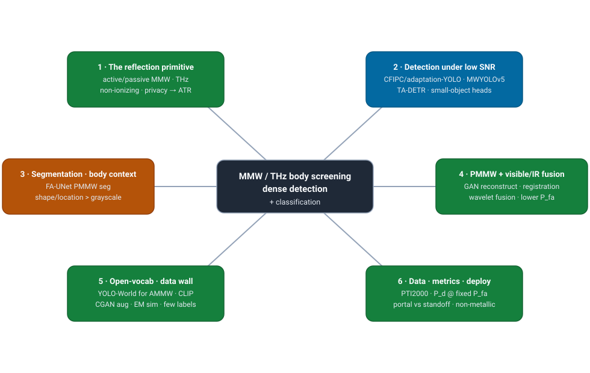
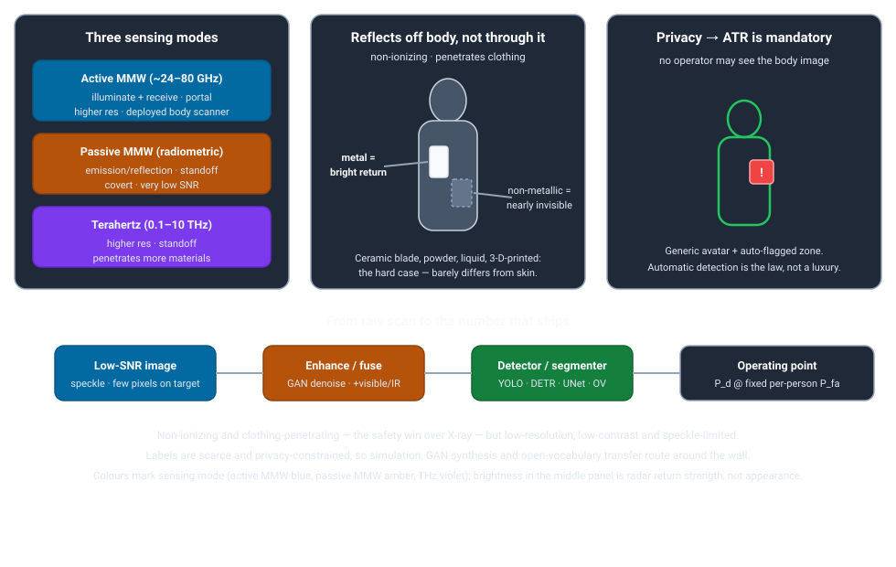

# Dense Object Detection & Classification — Recent Advances

*Compiled 2026-Jul-09 (America/Los_Angeles).*

Next installment in the running CV-updates log. Earlier entries on
`main`:
[Apr-30](../2026-Apr-30/2026-Apr-30_CV_updates.md),
[May-01](../2026-May-01/2026-May-01_CV_updates.md),
[May-02](../2026-May-02/2026-May-02_CV_updates.md),
[May-04](../2026-May-04/2026-May-04_CV_updates.md),
[May-05](../2026-May-05/2026-May-05_CV_updates.md),
[May-07](../2026-May-07/2026-May-07_CV_updates.md),
[May-08](../2026-May-08/2026-May-08_CV_updates.md),
[May-15](../2026-May-15/2026-May-15_CV_updates.md),
[May-16](../2026-May-16/2026-May-16_CV_updates.md),
[May-17](../2026-May-17/2026-May-17_CV_updates.md),
[Jun-09](../2026-Jun-09/2026-Jun-09_CV_updates.md),
[Jun-10](../2026-Jun-10/2026-Jun-10_CV_updates.md),
[Jun-12](../2026-Jun-12/2026-Jun-12_CV_updates.md),
[Jun-15](../2026-Jun-15/2026-Jun-15_CV_updates.md),
[Jun-16](../2026-Jun-16/2026-Jun-16_CV_updates.md),
[Jun-17](../2026-Jun-17/2026-Jun-17_CV_updates.md),
[Jun-19](../2026-Jun-19/2026-Jun-19_CV_updates.md),
[Jun-21](../2026-Jun-21/2026-Jun-21_CV_updates.md),
[Jun-22](../2026-Jun-22/2026-Jun-22_CV_updates.md),
[Jun-23](../2026-Jun-23/2026-Jun-23_CV_updates.md),
[Jun-24](../2026-Jun-24/2026-Jun-24_CV_updates.md),
[Jun-25](../2026-Jun-25/2026-Jun-25_CV_updates.md),
[Jun-27](../2026-Jun-27/2026-Jun-27_CV_updates.md),
[Jun-29](../2026-Jun-29/2026-Jun-29_CV_updates.md),
[Jun-30](../2026-Jun-30/2026-Jun-30_CV_updates.md),
[Jul-04](../2026-Jul-04/2026-Jul-04_CV_updates.md),
[Jul-07](../2026-Jul-07/2026-Jul-07_CV_updates.md),
[Jul-08](../2026-Jul-08/2026-Jul-08_CV_updates.md).

## Why this pass: millimetre-wave / terahertz body screening as its own primitive

The last eight passes worked **sensor primitives on their own terms** —
camera-3D / occupancy ([Jun-24](../2026-Jun-24/2026-Jun-24_CV_updates.md)),
remote-sensing spectra ([Jun-25](../2026-Jun-25/2026-Jun-25_CV_updates.md)),
the LiDAR point cloud ([Jun-27](../2026-Jun-27/2026-Jun-27_CV_updates.md)),
the event camera ([Jun-29](../2026-Jun-29/2026-Jun-29_CV_updates.md)),
thermal infrared ([Jun-30](../2026-Jun-30/2026-Jun-30_CV_updates.md)),
imaging radar ([Jul-04](../2026-Jul-04/2026-Jul-04_CV_updates.md)),
medical imaging ([Jul-07](../2026-Jul-07/2026-Jul-07_CV_updates.md)) and
subsea optical + sonar ([Jul-08](../2026-Jul-08/2026-Jul-08_CV_updates.md)).
Those covered the outdoor-autonomy stack, the clinic and the ocean.
**Millimetre-wave (MMW) and terahertz (THz) body screening** — dense detection
& classification of *objects concealed on a person* at a security portal — is a
dense-vision domain the log has never given a dedicated pass. It is *not* the
same problem as security X-ray of **baggage** (a transmission-imaging primitive):
here the wave **reflects off the body**, the target is a person rather than a
bag, and the governing constraint is a **privacy law** that no other modality in
this series has to obey. It earns its own entry.

Why it is a genuinely different primitive from every sensor covered so far:

- **It images reflection off a body, not transmission through a scene, and it is
  non-ionizing.** MMW/THz waves penetrate clothing but reflect off skin and off
  any concealed object, so the image is a **radiometric map of surface return**,
  not an attenuation map. The great practical win over X-ray is that the waves
  are **harmless** — you can scan a person all day — which is exactly why they,
  not X-ray, are used on people
  ([PMMW + visible fusion, *Sensors* 2021](https://www.mdpi.com/1424-8220/21/24/8456)).
- **The signal is low-resolution, low-contrast and speckle-limited.** Passive MMW
  images "suffer from low resolution and inherent noise," and threats present as a
  few dim pixels on a body-temperature background
  ([PMMW review](https://www.mdpi.com/1424-8220/21/24/8456)). Everything
  downstream — enhancement, fusion, small-object heads — exists to claw signal
  back out of that.
- **The non-metallic threat is the whole game.** A metal gun gives a bright,
  obvious return; a **ceramic blade, a bag of powder, a bottle of liquid or a
  3-D-printed weapon** barely differs in grayscale from skin. As one team puts it,
  "it is difficult to identify the low-reflective non-metallic threats by the
  differences in grayscale"
  ([PMMW + visible, *Sensors* 2021](https://www.mdpi.com/1424-8220/21/24/8456)).
  Aggregate mAP that is carried by easy metal cases can hide a model that misses
  the threat class that actually matters.
- **Privacy makes automatic detection a legal requirement, not an efficiency
  nicety.** Since the 2010s, regulators (TSA in the US, the EU) mandate that a
  body-scanner must **not display the passenger's image to any operator**: it must
  run **Automatic Target/Threat Recognition (ATR)** and show only a **generic
  avatar with a flagged region**. This inverts the usual human-in-the-loop
  assumption of every other modality in this series — the detector *is* the
  system; there is no screener looking at the raw image to catch its misses. It is
  the defining "on its own terms" fact of this primitive.
- **Labels are scarce and privacy-constrained.** You cannot scrape body scans off
  the web, and each labelled scan is a consented, staged collection. So the field
  leans hard on **EM simulation, GAN synthesis/augmentation, and open-vocabulary
  transfer** to route around the label wall — the same move sonar and radar made
  last month, forced here by privacy rather than cost.
- **The deployment metric is P_d at a fixed false-alarm rate — per person.** As
  with sonar mine-countermeasures and X-ray ATR, the deliverable is an **operating
  point**: probability of detection at a mandated **per-passenger** false-alarm
  rate that the lane's throughput can absorb, not COCO mAP.

This pass covers six threads of that stack:

1. **The reflection primitive & representation** — active vs. passive MMW vs.
   THz, non-ionizing reflection, low SNR/speckle, the non-metallic-threat problem,
   the **privacy→ATR** constraint, and the P_d/P_fa metric.
2. **Detection under low SNR** — the YOLO family tuned for MMW/THz (CFIPC-YOLO,
   lightweight YOLOv8n, adaptation-YOLO, MWYOLOv5) and the transformer detectors
   (task-aligned DETR for PMMW).
3. **Segmentation & body-region context** — semantic segmentation (FA-UNet) and
   using body priors so shape/location beat raw grayscale.
4. **PMMW + visible/IR fusion** — reconstructing and fusing a weak MMW image with
   a visible/IR view to cut the false-alarm rate.
5. **Open-vocabulary, foundation & the data wall** — YOLO-World / CLIP adaptation
   for AMMW, and the CGAN / EM-simulation synthesis line that fights the
   privacy-driven label scarcity.
6. **Datasets, metrics & deployment** — PTI2000 and friends, the P_d/P_fa metric,
   the MMW-vs-THz-vs-X-ray trade, and portal vs. standoff deployment.

> **Reading the numbers.** Figures are quoted from each method's own paper,
> repo or venue. **Protocols differ and are not comparable across rows** — MMW
> and THz sets differ in band, scanner, resolution and threat taxonomy, and most
> are small and private. Detection work reports mAP/AP50 on a specific set (often
> PTI2000); segmentation reports mIoU/Dice; deployed systems report **P_d at a
> fixed per-person false-alarm rate**. Where a number appears it is to show a
> trend, not to rank methods across datasets. This pass was compiled under a
> network policy that blocked direct fetches of several primary PDFs; details are
> taken from abstracts, publisher pages and repository metadata via search, and
> every claim is linked to its source so it can be checked.

---

## 1 · The reflection primitive & representation

**Three sensing modes, one physics.** All three exploit that clothing is nearly
transparent to sub-terahertz/terahertz waves while skin and dense objects reflect
them, but they trade off differently:

- **Active MMW (AMMW, ~24–80 GHz)** — the scanner *illuminates* and receives its
  own reflection, typically in a **portal** (the walk-in booth). Higher
  resolution and controlled illumination; this is the dominant **deployed**
  airport body-scanner mode ([AMMW lightweight detector, *KBS* 2025](https://dl.acm.org/doi/10.1016/j.knosys.2025.112995)).
- **Passive MMW (PMMW)** — purely **radiometric**: it measures the natural
  emission/reflection contrast between body and object with no emitter. Enables
  **standoff, covert** screening (crowds, checkpoints at a distance) but at
  **very low SNR and resolution**
  ([FA-UNet, 2024](https://onlinelibrary.wiley.com/doi/full/10.1155/2024/8628149)).
- **Terahertz (THz, 0.1–10 THz)** — higher spatial resolution and material
  contrast, standoff-capable, "a promising method … able to penetrate various
  materials and reveal hidden objects without emitting harmful radiation," and in
  some studies "proven to be a better alternative to X-ray and MMW systems"
  ([THz+MMW DL model, *Earth Sci. Informatics* 2023](https://link.springer.com/article/10.1007/s12145-023-01056-x)).

**What breaks.** The image is a low-resolution, speckle-heavy grayscale where the
body itself is the dominant "object," threats are small and dim, and — critically
— **non-metallic threats are nearly invisible in grayscale**. This is why the
research is not "run an off-the-shelf detector," but rather *enhance, fuse and
contextualise until the weak return is separable* (§2–§4).

**The privacy inversion.** Every other modality in this series assumes a human is
the last line of defence; here the regulator forbids it. ATR is **mandatory**, so
a missed detection is a system failure with no human backstop, and the community's
obsession with **false-alarm rate** (a nuisance alarm on every third passenger is
operationally fatal) follows directly. The metric is therefore an ATR operating
point — **P_d at a fixed per-person P_fa** — exactly the discipline the sonar
([Jul-08](../2026-Jul-08/2026-Jul-08_CV_updates.md)) and radiology
([Jul-07](../2026-Jul-07/2026-Jul-07_CV_updates.md)) passes ended on.

---

## 2 · Detection under low SNR — the YOLO & transformer zoo

Most 2023–26 work is a detector adapted to the weak, small-target MMW/THz image.

### 2.1 The YOLO family, tuned for MMW/THz

- **CFIPC-YOLO** (*Electronics Letters* 2025) "integrates local and contextual
  features into a progressively converging framework" on a YOLOv8 base, reporting
  **+5.3 % AP50** over the YOLOv8 baseline while **cutting parameters ~17 %** —
  the contextual aggregation is what recovers small, low-contrast threats
  ([Wiley/IET](https://ietresearch.onlinelibrary.wiley.com/doi/abs/10.1049/ell2.70367)).
- **Lightweight AMMW detectors** — a lightweight **YOLOv8n**-based architecture
  targets real-time portal throughput, and a dedicated *"lightweight and efficient
  detector for concealed objects in active MMW images"* pushes the
  accuracy-vs-latency point for the embedded scanner budget
  ([*Knowledge-Based Systems* 2025](https://www.sciencedirect.com/science/article/abs/pii/S0950705125000437)).
- **adaptation-YOLO** enhances concealed-object detection in **active THz** images,
  adapting the detector to THz's resolution/contrast regime
  ([*Sci. Rep.* 2024](https://www.nature.com/articles/s41598-024-81054-1)).
- **MWYOLOv5** (Modified Weighted YOLOv5) detects/recognises concealed weapons
  (axe, knife, gun, bomb, pistol) across **THz + MMW** imagery
  ([THz+MMW DL model, 2023](https://link.springer.com/article/10.1007/s12145-023-01056-x)),
  building on the earlier **real-time YOLOv3 PMMW** baseline
  ([YOLOv3 PMMW, 2020](https://pmc.ncbi.nlm.nih.gov/articles/PMC7147325/)).

Reported precision/recall/mAP across this literature spans a wide band —
one survey of ~101 papers (2016–2025) notes precision **78–99.5 %**, recall
**83–97 %**, mAP **~70–99 %** — a spread that is mostly *dataset variance*, and a
reminder that these numbers are not a leaderboard
([survey framing](https://link.springer.com/article/10.1007/s12145-023-01056-x)).

### 2.2 Transformers for PMMW

For the lowest-SNR passive case, a **Task-Aligned Detection Transformer** aligns
classification and localisation to stabilise detection of dim, ill-defined
returns in PMMW security imaging
([arXiv 2212.00313](https://arxiv.org/abs/2212.00313)) — the DETR-family move into
this domain, mirroring the transformer turn seen across the other modality passes.
Classical **wavelet-transform** enhancement is still used as a front-end to lift
weak returns before detection
([wavelet enhancement, *Signal Processing* 2023](https://www.sciencedirect.com/science/article/pii/S0165168423003778)).

---

## 3 · Segmentation & body-region context

Because a bounding box on a few dim pixels is fragile, a second family reframes
the task as **pixel-level segmentation** where **shape and location** — not
grayscale intensity — carry the decision.

- **FA-UNet** (*Int. J. RF & Microwave CAE* 2024) does **semantic segmentation of
  PMMW images** with a UNet + **fusion-attention** mechanism built specifically to
  "address the challenges of low signal-to-noise ratios and contrast," merging
  multi-scale features to localise the concealed object as a region rather than a
  point ([Wiley](https://onlinelibrary.wiley.com/doi/full/10.1155/2024/8628149)).
- **Body-region priors.** A recurring theme is exploiting the fact that the body
  is a predictable, segmentable backdrop: segmenting the person first, then
  reasoning about anomalous returns *relative to body region*, cuts false alarms
  from body-shape artefacts. Focus-measure and region-analysis pipelines take this
  route ([PMMW focus measures, *MTAP* 2024](https://link.springer.com/article/10.1007/s11042-024-20449-8)).

The segmentation route also dovetails with the **privacy** requirement: a
segmentation mask over a generic body model is exactly the "avatar + flagged
region" output the regulation wants, so the research output maps cleanly onto the
mandated deployment format.

---

## 4 · PMMW + visible/IR fusion

If one weak modality cannot separate a non-metallic threat from skin, **fuse it
with a complementary view**. This is the most operationally-motivated thread,
because its explicit goal is to **drive down the false-alarm rate**.

- **PMMW + visible via DNNs** (*Sensors* 2021) is the canonical pipeline: a **GAN
  reconstructs** a higher-quality image from multi-source PMMW, then a detection
  pipeline runs **semantic segmentation → image registration → a comprehensive
  analyzer** that combines PMMW shape/location with the visible view. It directly
  targets the failure mode that "previous methods … performed detection only based
  on PMMW with bounding box, which causes a high rate of false alarm"
  ([MDPI](https://www.mdpi.com/1424-8220/21/24/8456),
  [PMC](https://pmc.ncbi.nlm.nih.gov/articles/PMC8704839/)).
- **Wavelet fusion** of PMMW **sequence** images fuses temporally-adjacent frames
  to lift a stable threat signature out of frame-to-frame noise
  ([wavelet fusion, PMMW sequences](https://www.researchgate.net/publication/324848310_WAVELET_FUSION_FOR_CONCEALED_OBJECT_DETECTION_USING_PASSIVE_MILLIMETER_WAVE_SEQUENCE_IMAGES)).
- **Cross-band / thermal adjacency.** Concealed-weapon detection in **thermal IR**
  (e.g. **DEF-YOLO**, 2025) is a neighbouring modality that shares the
  "weak-signature-on-a-body" structure; it sits under the thermal-LWIR pass
  ([Jun-30](../2026-Jun-30/2026-Jun-30_CV_updates.md)) but is a natural fusion
  partner here ([DEF-YOLO, arXiv 2510.13326](https://arxiv.org/abs/2510.13326)).

The lesson matches the radar-camera and RGB-thermal fusion threads elsewhere in
the log: **fusion is about trust and false-alarm suppression**, not just adding
channels.

---

## 5 · Open-vocabulary, foundation models & the data wall

Two forces — **new threat types** you never trained on, and **scarce,
privacy-locked data** — push the field toward open-vocabulary transfer and
synthesis.

### 5.1 Open-vocabulary & foundation transfer

An **open-vocabulary detector for AMMW** (*Sci. Rep.* 2025) adapts the
**YOLO-World** framework to millimetre-wave: it adds **Multi-Scale Convolution**
and a **Task-Integrated Block** for feature extraction plus a **Text-Image
Interaction Module** whose attention "address[es] feature alignment between
millimeter-wave images and text," so the system can name **novel** concealed-object
categories beyond the training set
([Nature](https://www.nature.com/articles/s41598-025-13935-y)). This is the same
CLIP/VLM-borrowing arc seen in the remote-sensing
([Jun-25](../2026-Jun-25/2026-Jun-25_CV_updates.md)), subsea
([Jul-08](../2026-Jul-08/2026-Jul-08_CV_updates.md)) and X-ray-baggage lines —
here made harder by the huge domain gap between grayscale MMW returns and the
natural-image/text pairs CLIP was trained on.

### 5.2 Beating the (privacy-driven) data wall

- **CGAN data augmentation** for AMMW synthesises additional concealed-object
  scans to expand the tiny real training set
  ([IEEE 2021](https://ieeexplore.ieee.org/document/9569893/)), and GAN-based
  **reconstruction** doubles as denoising/super-resolution before detection
  ([*Sensors* 2021](https://www.mdpi.com/1424-8220/21/24/8456)).
- **Classic augmentation** (flip, rotate, Gaussian degradation, brightness) is
  still standard to stretch the few-thousand-image sets
  ([PTI2000 augmentation study](https://arxiv.org/abs/2212.00313)).
- **EM simulation** of the scattering physics is the physics-based synthesis
  analogue of the sonar/radar simulators from prior passes, generating labelled
  scans without a consented human subject.

The through-line is identical to the sonar and radar passes: when labels are
gated (there by cost, here by **privacy law**), **simulation + generative
synthesis + open-vocabulary transfer** carry the field.

---

## 6 · Datasets, metrics & deployment

### 6.1 The dataset landscape

The field is small-data and mostly private, which is itself a defining feature.
The most-cited public/semi-public anchor is **PTI2000**:

| Dataset | Modality | Size / spec | Notes |
|---|---|---|---|
| **PTI2000** | Active MMW | ~3,276 images, 160×400, 8-bit; 10 fps | belt buckle, phone, knife, imitation gun, bottled water, powder, … ([spec](https://arxiv.org/abs/2212.00313)) |
| **PTI2000-PMMWI** | Passive MMW | derived PMMW split | used for YOLO-World / OV-AMMW training ([OV-AMMW](https://www.nature.com/articles/s41598-025-13935-y)) |
| In-house PMMW/AMMW sets | P/A MMW | 100s–1,000s | most published results use private, staged collections |
| THz collections | Active THz | 100s–1,000s | e.g. adaptation-YOLO / THz Faster R-CNN ([THz FRCNN, *Sensors* 2018](https://doi.org/10.3390/s18072327)) |

Sizes are small (thousands, not the tens/hundreds of thousands of X-ray baggage
sets), the taxonomies are scanner-specific, and cross-dataset transfer is largely
unstudied — so **within-dataset numbers dominate and are not portable**.

### 6.2 The metric split, restated

Research reports mAP/AP50 (detection) or mIoU/Dice (segmentation) on a single set;
a deployed portal reports a **P_d at a fixed per-person false-alarm rate** set by
the regulator and the lane throughput. Because there is **no human backstop**
(§1), the false-alarm axis is unusually load-bearing: the fusion (§4) and
body-context (§3) threads exist mostly to move the P_d/P_fa operating point, not
to add a fraction of a mAP point.

### 6.3 The MMW-vs-THz-vs-X-ray trade & deployment

- **Safety** is the reason MMW/THz — not X-ray — screens *people*: non-ionizing,
  scannable indefinitely.
- **Resolution/penetration**: THz > MMW in resolution and material contrast, at
  shorter usable range; AMMW is the deployed portal workhorse; PMMW enables covert
  **standoff** screening of moving crowds
  ([THz vs MMW/X-ray discussion](https://link.springer.com/article/10.1007/s12145-023-01056-x)).
- **Form factor**: walk-through **portals** (checkpoint) vs **standoff** panels
  (crowd/perimeter). The standoff case pushes hardest on low-SNR PMMW methods (§3).
- The non-metallic-threat gap remains the open problem across all three bands, and
  is the main thing 2025–26 detectors, fusion and open-vocabulary transfer are
  trying to close.

---

## Bottom line

- **MMW/THz body screening is a reflection primitive imaged off a person, and it
  is defined as much by law as by physics.** Non-ionizing waves penetrate clothing
  and reflect off body and threat; the image is low-resolution, low-contrast and
  speckle-limited; and **privacy regulation mandates automatic detection with no
  human backstop**, which is unique among the modalities in this series.
- **The non-metallic threat is the core difficulty.** Metal is easy; a ceramic
  blade, powder, liquid or 3-D-printed weapon barely differs from skin — so
  aggregate mAP can mislead, and the honest metric is **P_d at a fixed per-person
  P_fa**.
- **Detection has converged on MMW/THz-tuned YOLOs and PMMW transformers.**
  CFIPC-YOLO, lightweight YOLOv8n/AMMW detectors, adaptation-YOLO (THz), MWYOLOv5
  and a task-aligned DETR for PMMW are the reference points; contextual
  aggregation and enhancement front-ends are what recover the weak target.
- **Segmentation, body-context and fusion exist to kill false alarms.** FA-UNet
  segmentation, body-region priors, and **PMMW + visible/IR fusion** (with GAN
  reconstruction, registration and a combined analyzer) all move the operating
  point rather than chase a fraction of a point of mAP — and a mask over a generic
  avatar is exactly the privacy-mandated output format.
- **Privacy-driven scarcity forces synthesis and open-vocabulary transfer.**
  CGAN augmentation, GAN reconstruction, EM simulation and a **YOLO-World / CLIP**
  adaptation for AMMW route around a label wall built by law, not just cost —
  the same pattern as the sonar and radar passes, differently caused.
- **Read every number within its (small, private) dataset.** PTI2000-scale sets
  and scanner-specific taxonomies make cross-dataset mAP unsafe; the deliverable is
  an ATR operating point, the same discipline the sonar and radiology passes ended
  on.

---

### Sources

*Compiled under an egress policy that blocked direct PDF fetches; details are
drawn from abstracts, publisher/venue pages and repository metadata via search,
and each item is linked so it can be verified.*

**Primitive, surveys & metrics**
- THz+MMW optimal DL model for hidden weapons (survey of ~101 papers; MWYOLOv5) — [Earth Sci. Informatics 2023](https://link.springer.com/article/10.1007/s12145-023-01056-x)
- Real-time concealed-threat detection, PMMW + visible via DNNs — [Sensors 2021](https://www.mdpi.com/1424-8220/21/24/8456), [PMC](https://pmc.ncbi.nlm.nih.gov/articles/PMC8704839/)
- PMMW security via focus measures / body-region analysis — [MTAP 2024](https://link.springer.com/article/10.1007/s11042-024-20449-8)

**Detection: YOLO & transformer**
- CFIPC-YOLO for concealed objects in MMW images — [Electronics Letters 2025](https://ietresearch.onlinelibrary.wiley.com/doi/abs/10.1049/ell2.70367)
- Lightweight & efficient detector for concealed objects in active MMW — [Knowledge-Based Systems 2025](https://www.sciencedirect.com/science/article/abs/pii/S0950705125000437), [ACM DOI](https://dl.acm.org/doi/10.1016/j.knosys.2025.112995)
- adaptation-YOLO for concealed objects in active THz images — [Sci. Rep. 2024](https://www.nature.com/articles/s41598-024-81054-1)
- Real-time PMMW concealed-object detection with YOLOv3 — [PMC 2020](https://pmc.ncbi.nlm.nih.gov/articles/PMC7147325/)
- Task-Aligned Detection Transformer for PMMW security imaging — [arXiv 2212.00313](https://arxiv.org/abs/2212.00313)
- Improved Faster R-CNN for terahertz image detection — [Sensors 2018](https://doi.org/10.3390/s18072327)
- Wavelet-transform enhancement for AMMW concealed-object detection — [Signal Processing 2023](https://www.sciencedirect.com/science/article/pii/S0165168423003778)

**Segmentation & body context**
- FA-UNet: semantic segmentation of PMMW images (fusion attention, low-SNR) — [IJRFMCAE 2024](https://onlinelibrary.wiley.com/doi/full/10.1155/2024/8628149)

**Fusion**
- PMMW + visible DNN pipeline (GAN reconstruction + segmentation + registration) — [Sensors 2021](https://www.mdpi.com/1424-8220/21/24/8456)
- Wavelet fusion of PMMW sequence images — [ResearchGate](https://www.researchgate.net/publication/324848310_WAVELET_FUSION_FOR_CONCEALED_OBJECT_DETECTION_USING_PASSIVE_MILLIMETER_WAVE_SEQUENCE_IMAGES)
- DEF-YOLO: concealed weapon detection in thermal imaging (adjacent modality) — [arXiv 2510.13326](https://arxiv.org/abs/2510.13326)

**Open-vocabulary, foundation & synthesis**
- Open-vocabulary detection for concealed objects in AMMW (YOLO-World adaptation) — [Sci. Rep. 2025](https://www.nature.com/articles/s41598-025-13935-y)
- Concealed-object detection for AMMW via CGAN data augmentation — [IEEE 2021](https://ieeexplore.ieee.org/document/9569893/)
- GLNet target detection in MMW images — [ACM ICMIP 2018](https://dl.acm.org/doi/10.1145/3195588.3195609)
