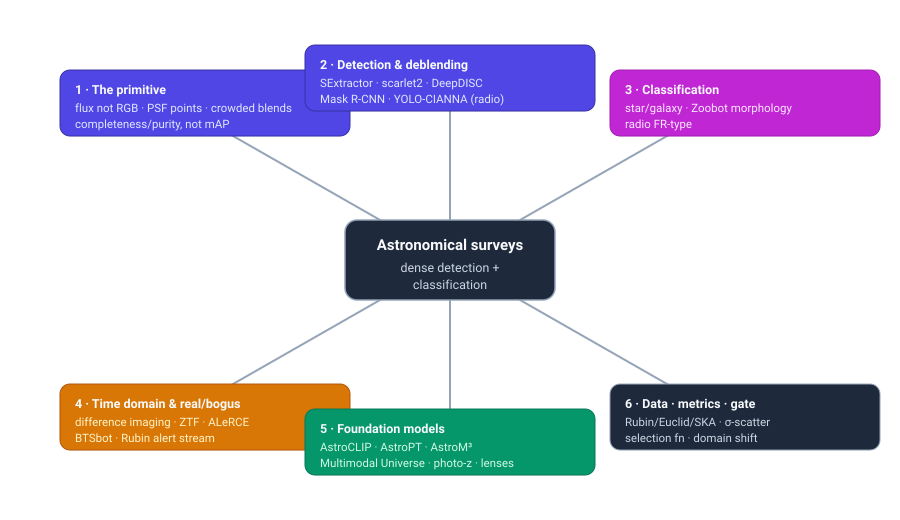
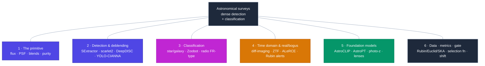
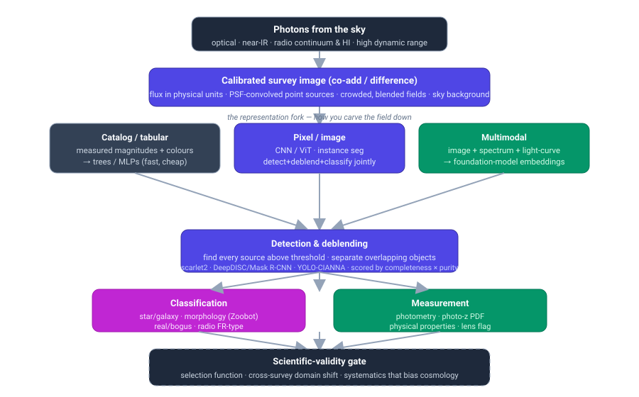

# Dense Object Detection & Classification — Recent Advances

*Compiled 2026-Jul-10 (America/Los_Angeles).*

Next installment in the running CV-updates log. Earlier entries on
`main`:
[Apr-30](../2026-Apr-30/2026-Apr-30_CV_updates.md),
[May-01](../2026-May-01/2026-May-01_CV_updates.md),
[May-02](../2026-May-02/2026-May-02_CV_updates.md),
[May-04](../2026-May-04/2026-May-04_CV_updates.md),
[May-05](../2026-May-05/2026-May-05_CV_updates.md),
[May-07](../2026-May-07/2026-May-07_CV_updates.md),
[May-08](../2026-May-08/2026-May-08_CV_updates.md),
[May-15](../2026-May-15/2026-May-15_CV_updates.md),
[May-16](../2026-May-16/2026-May-16_CV_updates.md),
[May-17](../2026-May-17/2026-May-17_CV_updates.md),
[Jun-09](../2026-Jun-09/2026-Jun-09_CV_updates.md),
[Jun-10](../2026-Jun-10/2026-Jun-10_CV_updates.md),
[Jun-12](../2026-Jun-12/2026-Jun-12_CV_updates.md),
[Jun-15](../2026-Jun-15/2026-Jun-15_CV_updates.md),
[Jun-16](../2026-Jun-16/2026-Jun-16_CV_updates.md),
[Jun-17](../2026-Jun-17/2026-Jun-17_CV_updates.md),
[Jun-19](../2026-Jun-19/2026-Jun-19_CV_updates.md),
[Jun-21](../2026-Jun-21/2026-Jun-21_CV_updates.md),
[Jun-22](../2026-Jun-22/2026-Jun-22_CV_updates.md),
[Jun-23](../2026-Jun-23/2026-Jun-23_CV_updates.md),
[Jun-24](../2026-Jun-24/2026-Jun-24_CV_updates.md),
[Jun-25](../2026-Jun-25/2026-Jun-25_CV_updates.md),
[Jun-27](../2026-Jun-27/2026-Jun-27_CV_updates.md),
[Jun-29](../2026-Jun-29/2026-Jun-29_CV_updates.md),
[Jun-30](../2026-Jun-30/2026-Jun-30_CV_updates.md),
[Jul-04](../2026-Jul-04/2026-Jul-04_CV_updates.md),
[Jul-07](../2026-Jul-07/2026-Jul-07_CV_updates.md),
[Jul-08](../2026-Jul-08/2026-Jul-08_CV_updates.md).

## Why this pass: the astronomical survey as its own primitive

The recent run of passes has worked **sensor / imaging primitives on their own
terms** — camera-3D / occupancy ([Jun-24](../2026-Jun-24/2026-Jun-24_CV_updates.md)),
remote-sensing spectra ([Jun-25](../2026-Jun-25/2026-Jun-25_CV_updates.md)), the
LiDAR point cloud ([Jun-27](../2026-Jun-27/2026-Jun-27_CV_updates.md)), the event
camera ([Jun-29](../2026-Jun-29/2026-Jun-29_CV_updates.md)), thermal infrared
([Jun-30](../2026-Jun-30/2026-Jun-30_CV_updates.md)), imaging radar
([Jul-04](../2026-Jul-04/2026-Jul-04_CV_updates.md)), medical imaging
([Jul-07](../2026-Jul-07/2026-Jul-07_CV_updates.md)) and subsea imaging
([Jul-08](../2026-Jul-08/2026-Jul-08_CV_updates.md)). Those were the *terrestrial,
clinical and marine* stacks. **Astronomical survey imaging** is the other great
dense-vision domain — and the log has never taken it whole. It earns its own pass,
and the timing is not accidental: the **Vera C. Rubin Observatory launched its
real-time alert stream on 2026-Feb-24** (≈800k alerts that first night, ramping
toward **7–10 million per night**), which makes astronomy, right now, one of the
largest live dense-detection-and-classification problems on Earth.

The astronomical image is a genuinely different primitive from every sensor covered
so far:

- **The pixel is calibrated flux, not colour — over an enormous dynamic range.**
  A survey pixel carries a physical brightness (a magnitude / flux density in
  nanomaggies or Janskys), and a single field spans a saturated foreground star and
  a galaxy a *billion* times fainter. "Bands" (`u g r i z y`, or radio frequency
  channels) are photometric measurements, not an RGB triple. Asinh/percentile
  stretches, per-band PSF matching and sky-background subtraction do the work RGB
  tricks do elsewhere — and, as [DeepDISC](https://github.com/grantmerz/deepdisc)
  found, the *contrast scaling you choose changes which detector wins*.
- **Most "objects" are point sources smeared by the instrument.** A star is a
  delta function convolved with a **point-spread function (PSF)** that varies across
  the focal plane and between exposures; the detection problem is matched-filtering
  against a known, drifting PSF rather than recognising an extended shape. There is
  no COCO-style silhouette to latch onto.
- **The scene is crowded and the objects overlap — "detection" *is* deblending.**
  In deep co-adds a large fraction of sources are **blended** with a neighbour;
  separating overlapping light is not a post-processing nicety but the core task,
  because blends bias every downstream flux, shape and redshift. This is the
  field's version of the representation fork — and it has no clean natural-image
  analogue.
- **The target is a needle in a haystack, asymmetrically, and the metric says so.**
  A real supernova hides among thousands of subtraction artefacts; a strong
  gravitational lens is roughly **one in ten thousand** galaxies. So astronomy
  scores detection with **completeness (recall) at fixed purity (precision)** — or a
  **ROC / TPR-at-fixed-FPR** operating point — not COCO mAP. As in the medical pass,
  *the operating point is the deliverable*.
- **Labels are scarce, expensive and often only weak or simulated.** There is no
  astronomical ImageNet: ground truth needs spectroscopy (expensive), a citizen-
  science army (Galaxy Zoo), or a simulation whose realism you must then defend. So
  the 2024–26 story is the familiar one — **self-supervised foundation models,
  weak/citizen labels, and cross-modal (image ↔ spectrum) supervision** that route
  around the label bottleneck.
- **Distribution shift and systematics are first-class, because the output feeds
  cosmology.** A model that looks perfect on one survey degrades on the next
  (different depth, PSF, filters, sky); worse, a subtle detection or photo-z bias
  propagates into a **cosmological parameter**. The gate between a benchmark number
  and a published result is a **selection-function / systematics** audit — astronomy's
  answer to the medical pass's fairness-and-FDA gate.

This pass covers six threads of that stack:

1. **The primitive & representation** — flux vs colour, the PSF, blending, the
   needle-in-a-haystack metric, and the catalog-vs-pixel-vs-multimodal fork.
2. **Source detection & deblending** — the classical baselines (SExtractor,
   scarlet2) and the deep instance-segmentation detectors (DeepDISC, Mask R-CNN),
   plus the radio-continuum object detectors.
3. **Classification** — star/galaxy separation, galaxy morphology (Zoobot / Galaxy
   Zoo), and radio-morphology typing.
4. **The time domain & real/bogus** — difference imaging, the ZTF-era CNN
   real/bogus classifiers, alert brokers (ALeRCE, BTSbot), and the Rubin alert
   stream now live.
5. **Foundation models & the no-labels escape** — AstroCLIP, AstroPT, AstroM³,
   Zoobot-as-foundation-model, photometric-redshift PDFs, and CNN lens-finding.
6. **Datasets, benchmarks, metrics & the scientific-validity gate** — Rubin /
   Euclid / SKA / Roman, the Multimodal Universe, completeness/purity vs σ-scatter,
   and the selection-function / domain-shift reckoning.

> **Reading the numbers.** Figures are quoted from each method's own paper, repo,
> data-release page or challenge. **Protocols differ and are not comparable across
> rows.** Detection/deblending reports **completeness × purity** (or an F1 at a
> chosen threshold); real/bogus reports **AUC / TPR at fixed FPR**; morphology
> reports **vote-fraction accuracy or per-class F1**; photometric redshift reports
> **scatter σ (often σNMAD), outlier fraction and bias**. Treat every
> cross-row delta as indicative, not controlled. arXiv IDs encode submission month
> (`2307.xxxxx` = Jul 2023; `2604.xxxxx` = Apr 2026).
>
> **Verification note.** This run's egress policy allowed web *search* and fetches
> of **GitHub / project / data-release pages**, but direct fetches of `arxiv.org`,
> `nature.com`, `aanda.org` and journal PDFs frequently returned HTTP 403. So arXiv
> IDs, venues and most numbers were cross-checked against authors' **GitHub
> READMEs**, observatory data-release pages, and multiple independent search
> snippets rather than the abstract PDFs. Numbers pinned to a primary repo/page are
> stated plainly; figures available only via secondary summaries are flagged
> *(secondary)* or *(unverified)*. 2026 (`2601`–`2607`) arXiv IDs are real preprints
> not yet page-verified.

## Topic map

## 1 · The primitive & representation — why the astronomical image forces different choices

There is one dominant signal chain — photons → a calibrated, PSF-convolved,
crowded image — and the first design decision is **how you carve the field down**
to feed a model.

- **The representation fork: catalog vs pixel vs multimodal.** The oldest and still
  fastest route is **tabular** — run a classical detector, measure magnitudes and
  colours per object, and hand the *catalog* to a tree ensemble or MLP. The modern
  route is **pixel-level** — feed the multi-band image directly to a CNN or ViT and
  let it detect, deblend and classify jointly. The frontier route is **multimodal**
  — align the image with the object's *spectrum* and/or *light curve* in a shared
  embedding (Section 5). Each trades cost for information: the catalog throws away
  morphology and blend context; the pixel model recovers it at compute cost; the
  multimodal model recovers physics the image alone cannot express. This is the same
  accuracy-vs-compute knob the LiDAR pass framed as voxel-vs-point
  ([Jun-27](../2026-Jun-27/2026-Jun-27_CV_updates.md)) and the event pass as "how
  little asynchrony you throw away" ([Jun-29 §1](../2026-Jun-29/2026-Jun-29_CV_updates.md)).
- **Flux is physics, and there is no colour.** A pixel value is a calibrated
  brightness; the "bands" are photometric filters (`ugrizy` for optical, frequency
  channels for radio), and a field routinely spans **>20 magnitudes** (a factor of
  ~10⁸) of dynamic range. Asinh/percentile stretching, per-band PSF homogenisation
  and sky subtraction are the pre-processing that matters — and
  [DeepDISC](https://arxiv.org/abs/2307.05826) reports that **transformer backbones
  are markedly more robust to the choice of contrast scaling than CNNs**, a
  concrete, astronomy-specific reason to prefer them.
- **The object is a point source convolved with a drifting PSF.** Most detections
  are unresolved: a star is the PSF itself. Detection is matched-filtering against a
  PSF that varies across the focal plane and between exposures; separating a barely-
  resolved galaxy from a stellar PSF (**star/galaxy separation**, §3) is a primitive
  task with no COCO analogue.
- **Detection *is* deblending, and blends are the dominant systematic.** In deep
  co-adds a large fraction of sources overlap on the sky; unmodelled blending biases
  flux, shape (critical for weak-lensing cosmology) and redshift. That is why the
  LSST pipeline treats **deblending as a first-class stage** (`meas_deblender` /
  scarlet) rather than a clean-up pass — a design decision no natural-image detector
  has to make.
- **The metric is completeness × purity, not mAP.** Because the science target is a
  rare needle (a supernova among artefacts, a lens among 10⁴ galaxies), the field
  scores at a chosen operating point: **completeness (recall) at fixed purity
  (precision)**, or **TPR at a tolerable FPR**. As with medical FROC
  ([Jul-07 §1](../2026-Jul-07/2026-Jul-07_CV_updates.md)), the *operating point is
  the deliverable*, and a raw accuracy number is close to meaningless without it.
- **Labels are scarce; the escapes are self-supervision, citizen science and
  simulation.** There is no astronomical ImageNet. Ground truth comes from
  spectroscopy (slow, expensive), citizen-science volunteers (Galaxy Zoo's ~10⁸
  labels), or physics simulations whose realism must be defended. Section 5 is about
  the resulting foundation-model / cross-modal escape — the *same* no-labels story
  the event, thermal and radar passes told, on a domain where it is existential.

## 2 · Source detection & deblending — from SExtractor to instance segmentation

Detection and deblending are one task here, and the stack has three live layers: the
classical baselines everyone still reports against, deep instance-segmentation
detectors that do detect+deblend+classify jointly, and dedicated radio detectors.
*Numbers use each work's own completeness/purity or F1 and are not comparable across
rows.*

**The classical baselines — still the reference, still deployed.**
- **[SExtractor](https://www.astromatic.net/software/sextractor/)** (Bertin &
  Arnouts 1996) — thresholding + connected-component segmentation + deblending on a
  multi-thresholding tree — remains the most-cited detection code in astronomy and
  the baseline every deep method quotes against. Its successor
  **[SEP](https://github.com/kbarbary/sep)** exposes the same algorithm as a Python
  library.
- **[scarlet](https://github.com/pmelchior/scarlet)** ([arXiv 1802.10157](https://arxiv.org/abs/1802.10157))
  reframed *deblending* as **constrained matrix factorisation**: model each source
  as an **SED × non-parametric morphology**, with symmetry/monotonicity constraints
  and per-band PSF handling, so overlapping light is separated physically. It is the
  deblender inside the **LSST Science Pipelines** (`meas_deblender`).
  **[scarlet2](https://github.com/pmelchior/scarlet2)** re-implements it in JAX +
  equinox and *replaces the proximal constraints with learned priors* — a
  score-matching / diffusion prior over galaxy morphology
  ([arXiv 2401.07313](https://arxiv.org/abs/2401.07313)) — the clearest sign the
  classical and deep lines are merging.

**Deep instance segmentation — detect + deblend + classify jointly.**
- **[DeepDISC](https://github.com/grantmerz/deepdisc)** (Merz et al., *MNRAS* 2023,
  [arXiv 2307.05826](https://arxiv.org/abs/2307.05826)) is the flagship: it puts
  **Detectron2** (Mask R-CNN → transformer backbones) onto multi-band survey images
  to do **detection, instance-segmentation deblending, and classification
  simultaneously**, demonstrated on **Hyper Suprime-Cam** deep data. Its headline
  finding is architectural — **transformers beat CNNs and are far more robust to
  contrast scaling** — and it is explicitly built to port to LSST and Roman.
- The lineage extends fast: **[DeepDISC-photoz](https://arxiv.org/abs/2411.18769)**
  (Nov 2024) adds per-object **photometric-redshift PDFs** to the same pixel model
  on simulated Rubin LSST co-adds, and **[DeepDISC-Euclid](https://arxiv.org/abs/2604.03182)**
  (2026) applies it to real **Euclid Deep Field North** data for joint source
  classification + photo-z — one network replacing a detect→measure→classify
  pipeline *(2026 preprint, secondary)*.
- The idea predates DeepDISC: **[Mask R-CNN deblending](https://arxiv.org/abs/1908.02748)**
  (Burke et al. 2019) first showed instance segmentation could *deblend and classify
  star vs galaxy* on simulated DECam images, and remains the reference for "detection
  as instance segmentation" in this domain.

**Radio-continuum detection — a different noise model, the same object-detection
turn.** Radio maps have correlated noise, extended multi-component sources and
side-lobes, so the classical finders (Aegean, PyBDSF, ProFound) are being joined by
object detectors:
- **[YOLO-CIANNA](https://arxiv.org/abs/2402.05925)** (Cornu et al. 2024) is a
  YOLO-inspired source detector applied to the **SKAO Science Data Challenge 1**,
  reporting a large gain in the challenge's combined detection+characterisation score
  over classical finders *(secondary)*.
- A broad 2024–26 line — **[detection and classification of radio sources with deep
  learning](https://arxiv.org/abs/2411.08519)**, self-supervised contrastive radio
  learning (Slijepcevic et al., *PASA*), and **[SKAO source-finding for
  science](https://arxiv.org/abs/2607.03736)** — is preparing for the **~50 million
  sources** SKA precursors (MeerKAT, ASKAP, LOFAR) will detect, at petabyte scale.

## 3 · Classification — star/galaxy separation, morphology, and radio type

Once sources are found, the classification tasks split into three characteristic
problems, each with its own metric.

**Star/galaxy (and QSO) separation — the oldest classifier, freshly re-run on
Rubin.** Distinguishing a barely-resolved galaxy from a stellar PSF is a foundational
task, historically solved with morphological-parameter cuts and then boosted trees on
catalog features. A 2026 **[pilot study on Rubin Data Preview 1](https://arxiv.org/abs/2603.25262)**
re-runs a **random forest** on the first deep LSST-pipeline catalogs — a reminder that
on tabular photometry, classical ML is still the sensible default, and that the *new*
work is calibrating it against Rubin's actual depth and PSF *(2026 preprint,
secondary)*.

**Galaxy morphology — Zoobot and the Galaxy Zoo pipeline.** This is the domain's
signature dense-classification task: assign detailed morphology (spiral/elliptical,
bar, merger, rings, arm count) to every resolved galaxy.
- **[Zoobot](https://github.com/mwalmsley/zoobot)** (Walmsley et al., *JOSS* 2023;
  methodology [arXiv 2110.12735](https://arxiv.org/abs/2110.12735)) is the reference model — a
  Bayesian CNN/ViT that learns from **uncertain volunteer votes** and predicts full
  posteriors over what Galaxy Zoo volunteers *would* have said. It is trained on
  **~92 million** volunteer classifications across GZ2 / Hubble / CANDELS / DECaLS /
  DESI, and is now explicitly positioned as a **foundation model for extragalactic
  morphology**: fine-tune it and it adapts to new tasks (finding ring galaxies, bar
  fractions) with far less labelled data than training from scratch.
- The training substrate keeps growing: **[Galaxy Zoo Evo](https://arxiv.org/abs/2512.23691)**
  assembles **~104M crowdsourced labels for ~823k images** (four telescopes) as a
  unified pretraining/benchmark set for galaxy foundation models,
  and Zoobot has been run at survey scale on **Euclid** — detailed morphologies for
  the Q1 release (bar fractions) and **[Galaxy Zoo: Cosmic Dawn](https://arxiv.org/abs/2509.22311)**
  morphologies for **>41,000** galaxies in the Euclid Deep Field North (2025).
  **Cross-survey domain adaptation** (DECaLS → BASS/MzLS,
  [arXiv 2412.15533](https://arxiv.org/abs/2412.15533)) is now an explicit thread —
  the field has learned that a morphology model does *not* transfer for free between
  instruments.

**Radio-morphology classification — FR-type and beyond.** Radio galaxies are typed
by morphology (Fanaroff–Riley I vs II, bent-tail, ring), and automated typing is a
stated SKAO requirement given the billions of sources coming. The 2025 turn is toward
**vision-language** models: **[radio-llava](https://arxiv.org/abs/2503.23859)** (*PASA*
2025) fine-tunes a VLM on radio-source imagery + captions so morphology can be queried
and described in natural language — the open-vocabulary pivot the log tracked on
natural images ([Jun-12](../2026-Jun-12/2026-Jun-12_CV_updates.md)) arriving in radio
astronomy.

## 4 · The time domain & real/bogus — difference imaging at alert-stream scale

The other half of astronomical dense detection is **change**: subtract a reference
image from a new one and detect what moved or varied. The catch is that image
subtraction produces **far more artefacts than real sources**, so the core classifier
is **real/bogus** — a binary detector run on every candidate, at a scale that only
just became real.

- **The input is the image triplet.** The canonical representation, from the
  **[Zwicky Transient Facility](https://arxiv.org/abs/1907.11259)** (ZTF), is a
  **science / reference / difference** stamp triplet fed to a CNN; the classifier
  learns to reject dipoles, bad subtractions, cosmic rays and hot pixels. This is
  literally difference-image dense detection: a real transient is a needle among
  thousands of subtraction artefacts.
- **Alert brokers are the deployed classifiers.** **[ALeRCE](https://arxiv.org/abs/2008.03309)**
  runs a real-time **CNN "stamp classifier"** that sorts each ZTF alert into AGN,
  SN, variable star, asteroid or bogus at **~94% accuracy** on first detection — the
  reference for turning a raw alert stream into typed science. **[BTSbot](https://arxiv.org/abs/2401.15167)**
  (2024) is a **multi-input CNN** (image stamps + metadata) that identifies bright
  extragalactic transients and **infant supernovae** in ZTF, enabling a *fully
  automated* discovery→classification→follow-up loop with no human in the vetting
  step. Newer real/bogus schemes push the operating point hard — the **Tomo-e Gozen**
  two-step supervised + semi-supervised classifier reports **AUC 0.9998 at FPR
  2×10⁻⁴** *(secondary)*, and 2025 work leans on **active / semi-supervised learning**
  to cut the vetting-label cost.
- **Rubin makes this the largest live classification problem in science.** The
  **Rubin alert stream launched 2026-Feb-24** (≈**800k** alerts the first night,
  ramping toward **7–10 million per night**), broadcast to community brokers
  (ALeRCE, ANTARES, Fink, Lasair, Pitt-Google). The bottleneck has shifted from
  *detecting* transients to **classifying and prioritising** them fast enough for
  follow-up — see **[AAS2RTO](https://arxiv.org/abs/2501.06968)** (automated alert →
  real-time observation) and the difference-imaging bridge work
  ([arXiv 2507.22156](https://arxiv.org/abs/2507.22156)) staging early LSST discovery
  with DECam. A 2025 *Nature Astronomy* result even uses **LLMs to generate textual
  interpretations of transient image classifications**
  ([DOI](https://www.nature.com/articles/s41550-025-02670-z)) — the grounded-
  generation turn the medical pass described ([Jul-07 §5](../2026-Jul-07/2026-Jul-07_CV_updates.md)),
  arriving in the time domain.

## 5 · Foundation models & the no-labels escape

The biggest structural shift since the log last touched astronomy is the arrival of
**self-supervised and cross-modal foundation models** that route around the
spectroscopic-label bottleneck — the same distil / self-supervise / align escape the
radar ([Jul-04 §5](../2026-Jul-04/2026-Jul-04_CV_updates.md)) and medical
([Jul-07 §4](../2026-Jul-07/2026-Jul-07_CV_updates.md)) passes described.

**Cross-modal and generative foundation models.**
- **[AstroCLIP](https://github.com/PolymathicAI/AstroCLIP)** (Lanusse et al., *MNRAS*
  2024, [arXiv 2310.03024](https://arxiv.org/abs/2310.03024)) is the flagship: it
  embeds **galaxy images and spectra into a shared, physically meaningful latent
  space** via self-supervised encoders aligned with a contrastive loss. The frozen
  embeddings do photo-z, morphology and physical-property estimation with **no
  fine-tuning** — matching a trained ResNet18 on photo-z and **beating supervised
  baselines by ~19% R²** on stellar mass / age / metallicity / sSFR. It is the clean
  demonstration that image↔spectrum alignment recovers physics the image alone
  cannot.
- **[AstroPT](https://github.com/Smith42/astroPT)** (Smith et al. 2024,
  [arXiv 2405.14930](https://arxiv.org/abs/2405.14930)) is the **autoregressive** GPT-
  style "large observation model" — pretrained on **8.6M** 512² `grz` DESI Legacy
  galaxy stamps, scaled from **1M → 2.1B** parameters, and shown to follow a
  **saturating log-log scaling law** like text models. It is the proof that the
  scaling-laws playbook transfers to raw astronomical pixels.
- **[AstroM³](https://arxiv.org/abs/2411.08842)** extends the CLIP recipe to **three
  modalities** — time-series photometry + spectra + tabular metadata — for variable-
  star and transient science; radio has its own emerging backbone
  (**[STRADAViT](https://arxiv.org/abs/2603.29660)**, self-supervised ViT for radio,
  2026 *(unverified)*). And **Zoobot** (§3) is itself now used as a pretrained
  extragalactic backbone, not just a morphology head.

**Photometric redshift — the classifier that feeds cosmology.** Estimating redshift
from broadband photometry is a per-object regression that must output a **calibrated
PDF**, not a point estimate, because the ensemble N(z) drives every cosmological
inference. The modern toolkit is **mixture-density networks**, **Bayesian NNs**, and
**classification-into-redshift-bins** heads producing per-object posteriors — bench-
marked for LSST and now trained against **DESI DR1** (≈**13M** reliable spectroscopic
redshifts over 9,000 deg², released Mar 2025) and Pan-STARRS/DESI-Legacy PDFs
([arXiv 2602.01548](https://arxiv.org/abs/2602.01548)). Foundation-model embeddings
(AstroCLIP) and pixel detectors (DeepDISC-photoz) increasingly fold photo-z into the
same network that did detection.

**Strong-lens finding — rare-object detection at survey scale.** A galaxy-galaxy
strong lens is roughly **one in 10⁴** galaxies, so lens finding is the purest rare-
detection problem, and **CNNs are the default finder**. **Euclid** is the driver: CNN
searches of the Early Release Observations flagged **8,469** candidates from 13 fields,
narrowed by visual inspection to **~97 (14 grade-A, 31 grade-B)**
([arXiv 2411.16808](https://arxiv.org/abs/2411.16808),
[arXiv 2502.09802](https://arxiv.org/abs/2502.09802)), and the **Q1 "Strong Lensing
Discovery Engine"** ([arXiv 2503.15326](https://arxiv.org/abs/2503.15326)) scaled the
CNN + citizen-science pipeline further, on the way to Euclid's forecast **~170,000**
lenses. The recurring lesson — quantified in **[selection functions of lens-finding
networks](https://arxiv.org/abs/2307.10355)** — is that the network's *completeness as
a function of lens properties* is itself a systematic that must be measured before the
sample can be used for cosmology.

## 6 · Datasets, benchmarks, metrics & the scientific-validity gate

**The metric is the message.** As in the medical pass, you cannot read this field
with one number. Detection/deblending reports **completeness × purity** (or F1 at a
threshold); real/bogus reports **AUC / TPR at fixed FPR**; morphology reports
**vote-fraction accuracy or per-class F1**; photo-z reports **scatter σNMAD,
outlier fraction and bias**. The heterogeneity *is* a finding — a "99.98% AUC" and a
"completeness 0.9 at purity 0.99" describe different sciences and cannot be compared.

**The surveys that define the tasks.**
- **[Vera C. Rubin Observatory / LSST](https://www.lsst.org/)** — the decade-defining
  optical survey; **Data Preview 1 (DP1)** (ComCam, Nov 2023–Dec 2024) is the current
  sandbox, and the **alert stream launched Feb 2026** at up to ~10M alerts/night. It
  is the reason the whole detection+deblending+real/bogus stack is being re-validated
  in 2025–26.
- **[Euclid](https://www.euclid-ec.org/)** (ESA) — space-based optical+NIR; ERO and
  **Quick Release Q1** already drive the lens-finding and Zoobot-morphology work, with
  all-sky forecasts of ~170k lenses and morphologies for tens of millions of galaxies.
- **SKA precursors** — **MeerKAT / ASKAP / LOFAR** feeding the **[SKAO](https://www.skao.int/)**;
  petabyte-scale radio-continuum surveys with ~50M detectable sources drive the radio
  object-detection and self-supervised work (§2, §3).
- **[ZTF](https://www.ztf.caltech.edu/)** and the **[Roman Space Telescope](https://roman.gsfc.nasa.gov/)**
  bracket the time domain: ZTF is the training ground for every deployed real/bogus
  classifier; Roman is the next high-resolution deblending/photo-z target DeepDISC and
  scarlet2 are being built toward.

**The training substrate — machine-learning-ready at last.** The
**[Multimodal Universe](https://github.com/MultimodalUniverse/MultimodalUniverse)**
(NeurIPS 2024, [arXiv 2412.02527](https://arxiv.org/abs/2412.02527)) is the field's
analogue of a curated pretraining corpus: **~100 TB** of ML-ready data — **>120M
galaxy images, >5M spectra, light curves for >3.5M objects, and ~220M Gaia stars** —
behind a one-line loader, explicitly to lower the cost of building astronomical
foundation models. The **["Galaxy's Guide to the Tokenizer"](https://arxiv.org/abs/2606.25610)**
benchmark (2026) is the emerging *evaluation* counterpart, probing how scientific
foundation models should represent heterogeneous astronomical data *(2026 preprint)*.

**The scientific-validity gate — where a benchmark number is not a result.** The
dominant 2025–26 narrative, exactly as in medical imaging, is not a new SOTA — it is a
**reckoning with what the model actually feeds**:
- **Selection functions.** A detector or lens-finder has a completeness that *varies
  with object properties*; if unmeasured, that bias propagates straight into a
  luminosity function or a cosmological constraint. Measuring the network's selection
  function ([arXiv 2307.10355](https://arxiv.org/abs/2307.10355)) is now a required
  step, not an afterthought.
- **Cross-survey domain shift.** Morphology models degrade between instruments
  (DECaLS → BASS/MzLS domain adaptation, [arXiv 2412.15533](https://arxiv.org/abs/2412.15533));
  a real/bogus classifier tuned on one camera does not transfer to another
  ([transfer learning for small-field surveys](https://arxiv.org/abs/2606.15705)). The
  distribution-shift problem the pathology pass framed as "embeddings cluster by
  scanner, not cancer" ([Jul-07 §6](../2026-Jul-07/2026-Jul-07_CV_updates.md)) is here
  "embeddings cluster by telescope, not physics."
- **Calibration and simulated-to-real gap.** Photo-z PDFs must be *calibrated* (their
  N(z) drives cosmology), and deblenders trained on simulations must be shown not to
  imprint the simulation's assumptions — the astronomical version of the medical
  calibration/conformal thread.

## Cross-cutting theme: the same escapes, on a domain whose gate is cosmology

Read end-to-end, this pass tells the *same structural story* as the sensor and
medical passes before it — a distinct primitive, a representation fork, a no-labels
escape, a foundation-model pivot, and a gate between benchmark and deployment — but
with a stake that is neither a car nor a patient: **a cosmological measurement**.

- **The representation fork is "how do you carve down a crowded, calibrated field."**
  Catalog vs pixel vs multimodal (§1) is the accuracy-vs-compute knob every prior
  pass had — voxel-vs-point for LiDAR ([Jun-27](../2026-Jun-27/2026-Jun-27_CV_updates.md)),
  3-D-patch-vs-tile for medical ([Jul-07 §1](../2026-Jul-07/2026-Jul-07_CV_updates.md)).
  Astronomy's twist: the objects **overlap**, so "detection" and "deblending" are the
  *same* task, and the metric (completeness × purity) is dictated by the rarity of the
  science target, not by IoU.
- **No labels routes around the problem the same three ways.** There is no
  astronomical ImageNet, so the field **self-supervises** (AstroPT, STRADAViT,
  contrastive radio), **aligns cross-modal** (AstroCLIP, AstroM³ — image ↔ spectrum ↔
  light-curve), or **borrows citizen-science weak labels** (Zoobot on ~10⁸ Galaxy Zoo
  votes). This is the identical escape the event, thermal and radar passes described —
  with cross-modal alignment doing here what report-supervision did in medical.
- **Detection is being absorbed into joint, multi-task networks.** DeepDISC does
  detect + deblend + classify + photo-z in *one* pixel network (§2, §5); foundation-
  model embeddings + a linear probe increasingly replace bespoke per-task pipelines
  (§5). The same consolidation the medical pass saw — detection drifting toward
  promptable/foundation primitives — shows up in astronomy as **one image model
  emitting the whole measurement vector**.
- **The scale is suddenly real, and it is a classification bottleneck.** Rubin's live
  alert stream (§4) and SKA's 50M radio sources (§2) mean the constraint has shifted
  from *can we detect it* to *can we classify and prioritise it in real time* — the
  deployment-at-scale problem the AV passes (radar, occupancy) were built around,
  arriving in astronomy in 2026.
- **The gate is cosmology, not a regulator.** Selection functions, cross-survey
  domain shift, calibrated photo-z PDFs and the simulated-to-real gap (§6) are not
  optional polish: an unmeasured detection bias becomes a biased dark-energy
  constraint. This is the structural twin of the medical pass's fairness/FDA gate —
  a benchmark win means nothing until it survives a **systematics** audit on the way
  to a published number.
- **Venue signal.** The settled lineage is 1996–2019 (SExtractor, scarlet, ZTF
  real/bogus, Mask R-CNN deblending, ALeRCE); the genuinely new work clusters in
  late-2023→2026 (`2307`–`2607`) — DeepDISC and its Euclid/photo-z extensions,
  scarlet2 with learned priors, AstroCLIP / AstroPT / AstroM³, Zoobot-as-foundation-
  model + Galaxy Zoo Evo, the Multimodal Universe, radio object detectors + radio-
  llava, and Euclid CNN lens-finding — and skews hard toward **self-supervised /
  cross-modal foundation models, joint multi-task pixel networks, real-time alert
  classification, and a turn toward selection-function and domain-shift rigour.**

The one-line takeaway: **the astronomical survey is a dense-detection primitive where
the pixel is calibrated flux over 10⁸ of dynamic range, objects are PSF-smeared and
overlapping so detection *is* deblending, labels come from spectroscopy or citizen
science, the metric is completeness-at-fixed-purity — and, alone among the primitives,
a benchmark win means nothing until it survives a selection-function and systematics
gate on the way to a cosmological measurement.**

---

## Sources & further reading

**Surveys, framing & the primitive**
- DAWES review 10 (deep learning for galaxy surveys) — [arXiv 2210.01813](https://arxiv.org/abs/2210.01813); DeepDISC (detect+deblend+classify) — [arXiv 2307.05826](https://arxiv.org/abs/2307.05826) · [code](https://github.com/grantmerz/deepdisc).
- LSST source-detection pipeline tutorial — [DP0.2 notebook](https://dp0-2.lsst.io/_static/nb_html/DP02_05_Source_Detection_and_Measurement.html); Rubin project status — [lsst.org](https://www.lsst.org/about/project-status).

**2 · Detection & deblending**
- SExtractor — [AstrOmatic](https://www.astromatic.net/software/sextractor/); SEP — [code](https://github.com/kbarbary/sep); scarlet — [arXiv 1802.10157](https://arxiv.org/abs/1802.10157) · [code](https://github.com/pmelchior/scarlet); scarlet2 — [code](https://github.com/pmelchior/scarlet2); score-matching deblending priors — [arXiv 2401.07313](https://arxiv.org/abs/2401.07313).
- DeepDISC — [arXiv 2307.05826](https://arxiv.org/abs/2307.05826) · [MNRAS](https://academic.oup.com/mnras/article/526/1/1122/7273850); DeepDISC-photoz — [arXiv 2411.18769](https://arxiv.org/abs/2411.18769); DeepDISC-Euclid — [arXiv 2604.03182](https://arxiv.org/abs/2604.03182); Mask R-CNN deblending — [arXiv 1908.02748](https://arxiv.org/abs/1908.02748).
- Radio: YOLO-CIANNA — [arXiv 2402.05925](https://arxiv.org/abs/2402.05925); detection+classification of radio sources — [arXiv 2411.08519](https://arxiv.org/abs/2411.08519); SKAO source finding — [arXiv 2607.03736](https://arxiv.org/abs/2607.03736).

**3 · Classification**
- Star/galaxy on Rubin DP1 (random forest) — [arXiv 2603.25262](https://arxiv.org/abs/2603.25262).
- Zoobot — [arXiv 2110.12735](https://arxiv.org/abs/2110.12735) · [JOSS](https://joss.theoj.org/papers/10.21105/joss.05312) · [code](https://github.com/mwalmsley/zoobot); Galaxy Zoo Evo — [arXiv 2512.23691](https://arxiv.org/abs/2512.23691); Euclid morphology (ML) — [arXiv 2402.10187](https://arxiv.org/abs/2402.10187); Galaxy Zoo: Cosmic Dawn (EDF-N) — [arXiv 2509.22311](https://arxiv.org/abs/2509.22311); DECaLS→BASS/MzLS domain adaptation — [arXiv 2412.15533](https://arxiv.org/abs/2412.15533).
- radio-llava — [arXiv 2503.23859](https://arxiv.org/abs/2503.23859) · [PASA](https://www.cambridge.org/core/journals/publications-of-the-astronomical-society-of-australia/article/radiollava-advancing-visionlanguage-models-for-radio-astronomical-source-analysis/5E14BA0AE0C6196B63E8041CEB934B35).

**4 · Time domain & real/bogus**
- ZTF — [arXiv 1907.11259](https://arxiv.org/abs/1907.11259); ALeRCE stamp classifier — [arXiv 2008.03309](https://arxiv.org/abs/2008.03309); BTSbot — [arXiv 2401.15167](https://arxiv.org/abs/2401.15167); Tomo-e Gozen real/bogus — [PASJ](https://academic.oup.com/pasj/article/74/4/946/6613422); AAS2RTO — [arXiv 2501.06968](https://arxiv.org/abs/2501.06968); early LSST discovery via DECam diff-imaging — [arXiv 2507.22156](https://arxiv.org/abs/2507.22156); transfer learning for small-field transient search — [arXiv 2606.15705](https://arxiv.org/abs/2606.15705); LLM interpretation of transient classifications — [Nat. Astron.](https://www.nature.com/articles/s41550-025-02670-z); Rubin alert stream launch — [Stanford Report 2026](https://news.stanford.edu/stories/2026/02/rubin-observatory-real-time-alerts-astronomical-events).

**5 · Foundation models, photo-z & lens finding**
- AstroCLIP — [arXiv 2310.03024](https://arxiv.org/abs/2310.03024) · [MNRAS](https://academic.oup.com/mnras/article/531/4/4990/7697182) · [code](https://github.com/PolymathicAI/AstroCLIP); AstroPT — [arXiv 2405.14930](https://arxiv.org/abs/2405.14930) · [code](https://github.com/Smith42/astroPT); AstroM³ — [arXiv 2411.08842](https://arxiv.org/abs/2411.08842); STRADAViT (radio) — [arXiv 2603.29660](https://arxiv.org/abs/2603.29660).
- Photo-z PDFs (DESI-Legacy / Pan-STARRS) — [arXiv 2602.01548](https://arxiv.org/abs/2602.01548); deep-learning photo-z — [arXiv 1706.02467](https://arxiv.org/abs/1706.02467).
- Euclid lens finding: Perseus ERO — [arXiv 2411.16808](https://arxiv.org/abs/2411.16808); ERO full — [arXiv 2502.09802](https://arxiv.org/abs/2502.09802); Q1 Strong Lensing Discovery Engine — [arXiv 2503.15326](https://arxiv.org/abs/2503.15326); selection functions of lens-finding nets — [arXiv 2307.10355](https://arxiv.org/abs/2307.10355).

**6 · Datasets, benchmarks & the validity gate**
- Multimodal Universe — [arXiv 2412.02527](https://arxiv.org/abs/2412.02527) · [NeurIPS 2024](https://proceedings.neurips.cc/paper_files/paper/2024/hash/6a57493d35fefea59d06396c7cb69228-Abstract-Datasets_and_Benchmarks_Track.html) · [code](https://github.com/MultimodalUniverse/MultimodalUniverse); "Galaxy's Guide to the Tokenizer" benchmark — [arXiv 2606.25610](https://arxiv.org/abs/2606.25610); Rubin DP1 — [arXiv 2603.23786](https://arxiv.org/abs/2603.23786); DP1 variability-finding (LSDB) — [arXiv 2506.23955](https://arxiv.org/abs/2506.23955).
- Observatories: [Rubin/LSST](https://www.lsst.org/) · [Euclid](https://www.euclid-ec.org/) · [SKAO](https://www.skao.int/) · [ZTF](https://www.ztf.caltech.edu/) · [Roman](https://roman.gsfc.nasa.gov/).

---

### Diagram-rendering notes

- One **Mermaid** flowchart (topic map) plus two **standalone SVGs**
  (`assets/topic-map.svg`, `assets/astro-stack.svg`).
- No external image URLs — both SVGs are local files committed alongside this
  report, referenced by relative path.
- The SVGs pair saturated fills with light (`#f8fafc`/`#e0e7ff`/`#d1fae5`) text and
  use a neutral slate (`#94a3b8`) for edges/arrows, and the Mermaid nodes do the
  same — so every diagram stays legible in **light and dark** themes. The palette is
  a "night-sky" set: **indigo** (`#4f46e5`) for the pixel/detection primitive,
  **fuchsia** (`#c026d3`) for classification, **amber** (`#d97706`) for the time
  domain, **emerald** (`#059669`) for foundation models / measurement, and **dark
  slate** (`#1e293b`) for the hub and the scientific-validity gate.
- Numbers are quoted from each method's own paper / repo / data-release / challenge
  page and **are not comparable across rows** (completeness × purity for
  detection/deblending; AUC / TPR-at-fixed-FPR for real/bogus; vote-fraction accuracy
  or per-class F1 for morphology; σNMAD / outlier fraction / bias for
  photo-z). This run's egress policy frequently blocked direct `arxiv.org` /
  `nature.com` / `aanda.org` / journal fetches (HTTP 403), so IDs / venues / numbers
  were corroborated via authors' GitHub repos, observatory data-release pages and
  cross-checked search snippets; figures available only through secondary summaries
  are flagged *(secondary)* / *(unverified)*, and 2026 (`2601`–`2607`) arXiv IDs are
  real preprints not yet page-verified.
