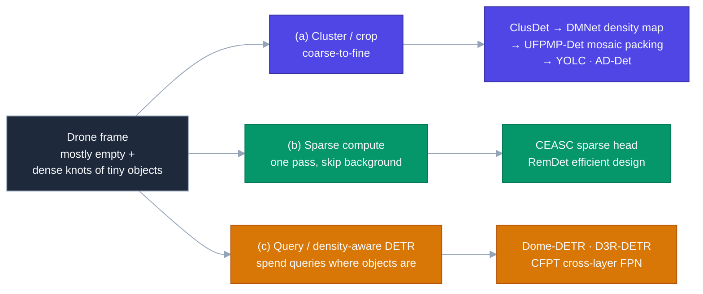

# Dense Object Detection & Classification — Recent Advances

*Compiled 2026-Jul-11 (America/Los_Angeles).*

Next installment in the running CV-updates log. Earlier entries on
`main`:
[Apr-30](../2026-Apr-30/2026-Apr-30_CV_updates.md),
[May-01](../2026-May-01/2026-May-01_CV_updates.md),
[May-02](../2026-May-02/2026-May-02_CV_updates.md),
[May-04](../2026-May-04/2026-May-04_CV_updates.md),
[May-05](../2026-May-05/2026-May-05_CV_updates.md),
[May-07](../2026-May-07/2026-May-07_CV_updates.md),
[May-08](../2026-May-08/2026-May-08_CV_updates.md),
[May-15](../2026-May-15/2026-May-15_CV_updates.md),
[May-16](../2026-May-16/2026-May-16_CV_updates.md),
[May-17](../2026-May-17/2026-May-17_CV_updates.md),
[Jun-09](../2026-Jun-09/2026-Jun-09_CV_updates.md),
[Jun-10](../2026-Jun-10/2026-Jun-10_CV_updates.md),
[Jun-12](../2026-Jun-12/2026-Jun-12_CV_updates.md),
[Jun-15](../2026-Jun-15/2026-Jun-15_CV_updates.md),
[Jun-16](../2026-Jun-16/2026-Jun-16_CV_updates.md),
[Jun-17](../2026-Jun-17/2026-Jun-17_CV_updates.md),
[Jun-19](../2026-Jun-19/2026-Jun-19_CV_updates.md),
[Jun-21](../2026-Jun-21/2026-Jun-21_CV_updates.md),
[Jun-22](../2026-Jun-22/2026-Jun-22_CV_updates.md),
[Jun-23](../2026-Jun-23/2026-Jun-23_CV_updates.md),
[Jun-24](../2026-Jun-24/2026-Jun-24_CV_updates.md),
[Jun-25](../2026-Jun-25/2026-Jun-25_CV_updates.md),
[Jun-27](../2026-Jun-27/2026-Jun-27_CV_updates.md),
[Jun-29](../2026-Jun-29/2026-Jun-29_CV_updates.md),
[Jun-30](../2026-Jun-30/2026-Jun-30_CV_updates.md),
[Jul-04](../2026-Jul-04/2026-Jul-04_CV_updates.md),
[Jul-07](../2026-Jul-07/2026-Jul-07_CV_updates.md),
[Jul-08](../2026-Jul-08/2026-Jul-08_CV_updates.md),
[Jul-10](../2026-Jul-10/2026-Jul-10_CV_updates.md).

## Why this pass: the drone image as its own primitive

The recent run of passes has worked **sensor / imaging primitives on their own
terms** — the LiDAR point cloud ([Jun-27](../2026-Jun-27/2026-Jun-27_CV_updates.md)),
the event camera ([Jun-29](../2026-Jun-29/2026-Jun-29_CV_updates.md)), thermal infrared
([Jun-30](../2026-Jun-30/2026-Jun-30_CV_updates.md)), imaging radar
([Jul-04](../2026-Jul-04/2026-Jul-04_CV_updates.md)), medical imaging
([Jul-07](../2026-Jul-07/2026-Jul-07_CV_updates.md)), subsea imaging
([Jul-08](../2026-Jul-08/2026-Jul-08_CV_updates.md)) and the astronomical survey
([Jul-10](../2026-Jul-10/2026-Jul-10_CV_updates.md)). Earth observation was covered
from orbit — the **satellite / geospatial** stack
([Jun-25](../2026-Jun-25/2026-Jun-25_CV_updates.md)). What that pass deliberately left
out is the *other* aerial viewpoint: the **low-altitude drone camera**. It has only ever
appeared in this log as a technique footnote (density-guided UAV detection cropping up as
one method among many in earlier passes), never as a primitive in its own right. It earns a whole pass — and it is arguably the single most on-topic
modality this series has, because the drone image is where "**dense** object detection"
is most literally true: a VisDrone frame routinely carries **hundreds of tiny objects**
in one shot.

The drone image is a genuinely different primitive from both the satellite nadir view and
the ground-level camera every general detector is tuned for:

- **The objects are tiny, and "tiny" breaks the metric that trains detectors.** In the
  AI-TOD family a large fraction of instances span **fewer than ~16 px**, some as small
  as a handful of pixels. Intersection-over-Union is *pathologically* sensitive to a
  one-pixel shift at that scale, so the IoU-threshold label assignment every anchor-based
  detector relies on collapses — a correct-looking box is assigned as a negative. The
  fix is to stop measuring boxes with IoU at all: model each box as a 2-D Gaussian and
  score with a **Normalized Wasserstein Distance (NWD)**, which degrades gracefully with
  sub-pixel error
  ([Xu et al., *Detecting tiny objects in aerial images: NWD + AI-TOD-v2*, ISPRS J. 2022 / arXiv:2206.13996](https://arxiv.org/abs/2206.13996);
  [*A Normalized Gaussian Wasserstein Distance for Tiny Object Detection*, arXiv:2110.13389](https://arxiv.org/abs/2110.13389)).
  This is the field's foundational departure from COCO-style detection and it has no clean
  ground-camera analogue.
- **Object density is wildly non-uniform across the frame.** A drone shot is mostly empty
  sky, road and rooftop with a few dense knots of cars or people. Running a full detector
  at full resolution everywhere is almost all wasted compute — but naive downsampling
  erases the very objects you care about. **Where** to spend resolution is itself a
  learned decision, which is why the whole "cluster / crop / density-map" sub-field
  (below) exists and has no counterpart in dense-everywhere satellite mosaics.
- **Scale varies by more than an order of magnitude — within a single flight.** As the
  aircraft climbs, banks or zooms, the *same* car can span 80 px then 6 px seconds later.
  Apparent-size statistics are non-stationary in a way a fixed traffic camera never sees,
  so a model trained at one altitude quietly fails at another — altitude and viewpoint
  are a **domain-shift axis**, not a nuisance
  ([Boost UAV detection via Scale-Invariant Feature Disentanglement + State-Air, arXiv:2405.15465](https://arxiv.org/abs/2405.15465)).
- **The platform moves, and the compute is on the platform.** Ego-motion, rolling-shutter
  wobble and rotor vibration corrupt the temporal smoothness that trackers assume, while
  the detector has to run inside a few watts on an embedded GPU. "Accurate" is not enough;
  the operating point is **accuracy at a fixed FLOP / latency / energy budget** on the
  edge ([E³-UAV, arXiv:2308.04774](https://arxiv.org/abs/2308.04774)).
- **The viewpoint is oblique and top-down, not nadir.** Unlike the satellite pass, drone
  frames mix steep-oblique perspective, foreshortening and a moving horizon, so the
  oriented-box / geospatial-foundation-model tooling from
  [Jun-25](../2026-Jun-25/2026-Jun-25_CV_updates.md) does *not* transplant cleanly — the
  drone community has grown its own detectors.

So this pass treats **UAV / drone-borne imagery** as its own dense-detection and
classification primitive: the tiny-object regime and its metric, the non-uniform-density
compute problem and the two families of answers to it, transformers arriving late to tiny
aerial objects, altitude/viewpoint as an explicit domain-shift axis, tracking and
segmentation from a moving platform, open-vocabulary / foundation models finally reaching
the aerial view, and the adversarial inverse — the drone *as the target* (anti-UAV).

```mermaid
%%{init: {"theme":"base","themeVariables":{
  "primaryColor":"#4f46e5","primaryTextColor":"#f8fafc",
  "primaryBorderColor":"#3730a3","lineColor":"#94a3b8",
  "fontSize":"13px"}}}%%
flowchart TB
  classDef det  fill:#4f46e5,stroke:#3730a3,color:#f8fafc;
  classDef cls  fill:#c026d3,stroke:#a21caf,color:#f8fafc;
  classDef tim  fill:#d97706,stroke:#b45309,color:#f8fafc;
  classDef fnd  fill:#059669,stroke:#047857,color:#f8fafc;
  classDef hub  fill:#1e293b,stroke:#94a3b8,color:#f8fafc;
  HUB["UAV / drone imagery<br/>dense detection<br/>+ classification"]:::hub
  T1["1 · The primitive<br/>tiny objects · IoU breaks · NWD · AI-TOD"]:::det
  T2["2 · Non-uniform density<br/>cluster/crop vs sparse-conv efficiency"]:::det
  T3["3 · Transformers arrive late<br/>Dome-DETR · D3R-DETR · CFPT"]:::det
  T4["4 · Domain shift = altitude/viewpoint<br/>SIFD+AFL · frequency disentangle"]:::cls
  T5["5 · Beyond boxes<br/>UAV MOT · multispectral · point-mask seg"]:::tim
  T6["6 · Open-vocab & foundation<br/>UAV-OVD · cross-view · the transfer gap"]:::fnd
  T7["7 · Inverse problem<br/>anti-UAV: drone as the target"]:::hub
  HUB --- T1
  HUB --- T2
  HUB --- T3
  HUB --- T4
  HUB --- T5
  HUB --- T6
  HUB --- T7
```

---

## 1 · The primitive: tiny objects and the metric that breaks

The defining fact of drone vision is scale. On **VisDrone** — 10,209 static images plus
288 video clips shot by DJI drones across 14 cities, the community's default benchmark —
and on **UAVDT** (vehicles, annotated with altitude / view-angle / weather attributes),
the median object is a fraction of the size a COCO detector was tuned for, and the
**AI-TOD / AI-TOD-v2** benchmarks push further into the *tiny* regime where instances are
a few pixels across.

The core technical problem is not the backbone — it is **label assignment**. IoU changes
discontinuously and enormously for a one- or two-pixel perturbation of a tiny box, so
IoU-threshold matching hands the network almost no positive samples and starves training
of supervision. The fix that reorganised the field is **NWD-RKA**: represent each
bounding box as a 2-D Gaussian, measure similarity with a **Normalized Wasserstein
Distance**, and pair it with a **RanKing-based Assigner** that guarantees each ground-truth
gets enough positives regardless of absolute size
([arXiv:2206.13996](https://arxiv.org/abs/2206.13996)). NWD drops into essentially any
anchor-based detector as a replacement for the IoU threshold, and it — together with the
Gaussian-Wasserstein formulation ([arXiv:2110.13389](https://arxiv.org/abs/2110.13389)) —
is now the standard tiny-object training recipe. 2025 work such as **DCEDet** continues to
attack the same two levers, enhancing feature representation *and* re-optimising label
assignment, because appearance cues alone are too weak at these sizes. The recent survey
[*Recent Advances for Aerial Object Detection* (ACM Computing Surveys, 2024, doi:10.1145/3664598)](https://dl.acm.org/doi/full/10.1145/3664598)
is a good map of the terrain.

## 2 · Non-uniform density: two families of answers

Because objects clump, running one uniform detector over the whole frame is wasteful. The
field split into two responses.

**(a) Cluster / crop — coarse-to-fine, buy accuracy with compute.** Find the dense
regions, then re-detect them at high resolution. The lineage is clear:
- **ClusDet** (2019) predicts object clusters and estimates a per-cluster scale before
  refining inside each — the original coarse-to-fine drone pipeline.
- **DMNet** generates a **density map** to crop informative regions more cleanly than box
  clustering.
- **UFPMP-Det** ([AAAI 2022, arXiv:2112.10415](https://arxiv.org/abs/2112.10415)) adds
  *Unified Foreground Packing*: sub-regions from a coarse pass are clustered and **packed
  into a single mosaic**, so the fine detector runs once on tightly-packed foreground
  instead of many sparse crops — the accuracy-per-FLOP move that made the paradigm
  practical.
- **YOLC** (2024) adaptively searches clustered regions on top of a YOLO core, and
  **AD-Det** ([arXiv:2504.05601](https://arxiv.org/abs/2504.05601)) combines *focused*
  small-object enhancement with explicit **tail-class balancing**, tackling the long-tail
  that dense aerial scenes always carry alongside the scale problem.

**(b) Sparse compute — keep one pass, skip the empty pixels.** The opposite instinct:
don't crop, just refuse to spend convolution on background.
- **CEASC** ([*Adaptive Sparse Convolutional Networks with Global Context Enhancement*, CVPR 2023, arXiv:2303.14488](https://arxiv.org/abs/2303.14488))
  makes the detection head **sparse-convolutional**, with a context-enhanced group-norm
  layer and an adaptive multi-layer masking strategy that learns per-scale mask ratios for
  compact foreground coverage — big GFLOP cuts on VisDrone/UAVDT with competitive accuracy
  on RetinaNet / GFL heads.
- **RemDet** ([AAAI 2025, arXiv:2412.10040](https://arxiv.org/abs/2412.10040)) rethinks the
  *whole* efficient-model design for UAV detection rather than bolting sparsity onto a
  generic backbone — a clean 2025 statement that drone detection wants purpose-built
  efficient architectures, not adapted ground-camera ones.

The two families are not mutually exclusive — modern systems crop *and* run efficient
heads — but they represent genuinely different bets on where the waste is.

## 3 · Transformers arrive (late) at tiny aerial objects

DETR-style detectors were slow to help here: global attention is expensive at drone
resolution and the learned-query set is a poor match for *hundreds* of tiny, clustered
objects. 2025–2026 closed much of that gap by making the query set and the attention
**density-aware**.

- **Dome-DETR** ([ACM MM 2025, arXiv:2505.05741](https://arxiv.org/abs/2505.05741)) is the
  cleanest statement. Three parts: a lightweight **Density-Focal Extractor (DeFE)** that
  produces compact clustered foreground masks; **Masked Window Attention Sparsification
  (MWAS)** that spends attention only on informative windows; and **Progressive Adaptive
  Query Initialization (PAQI)** that modulates query density spatially so crowded regions
  get more queries. Result: **+3.3 AP on AI-TOD-v2 and +2.5 AP on VisDrone** at low
  compute and small model size — the density prior from §2 pushed inside the transformer.
- **D3R-DETR** (*Dual-Domain Density Refinement*,
  [arXiv:2601.02747](https://arxiv.org/abs/2601.02747), 2026) refines density estimates
  across two domains for tiny-object DETR — a direct 2026 continuation of the Dome-DETR
  line.
- **CFPT** (*Cross-Layer Feature Pyramid Transformer*,
  [IEEE TGRS 2025, arXiv:2407.19696](https://arxiv.org/abs/2407.19696),
  [code](https://github.com/duzw9311/CFPT)) is an **upsampler-free** FPN built from two
  linear-complexity attention blocks — Cross-layer Channel-wise Attention (CCA) and
  Cross-layer Spatial-wise Attention (CSA) — plus a consistent relative positional
  encoding (CCPE). By fusing pyramid levels in one cross-layer step it avoids the
  semantic-gap / information-loss of top-down element-wise summation, and it validates on
  VisDrone, **TinyPerson** and **xView**.
- Efficiency-oriented DETR variants continue to appear — **MLD-DETR** (multi-scale edge
  enhancement + hierarchical attention), **AUHF-DETR** (spatial attention + wavelet
  convolution), and **hierarchical sparse vision transformers** for real-time drone
  detection ([J. AI & Capsule Networks, 2025](https://irojournals.com/aicn/article/view/2234)) —
  all chasing the same target: DETR accuracy at edge latency.

## 4 · Altitude and viewpoint are a domain-shift axis

Because apparent scale is non-stationary with altitude, a model trained on one flight
profile degrades on another. The 2024–2026 response treats this as **domain generalization**,
not augmentation.

- **Scale-Invariant Feature Disentanglement + Adversarial Learning (SIFD/AFL)**
  ([arXiv:2405.15465](https://arxiv.org/abs/2405.15465), IEEE 2025) explicitly disentangles
  scale-related from scale-invariant features and uses an adversarial scheme to enforce the
  split, so the detector leans on cues that survive altitude change. The authors also
  release **State-Air**, a multimodal UAV set annotated with **drone state parameters**
  (altitude, angle) — making the shift axis measurable rather than latent.
- **Frequency-domain disentanglement** for generalized UAV detection
  ([IJCV 2024, doi:10.1007/s11263-024-02108-5](https://link.springer.com/article/10.1007/s11263-024-02108-5))
  separates domain-invariant from domain-specific spectra with image- and instance-level
  contrastive losses, improving cross-dataset (VisDrone ↔ UAVDT) generalization over prior
  DG baselines.
- Multi-level dilated convolutions that model multi-scale spatial relations are being used
  to encourage scale-invariant representations that **extrapolate to unseen flight
  altitudes** — a recurring 2025 theme, and the practical reason drone detectors ship with
  altitude-aware evaluation rather than a single mAP number.

## 5 · Beyond boxes: tracking and segmentation from a moving platform

Detection is rarely the end goal for a drone — you want identities over time, and
increasingly masks.

**Multi-object tracking (MOT).** The platform itself moves, which violates the
smooth-motion assumption most trackers inherit.
- **UAVMOT** (CVPR 2022) set the drone-MOT template: update identity features, extract
  local spatial relations, and balance category/scale losses.
- **MMOT** ([arXiv:2510.12565](https://arxiv.org/abs/2510.12565), 2025) is the **first
  drone-based *multispectral* MOT benchmark** — 125 sequences, **>488.8K annotations**,
  eight categories — squarely targeting extreme-small targets, high density, severe
  occlusion and complex platform motion, and pushing tracking past RGB.
- *Breaking Smooth-Motion Assumptions*
  ([arXiv:2603.05970](https://arxiv.org/abs/2603.05970), 2026) is a UAV-MOT benchmark built
  specifically for **complex and adverse conditions** where the platform's own jerky motion
  is the challenge — a direct rebuttal to trackers that assume constant velocity.
- **HDST-GNN** ([arXiv:2606.05587](https://arxiv.org/abs/2606.05587), 2026) models the scene
  as a **heterogeneous dynamic spatiotemporal graph**, and altitude-adaptive neighbourhoods
  address the failure mode where a fixed spatial radius connects too many objects at low
  altitude and too few at high altitude — the §4 shift resurfacing inside the tracker.

**Segmentation / finer localization.** **UAVDB**
([arXiv:2409.06490](https://arxiv.org/abs/2409.06490)) uses **point-guided masks** to turn
cheap point annotations into detection-and-segmentation supervision for UAV targets —
label-economy meeting the mask task, echoing the point-supervision themes from earlier
passes but grounded in the drone setting.

## 6 · Open-vocabulary and foundation models reach the aerial view

CLIP-era open-vocabulary detection (OVD) mostly bypassed drones, because web-scale
image–text pretraining data looks nothing like a top-down 6-pixel car. That gap is now the
active frontier.

- The MDPI *Drones* review
  [*Open-Vocabulary Object Detection in UAV Imagery: A Review and Future Perspectives* (9(8):557, 2025)](https://www.mdpi.com/2504-446X/9/8/557)
  maps the space: CLIP-driven integration is the dominant recipe, and the central obstacle
  is precisely the train/deploy distribution gap.
- **UAV-OVD** ([MDPI *Drones* 9(7):495, 2025](https://www.mdpi.com/2504-446X/9/7/495))
  builds on **RT-DETR**, adds a CLIP encoder and a **region–text contrastive loss**, and
  uses multi-level text-guided decoding for efficiency under UAV deployment constraints.
- **Cross-View OVD** ([arXiv:2510.03858](https://arxiv.org/abs/2510.03858), 2025) reports
  zero-shot gains of **+6.32 mAP on DOTAv2, +4.16 mAP on VisDrone(images), +3.46 mAP on
  HRRSD** *over* fine-tuned closed-vocabulary dataset-specific models — evidence that
  cross-view OV transfer can beat specialised supervision.
- A **Cross-Modal Enhancement benchmark** for UAV OVD
  ([arXiv:2509.06011](https://arxiv.org/abs/2509.06011)) shows domain-specific pretraining
  on custom aerial corpora (UAVDE-2M / UAVCAP-15K) lifting mAP substantially (e.g.
  8.59 → 12.2), quantifying how much the aerial gap costs and how much pretraining recovers.
- The sober counterweight: *Do Open-Vocabulary Detectors Transfer to Aerial Imagery?*
  ([arXiv:2601.22164](https://arxiv.org/abs/2601.22164), 2026) is a comparative evaluation
  finding that off-the-shelf OV detectors **do not** transfer cleanly to the aerial view —
  the honest reminder that ground-trained foundation models are not a free lunch here.

## 7 · The inverse problem: the drone *as the target* (anti-UAV)

Flip the camera to the ground and the same tiny-object physics returns as a security
problem: detect and track a drone that may be **12 pixels or fewer**, low-contrast, against
cluttered sky. This is a distinct literature from the airborne-sensor work above — and
distinct from the security-screening passes ([X-ray, Jul-05] / [mmWave body screening,
Jul-09]) — because the sensor is ground- or air-based and the *target* is the aircraft.

- The CVPRW 2025 survey *Securing the Skies*
  ([arXiv:2504.11967](https://arxiv.org/abs/2504.11967)) taxonomises anti-UAV methods across
  **RGB, infrared, radar and RF**, catalogues benchmarks and notes the CVPR **Anti-UAV**
  workshop's multi-year leaderboard.
- **Anti-UAV410** is a thermal-infrared benchmark — 410 sequences, 438K objects (150K
  drone) — and **CST Anti-UAV** ([arXiv:2507.23473](https://arxiv.org/abs/2507.23473), 2025)
  adds a thermal benchmark for **tiny UAV tracking in complex scenes**, since IR is the
  practical modality against low-visibility drones.
- Method-side: **YOLOMG** fuses appearance with **pixel-level motion** for drone-to-drone
  detection (motion is often the only cue when appearance is a few pixels); **EGD-YOLO**
  ([arXiv:2510.10765](https://arxiv.org/abs/2510.10765)) tackles the **drone-vs-bird**
  discrimination problem under adverse conditions; **SDD-YOLO**
  ([arXiv:2603.25218](https://arxiv.org/abs/2603.25218), 2026) targets edge-efficient
  ground-to-air surveillance; and **C2FDrone**
  ([arXiv:2404.19276](https://arxiv.org/abs/2404.19276)) applies a coarse-to-fine ViT to
  drone-to-drone detection — the §2 crop idea reappearing on the inverse task.

## Takeaways

- **The tiny-object metric is the field's real foundation.** NWD / Gaussian-Wasserstein
  label assignment ([arXiv:2206.13996](https://arxiv.org/abs/2206.13996)) matters more than
  any single backbone, because IoU-threshold matching structurally starves training at drone
  scale. If you adapt a ground detector to drones and change nothing else, change the
  assigner first.
- **Non-uniform density has two mature answers, now converging.** Cluster/crop
  (ClusDet → UFPMP-Det → AD-Det) buys accuracy with compute; sparse-conv / efficient design
  (CEASC, RemDet AAAI'25) keeps one pass and skips background. 2025 DETRs (Dome-DETR,
  D3R-DETR, CFPT) fold the density prior *into* the transformer, getting both.
- **Altitude/viewpoint is a domain-shift axis, and the good work names it as one.**
  Disentangling scale-invariant features (SIFD/AFL, State-Air) and frequency-domain DG
  (IJCV'24) generalise across altitude far better than augmentation alone; evaluate across
  altitudes, not with one mAP.
- **Foundation models are arriving but do not transfer for free.** Cross-view OV can beat
  fine-tuned closed-vocab detectors ([arXiv:2510.03858](https://arxiv.org/abs/2510.03858)),
  yet off-the-shelf OV detectors still fail on aerial data
  ([arXiv:2601.22164](https://arxiv.org/abs/2601.22164)) — aerial pretraining / adaptation is
  the missing ingredient.
- **The inverse (anti-UAV) task is the same physics under a security objective**, and it is
  where IR and motion cues dominate because the target is often too small to have appearance.

### Notes on method & resilience

Sources are 2022–2026, weighted to 2025–2026, from arXiv, IEEE/ISPRS/ACM venues and the
MDPI *Drones* journal. Direct page fetches to `arxiv.org` returned HTTP 403 through the
environment proxy during compilation, so specifics (dataset sizes, reported mAP deltas,
venues) were taken from search-index abstracts and cross-checked across multiple result
snippets rather than from the rendered PDFs; a handful of figures (e.g. exact FPS/params for
RemDet) are therefore cited qualitatively rather than as point numbers. Where a claim rests
on a single secondary snippet it is flagged in-line. Reported numbers are the authors' own
on their stated benchmarks and are not independently reproduced here. Diagrams are Mermaid
with an explicit saturated-fill / light-text theme so they render legibly in both light and
dark viewers.
