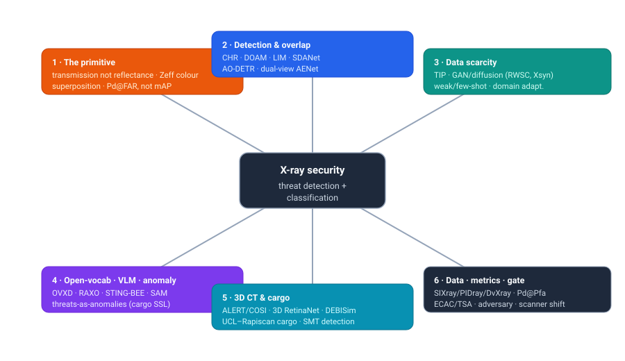
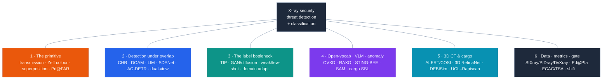
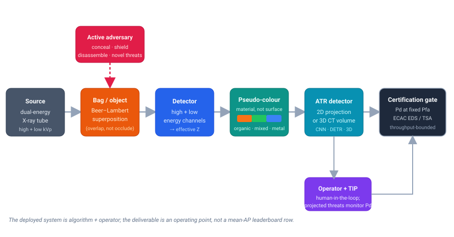

# Dense Object Detection & Classification — Recent Advances

*Compiled 2026-Jul-12 (America/Los_Angeles).*

Next installment in the running CV-updates log. Earlier entries on
`main`:
[Apr-30](../2026-Apr-30/2026-Apr-30_CV_updates.md),
[May-01](../2026-May-01/2026-May-01_CV_updates.md),
[May-02](../2026-May-02/2026-May-02_CV_updates.md),
[May-04](../2026-May-04/2026-May-04_CV_updates.md),
[May-05](../2026-May-05/2026-May-05_CV_updates.md),
[May-07](../2026-May-07/2026-May-07_CV_updates.md),
[May-08](../2026-May-08/2026-May-08_CV_updates.md),
[May-15](../2026-May-15/2026-May-15_CV_updates.md),
[May-16](../2026-May-16/2026-May-16_CV_updates.md),
[May-17](../2026-May-17/2026-May-17_CV_updates.md),
[Jun-09](../2026-Jun-09/2026-Jun-09_CV_updates.md),
[Jun-10](../2026-Jun-10/2026-Jun-10_CV_updates.md),
[Jun-12](../2026-Jun-12/2026-Jun-12_CV_updates.md),
[Jun-15](../2026-Jun-15/2026-Jun-15_CV_updates.md),
[Jun-16](../2026-Jun-16/2026-Jun-16_CV_updates.md),
[Jun-17](../2026-Jun-17/2026-Jun-17_CV_updates.md),
[Jun-19](../2026-Jun-19/2026-Jun-19_CV_updates.md),
[Jun-21](../2026-Jun-21/2026-Jun-21_CV_updates.md),
[Jun-22](../2026-Jun-22/2026-Jun-22_CV_updates.md),
[Jun-23](../2026-Jun-23/2026-Jun-23_CV_updates.md),
[Jun-24](../2026-Jun-24/2026-Jun-24_CV_updates.md),
[Jun-25](../2026-Jun-25/2026-Jun-25_CV_updates.md),
[Jun-27](../2026-Jun-27/2026-Jun-27_CV_updates.md),
[Jun-29](../2026-Jun-29/2026-Jun-29_CV_updates.md),
[Jun-30](../2026-Jun-30/2026-Jun-30_CV_updates.md),
[Jul-04](../2026-Jul-04/2026-Jul-04_CV_updates.md),
[Jul-07](../2026-Jul-07/2026-Jul-07_CV_updates.md),
[Jul-08](../2026-Jul-08/2026-Jul-08_CV_updates.md),
[Jul-10](../2026-Jul-10/2026-Jul-10_CV_updates.md).

## Why this pass: the security X-ray as its own primitive

The recent run has worked **sensor / imaging primitives on their own terms** — the
LiDAR point cloud ([Jun-27](../2026-Jun-27/2026-Jun-27_CV_updates.md)), the event
camera ([Jun-29](../2026-Jun-29/2026-Jun-29_CV_updates.md)), thermal infrared
([Jun-30](../2026-Jun-30/2026-Jun-30_CV_updates.md)), imaging radar
([Jul-04](../2026-Jul-04/2026-Jul-04_CV_updates.md)), medical imaging
([Jul-07](../2026-Jul-07/2026-Jul-07_CV_updates.md)), subsea imaging
([Jul-08](../2026-Jul-08/2026-Jul-08_CV_updates.md)) and — last pass — the
**astronomical survey** ([Jul-10](../2026-Jul-10/2026-Jul-10_CV_updates.md)), the
largest live dense-detection problem there is. **Security X-ray screening** is the
one that has never had a pass, and it is the natural counterpoint: where astronomy
adds *emitted* light over a huge dynamic range, the security scanner measures
*transmitted* attenuation through a bag — and, alone among every modality in this
log, it runs against an **active adversary** who is trying to defeat the detector.
The log has touched industrial anomaly detection ([May-08 §4](../2026-May-08/2026-May-08_CV_updates.md))
and lesion CADe ([Jul-07](../2026-Jul-07/2026-Jul-07_CV_updates.md)); it has never
taken the airport/parcel/cargo X-ray whole. It earns its own pass.

The security X-ray is a genuinely different primitive from every sensor covered so far:

- **The image is transmission, not reflectance — the pixel is a line integral of
  attenuation.** Following Beer–Lambert, intensity along a ray is the *product* of
  per-material exponential attenuation. Objects do not sit *on* a background the way
  a COCO object sits on a scene; they are **superimposed** — the scanner sees
  everything the ray passed through, added up in log-attenuation space. Nothing is
  hidden *behind* anything; everything is blended *through* everything. This inverts
  the natural-image occlusion model, and it has a startling consequence for training
  (§3): cut-and-paste compositing is **physically meaningful** here in a way it never
  is for RGB.
- **"Colour" is material, not appearance.** Dual-energy scanners fire high- and
  low-kVp beams; the ratio recovers an **effective atomic number (Zeff)**,
  which is mapped to the familiar false-colour code — **orange for organics**
  (explosives, drugs, food), **blue for metals** (guns, knives), **green for mixed /
  inorganic**. A model that keys on hue is keying on physics, but that same mapping
  is scanner-specific, which is exactly why it does not transfer across machines (§6).
- **Detection is defined by overlap.** Prohibited items are deliberately packed
  among, rotated behind and blended into everyday clutter. Every purpose-built
  dataset — SIXray, OPIXray, HiXray, PIDray — is organized around *overlap and
  concealment*, and every signature method is an **anti-overlap / de-occlusion**
  mechanism (§2). This is the field's version of astronomy's deblending fork
  ([Jul-10 §2](../2026-Jul-10/2026-Jul-10_CV_updates.md)) — separation *is* the task,
  not a clean-up pass.
- **The target is a rare needle, and the metric says so.** Threats are a tiny
  fraction of bags — SIXray ships explicit 10×/100×/1000× negative:positive subsets
  to mimic real prevalence. So the operational score is not COCO mAP but **probability
  of detection (Pd) at a fixed, low false-alarm rate (Pfa)** under a hard
  bags-per-hour throughput budget. As in the medical
  ([Jul-07](../2026-Jul-07/2026-Jul-07_CV_updates.md)) and astronomical
  ([Jul-10](../2026-Jul-10/2026-Jul-10_CV_updates.md)) passes, *the operating point is
  the deliverable*, and the academic leaderboard number is not it.
- **Labels are scarce, classified and synthetic.** Real threat data is
  export-controlled; certification threat catalogs are secret. So the field runs on
  **Threat Image Projection (TIP)**, GAN/diffusion synthesis, weak/point supervision
  and cross-scanner domain adaptation (§3) — the same label-bottleneck escape as every
  other pass, but with the twist that its cut-paste synthesis is grounded in the
  imaging physics rather than being a data-aug hack.
- **There is an active adversary, and the deployment gate is a certification, not a
  benchmark.** Unlike a galaxy or a tumour, the object *wants* to be missed. A fielded
  system is **algorithm + human operator**, gated by ECAC EDS / TSA certification that
  fixes a required Pd at a capped Pfa on sequestered, adversarially-constructed threat
  data — which is why a published mAP essentially never translates to a deployed number
  (§6).

This pass covers six threads of that stack:

1. **The primitive & representation** — transmission vs reflectance, Zeff
   pseudo-colour, superposition-not-occlusion, the needle-in-a-haystack + adversarial
   metric, and the 2D-projection-vs-3D-CT fork.
2. **Detection under overlap** — the dataset-anchored anti-occlusion detectors
   (CHR, DOAM, LIM, SDANet), the DETR/transformer and frequency-aware wave (AO-DETR,
   FDTNet, FOAM), and the pivot to dual-view fusion (AENet/LDXray).
3. **The label bottleneck** — Threat Image Projection, GAN & diffusion synthesis,
   weak/few-shot/self-supervised, and cross-scanner domain adaptation.
4. **Open-vocabulary, VLMs & threats-as-anomalies** — CLIP-adapted open-set detection
   (OVXD, RAXO), X-ray security VLM assistants (STING-BEE, OneFocus), SAM/DINO
   adaptation, and the model-normality anomaly framing.
5. **3D CT & cargo** — checkpoint CT ATR (ALERT/COSI, 3D RetinaNet, material
   detection, DEBISim) and large-scale cargo/container X-ray (the UCL–Rapiscan line).
6. **Datasets, benchmarks, metrics & the operational gate** — the dataset zoo,
   mAP-vs-Pd@Pfa, TIP-as-operator-metric, certification, the adversary threat model,
   and the cross-scanner / sim-to-real reckoning.

> **Reading the numbers.** Figures are quoted from each method's own paper, repo or
> challenge page. **Protocols differ and are not comparable across rows.** Detection
> papers report **mAP** (VOC mAP@0.5 or COCO AP@[.5:.95]) on *different* datasets with
> different class counts and splits; some datasets are boxes-only and others are
> instance-segmentation; the operational world reports **Pd at fixed Pfa** on
> sequestered data. Treat every cross-row delta as indicative, not controlled. arXiv
> IDs encode submission month (`1901.xxxxx` = Jan 2019; `2606.xxxxx` = Jun 2026).
>
> **Verification note.** This run's egress policy allowed web *search* and fetches of
> **GitHub / project / dataset / CVF open-access** pages, but direct fetches of
> `arxiv.org`, IEEE and journal PDFs frequently returned HTTP 403. So arXiv IDs, venues
> and most numbers were cross-checked against authors' **GitHub READMEs**, Hugging Face
> dataset cards, CVF open-access HTML, the maintained
> [NeelBhowmik/xray](https://github.com/NeelBhowmik/xray) index and multiple search
> snippets rather than the abstract PDFs. Numbers pinned to a primary repo/page are
> stated plainly; figures available only via secondary summaries are flagged
> *(secondary)* / *(unverified)*. Late-2025 and 2026 arXiv IDs (`2511` onward) are real
> preprints not yet page-verified; several 2025–26 items list CVPR/ICCV camera-ready
> venues that should be double-checked.

## Topic map

## 1 · The primitive & representation — why the security X-ray forces different choices

There is one dominant signal chain — a dual-energy source, a bag, a detector array,
a false-colour map, an automatic-threat-recognition (ATR) stage, and a human operator
behind a certification gate — and the first design decisions are set by the physics of
transmission imaging, not by anything in the natural-image playbook.

- **Transmission and superposition.** A pixel is a line integral of attenuation; by
  Beer–Lambert the measured intensity is the *product* of the exponential attenuations
  of everything on the ray. Two consequences follow. First, **objects overlap by
  addition, not occlusion** — a knife behind a laptop is not hidden, it is *summed
  into* the laptop's signal, faint but present. Detectors must therefore separate
  superimposed signatures, which is why anti-overlap attention is the field's dominant
  architectural motif (§2). Second, **compositing is physical**: pasting a
  log-attenuation threat patch onto a benign bag approximates what the scanner would
  have measured, so synthetic training data (§3) is far more faithful than RGB
  cut-paste.
- **Dual energy → Zeff → false colour.** High- and low-kVp measurements
  give an effective atomic number, mapped to orange/green/blue for organic/mixed/metal.
  "Colour" is a **material estimate**, so edge- and material-aware features (EM-YOLO,
  FDTNet's frequency stream) are the natural inductive bias — and the scanner-specific
  colour map is the root cause of cross-machine domain shift (§6).
- **The representation fork: 2D projection vs 3D CT.** The installed base is **2D
  dual-view projection** (one or two orthogonal views) — cheap, fast, but overlap is
  irreducible because depth is collapsed. The frontier at the checkpoint is **3D CT**
  (§5): a reconstructed volume dissolves most overlap and enables voxel/point
  representations, at the cost of dose, price and compute. This is the same
  accuracy-vs-compute knob the LiDAR pass framed as voxel-vs-point
  ([Jun-27](../2026-Jun-27/2026-Jun-27_CV_updates.md)) — here it is literally whether
  you pay for the third dimension.
- **Rarity and the operating point.** Threats are rare by construction; SIXray's
  10/100/1000 subsets exist to *measure* behaviour under imbalance. The operational
  metric is **Pd at fixed Pfa** on a ROC/DET curve under a throughput budget — a scalar
  mAP hides where on the curve you actually sit.
- **The adversary.** No other modality in this log has one. Concealment, shielding,
  disassembly and never-before-seen (e.g. 3D-printed) threats mean the test
  distribution is *chosen by an opponent* — which pushes the field toward open-set /
  anomaly framings (§4) and makes closed-set mAP structurally optimistic.

## 2 · Detection under overlap — the anti-occlusion architecture line

Almost every advance here is introduced *with* a dataset and *as* a mechanism for
overlap or concealment. The lineage is remarkably legible.

**The CNN dataset-anchored era.** The four canonical benchmarks each paired a data
release with a signature module:

| Dataset (venue) | Signature method | Idea | Repo |
|---|---|---|---|
| **SIXray** (CVPR 2019) | **CHR** — Class-balanced Hierarchical Refinement | reversed connections push high-level cues down to refine mid-level features; class-balanced loss for extreme imbalance | [MeioJane/CHR](https://github.com/MeioJane/CHR) |
| **OPIXray** (ACM MM 2020) | **DOAM** — De-Occlusion Attention Module | plug-in that fuses edge + material cues into an attention map; larger gains at higher occlusion levels | [OPIXray-author/OPIXray](https://github.com/OPIXray-author/OPIXray) |
| **HiXray** (ICCV 2021) | **LIM** — Lateral Inhibition Module | bidirectional propagation suppresses noise; boundary activation sharpens item edges from four directions | [DIG-Beihang/XrayDetection](https://github.com/DIG-Beihang/XrayDetection) |
| **PIDray** (ICCV 2021 / IJCV 2023) | **SDANet** — Selective Dense Attention | spatial+channel dense attention + dependency refinement for *deliberately hidden* items; strongest on the "hidden" split | [bywang2018/security-dataset](https://github.com/bywang2018/security-dataset) |

Two more datasets extended the axis: **CLCXray** (IEEE TIFS 2022) added same-class
overlap and liquids with a **label-aware** feature mechanism
([Vill-Lab/CLCXray](https://github.com/Vill-Lab/CLCXray)); **PIXray** (IEEE TMM 2022)
was the first *instance-segmentation* set, with a contour/snake **DDoAS**
(Dense De-overlap Attention Snake, [Mbwslib/DDoAS](https://github.com/Mbwslib/DDoAS)).
The Durham **dbf3/dbf6** dual-energy baggage sets (Akçay & Breckon) anchored the
earlier transfer-learning and anomaly studies.

**The transformer / frequency wave (2024–2026).** As DETR matured, the anti-overlap
idea moved into the decoder:

- **AO-DETR** (IEEE TNNLS 2024, [arXiv 2403.04309](https://arxiv.org/abs/2403.04309),
  [code](https://github.com/Limingyuan001/AO-DETR)) — an anti-overlapping DETR on DINO:
  **Category-Specific Assignment (CSA)** decouples coupled features and **Look-Forward
  Densely (LFD)** localizes blurred/partial edges. Reports PIXray AP **73.9** (Swin-L) /
  **65.6** (ResNet-50), also evaluated on OPIXray + HiXray *(within-paper)*.
- **FDTNet** (Eng. Appl. AI 2024) — a **frequency-aware dual-stream Transformer**; a
  high-frequency/edge stream separates items from background. OPIXray mAP **88.0**,
  PIDray **68.2** *(within-paper; no confirmed repo — unverified)*.
- **MMCL** ([arXiv 2406.03176](https://arxiv.org/abs/2406.03176), 2024) corrects
  content-query distributions in Deformable-DETR via multi-class contrastive learning;
  **FOAM** ([arXiv 2506.13501](https://arxiv.org/abs/2506.13501), 2025) generalizes
  frequency-optimized anti-overlap perception beyond X-ray.
- Lighter-weight lines: **EM-YOLO** (edge + material fusion, Sensors 2023),
  **Xray-YOLO-Mamba** (a selective-state-space detector, *Sci. Reports* 2025), and
  improved-YOLOv8 variants with deformable conv / dynamic heads.

**The dual-view pivot (2024–2025).** Real checkpoints usually image each bag from two
orthogonal directions, and the field is finally exploiting it:

- **AENet / LDXray** (CVPR 2025, [arXiv 2411.18082](https://arxiv.org/abs/2411.18082),
  [code](https://github.com/rstao-bjtu/LDXray)) — **LDXray** is ~20× larger than prior
  dual-view sets (146,997 paired images, 353,646 instances, 12 classes); AENet fuses a
  main-view + auxiliary-view "expert" pair and reports up to **+24.7%** on the hard
  "umbrella" class across 7 detectors.
- **AHCR** (IEEE TIFS 2024) does adaptive hierarchical cross-view refinement;
  **DV-DINO** (ICCSAI 2024) and **Trans2Ray** / cross-view feature-fusion works (CMC /
  Eng. Appl. AI 2024–25) round out a now well-populated subtopic. The public
  **DvXray** set (IEEE TIFS 2024, [code](https://github.com/Mbwslib/DvXray),
  16,000 pairs) is the open anchor.

## 3 · The label bottleneck — TIP, generative synthesis, weak supervision & domain adaptation

Real threat imagery is export-controlled and rare, so the field's defining move is
manufacturing training data — and, uniquely, its cut-paste is grounded in physics.

**Threat Image Projection (TIP).** Because transmission attenuation is (approximately)
multiplicative, overlaying a segmented threat by multiplication — equivalently,
addition in log-attenuation space — approximates a real scan with the threat in the
beam. This makes TIP both a *training-data generator* and, in the field, a
*legally-mandated operator-vigilance tool* (projected threats into live streams measure
operator Pd, §6). The foundational cargo TIP work (Rogers et al., 2016) and its 3D-CT
extension (Wang, Megherbi & Breckon, 2020,
[arXiv 2001.05459](https://arxiv.org/abs/2001.05459)) established the recipe; the "Good,
the Bad and the Ugly" study (Bhowmik et al., 2019,
[arXiv 1909.11508](https://arxiv.org/abs/1909.11508)) measured its limits — Faster
R-CNN scored ~**0.88** mAP on real vs ~**0.78** on synthetically composited data, a
sim-to-real gap the field still fights.

**GAN synthesis.** **RWSC-Fusion** (CVPR 2023,
[CVF](https://openaccess.thecvf.com/content/CVPR2023/html/Duan_RWSC-Fusion_Region-Wise_Style-Controlled_Fusion_Network_for_the_Prohibited_X-Ray_Security_CVPR_2023_paper.html))
is the strongest classical-GAN baseline: region-wise style-controlled fusion + edge
attention composites items in the *target scanner's* style. **BagGAN / BagGAN-HQ**
(Manerikar & Kak, 2023, [code](https://github.com/avm-debatr/bagganhq)) uses
StyleGAN2-ADA to simulate bags with one-shot auto-segmentation for free masks.

**Diffusion synthesis (2025–2026).** **Xsyn** ("Taming Generative Synthetic Data",
[arXiv 2511.15299](https://arxiv.org/abs/2511.15299),
[code](https://github.com/pILLOW-1/Xsyn)) is the clearest recent step: one-stage
text-to-image X-ray synthesis where **Cross-Attention Refinement** *derives boxes from
the diffusion attention map* (label-free annotation) and **Background Occlusion
Modeling** injects occlusion in latent space, reporting modest but real mAP gains
*(dataset-dependent)*.

**Weak / noisy / few-shot supervision.** **Mix-Paste** (IEEE TIP 2025,
[arXiv 2501.01733](https://arxiv.org/abs/2501.01733),
[code](https://github.com/wscds/Mix-Paste)) pastes mixed patches to train under *noisy*
labels — mimicking overlap physics while suppressing large-loss mislabels; **BGM**
(Background Mixup, [arXiv 2412.00460](https://arxiv.org/abs/2412.00460)) forces
foreground attention. Point-supervised detectors **BCR-Net**
([arXiv 2412.18918](https://arxiv.org/abs/2412.18918)) and **I²OL-Net**
([arXiv 2412.03811](https://arxiv.org/abs/2412.03811)) cut annotation to clicks; the
few-shot **WEN** benchmark (ACM MM 2022) and **FSVM** (Sensors 2023) address novel
classes with a handful of examples.

**Cross-scanner domain adaptation.** The **EDS** benchmark ("Exploring Endogenous
Shift", CVPR 2022,
[CVF](https://openaccess.thecvf.com/content/CVPR2022/papers/Tao_Exploring_Endogenous_Shift_for_Cross-Domain_Detection_A_Large-Scale_Benchmark_and_CVPR_2022_paper.pdf))
quantifies the drop when a detector meets a different machine (10 classes × 3 scanners);
**ALDI-ray** (2025, [arXiv 2512.02696](https://arxiv.org/abs/2512.02696)) adapts the
align-and-distill DA framework with a ViTDet backbone; Durham's energy-response study
([arXiv 2108.12505](https://arxiv.org/abs/2108.12505)) asks which raw channels actually
help transfer.

## 4 · Open-vocabulary, VLMs & threats-as-anomalies — beyond the closed set

The adversary makes the closed-set assumption untenable — you cannot enumerate every
threat — so the 2024–2026 frontier is open-set, language-driven and normality-modelling.

**Open-vocabulary detection.** **OVXD** ([arXiv 2406.10961](https://arxiv.org/abs/2406.10961),
2024; Eng. Appl. AI 2025) is the first CLIP-distillation OVOD in X-ray: an "X-ray
feature adapter" bridges CLIP's RGB→X-ray gap and transfers to novel categories on
PIXray/PIDray, with a **PIXray-Caption** set. **RAXO** (ICCV 2025,
[arXiv 2503.17071](https://arxiv.org/abs/2503.17071),
[code](https://github.com/PAGF188/RAXO)) goes **training-free** — it repurposes
off-the-shelf RGB open-vocab detectors via dual-source retrieval + "X-ray material
transfer" to build class descriptors with *no* labeled X-ray database, and ships the
**DET-COMPASS** benchmark (300+ categories), reporting up to **+17.0 mAP** over base
detectors.

**X-ray security VLM assistants** — the fastest-moving subtopic:

- **STING-BEE** (CVPR 2025, [arXiv 2504.02823](https://arxiv.org/abs/2504.02823),
  [code](https://github.com/Divs1159/STING-BEE)) — the first domain-aware visual AI
  assistant for baggage: unified scene comprehension, referring threat localization,
  visual grounding and VQA. It ships **STCray**, the first multimodal X-ray set (46,642
  image–caption scans, 21 threat categories including IEDs and 3D-printed firearms)
  under a "Strategic Threat Concealing" occlusion protocol.
- **OneFocus** (2026, [arXiv 2606.15663](https://arxiv.org/abs/2606.15663)) — a unified
  VLM for VQA + localization + classification, with a new **MMXray** (52,124 pairs, 28
  fine-grained classes) plus a controllable occlusion-synthesis method *(repo not
  confirmed — unverified)*.

**SAM / DINO adaptation.** Frozen **SAM** is usable with box prompts but weak on slender
items and organic materials, and poor with point prompts (SAM-with-variational-prompting
study, [arXiv 2404.12285](https://arxiv.org/abs/2404.12285)). Purpose-built work fixes
this: **Occlusion-aware Bilayer Modeling** (ICME 2025,
[arXiv 2506.11661](https://arxiv.org/abs/2506.11661),
[code](https://github.com/Ryh1218/Occ)) adds an occludee/occluder bilayer mask decoder
and an **APSAM** point-prompt annotator; **XSeg** (CVPR 2026,
[arXiv 2604.03706](https://arxiv.org/abs/2604.03706)) is now the largest contraband
*segmentation* benchmark (98,644 images / 295,932 masks / 30 classes) and pairs SAM with
an energy-aware encoder. A single large SSL backbone pretrained *specifically* on
security X-ray does **not yet exist** — the closest are these dataset+VLM and
dataset+SAM-adapter combos, a clear open gap.

**Threats as anomalies.** Because novel threats can't be enumerated, several works model
*normality* and flag deviations. The strongest novel-threat generalization is in **cargo**
(Gaikwad et al., Eng. Appl. AI 2025,
[DOI](https://www.sciencedirect.com/science/article/abs/pii/S0952197624018335)): a
self-supervised encoder–decoder–classifier–segmenter trained only on normal cargo, using
X-ray linearity to synthetically embed then learn to *remove* objects, detecting unseen
anomaly types across three datasets. Earlier reconstruct-then-diff baggage work
([arXiv 2107.07333](https://arxiv.org/abs/2107.07333)) and dual-energy sub-component
anomaly segmentation ([arXiv 2210.16453](https://arxiv.org/abs/2210.16453)) round it out.
Notably, **CLIP-based zero-shot anomaly detection has not been demonstrated on security
X-ray** — a genuine, flaggable gap.

## 5 · 3D CT & cargo — the two heavy modalities

**Checkpoint CT (ATR).** As airports roll out CT scanners at the checkpoint, the ATR
problem moves into reconstructed *volumes*, where overlap largely dissolves.

- The DHS **ALERT / COSI** infrastructure (Northeastern) is the reference data source:
  a public set of **188 baggage CT volumes / 446 object signatures** with voxel-level
  ground truth, plus sequestered companions, organized into segmentation (TO3) and
  automated-threat-recognition (TO4) task orders. Durham released the open **Dur_3D**
  (774 volumes, 5 classes).
- **Multi-class 3D object detection in CT** (Wang, Bhowmik & Breckon, ICMLA 2020,
  [arXiv 2008.01218](https://arxiv.org/abs/2008.01218)) formulated the task with a **3D
  RetinaNet** (3D ResNet backbone), mAP **65.3%** over 5 classes. The **energy-response**
  study ([arXiv 2108.12505](https://arxiv.org/abs/2108.12505)) found low- and high-energy
  CT reconstructions give comparable detection with *no gain* from combining them — a
  single channel suffices for ATR.
- **Material / contraband detection** (sheet & bulk simulants) moved to voxel + point
  representations with **3D U-Net and PointNet++**
  ([arXiv 2012.11753](https://arxiv.org/abs/2012.11753)); adaptive ATR segmentation on
  ALERT data reported up to ~**98% TPR at ~1.5% FPR**
  ([arXiv 1903.10604](https://arxiv.org/abs/1903.10604)) *(dataset-specific)*.
- **DEBISim** (Manerikar, Li & Kak, *J. X-ray Sci. Tech.* 2021) is a physics-based
  dual-energy CT baggage *simulator* — unlimited annotated bags with hazardous
  placements, no real explosives handled. Deep-learning **metal-artifact reduction
  specifically for baggage CT is thin**, mostly borrowed from medical/spectral CT — a
  flaggable gap.

**Cargo / container X-ray.** High-energy, large-scale, and almost entirely proprietary
data — dominated by the **UCL–Rapiscan** line (Griffin, Rogers, Jaccard, Morton):

- **Concealed-car detection** in stream-of-commerce cargo
  ([arXiv 1606.08078](https://arxiv.org/abs/1606.08078)) and **small-metallic-threat**
  detection reporting **<6% false alarms at 90% detection** of synthetically concealed
  SMTs ([arXiv 1609.02805](https://arxiv.org/abs/1609.02805)) — roughly an
  order-of-magnitude over prior art. A modular framework added **empty-container
  verification** and noted that a log-transform of the image markedly helps CNNs.
- The critical review ([arXiv 1608.01017](https://arxiv.org/abs/1608.01017)) remains the
  field's reference. Recent work extends to **self-supervised anomaly detection** on
  cargo (Gaikwad et al., §4) and backscatter-image augmentation (*Sensors* 2021). Public
  cargo benchmarks are **effectively absent** (data is Rapiscan stream-of-commerce),
  which is why synthetic TIP/SIA dominates — a structural, not incidental, constraint.

## 6 · Datasets, benchmarks, metrics & the operational gate

**The dataset zoo.** The public landscape, with annotation type
(**cls** = image label · **bbox** = boxes · **seg** = masks):

| Dataset | Year / venue | Size | Classes | Ann. | Distinctive |
|---|---|---|---|---|---|
| [GDXray](https://github.com/computervision-xray-testing/GDXray) | 2015 | ~19.4k (baggage subset ~8.1k) | — | bbox | grayscale, single-energy; mostly NDT |
| [SIXray](https://github.com/MeioJane/SIXray) | CVPR 2019 | **1,059,231** (8,929 positive) | 6 | bbox | extreme imbalance; 10/100/1000 subsets |
| [OPIXray](https://github.com/OPIXray-author/OPIXray) | ACM MM 2020 | 8,885 | 5 (cutters) | bbox | synthetic; occlusion-level splits |
| [HiXray](https://github.com/HiXray-author/HiXray) | ICCV 2021 | 45,364 (102,928 items) | 8 | bbox | real airport; electronics-heavy |
| [PIDray](https://github.com/bywang2018/security-dataset) | ICCV 2021 / IJCV 2023 | 47,677 / **124,486** | 12 | bbox+**seg** | "hidden"/concealed split; state the version |
| [CLCXray](https://github.com/GreysonPhoenix/CLCXray) | IEEE TIFS 2022 | 9,565 | 12 | bbox | liquids + same-class overlap |
| [PIXray](https://github.com/Mbwslib/DDoAS) | IEEE TMM 2022 | 5,046 (15,201 items) | 15 | bbox+**seg** | first instance-seg set |
| [EDS](https://github.com/DIG-Beihang/XrayDetection) | ECCV 2022 | 14,219 | 10 | bbox | 3 scanners → cross-machine shift |
| [DvXray](https://github.com/Mbwslib/DvXray) | IEEE TIFS 2024 | 16,000 pairs (32k) | 15 | bbox | first public **dual-view** |
| [LDXray](https://github.com/rstao-bjtu/LDXray) | CVPR 2025 | 146,997 pairs (353,646 items) | 12 | bbox | ~20× larger dual-view |
| [STCray](https://github.com/Divs1159/STING-BEE) | CVPR 2025 | 46,642 img–caption | 21 | multimodal | first VLM set; concealment protocol |
| [XSeg](https://arxiv.org/abs/2604.03706) | CVPR 2026 | 98,644 (295,932 masks) | 30 | **seg** | largest contraband segmentation *(new)* |

The **Durham dbf3/dbf6** and newer **LPIXray/LDXray-class** restricted sets, plus the
6-modality classification set **COMPASS-XP**, complete the picture; the maintained
[NeelBhowmik/xray](https://github.com/NeelBhowmik/xray) index is the best living catalog.

**Metrics — academic ≠ operational.** Papers report **mAP** (and per-class AP);
classification reports accuracy/F1. But the deployed metric is an **operating point**:
**Pd at a fixed, low Pfa** on the ROC/DET curve, under a hard **bags-per-hour** budget,
for an **algorithm + operator** system. **TIP** doubles as the operator-performance
metric — projected threats into live streams continuously measure operator Pd and are
mandated for vigilance monitoring. A high mAP on a public, single-scanner,
non-adversarial set says little about where you sit on the certified curve.

**The gate.** Fielding is gated by **certification** — EU/**ECAC EDS Standards 2/3/3.1**
(and EDSCB for cabin baggage), **TSA** qualification in the US, Israeli ISA — tested
against **classified threat catalogs on sequestered, adversarially-constructed data**,
never public datasets. Four structural reasons published numbers don't transfer:

1. **Active adversary.** Concealment, shielding, disassembly and novel/3D-printed
   threats are *chosen to defeat* the detector; PIDray's "hidden" split and STCray's
   protocol only approximate red-team threats.
2. **Base-rate imbalance.** At real prevalence, even excellent mAP yields poor precision
   at the Pfa ceiling; rare/unseen threats dominate risk.
3. **Cross-scanner shift.** Different make/model/energy/wear shifts the distribution (EDS
   quantifies the drop); a model portable across machines needs costly retraining.
4. **Sim-to-real gap.** Much training data is TIP/GAN/diffusion-composited; scanner-
   specific blur, contrast and material response are hard to match (the "Good/Bad/Ugly"
   ~0.10 mAP gap).

This is the same shape as the medical FDA gate ([Jul-07](../2026-Jul-07/2026-Jul-07_CV_updates.md))
and astronomy's systematics gate ([Jul-10](../2026-Jul-10/2026-Jul-10_CV_updates.md)) —
but sharpened by an opponent, so the gate is adversarial, not merely statistical.

## The bottom line

**The security X-ray is the adversarial inverse of the astronomical image.** Both break
the natural-image assumption that an object is an opaque silhouette on a background:
astronomy adds *emitted* light and calls separation "deblending"; the security scanner
adds *transmitted* attenuation and calls it "de-occlusion". In both, the metric is an
operating point (Pd@Pfa here, completeness@purity there), labels are scarce so synthesis
and weak supervision dominate, and a benchmark win means nothing until it clears a
deployment gate. What makes the X-ray unique in this entire log is the **active
adversary**: the object is trying to be missed, the test distribution is chosen by an
opponent, and the certification data is secret and red-teamed — which is why the field's
2024–2026 centre of gravity has shifted from closed-set mAP-chasing (CHR→SDANet→AO-DETR)
toward **dual-view fusion, open-vocabulary/VLM assistants (RAXO, STING-BEE), physics-
grounded generative synthesis (Xsyn), and threats-as-anomalies** — every one of them an
attempt to cope with the threat you have not seen. The clearest open gaps: no large SSL
backbone pretrained on security X-ray, no CLIP zero-shot anomaly detector demonstrated on
it, thin baggage-CT metal-artifact-reduction, near-absent operator-facing explainability,
and essentially no open cargo benchmark.

---

## Sources & further reading

**Surveys, framing & the primitive**
- Akçay & Breckon, "Towards Automatic Threat Detection: A Survey of Advances of Deep Learning within X-ray Security Imaging" (Pattern Recognition 2021) — [arXiv 2001.01293](https://arxiv.org/abs/2001.01293); ACM CSUR "Recent Advances in Baggage Threat Detection" (2022) — [DOI 10.1145/3549932](https://dl.acm.org/doi/full/10.1145/3549932); CV-on-X-ray survey (2022) — [arXiv 2211.05565](https://arxiv.org/abs/2211.05565); "Illicit object detection… a comparative evaluation" (2025) — [arXiv 2507.17508](https://arxiv.org/abs/2507.17508); ML-for-threat-item survey (IJMIR 2024) — [DOI 10.1007/s13735-024-00348-2](https://link.springer.com/article/10.1007/s13735-024-00348-2). Living index: [NeelBhowmik/xray](https://github.com/NeelBhowmik/xray).

**2 · Detection under overlap**
- SIXray/CHR — [arXiv 1901.00303](https://arxiv.org/abs/1901.00303) · [code](https://github.com/MeioJane/CHR); OPIXray/DOAM — [arXiv 2004.08656](https://arxiv.org/abs/2004.08656) · [code](https://github.com/OPIXray-author/OPIXray); HiXray/LIM — [arXiv 2108.09917](https://arxiv.org/abs/2108.09917) · [code](https://github.com/DIG-Beihang/XrayDetection); PIDray/SDANet — [arXiv 2108.07020](https://arxiv.org/abs/2108.07020) · [IJCV](https://link.springer.com/article/10.1007/s11263-023-01855-1) · [code](https://github.com/bywang2018/security-dataset); CLCXray — [code](https://github.com/GreysonPhoenix/CLCXray); PIXray/DDoAS — [code](https://github.com/Mbwslib/DDoAS).
- AO-DETR — [arXiv 2403.04309](https://arxiv.org/abs/2403.04309) · [code](https://github.com/Limingyuan001/AO-DETR); MMCL — [arXiv 2406.03176](https://arxiv.org/abs/2406.03176); FOAM — [arXiv 2506.13501](https://arxiv.org/abs/2506.13501); FDTNet — [Eng. Appl. AI](https://www.sciencedirect.com/science/article/abs/pii/S0952197624002343) *(unverified repo)*; Xray-YOLO-Mamba — [Sci. Reports 2025](https://www.nature.com/articles/s41598-025-96035-1).
- Dual-view: AENet/LDXray — [arXiv 2411.18082](https://arxiv.org/abs/2411.18082) · [code](https://github.com/rstao-bjtu/LDXray); AHCR — [IEEE TIFS 2024](https://ui.adsabs.harvard.edu/abs/2024ITIF...19.3866M/abstract); DvXray — [code](https://github.com/Mbwslib/DvXray).

**3 · The label bottleneck**
- TIP (3D-CT reference architecture) — [arXiv 2001.05459](https://arxiv.org/abs/2001.05459); "The Good, the Bad and the Ugly" (real vs synthetic) — [arXiv 1909.11508](https://arxiv.org/abs/1909.11508); improved TIP augmentation (CVIU 2025) — [DOI](https://www.sciencedirect.com/science/article/abs/pii/S1047320325001312).
- RWSC-Fusion — [CVPR 2023](https://openaccess.thecvf.com/content/CVPR2023/html/Duan_RWSC-Fusion_Region-Wise_Style-Controlled_Fusion_Network_for_the_Prohibited_X-Ray_Security_CVPR_2023_paper.html); BagGAN-HQ — [code](https://github.com/avm-debatr/bagganhq); Xsyn (diffusion) — [arXiv 2511.15299](https://arxiv.org/abs/2511.15299) · [code](https://github.com/pILLOW-1/Xsyn).
- Mix-Paste — [arXiv 2501.01733](https://arxiv.org/abs/2501.01733) · [code](https://github.com/wscds/Mix-Paste); BGM — [arXiv 2412.00460](https://arxiv.org/abs/2412.00460); BCR-Net — [arXiv 2412.18918](https://arxiv.org/abs/2412.18918); I²OL-Net — [arXiv 2412.03811](https://arxiv.org/abs/2412.03811).
- EDS / endogenous shift — [CVPR 2022](https://openaccess.thecvf.com/content/CVPR2022/papers/Tao_Exploring_Endogenous_Shift_for_Cross-Domain_Detection_A_Large-Scale_Benchmark_and_CVPR_2022_paper.pdf); ALDI-ray — [arXiv 2512.02696](https://arxiv.org/abs/2512.02696); energy-response imagery — [arXiv 2108.12505](https://arxiv.org/abs/2108.12505).

**4 · Open-vocabulary, VLMs & anomaly**
- OVXD — [arXiv 2406.10961](https://arxiv.org/abs/2406.10961) · [Eng. Appl. AI 2025](https://www.sciencedirect.com/science/article/abs/pii/S0952197625001101); RAXO — [arXiv 2503.17071](https://arxiv.org/abs/2503.17071) · [code](https://github.com/PAGF188/RAXO).
- STING-BEE — [arXiv 2504.02823](https://arxiv.org/abs/2504.02823) · [code](https://github.com/Divs1159/STING-BEE) · [model](https://huggingface.co/Divs1159/stingbee-7b); OneFocus — [arXiv 2606.15663](https://arxiv.org/abs/2606.15663) *(repo unverified)*.
- SAM variational prompting — [arXiv 2404.12285](https://arxiv.org/abs/2404.12285); Occlusion-aware bilayer / APSAM — [arXiv 2506.11661](https://arxiv.org/abs/2506.11661) · [code](https://github.com/Ryh1218/Occ); XSeg — [arXiv 2604.03706](https://arxiv.org/abs/2604.03706).
- Cargo self-supervised anomaly — [Eng. Appl. AI 2025](https://www.sciencedirect.com/science/article/abs/pii/S0952197624018335); unsupervised baggage anomaly instance seg — [arXiv 2107.07333](https://arxiv.org/abs/2107.07333); dual-energy sub-component anomaly — [arXiv 2210.16453](https://arxiv.org/abs/2210.16453).

**5 · 3D CT & cargo**
- ALERT/COSI datasets — [portal](https://alert.northeastern.edu/transitioning-technology/alert-datasets/); 3D RetinaNet CT detection (Dur_3D) — [arXiv 2008.01218](https://arxiv.org/abs/2008.01218); CT classification-vs-detection eval — [arXiv 2003.12625](https://arxiv.org/abs/2003.12625); contraband materials (3D U-Net / PointNet++) — [arXiv 2012.11753](https://arxiv.org/abs/2012.11753); adaptive ATR — [arXiv 1903.10604](https://arxiv.org/abs/1903.10604); DEBISim — [J. X-ray Sci. Tech.](https://journals.sagepub.com/doi/10.3233/XST-200808).
- Cargo review — [arXiv 1608.01017](https://arxiv.org/abs/1608.01017); concealed cars — [arXiv 1606.08078](https://arxiv.org/abs/1606.08078); small-metallic-threat detection — [arXiv 1609.02805](https://arxiv.org/abs/1609.02805); UCL Rapiscan hub — [imageanalysis.cs.ucl.ac.uk](http://imageanalysis.cs.ucl.ac.uk/rapiscan.php).

**6 · Datasets, metrics & the gate**
- Dataset repos as linked in the §6 table; certification context — ECAC EDS Standard 3 (e.g. [Smiths Detection](https://www.smithsdetection.com/market-sectors/aviation/accelerate-security-with-ecac-eds-standard-3-explosive-detection-systems/)); EU JRC "X-ray baggage screening and AI" — [JRC129088](https://publications.jrc.ec.europa.eu/repository/bitstream/JRC129088/JRC129088_01.pdf); adversarial robustness of X-ray detectors — [arXiv 1911.08966](https://arxiv.org/abs/1911.08966).

---

### Diagram-rendering notes

- One **Mermaid** flowchart (topic map) plus two **standalone SVGs**
  (`assets/topic-map.svg`, `assets/xray-stack.svg`).
- No external image URLs — both SVGs are local files committed alongside this report,
  referenced by relative path.
- The palette is the **literal dual-energy scanner false-colour code**: **orange**
  (`#ea580c`) for the transmission/organic primitive, **blue** (`#2563eb`, metal) for
  detection-under-overlap, **teal** (`#0d9488`) for data synthesis, **violet**
  (`#7c3aed`) for open-vocab/VLM/anomaly, **cyan** (`#0891b2`) for 3D CT & cargo, a
  **rose** (`#e11d48`) accent for the adversary, and **dark slate** (`#1e293b`) for the
  hub and the certification gate. Saturated fills are paired with light text
  (`#f8fafc`/`#ffedd5`/`#dbeafe`/`#ccfbf1`/`#ede9fe`/`#cffafe`) and edges/arrows use a
  neutral slate (`#94a3b8`), so every diagram stays legible in **light and dark** themes.
- Numbers are quoted from each method's own paper / repo / dataset / challenge page and
  **are not comparable across rows** (mAP under different datasets/splits/IoU for
  detection; Pd at fixed Pfa for the operational gate). This run's egress policy
  frequently blocked direct `arxiv.org` / IEEE / journal fetches (HTTP 403), so IDs,
  venues and numbers were corroborated via authors' GitHub repos, Hugging Face dataset
  cards, CVF open-access HTML, the NeelBhowmik/xray index and cross-checked search
  snippets; figures available only through secondary summaries are flagged
  *(unverified)*, and late-2025/2026 arXiv IDs (`2511` onward) are real preprints not
  yet page-verified.
