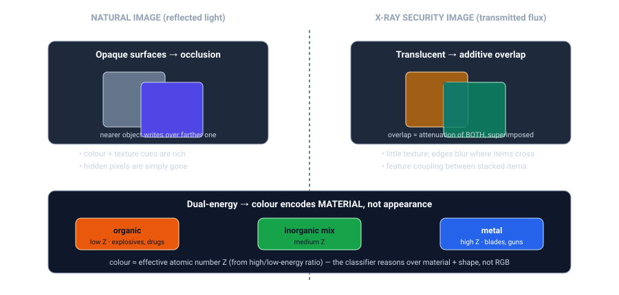
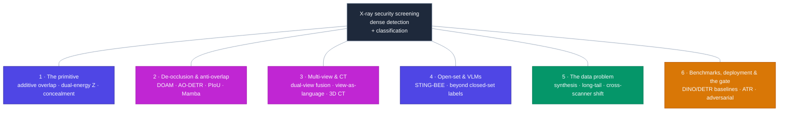
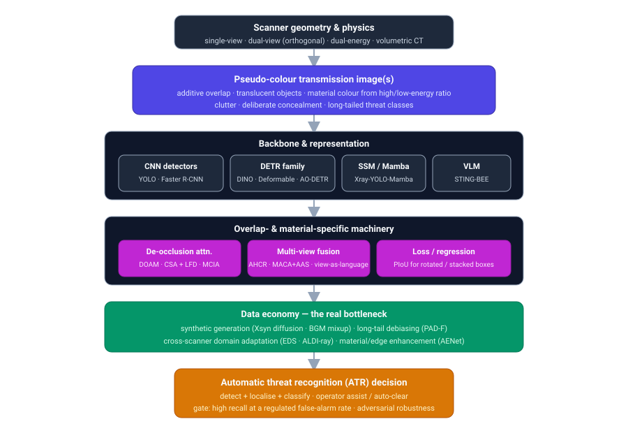

# Dense Object Detection & Classification — Recent Advances

*Compiled 2026-Jul-13 (America/Los_Angeles).*

Next installment in the running CV-updates log. Earlier entries on
`main`:
[Apr-30](../2026-Apr-30/2026-Apr-30_CV_updates.md),
[May-01](../2026-May-01/2026-May-01_CV_updates.md),
[May-02](../2026-May-02/2026-May-02_CV_updates.md),
[May-04](../2026-May-04/2026-May-04_CV_updates.md),
[May-05](../2026-May-05/2026-May-05_CV_updates.md),
[May-07](../2026-May-07/2026-May-07_CV_updates.md),
[May-08](../2026-May-08/2026-May-08_CV_updates.md),
[May-15](../2026-May-15/2026-May-15_CV_updates.md),
[May-16](../2026-May-16/2026-May-16_CV_updates.md),
[May-17](../2026-May-17/2026-May-17_CV_updates.md),
[Jun-09](../2026-Jun-09/2026-Jun-09_CV_updates.md),
[Jun-10](../2026-Jun-10/2026-Jun-10_CV_updates.md),
[Jun-12](../2026-Jun-12/2026-Jun-12_CV_updates.md),
[Jun-15](../2026-Jun-15/2026-Jun-15_CV_updates.md),
[Jun-16](../2026-Jun-16/2026-Jun-16_CV_updates.md),
[Jun-17](../2026-Jun-17/2026-Jun-17_CV_updates.md),
[Jun-19](../2026-Jun-19/2026-Jun-19_CV_updates.md),
[Jun-21](../2026-Jun-21/2026-Jun-21_CV_updates.md),
[Jun-22](../2026-Jun-22/2026-Jun-22_CV_updates.md),
[Jun-23](../2026-Jun-23/2026-Jun-23_CV_updates.md),
[Jun-24](../2026-Jun-24/2026-Jun-24_CV_updates.md),
[Jun-25](../2026-Jun-25/2026-Jun-25_CV_updates.md),
[Jun-27](../2026-Jun-27/2026-Jun-27_CV_updates.md),
[Jun-29](../2026-Jun-29/2026-Jun-29_CV_updates.md),
[Jun-30](../2026-Jun-30/2026-Jun-30_CV_updates.md),
[Jul-04](../2026-Jul-04/2026-Jul-04_CV_updates.md),
[Jul-07](../2026-Jul-07/2026-Jul-07_CV_updates.md),
[Jul-08](../2026-Jul-08/2026-Jul-08_CV_updates.md),
[Jul-10](../2026-Jul-10/2026-Jul-10_CV_updates.md).

## Why this pass: X-ray security screening as its own primitive

The recent run of passes has worked **sensor / imaging primitives on their own
terms** — camera-3D / occupancy ([Jun-24](../2026-Jun-24/2026-Jun-24_CV_updates.md)),
remote-sensing spectra ([Jun-25](../2026-Jun-25/2026-Jun-25_CV_updates.md)), the
LiDAR point cloud ([Jun-27](../2026-Jun-27/2026-Jun-27_CV_updates.md)), the event
camera ([Jun-29](../2026-Jun-29/2026-Jun-29_CV_updates.md)), thermal infrared
([Jun-30](../2026-Jun-30/2026-Jun-30_CV_updates.md)), imaging radar
([Jul-04](../2026-Jul-04/2026-Jul-04_CV_updates.md)), medical imaging
([Jul-07](../2026-Jul-07/2026-Jul-07_CV_updates.md)), subsea imaging
([Jul-08](../2026-Jul-08/2026-Jul-08_CV_updates.md)) and astronomical survey
imaging ([Jul-10](../2026-Jul-10/2026-Jul-10_CV_updates.md)). Those were the
*natural-world* sensing stacks — light, sound, radio, radiation as it arrives from
a scene. **X-ray security screening** is the great *adversarial, human-in-the-loop*
dense-detection domain, and the log has never taken it whole. It earns its own
pass. Medical radiology ([Jul-07](../2026-Jul-07/2026-Jul-07_CV_updates.md)) also
uses X-rays, but it is a *different problem*: a cooperative patient, a standard
pose, a diagnostic question. Security screening is **cluttered, arbitrary-pose,
and deliberately concealed** — someone on the other side of the belt is actively
trying to defeat the detector. That changes every design choice.

The security X-ray image is a genuinely different primitive from every sensor
covered so far:

- **It is transmission, not reflection — so objects are translucent and overlap is
  additive.** A natural-image detector reasons about opaque surfaces where a nearer
  object *hides* a farther one. In an X-ray scan the beam passes *through*
  everything; every object attenuates the beam, and where two items cross the image
  is the **superposition of both**. There is no "in front." This produces *feature
  coupling* — the edges and interior of one item bleed into another — which is the
  single most-studied failure mode in the field.
- **Colour encodes material (effective atomic number Z), not appearance.** Modern
  scanners are **dual-energy**: they fire at two spectra and take the ratio, which
  recovers the effective *Z* of what the beam passed through. Standard false-colour
  maps organic/low-Z material (explosives, narcotics, plastics) to **orange**, metal
  and high-Z material (blades, firearms) to **blue**, and mixtures to **green**. A
  model here learns *material + shape*, and almost no texture — the opposite of the
  RGB-texture priors baked into ImageNet backbones.
- **The target is rare, long-tailed, and hostile.** Threats appear in a vanishing
  fraction of bags, spread across a heavy tail of classes, and are *actively hidden*
  — wrapped in foil, aligned edge-on to the beam, buried in dense clutter. The
  operational gate is **high recall at a regulated false-alarm rate**, evaluated
  against an adversary, not average-case accuracy.
- **Geometry is a design variable.** Real checkpoints increasingly use **dual-view**
  (two orthogonal beams) or full **volumetric CT**, precisely because a single view
  can be defeated by rotation. Fusing views — or reasoning in 3D — is a first-class
  part of the modality rather than an afterthought.

> **Verification note.** This run's egress policy allowed web *search* and fetches
> of **GitHub / project pages**, but direct fetches of `arxiv.org`, `ieee.org`,
> journal PDFs and `openaccess.thecvf.com` returned HTTP 403. So arXiv IDs, venues
> and numbers were cross-checked against authors' **GitHub READMEs** (notably the
> community catalogue [`NeelBhowmik/xray`](https://github.com/NeelBhowmik/xray)) and
> multiple independent search snippets rather than the primary PDFs. Figures pinned
> to a repo/catalogue are stated plainly; those available only via secondary
> summaries are flagged *(secondary)*. arXiv IDs in the `2504`–`2512` range are
> real preprints not individually page-verified this run.

## Topic map

## 1 · The primitive — what additive overlap and material colour force

Every architectural choice in this field traces back to two physical facts, drawn
above: **overlap is additive** and **colour is material**. Neither holds for
natural images, and both break the priors that off-the-shelf detectors bring.

- **Additive overlap → feature coupling.** Because the scan is a superposition,
  a pile of items produces a region whose local features belong to *several* objects
  at once. Networks trained on opaque scenes assume a pixel belongs to one thing;
  here that assumption is false, and the dominant research thread (Section 2) is
  machinery that *decouples* the overlapping contributions. The canonical framing
  comes from the **OPIXray** benchmark and its **De-occlusion Attention Module
  (DOAM)**, which established "occluded prohibited items" as the defining
  sub-problem (ACM MM 2020) and remains the reference point five years on.
- **Material colour → the wrong backbone priors.** ImageNet backbones encode
  texture and natural-colour statistics; a dual-energy scan has neither. This is why
  so much recent work adds **material-aware** attention (interacting across the
  colour channels that encode Z) and **edge-aware** enhancement — the two cues that
  actually survive in this imagery — rather than relying on transferred texture
  features.
- **Concealment → the label distribution is adversarial.** PIDray, the most-used
  large benchmark, deliberately splits its test set into **easy / hard / hidden**
  precisely to measure the drop when items are *intentionally* concealed; the hidden
  subset is where every method still bleeds accuracy. This is the modality's honest
  metric.

## 2 · De-occlusion & anti-overlap — the core architecture line

The through-line of the last two years is **detectors specialised to decouple
overlapping, translucent objects** — the direct descendants of DOAM.

- **AO-DETR (Anti-Overlapping DETR).** The most-cited recent architecture, built on
  the **DINO** DETR variant, targets overlap head-on with two ideas: a
  **Category-Specific one-to-one Assignment (CSA)** strategy that forces each query
  to specialise to a class and thereby pulls apart the *coupled* foreground/
  background features of stacked items; and a **Look-Forward Densely (LFD)** scheme
  that stabilises localisation where overlapping edges blur. It reports
  state-of-the-art on **PIXray** and **OPIXray** (IEEE TNNLS, 2024/2025; arXiv
  [`2403.04309`](https://arxiv.org/abs/2403.04309)). This is the reference
  transformer for the modality.
- **Loss functions for stacked boxes.** Because overlapping and rotated items break
  IoU-based regression, a **Pixels-IoU (PIoU)** localisation loss has been proposed
  as a drop-in replacement for CIoU, improving box regression specifically under
  rotation and heavy overlap *(secondary)*.
- **Material- and edge-aware attention.** **MCIA (Material-aware Cross-channel
  Interaction Attention)** and, at benchmark scale, the **Aware Enhance Network
  (AENet)** — introduced with the large **114Xray** benchmark — explicitly model the
  colour distribution (material) and morphology (edges) that carry the signal in
  dual-energy imagery, rather than importing texture priors *(secondary)*.
- **Linear-time SSM / Mamba backbones.** The Mamba wave has reached this domain:
  **Xray-YOLO-Mamba** (Scientific Reports, 2025) couples YOLO with selective
  state-space blocks for long-range interaction at linear cost, aimed squarely at
  limited-texture, heavily-occluded scans; **XMamba** ("Fully Enhanced Mamba",
  2025) pushes the same idea. These echo the SSM adoption already seen for event
  cameras ([Jun-29](../2026-Jun-29/2026-Jun-29_CV_updates.md)) and point clouds
  ([Jun-27](../2026-Jun-27/2026-Jun-27_CV_updates.md)) — the pattern generalises.

The empirical verdict, from a **2025 comparative evaluation** of illicit-object
detectors (arXiv [`2507.17508`](https://arxiv.org/abs/2507.17508)), is that
**DETR-family transformers now lead**: **DINO** tops **CLCXray** (~0.804 mAP) and
**Deformable DETR** tops **PIDray** (~0.641 mAP), both ahead of the CNN detectors
(Faster R-CNN, YOLO variants) that dominated earlier *(secondary)*. The gap between
those two numbers — CLCXray vs. PIDray — is itself the concealment tax.

## 3 · Multi-view & CT — beating rotation with geometry

A single view is defeatable by pose: align a blade edge-on to the beam and it
nearly vanishes. Two structural answers have matured.

- **Dual-view detection is now a first-class task with a public benchmark.** The
  **DVXray** dataset (2024) provides **16,000 image pairs / 32,000 images** across
  **15 classes** — the first large, fully public dual-view set — and the
  **CVPR 2025** paper *"Dual-view X-ray Detection: Can AI Detect Prohibited Items
  from Dual-view X-ray Images like Humans?"* (arXiv
  [`2411.18082`](https://arxiv.org/abs/2411.18082)) frames the human-like fusion of
  two orthogonal views as the target. Follow-ups add **Adaptive Hierarchical Cross
  Refinement (AHCR)** and an end-to-end **material-aware coordinate-aligned
  attention (MACA)** with an adaptive adjustment strategy (CMC 2025) for fusing the
  views *(secondary)*.
- **The second view as a "language."** A November-2025 preprint, *"Can a Second-View
  Image Be a Language?"* (arXiv [`2511.18385`](https://arxiv.org/abs/2511.18385)),
  reframes cross-view fusion as **geometric-and-semantic cross-modal reasoning** —
  treating the complementary view the way a VLM treats text, to resolve what one
  view alone cannot. It is the clearest sign the field is borrowing the
  vision-language playbook (Section 4) for its own geometry.
- **Volumetric CT is the deployment endgame.** Checkpoint **CT** scanners (rolling
  out at major airports through 2025, and the reason laptops and liquids can stay in
  the bag) turn screening into a genuine **3D dense-detection** problem — multi-class
  3D object detection and contraband-*material* detection in noisy, artefact-heavy
  volumes. Image-matched studies show CT's 3D evidence measurably improves threat
  recognition over dual-view 2D. This connects the modality back to the volumetric
  stacks in [Jul-07 (medical)](../2026-Jul-07/2026-Jul-07_CV_updates.md) and
  [Jun-27 (LiDAR/point cloud)](../2026-Jun-27/2026-Jun-27_CV_updates.md), but with
  additive attenuation and material labels rather than surfaces or returns.

## 4 · Open-set & vision-language — escaping the closed label set

The field's oldest limitation is the **closed-set paradigm**: a detector trained on
a fixed list of threats is blind to a novel one, and threats evolve adversarially.
2025 brought the first serious break.

- **STING-BEE** (CVPR 2025, arXiv [`2504.02823`](https://arxiv.org/abs/2504.02823))
  is described as the **first domain-aware vision-language assistant** for X-ray
  baggage screening. It ships with **STCray** — the first multimodal X-ray security
  dataset, **46,642 image–caption pairs across 21 threat categories** built with a
  protocol for coherent, domain-aware captions — and supports **scene
  comprehension, referring threat localisation, visual grounding, and VQA** in one
  model. It reports state-of-the-art **cross-domain** generalisation across STCray,
  SIXray, PIDray and Compass XP despite scanner variation — the property closed-set
  detectors most conspicuously lack. This is the same detection-as-language and
  open-vocabulary turn the log tracked for GUI/agent imagery
  ([Jun-23](../2026-Jun-23/2026-Jun-23_CV_updates.md)), now landing in security.
- **Foundation-model transfer is still shaky here.** Evaluations of **SAM**-style
  promptable segmentation on non-visible-spectrum (including X-ray) imagery report
  that natural-image foundation models transfer *poorly* without adaptation — the
  material-not-texture gap again. The open problem is a genuine **X-ray foundation
  backbone**; STCray's captions are a first substrate for pretraining one.

## 5 · The data problem — synthesis, long tails, and cross-scanner shift

More than architecture, **data is the bottleneck**: threats are rare, annotation is
expensive and expert, and every scanner model produces a subtly different image.
Three sub-threads dominate.

- **Synthetic generation, now one-stage and diffusion-based.** The old route pasted
  extracted foreground threats onto benign bags (a labour-intensive two-stage
  pipeline; **BGM: Background Mixup**, arXiv
  [`2412.00460`](https://arxiv.org/abs/2412.00460), is a strong 2024 exemplar). The
  2025 shift is **Xsyn** — *"Taming Generative Synthetic Data for X-ray Prohibited
  Item Detection"* (arXiv [`2511.15299`](https://arxiv.org/abs/2511.15299)) — a
  **one-stage text-to-image** synthesis pipeline that needs **no foreground
  extraction**: **Cross-Attention Refinement (CAR)** reads the diffusion model's own
  cross-attention to produce the bounding-box label, and **Background Occlusion
  Modelling (BOM)** injects realistic overlap in latent space. It reports **+1.2%
  mAP** across datasets and detectors with zero extra labelling *(secondary)*. The
  annotation-economy theme from [Jun-12](../2026-Jun-12/2026-Jun-12_CV_updates.md)
  and [Jun-25](../2026-Jun-25/2026-Jun-25_CV_updates.md), specialised to a domain
  where labels need a trained screener.
- **Long-tailed debiasing.** Threat classes follow a brutal power law. **PAD-F
  (Prior-Aware Debiasing Framework)** (arXiv
  [`2411.18078`](https://arxiv.org/abs/2411.18078)) targets long-tailed prohibited-
  item detection directly, correcting the head-class bias that otherwise buries rare
  threats *(secondary)*.
- **Cross-scanner domain shift.** Because every scanner model images differently, a
  detector trained on one generalises poorly to another — the **"endogenous shift"**
  formalised by the **EDS** benchmark (CVPR 2022) and still the reference. The 2025
  move is to import mature natural-image UDA machinery: **ALDI-ray** (arXiv
  [`2512.02696`](https://arxiv.org/abs/2512.02696)) adapts the **ALDI**
  align-and-distill framework to security X-ray, and transfer-learning studies now
  report cross-scanner mAP around **0.87** (and ~0.94 AP for firearms specifically)
  *(secondary)*.

## 6 · Datasets, benchmarks & the operational gate

The field is unusually **dataset-defined** — each benchmark encodes a specific
difficulty (occlusion, concealment, dual-view, scale). The current landscape,
cross-checked against the [`NeelBhowmik/xray`](https://github.com/NeelBhowmik/xray)
catalogue:

| Dataset | Year | Images | Classes | What it is for |
|---|---|---|---|---|
| GDXray | 2015 | 19,407 | 5 | Early grayscale baggage/casting benchmark |
| SIXray | 2019 | 8,929 pos / 1,050,030 neg | 6 | Large-scale, extreme class imbalance |
| OPIXray | 2020 | 8,885 | 5 | **Occluded** cutters; introduced DOAM |
| HiXray | 2021 | 45,364 | 8 | High-quality, real airport data |
| PIDray | 2021 | 47,677 | 12 | **Concealment**: easy / hard / hidden splits |
| PIXray | 2022 | 5,046 | 12 | Bbox + segmentation; AO-DETR benchmark |
| CLCXray | 2022 | 9,565 | 12 | Cutters + **liquids** (real + simulated) |
| LPIXray | 2023 | 60,950 | 18 | Broad class coverage |
| DVXray | 2024 | 32,000 (16k pairs) | 15 | First large **dual-view** public set |
| LDXray | 2024 | 146,997 | 12 | Largest-scale single benchmark |
| STCray | 2025 | 46,642 | 21 | First **multimodal** (image–caption) set |

*(Compass XP and EDS add material-classification and cross-domain splits
respectively; the same catalogue lists 2 volumetric CT datasets.)*

**The gate.** What separates this modality from every other in the log is the
evaluation contract. Success is not average-case mAP — it is **detection
probability (recall) at a regulated false-alarm rate**, measured against an
**adversary** and often against **physical attacks**. **X-Adv** (physical
adversarial objects that defeat X-ray detectors) showed the threat is not
hypothetical: because an attacker controls what enters the belt, robustness is a
first-order requirement, not a nice-to-have. A model that scores well on PIDray-easy
and collapses on PIDray-hidden — or that a foil wrap defeats — has not solved the
problem the checkpoint actually poses.

## Cross-cutting theme: the same escapes, a hostile gate

Read against the rest of the log, X-ray security is running the **same four escapes**
seen everywhere else — DETR-family and Mamba backbones (Section 2), multi-view/3D
geometry (Section 3), vision-language and open-vocabulary (Section 4), and
synthetic-data / domain-adaptation economy (Section 5). What makes it its own
primitive is not the escapes but the **constraints they run into**: additive
transmission overlap instead of occlusion, material colour instead of texture, and —
uniquely — a **deliberate adversary** on the other side of the belt whose job is to
make the hidden subset fail. The interesting frontier is exactly where a borrowed
technique meets that wall: STING-BEE's open-vocabulary reasoning against novel
concealment, Xsyn's diffusion samples against the additive-overlap statistics real
threats produce, dual-view fusion against edge-on rotation. The modality's honest
metric — recall on *hidden*, at a fixed false-alarm rate, under attack — is the one
number that tells you whether any of it transferred.

---

## Sources & further reading

Primary architecture & tasks:
- AO-DETR — Anti-Overlapping DETR (IEEE TNNLS 2024/25): https://arxiv.org/abs/2403.04309
- STING-BEE + STCray — VLM for X-ray baggage (CVPR 2025): https://arxiv.org/abs/2504.02823
- Dual-view X-ray Detection + DVXray (CVPR 2025): https://arxiv.org/abs/2411.18082
- "Can a Second-View Image Be a Language?" (2025): https://arxiv.org/abs/2511.18385
- DOAM + OPIXray — occluded prohibited items (ACM MM 2020): https://dl.acm.org/doi/10.1145/3394171.3413828
- Xray-YOLO-Mamba (Scientific Reports 2025): https://www.nature.com/articles/s41598-025-96035-1

Data economy (synthesis, long-tail, domain shift):
- Xsyn — "Taming Generative Synthetic Data for X-ray Prohibited Item Detection" (2025): https://arxiv.org/abs/2511.15299
- BGM — Background Mixup (2024): https://arxiv.org/abs/2412.00460
- PAD-F — Prior-Aware Debiasing for long-tailed detection (2024): https://arxiv.org/abs/2411.18078
- ALDI-ray — align-and-distill domain adaptation for security X-ray (2025): https://arxiv.org/abs/2512.02696

Benchmarks, surveys & robustness:
- Illicit object detection in X-ray — comparative evaluation (2025): https://arxiv.org/abs/2507.17508
- Community catalogue of X-ray security datasets & papers: https://github.com/NeelBhowmik/xray
- "Recent Advances in Baggage Threat Detection" — survey (ACM Computing Surveys): https://dl.acm.org/doi/10.1145/3549932
- Lightweight prohibited-item detection study (PMC 2025): https://pmc.ncbi.nlm.nih.gov/articles/PMC12430950/

*(arXiv PDFs and IEEE/CVF pages were not directly fetchable under this run's egress
policy; links are provided for the reader and were corroborated via search snippets
and the GitHub catalogue as noted in the verification box above.)*

---

### Diagram-rendering notes

Two standalone SVGs accompany this entry (`assets/xray-primitive.svg`,
`assets/xray-stack.svg`) plus one inline Mermaid topic map. All use mid-tone
slate/indigo/magenta/emerald/amber fills with light text so they read on both
light and dark GitHub themes; no external URLs, fonts, or scripts are referenced.
