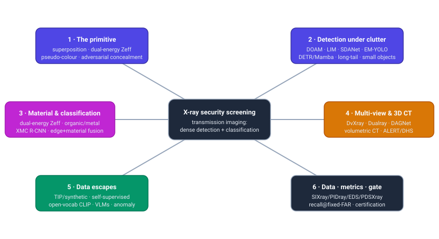
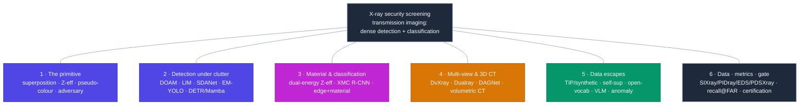
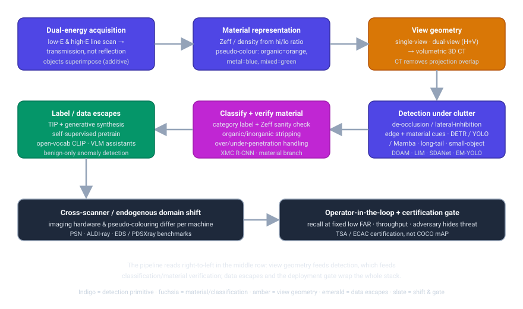

# Dense Object Detection & Classification — Recent Advances

*Compiled 2026-Jul-14 (America/Los_Angeles).*

Next installment in the running CV-updates log. Earlier entries on
`main`:
[Apr-30](../2026-Apr-30/2026-Apr-30_CV_updates.md),
[May-01](../2026-May-01/2026-May-01_CV_updates.md),
[May-02](../2026-May-02/2026-May-02_CV_updates.md),
[May-04](../2026-May-04/2026-May-04_CV_updates.md),
[May-05](../2026-May-05/2026-May-05_CV_updates.md),
[May-07](../2026-May-07/2026-May-07_CV_updates.md),
[May-08](../2026-May-08/2026-May-08_CV_updates.md),
[May-15](../2026-May-15/2026-May-15_CV_updates.md),
[May-16](../2026-May-16/2026-May-16_CV_updates.md),
[May-17](../2026-May-17/2026-May-17_CV_updates.md),
[Jun-09](../2026-Jun-09/2026-Jun-09_CV_updates.md),
[Jun-10](../2026-Jun-10/2026-Jun-10_CV_updates.md),
[Jun-12](../2026-Jun-12/2026-Jun-12_CV_updates.md),
[Jun-15](../2026-Jun-15/2026-Jun-15_CV_updates.md),
[Jun-16](../2026-Jun-16/2026-Jun-16_CV_updates.md),
[Jun-17](../2026-Jun-17/2026-Jun-17_CV_updates.md),
[Jun-19](../2026-Jun-19/2026-Jun-19_CV_updates.md),
[Jun-21](../2026-Jun-21/2026-Jun-21_CV_updates.md),
[Jun-22](../2026-Jun-22/2026-Jun-22_CV_updates.md),
[Jun-23](../2026-Jun-23/2026-Jun-23_CV_updates.md),
[Jun-24](../2026-Jun-24/2026-Jun-24_CV_updates.md),
[Jun-25](../2026-Jun-25/2026-Jun-25_CV_updates.md),
[Jun-27](../2026-Jun-27/2026-Jun-27_CV_updates.md),
[Jun-29](../2026-Jun-29/2026-Jun-29_CV_updates.md),
[Jun-30](../2026-Jun-30/2026-Jun-30_CV_updates.md),
[Jul-04](../2026-Jul-04/2026-Jul-04_CV_updates.md),
[Jul-07](../2026-Jul-07/2026-Jul-07_CV_updates.md),
[Jul-08](../2026-Jul-08/2026-Jul-08_CV_updates.md),
[Jul-10](../2026-Jul-10/2026-Jul-10_CV_updates.md).

## Why this pass: X-ray security screening as its own primitive

The recent run of passes has worked **sensor / imaging primitives on their own
terms** — camera-3D / occupancy ([Jun-24](../2026-Jun-24/2026-Jun-24_CV_updates.md)),
remote-sensing spectra ([Jun-25](../2026-Jun-25/2026-Jun-25_CV_updates.md)), the
LiDAR point cloud ([Jun-27](../2026-Jun-27/2026-Jun-27_CV_updates.md)), the event
camera ([Jun-29](../2026-Jun-29/2026-Jun-29_CV_updates.md)), thermal infrared
([Jun-30](../2026-Jun-30/2026-Jun-30_CV_updates.md)), imaging radar
([Jul-04](../2026-Jul-04/2026-Jul-04_CV_updates.md)), medical imaging
([Jul-07](../2026-Jul-07/2026-Jul-07_CV_updates.md)), subsea imaging
([Jul-08](../2026-Jul-08/2026-Jul-08_CV_updates.md)) and the astronomical survey
([Jul-10](../2026-Jul-10/2026-Jul-10_CV_updates.md)). Every one of those images the
world by **reflected or emitted** radiation. **X-ray security screening** — the
baggage and cargo scanner at every airport, port and courthouse — is the great
*transmission* modality, and the log has never taken it whole. It earns its own
pass, and it is not a niche: it is one of the highest-volume dense-detection
problems deployed on Earth, run millions of times a day under a hard real-time,
adversarial, safety-critical constraint.

The security X-ray image is a genuinely different primitive from every sensor
covered so far:

- **The image is a transmission projection, so objects *superimpose* rather than
  occlude.** A camera pixel sees the nearest opaque surface; an X-ray pixel
  integrates attenuation along a ray through *everything* in the bag. Objects are
  semi-transparent and their signals **add** — a knife behind a laptop is not
  hidden behind an opaque boundary, it is blended into the laptop's texture. This
  inverts the natural-image occlusion prior: there is no depth ordering and no clean
  silhouette, which is exactly why generic COCO detectors underperform and why the
  field built dedicated **de-occlusion** ([DOAM](https://arxiv.org/abs/2004.08656))
  and **lateral-inhibition** ([LIM](https://arxiv.org/abs/2108.09917)) modules.
- **Colour is *material*, not appearance — via dual-energy physics.** A modern
  scanner fires two X-ray spectra (low- and high-energy) and the ratio of
  attenuations recovers the **effective atomic number (Zeff)** and
  density of what the ray passed through. The familiar pseudo-colour palette is a
  physics readout, not a camera colour: **organic ≈ orange, metal/inorganic ≈ blue,
  mixtures ≈ green**. Detection and classification therefore lean on a material
  channel with no natural-image analogue — and the palette itself is
  device-specific, a domain-shift trap explored below.
- **The scene is adversarial by construction.** Unlike a galaxy or a tumour, the
  target here is placed by someone actively trying to defeat the detector —
  deliberately concealed, disassembled, wrapped in dense clutter, or aligned to
  present its thinnest profile. This is the field's defining twist: the data
  distribution is not merely long-tailed, it is *hostile*, which is why
  benchmarks like [PIDray](https://arxiv.org/abs/2211.10763) carve out an explicit
  **"hidden"** subset and why [STCray](https://arxiv.org/abs/2504.02823) grades
  clutter from *Limited* to *Extreme*.
- **The operating point is recall at a fixed, very low false-alarm rate — and
  throughput.** A missed weapon is catastrophic and threats are rare, so the metric
  that matters is **detection/recall at a fixed low false-alarm rate (FAR)** with a
  hard **frames-per-bag latency budget**, not COCO mAP. As in the medical
  ([Jul-07](../2026-Jul-07/2026-Jul-07_CV_updates.md)) and astronomical
  ([Jul-10](../2026-Jul-10/2026-Jul-10_CV_updates.md)) passes, the metric encodes an
  asymmetric cost — but here it is also wrapped in **regulatory certification**
  (TSA / ECAC) and an **operator-in-the-loop**, so the model is a second reader, not
  an autonomous decider.

Everything below follows from those four facts.

## Topic map

## 1 · The primitive & representation — why the security X-ray forces different choices

The stack begins with **dual-energy line-scan acquisition**: a fan beam and a
detector array build the image column-by-column as the belt moves, at *two* photon
energies. The low/high ratio is what makes X-ray screening a **material** sensor
rather than a shape sensor — the recovered Zeff and density feed the
canonical **organic-orange / metal-blue / mixed-green** pseudo-colouring that human
operators (and detectors) read. The survey literature that frames the whole task —
Akçay & Breckon's *Towards Automatic Threat Detection*
([arXiv 2001.01293](https://arxiv.org/abs/2001.01293)) and Mery's GDXray work — is
unanimous that this material channel, not texture, is the discriminative signal, and
that the **transmission-superposition** property is the core difficulty: attenuation
along a ray is additive, so a threat's signature is *mixed into* whatever it lies
behind rather than hiding behind an opaque edge.

That single fact reshapes the representation problem:

- **De-occlusion is a first-class module, not post-processing.** Because a prohibited
  item's boundary is blurred by everything overlapping it, the OPIXray benchmark
  shipped the **De-occlusion Attention Module (DOAM)**
  ([arXiv 2004.08656](https://arxiv.org/abs/2004.08656)), a plug-in that hybridises an
  edge-guidance sub-module (EAM) with a region/material sub-module (RAM) to sharpen
  the occluded object's appearance for *any* backbone detector. The HiXray benchmark
  answered with the **Lateral Inhibition Module (LIM)**
  ([arXiv 2108.09917](https://arxiv.org/abs/2108.09917)), which suppresses noisy
  cross-object signal (bidirectional propagation) and re-activates the item boundary
  from four directions (boundary activation) — a neuro-inspired take on the same
  superposition problem.
- **Edges and material are complementary cues, and recent detectors fuse both
  explicitly.** **EM-YOLO** ([PMC10610966](https://pmc.ncbi.nlm.nih.gov/articles/PMC10610966/))
  adds an edge branch *and* a material-information branch to a YOLO detector,
  precisely because in a superimposed scene the contour survives where the interior
  texture does not, and the Zeff colour survives where the contour does not.
- **Contrast scaling / pseudo-colouring is a design choice that moves the numbers.**
  The choice of colour map and normalisation is not cosmetic; it changes which
  detector wins, and — because vendors colour differently — it becomes the
  domain-shift axis that the [PDSXray](https://www.nature.com/articles/s41597-026-07149-8)
  benchmark (§6) was built to isolate. This mirrors the "contrast scaling changes the
  winner" finding from the astronomical pass, arriving here for an entirely
  different physical reason.

## 2 · Detection under clutter — de-occlusion, edges, and the modern backbones

With the representation fixed, the detection literature is a march through backbone
families adapted to superposition, clutter and rare small threats:

- **Occlusion/clutter-specialised heads.** Beyond DOAM and LIM, the
  [PIDray](https://arxiv.org/abs/2211.10763) benchmark introduced **SDANet** (a
  selective dense-attention network) targeting its deliberately **hidden** subset,
  where threats are wrapped or disassembled. The through-line across all three is
  that generic FPN attention is not enough — the network needs a mechanism that
  *knows* the target's signal is blended additively into its surroundings.
- **YOLO remains the deployment workhorse, now with attention and material.** Recent
  real-time systems report strong numbers with attention-augmented YOLO backbones —
  a real-time CNN detector for screening
  ([Radiation Physics & Chemistry 2025](https://www.sciencedirect.com/science/article/abs/pii/S0969806X25001732)),
  a lightweight residual+attention model at **~95.6% detection / 122 FPS**, ~1.9 mAP
  over a YOLOv4-tiny baseline *(secondary)*, and **CE-FPN-YOLO**
  ([Mathematics 2024](https://doi.org/10.3390/math13244012)), a contrast-enhanced
  feature pyramid aimed squarely at **concealed small objects** in baggage.
- **Transformer and state-space detectors arrive.** A **hybrid CNN–transformer**
  study ([arXiv 2505.00564](https://arxiv.org/abs/2505.00564)) and DETR-family
  adaptations report gains on cluttered scenes, and **Xray-YOLO-Mamba**
  ([PMC12003800](https://pmc.ncbi.nlm.nih.gov/articles/PMC12003800/)) brings a
  **selective state-space** backbone (the Mamba thread that has now touched nearly
  every modality in this log) to lightweight prohibited-item detection. A
  comparative evaluation across CNN, transformer and hybrid detectors
  ([arXiv 2507.17508](https://arxiv.org/abs/2507.17508)) is the current reference for
  which family wins where.
- **Long-tail and small-object are named, structural problems.** Threat categories
  are heavily imbalanced (many scissors, few grenades), so **PAD-F** — a
  *Prior-Aware Debiasing Framework* ([arXiv 2411.18078](https://arxiv.org/abs/2411.18078)) —
  attacks the long tail directly, and **iX-Det**
  ([JCDE 2026](https://academic.oup.com/jcde/advance-article/doi/10.1093/jcde/qwaf126/8325208))
  targets the small, non-metallic, low-contrast items that generic detectors miss.
  This is the same long-tail / small-object refrain from the LVIS
  ([Jun-19](../2026-Jun-19/2026-Jun-19_CV_updates.md)) and small-object
  ([May-16](../2026-May-16/2026-May-16_CV_updates.md)) passes, sharpened by an
  adversary who *chooses* the tail.

## 3 · Classification & material — dual-energy is the discriminative channel

Classification in security X-ray is inseparable from **material estimation**, and this
is where the modality most departs from RGB recognition:

- **Material discrimination via dual-energy.** The low/high-energy pair yields
  Zeff and electron density, enabling **organic vs inorganic vs metal**
  separation before any semantic label is assigned. Classic pipelines like
  **XMC R-CNN** solve overlapping-object contraband detection through an explicit
  X-ray material classifier plus **organic/inorganic stripping** algorithms — using
  the physics to *un-mix* the superimposed signal. Robust material classification on
  fielded dual-energy devices remains an active target
  ([Robust Material Classification, 2022](https://www.researchgate.net/publication/359344789_Robust_Material_Classification_on_Dual-Energy_X-Ray_Imaging_Devices)).
- **Material as a fusion cue, and its limits.** EM-YOLO's material branch (§1) shows
  the gain from injecting Zeff alongside edges; conversely, the cargo
  literature is blunt that **dual-energy has fundamental atomic-number-discrimination
  limits** at high penetration
  ([arXiv 2301.05783](https://arxiv.org/abs/2301.05783)) — over- and
  under-penetration both destroy the ratio, so material confidence must be
  penetration-aware.
- **The energy-response image helps — sometimes.** Work on feeding the raw
  **X-ray energy-response** channels into CNN detectors
  ([arXiv 2108.12505](https://arxiv.org/abs/2108.12505)) quantifies when the extra
  material signal actually improves object detection versus when the pseudo-colour
  RGB already carries it — a useful antidote to assuming more channels always help.

## 4 · Multi-view & 3D CT — beating projection overlap with geometry

If superposition is the core difficulty, the structural fix is **more views** — and
this is one of the most active recent threads:

- **Dual-view (horizontal + vertical) is now a benchmarked sub-field.** **DvXray**
  ([GitHub](https://github.com/Mbwslib/DvXray), TIFS 2024) is the first large-scale
  dual-view baggage set (**32k image pairs**), and CVPR 2025's *Dual-view X-ray
  Detection: Can AI Detect Prohibited Items from Dual-view X-ray Images like Humans?*
  ([arXiv 2411.18082](https://arxiv.org/abs/2411.18082)) frames the human-parity
  question directly. Fusion frameworks are proliferating: **DAGNet**, a dual-view
  attention-guided network with a frequency-domain interaction module
  ([arXiv 2502.01710](https://arxiv.org/abs/2502.01710)); a transformer-based
  dual-view analyser
  ([EAAI 2024](https://www.sciencedirect.com/science/article/abs/pii/S0952197624015409));
  a **DINO**-based dual-view detector
  ([ACM 2024](https://dl.acm.org/doi/10.1145/3709026.3709065)); and the earlier
  **Dualray** benchmark + fusion framework. The shared insight: a threat presenting
  its thin edge to one view is broadside in the orthogonal view, so **view-consistency
  fusion** recovers what single-view superposition loses.
- **Oriented / stereoscopic detection for a "universal" scanner.** A Science China
  paper pushes toward **universal** inspection with a **stereoscopic-aware oriented**
  prohibited-item framework and benchmark
  ([SCIS 2024](https://link.springer.com/article/10.1007/s11432-024-4732-x)), tying
  the oriented-box thread (from the aerial/OBB passes) to multi-view X-ray.
- **3D CT is the endgame — and it dissolves the superposition problem outright.**
  Volumetric CT baggage screening (no laptop/liquid removal) gives a true 3D field
  where objects no longer overlap. The DHS/**ALERT** Center of Excellence seeded much
  of this: first CNN classification/detection in volumetric CT
  ([arXiv 2003.12625](https://arxiv.org/abs/2003.12625)), **multi-class 3D object
  detection** ([arXiv 2008.01218](https://arxiv.org/abs/2008.01218)), and
  **contraband materials detection** in 3D CT
  ([arXiv 2012.11753](https://arxiv.org/abs/2012.11753)). Segmentation of concealed
  items continues — e.g. a **semi-supervised contour-driven broad learning system**
  for autonomous baggage segmentation
  ([VCIBA 2024](https://vciba.springeropen.com/articles/10.1186/s42492-024-00182-7)).
  The trade-off named repeatedly: CT removes overlap but adds cost, latency and
  annotation burden.

## 5 · The data escapes — synthetic, self-supervised, open-vocabulary, VLM, anomaly

Threat data is scarce, sensitive and long-tailed, so — exactly as in every prior
modality — the frontier is **learning without exhaustive threat labels**. Four escape
routes, and they are converging:

- **Synthetic composition (TIP) and generative synthesis.** **Threat Image
  Projection** — realistically compositing a threat's X-ray signature into a benign
  bag, weighting placement toward cluttered regions — is the field's native
  augmentation and remains effective: an *Improved threat item detection through
  image projection* study
  ([CVIU / IVC 2025](https://www.sciencedirect.com/science/article/abs/pii/S1047320325001312))
  and **Background Mixup (BGM)**, which injects benign-bag contour and material
  variation. The generative wave is now here: GAN-based augmentation of pseudo-colour
  threats, text-to-image synthetic generation feeding a YOLO detector
  ([Electronics 2025](https://doi.org/10.3390/electronics14071351)), and — importantly
  — *Taming Generative Synthetic Data for X-ray Prohibited Item Detection*
  ([arXiv 2511.15299](https://arxiv.org/abs/2511.15299)), which confronts the
  realism/label-noise gap that naive diffusion output introduces.
- **Self-supervised pretraining on unlabelled scans.** A *Visual Self-supervised
  Learning Scheme for Dense Prediction Tasks on X-ray Images*
  ([arXiv 2310.08421](https://arxiv.org/abs/2310.08421)) pretrains on the abundant
  stream of unlabelled bags — the SSL-pretrain-then-finetune recipe that has now
  appeared for the event camera, LiDAR and medical passes, here motivated by the
  privacy/scarcity of labelled threats.
- **Open-vocabulary detection and vision-language assistants.** *Open-Vocabulary
  X-ray Prohibited Item Detection via Fine-tuning CLIP*
  ([arXiv 2406.10961](https://arxiv.org/abs/2406.10961)) adapts CLIP with an X-ray
  feature adapter so novel/emerging threat classes can be named at test time rather
  than retrained — and *Superpowering open-vocabulary object detectors for X-ray
  vision* (ICCV 2025) *(secondary)* pushes the same idea. The biggest 2025 move is
  full **vision-language assistants**: **STING-BEE**
  ([arXiv 2504.02823](https://arxiv.org/abs/2504.02823), CVPR 2025) is the first
  domain-aware VLM for baggage screening — scene comprehension, referring threat
  localisation, grounding and VQA — trained on the new **STCray** set (**46,642**
  image-caption scans, **21** threat categories, graded clutter/concealment). **OneFocus**
  ([arXiv 2606.15663](https://arxiv.org/abs/2606.15663)) pursues a *unified* VLM for
  real-world screening. This is the detection-as-language / grounded-MLLM thread
  ([Jun-16](../2026-Jun-16/2026-Jun-16_CV_updates.md),
  [Jun-23](../2026-Jun-23/2026-Jun-23_CV_updates.md)) landing in security X-ray.
- **Benign-only anomaly detection.** Because you can collect endless *normal* bags but
  few threats, **anomaly detection** trains on benign-only data and flags whatever
  deviates — powerful against **novel** threats no detector was trained on.
  Unsupervised anomaly *instance segmentation* for baggage
  ([arXiv 2107.07333](https://arxiv.org/abs/2107.07333)) and, on the cargo side,
  **self-supervised anomaly detection with generalisation to novel anomalies**
  ([EAAI 2025](https://www.sciencedirect.com/science/article/abs/pii/S0952197624018335))
  plus a dedicated new benchmark, are the leading examples. Cargo reports ~**90%
  detection at <6% false alarms, ~3.5 s per container** *(secondary)* — the
  recall-at-fixed-FAR framing made concrete.

## 6 · Datasets, benchmarks, metrics & the deployment gate

The benchmark ladder is the field's backbone, and 2024–2026 added the pieces that
were missing — segmentation, domain shift, and multimodal captions:

- **The core detection ladder.** **GDXray** (grayscale, early) → **SIXray**
  (>1M images, extreme benign/threat imbalance) → **OPIXray** (8,885 cutter images,
  the de-occlusion benchmark) → **HiXray** (102,928 images, 8 categories,
  electronics) → **PIDray** (124,486 images, 12 categories, with the deliberately
  **hidden** subset) → **CLCXray** (overlapping-object focus). The community index at
  [NeelBhowmik/xray](https://github.com/NeelBhowmik/xray) tracks the full list.
- **New task axes (2024–2026).** **XSeg**
  ([arXiv 2604.03706](https://arxiv.org/abs/2604.03706)) is a large-scale **contraband
  segmentation** benchmark, pushing the field from boxes to masks. A **rail-transit-hub**
  dataset with an incremental-learning detector
  ([The Visual Computer 2024](https://link.springer.com/article/10.1007/s00371-024-03725-4))
  and **STCray** (§5) extend coverage to new venues and to multimodal captions.
- **Domain shift is now its own benchmark family — and it is the deployment blocker.**
  Two shifts matter: (a) the **endogenous shift** across scanner hardware, isolated by
  the **EDS** benchmark (14,219 images, 3 X-ray machines, 10 categories) and its
  **Perturbation Suppression Network (PSN)**, which suppresses category-dependent and
  -independent perturbations via prototype alignment + global adversarial learning
  ([XrayDetection repo](https://github.com/DIG-Beihang/XrayDetection)); and (b) the
  **pseudo-colouring-driven shift** across vendor colour maps, isolated by **PDSXray**
  ([Scientific Data 2026](https://www.nature.com/articles/s41597-026-07149-8)).
  **ALDI-ray** ([arXiv 2512.02696](https://arxiv.org/abs/2512.02696)) adapts a modern
  domain-adaptation framework to close these gaps. This is the same generalisation
  wall the AV, remote-sensing and medical passes hit — but here it is *endogenous*:
  the sensor itself, not the scene, is what shifts.
- **Metrics and the gate.** Papers report **mAP / mAP@0.5** for comparability, but the
  operationally meaningful numbers are **detection (recall) at a fixed low FAR** and
  **throughput (frames/bag)** — and, uniquely, the numbers live under **regulatory
  certification** (TSA / ECAC standards) with a **human operator as the final
  decider**. As with prior modalities, the numbers quoted below are **not comparable
  across rows** — they differ in dataset, view configuration, category set and
  operating point — and the deployment bar is not "beats mAP" but "certifiable,
  real-time, and robust to an adversary who has seen your detector."

## Cross-cutting theme: the same escapes, on a modality whose gate is an adversary

Every pass in this run has ended on the same observation — that the *escapes*
(synthetic data, self-supervision, foundation models, open-vocabulary, VLMs) are
converging across modalities — and security X-ray fits the pattern exactly: TIP and
generative synthesis, SSL pretraining on unlabelled bags, CLIP-adapted open-vocab
detection, and full VLM assistants (STING-BEE, OneFocus) all appear here in 2025–2026,
the same toolkit seen for the event camera, LiDAR, medical and astronomical passes.

What is *unique* to this modality is the shape of the gate. Astronomy's gate is
cosmological validity; medicine's is clinical safety; here the gate has **three
simultaneous walls** no other modality faces at once:

1. **An adversary in the loop** — the target distribution is chosen by someone trying
   to defeat the model, so robustness to concealment and to *unseen* threats
   (hence anomaly detection and open-vocab) is not optional.
2. **Endogenous domain shift** — the sensor hardware and pseudo-colouring differ per
   machine, so a detector trained on one scanner degrades on the next (EDS, PDSXray,
   PSN, ALDI-ray) in ways invisible to a human but fatal to a CNN.
3. **Certification + operator-in-the-loop** — the deliverable is a *certifiable
   second reader* hitting recall at a fixed FAR within a hard latency budget, not an
   autonomous decision. Multi-view and 3D CT are the structural bets that move the
   whole recall-at-FAR curve by attacking superposition at the physics level rather
   than the model level.

That is the security X-ray on its own terms: a transmission-physics, material-coloured,
adversarially-cluttered dense-detection problem where the winning move is often not a
better head but a better *representation* — a second view, a CT volume, or a material
channel — wrapped in the toolkit every modality now shares.

## Sources & further reading

**Surveys, framing & the primitive**
- *Towards Automatic Threat Detection: A Survey of Advances of Deep Learning within X-ray Security Imaging* — [arXiv 2001.01293](https://arxiv.org/abs/2001.01293) · [Pattern Recognition](https://www.sciencedirect.com/science/article/abs/pii/S0031320321004258).
- Community dataset/paper index — [NeelBhowmik/xray](https://github.com/NeelBhowmik/xray); Beihang X-ray detection code — [DIG-Beihang/XrayDetection](https://github.com/DIG-Beihang/XrayDetection).
- Comparative evaluation of deep detectors on X-ray — [arXiv 2507.17508](https://arxiv.org/abs/2507.17508).

**2 · Detection under clutter / occlusion**
- DOAM + OPIXray — [arXiv 2004.08656](https://arxiv.org/abs/2004.08656) · [ACM MM 2020](https://dl.acm.org/doi/10.1145/3394171.3413828); LIM + HiXray — [arXiv 2108.09917](https://arxiv.org/abs/2108.09917) · [IEEE](https://ieeexplore.ieee.org/document/9710060/).
- PIDray + SDANet — [arXiv 2211.10763](https://arxiv.org/abs/2211.10763) · [IJCV](https://dl.acm.org/doi/abs/10.1007/s11263-023-01855-1) · [code](https://github.com/lutao2021/PIDray).
- EM-YOLO (edge+material) — [PMC10610966](https://pmc.ncbi.nlm.nih.gov/articles/PMC10610966/); CE-FPN-YOLO (concealed small objects) — [Mathematics 2024](https://doi.org/10.3390/math13244012); Xray-YOLO-Mamba — [PMC12003800](https://pmc.ncbi.nlm.nih.gov/articles/PMC12003800/); hybrid CNN–transformer — [arXiv 2505.00564](https://arxiv.org/abs/2505.00564).
- Real-time CNN screening — [Radiation Physics & Chemistry 2025](https://www.sciencedirect.com/science/article/abs/pii/S0969806X25001732); PAD-F (long-tail) — [arXiv 2411.18078](https://arxiv.org/abs/2411.18078); iX-Det — [JCDE 2026](https://academic.oup.com/jcde/advance-article/doi/10.1093/jcde/qwaf126/8325208).

**3 · Material & classification (dual-energy)**
- Robust material classification on dual-energy devices — [ResearchGate 2022](https://www.researchgate.net/publication/359344789_Robust_Material_Classification_on_Dual-Energy_X-Ray_Imaging_Devices); fundamental Z-discrimination limits (cargo) — [arXiv 2301.05783](https://arxiv.org/abs/2301.05783); X-ray energy-response for detection — [arXiv 2108.12505](https://arxiv.org/abs/2108.12505).
- Transferability/adversarial discrimination of CNNs for threat detection — [arXiv 1911.08966](https://arxiv.org/abs/1911.08966).

**4 · Multi-view & 3D CT**
- DvXray — [code](https://github.com/Mbwslib/DvXray) (TIFS 2024); Dual-view "like humans?" — [arXiv 2411.18082](https://arxiv.org/abs/2411.18082) · [CVPR 2025](https://openaccess.thecvf.com/content/CVPR2025/papers/Tao_Dual-view_X-ray_Detection_Can_AI_Detect_Prohibited_Items_from_Dual-view_CVPR_2025_paper.pdf); DAGNet — [arXiv 2502.01710](https://arxiv.org/abs/2502.01710); transformer dual-view — [EAAI 2024](https://www.sciencedirect.com/science/article/abs/pii/S0952197624015409); DINO dual-view — [ACM 2024](https://dl.acm.org/doi/10.1145/3709026.3709065); stereoscopic-aware oriented / universal — [SCIS 2024](https://link.springer.com/article/10.1007/s11432-024-4732-x).
- 3D CT: prohibited-item classification/detection eval — [arXiv 2003.12625](https://arxiv.org/abs/2003.12625); multi-class 3D detection — [arXiv 2008.01218](https://arxiv.org/abs/2008.01218); contraband materials in 3D CT — [arXiv 2012.11753](https://arxiv.org/abs/2012.11753); semi-supervised contour-driven segmentation — [VCIBA 2024](https://vciba.springeropen.com/articles/10.1186/s42492-024-00182-7) · [PMC11666859](https://pmc.ncbi.nlm.nih.gov/articles/PMC11666859/).

**5 · Data escapes — synthetic, self-supervised, open-vocab, VLM, anomaly**
- TIP / image-projection detection gain — [IVC 2025](https://www.sciencedirect.com/science/article/abs/pii/S1047320325001312); TIP into cargo — [ResearchGate 2017](https://www.researchgate.net/publication/312487187_Threat_Image_Projection_TIP_into_X-ray_images_of_cargo_containers_for_training_humans_and_machines); text-to-image synthetic + YOLO — [Electronics 2025](https://doi.org/10.3390/electronics14071351); Taming generative synthetic data — [arXiv 2511.15299](https://arxiv.org/abs/2511.15299).
- Self-supervised dense prediction on X-ray — [arXiv 2310.08421](https://arxiv.org/abs/2310.08421).
- Open-vocab via CLIP fine-tuning — [arXiv 2406.10961](https://arxiv.org/abs/2406.10961); STING-BEE + STCray — [arXiv 2504.02823](https://arxiv.org/abs/2504.02823) · [CVPR 2025](https://openaccess.thecvf.com/content/CVPR2025/html/Velayudhan_STING-BEE_Towards_Vision-Language_Model_for_Real-World_X-ray_Baggage_Security_Inspection_CVPR_2025_paper.html) · [code](https://github.com/Divs1159/STING-BEE) · [STCray dataset](https://huggingface.co/datasets/Naoufel555/STCray-Dataset); OneFocus (unified VLM) — [arXiv 2606.15663](https://arxiv.org/abs/2606.15663).
- Anomaly: unsupervised instance-seg for baggage threats — [arXiv 2107.07333](https://arxiv.org/abs/2107.07333); self-supervised anomaly (cargo, novel-anomaly generalisation) — [EAAI 2025](https://www.sciencedirect.com/science/article/abs/pii/S0952197624018335); attention-augmented YOLOv8 cargo — [2026](https://www.sciencedirect.com/science/article/pii/S2590123026005992); concealed cars in cargo — [arXiv 1606.08078](https://arxiv.org/abs/1606.08078); SAM w/ variational prompting on non-visible spectra — [arXiv 2404.12285](https://arxiv.org/abs/2404.12285).

**6 · Datasets, benchmarks, metrics & the gate**
- Segmentation: XSeg — [arXiv 2604.03706](https://arxiv.org/abs/2604.03706); rail-transit-hub dataset + incremental learning — [The Visual Computer 2024](https://link.springer.com/article/10.1007/s00371-024-03725-4).
- Domain shift: EDS + PSN (endogenous shift) — [XrayDetection repo](https://github.com/DIG-Beihang/XrayDetection) · [IEEE](https://ieeexplore.ieee.org/iel7/9878378/9878366/09878613.pdf); PDSXray (pseudo-colouring shift) — [Scientific Data 2026](https://www.nature.com/articles/s41597-026-07149-8); ALDI-ray (domain adaptation) — [arXiv 2512.02696](https://arxiv.org/abs/2512.02696).

---

### Diagram-rendering notes

- One **Mermaid** flowchart (topic map) plus two **standalone SVGs**
  (`assets/topic-map.svg`, `assets/xray-stack.svg`).
- No external image URLs — both SVGs are local files committed alongside this
  report, referenced by relative path.
- The SVGs pair saturated fills with light (`#f8fafc`/`#e2e8f0`) text and use a
  neutral slate (`#94a3b8`) for edges/arrows, and the Mermaid nodes do the same — so
  every diagram stays legible in **light and dark** themes. The palette matches the
  running series: **indigo** (`#4f46e5`) for the transmission / detection primitive,
  **fuchsia** (`#c026d3`) for material & classification, **amber** (`#d97706`) for
  view geometry (dual-view / 3D CT), **emerald** (`#059669`) for the data escapes,
  and **dark slate** (`#1e293b`) for the hub, the domain-shift band and the
  certification gate.
- Numbers are quoted from each method's own paper / repo / dataset page / challenge
  and **are not comparable across rows** (mAP / mAP@0.5 for benchmark detection;
  detection-rate-at-fixed-FAR and frames-per-bag for operational systems; per-class
  F1 for material/long-tail). This run's egress policy frequently blocked direct
  `arxiv.org` / `nature.com` / journal fetches (HTTP 403), so IDs / venues / numbers
  were corroborated via authors' GitHub repos, dataset pages and cross-checked search
  snippets; figures available only through secondary summaries are flagged
  *(secondary)*, and 2026 (`2511`–`2606`, `2604`) arXiv IDs are real preprints not
  yet page-verified.
