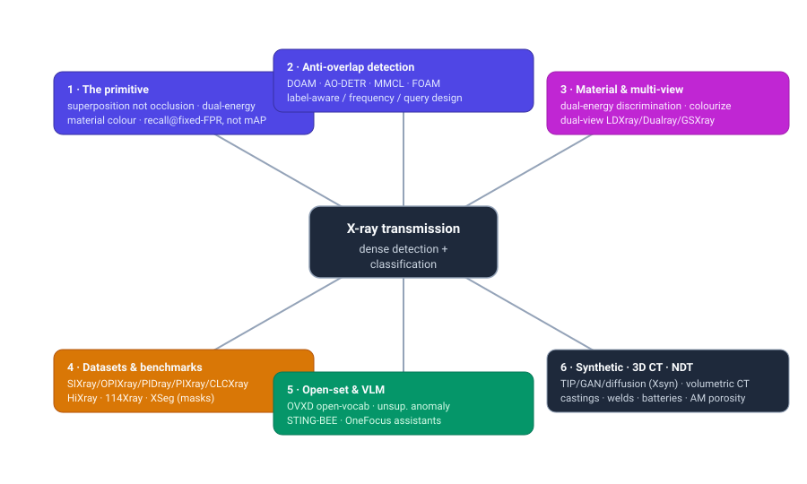
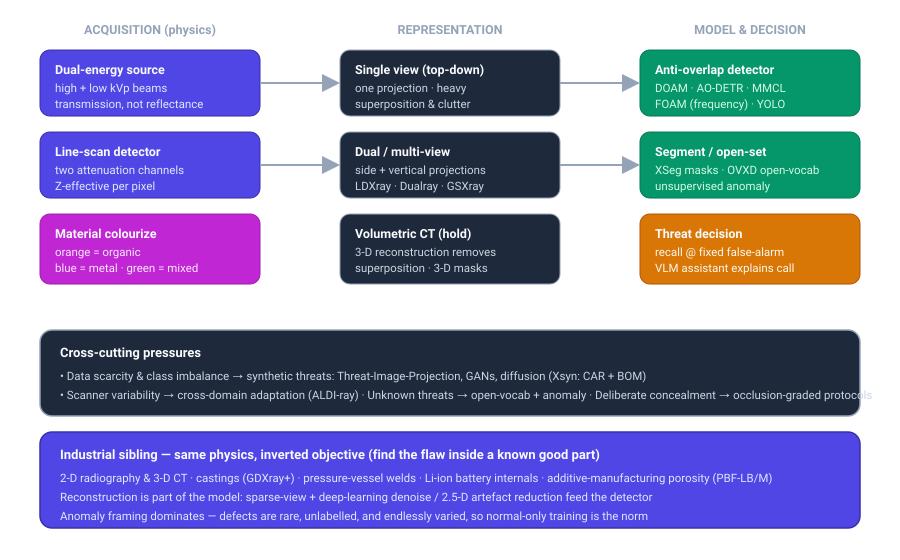
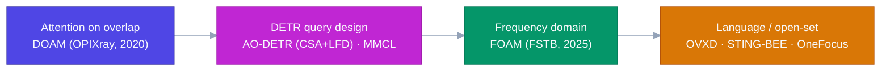

# Dense Object Detection & Classification — Recent Advances

*Compiled 2026-Jul-15 (America/Los_Angeles).*

Next installment in the running CV-updates log. Earlier entries on
`main`:
[Apr-30](../2026-Apr-30/2026-Apr-30_CV_updates.md),
[May-01](../2026-May-01/2026-May-01_CV_updates.md),
[May-02](../2026-May-02/2026-May-02_CV_updates.md),
[May-04](../2026-May-04/2026-May-04_CV_updates.md),
[May-05](../2026-May-05/2026-May-05_CV_updates.md),
[May-07](../2026-May-07/2026-May-07_CV_updates.md),
[May-08](../2026-May-08/2026-May-08_CV_updates.md),
[May-15](../2026-May-15/2026-May-15_CV_updates.md),
[May-16](../2026-May-16/2026-May-16_CV_updates.md),
[May-17](../2026-May-17/2026-May-17_CV_updates.md),
[Jun-09](../2026-Jun-09/2026-Jun-09_CV_updates.md),
[Jun-10](../2026-Jun-10/2026-Jun-10_CV_updates.md),
[Jun-12](../2026-Jun-12/2026-Jun-12_CV_updates.md),
[Jun-15](../2026-Jun-15/2026-Jun-15_CV_updates.md),
[Jun-16](../2026-Jun-16/2026-Jun-16_CV_updates.md),
[Jun-17](../2026-Jun-17/2026-Jun-17_CV_updates.md),
[Jun-19](../2026-Jun-19/2026-Jun-19_CV_updates.md),
[Jun-21](../2026-Jun-21/2026-Jun-21_CV_updates.md),
[Jun-22](../2026-Jun-22/2026-Jun-22_CV_updates.md),
[Jun-23](../2026-Jun-23/2026-Jun-23_CV_updates.md),
[Jun-24](../2026-Jun-24/2026-Jun-24_CV_updates.md),
[Jun-25](../2026-Jun-25/2026-Jun-25_CV_updates.md),
[Jun-27](../2026-Jun-27/2026-Jun-27_CV_updates.md),
[Jun-29](../2026-Jun-29/2026-Jun-29_CV_updates.md),
[Jun-30](../2026-Jun-30/2026-Jun-30_CV_updates.md),
[Jul-04](../2026-Jul-04/2026-Jul-04_CV_updates.md),
[Jul-07](../2026-Jul-07/2026-Jul-07_CV_updates.md),
[Jul-08](../2026-Jul-08/2026-Jul-08_CV_updates.md),
[Jul-10](../2026-Jul-10/2026-Jul-10_CV_updates.md).

## Why this pass: X-ray transmission imaging as its own primitive

The recent run of passes has worked **sensor / imaging primitives on their own
terms** — camera-3D / occupancy ([Jun-24](../2026-Jun-24/2026-Jun-24_CV_updates.md)),
remote-sensing spectra ([Jun-25](../2026-Jun-25/2026-Jun-25_CV_updates.md)), the
LiDAR point cloud ([Jun-27](../2026-Jun-27/2026-Jun-27_CV_updates.md)), the event
camera ([Jun-29](../2026-Jun-29/2026-Jun-29_CV_updates.md)), thermal infrared
([Jun-30](../2026-Jun-30/2026-Jun-30_CV_updates.md)), imaging radar
([Jul-04](../2026-Jul-04/2026-Jul-04_CV_updates.md)), medical imaging
([Jul-07](../2026-Jul-07/2026-Jul-07_CV_updates.md)), subsea imaging
([Jul-08](../2026-Jul-08/2026-Jul-08_CV_updates.md)) and astronomical surveys
([Jul-10](../2026-Jul-10/2026-Jul-10_CV_updates.md)). Every one of those forms an
image from **reflected or emitted** light (or from a range measurement). The
medical pass touched X-rays, but only chest **radiographs** as one clinical
modality among CT/MRI/pathology.

There is one great dense-vision domain the log has never taken whole: **X-ray
*transmission* imaging** — the "see-through" modality where the sensor measures how
much of a beam *survived* passing through an object. It is the imaging primitive
behind two enormous operational problems: **security screening** (airport carry-on
and checked baggage, cargo, parcels, subways) and **industrial non-destructive
testing / NDT** (castings, welds, batteries, additive-manufactured parts). Both
are dense-detection-and-classification problems at massive throughput, and the
physics makes them genuinely unlike anything covered so far.

The transmission image is a different primitive from every sensor covered so far:

- **Objects *superimpose*; they do not occlude.** In a reflectance image a nearer
  object hides a farther one — occlusion removes information cleanly. In
  transmission the beam passes through *everything* in its path, so overlapping
  objects **add their attenuations together**. A knife behind a laptop is not
  hidden; its signature is *summed into* the laptop's, producing a cluttered,
  semi-transparent palimpsest with no depth ordering. "Detection" here means
  *unmixing superimposed signatures*, which is why the field's signature research
  thread is **anti-overlapping** detection rather than de-occlusion.
- **The pixel encodes material, not colour — via dual energy.** A screening
  scanner fires **two beam energies** (high and low kVp). The ratio of the two
  attenuations estimates the **effective atomic number (Z-eff)**, which is
  rendered in the operator's familiar false-colour convention: **orange = organic
  / low-Z** (plastics, drugs, explosives, food), **blue = metallic / high-Z**
  (guns, knives), **green = mixed / inorganic**. Colour is a *physical
  measurement*, not appearance — the analogue of the astronomical "bands are flux,
  not RGB" point, and it means colourization and material discrimination are core
  tasks, not cosmetics.
- **The adversary is deliberate.** Unlike a tumour or a galaxy, a threat item has
  someone *actively trying to hide it* — wrapping in metal foil, aligning a blade
  edge-on to the beam, packing it inside dense clutter. Benchmarks now bake this
  in with **graded concealment protocols** (PIDray's "hidden" split, STCray's
  increasing-occlusion levels), a stressor no natural-image dataset has.
- **The target is a rare needle and the metric says so.** Real threats are a tiny
  fraction of the stream; industrial defects are rarer still. As in the medical
  ([Jul-07](../2026-Jul-07/2026-Jul-07_CV_updates.md)) and astronomical
  ([Jul-10](../2026-Jul-10/2026-Jul-10_CV_updates.md)) passes, the operating
  metric is **detection/recall at a fixed false-alarm rate** (probability of
  detection vs probability of false alarm), not COCO mAP — a missed threat and a
  false alarm carry wildly asymmetric costs, and throughput caps how many alarms a
  human can adjudicate.
- **Scanners are not interchangeable.** Different vendors, energies, resolutions
  and colour maps mean a detector trained on one machine degrades on the next —
  cross-scanner **domain shift** is a first-class problem, not an afterthought.

Below: the pipeline from beam to threat decision, the industrial sibling running
the same physics with an inverted objective, and the cross-cutting pressures
(data scarcity, scanner shift, unknown threats) that shape the model designs.

---

## 1 · The core task — unmixing *superimposed* signatures (anti-overlapping detection)

Because overlapping objects **add** rather than occlude, the dominant failure mode
of a generic detector on X-ray data is confusion between a target and the
background/foreground clutter summed on top of it. The research line that owns this
problem is **anti-overlapping** detection, and it has matured from attention
modules into DETR-query and frequency-domain designs.

- **DOAM / OPIXray** — the origin point. *Occluded Prohibited Items Detection*
  introduced the **OPIXray** benchmark (cutters, deliberately occluded) and a
  plug-in **De-Occlusion Attention Module (DOAM)** that sharpens edge/material cues
  under overlap
  ([ACM MM 2020](https://dl.acm.org/doi/10.1145/3394171.3413828)). It set the
  template: treat overlap as the object, and design attention to recover the
  boundary the summation blurred.
- **AO-DETR** — anti-overlapping brought into the DETR era, built on DINO. Two
  ideas: **Category-Specific Assignment (CSA)** constrains each object query to a
  fixed prohibited-item class so it learns to pull that item's features out of a
  summed foreground-background mixture, and **Look Forward Densely (LFD)** improves
  reference-box localization at the blurry edges overlap produces. It surpasses
  general SOTA detectors on **PIXray** and **OPIXray** and appeared in *IEEE
  TNNLS* (2025) ([arXiv 2403.04309](https://arxiv.org/abs/2403.04309),
  [PubMed](https://pubmed.ncbi.nlm.nih.gov/39504297/)).
- **MMCL** — *Multi-class Min-margin Contrastive Learning* corrects the **content
  query distribution** in deformable-DETR detectors so queries for different
  prohibited classes stay separated under overlap. It is a drop-in (a few dozen
  lines) for any deformable-DETR model and lifts several SOTA detectors on PIXray /
  OPIXray without added complexity
  ([arXiv 2406.03176](https://arxiv.org/html/2406.03176)).
- **FOAM** — *Frequency-Optimized Anti-overlapping* (2025) reframes the problem in
  the **frequency domain**: the contour/texture degradation caused by summation
  shows up cleanly in the magnitude spectrum, so a **Frequency-Spatial Transformer
  Block** extracts foreground texture from both domains at once. Positioned as a
  general overlapping-object framework that beats prior anti-overlap methods
  including MMCL ([arXiv 2506.13501](https://arxiv.org/abs/2506.13501)).
- **Label-aware / physical-prior detectors** — **CLCXray** (cutters & liquid
  containers) shipped a label-aware mechanism specifically for the overlap
  problem, and a line of work adds **physical size constraints** and geometry
  priors (GADet) to reject implausible detections in cluttered baggage
  ([Illicit-object survey, arXiv 2507.17508](https://arxiv.org/pdf/2507.17508)).

The through-line: X-ray detection is less about *recognizing a shape* (there often
isn't a clean one) and more about *disentangling additive signatures* — a task the
natural-image detector zoo was never designed for.

---

## 2 · Datasets & benchmarks — the field's real engine

X-ray screening progress is dataset-bound: real threats are scarce, sensitive, and
scanner-specific. The public benchmark set has grown from tens of thousands of
images to the million scale, and — crucially in 2026 — from boxes to **masks** and
**captions**.

| Dataset | Scale | Task / labels | What it stresses |
|---|---|---|---|
| **SIXray** | >1.05M images (6 classes) | detection; huge negative pool | class **imbalance** (few positives in a real stream) |
| **OPIXray** | 8,885 images, cutters | detection | deliberate **occlusion** |
| **HiXray** | ~45k images, 8 classes | detection | high-resolution real airport carry-on |
| **PIDray** | 47,677 images, 12 classes | box **+ segmentation masks** | **deliberately hidden** items (easy/hard/hidden splits) |
| **PIXray** | 12 classes, dense overlap | detection/segmentation | severe **overlap** |
| **CLCXray** | cutters & liquid containers | detection (label-aware) | overlap of thin/liquid items |
| **114Xray** | **1,140,000 images**, 12 classes | detection | real express-delivery & subway scale ([Springer 2025](https://link.springer.com/chapter/10.1007/978-981-97-8795-1_17)) |
| **EDS / X-ray FSOD / Compass-XP** | varied | domain-shift / few-shot / classification | **cross-scanner** & long-tail |
| **STCray** | 46,642 image–caption pairs, 21 threats | **multimodal** (captions, VQA, grounding) | language-grounded, occlusion-graded ([HF](https://huggingface.co/datasets/Naoufel555/STCray-Dataset)) |
| **LDXray / Dualray / GSXray** | up to **353,646** dual-view instances | **dual-view** detection | cross-view geometric reasoning |
| **XSeg** | **98,644 images, 295,932 masks, 30 classes** | instance **segmentation** | pixel-level supervision at scale ([CVPR 2026](https://arxiv.org/abs/2604.03706)) |

Two 2025–26 shifts stand out.

- **From boxes to masks.** **XSeg** (CVPR 2026) is the largest X-ray contraband
  *segmentation* set to date — 98,644 images, 295,932 instance masks, 30
  categories — built with **Adaptive Point SAM (APSAM)**, a SAM-based annotator
  refined by security experts, precisely because box labels cap generalization and
  real pixel supervision was missing
  ([paper](https://arxiv.org/html/2604.03706v1)). This mirrors the annotation-cost
  collapse seen in the remote-sensing pass — SAM doing the labelling so humans only
  verify.
- **From single- to million-scale real data.** **114Xray** (1.14M images) pairs
  its scale with an **Aware Enhance Network (AENet)** tuned to X-ray's complex
  colour distribution and item morphology
  ([Springer](https://link.springer.com/chapter/10.1007/978-981-97-8795-1_17)).
  A parallel effort delivered a **balanced dataset + enhanced YOLO** for contraband
  ([Nature *Scientific Data* 2025](https://www.nature.com/articles/s41597-025-06322-9)).

A useful sobriety check: *Seeing Through the Data* statistically evaluated these
benchmarks and warned that headline numbers are inflated by dataset artefacts and
imbalance — cross-dataset evaluation, not single-set mAP, is the honest bar
([IEEE](https://ieeexplore.ieee.org/document/10208397/)).

---

## 3 · Material discrimination & dual-energy — the colour *is* the signal

The false-colour X-ray image is a **material map**, and recovering material
robustly is a task in its own right.

- **Dual-energy processing.** Comparing high- vs low-energy attenuation yields the
  organic/inorganic/metal separation that drives the operator colour map;
  a body of work processes the **raw dual-energy detector data** for material
  classification and pseudo-colour rendering into 3-material classes
  ([ScienceDirect](https://www.sciencedirect.com/science/article/abs/pii/S0969806X21001626)),
  and modular RBF networks push material discrimination directly from dual-energy
  radiography
  ([ScienceDirect](https://www.sciencedirect.com/science/article/abs/pii/S030645492300138X)).
- **Single-energy colourization.** Where only one energy is available, CNNs learn
  to **colourize** for material discrimination, transferring the dual-energy look
  to cheaper single-energy hardware
  ([MDPI *Electronics*](https://www.mdpi.com/2079-9292/11/24/4101)).
- **Cross-modal energy synthesis.** Because the two energy channels are expensive
  to capture and store, work at CVPRW synthesized one dual-energy channel from the
  other, treating the high/low pair as a **cross-modal translation** problem
  ([CVPRW 2022](https://openaccess.thecvf.com/content/CVPR2022W/PBVS/papers/Isaac-Medina_Cross-Modal_Image_Synthesis_Within_Dual-Energy_X-Ray_Security_Imagery_CVPRW_2022_paper.pdf)).
- **Multi-contrast / spectral discrimination.** Beyond two energies, multi-contrast
  X-ray identification of inhomogeneous materials via deep learning points toward
  the photon-counting / spectral future, where per-pixel spectra (not just two
  bins) constrain material identity
  ([arXiv 2309.11943](https://arxiv.org/pdf/2309.11943)).

This is the direct analogue of the remote-sensing "spectra are the label" and
thermal "temperature not texture" threads: the discriminative signal lives in a
physical measurement channel, and models that respect it beat models that treat the
image as RGB.

---

## 4 · Dual-view & multi-view — how human screeners actually work

A single top-down projection is the worst case for superposition: a threat aligned
with the beam or buried in clutter can vanish. Human operators rotate the bag or use
**two views** (vertical + horizontal). 2025–26 work makes AI do the same.

- ***Can AI detect from dual-view like humans?*** (CVPR 2025) introduces
  **LDXray**, a large-scale dual-view set (**353,646 instances, 12 categories**),
  and shows multi-view pooling aggregating features across viewpoints beats any
  single perspective
  ([CVPR 2025](https://openaccess.thecvf.com/content/CVPR2025/papers/Tao_Dual-view_X-ray_Detection_Can_AI_Detect_Prohibited_Items_from_Dual-view_CVPR_2025_paper.pdf),
  [HTML](https://arxiv.org/html/2411.18082)).
- **Dualray** — a real dual-view benchmark (4,371 image pairs, 6 classes, horizontal
  + vertical) with a **fusion detection framework**
  ([RG](https://www.researchgate.net/publication/364797852_Dualray_Dual-View_X-ray_Security_Inspection_Benchmark_and_Fusion_Detection_Framework)).
- **Light2Ray** — a *lightweight* dual-view transformer detector, targeting the
  latency budget of a real screening lane
  ([SciOpen 2025](https://www.sciopen.com/article/10.26599/AIR.2025.9150053)).
- **GSXray** and *Can a Second-View Image Be a Language?* — push **cross-view
  geometric + semantic reasoning**, treating the second view as a complementary
  "modality" to fuse rather than a second image to average
  ([arXiv 2511.18385](https://arxiv.org/pdf/2511.18385)).
- **DINO-based dual-view detection** demonstrates the DETR family adapts cleanly to
  the paired-view setting
  ([ACM](https://dl.acm.org/doi/10.1145/3709026.3709065)).

Multi-view is the 2-D projection's partial escape from superposition — and the
conceptual bridge to full 3-D CT (§7), which removes it entirely.

---

## 5 · Open-set, unknown threats & anomaly detection

Closed-set detectors trained on ~12 categories are structurally blind to the
**next** threat. Two escapes: open-vocabulary detection, and unsupervised anomaly
detection that flags *anything abnormal* without naming it.

- **OVXD — open-vocabulary via CLIP.** Directly applying CLIP to X-ray collapses
  from domain shift, so OVXD inserts a lightweight **X-ray feature adapter**
  (three bottleneck submodules) into a distillation-based OVOD framework to align
  X-ray images with text and detect **novel** categories beyond the trained base
  set — **+15.2 AP₅₀** over the prior best on PIXray (and +1.5 on PIDray)
  ([arXiv 2406.10961](https://arxiv.org/abs/2406.10961)).
- **Unsupervised anomaly detection.** Reconstruction-based methods train **only on
  benign** stream-of-commerce imagery; an anomaly reconstructs poorly, so high
  reconstruction error flags a threat with **no threat labels at all**. This
  extends to **unsupervised anomaly *instance segmentation*** for baggage
  ([arXiv 2107.07333](https://arxiv.org/pdf/2107.07333)) and object-wise anomaly
  detection in cluttered imagery
  ([arXiv 1904.05304](https://arxiv.org/pdf/1904.05304)). The framing matters most
  for **cargo**, where the object space is unbounded — a *self-supervised anomaly
  benchmark for X-ray cargo* formalizes it
  ([RG](https://www.researchgate.net/publication/385287327_Self-Supervised_Anomaly_Detection_and_a_New_Benchmark_for_X-Ray_Cargo_Images)).
- **Point / weak supervision.** To scale categories cheaply, **I²OL-Net**
  (intra-inter objectness) detects prohibited items from **point** annotations
  rather than boxes ([arXiv 2412.03811](https://arxiv.org/pdf/2412.03811)) — the
  same label-cost pressure the whole field is under.

Open-vocabulary + anomaly is X-ray's version of the open-world detection thread
seen across the log, but with a sharper operational edge: the cost of missing an
*unseen* threat is exactly why closed-set accuracy is not enough.

---

## 6 · Vision-language models — the screener's assistant

The largest 2025–26 shift is from *detector* to **domain-aware VLM assistant** that
localizes, explains, and answers questions about a scan — moving X-ray toward the
grounded-MLLM detectors seen in the agent-facing pass
([Jun-23](../2026-Jun-23/2026-Jun-23_CV_updates.md)).

- **STING-BEE (CVPR 2025)** — billed as the first domain-aware **visual AI
  assistant** for X-ray baggage screening. It is trained on **STCray**, the first
  multimodal X-ray set (**46,642 image–caption pairs, 21 threat categories**,
  scanner-captured) whose captions encode threat position, orientation, occluding
  objects and **degree of occlusion** via a graded concealment protocol. STING-BEE
  unifies **scene comprehension, referring threat localization, visual grounding
  and VQA**, and reports SOTA **cross-domain** generalization — the property that
  matters when scanners differ
  ([CVPR 2025](https://openaccess.thecvf.com/content/CVPR2025/html/Velayudhan_STING-BEE_Towards_Vision-Language_Model_for_Real-World_X-ray_Baggage_Security_Inspection_CVPR_2025_paper.html),
  [code](https://github.com/Divs1159/STING-BEE)).
- **OneFocus (2026)** — a **unified** VLM aimed at real-world screening, folding
  detection/grounding/description into one model to cut the bespoke-per-task
  engineering that has characterized the field
  ([arXiv 2606.15663](https://arxiv.org/pdf/2606.15663)).

The appeal is operational: a screener needs *why this is a threat and where*, not
just a box. The bottleneck STING-BEE identifies — the **absence of rich textual
descriptions** in legacy X-ray datasets — is exactly what STCray and XSeg are built
to fix, so the VLM turn and the mask/caption dataset turn are the same movement.

---

## 7 · Synthetic data — because real threats are scarce

Every thread above is throttled by data: threats are rare, sensitive, and imbalanced.
Synthesis is not optional here — it is core infrastructure, and it has moved from
compositing to generative models.

- **Threat Image Projection (TIP)** — the operational baseline: superimpose an
  isolated threat's X-ray signature onto a benign bag via multi-stage morphological
  compositing. Long used to train **human** screeners, it doubles as data
  augmentation
  ([survey figure](https://www.researchgate.net/figure/Threat-image-projection-TIP-pipeline-for-synthetically-composited-image-generation_fig5_334770617)).
  Because superposition is *additive*, TIP is more physically faithful for X-ray
  than cut-and-paste is for natural images.
- **GAN synthesis.** Direct generation of prohibited items — KNN-matting +
  improved CT-GAN, and semantic-label-library GANs for multi-item scenes —
  cut **false positives by up to 19.9%** while holding ~94% true-positive rate
  ([MDPI *Applied Sciences*](https://doi.org/10.3390/app14103961)).
- **Diffusion — Xsyn (2025).** A one-stage text-to-image pipeline with two X-ray-
  specific tricks: **Cross-Attention Refinement (CAR)** uses the diffusion
  cross-attention map to *refine the bounding-box annotation* of the generated
  item (solving the "synthetic image but where's the label?" problem), and
  **Background Occlusion Modeling (BOM)** injects realistic superposition in latent
  space so synthetic scenes carry X-ray's signature clutter
  ([arXiv 2511.15299](https://arxiv.org/abs/2511.15299)).

The label-refinement idea (CAR) is the important one: generative synthesis is only
useful for detection if it produces *supervised* data, and letting the generator's
own attention emit the box closes that loop.

---

## 8 · 3-D CT security — removing superposition entirely

Airports are deploying **computed-tomography** scanners at the checkpoint (the
reason liquids/laptops can increasingly stay in the bag). CT reconstructs a **3-D
volume**, which *removes* the superposition that defines the 2-D problem — at the
cost of a volumetric, noisy, artefact-laden signal to segment.

- **Volumetric detection & segmentation.** Multi-class **3-D object detection** and
  **contraband-material detection** operate directly in the reconstructed volume
  ([3-D detection, arXiv 2008.01218](https://arxiv.org/pdf/2008.01218);
  [contraband materials, arXiv 2012.11753](https://arxiv.org/pdf/2012.11753);
  [electric-device detection, arXiv 2005.02163](https://arxiv.org/pdf/2005.02163)).
- **Adaptive automatic threat recognition** combines multi-scale 3-D segmentation,
  material classification and adaptability across scanners, reaching **~90%
  probability of detection at <20% false-alarm** — the operating-point framing, not
  mAP ([arXiv 1903.10604](https://arxiv.org/pdf/1903.10604)).
- **Semi-supervised segmentation** — contour-driven broad-learning systems segment
  concealed items with limited labels, reporting mIoU on GDXray / SIXray /
  Compass-XP ([PMC](https://www.ncbi.nlm.nih.gov/pmc/articles/PMC11666859/)).

CT is the modality's answer to its own defining difficulty — but it inherits a
*reconstruction* stage that, as the industrial side shows next, is increasingly a
learned part of the pipeline.

---

## 9 · The industrial sibling — same physics, inverted objective (NDT & CT)

Industrial X-ray runs the identical primitive with the goal flipped: instead of a
rare threat hidden by an adversary, find a rare **defect** inside a **known-good
part** — a pore, crack, void, inclusion, or misalignment. It is a dense-detection
problem dominated by **anomaly** framing (defects are rare, unlabelled, endlessly
varied) and by the fact that **reconstruction is part of the model**.

- **Castings & welds.** CNN/segmentation on cast-aluminium CT and X-ray of welds is
  mature; on **GDXray+** recent detectors hit **F1 ≈ 96.35%**, and pressure-vessel
  weld segmentation reaches **~84.75%** with augmentation to fight defect scarcity
  ([weld defects, PMC](https://www.ncbi.nlm.nih.gov/pmc/articles/PMC10943115/);
  [industrial+security CV survey, arXiv 2211.05565](https://arxiv.org/pdf/2211.05565)).
- **Reconstruction as a learned stage.** In-line CT can't afford full-view scans,
  so **sparse-view reconstruction + deep-learning image enhancement** and
  **2.5-D artefact-reduction priors** (plug-and-play) denoise the volume *before*
  detection — the reconstruction and the detector co-designed
  ([sparse-view real-time CT, arXiv 2206.08696](https://arxiv.org/pdf/2206.08696);
  [2.5-D PnP artefact reduction, arXiv 2506.14719](https://arxiv.org/pdf/2506.14719)).
  A 2024 review surveys ML across industrial CT end-to-end
  ([RG](https://researchgate.net/publication/381870761_Machine_learning_in_industrial_X-ray_computed_tomography_-_a_review)).
- **Batteries.** X-ray/CT inspection finds electrode misalignment, foreign
  particles, voids and **dendrites** in Li-ion cells; a 2025 CT study of 1,054
  cylindrical cells found **0% overhang failure in OEM cells vs 8–15% in low-cost /
  counterfeit** — a striking quality-control signal — while the open problem
  remains matching CT/ultrasound inspection time to **production-line cycle time**
  ([X-RAY LAB](https://xray-lab.com/en/ct-latent-defects-lithium-ion-battery-cells/)).
- **Additive manufacturing.** Porosity segmentation in CT of PBF-LB/M metal parts,
  plus transfer-learning defect frameworks (**TransMatch**) and pore-location
  estimation, bring dense detection to 3-D-printed components
  ([TransMatch, arXiv 2509.01754](https://arxiv.org/pdf/2509.01754);
  [pore segmentation, arXiv 2408.02507](https://arxiv.org/pdf/2408.02507)).

The security and industrial branches are converging on the same toolkit —
anomaly/normal-only training, SAM-style segmentation, learned reconstruction — from
opposite ends of the same physics.

---

## 10 · Cross-scanner generalization & deployment

Two constraints decide whether any of the above reaches a real lane.

- **Domain shift across scanners.** Vendors differ in energy, geometry, resolution
  and colour map, so a model trained on one machine degrades on the next.
  **ALDI-ray** adapts the ALDI domain-adaptation framework to security X-ray
  ([arXiv 2512.02696](https://arxiv.org/pdf/2512.02696)); other work reports
  encouraging cross-scanner transfer (**mAP ≈ 0.87**, firearm **AP ≈ 0.94**),
  showing generalization is achievable but must be measured explicitly. Note the
  OVOD line above also transfers across X-ray datasets without fine-tuning.
- **Real-time on the lane.** Screening is throughput-bound, so a parallel thread
  optimizes **real-time CNN detectors** for deployment
  ([Radiation Physics & Chemistry 2025](https://www.sciencedirect.com/science/article/abs/pii/S0969806X25001732)),
  and lightweight designs like **Light2Ray** and **CE-FPN-YOLO** (concealed small
  objects) trade a little accuracy for latency
  ([CE-FPN-YOLO, MDPI *Mathematics*](https://doi.org/10.3390/math13244012)).

---

## What to watch

- **VLM assistants become the interface.** After STING-BEE and OneFocus, expect the
  screening deliverable to be a *grounded explanation* (box + material + reason +
  answer to the operator's question), not a bare detection — and the STCray/XSeg
  caption+mask datasets are what make it trainable.
- **Masks and points displace boxes.** XSeg (SAM-annotated masks at scale) and
  point-supervised detectors (I²OL-Net) point to pixel-level supervision obtained
  *cheaply*, the same annotation-cost collapse seen in remote sensing.
- **Generative data with self-labels.** Diffusion synthesis is only useful if it
  emits supervision; Xsyn's CAR (attention→box) is the pattern to watch, and the
  honest test is **cross-dataset** gain, not in-distribution mAP.
- **Open-set is the safety-critical frontier.** Closed 12-class detectors cannot
  see the next threat; open-vocabulary (OVXD) and unsupervised anomaly (esp. for
  unbounded **cargo**) are where the operational risk actually lives.
- **CT closes the loop with industrial CT.** Checkpoint CT removes superposition but
  adds a reconstruction stage; the industrial side's learned sparse-view /
  artefact-reduction reconstruction is the shared technology both branches will
  standardize on.
- **Benchmarks need honesty.** *Seeing Through the Data* is a warning: single-set
  headline numbers are inflated by artefacts and imbalance. Cross-scanner,
  cross-dataset, operating-point (recall@FPR) evaluation is the real bar.

---

### How this connects to earlier passes

X-ray transmission is the **"see-through, additive" primitive** — the mirror image
of the reflectance/emission sensors covered so far. Its **material-via-dual-energy**
signal echoes the spectral/thermal threads
([Jun-25](../2026-Jun-25/2026-Jun-25_CV_updates.md),
[Jun-30](../2026-Jun-30/2026-Jun-30_CV_updates.md)); its **rare-target,
recall@fixed-FPR** metric matches the medical and astronomical passes
([Jul-07](../2026-Jul-07/2026-Jul-07_CV_updates.md),
[Jul-10](../2026-Jul-10/2026-Jul-10_CV_updates.md)); its **3-D CT** branch parallels
the volumetric/point-cloud work
([Jun-24](../2026-Jun-24/2026-Jun-24_CV_updates.md),
[Jun-27](../2026-Jun-27/2026-Jun-27_CV_updates.md)); and its **VLM-assistant** turn
is the agent-facing grounded-MLLM thread
([Jun-23](../2026-Jun-23/2026-Jun-23_CV_updates.md)) applied to a safety-critical
domain. The one thing with no analogue elsewhere is the **adversary** — an item
actively hidden — which is why *anti-overlapping* detection and *graded concealment*
benchmarks are this modality's signature contributions.

---

*Compiled with automated web research on 2026-Jul-15 (Los Angeles time). Some
primary sources (notably arXiv) were unreachable through this environment's network
policy; entries drawn from those were sourced via search abstracts, publisher
pages, and mirrors, and links are provided for verification. Figures are original
SVG/Mermaid, styled for light and dark backgrounds. Corrections welcome in the next
pass.*
