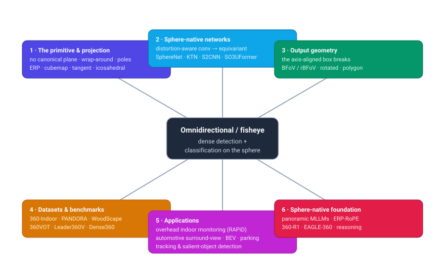
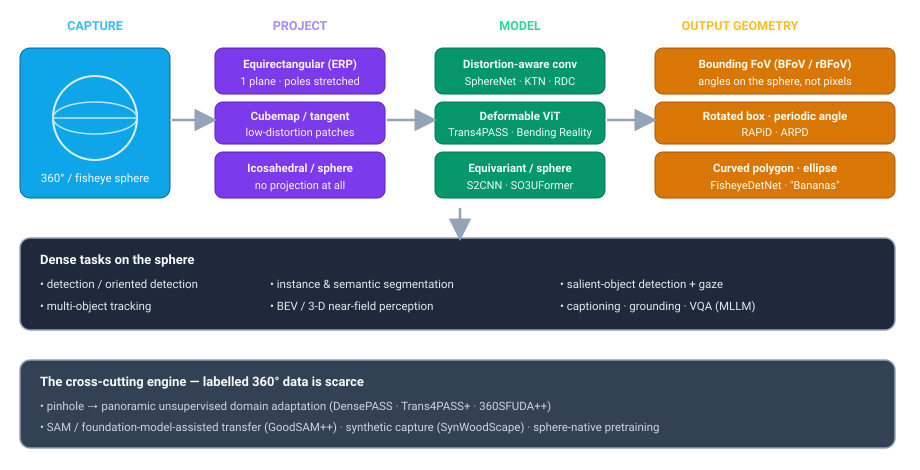

# Dense Object Detection & Classification — Recent Advances

*Compiled 2026-Jul-16 (America/Los_Angeles).*

Next installment in the running CV-updates log. Earlier entries on
`main`:
[Apr-30](../2026-Apr-30/2026-Apr-30_CV_updates.md),
[May-01](../2026-May-01/2026-May-01_CV_updates.md),
[May-02](../2026-May-02/2026-May-02_CV_updates.md),
[May-04](../2026-May-04/2026-May-04_CV_updates.md),
[May-05](../2026-May-05/2026-May-05_CV_updates.md),
[May-07](../2026-May-07/2026-May-07_CV_updates.md),
[May-08](../2026-May-08/2026-May-08_CV_updates.md),
[May-15](../2026-May-15/2026-May-15_CV_updates.md),
[May-16](../2026-May-16/2026-May-16_CV_updates.md),
[May-17](../2026-May-17/2026-May-17_CV_updates.md),
[Jun-09](../2026-Jun-09/2026-Jun-09_CV_updates.md),
[Jun-10](../2026-Jun-10/2026-Jun-10_CV_updates.md),
[Jun-12](../2026-Jun-12/2026-Jun-12_CV_updates.md),
[Jun-15](../2026-Jun-15/2026-Jun-15_CV_updates.md),
[Jun-16](../2026-Jun-16/2026-Jun-16_CV_updates.md),
[Jun-17](../2026-Jun-17/2026-Jun-17_CV_updates.md),
[Jun-19](../2026-Jun-19/2026-Jun-19_CV_updates.md),
[Jun-21](../2026-Jun-21/2026-Jun-21_CV_updates.md),
[Jun-22](../2026-Jun-22/2026-Jun-22_CV_updates.md),
[Jun-23](../2026-Jun-23/2026-Jun-23_CV_updates.md),
[Jun-24](../2026-Jun-24/2026-Jun-24_CV_updates.md),
[Jun-25](../2026-Jun-25/2026-Jun-25_CV_updates.md),
[Jun-27](../2026-Jun-27/2026-Jun-27_CV_updates.md),
[Jun-29](../2026-Jun-29/2026-Jun-29_CV_updates.md),
[Jun-30](../2026-Jun-30/2026-Jun-30_CV_updates.md),
[Jul-04](../2026-Jul-04/2026-Jul-04_CV_updates.md),
[Jul-07](../2026-Jul-07/2026-Jul-07_CV_updates.md),
[Jul-08](../2026-Jul-08/2026-Jul-08_CV_updates.md),
[Jul-10](../2026-Jul-10/2026-Jul-10_CV_updates.md),
[Jul-15](../2026-Jul-15/2026-Jul-15_CV_updates.md).

## Why this pass: omnidirectional / fisheye imaging as its own primitive

The recent run of passes has worked **sensor / imaging primitives on their own
terms** — camera-3D / occupancy ([Jun-24](../2026-Jun-24/2026-Jun-24_CV_updates.md)),
remote-sensing spectra ([Jun-25](../2026-Jun-25/2026-Jun-25_CV_updates.md)), the
LiDAR point cloud ([Jun-27](../2026-Jun-27/2026-Jun-27_CV_updates.md)), the event
camera ([Jun-29](../2026-Jun-29/2026-Jun-29_CV_updates.md)), thermal infrared
([Jun-30](../2026-Jun-30/2026-Jun-30_CV_updates.md)), imaging radar
([Jul-04](../2026-Jul-04/2026-Jul-04_CV_updates.md)), medical imaging
([Jul-07](../2026-Jul-07/2026-Jul-07_CV_updates.md)), subsea imaging
([Jul-08](../2026-Jul-08/2026-Jul-08_CV_updates.md)), astronomical surveys
([Jul-10](../2026-Jul-10/2026-Jul-10_CV_updates.md)) and X-ray transmission
([Jul-15](../2026-Jul-15/2026-Jul-15_CV_updates.md)). Each one changed the *signal*.
This pass changes the **geometry** instead: the sensor still measures ordinary
reflected light, but it images the **whole sphere** around a point.

That is the **omnidirectional / fisheye primitive** — ultra-wide (≥180°) fisheye
lenses and full 360° panoramic rigs, imaging the sphere rather than a rectangular
window of it. It underpins automotive surround-view (parking, near-field sensing),
indoor monitoring from ceiling cameras, robot and drone perception, VR/AR, and
street-level mapping. Every one of those is a dense detection-and-classification
problem, and the sphere makes them genuinely unlike the perspective camera every
detector in the zoo was built for.

The omnidirectional image is a different primitive from the pinhole camera in ways
that break the standard detector, not merely stress it:

- **There is no canonical image plane.** A perspective camera projects the world
  onto one flat rectangle; a detector's convolutions and axis-aligned boxes are
  defined *on that rectangle*. The sphere has no distinguished plane. Every way of
  flattening it — equirectangular, cubemap, tangent patches, icosahedral mesh —
  trades one distortion for another, so in this modality **the choice of
  representation is a first-class modelling decision**, not a preprocessing detail
  ([survey, arXiv 2205.10468](https://arxiv.org/pdf/2205.10468)).
- **Distortion is position-dependent and severe.** In the dominant equirectangular
  projection (ERP) an object's shape depends on its **latitude**: content near the
  poles is stretched horizontally without bound, so the same object looks different
  depending on where it sits. A translation-invariant CNN kernel — the core
  assumption of every planar detector — is *wrong* here, because the "same" filter
  covers a different solid angle at every row ([distortion-aware CNNs, RG](https://www.researchgate.net/publication/326202274_Distortion-aware_CNNs_for_Spherical_Images)).
- **Objects wrap around and cross the seam.** The left and right edges of an ERP
  image are the *same meridian*; an object straddling the 180° seam is split into two
  half-detections. The image is topologically a cylinder (a sphere, really), not a
  rectangle, so padding, anchors and NMS all need to be made **circular**.
- **The axis-aligned box is the wrong output.** A person directly below a ceiling
  fisheye appears radially oriented; a car in the periphery of a surround-view lens
  bends into a banana. A horizontal box either clips the object or swallows huge
  background. The field's signature output is therefore **not** the COCO box but the
  **Bounding Field-of-View (BFoV / rotated-BFoV)** — a box defined by *angles on the
  sphere* — or a rotated box, ellipse, or curved polygon
  ([PANDORA, ECCV 2022](https://www.ecva.net/papers/eccv_2022/papers_ECCV/papers/136680229.pdf)).
- **Labelled 360° data is scarce, and pinhole labels do not transfer for free.**
  There is no ImageNet-scale panoramic corpus. The field runs on **domain
  adaptation** from label-rich pinhole data into the label-poor panoramic domain —
  a structural dependency, not a convenience ([DensePASS, arXiv 2108.06383](https://arxiv.org/pdf/2108.06383)).

The 2024–26 arc, captured well by a June-2026 survey whose very title names it —
*from Distortion-Aware Engineering to Sphere-Native Foundation Modeling*
([arXiv 2606.27745](https://arxiv.org/pdf/2606.27745)) — is a move **off the flat
plane**: from patching planar CNNs to tolerate distortion, toward models and
foundation-scale representations that live on the sphere natively. A parallel survey
frames the same shift as crossing the **perspective-to-panoramic gap**
([*One Flight Over the Gap*, arXiv 2509.04444](https://arxiv.org/pdf/2509.04444)).

---

## 1 · The core decision — projection *is* the model

Because the sphere has no canonical plane, everything downstream inherits whichever
flattening you pick. The four dominant choices trade distortion against
compute and global context:

- **Equirectangular (ERP).** One image, full 360°×180° in a single rectangle,
  cheap and seam-continuous horizontally — but latitude-dependent stretching makes
  the poles nearly unusable and shape non-stationary. Still the default carrier
  format for panoramic detection and segmentation.
- **Cubemap.** Re-project onto the six faces of a cube; each face is a near-pinhole
  perspective image a standard detector handles well. The cost is **six inferences,
  broken objects at cube edges, and loss of the global ERP context** — a recurring
  complaint in recent work ([EDM, arXiv 2502.20685](https://arxiv.org/html/2502.20685v1)).
- **Tangent projection.** Sample many small perspective patches on tangent planes
  of the sphere, each locally almost distortion-free. Recent dual-branch designs
  **fuse ERP (global) with tangent patches (local, low-distortion)** to get both —
  the pattern the omnidirectional-vision surveys highlight as current best practice
  ([representation survey, arXiv 2502.10444](https://arxiv.org/html/2502.10444v1)).
- **Icosahedral / native sphere.** Skip projection entirely: tessellate the sphere
  with a near-uniform icosahedral mesh and convolve on it, or operate in the
  spherical harmonic / SO(3) domain. Most faithful, most expensive, and the
  intellectual root of the sphere-native turn ([icosahedron segmentation, arXiv 1907.12849](https://arxiv.org/pdf/1907.12849)).

The through-line: unlike a pinhole detector, an omnidirectional model cannot ignore
its input geometry — the distortion is *in the pixels*, and the representation
choice sets the ceiling on everything after it.

---

## 2 · Sphere-native networks — from distortion-aware convolution to equivariance

The oldest and still most active thread makes the *network* respect the sphere
rather than pretending its ERP input is a flat photo. It runs from adapting the
convolution to fully equivariant sphere-native transformers.

- **SphereNet** — the origin point. It encodes invariance to distortion directly
  into the CNN by **adapting the sampling locations of the convolution kernel**:
  kernels are defined on the tangent plane and their sampling points wrapped back
  onto the sphere, so a filter covers a constant *solid angle* everywhere. It framed
  detection **and** classification on omnidirectional images as one problem
  ([ECCV 2018](https://scite.ai/reports/10.1007/978-3-030-01240-3_32)).
- **Kernel Transformer Networks (KTN)** — instead of retraining, *transform* a
  pretrained perspective kernel into a position-dependent kernel for each ERP row,
  giving a compact spherical convolution that transfers existing detectors onto the
  sphere ([CVPR 2019](https://openaccess.thecvf.com/content_CVPR_2019/papers/Su_Kernel_Transformer_Networks_for_Compact_Spherical_Convolution_CVPR_2019_paper.pdf)).
- **Distortion-aware / restricted-deformable convolution.** Su & Grauman enlarge
  kernels toward the poles to match the stretch; **Restricted Deformable Convolution
  (RDC)** lets the sampling grid deform to the local geometry. These "patch the
  planar CNN" methods are the workhorses still embedded in most deployed systems
  ([survey, arXiv 2205.10468](https://arxiv.org/pdf/2205.10468)).
- **Grid-based spherical CNN for detection.** A spherical-grid CNN built explicitly
  for **object detection from panoramic images**, an early demonstration that
  sphere-aware feature extraction beats ERP-on-a-planar-CNN
  ([Sensors 2019, MDPI](https://www.mdpi.com/1424-8220/19/11/2622)).
- **Equivariant / sphere-native models.** S2CNN and gauge-equivariant networks
  (2018–19) convolve in the SO(3) rotation group so features are **rotation-
  equivariant on the sphere**; PDO-eS²CNNs build equivariant spherical CNNs from
  partial differential operators ([arXiv 2104.03584](https://arxiv.org/pdf/2104.03584)).
  The 2026 continuation is **SO3UFormer**, which learns *intrinsic* spherical
  features for **rotation-robust panoramic segmentation**, carrying the equivariance
  idea into the transformer era ([arXiv 2602.22867](https://arxiv.org/pdf/2602.22867)).
- **Deformable vision transformers.** On the segmentation side, **Trans4PASS**
  introduces **Deformable Patch Embedding (DPE)** and a **Deformable MLP** so the
  transformer's tokens bend to ERP distortion — the transformer analogue of the
  deformable-convolution idea ([Bending Reality, arXiv 2203.01452](https://arxiv.org/pdf/2203.01452);
  TPAMI 2024 [arXiv 2207.11860](https://arxiv.org/pdf/2207.11860)).

---

## 3 · The box breaks — output geometry on the sphere

A perspective detector emits an axis-aligned box because objects in a pinhole image
are (roughly) upright and rectangular. Neither holds on the sphere, so a distinctive
research line reinvents the *output representation* itself.

- **Bounding Field-of-View (BFoV / rBFoV).** Rather than pixel coordinates, describe
  an object by the **angular window it subtends on the sphere** — center
  (longitude, latitude), horizontal/vertical FoV, and (for rBFoV) an in-plane
  rotation. This is distortion-invariant by construction. **PANDORA** established
  the rotated-BFoV benchmark for panoramic detection with orientation
  ([ECCV 2022](https://www.ecva.net/papers/eccv_2022/papers_ECCV/papers/136680229.pdf)),
  and **360-Indoor** annotates real indoor 360° scenes with BFoV boxes
  ([arXiv 1910.01712](https://arxiv.org/abs/1910.01712)).
- **Rotated boxes + periodic angle loss.** For overhead fisheye, **RAPiD** regresses
  an arbitrarily-oriented box and trains with a **periodic loss** that respects the
  wrap-around of angle (so 179° and −179° are near, not far) — the canonical trick
  for angle regression on radially-arranged objects
  ([arXiv 2005.11623](https://arxiv.org/pdf/2005.11623)).
- **Ellipses, generic polygons, curved boxes.** For automotive fisheye, work
  systematically compares representations: **FisheyeDetNet** implements rotated box,
  ellipse and polar-arc/angle polygon, and defines an instance-segmentation-style
  mIoU metric to score them ([arXiv 2404.13443](https://arxiv.org/html/2404.13443v2)).
  The 2025 *Let's Go Bananas* study adds a **curvature-adaptive polygon** and a
  **vanishing-point-guided curved box** that beat the standard box by **~3 mAP** on
  WoodScape — the fisheye distortion literally bends the object, so the box should
  bend with it ([Sensors 2025, MDPI 25/12/3735](https://www.mdpi.com/1424-8220/25/12/3735);
  [PMC](https://pmc.ncbi.nlm.nih.gov/articles/PMC12196831/)).

The lesson mirrors the oriented-detection thread from the remote-sensing pass
([Jun-25](../2026-Jun-25/2026-Jun-25_CV_updates.md)), but pushed further: on the
sphere even a *rotated rectangle* is an approximation, and the honest object shape
is a curve.

---

## 4 · Datasets & benchmarks — the field's real constraint

Progress is bounded by the shortage of labelled spherical data. The public set has
grown from a handful of indoor scenes to million-frame video, and — the 2025–26
shift — from boxes toward **masks, tracks, and captions**.

| Dataset | Domain / scale | Task / labels | What it stresses |
|---|---|---|---|
| **360-Indoor** | real indoor 360° equirectangular | detection, **BFoV** boxes | real-world objects on the sphere |
| **PANDORA** | 3,000 imgs (1920×960), 94,353 boxes, 47 classes | detection with **orientation (rBFoV)** | oriented panoramic detection |
| **WoodScape** | automotive surround-view fisheye (4 cams) | det / seg / depth, 10+ tasks | real 180° fisheye distortion |
| **SynWoodScape** | 80k synthetic fisheye (CARLA) | 10+ dense tasks | closes the fisheye annotation gap ([arXiv 2203.05056](https://ar5iv.labs.arxiv.org/html/2203.05056)) |
| **FPD (Fisheye Parking)** | large-scale surround-view parking | BEV perception | valet-parking near-field ([arXiv 2212.04111](https://arxiv.org/abs/2212.04111)) |
| **FRIDA** | 3 ceiling fisheye cams, 240k+ boxes | person detection / **re-ID** | overhead indoor monitoring |
| **PMOF** | overhead fisheye passenger monitoring | detection benchmark | in-cabin / transit monitoring ([arXiv 2606.13910](https://arxiv.org/pdf/2606.13910)) |
| **360VOT / 360VOTS** | 360° video, 120 seqs, 113K+ frames | **tracking + segmentation**; rotated box, spherical mask | omnidirectional VOT ([arXiv 2307.14630](https://arxiv.org/pdf/2307.14630)) |
| **Leader360V** | large-scale **real** 360° video | multi-task (det / seg / tracking) | scale + realism for video ([arXiv 2506.14271](https://arxiv.org/html/2506.14271v1)) |
| **DensePASS** | panoramic street scenes | semantic segmentation (UDA target) | pinhole→pano domain gap ([arXiv 2108.06383](https://arxiv.org/pdf/2108.06383)) |
| **Dense360** | 160K panoramas | **5M captions, 1M referring exprs, 100K grounded descriptions** | omnidirectional VLM grounding ([arXiv 2506.14471](https://arxiv.org/abs/2506.14471)) |
| **ASOD60K** | panoramic video | **audio-induced** salient object detection | gaze/audio-driven saliency ([arXiv 2107.11629](https://arxiv.org/pdf/2107.11629)) |

Two shifts stand out. **From images to video at scale** — Leader360V and the
360VOT/360VOTS tracking benchmarks move the field past single frames, where the seam
and pole problems compound over time. And **from boxes to language** — Dense360's
5M dense captions make panoramas *groundable* by an MLLM, the same box→caption turn
seen in the X-ray pass ([Jul-15](../2026-Jul-15/2026-Jul-15_CV_updates.md)).

---

## 5 · Overhead & indoor fisheye — monitoring from the ceiling

A single ceiling-mounted fisheye covers a whole room with far less occlusion than a
wall of pinhole cameras — which is exactly why it is the sensor of choice for indoor
people-monitoring, and why it has its own detection sub-literature. The defining
difficulty: **people appear at every orientation**, radiating outward from the image
center, so an upright box is meaningless.

- **RAPiD** (rotation-aware, YOLOv3-based, periodic angle loss) remains the
  reference detector for arbitrarily-oriented people in overhead fisheye
  ([arXiv 2005.11623](https://arxiv.org/pdf/2005.11623)).
- **ARPD** makes it **anchor-free** and rotation-aware for top-view fisheye, cutting
  the anchor-tuning that oriented detection usually needs
  ([RG](https://www.researchgate.net/publication/357612250_ARPD_Anchor-free_Rotation-aware_People_Detection_using_Topview_Fisheye_Camera)).
- **OARPD** (2024) adds **occlusion awareness** for rotated people detection in
  crowded overhead scenes ([Springer MTAP 2024](https://link.springer.com/article/10.1007/s11042-024-18852-2)).
- A 2024 **rotation-equivariant transformer** for oriented person detection brings
  the equivariance idea (§2) directly to this task
  ([Springer, *Complex & Intelligent Systems* 2024](https://link.springer.com/article/10.1007/s40747-023-01176-3)).
- A 2024 **Frontiers in Imaging** review consolidates the challenges (person
  rotation, small far-field bodies, privacy) and recent progress specifically for
  overhead-fisheye indoor monitoring
  ([Frontiers 2024](https://www.frontiersin.org/journals/imaging/articles/10.3389/fimag.2024.1387543/full)).

Overhead fisheye is the purest case of "the box breaks": the orientation problem is
not an edge case, it is *every* detection.

---

## 6 · Automotive surround-view — fisheye near-field, BEV & 3-D

Four fisheye cameras (front, rear, two mirrors) cover the full 360° near-field of a
car — the region that matters for parking and low-speed maneuvering, and that
long-range sensors miss. It is a large, industrially urgent subfield with its own
survey ([Surround-View Fisheye Perception, IEEE TITS 2023](https://dl.acm.org/doi/10.1109/TITS.2023.3235057)).

- **2-D detection under heavy distortion.** *Generalized Object Detection on Fisheye
  Cameras* (FisheyeYOLO) established the dataset/representation/baseline framing and
  showed standard boxes fail in the distorted periphery
  ([arXiv 2012.02124](https://arxiv.org/pdf/2012.02124)); FisheyeDetNet and *Bananas*
  (§3) extended the output geometry.
- **Bird's-Eye-View from fisheye.** The industry target is a unified BEV grid from
  the four distorted views. **DaF-BEVSeg** does *distortion-aware* BEV segmentation
  with occlusion reasoning ([arXiv 2404.06352](https://arxiv.org/pdf/2404.06352));
  **FisheyeBEVSeg** and a 2025 **BEV feature-lifting** method push accuracy on the
  distorted lift ([BEV lifting, arXiv 2511.17210](https://arxiv.org/pdf/2511.17210)),
  and GaussianLSS-style **3D-aware splatting** now explicitly supports fisheye input,
  handling distortion-aware projection with uncertainty.
- **Valet-parking / near-field BEV.** *Surround-view Fisheye BEV-Perception for
  Valet Parking* introduces the **FPD** dataset and the distortion-insensitive
  multi-task **FPNet**, targeting the exact operational scenario
  ([arXiv 2212.04111](https://arxiv.org/abs/2212.04111)).
- **3-D detection.** Direct **3-D object detection from surround-view fisheye
  cameras** is now being tackled, extending the camera-3D thread
  ([Jun-24](../2026-Jun-24/2026-Jun-24_CV_updates.md)) onto the fisheye lens
  ([RG](https://www.researchgate.net/publication/388102487_3D_Object_Detection_based_on_Surround-View_Fisheye_Cameras)).

This is where the whole modality is most deployed — and where the tension between
"patch a pinhole detector" and "model the fisheye geometry properly" has the highest
stakes.

---

## 7 · The engine — pinhole→panoramic domain adaptation

Because labelled 360° data is scarce, panoramic understanding leans hard on
transferring knowledge from label-rich pinhole datasets. This unsupervised
domain-adaptation (UDA) line is the field's real workhorse, especially for dense
segmentation.

- **DensePASS** framed the problem: adapt a model trained on pinhole Cityscapes to
  dense panoramic street scenes, with attention-augmented context exchange across the
  field-of-view gap ([arXiv 2108.06383](https://arxiv.org/pdf/2108.06383)).
- **Trans4PASS / Trans4PASS+** pair distortion-aware deformable tokens with **Mutual
  Prototypical Adaptation (MPA)** to align pinhole and panoramic features
  ([TPAMI 2024, arXiv 2207.11860](https://arxiv.org/pdf/2207.11860)).
- **Source-free UDA.** When the source images can't be shared (privacy, IP),
  **360SFUDA / 360SFUDA++** adapt to panoramas using only a *source-trained model* —
  "Semantics, Distortion, and Style Matter" formalizes the three gaps that must be
  bridged ([arXiv 2403.12505](https://arxiv.org/pdf/2403.12505)).
- **Foundation-model-assisted transfer.** **GoodSAM / GoodSAM++** distill **SAM**'s
  segmentation ability into an efficient panoramic student, bridging both the domain
  and the capacity gap ([arXiv 2408.09115](https://arxiv.org/pdf/2408.09115)) — the
  same SAM-as-annotator move seen in the remote-sensing and X-ray passes.
- **Multi-source & distortion-neighbor UDA** broaden the source pool and exploit the
  fact that neighboring ERP pixels share distortion structure
  ([multi-source, arXiv 2408.16469](https://arxiv.org/pdf/2408.16469);
  [look-at-the-neighbor, arXiv 2308.05493](https://arxiv.org/pdf/2308.05493)).

The survey's framing is apt: the paradigm has moved *from supervised learning on
scarce panoramic data, through UDA, to foundation-model-assisted transfer*
([arXiv 2606.27745](https://arxiv.org/pdf/2606.27745)) — the same supervision-economy
pressure the whole log keeps rediscovering, sharpened by the fact that panoramic
labels barely exist.

---

## 8 · Salient-object detection, tracking & the viewport problem

Two tasks are distinctive to the sphere because a viewer can only *look at part of
it* at once.

- **360° salient-object detection (SOD)** must predict where a viewer attends across
  a scene with no fixed frame. **Distortion-adaptive** and **view-aware** SOD models
  weight saliency by ERP geometry and viewport
  ([distortion-adaptive, arXiv 1909.04913](https://arxiv.org/pdf/1909.04913);
  [view-aware, arXiv 2209.13222](https://arxiv.org/pdf/2209.13222)). **ASOD60K**
  makes it multimodal — **audio-induced** saliency in panoramic video, since sound
  drives where you turn your head ([arXiv 2107.11629](https://arxiv.org/pdf/2107.11629)).
- **Omnidirectional multi-object tracking.** Objects leave one side of the ERP frame
  and re-enter the other; identities must survive the seam and the pole. **OmniTrack++**
  learns **large-FoV trajectory feedback** for omnidirectional MOT, reporting
  state-of-the-art HOTA on JRDB ([arXiv 2511.00510](https://arxiv.org/pdf/2511.00510)),
  and the 360VOT/360VOTS benchmarks (§4) supply rotated-box and spherical-mask
  ground truth for single-object tracking.

Saliency and tracking make the sphere's topology unavoidable: what's "off-screen" in
a pinhole video is merely *behind you* in a panorama, and the model must reason about
the whole ball.

---

## 9 · Sphere-native foundation models & panoramic MLLMs

The largest 2025–26 shift mirrors the rest of the log: from bespoke detectors to
**panoramic multimodal LLMs** that caption, ground, and reason over a 360° scene —
and, crucially, to encoders built for the sphere rather than fine-tuned from pinhole
backbones.

- **Dense360 + ERP-RoPE.** The Dense360 corpus (160K panoramas, 5M dense captions)
  is paired with **ERP-RoPE**, a rotary position encoding designed for
  equirectangular input: it handles **spatial continuity along the circle of
  latitude** (the seam) and **latitude-dependent information density** (the pole
  stretch) — the two ERP pathologies, solved in the position code
  ([arXiv 2506.14471](https://arxiv.org/html/2506.14471)).
- **Reasoning on the sphere.** **360-R1** applies GRPO-style reinforcement
  fine-tuning to teach an MLLM omnidirectional spatial reasoning
  ([arXiv 2505.14197](https://arxiv.org/pdf/2505.14197)); **EAGLE-360** does
  *embodied active* global-to-local exploration, predicting a **spherical bounding
  FoV** through multi-turn refinement ([arXiv 2607.02479](https://arxiv.org/html/2607.02479));
  **OmniCoT** benchmarks global, multi-step panoramic chain-of-thought
  ([arXiv 2606.30378](https://arxiv.org/pdf/2606.30378)).
- **Diagnosis: MLLMs are still bad at panoramas.** A 2026 study, *Beyond
  Localization*, diagnoses **perspective-conditioned spatial reasoning** and finds
  today's MLLMs struggle to reason consistently across viewpoints from
  omnidirectional input ([arXiv 2605.12413](https://arxiv.org/html/2605.12413)) — the
  honest counterweight to the benchmark-topping headlines, and the reason ERP-RoPE
  and sphere-native encoders matter.

The unifying claim of the June-2026 survey is that the endpoint is **sphere-native
foundation modeling** ([arXiv 2606.27745](https://arxiv.org/pdf/2606.27745)): a
backbone that treats the sphere as the domain from pretraining onward, so detection,
segmentation, grounding and reasoning all inherit distortion-correctness for free
instead of each patching it separately.

---

## What to watch

- **Sphere-native pretraining displaces distortion patches.** After SO3UFormer and
  ERP-RoPE, expect encoders built on the sphere from the start — the "patch a planar
  CNN" methods (SphereNet/KTN/RDC) become the compatibility layer, not the frontier.
- **Curves and BFoV displace boxes for real.** The *Bananas* result (curved box
  > rotated box > axis-aligned box on WoodScape) plus rBFoV benchmarks suggest the
  axis-aligned box is finally on its way out of this modality.
- **Video and tracking are the next scale jump.** Leader360V and OmniTrack++ move
  the field from frames to sequences, where the seam and pole errors compound —
  temporal consistency across the sphere is the open metric.
- **The MLLM gap is real and named.** *Beyond Localization* shows panoramic spatial
  reasoning is not solved; watch whether ERP-RoPE-style geometry-aware position codes
  and Dense360-scale grounding data actually close it, measured cross-viewport.
- **Fisheye BEV/3-D is the deployment battleground.** Distortion-aware BEV lifting
  (DaF-BEVSeg, GaussianLSS-for-fisheye) and valet-parking datasets (FPD) are where
  the modality earns its keep; the open question is doing it at parking-lane latency.
- **Domain adaptation stays load-bearing.** With no ImageNet for panoramas, the
  supervision economy — source-free UDA (360SFUDA++), SAM distillation (GoodSAM++),
  synthetic capture (SynWoodScape) — is not a phase but the operating condition.

---

### How this connects to earlier passes

Omnidirectional imaging is the **"whole-sphere geometry" primitive** — the one pass
where the *signal* is ordinary reflected light but the *domain* is a sphere, not a
plane. Its **output-geometry** rethink (rotated boxes, BFoV, curved polygons) is the
oriented-detection thread from remote sensing
([Jun-25](../2026-Jun-25/2026-Jun-25_CV_updates.md)) taken to its limit; its
**fisheye BEV / 3-D** work extends camera-3D perception
([Jun-24](../2026-Jun-24/2026-Jun-24_CV_updates.md)) onto the wide lens; its
**domain-adaptation engine** is the supervision-economy pressure seen across the log
([Jun-13](../2026-Jun-13/2026-Jun-13_CV_updates.md)), sharpened by the near-total
absence of labelled panoramas; and its **panoramic-MLLM** turn is the grounded-VLM
thread ([Jun-23](../2026-Jun-23/2026-Jun-23_CV_updates.md),
[Jul-15](../2026-Jul-15/2026-Jul-15_CV_updates.md)) applied to a domain where "off
screen" just means "behind you." The one thing with no analogue elsewhere is the
**topology** — an image that wraps into a cylinder and pinches at the poles — which
is why *distortion-aware convolution*, *equivariant sphere-native networks*, and the
*Bounding-FoV* output are this modality's signature contributions.

---

*Compiled with automated web research on 2026-Jul-16 (Los Angeles time). Some
primary sources (notably arXiv HTML) were unreachable through this environment's
network policy; entries drawn from those were sourced via search abstracts,
publisher pages, and mirrors, and links are provided for verification. Figures are
original SVG/Mermaid, styled for light and dark backgrounds. Corrections welcome in
the next pass.*
