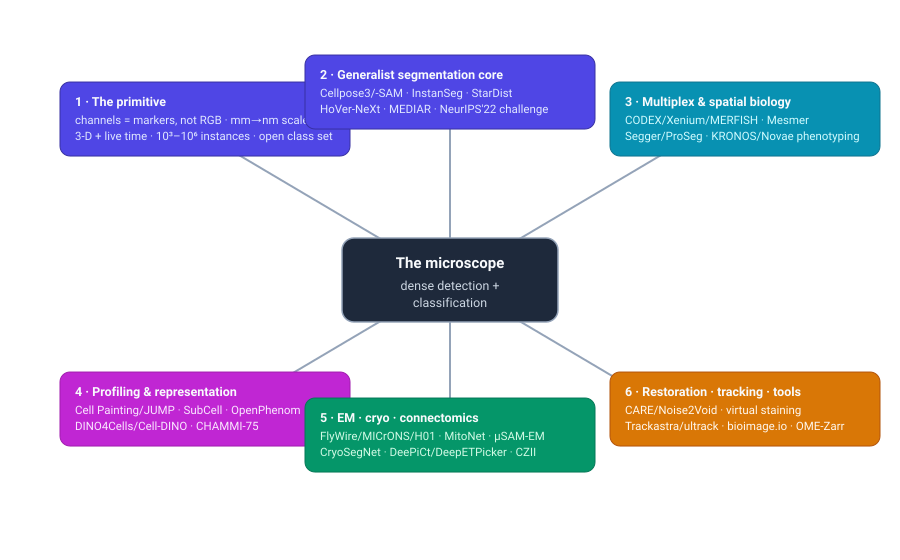
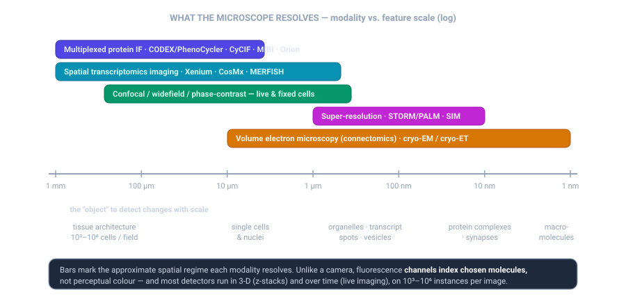
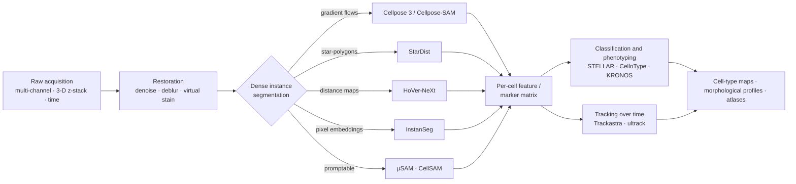

# Dense Object Detection & Classification — Recent Advances

*Compiled 2026-Jul-17 (America/Los_Angeles).*

Next installment in the running CV-updates log. Earlier entries on
`main`:
[Apr-30](../2026-Apr-30/2026-Apr-30_CV_updates.md),
[May-01](../2026-May-01/2026-May-01_CV_updates.md),
[May-02](../2026-May-02/2026-May-02_CV_updates.md),
[May-04](../2026-May-04/2026-May-04_CV_updates.md),
[May-05](../2026-May-05/2026-May-05_CV_updates.md),
[May-07](../2026-May-07/2026-May-07_CV_updates.md),
[May-08](../2026-May-08/2026-May-08_CV_updates.md),
[May-15](../2026-May-15/2026-May-15_CV_updates.md),
[May-16](../2026-May-16/2026-May-16_CV_updates.md),
[May-17](../2026-May-17/2026-May-17_CV_updates.md),
[Jun-09](../2026-Jun-09/2026-Jun-09_CV_updates.md),
[Jun-10](../2026-Jun-10/2026-Jun-10_CV_updates.md),
[Jun-12](../2026-Jun-12/2026-Jun-12_CV_updates.md),
[Jun-15](../2026-Jun-15/2026-Jun-15_CV_updates.md),
[Jun-16](../2026-Jun-16/2026-Jun-16_CV_updates.md),
[Jun-17](../2026-Jun-17/2026-Jun-17_CV_updates.md),
[Jun-19](../2026-Jun-19/2026-Jun-19_CV_updates.md),
[Jun-21](../2026-Jun-21/2026-Jun-21_CV_updates.md),
[Jun-22](../2026-Jun-22/2026-Jun-22_CV_updates.md),
[Jun-23](../2026-Jun-23/2026-Jun-23_CV_updates.md),
[Jun-24](../2026-Jun-24/2026-Jun-24_CV_updates.md),
[Jun-25](../2026-Jun-25/2026-Jun-25_CV_updates.md),
[Jun-27](../2026-Jun-27/2026-Jun-27_CV_updates.md),
[Jun-29](../2026-Jun-29/2026-Jun-29_CV_updates.md),
[Jun-30](../2026-Jun-30/2026-Jun-30_CV_updates.md),
[Jul-04](../2026-Jul-04/2026-Jul-04_CV_updates.md),
[Jul-07](../2026-Jul-07/2026-Jul-07_CV_updates.md),
[Jul-08](../2026-Jul-08/2026-Jul-08_CV_updates.md),
[Jul-10](../2026-Jul-10/2026-Jul-10_CV_updates.md),
[Jul-15](../2026-Jul-15/2026-Jul-15_CV_updates.md).

## Why this pass: the microscope as its own primitive

The recent run of passes has worked **sensor / imaging primitives on their own
terms** — camera-3D / occupancy ([Jun-24](../2026-Jun-24/2026-Jun-24_CV_updates.md)),
remote-sensing spectra ([Jun-25](../2026-Jun-25/2026-Jun-25_CV_updates.md)), the
LiDAR point cloud ([Jun-27](../2026-Jun-27/2026-Jun-27_CV_updates.md)), the event
camera ([Jun-29](../2026-Jun-29/2026-Jun-29_CV_updates.md)), thermal infrared
([Jun-30](../2026-Jun-30/2026-Jun-30_CV_updates.md)), imaging radar
([Jul-04](../2026-Jul-04/2026-Jul-04_CV_updates.md)), medical imaging
([Jul-07](../2026-Jul-07/2026-Jul-07_CV_updates.md)), subsea imaging
([Jul-08](../2026-Jul-08/2026-Jul-08_CV_updates.md)), astronomical surveys
([Jul-10](../2026-Jul-10/2026-Jul-10_CV_updates.md)) and X-ray transmission
([Jul-15](../2026-Jul-15/2026-Jul-15_CV_updates.md)).

The medical pass touched **microscopy** only through one door: brightfield **H&E
histopathology**, the gigapixel tissue slide with a clinical gate. That is the tip
of a much larger iceberg. This pass takes the whole **optical (and electron)
microscope** as its own primitive — the **fluorescence, confocal, super-resolution,
volume-EM and cryo** instrument that images *live and molecular* structure, not
stained tissue for diagnosis. It is a dense-detection-and-classification problem at
a scale nothing else in the log matches: a single field can hold **10³–10⁶
instances**, a single connectome **hundreds of thousands of neurons and hundreds of
millions of synapses**.

The microscopy image is a different primitive from the reflectance/emission and
transmission sensors covered so far, in five concrete ways:

- **Channels are *molecular markers*, not colour.** A fluorescence image has *N*
  channels, each the signal of a chosen antibody, dye or tagged protein. "Colour"
  is an assay design choice, and *N* ranges from 1 to 100+. A model must be
  **channel-agnostic** — the same cell type appears under wholly different channel
  sets across labs and platforms. This is unlike RGB, unlike the fixed dual-energy
  bands of the X-ray pass, unlike the spectral bands of remote sensing.
- **The object changes with the scale.** Zoom from a millimetre tissue field to a
  nanometre synapse and the thing you are detecting shifts from *tissue
  architecture* → *cells and nuclei* → *organelles and transcript spots* → *protein
  complexes and synapses* → *macromolecules*. One "detector" does not span it.
- **It is natively 3-D and time-resolved.** Confocal z-stacks, light-sheet
  whole-organ volumes and live-cell movies are the norm, not the exception; the
  detector must segment in 3-D and *track* dividing cells through time.
- **Instance density is extreme and the class set is open.** There is no fixed
  taxonomy of "cell types"; identity is a continuum read out from markers or
  expression. Detection and classification are coupled, and both run over enormous
  instance counts.
- **The ground truth is itself uncertain.** Expert annotators disagree on cell
  boundaries and calls; the field now benchmarks against **inter-human agreement**
  rather than a single gold label — and the best generalists claim to *reach* that
  human-consensus ceiling.

The analysis stack that has emerged around this primitive is remarkably uniform in
shape — restore, segment densely, then classify/track — even as each stage is being
absorbed into foundation models:

The rest of this pass walks the six threads of the topic map.

## 1 · The primitive & representation — why the microscope forces different choices

Every downstream design follows from the five properties above. Concretely:

- **Channel-agnostic encoders are now table stakes.** Because the marker panel is
  an assay choice, the leading 2024–26 models either *shuffle channels* during
  training (Cellpose-SAM), use **channel-wise attention with per-channel embeddings**
  (Recursion's channel-agnostic MAE; KRONOS' marker-identity embeddings; DeepCell
  Types' semantic marker-panel embeddings), or are explicitly benchmarked for
  channel adaptation (CHAMMI / CHAMMI-75). A detector that assumes a fixed 3-channel
  input is a non-starter across labs.
- **The metric is boundary agreement, not box mAP.** Dense instance segmentation is
  scored with **panoptic quality (PQ)**, average precision at IoU thresholds, and
  **F1 at matched detection**, against annotations that are themselves noisy —
  which is why **NuInsSeg** (2024) was notable for shipping explicit
  *ambiguous-area masks*, and why Cellpose-SAM frames its result as reaching
  *inter-human agreement*.
- **Restoration is part of the detector.** Because photon budgets are limited (to
  keep cells alive), the image is often too noisy or under-sampled to segment
  directly — so restoration is trained *for downstream segmentation*, not for
  perceptual fidelity (Cellpose 3; see §7).
- **3-D and terabyte scale reshape the pipeline.** Whole-slide (~100,000² px) and
  light-sheet whole-organ (~1000³ voxels, ~TB) images cannot be annotated or
  processed whole; tiling, lazy chunked I/O (OME-Zarr), and self-supervised
  pretraining on unlabelled volumes are structural, not optional (§8).

This is the same "dense detection + classification" task named across the log, but
the representation — *N* molecular channels, in 3-D, over time, with an open class
set and an uncertain ground truth — is genuinely its own primitive.

## 2 · The dense-segmentation core — generalist cell & nucleus instance segmentation

This is the beating heart of the field: turn a raw image into a labelled mask for
every cell/nucleus. The 2024–26 story is the **collapse of specialist models into
generalists**, and the migration of backbones from CNN to ViT.

**Cellpose lineage (Stringer & Pachitariu, HHMI Janelia).** The reference generalist.
- **Cellpose 3** (*Nature Methods*, 2025) adds "one-click" **image restoration** —
  denoise/deblur/upsample networks trained *not* to restore pixels but to output
  images a generalist segmenter handles well; it improves downstream segmentation of
  degraded images (including for other algorithms).
- **Cellpose-SAM / Cellpose 4** (bioRxiv, Apr 2025) replaces the CNN backbone with
  **SAM's pretrained ViT-L**, adapted to 256×256 inputs with 8×8 patches, trained
  with heavy augmentation (channel shuffling, size, shot noise, blur, downsampling,
  contrast inversion). It reports generalization across brightfield/phase/
  fluorescence/histology **without retraining**, and claims to **exceed inter-human
  agreement** — the "superhuman" framing. Drops into the existing Cellpose
  human-in-the-loop / fine-tuning / 3-D ecosystem.

**Other paradigms, still competitive and often faster:**
- **StarDist** — star-convex polygon representation (great for roundish nuclei);
  still a default, and a component of 2024–25 hybrid pipelines (e.g. YOLO detector +
  StarDist + SAM2 refinement).
- **HoVer-NeXt** (MIDL 2024) — the HoVer-Net horizontal/vertical-distance decoding
  rebuilt on **ConvNeXt V2**; fast joint nuclei segmentation **and** classification,
  reporting ~**0.84 binary F1** on extended Lizard at ~1.8 s/mm².
- **InstanSeg** (arXiv 2408.15954, Aug 2024; Bankhead lab) — an **embedding-based**
  generalist: predict pixel embeddings + a seed map and cluster. Segments both cells
  and nuclei, is fully TorchScript-serializable, ships as a **QuPath** extension, and
  reports SOTA on 6 public nucleus datasets while being **~2.5–45× faster** than
  common methods.
- **CellViT / CellViT++** (Med. Image Anal. 2024; arXiv 2501.05269, Jan 2025) — the
  **pathology sibling** already noted in the [Jul-07 medical pass](../2026-Jul-07/2026-Jul-07_CV_updates.md).
  CellViT++ freezes a foundation-model ViT encoder to get deep cell embeddings "for
  free," adapts to unseen cell types with minimal data, and can even build training
  sets from immunofluorescence without pathologist labels.

**The benchmark that reset expectations.** The **NeurIPS 2022 Multi-modality Cell
Segmentation Challenge** (results in *Nature Methods* 21:1103–1113, 2024) put
>1,500 labelled images from >50 experiments behind a single leaderboard. The winner,
**MEDIAR** (a data-centric SegFormer/MA-Net ensemble), reached validation **F1 ≈
0.907** within the time budget. The lesson the field took: a **Transformer-based
generalist**, tuned data-centrically, beats modality-specialists across modalities
without per-dataset tuning — the thesis every 2025 foundation model then pushed on.

**Datasets that anchor the core:** **TissueNet** (>1M whole-cell + nuclear
annotations, multiplex tissue), **LIVECell** (~1.6M cells, label-free
phase-contrast), the **Cellpose** generalist set, **NuInsSeg** (665 H&E patches,
>30,000 nuclei, first with ambiguous-area masks), and **PanNuke** (~216k nuclei,
19 tissues, 5 classes).

## 3 · Promptable & foundation segmentation — SAM adapted to the microscope

The Segment Anything paradigm (prompt → mask) hit microscopy hard, but with a twist:
biologists do not want to click every one of 50,000 cells, so the adaptations bolt
**automatic instance segmentation** and **video/tracking** onto SAM.

- **Segment Anything for Microscopy (µSAM / micro-sam)** (*Nature Methods*, 2025;
  Pape/Kreshuk, Göttingen/EMBL) — SAM fine-tuned into generalist models spanning
  **both light microscopy and electron microscopy**, with separate LM (cells/nuclei)
  and EM (organelles) models, supporting **2-D, 3-D and tracking**, shipped as a
  **napari** annotation plugin. Trained on >17,000 images / >2M annotations.
- **CellSAM** (*Nature Methods*, Dec 2025; Van Valen lab, Caltech) — pairs SAM with a
  **"CellFinder"** object detector that auto-prompts SAM, giving strong **zero-shot**
  segmentation across mammalian, yeast and bacterial cells and across modalities,
  improvable with few-shot; reports lower error than generalist Cellpose on its
  10-dataset suite.
- **SAM 2** (Meta, Aug 2024) brought promptable **image + video** segmentation with a
  streaming memory, which microscopy pipelines reuse for **tracking** and mask
  refinement; EM-specific adapters (**SAM4EM**, prompt-free 3-D neuro-EM; dendrite-
  from-EM) followed in 2025. A **patho-SAM** line adapts the same idea to H&E nuclei.

The through-line — and the field's signature epistemic move — is the **inter-human
ceiling**: with ground truth itself uncertain, Cellpose-SAM/CellSAM report success
as *matching human-consensus agreement* rather than a single gold mask.

## 4 · Multiplexed & spatial biology — dense detection *and* cell-type classification

This is where microscopy becomes an explicit detection-**and**-classification
problem at population scale: image a tissue in dozens of molecular channels, then
find every cell **and** call its type. Two families of imaging primitive drive it.

**Multiplexed protein imaging** — dozens of registered channels per tissue:
**CODEX/PhenoCycler** (Akoya; 50–100+ markers, cyclic hybridize–image–strip),
**MIBI-TOF** (metal-isotope tags read by ion mass-spec, no autofluorescence),
**CyCIF** (iterative immunofluorescence on commodity scopes), and **Orion** (Sorger
lab / RareCyte; ~16–20-plex IF **plus** H&E from the *same* slide; *Nat. Cancer*
2023). **Spatial transcriptomics imaging** — subcellular transcript spots:
**Xenium** (10x; up to **5,000 genes** with Xenium Prime, 2024), **CosMx**
(NanoString/Bruker; scaling to a ~19k **whole-transcriptome** panel, 2024) and
**MERFISH** (combinatorial error-robust barcoding).

**Segmentation for spatial omics** splits into three approaches:
- **Image/nucleus-based generalists:** **Mesmer/DeepCell** (*Nat. Biotechnol.* 2022,
  trained on TissueNet) remains the multiplex-tissue baseline; Cellpose 3, InstanSeg
  and CellSAM are the 2024–26 challengers.
- **Transcript-aware (molecule-based):** use the transcript point cloud itself.
  **Baysor** (2021, MRF over transcript composition) is the reference; the 2024–25
  wave adds **BIDCell** (*Nat. Commun.* 2024, scRNA-seq cell-type priors as losses),
  **Segger** (bioRxiv Mar 2025; a **graph neural net** doing transcript–cell link
  prediction, reporting higher accuracy *and* efficiency than Baysor/Cellpose/BIDCell
  at atlas scale), **ProSeg** (*Nat. Methods* 2025; unsupervised probabilistic 3-D
  transcript-density model that repositions implausible transcripts) and **RNA2seg**
  (*Genome Biology* 2025; a generalist teacher–student model trained on **>4M cells**
  fusing the RNA point cloud with membrane/nuclear stains).
- **Segmentation-free:** avoid per-cell boundaries entirely — **SSAM**,
  **Points2Regions** (*Cytometry A* 2024) and **Sainsc** (*Small Methods* 2025) map
  transcript-density directly to molecular domains, sidestepping boundary error at
  gigapixel scale.

**Cell-type classification / phenotyping** is the second half of the task:
- Classic references the new work is measured against: **Astir** (Bayesian, marker
  priors), **CELESTA** (MRF, marker + spatial context), **STELLAR** (*Nat. Methods*
  2022; graph DL that *transfers* annotations across donors/tissues).
- 2024–26: **MAPS** (*Nat. Commun.* 2024, pathologist-level supervised annotation),
  **CelloType** (*Nat. Methods* 2025; **end-to-end joint** segmentation +
  classification with Swin + DINO + MaskDINO, beating two-stage pipelines), and
  **DeepCell Types** (bioRxiv Nov 2024; a **language-informed** model with semantic
  marker-panel embeddings that generalizes across heterogeneous panels, trained on an
  Expanded TissueNet).

**Foundation models for spatial biology** are the frontier:
- **KRONOS** (Mahmood Lab, arXiv Jun 2025) — a panel-agnostic spatial-proteomics FM
  self-supervised on **~47M single-marker patches** (175 markers, 16 tissues, 8
  platforms); channel-wise stem + sinusoidal marker-identity embeddings; SOTA on cell
  phenotyping, treatment-response and retrieval across 11 cohorts, and notably
  introduces **segmentation-free patch-level** analysis and image reverse-search.
- **Novae** (*Nat. Methods* 2025, ~30M cells) — graph FM with **zero-shot spatial-
  domain** inference across panels/tissues and native batch correction;
  **Nicheformer** (*Nat. Methods* 2025) trained on a **110M-cell** corpus for
  spatial-context-aware representations; **scGPT-spatial** (bioRxiv Feb 2025) and
  **SPATIA** (arXiv Jul 2025) extend single-cell FMs to space and to generative
  phenotype prediction.

The unifying pressure at gigapixel scale is that **segmentation is both the accuracy
and the compute bottleneck** — hence the double move toward transcript-aware
atlas-scale segmenters *and* segmentation-free patch representations.

## 5 · Representation learning & phenotypic profiling — the classification side

A distinct thread learns **representations of cells** for classification and
phenotyping *without* per-object labels — the microscopy analogue of the
foundation-model wave, and something with no real counterpart elsewhere in the log.

**Subcellular / protein-localization imaging:**
- **CytoSelf** (*Nat. Methods* 2022; CZ Biohub) — fully self-supervised
  protein-localization encoder (VQ-VAE-2 + a protein-identity pretext task) trained on
  ~1,311 endogenously tagged proteins; recovers organelle- and complex-level structure
  with no labels.
- **SubCell** (bioRxiv Dec 2024 → 2025; Lundberg lab + CZI) — **proteome-aware ViT
  foundation models** for fluorescence microscopy, self-supervised on Human Protein
  Atlas single-cell images (>13,000 genes, 37 cell lines); generalizes with no
  fine-tuning and reports better clustering (ARI) than CytoSelf and the Kaggle-winning
  supervised baseline. Hosted on CZI's Virtual Cells Platform.

**Morphological profiling / Cell Painting** — the assay that made cells a
representation-learning problem:
- **JUMP-CP** (Broad + consortium, bioRxiv 2023) — the largest open Cell Painting
  resource: **~136,000 perturbations** (compounds, ORF over-expression, CRISPR-KO),
  **~115 TB, ~1.6B single cells** — the substrate for nearly every profiling FM.
- **OpenPhenom-S/16** (Recursion, Nov 2024) — an open **channel-agnostic MAE**
  (ViT-S/16 with channel cross-attention) trained on >3M images; its proprietary
  siblings **Phenom-1/-2** (CVPR/NeurIPS 2024) trained on billions of cell images.
- **DINO/DINOv2 lines:** **DINO4Cells** (bioRxiv 2023), **scDINO** (multiplexed
  immunofluorescence of immune cells), **Cell-DINO** (*PLOS Comput. Biol.* 2025/26,
  reporting large gains over handcrafted CellProfiler features at a fraction of the
  compute), and **SpatialDINO** (2025, 3-D volumetric).
- **Batch effects** are the field's dominant failure mode: a *Nat. Commun.* 2024
  benchmark of correction methods on JUMP, and transformer approaches like
  **CellPainTR** (2025) that fold batch correction into the representation.

**Benchmarks & the "virtual cell":** **CHAMMI** (NeurIPS 2023) and **CHAMMI-75**
(ICLR 2026; **75 studies, 16 organisms, 223 cell lines**) score **channel-adaptive**
representation quality via linear probes / retrieval mAP. All of this is being pulled
under the **"AI Virtual Cell"** banner (Bunne/Leskovec/Regev *et al.*, *Cell* Dec
2024), with CZI's **Virtual Cells Platform** and a **CZI×NVIDIA** scale-up (Oct 2025)
hosting imaging FMs (SubCell) alongside omics models.

## 6 · Electron microscopy, connectomics & cryo — dense detection at the nanoscale

At the nanometre end the objects are **neurons, synapses, organelles and protein
complexes**, and the problem is dense 3-D segmentation of petavoxel volumes. 2025 was
the field's coming-out: *Nature Methods* named **EM-based connectomics its Method of
the Year 2025**.

**Connectomics (volume-EM):**
- **FlyWire** (*Nature*, Oct 2024; Seung/Murthy, Princeton) — the **complete adult
  *Drosophila* brain connectome**: **139,255 proofread neurons**, **~54.5M synapses**,
  **>8,400 cell types**, built on automated segmentation + massive community
  proofreading.
- **MICrONS** (*Nature*, Apr 2025) — a **cubic-millimetre** mouse visual cortex volume
  co-registering function (2-photon) with structure: **>200,000 cells**, **~523M
  synapses**.
- **H01** (*Science*, 2024; Lichtman + Google) — a **1.4-petabyte** ~1 mm³ human
  cortex sample, ~57,000 cells, ~150M synapses, at 4×4×33 nm.
- Method backbone: **flood-filling networks** (*Nat. Methods* 2018) still underpin the
  automated segmentation; organelle segmentation is served by generalists like
  **MitoNet/Empanada** (*Cell Systems* 2023, trained on CEM500K), and **µSAM's EM
  models** / **SAM4EM** bring the promptable paradigm to EM.

**Cryo-EM single-particle picking** — find macromolecules in noisy micrographs:
- Baselines **Topaz** (positive-unlabelled CNN) and **crYOLO** (YOLO-based) remain
  field standards; 2024–25 successors add SAM and self-supervision — **CryoSegNet**
  (SAM + attention U-Net, reporting F1 ≈ 0.76 vs Topaz 0.73 / crYOLO 0.75),
  **CryoTransformer**, **CryoMAE** (few-shot masked-autoencoder), and **cryo-EMMAE**
  (*Cell Rep. Methods* 2025; the first fully **self-supervised**, annotation-free
  picker).

**Cryo-ET tomogram particle detection** — 3-D localization of complexes *in situ*:
- **DeePiCt** (*Nat. Methods* 2023; EMBL) combines 2-D compartment segmentation with
  3-D particle localization; **DeepETPicker** (*Nat. Commun.* 2024) is a weakly
  supervised 3-D ResUNet. The **CZII CryoET Object Identification** Kaggle challenge
  (CZ Imaging Institute, Nov 2024–Feb 2025) put 5 protein-complex classes behind a
  recall-weighted F-β metric, and winning 3-D-U-Net solutions plus the **copick /
  cryoET Data Portal** ecosystem are standardizing the task.

## 7 · Restoration, virtual staining & tracking — the enabling layer

Two supporting problems make dense detection possible at all, and both are now deep-
learning-native.

**Restoration / denoising / super-resolution** (so a low-photon image is segmentable):
- **CARE** (*Nat. Methods* 2018) established paired-image content-aware restoration
  (~60× fewer photons); **Deep-STORM / DeepSTORM3D** reconstruct super-resolution from
  dense blinking emitters. **Self-supervised denoising** — **Noise2Void** (CVPR 2019)
  and its 2024–25 successors **FM2S** (zero-shot, spatially-correlated noise) and
  **SPEND** — removes the clean-target requirement. **Cellpose 3**'s restoration (§2)
  is the version explicitly optimized *for segmentation*.
- **Virtual staining** turns label-free images into (virtual) fluorescence or H&E:
  **Cytoland / VSCyto** (*Nat. Mach. Intell.* 2025) predicts nuclei/membranes from
  QPI/brightfield; UCLA diffusion models (2024–25) jointly super-resolve *and*
  virtually stain; and virtual H&E from autofluorescence/FLIM (npj Imaging 2024)
  targets clinical-grade unstained→stained conversion.

**Live-cell / 3-D tracking** — detection over time, through cell division:
- The **Cell Tracking Challenge** (*Nat. Methods* 2023) is the benchmark. The 2024–25
  advances are in the *linking* step: **Trackastra** (ECCV 2024) uses a **transformer**
  to score detection associations over a spatio-temporal window, enabling accurate
  greedy linking and winning the 7th challenge's generalizable-linking track;
  **ultrack** (*Nat. Methods* 2025) selects temporally consistent tracks from many
  candidate segmentations via ILP, scaling to **terabyte** 3-D time-lapses (top
  combined CTB ≈ 0.844). End-to-end joint segment-and-track models (**EmbedTrack**,
  "Cell as Point") are a growing minority; the field is still mostly
  **tracking-by-detection** with a smarter linker.

## 8 · Tooling, model zoos, formats & the generalization debate

The ecosystem is what makes any of this reproducible and deployable — and where the
honest limits show.

**Tools:** **napari** (Python n-D viewer/plugin platform; v0.5, 2024), **QuPath**
(whole-slide analysis; v0.6 added the **InstanSeg** DL extension), **Fiji/ImageJ +
deepImageJ 3.0** (runs TensorFlow/PyTorch/ONNX via JDLL), **ilastik** (interactive
random-forest), **BiaPy** (*Nat. Methods* 2025; build 2-D/3-D DL pipelines without
coding), **ZeroCostDL4Mic → DL4MicEverywhere** (*Nat. Methods* 2024; containerized,
reproducible), and **Piximi** (zero-install, browser-only, data-stays-local).

**Interoperability:** the **BioImage Model Zoo** (`bioimage.io`) defines an `rdf.yaml`
model-description spec (I/O, weights, provenance, test I/O for verification) consumed
by ilastik/deepImageJ/QuPath/StarDist/ZeroCost — cross-tool model reuse, out of the
now-completed AI4Life project. Data is standardizing on **OME-Zarr / OME-NGFF**
(cloud-optimized, multiscale; spec v0.5 on Zarr v3) for terabyte volumes.

**The generalization / reliability debate — the crucial caveat.** The "superhuman,
works out of the box" framing does not survive contact with hard domain shift:
- Specialist models degrade sharply out of distribution (a model trained on SIM fails
  on FIB-SEM), and generalists *reduce but do not eliminate* this. A 2025 kidney-
  pathology benchmark (arXiv 2510.01287) found **no single model dominant** across
  hard cases and proposed **ensembling** CellViT++/Cellpose-SAM to resolve them.
- Cross-population reviews report **10–25%** accuracy drops on unseen sites/scanners;
  responses include stain normalization, source-free model ranking under shift, and
  batch-correction-as-domain-adaptation. New 2025–26 work (**CellVTA** — a CNN adapter
  fixing ViT resolution loss; **GenCellAgent** — a training-free LLM-agent that
  retrieves in-context exemplars for OOD cases) targets exactly these gaps.
- And the **benchmarks themselves are immature**: a 2026 review of spatial-omics
  segmentation notes the field **still lacks a standardized, unbiased segmentation
  benchmark** — comparisons remain largely bespoke and self-reported.

**Label efficiency** is the pragmatic frontier: Cellpose's human-in-the-loop yields a
specialist in 1–2 hours; weak labels (boxes/scribbles), active learning, and
self-supervised pretraining are how annotation cost is contained. NuInsSeg's
ambiguous-area masks are the honest admission that even expert labels are uncertain.

## What to watch

- **Segmentation-free goes mainstream.** At gigapixel/atlas scale, per-cell boundaries
  are both the error source and the compute wall. KRONOS' patch-level analysis and the
  transcript-density methods (SSAM/Points2Regions/Sainsc) point to a future where many
  questions are answered *without* drawing a boundary around every cell.
- **Channel-agnostic, panel-agnostic FMs win.** The models that generalize
  (Cellpose-SAM, KRONOS, DeepCell Types, OpenPhenom) all treat the marker/channel set
  as variable input, via channel attention or semantic marker embeddings. Fixed-input
  architectures are a dead end here.
- **The inter-human ceiling becomes the metric.** With uncertain ground truth,
  "superhuman" claims (Cellpose-SAM) and human-consensus evaluation will define what
  "solved" means — and expose benchmarks that never modelled annotator disagreement.
- **Restoration, segmentation, tracking, classification merge.** CelloType (joint
  seg+classify), Cellpose 3 (restore-for-segment) and SAM2-based track-by-prompt are
  early signs the four-stage pipeline collapses into single models.
- **Connectomics is the scale stress-test.** Petavoxel human-cortex and whole-brain
  fly volumes are where dense 3-D detection meets terabyte engineering; flood-filling
  + proofreading is being challenged by promptable and self-supervised 3-D methods.
- **The generalization gap is the real research object.** Out-of-the-box numbers are
  inflated by in-distribution testing; the honest bar is cross-lab, cross-scanner,
  cross-panel, and the field's own 2026 reviews say the benchmarks to measure it do
  not yet exist.

---

### How this connects to earlier passes

Microscopy is the **molecular, multi-channel, extreme-instance-density primitive**.
Its **gigapixel-tissue and nuclei-detection** half is the sibling of the pathology
thread in the medical pass ([Jul-07](../2026-Jul-07/2026-Jul-07_CV_updates.md)) — but
the microscope proper is *fluorescence, live and volumetric*, and its channels are
**molecular markers**, closer in spirit to the spectral/thermal "colour is the signal"
threads ([Jun-25](../2026-Jun-25/2026-Jun-25_CV_updates.md),
[Jun-30](../2026-Jun-30/2026-Jun-30_CV_updates.md)) than to RGB. Its **promptable-SAM**
turn is the same foundation-model adaptation seen across the medical and X-ray passes
([Jul-07](../2026-Jul-07/2026-Jul-07_CV_updates.md),
[Jul-15](../2026-Jul-15/2026-Jul-15_CV_updates.md)); its **3-D / volumetric** detection
parallels the occupancy and point-cloud work
([Jun-24](../2026-Jun-24/2026-Jun-24_CV_updates.md),
[Jun-27](../2026-Jun-27/2026-Jun-27_CV_updates.md)); and its **rare-target, recall-
weighted** cryo metrics echo the astronomical and medical passes
([Jul-10](../2026-Jul-10/2026-Jul-10_CV_updates.md),
[Jul-07](../2026-Jul-07/2026-Jul-07_CV_updates.md)). The things with **no analogue**
elsewhere in the log are the **open, continuous class set** (cell "type" read from
markers, not a fixed taxonomy), the **representation-learning / morphological-profiling**
branch (Cell Painting, the "virtual cell"), and an **uncertain ground truth** that
forces evaluation against human-consensus rather than a gold label.

---

## Sources & further reading

**1–2 · The primitive & the dense-segmentation core**
- Cellpose 3 — [Nat. Methods 2025](https://www.nature.com/articles/s41592-025-02595-5) · [PMC](https://pmc.ncbi.nlm.nih.gov/articles/PMC11903308/); Cellpose-SAM — [bioRxiv 2025.04.28.651001](https://www.biorxiv.org/content/10.1101/2025.04.28.651001v1) · [docs](https://cellpose.readthedocs.io/) · [code](https://github.com/MouseLand/cellpose).
- InstanSeg — [arXiv 2408.15954](https://arxiv.org/abs/2408.15954) · [code](https://github.com/instanseg/instanseg); StarDist H&E — [arXiv 2203.02284](https://arxiv.org/abs/2203.02284); HoVer-NeXt — [MIDL 2024 (PMLR v250)](https://proceedings.mlr.press/v250/baumann24a.html) · [weights](https://zenodo.org/records/10635618).
- CellViT — [arXiv 2306.15350](https://arxiv.org/abs/2306.15350) · [code](https://github.com/TIO-IKIM/CellViT); CellViT++ — [arXiv 2501.05269](https://arxiv.org/abs/2501.05269) · [code](https://github.com/TIO-IKIM/CellViT-plus-plus).
- NeurIPS'22 Multi-modality Cell Seg Challenge — [Nat. Methods 2024](https://www.nature.com/articles/s41592-024-02233-6) · [challenge](https://neurips22-cellseg.grand-challenge.org/); MEDIAR — [arXiv 2212.03465](https://arxiv.org/abs/2212.03465).
- Datasets: TissueNet/Mesmer — [Nat. Biotechnol. 2022](https://www.nature.com/articles/s41587-021-01094-0) · [data](https://datasets.deepcell.org/); LIVECell — [Nat. Methods 2021](https://www.nature.com/articles/s41592-021-01249-6); NuInsSeg — [Sci. Data 2024](https://www.nature.com/articles/s41597-024-03117-2); PanNuke — [arXiv 2003.10778](https://arxiv.org/abs/2003.10778).

**3 · Promptable & foundation segmentation**
- µSAM / Segment Anything for Microscopy — [Nat. Methods 2025](https://www.nature.com/articles/s41592-024-02580-4) · [code](https://github.com/computational-cell-analytics/micro-sam); CellSAM — [Nat. Methods 2025](https://www.nature.com/articles/s41592-025-02879-w) · [arXiv 2311.11004](https://arxiv.org/abs/2311.11004) · [code](https://github.com/vanvalenlab/cellsam).
- SAM 2 — [arXiv 2408.00714](https://arxiv.org/abs/2408.00714); MedSAM — [Nat. Commun. 2024](https://www.nature.com/articles/s41467-024-44824-z) · [code](https://github.com/bowang-lab/MedSAM); SAM4EM — [arXiv 2504.21544](https://arxiv.org/abs/2504.21544).

**4 · Multiplexed & spatial biology**
- Platforms/reviews: Orion — [Nat. Cancer 2023](https://www.nature.com/articles/s43018-023-00576-1) · [code](https://github.com/labsyspharm/orion-crc); multiplex-imaging review — [PMC11589153](https://pmc.ncbi.nlm.nih.gov/articles/PMC11589153/); Xenium 5K — [10x](https://www.10xgenomics.com/products/xenium-5k-panel); CosMx WTx — [bioRxiv 2024.11.27.625536](https://www.biorxiv.org/content/10.1101/2024.11.27.625536); platform benchmarks — [Nat. Commun. 2025](https://www.nature.com/articles/s41467-025-64292-3).
- Segmentation: Baysor — [Nat. Biotechnol. 2021](https://www.nature.com/articles/s41587-021-01044-w) · [code](https://github.com/kharchenkolab/Baysor); BIDCell — [Nat. Commun. 2024](https://www.nature.com/articles/s41467-023-44560-w); Segger — [bioRxiv 2025.03.14.643160](https://www.biorxiv.org/content/10.1101/2025.03.14.643160v1) · [code](https://github.com/gerstung-lab/segger); ProSeg — [Nat. Methods 2025](https://www.nature.com/articles/s41592-025-02697-0) · [code](https://github.com/dcjones/proseg); RNA2seg — [Genome Biol. 2025](https://link.springer.com/article/10.1186/s13059-025-03908-9); Points2Regions — [Cytometry A 2024](https://onlinelibrary.wiley.com/doi/full/10.1002/cyto.a.24884); Sainsc — [Small Methods 2025](https://onlinelibrary.wiley.com/doi/full/10.1002/smtd.202401123); SSAM — [code](https://github.com/pnucolab/ssam).
- Phenotyping: STELLAR — [Nat. Methods 2022](https://www.nature.com/articles/s41592-022-01651-8); MAPS — [Nat. Commun. 2024](https://www.nature.com/articles/s41467-023-44188-w); CelloType — [Nat. Methods 2025](https://www.nature.com/articles/s41592-024-02513-1) · [bioRxiv](https://www.biorxiv.org/content/10.1101/2024.09.15.613139v1); DeepCell Types — [bioRxiv 2024.11.02.621624](https://www.biorxiv.org/content/10.1101/2024.11.02.621624v3) · [code](https://github.com/vanvalenlab/DeepCellTypes-2024_Wang_et_al).
- Spatial FMs: KRONOS — [arXiv 2506.03373](https://arxiv.org/abs/2506.03373) · [code](https://github.com/mahmoodlab/KRONOS) · [HF](https://huggingface.co/MahmoodLab/KRONOS); Novae — [Nat. Methods 2025](https://www.nature.com/articles/s41592-025-02899-6); Nicheformer — [Nat. Methods 2025](https://www.nature.com/articles/s41592-025-02814-z); scGPT-spatial — [bioRxiv 2025.02.05.636714](https://sciety.org/articles/activity/10.1101/2025.02.05.636714); SPATIA — [arXiv 2507.04704](https://arxiv.org/abs/2507.04704).
- Open problems: cell segmentation in spatial transcriptomics — [arXiv 2606.09675](https://arxiv.org/abs/2606.09675); HuBMAP portal — [arXiv 2511.05708](https://arxiv.org/abs/2511.05708).

**5 · Representation learning & phenotypic profiling**
- CytoSelf — [Nat. Methods 2022](https://www.nature.com/articles/s41592-022-01541-z); SubCell — [bioRxiv 2024.12.06.627299](https://www.biorxiv.org/content/10.1101/2024.12.06.627299) · [VCP](https://virtualcellmodels.cziscience.com/model/subcell); HPA single-cell classification — [Nat. Methods 2022](https://www.nature.com/articles/s41592-022-01606-z).
- JUMP-CP — [bioRxiv 2023.03.23.534023](https://www.biorxiv.org/content/10.1101/2023.03.23.534023) · [code](https://github.com/jump-cellpainting); OpenPhenom — [HF](https://huggingface.co/recursionpharma/OpenPhenom) · [announcement](https://ir.recursion.com/news-releases/news-release-details/recursion-announces-release-openphenom-s16-google-clouds-model); DINO4Cells — [bioRxiv 2023.06.16.545359](https://www.biorxiv.org/content/10.1101/2023.06.16.545359); Cell-DINO — [PLOS Comput. Biol. 2025/26](https://journals.plos.org/ploscompbiol/article?id=10.1371/journal.pcbi.1013828); scDINO — [code](https://github.com/JacobHanimann/scDINO); SSL profiling — [Sci. Rep. 2025](https://www.nature.com/articles/s41598-025-88825-4).
- Batch effects — [Nat. Commun. 2024](https://www.nature.com/articles/s41467-024-50613-5); CellPainTR — [arXiv 2509.06986](https://arxiv.org/abs/2509.06986); CHAMMI — [arXiv 2310.19224](https://arxiv.org/abs/2310.19224); CHAMMI-75 — [OpenReview](https://openreview.net/forum?id=SLjqdj3LPk).
- AI Virtual Cell roadmap — [Cell 2024](https://www.cell.com/cell/pdf/S0092-8674(24)01332-1.pdf); CZI VCP — [platform](https://virtualcellmodels.cziscience.com); CZI×NVIDIA — [newsroom](https://chanzuckerberg.com/newsroom/nvidia-partnership-virtual-cell-model/).

**6 · Electron microscopy, connectomics & cryo**
- FlyWire — [Nature 2024 (connectome)](https://www.nature.com/immersive/d42859-024-00053-4/index.html) · [cell typing](https://www.nature.com/articles/s41586-024-07686-5) · [flywire.ai](https://flywire.ai/); MICrONS — [Nature 2025](https://www.nature.com/articles/s41586-025-08790-w) · [explorer](https://www.microns-explorer.org/cortical-mm3); H01 — [Science 2024](https://www.science.org/doi/10.1126/science.adk4858); Method of the Year 2025 — [Nat. Methods](https://www.nature.com/articles/s41592-025-02988-6).
- Flood-filling networks — [Nat. Methods 2018](https://www.nature.com/articles/s41592-018-0049-4); MitoNet/Empanada — [Cell Systems 2023](https://www.cell.com/cell-systems/fulltext/S2405-4712(22)00492-6) · CEM500K [eLife 2021](https://elifesciences.org/articles/65894).
- Cryo-EM picking: CryoSegNet — [Brief. Bioinform. 2024](https://academic.oup.com/bib/article/25/4/bbae282/7690949); CryoMAE — [arXiv 2404.10178](https://arxiv.org/abs/2404.10178); cryo-EMMAE — [Cell Rep. Methods 2025](https://www.cell.com/cell-reports-methods/fulltext/S2667-2375(25)00125-0). Cryo-ET: DeePiCt — [Nat. Methods 2023](https://www.nature.com/articles/s41592-022-01746-2) · [code](https://github.com/ZauggGroup/DeePiCt); DeepETPicker — [Nat. Commun. 2024](https://www.nature.com/articles/s41467-024-46041-0); CZII challenge — [Kaggle](https://www.kaggle.com/competitions/czii-cryo-et-object-identification) · [cryoET Data Portal](https://cryoetdataportal.czscience.com/).

**7 · Restoration, virtual staining & tracking**
- CARE — [Nat. Methods 2018](https://www.nature.com/articles/s41592-018-0216-7); DeepSTORM3D — [arXiv 1906.09957](https://arxiv.org/abs/1906.09957); FM2S denoising — [arXiv 2412.10031](https://arxiv.org/abs/2412.10031).
- Virtual staining: diffusion super-resolved — [arXiv 2410.20073](https://arxiv.org/abs/2410.20073); virtual H&E from FLIM — [npj Imaging 2024](https://www.nature.com/articles/s44303-024-00021-7).
- Tracking: Trackastra — [arXiv 2405.15700](https://arxiv.org/abs/2405.15700) · [code](https://github.com/weigertlab/trackastra); ultrack — [Nat. Methods 2025](https://www.nature.com/articles/s41592-025-02778-0) · [code](https://github.com/royerlab/ultrack); Cell as Point — [arXiv 2411.14833](https://arxiv.org/abs/2411.14833).

**8 · Tooling, model zoos, formats & the debate**
- napari — [napari.org](https://napari.org/); QuPath — [docs](https://qupath.readthedocs.io/); deepImageJ 3.0 — [PMC11704127](https://pmc.ncbi.nlm.nih.gov/articles/PMC11704127/); ilastik — [Nat. Methods 2019](https://www.nature.com/articles/s41592-019-0582-9); BiaPy — [Nat. Methods 2025](https://www.nature.com/articles/s41592-025-02699-y) · [code](https://github.com/BiaPyX/BiaPy); DL4MicEverywhere — [Nat. Methods 2024](https://www.nature.com/articles/s41592-024-02295-6); Piximi — [PMC11185650](https://pmc.ncbi.nlm.nih.gov/articles/PMC11185650/).
- BioImage Model Zoo — [bioimage.io](https://bioimage.io/) · [github](https://github.com/bioimage-io) · [chatbot Nat. Methods 2024](https://www.nature.com/articles/s41592-024-02370-y); OME-Zarr/NGFF — [spec](https://ngff.openmicroscopy.org/) · [PMC9980008](https://pmc.ncbi.nlm.nih.gov/articles/PMC9980008/).
- Generalization/reliability: kidney-pathology benchmark — [arXiv 2510.01287](https://arxiv.org/abs/2510.01287); domain-shift review — [Big Data Cogn. Comput. 2026](https://www.mdpi.com/2504-2289/10/3/76); source-free model ranking — [arXiv 2503.00450](https://arxiv.org/abs/2503.00450).

---

### Diagram-rendering notes

Both figures are original SVG authored for this pass and styled for **light and dark
backgrounds**: content sits in saturated fills (indigo/cyan/emerald/fuchsia/amber/
slate) with light text, and all free-floating labels use a mid-slate (`#94a3b8`) that
stays legible on either background. The pipeline schematic is a **Mermaid** flowchart
(rendered natively by GitHub's Markdown, whose Mermaid theme adapts to the viewer's
light/dark setting). No external URLs, fonts, or scripts are referenced, so the
figures render offline and in any Markdown viewer that supports SVG + Mermaid.

---

*Compiled with automated web research on 2026-Jul-17 (Los Angeles time). Some primary
sources (notably arXiv and bioRxiv abstract pages) were unreachable through this
environment's network policy; entries drawn from those were sourced via search
abstracts, publisher and repository pages, and mirrors, and links are provided for
verification. A handful of 2026-dated preprints (e.g. review and agent papers, and
some benchmark numbers) are search-surfaced and flagged as directional rather than
established. Figures are original SVG/Mermaid, styled for light and dark backgrounds.
Corrections welcome in the next pass.*
