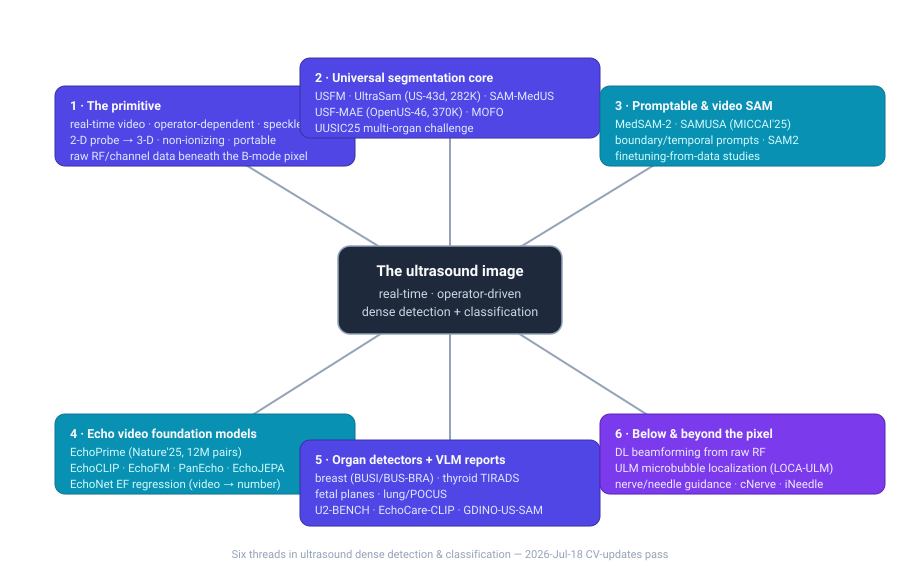

# Dense Object Detection & Classification — Recent Advances

*Compiled 2026-Jul-18 (America/Los_Angeles).*

Next installment in the running CV-updates log. Earlier entries on
`main`:
[Apr-30](../2026-Apr-30/2026-Apr-30_CV_updates.md),
[May-01](../2026-May-01/2026-May-01_CV_updates.md),
[May-02](../2026-May-02/2026-May-02_CV_updates.md),
[May-04](../2026-May-04/2026-May-04_CV_updates.md),
[May-05](../2026-May-05/2026-May-05_CV_updates.md),
[May-07](../2026-May-07/2026-May-07_CV_updates.md),
[May-08](../2026-May-08/2026-May-08_CV_updates.md),
[May-15](../2026-May-15/2026-May-15_CV_updates.md),
[May-16](../2026-May-16/2026-May-16_CV_updates.md),
[May-17](../2026-May-17/2026-May-17_CV_updates.md),
[Jun-09](../2026-Jun-09/2026-Jun-09_CV_updates.md),
[Jun-10](../2026-Jun-10/2026-Jun-10_CV_updates.md),
[Jun-12](../2026-Jun-12/2026-Jun-12_CV_updates.md),
[Jun-15](../2026-Jun-15/2026-Jun-15_CV_updates.md),
[Jun-16](../2026-Jun-16/2026-Jun-16_CV_updates.md),
[Jun-17](../2026-Jun-17/2026-Jun-17_CV_updates.md),
[Jun-19](../2026-Jun-19/2026-Jun-19_CV_updates.md),
[Jun-21](../2026-Jun-21/2026-Jun-21_CV_updates.md),
[Jun-22](../2026-Jun-22/2026-Jun-22_CV_updates.md),
[Jun-23](../2026-Jun-23/2026-Jun-23_CV_updates.md),
[Jun-24](../2026-Jun-24/2026-Jun-24_CV_updates.md),
[Jun-25](../2026-Jun-25/2026-Jun-25_CV_updates.md),
[Jun-27](../2026-Jun-27/2026-Jun-27_CV_updates.md),
[Jun-29](../2026-Jun-29/2026-Jun-29_CV_updates.md),
[Jun-30](../2026-Jun-30/2026-Jun-30_CV_updates.md),
[Jul-04](../2026-Jul-04/2026-Jul-04_CV_updates.md),
[Jul-07](../2026-Jul-07/2026-Jul-07_CV_updates.md),
[Jul-08](../2026-Jul-08/2026-Jul-08_CV_updates.md),
[Jul-10](../2026-Jul-10/2026-Jul-10_CV_updates.md),
[Jul-15](../2026-Jul-15/2026-Jul-15_CV_updates.md),
[Jul-17](../2026-Jul-17/2026-Jul-17_CV_updates.md).

## Table of contents

1. [Why this pass: ultrasound as its own primitive](#why)
2. [Topic map](#map)
3. [The universal segmentation core — one model, every organ](#universal)
4. [Promptable & video SAM — the annotation lever](#sam)
5. [Echocardiography — the video foundation-model frontier](#echo)
6. [Organ detectors & classifiers — breast, thyroid, fetal, lung](#organ)
7. [Vision–language & report generation — and where VLMs still fail](#vlm)
8. [Below & beyond the pixel — raw RF, deep beamforming, localization microscopy](#below)
9. [Interventional & real-time guidance](#guidance)
10. [Through-line & open problems](#throughline)
11. [Sources](#sources)

---

## 1. Why this pass: ultrasound as its own primitive

The recent run of passes has worked **sensor / imaging primitives on their own
terms** — LiDAR ([Jun-27](../2026-Jun-27/2026-Jun-27_CV_updates.md)), the event
camera ([Jun-29](../2026-Jun-29/2026-Jun-29_CV_updates.md)), thermal infrared
([Jun-30](../2026-Jun-30/2026-Jun-30_CV_updates.md)), imaging radar
([Jul-04](../2026-Jul-04/2026-Jul-04_CV_updates.md)), medical imaging (CT/MRI
radiology + H&E pathology) ([Jul-07](../2026-Jul-07/2026-Jul-07_CV_updates.md)),
subsea sonar ([Jul-08](../2026-Jul-08/2026-Jul-08_CV_updates.md)), astronomical
surveys ([Jul-10](../2026-Jul-10/2026-Jul-10_CV_updates.md)), X-ray transmission
([Jul-15](../2026-Jul-15/2026-Jul-15_CV_updates.md)) and the optical/electron
microscope ([Jul-17](../2026-Jul-17/2026-Jul-17_CV_updates.md)).

The medical pass touched ultrasound only in passing — one row in a modality table.
That undersells the single most-performed imaging exam on Earth. This pass takes
the **ultrasound image as its own primitive**: the real-time, hand-steered,
non-ionizing pulse-echo modality that is the antithesis of every static scan the
log has covered so far.

Ultrasound is a *different* detection-and-classification problem from the
reflectance, transmission and emission sensors covered to date, in six concrete
ways:

- **The image is formed live, by a human, and is never the same twice.** There is
  no fixed acquisition geometry. The sonographer *creates* the view by hand —
  angle, pressure, gain, focus, depth — so the same anatomy yields wildly
  different images across operators, machines and vendors. A detector must survive
  a **domain gap that is generated at scan time**, not just across datasets. This
  is the field's defining nuisance and the reason label-efficiency and
  foundation-model generalisation dominate the 2025–26 literature.
- **It is natively a *video* modality, and the video carries the signal.** B-mode
  cine, Doppler and contrast loops are the norm; function is read from *motion*
  (an ejection fraction is a temporal quantity, a lung "sliding" sign is a
  texture-in-time). A single-frame detector throws away the diagnosis. This makes
  ultrasound the medical modality where **video foundation models** (SAM 2,
  EchoPrime, EchoJEPA) matter most.
- **Speckle is signal *and* noise.** The granular interference texture is not
  additive noise to be denoised away — it encodes tissue microstructure — yet it
  also destroys edges and makes boundaries ambiguous. Detectors trained on the
  crisp edges of CT or the stained cells of pathology do not transfer.
- **The "object" spans ten orders of scale, and much of it lives *below* the
  B-mode pixel.** From a whole fetal-heart four-chamber plane down to a single
  **microbubble** localised to a few microns in ultrasound localization microscopy
  (ULM), the detectable object changes completely — and beneath the greyscale
  image sits the **raw radio-frequency (RF) channel data**, an entirely separate
  representation that deep networks are now learning to beamform and segment
  directly.
- **The class taxonomy is a scoring rubric, not a noun list.** Clinical ultrasound
  reads out *structured, standardised* categories — BI-RADS for breast, TIRADS for
  thyroid, standard-plane checklists for obstetrics, view labels for echo — so
  "classification" here means predicting a **guideline-defined risk stratum**, and
  detectors are graded against inter-reader variability, not a clean ground truth.
- **The deployment target is a probe at the bedside, not a reading room.** POCUS
  runs on a cart or a phone-tethered probe in the hands of a non-expert, so the
  model's job is often **real-time coaching and quality control** — is this even a
  diagnostic image? — as much as detection.

The through-line for the log: ultrasound is the primitive where the *acquisition*
is part of the learning problem. Everything below is an attempt to make one model
robust to a picture a person draws by hand, in motion, in real time.

---

## 2. Topic map

The pass is organised around six threads, mirrored in the diagram above:

| # | Thread | What it is | Representative 2025–26 work |
|---|--------|-----------|------------------------------|
| 1 | **The primitive** | why ultrasound resists transfer | §1 |
| 2 | **Universal segmentation core** | one model, all organs, label-efficient | USFM, UltraSam, SAM-MedUS, USF-MAE, MOFO, UUSIC25 |
| 3 | **Promptable & video SAM** | prompt-based masks, cine tracking | MedSAM-2, SAMUSA, SAM2-finetuning studies |
| 4 | **Echo video foundation models** | function from cardiac cine | EchoPrime, EchoCLIP, EchoFM, PanEcho, EchoJEPA, EchoNet EF |
| 5 | **Organ detectors + reports** | breast/thyroid/fetal/lung + VLM text | YOLO+U-Net pipelines, TIRADS AI, plane detection, U2-BENCH |
| 6 | **Below & beyond the pixel** | RF/beamforming + ULM + guidance | deep beamformers, LOCA-ULM, cNerve/iNeedle |

---

## 3. The universal segmentation core — one model, every organ

The dominant 2025–26 storyline is the push for a **single ultrasound model that
generalises across organs and tasks** with minimal labels — a direct response to
the scan-time domain gap and to ultrasound's prohibitive annotation cost (masks
require scarce expert sonographer time).

- **USFM (Universal Ultrasound Foundation Model).** A self-supervised backbone
  built for *organ versatility, task adaptability and label efficiency*, showing
  solid performance across segmentation, classification and image-enhancement on
  many organs. It set the template the field is now iterating on: pretrain once,
  adapt cheaply. ([ScienceDirect / *Medical Image Analysis*](https://www.sciencedirect.com/science/article/abs/pii/S1361841524001270))
- **UltraSam / US-43d.** A SAM adaptation trained on **US-43d**, a large-scale
  collection of **43 open-access ultrasound datasets, >282,000 images with
  segmentation masks over 58 anatomical structures**. Trained under a
  prompt-conditioned paradigm (no unified label set required), it beats prior
  SAM-style models on prompt-based segmentation, and an **UltraSam-initialised ViT
  surpasses ImageNet-, SAM- and MedSAM-initialised backbones** on downstream
  segmentation *and* classification — evidence that ultrasound-specific
  pretraining, not natural-image transfer, is the right prior.
  ([arXiv 2411.16222](https://arxiv.org/abs/2411.16222) · [Int. J. CARS 2025](https://link.springer.com/article/10.1007/s11548-025-03517-8))
- **SAM-MedUS.** A foundational model for *universal* ultrasound segmentation via
  multi-domain training, published Feb 2025 — strong cross-task generalisation,
  but still prompt-dependent, which limits full automation.
  ([*J. Medical Imaging* 12(2)](https://www.spiedigitallibrary.org/journals/journal-of-medical-imaging/volume-12/issue-2/027001/SAM-MedUS--a-foundational-model-for-universal-ultrasound-image/10.1117/1.JMI.12.2.027001.short))
- **MOFO (Multi-Organ Foundation Model).** Jointly optimises across organs with a
  **task prompt and an anatomical prior**, explicitly exploiting cross-organ
  correlations to overcome per-organ data scarcity.
  ([*IEEE TMI* / PubMed 39361457](https://pubmed.ncbi.nlm.nih.gov/39361457/))
- **USF-MAE (Oct 2025).** The first *large-scale self-supervised MAE* pretrained
  **exclusively** on ultrasound: **370,000 2-D/3-D images from 46 open datasets
  (OpenUS-46), >20 anatomical regions**. A ViT encoder–decoder reconstructs masked
  patches; downstream it beats CNN and ViT baselines (F1 ≈ **81.6 / 79.6 / 82.4%**
  across tasks). Weights, the OpenUS-46 link list, and pretraining code are
  released. ([arXiv 2510.22990](https://arxiv.org/abs/2510.22990))
- **UUSIC25 — the first universal-ultrasound challenge.** The *Universal
  UltraSound Image Challenge* (Jul–Sep 2025) required a **single model to jointly
  handle seven organs / clinical scenarios**, mixing organ-level **segmentation**
  with clinically critical **classification** (e.g. breast-cancer malignancy). Its
  summary paper (Dec 2025) is the field's first head-to-head read on whether one
  network can really span the modality.
  ([challenge](https://uusic2025.github.io/) · [arXiv 2512.17279](https://arxiv.org/html/2512.17279v1))

The consistent finding across all of these: **ultrasound-native pretraining
transfers, natural-image pretraining largely does not**, and the binding
constraint is annotation, not architecture.

---

## 4. Promptable & video SAM — the annotation lever

If the universal core answers "one model for all organs", the SAM line answers
"one model that turns a *click* into a mask, then tracks it through the cine loop"
— attacking the annotation bottleneck directly.

- **MedSAM-2** re-frames medical segmentation as *video*: trained on a 10-modality
  mix (~450,000 3-D volumes + 76,000 video frames), it treats a whole volume or a
  live ultrasound loop uniformly, propagating a mask across frames on a single
  workstation GPU. ([arXiv 2408.00874](https://arxiv.org/abs/2408.00874) ·
  [overview](https://learnopencv.com/medsam2-explained/))
- **SAMUSA — SAM 2 for UltraSound Annotation (MICCAI 2025).** A human-in-the-loop
  annotator that replaces SAM 2's foreground/background *point* prompts with
  **boundary-point prompts** and **temporal prompts** (mark the video segment where
  the target is visible), cutting inference time. Shipped as a **3D Slicer plugin**,
  it beats SAM, SAM 2 and a finetuned-ultrasound SAM 2 across **14+ ultrasound
  datasets** on both image and video segmentation — a concrete productivity lever
  for building the labelled sets §3 depends on.
  ([MICCAI 2025](https://papers.miccai.org/miccai-2025/0805-Paper3015.html))
- **SAM 2 finetuning, from a data perspective (Nov 2025).** An empirical study of
  *what data* makes SAM 2 a better ultrasound-*video* segmenter — a sign the field
  is moving past "does it work" to "how do we condition it", the same maturation
  the natural-image SAM literature went through a year earlier.
  ([arXiv 2511.05731](https://arxiv.org/pdf/2511.05731))

The strategic point: SAM-family tools are less an end product than a **flywheel** —
they slash the cost of the masks that the universal foundation models (§3) then
learn from.

---

## 5. Echocardiography — the video foundation-model frontier

Cardiac ultrasound is where the "video is the signal" property bites hardest, and
it has become the most advanced pocket of ultrasound AI — the closest analogue to
the general-vision foundation-model race.

- **EchoPrime (Nature, 2025)** is the headline. A **multi-view, view-informed,
  video-based vision–language** model trained on **12,124,168 echo videos** paired
  with text reports from **275,442 studies / 108,913 patients** (Cedars-Sinai). It
  contrastively learns a unified embedding over *all standard echo views*, uses a
  view classifier to weight them, and reaches **state-of-the-art on 23 benchmarks**
  of cardiac form and function — validated across **five international health
  systems**, mean AUC ≈ **0.92** — beating both task-specific models and prior
  foundation models. ([Nature s41586-025-09850-x](https://www.nature.com/articles/s41586-025-09850-x)
  · [arXiv 2410.09704](https://arxiv.org/abs/2410.09704)
  · [PMC](https://pmc.ncbi.nlm.nih.gov/articles/PMC12935550/))
- **EchoCLIP** (>1M echo videos) pioneered contrastive echo–text pretraining but
  used a **single-view static image encoder**, so it misses the temporal/functional
  signal that EchoPrime's multi-video design captures — a clean illustration of why
  *video* matters here.
- **EchoFM** and **PanEcho** extend generalisable echo analysis from large
  unlabelled archives; ([EchoFM PMC](https://pmc.ncbi.nlm.nih.gov/articles/PMC12616925/))
- **EchoJEPA (Feb 2026)** brings the **joint-embedding predictive** (JEPA) recipe to
  echo — predicting in latent space rather than reconstructing pixels or aligning
  to text — the current frontier for label-free cardiac representation.
  ([arXiv 2602.02603](https://arxiv.org/pdf/2602.02603)); a companion line uses
  **latent-attention masked autoencoders for multi-view** echo.
  ([arXiv 2604.15096](https://arxiv.org/pdf/2604.15096))
- **The EchoNet lineage** remains the workhorse for the concrete regression task —
  **ejection fraction straight from cine**. **EchoNet-Peds** matches expert LV
  segmentation (Dice 0.89) and EF (MAE 3.66%, AUC 0.95 for systolic dysfunction) in
  children; **EFNet (2025)** does end-to-end EF on EchoNet-Dynamic (MAE 3.7, R² 0.82).
  ([EchoNet-Peds](https://ai.stanford.edu/~bryanhe/publications/echonet-peds.pdf) ·
  [EFNet / PubMed 39896038](https://pubmed.ncbi.nlm.nih.gov/39896038/))

Echo is the proof-of-concept the rest of ultrasound is chasing: at sufficient
video-report scale, one model reads the whole study.

---

## 6. Organ detectors & classifiers — breast, thyroid, fetal, lung

Alongside the generalists, organ-specific **detection + guideline-classification**
pipelines remain where clinical value is measured — and where the "class = scoring
rubric" property is clearest.

- **Breast (BI-RADS).** The 2025 pattern is a **cascade**: detect → segment →
  classify. A representative fully-automated pipeline chains **YOLOv8m** detection,
  **U-Net + ResNet-152** segmentation and **ResNet-101** classification across four
  heterogeneous public sets (**BUSI, BUS-BRA, BUS-UCLM, QAMEBI**), hitting 99.09%
  precision / 94.74% recall at detection and 82.3% accuracy fully-automated. In
  parallel the field is shifting from CNNs to **CNN–transformer hybrids and ViT
  ensembles** (normal/benign/malignant on BUSI), with **multi-class Mask R-CNN**
  giving the best instance results (COCO AP50 72.9%).
  ([comparative analysis](https://www.sciencedirect.com/science/article/abs/pii/S1120179725001036)
  · [ViT ensemble, *Diagnostics* 2025](https://www.mdpi.com/2075-4418/15/17/2235)
  · [multi-dataset transfer](https://arxiv.org/abs/2509.05004))
- **Thyroid (TIRADS).** Systems now **localise the nodule with a detector, then
  classify each C-TIRADS feature** — composition, echogenicity, margin, shape,
  echogenic foci — to output a risk stratum. 2025–26 work benchmarks **AI-TIRADS
  against ACR/ATA/EU/K/C-TIRADS** human systems and validates AI-assisted
  teleultrasound for C-TIRADS ≥ 4A, targeting the reproducibility problem that
  motivated TIRADS in the first place.
  ([diagnostic comparison / PubMed 40888525](https://pubmed.ncbi.nlm.nih.gov/40888525/)
  · [C-TIRADS AI model, *Front. Med.* 2026](https://www.frontiersin.org/journals/medicine/articles/10.3389/fmed.2026.1877809/full))
- **Fetal / obstetric (standard planes).** The task is **standard-plane detection +
  diagnostic-usability classification** (abdomen, brain, femur, thorax, cervix …).
  Beyond CNN/ensemble classifiers, 2025–26 brings **ultrasound-specific
  self-supervision** — **PolarMAE** (semantic screening + polar-guided masking for
  fetal pretraining), first-trimester heart-view SSL — and **multi-agent
  collaboration** frameworks for reliable interpretation; models can even flag
  sonographer mislabels.
  ([multi-agent](https://arxiv.org/pdf/2605.25357)
  · [PolarMAE](https://arxiv.org/pdf/2604.15893)
  · [first-trimester SSL](https://arxiv.org/pdf/2512.24492))
- **Lung / POCUS.** Real-time thoracic-ultrasound interpretation detects B-lines,
  pleural sliding and congestion; the emphasis is **bedside, non-expert operation**,
  where LUS outperforms chest X-ray for pulmonary congestion and non-clinicians can
  acquire diagnostic loops with model support.
  ([real-time thoracic DL, *J. Imaging* 2025](https://www.mdpi.com/2313-433X/11/7/222)
  · [cardiopulmonary POCUS review](https://pmc.ncbi.nlm.nih.gov/articles/PMC12756059/))

---

## 7. Vision–language & report generation — and where VLMs still fail

The 2025–26 move is from *classifying* to *reporting* — generating the structured
text a sonographer would write — and, critically, **measuring how far off
general-purpose VLMs still are** on ultrasound.

- **U2-BENCH** is the reference check: a broad benchmark of large VLMs on
  **ultrasound understanding**, updated through Feb 2026. The recurring result is
  that off-the-shelf VLMs read natural images far better than they read speckle —
  ultrasound-specific alignment is required. ([arXiv 2505.17779](https://arxiv.org/abs/2505.17779))
- **EchoCare-CLIP** curates **>16K multi-organ image–text pairs** (breast, liver,
  lung, thyroid) and uses an LLM to rewrite templated captions into naturalistic
  clinical prose, improving cross-modal alignment and **zero-shot classification**.
- **Grounding DINO-US-SAM** does **text-prompted multi-organ segmentation** by
  LoRA-tuning a vision–language detector into a SAM front-end — "segment the
  gallbladder" as a language query. ([arXiv 2506.23903](https://arxiv.org/html/2506.23903))
- **Grounded report generation** ties each sentence to a segmented region
  (demonstrated for **ophthalmic** ultrasound), and **UMind-VL** targets a
  *generalist* ultrasound VLM for unified grounded perception; real-world systems
  are now benchmarked on **multi-image exams with long-form reports**.
  ([ophthalmic grounded report gen, *npj Digital Medicine* 2025](https://www.nature.com/articles/s41746-025-02300-y)
  · [real-world long-form reports](https://arxiv.org/pdf/2607.01908))

The honest read: report generation is promising but **grounding and
hallucination** remain the blockers, which is exactly why U2-BENCH-style evaluation
grew up alongside the models.

---

## 8. Below & beyond the pixel — raw RF, deep beamforming, localization microscopy

Two threads exploit representations the greyscale B-mode image throws away.

**Below — the raw RF / channel data.** Deep networks increasingly operate on
pre-beamformed signals:

- **Deep beamforming** learns the map from raw plane-wave / channel data to a
  high-quality image, and a **single network can output both an image *and* a
  segmentation** directly from raw channel data — collapsing acquisition and
  detection into one model.
- A **flexible-transducer** deep beamformer (Mar 2026) predicts delayed RF directly
  from raw RF, **bypassing transducer-shape estimation and delay-and-sum** — with an
  explicit study of how curvature and RF noise hurt generalisation (relevant to
  wearable/conformable probes). ([*Bioengineering* 2026](https://doi.org/10.3390/bioengineering13040398)
  · [task-based beamforming + channel augmentations](https://arxiv.org/pdf/2502.00524))
- Clinically, RF-data deep learning is being trialled for **liver-disease
  assessment** (LivSPECTRUS), betting that texture information lost in log-compressed
  B-mode survives in the RF. ([trial NCT06317181](https://clinicaltrials.gov/study/NCT06317181))

**Beyond — ultrasound localization microscopy (ULM).** This is ultrasound's most
literal *dense object detection* problem: **localise and track individual
microbubbles** — thousands per frame, millions over an acquisition — to
super-resolve microvasculature **beyond the diffraction limit**. Deep learning now
drives every ULM stage (denoising, **localization**, tracking):

- **LOCA-ULM** (context-aware DL, *Nature Communications*) localises bubbles at
  **high concentration** where they overlap, reaching **97.8% detection accuracy**
  and cutting the miss rate to 23.8%, revealing dense cerebrovascular networks that
  conventional ULM misses. ([*Nat. Commun.* 2024](https://www.nature.com/articles/s41467-024-47154-2)
  · [DL-in-ULM review](https://pubmed.ncbi.nlm.nih.gov/39288061/))

ULM is the pass's cleanest bridge back to the microscopy primitive
([Jul-17](../2026-Jul-17/2026-Jul-17_CV_updates.md)): a detection-and-tracking
problem at 10³–10⁶ instances per field — done, uniquely, through the body wall.

---

## 9. Interventional & real-time guidance

Ultrasound's real-time nature makes it the imaging modality for *guiding a needle*,
and detection here runs live in the loop:

- **Nerve & needle detection for regional anesthesia.** DL highlights nerves and
  vessels and tracks the needle tip in real time; commercial tools ship this now —
  **GE's cNerve** (nerve segmentation on the Venue system) and **Mindray's iNeedle**
  (needle-tip enhancement). Weakly-supervised real-time instance segmentation
  (**CoarseInst**, box-only labels) targets the annotation cost, and reviews track
  the arc from *visualization to automation* for median-nerve assessment.
  ([intelligent-needle review](https://www.sciencedirect.com/science/article/abs/pii/S1089947225004927)
  · [nerve-segmentation clinical metrics](https://www.sciencedirect.com/science/article/pii/S0007091225000637)
  · [median-nerve DL review](https://pmc.ncbi.nlm.nih.gov/articles/PMC12161690/))
- **Probe-guidance coaching.** DL gives novices **real-time feedback on probe
  position and image quality** — "steer left, you don't have an A4C yet" — the QC
  layer POCUS needs to be safe in non-expert hands.
  ([POCUS AI adoption survey](https://pmc.ncbi.nlm.nih.gov/articles/PMC12229359/))

---

## 10. Through-line & open problems

- **Acquisition *is* the learning problem.** Every thread circles back to the
  scan-time domain gap. The winning response has converged on **ultrasound-native
  pretraining at scale** (USFM, UltraSam, USF-MAE, EchoPrime) rather than
  natural-image transfer — the clearest empirical lesson of the year.
- **Annotation is the binding constraint, so labels are being manufactured.**
  SAM-family tools (SAMUSA, MedSAM-2) and self-supervision (USF-MAE, PolarMAE,
  EchoJEPA) exist to break the dependence on scarce expert masks. Expect the
  foundation-model and annotation-tool lines to keep feeding each other.
- **Video, not frames.** The strongest results (EchoPrime) and the strongest tools
  (SAM 2 line) are temporal. Single-frame ultrasound AI increasingly looks like a
  legacy setting.
- **Classification means guideline conformity.** BI-RADS / TIRADS / standard-plane
  outputs are graded against inter-reader variability; the frontier is matching
  *consensus*, and AI is starting to correct human mislabels — which reframes the
  ground-truth question.
- **Evaluation is catching up to generation.** U2-BENCH and UUSIC25 arrived
  precisely because single-number claims outran trust; grounding and hallucination
  are the open blockers for report-generating VLMs.
- **Translation friction is real.** Surveys (COMPASS-AI) document workflow,
  regulatory and trust barriers to POCUS/ML adoption — the gap between a Nature
  benchmark and a probe at the bedside is still wide.

**Net:** ultrasound in 2025–26 is mid-transition from bespoke per-organ CNNs to
**ultrasound-native, video-first foundation models**, with the microscopy-grade
dense-detection endpoint (ULM) and the raw-RF representation as the two frontiers
that make it unmistakably its own primitive.

---

## 11. Sources

*Retrieved 2026-Jul-18. Direct-fetch of some publisher and arXiv pages was blocked
by bot/egress filtering; entries below are drawn from search-index metadata and
abstracts and are cited to their canonical landing pages. Treat quantitative
figures as author-reported.*

**Universal / foundation segmentation (§3)**
- USFM — *Medical Image Analysis*: https://www.sciencedirect.com/science/article/abs/pii/S1361841524001270
- UltraSam / US-43d — arXiv 2411.16222: https://arxiv.org/abs/2411.16222 · Int. J. CARS 2025: https://link.springer.com/article/10.1007/s11548-025-03517-8
- SAM-MedUS — *J. Medical Imaging* 12(2): https://www.spiedigitallibrary.org/journals/journal-of-medical-imaging/volume-12/issue-2/027001/SAM-MedUS--a-foundational-model-for-universal-ultrasound-image/10.1117/1.JMI.12.2.027001.short
- MOFO (Multi-Organ Foundation Model) — PubMed 39361457: https://pubmed.ncbi.nlm.nih.gov/39361457/
- USF-MAE / OpenUS-46 — arXiv 2510.22990: https://arxiv.org/abs/2510.22990
- UUSIC25 challenge: https://uusic2025.github.io/ · summary arXiv 2512.17279: https://arxiv.org/html/2512.17279v1

**Promptable & video SAM (§4)**
- MedSAM-2 — arXiv 2408.00874: https://arxiv.org/abs/2408.00874 · overview: https://learnopencv.com/medsam2-explained/
- SAMUSA (MICCAI 2025): https://papers.miccai.org/miccai-2025/0805-Paper3015.html
- SAM 2 finetuning from a data perspective — arXiv 2511.05731: https://arxiv.org/pdf/2511.05731

**Echocardiography (§5)**
- EchoPrime — Nature: https://www.nature.com/articles/s41586-025-09850-x · arXiv 2410.09704: https://arxiv.org/abs/2410.09704 · PMC: https://pmc.ncbi.nlm.nih.gov/articles/PMC12935550/
- EchoFM — PMC: https://pmc.ncbi.nlm.nih.gov/articles/PMC12616925/
- EchoJEPA — arXiv 2602.02603: https://arxiv.org/pdf/2602.02603 · multi-view latent-attention MAE — arXiv 2604.15096: https://arxiv.org/pdf/2604.15096
- EchoNet-Peds: https://ai.stanford.edu/~bryanhe/publications/echonet-peds.pdf · EFNet — PubMed 39896038: https://pubmed.ncbi.nlm.nih.gov/39896038/

**Organ detectors & classifiers (§6)**
- Breast — comparative analysis: https://www.sciencedirect.com/science/article/abs/pii/S1120179725001036 · ViT ensemble (*Diagnostics* 2025): https://www.mdpi.com/2075-4418/15/17/2235 · multi-dataset transfer arXiv 2509.05004: https://arxiv.org/abs/2509.05004
- Thyroid — AI-TIRADS comparison, PubMed 40888525: https://pubmed.ncbi.nlm.nih.gov/40888525/ · C-TIRADS AI model (*Front. Med.* 2026): https://www.frontiersin.org/journals/medicine/articles/10.3389/fmed.2026.1877809/full
- Fetal — multi-agent interpretation arXiv 2605.25357: https://arxiv.org/pdf/2605.25357 · PolarMAE arXiv 2604.15893: https://arxiv.org/pdf/2604.15893 · first-trimester SSL arXiv 2512.24492: https://arxiv.org/pdf/2512.24492
- Lung / POCUS — real-time thoracic DL (*J. Imaging* 2025): https://www.mdpi.com/2313-433X/11/7/222 · cardiopulmonary POCUS review: https://pmc.ncbi.nlm.nih.gov/articles/PMC12756059/

**Vision–language & report generation (§7)**
- U2-BENCH — arXiv 2505.17779: https://arxiv.org/abs/2505.17779
- Grounding DINO-US-SAM — arXiv 2506.23903: https://arxiv.org/html/2506.23903
- Ophthalmic grounded report gen (*npj Digital Medicine* 2025): https://www.nature.com/articles/s41746-025-02300-y
- Real-world long-form ultrasound reports — arXiv 2607.01908: https://arxiv.org/pdf/2607.01908

**Below & beyond the pixel (§8)**
- Flexible-transducer deep beamforming (*Bioengineering* 2026): https://doi.org/10.3390/bioengineering13040398 · task-based beamforming arXiv 2502.00524: https://arxiv.org/pdf/2502.00524
- RF-data liver assessment trial NCT06317181: https://clinicaltrials.gov/study/NCT06317181
- LOCA-ULM (*Nature Communications* 2024): https://www.nature.com/articles/s41467-024-47154-2 · DL-in-ULM review PubMed 39288061: https://pubmed.ncbi.nlm.nih.gov/39288061/

**Interventional & guidance (§9)**
- Intelligent-needle review: https://www.sciencedirect.com/science/article/abs/pii/S1089947225004927 · nerve-segmentation clinical metrics: https://www.sciencedirect.com/science/article/pii/S0007091225000637 · median-nerve DL review: https://pmc.ncbi.nlm.nih.gov/articles/PMC12161690/
- POCUS ML-adoption survey (COMPASS-AI): https://pmc.ncbi.nlm.nih.gov/articles/PMC12229359/

---

*Part of the running CV-updates log. Each pass takes one dense-detection &
classification primitive on its own terms; this one is the ultrasound image.
Next passes continue the sensor-primitive arc.*
